# 第一章：深度学习的线性代数基础

在本章中，我们涵盖了重要的先决知识，这些知识将激发我们在主文本和选定章节末尾的可选侧栏中讨论深度学习技术。深度学习最近在学术研究和工业领域都经历了一次复兴。它通过飞跃和飞跃地推动了机器学习的极限，革新了计算机视觉和自然语言处理等领域。然而，重要的是要记住，深度学习在其核心上是对诸如微积分、线性代数和概率等领域成就的总结。尽管与其他数学领域有更深入的联系，但我们专注于这里列出的三个领域，以帮助我们在深入研究深度学习之前拓宽我们的视野。这些领域对于揭示深度学习的整体图景和使其变得如此令人兴奋的微妙细节至关重要。在这个关于背景的第一章中，我们涵盖了线性代数的基础知识。

# 数据结构和操作

在本文中，每当我们提到线性代数时，我们指的是其应用领域中最重要的数据结构可能是*矩阵*，一个由数字组成的二维数组，其中每个条目可以通过其行和列进行索引。想象一下 Excel 电子表格，其中 Company X 和 Company Y 的报价作为两行，列代表每个报价的某些特征，比如起薪、奖金或职位，如表 1-1 所示。

表 1-1。Excel 电子表格

|   | Company X | Company Y |
| --- | --- | --- |
| 薪水 | $50,000 | $40,000 |
| 奖金 | $5,000 | $7,500 |
| 职位 | 工程师 | 数据科学家 |

表格格式特别适合跟踪这种数据，您可以通过行和列进行索引，以找到例如 Company X 的起始职位。类似地，矩阵是一个多功能工具，可以保存各种数据，我们在本书中处理的数据是数值形式的。在深度学习中，矩阵经常用于表示神经网络中的数据集和权重。例如，一个数据集有许多具有任意数量相关特征的个体数据点。一个蜥蜴数据集可能包含长度、重量、速度、年龄和其他重要属性的信息。我们可以直观地将其表示为矩阵或表格，其中每行代表一个单独的蜥蜴，每列代表一个蜥蜴特征，比如年龄。然而，与表 1-1 不同，矩阵仅存储数字，并假定用户已经跟踪了哪些行对应哪些数据点，哪些列对应哪些特征，以及每个特征的单位是什么，如您可以在图 1-1 中看到的。

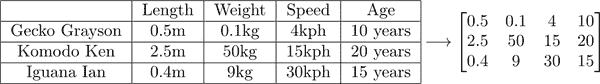

###### 图 1-1。表格和矩阵的比较

在右侧，我们有一个矩阵，例如，假设每只蜥蜴的年龄是以年为单位，Komodo Ken 体重惊人的 50 公斤！但是为什么要使用矩阵，当表格明显给用户更多信息？在线性代数甚至深度学习中，诸如乘法和加法之类的操作是在表格数据本身上进行的，但只有当数据仅以数字格式存在时，这些操作才能高效计算。

线性代数中的许多工作集中在矩阵的 emergent 属性上，当矩阵具有某些基本属性和对这些数据结构的操作时，这些属性尤其有趣。*向量*，可以看作是矩阵的一种子类型，是一个由数字组成的一维数组。这种数据结构可以用来表示一个单独的数据点或线性回归中的权重，例如。我们涵盖矩阵和向量的属性以及对两者的操作。

## 矩阵运算

矩阵可以相加、相减和相乘——矩阵没有除法，但存在一个类似的概念称为*求逆*。

在索引矩阵时，我们使用一个元组，其中第一个索引表示行号，第二个索引表示列号。要将两个矩阵 *A* 和 *B* 相加，需要循环遍历两个矩阵的每个索引 *(i,j)*，将当前索引处的两个条目相加，并将结果放在新矩阵 *C* 的相同索引 *(i,j)* 处，如图 1-2 所示。

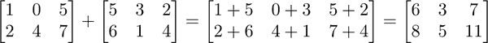

###### 图 1-2. 矩阵加法

这个算法意味着我们不能将不同形状的两个矩阵相加，因为一个矩阵中存在的索引在另一个矩阵中不存在。它还意味着最终的矩阵 *C* 与 *A* 和 *B* 的形状相同。除了相加矩阵，我们还可以将矩阵乘以一个标量。这只需要将标量乘以矩阵的每个元素（结果矩阵的形状保持不变），如图 1-3 所示。

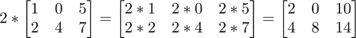

###### 图 1-3. 标量-矩阵乘法

这两个操作，矩阵相加和标量-矩阵乘法，直接导致矩阵减法，因为计算 *A* - *B* 相当于计算矩阵相加 *A* + (-*B*)，而计算 *-B* 是标量 -1 与矩阵 *B* 的乘积。

将两个矩阵相乘开始变得有趣。出于本文本文的范围之外的原因（在矩阵代表线性变换的更理论化的线性代数中的动机），我们将矩阵乘积 <math alttext="upper A dot upper B"><mrow><mi>A</mi> <mo>·</mo> <mi>B</mi></mrow></math> 定义为：

##### 方程 1-1. 矩阵乘法公式

<math alttext="left-parenthesis upper A dot upper B right-parenthesis Subscript i comma j Baseline equals sigma-summation Underscript k prime equals 1 Overscript k Endscripts upper A Subscript i comma k Sub Superscript prime Subscript Baseline upper B Subscript k prime comma j"><mrow><msub><mrow><mo>(</mo><mi>A</mi><mo>·</mo><mi>B</mi><mo>)</mo></mrow> <mrow><mi>i</mi><mo>,</mo><mi>j</mi></mrow></msub> <mo>=</mo> <munderover><mo>∑</mo> <mrow><msup><mi>k</mi> <mo>'</mo></msup> <mo>=</mo><mn>1</mn></mrow> <mi>k</mi></munderover> <msub><mi>A</mi> <mrow><mi>i</mi><mo>,</mo><msup><mi>k</mi> <mo>'</mo></msup></mrow></msub> <msub><mi>B</mi> <mrow><msup><mi>k</mi> <mo>'</mo></msup> <mo>,</mo><mi>j</mi></mrow></msub></mrow></math>

简单来说，这意味着在 <math alttext="upper A dot upper B"><mrow><mi>A</mi> <mo>·</mo> <mi>B</mi></mrow></math> 的索引 *(i,j)* 处的值是矩阵 *A* 的第 *i* 行与矩阵 *B* 的第 *j* 列的乘积之和。图 1-4 是矩阵乘法的一个例子。

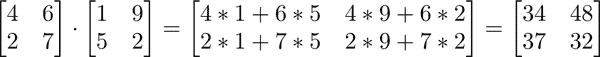

###### 图 1-4. 矩阵乘法

由此可知，*A* 的行和 *B* 的列必须具有相同的长度，因此只有当形状对齐时，两个矩阵才能相乘。我们使用术语 *维度* 正式表示我们迄今为止称之为 *形状* 的内容：即，*A* 的维度为 *m* 行 *k* 列，意味着它有 *m* 行和 *k* 列，而 *B* 的维度为 *k* 行 *n* 列。如果不是这种情况，矩阵乘法的公式将导致索引错误。乘积的维度为 *m* 行 *n* 列，表示 *A* 的每一对行和 *B* 的每一列都有一个条目。这是关于矩阵乘法的计算思维方式，不太适合理论解释。我们将方程 1-1 称为*矩阵乘法的点积解释*，在阅读完“向量运算”之后会更有意义。

请注意，矩阵乘法不是可交换的，即，<math alttext="upper A dot upper B not-equals upper B dot upper A"><mrow><mi>A</mi> <mo>·</mo> <mi>B</mi> <mo>≠</mo> <mi>B</mi> <mo>·</mo> <mi>A</mi></mrow></math>。当然，如果我们取一个 2 乘 3 的矩阵*A*和一个 3 乘 5 的矩阵*B*，根据矩阵乘法的规则，例如，<math alttext="upper B dot upper A"><mrow><mi>B</mi> <mo>·</mo> <mi>A</mi></mrow></math>不存在。然而，即使由于两个矩阵都是*方阵*，即矩阵的行数和列数相等，乘积被定义了，这两个乘积也不会相同（这是一个让你自己探索的练习）。然而，矩阵乘法是结合的，即，<math alttext="upper A dot left-parenthesis upper B plus upper C right-parenthesis equals upper A dot upper B plus upper A dot upper C"><mrow><mi>A</mi> <mo>·</mo> <mo>(</mo> <mi>B</mi> <mo>+</mo> <mi>C</mi> <mo>)</mo> <mo>=</mo> <mi>A</mi> <mo>·</mo> <mi>B</mi> <mo>+</mo> <mi>A</mi> <mo>·</mo> <mi>C</mi></mrow></math>。

让我们进一步探讨矩阵乘法。经过一些代数运算，我们可以看到另一种表达矩阵乘法的方式是：

<math alttext="left-parenthesis upper A dot upper B right-parenthesis Subscript dot comma j Baseline equals upper A dot upper B Subscript dot comma j"><mrow><msub><mrow><mo>(</mo><mi>A</mi><mo>·</mo><mi>B</mi><mo>)</mo></mrow> <mrow><mo>·</mo><mo>,</mo><mi>j</mi></mrow></msub> <mo>=</mo> <mi>A</mi> <mo>·</mo> <msub><mi>B</mi> <mrow><mo>·</mo><mo>,</mo><mi>j</mi></mrow></msub></mrow></math>

这表明乘积<math alttext="upper A dot upper B"><mrow><mi>A</mi> <mo>·</mo> <mi>B</mi></mrow></math>的第*j*列是矩阵*A*和向量*B*的第*j*列的矩阵乘积。我们将这称为*矩阵乘法的列向量解释*，如图 1-5 所示。

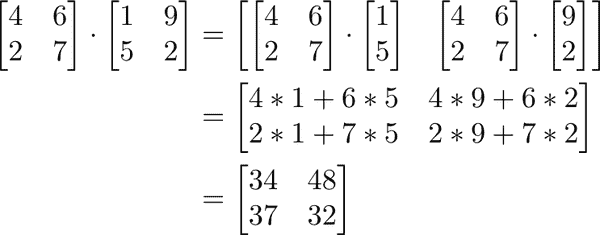

###### 图 1-5. 矩阵乘法：另一种视角

在后面的部分，我们将介绍矩阵-向量乘法以及思考这种计算的不同方式，这将导致关于矩阵更令人兴奋的性质。

线性代数中最重要的矩阵之一是*单位矩阵*，它是一个方阵，主对角线上是 1，其他位置都是 0。这个矩阵通常表示为*I*。当计算*I*与任何其他矩阵*A*的乘积时，结果总是*A*，因此得名为单位矩阵。尝试将您选择的几个矩阵与适当大小的单位矩阵相乘，看看为什么会这样。

正如本节开头所指出的，矩阵没有除法运算，但有求逆的概念。矩阵*A*的逆矩阵是矩阵*B*，使得*AB = BA = I*，即单位矩阵（类似于数字的倒数——当在等式两边除以一个数字时，我们也可以将这个操作看作是将两边乘以它的倒数）。如果这样的*B*存在，我们将其表示为<math alttext="upper A Superscript negative 1"><msup><mi>A</mi> <mrow><mo>-</mo><mn>1</mn></mrow></msup></math>。根据这个定义，我们知道*A*至少必须是一个方阵，因为我们能够将*A*在两边乘以相同的矩阵<math alttext="upper A Superscript negative 1"><msup><mi>A</mi> <mrow><mo>-</mo><mn>1</mn></mrow></msup></math>，如图 1-6 所示。矩阵求逆与我们即将讨论的矩阵的其他性质密切相关，这些性质是基本数据科学技术的基础。这些技术影响了更复杂的神经变体，研究人员至今仍在使用。

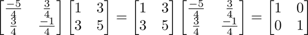

###### 图 1-6. 矩阵求逆

当尝试解方程 <math alttext="upper A x equals b"><mrow><mi>A</mi> <mi>x</mi> <mo>=</mo> <mi>b</mi></mrow></math> 时，我们会将两边左乘以 <math alttext="upper A Superscript negative 1"><msup><mi>A</mi> <mrow><mo>-</mo><mn>1</mn></mrow></msup></math> 来得到 <math alttext="x equals upper A Superscript negative 1 Baseline b"><mrow><mi>x</mi> <mo>=</mo> <msup><mi>A</mi> <mrow><mo>-</mo><mn>1</mn></mrow></msup> <mi>b</mi></mrow></math> 如果*A*是可逆的。*A*可逆还有另一个必要条件，我们稍后会讨论。

## 向量操作

向量可以看作是矩阵的一个子集，因此很多操作都遵循加法、减法、乘法和求逆的性质。然而，有一些特定于向量的术语我们应该了解。当一个向量的维度为 1×*n*时，我们称这个向量为*行向量*，当向量的维度为*n*×1 时，我们称其为*列向量*。当取行向量和列向量的矩阵乘积时，结果是一个单个数字，我们称这个操作为*点积*。图 1-7 是两个向量的点积的一个示例。

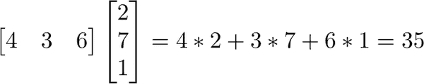

###### 图 1-7\. 点积

现在矩阵乘法的点积解释的名称可能更有意义了。回顾方程 1-1，我们看到矩阵乘积 <math alttext="left-parenthesis upper A dot upper B right-parenthesis Subscript i comma j"><msub><mrow><mo>(</mo><mi>A</mi><mo>·</mo><mi>B</mi><mo>)</mo></mrow> <mrow><mi>i</mi><mo>,</mo><mi>j</mi></mrow></msub></math> 中的每个条目只是对应行 <math alttext="upper A Subscript i comma dot"><msub><mi>A</mi> <mrow><mi>i</mi><mo>,</mo><mo>·</mo></mrow></msub></math> 和对应列 <math alttext="upper B Subscript dot comma j"><msub><mi>B</mi> <mrow><mo>·</mo><mo>,</mo><mi>j</mi></mrow></msub></math> 的点积。

当两个向量的点积为 0 时，我们称这两个向量为*正交*。正交性是垂直性在任意维度上的推广，甚至超出我们能想象的维度。例如，在二维情况下，您可以检查任意两个向量是否垂直，当且仅当它们的点积为 0 时。

当我们取列向量和行向量的矩阵乘积时，我们会发现结果竟然是一个矩阵！这被称为*外积*。图 1-8 是与点积示例中相同的两个向量的外积，只是它们作为行向量和列向量的角色已经颠倒。

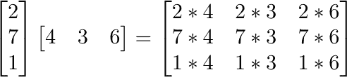

###### 图 1-8\. 外积

## 矩阵-向量乘法

当将矩阵*A*和向量*v*相乘时，我们可以再次通过矩阵乘法的点积解释来进行，如前所述。然而，如果我们稍微调整表达式，我们会发现另一种表达这个乘积的方法是：

<math alttext="upper A v equals sigma-summation Underscript j Endscripts v Subscript j Baseline upper A Subscript dot comma j"><mrow><mi>A</mi> <mi>v</mi> <mo>=</mo> <munder><mo>∑</mo> <mi>j</mi></munder> <msub><mi>v</mi> <mi>j</mi></msub> <msub><mi>A</mi> <mrow><mo>·</mo><mo>,</mo><mi>j</mi></mrow></msub></mrow></math>

每个 <math alttext="v Subscript j"><msub><mi>v</mi> <mi>j</mi></msub></math> 都是一个常数，将其与对应的*A*列相乘。图 1-9 是这种方法的一个示例。

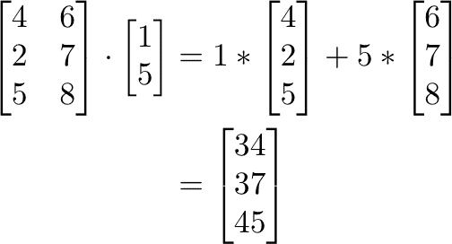

###### 图 1-9\. 矩阵-向量乘法

本节介绍了矩阵和向量操作，这些操作对于理解神经网络的内部工作至关重要。在下一节中，我们将利用我们对矩阵和向量操作的知识来明确定义一些矩阵属性，这些属性是重要的数据科学和深度学习技术的基础。

# 基本空间

在本节中，我们将正式讨论一些重要的矩阵属性，并提供一些关于深度学习中关键算法的背景知识，如表示学习。

## 列空间

考虑所有可能向量 *v* 及其乘积 <math alttext="upper A v"><mrow><mi>A</mi> <mi>v</mi></mrow></math> 的集合。我们称这个集合为 *A* 的*列空间*，或者 *C(A)*。之所以称之为列空间，是因为 *C(A)* 代表了 *A* 的所有列的所有可能线性组合，其中向量的线性组合是每个向量的常数缩放的和。对于 *A* 的每个列向量，常数缩放由 *v* 的选择确定，正如我们在前一节中所看到的。

列空间是*向量空间*的一个例子，它是由向量列表和该集合的所有可能线性组合定义的空间。从这种直觉中直接出现了形式上定义向量空间的属性。例如，如果一组向量是一个向量空间，那么通过将空间中的任何向量乘以标量得到的向量也必须在该空间中。此外，如果我们将空间中的任意两个向量相加，结果仍应在该空间中。在这两种操作中，我们开始的向量已知在向量空间中，因此可以被公式化为原始列表的线性组合。通过对所讨论的向量进行标量乘法或加法，我们只是计算线性组合的线性组合，这仍然是线性组合，正如在图 1-10 中所示。

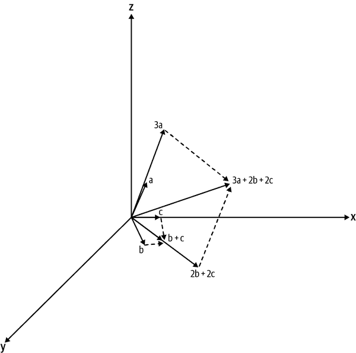

###### 图 1-10。两个线性组合 3a 和 2b + 2c 的和，仍然是原始向量 a、b 和 c 的线性组合

我们称这些向量空间的关键属性为*标量乘法封闭*和*加法封闭*。如果一组向量不满足这些属性中的任何一个，那么该集合显然不包含原始列表的所有可能线性组合，也不是一个向量空间。

你可能熟悉的一个向量空间的例子是 <math alttext="double-struck upper R cubed"><msup><mi>ℝ</mi> <mn>3</mn></msup></math> ，或者由 *x-y-z* 坐标轴定义的整个空间。之所以使用符号 <math alttext="double-struck upper R cubed"><msup><mi>ℝ</mi> <mn>3</mn></msup></math> ，是因为每个坐标可以取任意实数值，或者 <math alttext="double-struck upper R"><mi>ℝ</mi></math> ，并且有三个坐标可以唯一定义该空间中的任何向量。定义这个空间的向量集包括 (0,0,1), (0,1,0), (1,0,0)，即每个轴的单位向量。空间中的任何向量 (*a,b,c) *都可以写成 *a**(1,0,0) + *b****(0,1,0) + *c****(0,0,1) 的形式，即集合的线性组合。反过来，三个向量的任何可能线性组合都代表了在 <math alttext="double-struck upper R cubed"><msup><mi>ℝ</mi> <mn>3</mn></msup></math> 中的某个向量 (*a,b,c)*。

通常，存在矩阵*A*，其中某些列是其他列的线性组合。例如，想象一下，如果在我们的蜥蜴数据集中有一个额外的特征，表示每只蜥蜴的体重，但单位是磅。这是数据中的一个明显冗余，因为这个特征完全由千克体重的特征决定。换句话说，新特征是数据中其他特征的线性组合——只需取千克体重的列，乘以 2.2，然后将其与所有其他列乘以零相加，即可得到磅体重的列。从逻辑上讲，如果我们从*A*中去除这些冗余，那么*C(A)*不应该改变。一种方法是首先创建一个包含所有原始列向量的列表*A*，其中顺序是任意指定的。在遍历列表时，检查当前向量是否是所有在它之前的向量的线性组合。如果是，从列表中移除这个向量并继续。很明显，移除的向量没有提供除我们已经看到的信息之外的额外信息。

结果列表称为*C(A)*的*基础*，基础的长度是*C(A)*的*维度*。我们说任何向量空间的基础*跨越*该空间，这意味着向量空间中的所有元素都可以被基础向量的线性组合表示。此外，基础向量是*线性独立*的，这意味着没有一个向量可以被其他向量的线性组合表示，即没有冗余。回到我们定义向量空间的例子，(0,0,1),(0,1,0),(1,0,0)将是空间<math alttext="双划线上的 R 的立方"><msup><mi>ℝ</mi> <mn>3</mn></msup></math>的基础，因为列表中的任何向量都不是其他向量的线性组合，而且这个列表跨越整个空间。相反，列表(0,0,1),(0,1,0),(1,0,0),(2,5,1)跨越整个空间，但不是线性独立的，因为(2,5,1)可以被前三个向量的线性组合表示（我们称这样的向量列表为*跨度列表*，当然，向量空间的基础集合是相同空间的跨度列表集合的子集）。

正如我们在讨论蜥蜴数据集时所提到的，给定每个蜥蜴特征作为一列的列空间的基础是特征矩阵中所代表信息的简洁表示。在现实世界中，我们通常有成千上万个特征（例如图像中的每个像素），实现对数据的简洁表示是非常可取的。尽管这是一个良好的开始，但通常仅仅识别数据中的明显冗余是不够的，因为存在于现实世界中的随机性和复杂性往往会掩盖这些冗余。量化特征之间的关系可以为简洁的数据表示提供信息，正如我们在本章末尾和第九章中讨论的那样。

## 零空间

另一个关键的向量空间是矩阵*A*的*零空间*，或*N(A)*。这个空间包括向量*v*，使得*Av = 0*。我们知道*v = 0*，平凡解，总是满足这个性质。如果矩阵的零空间中只有平凡解，我们称之为空间平凡。然而，根据*A*的性质，或者非平凡的零空间，可能存在其他解决方案。为了使向量*v*满足*Av = 0*，*v*必须与*A*的每一行正交，如图 1-11 所示。

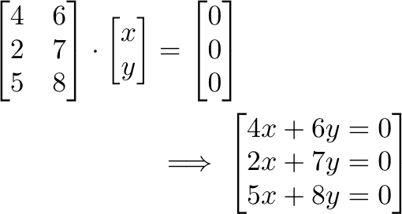

###### 图 1-11. 每行与向量 v 之间的点积必须等于 0 的含义

让我们假设*A*是一个 2 乘 3 的矩阵，例如。在我们的情况下，*A*的行不能跨越<math alttext="double-struck upper R cubed"><msup><mi>ℝ</mi> <mn>3</mn></msup></math>，因为*A*只有两行（请记住，从我们最近的讨论中知道，所有基的长度相同，所有跨度列表至少与所有基的长度相同，所以*A*的行既不可能是这两者）。在最好的情况下，*A*的行在 3D 坐标系中定义一个平面。另外两种选择是行定义一条线或一个点。前者发生在*A*有两个非零行，其中一个是另一个的倍数，或者有一行为零，一行为非零。后者发生在*A*有两行为零，换句话说，是零矩阵。

在*A*的行空间定义一个平面（或者甚至一条线）的情况下，我们只需要找到*N(A)*中的一个向量：

1.  选择任意不在*A*的行空间中的向量*v*。

1.  找到它在行空间上的投影*v'*，其中*v*的投影被定义为空间中离*v*最近的向量。从几何上讲，投影看起来好像我们从*v*的顶端垂直地向下拉了一条线，然后连接了一个从原点到空间上那一点的向量。

1.  计算*v - v'*，这是与行空间正交的向量，因此与每个行向量正交。

图 1-12 描述了这一点。

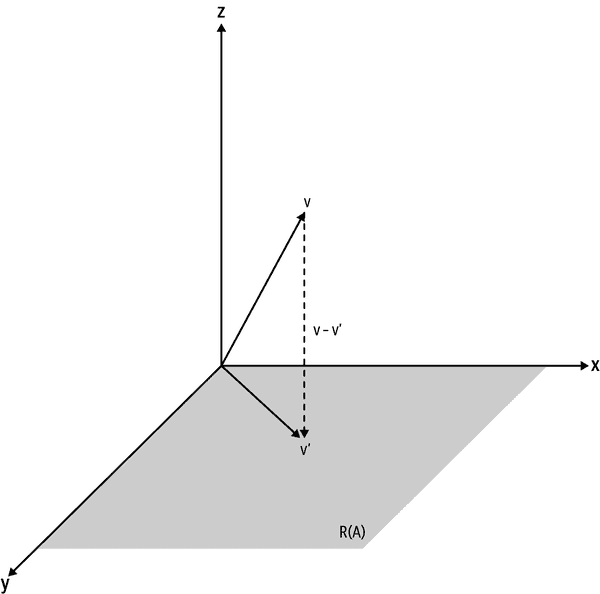

###### 图 1-12. 在 N(A)中找到一个向量

###### 注意

请注意*v - v'*与*A*的行空间*R(A)*垂直，因为*v'*是通过从其顶端垂直向下拉一条线形成的。

一个重要的结论是，当*A*的行不跨越<math alttext="double-struck upper R cubed"><msup><mi>ℝ</mi> <mn>3</mn></msup></math>时，*Av = 0*的非平凡解存在；更一般地，如果*A*是*m*乘*n*的，*Av = 0*的非平凡解存在于行向量不跨越<math alttext="double-struck upper R Superscript n"><msup><mi>ℝ</mi> <mi>n</msup></math>的情况下。这个过程与所示类似：选择一个不在行空间中的向量，找到它在行空间上的投影，然后减去以获得零空间中的一个向量。

但我们仍然必须证明*N(A)*本身是一个向量空间。我们很容易看到，*Av = 0*的任何非平凡解的线性组合仍然是一个解。例如，给定两个非平凡解<math alttext="v 1"><msub><mi>v</mi> <mn>1</mn></msub></math>和<math alttext="v 2"><msub><mi>v</mi> <mn>2</mn></math>及其线性组合<math alttext="c 1 v 1 plus c 2 v 2"><mrow><msub><mi>c</mi> <mn>1</mn></msub> <msub><mi>v</mi> <mn>1</mn></msub> <mo>+</mo> <msub><mi>c</mi> <mn>2</mn></msub> <msub><mi>v</mi> <mn>2</mn></mrow></math>，其中<math alttext="c 1"><msub><mi>c</mi> <mn>1</mn></math>和<math alttext="c 2"><msub><mi>c</mi> <mn>2</mn></math>是常数，我们看到：

<math alttext="StartLayout 1st Row  upper A left-parenthesis c 1 v 1 plus c 2 v 2 right-parenthesis 2nd Row  equals upper A left-parenthesis c 1 v 1 right-parenthesis plus upper A left-parenthesis c 2 v 2 right-parenthesis 3rd Row  equals c 1 upper A v 1 plus c 2 upper A v 2 4th Row  equals c 1 asterisk 0 plus c 2 asterisk 0 5th Row  equals 0 EndLayout" display="block"><mtable displaystyle="true"><mtr><mtd columnalign="right"><mrow><mi>A</mi> <mo>(</mo> <msub><mi>c</mi> <mn>1</mn></msub> <msub><mi>v</mi> <mn>1</mn></msub> <mo>+</mo> <msub><mi>c</mi> <mn>2</mn></msub> <msub><mi>v</mi> <mn>2</mn></msub> <mo>)</mo></mrow></mtd></mtr> <mtr><mtd columnalign="right"><mrow><mo>=</mo> <mi>A</mi> <mrow><mo>(</mo> <msub><mi>c</mi> <mn>1</mn></msub> <msub><mi>v</mi> <mn>1</mn></msub> <mo>)</mo></mrow> <mo>+</mo> <mi>A</mi> <mrow><mo>(</mo> <msub><mi>c</mi> <mn>2</mn></msub> <msub><mi>v</mi> <mn>2</mn></msub> <mo>)</mo></mrow></mrow></mtd></mtr> <mtr><mtd columnalign="right"><mrow><mo>=</mo> <msub><mi>c</mi> <mn>1</mn></msub> <mi>A</mi> <msub><mi>v</mi> <mn>1</mn></msub> <mo>+</mo> <msub><mi>c</mi> <mn>2</mn></msub> <mi>A</mi> <msub><mi>v</mi> <mn>2</mn></msub></mrow></mtd></mtr> <mtr><mtd columnalign="right"><mrow><mo>=</mo> <msub><mi>c</mi> <mn>1</mn></msub> <mo>*</mo> <mn>0</mn> <mo>+</mo> <msub><mi>c</mi> <mn>2</mn></msub> <mo>*</mo> <mn>0</mn></mrow></mtd></mtr> <mtr><mtd columnalign="right"><mrow><mo>=</mo> <mn>0</mn></mrow></mtd></mtr></mtable></math>

第一个等式来自矩阵乘法的结合律，第二个等式来自<math alttext="c 1"><msub><mi>c</mi> <mn>1</mn></msub></math>和<math alttext="c 2"><msub><mi>c</mi> <mn>2</mn></msub></math>是常数的事实。请注意，这种逻辑可以用于任意数量的非平凡解，而不仅仅是两个。因此，零空间由一些向量的集合定义，可以归结为一组基，并包含这些向量的所有可能线性组合。这些特征使零空间成为一个向量空间。

这与我们介绍的关键矩阵运算之一，*矩阵逆*密切相关。我们可以将矩阵的逆想象为撤销矩阵对任何其他实体的作用。例如，如果我们计算*Av*并在左侧乘以<math alttext="上 A 上标负 1"><msup><mi>A</mi> <mrow><mo>-</mo><mn>1</mn></mrow></msup></math>，我们应该得到我们的初始*v。*然而，根据*A*的属性，可能存在关于如何“撤销”其作用的歧义。例如，假设*v*是某个非零向量，但由于某种原因，*Av = 0*。如果我们在左侧乘以<math alttext="上 A 上标负 1"><msup><mi>A</mi> <mrow><mo>-</mo><mn>1</mn></mrow></msup></math>，我们将得到*v = 0*而不是我们的初始*v。*不幸的是，这违反了逆的属性，我们宣布这样的矩阵是不可逆的，或*奇异*的。但为什么会发生这种情况呢？这归结于我们对歧义的观察。因为逆应该撤销矩阵的作用，如果有多个初始向量通过矩阵的作用映射到相同的向量，尝试撤销这种作用是不可能的。回到我们的例子，我们知道当*A*具有非平凡零空间时，非零向量被映射到 0。因此，任何具有非平凡零空间的矩阵也是奇异的。

接下来，我们将涵盖特征向量和特征值，将迄今为止学到的所有信息付诸实践。

# 特征向量和特征值

矩阵可以以许多不同的方式作用于向量。对于大多数矩阵和向量的组合，绘制向量及其变换并不会给我们提供任何有趣的模式。然而，对于某些矩阵和特定的向量，矩阵对向量的作用给我们提供了一个信息丰富且令人惊讶的结果：变换是原始向量的标量倍数。我们称这些向量为*特征向量*，标量倍数为其对应的*特征值*。在本节中，我们讨论这些非常特殊的向量，与之前提出的材料相关，并开始讨论将线性代数理论与数据科学实践联系起来。

更正式地说，对于矩阵*A*，特征向量是一个非零向量*v*，使得*Av = cv*，其中*c*是某个常数（包括零，可能），如图 1-13 所示。

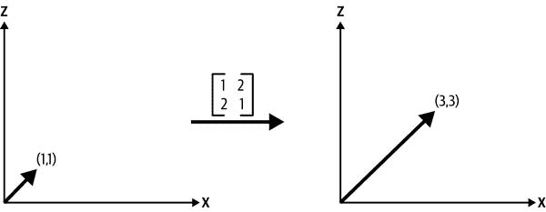

###### 图 1-13。向量(1,1)是我们矩阵的特征向量，对应的特征值为 3

###### 注

请注意，如果我们选择任意随机向量，例如(2,5)，变换看起来不像在图 1-13 中那样有意义。

当然，如果*A*是一个矩形矩阵，它不可能有任何特征向量。原始向量及其变换具有不同的大小，因此变换不能是原始向量的标量倍数。因此，出于这个原因，我们在本节中将讨论限制在方阵上。

最简单的例子是单位矩阵。单位矩阵的每个非零向量都是特征向量，因为*Iv = v*对于所有*v*都成立，每个向量都有一个特征值为 1。然而，通常情况下，矩阵的特征向量不会那么明显。我们如何找到这些向量及其对应的特征值呢？我们知道任何潜在特征向量的条件；也就是说，如果*v*是一个特征向量，它必须满足*Av = cv*，其中*c*是某个标量。

<math alttext="upper A v equals c v long left right double arrow upper A v minus c v equals 0 long left right double arrow left-parenthesis upper A minus c upper I right-parenthesis v equals 0"><mrow><mi>A</mi> <mi>v</mi> <mo>=</mo> <mi>c</mi> <mi>v</mi> <mo>⇔</mo> <mi>A</mi> <mi>v</mi> <mo>-</mo> <mi>c</mi> <mi>v</mi> <mo>=</mo> <mn>0</mn> <mo>⇔</mo> <mo>(</mo> <mi>A</mi> <mo>-</mo> <mi>c</mi> <mi>I</mi> <mo>)</mo> <mi>v</mi> <mo>=</mo> <mn>0</mn></mrow></math>

这里的含义是，如果*Av = cv*，那么*A - cI*必须有一个非平凡的零空间。另一方面，如果我们找到一个*c*，使得*A - cI*有一个非平凡的零空间，那么零空间中的非零向量就是*A*的特征向量。当然，如果*A*本身有一个非平凡的零空间，那么当*c*为 0 时，零空间中的所有非零*v*都满足上述含义。然而，更一般地，我们必须找到一个*c*，使得*A - cI*有一个非平凡的零空间。正如之前所建立的，检查非平凡的零空间等同于测试矩阵是否奇异。出于本文范围之外的原因，检查*<math alttext="upper A minus c upper I"><mrow><mi>A</mi> <mo>-</mo> <mi>c</mi> <mi>I</mi></mrow></math>*是否为奇异矩阵的一种方法是检查其行列式是否为 0。我们不会在这里深入讨论，但我们可以将行列式视为一个函数或多项式，它编码矩阵的属性，并在矩阵奇异时产生值为 0。

然而，对于我们来说测试每个可能的零行列式的*c*是低效的，而且实际上是不可能的。我们可以将*c*视为方程中的一个变量，通过*特征多项式*解出它，这是矩阵*A - cI*的行列式设置为 0。这个多项式的根给出了*A*的特征值。要找到它们对应的特征向量，我们可以将每个*c*的解代入*A - cI*，然后解出使*(A - cI)v* = 0 的*v*。

###### 注意

对于任何合理大小的矩阵计算行列式在计算成本方面是相当禁止的。虽然我们不会进一步深入讨论，但今天的算法使用 QR 算法的一个版本（以 QR 矩阵分解命名）来计算矩阵的特征值。如果您想了解更多关于这些和类似算法的信息，我们强烈推荐阅读关于数值线性代数的讲座笔记或书籍。

我们对特征值和特征向量的研究如何与数据科学相联系？主成分分析（PCA）是数据科学中最著名的算法之一，它使用一个称为相关矩阵的特殊矩阵的特征向量和特征值，该矩阵代表了前面提到的特征之间的可量化关系，以在原始数据矩阵上执行降维。我们将在下一章讨论概率中讨论相关和相关概念，并在第八章中了解更多关于 PCA 的内容。

# 总结

在本章中，我们研究了应用线性代数的一些基础知识。我们了解了统治应用线性代数和深度学习的关键数据结构和操作，以及查看这些基本操作的不同方式。例如，我们了解到矩阵乘法的点积视图在计算角度上很重要，而列向量方法自然地引导我们进入对基本空间的讨论。我们还一窥了矩阵的一些令人惊讶的隐藏属性，如特征值和特征向量，以及这些属性如何广泛应用于数据科学，甚至至今。在下一章中，我们将学习概率领域，这经常与线性代数一起用于构建世界中使用的复杂神经模型。
