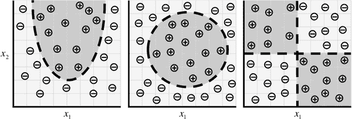

# 第三章：神经网络

# 构建智能机器

大脑是人体中最不可思议的器官。它决定了我们感知每一处景象、声音、气味、味道和触感的方式。它使我们能够存储记忆，体验情感，甚至做梦。没有它，我们将是原始生物，除了最简单的反射动作外一无所能。大脑本质上是使我们聪明的东西。

婴儿的大脑只有一磅重，但它以某种方式解决了即使是我们最大、最强大的超级计算机也无法解决的问题。出生几个月后，婴儿就能认出父母的脸，从背景中辨别出离散的物体，甚至分辨声音。一年后，他们已经对自然物理有了直觉，可以追踪物体，即使它们被部分或完全遮挡，也可以将声音与特定含义联系起来。到了幼儿时期，他们已经对语法有了复杂的理解，词汇量中有数千个单词。¹

几十年来，我们梦想着建造像我们一样拥有大脑的智能机器——用于清洁我们家的机器人助手，能自动驾驶的汽车，能自动检测疾病的显微镜。但要建造这些人工智能机器，我们必须解决一些我们曾经面对过的最复杂的计算问题；这些问题我们的大脑已经可以在几微秒内解决。为了解决这些问题，我们将不得不开发一种完全不同的编程计算机的方式，这种方式在过去十年中得到了广泛发展。这是一个极其活跃的人工计算机智能领域，通常被称为*深度学习*。

# 传统计算机程序的限制

为什么对计算机来说某些问题如此难以解决？事实证明，传统计算机程序设计得非常擅长两件事：(1) 非常快速地执行算术运算和(2) 明确遵循一系列指令。所以如果你想进行一些繁重的财务数字计算，你很幸运。传统计算机程序可以胜任。但假设我们想做一些稍微有趣的事情，比如编写一个自动识别别人手写的程序。图 3-1 将作为一个起点。

###### 图 3-1. 来自 MNIST 手写数字数据集的图像²

尽管图 3-1 中的每个数字写法略有不同，但我们可以轻松识别第一行中的每个数字为零，第二行中的每个数字为一，依此类推。让我们尝试编写一个计算机程序来完成这个任务。我们可以使用什么规则来区分一个数字和另一个数字？

好吧，我们可以从简单的开始！例如，我们可以说如果我们的图像只有一个封闭的循环，那么我们就有一个零。在图 3-1 中的所有示例似乎符合这个条件，但这并不是一个充分的条件。如果有人没有完全封闭零的循环怎么办？而且，如图 3-2 中所示，如何区分一个凌乱的零和一个六？

###### 图 3-2. 一个算法上难以区分零和六的零

你可能可以建立某种循环起点和终点之间距离的截止点，但我们不确定应该在哪里划定界线。但这个困境只是我们担忧的开始。我们如何区分三和五？或者四和九之间的区别？我们可以通过仔细观察和数月的试错来添加更多规则或*特征*，但很明显这不会是一个容易的过程。

许多其他类别的问题也属于这一类：物体识别，语音理解，自动翻译等。我们不知道要写什么程序，因为我们不知道我们的大脑是如何做的。即使我们知道如何做，程序可能会非常复杂。

# 机器学习的机制

为了解决这些问题类别，我们将不得不采用一种不同的方法。我们在学校学到的很多东西与传统的计算机程序有很多共同之处。我们学会如何相乘，解方程，通过内化一组指令来求导数。但我们在极早期学到的东西，我们认为最自然的东西，是通过示例学习的，而不是通过公式。

例如，当我们两岁时，我们的父母没有教我们通过测量狗的鼻子形状或身体轮廓来认识狗。我们通过展示多个示例并在猜错时得到纠正来学会认识狗。当我们出生时，我们的大脑为我们提供了一个描述我们如何看世界的模型。随着我们长大，该模型会接收我们的感官输入并猜测我们正在经历什么。如果父母确认了这个猜测，我们的模型就会得到强化。如果父母说我们错了，我们会修改我们的模型以纳入这个新信息。随着时间的推移，随着我们吸收更多的示例，我们的模型变得越来越准确。显然，所有这些都是在潜意识中发生的，但我们可以利用这一点。

深度学习是人工智能更一般领域机器学习的一个子集，其基于从示例中学习的这一想法。在机器学习中，我们不是教计算机解决问题的大量规则，而是给它一个模型，通过这个模型它可以评估示例，并给出一小组指令来在犯错误时修改模型。我们期望随着时间的推移，一个合适的模型将能够极其准确地解决问题。

让我们对这意思更加严谨，这样我们就可以用数学的方式来表达这个想法。让我们定义我们的模型为一个函数 h(𝐱,θ)。输入 x 是以向量形式表示的示例。例如，如果 x 是一个灰度图像，向量的分量将是每个位置的像素强度，如图 3-3 所示。

###### 图 3-3。将图像向量化为机器学习算法的过程

输入θ是我们模型使用的参数的向量。随着暴露于越来越多的示例，我们的机器学习程序试图完善这些参数的值。我们将在第四章中看到这一点，并更详细地了解。

为了更直观地理解机器学习模型，让我们通过一个快速示例来走一遍。假设我们想确定如何根据我们睡眠时间和前一天学习时间来预测考试表现。我们收集了大量数据，对于每个数据点 <math alttext="bold x equals Start 1 By 2 Matrix 1st Row 1st Column x 1 2nd Column x 2 EndMatrix Superscript upper T"><mrow><mi>𝐱</mi> <mo>=</mo> <msup><mfenced open="[" close="]"><mtable><mtr><mtd><msub><mi>x</mi> <mn>1</mn></msub></mtd> <mtd><msub><mi>x</mi> <mn>2</mn></msub></mtd></mtr></mtable></mfenced> <mi>T</mi></msup></mrow></math>，我们记录了我们的睡眠时间（ <math alttext="x 1"><msub><mi>x</mi> <mn>1</mn></msub></math> ），我们学习的时间（ <math alttext="x 2"><msub><mi>x</mi> <mn>2</mn></msub></math> ），以及我们是否表现高于或低于班级平均水平。因此，我们的目标可能是学习一个带有参数向量 <math alttext="theta equals Start 1 By 3 Matrix 1st Row 1st Column theta 0 2nd Column theta 1 3rd Column theta 2 EndMatrix Superscript upper T"><mrow><mi>θ</mi> <mo>=</mo> <msup><mfenced open="[" close="]"><mtable><mtr><mtd><msub><mi>θ</mi> <mn>0</mn></msub></mtd> <mtd><msub><mi>θ</mi> <mn>1</mn></msub></mtd> <mtd><msub><mi>θ</mi> <mn>2</mn></msub></mtd></mtr></mtable></mfenced> <mi>T</mi></msup></mrow></math> 的模型 <math alttext="h left-parenthesis bold x comma theta right-parenthesis"><mrow><mi>h</mi> <mo>(</mo> <mi>𝐱</mi> <mo>,</mo> <mi>θ</mi> <mo>)</mo></mrow></math>，使得：

<math alttext="h left-parenthesis bold x comma theta right-parenthesis equals StartLayout Enlarged left-brace 1st Row 1st Column negative 1 2nd Column if bold x Superscript upper T Baseline dot StartBinomialOrMatrix theta 1 Choose theta 2 EndBinomialOrMatrix plus theta 0 less-than 0 2nd Row 1st Column 1 2nd Column if bold x Superscript upper T Baseline dot StartBinomialOrMatrix theta 1 Choose theta 2 EndBinomialOrMatrix plus theta 0 greater-than-or-equal-to 0 EndLayout"><mrow><mi>h</mi> <mrow><mo>(</mo> <mi>𝐱</mi> <mo>,</mo> <mi>θ</mi> <mo>)</mo></mrow> <mo>=</mo> <mfenced separators="" open="{" close=""><mtable><mtr><mtd columnalign="left"><mrow><mo>-</mo> <mn>1</mn></mrow></mtd> <mtd columnalign="left"><mrow><mtext>if</mtext> <mrow><msup><mi>𝐱</mi> <mi>T</mi></msup> <mo>·</mo> <mfenced open="[" close="]"><mtable><mtr><mtd><msub><mi>θ</mi> <mn>1</mn></msub></mtd></mtr> <mtr><mtd><msub><mi>θ</mi> <mn>2</mn></msub></mtd></mtr></mtable></mfenced> <mo>+</mo> <msub><mi>θ</mi> <mn>0</mn></msub> <mo><</mo> <mn>0</mn></mrow></mrow></mtd></mtr> <mtr><mtd columnalign="left"><mn>1</mn></mtd> <mtd columnalign="left"><mrow><mtext>if</mtext> <mrow><msup><mi>𝐱</mi> <mi>T</mi></msup> <mo>·</mo> <mfenced open="[" close="]"><mtable><mtr><mtd><msub><mi>θ</mi> <mn>1</mn></msub></mtd></mtr> <mtr><mtd><msub><mi>θ</mi> <mn>2</mn></msub></mtd></mtr></mtable></mfenced> <mo>+</mo> <msub><mi>θ</mi> <mn>0</mn></msub> <mo>≥</mo> <mn>0</mn></mrow></mrow></mtd></mtr></mtable></mfenced></mrow></math>

因此，我们猜想我们模型的蓝图 <math alttext="h left-parenthesis bold x comma theta right-parenthesis"><mrow><mi>h</mi> <mo>(</mo> <mi>𝐱</mi> <mo>,</mo> <mi>θ</mi> <mo>)</mo></mrow></math> 如上所述（从几何上讲，这个特定的蓝图描述了一个将坐标平面分成两半的线性分类器）。然后，我们想学习一个参数向量 <math alttext="theta"><mi>θ</mi></math>，使得我们的模型在给定输入示例 **x** 时做出正确的预测（如果我们表现低于平均水平，则为-1，否则为 1）。这个模型被称为线性*感知器*，自上世纪 50 年代以来一直被使用。让我们假设我们的数据如图 3-4 所示。

###### 图 3-4。我们考试预测算法和潜在分类器的样本数据

然后发现，通过选择 <math alttext="theta equals Start 1 By 3 Matrix 1st Row 1st Column negative 24 2nd Column 3 3rd Column 4 EndMatrix Superscript upper T"><mrow><mi>θ</mi> <mo>=</mo> <msup><mfenced open="[" close="]"><mtable><mtr><mtd><mrow><mo>-</mo><mn>24</mn></mrow></mtd><mtd><mn>3</mn></mtd><mtd><mn>4</mn></mtd></mtr></mtable></mfenced> <mi>T</mi></msup></mrow></math>，我们的机器学习模型对每个数据点都做出了正确的预测：

<math alttext="h left-parenthesis bold x comma theta right-parenthesis equals StartLayout Enlarged left-brace 1st Row 1st Column negative 1 2nd Column if 3 x 1 plus 4 x 2 minus 24 less-than 0 2nd Row 1st Column 1 2nd Column if 3 x 1 plus 4 x 2 minus 24 greater-than-or-equal-to 0 EndLayout"><mrow><mi>h</mi> <mrow><mo>(</mo> <mi>𝐱</mi> <mo>,</mo> <mi>θ</mi> <mo>)</mo></mrow> <mo>=</mo> <mfenced separators="" open="{" close=""><mtable><mtr><mtd columnalign="left"><mrow><mo>-</mo> <mn>1</mn></mrow></mtd> <mtd columnalign="left"><mrow><mtext>if</mtext> <mrow><mn>3</mn> <msub><mi>x</mi> <mn>1</mn></msub> <mo>+</mo> <mn>4</mn> <msub><mi>x</mi> <mn>2</mn></msub> <mo>-</mo> <mn>24</mn> <mo><</mo> <mn>0</mn></mrow></mrow></mtd></mtr> <mtr><mtd columnalign="left"><mn>1</mn></mtd> <mtd columnalign="left"><mrow><mtext>if</mtext> <mrow><mn>3</mn> <msub><mi>x</mi> <mn>1</mn></msub> <mo>+</mo> <mn>4</mn> <msub><mi>x</mi> <mn>2</mn></msub> <mo>-</mo> <mn>24</mn> <mo>≥</mo> <mn>0</mn></mrow></mrow></mtd></mtr></mtable></mfenced></mrow></math>

一个最佳参数向量 <math alttext="theta"><mi>θ</mi></math> 使分类器定位，以便我们尽可能多地做出正确预测。在大多数情况下，有许多（甚至无限多）可能的最佳选择 <math alttext="theta"><mi>θ</mi></math>。幸运的是，大多数情况下，这些替代方案之间的差异是微不足道的。如果不是这种情况，我们可能需要收集更多数据来缩小我们对 <math alttext="theta"><mi>θ</mi></math> 的选择。

虽然设置看起来合理，但仍然存在一些相当重要的问题。首先，我们如何找到参数向量<math alttext="theta"><mi>θ</mi></math>的最优值？解决这个问题需要一种常用的技术，称为*优化*。优化器旨在通过迭代调整其参数，直到误差最小化，从而最大化机器学习模型的性能。我们将在第四章中更详细地讨论学习参数向量的问题，当我们描述*梯度下降*过程时。在后面的章节中，我们将尝试找到使这个过程更加高效的方法。

其次，很明显，这个特定模型（线性感知器模型）在学习关系方面是相当有限的。例如，图 3-5 中显示的数据分布无法很好地被线性感知器描述。

###### 图 3-5。随着我们的数据呈现更复杂的形式，我们需要更复杂的模型来描述它们

但这些情况只是冰山一角。随着我们转向更复杂的问题，如物体识别和文本分析，我们的数据变得极高维，我们想要捕捉的关系变得高度非线性。为了适应这种复杂性，最近机器学习领域的研究尝试构建类似于我们大脑所利用的结构的模型。这基本上是一系列研究，通常被称为*深度学习*，在解决计算机视觉和自然语言处理问题方面取得了惊人的成功。这些算法不仅远远超过其他类型的机器学习算法，而且与人类达到的准确度相媲美（甚至超过）。

# 神经元

人类大脑的基本单位是神经元。大脑中一个微小的部分，大约是一粒米的大小，包含超过 10,000 个神经元，每个神经元平均与其他神经元形成 6,000 个连接。正是这个庞大的生物网络使我们能够体验周围的世界。我们在本节的目标是利用这种自然结构来构建解决类似问题的机器学习模型。

在其核心，神经元被优化为接收来自其他神经元的信息，以独特的方式处理这些信息，并将其结果发送给其他细胞。这个过程在图 3-6 中进行了总结。神经元沿着类似触角的结构称为*树突*接收其输入。每个传入连接根据使用频率动态加强或减弱（这就是我们学习新概念的方式），而每个连接的强度决定了输入对神经元输出的贡献。在根据各自连接的强度加权后，输入在*细胞体*中相加。然后，这个总和被转化为一个新信号，沿着细胞的*轴突*传播，并发送给其他神经元。

###### 图 3-6。生物神经元结构的功能描述

我们可以将我们对大脑中神经元的功能理解转化为我们可以在计算机上表示的人工模型。这样的模型在图 3-7 中描述，利用了 1943 年 Warren S. McCulloch 和 Walter H. Pitts 首次开创的方法。就像生物神经元一样，我们的人工神经元接受一些输入，<math alttext="x 1 comma x 2 comma ellipsis comma x Subscript n Baseline"><mrow><msub><mi>x</mi> <mn>1</mn></msub> <mo>,</mo> <msub><mi>x</mi> <mn>2</mn></msub> <mo>,</mo> <mo>...</mo> <mo>,</mo> <msub><mi>x</mi> <mi>n</mi></msub></mrow></math>，每个输入都乘以特定的权重，<math alttext="w 1 comma w 2 comma ellipsis comma w Subscript n Baseline"><mrow><msub><mi>w</mi> <mn>1</mn></msub> <mo>,</mo> <msub><mi>w</mi> <mn>2</mn></msub> <mo>,</mo> <mo>...</mo> <mo>,</mo> <msub><mi>w</mi> <mi>n</mi></msub></mrow></math>。这些加权输入像以前一样相加，产生神经元的对数几率，<math alttext="z equals sigma-summation Underscript i equals 0 Overscript n Endscripts w Subscript i Baseline x Subscript i"><mrow><mi>z</mi> <mo>=</mo> <msubsup><mo>∑</mo> <mrow><mi>i</mi><mo>=</mo><mn>0</mn></mrow> <mi>n</mi></msubsup> <msub><mi>w</mi> <mi>i</mi></msub> <msub><mi>x</mi> <mi>i</mi></msub></mrow></math>。在许多情况下，对数几率还包括一个偏置，这是一个常数（图中未显示）。然后将对数几率通过函数<math alttext="f"><mi>f</mi></math>传递，产生输出<math alttext="y equals f left-parenthesis z right-parenthesis"><mrow><mi>y</mi> <mo>=</mo> <mi>f</mi> <mo>(</mo> <mi>z</mi> <mo>)</mo></mrow></math>。这个输出可以传递给其他神经元。

###### 图 3-7. 人工神经网络中的神经元示意图

我们将通过将其功能重新表达为向量形式来结束我们对人工神经元的数学讨论。让我们将输入重新表述为一个向量**x** = [x[1] x[2] … x[n]]，神经元的权重为**w** = [w[1] w[2] … w[n]]。然后我们可以将神经元的输出重新表达为 <math alttext="y equals f left-parenthesis bold x dot bold w plus b right-parenthesis"><mrow><mi>y</mi> <mo>=</mo> <mi>f</mi> <mfenced separators="" open="(" close=")"><mi>𝐱</mi> <mo>·</mo> <mi>𝐰</mi> <mo>+</mo> <mi>b</mi></mfenced></mrow></math>，其中<math alttext="b"><mi>b</mi></math>是偏置项。我们可以通过执行输入和权重向量的点积，加上偏置项产生对数几率，然后应用变换函数来计算输出。虽然这看起来像是一个微不足道的重新表述，但将神经元视为一系列向量操作对我们后面在本书中如何实现它们的软件将至关重要。

# 将线性感知器表达为神经元

在“机器学习的机制”中，我们谈到使用机器学习模型来捕捉考试成绩与学习和睡眠时间之间的关系。为了解决这个问题，我们构建了一个线性感知器分类器，将笛卡尔坐标平面分成两半：

<math alttext="h left-parenthesis bold x comma theta right-parenthesis equals StartLayout Enlarged left-brace 1st Row 1st Column negative 1 2nd Column if 3 x 1 plus 4 x 2 minus 24 less-than 0 2nd Row 1st Column 1 2nd Column if 3 x 1 plus 4 x 2 minus 24 greater-than-or-equal-to 0 EndLayout"><mrow><mi>h</mi> <mrow><mo>(</mo> <mi>𝐱</mi> <mo>,</mo> <mi>θ</mi> <mo>)</mo></mrow> <mo>=</mo> <mfenced separators="" open="{" close=""><mtable><mtr><mtd columnalign="left"><mrow><mo>-</mo> <mn>1</mn></mrow></mtd> <mtd columnalign="left"><mrow><mtext>if</mtext> <mrow><mn>3</mn> <msub><mi>x</mi> <mn>1</mn></msub> <mo>+</mo> <mn>4</mn> <msub><mi>x</mi> <mn>2</mn></msub> <mo>-</mo> <mn>24</mn> <mo><</mo> <mn>0</mn></mrow></mrow></mtd></mtr> <mtr><mtd columnalign="left"><mn>1</mn></mtd> <mtd columnalign="left"><mrow><mtext>if</mtext> <mrow><mn>3</mn> <msub><mi>x</mi> <mn>1</mn></msub> <mo>+</mo> <mn>4</mn> <msub><mi>x</mi> <mn>2</mn></msub> <mo>-</mo> <mn>24</mn> <mo>≥</mo> <mn>0</mn></mrow></mrow></mtd></mtr></mtable></mfenced></mrow></math>

正如图 3-4 所示，这是一个对θ的最佳选择，因为它正确分类了我们数据集中的每个样本。在这里，我们展示了我们的模型*h*如何轻松使用一个神经元。考虑图 3-8 中所示的神经元。这个神经元有两个输入，一个偏置，并使用函数： 

<math alttext="f left-parenthesis z right-parenthesis equals StartLayout Enlarged left-brace 1st Row 1st Column negative 1 2nd Column if z less-than 0 2nd Row 1st Column 1 2nd Column if z greater-than-or-equal-to 0 EndLayout"><mrow><mi>f</mi> <mrow><mo>(</mo> <mi>z</mi> <mo>)</mo></mrow> <mo>=</mo> <mfenced separators="" open="{" close=""><mtable><mtr><mtd columnalign="left"><mrow><mo>-</mo> <mn>1</mn></mrow></mtd> <mtd columnalign="left"><mrow><mtext>if</mtext> <mrow><mi>z</mi> <mo><</mo> <mn>0</mn></mrow></mrow></mtd></mtr> <mtr><mtd columnalign="left"><mn>1</mn></mtd> <mtd columnalign="left"><mrow><mtext>if</mtext> <mrow><mi>z</mi> <mo>≥</mo> <mn>0</mn></mrow></mrow></mtd></mtr></mtable></mfenced></mrow></math>

很容易证明我们的线性感知器和神经元模型是完全等价的。而且一般来说，很容易证明单个神经元比线性感知器更具表现力。每个线性感知器都可以表示为一个单个神经元，但单个神经元也可以表示出任何线性感知器无法表示的模型。

###### 图 3-8. 将我们的考试表现感知器表示为一个神经元

# 前馈神经网络

虽然单个神经元比线性感知器更强大，但它们远不足以解决复杂的学习问题。我们的大脑由多个神经元组成是有原因的。例如，单个神经元无法区分手写数字。因此，为了解决更复杂的任务，我们将不得不进一步发展我们的机器学习模型。

人类大脑中的神经元是按层组织的。事实上，人类大脑皮层（负责大部分人类智力的结构）由六层组成。信息从一层流向另一层，直到感官输入转化为概念理解。例如，视觉皮层的最底层接收来自眼睛的原始视觉数据。这些信息由每一层处理并传递到下一层，直到在第六层，我们得出结论我们是在看猫，还是苏打罐，还是飞机。

借鉴这些概念，我们可以构建一个*人工神经网络*。当我们开始将神经元连接到彼此、输入数据和输出节点时，神经网络就产生了，这些输出节点对应于学习问题的网络答案。图 3-9 展示了一个人工神经网络的简单示例，类似于 1943 年 McCulloch 和 Pitt 的工作中描述的架构。

###### 图 3-9. 一个具有三层（输入层、一个隐藏层和输出层）和每层三个神经元的前馈神经网络

网络的底层接收输入数据。神经元的顶层（输出节点）计算我们的最终答案。神经元的中间层被称为*隐藏层*，我们让<math alttext="w 下标 i 逗号 j 上标左括号 k 右括号"><msubsup><mi>w</mi> <mrow><mi>i</mi><mo>,</mo><mi>j</mi></mrow> <mrow><mo>(</mo><mi>k</mi><mo>)</mo></mrow></msubsup></math>是第 k 层中第 i 个神经元与第 k+1 层中第 j 个神经元之间连接的权重。这些权重构成我们的参数向量<math alttext="θ"><mi>θ</mi></math>，就像以前一样，我们解决神经网络问题的能力取决于找到最佳值插入<math alttext="θ"><mi>θ</mi></math>。

我们注意到，在这个例子中，连接仅从一个较低层到一个较高层。同一层中的神经元之间没有连接，也没有从较高层传输数据到较低层的连接。这些神经网络被称为*前馈*网络，我们首先讨论这些网络，因为它们是最简单的分析。我们在第四章中介绍了这种分析（具体来说，选择权重的最佳值的过程）。更复杂的连接将在后续章节中讨论。

我们将讨论在前馈神经网络中使用的主要类型的层，但在我们继续之前，这里有一些重要的注意事项需要记住：

1.  正如我们提到的，位于第一层神经元（输入层）和最后一层神经元（输出层）之间的神经元层被称为隐藏层。这是神经网络尝试解决问题时发生大部分魔法的地方。与以前需要花费大量时间识别有用特征（如手写数字示例）不同，隐藏层为我们自动化了这个过程。通常情况下，查看隐藏层的活动可以告诉您很多关于网络自动学习从数据中提取的特征。

1.  尽管在图 3-9 中每一层都有相同数量的神经元，但这既不是必要的也不推荐。通常情况下，隐藏层的神经元数量比输入层少，以强制网络学习原始输入的压缩表示。例如，虽然我们的眼睛从周围获取原始像素值，但我们的大脑却以边缘和轮廓的形式思考。这是因为我们大脑中的隐藏层生物神经元迫使我们为我们所感知的一切提出更好的表示。

1.  并不要求每个神经元的输出都连接到下一层所有神经元的输入。事实上，选择连接到下一层哪些神经元的哪些其他神经元是一门来自经验的艺术。随着我们逐步讨论各种神经网络示例，我们将更深入地讨论这个问题。

1.  输入和输出是*向量化*表示。例如，您可以想象一个神经网络，其中输入是图像中表示为向量的单个像素 RGB 值（参见图 3-3）。最后一层可能有两个神经元，对应于我们问题的答案：<math alttext="left-bracket 1 comma 0 right-bracket"><mrow><mo>[</mo> <mn>1</mn> <mo>,</mo> <mn>0</mn> <mo>]</mo></mrow></math> 如果图像包含狗，<math alttext="left-bracket 0 comma 1 right-bracket"><mrow><mo>[</mo> <mn>0</mn> <mo>,</mo> <mn>1</mn> <mo>]</mo></mrow></math> 如果图像包含猫，<math alttext="left-bracket 1 comma 1 right-bracket"><mrow><mo>[</mo> <mn>1</mn> <mo>,</mo> <mn>1</mn> <mo>]</mo></mrow></math> 如果两者都包含，<math alttext="left-bracket 0 comma 0 right-bracket"><mrow><mo>[</mo> <mn>0</mn> <mo>,</mo> <mn>0</mn> <mo>]</mo></mrow></math> 如果两者都不包含。

我们还将观察到，类似于我们对神经元的重新表述，我们也可以将神经网络数学表达为一系列向量和矩阵运算。让我们将网络的第<math alttext="i Superscript t h"><msup><mi>i</mi> <mrow><mi>t</mi><mi>h</mi></mrow></msup></math>层的输入视为向量**x** = [x[1] x[2] … x[n]]。我们希望通过神经元传播输入来找到向量**y** = [y[1] y[2] … y[m]]。如果我们构建一个大小为<math alttext="n times m"><mrow><mi>n</mi> <mo>×</mo> <mi>m</mi></mrow></math>的权重矩阵<math alttext="bold upper W"><mi>𝐖</mi></math>和大小为<math alttext="m"><mi>m</mi></math>的偏置向量，我们可以将这个过程表达为简单的矩阵乘法。在这个矩阵中，每一列对应一个神经元，其中列的第<math alttext="j Superscript t h"><msup><mi>j</mi> <mrow><mi>t</mi><mi>h</mi></mrow></msup></math>元素对应于连接拉入输入的第<math alttext="j Superscript t h"><msup><mi>j</mi> <mrow><mi>t</mi><mi>h</mi></mrow></msup></math>元素的权重。换句话说，**y** = ƒ(**W**^(**T**)**x** + **b**)，其中变换函数逐元素应用于向量。随着我们开始在软件中实现这些网络，这种重新表述将变得更加关键。

# 线性神经元及其局限性

大多数神经元类型由它们应用于 logit <math alttext="z"><mi>z</mi></math> 的函数 <math alttext="f"><mi>f</mi></math> 定义。让我们首先考虑使用线性函数的神经元层，形式为 <math alttext="f left-parenthesis z right-parenthesis equals a z plus b"><mrow><mi>f</mi> <mo>(</mo> <mi>z</mi> <mo>)</mo> <mo>=</mo> <mi>a</mi> <mi>z</mi> <mo>+</mo> <mi>b</mi></mrow></math>。例如，试图估算快餐店餐点成本的神经元将使用线性神经元，其中 <math alttext="a equals 1"><mrow><mi>a</mi> <mo>=</mo> <mn>1</mn></mrow></math> 和 <math alttext="b equals 0"><mrow><mi>b</mi> <mo>=</mo> <mn>0</mn></mrow></math>。使用 <math alttext="f left-parenthesis z right-parenthesis equals z"><mrow><mi>f</mi> <mo>(</mo> <mi>z</mi> <mo>)</mo> <mo>=</mo> <mi>z</mi></mrow></math> 和权重等于每个项目的价格，图 3-10 中的线性神经元将接收一些有序的三元组，包括汉堡包、薯条和苏打水的份数，并输出组合的价格。

###### 图 3-10. 线性神经元的示例

线性神经元易于计算，但存在严重限制。事实上，可以证明仅由线性神经元组成的前馈神经网络可以表示为没有隐藏层的网络。这是有问题的，因为正如我们讨论的那样，隐藏层使我们能够从输入数据中学习重要特征。换句话说，为了学习复杂关系，我们需要使用采用某种非线性的神经元。

# Sigmoid，Tanh 和 ReLU 神经元

实践中使用三种主要类型的神经元，在计算中引入非线性。其中之一是*sigmoid 神经元*，它使用函数：

<math alttext="f left-parenthesis z right-parenthesis equals StartFraction 1 Over 1 plus e Superscript negative z Baseline EndFraction"><mrow><mi>f</mi> <mrow><mo>(</mo> <mi>z</mi> <mo>)</mo></mrow> <mo>=</mo> <mfrac><mn>1</mn> <mrow><mn>1</mn><mo>+</mo><msup><mi>e</mi> <mrow><mo>-</mo><mi>z</mi></mrow></msup></mrow></mfrac></mrow></math>

直观地说，当 logit 非常小时，逻辑神经元的输出接近 0。当 logit 非常大时，逻辑神经元的输出接近 1。在这两个极端之间，神经元呈 S 形状，如图 3-11 所示。

###### 图 3-11. 随着 z 变化的 sigmoid 神经元的输出

*Tanh 神经元*使用类似的 S 形非线性，但输出范围从-1 到 1，而不是从 0 到 1。正如您所期望的那样，它们使用 <math alttext="f left-parenthesis z right-parenthesis equals hyperbolic tangent left-parenthesis z right-parenthesis"><mrow><mi>f</mi> <mo>(</mo> <mi>z</mi> <mo>)</mo> <mo>=</mo> <mo form="prefix">tanh</mo> <mo>(</mo> <mi>z</mi> <mo>)</mo></mrow></math>。输出 <math alttext="y"><mi>y</mi></math> 与 logit <math alttext="z"><mi>z</mi></math> 之间的关系如图 3-12 所示。当使用 S 形非线性时，通常优先选择 tanh 神经元而不是 sigmoid 神经元，因为它是以零为中心的。

*Rectified Linear Unit (ReLU)神经元*使用不同类型的非线性。它使用函数 <math alttext="f left-parenthesis z right-parenthesis equals max left-parenthesis 0 comma z right-parenthesis"><mrow><mi>f</mi> <mo>(</mo> <mi>z</mi> <mo>)</mo> <mo>=</mo> <mo movablelimits="true" form="prefix">max</mo> <mo>(</mo> <mn>0</mn> <mo>,</mo> <mi>z</mi> <mo>)</mo></mrow></math>，导致具有特征曲棍球形状响应，如图 3-13 所示。

最近，ReLU 已成为许多任务（尤其是在计算机视觉中）的首选神经元，尽管存在一些缺点。我们将在第七章中讨论这些原因，以及应对潜在问题的策略。

###### 图 3-12. 随着 z 变化的 tanh 神经元的输出

###### 图 3-13. 随着 z 变化的 ReLU 神经元的输出

# Softmax 输出层

通常，我们希望输出向量是一组相互排斥标签的概率分布。例如，假设我们想要构建一个神经网络来识别 MNIST 数据集中的手写数字。每个标签（0 到 9）是相互排斥的，但我们不太可能能够以 100%的信心识别数字。使用概率分布可以让我们更好地了解我们对预测的信心。因此，期望的输出向量具有以下形式，其中<math alttext="sigma-summation Underscript i equals 0 Overscript 9 Endscripts p Subscript i Baseline equals 1"><mrow><msubsup><mo>∑</mo> <mrow><mi>i</mi><mo>=</mo><mn>0</mn></row> <mn>9</mn></msubsup> <msub><mi>p</mi> <mi>i</mi></msub> <mo>=</mo> <mn>1</mn></mrow></math>：

<math alttext="Start 1 By 6 Matrix 1st Row 1st Column p 0 2nd Column p 1 3rd Column p 2 4th Column p 3 5th Column  ellipsis 6th Column p 9 EndMatrix"><mrow><mo>[</mo> <mtable><mtr><mtd><msub><mi>p</mi> <mn>0</mn></msub></mtd> <mtd><msub><mi>p</mi> <mn>1</mn></msub></mtd> <mtd><msub><mi>p</mi> <mn>2</mn></msub></mtd> <mtd><msub><mi>p</mi> <mn>3</mn></msub></mtd> <mtd><mo>...</mo></mtd> <mtd><msub><mi>p</mi> <mn>9</mn></msub></mtd></mtr></mtable> <mo>]</mo></mrow></math>

这是通过使用称为*softmax 层*的特殊输出层来实现的。与其他类型的层不同，softmax 层中神经元的输出取决于其层中所有其他神经元的输出。这是因为我们要求所有输出的总和等于 1。让<math alttext="z Subscript i"><msub><mi>z</mi> <mi>i</mi></msub></math>是第 i 个 softmax 神经元的逻辑，我们可以通过将其输出设置为来实现这种归一化：

<math alttext="y Subscript i Baseline equals StartFraction e Superscript z Super Subscript i Superscript Baseline Over sigma-summation Underscript j Endscripts e Superscript z Super Subscript j Superscript Baseline EndFraction"><mrow><msub><mi>y</mi> <mi>i</mi></msub> <mo>=</mo> <mfrac><msup><mi>e</mi> <msub><mi>z</mi> <mi>i</mi></msub></msup> <mrow><msub><mo>∑</mo> <mi>j</mi></msub> <msup><mi>e</mi> <msub><mi>z</mi> <mi>j</mi></msub></msup></mrow></mfrac></mrow></math>

强预测将在向量中有一个接近 1 的单个条目，而其余条目将接近 0。弱预测将有多个可能的标签，这些标签更或多或少是等可能的。

# 总结

在本章中，我们建立了对机器学习和神经网络的基本直觉。我们讨论了神经元的基本结构，前馈神经网络的工作原理，以及在解决复杂学习问题时非线性的重要性。在下一章中，我们将开始建立训练神经网络解决问题所需的数学背景。具体来说，我们将讨论如何找到最佳参数向量，在训练神经网络时的最佳实践以及主要挑战。在后续章节中，我们将利用这些基础性思想构建更专业化的神经架构。

1. Kuhn, Deanna 等人。《儿童心理学手册》。第 2 卷，认知、感知和语言。Wiley，1998 年。

2. Y. LeCun, L. Bottou, Y. Bengio 和 P. Haffner。"基于梯度的学习应用于文档识别。"《IEEE 会议录》，86(11)：2278-2324，1998 年 11 月。

3. Rosenblatt, Frank。"感知器：大脑中信息存储和组织的概率模型。"《心理评论》65.6（1958）：386。

4. Bubeck, Sébastien。"凸优化：算法和复杂性。"《机器学习基础与趋势》。8.3-4（2015）：231-357。

5. Restak, Richard M.和 David Grubin。《大脑的秘密生活》。Joseph Henry Press，2001 年。

6. McCulloch, Warren S.和 Walter Pitts。"神经活动中内在思想的逻辑演算。"《数学生物物理学公报》5.4（1943）：115-133。

7. Mountcastle, Vernon B.。“猫体感觉皮层单个神经元的模态性和拓扑特性。”《神经生理学杂志》20.4（1957）：408-434。

8. Nair, Vinod 和 Geoffrey E. Hinton。"修正线性单元改进了受限玻尔兹曼机。"《第 27 届国际机器学习会议论文集》（ICML-10），2010 年。
