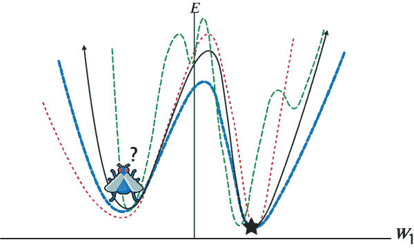
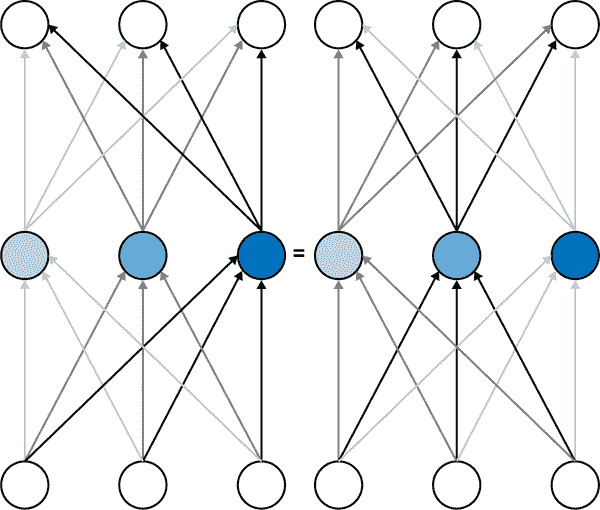
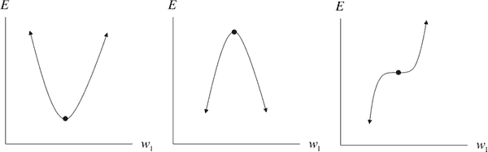
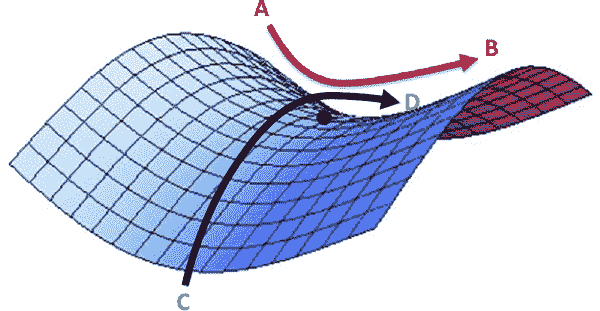
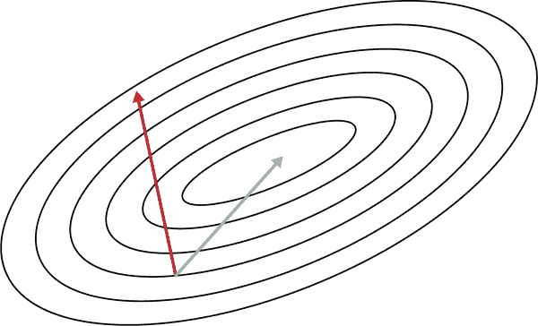
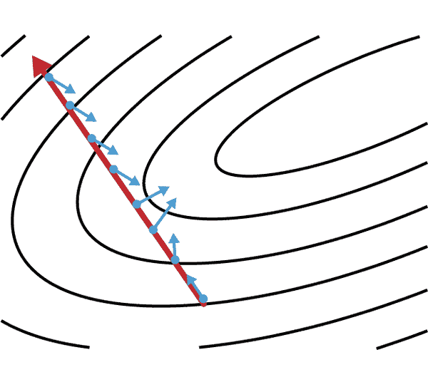
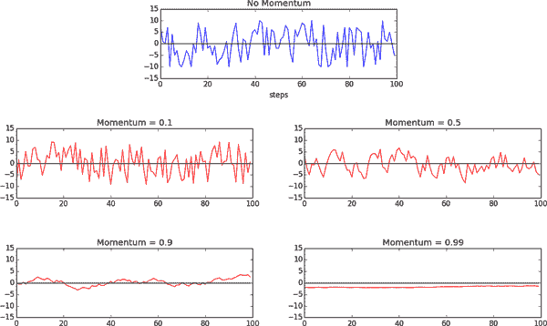
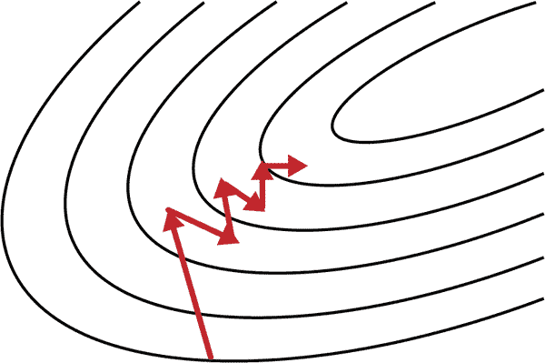

# 第六章：超越梯度下降

# 梯度下降的挑战

神经网络背后的基本思想已经存在几十年了，但直到最近，基于神经网络的学习模型才变得主流。我们对神经网络的着迷与它们的表现力有关，这是我们通过创建具有许多层的网络解锁的质量。正如我们在之前的章节中讨论的那样，深度神经网络能够解决以前被认为是棘手的问题。然而，端到端训练深度神经网络充满了困难挑战，需要许多技术创新来解决，包括大规模标记数据集（ImageNet、CIFAR-10 等）、GPU 加速等更好的硬件以及几项算法发现。

多年来，研究人员采用逐层贪婪预训练来应对深度学习模型呈现的复杂误差表面。这些耗时的策略会尝试逐层找到模型参数更准确的初始化，然后使用小批量梯度下降收敛到最佳参数设置。然而，最近，优化方法的突破使我们能够直接以端到端的方式训练模型。

在本章中，我们将讨论几项突破性的成果。接下来的几节将主要关注局部最小值以及它们是否对成功训练深度模型构成障碍。然后我们将进一步探讨深度模型引起的非凸误差表面，为什么普通的小批量梯度下降不足以应对，以及现代非凸优化器如何克服这些困难。

# 深度网络的误差表面中的局部最小值

优化深度学习模型的主要挑战在于我们被迫使用最少的局部信息来推断误差表面的全局结构。这很困难，因为局部和全局结构之间通常几乎没有对应关系。以以下类比为例。

假设你是美国大陆上的一只昆虫。你被随机放在地图上，你的目标是找到这个表面上的最低点。你该怎么做？如果你所能观察到的只是你周围的环境，这似乎是一个棘手的问题。如果美国的表面是碗状的（或者在数学上说是凸的），并且我们对学习率很聪明，我们可以使用梯度下降算法最终找到碗底。但美国的表面非常复杂，也就是说，是一个非凸表面，这意味着即使我们找到了一个山谷（一个局部最小值），我们也不知道它是否是地图上最低的山谷（全局最小值）。在第四章中，我们讨论了梯度下降的小批量版本如何帮助在存在零梯度幅度的虚假区域时导航棘手的误差表面。但正如我们在图 6-1 中所看到的，即使是随机的误差表面也无法拯救我们脱离深层局部最小值。



###### 图 6-1。小批量梯度下降可能有助于逃离浅层局部最小值，但在处理深层局部最小值时通常会失败，如所示

现在出现了一个关键问题。从理论上讲，局部最小值构成了一个重要问题。但在实践中，深度网络的误差表面中局部最小值有多常见？在哪些情况下它们实际上对训练有问题？在接下来的两节中，我们将剖析关于局部最小值的常见误解。

# 模型可辨识性

局部最小值的第一个来源与一个常被称为*模型可辨识性*的概念有关。关于深度神经网络的一个观察是，它们的误差表面保证有大量的局部最小值，有时甚至是无限多个。这个观察是真实的有两个主要原因。

首先，在一个全连接前馈神经网络的一层中，任何神经元的重新排列仍会在网络末端给出相同的最终输出。我们使用一个简单的三个神经元层来说明这一点。因此，在一个具有 n 个神经元的层中，有 n 阶乘种重新排列参数的方式。对于一个具有 l 层，每层有 n 个神经元的深度网络，我们总共有 n 的 l 次方个等效配置。



###### 图 6-2. 重新排列神经网络中一层中的神经元会因对称性而产生等效配置

除了神经元重新排列的对称性外，在某些类型的神经网络中还存在其他形式的非可辨识性。例如，对于一个单个 ReLU 神经元，存在无限多个等效配置，这些配置会导致等效网络。由于 ReLU 使用分段线性函数，我们可以自由地将所有传入权重乘以任意非零常数 k，同时将所有传出权重缩放为 1/k，而不改变网络的行为。我们将这个陈述的理由留给你作为一个练习。

然而，由于深度神经网络的非可辨识性而产生的局部最小值并不是固有的问题。这是因为所有非可辨识的配置无论输入值如何，都会表现出无法区分的行为。这意味着它们将在训练、验证和测试数据集上达到相同的错误。换句话说，所有这些模型将从训练数据中学到同样的东西，并且在泛化到未见示例时具有相同的行为。

相反，当局部最小值是虚假的时候才会有问题。虚假的局部最小值对应于神经网络中的一组权重配置，其错误高于全局最小值的配置。如果这种类型的局部最小值很常见，那么在使用基于梯度的优化方法时，我们会迅速遇到重大问题，因为我们只能考虑局部结构。

# 深度网络中虚假局部最小值有多讨厌？

多年来，深度学习从业者将训练深度网络中的所有问题都归咎于虚假的局部最小值，尽管缺乏证据。如今，虚假局部最小值是否在实际深度网络中普遍存在仍然是一个悬而未决的问题。然而，许多最近的研究似乎表明，大多数局部最小值的错误率和泛化特性与全局最小值非常相似。

我们可能尝试天真地解决这个问题的一种方法是，在训练深度神经网络时，随着时间的推移绘制错误函数的值。然而，这种策略并不能为我们提供足够关于错误曲面的信息，因为很难判断错误曲面是“崎岖不平”还是我们仅仅难以确定应该朝哪个方向移动。

为了更有效地分析这个问题，Goodfellow 等人（谷歌和斯坦福大学的研究人员合作组成的团队）在 2014 年发表了一篇论文，试图分离这两个潜在的混淆因素。[²] 他们巧妙地研究了在随机初始化参数向量和成功的最终解之间的误差曲面上发生了什么，而不是随时间分析误差函数。因此，给定一个随机初始化的参数向量θi 和随机梯度下降（SGD）解θf，我们的目标是计算沿着线性插值θα的每个点处的误差函数。

他们想要调查即使我们知道要移动的方向，局部最小值是否会阻碍基于梯度的搜索方法。他们表明，对于各种具有不同类型神经元的实际网络，参数空间中随机初始化点和随机梯度下降解之间的直接路径并不受困扰。

我们甚至可以使用我们在第五章中构建的前馈 ReLU 网络来演示这一点。使用我们在训练原始前馈网络时保存的检查点文件，我们可以使用`load_state_dict`和`torch.load`重新实例化模型：

```py
# Load checkpoint from SGD training
IN_DIM, FEATURE_DIM, OUT_DIM = 784, 256, 10
model = Net(IN_DIM, FEATURE_DIM, OUT_DIM)

model.load_state_dict(torch.load('mnist.pt'))

```

在 PyTorch 中，我们无法直接访问模型的参数，因为`model.parameters()`方法返回一个仅提供参数*副本*的生成器。要修改模型的参数，我们使用`torch.load`从文件中读取包含参数值的状态字典，然后使用`load_state_dict`将模型的参数设置为这些值。

我们还可以使用`state_dict`方法从模型本身访问状态字典，而不是使用`torch.load`从文件加载状态字典：

```py
import copy

# Access parameters with state_dict
opt_state_dict = copy.deepcopy(model.state_dict())

for param_tensor in opt_state_dict:
    print(param_tensor, "\t",
          opt_state_dict[param_tensor].size())

# outputs:
# classifier.1.weight   torch.Size([256, 784])
# classifier.1.bias     torch.Size([256])
# classifier.3.weight   torch.Size([256, 256])
# classifier.3.bias     torch.Size([256])
# classifier.5.weight   torch.Size([10, 256])
# classifier.5.bias     torch.Size([10])

```

请注意，我们需要使用`copy.deepcopy`方法来复制带有其值的字典。只设置`opt_state_dict = model.state_dict()`会导致浅复制，并且当我们稍后加载具有插值参数的模型时，`opt_state_dict`会发生更改。

接下来，我们实例化一个具有随机初始化参数的新模型，并将这些参数保存为`rand_state_dict`：

```py
# Create randomly initialized network
model_rand = Net(IN_DIM, FEATURE_DIM, OUT_DIM)
rand_state_dict = copy.deepcopy(model_rand.state_dict())

```

有了这两个网络适当初始化后，我们现在可以使用混合参数`alpha`和`beta`构建线性插值：

```py
# Create a new state_dict for interpolated parameters
test_model = Net(IN_DIM, FEATURE_DIM, OUT_DIM)
test_state_dict = copy.deepcopy(test_model.state_dict())

alpha = 0.2
beta = 1.0 - alpha
for p in opt_state_dict:
    test_state_dict[p] = (opt_state_dict[p] * beta +
                          rand_state_dict[p] * alpha)

```

接下来，我们将使用具有插值参数的模型计算整个测试数据集上的平均损失。为了方便起见，让我们创建一个推理函数：

```py
def inference(testloader, model, loss_fn):
  running_loss = 0.0
  with torch.no_grad():
    for inputs, labels in testloader:
      outputs = model(inputs)
      loss = loss_fn(outputs, labels)
      running_loss += loss
  running_loss /= len(testloader)
  return running_loss

```

最后，我们可以改变`alpha`的值，以了解在穿过随机初始化点和最终 SGD 解之间的线路时，误差曲面如何变化：

```py
results = []
for alpha in torch.arange(-2, 2, 0.05):
  beta = 1.0 - alpha

  # Compute interpolated parameters
  for p in opt_state_dict:
    test_state_dict[p] = (opt_state_dict[p] * beta +
                          rand_state_dict[p] * alpha)

  # Load interpolated parameters into test model
  model.load_state_dict(test_state_dict)

  # Compute loss given interpolated parameters
  loss = inference(trainloader, model, loss_fn)
  results.append(loss.item())

```

这创建了图 6-3，我们可以自己检查。实际上，如果我们一遍又一遍地运行这个实验，我们会发现没有真正困扰的局部最小值会让我们陷入困境。看来梯度下降的真正挑战不是存在困扰的局部最小值，而是我们很难找到适当的移动方向。我们稍后会回到这个想法。


###### 图 6-3\. 三层前馈网络的成本函数，当我们在线性插值连接随机初始化的参数向量和随机梯度下降解时

# 误差表面中的平坦区域

尽管我们的分析似乎没有令人头疼的局部最小值，但我们注意到一个奇怪的平坦区域，在大约`alpha=1`时梯度接近零。这个点不是局部最小值，所以不太可能完全卡住我们，但如果我们不走运遇到它，零梯度可能会减慢学习速度。

更一般地，对于任意函数，梯度为零向量的点被称为*临界点*。临界点有各种不同的类型。我们已经讨论过局部最小值。很容易想象它们的对应物，即*局部最大值*，对于随机梯度下降并不构成太大问题。但是还有这些奇怪的临界点，它们位于两者之间。这些“平坦”区域可能会让人头疼，但不一定致命，被称为*鞍点*。事实证明，随着我们的函数具有越来越多的维度（即我们的模型中有越来越多的参数），鞍点比局部最小值更有可能。让我们试着直观地理解为什么。

对于一个一维成本函数，临界点可以采取三种形式，如图 6-4 所示。粗略地说，让我们假设这三种配置是等可能的。这意味着在一个随机的一维函数中，给定一个随机的临界点，它有三分之一的概率是局部最小值。这意味着如果我们总共有 <math alttext="k"><mi>k</mi></math> 个临界点，我们可以期望总共有 <math alttext="StartFraction k Over 3 EndFraction"><mfrac><mi>k</mi> <mn>3</mn></mfrac></math> 个局部最小值。



###### 图 6-4\. 沿单个维度分析临界点

我们也可以将这个扩展到更高维度的函数。考虑一个在 <math alttext="d"><mi>d</mi></math> 维空间中运行的成本函数。让我们取一个任意的临界点。事实证明，确定这一点是局部最小值、局部最大值还是鞍点比一维情况要棘手一些。考虑图 6-5 中的误差表面。根据你如何切割表面（从 A 到 B 还是从 C 到 D），临界点看起来像最小值或最大值。实际上，它既不是最小值也不是最大值。它是一种更复杂的鞍点。



###### 图 6-5\. 二维误差表面上的一个鞍点

一般来说，在一个 <math alttext="d"><mi>d</mi></math> 维参数空间中，我们可以通过 <math alttext="d"><mi>d</mi></math> 个不同的轴切过一个临界点。一个临界点只有在每一个 <math alttext="d"><mi>d</mi></math> 个一维子空间中都出现为局部最小值时才能成为局部最小值。利用一个临界点在一维子空间中有三种不同类型的事实，我们意识到一个随机临界点在随机函数中的概率是 <math alttext="StartFraction 1 Over 3 Superscript d Baseline EndFraction"><mfrac><mn>1</mn> <msup><mn>3</mn> <mi>d</mi></msup></mfrac></math> 。这意味着一个具有 <math alttext="k"><mi>k</mi></math> 个临界点的随机函数有望有 <math alttext="StartFraction k Over 3 Superscript d Baseline EndFraction"><mfrac><mi>k</mi> <msup><mn>3</mn> <mi>d</mi></msup></mfrac></math> 个局部最小值。换句话说，随着参数空间的维度增加，局部最小值变得越来越稀有。对这个主题的更严格的处理超出了本书的范围，但在 2014 年由 Dauphin 等人进行了更深入的探讨。³

那么，这对于优化深度学习模型意味着什么？对于随机梯度下降，目前还不清楚。看起来这些错误表面的平坦段是棘手的，但最终并不会阻止随机梯度下降收敛到一个好的答案。然而，对于试图直接解决梯度为零点的方法，这对于某些二阶优化方法在深度学习模型中的有用性构成了严重问题，我们将在后面讨论。

# 当梯度指向错误方向时

在分析深度网络的错误表面时，似乎优化深度网络最关键的挑战是找到正确的移动轨迹。然而，当我们看看局部最小值周围的错误表面发生了什么时，这并不令人惊讶。例如，我们考虑在 2D 参数空间上定义的错误表面，如图 6-6 所示。



###### 图 6-6。梯度编码的局部信息通常不符合错误表面的全局结构

重新审视我们在第四章中探索的等高线图，注意梯度通常不是一个很好的良好轨迹指示器。具体来说，只有当等高线是完全圆形时，梯度才总是指向局部最小值的方向。然而，如果等高线极端椭圆形（通常是深度网络的错误表面的情况），梯度可能与正确方向相差 90 度。

我们使用一些数学形式将这种分析扩展到任意维度。对于参数空间中的每个权重<math alttext="w 下标 i"><msub><mi>w</mi> <mi>i</mi></msub></math>，梯度计算<math alttext="StartFraction normal partial-differential upper E Over normal partial-differential w 下标 i Baseline EndFraction"><mfrac><mrow><mi>∂</mi><mi>E</mi></mrow> <mrow><mi>∂</mi><msub><mi>w</mi> <mi>i</mi></msub></mrow></mfrac></math>的值，或者当我们改变<math alttext="w 下标 i"><msub><mi>w</mi> <mi>i</mi></msub></math>的值时，错误值的变化。在参数空间中的所有权重上综合考虑，梯度给出了最陡下降的方向。然而，在这个方向上迈出重要步骤的一般问题是，当我们移动时，梯度可能在我们脚下改变！我们在图 6-7 中演示了这个简单事实。回到 2D 示例，如果我们的等高线是完全圆形的，并且我们朝最陡下降的方向迈出一大步，梯度在我们移动时不会改变方向。然而，对于高度椭圆形的等高线，情况并非如此。



###### 图 6-7。当我们沿着最陡下降的方向移动时，梯度的方向会改变，这是从一个起始点确定的；梯度向量被归一化为相同长度，以强调梯度向量方向的变化

更一般地，我们可以通过计算二阶导数来量化梯度在我们移动某个方向时的变化。具体来说，我们想要测量 <math alttext="StartFraction normal partial-differential left-parenthesis normal partial-differential upper E slash normal partial-differential w Subscript j Baseline right-parenthesis Over normal partial-differential w Subscript i Baseline EndFraction"> <mfrac> <mrow> <mi>∂</mi> <mfenced separators="" open="(" close=")"> <mi>∂</mi> <mi>E</mi> <mo>/</mo> <mi>∂</mi> <msub> <mi>w</mi> <mi>j</mi> </msub> </mfenced> </mrow> <mrow> <mi>∂</mi> <msub> <mi>w</mi> <mi>i</mi> </msub> </mrow> </mfrac> </math>，这告诉我们当我们改变 <math alttext="w Subscript i"> <msub> <mi>w</mi> <mi>i</mi> </msub> </math> 的值时， <math alttext="w Subscript j"> <msub> <mi>w</mi> <mi>j</mi> </msub> </math> 的梯度分量如何变化。我们可以将这些信息编译成一个特殊的矩阵，称为*Hessian 矩阵*（***H***）。当描述一个错误表面，在这个表面上，当我们沿着最陡降方向移动时，梯度在我们脚下发生变化时，这个矩阵被称为*病态*。

# 基于动量的优化

从根本上讲，病态 Hessian 矩阵的问题表现为梯度剧烈波动。因此，处理病态的一种流行机制是绕过 Hessian 的计算，而是专注于如何在训练期间抵消这些波动。

我们可以通过研究球如何沿着山坡滚动来思考如何解决这个问题。受重力驱动，球最终会落入表面上的最小值，但出于某种原因，在梯度下降过程中不会出现野蛮波动和发散。为什么会这样呢？与随机梯度下降不同（仅使用梯度），有两个主要组成部分决定了球如何沿着误差表面滚动。第一个部分，我们在随机梯度下降中已经建模为梯度，通常称为加速度。但加速度并不能单独决定球的运动。相反，它的运动更直接地由其速度决定。加速度只通过修改速度间接改变球的位置。

基于速度的运动是可取的，因为它通过在历史上平滑球的轨迹来抵消梯度的剧烈波动。速度作为一种记忆形式，这使我们能够更有效地在最小值方向上积累运动，同时抵消正交方向上的振荡加速度。因此，我们的目标是在我们的优化算法中生成速度的类似物。我们可以通过跟踪过去梯度的*指数加权衰减*来实现这一点。这个前提很简单：每次更新都是通过将上一次迭代的更新与当前梯度相结合来计算的。具体来说，我们计算参数向量的变化如下：

<math alttext="bold v Subscript i Baseline equals m bold v Subscript i minus 1 Baseline minus epsilon bold g Subscript i"><mrow><msub><mi>𝐯</mi> <mi>i</mi></msub> <mo>=</mo> <mi>m</mi> <msub><mi>𝐯</mi> <mrow><mi>i</mi><mo>-</mo><mn>1</mn></mrow></msub> <mo>-</mo> <mi>ϵ</mi> <msub><mi>𝐠</mi> <mi>i</mi></msub></mrow></math>

<math alttext="theta Subscript i Baseline equals theta Subscript i minus 1 Baseline plus bold v Subscript i"><mrow><msub><mi>θ</mi> <mi>i</mi></msub> <mo>=</mo> <msub><mi>θ</mi> <mrow><mi>i</mi><mo>-</mo><mn>1</mn></mrow></msub> <mo>+</mo> <msub><mi>𝐯</mi> <mi>i</mi></msub></mrow></math>

我们使用动量超参数<m> m </m>来确定新更新中保留多少比例的先前速度，并将过去梯度的“记忆”添加到当前梯度中。这种方法通常称为*动量*。因为动量项增加了我们采取的步长，使用动量可能需要比普通随机梯度下降更低的学习率。

为了更好地理解动量的工作原理，我们将探讨一个玩具示例。具体来说，我们将研究动量如何影响*随机漫步*中的更新。随机漫步是一系列随机选择的步骤。在我们的示例中，我们将想象一条线上的一个粒子，在每个时间间隔内，随机选择一个步长在-10 到 10 之间，并朝着那个方向移动。这可以简单地表示为：

```py
rand_walk = [torch.randint(-10, 10, (1,1)) for x in range(100)]

```

然后，我们将模拟当我们使用动量的轻微修改（即标准的指数加权移动平均算法）来在每个时间间隔平滑我们的步长选择时会发生什么。同样，我们可以简洁地表示为：

```py
momentum = 0.1
momentum_rand_walk = \
      [torch.randint(-10, 10, (1,1)) for x in range(100)]

for i in range(1, len(rand_walk) - 1):
  prev = momentum_rand_walk[i-1]
  rand_choice = torch.randint(-10, 10, (1,1)).item()
  new_step = momentum * prev + (1 - momentum) * rand_choice
  momentum_rand_walk[i] = new_step

```

当我们将动量从 0 变化到 1 时，结果令人震惊。动量显著减少了更新的波动性。动量越大，我们对新的更新越不敏感（例如，在轨迹第一次估计时的大误差会在相当长的时间内传播）。我们总结了我们玩具实验的结果在图 6-8 中。



###### 图 6-8。动量通过指数加权移动平均值平滑随机漫步中的步长波动

研究动量如何实际影响前馈神经网络的训练，我们可以使用 PyTorch 动量优化器重新训练我们可靠的 MNIST 前馈网络。在这种情况下，我们可以使用相同的学习率（0.01）和典型的动量 0.9：

```py
optimizer = optim.SGD(model.parameters(),
                      lr = 0.01,
                      momentum = 0.9)
optimizer.step()

```

注意，当我们创建一个 PyTorch 优化器时，我们需要传入 `model.parameters()`。结果的加速效果令人震惊。我们通过比较图 6-9 中的可视化来展示成本函数随时间的变化。该图表明，要在没有动量的情况下（右侧）实现成本为 0.1，需要近 18,000 步（小批量），而使用动量（左侧）则只需要超过 2,000 步。


###### 图 6-9。比较使用（右侧）和不使用（左侧）动量训练前馈网络，显示了训练时间的大幅减少

最近，有更多的工作探讨了如何改进经典的动量技术。2013 年，Sutskever 等人提出了一种称为 Nesterov 动量的替代方法，它在速度更新期间计算误差表面上的梯度，而不是在 θ 处。这种微妙的差异似乎使 Nesterov 动量能够以更具响应性的方式改变其速度。已经证明，这种方法在批量梯度下降中具有明显的好处（收敛保证和相对于经典动量可以使用更高的动量来实现给定学习率），但对于大多数深度学习优化方法中使用的更随机的小批量梯度下降是否也适用尚不清楚。

通过设置 `nesterov` 参数，PyTorch 默认支持 Nerestov 动量：

```py
optimizer = optim.SGD(model.parameters(),
                      lr = 0.01,
                      momentum = 0.9,
                      nesterov = True)

```

# 第二阶方法的简要概述

正如我们讨论过的，计算海森矩阵是一个计算上困难的任务，而动量使我们在不必担心它的情况下获得了显著的加速。然而，在过去几年中，已经研究了几种试图直接逼近海森矩阵的二阶方法。为了完整起见，我们对这些方法进行了广泛概述，但详细讨论超出了本文的范围。

现代深度网络优化的一个重大突破是学习率调整的出现。学习率调整背后的基本概念是，在学习的过程中适当地修改最佳学习率，以实现良好的收敛性质。在接下来的几节中，我们将讨论 AdaGrad、RMSProp 和 Adam，这三种最流行的自适应学习率算法之一。



###### 在其原始形式中，BFGS 具有显著的内存占用，但最近的工作已经产生了一个更节省内存的版本，称为*L-BFGS*。[8]

一种替代优化算法被称为*Broyden–Fletcher–Goldfarb–Shanno*（BFGS）算法，试图迭代计算 Hessian 矩阵的逆，并使用逆 Hessian 更有效地优化参数向量。[7]

一般来说，虽然这些方法有一些希望，但二阶方法仍然是一个活跃研究领域，且在实践者中不受欢迎。然而，PyTorch 支持 L-BFGS 以及其他二阶方法，如平均随机梯度下降，供您自行尝试。

# 我们将讨论的第一个算法是 AdaGrad，它试图通过历史梯度的累积随时间调整全局学习率，由 Duchi 等人在 2011 年首次提出。具体来说，我们跟踪每个参数的学习率。这个学习率与所有参数历史梯度的平方和的平方根成反比地缩放。

第一个是*共轭梯度下降*，它起源于试图改进最陡下降的朴素方法。在最陡下降中，我们计算梯度的方向，然后进行线性搜索以找到沿该方向的最小值。我们跳到最小值，然后重新计算梯度以确定下一次线性搜索的方向。事实证明，这种方法最终会出现相当多的曲折，如图 6-10 所示，因为每次我们沿最陡下降的方向移动时，我们会在另一个方向上撤销一点进展。解决这个问题的方法是相对于先前选择的方向移动*共轭方向*，而不是最陡下降的方向。通过使用 Hessian 的间接近似来选择共轭方向，将梯度和我们先前的方向线性组合。稍作修改，这种方法可以推广到我们在深度网络中找到的非凸误差表面。[6]

学习率调整

## AdaGrad-累积历史梯度

图 6-10。最陡下降法经常曲折；共轭下降试图解决这个问题

正如我们之前讨论过的，训练深度网络的另一个主要挑战是适当选择学习率。选择正确的学习率长期以来一直是训练深度网络中最棘手的方面之一，因为它对网络的性能有重大影响。学习率太小则学习速度不够快，但学习率太大可能在接近局部最小值或病态区域时难以收敛。我们可以用数学方式表达这一点。我们初始化一个梯度累积向量<math alttext="bold r 0 equals bold 0"><mrow><msub><mi>𝐫</mi> <mn>0</mn></msub> <mo>=</mo> <mn mathvariant="bold">0</mn></mrow> </math>。在每一步中，我们按如下方式累积所有梯度参数的平方（其中<math alttext="circled-dot"><mo>⊙</mo></math>操作是逐元素张量乘法）:

<math alttext="bold r Subscript i Baseline equals bold r Subscript i minus 1 Baseline plus bold g Subscript i Baseline circled-dot bold g Subscript i"><mrow><msub><mi>𝐫</mi> <mi>i</mi></msub> <mo>=</mo> <msub><mi>𝐫</mi> <mrow><mi>i</mi><mo>-</mo><mn>1</mn></mrow></msub> <mo>+</mo> <msub><mi>𝐠</mi> <mi>i</mi></msub> <mo>⊙</mo> <msub><mi>𝐠</mi> <mi>i</mi></msub></mrow></math>

然后我们像往常一样计算更新，只是我们的全局学习率<math alttext="epsilon"><mi>ϵ</mi></math>被梯度累积向量的平方根除以：

<math alttext="theta Subscript i Baseline equals theta Subscript i minus 1 Baseline minus StartFraction epsilon Over delta circled-plus StartRoot bold r Subscript i Baseline EndRoot EndFraction circled-dot bold g"><mrow><msub><mi>θ</mi> <mi>i</mi></msub> <mo>=</mo> <msub><mi>θ</mi> <mrow><mi>i</mi><mo>-</mo><mn>1</mn></mrow></msub> <mo>-</mo> <mfrac><mi>ϵ</mi> <mrow><mi>δ</mi><mo>⊕</mo><msqrt><msub><mi>𝐫</mi> <mi>i</mi></msub></msqrt></mrow></mfrac> <mo>⊙</mo> <mi>𝐠</mi></mrow></math>

请注意，我们在分母中添加一个微小数<math alttext="delta"><mi>δ</mi></math>（~ <math alttext="10 Superscript negative 7"><msup><mn>10</mn> <mrow><mo>-</mo><mn>7</mn></mrow></msup></math>）以防止除以零。此外，除法和加法操作被广播到梯度累积向量的大小，并逐元素应用。在 PyTorch 中，内置优化器允许轻松地将 AdaGrad 用作学习算法：

```py
optimizer = optim.Adagrad(model.parameters(),
                          lr = 0.01,
                          weight_decay = 0,
                          initial_accumulator_value = 0)

```

唯一的问题是在 PyTorch 中，<math alttext="delta"><mi>δ</mi></math>和初始梯度累积向量被合并到`initial_accumulator_value`参数中。

在功能级别上，这种更新机制意味着具有最大梯度的参数会快速降低其学习率，而具有较小梯度的参数只会略微降低其学习率。最终效果是 AdaGrad 在误差表面上更温和倾斜的方向上取得更多进展，这有助于克服病态表面。这导致了一些良好的理论性质，但在实践中，使用 AdaGrad 训练深度学习模型可能会有些问题。经验上，AdaGrad 有导致学习率过早下降的倾向，因此对于一些深度模型效果并不特别好。在下一节中，我们将描述 RMSProp，试图弥补这个缺点。

## RMSProp—梯度的指数加权移动平均

虽然 AdaGrad 对简单的凸函数效果很好，但它并不适用于深度网络复杂的误差表面。平坦区域可能会导致 AdaGrad 在达到最小值之前降低学习率。结论是简单地累积梯度是不够的。

我们的解决方案是重新引入我们在讨论动量时介绍的一个概念，以减弱梯度中的波动。与简单累积相比，指数加权移动平均值还使我们能够“丢弃”很久以前的测量。更具体地说，我们对梯度累积向量的更新现在如下所示：

<math alttext="bold r Subscript i Baseline equals rho bold r Subscript i minus 1 Baseline plus left-parenthesis 1 minus rho right-parenthesis bold g Subscript i Baseline circled-dot bold g Subscript i"><mrow><msub><mi>𝐫</mi> <mi>i</mi></msub> <mo>=</mo> <mi>ρ</mi> <msub><mi>𝐫</mi> <mrow><mi>i</mi><mo>-</mo><mn>1</mn></mrow></msub> <mo>+</mo> <mfenced separators="" open="(" close=")"><mn>1</mn> <mo>-</mo> <mi>ρ</mi></mfenced> <msub><mi>𝐠</mi> <mi>i</mi></msub> <mo>⊙</mo> <msub><mi>𝐠</mi> <mi>i</mi></msub></mrow></math>

衰减因子<math alttext="rho"><mi>ρ</mi></math>决定我们保留旧梯度的时间。衰减因子越小，有效窗口就越短。将这种修改插入 AdaGrad 中产生了由 Geoffrey Hinton 首次提出的 RMSProp 学习算法。

在 PyTorch 中，我们可以使用以下代码实例化 RMSProp 优化器。请注意，在这种情况下，与 AdaGrad 不同，我们将<math alttext="delta"><mi>δ</mi></math>单独作为构造函数的`epsilon`参数传入：

```py
optimizer = optim.RMSprop(model.parameters(),
                          lr = 0.01,
                          alpha = 0.99,
                          eps = 1e-8,
                          weight_decay = 0,
                          momentum = 0)

```

正如模板所示，我们可以使用带有动量的 RMSProp（具体来说是 Nerestov 动量）。总的来说，RMSProp 已被证明是深度神经网络的高效优化器，并且是许多经验丰富的从业者的默认选择。

## Adam—结合动量和 RMSProp

在结束我们对现代优化器的讨论之前，我们讨论最后一个算法—Adam。从精神上讲，我们可以将 Adam 看作是 RMSProp 和动量的变体组合。

基本思想如下。我们希望跟踪梯度的指数加权移动平均（基本上是经典动量中的速度概念），我们可以表示如下：

**m**[*i*] = β[1]**m**[*i* – 1] + (1 – β[1])**g**[i]

这是我们对我们称之为梯度的 *第一矩* 或 <math alttext="double-struck upper E left-bracket bold g Subscript i Baseline right-bracket"><mrow><mi>𝔼</mi> <mo>[</mo> <msub><mi>𝐠</mi> <mi>i</mi></msub> <mo>]</mo></mrow></math> 的近似。类似于 RMSProp，我们可以维护历史梯度的指数加权移动平均值。这是我们对我们称之为梯度的 *第二矩* 或 <math alttext="double-struck upper E left-bracket bold g Subscript i Baseline circled-dot bold g Subscript i Baseline right-bracket"><mrow><mi>𝔼</mi> <mo>[</mo> <msub><mi>𝐠</mi> <mi>i</msub> <mo>⊙</mo> <msub><mi>𝐠</mi> <mi>i</mi></msub> <mo>]</mo></mrow></math> 的估计：

<math alttext="bold v Subscript i Baseline equals beta 2 bold v Subscript i minus 1 Baseline plus left-parenthesis 1 minus beta 2 right-parenthesis bold g Subscript i Baseline circled-dot bold g Subscript i"><mrow><msub><mi>𝐯</mi> <mi>i</mi></msub> <mo>=</mo> <msub><mi>β</mi> <mn>2</mn></msub> <msub><mi>𝐯</mi> <mrow><mi>i</mi><mo>-</mo><mn>1</mn></mrow></msub> <mo>+</mo> <mrow><mo>(</mo> <mn>1</mn> <mo>-</mo> <msub><mi>β</mi> <mn>2</mn></msub> <mo>)</mo></mrow> <msub><mi>𝐠</mi> <mi>i</mi></msub> <mo>⊙</mo> <msub><mi>𝐠</mi> <mi>i</mi></msub></mrow></math>

然而，事实证明这些估计相对于真实矩是有偏差的，因为我们从将两个向量初始化为零向量开始。为了纠正这种偏差，我们为这两个估计推导了一个校正因子。在这里，我们描述了对二阶矩的估计的推导。对于第一矩的推导，与此处类似的推导留作练习。

我们首先通过所有过去梯度的估计来表达二阶矩的估计。这是通过简单地展开递归关系来完成的：

<math alttext="bold v Subscript i Baseline equals beta 2 bold v Subscript i minus 1 Baseline plus left-parenthesis 1 minus beta 2 right-parenthesis bold g Subscript i Baseline circled-dot bold g Subscript i"><mrow><msub><mi>𝐯</mi> <mi>i</mi></msub> <mo>=</mo> <msub><mi>β</mi> <mn>2</mn></msub> <msub><mi>𝐯</mi> <mrow><mi>i</mi><mo>-</mo><mn>1</mn></mrow></msub> <mo>+</mo> <mrow><mo>(</mo> <mn>1</mn> <mo>-</mo> <msub><mi>β</mi> <mn>2</mn></msub> <mo>)</mo></mrow> <msub><mi>𝐠</mi> <mi>i</mi></msub> <mo>⊙</mo> <msub><mi>𝐠</mi> <mi>i</mi></msub></mrow></math>

<math alttext="bold v Subscript i Baseline equals beta 2 Superscript i minus 1 Baseline left-parenthesis 1 minus beta 2 right-parenthesis bold g 1 circled-dot bold g 1 plus beta 2 Superscript i minus 2 Baseline left-parenthesis 1 minus beta 2 right-parenthesis bold g 2 circled-dot bold g 2 plus ellipsis plus left-parenthesis 1 minus beta 2 right-parenthesis bold g Subscript i Baseline circled-dot bold g Subscript i"><mrow><msub><mi>𝐯</mi> <mi>i</mi></msub> <mo>=</mo> <msubsup><mi>β</mi> <mn>2</mn> <mrow><mi>i</mi><mo>-</mo><mn>1</mn></mrow></msubsup> <mrow><mo>(</mo> <mn>1</mn> <mo>-</mo> <msub><mi>β</mi> <mn>2</mn></msub> <mo>)</mo></mrow> <msub><mi>𝐠</mi> <mn>1</mn></msub> <mo>⊙</mo> <msub><mi>𝐠</mi> <mn>1</mn></msub> <mo>+</mo> <msubsup><mi>β</mi> <mn>2</mn> <mrow><mi>i</mi><mo>-</mo><mn>2</mn></mrow></msubsup> <mrow><mo>(</mo> <mn>1</mn> <mo>-</mo> <msub><mi>β</mi> <mn>2</mn></msub> <mo>)</mo></mrow> <msub><mi>𝐠</mi> <mn>2</mn></msub> <mo>⊙</mo> <msub><mi>𝐠</mi> <mn>2</mn></msub> <mo>+</mo> <mo>...</mo> <mo>+</mo> <mrow><mo>(</mo> <mn>1</mn> <mo>-</mo> <msub><mi>β</mi> <mn>2</mn></msub> <mo>)</mo></mrow> <msub><mi>𝐠</mi> <mi>i</mi></msub> <mo>⊙</mo> <msub><mi>𝐠</mi> <mi>i</mi></msub></mrow></math>

<math alttext="bold v Subscript i Baseline equals left-parenthesis 1 minus beta 2 right-parenthesis sigma-summation Underscript k equals 1 Overscript i Endscripts beta Superscript i minus k Baseline bold g Subscript k Baseline circled-dot bold g Subscript k"><mrow><msub><mi>𝐯</mi> <mi>i</mi></msub> <mo>=</mo> <mrow><mo>(</mo> <mn>1</mn> <mo>-</mo> <msub><mi>β</mi> <mn>2</mn></msub> <mo>)</mo></mrow> <msubsup><mo>∑</mo> <mrow><mi>k</mi><mo>=</mo><mn>1</mn></mrow> <mi>i</mi></msubsup> <msup><mi>β</mi> <mrow><mi>i</mi><mo>-</mo><mi>k</mi></mrow></msup> <msub><mi>𝐠</mi> <mi>k</mi></msub> <mo>⊙</mo> <msub><mi>𝐠</mi> <mi>k</mi></msub></mrow></math>

然后，我们可以取两边的期望值，以确定我们的估计 <math alttext="double-struck upper E left-bracket bold v Subscript i Baseline right-bracket"><mrow><mi>𝔼</mi> <mo>[</mo> <msub><mi>𝐯</mi> <mi>i</mi></msub> <mo>]</mo></mrow></math> 如何与 <math alttext="double-struck upper E left-bracket bold g Subscript i Baseline circled-dot bold g Subscript i Baseline right-bracket"><mrow><mi>𝔼</mi> <mo>[</mo> <msub><mi>𝐠</mi> <mi>i</msub> <mo>⊙</mo> <msub><mi>𝐠</mi> <mi>i</mi></msub> <mo>]</mo></mrow></math> 的真实值相比：

<math alttext="double-struck upper E left-bracket bold v Subscript i Baseline right-bracket equals double-struck upper E left-bracket left-parenthesis 1 minus beta 2 right-parenthesis sigma-summation Underscript k equals 1 Overscript i Endscripts beta Superscript i minus k Baseline bold g Subscript k Baseline circled-dot bold g Subscript k Baseline right-bracket"><mrow><mi>𝔼</mi> <mrow><mo>[</mo> <msub><mi>𝐯</mi> <mi>i</mi></msub> <mo>]</mo></mrow> <mo>=</mo> <mi>𝔼</mi> <mfenced separators="" open="[" close="]"><mrow><mo>(</mo> <mn>1</mn> <mo>-</mo> <msub><mi>β</mi> <mn>2</mn></msub> <mo>)</mo></mrow> <msubsup><mo>∑</mo> <mrow><mi>k</mi><mo>=</mo><mn>1</mn></mrow> <mi>i</mi></msubsup> <msup><mi>β</mi> <mrow><mi>i</mi><mo>-</mo><mi>k</mi></mrow></msup> <msub><mi>𝐠</mi> <mi>k</mi></msub> <mo>⊙</mo> <msub><mi>𝐠</mi> <mi>k</mi></msub></mfenced></mrow></math>

我们还可以假设 <math alttext="double-struck upper E left-bracket bold g Subscript k Baseline circled-dot bold g Subscript k Baseline right-bracket almost-equals double-struck upper E left-bracket bold g Subscript i Baseline almost-equals bold g Subscript i Baseline right-bracket"><mrow><mi>𝔼</mi> <mrow><mo>[</mo> <msub><mi>𝐠</mi> <mi>k</mi></msub> <mo>⊙</mo> <msub><mi>𝐠</mi> <mi>k</mi></msub> <mo>]</mo></mrow> <mo>≈</mo> <mi>𝔼</mi> <mrow><mo>[</mo> <msub><mi>𝐠</mi> <mi>i</mi></msub> <mo>≈</mo> <msub><mi>𝐠</mi> <mi>i</mi></msub> <mo>]</mo></mrow></mrow></math> 因为即使梯度的二阶矩相对于历史值发生了变化，<math alttext="beta 2"><msub><mi>β</mi> <mn>2</mn></msub></math> 应该被选择，以便旧的梯度二阶矩基本上衰减到不相关。因此，我们可以进行以下简化：

<math alttext="double-struck upper E left-bracket bold v Subscript i Baseline right-bracket almost-equals double-struck upper E left-bracket bold g Subscript i Baseline circled-dot bold g Subscript i Baseline right-bracket left-parenthesis 1 minus beta 2 right-parenthesis sigma-summation Underscript k equals 1 Overscript i Endscripts beta Superscript i minus k"><mrow><mi>𝔼</mi> <mrow><mo>[</mo> <msub><mi>𝐯</mi> <mi>i</mi></msub> <mo>]</mo></mrow> <mo>≈</mo> <mi>𝔼</mi> <mrow><mo>[</mo> <msub><mi>𝐠</mi> <mi>i</mi></msub> <mo>⊙</mo> <msub><mi>𝐠</mi> <mi>i</mi></msub> <mo>]</mo></mrow> <mrow><mo>(</mo> <mn>1</mn> <mo>-</mo> <msub><mi>β</mi> <mn>2</mn></msub> <mo>)</mo></mrow> <msubsup><mo>∑</mo> <mrow><mi>k</mi><mo>=</mo><mn>1</mn></mrow> <mi>i</mi></msubsup> <msup><mi>β</mi> <mrow><mi>i</mi><mo>-</mo><mi>k</mi></mrow></msup></mrow></math>

<math alttext="double-struck upper E left-bracket bold v Subscript i Baseline right-bracket almost-equals double-struck upper E left-bracket bold g Subscript i Baseline circled-dot bold g Subscript i Baseline right-bracket left-parenthesis 1 minus beta Subscript 2 Sub Superscript i Subscript Baseline right-parenthesis"><mrow><mi>𝔼</mi> <mrow><mo>[</mo> <msub><mi>𝐯</mi> <mi>i</mi></msub> <mo>]</mo></mrow> <mo>≈</mo> <mi>𝔼</mi> <mrow><mo>[</mo> <msub><mi>𝐠</mi> <mi>i</mi></msub> <mo>⊙</mo> <msub><mi>𝐠</mi> <mi>i</mi></msub> <mo>]</mo></mrow> <mrow><mo>(</mo> <mn>1</mn> <mo>-</mo> <msub><mi>β</mi> <msup><mn>2</mn> <mi>i</mi></msup></msub> <mo>)</mo></mrow></mrow></math>

请注意，我们使用基本代数恒等式进行最终简化 <math alttext="1 minus x Superscript n Baseline equals left-parenthesis 1 minus x right-parenthesis left-parenthesis 1 plus x plus ellipsis plus x Superscript n minus 1 Baseline right-parenthesis"><mrow><mn>1</mn> <mo>-</mo> <msup><mi>x</mi> <mi>n</mi></msup> <mo>=</mo> <mrow><mo>(</mo> <mn>1</mn> <mo>-</mo> <mi>x</mi> <mo>)</mo></mrow> <mfenced separators="" open="(" close=")"><mn>1</mn> <mo>+</mo> <mi>x</mi> <mo>+</mo> <mo>...</mo> <mo>+</mo> <msup><mi>x</mi> <mrow><mi>n</mi><mo>-</mo><mn>1</mn></mrow></msup></mfenced></mrow></math> 。这个推导的结果以及第一矩的类似推导得到以下校正方案，以解决初始化偏差：

**m̃**[*i*] = <math alttext="StartFraction m Subscript i Baseline Over 1 minus beta 1 Superscript i Baseline EndFraction"><mfrac><msub><mi>m</mi> <mi>i</mi></msub> <mrow><mn>1</mn><mo>-</mo><msubsup><mi>β</mi> <mn>1</mn> <mi>i</mi></msubsup></mrow></mfrac></math>

<math alttext="bold v overTilde Subscript i Baseline equals StartFraction bold v overTilde Subscript i Baseline Over 1 minus beta 2 Superscript i Baseline EndFraction"><mrow><msub><mover accent="true"><mi>𝐯</mi> <mo>˜</mo></mover> <mi>i</mi></msub> <mo>=</mo> <mfrac><msub><mover accent="true"><mi>𝐯</mi> <mo>˜</mo></mover> <mi>i</mi></msub> <mrow><mn>1</mn><mo>-</mo><msubsup><mi>β</mi> <mn>2</mn> <mi>i</mi></msubsup></mrow></mfrac></mrow></math>

然后，我们可以使用这些校正后的矩来更新参数向量，得到最终的 Adam 更新：

<math alttext="theta Subscript i Baseline equals theta Subscript i minus 1 Baseline minus StartFraction epsilon Over delta circled-plus StartRoot bold v overTilde Subscript i Baseline EndRoot EndFraction"><mrow><msub><mi>θ</mi> <mi>i</mi></msub> <mo>=</mo> <msub><mi>θ</mi> <mrow><mi>i</mi><mo>-</mo><mn>1</mn></mrow></msub> <mo>-</mo> <mfrac><mi>ϵ</mi> <mrow><mi>δ</mi><mo>⊕</mo><msqrt><msub><mover accent="true"><mi>𝐯</mi> <mo>˜</mo></mover> <mi>i</mi></msub></msqrt></mrow></mfrac></mrow></math> **m̃**[*i*]

最近，Adam 因其对零初始化偏差（RMSProp 的一个弱点）的纠正措施以及其更有效地将 RMSProp 的核心概念与动量结合起来而变得流行。PyTorch 通过以下构造函数公开了 Adam 优化器：

```py
optimizer = optim.Adam(model.parameters(),
                       lr = 0.001,
                       betas = (0.9, 0.999),
                       eps = 1e-08,
                       weight_decay = 0,
                       amsgrad = False)

```

PyTorch 中 Adam 的默认超参数设置通常表现良好，但 Adam 对于超参数选择通常是健壮的。唯一的例外是在某些情况下，学习率可能需要从默认值 0.001 进行修改。

# 优化器选择背后的哲学

在本章中，我们讨论了几种用于使深度网络复杂误差曲面更易处理的策略。这些策略已经发展成为几种优化算法，每种算法都有其自身的优点和缺点。

虽然知道何时使用哪种算法会很好，但在专业从业者中几乎没有共识。目前最流行的算法是小批量梯度下降、带动量的小批量梯度下降、RMSProp、带动量的 RMSProp、Adam 和 AdaDelta（我们这里没有讨论，但 PyTorch 也支持）。我们鼓励您在我们构建的前馈网络模型上尝试这些优化算法。

然而，对于大多数深度学习从业者来说，推动深度学习的前沿并不是通过构建更先进的优化器。相反，过去几十年深度学习中的绝大多数突破是通过发现更容易训练的架构来实现的，而不是试图应对恶劣的误差曲面。我们将在本书的其余部分开始关注如何利用架构更有效地训练神经网络。

# 摘要

在本章中，我们讨论了在尝试训练具有复杂误差曲面的深度网络时出现的几个挑战。我们讨论了虽然虚假局部最小值的挑战可能被夸大了，但鞍点和病态确实对香草小批量梯度下降的成功构成了严重威胁。我们描述了如何使用动量来克服病态，并简要讨论了近期关于近似 Hessian 矩阵的二阶方法的研究。我们还描述了自适应学习率优化器的演变，这些优化器在训练过程中调整学习率以实现更好的收敛。

接下来，我们将开始解决网络架构和设计的更大问题。我们将探讨计算机视觉以及我们如何设计能够有效学习复杂图像的深度网络。

（[1] Bengio, Yoshua 等人。“深度网络的贪婪逐层训练。”*神经信息处理系统的进展* 19（2007）：153。

（[2] Goodfellow, Ian J.、Oriol Vinyals 和 Andrew M. Saxe。“定性地表征神经网络优化问题。”*arXiv 预印本 arXiv*:1412.6544（2014）。

（[3] Dauphin, Yann N.等人。“在高维非凸优化中识别和攻击鞍点问题。”*神经信息处理系统的进展*。2014 年。

⁴ Polyak, Boris T. “一些加速迭代方法收敛的方法。” *苏联计算数学和数学物理* 4.5 (1964): 1-17。

⁵ Sutskever, Ilya, 等. “关于深度学习中初始化和动量的重要性。” *ICML* (3) 28 (2013): 1139-1147。

⁶ Møller, Martin Fodslette. “一种用于快速监督学习的缩放共轭梯度算法。” *神经网络* 6.4 (1993): 525-533。

⁷ Broyden, C. G. “解非线性联立方程的一种新方法。” *计算机杂志* 12.1 (1969): 94-99。

⁸ Bonnans, Joseph-Frédéric, 等. *数值优化：理论和实践方面*。Springer Science & Business Media, 2006。

⁹ Duchi, John, Elad Hazan, 和 Yoram Singer. “用于在线学习和随机优化的自适应次梯度方法。” *机器学习研究杂志* 12.Jul (2011): 2121-2159。

¹⁰ Tieleman, Tijmen, 和 Geoffrey Hinton. “讲座 6.5-rmsprop：将梯度除以最近幅度的运行平均值。” *COURSERA：神经网络机器学习* 4.2 (2012)。

¹¹ Kingma, Diederik, 和 Jimmy Ba. “Adam：一种用于随机优化的方法。” *arXiv 预印本 arXiv*:1412.6980 (2014)。
