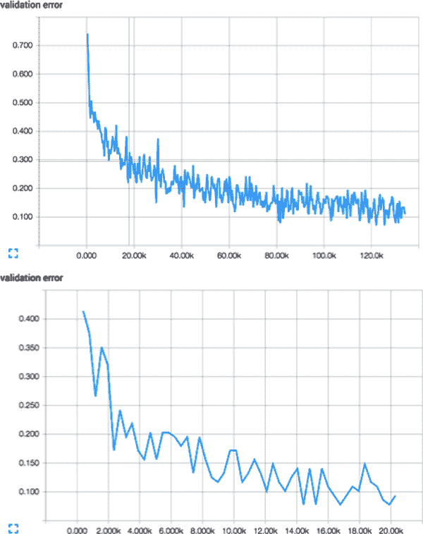

# 第七章：卷积神经网络

# 人类视觉中的神经元

人类的视觉感知能力是令人难以置信的先进。在几秒钟内，我们可以在视野范围内识别物体，毫不犹豫地，毫不费力。我们不仅可以命名我们看到的物体，还可以感知它们的深度，完美地区分它们的轮廓，并将物体与背景分开。不知何故，我们的眼睛接收到了原始的彩色数据体素，但我们的大脑将这些信息转化为更有意义的基元——线条、曲线和形状——这些基元可能表明，例如，我们正在看一只家猫。¹

人类视觉的基础是神经元。专门的神经元负责在人眼中捕捉光信息。²然后，这些光信息经过预处理，传输到大脑的视觉皮层，最终被完全分析。神经元单独负责所有这些功能。因此，直觉上，将我们的神经网络模型扩展到构建更好的计算机视觉系统是有很多道理的。在本章中，我们将利用对人类视觉的理解来构建有效的深度学习模型，解决图像问题。但在我们深入研究之前，让我们看看更传统的图像分析方法以及它们为什么存在缺陷。

# 特征选择的缺陷

让我们从考虑一个简单的计算机视觉问题开始。我给你一张随机选择的图像，比如图 7-1 中的图像。你的任务是告诉我这张图片中是否有一个人脸。这正是保罗·维奥拉和迈克尔·琼斯在他们 2001 年发表的开创性论文中解决的问题。³


###### 图 7-1。一个假设的人脸识别算法应该能够在这张前美国总统巴拉克·奥巴马的照片中检测到一个人脸

对于像你我这样的人类来说，这个任务完全是微不足道的。然而，对于计算机来说，这是一个困难的问题。我们如何教会计算机一张图像包含一个人脸？我们可以尝试训练一个传统的机器学习算法（就像我们在第三章中描述的那样），给它图像的原始像素值，并希望它能找到一个合适的分类器。结果表明，这根本行不通，因为信噪比太低，无法进行任何有用的学习。我们需要另一种方法。

最终达成的妥协基本上是传统计算机程序和纯机器学习方法之间的一种权衡，其中人类定义了所有逻辑，而计算机则承担了所有繁重的工作。在这种妥协中，人类将选择他们认为在做出分类决策时重要的特征（也许是数百或数千个）。这样做，人类将为同一学习问题生成一个较低维度的表示。然后，机器学习算法将使用这些新的*特征向量*来做出分类决策。由于*特征提取*过程提高了信噪比（假设选择了适当的特征），这种方法与当时的最新技术相比取得了相当大的成功。

Viola 和 Jones 有一个洞察，即人脸具有一定的光亮和暗斑块模式，他们可以利用这一点。例如，眼部区域和上颊之间的光强度有所不同。鼻梁和两侧眼睛之间的光强度也有所不同。这些检测器显示在图 7-2 中。


###### 图 7-2。Viola-Jones 强度检测器

这些特征本身并不是很有效地识别面孔。但是当它们一起使用时（通过一个被称为增强的经典机器学习算法，描述在原始手稿中），它们的联合效果大大增加。在一个包含 130 张图像和 507 张面孔的数据集上，该算法实现了 91.4%的检测率，有 50 个误报。当时的性能是无与伦比的，但该算法存在根本性的局限性。如果一个面孔部分被阴影遮盖，光强度比较将不再起作用。此外，如果算法看到的是一个被折叠的传单上的面孔或者卡通人物的面孔，它很可能会失败。

问题在于该算法并没有真正学到“看见”面孔的含义。除了光强度的差异之外，我们的大脑使用大量的视觉线索来认识到我们的视野中包含一个人脸，包括轮廓、面部特征的相对位置和颜色。即使我们的视觉线索中有轻微的差异（例如，如果面部的某些部分被遮挡或者阴影改变了光强度），我们的视觉皮层仍然可以可靠地识别面孔。

要使用传统的机器学习技术教会计算机“看见”，我们需要提供程序更多的特征以做出准确的决策。在深度学习出现之前，庞大的计算机视觉研究团队需要花费数年时间讨论不同特征的有用性。随着识别问题变得越来越复杂，研究人员很难应对复杂性的增加。

展示深度学习的力量，考虑一下 ImageNet 挑战，这是计算机视觉中最负盛名的基准之一（有时甚至被称为计算机视觉的奥林匹克）。每年，研究人员尝试将图像分类为大约 450,000 张图像的训练数据集中的 200 个可能类别之一。算法有五次猜测正确答案的机会，然后才会继续测试数据集中的下一张图像。比赛的目标是推动计算机视觉的最新技术达到与人类视觉本身相媲美的准确度（大约 95%至 96%）。

2011 年，ImageNet 基准的获胜者错误率为 25.7%，在四张图像中犯了一个错误。绝对是比随机猜测有了巨大的改进，但对于任何商业应用来说还不够好。然后在 2012 年，来自多伦多大学 Geoffrey Hinton 实验室的 Alex Krizhevsky 做了一件令人难以置信的事情。他首次在这样规模和复杂性的挑战中开创了一种被称为卷积神经网络的深度学习架构，他击败了竞争对手。比赛中的亚军错误率为 26.1%。但是 AlexNet 在短短几个月的工作中，以大约 16%的错误率完全击败了 50 年传统计算机视觉研究。毫不夸张地说，AlexNet 单枪匹马地将深度学习推向了计算机视觉的前沿，并彻底改变了这一领域。

# 香草深度神经网络不具备可扩展性

将深度学习应用于计算机视觉的基本目标是消除繁琐且最终限制性的特征选择过程。正如我们在第三章中讨论的，深度神经网络非常适合这个过程，因为神经网络的每一层都负责学习和构建特征，以表示其接收到的输入数据。一个天真的方法可能是使用我们在第五章中为 MNIST 数据集设计的网络层原语，来实现图像分类任务。

然而，如果我们尝试以这种方式解决图像分类问题，我们将很快面临一个相当艰巨的挑战，如图 7-3 中形象地展示的。在 MNIST 中，我们的图像只有 28×28 像素，是黑白的。因此，完全连接的隐藏层中的一个神经元将有 784 个输入权重。对于 MNIST 任务来说，这似乎是相当可控的，我们的普通神经网络表现得相当不错。然而，随着图像变得更大，这种技术并不适用。例如，对于一个全彩色的 200×200 像素图像，我们的输入层将有 200×200×3=120,000 个权重。而且我们希望在多个层中有很多这样的神经元，因此这些参数会非常迅速地累积。显然，这种全连接不仅是浪费的，而且意味着我们更有可能过度拟合训练数据集。


###### 图 7-3。随着图像尺寸的增加，层之间的连接密度呈不可控增加

卷积网络利用我们分析图像的事实，并合理地限制深度网络的架构，从而大大减少模型中的参数数量。受到人类视觉工作方式的启发，卷积网络的层中的神经元以三维方式排列，因此层具有宽度、高度和深度，如图 7-4 所示。⁷

正如我们将看到的，卷积层中的神经元仅连接到前一层的一个小区域，因此我们避免了全连接神经元的浪费。卷积层的功能可以简单地表达为：它处理一个三维信息体积，以产生一个新的三维信息体积。我们将在下一节更详细地看一下这是如何工作的。


###### 图 7-4。卷积层以三维方式排列神经元，因此层具有宽度、高度和深度

# 滤波器和特征图

为了激发卷积层的基本原理，让我们建立对人类大脑如何将原始视觉信息拼接成我们周围世界理解的直觉。在这个领域最有影响力的研究之一来自 David Hubel 和 Torsten Wiesel，他们发现视觉皮层的部分负责检测边缘。1959 年，他们在猫的大脑中插入电极，并在屏幕上投射黑白图案。他们发现一些神经元只有在有垂直线时才会发射，其他神经元只有在有水平线时才会发射，还有一些神经元只有在线条呈特定角度时才会发射。⁸

进一步的研究确定了视觉皮层是分层组织的。每一层负责在前一层检测到的特征基础上构建——从线条到轮廓，再到形状，最终到整个对象。此外，在视觉皮层的每一层中，相同的特征检测器在整个区域中复制，以便在图像的所有部分检测特征。这些想法对卷积神经网络的设计产生了重大影响。

首先出现的概念是*滤波器*，事实证明，Viola 和 Jones 在这里实际上非常接近。滤波器本质上是一个特征检测器，要理解它是如何工作的，让我们考虑图 7-5 中的玩具图像。


###### 图 7-5。我们将分析这个简单的黑白图像作为一个玩具示例

假设我们想要在图像中检测垂直和水平线。一种方法是使用适当的特征检测器，如图 7-6 所示。例如，要检测垂直线，我们将使用顶部的特征检测器，在整个图像上滑动它，并在每一步检查是否有匹配。我们在右上角的矩阵中跟踪我们的答案。如果有匹配，我们将适当的框涂黑。如果没有，我们将其保留为白色。这个结果就是我们的特征图，它指示了我们在原始图像中找到我们正在寻找的特征的位置。我们可以对水平线检测器（底部）执行相同的操作，得到右下角的特征图。


###### 图 7-6。在我们的玩具示例上应用检测垂直和水平线的滤波器

这个操作被称为卷积。我们取一个滤波器，将其乘以输入图像的整个区域。使用以下方案，让我们尝试将这个操作表示为网络中的神经元。在这个方案中，前馈神经网络中的神经元层代表原始图像或特征图。滤波器代表连接的组合（其中一种组合在图 7-7 中突出显示），这些连接在整个输入中被复制。在图 7-7 中，相同颜色的连接被限制为始终具有相同的权重。我们可以通过使用相同权重初始化组中的所有连接，并在每次反向传播迭代结束前始终平均组的权重更新来实现这一点。输出层是由该滤波器生成的特征图。如果贡献到其活动的滤波器在前一层的相应位置检测到适当的特征，则特征图中的神经元将被激活。


###### 图 7-7。将滤波器和特征图表示为卷积层中的神经元

让我们将第 k 个特征图在层 m 中表示为 mk。此外，让我们用其权重值 W 表示相应的滤波器。然后，假设特征图中的神经元具有偏置 bk（注意，偏置对于特征图中的所有神经元保持相同），我们可以用数学方式表示特征图如下：

<math alttext="m Subscript i j Superscript k Baseline equals f left-parenthesis left-parenthesis upper W asterisk x right-parenthesis Subscript i j Baseline plus b Superscript k Baseline right-parenthesis"><mrow><msubsup><mi>m</mi> <mrow><mi>i</mi><mi>j</mi></mrow> <mi>k</mi></msubsup> <mo>=</mo> <mi>f</mi> <mrow><mo>(</mo> <msub><mrow><mo>(</mo><mi>W</mi><mo>*</mo><mi>x</mi><mo>)</mo></mrow> <mrow><mi>i</mi><mi>j</mi></mrow></msub> <mo>+</mo> <msup><mi>b</mi> <mi>k</mi></msup> <mo>)</mo></mrow></mrow></math>

这种数学描述简单而简洁，但并不能完全描述滤波器在卷积神经网络中的使用方式。具体来说，滤波器不仅仅作用于单个特征图。它们作用于在特定层生成的整个特征图体积。例如，考虑这样一种情况，我们想要在卷积网络的特定层检测一张脸。我们已经累积了三个特征图，一个用于眼睛，一个用于鼻子，一个用于嘴巴。我们知道，如果原始特征图中的相应位置包含适当的特征（两只眼睛，一个鼻子和一个嘴巴），那么特定位置包含一张脸。换句话说，为了对脸的存在做出决定，我们必须结合多个特征图上的证据。对于全彩输入图像同样必要。这些图像的像素表示为 RGB 值，因此我们需要输入体积中的三个切片（每种颜色一个切片）。因此，特征图必须能够在体积上操作，而不仅仅是在区域上。这在图 7-8 中显示。输入体积中的每个单元都是一个神经元。局部部分与滤波器（对应于卷积层中的权重）相乘，以在下一个神经元体积层中产生一个滤波器映射中的神经元。


###### 图 7-8。将全彩 RGB 图像作为体积并应用体积卷积滤波器

正如我们在前一节中讨论的，卷积层（由一组滤波器组成）将一个值体积转换为另一个值体积。滤波器的深度对应于输入体积的深度。这样，滤波器可以结合从已学习的所有特征中获得的信息。卷积层的输出体积的深度等于该层中的滤波器数量，因为每个滤波器产生自己的切片。我们在图 7-9 中可视化这些关系。


###### 图 7-9。卷积层的三维可视化，其中每个滤波器对应于结果输出体积中的一个切片

在下一节中，我们将利用这些概念并填补一些空白，以创建卷积层的完整描述。

# 卷积层的完整描述

让我们利用迄今为止我们已经开发的概念来完成对卷积层的描述。首先，卷积层接收一个输入体积。这个输入体积具有以下特征：

+   它的宽度<math alttext="w Subscript i n"><msub><mi>w</mi> <mrow><mi>i</mi><mi>n</mi></mrow></msub></math>

+   它的高度<math alttext="h Subscript i n"><msub><mi>h</mi> <mrow><mi>i</mi><mi>n</mi></mrow></msub></math>

+   它的深度<math alttext="d Subscript i n"><msub><mi>d</mi> <mrow><mi>i</mi><mi>n</mi></mrow></msub></math>

+   它的零填充<math alttext="p"><mi>p</mi></math>

这个体积由总共<math alttext="k"><mi>k</mi></math>个滤波器处理，代表卷积网络中的权重和连接。这些滤波器有一些超参数，描述如下：

+   它们的空间范围<math alttext="e"><mi>e</mi></math>，等于滤波器的高度和宽度。

+   它们的步幅<math alttext="s"><mi>s</mi></math>，或者滤波器在输入体积上连续应用的距离。如果我们使用步幅为 1，我们得到了前一节中描述的完整卷积。我们在图 7-10 中进行了说明。

+   偏置<math alttext="b"><mi>b</mi></math>（像滤波器中的值一样学习的参数），添加到卷积的每个分量中。


###### 图 7-10。滤波器的步幅超参数

这导致输出体积具有以下特征：

+   应用于输出体积中每个神经元的传入逻辑的函数 f，以确定其最终值

+   输出体积的宽度为输入体积减去 e 加 2p 除以 s 的上限值加 1

+   输出体积的高度为输入体积减去 e 加 2p 除以 s 的上限值加 1

+   输出体积的深度为 k

第 m 个“深度切片”对应于应用于输入体积上的第 m 个滤波器和偏置 b 的函数 f 的总和。此外，这意味着每个滤波器有 d 个参数。总的来说，这意味着该层有 kd 个参数和 k 个偏置。为了演示这一点，我们提供了一个卷积层的示例，其中输入体积为 5×5×3，使用零填充 p=1。我们将使用两个 3×3×3 的滤波器（空间范围），步长 s=2。我们将使用线性函数生成输出体积，大小为 3×3×2。我们将第一个卷积滤波器应用于输入体积的左上角 3×3 部分，以生成第一个深度切片的左上角条目。

通常，保持滤波器尺寸较小（3×3 或 5×5）是明智的。较少见的是，使用较大的尺寸（7×7），但仅在第一个卷积层中使用。使用更多小滤波器是实现高表征能力的简单方法，同时也带来较少的参数。建议使用步长为 1 来捕获特征图中的所有有用信息，并使用零填充来保持输出体积的高度和宽度等于输入体积的高度和宽度。


###### 图 7-11。一个宽度为 5、高度为 5、深度为 3、零填充 1、2 个滤波器（空间范围为 3，步长为 2）的输入体积，结果为 3×3×2 的输出体积


###### 图 7-12。使用与图 7-11 相同的设置，我们生成输出体积的第一个深度切片中的下一个值

PyTorch 为我们提供了一个方便的操作，可以轻松地在输入体积的小批量上执行 2D 卷积：

```py
import torch.nn as nn

layer = nn.Conv2d(in_channels = 3,
                  out_channels = 64,
                  kernel_size = (5, 5),
                  stride = 2,
                  padding = 1
                  )
```

这里，`in_channels`表示深度，<math alttext="d Subscript i n"><msub><mi>d</mi> <mrow><mi>i</mi><mi>n</m></row></msub></math>，或输入平面的数量。对于彩色图像，输入通道的数量通常等于三，表示 RGB 通道。`nn.Conv2d`层将接受一个四维张量作为输入，大小为<math alttext="b Subscript i n Baseline asterisk d Subscript i n Baseline asterisk h Subscript i n Baseline asterisk w Subscript i n"><mrow><msub><mi>b</mi> <mrow><mi>i</mi><mi>n</m></row></msub> <mo>*</mo> <msub><mi>d</mi> <mrow><mi>i</mi><mi>n</m></row></msub> <mo>*</mo> <msub><mi>h</mi> <mrow><mi>i</mi><mi>n</m></row></msub> <mo>*</mo> <msub><mi>w</mi> <mrow><mi>i</mi><mi>n</m></row></msub></mrow></math>，其中<math alttext="b Subscript i n"><msub><mi>b</mi> <mrow><mi>i</mi><mi>n</m></row></msub></math>是我们小批量中示例的数量。

`out_channels`参数表示输出平面或特征图的数量。`kernel_size`参数确定滤波器大小或*空间范围，<math alttext="e"><mi>e</mi></math>，*而`stride`和`padding`参数确定步幅大小，<math alttext="s"><mi>s</mi></math>，和零填充大小，<math alttext="p"><mi>p</mi></math>，分别。请注意，您可以通过传递单个值来传递相等的维度设置，如此处所示的步幅和填充。

# 最大池化

为了积极减少特征图的维度并锐化定位的特征，我们有时会在卷积层之后插入一个[*最大池化*层](https://oreil.ly/HOYaa)。最大池化背后的基本思想是将每个特征图分成相同大小的瓦片。然后我们创建一个压缩的特征图。具体来说，我们为每个瓦片创建一个单元格，计算瓦片中的最大值，并将此最大值传播到压缩特征图的相应单元格中。这个过程在图 7-13 中有所说明。

！[](Images/fdl2_0713.png)

###### 图 7-13。最大池化在网络上移动时显著减少参数

更严格地说，我们可以用两个参数描述一个池化层：

+   其空间范围<math alttext="e"><mi>e</mi></math>

+   其步幅<math alttext="s"><mi>s</mi></math>

重要的是要注意，池化层仅使用了两种主要变体。第一种是非重叠池化层，其中<math alttext="e equals 2 comma s equals 2"><mrow><mi>e</mi> <mo>=</mo> <mn>2</mn> <mo>,</mo> <mi>s</mi> <mo>=</mo> <mn>2</mn></mrow></math>。第二种是重叠池化层，其中<math alttext="e equals 3 comma s equals 2"><mrow><mi>e</mi> <mo>=</mo> <mn>3</mn> <mo>,</mo> <mi>s</mi> <mo>=</mo> <mn>2</mn></mrow></math>。每个特征图的结果维度如下：

+   其宽度<math alttext="w Subscript o u t Baseline equals left ceiling StartFraction w Subscript i n Baseline minus e Over s EndFraction right ceiling plus 1"><mrow><msub><mi>w</mi> <mrow><mi>o</mi><mi>u</mi><mi>t</mi></mrow></msub> <mo>=</mo> <mfenced separators="" open="⌈" close="⌉"><mfrac><mrow><msub><mi>w</mi> <mrow><mi>i</mi><mi>n</mi></mrow></msub> <mo>-</mo><mi>e</mi></mrow> <mi>s</mi></mfrac></mfenced> <mo>+</mo> <mn>1</mn></mrow></math>

+   其高度<math alttext="h Subscript o u t Baseline equals left ceiling StartFraction h Subscript i n Baseline minus e Over s EndFraction right ceiling plus 1"><mrow><msub><mi>h</mi> <mrow><mi>o</mi><mi>u</mi><mi>t</mi></mrow></msub> <mo>=</mo> <mfenced separators="" open="⌈" close="⌉"><mfrac><mrow><msub><mi>h</mi> <mrow><mi>i</mi><mi>n</mi></mrow></msub> <mo>-</mo><mi>e</mi></mrow> <mi>s</mi></mfrac></mfenced> <mo>+</mo> <mn>1</mn></mrow></math>

最大池化的一个有趣特性是它是*局部不变的*。这意味着即使输入稍微移动，最大池化层的输出保持不变。这对视觉算法有重要的影响。如果我们更关心某个特征是否存在而不是它确切的位置，局部不变性是一个有用的特性。然而，强制大量的局部不变性可能破坏我们网络传递重要信息的能力。因此，我们通常保持池化层的空间范围相当小。

最近有一些工作是由华威大学的格雷厄姆提出的，他提出了一个概念叫做*分数最大池化*。在分数最大池化中，使用伪随机数生成器生成具有非整数长度的瓦片进行池化。在这里，分数最大池化作为一个强正则化器，有助于防止卷积网络过拟合。

# 卷积网络的完整架构描述

现在我们已经描述了卷积网络的构建模块，我们开始将它们组合起来。图 7-14 描述了几种可能有实际用途的架构。

当我们构建更深层次的网络时，我们注意到一个主题是减少池化层的数量，而是在每个池化层之前堆叠多个卷积层。这通常是有帮助的，因为池化操作本质上是破坏性的。在每个池化层之前堆叠几个卷积层允许我们获得更丰富的表示。


###### 图 7-14。各种复杂性的卷积网络架构

作为一个实际的注意事项，深度卷积网络可能占用大量空间，大多数业余从业者通常受限于 GPU 的内存容量。例如，VGGNet 架构在每个图像的前向传递中大约占用 90 MB 的内存，在后向传递中更新参数时占用超过 180 MB 的内存。许多深度网络通过在第一个卷积层中使用步幅和空间范围来减少需要向网络上传播的信息量来做出妥协。

# 用卷积网络关闭 MNIST 循环

现在我们对如何构建有效分析图像的网络有了更好的理解，我们将重新审视我们在过去几章中处理的 MNIST 挑战。在这里，我们将使用卷积网络来学习如何识别手写数字。我们的前馈网络能够达到 98.2%的准确率。我们的目标是在这个结果上取得进展。

为了解决这个挑战，我们将构建一个具有相当标准架构的卷积网络（模仿图 7-14 中的第二个网络）：两个卷积/ReLU/最大池化堆栈，后面是一个带有丢失和终端全连接层的全连接层。在 PyTorch 中使用内置的`nn`类很容易构建网络，如下面的代码所示：

```py
class MNISTConvNet(nn.Module):
  def __init__(self):
    super(MNISTConvNet, self).__init__()
    self.conv1 = nn.Sequential(
        nn.Conv2d(1, 32, 5, padding='same'),
        nn.ReLU(),
        nn.MaxPool2d(2)
    )
    self.conv2 = nn.Sequential(
        nn.Conv2d(32, 64, 5, padding='same'),
        nn.ReLU(),
        nn.MaxPool2d(2)
    )
    self.fc1 = nn.Sequential(
        nn.Flatten(),
        nn.Linear(7*7*64, 1024),
        nn.Dropout(0.5),
        nn.Linear(1024, 10)
    )

  def forward(self, x):
    x = self.conv1(x)
    x = self.conv2(x)
    return self.fc1(x)

```

`__init__`方法生成两个`Conv2d/ReLU/MaxPool`块，然后是一个包含两个全连接层的块。卷积层是以特定形状创建的。默认情况下，步幅设置为 1，而填充设置为`same`以保持输入和输出张量之间的宽度和高度恒定。默认情况下，每个`nn.Conv2d`构造函数会自动初始化权重。

最大池化层由大小为`k`的非重叠窗口组成。默认值，如建议的，是`k=2`，我们将在我们的 MNIST 卷积网络中使用这个默认值。

前向方法定义了我们的层和块如何连接在一起执行前向传递或推理。

这里的代码非常容易理解。输入预期是一个大小为<math alttext="upper N times 1 times 28 times 28"><mrow><mi>N</mi> <mo>×</mo> <mn>1</mn> <mo>×</mo> <mn>28</mn> <mo>×</mo> <mn>28</mn></mrow></math>的张量，其中 N 是小批量中的示例数，28 是每个图像的宽度和高度，1 是深度（因为图像是黑白的；如果图像是 RGB 颜色，深度将是 3，以表示每个颜色映射）。

第一个块`conv1`构建了一个具有 32 个滤波器和空间范围为 5 的卷积层。这导致将深度为 1 的输入体积转换为深度为 32 的输出张量。然后通过一个最大池化层传递，压缩信息。第二个块`conv2`然后构建了一个具有 64 个滤波器和空间范围为 5 的第二个卷积层，将深度为 32 的输入张量转换为深度为 64 的输出张量。同样，通过一个最大池化层传递，压缩信息。

然后，我们准备将最大池化层的输出传递到一个全连接层。为了做到这一点，我们需要展平张量。我们可以通过计算小批量中每个“子张量”的完整大小来实现这一点。我们有 64 个滤波器，对应于 64 的深度。现在我们需要确定通过两个最大池化层后的高度和宽度。使用我们在前一节中找到的公式，很容易确认每个特征图的高度和宽度为 7。请您自行确认这一点。

我们使用一个全连接层将展平的表示压缩成大小为 1,024 的隐藏状态。在训练过程中，我们在这一层使用 0.5 的丢失概率，在模型评估过程中使用 1（使用丢失的标准程序）。最后，我们将这个隐藏状态发送到一个具有 10 个箱子的输出层（通常在`loss`构造函数中执行 softmax 以获得更好的性能）。

最后，我们使用 Adam 优化器训练我们的网络。经过几个纪元的数据集，我们实现了 99.4%的准确率，这虽然不是最先进的（大约为 99.7 到 99.8%），但是还是令人尊敬的：

```py
lr = 1e-4
num_epochs = 40

model = MNISTConvNet()
loss_fn = nn.CrossEntropyLoss()
optimizer = optim.SGD(model.parameters(), lr=lr)

for epochs in range(num_epochs):
  running_loss = 0.0
  num_correct = 0
  for inputs, labels in trainloader:
    optimizer.zero_grad()
    outputs = model(inputs)
    loss = loss_fn(outputs, labels)
    loss.backward()
    running_loss += loss.item()
    optimizer.step()
    _, idx = outputs.max(dim=1)
    num_correct += (idx == labels).sum().item()
  print('Loss: {} Accuracy: {}'.format(running_loss/len(trainloader),
        num_correct/len(trainloader)))

```

# 图像预处理管道使模型更加健壮。

到目前为止，我们一直在处理相当温顺的数据集。为什么 MNIST 是一个温顺的数据集呢？基本上，MNIST 已经经过预处理，使数据集中的所有图像相互类似。手写数字被完美地裁剪，没有颜色异常，因为 MNIST 是黑白的，等等。然而，自然图像是一种完全不同的动物。

自然图像是混乱的，因此有许多预处理操作可以使训练稍微容易一些。幸运的是，PyTorch 提供了一个名为 Torchvision 的包，其中包含许多常用的图像处理变换。PyTorch 中支持的一种技术是图像白化。白化背后的基本思想是通过减去数据集的均值并归一化为单位 1 方差来使图像中的每个像素居中为零。这有助于我们纠正图像之间动态范围的潜在差异。在 PyTorch 中，我们可以使用`Normalize`变换来实现这一点：

```py
from torchvision import transforms

transform = transforms.Normalize(mean = (0.1307,),
                                 std = (0.3081,)
                                 )

```

`mean`的魔术数字为 0.1307，`std`为 0.3081，是在整个 MNIST 数据集上计算得出的，这种技术称为数据集归一化。我们还可以通过随机裁剪图像、翻转图像、修改饱和度、修改亮度等方式来人为地扩展我们的数据集：

```py
transform = transforms.Compose([
      transforms.RandomCrop(224),
      transforms.RandomHorizontalFlip(),
      transforms.ColorJitter(brightness=0,
                             contrast=0,
                             saturation=0,
                             hue=0),
      transforms.ToTensor(),
      transforms.Normalize(mean = (0.1307,),
                           std = (0.3081,)
                           )
      ])

```

在这里，我们使用`Compose`变换来从列表中创建一系列变换。在应用随机裁剪、翻转和颜色调整后，我们将图像数据转换为 PyTorch 张量并对数据进行归一化。PyTorch 模型要求数据以张量格式呈现，这两个最后步骤在使用 PyTorch 进行深度学习时是常见的做法。

应用这些转换有助于我们构建对自然图像中存在的不同类型变化具有鲁棒性的网络，并且尽管可能存在扭曲，但可以高度准确地进行预测。

# 使用批量归一化加速训练

2015 年，来自谷歌的研究人员设计了一种令人兴奋的方法，进一步加速前馈和卷积神经网络的训练，使用一种称为*批量归一化*的技术。我们可以将批量归一化背后的直觉想象成一堆积木，如图 7-15 所示。

当一堆积木被整齐地堆叠在一起时，结构是稳定的。然而，如果我们随机移动积木，我们可能会迫使塔处于越来越不稳定的配置中。最终，塔会倒塌。

在训练神经网络的过程中也会出现类似的现象。想象一个两层神经网络。在训练网络的权重过程中，底层神经元的输出分布开始发生变化。底层输出分布的变化意味着顶层不仅需要学习如何进行适当的预测，还需要以某种方式调整自身以适应输入分布的变化。这显著减慢了训练速度，问题的严重程度随着网络层数的增加而增加。


###### 图 7-15。批量归一化减少了层输入的分布偏移

对图像输入进行归一化有助于训练过程，使其更具鲁棒性。批量归一化进一步通过将输入归一化到神经网络中的每一层来实现这一点。具体来说，我们修改网络的架构以包括以下操作：

1.  在通过非线性函数之前，获取传入层的 logits 向量。

1.  通过从所有小批量示例中减去均值并除以标准差来归一化 logits 向量的每个分量（我们使用指数加权移动平均值来跟踪这些时刻）。

1.  给定归一化输入**x**̂，使用一个仿射变换来恢复表示能力，其中包括两个（可训练的）参数向量：γ**x**̂ + β。

PyTorch 提供了一个`BatchNorm2d`类，用于为卷积层执行批量归一化：

```py
layer = nn.BatchNorm2d(num_features=32,
                       eps=1e-05,
                       momentum=0.1,
                       affine = True,
                       track_running_stats = True)

```

这里，`num_features`参数表示批量归一化层输入的深度或通道数。因此，批量归一化是在通道维度上执行的，计算每个 2D 通道的小批量的均值和方差。`num_features`是唯一必需的参数。所有其他参数都设置为默认值。

`BatchNorm2d`层执行以下`affine`变换：

<math alttext="y equals StartFraction x minus upper E left-bracket x right-bracket Over StartRoot upper V a r left-bracket x right-bracket plus epsilon EndRoot EndFraction asterisk gamma plus beta"><mrow><mi>y</mi> <mo>=</mo> <mfrac><mrow><mi>x</mi><mo>-</mo><mi>E</mi><mo>[</mo><mi>x</mi><mo>]</mo></mrow> <msqrt><mrow><mi>V</mi><mi>a</mi><mi>r</mi><mo>[</mo><mi>x</mi><mo>]</mo><mo>+</mo><mi>ϵ</mi></mrow></msqrt></mfrac> <mo>*</mo> <mi>γ</mi> <mo>+</mo> <mi>β</mi></mrow></math>

参数<math alttext="gamma"><mi>γ</mi></math>和<math alttext="beta"><mi>β</mi></math>是可学习的参数，如果`affine = True`，它们将在训练过程中进行训练。否则，从输入中减去均值并除以标准差进行归一化。参数<math alttext="epsilon"><mi>ϵ</mi></math>仅用于数学稳定性。

当`track_running_stats = True`时，此层将跟踪用于评估模式的运行均值和方差。运行均值和方差使用`momentum`值进行更新。

我们还可以通过使用`BatchNorm1d`构造函数来为非卷积前馈层表达批量归一化。在这里，我们只设置`num_features = 32`，并对其他参数使用默认值：

```py
layer = nn.BatchNorm1d(num_features=32)

```

除了通过防止输入到每一层的分布发生显著变化来加快训练速度外，批量归一化还允许我们显著增加学习速率。此外，批量归一化还充当正则化器，消除了对辍学和（当使用时）L2 正则化的需求。尽管我们在这里没有利用它，但作者还声称，批量正则化在很大程度上消除了对光度失真的需求，我们可以在训练过程中向网络暴露更多“真实”图像。在下一节中，我们将激励并讨论一种沿特征轴而不是批处理轴的归一化变体。

# 内存受限学习任务的组归一化

在过去的十年中，图像处理中的各种归一化形式已经被研究和利用。其中最著名的是批量归一化。仅从前一节回顾一下，这种技术计算每个卷积层输出的通道均值和方差，使用计算出的统计数据对每个通道进行归一化，然后将归一化的输出馈送到下一个卷积层。因此，归一化输出中的任何给定通道在批次中将具有相同的均值和方差（分别为零和一）。在实践中，模型还将学习一个均值参数β和一个标准差参数γ，然后将它们应用于归一化的输出，使其在馈送到后续层之前具有均值β和标准差γ。这个过程用于减少任何给定通道从一个批次到下一个批次的分布偏移。请注意，这只是减少偏移而不是完全消除它，因为通道分布可能仍然在一个批次到下一个批次看起来完全不同，尽管它们具有相同的均值和方差。从理论上讲，并且根据经验观察，减少这种内部协变量偏移可以稳定训练并产生强大的性能增益。

然而，在批量大小较大的情况下，通道均值和方差的计算会导致较大的内存成本。此外，批量归一化对批量大小的大小非常重要，因为较小的批量大小会由于嘈杂的均值和方差估计而显著降低性能。为了避免沿批处理维度进行计算带来的问题，*组归一化*被引入。¹²组归一化不是沿着批处理维度进行归一化，而是沿着通道维度进行归一化，因此不受前述问题的影响。组归一化预定义了一些通道组，并且对于每个实例，在每个批次实例中计算每个通道组的均值μ和方差σ。每组计算出的β和γ参数集用于对归一化的条目集进行归一化。此外，类似于批量归一化，为每个条目集单独学习偏移/均值参数β和缩放/标准差参数γ。

这类似于另一种流行的技术，称为*层归一化*，它实际上是批量归一化，但是跨越通道维度的整个长度，而不是整个批处理维度的长度。请注意，层归一化也只是组归一化的一个特例，其中通道组的数量设置为一。图 7-16 比较了批量归一化、组归一化和层归一化。每个立方体中的被阻挡的部分展示了归一化发生的维度以及一起归一化的条目组。请注意，为了可视化目的，我们将标准的 4D 表示压缩为 3D。


###### 图 7-16。批量归一化、层归一化和组归一化的比较

也许你会想知道为什么像组归一化和层归一化这样的技术会有效。毕竟，似乎批量归一化之所以有效是因为强制每个特征（或在我们的情况下是通道）具有相同的均值和方差。对于一些见解，关于层归一化的最初论文指出，为每个实例单独归一化特征的原因是“一层输出的变化往往会导致下一层的输入总和发生高度相关的变化”。总之，前馈网络中构成每个后续层的神经元将从一个训练示例到下一个训练示例看到相同的统计数据。

此外，为什么选择组归一化而不是层归一化？在吴等人的研究中，使用组归一化的想法是它比层归一化更不受限制-可以为每组特征学习不同的分布，表示可以学习不同组的贡献和重要性水平。

现在我们已经充分介绍了作为概念的组归一化，它与先前工作的联系，以及在实践中使用组归一化的动机，我们现在可以深入一些 PyTorch 代码来实现组归一化。

PyTorch 提供了一个`torch.nn.GroupNorm`类来创建组归一化层：

```py
layer = nn.GroupNorm(num_groups=1,
                     num_channels=32)

```

我们只需要指定组数和通道数。现在我们已经开发了一个增强的工具包，用于分析具有卷积网络的自然图像，我们将为解决 CIFAR-10 挑战构建一个分类器。

# 为 CIFAR-10 构建卷积网络

CIFAR-10 挑战包括属于 10 个可能类别之一的 32×32 彩色图像。这是一个令人惊讶的难题，因为即使对于人类来说，弄清楚图片中的内容也可能很困难。一个示例显示在图 7-17 中。


###### 图 7-17。CIFAR-10 数据集中的一只狗

在本节中，我们将构建具有和不具有批量归一化的网络作为比较基础。我们将批量归一化网络的学习率增加 10 倍，以充分利用其优势。这里我们只显示批量归一化网络的代码，因为构建普通卷积网络类似。

我们扭曲输入图像的随机 24×24 裁剪，以供网络训练。我们使用谷歌提供的示例代码来实现这一点。让我们直接进入网络架构。首先，让我们看看如何将批量归一化集成到卷积和全连接层中。正如预期的那样，批量归一化发生在将逻辑输入非线性之前：

```py
class Net(nn.Module):
    def __init__(self):
        super(Net, self).__init__()
        self.block1 = nn.Sequential(
            nn.Conv2d(1, 32, 3, 1),
            nn.BatchNorm2d(32),
            nn.ReLU(inplace=True),
            nn.Conv2d(32, 64, 3, 1),
            nn.BatchNorm2d(64),
            nn.ReLU(inplace=True),
            nn.MaxPool2d(2),
            nn.Dropout(0.25),
        )
        self.block2 = nn.Sequential(
            nn.Flatten(),
            nn.Linear(9216, 128),
            nn.BatchNorm1d(128),
            nn.ReLU(inplace=True),
            nn.Dropout(0.5),
            nn.Linear(128,10),
            nn.BatchNorm1d(10)
        )

    def forward(self, x):
        x = self.block1(x)
        return self.block2(x)

```

最后，我们使用 Adam 优化器来训练我们的卷积网络。经过一段时间的训练，我们的网络能够在没有批量归一化的情况下实现 92.3%的准确率，在批量归一化的情况下实现 96.7%的准确率。这个结果实际上与（甚至可能超过）当前这项任务的最新研究相匹配。在下一节中，我们将更仔细地研究学习并可视化我们的网络的表现。

# 在卷积网络中可视化学习

在高层次上，我们可以做的最简单的事情是随着训练的进行，绘制成本函数和验证错误随时间的变化。通过比较两个网络之间的收敛速度，我们可以清楚地展示批量归一化的好处。训练过程中的图表显示在图 7-18 中。



###### 图 7-18。训练一个没有批量归一化的卷积网络（左）与有批量归一化的卷积网络（右）

没有批量归一化，要突破 90%的准确率阈值需要超过 80,000 个小批量。另一方面，使用批量归一化，跨越相同的阈值只需要略多于 14,000 个小批量。

我们还可以检查卷积网络学习的滤波器，以了解网络认为对其分类决策重要的内容。卷积层学习分层表示，因此我们希望第一个卷积层学习基本特征（边缘、简单曲线等），第二个卷积层将学习更复杂的特征。不幸的是，即使我们决定可视化它，第二个卷积层也很难解释，因此我们只包括第一层滤波器在图 7-19 中。


###### 图 7-19。我们网络第一个卷积层中学习到的滤波器的一个子集

我们可以在我们的滤波器中看到许多有趣的特征：垂直、水平和对角边缘，以及由另一种颜色包围的小点或斑点。我们可以确信我们的网络正在学习相关特征，因为这些滤波器不仅仅是噪音。

我们还可以尝试可视化网络如何学习以图像形式聚类各种图像。为了说明这一点，我们采用一个在 ImageNet 挑战赛上训练过的大型网络，然后获取在每个图像的 softmax 之前完全连接层的隐藏状态。然后，我们采用称为*t-分布随机邻居嵌入*或*t-SNE*的算法，将每个图像的高维表示压缩到我们可以可视化的 2D 表示。¹⁴ 我们不在这里详细介绍 t-SNE 的细节，但有许多公开可用的软件工具可以为我们执行，包括[脚本](https://oreil.ly/7NA1K)。我们在图 7-20 中可视化嵌入，结果非常惊人。


###### 图 7-20。t-SNE 嵌入（中心）周围是嵌入的放大子段（外围）¹⁵

乍一看，颜色相似的图像更接近。这很有趣，但更引人注目的是，当我们放大可视化的部分时，我们意识到这不仅仅是颜色。我们意识到所有船的图片都在一个地方，所有人类的图片在另一个地方，所有蝴蝶的图片在可视化中的另一个位置。很明显，卷积网络具有惊人的学习能力。

# 残差学习和跳跃连接用于非常深的网络

在过去的十年里，我们在计算机视觉领域取得了巨大进步，在本节中，我们介绍了其中一个较新的进展。早些时候，我们讨论了 AlexNet，这是应用于图像分类的神经方法的突破。自那时以来，研究人员一直朝着更深层次的架构努力，希望解决图像分类问题。然而，自 AlexNet 的突破以来，至少有几项值得信赖的研究倾向于看到在简单堆叠层与较浅层对比时训练准确度*下降*。

有趣的是，问题甚至不是过拟合（低训练准确率和高验证准确率所暗示的），对于具有如此多参数的网络来说，过拟合是可以理解的。此外，我们可以轻松地构建一个深度网络，其性能与其浅层对应物完全相同：只需取出训练好的浅层网络层，并简单地堆叠执行恒等操作的层。我们通过专门的优化算法表现更差，与我们的朴素构建相比，这是相当令人震惊的。问题在于由于某种无法解释的原因，训练停滞在一个我们无法摆脱的局部最小值。不幸的是，对于这一点的理论解释仍然有些模糊。

2015 年，何等人¹⁶引入了 ResNet34 架构，这是一个深度架构，在主要图像分类竞赛中超越了所有同行。何等人等人重新定义了我们如何训练深度计算机视觉架构，他们的贡献是引入了我们现在称之为*跳跃连接*的概念，即将从一层获得的特征向量添加到当前层之后的一层或两层获得的特征向量中。更确切地说，假设我们到目前为止已经通过网络的一半，我们的原始输入*x*已经转换为一些中间表示*x'*。跳跃连接将*x'*添加到下一层的结果*F(x')*中，然后将表示传递给下一层*G*。因此，G 看到的不是*F(x')*，而是*F(x') + x'*。请注意，跳跃连接不需要将当前表示添加到*F*的结果中。如图 7-21 所示，我们还可以将*x'*添加到*G*的结果中，因此下一层*H*看到的是*G(F(x')) + x'*，而不仅仅是*G(F(x'))*。


###### 图 7-21。这里的跳跃连接跳过了 F 和 G，将输入到 F 的输入与 G 的输出相加，这构成了传递给 H 的输入。

###### 注意

这些跳跃连接只是恒等操作，因此它们不会增加额外的参数进行训练。此外，由于跳跃连接是恒等操作，必须是在跳过两层的情况下，*x'*和*G(F(x'))*必须具有相同的维度。如果不是这种情况，我们将无法将这两个特征向量相加。这对网络架构施加了一定的约束，但我们仍希望构建一个深度网络，这种方法非常适合这样的网络，因为我们不希望维度下降得太快（回想一下关于填充的讨论）。

自然而然地会问为什么跳跃连接效果如此好。毕竟，这似乎是对普通深度网络架构的一个相当简单的修改。让我们回想一下最初的动机：通过实验，研究人员注意到随着网络变得越来越深，性能会下降。然而，更深的网络至少应该能够像更浅的网络一样表现良好，因为我们可以构建一个简单的解决方案，其中额外的层是恒等映射。还要注意的是，像 AlexNet 这样的更浅的网络学习到的表示是相当好的，因为它们在几年前就实现了最先进的性能。如果我们假设深度网络中下游层的表示只会在一层到另一层之间略有不同，这是合理的，因为更浅的网络仍然可以学习到非常好的表示，那么优化表示之间的差异（对于所有权重应该接近零）而不是尝试实现接近恒等操作的目标，这是一个非常具体和不平衡的权重设置，反而更有意义。

这就是残差连接的作用。神经网络的下游层，如*F*和*G*，正在精确地学习表示之间的差异，然后将差异添加回到传入的表示*x'*中，以实现一个略有不同的表示*G(F(x')) + x'*。这与传统的前馈神经网络范式形成对比，后者试图学习一个对于*F*和*G*近似接近恒等的权重设置，这似乎是一个更困难的问题。在下一节中，我们将整合我们的知识来构建一个残差网络。

# 构建一个具有超人视觉的残差网络

在前一节中，我们讨论了残差连接以及它们如何通过深度神经网络实现改进的梯度流。在本节中，我们将复制一个具有残差连接的神经网络的实现，具体来说是 He 等人原始的 ResNet34 架构。

PyTorch 的 Torchvision 库提供了许多常用 ResNet 的构造函数。我们可以使用它来创建一个 ResNet34 模型：

```py
from torchvision.models import resnet34

model = resnet34()

```

让我们看看`resnet34`如何创建一个残差网络。

大多数版本的残差网络由以下结构组成：

+   卷积块（CONV->BN->ReLU->MAXPOOL）

+   四个残差层

+   带有平均池化和线性层的分类器块

每个残差层由一个或多个残差块组成。例如，图 7-21 中的*F*和*G*层形成一个残差块。以下是一个简化的 ResNet34 残差块的 PyTorch 代码：

```py
class ResidualBlock(nn.Module):
  def __init__(self, in_layers, out_layers, downsample=None):
    super(ResidualBlock, self).__init__()
    self.conv1 = nn.Conv2d(in_layers, out_layers,
                           kernel_size=3, stride=1, padding=1)
    self.bn1 = nn.BatchNorm2d(out_layers)
    self.conv2 = nn.Conv2d(out_layers, out_layers,
                           kernel_size=3, stride=1, padding=1)
    self.bn2 = nn.BatchNorm2d(out_layers)
    self.downsample = downsample
    self.relu = nn.ReLU(inplace=True)

  def forward(self, inp):
    # Residual block
    out = self.conv1(inp)
    out = self.bn1(out)
    out = self.relu(out)
    out = self.conv2(out)
    out = self.bn2(out)

    if self.downsample:
      inp = self.downsample(inp)

    # Shortcut connection
    out += inp
    return out

```

与前一节类似，ResNet34 架构中的每个残差块由两个卷积层组成。`downsample`参数允许使用可选的下采样函数。下采样的目的是匹配输入的维度与残差块的输出，如果两者的维度不同。

以下是一个示例的下采样器，将输入的通道数匹配到残差块的输出通道数。请注意，这个下采样器不会改变每个特征图的大小，因为`kernel_size`为 1，`stride`也只有 1，它只通过增加特征图的数量从 64 增加到 128 来影响维度：

```py
downsample = nn.Sequential(
      nn.Conv2d(64, 128, kernel_size=1, stride=1, bias=False),
      nn.BatchNorm2d(128)
    )

```

ResNet34 中的四个残差层中每个残差块的数量分别定义为[3, 4, 6, 3]。ResNet34 架构之所以被命名为这样，是因为它有 33 个卷积层和 1 个最后的全连接层，作为网络的预测部分。这 33 个卷积层分为四个部分，分别有 3、4、6 和 3 个残差块。为了达到总共 33 个，一开始有一个单独的卷积层作用于原始图像输入，假设有 3 个通道。

以下 PyTorch 代码初始化了每个组件，紧密模仿了原始论文中官方 PyTorch 实现的各个版本。第一个组件，直到最大池，作用于原始输入，接下来的每个组件之间只需要降采样。这是因为在每个组件内，每个`ResidualBlock`的输入和输出维度相同。虽然我们在本节中不会明确展示，但`kernel_size`为 3，`stride`为 1，`padding`为 1 的组合确保每个特征图的大小从头到尾保持不变。此外，由于每个组件内特征图的数量保持不变，所有维度最终保持不变：

```py
class ResNet34(nn.Module):
  def __init__(self):
    super(ResNet34, self).__init__()

    self.conv1 = nn.Sequential(
      nn.Conv2d(3, 64, kernel_size=7,
                stride=2, padding=3, bias=False),
      nn.BatchNorm2d(64),
      nn.ReLU(),
      nn.MaxPool2d(kernel_size=3,
                   stride=2, padding=1)
    )

    # Note that each ResidualBlock has 2 conv layers
    # 3 blocks in a row, 6 conv layers
    self.comp1 = nn.Sequential(
      ResidualBlock(64, 64),
      ResidualBlock(64, 64),
      ResidualBlock(64, 64)
    )

    # 4 blocks in a row, 8 conv layers
    downsample1 = nn.Sequential(
      nn.Conv2d(64, 128, kernel_size=1,
             stride=1, bias=False),
      nn.BatchNorm2d(128)
    )
    self.comp2 = nn.Sequential(
      ResidualBlock(64, 128, downsample=downsample1),
      ResidualBlock(128, 128),
      ResidualBlock(128, 128),
      ResidualBlock(128, 128)
    )

    # 6 blocks in a row, 12 conv layers
    downsample2 = nn.Sequential(
      nn.Conv2d(128, 256, kernel_size=1, stride=1, bias=False),
      nn.BatchNorm2d(256)
    )
    self.comp3 = nn.Sequential(
      ResidualBlock(128, 256, downsample=downsample2),
      ResidualBlock(256, 256),
      ResidualBlock(256, 256),
      ResidualBlock(256, 256),
      ResidualBlock(256, 256),
      ResidualBlock(256, 256),
    )

    # 3 blocks in a row, 6 conv layers
    downsample3 = nn.Sequential(
      nn.Conv2d(256, 512, kernel_size=1, stride=1, bias=False),
      nn.BatchNorm2d(512)
    )
    self.comp4 = nn.Sequential(
      ResidualBlock(256, 512, downsample=downsample3),
      ResidualBlock(512, 512),
      ResidualBlock(512, 512)   
    )

    self.avgpool = nn.AdaptiveAvgPool2d((1, 1))
    # ImageNet classifier: 1000 classes
    self.fc = nn.Linear(512, 1000)

  def forward(self, inp):
    out = self.conv1(inp)

    out = self.comp1(out)
    out = self.comp2(out)
    out = self.comp3(out)
    out = self.comp4(out)

    out = self.avgpool(out)
    out = torch.flatten(out, 1)
    out = self.fc(out)

    return out

```

在下一节中，我们将介绍关于神经风格转移的计算机视觉领域的一些最新进展。

# 利用卷积滤波器复制艺术风格

在过去的几年里，我们还开发了利用卷积网络以更有创意方式的算法。其中一个算法被称为*神经风格*。¹⁷ 神经风格的目标是能够将任意照片呈现为以著名艺术家的风格绘制的样子。这似乎是一项艰巨的任务，如果没有卷积网络，我们不太清楚如何解决这个问题。然而，聪明地操作卷积滤波器可以在这个问题上产生惊人的结果。

让我们拿一个预训练的卷积网络。我们处理三幅图像。前两幅是内容源***p***和风格源***a***。第三幅图像是生成的图像***x***。我们的目标是推导一个错误函数，我们可以反向传播，当最小化时，将完美地结合所需照片的内容和所需艺术作品的风格。

我们先从内容开始。如果网络中的一层有<math alttext="k Subscript l"><msub><mi>k</mi> <mi>l</mi></msub></math>个滤波器，那么它会产生<math alttext="k Subscript l"><msub><mi>k</mi> <mi>l</mi></msub></math>个特征图。让我们称每个特征图的大小为<math alttext="m Subscript l"><msub><mi>m</mi> <mi>l</mi></msub></math>，即特征图的高乘以宽。这意味着该层所有特征图中的激活可以存储在大小为<math alttext="k Subscript l Baseline times m Subscript l"><mrow><msub><mi>k</mi> <mi>l</mi></msub> <mo>×</mo> <msub><mi>m</mi> <mi>l</mi></msub></mrow></math>的矩阵***F***^((*l*))中。我们还可以用矩阵***P***^((*l*))表示照片的所有激活，用矩阵***X***^((*l*))表示生成图像的所有激活。我们使用原始 VGGNet 的`relu4_2`：

*E*content = ∑ij) – ***X***[ij]^((*l*)))²

现在我们可以尝试处理风格。为此，我们构建一个被称为*Gram 矩阵*的矩阵，它代表了给定层中特征图之间的相关性。这些相关性代表了纹理和感觉，这些纹理和感觉在所有特征中都是共同的，无论我们正在查看哪些特征。构建 Gram 矩阵，其大小为<math alttext="k 下标 l 乘以 k 下标 l"><mrow><msub><mi>k</mi> <mi>l</mi></msub> <mo>×</mo> <msub><mi>k</mi> <mi>l</mi></msub></mrow></math>，对于给定的图像，可以按照以下步骤完成：

**G**^((*l*))[ij] = ∑[c = 0]^(m[l]) **F**^((*l*))[*ic*] **F**^((*l*))[*jc*]

我们可以计算艺术品矩阵***A***^((*l*))和生成图像矩阵***G***^((*l*))的 Gram 矩阵。然后我们可以将误差函数表示为：

<math alttext="upper E Subscript s t y l e Baseline left-parenthesis bold a comma bold x right-parenthesis equals StartFraction 1 Over 4 k Subscript l Superscript 2 Baseline m Subscript l Superscript 2 Baseline EndFraction sigma-summation Underscript l equals 1 Overscript upper L Endscripts sigma-summation Underscript i j Endscripts StartFraction 1 Over upper L EndFraction left-parenthesis upper A Subscript i j Superscript left-parenthesis l right-parenthesis Baseline minus upper G Subscript i j Superscript left-parenthesis l right-parenthesis Baseline right-parenthesis squared"><mrow><msub><mi>E</mi> <mrow><mi>s</mi><mi>t</mi><mi>y</mi><mi>l</mi><mi>e</mi></mrow></msub> <mrow><mo>(</mo> <mi>𝐚</mi> <mo>,</mo> <mi>𝐱</mi> <mo>)</mo></mrow> <mo>=</mo> <mfrac><mn>1</mn> <mrow><mn>4</mn><msubsup><mi>k</mi> <mi>l</mi> <mn>2</mn></msubsup> <msubsup><mi>m</mi> <mi>l</mi> <mn>2</mn></msubsup></mrow></mfrac> <msubsup><mo>∑</mo> <mrow><mi>l</mi><mo>=</mo><mn>1</mn></mrow> <mi>L</mi></msubsup> <msub><mo>∑</mo> <mrow><mi>i</mi><mi>j</mi></mrow></msub> <mfrac><mn>1</mn> <mi>L</mi></mfrac> <msup><mfenced separators="" open="(" close=")"><msubsup><mi>A</mi> <mrow><mi>i</mi><mi>j</mi></mrow> <mrow><mo>(</mo><mi>l</mi><mo>)</mo></mrow></msubsup> <mo>-</mo><msubsup><mi>G</mi> <mrow><mi>i</mi><mi>j</mi></mrow> <mrow><mo>(</mo><mi>l</mi><mo>)</mo></mrow></msubsup></mfenced> <mn>2</mn></msup></mrow></math>

在这里，我们平等地权衡每个平方差（通过除以我们想要包含在风格重建中的层数）。具体来说，我们使用原始 VGGNet 的`relu1_1`、`relu2_1`、`relu3_1`、`relu4_1`和`relu5_1`层。为了简洁起见，我们省略了有关 TensorFlow 代码的完整讨论，但结果如图 7-22 所示，再次非常壮观。我们混合了麻省理工学院标志性圆顶和列昂尼德·阿弗莫夫的*雨公主*的照片。


###### 图 7-22。将雨公主与麻省理工学院圆顶的照片混合的结果¹⁸

# 学习卷积滤波器用于其他问题领域

尽管本章中的示例侧重于图像识别，但卷积网络在几个其他问题领域中也很有用。图像分析的自然延伸是视频分析。事实上，使用五维张量（包括时间作为一个维度）并应用三维卷积是将卷积范式扩展到视频的一种简单方法。¹⁹ 卷积滤波器还成功地用于分析听力图。²⁰ 在这些应用中，卷积网络在听力图输入上滑动，以预测另一侧的音素。

不太直观的是，卷积网络还在自然语言处理中找到了一些用途。我们将在后面的章节中看到一些例子。卷积网络的更奇特用途包括教授算法玩棋盘游戏，以及分析生物分子以进行药物发现。我们还将在本书的后面章节讨论这两个例子。

# 总结

在本章中，我们学习了如何构建分析图像的神经网络。我们发展了卷积的概念，并利用这个想法创建了可分析简单和更复杂自然图像的可操作网络。我们在 TensorFlow 中构建了几个这样的卷积网络，并利用各种图像处理流水线和批量归一化使训练网络更快速和更稳健。最后，我们可视化了卷积网络的学习过程，并探索了技术的其他有趣应用。

由于我们能够想出有效的方法将图像表示为张量，因此图像分析变得容易。在其他情况下（例如自然语言），如何将输入数据表示为张量并不太清楚。为了作为新深度学习模型的一个基石来解决这个问题，我们将在下一章中开发一些关键概念，包括向量嵌入和表示学习。

¹ Hubel, David H., and Torsten N. Wiesel. “Receptive Fields and Functional Architecture of Monkey Striate Cortex.” *The Journal of Physiology* 195.1 (1968): 215-243.

² Cohen, Adolph I. “Rods and Cones.” *Physiology of Photoreceptor Organs*. Springer Berlin Heidelberg, 1972\. 63-110.

³ Viola, Paul, and Michael Jones. “Rapid Object Detection using a Boosted Cascade of Simple Features.” Computer Vision and Pattern Recognition, 2001\. CVPR 2001\. *Proceedings of the 2001 IEEE Computer Society Conference* on. Vol. 1\. IEEE, 2001.

⁴ Deng, Jia, et al. “ImageNet: A Large-Scale Hierarchical Image Database.” *Computer Vision and Pattern Recognition*, 2009\. CVPR 2009\. IEEE Conference. IEEE, 2009.

⁵ Perronnin, Florent, Jorge Sénchez, and Yan Liu Xerox. “Large-Scale Image Categorization with Explicit Data Embedding.” *Computer Vision and Pattern Recognition* (CVPR), 2010 IEEE Conference. IEEE, 2010.

⁶ Krizhevsky, Alex, Ilya Sutskever, and Geoffrey E. Hinton. “ImageNet Classification with Deep Convolutional Neural Networks.” *Advances in Neural Information Processing Systems*. 2012.

⁷ LeCun, Yann, et al. “Handwritten Digit Recognition with a Back-Propagation Network.” *Advances in Neural Information Processing Systems*. 1990.

⁸ Hubel, David H., and Torsten N. Wiesel. “Receptive Fields of Single Neurones in the Cat’s Striate Cortex.” *The Journal of Physiology* 148.3 (1959): 574-591.

⁹ Graham, Benjamin. “Fractional Max-Pooling.” *arXiv Preprint arXiv*:1412.6071 (2014).

¹⁰ Simonyan, Karen, and Andrew Zisserman. “Very Deep Convolutional Networks for Large-Scale Image Recognition.” *arXiv Preprint arXiv*:1409.1556 (2014).

¹¹ S. Ioffe, C. Szegedy. “Batch Normalization: Accelerating Deep Network Training by Reducing Internal Covariate Shift.” *arXiv Preprint arXiv*:1502.03167\. 2015.

¹² Wu et. al. “Group Normalization.” 2018\. *https://arxiv.org/abs/1803.08494*.

¹³ Krizhevsky, Alex, and Geoffrey Hinton. “Learning Multiple Layers of Features from Tiny Images.” University of Toronto (2009).

¹⁴ Maaten, Laurens van der, and Geoffrey Hinton. “Visualizing Data Using t-SNE.” *Journal of Machine Learning Research* 9\. Nov (2008): 2579-2605.

¹⁵ 图像来源：Andrej Karpathy。*http://cs.stanford.edu/people/karpathy/cnnembed*。

¹⁶ He et. al. “Deep Residual Learning for Image Recognition.” *arXiv Preprint arXiv*:1512.03385\. 2015.

¹⁷ Gatys, Leon A., Alexander S. Ecker, and Matthias Bethge. “A Neural Algorithm of Artistic Style.” *arXiv Preprint arXiv*:1508.06576 (2015).

¹⁸ 图像来源：Anish Athalye。

¹⁹ Karpathy, Andrej, et al. “Large-scale Video Classification with Convolutional Neural Networks.” *Proceedings of the IEEE Conference on Computer Vision and Pattern Recognition*. 2014.

²⁰ Abdel-Hamid, Ossama, et al. “Applying Convolutional Neural Networks Concepts to Hybrid NN-HMM Model for Speech Recognition.” IEEE International Conference on Acoustics, Speech, and Signal Processing (ICASSP), Kyoto, 2012, pp. 4277-4280.
