# 第十二章：记忆增强神经网络

[Mostafa Samir](https://mostafa-samir.github.io)

到目前为止，我们已经看到 RNN 在解决像机器翻译这样的复杂问题时有多么有效。然而，我们离其充分潜力还有很远！在第九章中，我们提到 RNN 架构在理论上被证明是一个通用的功能表达器；同一结果的更精确陈述是 RNN 是*Turing 完全*的。这只是意味着，给定适当的有线和充分的参数，RNN 可以学会解决任何可计算问题，基本上是任何可以通过计算机算法或等效地图灵机解决的问题。

# 神经图灵机

尽管在理论上可能，但在实践中实现这种普遍性非常困难。这种困难源于我们正在看一个巨大的可能性有线和 RNN 参数值的搜索空间，这个空间对于梯度下降来找到任意问题的适当解决方案来说是如此之大。然而，在本章中，我们将开始探索一些接近研究边缘的方法，这将使我们开始利用这种潜力。

让我们思考一下一个非常简单的阅读理解问题，就像下面这样：

```py
Mary travelled to the hallway. She grabbed the milk glass there.
Then she travelled to the office, where she found an apple
and grabbed it.

*How many objects is Mary carrying?*

```

答案是如此微不足道：是两。但是我们的大脑实际上发生了什么，使我们能够如此轻松地得出答案？如果我们考虑如何使用一个简单的计算机程序来解决那个理解问题，我们的方法可能会是这样的：

```py
1\. allocate a memory location for a *counter* 2\. initialize *counter* to 0
3\. for each *word* in *passage*
    3.1\. if *word* is 'grabbed'
        3.1.1\. increment *counter*
4\. return *counter* value

```

事实证明，我们的大脑以与那个简单的计算机程序类似的方式处理相同的任务。一旦我们开始阅读，我们就开始分配内存（就像我们的计算机程序一样），并存储我们收到的信息片段。我们首先存储玛丽的位置，第一句话后是走廊。在第二句中，我们存储玛丽携带的物品，到目前为止只有一杯牛奶。一旦我们看到第三句，我们的大脑修改第一个内存位置，指向办公室。到第四句结束时，第二个内存位置被修改为包括牛奶和苹果。当我们最终遇到问题时，我们的大脑迅速查询第二个内存位置，并计算那里的信息，结果是两个。在神经科学和认知心理学中，这种信息的瞬时存储和操作系统被称为*工作记忆*，这是我们将在本章剩余部分讨论的研究线的主要灵感来源。

2014 年，来自 Google DeepMind 的 Graves 等人在一篇名为[“神经图灵机”](https://arxiv.org/abs/1410.5401)的论文中开始了这一工作线，他们介绍了一种同名的新神经架构，*神经图灵机*（NTM），它由一个控制器神经网络（通常是 RNN）和一个类似大脑工作记忆的外部存储器组成。由于工作记忆模型和我们刚刚看到的计算机模型之间的密切相似性，图 12-1 显示了 NTM 架构的相同相似性，外部存储器取代了 RAM，读/写头取代了读/写总线，控制器网络取代了 CPU，唯一的区别是控制器学习其程序，而 CPU 则被输入其程序。图 12-1 有一个读头和一个写头，但在实践中，NTM 可以有几个。

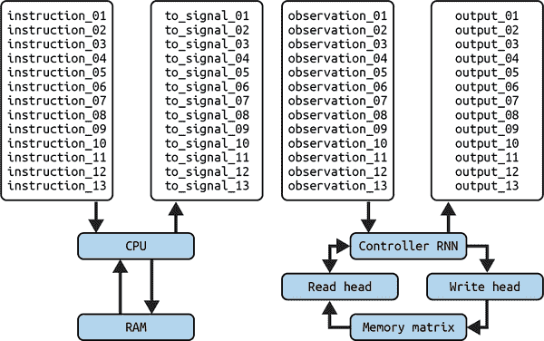

###### 图 12-1。比较现代计算机的架构，它被输入其程序（左）到一个学习其程序的 NTM（右）

如果我们根据之前讨论的 RNN 的图灵完备性来思考 NTM，我们会发现，通过为瞬时存储增加外部内存来增强 RNN，可以剪枝掉搜索空间中的大部分内容，因为我们现在不再关心能够同时处理和存储信息的 RNN，我们只是寻找能够处理存储在外部的信息的 RNN。这种搜索空间的剪枝使我们能够开始利用一些之前在增加内存之前被锁定的 RNN 潜力，这一点可以从 NTM 能够学习的各种任务中看出：从在看到输入序列后复制它们，到模拟 N-gram 模型，再到对数据执行优先排序。我们甚至会在本章结束时看到，NTM 的扩展可以学会像我们之前看到的那样进行阅读理解任务，而这只需要基于梯度的搜索，没有其他更多的东西。

# 基于注意力的内存访问

为了能够使用基于梯度的搜索方法训练 NTM，我们需要确保整个架构是可微分的，这样我们就可以计算某个输出损失相对于处理输入的模型参数的梯度。这种属性被称为 *端到端可微分*，一个端是输入，另一个端是输出。如果我们尝试以数字计算机访问其 RAM 的方式访问 NTM 的内存，通过地址的离散值，地址的离散性会引入输出梯度的不连续性，因此我们将失去使用基于梯度的方法训练模型的能力。我们需要一种连续的方式来访问内存，同时能够“聚焦”于其中的特定位置。这种连续的聚焦可以通过注意力方法实现。

不是生成离散的内存地址，而是让每个头部生成一个归一化的 softmax 注意力向量，大小与内存位置数量相同。通过这个注意力向量，我们将以模糊的方式同时访问所有内存位置，向量中的每个值告诉我们我们将如何专注于相应位置，或者我们将如何访问它的可能性。例如，要在时间步 *t* 从我们的 <math alttext="upper N times upper W"><mrow><mi>N</mi> <mo>×</mo> <mi>W</mi></mrow></math>  NTM 的内存矩阵中读取一个向量，记为 <math alttext="upper M Subscript t"><msub><mi>M</mi> <mi>t</mi></msub></math>  （其中 *N* 是位置数量，<math alttext="upper W"><mi>W</mi></math>  是位置的大小），我们生成一个大小为 *N* 的注意力向量，或者权重向量 <math alttext="w Subscript t"><msub><mi>w</mi> <mi>t</mi></msub></math> ，我们的读取向量可以通过以下乘积计算：

<math alttext="bold r Subscript t Baseline equals upper M Subscript t Superscript down-tack Baseline w Subscript t"><mrow><msub><mi>𝐫</mi> <mi>t</mi></msub> <mo>=</mo> <msubsup><mi>M</mi> <mi>t</mi> <mi>⊤</mi></msubsup> <msub><mi>w</mi> <mi>t</mi></msub></mrow></math>

其中 <math alttext="Superscript down-tack"><msup><mi>⊤</mi></msup></math>  表示矩阵转置操作。图 12-2 显示了通过权重关注特定位置，我们可以检索一个读取向量，其中大致包含与该内存位置内容相同的信息。

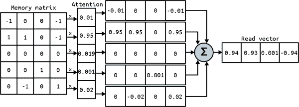

###### 图 12-2\. 演示了模糊注意力读取如何检索包含与聚焦位置中大致相同信息的向量

写头也使用类似的注意力加权方法：生成一个权重向量<math alttext="w Subscript t"><msub><mi>w</mi> <mi>t</mi></msub></math>，用于从存储器中擦除特定信息，由控制器在擦除向量<math alttext="e Subscript t"><msub><mi>e</mi> <mi>t</mi></msub></math>中指定，该向量有<math alttext="upper W"><mi>W</mi></math>个值在 0 和 1 之间指定要擦除和要保留的内容。然后我们使用相同的权重将一些新信息写入已擦除的存储器矩阵，也由控制器在包含<math alttext="upper W"><mi>W</mi></math>个值的写入向量<math alttext="v Subscript t"><msub><mi>v</mi> <mi>t</mi></msub></math>中指定：

<math alttext="upper M Subscript t Baseline equals upper M Subscript t minus 1 Baseline ring left-parenthesis upper E minus w Subscript t Baseline e Subscript t Superscript down-tack Baseline right-parenthesis plus w Subscript t Baseline normal v Subscript t Superscript down-tack"><mrow><msub><mi>M</mi> <mi>t</mi></msub> <mo>=</mo> <msub><mi>M</mi> <mrow><mi>t</mi><mo>-</mo><mn>1</mn></mrow></msub> <mo>∘</mo> <mrow><mo>(</mo> <mi>E</mi> <mo>-</mo> <msub><mi>w</mi> <mi>t</mi></msub> <msubsup><mi>e</mi> <mi>t</mi> <mi>⊤</mi></msubsup> <mo>)</mo></mrow> <mo>+</mo> <msub><mi>w</mi> <mi>t</mi></msub> <msubsup><mi mathvariant="normal">v</mi> <mi>t</mi> <mi>⊤</mi></msubsup></mrow></math>

其中<math alttext="upper E"><mi>E</mi></math>是一个全为 1 的矩阵，<math alttext="ring"><mo>∘</mo></math>是逐元素乘法。与读取情况类似，权重<math alttext="w Subscript t"><msub><mi>w</mi> <mi>t</mi></msub></math>告诉我们在哪里集中我们的擦除（方程的第一项）和写入操作（方程的第二项）。

# NTM 存储器寻址机制

现在我们了解了 NTM 如何通过注意力加权以连续方式访问其存储器，我们还需要了解这些权重是如何生成的以及它们代表什么形式的存储器寻址机制。我们可以通过探索 NTM 被期望如何处理其存储器以及基于其模型（图灵机）的预期来理解这一点，我们期望它们能够通过其包含的值访问位置，并能够从给定位置向前或向后移动。

第一种行为模式可以通过我们将称之为*基于内容的寻址*的访问机制实现。在这种寻址形式中，控制器发出它正在寻找的值，我们将其称为关键<math alttext="k Subscript t"><msub><mi>k</mi> <mi>t</mi></msub></math>，然后测量它与存储在每个位置的信息的相似性，并将注意力集中在最相似的位置上。这种加权可以通过以下方式计算：

*C*(*M*,*k*, *β*) = <math alttext="StartFraction exp left-parenthesis beta script upper D left-parenthesis upper M comma k right-parenthesis right-parenthesis Over sigma-summation Underscript i equals 0 Overscript upper N Endscripts exp left-parenthesis beta script upper D left-parenthesis upper M left-bracket i right-bracket comma k right-parenthesis right-parenthesis EndFraction"><mfrac><mrow><mo form="prefix">exp</mo><mo>(</mo><mi>β</mi><mi>𝒟</mi><mo>(</mo><mi>M</mi><mo>,</mo><mi>k</mi><mo>)</mo><mo>)</mo></mrow> <mrow><msubsup><mo>∑</mo> <mrow><mi>i</mi><mo>=</mo><mn>0</mn></mrow> <mi>N</mi></msubsup> <mo form="prefix">exp</mo><mrow><mo>(</mo><mi>β</mi><mi>𝒟</mi><mrow><mo>(</mo><mi>M</mi><mrow><mo>[</mo><mi>i</mi><mo>]</mo></mrow><mo>,</mo><mi>k</mi><mo>)</mo></mrow><mo>)</mo></mrow></mrow></mfrac></math>

其中*D*是一些相似度度量，比如余弦相似度。该方程实际上只是相似度分数上的归一化 softmax 分布。然而，还有一个额外的参数<math alttext="beta"><mi>β</mi></math>，用于需要时减弱注意力权重。我们称之为*关键强度*。该参数背后的主要思想是，对于某些任务，控制器发出的关键可能与存储器中的任何信息都不接近，这将导致看似均匀的注意力权重。图 12-3 展示了关键强度如何使控制器学会如何减弱这种均匀的注意力，更加专注于最有可能的单个位置；然后控制器学习发出每个可能的关键时要发出的强度值。

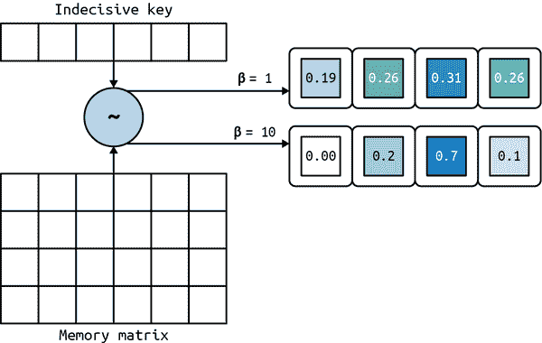

###### 图 12-3。一个犹豫不决的关键具有单位强度，导致几乎均匀的注意力向量；增加像这样的关键的强度会将注意力集中在最可能的位置上

要在内存中前进和后退，我们首先需要知道我们现在站在哪里，这样的信息位于上一个时间步的访问加权<math alttext="w Subscript t minus 1"><msub><mi>w</mi> <mrow><mi>t</mi><mo>-</mo><mn>1</mn></mrow></msub></math>中。因此，为了保留关于我们当前位置的信息，我们使用一个介于 0 和 1 之间的标量<math alttext="g Subscript t"><msub><mi>g</mi> <mi>t</mi></msub></math>来插值新的基于内容的加权<math alttext="w Subscript t Superscript c"><msubsup><mi>w</mi> <mi>t</mi> <mi>c</mi></msubsup></math>和我们刚刚得到的加权之间：

<math alttext="w Subscript t Superscript g Baseline equals g Subscript t Baseline w Subscript t Superscript c Baseline plus left-parenthesis 1 minus g Subscript t Baseline right-parenthesis w Subscript t minus 1"><mrow><msubsup><mi>w</mi> <mi>t</mi> <mi>g</mi></msubsup> <mo>=</mo> <msub><mi>g</mi> <mi>t</mi></msub> <msubsup><mi>w</mi> <mi>t</mi> <mi>c</mi></msubsup> <mo>+</mo> <mrow><mo>(</mo> <mn>1</mn> <mo>-</mo> <msub><mi>g</mi> <mi>t</mi></msub> <mo>)</mo></mrow> <msub><mi>w</mi> <mrow><mi>t</mi><mo>-</mo><mn>1</mn></mrow></msub></mrow></math>

我们称<math alttext="g Subscript t"><msub><mi>g</mi> <mi>t</mi></msub></math>为*插值门*，它也由控制器发出，用于控制我们在当前时间步中想要使用的信息类型。当门的值接近 1 时，我们更倾向于基于内容查找给出的寻址。然而，当它接近 0 时，我们倾向于传递关于我们当前位置的信息，并忽略基于内容的寻址。控制器学会使用这个门，例如，当需要迭代通过连续位置时，以及当前位置的信息至关重要时，可以将其设置为 0。控制器选择通过的信息类型由*门控加权* <math alttext="w Subscript t Superscript g"><msubsup><mi>w</mi> <mi>t</mi> <mi>g</mi></msubsup></math>表示。

要开始在内存中移动，我们需要一种方法来获取当前的门控加权，并将焦点从一个位置转移到另一个位置。这可以通过将门控加权与由控制器发出的*移位加权* <math alttext="s Subscript t"><msub><mi>s</mi> <mi>t</mi></msub></math> 进行卷积来实现，这个移位加权是一个大小为<math alttext="n plus 1"><mrow><mi>n</mi> <mo>+</mo> <mn>1</mn></mrow></math>的归一化 softmax 注意力向量，其中<math alttext="n"><mi>n</mi></math>是一个指定门控加权中焦点周围可能移动的次数的偶数整数；例如，如果它的大小为 3，则在一个位置周围有两个可能的移位：一个向前，一个向后。图 12-4 展示了移位加权如何在门控加权中移动焦点。移位是通过将门控加权与移位加权进行卷积来实现的，这与我们在第七章中用特征图卷积图像的方式几乎相同。唯一的例外是当移位加权超出门控加权时我们如何处理的情况。与之前使用填充不同，我们使用旋转卷积运算符，其中溢出的权重被应用于门控加权另一端的值，如图 12-4 的中间面板所示。这个操作可以逐元素地表示为：

<math alttext="ModifyingAbove w With tilde Subscript t Baseline left-bracket i right-bracket equals sigma-summation Underscript j equals 0 Overscript StartAbsoluteValue s Subscript t Baseline EndAbsoluteValue Endscripts w Subscript t Superscript g Baseline left-bracket left-parenthesis i plus StartFraction StartAbsoluteValue s Subscript t Baseline EndAbsoluteValue EndFraction minus 1 Over 2 EndFraction minus j right-parenthesis mod upper N right-bracket s Subscript t Baseline left-bracket j right-bracket"><mrow><msub><mover accent="true"><mi>w</mi> <mo>˜</mo></mover> <mi>t</mi></msub> <mrow><mo>[</mo> <mi>i</mi> <mo>]</mo></mrow> <mo>=</mo> <msubsup><mo>∑</mo> <mrow><mi>j</mi><mo>=</mo><mn>0</mn></mrow> <mrow><mrow><mo>|</mo></mrow><msub><mi>s</mi> <mi>t</mi></msub> <mrow><mo>|</mo></mrow></mrow></msubsup> <msubsup><mi>w</mi> <mi>t</mi> <mi>g</mi></msubsup> <mfenced separators="" open="[" close="]"><mfenced separators="" open="(" close=")"><mi>i</mi> <mo>+</mo> <mfrac><mrow><mrow><mo>|</mo></mrow><msub><mi>s</mi> <mi>t</mi></msub> <mrow><mo>|</mo><mo>-</mo><mn>1</mn></mrow></mrow> <mn>2</mn></mfrac> <mo>-</mo> <mi>j</mi></mfenced> <mo form="prefix">mod</mo> <mi>N</mi></mfenced> <msub><mi>s</mi> <mi>t</mi></msub> <mfenced open="[" close="]"><mi>j</mi></mfenced></mrow></math>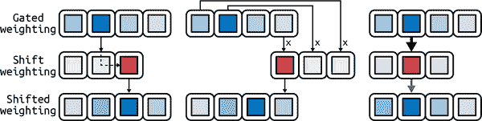

###### 图 12-4\. 右侧集中的移位权重将门控权重向右移动一个位置（左侧）。左侧集中的移位权重上的旋转卷积，将门控权重向左移动（中间）。一个非尖锐的中心移位权重保持门控权重不变，但会使其散开（右侧）。

引入了移位操作后，我们的头部权重现在可以自由地在内存中前后移动。然而，如果在任何时候移位权重不够尖锐，就会出现问题。由于卷积操作的性质，一个非尖锐的移位权重（如图 12-4 右侧面板所示）会使原始的门控权重在周围散开，导致移位权重不够集中。为了克服这种模糊效果，我们通过最后一个操作来运行移位权重：一个锐化操作。控制器发出一个最后的标量 <math alttext="gamma Subscript t Baseline greater-than-or-equal-to 1"><mrow><msub><mi>γ</mi> <mi>t</mi></msub> <mo>≥</mo> <mn>1</mn></mrow></math> 来通过以下方式锐化移位权重：

<math alttext="w Subscript t Baseline equals StartFraction w overTilde Subscript t Superscript gamma Super Subscript t Superscript Baseline Over sigma-summation Underscript i equals 0 Overscript upper N Endscripts w overTilde Subscript t Baseline left-bracket i right-bracket Superscript gamma Super Subscript t Superscript Baseline EndFraction"><mrow><msub><mi>w</mi> <mi>t</mi></msub> <mo>=</mo> <mfrac><msubsup><mover accent="true"><mi>w</mi> <mo>˜</mo></mover> <mi>t</mi> <msub><mi>γ</mi> <mi>t</mi></msub></msubsup> <mrow><msubsup><mo>∑</mo> <mrow><mi>i</mi><mo>=</mo><mn>0</mn></mrow> <mi>N</mi></msubsup> <msub><mover accent="true"><mi>w</mi> <mo>˜</mo></mover> <mi>t</mi></msub> <msup><mrow><mo>[</mo><mi>i</mi><mo>]</mo></mrow> <msub><mi>γ</mi> <mi>t</mi></msub></msup></mrow></mfrac></mrow></math>

从插值到最终的锐化权重向量，这个过程构成了 NTM 的第二个寻址机制：*基于位置的机制*。通过结合这两种寻址机制，NTM 能够利用其内存来学习解决各种任务。其中一个任务是让我们更深入地了解 NTM 的工作原理的复制任务，如图 12-5 所示。在这个任务中，我们向模型呈现一系列以特殊结束符号结束的随机二进制向量。然后我们要求将相同的输入序列复制到输出中。

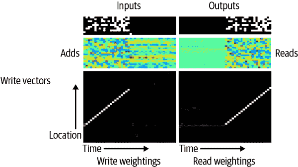

###### 图 12-5\. 在复制任务上训练的 NTM¹

可视化显示了在输入时间，NTM 开始逐步将输入写入内存中连续的位置。在输出时间，NTM 回到第一个写入的向量，并遍历下一个位置以读取并返回先前写入的输入序列。原始的 NTM 论文包含了几个在不同问题上训练的 NTM 的可视化，值得一看。这些可视化展示了该架构利用寻址机制来适应和学习解决各种任务的能力。

我们将满足于我们对 NTMs 的当前理解，并跳过其实现。相反，我们将在本章的其余部分探讨 NTMs 的缺点，以及可微分神经计算机（DNC）的新颖架构是如何克服这些缺点的。我们将通过在简单的阅读理解任务上实现这种新颖架构来结束我们的讨论，就像我们之前看到的那样。

# 可微分神经计算机

尽管 NTMs 的功能强大，但它们在内存机制方面存在一些限制。其中之一是 NTMs 无法确保写入数据之间不会发生干扰或重叠。这是由于“可微分”写入操作的性质，其中我们在内存中的各个位置写入新数据，程度由注意力机制指定。通常，注意机制会学习将写入权重强烈集中在单个内存位置上，NTM 会收敛到大部分无干扰行为，但这并不是保证。

然而，即使 NTM 收敛到无干扰行为，一旦一个内存位置被写入，即使其中存储的数据变得无关紧要，也无法再次重用该位置。无法释放和重用内存位置是 NTM 架构的第二个限制。这导致新数据被写入可能是连续的新位置，就像我们在复制任务中看到的那样。这种连续的写入方式是 NTM 记录有关正在写入的数据的任何时间信息的唯一方式：连续的数据存储在连续的位置。如果写头在写入一些连续数据时跳到内存中的另一个位置，读头将无法恢复跳跃前后写入的数据之间的时间链接：这构成了 NTMs 的第三个限制。

2016 年 10 月，DeepMind 的 Graves 等人在《自然》杂志上发表了一篇题为[“使用具有动态外部存储器的神经网络进行混合计算”](http://go.nature.com/2peM8m2)的论文，在其中介绍了一种名为*可微分神经计算机*（DNC）的新记忆增强神经架构，改进了 NTMs 并解决了我们刚刚讨论的限制。与 NTMs 类似，DNC 由一个与外部内存交互的控制器组成。内存由大小为<math alttext="upper W"><mi>W</mi></math>的*N*个单词组成，构成我们将称之为*M*的<math alttext="upper N times upper W"><mrow><mi>N</mi> <mo>×</mo> <mi>W</mi></mrow></math>矩阵。控制器接收大小为<math alttext="upper X"><mi>X</mi></math>的输入向量和上一步从内存中读取的大小为<math alttext="upper W"><mi>W</mi></math>的*R*个向量，其中*R*是读头的数量。然后，控制器通过神经网络处理它们，并返回两个信息：

+   一个包含查询内存所需的所有信息的*接口*向量（即，写入和读取）

+   一个大小为*Y*的*预输出*向量

然后，外部内存接收接口向量，通过单个写头执行必要的写入，然后从内存中读取*R*个新向量。它将新读取的向量返回给控制器，与预输出向量相加，生成大小为*Y*的最终输出向量。

图 12-6 总结了我们刚刚描述的 DNC 的操作。我们可以看到，与 NTMs 不同，DNC 保留了除内存本身之外的其他数据结构，以跟踪内存的状态。正如我们将很快看到的，借助这些数据结构和一些巧妙的新注意机制，DNC 能够成功地克服 NTM 的局限性。

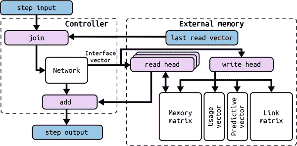

###### 图 12-6。DNC 的架构和操作概述

为了使整个架构可微分，DNCs 通过大小为*N*的权重向量访问内存，其元素确定头部在每个内存位置上的关注程度。读头有*R*个权重 <math alttext="normal w Subscript t Superscript r comma 1 Baseline comma ellipsis comma normal w Subscript t Superscript r comma upper R"><mrow><msubsup><mi mathvariant="normal">w</mi> <mi>t</mi> <mrow><mi>r</mi><mo>,</mo><mn>1</mn></mrow></msubsup> <mo>,</mo> <mo>⋯</mo> <mo>,</mo> <msubsup><mi mathvariant="normal">w</mi> <mi>t</mi> <mrow><mi>r</mi><mo>,</mo><mi>R</mi></mrow></msubsup></mrow></math>，其中 <math alttext="t"><mi>t</mi></math> 表示时间步。另一方面，单个写头有一个写权重 <math alttext="normal w Subscript t Superscript w"><msubsup><mi mathvariant="normal">w</mi> <mi>t</mi> <mi>w</mi></msubsup></math>。一旦我们获得这些权重，我们可以通过以下方式修改内存矩阵并进行更新：

<math alttext="upper M Subscript t Baseline equals upper M Subscript t minus 1 Baseline ring left-parenthesis upper E minus normal w Subscript t Superscript w Baseline e Subscript t Superscript down-tack Baseline right-parenthesis plus normal w Subscript t Superscript w Baseline normal v Subscript t Superscript down-tack"><mrow><msub><mi>M</mi> <mi>t</mi></msub> <mo>=</mo> <msub><mi>M</mi> <mrow><mi>t</mi><mo>-</mo><mn>1</mn></mrow></msub> <mo>∘</mo> <mrow><mo>(</mo> <mi>E</mi> <mo>-</mo> <msubsup><mi mathvariant="normal">w</mi> <mi>t</mi> <mi>w</mi></msubsup> <msubsup><mi>e</mi> <mi>t</mi> <mi>⊤</mi></msubsup> <mo>)</mo></mrow> <mo>+</mo> <msubsup><mi mathvariant="normal">w</mi> <mi>t</mi> <mi>w</mi></msubsup> <msubsup><mi mathvariant="normal">v</mi> <mi>t</mi> <mi>⊤</mi></msubsup></mrow></math>

而 <math alttext="e Subscript t Baseline comma normal v Subscript t Baseline"><mrow><msub><mi>e</mi> <mi>t</mi></msub> <mo>,</mo> <msub><mi mathvariant="normal">v</mi> <mi>t</mi></msub></mrow></math> 是我们之前在 NTMs 中看到的*擦除*和*写入*向量，通过控制器通过接口向量传递指令，指示要从内存中擦除和写入的内容。

一旦我们获得更新后的内存矩阵 <math alttext="upper M Subscript t"><msub><mi>M</mi> <mi>t</mi></msub></math>，我们可以通过以下方程式读取新的读向量 <math alttext="normal r Subscript t Superscript 1 Baseline comma normal r Subscript t Superscript 2 Baseline comma ellipsis comma normal r Subscript t Superscript upper R"><mrow><msubsup><mi mathvariant="normal">r</mi> <mi>t</mi> <mn>1</mn></msubsup> <mo>,</mo> <msubsup><mi mathvariant="normal">r</mi> <mi>t</mi> <mn>2</mn></msubsup> <mo>,</mo> <mo>⋯</mo> <mo>,</mo> <msubsup><mi mathvariant="normal">r</mi> <mi>t</mi> <mi>R</mi></msubsup></mrow></math>，对每个读权重使用以下方程式：

<math alttext="normal r Subscript t Superscript i Baseline equals upper M Subscript t Superscript down-tack Baseline normal w Subscript t Superscript r comma i"><mrow><msubsup><mi mathvariant="normal">r</mi> <mi>t</mi> <mi>i</mi></msubsup> <mo>=</mo> <msubsup><mi>M</mi> <mi>t</mi> <mi>⊤</mi></msubsup> <msubsup><mi mathvariant="normal">w</mi> <mi>t</mi> <mrow><mi>r</mi><mo>,</mo><mi>i</mi></mrow></msubsup></mrow></math>

到目前为止，似乎与 NTMs 写入和读取内存的方式没有什么不同。然而，当我们讨论 DNCs 用于获取访问权重的注意机制时，差异将开始显现。虽然它们都共享之前定义的基于内容的寻址机制 *C*(*M*, *k*, *β*)，但 DNCs 使用更复杂的机制更有效地关注内存。

# DNC 中的无干扰写入

我们讨论 NTMs 的第一个限制是它们无法确保无干扰的写入行为。解决这个问题的直观方法是设计架构，强烈关注单个空闲内存位置，而不是等待 NTM 学习如何做到这一点。为了跟踪哪些位置是空闲的，哪些是忙碌的，我们需要引入一种新的数据结构来保存这种信息。我们将其称为*使用向量*。

使用向量 <math alttext="normal u Subscript t"><msub><mi mathvariant="normal">u</mi> <mi>t</mi></msub></math> 是一个大小为*N*的向量，其中每个元素的值介于 0 和 1 之间，表示相应内存位置的使用程度；0 表示完全空闲的位置，1 表示完全使用的位置。

使用向量最初包含零 <math alttext="normal u 0 equals bold 0"><mrow><msub><mi mathvariant="normal">u</mi> <mn>0</mn></msub> <mo>=</mo> <mn mathvariant="bold">0</mn></mrow></math> 并随着步骤的进行而更新使用信息。利用这些信息，很明显权重应该最强烈地关注的位置是具有最小使用值的位置。为了获得这样的权重，我们需要首先对使用向量进行排序，并按照使用量的升序获得位置索引列表；我们称这样的列表为*自由列表*，并用 <math alttext="phi Subscript t"><msub><mi>φ</mi> <mi>t</mi></msub></math> 表示。利用这个自由列表，我们可以构建一个称为*分配权重 <math alttext="normal a Subscript t"><msub><mi mathvariant="normal">a</mi> <mi>t</mi></msub></math>* 的中间权重，用于确定应该为新数据分配哪个内存位置。我们通过以下方式计算 <math alttext="normal a Subscript t"><msub><mi mathvariant="normal">a</mi> <mi>t</mi></msub></math>：

<math alttext="normal a Subscript t Baseline left-bracket phi Subscript t Baseline left-bracket j right-bracket right-bracket equals left-parenthesis 1 minus normal u Subscript t Baseline left-bracket phi Subscript t Baseline left-bracket j right-bracket right-bracket right-parenthesis product Underscript i equals 1 Overscript j minus 1 Endscripts normal u Subscript t Baseline left-bracket phi Subscript t Baseline left-bracket i right-bracket right-bracket where j element-of 1 comma ellipsis comma upper N"><mrow><msub><mi mathvariant="normal">a</mi> <mi>t</mi></msub> <mrow><mo>[</mo> <msub><mi>φ</mi> <mi>t</mi></msub> <mrow><mo>[</mo> <mi>j</mi> <mo>]</mo></mrow> <mo>]</mo></mrow> <mo>=</mo> <mrow><mo>(</mo> <mn>1</mn> <mo>-</mo> <msub><mi mathvariant="normal">u</mi> <mi>t</mi></msub> <mrow><mo>[</mo> <msub><mi>φ</mi> <mi>t</mi></msub> <mrow><mo>[</mo> <mi>j</mi> <mo>]</mo></mrow> <mo>]</mo></mrow> <mo>)</mo></mrow> <msubsup><mo>∏</mo> <mrow><mi>i</mi><mo>=</mo><mn>1</mn></mrow> <mrow><mi>j</mi><mo>-</mo><mn>1</mn></mrow></msubsup> <msub><mi mathvariant="normal">u</mi> <mi>t</mi></msub> <mrow><mo>[</mo> <msub><mi>φ</mi> <mi>t</mi></msub> <mrow><mo>[</mo> <mi>i</mi> <mo>]</mo></mrow> <mo>]</mo></mrow> <mtext>where</mtext> <mi>j</mi> <mo>∈</mo> <mn>1</mn> <mo>,</mo> <mo>⋯</mo> <mo>,</mo> <mi>N</mi></mrow></math>

这个方程乍一看可能难以理解。理解它的一个好方法是通过一个数值示例来逐步解释，例如，当 <math alttext="normal u Subscript t Baseline equals left-bracket 1 comma 0.7 comma 0.2 comma 0.4 right-bracket"><mrow><msub><mi mathvariant="normal">u</mi> <mi>t</mi></msub> <mo>=</mo> <mrow><mo>[</mo> <mn>1</mn> <mo>,</mo> <mn>0</mn> <mo>.</mo> <mn>7</mn> <mo>,</mo> <mn>0</mn> <mo>.</mo> <mn>2</mn> <mo>,</mo> <mn>0</mn> <mo>.</mo> <mn>4</mn> <mo>]</mo></mrow></mrow></math> 时。我们将留下细节让您自行查看。最终，您应该得出分配权重为 <math alttext="normal a Subscript t Baseline equals left-bracket 0 comma 0.024 comma 0.8 comma 0.12 right-bracket"><mrow><msub><mi mathvariant="normal">a</mi> <mi>t</mi></msub> <mo>=</mo> <mrow><mo>[</mo> <mn>0</mn> <mo>,</mo> <mn>0</mn> <mo>.</mo> <mn>024</mn> <mo>,</mo> <mn>0</mn> <mo>.</mo> <mn>8</mn> <mo>,</mo> <mn>0</mn> <mo>.</mo> <mn>12</mn> <mo>]</mo></mrow></mrow></math> 。当我们进行计算时，我们将开始理解这个公式的工作原理： <math alttext="1 minus normal u Subscript t Baseline left-bracket phi Subscript t Baseline left-bracket j right-bracket right-bracket"><mrow><mn>1</mn> <mo>-</mo> <msub><mi mathvariant="normal">u</mi> <mi>t</mi></msub> <mrow><mo>[</mo> <msub><mi>φ</mi> <mi>t</mi></msub> <mrow><mo>[</mo> <mi>j</mi> <mo>]</mo></mrow> <mo>]</mo></mrow></mrow></math> 使得位置权重与其自由程度成比例。通过注意到乘积 <math alttext="product Underscript i equals 1 Overscript j minus 1 Endscripts normal u Subscript t Baseline left-bracket phi Subscript t Baseline left-bracket j right-bracket right-bracket"><mrow><msubsup><mo>∏</mo> <mrow><mi>i</mi><mo>=</mo><mn>1</mn></mrow> <mrow><mi>j</mi><mo>-</mo><mn>1</mn></mrow></msubsup> <msub><mi mathvariant="normal">u</mi> <mi>t</mi></msub> <mrow><mo>[</mo> <msub><mi>φ</mi> <mi>t</mi></msub> <mrow><mo>[</mo> <mi>j</mi> <mo>]</mo></mrow> <mo>]</mo></mrow></mrow></math> 随着我们在自由列表中迭代变得越来越小（因为我们不断地将介于 0 和 1 之间的小值相乘），我们可以看到这个乘积会使位置权重在从最不常用的位置到最常用的位置时减小得更多，最终导致最不常用的位置具有最大的权重，而最常用的位置具有最小的权重。因此，我们能够通过设计来保证能够专注于单个位置，而无需希望模型能够自行从头开始学习；这意味着更可靠以及更快的训练时间。

通过从基于内容的寻址机制中获得的分配权重 <math alttext="normal a Subscript t"><msub><mi mathvariant="normal">a</mi> <mi>t</mi></msub></math> 和查找权重 <math alttext="normal c Subscript t Superscript w"><msubsup><mi mathvariant="normal">c</mi> <mi>t</mi> <mi>w</mi></msubsup></math>，我们现在可以构建我们的最终写入权重：

<math alttext="normal w Subscript t Superscript w Baseline equals g Subscript t Superscript w Baseline left-bracket g Subscript t Superscript a Baseline normal a Subscript t Baseline plus left-parenthesis 1 minus g Subscript t Superscript a Baseline right-parenthesis normal c Subscript t Superscript w Baseline right-bracket"><mrow><msubsup><mi mathvariant="normal">w</mi> <mi>t</mi> <mi>w</mi></msubsup> <mo>=</mo> <msubsup><mi>g</mi> <mi>t</mi> <mi>w</mi></msubsup> <mfenced separators="" open="[" close="]"><msubsup><mi>g</mi> <mi>t</mi> <mi>a</mi></msubsup> <msub><mi mathvariant="normal">a</mi> <mi>t</mi></msub> <mo>+</mo> <mrow><mo>(</mo> <mn>1</mn> <mo>-</mo> <msubsup><mi>g</mi> <mi>t</mi> <mi>a</mi></msubsup> <mo>)</mo></mrow> <msubsup><mi mathvariant="normal">c</mi> <mi>t</mi> <mi>w</mi></msubsup></mfenced></mrow></math>

其中 <math alttext="g Subscript t Superscript w"><msubsup><mi>g</mi> <mi>t</mi> <mi>w</mi></msubsup></math> 和 <math alttext="g Subscript t Superscript a"><msubsup><mi>g</mi> <mi>t</mi> <mi>a</mi></msubsup></math> 是介于 0 和 1 之间的值，称为写入门和分配门，我们也从控制器通过接口向量中获取。这些门控制写入操作，其中 <math alttext="g Subscript t Superscript w"><msubsup><mi>g</mi> <mi>t</mi> <mi>w</mi></msubsup></math> 确定首先是否会发生任何写入，而 <math alttext="g Subscript t Superscript a"><msubsup><mi>g</mi> <mi>t</mi> <mi>a</mi></msubsup></math> 指定我们是否将使用分配权重写入新位置，或者修改由查找权重指定的现有值。

# DNC 内存重用

在计算分配权重时，如果我们发现所有位置都被使用，或者换句话说，<math alttext="normal u Subscript t Baseline equals bold 1"><mrow><msub><mi mathvariant="normal">u</mi> <mi>t</mi></msub> <mo>=</mo> <mn mathvariant="bold">1</mn></mrow></math>？这意味着分配权重将全部变为零，没有新数据可以分配到内存中。这就引发了释放和重用内存的需求。

为了知道哪些位置可以被释放，哪些不能，我们构建了一个大小为*N*的*保留向量* <math alttext="psi Subscript t"><msub><mi>ψ</mi> <mi>t</mi></msub></math>，指定每个位置应该保留多少，不应该被释放。该向量的每个元素取值介于 0 和 1 之间，0 表示相应位置可以被释放，1 表示应该保留。这个向量是通过以下公式计算的：

<math alttext="psi Subscript t Baseline equals product Underscript i equals 1 Overscript upper R Endscripts left-parenthesis bold 1 minus f Subscript t Superscript i Baseline normal w Subscript t minus 1 Superscript r comma i Baseline right-parenthesis"><mrow><msub><mi>ψ</mi> <mi>t</mi></msub> <mo>=</mo> <msubsup><mo>∏</mo> <mrow><mi>i</mi><mo>=</mo><mn>1</mn></mrow> <mi>R</mi></msubsup> <mrow><mo>(</mo> <mn mathvariant="bold">1</mn> <mo>-</mo> <msubsup><mi>f</mi> <mi>t</mi> <mi>i</mi></msubsup> <msubsup><mi mathvariant="normal">w</mi> <mrow><mi>t</mi><mo>-</mo><mn>1</mn></mrow> <mrow><mi>r</mi><mo>,</mo><mi>i</mi></mrow></msubsup> <mo>)</mo></mrow></mrow></math>

这个方程基本上是说，应该释放内存位置的程度与最后几个时间步中各读头读取的量成正比（由读取权重的值表示）。然而，一旦读取数据，连续释放内存位置通常不是首选，因为我们可能之后仍需要这些数据。我们让控制器决定何时在读取后释放或保留位置，通过发出一组*R*自由门，其值介于 0 和 1 之间。这决定了基于刚刚从中读取的位置应该进行多少释放。控制器将学习如何使用这些门来实现其所需的行为。

一旦获得保留向量，我们可以使用它来更新使用向量，以反映通过以下方式进行的任何释放或保留：

<math alttext="normal u Subscript t Baseline equals left-parenthesis normal u Subscript t minus 1 Baseline plus normal w Subscript t minus 1 Superscript w Baseline minus normal u Subscript t minus 1 Baseline ring normal w Subscript t minus 1 Superscript w Baseline right-parenthesis ring psi Subscript t"><mrow><msub><mi mathvariant="normal">u</mi> <mi>t</mi></msub> <mo>=</mo> <mfenced separators="" open="(" close=")"><msub><mi mathvariant="normal">u</mi> <mrow><mi>t</mi><mo>-</mo><mn>1</mn></mrow></msub> <mo>+</mo> <msubsup><mi mathvariant="normal">w</mi> <mrow><mi>t</mi><mo>-</mo><mn>1</mn></mrow> <mi>w</mi></msubsup> <mo>-</mo> <msub><mi mathvariant="normal">u</mi> <mrow><mi>t</mi><mo>-</mo><mn>1</mn></mrow></msub> <mo>∘</mo> <msubsup><mi mathvariant="normal">w</mi> <mrow><mi>t</mi><mo>-</mo><mn>1</mn></mrow> <mi>w</mi></msubsup></mfenced> <mo>∘</mo> <msub><mi>ψ</mi> <mi>t</mi></msub></mrow></math>

这个方程可以解读如下：如果一个位置已被保留（在ψt 中的值几乎等于 1），并且它已经在使用中或刚刚被写入（在 ut-1 加 wt-1w 中的值表示），则该位置将被使用。逐元素相乘 ut-1wt-1w 的差值将整个表达式带回 0 和 1 之间，以便在先前使用之间的加法使写入权重超过 1 时成为有效使用值。

通过在计算分配之前执行此使用更新步骤，我们可以为可能的新数据引入一些空闲内存。我们还能够有效地使用和重复使用有限数量的内存，并克服 NTMs 的第二个限制。

# DNC 写入的时间链接

使用 DNC 使用的动态内存管理机制，每次请求分配内存位置时，我们将获得最不常用的位置，并且该位置与先前写入的位置之间没有位置关系。使用这种类型的内存访问，NTM 保持时间关系与连续性的方式不适用。我们需要明确记录写入数据的顺序。

通过内存矩阵和使用向量旁边的两个额外数据结构，在 DNC 中实现了这种明确记录。第一个被称为*优先向量*pt，是一个 N 大小的向量，被认为是对内存位置的概率分布，每个值表示相应位置最后一次写入的可能性有多大。优先级最初设置为 p0=0，并通过以下步骤进行更新。

<math alttext="normal p Subscript t Baseline equals left-parenthesis 1 minus sigma-summation Underscript i equals 1 Overscript upper N Endscripts normal w Subscript t Superscript w Baseline left-bracket i right-bracket right-parenthesis normal p Subscript t minus 1 Baseline plus normal w Subscript t Superscript w"><mrow><msub><mi mathvariant="normal">p</mi> <mi>t</mi></msub> <mo>=</mo> <mfenced separators="" open="(" close=")"><mn>1</mn> <mo>-</mo> <msubsup><mo>∑</mo> <mrow><mi>i</mi><mo>=</mo><mn>1</mn></mrow> <mi>N</mi></msubsup> <msubsup><mi mathvariant="normal">w</mi> <mi>t</mi> <mi>w</mi></msubsup> <mrow><mo>[</mo> <mi>i</mi> <mo>]</mo></mrow></mfenced> <msub><mi mathvariant="normal">p</mi> <mrow><mi>t</mi><mo>-</mo><mn>1</mn></mrow></msub> <mo>+</mo> <msubsup><mi mathvariant="normal">w</mi> <mi>t</mi> <mi>w</mi></msubsup></mrow></math>

更新是通过首先使用与刚刚写入内存的写入量成比例的重置因子重置优先值的先前值来完成的（由写入权重的分量求和表示）。然后将写入权重的值添加到重置值中，以便具有较大写入权重（即最近写入的位置）的位置也会在优先向量中获得较大的值。

我们需要记录时间信息的第二个数据结构是*链接矩阵* <math alttext="normal upper L Subscript t"><msub><mi mathvariant="normal">L</mi> <mi>t</mi></msub></math>。链接矩阵是一个<math alttext="upper N times upper N"><mrow><mi>N</mi> <mo>×</mo> <mi>N</mi></mrow></math>矩阵，其中元素<math alttext="normal upper L Subscript t Baseline left-bracket i comma j right-bracket"><mrow><msub><mi mathvariant="normal">L</mi> <mi>t</mi></msub> <mrow><mo>[</mo> <mi>i</mi> <mo>,</mo> <mi>j</mi> <mo>]</mo></mrow></mrow></math>的值在 0 和 1 之间，表示位置*i*在位置*j*之后被写入的可能性有多大。该矩阵也初始化为零，并且对角元素在整个时间内保持为零<math alttext="normal upper L Subscript t Baseline left-bracket i comma i right-bracket equals 0"><mrow><msub><mi mathvariant="normal">L</mi> <mi>t</mi></msub> <mrow><mo>[</mo> <mi>i</mi> <mo>,</mo> <mi>i</mi> <mo>]</mo></mrow> <mo>=</mo> <mn>0</mn></mrow></math>，因为跟踪一个位置在自身之后被写入是没有意义的，当先前的数据已经被覆盖和丢失时。然而，矩阵中的每个其他元素都会使用以下方式进行更新：

<math alttext="normal upper L Subscript t Baseline left-bracket i comma j right-bracket equals left-parenthesis 1 minus normal w Subscript t Superscript w Baseline left-bracket i right-bracket minus normal w Subscript t Superscript w Baseline left-bracket j right-bracket right-parenthesis normal upper L Subscript t minus 1 Baseline left-bracket i comma j right-bracket plus normal w Subscript t Superscript w Baseline left-bracket i right-bracket normal p Subscript t minus 1 Baseline left-bracket j right-bracket"><mrow><msub><mi mathvariant="normal">L</mi> <mi>t</mi></msub> <mrow><mo>[</mo> <mi>i</mi> <mo>,</mo> <mi>j</mi> <mo>]</mo></mrow> <mo>=</mo> <mrow><mo>(</mo> <mn>1</mn> <mo>-</mo> <msubsup><mi mathvariant="normal">w</mi> <mi>t</mi> <mi>w</mi></msubsup> <mrow><mo>[</mo> <mi>i</mi> <mo>]</mo></mrow> <mo>-</mo> <msubsup><mi mathvariant="normal">w</mi> <mi>t</mi> <mi>w</mi></msubsup> <mrow><mo>[</mo> <mi>j</mi> <mo>]</mo></mrow> <mo>)</mo></mrow> <msub><mi mathvariant="normal">L</mi> <mrow><mi>t</mi><mo>-</mo><mn>1</mn></mrow></msub> <mrow><mo>[</mo> <mi>i</mi> <mo>,</mo> <mi>j</mi> <mo>]</mo></mrow> <mo>+</mo> <msubsup><mi mathvariant="normal">w</mi> <mi>t</mi> <mi>w</mi></msubsup> <mrow><mo>[</mo> <mi>i</mi> <mo>]</mo></mrow> <msub><mi mathvariant="normal">p</mi> <mrow><mi>t</mi><mo>-</mo><mn>1</mn></mrow></msub> <mrow><mo>[</mo> <mi>j</mi> <mo>]</mo></mrow></mrow></math>

方程遵循我们看到的其他更新规则相同的模式：首先，链接元素会根据在位置*i*和*j*上写入了多少进行重置。然后，链接会根据位置*i*的写入权重和位置*j*的先前优先值之间的相关性（在这里表示为乘法）进行更新。这消除了 NTM 的第三个限制；现在我们可以跟踪时间信息，无论写头如何在内存中跳跃。

# 理解 DNC 读头

一旦写头完成更新内存矩阵和相关数据结构，读头现在准备好工作。它的操作很简单：它需要能够在内存中查找值，并能够在数据之间的时间顺序中向前和向后迭代。查找能力可以通过基于内容的寻址简单实现：对于每个读头 *i*，我们计算一个中间权重 <math alttext="normal c Subscript t Superscript r comma i Baseline equals script upper C left-parenthesis upper M Subscript t Baseline comma k Subscript t Superscript r comma i Baseline comma beta Subscript t Superscript r comma i Baseline right-parenthesis"><mrow><msubsup><mi mathvariant="normal">c</mi> <mi>t</mi> <mrow><mi>r</mi><mo>,</mo><mi>i</mi></mrow></msubsup> <mo>=</mo> <mi>𝒞</mi> <mrow><mo>(</mo> <msub><mi>M</mi> <mi>t</mi></msub> <mo>,</mo> <msubsup><mi>k</mi> <mi>t</mi> <mrow><mi>r</mi><mo>,</mo><mi>i</mi></mrow></msubsup> <mo>,</mo> <msubsup><mi>β</mi> <mi>t</mi> <mrow><mi>r</mi><mo>,</mo><mi>i</mi></mrow></msubsup> <mo>)</mo></mrow></mrow></math> ，其中 <math alttext="k Subscript t Superscript r comma 1 Baseline comma ellipsis comma k Subscript t Superscript r comma upper R"><mrow><msubsup><mi>k</mi> <mi>t</mi> <mrow><mi>r</mi><mo>,</mo><mn>1</mn></mrow></msubsup> <mo>,</mo> <mo>⋯</mo> <mo>,</mo> <msubsup><mi>k</mi> <mi>t</mi> <mrow><mi>r</mi><mo>,</mo><mi>R</mi></mrow></msubsup></mrow></math> 和 <math alttext="beta Subscript t Superscript r comma 1 Baseline comma ellipsis comma beta Subscript t Superscript r comma upper R"><mrow><msubsup><mi>β</mi> <mi>t</mi> <mrow><mi>r</mi><mo>,</mo><mn>1</mn></mrow></msubsup> <mo>,</mo> <mo>⋯</mo> <mo>,</mo> <msubsup><mi>β</mi> <mi>t</mi> <mrow><mi>r</mi><mo>,</mo><mi>R</mi></mrow></msubsup></mrow></math> 是控制器在接口向量中接收的两组 *R* 个读取键和强度。

为了实现向前和向后迭代，我们需要使权重从最近读取的位置向前或向后移动一步。我们可以通过将链接矩阵乘以上次读取的权重来实现向前迭代。这将把权重从上次读取的位置移动到链接矩阵指定的上次写入位置，并为每个读头 *i* 构建一个中间向前权重：<math alttext="normal f Subscript t Superscript i Baseline equals normal upper L Subscript t Baseline normal w Subscript t minus 1 Superscript r comma i"><mrow><msubsup><mi mathvariant="normal">f</mi> <mi>t</mi> <mi>i</mi></msubsup> <mo>=</mo> <msub><mi mathvariant="normal">L</mi> <mi>t</mi></msub> <msubsup><mi mathvariant="normal">w</mi> <mrow><mi>t</mi><mo>-</mo><mn>1</mn></mrow> <mrow><mi>r</mi><mo>,</mo><mi>i</mi></mrow></msubsup></mrow></math> 。类似地，我们通过将链接矩阵的转置乘以上次读取的权重来构建一个中间向后权重 <math alttext="normal b Subscript t Superscript i Baseline equals normal upper L Subscript t minus 1 Superscript down-tack Baseline normal w Subscript t minus 1 Superscript r comma i"><mrow><msubsup><mi mathvariant="normal">b</mi> <mi>t</mi> <mi>i</mi></msubsup> <mo>=</mo> <msubsup><mi mathvariant="normal">L</mi> <mrow><mi>t</mi><mo>-</mo><mn>1</mn></mrow> <mi>⊤</mi></msubsup> <msubsup><mi mathvariant="normal">w</mi> <mrow><mi>t</mi><mo>-</mo><mn>1</mn></mrow> <mrow><mi>r</mi><mo>,</mo><mi>i</mi></mrow></msubsup></mrow></math> 。

我们现在可以使用以下规则为每个读头构建新的读取权重：

<math alttext="normal w Subscript t Superscript r comma i Baseline equals pi Subscript t Superscript i Baseline left-bracket 1 right-bracket normal b Subscript t Superscript i Baseline plus pi Subscript t Superscript i Baseline left-bracket 2 right-bracket normal c Subscript t Superscript i Baseline plus pi Subscript t Superscript i Baseline left-bracket 3 right-bracket normal f Subscript t Superscript i"><mrow><msubsup><mi mathvariant="normal">w</mi> <mi>t</mi> <mrow><mi>r</mi><mo>,</mo><mi>i</mi></mrow></msubsup> <mo>=</mo> <msubsup><mi>π</mi> <mi>t</mi> <mi>i</mi></msubsup> <mrow><mo>[</mo> <mn>1</mn> <mo>]</mo></mrow> <msubsup><mi mathvariant="normal">b</mi> <mi>t</mi> <mi>i</mi></msubsup> <mo>+</mo> <msubsup><mi>π</mi> <mi>t</mi> <mi>i</mi></msubsup> <mrow><mo>[</mo> <mn>2</mn> <mo>]</mo></mrow> <msubsup><mi mathvariant="normal">c</mi> <mi>t</mi> <mi>i</mi></msubsup> <mo>+</mo> <msubsup><mi>π</mi> <mi>t</mi> <mi>i</mi></msubsup> <mrow><mo>[</mo> <mn>3</mn> <mo>]</mo></mrow> <msubsup><mi mathvariant="normal">f</mi> <mi>t</mi> <mi>i</mi></msubsup></mrow></math>

其中 πt1，...，πtR 被称为*读取模式*。这些都是从控制器对接口向量的三个元素中得出的 softmax 分布。它的三个值确定了读头应该在每个读取机制上放置的重点：向后、查找和向前。控制器学会使用这些模式来指导内存如何读取数据。

# DNC 控制器网络

现在我们已经弄清楚了 DNC 架构中外部内存的内部工作原理，我们需要理解协调所有内存操作的控制器是如何工作的。控制器的操作很简单：在其核心有一个神经网络（循环或前馈），它接收输入步骤以及上一步的读取向量，并输出一个大小取决于我们为网络选择的架构的向量。让我们用 *N*(χ[t]) 表示该向量，其中 *N* 表示神经网络计算的任何函数，χt 表示输入步骤和上次读取向量的串联。这些上次读取向量的串联类似于常规 LSTM 中的隐藏状态：用于将输出与过去的情况联系起来。

从神经网络发出的向量中，我们需要两个信息。第一个是接口向量 ζ[t]。正如我们所看到的，接口向量包含了内存执行操作所需的所有信息。我们可以将 ζ[t] 向量看作是我们之前遇到的各个元素的串联，如 图 12-7 所示。

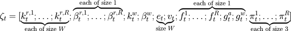

###### 图 12-7。接口向量分解为其各个组件

通过沿着组件对大小进行求和，我们可以将 ζt 向量视为一个大小为 R×W+3W+5R+3 的大向量。因此，为了从网络输出中获得该向量，我们构建一个可学习的 𝒩×(R×W+3W+5R+3) 权重矩阵 Wζ，其中 |𝒩| 是网络输出的大小，如下所示：

<math alttext="zeta Subscript t Baseline equals upper W Subscript zeta Baseline script upper N left-parenthesis chi Subscript t Baseline right-parenthesis"><mrow><msub><mi>ζ</mi> <mi>t</mi></msub> <mo>=</mo> <msub><mi>W</mi> <mi>ζ</mi></msub> <mi>𝒩</mi> <mrow><mo>(</mo> <msub><mi>χ</mi> <mi>t</mi></msub> <mo>)</mo></mrow></mrow></math>

在将<math alttext="zeta Subscript t"><msub><mi>ζ</mi> <mi>t</msub></math>向量传递给内存之前，我们需要确保每个组件具有有效值。例如，所有门以及擦除向量必须具有 0 到 1 之间的值，因此我们通过 sigmoid 函数将它们传递以确保这一要求：

<math alttext="e Subscript t Baseline equals sigma left-parenthesis e Subscript t Baseline right-parenthesis comma f Subscript t Superscript i Baseline equals sigma left-parenthesis f Subscript t Superscript i Baseline right-parenthesis comma g Subscript t Superscript a Baseline equals sigma left-parenthesis g Subscript t Superscript a Baseline right-parenthesis comma g Subscript t Superscript w Baseline equals sigma left-parenthesis g Subscript t Superscript w Baseline right-parenthesis where sigma left-parenthesis z right-parenthesis equals StartFraction 1 Over 1 plus e Superscript negative z Baseline EndFraction"><mrow><msub><mi>e</mi> <mi>t</mi></msub> <mo>=</mo> <mi>σ</mi> <mrow><mo>(</mo> <msub><mi>e</mi> <mi>t</mi></msub> <mo>)</mo></mrow> <mo>,</mo> <msubsup><mi>f</mi> <mi>t</mi> <mi>i</mi></msubsup> <mo>=</mo> <mi>σ</mi> <mrow><mo>(</mo> <msubsup><mi>f</mi> <mi>t</mi> <mi>i</mi></msubsup> <mo>)</mo></mrow> <mo>,</mo> <msubsup><mi>g</mi> <mi>t</mi> <mi>a</mi></msubsup> <mo>=</mo> <mi>σ</mi> <mrow><mo>(</mo> <msubsup><mi>g</mi> <mi>t</mi> <mi>a</mi></msubsup> <mo>)</mo></mrow> <mo>,</mo> <msubsup><mi>g</mi> <mi>t</mi> <mi>w</mi></msubsup> <mo>=</mo> <mi>σ</mi> <mrow><mo>(</mo> <msubsup><mi>g</mi> <mi>t</mi> <mi>w</mi></msubsup> <mo>)</mo></mrow> <mtext>where</mtext> <mi>σ</mi> <mrow><mo>(</mo> <mi>z</mi> <mo>)</mo></mrow> <mo>=</mo> <mfrac><mn>1</mn> <mrow><mn>1</mn><mo>+</mo><msup><mi>e</mi> <mrow><mo>-</mo><mi>z</mi></mrow></msup></mrow></mfrac></mrow></math>

此外，所有查找强度都需要具有大于或等于 1 的值，因此我们首先通过*oneplus*函数传递它们：

<math alttext="beta Subscript t Superscript r comma i Baseline equals normal o normal n normal e normal p normal l normal u normal s left-parenthesis beta Subscript t Superscript r comma i Baseline right-parenthesis comma beta Subscript t Superscript w Baseline equals normal o normal n normal e normal p normal l normal u normal s left-parenthesis beta Subscript t Superscript w Baseline right-parenthesis where normal o normal n normal e normal p normal l normal u normal s left-parenthesis z right-parenthesis equals 1 plus log left-parenthesis 1 plus e Superscript z Baseline right-parenthesis"><mrow><msubsup><mi>β</mi> <mi>t</mi> <mrow><mi>r</mi><mo>,</mo><mi>i</mi></mrow></msubsup> <mo>=</mo> <mi>oneplus</mi> <mrow><mo>(</mo> <msubsup><mi>β</mi> <mi>t</mi> <mrow><mi>r</mi><mo>,</mo><mi>i</mi></mrow></msubsup> <mo>)</mo></mrow> <mo>,</mo> <msubsup><mi>β</mi> <mi>t</mi> <mi>w</mi></msubsup> <mo>=</mo> <mi>oneplus</mi> <mrow><mo>(</mo> <msubsup><mi>β</mi> <mi>t</mi> <mi>w</mi></msubsup> <mo>)</mo></mrow> <mtext>where</mtext> <mi>oneplus</mi> <mrow><mo>(</mo> <mi>z</mi> <mo>)</mo></mrow> <mo>=</mo> <mn>1</mn> <mo>+</mo> <mo form="prefix">log</mo> <mrow><mo>(</mo> <mn>1</mn> <mo>+</mo> <msup><mi>e</mi> <mi>z</mi></msup> <mo>)</mo></mrow></mrow></math>

最后，读取模式必须具有有效的 softmax 分布：

<math alttext="pi Subscript t Superscript i Baseline equals normal s normal o normal f normal t normal m normal a normal x left-parenthesis pi Subscript t Superscript i Baseline right-parenthesis where normal s normal o normal f normal t normal m normal a normal x left-parenthesis z right-parenthesis equals StartFraction e Superscript z Baseline Over sigma-summation Underscript j Endscripts e Superscript z Super Subscript j Superscript Baseline EndFraction"><mrow><msubsup><mi>π</mi> <mi>t</mi> <mi>i</mi></msubsup> <mo>=</mo> <mi>softmax</mi> <mrow><mo>(</mo> <msubsup><mi>π</mi> <mi>t</mi> <mi>i</mi></msubsup> <mo>)</mo></mrow> <mtext>where</mtext> <mi>softmax</mi> <mrow><mo>(</mo> <mi>z</mi> <mo>)</mo></mrow> <mo>=</mo> <mfrac><msup><mi>e</mi> <mi>z</mi></msup> <mrow><msub><mo>∑</mo> <mi>j</mi></msub> <msup><mi>e</mi> <msub><mi>z</mi> <mi>j</mi></msub></msup></mrow></mfrac></mrow></math>

通过这些转换，接口向量现在已准备好传递给内存；在引导内存进行操作的同时，我们还需要来自神经网络的第二个信息片段，*预输出*向量<math alttext="v Subscript t"><msub><mi>v</mi> <mi>t</mi></msub></math>。这是与最终输出向量相同大小的向量，但不是最终输出向量。通过使用另一个可学习的<math alttext="StartAbsoluteValue script upper N EndAbsoluteValue times upper Y"><mrow><mo>|</mo> <mi>𝒩</mi> <mo>|</mo> <mo>×</mo> <mi>Y</mi></mrow></math>权重矩阵<math alttext="upper W Subscript y"><msub><mi>W</mi> <mi>y</mi></msub></math>，我们可以通过以下方式获得预输出：

<math alttext="v Subscript t Baseline equals upper W Subscript y Baseline script upper N left-parenthesis chi Subscript t Baseline right-parenthesis"><mrow><msub><mi>v</mi> <mi>t</mi></msub> <mo>=</mo> <msub><mi>W</mi> <mi>y</mi></msub> <mi>𝒩</mi> <mrow><mo>(</mo> <msub><mi>χ</mi> <mi>t</mi></msub> <mo>)</mo></mrow></mrow></math>

这个预输出向量使我们能够不仅根据网络输出，还根据最近从内存中读取的向量<math alttext="normal r Subscript t"><msub><mi mathvariant="normal">r</mi> <mi>t</mi></msub></math>来调整我们的最终输出。通过第三个可学习的<math alttext="left-parenthesis upper R times upper W right-parenthesis times upper Y"><mrow><mo>(</mo> <mi>R</mi> <mo>×</mo> <mi>W</mi> <mo>)</mo> <mo>×</mo> <mi>Y</mi></mrow></math>权重矩阵<math alttext="upper W Subscript r"><msub><mi>W</mi> <mi>r</mi></msub></math>，我们可以得到最终输出：

<math alttext="y Subscript t Baseline equals v Subscript t Baseline plus upper W Subscript r Baseline left-bracket normal r Subscript t Superscript 1 Baseline semicolon ellipsis semicolon normal r Subscript t Superscript upper R Baseline right-bracket"><mrow><msub><mi>y</mi> <mi>t</mi></msub> <mo>=</mo> <msub><mi>v</mi> <mi>t</mi></msub> <mo>+</mo> <msub><mi>W</mi> <mi>r</mi></msub> <mrow><mo>[</mo> <msubsup><mi mathvariant="normal">r</mi> <mi>t</mi> <mn>1</mn></msubsup> <mo>;</mo> <mo>⋯</mo> <mo>;</mo> <msubsup><mi mathvariant="normal">r</mi> <mi>t</mi> <mi>R</mi></msubsup> <mo>]</mo></mrow></mrow></math>

考虑到控制器除了单词大小<math alttext="upper W"><mi>W</mi></math>之外对内存一无所知，已经学习的控制器可以扩展到具有更多位置的更大内存，而无需重新训练。此外，我们没有为神经网络指定任何特定结构或任何特定损失函数的事实使得 DNC 成为一个通用架构，可以应用于各种任务和学习问题。

# 展示 DNC 的运行情况

观察 DNC 的运行方式之一是在一个简单的任务上对其进行训练，这样我们可以查看权重和参数值，并以一种可解释的方式对其进行可视化。对于这个简单的任务，我们将使用我们已经在 NTMs 中看到的复制问题，但稍作修改。

我们的任务不是尝试复制单个二进制向量序列，而是复制一系列这样的序列。在图 12-8 中，(a)显示了单个序列输入。在处理这样的单个序列输入并将相同序列复制到输出后，DNC 将完成其程序，并且其内存将以一种不允许我们看到它如何动态管理的方式被重置。相反，我们将一系列这样的序列，如图 12-8 中(b)所示，视为单个输入。

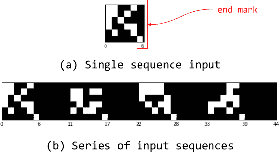

###### 图 12-8。单序列输入与一系列输入序列

图 12-9 显示了 DNC 在训练了一系列长度为 4 的序列后的操作可视化，每个序列包含五个二进制向量和一个结束标记。这里使用的 DNC 只有 10 个内存位置，因此无法存储输入中的所有 20 个向量。使用前馈控制器确保不会将任何内容存储在循环状态中，并且只使用一个读头使得可视化更清晰。这些约束应该迫使 DNC 学会如何释放和重复使用内存以成功复制整个输入，事实上它确实做到了。

我们可以看到在该可视化中，DNC 将五个向量中的每一个按顺序写入单个内存位置。一旦看到结束标记，读头就开始按照完全相同的顺序从这些位置读取。我们可以看到分配和释放门在系列中每个序列的写入和读取阶段之间交替激活。从底部的使用向量图表中，我们还可以看到，一旦写入到内存位置，其使用率就变为 1，而在从该位置读取后立即降为 0，表示已被释放并可以再次重用。

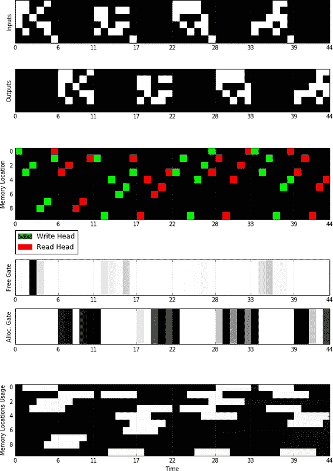

###### 图 12-9。在复制问题上执行 DNC 操作的可视化

这种可视化是由[Mostafa Samir](https://oreil.ly/TtKJ8)开源实现的 DNC 架构的一部分。在下一节中，我们将学习一些重要的技巧和窍门，这些技巧和窍门将使我们能够在阅读理解任务中实现一个更简单的 DNC 版本。

# 在 PyTorch 中实现 DNC

在 PyTorch 中实现 DNC 架构基本上是我们刚刚讨论的数学的直接应用。因此，通过与与本书相关的代码库中的完整实现，我们将专注于棘手的部分，并在此过程中介绍一些新的 PyTorch 实践。

实现的主要部分位于*mem_ops.py*文件中，其中实现了所有的注意力和访问机制。然后将该文件导入以与控制器一起使用。可能有点棘手的两个操作是链接矩阵更新和分配权重计算。这两个操作都可以用`for`循环天真地实现，但是在创建计算图时使用`for`循环通常不是一个好主意。让我们首先看一下链接矩阵更新操作，看看基于循环的实现是什么样子的：

```py
def Lt(L, wwt, p, N):

    L_t = torch.zeros((N,N), dtype=torch.float32)
    for i in range(N):
        for j in range(N):
            if i == j:
                continue
            mask = torch.zeros((N,N), dtype=torch.float32)
            mask[i,j] = 1.0

            link_t = (1 - wwt[i] - wwt[j]) * L[i,j] + \
                      wwt[i] * p[j]
            L_t += mask * link_t
    return L_t

```

在完全定义了该计算图之后，它将被提供具体的值并执行。考虑到这一点，我们可以看到，正如图 12-10 所示，在`for`循环的大多数迭代中，表示循环体的一组新节点被添加到计算图中。因此，对于*N*个内存位置，我们最终得到了<math alttext="upper N squared minus upper N"><mrow><msup><mi>N</mi> <mn>2</mn></msup> <mo>-</mo> <mi>N</mi></mrow></math>个相同的节点副本，每个迭代一个，每个占用我们的 RAM 的一部分，并需要在下一个节点之前处理自己的时间。当*N*是一个小数字时，比如 5，我们得到 20 个相同的副本，这并不太糟糕。然而，如果我们想使用更大的内存，比如<math alttext="upper N equals 256"><mrow><mi>N</mi> <mo>=</mo> <mn>256</mn></mrow></math>，我们得到 65,280 个节点的相同副本，这对内存使用和执行时间都是灾难性的。

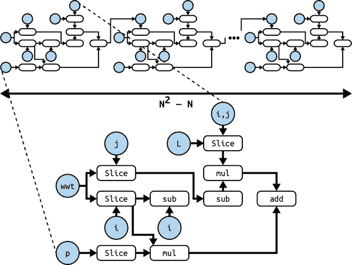

###### 图 12-10。使用`for`循环实现的链接矩阵更新操作的计算图

克服这种问题的一种可能方式是*向量化*。在向量化中，我们将最初以单个元素形式定义的数组操作重写为一次对整个数组的操作。对于链接矩阵更新，我们可以将操作重写为：

<math alttext="normal upper L Subscript t Baseline equals left-bracket left-parenthesis 1 minus normal w Subscript t Superscript w Baseline circled-plus normal w Subscript t Superscript w Baseline right-parenthesis ring normal upper L Subscript t minus 1 Baseline plus normal w Subscript t Superscript w Baseline normal p Subscript t minus 1 Baseline right-bracket ring left-parenthesis 1 minus upper I right-parenthesis"><mrow><msub><mi mathvariant="normal">L</mi> <mi>t</mi></msub> <mo>=</mo> <mfenced separators="" open="[" close="]"><mfenced separators="" open="(" close=")"><mn>1</mn> <mo>-</mo> <msubsup><mi mathvariant="normal">w</mi> <mi>t</mi> <mi>w</mi></msubsup> <mo>⊕</mo> <msubsup><mi mathvariant="normal">w</mi> <mi>t</mi> <mi>w</mi></msubsup></mfenced> <mo>∘</mo> <msub><mi mathvariant="normal">L</mi> <mrow><mi>t</mi><mo>-</mo><mn>1</mn></mrow></msub> <mo>+</mo> <msubsup><mi mathvariant="normal">w</mi> <mi>t</mi> <mi>w</mi></msubsup> <msub><mi mathvariant="normal">p</mi> <mrow><mi>t</mi><mo>-</mo><mn>1</mn></mrow></msub></mfenced> <mo>∘</mo> <mfenced separators="" open="(" close=")"><mn>1</mn> <mo>-</mo> <mi>I</mi></mfenced></mrow></math>

其中<math alttext="upper I"><mi>I</mi></math>是单位矩阵，而乘积<math alttext="normal w Subscript t Superscript w Baseline normal p Subscript t minus 1"><mrow><msubsup><mi mathvariant="normal">w</mi> <mi>t</mi> <mi>w</mi></msubsup> <msub><mi mathvariant="normal">p</mi> <mrow><mi>t</mi><mo>-</mo><mn>1</mn></mrow></msub></mrow></math>是外积。为了实现这种向量化，我们定义了一个新的运算符，即向量的成对加法，表示为<math alttext="circled-plus"><mo>⊕</mo></math>。这个新运算符简单地定义为：

<math alttext="u circled-plus v equals Start 3 By 3 Matrix 1st Row 1st Column u 1 plus v 1 2nd Column  ellipsis 3rd Column u 1 plus v Subscript n Baseline 2nd Row 1st Column  ellipsis 2nd Column  ellipsis 3rd Column  ellipsis 3rd Row 1st Column u Subscript n Baseline plus v 1 2nd Column  ellipsis 3rd Column u Subscript n Baseline plus v Subscript n EndMatrix"><mrow><mi>u</mi> <mo>⊕</mo> <mi>v</mi> <mo>=</mo> <mfenced open="(" close=")"><mtable><mtr><mtd><mrow><msub><mi>u</mi> <mn>1</mn></msub> <mo>+</mo> <msub><mi>v</mi> <mn>1</mn></msub></mrow></mtd> <mtd><mo>⋯</mo></mtd> <mtd><mrow><msub><mi>u</mi> <mn>1</mn></msub> <mo>+</mo> <msub><mi>v</mi> <mi>n</mi></msub></mrow></mtd></mtr> <mtr><mtd><mo>⋮</mo></mtd> <mtd><mo>⋱</mo></mtd> <mtd><mo>⋮</mo></mtd></mtr> <mtr><mtd><mrow><msub><mi>u</mi> <mi>n</mi></msub> <mo>+</mo> <msub><mi>v</mi> <mn>1</mn></msub></mrow></mtd> <mtd><mo>⋯</mo></mtd> <mtd><mrow><msub><mi>u</mi> <mi>n</mi></msub> <mo>+</mo> <msub><mi>v</mi> <mi>n</mi></msub></mrow></mtd></mtr></mtable></mfenced></mrow></math>

这个操作符增加了实现的内存需求，但不像基于循环的实现那样多。通过这种矢量化重构更新规则，我们重写了一个更节省内存和时间的实现：

```py
def Lt(L, wwt, p, N):
    """
    returns the updated link matrix given the previous one along
    with the updated write weightings and the previous precedence
    vector
    """
    def pairwise_add(v):
        """
        returns the matrix of pairs - adding the elements of v to
        themselves
        """
        n = v.shape[0]
        # a NxN matrix of duplicates of u along the columns
        V = v.repeat(1,n)  
        return V + V

    # expand dimensions of wwt and p to make matmul behave as outer
    # product
    wwt = torch.unsqueeze(wwt, 1)
    p = torch.unsqueeze(p, 0)

    I = torch.eye(N, dtype=torch.float32)
    return (((1 - pairwise_add(wwt)) * L +
             torch.matmul(wwt, p)) * (1 - I))

```

分配权重规则也可以采用类似的过程。我们可以将权重向量的每个元素的单一规则分解为一些同时作用于整个向量的操作：

1.  在对使用情况向量进行排序以获取自由列表时，我们还获取了排序后的使用情况向量本身。

1.  我们计算排序后使用情况的累积乘积向量。该向量的每个元素与我们原始逐元素规则中的乘积项相同。

1.  我们将累积乘积向量乘以（1 减去排序后的使用情况向量）。得到的向量是分配权重，但是按照排序顺序，而不是内存位置的原始顺序。

1.  对于那些无序分配权重的每个元素，我们取其值并将其放入自由列表中相应的索引中。现在得到的向量是我们想要的正确分配权重。

图 12-11 用一个数值示例总结了这个过程。

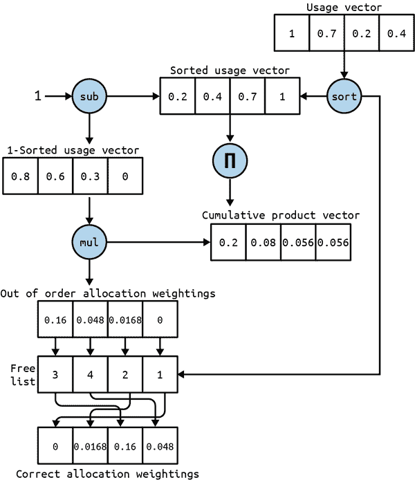

###### 图 12-11。计算分配权重的矢量化过程

在步骤 1 中对使用情况向量进行排序和在步骤 4 中重新排序权重似乎仍然需要循环，但幸运的是 PyTorch 提供了符号操作，可以让我们执行这些操作而无需 Python 循环。

对于排序，我们将使用`torch.topk`。该操作接受一个张量和一个数字<math alttext="k"><mi>k</mi></math>，并返回按降序排列的前<math alttext="k"><mi>k</mi></math>个值以及这些值的索引。为了按升序获取排序后的使用情况向量，我们需要获取使用情况向量的负值的前*N*个值。通过将结果向量乘以<math alttext="negative 1"><mrow><mo>-</mo> <mn>1</mn></mrow></math>，我们可以将排序后的值恢复为其原始符号：

```py
sorted_ut, free_list = torch.topk(-1*ut, N)
sorted_ut *= -1

```

为了重新排序分配权重，我们首先创建一个大小为 N 的空张量数组，用于容纳权重的正确顺序，然后使用实例方法`scatter(indices, values)`将值放入其正确位置。该方法的第二个参数是一个张量，并且沿着其第一维度将值散布到数组中，第一个参数是我们想要将相应值散布到的位置的索引列表。在这里，第一个参数是自由列表，第二个参数是无序分配权重。一旦我们得到了权重正确放置的数组，我们使用另一个实例方法`pack()`将整个数组包装成一个`Tensor`对象：

```py
empty_at = torch.empty(N)
a_t = empty_at.scatter(0, free_list, out_of_location_at)

```

实现中最后需要循环的部分是控制器循环本身——遍历输入序列的每个步骤以进行处理的循环。因为矢量化仅在操作被定义为逐元素时才有效，控制器的循环无法进行矢量化。幸运的是，PyTorch 仍然为我们提供了一种方法来避免 Python 的`for`循环及其巨大的性能损失；这种方法是*符号循环*。符号循环的工作方式与我们大多数符号操作相同：它不会将实际循环展开到图中，而是定义一个节点，当执行图时将作为循环执行。

我们将符号循环的实现留给读者自行完成。关于如何在 PyTorch 中使用符号循环的更多信息可以在 torch.fx [文档](https://oreil.ly/qtgBt)中找到。

我们符号循环的 TensorFlow 实现可以在代码库中的*train_babi.py*文件中找到。

# 教授 DNC 阅读和理解

在本章的前面，当我们谈论神经 n-gram 时，我们说这不是一个能够阅读故事后回答问题的人工智能的复杂性。现在我们已经达到了可以构建这样一个系统的程度，因为这正是应用在 bAbI 数据集上的 DNC 所做的事情。

bAbI 数据集是一个合成数据集，包含 20 组故事、关于这些故事的问题以及它们的答案。每组代表一个特定且独特的推理和推断任务。在我们将使用的版本中，每个任务包含 10,000 个用于训练的问题和 1,000 个用于测试的问题。例如，以下故事（从中我们之前看到的段落改编而来）来自*lists-and-sets*任务，其中问题的答案是故事中提到的对象的列表/集合：

```py
1 Mary took the milk there.
2 Mary went to the office.
3 What is Mary carrying?   milk 1
4 Mary took the apple there.
5 Sandra journeyed to the bedroom.
6 What is Mary carrying?   milk,apple 1 4

```

这是直接从数据集中获取的，正如你所看到的，一个故事被组织成从 1 开始编号的句子。每个问题以问号结尾，紧接问号的单词是答案。如果答案由多个单词组成，这些单词之间用逗号分隔。跟随答案的数字是指向包含答案单词的句子的监督信号。

为了使任务更具挑战性，我们将放弃这些监督信号，让系统学会阅读文本并自行找出答案。遵循 DNC 论文，我们将通过删除所有数字和标点（除了“？”和“.”）来预处理我们的数据集，将所有单词转换为小写，并在输入序列中用破折号“-”替换答案单词。之后，我们得到了跨所有任务的 159 个唯一单词和标记（词汇表），因此我们将每个词汇表编码为大小为 159 的独热向量，没有嵌入，只是直接的纯单词。最后，我们将所有 20 万个训练问题组合在一起，共同训练模型，并将每个任务的测试问题保持分开，以便在每个任务上单独测试训练后的模型。整个过程在代码库中的*preprocess.py*文件中实现。

训练模型时，我们从编码的训练数据中随机抽取一个故事，通过带有 LSTM 控制器的 DNC，得到相应的输出序列。然后，我们使用 softmax 交叉熵损失来衡量输出序列与期望序列之间的损失，但仅在包含答案的步骤上进行。所有其他步骤都通过使用权重向量来忽略损失，该向量在答案步骤处为 1，在其他地方为 0。这个过程在*train_babi.py*文件中实现。

模型训练完成后，我们将在剩余的测试问题上测试其性能。我们的度量标准将是模型未能回答每个任务中的问题的百分比。问题的答案是输出中具有最大 softmax 值的单词，或者是最有可能的单词。如果所有答案单词都是正确的单词，则认为问题被正确回答。如果模型未能回答某个任务的问题超过 5％，我们认为模型在该任务上失败。测试过程在*test_babi.py*文件中找到。

在训练模型约 500,000 次迭代后（注意-需要很长时间！），我们可以看到它在大多数任务上表现得相当不错。与此同时，在更困难的任务（如*寻路*）上表现不佳，该任务是回答如何从一个地方到另一个地方的问题。以下报告将我们模型的结果与原始 DNC 论文中报告的平均值进行比较：

```py
Task                       Result            Paper's Mean
---------------------------------------------------------
single supporting fact     0.00%             9.0±12.6%
two supporting facts       11.88%            39.2±20.5%
three supporting facts     27.80%            39.6±16.4%
two arg relations          1.40%             0.4±0.7%
three arg relations        1.70%             1.5±1.0%
yes no questions           0.50%             6.9±7.5%
counting                   4.90%             9.8±7.0%
lists sets                 2.10%             5.5±5.9%
simple negation            0.80%             7.7±8.3%
indefinite knowledge       1.70%             9.6±11.4%
basic coreference          0.10%             3.3±5.7%
conjunction                0.00%             5.0±6.3%
compound coreference       0.40%             3.1±3.6%
time reasoning             11.80%            11.0±7.5%
basic deduction            45.44%            27.2±20.1%
basic induction            56.43%            53.6±1.9%
positional reasoning       39.02%            32.4±8.0%
size reasoning             8.68%             4.2±1.8%
path finding               98.21%            64.6±37.4%
agents motivations         2.71%             0.0±0.1%
---------------------------------------------------------
Mean Err.                  15.78%            16.7±7.6%
Failed (err. > 5%)         8              11.2±5.4

```

# 总结

在本章中，我们探索了深度学习研究的前沿，使用 NTMs 和 DNCs，最终实现了一个可以解决复杂阅读理解任务的模型。

在本书的最后一章中，我们将开始探索一个非常不同的问题空间，即强化学习。我们将建立对这一新类任务的直觉，并利用迄今为止我们开发的深度学习工具来解决这些问题的算法基础。

¹ 来源：[格雷夫斯等人“神经图灵机。”（2014）](https://arxiv.org/abs/1410.5401)
