## 第一部分\. GANs 和生成建模简介

第一部分介绍了生成对抗网络（GANs）的世界，并介绍了最经典的 GAN 变体的实现：

+   在第一章中，您将学习 GAN 的基础知识，并发展对它们如何工作的直观理解。

+   在第二章中，我们将稍微转换一下方向，研究自动编码器，以便您能够更全面地理解生成建模。自动编码器是 GANs 最重要的理论和实践先驱之一，并且至今仍被广泛使用。

+   第三章 从第一章结束的地方开始，深入探讨了 GAN 和对抗学习背后的理论。在这一章中，您还将实现并训练您的第一个、完全功能的 GAN。

+   第四章 通过探索深度卷积生成对抗网络（DCGAN）继续您的学习之旅。这一在原始 GAN 之上的创新使用了卷积神经网络来提高生成图像的质量。

## 第一章\. GANs 简介

*本章涵盖*

+   生成对抗网络概述

+   使这一类机器学习算法特殊的是

+   本书涵盖的一些令人兴奋的 GAN 应用

机器能否思考的观念比计算机本身还要古老。在 1950 年，著名的数学家、逻辑学家和计算机科学家艾伦·图灵——他因在解码纳粹战争加密机恩尼格玛中的角色而闻名——撰写了一篇将使他的名字永垂不朽的论文，“计算机与智能。”

在这篇论文中，图灵提出了一种他称之为“模仿游戏”的测试，今天更广为人知的是“图灵测试”。在这个假设的场景中，一个不知情观察者与两个在封闭门后的人交谈：一个，是人类；另一个，是计算机。图灵认为，如果观察者无法分辨出哪个人和哪台机器，那么计算机通过了测试，必须被认为是有智能的。

任何尝试与自动化聊天机器人或语音智能助手进行对话的人都知道，计算机还有很长的路要走才能通过这个看似简单的测试。然而，在其他任务中，计算机不仅与人类的表现持平，甚至超越了人类——即使在最近还被认为连最聪明的算法都无法触及的领域，如超人类准确的面部识别或掌握围棋游戏。^([1])

> ¹
> 
> 参见“在 LFW 上超越人类水平的面部验证性能：基于 GaussianFace”，作者：Chaochao Lu 和 Xiaoou Tang，2014 年，[`arXiv.org/abs/1404.3840`](https://arXiv.org/abs/1404.3840)。另见《纽约时报》文章“谷歌的 AlphaGo 战胜中国围棋大师，人工智能取得胜利”，作者：Paul Mozur，2017 年，[`mng.bz/07WJ`](http://mng.bz/07WJ)。

机器学习算法擅长在现有数据中识别模式，并利用这些洞察力来完成诸如 *分类*（将正确的类别分配给示例）和 *回归*（根据多种输入估计数值）等任务。然而，当要求生成新数据时，计算机却遇到了困难。一个算法可以击败国际象棋大师，预测股价走势，或判断信用卡交易是否可能欺诈。相比之下，与亚马逊的 Alexa 或苹果的 Siri 进行闲聊的任何尝试都是注定要失败的。的确，人类最基本和最本质的能力——包括愉快的交谈或创作原创作品——甚至可以让最复杂的超级计算机陷入数字痉挛。

所有这一切都在 2014 年发生了变化，当时蒙特利尔大学的博士生 Ian Goodfellow 发明了生成对抗网络（GANs）。这项技术通过使用不是单个而是两个独立的神经网络，使计算机能够生成逼真的数据。GANs 并不是第一个用于生成数据的计算机程序，但它们的结果和多功能性使它们与其他所有程序都不同。GANs 取得了长期被认为对人工系统几乎不可能的显著成果，例如生成具有真实世界质量的假图像，将涂鸦变成类似照片的图像，或将马的视频变成奔跑的斑马——所有这些都不需要大量精心标注的训练数据。

生成对抗网络（GANs）如何使机器数据生成能力得到如此大的提升的一个令人信服的例子是合成人类面部，如图 1.1 所示。就在 GANs 被发明的那年，即 2014 年，机器能产生的最好的结果是一个模糊的面孔——甚至那也被庆祝为划时代的成功。到了 2017 年，仅仅三年后，GANs 的进步使计算机能够合成与高分辨率肖像照片相媲美的假面孔。在这本书中，我们将揭开使这一切成为可能的算法的面纱。

##### 图 1.1. 人类面部生成进展

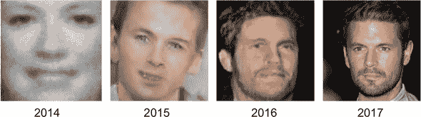

(来源：“人工智能的恶意使用：预测、预防和缓解”，作者：Miles Brundage 等，2018 年，[`arxiv.org/abs/1802.07228`](https://arxiv.org/abs/1802.07228).)

### 1.1. 什么是生成对抗网络？

*生成对抗网络（GANs）*是一类机器学习技术，它由两个同时训练的模型组成：一个（*生成器*）被训练生成假数据，另一个（*判别器*）被训练从真实示例中辨别假数据。

词语*生成*表明了该模型的整体目的：创建新的数据。GAN 将学习生成的数据取决于训练集的选择。例如，如果我们想让 GAN 合成看起来像达芬奇的作品的图像，我们会使用达芬奇艺术作品的训练数据集。

术语*对抗*指向构成 GAN 框架的两个模型之间的游戏般、竞争性的动态：生成器和判别器。生成器的目标是创建与训练集中真实数据不可区分的示例。在我们的例子中，这意味着制作看起来就像达芬奇的作品的画作。判别器的目标是区分生成器产生的假示例和来自训练数据集的真实示例。在我们的例子中，判别器扮演了一个评估被认为是达芬奇作品的画作真实性的艺术专家的角色。这两个网络不断地试图欺骗对方：生成器在创建令人信服的数据方面越擅长，判别器在区分真实示例和假示例方面就需要越出色。

最后，词语*网络*表明了最常用来表示生成器和判别器的机器学习模型类别：神经网络。根据 GAN 实现的复杂性，这些网络可以从简单的前馈神经网络（你将在第三章 chapter 3 中看到）到卷积神经网络（你将在第四章 chapter 4 中看到）或甚至更复杂的变体，例如 U-Net（你将在第九章 chapter 9 中看到）。

### 1.2. GAN 是如何工作的？

支撑 GAN 的数学原理相当复杂（你将在后面的章节中了解到，特别是第三章 chapters 3 和第五章 5）；幸运的是，许多现实世界的类比可以使 GAN 更容易理解。之前，我们讨论了艺术伪造者（生成器）试图欺骗艺术专家（判别器）的例子。伪造者制作的假画越令人信服，艺术专家在确定其真实性方面的能力就必须越强。在相反的情况下也是如此：艺术专家在判断某幅画是否为真时的能力越强，伪造者就必须越改进以避免被当场抓获。

另一个常用来描述生成对抗网络（GANs）的隐喻——伊恩·古德费勒本人也喜欢使用的隐喻——是一个罪犯（生成器）伪造货币，和一个侦探（判别器）试图抓住他。伪造的钞票看起来越逼真，侦探在检测它们时就必须越好，反之亦然。

在更技术性的术语中，生成器的目标是生成能够捕捉训练数据集特征的示例，以至于它生成的样本看起来与训练数据无法区分。生成器可以被视为一个反向的对象识别模型。*对象识别算法*通过学习图像中的模式来识别图像的内容。生成器不是识别模式，而是从零开始学习创建它们；实际上，生成器的输入通常只是一个随机数字的向量。

生成器通过从判别器的分类中获得的反馈来学习。判别器的目标是确定一个特定示例是真实的（来自训练数据集）还是伪造的（由生成器创建）。相应地，每次判别器被欺骗将伪造图像分类为真实时，生成器就知道它做得很好。相反，每次判别器正确地拒绝生成器生成的图像为伪造时，生成器就会收到需要改进的反馈。

判别器也在不断改进。像任何分类器一样，它通过学习其预测与真实标签（真实或伪造）之间的距离来学习。因此，随着生成器在生成看起来逼真的数据方面变得更好，判别器在区分伪造数据和真实数据方面也变得更好，并且两个网络继续同时改进。

表 1.1 总结了关于两个 GAN 子网络的关键要点。

##### 表 1.1. 生成器和判别器子网络

|   | 生成器 | 判别器 |
| --- | --- | --- |

| 输入 | 一个随机数字的向量 | 判别器从两个来源接收输入：

+   来自训练数据集的真实示例

+   来自生成器的伪造示例

|

| 输出 | 努力尽可能令人信服的伪造示例 | 预测输入示例是真实的概率 |
| --- | --- | --- |
| 目标 | 生成与训练数据集成员无法区分的伪造数据 | 区分来自生成器的伪造示例和来自训练数据集的真实示例 |

### 1.3. GANs 在行动中

现在你已经对 GAN 及其组成网络有了高层次的理解，让我们更仔细地看看系统在实际中的应用。想象一下，我们的目标是教会一个 GAN 生成看起来逼真的手写数字。（你将在第三章（../Text/kindle_split_012.xhtml#ch03）中学习实现这样的模型，并在第四章（../Text/kindle_split_013.xhtml#ch04）中对其进行扩展。）图 1.2 说明了核心 GAN 架构。

##### 图 1.2。两个 GAN 子网络、它们的输入和输出以及它们的交互

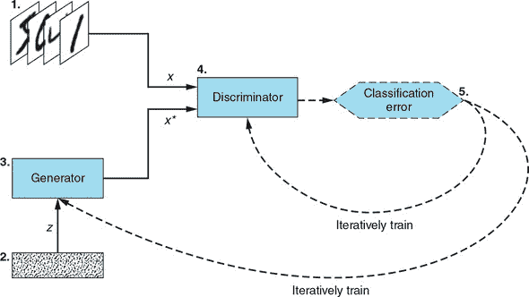

让我们详细了解一下图中的内容：

1.  ***训练数据集—*** 我们希望生成器能够以近乎完美的质量学习的真实例数据集。在这种情况下，数据集由手写数字的图像组成。这个数据集作为输入 (*x*) 传递给判别器网络。

1.  ***随机噪声向量—*** 生成器网络的原始输入 (*z*)。这个输入是一个随机数字向量，生成器使用它作为合成假例的起点。

1.  ***生成器网络—*** 生成器以随机数字向量 (*z*) 作为输入，并输出假例 (*x*)。其目标是使其产生的假例与训练数据集中的真实例子的区别不可辨。

1.  ***判别器网络—*** 判别器以来自训练集的真实例 (*x*) 或生成器产生的假例 (*x*) 作为输入。对于每个例子，判别器确定并输出该例子为真实的概率。

1.  ***迭代训练/调整—*** 对于判别器的每个预测，我们确定其好坏——就像我们会对一个常规分类器做的那样——并使用结果通过反向传播迭代调整判别器和生成器网络：

    +   更新判别器的权重和偏差，以最大化其分类准确率（最大化正确预测的概率：*x* 为真实，*x* 为假）。

    +   更新生成器的权重和偏差，以最大化判别器将 *x* 错误分类为真实例的概率。

#### 1.3.1. GAN 训练

了解各种 GAN 组件的目的是像看发动机的快照一样：除非我们看到它在运动中，否则无法完全理解。这正是本节的内容。首先，我们介绍 GAN 训练算法；然后，我们展示训练过程，以便您可以看到架构图的实际应用。


**GAN 训练算法**

*对于*每个训练迭代*执行*

1.  训练判别器：

    1.  从训练数据集中随机取一个真实例 *x*。

    1.  获取一个新的随机噪声向量 *z*，并使用生成器网络合成一个假例 *x*。

    1.  使用判别器网络对 *x* 和 *x* 进行分类。

    1.  计算分类错误，并将总错误反向传播以更新判别器的可训练参数，寻求*最小化*分类错误。

1.  训练生成器：

    1.  获取一个新的随机噪声向量 *z*，并使用生成器网络合成一个假例 *x*。

    1.  使用判别器网络对 *x* 进行分类。

    1.  计算分类错误，并将错误反向传播以更新生成器的可训练参数，寻求*最大化*判别器的错误。

*结束 for*


##### GAN 训练可视化

图 1.3 展示了 GAN 训练算法。图中的字母代表 GAN 训练算法步骤列表。

##### 图 1.3。GAN 训练算法有两个主要部分。这两个部分，判别器训练和生成器训练，描绘了训练过程中相应阶段的同一 GAN 网络在不同时间快照下的情况。

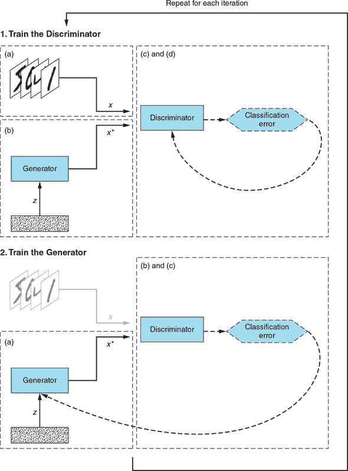


**子图图例**

1.  训练判别器：

    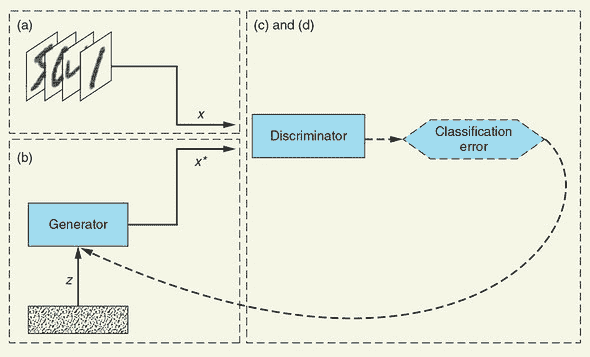

    1.  从训练数据集中随机取一个真实例子 *x*。

    1.  获取一个新的随机噪声向量 *z*，并使用生成器网络合成一个假例 *x**。

    1.  使用判别器网络对 *x* 和 *x** 进行分类。

    1.  计算分类误差并将总误差反向传播以更新判别器的权重和偏差，寻求*最小化*分类误差。

1.  训练生成器：

    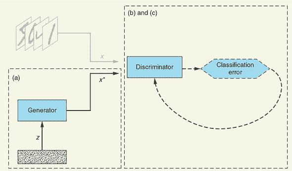

    1.  获取一个新的随机噪声向量 *z*，并使用生成器网络合成一个假例 *x**。

    1.  使用判别器网络对 *x** 进行分类。

    1.  计算分类误差并将误差反向传播以更新生成器的权重和偏差，寻求*最大化*判别器的误差。


#### 1.3.2. 达到均衡

你可能会想知道 GAN 训练循环何时应该停止。更确切地说，我们如何知道 GAN 已经完全训练好，以便我们可以确定适当的训练迭代次数？对于常规神经网络，我们通常有一个明确的目标要实现和衡量。例如，当训练一个分类器时，我们衡量训练集和验证集上的分类误差，并在验证误差开始变差时停止过程（以避免过拟合）。在 GAN 中，两个网络有竞争目标：当一个网络变得更好时，另一个网络会变得更差。我们如何确定何时停止？

熟悉博弈论的人可能会认出这种设置是一个*零和博弈*——一种一个玩家的收益等于另一个玩家损失的情况。当一个玩家提高一定量时，另一个玩家会以相同的量变差。所有零和博弈都有一个*纳什均衡*，即一个点，在这个点上，任何玩家都不能通过改变自己的行动来改善自己的情况或收益。

当满足以下条件时，GAN 达到纳什均衡：

+   生成器产生的假例在训练数据集中与真实数据无法区分。

+   判别器最多只能随机猜测一个特定例子是真实还是假（即，以 50/50 的概率猜测一个例子是真实的）。


##### 注意

纳什均衡是以美国经济学家和数学家约翰·福布斯·纳什（John Forbes Nash Jr.）的名字命名的，他的生平和事业在传记《美丽心灵》（A Beautiful Mind）中被捕捉，并启发了同名的电影。


让我们来说服你为什么这是真的。当每个假例子（*x*）与训练数据集中来的真实例子（*x*）真正无法区分时，判别器无法利用任何东西来区分它们。因为它收到的例子中有一半是真实的，一半是假的，判别器能做的最好的事情就是掷硬币，以 50%的概率将每个例子分类为真实或假。

生成器也处于一个点，它从进一步的调整中无法获得任何收益。因为它产生的例子已经与真实例子无法区分，即使是对它将随机噪声向量（*z*）转换为假例子（*x*）的过程进行微小的改变，也可能给判别器提供如何从真实数据中辨别假例子的线索，从而使生成器变得更糟。

当达到平衡时，人们说 GAN 已经*收敛*。这时事情变得复杂。在实践中，由于在非凸游戏中达到收敛的复杂性巨大，因此几乎不可能找到 GAN 的纳什均衡（关于收敛的更多内容将在后续章节中介绍，尤其是第五章）。确实，GAN 的收敛仍然是 GAN 研究中最重要的未解问题之一。

幸运的是，这并没有阻碍 GAN 研究或生成对抗学习的许多创新应用。即使在没有严格的数学保证的情况下，GAN 也取得了显著的经验性成果。本书涵盖了其中最具影响力的选择，下一节将预览其中的一些。

### 1.4. 为什么研究 GAN？

自从它们的发明以来，GAN 们被学术界和行业专家誉为深度学习中最有影响力的创新之一。Facebook 人工智能研究总监 Yann LeCun 甚至说，GAN 及其变体是“过去 20 年来深度学习中最酷的想法”。^([2])

> ²
> 
> 请参阅 Cade Metz 在*Wired*杂志 2017 年发表的“Google 的对抗神经网络对决以变得更聪明”，[`mng.bz/KE1X`](http://mng.bz/KE1X)。

这种兴奋是有充分理由的。与其他在机器学习领域可能家喻户晓的进步不同，GAN 们既吸引了研究人员的想象力，也吸引了更广泛的公众。它们被《纽约时报》、《BBC》、《科学美国人》和其他许多知名媒体所报道。确实，正是那些令人兴奋的 GAN 结果可能促使你最初购买这本书。（对吗？）

最值得注意的是，GAN 能够创建超逼真的图像。图 1.4 中的所有面孔都不属于真实人类；它们都是假的，展示了 GAN 合成具有照片级质量图像的能力。这些面孔是使用渐进式 GAN 生成的，这一技术在第六章中有介绍。

##### 图 1.4。这些逼真但虚假的人类面孔是由训练在名人高清肖像照片上的渐进式 GAN 合成的。

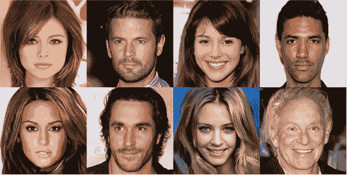

（来源：“通过渐进式增长 GAN 以改善质量、稳定性和多样性”，由 Tero Karras 等人撰写的，发表于 2017 年，[`arxiv.org/abs/1710.10196`](https://arxiv.org/abs/1710.10196)。）

另一项引人注目的 GAN 成就是*图像到图像的翻译*。类似于一个句子可以从中文翻译成西班牙语，GANs 可以将一个图像从一种领域转换到另一种领域。如图 1.5 所示，GANs 可以将马的图像转换成斑马的图像（反之亦然），以及将照片转换成类似莫奈的画作——这一切几乎无需监督和任何标签。使这一切成为可能的 GAN 变体被称为*CycleGAN*；你将在第九章中详细了解它。

##### 图 1.5。通过使用名为 CycleGAN 的 GAN 变体，我们可以将莫奈的画作变成照片，或将斑马的图像变成马的描绘，反之亦然。

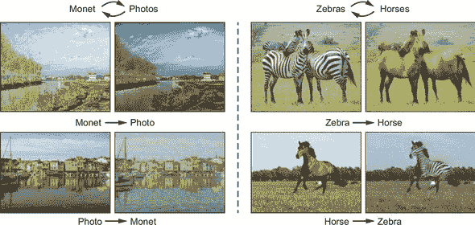

（来源：参见 Jun-Yan Zhu 等人撰写的《使用循环一致对抗网络进行无配对图像到图像翻译》，发表于 2017 年，[`arxiv.org/abs/1703.10593`](https://arxiv.org/abs/1703.10593)。）

更注重实际应用的 GAN 用例同样引人入胜。在线巨头亚马逊正在尝试利用 GANs 进行时尚推荐：通过分析无数套装，系统学会生产符合任何给定风格的全新商品.^([3])在医学研究中，GANs 被用于通过合成示例增强数据集，以提高诊断准确性.^([4])在第十一章—在你掌握了训练 GANs 及其变体的所有细节之后—你将详细探讨这两个应用。

> ³
> 
> 参见威尔·奈特撰写的《亚马逊已开发人工智能时尚设计师》，发表于 2017 年《麻省理工学院技术评论》，[`mng.bz/9wOj`](http://mng.bz/9wOj)。
> 
> ⁴
> 
> 参见 Maayan Frid-Adar 等人撰写的《使用 GAN 进行合成数据增强以改进肝脏病变分类》，发表于 2018 年，[`arxiv.org/abs/1801.02385`](https://arxiv.org/abs/1801.02385)。

GANs 也被视为实现*通用人工智能*的重要基石，^([5])这是一种能够匹配人类认知能力，在几乎任何领域获得专业知识的人工系统——从行走中涉及的肌肉技能，到语言，再到创作十四行诗所需的创造性技能。

> ⁵
> 
> 参见托尼·彭撰写的《OpenAI 创始人：短期 AGI 是一个严肃的可能性》，发表于 2018 年 Synced，[`mng.bz/j5Oa`](http://mng.bz/j5Oa)。另见 Soumith Chintala 撰写的《通过对抗网络实现无监督学习之路》，发表于 2016 年 f Code，[`mng.bz/WOag`](http://mng.bz/WOag)。

但由于能够生成新的数据和图像，GANs 也具有潜在的危险性。关于虚假新闻的传播和危害已经讨论了很多，但 GANs 创建可信虚假视频片段的潜力令人不安。在 2018 年一篇关于 GANs 的恰当标题的文章《如何通过人工智能的“猫鼠游戏”生成可信的虚假照片》的结尾，*《纽约时报》*的记者凯德·梅茨和基思·柯林斯讨论了 GANs 被利用来创建和传播令人信服的错误信息的令人担忧的前景，包括世界领导人的虚假视频片段。*《麻省理工学院技术评论》*旧金山分社社长马丁·吉尔斯在 2018 年的文章《GAN 之父：赋予机器想象力的男人》中重申了他们的担忧，并提到了另一个潜在风险：在熟练黑客的手中，GANs 可以以前所未有的规模直观地利用系统漏洞。正是这些担忧促使我们在第十二章中讨论 GANs 的伦理考量。

GANs（生成对抗网络）可以为世界带来许多好处，但所有技术创新都存在滥用风险。这里必须有一种意识哲学：因为无法“取消发明”一项技术，所以确保像你这样的人意识到这项技术的快速出现及其巨大潜力至关重要。

在这本书中，我们只能触及 GANs 可能性的表面。然而，我们希望这本书能为你提供必要的理论知识与实践技能，以便继续探索这个领域中最吸引你的任何方面。

因此，无需多言，让我们深入探讨吧！

### 摘要

+   GANs 是一种深度学习技术，它利用两个神经网络之间的竞争动态来合成真实的数据样本，例如虚假的逼真图像。构成 GAN 的两个网络如下：

    +   生成器，其目标是通过产生与训练数据集不可区分的数据来欺骗判别器

    +   判别器，其目标是正确区分来自训练数据集的真实数据和生成器产生的虚假数据

+   GANs 在许多不同领域都有广泛的应用，例如时尚、医学和网络安全。

## 第二章\. 使用自编码器进行生成建模简介

*本章涵盖*

+   将数据编码到潜在空间（降维）以及随后的维度扩展

+   在变分自编码器的背景下理解生成建模的挑战

+   使用 Keras 和自编码器生成手写数字

+   理解自编码器的局限性以及 GANs 的动机

> *我将这一章献给我的祖母，奥雷利·朗罗瓦，她在我们完成这项工作的时候去世了。我们将非常怀念她。*
> 
> *雅库布*

你可能想知道为什么我们选择将这一章包含在书中。有三个核心原因：

+   *生成模型对于大多数人来说是一个新的领域。* 大多数接触到机器学习的人通常首先接触到机器学习中的分类任务，并且接触得更为广泛——也许是因为它们通常更直接。因此，通过生成模型我们试图产生一个看起来逼真的新示例，这个领域理解得较少。因此，我们决定在深入探讨生成对抗网络（GANs）之前，先包括一个涵盖生成模型章节，特别是在考虑到自动编码器——GANs 最接近的前驱——的资源和研究丰富的情况下。但如果你想要直接进入新而激动人心的部分，请随意跳过这一章。

+   *生成模型非常具有挑战性。* 由于生成模型没有得到充分的表现，大多数人不知道典型模型的样子及其挑战。尽管自动编码器在许多方面更接近于最常教授的模型（例如，我们将在后面讨论的显式目标函数），但它们仍然面临着 GANs 面临许多挑战——例如评估样本质量有多困难。第五章更深入地讨论了这一点。

+   *生成模型是当今文献的重要组成部分。* 自动编码器本身也有其用途，正如我们在本章中讨论的那样。它们也是一个活跃的研究领域，甚至在某些领域处于最前沿，并被许多 GAN 架构明确使用。其他 GAN 架构将它们用作隐含的灵感或心理模型——例如在第九章中介绍的 CycleGAN。

### 2.1. 生成模型简介

你应该熟悉深度学习如何将原始像素转换为，例如，类别预测。例如，我们可以取包含图像像素的三个矩阵（每个颜色通道一个）并通过一个变换系统来获得最后的单个数字。但如果我们想反方向进行呢？

我们从确定我们想要生产的内容开始，并在变换的另一端获得图像。这就是最简单、最非正式形式的*生成模型*；我们在整本书中会添加更多深度。

更正式一点，我们取一个特定的规定（*z*）——对于这个简单案例，让我们假设它是一个介于 0 和 9 之间的数字——并试图得到一个生成的样本（*x*）。理想情况下，这个*x*看起来应该和另一个真实样本*x*一样逼真。这个规定*z*存在于一个*潜在空间*中，并作为一个灵感，以确保我们不会总是得到相同的输出*x*。这个潜在空间是一个学习到的表示——希望以我们思考的方式对人们有意义（“解耦”）。不同的模型将学习到相同数据的不同的潜在表示。

我们在第一章中看到的随机噪声向量通常被称为*潜在空间的样本*。潜在空间是数据点的简单、隐藏表示。在我们的上下文中，它表示为 *z*，而*简单*只是意味着低维的——例如，一个包含 100 个数字的向量或数组，而不是我们将使用的样本的 768 维。在许多方面，一个好的潜在表示将允许你在这个空间中将相似的事物分组。我们将在图 2.3 中解释自编码器上下文中的*潜在*意味着什么，并展示它如何影响我们在图 2.6 和 2.7 中生成的样本，但在我们能够做到这一点之前，我们将描述自编码器是如何工作的。

### 2.2. 自编码器在高级层面上是如何工作的？

正如他们的名字所暗示的，*自编码器*帮助我们自动地编码数据。自编码器由两部分组成：编码器和解码器。为了解释的目的，让我们考虑一个用例：压缩。

想象一下，你正在给你的祖父母写一封信，关于你作为机器学习工程师的职业。你只有一页纸来解释你所做的一切，以便他们能够理解，考虑到他们对世界的知识和信念。

现在想象一下，如果你的祖父母患有急性健忘症，完全记不起你的一切。这感觉是不是更难了？这可能是因为现在你必须解释*所有术语*。例如，他们仍然可以阅读并理解你信中的基本内容，比如你描述你的猫做了什么，但机器学习工程师的概念可能对他们来说是陌生的。换句话说，他们从潜在空间 *z* 到 *x* 的学习转换已经被（几乎）随机初始化。在你能够解释之前，你必须首先在他们的大脑中重新训练这些心理结构。你必须通过传递概念 *x* 并观察他们是否能够以有意义的方式将它们（*x*）重新呈现给你来训练他们的自编码器。这样，你可以测量他们的错误，称为*重建损失*（|| *x* – *x** ||）。

暗示地，我们每天都在压缩数据或信息，这样我们就不必花费大量时间解释已知的概念。人类的交流充满了自编码器，但它们是上下文相关的：我们对我们祖父母的解释，我们不必对我们工程同事解释，比如机器学习模型是什么。因此，某些人类潜在空间比其他潜在空间更适合，这取决于上下文。我们可以直接跳到他们自编码器已经理解的简洁表示。

我们可以压缩，因为将某些重复的概念简化为我们已经同意的抽象（例如，职位名称）是有用的。自动编码器可以系统地、自动地发现这些信息效率模式，定义它们，并将它们用作捷径来增加信息吞吐量。因此，我们只需要传输*z*，它通常是低维的，从而节省我们带宽。

从信息论的角度来看，你试图尽可能多地通过“信息瓶颈”（你的信件或口头交流）传递信息，而不牺牲太多的理解。你几乎可以想象这是一个只有你和你的家人理解的秘密捷径，但它已经针对你经常讨论的主题进行了优化。^([1)] 为了简单起见，并专注于压缩，我们选择忽略这样一个事实，即单词是一个明确的模型，尽管大多数单词背后也有巨大的上下文相关复杂性。

> ¹
> 
> 实际上，著名的欧洲金融家家族罗思柴尔德家族在其信件中就是这样做的，这也是他们在金融上如此成功的原因。

| |
| --- |

##### 定义

*潜在空间*是数据的隐藏表示。与表达单词或图像（例如，我们例子中的“机器学习工程师”，或图像的 JPEG 编解码器）的未压缩版本不同，自动编码器根据其对数据的理解压缩和聚类它们。

| |
| --- |

### 2.3. 自动编码器对 GANs 是什么？

与自动编码器相比，一个关键的区别是我们使用一个损失函数从头到尾训练整个网络，而生成对抗网络（GANs）对生成器和判别器有各自不同的损失函数。现在让我们看看自动编码器相对于生成对抗网络所处的上下文。如图 2.1 所示，两者都是人工智能（AI）和机器学习（ML）的生成模型的一部分。在自动编码器（或它们的变分替代品，VAEs）的情况下，我们有一个明确写出的函数，我们正在尝试优化（一个成本函数）；但在 GANs 的情况下（你将了解到），我们没有像均方误差、准确率或 ROC 曲线下的面积那样简单的显式指标来优化。^([2)] GANs 相反，有两个相互竞争的目标，这些目标不能写在一个函数中。

> ²
> 
> *代价函数*（也称为*损失函数*或*目标函数*）是我们试图优化/最小化的。例如，在统计学中，这将是均方根误差（RMSE）。*均方根误差（RMSE）*是一个数学函数，通过取真实值与我们的预测之间的差异的平方根来给出误差。在统计学中，我们通常希望评估分类器在多个假阳性和假阴性组合上的表现。*曲线下面积（AUC）*帮助我们做到这一点。有关更多详细信息，维基百科有出色的解释，因为这一概念超出了本书的范围。

##### 图 2.1\. 将 GAN 和自动编码器置于 AI 生态图中。不同的研究人员可能会有不同的绘制方式，但我们将把这个争论留给学者们。

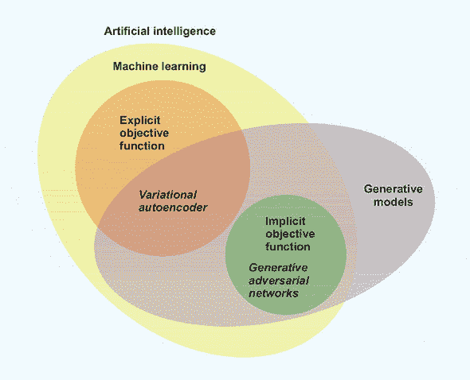

### 2.4\. 自动编码器由什么组成？

当我们观察自动编码器的结构时，我们将使用图像作为例子，但这种结构也适用于其他情况（例如，语言，如我们关于给祖父母写信的例子）。像机器学习中的许多进步一样，自动编码器的高级思想是直观的，并遵循以下简单步骤，如图 2.2 所示：

1.  编码网络：我们取一个表示 *x*（例如，一个图像），然后使用学习到的编码器（通常是一个单层或多层神经网络）将维度从 *y* 减少到 *z*。

    ##### 图 2.2\. 在我们的信件例子中使用自动编码器遵循以下步骤：（1）压缩你关于机器学习工程师的所有知识，然后（2）将其组合到潜在空间（给祖母的信）。当她，使用她对单词的理解作为解码器（3），重建一个（有损）版本的意义时，你得到一个在相同空间（在你祖母的头脑中）的原输入表示，即你的思想。

    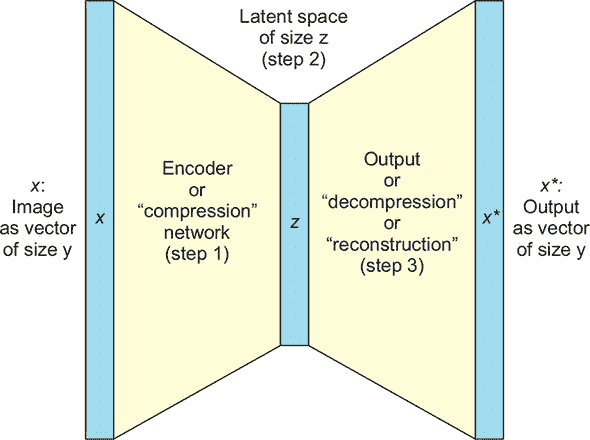

1.  潜在空间 (*z*): 随着我们的训练，我们试图建立具有某些意义的潜在空间。潜在空间通常是较小维度的表示，并作为中间步骤。在我们的数据表示中，自动编码器试图“组织其思想”。

1.  解码网络：我们使用解码器将原始对象重建到原始维度。这通常是通过一个与编码器镜像的神经网络来完成的。这是从 *z* 到 *x** 的步骤。我们应用编码过程的逆过程，例如，从潜在空间的 256 像素值长向量中获取一个 784 像素值长的重建向量（一个 28 × 28 图像）。

这里有一个自动编码器训练的例子：

1.  我们将图像 *x* 输入到自动编码器中。

1.  我们得到 *x**，图像的重建。

1.  我们测量重建损失——即 *x* 和 *x** 之间的差异。

    +   这是通过计算 *x* 和 *x** 像素之间的距离（例如，平均绝对误差）来完成的。

    +   这为我们提供了一个显式的目标函数（|| *x* –*x** ||），我们可以通过梯度下降的一种版本来优化它。

因此，我们正在尝试找到编码器和解码器的参数，这些参数将最小化我们通过使用梯度下降更新的重建损失。

就这样！我们完成了。现在你可能想知道这有什么用或为什么重要。你会感到惊讶！

### 2.5\. 自动编码器的使用

尽管它们很简单，但有许多原因需要关注自动编码器：

+   首先，我们免费获得压缩！这是因为 图 2.2 中的中间步骤（2）变成了一个在潜在空间维度上智能减少的图像或对象。请注意，在理论上，这可以比原始输入小几个数量级。这显然不是无损的，但我们有权使用这个副作用，如果我们愿意的话。

+   仍然使用潜在空间，我们可以想到许多实际应用，例如一个 *单类分类器*（一个异常检测算法），其中我们可以看到在减少的、更易于搜索的潜在空间中的项目，以检查与目标类的相似性。这可以在搜索（信息检索）或异常检测设置（在潜在空间中比较接近度）中工作。

+   另一个用例是数据去噪或黑白图像的着色.^([3]) 例如，如果我们有一张旧照片或视频，或者非常嘈杂的——比如说，二战图像——我们可以使它们变得更少噪音，并重新添加颜色。因此，这与 GANs 的相似性，GANs 也擅长这些类型的应用。

    > ³
    > 
    > 关于着色黑白图像的更多信息，请参阅 Emil Wallner 的“着色灰度图像”，GitHub 上有 ([`mng.bz/6jWy`](http://mng.bz/6jWy))。

+   一些 GAN 架构——例如 BEGAN^([4])——使用自动编码器作为其架构的一部分，以帮助它们稳定训练，这在后面你会发现是至关重要的。

    > ⁴
    > 
    > BEGAN 是边界均衡生成对抗网络（Boundary Equilibrium Generative Adversarial Networks）的缩写。这个有趣的 GAN 架构是第一个将自动编码器作为设置一部分使用的。

+   这些自动编码器的训练不需要标记数据。我们将在下一节中了解到这一点以及为什么无监督学习如此重要。这使得我们的生活变得更加容易，因为这只是自我训练，不需要我们寻找标签。

+   最后，但绝对不是最不重要的，我们可以使用自动编码器来生成新的图像。自动编码器已经应用于从数字到面孔到卧室的任何东西，但通常图像的分辨率越高，性能越差，因为输出往往看起来模糊。但对于 MNIST 数据集——正如你稍后会发现的那样——和其他低分辨率图像，自动编码器工作得很好；你很快就会看到代码的样子！


##### 定义

*修改后的国家标准与技术研究院（MNIST）*数据库是一组手写数字数据集。维基百科对这个在计算机视觉文献中极其流行的数据集有很好的概述。


所以所有这些事情都可以做到，仅仅因为我们找到了我们已有数据的新表示形式。这种表示形式很有用，因为它揭示了核心信息，这些信息是原生压缩的，但基于潜在表示来操作或生成新数据也更加容易！

### 2.6\. 无监督学习

在上一章中，我们已经讨论了无监督学习，但没有使用这个术语。在本节中，我们将更深入地探讨。


##### 定义

*无监督学习*是一种机器学习方法，我们从中学习数据本身，而不需要额外的标签来解释这些数据的意义。例如，聚类是无监督的——因为我们只是试图发现数据的潜在结构；但异常检测通常是监督的，因为我们需要人类标记的异常。


在本章中，你将了解为什么无监督机器学习是不同的：我们可以使用任何数据，而无需为特定目的对其进行标记。我们可以随意加入来自互联网的所有图像，而无需注释每个样本的目的，对于我们可能关心的每种表示。例如：这张图片里有没有狗？有没有车？

相反，在监督学习中，如果你没有该特定任务的标签，(几乎)所有的标签都可能无法使用。如果你试图制作一个能够从谷歌街景中分类汽车的分类器，但你没有这些图像的动物标签，使用同一数据集训练一个能够用同一数据集分类动物的分类器基本上是不可能的。即使动物经常出现在这些样本中，你也需要回去要求你的标记者重新标记谷歌街景数据集中的动物。

从本质上讲，在我们知道用例之前，我们需要考虑数据的应用，这是困难的！但对于许多压缩类型任务，你总是有标记数据：你的数据。一些研究人员，如弗朗索瓦·肖莱特（Google 的研究科学家和 Keras 的作者），将这种类型的机器学习称为*自监督*。在这本书的大部分内容中，我们唯一的标签将是示例本身或数据集中的任何其他示例。

由于我们的训练数据也充当我们的标签，从这一关键角度来看，训练许多这些算法变得容易得多：我们现在有更多的数据可以工作，而且我们不需要等待数周并支付数百万美元来获取足够的标记数据。

#### 2.6.1\. 对旧想法的新看法

自编码器本身是一个相当古老的想法——至少当你从机器学习作为一个领域的角度来看它的年龄时。但是鉴于今天每个人都在研究“某种”深度学习，人们成功地将深度学习应用于编码器和解码器的一部分，这应该不会让任何人感到惊讶。

自编码器由两个神经网络组成：一个编码器和一个解码器。在我们的例子中，两者都有激活函数，^([5])，我们将为每个网络使用一个中间层。这意味着每个网络中有两个权重矩阵——一个从输入到中间层，然后一个从中间层到潜在层。然后，我们还有一个从潜在层到不同的中间层，然后一个从中间层到输出层。如果我们每个网络只有一个权重矩阵，我们的过程将类似于一个已建立的统计分析技术，称为“主成分分析（PCA）”。如果你有线性代数的背景，你应该对这一领域有广泛的了解。

> ⁵
> 
> 我们在将任何来自早期层计算的输出通过一个*激活函数*传递到下一个层之前，将其传递给下一个层。人们经常选择一个整流线性单元（ReLU）——定义为*max(0, x)*。我们不会深入探讨激活函数，因为它们本身就可以是一个长篇博客文章的主题。

| |
| --- |

##### 注意

在学习解决方案的方式上存在一些技术差异——例如，PCA 是数值确定的，而自编码器通常使用随机优化器进行训练。解决方案的最终形式也存在差异。但我们不会给你上一堂关于其中一个如何给出正交基以及它们如何本质上仍然覆盖相同的向量空间的长篇大论——尽管如果你碰巧知道这意味着什么，那么恭喜你。

| |
| --- |

#### 2.6.2\. 使用自编码器进行生成

在本章的开头，我们提到自编码器可以用来生成数据。一些真正热衷于此的人可能已经在思考潜在空间的使用以及它是否可以被重新用于其他目的……这完全可能！（如果你答对了，你可以给自己一个官方的、认可的自我点赞！）

但你可能不会买这本书来让自己看起来很傻，所以我们直接进入正题。如果我们回到你祖父母的例子，并使用一个稍微不同的视角，使用自编码器作为生成模型可能开始变得有意义。例如，想象一下你对“工作”这个概念的理解成为解码网络的输入。将“工作”这个词写在纸上的想法视为潜在空间输入，而你祖父母头脑中的工作概念作为输出。

在这种情况下，我们看到潜在空间编码（一个书面词，结合你祖父母阅读和理解概念的能力）变成了一种在他们的脑海中生成想法的生成模型。书面字母充当灵感或某种潜在向量，而输出——想法——与原始输入处于相同的高维空间。你祖父母的想法和你的一样复杂——尽管略有不同。

现在，让我们回到图像领域。我们在一组图像上训练我们的自动编码器。因此，我们调整编码器和解码器的参数，以找到两个网络适当的参数。我们还对例子在潜在空间中的表示方式有了感觉。对于生成，我们切断编码器部分，只使用潜在空间和解码器。图 2.3 显示了生成过程的示意图。

##### 图 2.3. 因为我们知道从训练中我们的例子在潜在空间中的位置，我们可以轻松地生成与模型所见相似的例子。即使不是，我们也可以轻松地在潜在空间中进行迭代或网格搜索，以确定我们的模型可以生成的表示类型。

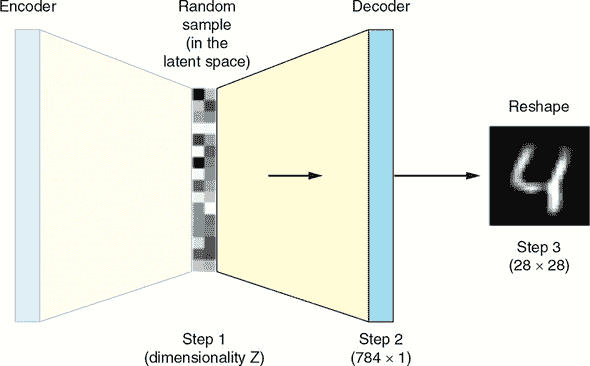

（图片改编自 GitHub 上 Mat Leonard 的简单自动编码器项目，[`mng.bz/oNXM`](http://mng.bz/oNXM)。）

#### 2.6.3. 变分自动编码器

你可能想知道：变分自动编码器和“常规”自动编码器之间的区别是什么？这所有的一切都与神奇的潜在空间有关。在变分自动编码器的情况下，我们选择将潜在空间表示为一个具有学习到的均值和标准差的分布，而不是仅仅是一组数字。通常，我们选择多元高斯分布，但具体是什么或者为什么我们选择这种分布而不是其他分布现在并不重要。如果你想回顾一下这可能是什么样子，请查看图 2.5。

如此一来，那些更倾向于统计学的你们可能已经意识到，变分自动编码器是一种基于贝叶斯机器学习的技术。在实践中，这意味着我们必须学习分布，这增加了进一步的约束。换句话说，频率派自动编码器会试图将潜在空间学习为一个数字数组，但贝叶斯——例如，变分——自动编码器会试图找到定义分布的正确参数。

我们随后从潜在分布中进行采样并得到一些数字。我们将这些数字通过解码器。我们得到一个看起来像是原始数据集中的一些东西的例子，但它是由模型新创建的。哇塞！

### 2.7. 代码即生命

在本书中，我们使用了一个流行的、深度学习的高级 API，称为*Keras*。我们强烈建议你熟悉它。如果你还不熟悉它，网上有大量的免费资源，包括像 Towards Data Science ([`towardsdatascience.com`](http://towardsdatascience.com))这样的平台，我们经常在上面贡献。如果你想从书籍中了解更多关于 Keras 的信息，存在一些很好的资源，包括另一本优秀的 Manning 书籍，由 Keras 的作者和创建者 François Chollet 所著的*用 Python 进行深度学习*。

Keras 是几个深度学习框架（TensorFlow、Microsoft Cognitive Toolkit (CNTK)和 Theano）的高级 API。它易于使用，并允许你在更高的抽象级别上工作，因此你可以专注于概念，而不是记录每个标准的乘法、偏差、激活和池化^([6])或过多地担心变量作用域。

> ⁶
> 
> *池化块*是对一层进行的操作，允许我们将多个输入合并为更少的输入——例如，有一个包含四个数字的矩阵，并得到一个最大值作为单个数字。这是计算机视觉中常用的操作，用于降低复杂性。

为了展示 Keras 的真实力量以及它是如何简化编写神经网络的过程，我们将查看其最简单的变分自动编码器示例^([7])。在本教程中，我们使用 Keras 的*功能性 API*，以更面向函数的方法编写深度学习代码，但在后续教程中，我们将展示序列 API（另一种方法），因为事情变得更加复杂。

> ⁷
> 
> 作者为了简化，对示例进行了高度修改，来自[`mng.bz/nQ4K`](http://mng.bz/nQ4K)。

本练习的目的是根据潜在空间生成手写数字。我们将创建一个对象，`generator`或`decoder`，它可以使用`predict()`方法根据输入种子生成新的手写数字示例，其中输入种子只是潜在空间向量。当然，我们必须使用 MNIST，因为我们不希望任何人产生其他数据集可能存在的想法；参见图 2.4。

##### 图 2.4。计算机视觉研究人员是如何思考的。无需多言。

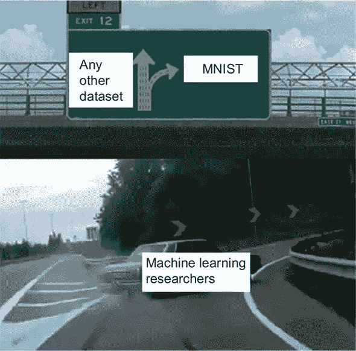

（来源：Facebook 上的人工智能青少年的人工智能迷因，[`mng.bz/vNjM`](http://mng.bz/vNjM)。）

在我们的代码中，我们首先必须导入所有依赖项，如下所示列表。为了参考，此代码已与 Keras 的最新版本 2.2.4 和 TensorFlow 的最新版本 1.12.0 进行了检查。

##### 列表 2.1。标准导入

```
from keras.layers import Input, Dense, Lambda
from keras.models import Model
from keras import backend as K
from keras import objectives
from keras.datasets import mnist
import numpy as np
```

下一步是设置全局变量和超参数，如代码清单 2.2 所示。它们都应该很熟悉：原始维度是 28 × 28，这是标准尺寸。然后我们将 MNIST 数据集中的图像展平，得到一个 784 维（28 × 28）的向量。我们还将有一个单一的中间层，例如 256 个节点。但请尝试其他尺寸；这就是为什么它是超参数的原因！

##### 代码清单 2.2\. 设置超参数

```
batch_size = 100
original_dim = 28*28          ***1***
latent_dim = 2
intermediate_dim = 256
nb_epoch = 5                  ***2***
epsilon_std = 1.0
```

+   ***1* MNIST 图像的高度 × 宽度**

+   ***2* 训练的轮数**

在代码清单 2.3 中，我们开始构建编码器。为了实现这一点，我们使用 Keras 的功能 API。


##### 注意

*功能性 API*使用 Python 中的 lambda 函数来返回另一个函数的构造函数，该函数接受另一个输入，产生最终结果。


简而言之，我们将简单地声明每一层，在常规参数之后提到前一个输入作为*第二个参数组*。例如，层`h`以`x`作为输入。最后，当我们编译模型并指出它开始的位置（*x*）和结束的位置（`z_mean`, `z_log_var`和`z`）时，Keras 将理解起始输入和最终输出列表是如何联系在一起的。记住从图中，`z`是我们的潜在空间，在这种情况下，它是由均值和方差定义的正态分布。现在让我们定义编码器。[⁸

> ⁸
> 
> 这个想法是从我们书论坛中的 Branko Blagojevic 那里得到的灵感。感谢这个建议。

##### 代码清单 2.3\. 创建编码器

```
x = Input(shape=(original_dim,), name="input")                          ***1***
h = Dense(intermediate_dim, activation='relu', name="encoding")(x)      ***2***
z_mean = Dense(latent_dim, name="mean")(h)                              ***3***
z_log_var = Dense(latent_dim, name="log-variance")(h)                   ***4***
z = Lambda(sampling, output_shape=(latent_dim,))([z_mean, z_log_var])   ***5***
encoder = Model(x, [z_mean, z_log_var, z], name="encoder")              ***6***
```

+   ***1* 编码器的输入**

+   ***2* 中间层**

+   ***3* 定义潜在空间的均值**

+   ***4* 定义潜在空间的对数方差**

+   ***5* 注意，在 TensorFlow 后端中，output_shape 不是必需的。**

+   ***6* 将编码器定义为 Keras 模型**

现在是有点棘手的部分，我们从潜在空间中进行采样，然后将这些信息传递到解码器。但稍微思考一下`z_mean`和`z_log_var`是如何连接的：它们都通过一个有两个节点的密集层连接到`h`，这是正态分布的定义特征：均值和方差。前面的采样函数实现如下所示。

##### 代码清单 2.4\. 创建采样辅助函数

```
def sampling(args):
    z_mean, z_log_var = args
    epsilon = K.random_normal(shape=(batch_size, latent_dim), mean=0.)
    return z_mean + K.exp(z_log_var / 2) * epsilon
```

换句话说，我们学习均值（μ）和方差（`μ`）。这种整体实现，其中我们有一个（`ω`）通过采样函数以及`z_mean`和`z_log_var`连接，使我们能够既进行训练，又能够高效地采样以在最后得到一些看起来很漂亮的图像。在生成过程中，我们根据这些学习到的参数从这个分布中进行采样，然后将这些值通过解码器传递以获得输出，正如你将在后面的图中看到的那样。对于那些对分布——或者在这个案例中是概率密度函数——有点生疏的人，我们在图 2.5 中包含了几个单峰二维高斯分布的例子。

##### 图 2.5。为了提醒大家什么是多元（2D）分布的样子，我们绘制了二元（2D）高斯分布的概率密度函数。它们是不相关的 2D 正态分布，只是方差不同。（a）的方差为 0.5，（b）为 1，（c）为 2。（d）、（e）和（f）分别与（a）、（b）和（c）完全相同的分布，但以 0.7 为 z 轴限制进行绘制。直观上，这只是一个对于每个点说明其发生的可能性的函数。所以（a）和（d）更加集中，而（c）和（f）则使得远离原点（0,0）的值出现成为可能，但每个给定值出现的可能性并不高。

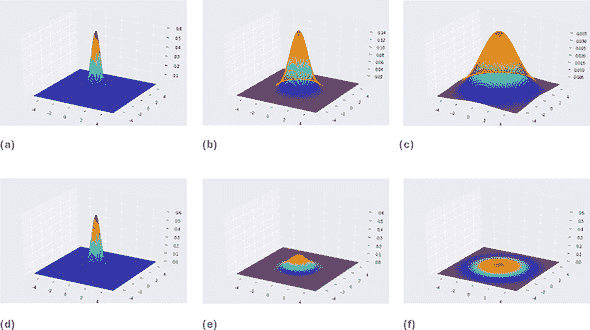

现在你已经了解了定义我们的潜在空间以及这些分布的样子，我们将编写解码器。在这种情况下，我们首先将层作为变量编写，这样我们可以在生成时重用它们。

##### 列表 2.5。编写解码器

```
input_decoder = Input(shape=(latent_dim,), name="decoder_input")   ***1***
decoder_h = Dense(intermediate_dim, activation='relu',             ***2***
name="decoder_h")(input_decoder)
x_decoded = Dense(original_dim, activation='sigmoid',
name="flat_decoded")(decoder_h)                                    ***3***
decoder = Model(input_decoder, x_decoded, name="decoder")          ***4***
```

+   ***1* 解码器的输入**

+   ***2* 将潜在空间转换为中间维度**

+   ***3* 从原始维度获取均值**

+   ***4* 将解码器定义为 Keras 模型**

我们现在可以将编码器和解码器组合成一个单一的 VAE 模型。

##### 列表 2.6。组合模型

```
output_combined = decoder(encoder(x)[2])      ***1***
vae = Model(x, output_combined)               ***2***
vae.summary()                                 ***3***
```

+   ***1* 获取输出。回想一下，我们需要获取第三个元素，我们的采样 z。**

+   ***2* 连接输入和整体输出**

+   ***3* 打印出整体模型的样子**

接下来，我们进入机器学习的更熟悉的部分：定义损失函数，以便我们的自动编码器可以训练。

##### 列表 2.7。定义我们的损失函数

```
def vae_loss(x, x_decoded_mean, z_log_var, z_mean,
    original_dim=original_dim):
    xent_loss = original_dim * objectives.binary_crossentropy(
        x, x_decoded_mean)
    kl_loss = - 0.5 * K.sum(
        1 + z_log_var - K.square(z_mean) - K.exp(z_log_var),
        axis=-1)
    return xent_loss + kl_loss

vae.compile(optimizer='rmsprop', loss=vae_loss)     ***1***
```

+   ***1* 最后编译我们的模型**

在这里，你可以看到使用二元交叉熵和 KL 散度相加形成整体损失的地方。*KL 散度*衡量分布之间的差异；想象一下图 2.5 中的两个团块，然后测量重叠的体积。二元交叉熵是两分类中常见的损失函数之一：在这里，我们简单地比较`x`的每个灰度像素值与`x_decoded_mean`中的值，这就是我们之前提到的重建。如果你在以下定义之后仍然对这个段落感到困惑，第五章提供了关于测量分布之间差异的更多细节。

| |
| --- |

##### 定义

对于那些对细节感兴趣且熟悉信息理论的人来说，*库尔巴克-莱布勒散度（KL 散度）*，也称为*相对熵*，是两个分布的交叉熵与它们自身的熵之间的差异。对于其他人来说，想象画出这两个分布，它们不重叠的部分将是一个与 KL 散度成比例的区域。

| |
| --- |

然后我们定义模型从`x`开始，到`x_decoded_mean`结束。模型使用 RMSprop 编译，但我们可以使用 Adam 或普通的随机梯度下降（SGD）。与任何深度学习系统一样，我们使用反向传播的错误来导航参数空间。我们始终使用某种类型的梯度下降，但通常人们很少尝试除了这里提到的三种以外的其他方法：Adam、SGD 或 RMSprop。

| |
| --- |

##### 定义

*随机梯度下降（SGD）*是一种优化技术，它允许我们通过确定任何给定权重对错误的贡献并更新此权重（如果预测 100%正确则不更新）来训练复杂模型。我们建议在例如《Python 深度学习》中复习这一内容。

| |
| --- |

我们通过使用标准的训练-测试分割和输入归一化程序来训练模型。

##### 列表 2.8\. 创建训练/测试分割

```
(x_train, y_train), (x_test, y_test) = mnist.load_data()

x_train = x_train.astype('float32') / 255.
x_test = x_test.astype('float32') / 255.
x_train = x_train.reshape((len(x_train), np.prod(x_train.shape[1:])))
x_test = x_test.reshape((len(x_test), np.prod(x_test.shape[1:])))
```

我们对数据进行归一化，并将训练集和测试集重塑为每个示例一个 784 位长的数组，而不是一个 28×28 的矩阵。

然后我们应用`fit`函数，通过打乱数据来获取一个真实的（非有序）数据集。我们还在训练过程中使用验证数据来监控进度：

```
vae.fit(x_train, x_train,
        shuffle=True,
        nb_epoch=nb_epoch,
        batch_size=batch_size,
        validation_data=(x_test, x_test),verbose=1)
```

我们完成了！

代码的完整版本提供了一个有趣的潜在空间可视化；然而，为了查看它，请查看附带的 Jupyter/Google Colaboratory 笔记本。现在我们可以放松，观看那些漂亮的进度条。完成后，我们甚至可以查看潜在空间在二维平面上的值，如图图 2.6 所示。

##### 图 2.6\. 将测试集中的所有点及其类别投影到潜在空间中的二维投影。在这个图中，我们将二维潜在空间显示在图上。然后我们绘制这些生成示例的类别，并按照右侧图例中的颜色进行着色。在这里，我们可以看到类别往往整齐地分组在一起，这告诉我们这是一个好的表示。本书的 GitHub 仓库中有彩色版本。 

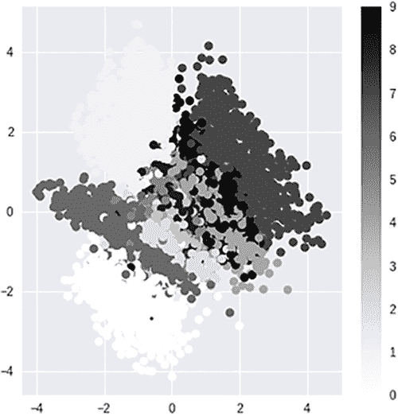

我们还可以计算潜在空间网格上固定增量处的值，以查看生成的输出。例如，从 0.05 到 0.95，在两个维度上以 0.15 的线性增量进行，我们得到了图 2.7 中的可视化。记住，在这种情况下，我们使用的是双变量高斯分布，给我们两个轴来迭代。再次提醒，对于这个可视化的代码，请查看完整的 Jupyter/Google Colab 笔记本。

##### 图 2.7\. 我们在网格上绘制潜在空间子集的值，并将每个潜在空间值通过生成器传递以生成此图。这让我们对随着 z 的变化，最终图片的变化程度有一个感觉。

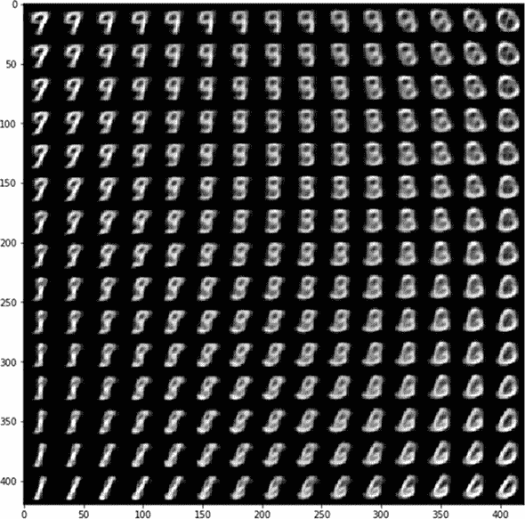

### 2.8\. 为什么我们尝试了 aGAN？

看起来这本书几乎可以在这里结束。毕竟，我们已经成功地生成了 MNIST 的图像，这将成为我们几个示例的测试案例。所以在你放弃之前，让我们解释一下接下来章节的动机。

为了理解挑战，想象我们有一个简单的一维双峰分布——如图 2.8 所示。（就像之前一样，把它想象成一个简单的数学函数，它在 0 和 1 之间有界，代表任何给定点的概率。函数的值越高，我们在该确切点之前采样的点就越多。）

##### 图 2.8. 最大似然估计、点估计和真实分布。灰色（理论）分布是双峰的，而不是单峰。但由于我们假设了这一点，我们的模型是灾难性的错误。或者，我们可能会遇到模式坍塌，这在第五章中值得记住。第五章。这在我们使用 KL 散度的变体，如 VAE 或早期 GANs 时尤其如此。

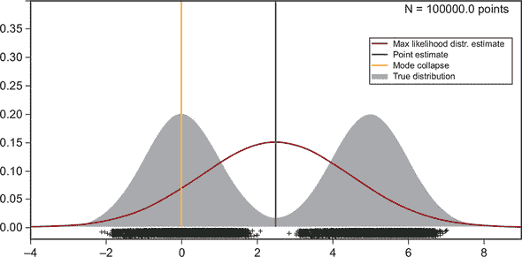

假设我们从这个真实分布中抽取了一组样本，但我们不知道底层模型。我们现在试图推断生成这些样本的分布，但出于某种原因，我们假设真实分布是一个简单的高斯分布，我们只需要估计均值和方差。但由于我们没有正确指定模型（在这种情况下，我们对样本的模态做出了错误的假设），我们陷入了麻烦。例如，如果我们应用一种传统的统计技术，称为*最大似然估计*来估计这个分布为单峰——在某种程度上，这就是 VAE 试图做的——我们会得到错误的估计。因为我们没有正确指定模型，^([9])它将估计围绕两个分布平均值的正态分布——称为*点估计*。最大似然估计是一种不知道也无法弄清楚存在两个不同分布的技术。因此，为了最小化误差，它围绕点估计创建了一个“胖尾”正态分布。在这里，这似乎很微不足道，但请始终记住，我们正在尝试在非常高的维空间中指定模型，这并不容易！

> ⁹
> 
> 参见 Christopher Bishop 的《模式识别与机器学习》（Springer，2011 年）。

| |
| --- |

##### 定义

*双峰*意味着有两个峰值或模态。这个概念将在第五章中很有用。在这种情况下，我们将整体分布由两个均值为 0 和 5 的正态分布组成。

| |
| --- |

有趣的是，点估计也可能出错，甚至可能位于一个没有任何实际数据样本的真实分布区域。当你查看样本（黑色交叉点）时，我们估计均值的地方并没有出现任何真实样本。这再次是非常令人不安的。为了将其与自编码器联系起来，看看在图 2.6 中我们是如何在以原点为中心的潜在空间中学习 2D 正态分布的？但如果我们把名人脸的图像扔进训练数据中呢？我们就不再有一个容易估计的中心了，因为两个数据分布的峰态比我们想象的要多。因此，即使在分布的中心附近，VAE 也可能产生两个数据集的奇怪混合体，因为 VAE 会试图以某种方式分离这两个数据集。

到目前为止，我们只讨论了统计错误假设的影响。为了将这一方面完全与自编码器生成的图像联系起来，我们应该考虑我们的高斯潜在空间*z*允许我们做什么。VAE 使用高斯作为构建它所看到的数据表示的方式。但由于高斯有 99.7%的概率质量在中间三个标准差内，VAE 也会选择安全的中庸之道。因为 VAEs 在某种程度上试图直接基于高斯提出底层模型，但现实可能相当复杂，VAEs 的扩展性不如 GANs，GANs 可以捕捉“场景”。

你可以在图 2.9 中看到当你的 VAE 选择“安全的中庸之道”时会发生什么。在 CelebA 数据集上，该数据集具有对齐和裁剪的名人脸特征，VAE 很好地模拟了持续存在的面部特征，如眼睛或嘴巴，但在背景上犯错误。

##### 图 2.9。在这些由 VAE 生成的假名人脸图像中，边缘相当模糊，并融入背景中。这是因为 CelebA 数据集具有围绕眼睛和嘴巴周围特征一致的中心和校准图像，但背景往往变化。VAE 选择了安全的路径，通过选择一个“安全”的像素值来使背景模糊，这最小化了损失，但并没有提供好的图像。

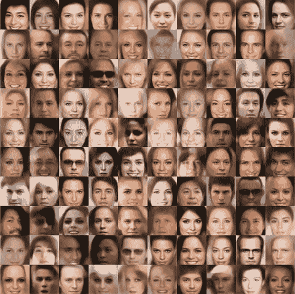

（来源：Zhenliang He 的 VAE-TensorFlow，GitHub，[`github.com/LynnHo/VAE-Tensorflow`](https://github.com/LynnHo/VAE-Tensorflow)）

另一方面，GANs 对真实数据分布有一个隐含且难以分析的理解。正如你将在第五章中发现的那样，VAEs 生活在直接估计的最大似然模型家族中。

这一部分希望让你对思考目标数据的分布以及这些分布性影响如何在我们的训练过程中体现自己感到舒适。我们将在第十章（../Text/kindle_split_021.xhtml#ch10）中更深入地探讨这些假设，在那里模型假设如何填充分布，而这成为了一个对抗性示例能够利用来使我们的机器学习模型失败的问题。

### 摘要

+   在高层次上，自动编码器由编码器、潜在空间和解码器组成。自动编码器通过使用一个常见的目标函数来训练，该函数衡量重生产的数据与原始数据之间的距离。

+   自动编码器有许多应用，也可以用作生成模型。在实践中，这通常不是它们的主要用途，因为其他方法，尤其是 GANs，在生成任务上表现得更好。

+   我们可以使用 Keras（TensorFlow 的高级 API）编写一个简单的变分自动编码器，它可以生成手写数字。

+   VAEs 有一些局限性，这促使我们转向 GANs。

## 第三章。你的第一个 GAN：生成手写数字

*本章涵盖*

+   探索 GANs 和对抗性训练背后的理论

+   理解 GANs 与常规神经网络的不同

+   在 Keras 中实现 GAN，并训练它生成手写数字

在本章中，我们探讨了 GANs 背后的基础理论。我们介绍了如果你选择深入研究这个领域，可能会遇到的常用数学符号，这可能通过阅读更理论化的出版物或甚至许多关于这个主题的学术论文来实现。本章还为更高级的章节提供了背景知识，特别是第五章。

从严格实用的角度来看，然而，你不必担心许多这些形式化——就像你不需要知道内燃机的工作原理就能开车一样。像 Keras 和 TensorFlow 这样的机器学习库将底层数学抽象化，并将它们巧妙地打包成可导入的代码行。

这将是贯穿整本书的一个反复出现的主题；这对于机器学习和深度学习来说也是正确的。所以，如果你是那种喜欢直接进入实践的人，你可以自由地浏览理论部分，然后跳到编码教程。

### 3.1. GANs 的基础：对抗性训练

形式上，生成器和判别器由不同的可微函数表示，例如神经网络，每个都有自己的成本函数。这两个网络通过使用判别器的损失进行反向传播来训练。判别器努力最小化真实和虚假示例的损失，而生成器则试图最大化它产生的虚假示例的判别器损失。

这种动态在图 3.1 中得到了总结。这是第一章中图表的更通用版本，在那里我们首先解释了 GAN 是什么以及它们是如何工作的。在这个图表中，我们没有使用手写数字的具体示例，而是一个通用的训练数据集，在理论上可以是任何东西。

##### 图 3.1。在这个 GAN 架构图中，生成器和判别器都使用判别器的损失进行训练。判别器力求最小化损失；生成器寻求最大化它产生的假例的损失。

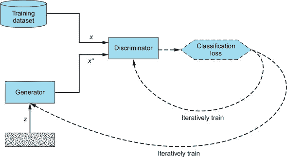

重要的是，训练数据集决定了生成器将学习模仿的示例类型。例如，如果我们目标是生成看起来逼真的猫的图像，我们会向我们的 GAN 提供一个猫的图像数据集。

在更技术性的术语中，生成器的目标是生成能够捕捉训练数据集数据分布的示例。^([1]) 请记住，对计算机来说，图像只是一个值矩阵：灰度图像是二维的，RGB 图像是三维的。当在屏幕上渲染时，这些矩阵内的像素值表现出图像的所有视觉元素——线条、边缘、轮廓等等。这些值在数据集中的每个图像中遵循复杂的分布；毕竟，如果没有遵循分布，图像将不会比随机噪声更多。物体识别模型学习图像中的模式以辨别图像的内容。生成器可以被视为这一过程的逆过程：它不是识别这些模式，而是学习合成它们。

> ¹
> 
> 请参阅 Ian J. Goodfellow 等人撰写的《生成对抗网络》，2014 年，[`arxiv.org/abs/1406.2661`](https://arxiv.org/abs/1406.2661)。

#### 3.1.1\. 成本函数

按照标准符号，用 *J*^((*G*)) 表示生成器的成本函数，用 *J*^((*D*)) 表示判别器的成本函数。两个网络的训练参数（权重和偏置）由希腊字母 theta 表示：*θ*^((*G*)) 用于生成器，*θ*^((*D*)) 用于判别器。

GAN 与传统的神经网络在两个关键方面有所不同。首先，传统神经网络的成本函数 *J* 仅以它自己的可训练参数 *θ* 为定义。数学上，这表示为 *J*(*θ*)。相比之下，GAN 由两个网络组成，其成本函数依赖于两个网络的所有参数。也就是说，生成器的成本函数是 *J*^((*G*))(*θ*^((*G*)), *θ*^((*D*)))，判别器的成本函数是 *J*^((*D*))(*θ*^((*G*)), *θ*^((*D*)))。^([2])

> ²
> 
> 请参阅 Ian Goodfellow 撰写的《NIPS 2016 教程：生成对抗网络》，2016 年，[`arxiv.org/abs/1701.00160`](https://arxiv.org/abs/1701.00160)。

第二个（相关）的区别是，传统的神经网络可以在训练过程中调整其所有参数，即 *θ*。在 GAN 中，每个网络只能调整自己的权重和偏差。生成器只能调整 *θ*^((*G*))，判别器只能调整 *θ*^((*D*))。因此，每个网络只控制决定其损失的部分。

为了使这个问题更加具体，考虑以下类比。想象一下，我们正在选择从工作中回家的路线。如果没有交通，最快的选项是高速公路。然而，在高峰时段，我们可能更倾向于选择一条侧路。尽管这些路更长、更曲折，但在高速公路交通拥堵时，它们可能更快地带我们回家。

让我们把这个问题表述为一个数学问题。设 *J* 为我们的成本函数，定义为我们回家所需的时间。我们的目标是使 *J* 最小化。为了简化，我们假设我们有一个固定的时间离开办公室，因此我们无法提前离开以避开高峰时段，或者延迟离开以避免高峰时段。我们唯一可以改变的是我们的路线，即 *θ*。

如果我们路上只有一辆车，我们的成本将与常规神经网络类似：它将仅取决于路线，并且我们完全有能力对其进行优化，即 *J*(*θ*)。然而，一旦我们将其他司机纳入方程，情况就会变得更加复杂。突然之间，我们回家所需的时间不仅取决于我们的决定，还取决于其他司机的行动，即 *J*(*θ*^((*us*)),*θ*^((*other drivers*)))。就像生成器和判别器网络一样，我们的“成本函数”将取决于一系列因素，其中一些在我们控制之下，而另一些则不在。

#### 3.1.2。训练过程

我们所描述的两个差异对 GAN 训练过程有着深远的影响。传统神经网络的训练是一个优化问题。我们试图通过找到一组参数来最小化成本函数，使得移动到参数空间中的任何相邻点都会增加成本。这可能是参数空间中的局部或全局最小值，这取决于我们试图最小化的成本函数。图 3.2 说明了最小化成本函数的优化过程。

##### 图 3.2。碗状的网格表示参数空间 θ[1] 和 θ[2] 中的损失 J。黑色虚线说明了通过优化在参数空间中损失的最小化过程。

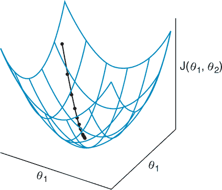

（来源：“对抗机器学习”由 Ian Goodfellow 撰写，ICLR 主题演讲，2019，[www.iangoodfellow.com/slides/2019-05-07.pdf](http://www.iangoodfellow.com/slides/2019-05-07.pdf)。）

由于生成器和判别器只能调整自己的参数而不能调整对方的参数，GAN 训练可以更好地描述为一场游戏，而不是优化。（参考文献 [3]）这个游戏中的玩家是 GAN 包含的两个网络。

> ³
> 
> 同上。

回想一下 第一章，GAN 训练在两个网络达到纳什均衡时结束，这是游戏中一个点，此时任何玩家都不能通过改变策略来改善自己的情况。从数学上来说，这发生在生成器成本 *J*^((*G*))(*θ*^((*G*)), *θ*^((*D*))) 在生成器的可训练参数 *θ*^((*G*)) 上最小化，同时，判别器成本 *J*^((*D*))(*θ*^((*G*)), *θ*^((*D*))) 在该网络控制的参数上最小化。（参考文献 [4]）图 3.3 展示了两人零和游戏的设置以及达到纳什均衡的过程。

> ⁴
> 
> 同上。

##### 图 3.3。玩家 1（左侧）通过调整 θ[1] 来最小化 V。玩家 2（中间）通过调整 θ[2] 来最小化 –V（最大化 V）。鞍形网格（右侧）显示了参数空间 V(θ[1], θ[2]) 中的总损失。虚线显示了收敛到鞍形中心纳什均衡的过程。（来源：Goodfellow，2019，[www.iangoodfellow.com/slides/2019-05-07.pdf](http://www.iangoodfellow.com/slides/2019-05-07.pdf)。）

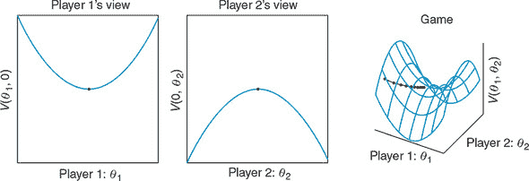

回到我们的类比，当每条回家的路线所需时间完全相同——对我们以及我们可能遇到的任何其他司机来说——纳什均衡就会发生。任何更快的路线都会因为交通量的相应增加而被抵消，从而恰好减慢每个人的速度。正如你可能想象的那样，这种状态在现实生活中几乎无法实现。即使有像 Google Maps 这样的工具提供实时交通更新，也往往无法完美地评估回家的最佳路线。

在训练 GANs 的高维非凸世界中，情况也是如此。即使是 MNIST 数据集中像那样的 28 × 28 像素的灰度图像也有 28 × 28 = 784 维。如果它们是彩色的（RGB），它们的维度将增加三倍，达到 2,352。捕捉训练数据集中所有图像的这种分布极为困难，尤其是在最佳学习方法是从对手（判别器）那里学习的情况下。

成功训练 GAN 需要反复试验，尽管有最佳实践，但它仍然既是一门艺术，也是一门科学。第五章 更详细地回顾了 GAN 收敛性的问题。现在，你可以放心，情况并没有听起来那么糟糕。正如我们在 第一章 中预览的那样，以及你将在本书的其余部分看到的那样，近似生成分布的巨大复杂性以及我们对使 GAN 收敛的条件缺乏完全理解，都没有阻碍 GAN 的实际可用性和生成逼真数据样本的能力。

### 3.2\. 生成器和判别器

让我们通过引入更多符号来回顾你所学的内容。生成器 (*G*) 接收一个随机噪声向量 *z* 并生成一个伪造示例 *x**。从数学上讲，*G*(*z*) = *x**。判别器 (*D*) 被提供真实示例 *x* 或伪造示例 *x**；对于每个输入，它输出一个介于 0 和 1 之间的值，表示输入是真实的概率。图 3.4 使用我们刚刚提出的术语和符号描述了 GAN 架构。

##### 图 3.4\. 生成器网络 G 将随机向量 z 转换为伪造示例 x*：G(z) = x*。判别器网络 D 输出对输入示例是否为真实的分类。对于真实示例 x，判别器努力输出尽可能接近 1 的值。对于伪造示例 x*，判别器努力输出尽可能接近 0 的值。相反，生成器希望 D(x*) 尽可能接近 1，这表明判别器被欺骗，将伪造示例分类为真实。

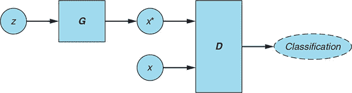

#### 3.2.1\. 冲突目标

判别器的目标是尽可能准确。对于真实示例 *x*，*D*(*x*) 努力使其尽可能接近 1（正类的标签）。对于伪造示例 *x**，*D*(*x**) 努力使其尽可能接近 0（负类的标签）。

生成器的目标是相反的。它通过产生与训练数据集中的真实数据不可区分的伪造示例 *x** 来欺骗判别器。从数学上讲，生成器努力产生伪造示例 *x**，使得 *D*(*x**) 尽可能接近 1。

#### 3.2.2\. 混淆矩阵

判别器的分类可以用混淆矩阵来表示，它是二进制分类中所有可能结果的表格表示。对于判别器，这些如下：

+   *真阳性*—将真实示例正确分类为真实；*D*(*x*) ≈ 1

+   *假阴性*—将真实示例错误地分类为伪造；*D*(*x*) ≈ 0

+   *真阴性*—将伪造示例正确分类为伪造；*D*(*x**) ≈ 0

+   *假阳性*—将伪造示例错误地分类为真实；*D*(*x**) ≈ 1

表 3.1 展示了这些结果。

##### 表 3.1. 判别器结果的混淆矩阵

| 输入 | 判别器输出 |
| --- | --- |
| *接近 1（真实）* | *接近 0（假）* |
| --- | --- |
| ***真实 (x)*** | 真阳性 | 假阴性 |
| ***假 (x*)*** | 假阳性 | 真阴性 |

使用混淆矩阵术语，判别器试图最大化真阳性和真阴性分类，或者等价地，最小化假阳性和假阴性分类。相比之下，生成器的目标是最大化判别器的假阳性分类——这些是生成器成功欺骗判别器相信假例是真实例子的实例。生成器并不关心判别器对真实例子的分类效果如何；它只关心判别器对假数据样本的分类。

### 3.3. GAN 训练算法

让我们回顾一下第一章中介绍的 GAN 训练算法，并使用本章引入的符号对其进行形式化。与第一章中的算法不同，这个算法使用的是小批量而不是逐个例子。


**GAN 训练算法**

*对于*每个训练迭代*执行*

1.  训练判别器：

    1.  取一个随机真实例子的批量：x。

    1.  取一个随机噪声向量 z 的小批量，并生成一个假例的小批量：G(z) = x*。

    1.  计算 D(x)和 D(x*)的分类损失，并将总误差反向传播以更新θ^((D))以最小化分类损失。

1.  训练生成器：

    1.  取一个随机噪声向量 z 的小批量，并生成一个假例的小批量：G(z) = x*。

    1.  计算 D(x*)的分类损失，并将损失反向传播以更新θ^((G))以最大化分类损失。

*结束 for*


注意，在第 1 步中，我们在训练判别器的同时保持生成器的参数不变。同样，在第 2 步中，我们保持判别器的参数固定，同时训练生成器。我们只允许更新正在训练的网络的权重和偏置，是为了将所有变化仅限于网络控制的参数。这确保了每个网络都能获得关于要进行的更新的相关信号，而不会受到其他网络更新的干扰。你几乎可以把它想象成两个玩家轮流进行。

当然，你可以想象一个场景，其中每个玩家只是抵消了对方的进展，因此即使是回合制游戏也不能保证产生有用的结果。（我们是否已经说过 GAN 的训练非常困难？）更多内容请见第五章，其中我们还将讨论提高成功机会的技术。

理论部分就到这里，暂时告一段落。现在让我们将所学应用到实践中，并实现我们的第一个 GAN。

### 3.4. 指南：生成手写数字

在本教程中，我们将实现一个 GAN，该 GAN 学习生成看起来逼真的手写数字。我们将使用 Python 神经网络库 Keras 和 TensorFlow 后端。

##### 图 3.5\. 在训练迭代过程中，生成器学习将随机噪声输入转换为看起来像训练数据成员的图像：手写数字的 MNIST 数据集。同时，判别器学习区分生成器产生的假图像和来自训练数据集的真实图像。


本教程中使用的很大一部分代码——特别是训练循环中使用的样板代码——是从 Keras 中开源的 GAN 实现 GitHub 仓库（*Keras-GAN*）改编的，由 Erik Linder-Norén 创建（[`github.com/eriklindernoren/Keras-GAN`](https://github.com/eriklindernoren/Keras-GAN)）。该仓库还包括几个高级 GAN 变体，其中一些将在本书的后续章节中介绍。我们对代码和网络架构进行了相当大的修订和简化，并重命名了变量，以便它们与本书中使用的符号一致。

一个包含完整实现（包括添加的训练进度可视化）的 Jupyter 笔记本可在本书的网站上找到，网址为[www.manning.com/books/gans-in-action](http://www.manning.com/books/gans-in-action)，以及本书 GitHub 仓库的[`github.com/GANs-in-Action/gans-in-action`](https://github.com/GANs-in-Action/gans-in-action)下的第三章文件夹中。代码已在 Python 3.6.0、Keras 2.1.6 和 TensorFlow 1.8.0 上进行了测试。

#### 3.4.1\. 导入模块和指定模型输入维度

首先，我们导入运行模型所需的所有包和库。注意我们直接从`keras.datasets`导入手写数字的 MNIST 数据集。

##### 列表 3.1\. 导入语句

```
%matplotlib inline

import matplotlib.pyplot as plt
import numpy as np

from keras.datasets import mnist
from keras.layers import Dense, Flatten, Reshape
from keras.layers.advanced_activations import LeakyReLU
from keras.models import Sequential
from keras.optimizers import Adam
```

其次，我们指定模型和数据集的输入维度。MNIST 中的每张图像都是 28 × 28 像素的单通道（因为图像是灰度的）。变量`z_dim`设置噪声向量*z*的大小。

##### 列表 3.2\. 模型输入维度

```
img_rows = 28
img_cols = 28
channels = 1

img_shape = (img_rows, img_cols, channels)    ***1***

z_dim = 100                                   ***2***
```

+   ***1* 输入图像维度**

+   ***2* 噪声向量的大小，用作生成器的输入**

接下来，我们实现生成器和判别器网络。

#### 3.4.2\. 实现生成器

为了简单起见，生成器是一个只有一个隐藏层的神经网络。它以*z*为输入，并生成一个 28 × 28 × 1 的图像。在隐藏层中，我们使用*Leaky ReLU*激活函数。与将任何负输入映射到 0 的常规 ReLU 函数不同，Leaky ReLU 允许一个小的正梯度。这防止了在训练过程中梯度消失，这往往会产生更好的训练结果。

在输出层，我们使用*tanh*激活函数，将输出值缩放到[–1, 1]的范围。使用*tanh*（而不是，比如说，输出值在更典型的 0 到 1 范围内的*sigmoid*）的原因是*tanh*倾向于产生更清晰的图像。

下面的列表实现了生成器。

##### 列表 3.3. 生成器

```
def build_generator(img_shape, z_dim):
    model = Sequential()

    model.add(Dense(128, input_dim=z_dim))              ***1***

    model.add(LeakyReLU(alpha=0.01))                    ***2***

    model.add(Dense(28 * 28 * 1, activation='tanh'))    ***3***

    model.add(Reshape(img_shape))                       ***4***

    return model
```

+   ***1* 全连接层**

+   ***2* Leaky ReLU 激活**

+   ***3* 带有 tanh 激活函数的输出层**

+   ***4* 将生成器输出重塑为图像维度**

#### 3.4.3. 实现判别器

判别器接收一个 28 × 28 × 1 的图像，并输出一个概率，表示输入被认为是真实还是虚假。判别器由一个两层神经网络表示，有 128 个隐藏单元，在隐藏层使用*Leaky ReLU*激活函数。

为了简单起见，我们的判别器网络看起来几乎与生成器相同。这并不一定如此；实际上，在大多数 GAN 实现中，生成器和判别器网络架构在大小和复杂性上都有很大的差异。

注意，与生成器不同，在下面的列表中，我们在判别器的输出层应用了*sigmoid*激活函数。这确保了我们的输出值将在 0 到 1 之间，因此它可以被解释为生成器分配给输入为真实的概率。

##### 列表 3.4. 判别器

```
def build_discriminator(img_shape):

    model = Sequential()

    model.add(Flatten(input_shape=img_shape))      ***1***

    model.add(Dense(128))                          ***2***

    model.add(LeakyReLU(alpha=0.01))               ***3***

    model.add(Dense(1, activation='sigmoid'))      ***4***

    return model
```

+   ***1* 将输入图像展平**

+   ***2* 全连接层**

+   ***3* Leaky ReLU 激活**

+   ***4* 带有 sigmoid 激活函数的输出层**

#### 3.4.4. 构建模型

在列表 3.5 中，我们构建并编译了之前实现的生成器和判别器模型。注意，在用于训练生成器的组合模型中，我们通过将`discriminator.trainable`设置为`False`来固定判别器的参数。此外，请注意，在判别器设置为不可训练的组合模型中，仅用于训练生成器。判别器作为一个独立编译的模型进行训练。（当我们回顾训练循环时，这一点将变得明显。）

我们使用二元交叉熵作为我们在训练期间寻求最小化的损失函数。*二元交叉熵*是计算概率与实际概率之间的差异的度量，对于只有两个可能类别的预测。交叉熵损失越大，我们的预测与真实标签的距离就越远。

为了优化每个网络，我们使用*Adam 优化算法*。这个算法的名字来源于*自适应矩估计*，是一个基于高级梯度下降的优化器。这个算法的内部工作原理超出了本书的范围，但可以简单地说，Adam 由于其通常优越的性能，已经成为大多数 GAN 实现的首选优化器。

##### 列表 3.5. 构建和编译 GAN

```
def build_gan(generator, discriminator):

    model = Sequential()

    model.add(generator)                                    ***1***
    model.add(discriminator)

    return model

discriminator = build_discriminator(img_shape)              ***2***
discriminator.compile(loss='binary_crossentropy',
                      optimizer=Adam(),
                      metrics=['accuracy'])

generator = build_generator(img_shape, z_dim)               ***3***

discriminator.trainable = False                             ***4***

gan = build_gan(generator, discriminator)                   ***5***
gan.compile(loss='binary_crossentropy', optimizer=Adam())
```

+   ***1* 结合生成器 + 判别器模型**

+   ***2* 构建和编译判别器**

+   ***3* 构建生成器**

+   ***4* 在生成器训练期间保持判别器参数不变**

+   ***5* 使用固定的判别器构建和编译 GAN 模型以训练生成器**

#### 3.4.5\. 训练

列表 3.6 中的训练代码实现了 GAN 训练算法。我们获取一个随机的 MNIST 图像小批量作为真实示例，并从随机噪声向量*z*生成一个假图像小批量。然后我们使用这些图像来训练判别器网络，同时保持生成器参数不变。接下来，我们生成一个假图像小批量，并使用这些图像来训练生成器网络，同时保持判别器参数固定。我们重复这个过程，直到每个迭代。

我们使用 one-hot 编码的标签：1 表示真实图像，0 表示假图像。为了生成*z*，我们从标准正态分布（均值为 0，标准差为 1 的钟形曲线）中采样。判别器被训练来将*假*标签分配给假图像，将*真实*标签分配给真实图像。生成器被训练，使得判别器将其产生的假示例分配为*真实*标签。

注意，我们在训练数据集中将真实图像从-1 缩放到 1。正如前一个示例中看到的，生成器在输出层使用*tanh*激活函数，因此假图像将在范围（-1，1）内。因此，我们必须将判别器所有输入的缩放范围调整为相同。

##### 列表 3.6\. GAN 训练循环

```
losses = []
accuracies = []
iteration_checkpoints = []

def train(iterations, batch_size, sample_interval):

    (X_train, _), (_, _) = mnist.load_data()                        ***1***

    X_train = X_train / 127.5 - 1.0                                 ***2***
    X_train = np.expand_dims(X_train, axis=3)

    real = np.ones((batch_size, 1))                                 ***3***

    fake = np.zeros((batch_size, 1))                                ***4***

    for iteration in range(iterations):

        idx = np.random.randint(0, X_train.shape[0], batch_size)    ***5***
        imgs = X_train[idx]

        z = np.random.normal(0, 1, (batch_size, 100))               ***6***
        gen_imgs = generator.predict(z)

        d_loss_real = discriminator.train_on_batch(imgs, real)      ***7***
        d_loss_fake = discriminator.train_on_batch(gen_imgs, fake)
        d_loss, accuracy = 0.5 * np.add(d_loss_real, d_loss_fake)

        z = np.random.normal(0, 1, (batch_size, 100))               ***8***
        gen_imgs = generator.predict(z)

        g_loss = gan.train_on_batch(z, real)                        ***9***

        if (iteration + 1) % sample_interval == 0:

            losses.append((d_loss, g_loss))                         ***10***
            accuracies.append(100.0 * accuracy)
            iteration_checkpoints.append(iteration + 1)

            print("%d [D loss: %f, acc.: %.2f%%] [G loss: %f]" %    ***11***
                  (iteration + 1, d_loss, 100.0 * accuracy, g_loss))

            sample_images(generator)                                ***12***
```

+   ***1* 加载 MNIST 数据集**

+   ***2* 将[0, 255]灰度像素值缩放到[–1, 1]**

+   ***3* 真实图像的标签：全部为 1**

+   ***4* 假图像的标签：全部为 0**

+   ***5* 获取一个随机批量的真实图像**

+   ***6* 生成一批假图像**

+   ***7* 训练判别器**

+   ***8* 生成一批假图像**

+   ***9* 训练生成器**

+   ***10* 保存损失和准确率，以便在训练后绘制**

+   ***11* 输出训练进度**

+   ***12* 输出生成的图像样本**

#### 3.4.6\. 输出样本图像

在生成器训练代码中，你可能注意到对`sample_images()`函数的调用。这个函数在每个`sample_interval`迭代中被调用，并输出一个由生成器在给定迭代中合成的 4 × 4 图像网格。运行我们的模型后，我们将使用这些图像来检查中间和最终输出。

##### 列表 3.7\. 显示生成的图像

```
def sample_images(generator, image_grid_rows=4, image_grid_columns=4):

    z = np.random.normal(0, 1, (image_grid_rows * image_grid_columns, z_dim)) ***1***

    gen_imgs = generator.predict(z)                                           ***2***

    gen_imgs = 0.5 * gen_imgs + 0.5                                           ***3***

    fig, axs = plt.subplots(image_grid_rows,                                  ***4***
                            image_grid_columns,
                            figsize=(4, 4),
                            sharey=True,
                            sharex=True)

    cnt = 0
    for i in range(image_grid_rows):
        for j in range(image_grid_columns):
            axs[i, j].imshow(gen_imgs[cnt, :, :, 0], cmap='gray')             ***5***
            axs[i, j].axis('off')
            cnt += 1
```

+   ***1* 生成随机噪声样本**

+   ***2* 从随机噪声生成图像**

+   ***2* 将图像像素值缩放到[0, 1]**

+   ***4* 设置图像网格**

+   ***5* 输出图像网格**

#### 3.4.7\. 运行模型

这将带我们进入最后一步，如列表 3.8 所示。我们设置训练超参数——迭代次数和批量大小——并训练模型。没有一成不变的方法来确定正确的迭代次数或正确的批量大小；我们通过观察训练进度，通过试错实验来确定它们。

虽然如此，这些数字有一些重要的实际限制：每个小批量必须足够小，以便适合处理内存（人们通常使用的批量大小是 2 的幂：32、64、128、256 和 512）。迭代次数也有实际限制：我们拥有的迭代次数越多，训练过程就越长。对于像 GAN 这样的复杂深度学习模型，这可能会迅速失控，即使有显著的计算能力。

为了确定合适的迭代次数，我们监控训练损失，并将迭代次数设置在损失平台期附近，这表明我们通过进一步训练获得的增量改进很小或没有。（因为这是一个生成模型，过拟合与监督学习算法一样是一个担忧。）

##### 列表 3.8。运行模型

```
iterations = 20000                                ***1***
batch_size = 128
sample_interval = 1000

train(iterations, batch_size, sample_interval)    ***2***
```

+   ***1* 设置超参数**

+   ***2* 训练 GAN 指定次数的迭代**

#### 3.4.8。检查结果

图 3.6 展示了生成器在训练迭代过程中产生的示例图像，从最早到最新。

##### 图 3.6。从看起来只是随机噪声开始，生成器逐渐学会模拟训练数据集的特征：在我们的案例中，是手写数字的图像。

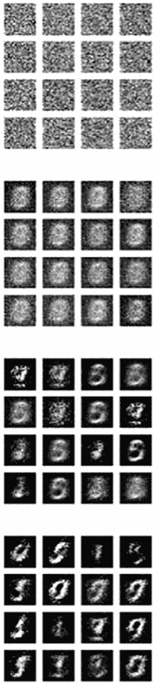

如您所见，生成器最初产生的只是随机噪声。在训练迭代过程中，它逐渐变得越来越好地模拟训练数据的特征。每当判别器拒绝一个生成的图像为假或接受一个图像为真时，生成器都会有所改进。图 3.7 展示了生成器在完全训练后可以合成的图像示例。

##### 图 3.7。尽管远非完美，我们简单的两层生成器学会了生成看起来逼真的数字，例如 9 和 1。

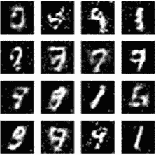

为了比较，图 3.8 显示了从 MNIST 数据集中随机选择的真实图像样本。

##### 图 3.8。用于训练我们的 GAN 的 MNIST 数据集中真实手写数字的示例。尽管生成器在模拟训练数据方面取得了显著的进步，但它产生的数字与真实人类书写的数字之间的差异仍然明显。

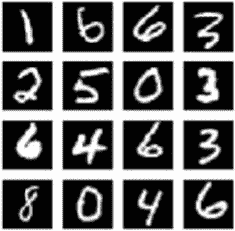

### 3.5。结论

尽管我们 GAN 生成的图像远非完美，但其中许多很容易被识别为真实的数字——这是一个令人印象深刻的成就，考虑到我们只使用了简单的两层网络架构来构建生成器和判别器。在下一章中，您将学习如何通过为生成器和判别器使用更复杂、更强大的神经网络架构来提高生成图像的质量：卷积神经网络。

### 摘要

+   GAN 由两个网络组成：生成器（*G*）和判别器（*D*），每个网络都有自己的损失函数：*J*^((*G*))(*θ*^((*G*)), *θ*^((*D*))) 和 *J*^((*D*))(*θ*^((*G*)), *θ*^((*D*)))，分别。

+   在训练过程中，生成器和判别器只能调整自己的参数：*θ*^((*G*)) 和 *θ*^((*D*))，分别。

+   通过类似游戏的动态同时训练两个 GAN 网络。生成器试图最大化判别器的假阳性分类（将生成的图像分类为真实），而判别器试图最小化其假阳性和假阴性分类。

## 第四章 深度卷积生成对抗网络

*本章涵盖*

+   理解卷积神经网络背后的关键概念

+   使用批归一化

+   实现深度卷积生成对抗网络（Deep Convolutional GAN），一种高级 GAN 架构

在上一章中，我们实现了一个 GAN，其生成器和判别器都是具有单个隐藏层的简单前馈神经网络。尽管这种架构很简单，但经过充分训练后，GAN 的生成器产生的许多手写数字图像都令人信服。即使那些不能被识别为人类书写的数字，也具有许多手写符号的特征，如可辨别的线条边缘和形状——尤其是与用作生成器原始输入的随机噪声相比。

想象一下，如果我们使用更强大的网络架构能取得什么样的成果。在本章中，我们将做到这一点：我们的生成器和判别器都将实现为卷积神经网络（CNNs，或 ConvNets），而不是简单的两层前馈网络。这种 GAN 架构被称为*深度卷积生成对抗网络*，或简称*DCGAN*。

在深入探讨 DCGAN 实现细节之前，我们将回顾构成卷积神经网络（ConvNets）的关键概念，回顾 DCGAN 发现背后的历史，并介绍一个使 DCGAN 等复杂架构在实践上成为可能的关键突破：批归一化。

### 4.1\. 卷积神经网络

我们预计你已经接触过卷积网络；话虽如此，如果这项技术对你来说是新的，请不要担心。在本节中，我们将回顾本章以及本书其余部分所需的所有关键概念。

#### 4.1.1\. 卷积滤波器

与神经元排列在平坦、全连接层的常规前馈神经网络不同，ConvNet 的层排列在三个维度（宽度×高度×深度）中。通过在输入层上滑动一个或多个*滤波器*来执行卷积。每个滤波器具有相对较小的感受野（宽度×高度），但总是延伸到整个输入体积的深度。

在滑动输入的每一步，每个过滤器输出一个激活值：输入值和过滤器条目之间的点积。这个过程为每个过滤器产生一个二维的激活图。每个过滤器产生的激活图随后堆叠在一起，形成一个三维的输出层；输出深度等于使用的过滤器数量。

#### 4.1.2\. 参数共享

重要的是，过滤器参数被给定过滤器的所有输入值共享。这既有直观的优势，也有实际的优势。直观上，参数共享使我们能够高效地学习视觉特征和形状（如线条和边缘），无论它们在输入图像中的位置如何。从实际角度来看，参数共享极大地减少了可训练参数的数量。这降低了过拟合的风险，并允许这种技术扩展到更高分辨率的图像，而无需相应地指数级增加可训练参数，正如传统全连接网络那样。

#### 4.1.3\. 可视化的 ConvNets

如果这一切听起来很复杂，让我们通过可视化来使这些概念更具体一些。图表对大多数人（包括我们）来说都更容易理解！图 4.1 显示了一个单个卷积操作；图 4.2 在 ConvNet 的输入和输出层上下文中说明了卷积操作。

##### 图 4.1\. 一个 3 × 3 卷积过滤器在 5 × 5 输入上滑动——从左到右，从上到下。在每一步，过滤器移动两个步长；因此，它总共移动了四步，产生一个 2 × 2 的激活图。注意在每个步骤中，整个过滤器只产生一个激活值。

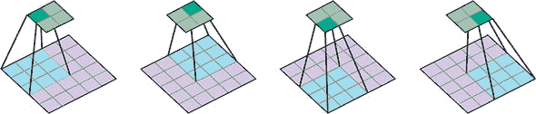

（来源：“深度学习卷积算术指南”，作者 Vincent Dumoulin 和 Francesco Visin，2016，[`arxiv.org/abs/1603.07285`](https://arxiv.org/abs/1603.07285)。）

图 4.1 描述了单个过滤器在二维输入上的卷积操作。在实践中，输入体积通常是三维的，我们使用几个堆叠的过滤器。然而，基本原理保持不变：每个过滤器每一步只产生一个值，无论输入体积的深度如何。我们使用的过滤器数量决定了输出体积的深度，因为它们的激活图是堆叠在一起的。所有这些都在 图 4.2 中得到了说明。

##### 图 4.2\. 在激活图（特征图）和输入、输出体积的上下文中，单个卷积步骤的激活值。请注意，ConvNet 过滤器贯穿整个输入体积的深度，输出体积的深度由堆叠在一起的激活图决定。

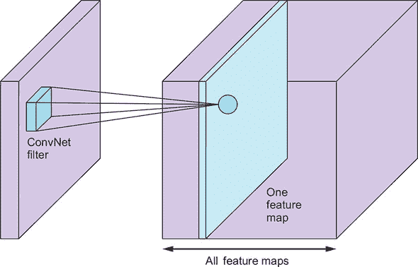

(来源：“卷积神经网络”，作者：Nameer Hirschkind 等，Brilliant.org，2018 年 11 月 1 日检索，[`mng.bz/8zJK`](http://mng.bz/8zJK).)


##### 备注

如果你想深入了解卷积网络及其背后的概念，我们建议阅读 François Chollet 的《Python 深度学习》（Manning，2017 年），该书提供了对深度学习所有关键概念和技术的卓越、实用的介绍，包括卷积网络。对于那些更倾向于学术研究的人来说，Andrej Karpathy 在斯坦福大学关于视觉识别卷积神经网络的优秀讲义是一个很好的资源([`cs231n.github.io/convolutional-networks/`](http://cs231n.github.io/convolutional-networks/))).


### 4.2. DCGAN 的简要历史

DCGAN 由 Alec Radford、Luke Metz 和 Soumith Chintala 于 2016 年提出，是 GAN 技术自两年前诞生以来最重要的早期创新之一。^([1]) 这并不是第一次有研究团队尝试利用卷积神经网络（ConvNets）在 GAN 中的应用，但这是他们第一次成功地将 ConvNets 直接整合到全规模的 GAN 模型中。

> ¹
> 
> 参见“Alec Radford 等人，《无监督表示学习与深度卷积生成对抗网络》，2015 年，[`arxiv.org/abs/1511.06434`](https://arxiv.org/abs/1511.06434).”

使用 ConvNets 加剧了困扰 GAN 训练的许多困难，包括不稳定性和梯度饱和。事实上，这些挑战如此艰巨，以至于一些研究人员求助于替代方法，如 LAPGAN，它使用拉普拉斯金字塔内的级联卷积网络，并在每个级别上使用 GAN 框架单独训练一个 ConvNet。^([2]) 如果这些内容对你来说难以理解，请不要担心。随着更优越方法的取代，LAPGAN 已被很大程度上归入历史，因此了解其内部机制并不重要。

> ²
> 
> 参见“Emily Denton 等人，《使用拉普拉斯金字塔的对抗网络进行深度生成图像模型》，2015 年，[`arxiv.org/abs/1506.05751`](https://arxiv.org/abs/1506.05751).”

虽然 LAPGAN 在发布时复杂、计算量大，但它在当时提供了最高质量的图像，比原始 GAN（40%的人认为生成的图像是真实的，而原始 GAN 只有 10%）提高了四倍。因此，LAPGAN 展示了将 GAN 与 ConvNets 结合的巨大潜力。

在 DCGAN 中，Radford 及其合作者引入了技术和优化方法，使得卷积神经网络（ConvNets）能够扩展到完整的 GAN 框架，而无需修改底层 GAN 架构，也不需要将 GAN 简化为更复杂模型框架（如 LAPGAN）的子例程。Radford 等人使用的关键技术之一是批量归一化（batch normalization），它通过在每个应用层对输入进行归一化来帮助稳定训练过程。让我们更详细地了解一下批量归一化是什么以及它是如何工作的。

### 4.3\. 批量归一化

**批量归一化**是由 Google 科学家 Sergey Ioffe 和 Christian Szegedy 于 2015 年提出的。^([[3])他们的洞察既简单又具有开创性。正如我们归一化网络输入一样，他们提出了对每个层在每个训练小批量通过网络流动时进行归一化的建议。

> ³
> 
> 参见 Sergey Ioffe 和 Christian Szegedy 于 2015 年发表的论文“Batch Normalization: Accelerating Deep Network Training by Reducing Internal Covariate Shift”，[`arxiv.org/abs/1502.03167`](https://arxiv.org/abs/1502.03167)。

#### 4.3.1\. 理解归一化

它有助于提醒我们归一化的概念以及为什么我们最初要归一化输入特征值。**归一化**是指对数据进行缩放，使其具有零均值和单位方差。这是通过取每个数据点 *x*，减去均值 *μ*，然后将结果除以标准差 *σ* 来实现的，如方程式 4.1 所示：

##### equation 4.1\.

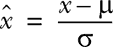

归一化具有几个优点。也许最重要的是，它使得具有不同比例的特征之间的比较变得更容易，并且通过扩展，使得训练过程对特征的比例不那么敏感。考虑以下（相当牵强的）例子。假设我们正在尝试根据两个特征来预测一个家庭的月支出：家庭的年收入和家庭规模。我们预计，一般来说，一个家庭赚得越多，他们花费的就越多；家庭规模越大，他们花费的就越多。

然而，这些特征的比例差异很大——年收入额外增加 10 万可能不会影响一个家庭的花费，但额外增加 10 个家庭成员可能会对任何家庭预算造成破坏。归一化通过将每个特征值缩放到标准尺度上，使得每个数据点不是以其面值表示，而是作为一个相对“分数”，表示给定数据点与均值的多少个标准差。

批归一化的背后理念是，仅对输入进行归一化在处理具有许多层的深度神经网络时可能还不够。随着输入值通过网络流动，从一层到下一层，它们会被每一层中的可训练参数所缩放。当参数通过反向传播进行调整时，每一层输入的分布容易在后续训练迭代中发生变化，这会破坏学习过程。在学术界，这个问题被称为 *协变量偏移*。批归一化通过按每个迷你批的均值和方差缩放每个迷你批的值来解决它。

#### 4.3.2\. 批归一化计算

批归一化的计算方式与我们在前面提出的简单归一化方程在几个方面有所不同。本节将逐步介绍它。

设 *μ[B]* 为迷你批 *B* 的均值，σ*[B]*² 为迷你批 *B* 的方差（均方偏差）。标准化值 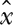 的计算方法如下所示 方程式 4.2：

##### 方程式 4.2\.

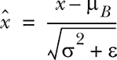

术语 *ϵ*（epsilon）是为了数值稳定性而添加的，主要是为了避免除以零。它被设置为一个小正的常数值，例如 0.001。

在批归一化中，我们不会直接使用这些标准化值。相反，我们在将它们作为输入传递给下一层之前，将它们乘以 *γ*（伽马）并加上 *β*（贝塔）；参见 方程式 4.3。

##### 方程式 4.3\.


重要的是，术语 *γ* 和 *β* 是可训练参数，它们就像权重和偏差一样，在网络训练过程中进行调整。这样做的原因是，中间输入值可能有益于围绕非零均值和具有非一方差进行标准化。因为 *γ* 和 *β* 是可训练的，网络可以学习哪些值最有效。

幸运的是，我们不必担心这些。Keras 函数 `keras.layers.BatchNormalization` 会为我们处理所有后台的迷你批计算和更新。

批归一化限制了更新前一层参数对当前层接收到的输入分布的影响程度。这减少了层间参数之间的任何不希望有的相互依赖性，有助于加快网络训练过程并提高其鲁棒性，尤其是在网络参数初始化方面。

批归一化已被证明对于许多深度学习架构的可行性至关重要，包括你将在以下教程中看到的 DCGAN。

### 4.4\. 教程：使用 DCGAN 生成手写数字

在本教程中，我们将回顾来自第三章的手写数字 MNIST 数据集。然而，这一次，我们将使用 DCGAN 架构，并将生成器和判别器都表示为卷积网络，如图 4.3 所示。。除了这个变化之外，网络架构的其他部分保持不变。在教程结束时，我们将比较两个 GAN（传统与 DCGAN）生成的手写数字的质量，以便您可以看到使用更先进的网络架构所能实现的改进。

##### 图 4.3\. 本章教程的整体模型架构与我们在第三章中实现的 GAN 相同。唯一的区别（在此高级图表中不可见）是生成器和判别器网络的内部表示（生成器和判别器框的内部）。这些网络将在本教程的后面部分详细说明。

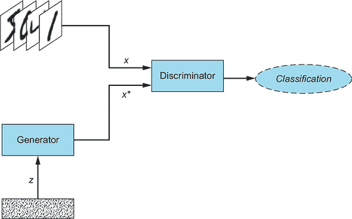

正如第三章中所述，本教程中的大部分代码都是从 Erik Linder-Norén 的开源 GitHub 仓库中改编的，该仓库包含 Keras 中的 GAN 模型([`github.com/eriklindernoren/Keras-GAN`](https://github.com/eriklindernoren/Keras-GAN))，经过许多修改和改进，包括实现细节和网络架构。包含完整实现以及添加的训练进度可视化的 Jupyter 笔记本可在本书的 GitHub 仓库[`github.com/GANs-in-Action/gans-in-action`](https://github.com/GANs-in-Action/gans-in-action)下的第四章文件夹中找到。代码已在 Python 3.6.0、Keras 2.1.6 和 TensorFlow 1.8.0 上进行了测试。为了加快训练时间，建议在 GPU 上运行模型。

#### 4.4.1\. 导入模块和指定模型输入维度

首先，我们导入所有需要用于训练和运行模型的包、模块和库。正如第三章中所述，MNIST 手写数字数据集直接从 `keras.datasets` 导入。

##### 列表 4.1\. 导入语句

```
%matplotlib inline

import matplotlib.pyplot as plt
import numpy as np

from keras.datasets import mnist
from keras.layers import (
    Activation, BatchNormalization, Dense, Dropout, Flatten, Reshape)
from keras.layers.advanced_activations import LeakyReLU
from keras.layers.convolutional import Conv2D, Conv2DTranspose
from keras.models import Sequential
from keras.optimizers import Adam
```

我们还指定了模型输入维度：图像形状和噪声向量 *z* 的长度。

##### 列表 4.2\. 模型输入维度

```
img_rows = 28
img_cols = 28
channels = 1

img_shape = (img_rows, img_cols, channels)    ***1***

z_dim = 100                                   ***2***
```

+   ***1* 输入图像维度**

+   ***2* 噪声向量的尺寸，用作生成器的输入**

#### 4.4.2\. 实现生成器

卷积神经网络（ConvNets）传统上用于图像分类任务，其中网络接收一个具有*高度* × *宽度* × *颜色通道数*维度的图像作为输入，并通过一系列卷积层输出一个单维度的类别得分向量，其维度为 1 × *n*，其中*n*是类别标签的数量。要使用卷积神经网络架构生成图像，我们反转这个过程：不是将图像处理成向量，而是将向量上采样成图像。

这个过程的关键是*转置卷积*。回想一下，常规卷积通常用于在增加深度的同时减少输入的宽度和高度。转置卷积则相反：它用于在减少深度的同时增加宽度和高度，正如您可以在图 4.4 的生成器网络图中看到的。

##### 图 4.4。生成器接收一个随机噪声向量作为输入，并生成一个 28 × 28 × 1 的图像。它是通过多层转置卷积来实现的。在卷积层之间，我们应用批量归一化以稳定训练过程。（图像未按比例缩放。）

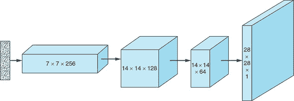

生成器从噪声向量*z*开始。使用全连接层，我们将向量重构成一个具有小基础（宽度×高度）和大深度的三维隐藏层。使用转置卷积，输入逐渐被重塑，使其基础增长而深度减少，直到我们达到最终层，其形状是我们想要合成的图像，28 × 28 × 1。在每个转置卷积层之后，我们应用批量归一化和*Leaky ReLU*激活函数。在最终层，我们不应用批量归一化，并且，而不是 ReLU，我们使用*tanh*激活函数。

将所有步骤组合起来，我们执行以下操作：

1.  将一个随机噪声向量通过全连接层重构成一个 7 × 7 × 256 张量。

1.  使用转置卷积，将 7 × 7 × 256 张量转换为 14 × 14 × 128 张量。

1.  应用批量归一化和*Leaky ReLU*激活函数。

1.  使用转置卷积，将 14 × 14 × 128 张量转换为 14 × 14 × 64 张量。请注意，宽度和高度维度保持不变；这是通过在`Conv2DTranspose`中将步长参数设置为 1 来实现的。

1.  应用批量归一化和*Leaky ReLU*激活函数。

1.  使用转置卷积，将 14 × 14 × 64 张量转换为输出图像大小，28 × 28 × 1。

1.  应用*tanh*激活函数。

以下列表显示了在 Keras 中实现时生成器网络的外观。

##### 列表 4.3。DCGAN 生成器

```
def build_generator(z_dim):

    model = Sequential()

    model.add(Dense(256 * 7 * 7, input_dim=z_dim))                           ***1***
    model.add(Reshape((7, 7, 256)))

    model.add(Conv2DTranspose(128, kernel_size=3, strides=2, padding='same'))***2***

    model.add(BatchNormalization())                                          ***3***

    model.add(LeakyReLU(alpha=0.01))                                         ***4***

    model.add(Conv2DTranspose(64, kernel_size=3, strides=1, padding='same')) ***5***

    model.add(BatchNormalization())                                          ***3***

    model.add(LeakyReLU(alpha=0.01))                                         ***4***

    model.add(Conv2DTranspose(1, kernel_size=3, strides=2, padding='same'))  ***6***

    model.add(Activation('tanh'))                                            ***7***

    return model
```

+   ***1* 通过全连接层将输入重构成 7 × 7 × 256 张量**

+   ***2* 转置卷积层，从 7 × 7 × 256 张量转换为 14 × 14 × 128 张量**

+   ***2* 批量归一化**

+   ***4* Leaky ReLU 激活**

+   **5* 转置卷积层，从 14 × 14 × 128 转换为 14 × 14 × 64 张量**

+   **6* 转置卷积层，从 14 × 14 × 64 转换为 28 × 28 × 1 张量**

+   **7* 输出层使用 tanh 激活**

#### 4.4.3\. 实现判别器

判别器是一个熟悉的卷积神经网络，它接收一个图像并输出一个预测向量：在这种情况下，是一个二元分类，指示输入图像被认为是真实的而不是伪造的。图 4.5 展示了我们将要实现的判别器网络。

##### 图 4.5\. 判别器接收一个 28 × 28 × 1 的图像作为输入，应用多个卷积层，并使用 *sigmoid* 激活函数 σ 输出一个概率，表明输入图像是真实的而不是伪造的。在卷积层之间，我们应用批标准化以稳定训练过程。（图像未按比例缩放。）


判别器的输入是一个 28 × 28 × 1 的图像。通过应用卷积，图像被转换，使其基础（宽度 × 高度）逐渐减小，其深度逐渐增加。在所有卷积层上，我们应用 *Leaky ReLU* 激活函数。批标准化用于所有卷积层，除了第一层。对于输出，我们使用全连接层和 *sigmoid* 激活函数。

将所有步骤组合起来，我们执行以下操作：

1.  使用卷积层将一个 28 × 28 × 1 的输入图像转换为 14 × 14 × 32 张量。

1.  应用 *Leaky ReLU* 激活函数。

1.  使用卷积层，将 14 × 14 × 32 张量转换为 7 × 7 × 64 张量。

1.  应用批标准化和 *Leaky ReLU* 激活函数。

1.  使用卷积层，将 7 × 7 × 64 张量转换为 3 × 3 × 128 张量。

1.  应用批标准化和 *Leaky ReLU* 激活函数。

1.  将 3 × 3 × 128 张量展平为大小为 3 × 3 × 128 = 1152 的向量。

1.  使用一个全连接层，并输入到 *sigmoid* 激活函数，以计算输入图像是否为真实的概率。

以下列表是判别器模型的 Keras 实现。

##### 列表 4.4\. DCGAN 判别器

```
def build_discriminator(img_shape):

    model = Sequential()

    model.add(                                  ***1***
        Conv2D(32,
               kernel_size=3,
               strides=2,
               input_shape=img_shape,
               padding='same'))

    model.add(LeakyReLU(alpha=0.01))            ***2***

    model.add(                                  ***3***
        Conv2D(64,
               kernel_size=3,
               strides=2,
               input_shape=img_shape,
               padding='same'))

    model.add(BatchNormalization())             ***4***

    model.add(LeakyReLU(alpha=0.01))            ***5***

    model.add(                                  ***6***
        Conv2D(128,
               kernel_size=3,
               strides=2,
               input_shape=img_shape,
               padding='same'))

    model.add(BatchNormalization())             ***7***

    model.add(LeakyReLU(alpha=0.01))            ***8***

    model.add(Flatten())                        ***9***
    model.add(Dense(1, activation='sigmoid'))

    return model
```

+   **1* 卷积层，从 28 × 28 × 1 转换为 14 × 14 × 32 张量**

+   **2* Leaky ReLU 激活**

+   **3* 卷积层，从 14 × 14 × 32 转换为 7 × 7 × 64 张量**

+   **4* 批标准化**

+   **5* Leaky ReLU 激活**

+   **6* 卷积层，从 7 × 7 × 64 张量转换为 3 × 3 × 128 张量**

+   **7* 批标准化**

+   **8* Leaky ReLU 激活**

+   **9* 输出层使用 sigmoid 激活**

#### 4.4.4\. 构建 和 运行 DCGAN

除了用于生成器和判别器的网络架构外，DCGAN 网络的其余设置和实现与我们在第三章（chapter 3）中使用的简单 GAN 相同。这突出了 GAN 架构的通用性。列表 4.5 代码构建模型，列表 4.6 训练模型。

##### 列表 4.5\. 构建 和 编译 DCGAN

```
def build_gan(generator, discriminator):

    model = Sequential()

    model.add(generator)                                      ***1***
    model.add(discriminator)

    return model

discriminator = build_discriminator(img_shape)                ***2***
discriminator.compile(loss='binary_crossentropy',
                      optimizer=Adam(),
                      metrics=['accuracy'])

generator = build_generator(z_dim)                            ***3***

discriminator.trainable = False                               ***4***

gan = build_gan(generator, discriminator)                     ***5***
gan.compile(loss='binary_crossentropy', optimizer=Adam())
```

+   ***1* 结合生成器和判别器模型**

+   ***2* 构建 和 编译 判别器**

+   ***2* 构建 生成器**

+   ***4* 在生成器训练期间保持判别器参数不变**

+   ***5* 使用固定的判别器构建和编译 GAN 模型以训练生成器**

##### 列表 4.6\. DCGAN 训练循环

```
losses = []
accuracies = []
iteration_checkpoints = []

def train(iterations, batch_size, sample_interval):

    (X_train, _), (_, _) = mnist.load_data()                              ***1***

    X_train = X_train / 127.5 - 1.0                                       ***2***
    X_train = np.expand_dims(X_train, axis=3)

    real = np.ones((batch_size, 1))                                       ***3***

    fake = np.zeros((batch_size, 1))                                      ***4***

    for iteration in range(iterations):

        idx = np.random.randint(0, X_train.shape[0], batch_size)          ***5***
        imgs = X_train[idx]

        z = np.random.normal(0, 1, (batch_size, 100))                     ***6***
        gen_imgs = generator.predict(z)

        d_loss_real = discriminator.train_on_batch(imgs, real)            ***7***
        d_loss_fake = discriminator.train_on_batch(gen_imgs, fake)
        d_loss, accuracy = 0.5 * np.add(d_loss_real, d_loss_fake)

        z = np.random.normal(0, 1, (batch_size, 100))                     ***8***
        gen_imgs = generator.predict(z)

        g_loss = gan.train_on_batch(z, real)                              ***9***

        if (iteration + 1) % sample_interval == 0:

            losses.append((d_loss, g_loss))                               ***10***
            accuracies.append(100.0 * accuracy)                           ***10***
            iteration_checkpoints.append(iteration + 1)                   ***10***

            print("%d [D loss: %f, acc.: %.2f%%] [G loss: %f]" %          ***11***
                  (iteration + 1, d_loss, 100.0 * accuracy, g_loss))

            sample_images(generator)                                      ***12***
```

+   ***1* 加载 MNIST 数据集**

+   ***2* 将 [0, 255] 灰度像素值缩放到 [–1, 1]**

+   ***3* 真实图像的标签：全部为 1**

+   ***4* 假图像的标签：全部为 0**

+   ***5* 获取一批随机真实图像**

+   ***6* 生成一批假图像**

+   ***7* 训练判别器**

+   ***8* 生成一批假图像**

+   ***9* 训练生成器**

+   ***10* 保存损失和准确率，以便在训练后绘制**

+   ***11* 输出训练进度**

+   ***12* 输出一个样本生成的图像**

为了完整性，我们还在以下列表中包括了 `sample_images()` 函数。回想一下，在第三章（chapter 3）中，此函数输出一个由生成器在给定训练迭代中合成的 4 × 4 图像网格。

##### 列表 4.7\. 显示生成的图像

```
def sample_images(generator, image_grid_rows=4, image_grid_columns=4):

    z = np.random.normal(0, 1, (image_grid_rows * image_grid_columns, z_dim))***1***

    gen_imgs = generator.predict(z)                                          ***2***

    gen_imgs = 0.5 * gen_imgs + 0.5                                          ***3***

    fig, axs = plt.subplots(image_grid_rows,                                 ***4***
                            image_grid_columns,
                            figsize=(4, 4),
                            sharey=True,
                            sharex=True)

    cnt = 0
    for i in range(image_grid_rows):
        for j in range(image_grid_columns):
            axs[i, j].imshow(gen_imgs[cnt, :, :, 0], cmap='gray')            ***5***
            axs[i, j].axis('off')
            cnt += 1
```

+   ***1* 生成随机噪声样本**

+   ***2* 从随机噪声生成图像**

+   ***3* 将图像像素值缩放到 [0, 1]**

+   ***4* 设置图像网格**

+   ***5* 输出一个图像网格**

接下来，以下代码用于运行模型。

##### 列表 4.8\. 运行模型

```
iterations = 20000                                 ***1***
batch_size = 128
sample_interval = 1000

train(iterations, batch_size, sample_interval)     ***2***
```

+   ***1* 设置超参数**

+   ***2* 训练 DCGAN 指定次数的迭代**

#### 4.4.5\. 模型输出

图 4.6 展示了 DCGAN 完全训练后生成器生成的手写数字样本。为了对比，图 4.7 展示了第三章（chapter 3）中 GAN 生成的数字样本，图 4.8 展示了 MNIST 数据集中的真实手写数字样本。

##### 图 4.6\. 一个由完全训练的 DCGAN 生成的手写数字样本

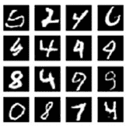

##### 图 4.7\. 由第三章（chapter 3）中实现的 GAN 生成的手写数字样本

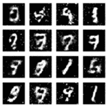

##### 图 4.8\. 从 MNIST 数据集中随机生成的真实手写数字网格，用于训练我们的 DCGAN。与我们在第三章（chapter 3）中实现的简单 GAN 生成的图像不同，许多由完全训练的 DCGAN 生成的手写数字基本上与训练数据无法区分。

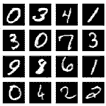

如前文所示，我们为实施 DCGAN 所投入的额外工作得到了丰厚的回报。网络在完全训练后产生的许多手写数字图像几乎与人类手写的无法区分。

### 4.5. 结论

DCGAN 展示了 GAN 框架的通用性。从理论上讲，判别器和生成器可以表示为任何可微分的函数，甚至是一个多层卷积网络这样复杂的函数。然而，DCGAN 也表明，在实际中实现更复杂的实现存在重大障碍。如果没有批标准化这样的突破，DCGAN 将无法正确训练。

在下一章中，我们将探讨一些理论上的和实践上的限制，这些限制使得 GAN 的训练变得如此具有挑战性，以及克服这些限制的方法。

### 摘要

+   卷积神经网络（ConvNets）使用一个或多个卷积滤波器在输入体积上滑动。在每次滑动输入的过程中，滤波器使用单一组参数来产生一个激活值。所有滤波器产生的激活值共同构成了输出层。

+   批标准化是一种通过在传递给下一层之前对每一层的输出进行归一化，以减少神经网络中协变量偏移（训练过程中输入值分布在不同层之间的变化）的方法。

+   深度卷积生成对抗网络（DCGAN）是一种生成对抗网络，其生成器和判别器均采用卷积神经网络。这种架构在图像处理任务中表现出色，包括手写数字生成，我们在代码教程中实现了这一功能。
