## 第二部分\. GANs 的高级主题

第二部分探讨了 GANs 的一些高级主题。在第一部分的基础概念之上，你将深化对 GANs 的理论理解，并扩展 GAN 实现的实际工具箱：

+   第五章涵盖了训练 GANs 的理论和实践障碍以及如何克服它们。

+   第六章介绍了一种开创性的训练方法，称为*渐进式 GAN*，它使 GANs 能够以前所未有的分辨率合成图像。

+   第七章涵盖了 GANs 在半监督学习（仅用一小部分标记示例训练分类器的方法）中的应用，这是一个具有巨大实际重要性的领域。

+   第八章介绍了条件 GAN，这是一种在训练生成器和判别器时使用标签（或其他条件信息）来实现有针对性的数据生成的技术。

+   第九章探讨了 CycleGAN，这是一种通用的图像到图像翻译技术——将一个图像（如苹果的照片）转换为另一个图像（如橙子的照片）。

## 第五章\. 训练和常见挑战：GANing for success

*本章涵盖*

+   应对评估 GANs 的挑战

+   最小-最大、非饱和和水合 GANs

+   使用技巧和窍门来最佳训练 GAN


##### 注意

在阅读本章时，请记住，GANs 在训练和评估方面都非常有名，难以进行。与其他任何尖端领域一样，关于最佳方法的观点总是不断演变。


诸如“如何训练您的 DRAGAN”之类的论文既证明了机器学习研究人员制造糟糕笑话的惊人能力，也说明了训练生成对抗网络（GANs）的难度。数十篇 arXiv 论文专注于提高 GANs 训练的目的，许多研讨会也致力于在顶级学术会议（包括神经信息处理系统，或 NIPS，这是一场重要的机器学习会议^([1]))的各个方面进行培训。

> ¹
> 
> NIPS 2016 年举办了一次 GAN 训练研讨会，许多该领域的著名研究人员参加了此次研讨会，本章即基于此。NIPS 最近将其缩写更改为 NeurIPS。

但 GAN 训练是一个不断发展的挑战，因此现在需要更新大量资源——包括通过论文和会议展示的资源。本章提供了一个全面且最新的训练技术概述。在本章中，你也将最终体验到没有人会讨厌的东西——数学。（但我们承诺不会使用严格必要的更多。）

开个玩笑，然而，作为本书“GANs 高级主题”部分的第一章，这一章内容相当密集。我们建议您回顾并尝试一些具有多个参数的模型。然后您就可以回到这一章，正如您应该带着对 GAN 的每个部分的功能以及训练它们所面临的挑战有深刻理解来阅读它。

就像这个高级部分的其他章节一样，这一章旨在教会您，同时也为未来几年提供有用的参考。因此，这一章是对人们经验、博客文章和最相关论文中的技巧和窍门的总结。（如果您不喜欢学术，现在是时候拿出那些涂鸦笔在脚注上涂鸦了。）我们将这一章视为一个短暂的学术休息，它将为您提供一张清晰的地图，指示 GAN 的现在和未来的所有惊人发展。

我们还希望这样让您掌握所有基本工具，以便理解可能出现的绝大多数新论文。在许多书中，这会被呈现为优缺点列表，这不会给读者提供对选择的全面高级理解。但由于 GAN 是一个如此新的领域，简单的列表是不可能的，因为文献还没有在一些方面达成最终共识。GAN 也是一个快速发展的领域，所以我们更愿意让您具备导航这个领域的能力，而不是提供可能很快就会过时的信息。

在解释了本章的目的之后，让我们再次明确 GAN 的位置。图 5.1 扩展了第二章中的图表，并展示了模型的分类学，以便您了解存在哪些其他生成技术以及它们是如何（不）相似的。

##### 图 5.1\. GAN 在哪里？

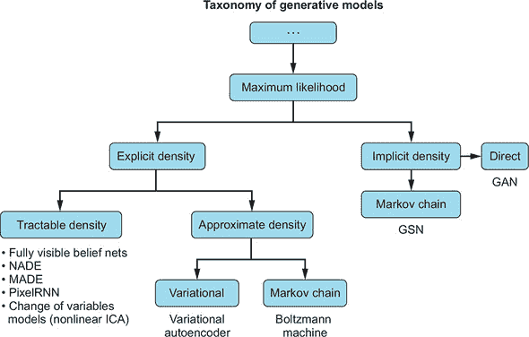

（来源：“Generative Adversarial Networks (GANs)，” by Ian Goodfellow，NIPS 2016 教程，[`mng.bz/4O0V`](http://mng.bz/4O0V)）

从这个图表中可以得出两个关键要点：

+   所有这些生成模型最终都源于最大似然，至少是隐式的。

+   在第二章中引入的变分自动编码器位于树的显式部分。记住我们有一个清晰的损失函数（重建损失）吗？好吧，在 GAN 中我们不再有了。相反，我们现在有两个相互竞争的损失函数，我们将在后面的内容中更深入地探讨。但因此，系统没有单一的解析解。

如果你了解图中展示的其他任何技术，那很好。关键思想是我们正在从显式和可处理的领域转向隐式方法来训练。然而，到目前为止，你应该在想：如果我们没有显式的损失函数（尽管我们在第三章的“冲突目标”部分的第三章中遇到了两个单独的损失），我们如何评估 GAN？如果你正在进行并行、大规模的实验呢？

为了消除潜在的混淆，图 5.1 中的所有技术并不都来自深度学习，我们当然不需要你了解它们中的任何一种，除了 VAEs 和 GANs！

### 5.1. 评估

让我们重新回顾一下关于伪造达芬奇画作的第一章的类比。想象一下，一个伪造者（生成器）正在试图模仿达芬奇，以便将伪造的画作在展览会上获得认可。这个伪造者正在与一个艺术评论家（判别器）竞争，后者试图只接受真正的作品进入展览。在这种情况下，如果你是那个试图通过模仿达芬奇的风格创作出一幅“失传之作”来欺骗评论家的伪造者，你将如何评估你的表现？每个参与者将如何评估他们的表现？

GANs 试图解决伪造者和艺术评论家之间永无止境的竞争问题。确实，鉴于通常生成器比判别器更有兴趣，我们应该格外仔细地考虑其评估。但是，我们如何量化一位伟大画家的风格或我们模仿得有多接近？我们如何量化生成的整体质量？

#### 5.1.1. 评估框架

最佳解决方案是让达芬奇用他的风格绘制所有可能绘制的画作，然后看看使用 GAN 生成的图像是否会在那个集合中。你可以将这个过程视为最大似然最大化的一种非近似版本。实际上，我们会知道图像要么在这个集合中，要么不在，所以没有涉及到似然。然而，在实践中，这个解决方案从未真正可行。

下一个最好的办法是评估图像，指出要寻找的实例，然后累计错误或伪影的数量。但这些将非常局部化，最终总是需要人类评论家亲自查看艺术品本身。这是一个本质上不可扩展的——尽管可能是第二好的——解决方案。

我们希望有一种统计方法来评估生成样本的质量，因为这可以扩展，并允许我们在实验中进行评估。如果我们没有一个容易计算的指标，我们也无法监控进度。这对于评估不同的实验尤其是一个问题——想象一下在每个实验中都要测量或甚至反向传播，例如超参数初始化。鉴于 GANs 对超参数非常敏感，所以没有统计指标是困难的，因为每次我们想要评估训练质量时，我们都必须回过头来检查人类。

我们为什么不直接使用我们已理解的东西，比如最大似然？它是统计的，衡量的是某种模糊的期望值，而且我们无论如何都会从它那里隐式地推导出来。尽管如此，最大似然难以使用，因为我们需要有一个对潜在分布及其似然的良好估计——这可能意味着超过数十亿张图片。2 此外，即使我们有一个好的样本——这就是我们实际上在训练集中拥有的样本——也有理由超越最大似然。

> ²
> 
> 我们在第十章中对维度问题进行了更好的处理。

最大似然还有什么问题？毕竟，它是机器学习研究中的一个成熟指标。一般来说，最大似然有很多理想的特性，但正如我们所提到的，将其用作 GANs 的评估技术并不容易处理。

此外，在实践中，最大似然估计的近似往往过于泛化，因此提供的样本变化过多，不够真实。3 在最大似然下，我们可能会发现现实中不可能出现的样本，例如多头狗或没有身体的多头长颈鹿。但因为我们不希望 GAN 的暴力行为让人做噩梦，所以我们可能需要使用损失函数和/或评估方法来剔除“过于泛化”的样本。

> ³
> 
> 请参阅 Ferenc Huszár 于 2015 年发表的论文“如何（不）训练你的生成模型：计划采样、似然、对抗者？”，[`arxiv.org/abs/1511.05101`](http://arxiv.org/abs/1511.05101)。

考虑过度泛化的另一种方法是，从假数据和真实数据（例如，图像）的概率分布开始，看看在应该为零概率质量的情况下，距离函数（一种衡量真实和假图像分布之间距离的方法）会做什么。如果这些过度泛化样本不太不同，那么由于这些样本的额外损失可能很小，例如，因为这些模式在所有关键问题（如多头）之外都接近真实数据。因此，一个过度泛化的指标将允许在根据真实数据生成过程，本不应该有任何样本的情况下创建样本，例如多头牛。

正因如此，研究人员认为我们需要不同的评估原则，尽管我们实际上总是在最大化似然。我们只是在不同的方式上测量它。对于那些好奇的人来说，KL 散度和 JS 散度——我们稍后会讨论——也是基于最大似然，所以在这里我们可以将它们视为可互换的。

因此，你现在明白我们必须能够评估一个样本，而不能简单地使用最大似然来进行评估。在接下来的几页中，我们将讨论统计评估生成样本质量最常用和接受的两种指标：* inception 分数 (IS)* 和 *Fréchet inception 距离 (FID)*。这两个指标的优势在于它们已经被广泛验证，与至少某些期望的特性高度相关，例如视觉吸引力或图像的真实感。inception 分数的设计完全围绕样本应可识别的想法，但它也已经显示出与人类对构成真实图像的直觉相关联，这一点通过亚马逊机械工人验证。

> ⁴
> 
> 亚马逊机械工人是一种服务，允许你按小时购买人们的时间来完成预指定的任务。这就像按需自由职业者或 Task Rabbit，但仅限于在线。

#### 5.1.2\. Inception 分数

我们显然需要一个良好的统计评估方法。让我们从理想评估方法应确保的高层次愿望清单开始：

+   生成的样本看起来像一些真实、可区分的东西——例如，桶或牛。样本看起来很真实，我们可以生成数据集中物品的样本。此外，我们的分类器确信它看到的是它所识别的物品。幸运的是，我们已经有能够将图像分类为特定类别并具有一定置信度的计算机视觉分类器。实际上，这个分数本身是以 Inception 网络命名的，而 Inception 网络就是那些分类器之一。

+   生成的样本种类繁多，理想情况下应包含原始数据集中表示的所有类别。这一点也非常理想，因为我们的样本应该代表我们给出的数据集；如果我们的 MNIST 生成 GAN 总是缺少数字 8，我们就不会有一个好的生成模型。我们不应该有*类间*（类别之间）的模式坍塌.^([5])

    > ⁵
    > 
    > 请参阅“生成对抗网络图像合成的介绍”，由 He Huang 等人著，2018 年，[`arxiv.org/pdf/1803.04469.pdf`](https://arxiv.org/pdf/1803.04469.pdf)。

尽管我们可能对我们的生成模型有进一步的要求，但这是一个良好的开端。

* inception 分数（IS）* 首次在 2016 年的一篇论文中提出，该论文广泛验证了这一指标，并确认它确实与人类对高质量样本构成的认识相关.^([6])这一指标自那以后在 GAN 研究社区中变得流行。

> ⁶
> 
> 请参阅“改进的 GANS 训练技术”，由 Tim Salimans 等人著，2016 年，[`arxiv.org/pdf/1606.03498.pdf`](https://arxiv.org/pdf/1606.03498.pdf)。

我们已经解释了为什么我们想要这个指标。现在让我们深入了解技术细节。计算 IS 是一个简单的过程：

1.  我们计算真实分布和生成分布之间的 Kullback–Leibler（KL）散度.^([7])

    > ⁷
    > 
    > 我们在第二章中介绍了 KL 散度。

1.  我们对步骤 1 的结果进行指数化。

让我们来看一个例子：一个辅助分类器生成对抗网络（ACGAN）的失败模式，^([8])其中我们试图从 ImageNet 数据集中生成雏菊的示例。当我们对以下 ACGAN 失败模式运行 Inception 网络时，我们看到了类似图 5.2 的东西；你的结果可能因操作系统、TensorFlow 版本和实现细节而异。

> ⁸
> 
> 请参阅“Auxiliary Classifier GANs 的辅助图像合成”，由 Augustus Odena 等人著，2017 年，[`arxiv.org/pdf/1610.09585.pdf`](https://arxiv.org/pdf/1610.09585.pdf)。

##### 图 5.2\. ACGAN 失败模式。右侧的分数表示 softmax 输出。

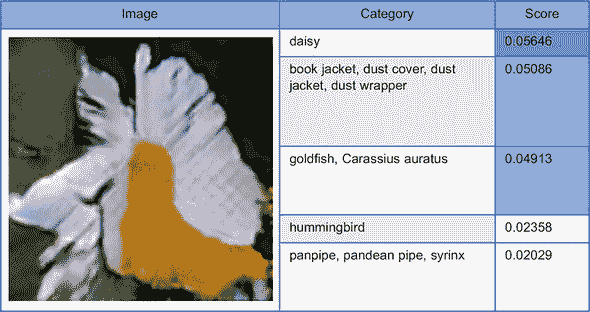

(来源：Odena，2017 年，[`arxiv.org/pdf/1610.09585.pdf`](https://arxiv.org/pdf/1610.09585.pdf)。)

这里需要注意的重要一点是，Inception 分类器并不确定它在看什么，尤其是在前三个类别中。人类会推断这可能是一朵花，但我们也不确定。总体预测的置信度也相当低（分数最高为 1.00）。这是一个会得到低 IS 的例子，这与本节开头我们提出的两个要求相匹配。因此，我们的指标之旅是成功的，因为这符合我们的直觉。

#### 5.1.3\. Fréchet inception 距离

接下来要解决的问题是没有足够的例子。通常，GAN 只为每个类别学习少量图像。2017 年，提出了一种新的解决方案：*Fréchet inception distance (FID)*.^([9]) FID 通过使其对噪声更鲁棒并允许检测*类内*（类内）样本缺失来改进 IS。

> ⁹
> 
> 参见“GANs Trained by a Two Time-Scale Update Rule Converge to a Local Nash Equilibrium”，作者 Martin Heusel 等，2017 年，[`arxiv.org/abs/1706.08500`](http://arxiv.org/abs/1706.08500).

这很重要，因为我们如果接受 IS 基线，那么只生成某一类的一个样本在技术上就满足了类别生成有时性的要求。但是，例如，如果我们试图创建一个猫生成算法，这实际上并不是我们想要的（比如说，如果我们有多个品种的猫）。此外，我们希望 GAN 能够输出从多个角度展示猫的样本，以及通常情况下独特的图像。

我们同样不希望 GAN 简单地记忆图像。幸运的是，这要容易检测得多——我们可以查看图像在像素空间中的距离。图 5.3 显示了这可能看起来像什么。FID 的技术实现再次复杂，但高级的想法是我们正在寻找一个生成的样本分布，该分布最小化了我们需要进行的修改数量，以确保生成的分布看起来像真实数据的分布。

##### 图 5.3。GAN 通过主要记忆项目来捕捉模式，这也产生了一个不希望看到的结果，表明 GAN 没有学习到多少有用的信息，并且很可能无法泛化。证据在图像中。前两行是重复样本的对；最后一行是训练集中中间行的最近邻。注意，这些例子在论文中由于低分辨率的 GAN 设置而具有非常低的分辨率。

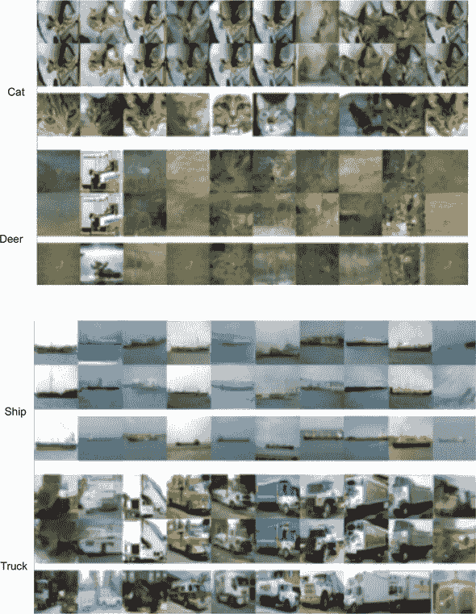

(来源：“GANs Actually Learn the Distribution? An Empirical Study”，作者 Sanjeev Arora 和 Yi Zhang，2017 年，[`arxiv.org/pdf/1706.08224v2.pdf`](https://arxiv.org/pdf/1706.08224v2.pdf).)

FID 是通过运行图像通过 Inception 网络来计算的。在实践中，我们比较中间表示——特征图或层——而不是最终输出（换句话说，我们*嵌入*它们）。更具体地说，我们评估两个分布——真实和生成的——嵌入均值、方差和协方差的距离。

为了从图像中抽象出来，如果我们有一个对分类器有深入了解的领域，我们可以使用它们的预测作为衡量这个特定样本是否看起来逼真的标准。总结来说，FID 是一种从人类评估者抽象出来的方法，它允许我们从分布的角度进行统计推理，甚至对于像图像的真实性这样难以量化的东西也是如此。

因为这个指标如此新颖，所以仍然值得等待，看看是否会在后来的论文中揭示出其缺陷。但考虑到已经有众多信誉良好的作者开始使用这个指标，我们决定将其包括在内.^([10])

> ¹⁰
> 
> 请参阅 Augustus Odena 等人于 2018 年发表的“Is Generator Conditioning Causally Related to GAN Performance?”，[`arxiv.org/abs/1802.08768`](http://arxiv.org/abs/1802.08768)。另请参阅 S. Nowozin（微软研究院）于 2018 年 2 月 10 日在 UCL 的演讲。

### 5.2\. 训练挑战

训练 GAN 可能很复杂，我们将向您介绍最佳实践。但在这里，我们只提供一套高级、易于理解的解释，不深入任何证明定理或展示证据的数学，因为细节超出了本书的范围。但我们鼓励您查阅原始资料并自行决定。通常，作者甚至提供代码示例以帮助您开始。

这里是一个主要问题的列表：

+   *模式坍塌*—在*模式坍塌*中，某些模式（例如，类别）在生成的样本中没有得到很好的表示。即使真实数据分布支持这部分分布中的样本，模式也会坍塌；例如，MNIST 数据集中将不会有数字 8。请注意，即使网络已经收敛，模式坍塌也可能发生。我们在解释 IS 时谈到了*类间*模式坍塌，在讨论 FID 时讨论了*类内*模式坍塌。

+   *收敛速度慢*—这是 GAN 和无监督设置中的一个重大问题，在这种设置中，通常收敛速度和可用计算是主要约束——与监督学习不同，在监督学习中，可用的标记数据通常是第一个障碍。此外，有些人认为计算，而不是数据，将是未来 AI 竞赛的决定性因素。而且，每个人都希望快速模型，不需要几天时间来训练。

+   *过度泛化*—在这里，我们特别讨论了模式（潜在数据样本）不应该有支持（不应该存在）的情况。例如，你可能会看到一个有多个身体但只有一个头的牛，或者相反。这种情况发生在 GAN 过度泛化，并基于真实数据学习不应该存在的事物时。

注意，模式坍塌和过度泛化有时可以通过重新初始化算法来最天真地解决，但这样的算法是脆弱的，这是不好的。这个列表大致给出了两个关键指标：速度和质量。但即使这两个指标相似，因为训练最终很大程度上集中在更快地缩小真实分布和生成分布之间的差距。

那么，我们该如何解决这个问题呢？在 GAN 训练方面，几种技术可以帮助我们改进训练过程，就像你使用任何其他机器学习算法一样：

+   增加网络深度

+   改变游戏设置

    +   原文提出的 Min-Max 设计及停止标准

    +   原文提出的非饱和设计及停止标准^([11])

        > ¹¹
        > 
        > 参见 Ian Goodfellow 等人于 2014 年发表的“生成对抗网络”，[`arxiv.org/abs/1406.2661`](http://arxiv.org/abs/1406.2661)。

    +   水晶距离 GAN 作为最近的一项改进

+   带有注释的训练技巧数量

    +   标准化输入

    +   对梯度进行惩罚

    +   更多地训练判别器

    +   避免稀疏梯度

    +   转换为软标签和噪声标签

#### 5.2.1. 增加网络深度

与许多机器学习算法一样，使学习更加稳定的最简单方法就是降低复杂性。如果你可以从一个简单的算法开始，并逐步添加，那么在训练过程中你会获得更多的稳定性，更快的收敛，以及可能的其他好处。第六章更深入地探讨了这一想法。

你可以快速通过一个简单的生成器和判别器实现稳定性，然后在训练过程中逐步增加复杂性，正如在一篇最令人震惊的 GAN 论文中所解释的那样.^([12]) 在这里，NVIDIA 的作者逐步增长两个网络，使得在每个训练周期结束时，生成器的输出大小加倍，判别器的输入也加倍。我们从一个简单的网络开始，并训练直到达到良好的性能。

> ¹²
> 
> 参见 Tero Karras 等人于 2017 年发表的“用于提高质量、稳定性和变化的 GAN 的渐进式增长”，[`arxiv.org/abs/1710.10196`](http://arxiv.org/abs/1710.10196)。

这确保了，而不是从一个比初始输入大小大几个数量级的巨大参数空间开始，我们首先生成一个 4 × 4 像素的图像，并在输出大小加倍之前在这个参数空间中导航。我们重复这个过程，直到达到 1024 × 1024 像素的图像。

亲自看看这是多么令人印象深刻；图 5.4 中的图片都是生成的。现在我们正在超越自动编码器可以生成的模糊 64 × 64 像素图像。

##### 图 5.4. GAN 生成的全高清图像。你可以把这看作是下一章的预告，在那里你将因在本章中所做的所有辛勤工作而得到回报。

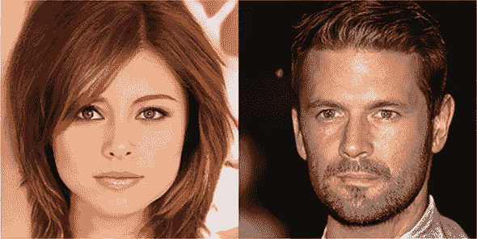

（来源：Karras 等人，2017 年，[`arxiv.org/abs/1710.10196`](https://arxiv.org/abs/1710.10196)。）

这种方法具有以下优点：稳定性、训练速度，以及最重要的是，生成的样本质量和规模。尽管这种范式是新的，但我们预计越来越多的论文会使用它。你绝对应该尝试一下，因为它是一种可以应用于几乎任何类型 GAN 的技术。

#### 5.2.2. 游戏设置

思考 GAN 的双玩家竞争性质的一种方法是可以想象你在玩围棋或其他任何可以随时结束的棋盘游戏，包括象棋。（实际上，这是借鉴了 DeepMind 对 AlphaGo 的方法及其分为策略网络和价值网络。）作为一个玩家，你需要不仅知道游戏的目标以及因此两个玩家试图完成什么，还要了解你离胜利有多近。所以你有 *规则*，你有一个 *距离（胜利）指标*——例如，失去的兵的数量。

但正如不是每个棋盘游戏的胜利指标都同样适用于每个游戏一样，一些 GAN 胜利指标（距离或发散度）往往与特定的游戏设置一起使用，而不是与其他设置一起使用。值得单独检查每个损失函数（胜利指标）和玩家动态（游戏设置）。

在这里，我们开始介绍一些描述 GAN 问题的一些数学符号。方程式很重要，我们承诺不会用不必要的复杂度吓到你。我们引入它们的原因是，给你一个高层次的理解，并为你提供理解许多 GAN 研究人员似乎还没有区分清楚的工具。（也许他们应该在心中训练判别器——哦，好吧。）

#### 5.2.3\. Min-Max GAN

正如我们在本书前面解释的那样，你可以从博弈论的角度思考 GAN 设置，其中有两个玩家试图超越对方。但即使是原始的 2014 年论文也提到，这个游戏有两种版本。原则上，更易于理解且理论基础更扎实的正是我们所描述的方法：只需将 GAN 问题视为一个 *min-max* 游戏。方程式 5.1 描述了判别器的损失函数。

##### 方程式 5.1\.

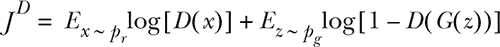

*E* 代表对 *x*（真实数据分布）或 *z*（潜在空间）的期望，*D* 代表判别器的函数（将图像映射到概率），而 *G* 代表生成器的函数（将潜在向量映射到图像）。这个第一个方程式可以从任何二元分类问题中熟悉。如果我们给自己一些自由，并消除复杂性，我们可以将这个方程式重写如下：

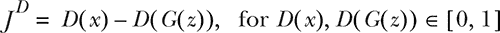

这表明判别器正在尝试最小化将真实样本误判为伪造样本（第一部分）或将伪造样本误判为真实样本（第二部分）的可能性。

现在，让我们将注意力转向 方程式 5.2 中的生成器的损失函数。

##### 方程式 5.2\.

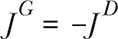

因为我们只有两个智能体，并且它们正在相互竞争，所以生成器的损失是判别器损失的负值是有意义的。

将所有这些放在一起：我们有两个损失函数，其中一个函数是另一个函数的负值。对抗性性质是明显的。生成器试图智胜判别器。至于判别器，记住它是一个二元分类器。判别器也只输出一个数字——而不是二元类别——因此它因自信或缺乏自信而受到惩罚。其余的只是一些复杂的数学，给我们带来了一些美好的性质，例如渐近一致性到 Jensen-Shannon 散度（如果你试图诅咒某人，这是一个很好的短语来记忆）。

我们之前解释了为什么我们通常不使用最大似然。相反，我们使用诸如 KL 散度、Jensen-Shannon 散度 (JSD) 以及最近的地移距离（也称为 Wasserstein 距离）等度量。但所有这些散度都有助于我们理解真实分布和生成分布之间的差异。现在，只需将 JSD 视为我们在第二章中介绍的 KL 散度的对称版本即可。

| |
| --- |

##### 定义

*Jensen-Shannon 散度 (JSD)* 是 KL 散度的对称版本。而 *KL*(*p,q*)! = *KL*(*q,p*)，但 *JSD*(*p,q*) == *JSD*(*q,p*)。

| |
| --- |

对于那些想要更多细节的人来说，KL 散度以及 JSD 通常被认为是 GANs 最终试图最小化的目标。这些都是距离度量类型，帮助我们理解在多维空间中两个分布之间的差异。一些巧妙的证明将那些散度与 GAN 的 min-max 版本联系起来；然而，这些关注点对于这本书来说过于学术化。如果这段话让你感到困惑，你并没有中风；不要担心。这只是统计学家的东西。

我们通常不会使用 Min-Max GAN (MM-GAN) 之外的任何内容，因为它给我们提供了很好的理论保证。它作为一个整洁的理论框架来理解 GANs：既是一个博弈论概念——源于两个网络/玩家之间的竞争性本质——也是一个信息论概念。除此之外，MM-GAN 通常没有其他优势。通常，只有下述两种设置被使用。

#### 5.2.4. 非饱和 GAN

在实践中，经常发现 min-max 方法会带来更多问题，例如判别器的收敛速度慢。原始的 GAN 论文提出了一种替代方案：*非饱和 GAN* (NS-GAN)。在这个问题版本中，我们不是试图将两个损失函数作为直接的竞争对手，而是使两个损失函数相互独立，如 方程 5.3 所示，但与原始公式 (方程 5.2) 方向上一致。

再次，让我们关注一般理解：两个损失函数不再直接相互设置。但在方程式 5.3 中，你可以看到生成器正在尝试最小化方程式 5.4 中判别器的第二项的相反数。基本上，它试图不让其生成的样本被发现。

##### 方程式 5.3。


##### 方程式 5.4。

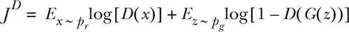

对于判别器的直觉与之前完全相同—方程式 5.1 和方程式 5.4 是相同的，但方程式 5.2 的等效物现在已改变。NS-GAN 的主要原因是，在 MM-GAN 的情况下，梯度可以轻易地**饱和**—接近 0，这会导致收敛速度慢，因为反向传播的权重更新要么是 0 要么非常小。或许一张图能更清楚地说明这一点；参见图 5.5。

##### 图 5.5\. 理论上所假设的关系应该是什么样的草图。y 轴是生成器的损失函数，而 D(G(z))是判别器对生成样本似然性的“猜测”。你可以看到，Minimax (MM)保持平坦的时间太长，因此给生成器提供的信息太少——梯度消失。

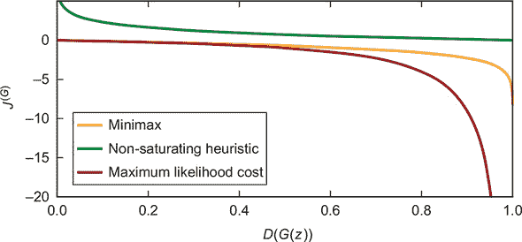

（来源：“理解生成对抗网络”，作者：Daniel Seita，2017，[`mng.bz/QQAj`](http://mng.bz/QQAj)）

你可以看到，在 0.0 附近，最大似然和 MM-GAN 的梯度都接近 0，这是早期训练发生的地方，而 NS-GAN 的梯度在那里要高得多，因此训练应该从一开始就更快。

我们对为什么 NS 变体应该收敛到纳什均衡没有好的理论理解。事实上，由于 NS-GAN 是启发式驱动的，使用这种形式不再给我们带来我们曾经得到的任何整洁的数学保证；参见图 5.6。然而，由于 GAN 问题的复杂性，即使在 NS-GAN 的情况下，训练可能根本不会收敛，尽管经验上已经证明它比 MM-GAN 表现更好。

##### 图 5.6\. 请保持沉默。

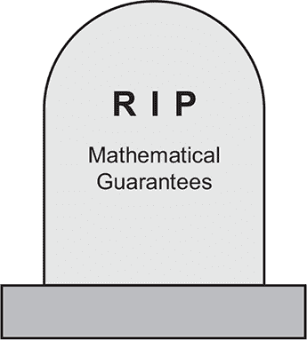

但我们可怕的牺牲带来了性能的显著提升。NS 方法的好处不仅在于初始训练更快，而且由于生成器学习得更快，判别器也学习得更快。这是我们所希望的，因为（几乎）我们所有人都面临着紧张的计算和时间预算，我们学得越快越好。有些人认为，在固定的计算预算下，NS-GAN 尚未被超越，甚至 Wasserstein GAN 也不是一个更好的架构。13

> ^(13)
> 
> 请参阅 Mario Lucic 等人于 2017 年发表的“Are GANs Created Equal? A Large-Scale Study”，[`arxiv.org/abs/1711.10337`](http://arxiv.org/abs/1711.10337)。

#### 5.2.5\. 何时停止训练

严格来说，NS-GAN

+   不再与 JSD 渐近一致

+   具有理论上甚至更难以捉摸的平衡状态

第一个观点很重要，因为 JSD 是一个有意义的工具，可以解释为什么隐式生成的分布甚至应该收敛到真实数据分布。原则上，这为我们提供了停止标准；但在实践中，这几乎毫无意义，因为我们永远无法验证真实分布和生成分布何时收敛。人们通常每隔几轮迭代就查看生成的样本来决定何时停止。最近，一些人开始通过 FID、IS 或不太流行的切片 Wasserstein 距离来定义停止标准。

第二个观点也很重要，因为不稳定性显然会导致训练问题。一个更重要的问题是知道何时停止。在 GAN 问题的两个原始公式中，我们从未得到一个明确的条件集，在实际情况中，训练何时完成。原则上，我们总是被告知一旦达到纳什均衡，训练就完成了，但在实践中这又很难验证，因为高维性使得均衡难以证明。

如果你想绘制生成器和判别器的损失函数，它们通常会四处跳跃。这是有道理的，因为它们是在相互竞争，所以如果一个变得更好，另一个就会得到更大的损失。仅仅通过查看两个损失函数，我们就不清楚何时实际上已经完成了训练。

在 NS-GAN 的辩护中，应该指出，它仍然比 Wasserstein GAN 快得多。因此，NS-GAN 可能通过能够更快地运行来克服这些限制。

#### 5.2.6\. Wasserstein GAN

最近，GAN 训练中出现了一种新的发展，并迅速在学术界获得认可：*Wasserstein GAN (WGAN)*.^([14]) 它现在几乎被每篇重要的学术论文和许多从业者所提及。最终，WGAN 之所以重要，有三个原因：

> ¹⁴
> 
> 请参阅 Martin Arjovsky 等人于 2017 年发表的“Wasserstein GAN”，[`arxiv.org/pdf/1701.07875.pdf`](https://arxiv.org/pdf/1701.07875.pdf)。

+   它显著改进了损失函数，现在它们是可解释的，并提供了更清晰的停止标准。

+   经验上，WGAN 往往有更好的结果。

+   与许多关于 GAN 的研究不同，它有明确的理论支持，从损失函数开始，展示了我们试图逼近的 KL 散度在理论上或实际上最终并不充分。基于这个理论，它随后提出了一种更好的损失函数，以减轻这个问题。

从上一节中，第一点的意义应该是相当明显的。鉴于生成器和判别器之间的竞争性，我们没有一个明确的停止训练的点。WGAN 使用地球迁移距离作为损失函数，它与生成的样本的视觉质量有明显的相关性。第二点和第三点的益处是相当明显的——我们希望有更高质量的样本和更好的理论基础。

这种魔法是如何实现的？让我们更详细地看看判别器——或者说 WGAN 所称的评论家——的水晶损失。看看 方程式 5.5。

##### 方程式 5.5\.


这个方程式与您之前见过的内容有些相似（作为一个高级简化版的 方程式 5.1），但有一些重要的区别。我们现在有函数 *f[w]*，它充当判别器。评论家试图估计地球迁移距离，并寻找在 *f[w]* 函数的不同（有效）参数化下，真实（第一项）和生成（第二项）分布之间的最大差异。我们现在只是测量差异。评论家试图通过查看使用 *f[w]* 到共享空间的不同投影来使发生器的日子尽可能难过，以最大化它必须移动的概率质量。

方程式 5.6 展示了发生器，因为它现在必须包括地球迁移距离。

##### 方程式 5.6\.

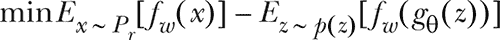

在这个方程式中，从高层次来看，我们试图最小化真实分布的期望值与生成分布的期望值之间的距离。引入 WGAN 的论文本身很复杂，但要点是 *f[w]* 是一个满足技术约束的函数。


##### 注意

技术约束 *f[w]* 满足的是 1 – Lipschitz：对于所有 *x*1, *x*2：| *f*(*x*1) – *f*(*x*2) | ≤ | *x*1 – *x*2 |。


发生器试图解决的问题与之前的问题类似，但让我们更详细地探讨一下：

1.  我们从真实分布 (*x* ~ *P[r]*) 或生成的分布 *x** (*g*θ，其中 *z* ~ *p*(*z*)) 中抽取 *x*。

1.  生成的样本是从 *z*（潜在空间）中抽取的，然后通过 *g*[θ] 转换得到相同空间中的样本 (*x**)，然后使用 *f[w]* 进行评估。

1.  我们试图最小化我们的损失函数——在这种情况下是距离函数——地球迁移距离。实际的数字是通过地球迁移距离计算的，我们将在后面解释。

该设置也很棒，因为我们有一个更易于理解的损失函数（例如，没有对数）。我们还有更多可调的训练，因为在 WGAN 设置中，我们必须设置一个裁剪常数，它在标准机器学习中的作用类似于学习率。这为我们提供了一个额外的可调参数，但这也可能是一把双刃剑，如果你的 GAN 架构最终对它非常敏感。但不过多涉及数学，WGAN 有两个实际的影响：

+   我们现在有更清晰的停止标准，因为这篇论文已经通过后来的论文得到了验证，这些论文显示了判别器损失与感知质量之间的相关性。我们可以简单地测量 Wasserstein 距离，这有助于我们决定何时停止。

+   我们现在可以训练 WGAN 直到收敛。这很重要，因为元审查论文^([15])表明，使用 JS 损失和生成器在真实分布中的发散性作为训练进度的衡量标准往往是没有意义的.^([16])用人类的语言来说，有时在棋类游戏中，你需要输掉几轮，因此暂时做得更差，以便在几轮迭代中学习，并最终做得更好。

    > ¹⁵
    > 
    > *元审查*只是对评论的评论。它帮助研究人员从多篇文章中汇总发现。
    > 
    > ¹⁶
    > 
    > 请参阅威廉·费杜斯等人于 2018 年发表的论文“Many Paths to Equilibrium: GANs Do Not Need to Decrease a Divergence at Every Step”，[`openreview.net/forum?id=ByQpn1ZA`](https://openreview.net/forum?id=ByQpn1ZA)。

这可能听起来像魔法。但这部分是因为 WGAN 使用了一种与迄今为止你遇到的所有东西都不同的距离度量。它被称为*地球迁移距离*或*Wasserstein 距离*，其背后的想法很巧妙。我们这次会善待你，不会用更多的数学来折磨你，但让我们谈谈这个想法。

你隐含地理解有两个非常高维的分布：一个是真实数据生成的一个（我们从未完全看到），另一个是生成器（伪造的）的样本。想想即使是 32 × 32 RGB (*x3* × 256 像素值)图像的样本空间有多么庞大。现在想象这两个分布的所有概率质量都只是两座山。第十章更详细地回顾了这一点。为了参考，我们包括了图 5.7，但它主要基于第二章中的相同思想。

##### 图 5.7. 图(a)应该来自第二章。为了增加清晰度，我们在数据图(b)中提供了高斯分布的另一种视图，这些数据来自相同的分布，但只显示了顶部第一个分布的垂直切片和右侧第二个分布的垂直切片。图(a)然后是这些数据的概率密度抽象，其中 z 轴表示该点被采样的概率。现在，尽管其中一个是另一个的抽象，你将如何比较这两个？你将如何确保它们在我们告诉你时是一样的时候？如果这个分布有 3,072 个可能的维度呢？在这个例子中，我们只有两个！我们正在构建如何比较看起来像(b)中的沙堆分布的方法，但记住，随着我们的分布变得更加复杂，正确匹配同类事物也变得更加困难。


想象一下，你需要把代表概率质量的全部地面从虚假分布中移除，使得分布看起来完全像真实分布，或者至少像我们所看到的那样。这就像你的邻居有一个超级酷的沙堡，而你有很多沙子，试图建造一个完全相同的沙堡。要移动所有这些质量到恰到好处的地方需要多少工作量？嘿，没关系，我们都有过这样的经历；有时候你只是希望你的沙堡能更酷一些，更有光泽一些。

使用 Wasserstein 距离的近似版本，我们可以评估我们生成看起来像来自真实分布的样本有多接近。为什么是*近似*？好吧，一方面是因为我们从未见过真实的数据分布，所以很难评估确切的地球移动距离。

最后，你需要知道的是，地球移动距离比 JS 或 KL 具有更好的性质，并且已经有重要的贡献建立在 WGAN 之上，以及验证了其通常优越的性能。^([17)] 尽管在某些情况下，WGAN 并不完全优于其他所有方法，但它通常在每种情况下至少和它们一样好（尽管应该注意的是，有些人可能不同意这种解释）。^([18)]

> ^(17)
> 
> 参见 Ishaan Gulrajani 等人于 2017 年发表的“Improved Training of Wasserstein GANs”，[`arxiv.org/abs/1704.00028`](http://arxiv.org/abs/1704.00028)。
> 
> ^(18)
> 
> 参见 Lucic 等人于 2017 年发表的论文，[`arxiv.org/abs/1711.10337`](http://arxiv.org/abs/1711.10337)。

总体来说，WGAN（或者梯度惩罚版本，*WGAN-GP*）被广泛使用，并已成为 GAN 研究与实践中的事实标准——尽管 NS-GAN 在不久的将来也不应该被忘记。当你看到一篇新论文，其中没有将 WGAN 作为比较的基准之一，并且没有很好地解释为什么不包括它时——要小心！

### 5.3. 游戏设置总结

我们已经介绍了 GAN 设置的三个核心版本：min-max、非饱和和水波斯坦。每个论文的开头都会提到这些版本之一，现在您至少会知道该论文是否使用原始公式，这种公式更易于解释但在实践中效果不佳；或者非饱和版本，它失去了许多数学保证但效果更好；或者较新的水波斯坦版本，它既有理论基础又具有优越的性能。

作为一份便捷指南，表 5.1 列出了我们在本书中使用的 NS-GAN、WGAN 以及甚至改进的 WGAN-GP 公式。这里列出是为了让您有一个相关版本的地方——抱歉，MM-GAN。我们包括 WGAN-GP 是为了完整性，因为这三个是学术界和工业界的首选。

##### 表 5.1\. 损失函数总结^([a])

> ^a
> 
> 来源：“TensorFlow 中生成模型的集合”，作者 Hwalsuk Lee，[`mng.bz/Xgv6`](http://mng.bz/Xgv6)。

| 名称 | 值函数 | 备注 |
| --- | --- | --- |
| NS-GAN | L*[D]^(NS)* = *E*[log(*D*(*x*))] + *E*[log(1 – *D*(*G*(*z*)))] *L[G]^(NS)* = *E*[log(*D*(*G*(*z*)))] | 这是一种原始的公式之一。通常不再实际使用，除了作为基础块或比较。这与您所看到的 NS-GAN 等效，只是没有常数。但这些都是有效等价的。^([[b])] |
| WGAN | *L[D]^(WGAN)* = *E*[*D*(*x*)] – *E*[*D*(*G*(*z*)))] *L[G]^(WGAN)* = *E*[*D*(*G*(*z*)))] | 这是一种损失简化后的 WGAN。这似乎正在为 GAN 创造一个新的范式。我们之前在 方程 5.5 中更详细地解释了此方程。 |
| WGAN-GP^([c]) (梯度惩罚) | *L[D]^(W – GP)* = *E*[*D*(*x*)] – *E*[*D(G*(*z*)))] + GPterm *L[G]^(W – GP)* = *E*[*D(G*(*z*)))] | 这是一种带有梯度惩罚 (GP) 的 GAN 示例。WGAN-GP 通常显示出最佳结果。我们没有在本章中详细讨论 WGAN-GP；我们将其包括在这里是为了完整性。 |

> ^b
> 
> 我们倾向于在书面代码中使用常数，在论文中使用更简洁的数学公式。
> 
> ^c
> 
> 这是一种带有梯度惩罚的 WGAN 版本，在新的学术论文中常用。参见 Gulrajani 等人，2017 年，[`arxiv.org/abs/1704.00028`](http://arxiv.org/abs/1704.00028)。

### 5.4\. 训练技巧

我们现在正从稳固的学术成果转向学术界或从业者刚刚“想出来”的领域。这些仅仅是技巧，通常您只需要尝试一下，看看它们是否适用于您。本节中的列表受到了 Soumith Chintala 2016 年帖子“如何训练一个 GAN：使 GAN 工作的技巧和窍门”([`github.com/soumith/ganhacks`](https://github.com/soumith/ganhacks))的启发，但自那时以来有些事情已经改变了。

变化的一个例子是一些架构建议，例如深度卷积生成对抗网络（DCGAN）是所有事物的基线。目前，大多数人从 WGAN 开始；未来，自注意力生成对抗网络（SAGAN 在第十二章中有所涉及）可能会成为焦点。此外，一些事情仍然是真实的，我们将它们视为普遍接受的，例如使用 Adam 优化器而不是传统的随机梯度下降.^([19]) 我们鼓励您查看该列表，因为它的创建是 GAN 历史上的一个形成性时刻。

> ¹⁹
> 
> 为什么 Adam 比传统的随机梯度下降（SGD）更好？因为 Adam 是 SGD 的一个扩展，在实践中往往表现得更好。Adam 将几个训练技巧与 SGD 结合成一个易于使用的包。

#### 5.4.1. 输入归一化

根据几乎每个机器学习资源，包括 Chintala 的列表，将图像归一化到-1 和 1 之间仍然是通常的好主意。我们通常归一化是因为计算更容易处理，就像机器学习的其他部分一样。考虑到对输入的限制，使用例如*tanh*激活函数来限制生成器的最终输出是一个好主意。

#### 5.4.2. 批标准化

批标准化在第四章中进行了详细讨论。我们将其包括在这里以示完整性。关于我们对批标准化的看法如何改变：最初，批标通常被认为是一个非常成功的技巧，但最近研究表明它*有时*会得到不良的结果，尤其是在生成器.^([20]) 相反，在判别器中，结果几乎普遍是积极的.^([21])

> ²⁰
> 
> 参见 Gulrajani 等人于 2017 年发表的《批标准化》，[`arxiv.org/abs/1704.00028`](http://arxiv.org/abs/1704.00028)。
> 
> ²¹
> 
> 参见 Soumith Chintala 于 2017 年发表的《生成对抗网络教程——GAN 在野外的应用》，[`www.youtube.com/watch?v=Qc1F3-Rblbw`](https://www.youtube.com/watch?v=Qc1F3-Rblbw)。

#### 5.4.3. 梯度惩罚

这个训练技巧建立在 Chintala 列表中的第 10 点之上，其直觉是如果梯度的范数太高，那么可能有问题。即使今天，像 BigGAN 这样的网络在这个领域也在进行创新，正如我们在第十二章中提到的.^([22])

> ²²
> 
> 参见 Andrew Brock 等人于 2019 年发表的《大规模 GAN 训练用于高保真自然图像合成》，[`arxiv.org/pdf/1809.11096.pdf`](https://arxiv.org/pdf/1809.11096.pdf)。

然而，技术问题仍然存在：简单的加权裁剪可以产生深度学习中常见的消失或爆炸梯度。^([[23)] 我们可以限制判别器输出相对于其输入的梯度范数。换句话说，如果你稍微改变你的输入，你的更新权重不应该改变太多。深度学习充满了这样的魔法。这在 WGAN 设置中尤为重要，但也可以应用于其他地方。^([[24)] 通常，这种技巧以某种形式被许多论文使用。^([[25)]

> ²³
> 
> 参见 Gulrajani 等人于 2017 年发表的论文，[`arxiv.org/abs/1704.00028`](http://arxiv.org/abs/1704.00028)。
> 
> ²⁴
> 
> 尽管在这里作者将判别器称为批评者，借鉴了强化学习，因为那篇论文的大部分灵感都来自它。
> 
> ²⁵
> 
> 参见 Xudong Mao 等人于 2016 年发表的“Least Squares Generative Adversarial Networks”，[`arxiv.org/abs/1611.04076`](http://arxiv.org/abs/1611.04076)。另见 David Berthelot 等人于 2017 年发表的“BEGAN: Boundary Equilibrium Generative Adversarial Networks”，[`arxiv.org/abs/1703.10717`](http://arxiv.org/abs/1703.10717)。

在这里，我们可以简单地使用你最喜欢的深度学习框架的原生实现来惩罚梯度，而不用关注我们描述之外的实现细节。最近，顶级研究人员（包括一位优秀的同行）已经发表了更智能的方法，并在 ICML 2018 上进行了展示，但它们的广泛学术接受度尚未得到证明。^([[26)] 许多工作正在进行中，以使 GANs 更加稳定——例如 Jacobian clamping，这也在任何元研究中尚未得到再现——因此我们需要等待并看看哪些方法会成功。

> ²⁶
> 
> 参见 Odena 等人于 2018 年发表的论文，[`arxiv.org/abs/1802.08768`](http://arxiv.org/abs/1802.08768)。

#### 5.4.4\. 更多地训练判别器

训练判别器更多是一种最近取得很大成功的方法。在 Chintala 的原始列表中，这被标记为不确定，所以请谨慎使用。有两种主要方法：

+   在生成器有机会产生任何东西之前先预训练判别器。

+   每个训练周期中为判别器提供更多的更新。一个常见的比例是每生成器更新一次，判别器更新五次。

深度学习研究员和教师 Jeremy Howard 的话说，这是因为它是“盲人领盲人”。你需要最初和持续地注入有关真实世界数据外观的信息。

#### 5.4.5\. 避免稀疏梯度

直观上，稀疏梯度（如 ReLU 或 MaxPool 产生的）会使训练更困难。这是因为以下原因：

+   直觉，尤其是平均池化背后的直觉，可能会让人困惑，但可以这样想：如果我们采用标准的最大池化，我们将丢失整个卷积感受野中除了最大值之外的所有值，这使得使用转置卷积（在 DCGAN 的情况下）来恢复信息变得更加困难。使用平均池化，我们至少对平均值有一个概念。这仍然不是完美的——我们仍然在丢失信息——但至少比之前少，因为平均值比简单的最大值更能代表。

+   另一个问题是我们使用，比如说，常规的修正线性单元（ReLU）激活时可能会出现的信息损失。看待这个问题的方法之一是考虑在应用这个操作时丢失了多少信息，因为我们可能以后需要恢复它。回想一下，ReLU(*x*) 简单地是 max(*0,x*)，这意味着对于所有负值，所有这些信息都将永远丢失。如果我们确保从负区域传递信息，并表明这些信息是不同的，我们就可以保留所有这些信息。

正如我们所建议的，幸运的是，对于这两个问题都存在一个简单的解决方案：我们可以使用 Leaky ReLU——对于负 *x*，它类似于 0.1 × *x*，而对于至少为 0 的 *x*，则是 1 × *x*——以及平均池化来绕过许多这些问题。其他激活函数也存在（例如 *sigmoid*、ELU 和 *tanh*），但人们通常最常使用 Leaky ReLU。

| |
| --- |

##### 备注

Leaky ReLU 可以是任何实数，通常情况下，0 < *x* < 1。

| |
| --- |

总体来说，我们试图最小化信息损失，并使信息流尽可能合理，而无需要求 GAN 以某种奇怪的方式反向传播错误，同时它还要学习映射。

#### 5.4.6. 软标签和噪声标签

研究者们采用多种方法来对标签添加噪声或进行平滑处理。伊恩·古德费洛（Ian Goodfellow）倾向于推荐单侧标签平滑（例如，使用 0 和 0.9 作为二进制标签），但通常来说，在添加噪声或裁剪方面进行尝试似乎是个不错的想法。

### 摘要

+   你已经学会了为什么评估对于生成模型来说是一个如此困难的话题，以及我们如何通过明确的停止标准来训练一个良好的 GAN。

+   不同的评估技术超越了分布的简单统计评估，为我们提供了与视觉样本质量相关的一些更有用的信息。

+   训练在三种设置中进行：博弈论的最小-最大 GAN、启发式动机的非饱和 GAN 以及最新且理论基础良好的 Wasserstein-GAN。

+   以下是一些允许我们更快训练的训练技巧：

    +   正则化输入，这在机器学习中是标准的

    +   使用梯度惩罚，这为我们提供了在训练中的更多稳定性

    +   帮助预热判别器，最终为我们提供一个好的生成器，因为这样做为生成的样本设定了一个更高的标准

    +   避免稀疏梯度，因为它们会丢失太多信息

    +   在软标签和噪声标签上玩弄，而不是典型的二分类

## 第六章\. 与 GAN 一起进步

*本章涵盖*

+   在训练过程中逐步增长判别器和生成器网络

+   使训练更加稳定，输出更加多样化、质量更高和分辨率更高

+   使用 TFHub，一个用于模型和 TensorFlow 代码的新中央仓库

在本章中，我们提供了一个使用 TensorFlow 和最新发布的 TensorFlow Hub（TFHub）构建 Progressive GAN 的实战教程。*Progressive GAN*（也称为*PGGAN*或*ProGAN*）是一种前沿技术，它成功地生成了全高清逼真图像。在 2018 年举办的顶级机器学习会议——国际学习表示会议（ICLR）上展出，这项技术引起了巨大的轰动，谷歌立即将其集成为数不多的 TensorFlow Hub 模型之一。事实上，这项技术受到了深度学习之父之一 Yoshua Bengio 的高度赞扬，称其为“几乎太好了以至于不真实。”发布后，它立即成为学术演示和实验项目的热门选择。

我们建议你使用 TensorFlow 1.7 或更高版本阅读本章，但写作时最新的发布版本是 1.8+，所以我们使用了这个版本。对于 TensorFlow Hub，我们建议使用不超过 0.4.0 的版本，因为后续版本由于与 TensorFlow 1.x 的兼容性问题而难以导入。阅读本章后，你将能够实现 Progressive GAN 的所有关键改进。这四个创新如下：

+   在更高分辨率的层中逐步增长和平滑衰减

+   小批量标准差

+   等化学习率

+   像素级特征归一化

本章包含两个主要示例：

+   Progressive GANs 的关键创新代码——更具体地说，是平滑渐变的高分辨率层以及其他三个之前列出的创新。Progressive GAN 技术的其余实现内容过于庞大，无法包含在这本书中。

+   Google 在 TFHub 上提供的预训练、易于下载的实现，TFHub 是一个新的机器学习模型集中仓库，类似于软件包世界的 Docker Hub 或 Conda 和 PyPI 仓库。这个实现将使我们能够进行潜在空间插值，以控制生成的示例的特征。它将简要介绍生成器潜在空间中的种子向量，以便我们可以得到我们想要的图片。你可以在第二章和第四章中看到这个想法。

我们决定使用 TFHub 实现 PGGAN 而不是像其他章节那样从头开始实现的原因有三：

+   尤其对于实践者来说，我们想确保你至少在一个章节中接触到可能加快你工作流程的软件工程最佳实践。想要尝试快速 GAN 来解决你的问题吗？只需使用 TFHub 上的实现之一。现在比我们最初写这一章时多了很多，包括许多参考实现（例如，第十二章中的 BigGAN 和第五章中的 NS-GAN）。我们想让你接触到易于使用、最前沿的例子，因为这就是机器学习的趋势——尽可能自动化机器学习，这样我们就可以专注于最重要的事情：产生影响力。谷歌的 Cloud AutoML([`cloud.google.com/automl/`](https://cloud.google.com/automl/))和亚马逊的 SageMaker([`aws.amazon.com/sagemaker/`](https://aws.amazon.com/sagemaker/))是这个趋势的典型例子。甚至 Facebook 最近也推出了 PyTorch Hub，因此现在两个主要框架都拥有这样的资源。

+   PGGAN 的原始实现需要 NVIDIA 研究人员*一到两个月*的时间来运行，我们认为这对于任何个人来说都是不切实际的，尤其是如果你想要实验或出错的话。1 TFHub 仍然提供了一个完全可训练的 PGGAN，所以如果你想将计算时间用于其他目的，你可以这样做！

    > ¹
    > 
    > 参见 Tero Karras 于 2018 年发表的“Progressive Growing of GANs for Improved Quality, Stability, and Variation”，[`github.com/tkarras/progressive_growing_of_gans`](https://github.com/tkarras/progressive_growing_of_gans)。

+   我们仍然想向你展示 PGGANs 最重要的创新。但如果我们想要很好地解释这些——包括代码——即使是在 Keras 中，我们也无法将所有实现细节都放入一个章节中，因为所有的实现都相当庞大。TFHub 允许我们跳过样板代码，专注于重要的想法。

### 6.1\. 潜空间插值

回想一下第二章，我们有一个这个低分辨率空间——称为*潜空间*——它是我们输出的种子。与第四章中的 DCGAN 以及渐进式 GAN 一样，最初训练的潜空间具有语义上有意义的属性。这意味着我们可以找到一些向量偏移量，例如，将眼镜添加到一张人脸图像中，同样的偏移量会在新的图像中添加眼镜。我们还可以选择两个随机向量，然后在它们之间以相等的增量移动，从而逐渐——平滑地——得到一个与第二个向量匹配的图像。

这被称为*插值*，你可以在图 6.1 中看到这个过程。正如 BigGAN 的作者所说，从一个向量到另一个向量的有意义过渡表明 GAN 已经学习了一些底层结构。

##### 图 6.1。我们可以执行潜在空间插值，因为发送给生成器的潜在向量会产生一致的结果，这些结果在某些方面是可预测的；不仅生成过程是可预测的，而且输出也不是锯齿状的——或者对小的变化反应剧烈——考虑到潜在向量的变化。例如，如果我们想要一张融合两个面孔的图像，我们只需要在两个向量的平均值附近搜索。

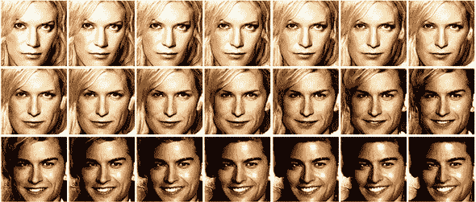

### 6.2. 他们成长得如此之快

在前面的章节中，你学习了使用 GAN 容易实现哪些结果以及哪些结果难以实现。此外，像*模式坍塌*（只显示总体分布的几个示例）和*收敛性不足*（导致结果质量不佳的原因之一）这样的术语对我们来说已经不再陌生了。

最近，一个芬兰的 NVIDIA 团队发布了一篇论文，成功地超越了之前许多前沿的论文：“用于提高质量、稳定性和多样性的 GAN 的渐进式增长”，由 Tero Karras 等人撰写。这篇论文有四个基本创新，所以让我们按顺序逐一介绍。

#### 6.2.1. 高分辨率层的渐进式增长和平滑

在我们深入探讨渐进式生成对抗网络（GAN）的功能之前，让我们从一个简单的类比开始。想象一下从鸟瞰的角度观察一个山区：你看到许多山谷，那里有美丽的溪流和村庄——通常非常适合居住。然后，你还有许多山顶，由于天气条件，它们崎岖不平，通常不适宜居住。这类似于损失函数的地形，我们希望通过沿着山坡向下进入山谷来最小化损失，因为这些山谷要美好得多。

我们可以想象训练就像将登山者随机地投入到这个山区的一个地方，然后跟随他们沿着山坡进入山谷的路径。这就是*随机梯度下降*所做的事情，第十章更详细地回顾了这一点。现在，不幸的是，如果我们从一个非常复杂的山脉开始，登山者将不知道该走哪个方向。我们冒险者周围的空间将是锯齿状和崎岖的。很难辨认出哪个最宜居住、最低的山谷。相反，我们放大视野，降低山脉的复杂性，给登山者一个这个特定区域的总体印象。

当我们的登山者接近山谷时，我们可以通过放大地形来开始增加复杂性。然后，我们不再只看到粗糙/像素化的纹理，而是可以看到更细致的细节。这种方法的优点是，随着登山者沿着山坡下行，他们可以轻松地进行一些小的优化，使徒步旅行更加容易。例如，他们可以穿过一条干涸的溪流，使山谷的下降更加迅速。这就是*渐进式增长*：随着我们的前进，提高地形的分辨率。

然而，如果你曾经玩过开放世界的电脑游戏，或者用 3D 模式快速滚动过 Google Earth，你就会知道快速提高你周围地形的分辨率可能会令人震惊且不愉快。物体突然出现。因此，我们逐渐平滑地引入，并随着登山者接近目标而缓慢地引入更多复杂性。

从技术角度讲，随着训练的进行，我们从几个低分辨率的卷积层转向许多高分辨率的层。因此，我们首先训练早期层，然后才引入一个更高分辨率的层，在那里导航损失空间更困难。我们从简单的东西开始——例如，训练了几个步骤的 4 × 4——到更复杂的东西——例如，训练了几个时期的 1024 × 1024，如图 6.2 所示。图 6.2。

##### 图 6.2。你能看到我们是怎样从一个平滑的山脉开始，并通过放大来逐渐增加复杂度吗？这正是额外层对损失函数所做的。这很有用，因为我们的山脉区域（损失函数）在变得不那么尖锐时更容易导航。你可以这样想：当我们有一个更复杂的结构（b）时，损失函数是尖锐的，难以导航（d），因为有很多参数——尤其是在早期层——可以产生巨大影响，通常会增加问题的维度。然而，如果我们最初移除一些复杂性（a），我们就可以在早期得到一个更容易导航的损失函数（c），并且只有在我们对损失空间的近似正确部分有信心时，复杂性才会增加。只有在这种情况下，我们才从（a）和（c）版本移动到（b）和（d）版本。

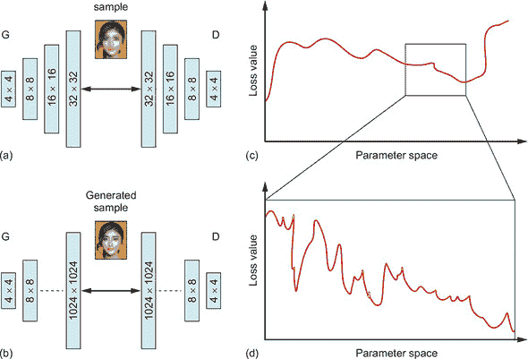

在这种情况下的问题是，每次引入一个额外的层（例如，从 4 × 4 到 8 × 8），我们仍然在训练中引入了巨大的冲击。PGGAN 的作者所做的相反，是在图 6.3 中平滑地引入这些层，以便给系统时间来适应更高的分辨率。

##### 图 6.3。当我们用 16 × 16 分辨率（a）等训练足够步骤后，我们在生成器（G）中引入另一个转置卷积，在判别器（D）中引入另一个卷积，以获得 G 和 D 之间的“接口”为 32 × 32。但我们还引入了两个路径：（1 – α）简单的最近邻上采样，它没有训练参数，但也很天真；（α）额外的转置卷积，需要训练但最终会表现得更好。

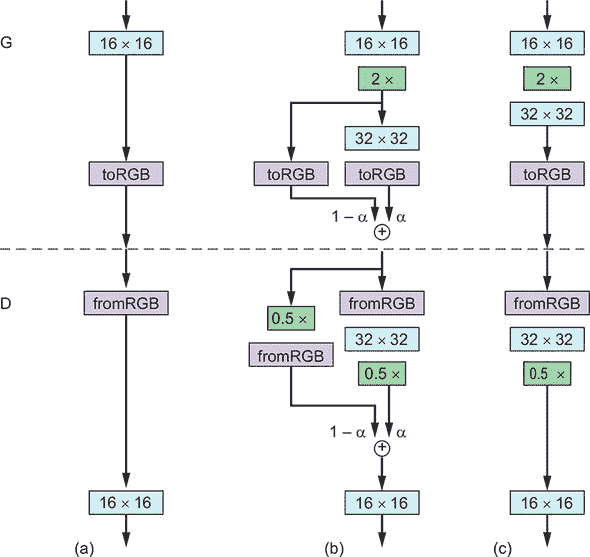

然而，我们并没有立即跳到这个分辨率，而是通过参数 alpha（α）平滑地引入这个更高分辨率的新的层，alpha 的值在 0 和 1 之间。Alpha 影响我们使用多少旧层（但已放大）或原生更大的层。在 D 的方面，我们简单地缩小 0.5*x*，以便平滑地注入用于判别的训练层。这是图 6.3 中的(b)。当我们对这一新层有信心时，我们保留 32 × 32——图中的(c)，然后在我们正确训练了 32 × 32 之后，我们准备再次生长。

#### 6.2.2\. 示例实现

对于我们详细描述的所有创新，在本节中我们将提供工作但独立的版本，这样我们就可以讨论代码。作为一个练习，你可能想尝试将这些内容实现为一个 GAN 网络，也许使用现有的先验架构。如果你准备好了，让我们加载我们那可靠的、值得信赖的机器学习库，并开始工作：

```
import tensorflow as tf
import keras as K
```

在代码中，渐进式平滑可能看起来像以下列表。

##### 列表 6.1\. 渐进式生长和平滑上采样

```
def upscale_layer(layer, upscale_factor):
    '''
    Upscales layer (tensor) by the factor (int) where
    the tensor is [group, height, width, channels]
    '''
    height = layer.get_shape()[1]
    width = layer.get_shape()[2]
    size = (upscale_factor * height, upscale_factor * width)
    upscaled_layer = tf.image.resize_nearest_neighbor(layer, size)
    return upscaled_layer

def smoothly_merge_last_layer(list_of_layers, alpha):
    '''
    Smoothly merges in a layer based on a threshold value alpha.
    This function assumes: that all layers are already in RGB.
    This is the function for the Generator.
    :list_of_layers    :   items should be tensors ordered by resolution
    :alpha             :    float \in (0,1)
    '''
    last_fully_trained_layer = list_of_layers[-2]                            ***1***
    last_layer_upscaled = upscale_layer(last_fully_trained_layer, 2)         ***2***

    larger_native_layer = list_of_layers[-1]                                 ***3***

    assert larger_native_layer.get_shape() == last_layer_upscaled.get_shape()***4***

    new_layer = (1-alpha) * upscaled_layer + larger_native_layer * alpha     ***5***

    return new_layer
```

+   ***1* 提示！如果你使用的是纯 TensorFlow 而不是 Keras，始终要记住作用域。**

+   ***2* 现在我们有了最初训练的层。**

+   ***3* 新增的层尚未完全训练**

+   ***4* 这确保我们可以运行合并代码。**

+   ***5* 此代码块应充分利用广播功能。**

现在你已经理解了渐进式生长和平滑的底层细节，且没有不必要的复杂性，希望你能欣赏这一想法的普适性。尽管 Karras 等人并非第一个在训练过程中想出某种方法来增加模型复杂性的，但这似乎是最有希望的途径，并且确实是反响最强烈的创新。截至 2019 年 6 月，这篇论文已被引用超过 730 次。考虑到这个背景，让我们继续探讨第二个重大创新。

#### 6.2.3\. 小批量标准差

Karras 等人在其论文中引入的下一个创新是*小批量标准差*。在我们深入探讨之前，让我们从第五章回顾一下模式坍塌的问题，这是当 GAN 学习如何创建几个好的示例或仅对其做轻微排列时发生的。我们通常希望生成真实数据集中所有人的面孔，而不仅仅是某位女性的一个图片。

因此，Karras 等人创造了一种方法，让判别器能够判断它所获得的样本是否足够多样化。本质上，我们为判别器计算一个额外的标量统计量。这个统计量是生成器生成的或来自真实数据的迷你批处理中所有像素的标准差。这是一个非常简单且优雅的解决方案：现在判别器需要学习的只是，如果它评估的批处理图像中的标准差低，那么图像很可能是伪造的，因为真实数据具有更多的方差。2 生成器别无选择，只能增加生成样本的方差，以有机会欺骗判别器。

> ²
> 
> 有些人可能会反对，当采样的真实数据包含大量非常相似的图片时，这也可能发生。虽然从技术上讲这是正确的，但在实践中这很容易解决，记住相似度必须非常高，以至于简单的最近邻聚类就能揭示这一点。

超越直觉，技术实现很简单，因为它只应用于判别器。鉴于我们还想最小化可训练参数的数量，我们只包含一个额外的数字，这似乎已经足够。这个数字作为特征图附加——想想 *维度* 或 `tf.shape` 列表中的最后一个数字。

具体的步骤如下，并在 列表 6.2 中展示：

1.  [4D -> 3D] 我们计算批处理中所有图像的标准差，以及所有剩余的通道——高度、宽度和颜色。然后我们得到一个包含每个像素和每个通道标准差的单一图像。

1.  [3D -> 2D] 我们对所有通道的标准差进行平均——得到一个单独的特征图或标准差矩阵，针对该像素，但颜色通道已合并。

1.  [2D -> 标量/0D] 我们对前一个矩阵中所有像素的标准差进行平均，以得到一个单独的标量值。

##### 列表 6.2\. 小批量标准差

```
def minibatch_std_layer(layer, group_size=4):
    '''
    Will calculate minibatch standard deviation for a layer.
    Will do so under a prespecified tf-scope with Keras.
    Assumes layer is a float32 data type. Else needs validation/casting.
    NOTE: there is a more efficient way to do this in Keras, but just for
    clarity and alignment with major implementations (for understanding)
    this was done more explicitly. Try this as an exercise.
    '''
    group_size = K.backend.minimum(group_size, tf.shape(layer)[0])         ***1***

    shape = list(K.int_shape(input))                                       ***2***
    shape[0] = tf.shape(input)[0]

    minibatch = K.backend.reshape(layer,
        (group_size, -1, shape[1], shape[2], shape[3]))                    ***3***
    minibatch -= tf.reduce_mean(minibatch, axis=0, keepdims=True)          ***4***
    minibatch = tf.reduce_mean(K.backend.square(minibatch), axis = 0)      ***5***
    minibatch = K.backend.square(minibatch + 1e8)                          ***6***
    minibatch = tf.reduce_mean(minibatch, axis=[1,2,4], keepdims=True)     ***7***
    minibatch = K.backend.tile(minibatch,
        [group_size, 1, shape[2], shape[3]])                               ***8***
return K.backend.concatenate([layer, minibatch], axis=1)                   ***9***
```

+   ***1* 提示！如果你使用的是纯 TensorFlow 而不是 Keras，请始终记住作用域。小批量组必须能被 group_size 整除（或 <=）。**

+   ***2* 仅获取一些形状信息，以便我们可以将其用作缩写，并确保默认值。我们从 tf.shape 获取输入，因为“前图像”维度在图执行之前通常被转换为 None。**

+   ***3* 重新塑形，以便我们在小批量级别上进行操作。在这段代码中，我们假设层为 [组 (G), 小批量 (M), 宽度 (W), 高度 (H), 通道 (C)]，但请注意：不同的实现使用 Theano 特定的顺序。**

+   ***4* 在组 [M,W,H,C] 上对均值进行中心化**

+   ***5* 计算组 [M,W,H,C] 的方差**

+   ***6* 计算组 [M,W,H,C] 的标准差**

+   ***7* 对特征图和像素 [M,1,1,1] 取平均值**

+   ***8* 将标量值转换为适合组和像素**

+   ***9* 作为新的特征图添加**

#### 6.2.4\. 均衡学习率

*均衡学习率*是那些深度学习暗黑艺术技巧之一，可能对任何人来说都不太清楚。尽管研究人员在 PGGAN 论文中提供了一个简短的解释，但他们避免了口头报告中的这个话题，这表明这可能是似乎有效的一个技巧。在深度学习中，这种情况经常发生。

此外，关于均衡学习率（equalized learning rate）的许多细微之处需要你对 RMSProp 或 Adam（所使用的优化器）的实现以及权重初始化有一个扎实的理解。所以，如果你觉得这不太明白，请不要担心，因为这可能对任何人来说都不太明白。

但如果你好奇，解释是这样的：我们需要确保所有权重（*w*）都通过一个常数*c*进行归一化（*w’*），使其在某个范围内，即*w’ = w/c*，这个常数*c*对于每一层都是不同的，取决于权重矩阵的形状。这也确保了如果任何参数需要采取更大的步骤以达到最优——因为它们倾向于变化更多——这些相关的参数可以做到这一点。

Karras 等人使用简单的标准正态初始化，然后在运行时按层缩放权重。有些人可能认为 Adam 已经做到了这一点——是的，Adam 允许不同参数有不同的学习率，但有一个问题。Adam 通过参数估计的标准差调整反向传播的梯度，这确保了该参数的尺度与更新无关。Adam 在不同方向上有不同的学习率，但并不总是考虑到*动态范围*——即维度或特征在给定的小批量中变化的程度。正如有些人指出的，这似乎解决了与权重初始化相似的问题。^([3)]

> ³
> 
> 请参阅 Alexander Jung 于 2017 年撰写的“Progressive Growing of GANs.md”，[`mng.bz/5A4B`](http://mng.bz/5A4B)。

然而，如果这还不清楚，请不要担心；我们强烈推荐两个优秀的资源：Andrew Karpathy 于 2016 年的计算机科学讲座笔记，关于权重初始化^([4)]，以及一篇 Distill 文章，详细介绍了 Adam 的工作原理^([5)]。以下列表显示了均衡学习率。

> ⁴
> 
> 请参阅 Fei-Fei Li 等人于 2016 年撰写的“Lecture 5: Training Neural Networks, Part I”，[`mng.bz/6wOo`](http://mng.bz/6wOo)。
> 
> ⁵
> 
> 请参阅 Gabriel Goh 于 2017 年撰写的 Distill 文章“Why Momentum Really Works”，[`distill.pub/2017/momentum/`](https://distill.pub/2017/momentum/)。

##### 列表 6.3\. 均衡学习率

```
def equalize_learning_rate(shape, gain, fan_in=None):
    '''
    This adjusts the weights of every layer by the constant from
    He's initializer so that we adjust for the variance in the dynamic
    range in different features
    shape   :  shape of tensor (layer): these are the dimensions
        of each layer.
    For example, [4,4,48,3]. In this case, [kernel_size, kernel_size,
        number_of_filters, feature_maps]. But this will depend
        slightly on your implementation.
    gain    :  typically sqrt(2)
    fan_in  :  adjustment for the number of incoming connections
        as per Xavier's / He's initialization
    '''
    if fan_in is None: fan_in = np.prod(shape[:-1])             ***1***
    std = gain / K.sqrt(fan_in)                                 ***2***
    wscale = K.constant(std, name='wscale', dtype=np.float32)   ***3***
    adjusted_weights = K.get_value('layer', shape=shape,        ***4***
        initializer=tf.initializers.random_normal()) * wscale
    return adjusted_weights
```

+   ***1* 默认值是所有形状维度乘积减去特征图维度；这给出了每个神经元输入连接的数量。**

+   ***2* 这使用 He 的初始化常数。^([6)]

    > ⁶
    > 
    > 参见 Kaiming He 等人撰写的“Delving Deep into Rectifiers: Surpassing Human-Level Performance on ImageNet Classification”，[`arxiv.org/pdf/1502.01852.pdf`](https://arxiv.org/pdf/1502.01852.pdf).

+   ***3** 将调整创建为一个常数**

+   ***4** 获取权重值并使用广播来应用调整*

如果您仍然感到困惑，请放心，这些初始化技巧和这些复杂的学习率调整在学术界或工业界很少成为区分点。此外，尽管限制权重值在-1 和 1 之间似乎在大多数重跑中效果较好，但这并不意味着这个技巧可以推广到其他设置。那么，让我们转向更经证明的技术。

#### 6.2.5\. 生成器中的像素级特征归一化

让我们从为什么要对特征进行归一化的动机开始——训练的稳定性。经验上，NVIDIA 的作者发现，训练发散的早期迹象之一是特征幅度的爆炸。BigGAN 作者在第十二章中也做出了类似的观察。因此，Karras 等人引入了一种对抗这种问题的技术。更广泛地说，这就是 GAN 训练通常是如何进行的：我们观察到训练中存在特定问题，然后我们引入机制来防止该问题发生。

注意，大多数网络都使用某种形式的归一化。通常，它们使用批量归一化或这种技术的虚拟版本。表 6.1 展示了本书中迄今为止所展示的 GAN 中使用的归一化技术的概述。您在第四章（DCGAN）和第五章中看到了这些——在那里我们提到了其他 GAN 和梯度惩罚（GPs）。不幸的是，为了使批量归一化和其虚拟等效版本能够工作，我们必须有大的迷你批量，以便单个样本的平均值相互抵消。

##### 表 6.1\. GAN 中使用归一化技术

| 方法 | 作者 | G 归一化 | D 归一化 |
| --- | --- | --- | --- |
| DCGAN | (Radford et al., 2015, [`arxiv.org/abs/1511.06434`](https://arxiv.org/abs/1511.06434)) | 批量 | 批量 |
| 改进的 GAN | (Salimans et al., 2016, [`arxiv.org/pdf/1606.03498.pdf`](https://arxiv.org/pdf/1606.03498.pdf)) | 虚拟批量 | 虚拟批量 |
| WGAN | (Arjovsky et al., 2017, [`arxiv.org/pdf/1701.07875.pdf`](https://arxiv.org/pdf/1701.07875.pdf)) | — | 批量 |
| WGAN-GP | (Gulrajani et al., 2017, [`arxiv.org/abs/1704.00028`](http://arxiv.org/abs/1704.00028)) | 批量 | 层归一化 |

基于所有这些主要实现都使用归一化的事实，它显然很重要，但为什么不直接使用标准的批量归一化呢？遗憾的是，批量归一化在我们的分辨率下太占用内存。我们必须想出一种方法，允许我们使用少量示例——这些示例可以适应我们的 GPU 内存，并且有两个网络图——但仍然效果良好。现在我们理解了像素级特征归一化的需求以及为什么我们使用它。

如果我们深入算法，像素归一化会在输入被馈送到下一层之前，在每个层的激活幅度上操作。

图 6.4 说明了像素级特征归一化的过程。步骤 3 的确切描述显示在方程 6.1 中。

##### 方程 6.1.

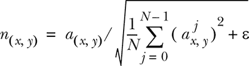

##### 图 6.4. 我们将图像中的所有点（步骤 1）映射到一组向量（步骤 2），然后对它们进行归一化，使它们都在相同的范围内（通常在多维空间中的 0 到 1 之间），这是步骤 3。

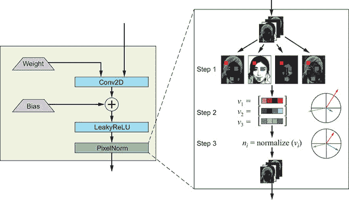


**像素级特征归一化**

*对于*每个特征图*执行*

1.  取该特征图(*fm*)在位置(*x, y*)的像素值。

1.  为每个(*x*, *y*)构建一个向量，其中

    1.  v[0,0] = [(0,0) value for *fm*[1], (0,0) value for *fm*[2], ..., (0,0) value for *fm*[n]*]

    1.  v[0,1] = [(0,1) value for *fm*[1], (0,1) value for *fm*[2], ..., (0,1) value for *fm*[n]*] ...

    1.  v[n,n] = [(*n*,*n*) value for *fm*[1], (*n*,n) value for *fm*[2], ..., (*n*,n) value for *fm*[n]*]

1.  将步骤 2 中定义的每个向量*v*[i,i]标准化为具有单位范数；称之为*n*[i,i]。

1.  将其传递到原始张量形状的下一层。

*结束 for*


该公式将图 6.4 步骤 2 中构建的每个向量进行*标准化*（除以平方根下的表达式）。这个表达式只是该特定(*x*, *y*)像素每个平方值的平均值。可能让你感到惊讶的是，添加了一个小的噪声项(ϵ)。这仅仅是一种确保我们不会除以零的方法。整个过程在 2012 年的论文“ImageNet Classification with Deep Convolutional Neural Networks”中得到了更详细的解释，作者为 Alex Krizhevsky 等人。（[`mng.bz/om4d`](http://mng.bz/om4d)）

最后要注意的是，这个术语仅应用于生成器，因为激活幅度的爆炸只会导致如果*两个*网络都参与的话，才会是一场军备竞赛。下面的列表显示了代码。

##### 列表 6.4. 像素级特征归一化

```
def pixelwise_feat_norm(inputs, **kwargs):
    '''
    Uses pixelwise feature normalization as proposed by
    Krizhevsky et at. 2012\. Returns the input normalized
    :inputs     :    Keras / TF Layers
    '''
    normalization_constant = K.backend.sqrt(K.backend.mean(
        inputs**2, axis=-1, keepdims=True) + 1.0e-8)
    return inputs / normalization_constant
```

### 6.3. 关键创新总结

我们已经探讨了四种如何改进 GAN 训练的巧妙想法；然而，如果没有基于它们对训练的影响，可能很难隔离这些影响。幸运的是，论文的作者提供了一个有用的表格，帮助我们理解这一点；参见图 6.5。

##### 图 6.5\. 各种技术对得分改进的贡献。我们可以看到，引入均衡学习率产生了重大影响，像素归一化也增加了这一点，尽管作者没有告诉我们，如果我们只有像素归一化而没有引入均衡学习率，这种技术将有多有效。我们只包括这个表格，以说明我们可以期望从这些变化中获得的粗略改进程度——这本身就是一个有趣的教训——但更详细的讨论将在后面进行。

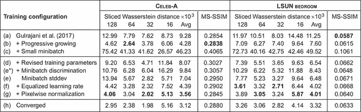

PGGAN 论文的作者正在使用*sliced Wasserstein 距离 (SWD)*，越小越好。回想一下第五章，较小的 Wasserstein 距离（也称为*地球迁移者*距离）意味着更好的结果，这是通过必须移动多少概率质量来使两个分布相似来衡量的。SWD 意味着真实数据和生成样本的块都最小化这个距离。这项技术的细微差别在论文中有解释，但正如作者在 ICLR 的演示中所说，现在存在更好的度量标准——例如 Fréchet inception 距离 (FID)。我们在第五章中更深入地介绍了 FID。

从这张表中可以得出的一个关键结论是，小批量并不奏效，因为在兆像素分辨率下，我们没有足够的虚拟 RAM 来加载许多图像到 GPU 内存中。我们必须使用更小的小批量——这可能会在总体上表现得更差——并且我们必须进一步减少小批量的大小，这使得我们的训练变得困难。

### 6.4\. TensorFlow Hub 和动手实践

谷歌最近宣布，作为 TensorFlow Extended 和将软件工程的最佳实践应用于机器学习领域的一般性举措的一部分，谷歌创建了一个中央模型和代码仓库，称为*TensorFlow Hub*，或*TFHub*。使用 TFHub 几乎可以说是易如反掌，尤其是与谷歌放置在那里的模型一起使用。

在导入 hub 模块并调用正确的 URL 后，TensorFlow 会自动下载并导入模型，然后你可以开始使用。这些模型在用于下载模型的相同 URL 上有很好的文档说明；只需将它们放入你的网络浏览器中。实际上，要获取预训练的 Progressive GAN，你只需要输入一条导入语句和一行代码。就是这样！

下面的列表显示了生成面孔的完整代码示例——基于你在`latent_vector`中指定的随机种子。图 6.6 显示了输出。

> ⁷
> 
> 此示例是使用 TFHub 生成的，基于[`mng.bz/nvEa`](http://mng.bz/nvEa)提供的 Colab 示例。

##### 列表 6.5\. 使用 TFHub 入门

```
import matplotlib.pyplot as plt
import tensorflow as tf
import tensorflow_hub as hub

with tf.Graph().as_default():
    module = hub.Module("https://tfhub.dev/google/progan-128/1")  ***1***
    latent_dim = 512                                              ***2***

    latent_vector = tf.random_normal([1, latent_dim], seed=1337)  ***3***

    interpolated_images = module(latent_vector)                   ***4***

    with tf.Session() as session:                                 ***5***
    session.run(tf.global_variables_initializer())
    image_out = session.run(interpolated_images)

plt.imshow(image_out.reshape(128,128,3))
plt.show()
```

+   ***1* 从 TFHub 导入 Progressive GAN**

+   ***2* 在运行时采样的潜在维度**

+   ***3* 改变种子以获取不同的面孔**

+   ***4* 使用模块从潜在空间生成图像。实现细节见在线资料。**

+   ***5* 运行 TensorFlow 会话并返回形状为（1,128,128,3）的图像**

##### 图 6.6\. 代码清单 6.5 的输出。尝试更改`latent_vector`定义中的种子以获取不同的输出。提醒一下：尽管这个随机种子参数应该一致地定义我们期望得到的输出，但我们发现，在重新运行时，有时会得到不同的结果，这取决于 TensorFlow 的版本。此图像使用 1.9.0-rc1 版本获得。

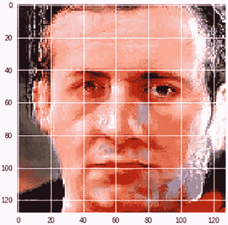

希望这足以让您开始使用渐进式 GAN！请随意尝试修改代码并扩展它。需要注意的是，TFHub 版本的渐进式 GAN 并没有使用完整的 1024 × 1024，而是仅使用 128 × 128。这可能是由于运行完整版本曾经计算成本高昂，并且在这个计算机视觉问题领域中，模型大小可以迅速变得非常大。

### 6.5\. 实际应用

可以理解的是，人们对渐进式 GAN 的实际应用和泛化能力感到好奇。我们将展示的一个很好的例子来自位于英国伦敦的 Kheiron Medical Technologies 的同事们。最近，他们发布了一篇论文，这篇论文是对 PGGAN 的泛化能力和实际应用的极好证明.^([8])

> ⁸
> 
> 请参阅 Dimitrios Korkinof 等人撰写的“使用渐进式生成对抗网络进行高分辨率乳腺钼靶合成”，2018 年，[`arxiv.org/pdf/1807.03401.pdf`](https://arxiv.org/pdf/1807.03401.pdf)。

使用大量医学乳腺钼靶数据集，^([9]) 这些研究人员成功生成了 1280 × 1024 的全场数字化乳腺钼靶（FFDM）的逼真合成图像，如图 6.7 所示。这是在两个层面上的一项了不起的成就：

> ⁹
> 
> 用于乳腺癌筛查的 X 射线扫描。

+   它展示了这项技术的泛化能力。想想钼靶图像与人类面部图像的不同——特别是在结构上。组织结构的合理性标准非常高，然而他们的网络设法产生了迄今为止最高分辨率的样本，这些样本经常能欺骗医疗专业人员。

+   它展示了这些技术可以应用于许多领域和用途。例如，我们可以在下一章中向您展示如何以半监督的方式使用这个新数据集。或者，合成数据集可以开源用于医学研究，从一般数据保护条例（GDPR）或其他法律后果的角度来看，可能担忧较少，因为这些数据不属于任何个人。

##### 图 6.7\. FFDM 的渐进式增长。这是一张很棒的图，因为它不仅展示了这些钼靶图像上分辨率逐渐提高的情况（e），还展示了部分训练统计信息（a）至（d），以表明训练这些 GAN 对于每个人来说都是混乱的，而不仅仅是您。

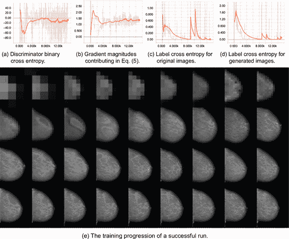

图 6.8 展示了这些乳腺 X 光片可以有多逼真。这些是随机抽取的（因此没有挑选），然后与数据集中最接近的一张图片进行了比较。

##### 图 6.8。在比较真实和生成的数据集时，数据看起来相当逼真，通常接近训练集中的示例。在其后续工作中，MammoGAN，Kheiron 已经表明这些图像可以欺骗经过培训和认证的放射科医生。^([11]) 这通常是一个好迹象，尤其是在这种高分辨率下。当然，从原则上讲，我们希望有一种统计方法来衡量生成的质量。但正如我们在第五章中了解到的，这已经足够困难，对于任何任意的 GAN 来说更是如此。

> ¹¹
> 
> 查看“MammoGAN: High-Resolution Synthesis of Realistic Mammograms”，作者 Dimitrios Korkinof 等，2019 年，[`openreview.net/pdf?id=SJeichaN5E`](https://openreview.net/pdf?id=SJeichaN5E).

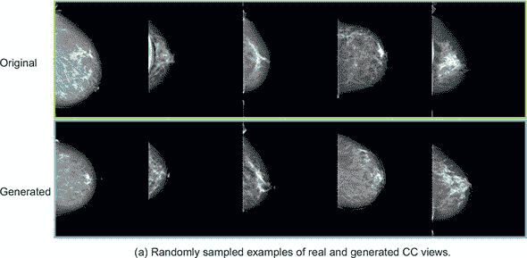

GANs 可以用于许多应用，而不仅仅是与乳腺癌作斗争或生成人脸，还包括截至 2018 年 7 月底发布的 62 个其他医学 GAN 应用。^([10]) 我们鼓励您查看它们——但当然，并非所有这些都使用 PGGANs。通常，GANs 在许多研究领域都带来了巨大的飞跃，但它们通常被非直观地应用。我们希望使这些技术更容易获得，以便更多的研究人员可以使用。制造 GANs，而不是战争！

> ¹⁰
> 
> 查看“GANs for Medical Image Analysis”，作者 Salome Kazeminia 等，2018 年，[`arxiv.org/pdf/1809.06222.pdf`](https://arxiv.org/pdf/1809.06222.pdf).

本章中我们提出的所有技术代表了解决 GAN 问题的一般类别——模型越来越复杂。我们预计这种范式将在 GAN 中得到应用。对于 TensorFlow Hub 也是如此：它对 TensorFlow 的作用就像 PyPI/Conda 对 Python 的作用一样。大多数 Python 程序员每周都会使用它们！

我们希望这种新的渐进式 GAN 技术让您对 GAN 能做什么以及为什么人们对这篇论文如此兴奋有了新的认识。并且希望不仅仅是因为 PGGAN 可以生成的猫膜向量。^([12]) 下一章将为您提供工具，让您可以开始自己为研究做出贡献。到时候见！

> ¹²
> 
> 查看 Gene Kogan 的 Twitter 图片，2018 年，[`twitter.com/genekogan/status/1019943905318572033`](https://twitter.com/genekogan/status/1019943905318572033).

### 摘要

+   我们得益于最先进的 PGGAN 技术，可以生成 1 兆像素的合成图像。

+   这种技术有四个关键的训练创新：

    +   高分辨率层中的渐进式增长和平滑

    +   小批量标准差以强制生成样本中的变化

    +   平衡的学习率确保我们可以在每个方向上采取适当大小的学习步骤

    +   像素级向量归一化，确保生成器和判别器在军备竞赛中不会失控

+   你跟随了一个使用新发布的 TensorFlow Hub 的手动教程，并有机会使用其渐进式 GAN 的下采样版本来生成图像！

+   你了解了 GANs 是如何帮助对抗癌症的。

## 第七章。半监督 GAN

*本章涵盖*

+   基于原始 GAN 模型的热门创新领域

+   半监督学习和其巨大的实际重要性

+   半监督 GANs（SGANs）

+   SGAN 模型的实现

恭喜你——你已经完成了这本书的一半以上。到现在为止，你不仅已经学会了什么是生成对抗网络（GANs）以及它们是如何工作的，还有机会实现了两种最经典的实现：最初启动一切的原始 GAN 和为大量高级 GAN 变体奠定基础的 DCGAN，包括上一章中介绍的渐进式 GAN。

然而，就像许多领域一样，当你认为你开始真正掌握它时，你会发现自己所了解的领域比最初想象的要大得多、复杂得多。可能看似彻底的理解实际上只是冰山一角。

GANs 也不例外。自从它们被发明以来，它们一直是一个活跃的研究领域，每年都会添加无数的变化。一个非官方的列表——恰当地命名为“GAN 动物园”（[`github.com/hindupuravinash/the-gan-zoo`](https://github.com/hindupuravinash/the-gan-zoo)）——旨在追踪所有命名的 GAN 变体（由撰写它们的作者命名的具有不同名称的 GAN 实现）在撰写本文时已经增长到超过 300 种。然而，根据原始 GAN 论文至今已被引用超过 9,000 次（截至 2019 年 7 月）并且在过去几年中在深度学习领域排名最被引用的研究论文之一的事实，研究社区发明的 GAN 变体数量可能更高。^([[1]) 见图 7.1。

> ¹
> 
> 根据 Microsoft Academic（MA）搜索引擎的追踪器：[`mng.bz/qXXJ`](http://mng.bz/qXXJ)。另见“机器学习和深度学习的前 20 篇研究论文”，作者 Thuy T. Pham，2017，[`mng.bz/E1eq`](http://mng.bz/E1eq)。

##### 图 7.1。此图近似了研究社区从 2014 年 GAN 的发明开始，直到 2018 年初几个月每月累积的独特 GAN 实现的数量。正如图表所清楚显示的，生成对抗学习领域自其诞生以来一直在呈指数增长，这种兴趣和受欢迎程度的增长似乎没有尽头。

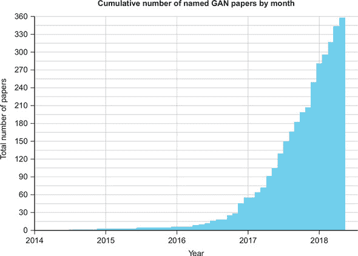

（来源：“GAN 动物园”，作者 Avinash Hindupur，2017，[`github.com/hindupuravinash/the-gan-zoo`](https://github.com/hindupuravinash/the-gan-zoo)。）

然而，这并不是绝望的理由。尽管不可能在这本书或任何书中涵盖所有这些 GAN 变体，但我们可以介绍一些关键创新，这将给你一个很好的了解，以及这些变化对生成对抗学习领域的独特贡献。

值得注意的是，并非所有这些命名的变体都与原始 GAN 有显著差异。事实上，其中许多在高级别上与原始模型非常相似，例如第四章中的 DCGAN。即使是许多复杂的创新，如 Wasserstein GAN（在第五章中讨论），也主要关注提高原始 GAN 模型或类似模型的性能和稳定性。

在本章以及接下来的两章中，我们将重点关注那些不仅在模型实现的架构和底层数学上与原始 GAN 不同，而且在动机和目标上也有所不同的 GAN 变体。特别是，我们将涵盖以下三种 GAN 模型：

+   半监督 GAN（本章）

+   条件 GAN (第八章)

+   CycleGAN (第九章)

对于这些 GAN 变体中的每一个，你将了解它们的目标和动机，它们的模型架构，以及它们的网络如何训练和工作。这些主题将通过概念和具体示例进行讲解。我们还将提供教程，包含每个模型的完整工作实现，以便你可以亲身体验。

因此，无需多言，让我们深入探讨吧！

### 7.1. 半监督 GAN 的介绍

*半监督学习* 是 GAN 在实际应用中最有前景的领域之一。与需要为数据集中的每个示例提供标签的监督学习不同，以及不使用标签的无监督学习，半监督学习只为训练数据集的一个小子集提供类别标签。通过内化数据中的隐藏结构，半监督学习力求从标记数据点的较小子集中泛化，从而有效地分类新的、以前未见过的示例。重要的是，为了使半监督学习有效，标记和无标记数据必须来自相同的潜在分布。

缺乏标记数据集是机器学习研究和实际应用中的主要瓶颈之一。尽管无标记数据很丰富（互联网是一个几乎无限的、无标记图像、视频和文本的来源），但为它们分配类别标签通常成本高昂、不切实际且耗时。手工标注 ImageNet 原始的 320 万张图像花了两年半时间——这是一个标记图像数据库，帮助推动了过去十年中图像处理和计算机视觉的许多进步.^([2])

> ²
> 
> 请参阅 Dave Gershgorn 于 2017 年发表的《数据如何改变 AI 研究——以及可能改变世界》，[`mng.bz/DNVy`](http://mng.bz/DNVy)。

深度学习先驱、斯坦福大学教授、百度前首席科学家安德鲁·吴（Andrew Ng）将大量标注数据对于训练的重要性视为监督学习的阿基里斯之踵，而监督学习被广泛应用于当今工业界的大多数 AI 应用。^([[3)] 其中，受大型标注数据集缺乏影响最严重的行业之一是医药行业，获取数据（例如，临床试验的结果）通常需要巨大的努力和支出，更不用说伦理和隐私等更为重要的问题。^([[4)] 因此，提高算法从越来越少的标注示例中学习的能力具有极大的实际意义。

> ³
> 
> 请参阅安德鲁·吴（Andrew Ng）于 2016 年发表的《现在人工智能能做什么（以及不能做什么）》，[`mng.bz/lopj`](http://mng.bz/lopj)。
> 
> ⁴
> 
> 请参阅 Michael Chui 等人于 2018 年发表的《AI 能为您的业务做什么（以及现在不能做什么）》，[`mng.bz/BYDv`](http://mng.bz/BYDv)。

有趣的是，半监督学习也可能是与人类学习方式最接近的机器学习类比。当学童学习阅读和写作时，老师不必带他们去旅行看成千上万的字母和数字示例，要求他们识别这些符号，并根据需要纠正他们——这与监督学习算法的操作方式相似。相反，只需要一组示例，孩子们就能学习字母和数字，然后能够识别它们，无论字体、大小、角度、光照条件以及许多其他因素。半监督学习的目标是以类似高效的方式教会机器。

作为训练的额外信息来源，生成模型在提高半监督模型准确性方面证明是有用的。不出所料，GANs 证明是最有希望的。2016 年，Tim Salimans、Ian Goodfellow 及其在 OpenAI 的同事们仅使用 2,000 个标注示例在 Street View House Numbers (SVHN)基准数据集上实现了近 94%的准确率。^([[5)] 作为比较，当时使用 SVHN 训练集中所有 73,257 个图像的标签的最佳全监督算法的准确率约为 98.40%。^([[6)] 换句话说，半监督 GAN 在整体准确率上与全监督基准非常接近，而训练时使用的标签不到 3%。

> ⁵
> 
> 请参阅 Ian Goodfellow 等人于 2016 年发表的《训练 GANs 的改进技术》，[`arxiv.org/abs/1606.03498`](https://arxiv.org/abs/1606.03498)。
> 
> ⁶
> 
> 请参阅高黄等人于 2016 年发表的《密集连接卷积网络》，[`arxiv.org/abs/1608.06993`](https://arxiv.org/abs/1608.06993)。

让我们来看看 Salimans 和他的同事们是如何从如此之少中取得如此多的成就。

#### 7.1.1\. 什么是半监督生成对抗网络？

*半监督生成对抗网络（SGAN）* 是一种生成对抗网络，其判别器是一个多类分类器。它不是仅仅区分两类（*真实*和*伪造*），而是学习区分 *N* + 1 类，其中 *N* 是训练数据集中类的数量，额外增加一类用于由生成器产生的伪造示例。

例如，手写数字的 MNIST 数据集有 10 个标签（每个数字一个标签，0 到 9），因此在这个数据集上训练的 SGAN 判别器将预测 10 + 1 = 11 个类别。在我们的实现中，SGAN 判别器的输出将表示为一个包含 10 个类概率的向量（总和为 1.0）以及另一个表示图像是真实还是伪造的概率。

将判别器从二分类器转换为多类分类器可能看起来是一个微不足道的改变，但其影响可能比乍看之下更为深远。让我们从一个图表开始。图 7.2 展示了 SGAN 的架构。

##### 图 7.2\. 在这个半监督生成对抗网络中，生成器接收一个随机噪声向量 *z* 并产生一个伪造示例 *x**。判别器接收三种类型的数据输入：来自生成器的伪造数据、真实未标记示例 *x* 和真实标记示例 (*x*, *y*)，其中 *y* 是与给定示例对应的标签。然后判别器输出一个分类；其目标是区分伪造示例和真实示例，并对真实示例识别正确的类别。请注意，有标签的示例部分远小于无标签数据部分。在实践中，这种对比甚至更为鲜明，标记数据仅占训练数据的一小部分（通常仅为 1-2%）。

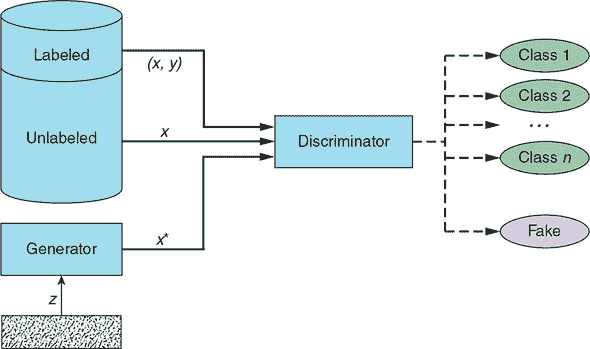

如图 7.2 所示，区分多个类别的任务不仅影响判别器本身，而且与传统的 GAN 相比，增加了 SGAN 架构、其训练过程和其训练目标的复杂性。

#### 7.1.2\. 架构

SGAN 生成器的目的是与原始 GAN 相同：它接收一个随机数字向量，并产生伪造示例，其目标是与训练数据集不可区分——这里没有变化。

然而，SGAN 判别器与原始 GAN 实现有相当大的差异。它接收三种类型的输入：生成器产生的伪造示例 (*x**)、来自训练数据集的无标签真实示例 (*x*) 和来自训练数据集的有标签真实示例 (*x, y*)，其中 *y* 表示给定示例 *x* 的标签。SGAN 判别器的目标不是二元分类，而是如果示例是真实的，则正确地将输入示例分类到其对应的类别中，或者拒绝该示例为伪造（这可以被视为一个特殊的附加类别）。

表 7.1 总结了关于两个 SGAN 子网络的关键要点。

##### 表 7.1\. SGAN 生成器和判别器网络

|   | 生成器 | 判别器 |
| --- | --- | --- |

| 输入 | 一组随机数向量 (z) | 判别器接收三种类型的输入：

+   来自训练数据集的无标签真实示例 (x)

+   来自训练数据集的有标签真实示例 (x, y)

+   由生成器产生的伪造示例 (x*)

|

| 输出 | 努力变得尽可能令人信服的伪造示例 (x*) | 概率，表示输入示例属于 *N* 个真实类别之一或伪造类别的可能性 |
| --- | --- | --- |
| 目标 | 生成伪造示例，通过欺骗判别器将其分类为真实示例，使其在训练数据集成员中难以区分 | 学习为真实示例分配正确的类别标签，同时拒绝所有来自生成器的示例作为伪造 |

#### 7.1.3\. 训练过程

记住，在常规 GAN 中，我们通过计算 *D*(*x*) 和 *D*(*x**) 的损失，并通过反向传播总损失来更新判别器的可训练参数以最小化损失来训练判别器。生成器通过反向传播判别器对 *D*(*x**) 的损失来训练，目的是最大化它，从而使它合成的伪造示例被错误地分类为真实。

训练 SGAN 时，除了计算 *D*(*x*) 和 *D*(*x**) 的损失之外，我们还需要计算监督训练示例的损失：*D*((*x*, *y*)). 这些损失对应于 SGAN 判别器必须应对的二元学习目标：在区分真实示例和伪造示例的同时，还要学会将真实示例分类到正确的类别中。使用原文中的术语，这些二元目标对应于两种类型的损失：*监督损失* 和 *无监督损失*.^([7])

> ⁷
> 
> 参见 Tim Salimans 等人于 2016 年发表的“Improved Techniques for Training GANs”，[`arxiv.org/abs/1606.03498`](https://arxiv.org/abs/1606.03498).

#### 7.1.4\. 训练目标

你迄今为止所看到的所有 GAN 变体都是生成模型。它们的目标是产生看起来逼真的数据样本；因此，生成器网络一直是首要关注点。判别器网络的主要目的是帮助生成器提高其产生的图像质量。在训练结束时，我们通常忽略判别器，仅使用完全训练好的生成器来创建看起来逼真的合成数据。

相比之下，在 SGAN 中，我们主要关注判别器。训练过程的目标是将这个网络变成一个半监督分类器，其准确率尽可能接近全监督分类器（在训练数据集中的每个示例都有标签），同时只使用一小部分标签。生成器的目标是作为额外信息的来源（它产生的伪造数据）来帮助生成器学习数据中的相关模式，从而提高其分类准确率。在训练结束时，生成器被丢弃，我们使用训练好的判别器作为分类器。

现在你已经了解了 SGAN 的创建动机，我们也解释了模型的工作原理，现在是时候通过实现一个模型来观察模型的实际应用了。

### 7.2\. 教程：实现半监督生成对抗网络

在这个教程中，我们实现了一个 SGAN 模型，该模型通过仅使用 100 个训练示例来学习在 MNIST 数据集中对手写数字进行分类。在教程结束时，我们将模型的分类准确率与一个等效的全监督模型进行比较，以亲自看到半监督学习带来的改进。

#### 7.2.1\. 架构图

图 7.3 展示了本教程中实现的 SGAN 模型的高级示意图。它比我们在本章开头介绍的一般概念图要复杂一些。毕竟，魔鬼隐藏在（实现）细节中。

##### 图 7.3\. 这个 SGAN 图是本章教程中实现的 SGAN 的高级说明。生成器将随机噪声转换为伪造示例。判别器接收带有标签的实图像（*x, y*）、没有标签的实图像（*x*）以及生成器产生的伪造图像（*x**）。为了区分真实示例和伪造示例，判别器使用*sigmoid*函数。为了区分真实类别，判别器使用*softmax*函数。

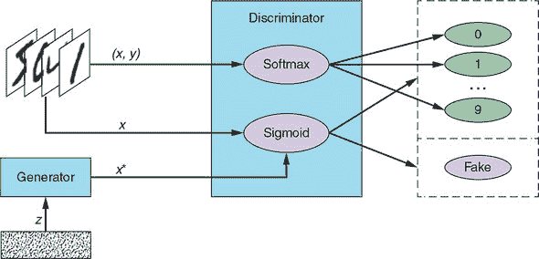

为了解决多类分类问题，即区分真实标签，判别器使用*softmax*函数，它给出了指定数量类别的概率分布——在我们的案例中是 10 个类别。分配给某个标签的概率越高，判别器就越确信该示例属于该类别。为了计算分类误差，我们使用交叉熵损失，它衡量输出概率与目标、单热编码标签之间的差异。

为了输出真实与虚假的概率，判别器使用*sigmoid*激活函数，并通过反向传播二进制交叉熵损失来训练其参数——这与我们在第三章和第四章中实现的 GANs 相同。

#### 7.2.2\. 实现

如您可能注意到的，我们的大部分 SGAN 实现是从第四章中的 DCGAN 模型改编而来的。这并非出于懒惰（好吧，可能有一点），而是为了让您更好地看到 SGAN 所需的独特修改，而不受网络无关部分的实现细节的干扰。

一个包含完整实现以及添加的训练进度可视化的 Jupyter 笔记本可在我们的 GitHub 仓库（[`github.com/GANs-in-Action/gans-in-action`](https://github.com/GANs-in-Action/gans-in-action)）中找到，位于第七章文件夹下。代码已在 Python 3.6.0、Keras 2.1.6 和 TensorFlow 1.8.0 上进行了测试。为了加快训练时间，我们建议在 GPU 上运行模型。

#### 7.2.3\. 设置

如同往常，我们首先导入运行模型所需的全部模块和库，如下所示。

##### 列表 7.1\. 导入语句

```
%matplotlib inline

import matplotlib.pyplot as plt
import numpy as np

from keras import backend as K

from keras.datasets import mnist
from keras.layers import (Activation, BatchNormalization, Concatenate, Dense,
                          Dropout, Flatten, Input, Lambda, Reshape)
from keras.layers.advanced_activations import LeakyReLU
from keras.layers.convolutional import Conv2D, Conv2DTranspose
from keras.models import Model, Sequential
from keras.optimizers import Adam
from keras.utils import to_categorical
```

我们还指定了输入图像大小、噪声向量*z*的大小以及半监督分类中的真实类别数（每个数字对应我们的判别器将学习识别的一个类别），如下所示。

##### 列表 7.2\. 模型输入维度

```
img_rows = 28
img_cols = 28
channels = 1

img_shape = (img_rows, img_cols, channels)    ***1***

z_dim = 100                                   ***2***

num_classes = 10                              ***3***
```

+   ***1* 输入图像维度**

+   ***2* 噪声向量的大小，用作生成器的输入**

+   ***3* 数据集中的类别数**

#### 7.2.4\. 数据集

尽管 MNIST 训练数据集有 50,000 个标记的训练图像，但我们只会使用其中的一小部分（由`num_labeled`参数指定）进行训练，并假装所有剩余的图像都是未标记的。我们通过在生成标记数据批次时只从前`num_labeled`个图像中进行采样，在生成未标记示例批次时从剩余的（50,000 - `num_labeled`）个图像中进行采样来实现这一点。

`Dataset` 对象（如列表 7.3 所示）还提供了一个函数，用于返回所有 `num_labeled` 训练示例及其标签，以及一个函数，用于返回 MNIST 数据集中的所有 10,000 个带标签测试图像。训练后，我们将使用测试集来评估模型的分类如何泛化到之前未见过的示例。

##### 列表 7.3\. 训练和测试数据集

```
class Dataset:
    def __init__(self, num_labeled):

        self.num_labeled = num_labeled                                   ***1***

        (self.x_train, self.y_train), (self.x_test,                      ***2***
                                       self.y_test) = mnist.load_data()

        def preprocess_imgs(x):
            x = (x.astype(np.float32) - 127.5) / 127.5                   ***3***
            x = np.expand_dims(x, axis=3)                                ***4***
            return x

        def preprocess_labels(y):
            return y.reshape(-1, 1)

        self.x_train = preprocess_imgs(self.x_train)                     ***5***
        self.y_train = preprocess_labels(self.y_train)

        self.x_test = preprocess_imgs(self.x_test)                       ***6***
        self.y_test = preprocess_labels(self.y_test)

    def batch_labeled(self, batch_size):
        idx = np.random.randint(0, self.num_labeled, batch_size)         ***7***
        imgs = self.x_train[idx]
        labels = self.y_train[idx]
        return imgs, labels

    def batch_unlabeled(self, batch_size):
        idx = np.random.randint(self.num_labeled, self.x_train.shape[0], ***8***
                                batch_size)
        imgs = self.x_train[idx]
        return imgs

    def training_set(self):
        x_train = self.x_train[range(self.num_labeled)]
        y_train = self.y_train[range(self.num_labeled)]
        return x_train, y_train

    def test_set(self):
        return self.x_test, self.y_test
```

+   ***1* 用于训练的带标签示例数量**

+   ***2* 加载 MNIST 数据集**

+   ***3* 将 [0, 255] 灰度像素值缩放到 [–1, 1]**

+   ***4* 扩展图像维度为宽度 × 高度 × 通道**

+   ***5* 训练数据**

+   ***6* 测试数据**

+   ***7* 获取一个随机批次的带标签图像及其标签**

+   ***8* 获取一个随机批次的未标记图像**

在本教程中，我们将假装我们只有 100 个带标签的 MNIST 图像用于训练：

```
num_labeled = 100             ***1***

dataset = Dataset(num_labeled)
```

+   ***1* 用于训练的带标签示例数量（其余将用作未标记）**

#### 7.2.5\. 生成器

生成器网络与我们在第四章中为 DCGAN 实现的网络相同。使用转置卷积层，生成器将输入的随机噪声向量转换为 28 × 28 × 1 图像；请参阅以下列表。

##### 列表 7.4\. SGAN 生成器

```
def build_generator(z_dim):

    model = Sequential()
    model.add(Dense(256 * 7 * 7, input_dim=z_dim))                           ***1***
    model.add(Reshape((7, 7, 256)))

    model.add(Conv2DTranspose(128, kernel_size=3, strides=2, padding='same'))***2***

    model.add(BatchNormalization())                                          ***3***

    model.add(LeakyReLU(alpha=0.01))                                         ***4***

    model.add(Conv2DTranspose(64, kernel_size=3, strides=1, padding='same')) ***5***

    model.add(BatchNormalization())                                          ***3***

    model.add(LeakyReLU(alpha=0.01))                                         ***4***

    model.add(Conv2DTranspose(1, kernel_size=3, strides=2, padding='same'))  ***6***

    model.add(Activation('tanh'))                                            ***7***

    return model
```

+   ***1* 通过全连接层将输入重塑为 7 × 7 × 256 张量**

+   ***2* 转置卷积层，从 7 × 7 × 256 到 14 × 14 × 128 张量**

+   ***3* 批归一化**

+   ***4* Leaky ReLU 激活**

+   ***5* 转置卷积层，从 14 × 14 × 128 到 14 × 14 × 64 张量**

+   ***6* 转置卷积层，从 14 × 14 × 64 到 28 × 28 × 1 张量**

+   ***7* 输出层带有 tanh 激活**

#### 7.2.6\. 判别器

判别器是 SGAN 模型中最复杂的一部分。回想一下，SGAN 判别器具有双重目标：

+   区分真实示例和伪造示例。为此，SGAN 判别器使用 *sigmoid* 函数，输出单个输出概率，用于二元分类。

+   对于真实示例，准确分类其标签。为此，SGAN 判别器使用 *softmax* 函数，输出一个概率向量，每个目标类别一个。

##### 核心判别器网络

我们首先定义核心判别器网络。正如你可能注意到的，列表 7.5 中的模型与我们在第四章中实现的基于 ConvNet 的判别器相似；实际上，它一直相同，直到 3 × 3 × 128 卷积层、其批归一化和 *Leaky ReLU* 激活。

在那一层之后，我们添加了一个*dropout*，这是一种正则化技术，通过在训练过程中随机丢弃神经网络中的神经元及其连接来帮助防止过拟合。这迫使剩余的神经元减少它们的相互依赖，并发展出对底层数据的更一般化表示。要随机丢弃的神经元比例由速率参数指定，在我们的实现中设置为 0.5：`model.add(Dropout(0.5))`。我们添加 dropout 是因为 SGAN 分类任务的复杂性增加，以及为了提高模型从仅 100 个标记示例中泛化的能力。

> ⁸
> 
> 请参阅 Geoffrey E. Hinton 等人于 2012 年发表的“通过防止特征检测器的共适应来改进神经网络”，[`arxiv.org/abs/1207.0580`](https://arxiv.org/abs/1207.0580)。另请参阅 Nitish Srivastava 等人于 2014 年发表的“Dropout：防止神经网络过拟合的简单方法”，*Journal of Machine Learning Research* 15，1929–1958。

##### 列表 7.5\. SGAN 判别器

```
def build_discriminator_net(img_shape):

    model = Sequential()

    model.add(                                 ***1***
        Conv2D(32,
               kernel_size=3,
               strides=2,
               input_shape=img_shape,
               padding='same'))

    model.add(LeakyReLU(alpha=0.01))           ***2***

    model.add(                                 ***3***
        Conv2D(64,
               kernel_size=3,
               strides=2,
               input_shape=img_shape,
               padding='same'))

    model.add(BatchNormalization())            ***4***

    model.add(LeakyReLU(alpha=0.01))           ***5***

    model.add(                                 ***6***
        Conv2D(128,
               kernel_size=3,
               strides=2,
               input_shape=img_shape,
               padding='same'))

    model.add(BatchNormalization())            ***4***

    model.add(LeakyReLU(alpha=0.01))           ***5***

    model.add(Dropout(0.5))                    ***7***

    model.add(Flatten())                       ***8***

    model.add(Dense(num_classes))              ***9***

    return model
```

+   ***1* 卷积层，从 28 × 28 × 1 张量转换为 14 × 14 × 32 张量**

+   ***2* Leaky ReLU 激活**

+   ***3* 卷积层，从 14 × 14 × 32 张量转换为 7 × 7 × 64 张量**

+   ***4* 批标准化**

+   ***5* Leaky ReLU 激活**

+   ***6* 卷积层，从 7 × 7 × 64 张量转换为 3 × 3 × 128 张量**

+   ***7* Dropout**

+   ***8* 展平张量**

+   ***9* 具有 num_classes 个神经元的全连接层**

注意，dropout 层是在批标准化之后添加的，而不是相反；这已经证明由于两种技术的相互作用而具有更好的性能。^([9])

> ⁹
> 
> 请参阅 Xiang Li 等人于 2018 年发表的“通过方差偏移理解 Dropout 和批标准化的不和谐”，[`arxiv.org/abs/1801.05134`](https://arxiv.org/abs/1801.05134)。

此外，请注意，前面的网络以一个具有 10 个神经元的全连接层结束。接下来，我们需要定义从这些神经元计算出的两个判别器输出：一个用于监督的多类分类（使用*softmax*），另一个用于非监督的二分类（使用*sigmoid*）。

##### 监督判别器

在下面的列表中，我们采用之前实现的核心判别器网络，并使用它来构建判别器模型的监督部分。

##### 列表 7.6\. SGAN 判别器：监督

```
def build_discriminator_supervised(discriminator_net):

    model = Sequential()

    model.add(discriminator_net)

    model.add(Activation('softmax'))      ***1***

    return model
```

+   ***1* Softmax 激活，输出对真实类别的预测概率分布**

##### 非监督判别器

以下列表在核心判别器网络之上实现了判别器模型的非监督部分。请注意`predict(x)`函数，其中我们将核心判别器网络中 10 个神经元的输出转换为二进制真实与伪造预测。

##### 列表 7.7\. SGAN 判别器：非监督

```
def build_discriminator_unsupervised(discriminator_net):

    model = Sequential()

    model.add(discriminator_net)

    def predict(x):
        prediction = 1.0 - (1.0 /                                          ***1***
                            (K.sum(K.exp(x), axis=-1, keepdims=True) + 1.0))

        return prediction

    model.add(Lambda(predict))                                             ***2***

    return model
```

+   ***1* 将真实类别的分布转换为二进制真实与伪造概率**

+   ***2* 之前定义的真实与假输出神经元**

#### 7.2.7\. 构建模型

接下来，我们构建和编译判别器和生成器模型。注意使用`categorical_crossentropy`和`binary_crossentropy`损失函数分别用于监督损失和无监督损失。

##### 列表 7.8\. 构建模型

```
def build_gan(generator, discriminator):

    model = Sequential()

    model.add(generator)                                                    ***1***
    model.add(discriminator)

    return model

discriminator_net = build_discriminator_net(img_shape)                      ***2***

discriminator_supervised = build_discriminator_supervised(discriminator_net)***3***
discriminator_supervised.compile(loss='categorical_crossentropy',           ***3***
                                 metrics=['accuracy'],                      ***3***
                                 optimizer=Adam())                          ***3***

discriminator_unsupervised = build_discriminator_unsupervised(              ***4***
                                 discriminator_net)                         ***4***
discriminator_unsupervised.compile(loss='binary_crossentropy',              ***4***
                                   optimizer=Adam())                        ***4***
generator = build_generator(z_dim)                                          ***5***
discriminator_unsupervised.trainable = False                                ***6***
gan = build_gan(generator, discriminator_unsupervised)                      ***7***
gan.compile(loss='binary_crossentropy', optimizer=Adam())                   ***7***
```

+   ***1* 结合生成器和判别器模型**

+   ***2* 核心判别器网络：这些层在监督和无监督训练期间是共享的。**

+   ***3* 为监督训练构建和编译判别器**

+   ***4* 为无监督训练构建和编译判别器**

+   ***5* 构建生成器**

+   ***6* 在生成器训练期间保持判别器参数不变**

+   ***7* 使用固定的判别器构建和编译 GAN 模型以训练生成器。注意：使用具有无监督输出的判别器版本。**

#### 7.2.8\. 训练

以下伪代码概述了 SGAN 训练算法。


**SGAN 训练算法**

*对于*每个训练迭代 *do*

1.  训练判别器（监督）：

    1.  从标记的真实示例中随机抽取一个迷你批次（*x*，*y*）。

    1.  对于给定的迷你批次计算 *D*((*x*, *y*)) 并反向传播多类分类损失以更新 *θ*^((*D*)) 以最小化损失。

1.  训练判别器（无监督）：

    1.  从未标记的真实示例中随机抽取一个迷你批次 *x*。

    1.  对于给定的迷你批次计算 *D*(*x*) 并反向传播二分类损失以更新 *θ*^((*D*)) 以最小化损失。

    1.  取一个随机噪声向量迷你批次 *z* 并生成一个假例迷你批次：*G*(*z*) = *x**。

    1.  对于给定的迷你批次计算 *D*(*x**) 并反向传播二分类损失以更新 *θ*^((*D*)) 以最小化损失。

1.  训练生成器：

    1.  取一个随机噪声向量迷你批次 *z* 并生成一个假例迷你批次：*G*(*z*) = *x**。

    1.  对于给定的迷你批次计算 *D*(*x**) 并反向传播二分类损失以更新 *θ*^((*G*)) 以最大化损失。

*End for*


以下列表实现了 SGAN 训练算法。

##### 列表 7.9\. SGAN 训练算法

```
supervised_losses = []
iteration_checkpoints = []
def train(iterations, batch_size, sample_interval):

    real = np.ones((batch_size, 1))                                            ***1***

    fake = np.zeros((batch_size, 1))                                           ***2***

    for iteration in range(iterations):

        imgs, labels = dataset.batch_labeled(batch_size)                       ***3***

        labels = to_categorical(labels, num_classes=num_classes)               ***4***

        imgs_unlabeled = dataset.batch_unlabeled(batch_size)                   ***5***

        z = np.random.normal(0, 1, (batch_size, z_dim))                        ***6***
        gen_imgs = generator.predict(z)

        d_loss_supervised,
                 accuracy = discriminator_supervised.train_on_batch(imgs, labels)   ***7***

        d_loss_real = discriminator_unsupervised.train_on_batch(               ***8***
            imgs_unlabeled, real)

        d_loss_fake = discriminator_unsupervised.train_on_batch(gen_imgs, fake)***9***

        d_loss_unsupervised = 0.5 * np.add(d_loss_real, d_loss_fake)

        z = np.random.normal(0, 1, (batch_size, z_dim))                        ***10***
        gen_imgs = generator.predict(z)

        g_loss = gan.train_on_batch(z, np.ones((batch_size, 1)))               ***11***

        if (iteration + 1) % sample_interval == 0:

            supervised_losses.append(d_loss_supervised)                        ***12***
            iteration_checkpoints.append(iteration + 1)

            print(                                                             ***13***
                "%d [D loss supervised: %.4f, acc.: %.2f%%] [D loss" +
                " unsupervised: %.4f] [G loss: %f]"
                % (iteration + 1, d_loss_supervised, 100 * accuracy,
                  (d_loss_unsupervised, g_loss))
```

+   ***1* 真实图像的标签：全为 1**

+   ***2* 假图像的标签：全为 0**

+   ***3* 获取标记示例**

+   ***4* One-hot-encoded 标签**

+   ***5* 获取未标记示例**

+   ***6* 生成一批假图像**

+   ***7* 在真实标记示例上训练**

+   ***8* 在真实未标记示例上训练**

+   ***9* 在假例上训练**

+   ***10* 生成一批假图像**

+   ***11* 训练生成器**

+   ***12** 将判别器的监督分类损失保存以在训练后绘制**

+   ***13** 输出训练进度**

##### 训练模型

我们使用较小的批量大小，因为我们只有 100 个标记示例用于训练。迭代次数通过试错确定：我们不断增加迭代次数，直到判别器的监督损失达到平台期，但不要超过太多（以减少过拟合的风险）：

##### 列表 7.10\. 训练模型

```
iterations = 8000                                 ***1***
batch_size = 32
sample_interval = 800

train(iterations, batch_size, sample_interval)    ***2***
```

+   ***1* 设置超参数**

+   ***2* 训练 SGAN 指定次数的迭代**

##### 模型训练和测试准确率

现在，让我们来揭晓我们一直期待的时刻——让我们看看我们的 SGAN 作为分类器的表现。在训练过程中，我们看到我们达到了 100%的监督准确率。虽然这可能看起来很令人印象深刻，但请记住，我们只有 100 个标记示例用于监督训练。也许我们的模型只是记住了训练数据集。重要的是我们的分类器如何将泛化到训练集中之前未见过的数据，如下面的列表所示。

##### 列表 7.11\. 检查准确率

```
x, y = dataset.test_set()
y = to_categorical(y, num_classes=num_classes)

_, accuracy = discriminator_supervised.evaluate(x, y)      ***1***
print("Test Accuracy: %.2f%%" % (100 * accuracy))
```

+   ***1* 在测试集上计算分类准确率**

鼓掌，请。

我们的 SGAN 能够准确分类测试集中大约 89%的示例。为了了解这一点有多么显著，让我们将其性能与一个完全监督分类器进行比较。

### 7.3\. 与完全监督分类器的比较

为了尽可能公平地进行比较，我们使用与用于监督判别器训练的相同网络架构来训练完全监督分类器，如下面的列表所示。想法是这将使我们能够隔离通过 GAN 启用的半监督学习实现的分类器泛化能力的提升。

##### 列表 7.12\. 完全监督分类器

```
mnist_classifier = build_discriminator_supervised(
                         build_discriminator_net(img_shape))     ***1***
mnist_classifier.compile(loss='categorical_crossentropy',
                         metrics=['accuracy'],
                         optimizer=Adam())
```

+   ***1* 与 SGAN 判别器具有相同网络架构的完全监督分类器**

我们通过使用与训练 SGAN 相同的 100 个训练示例来训练完全监督分类器。为了简洁，这里没有展示训练代码和输出训练和测试准确率的代码。您可以在我们的 GitHub 仓库中找到代码，在章节-7 文件夹下的 SGAN Jupyter 笔记本中。

与 SGAN 判别器一样，完全监督分类器在训练数据集上达到了 100%的准确率。然而，在测试集上，它只能正确分类大约 70%的示例——比我们的 SGAN 差了整整 20 个百分点！换句话说，SGAN 将训练准确率提高了近 30%！

随着更多训练数据的加入，完全监督分类器的泛化能力显著提高。使用相同的设置和训练，拥有 10,000 个标记示例（是我们最初使用的 100 倍）的完全监督分类器，我们达到了大约 98%的准确率。但那将不再是一个 *半监督* 环境。

### 7.4\. 结论

在本章中，我们探讨了如何通过教会判别器为真实示例输出类别标签来使用 GAN 进行半监督学习。您看到，SGAN 训练的分类器从少量训练示例中泛化的能力显著优于一个可比的完全监督分类器。

从 GAN 创新的角度来看，SGAN 的一个关键区别特征是使用标签进行判别器训练。你可能想知道是否可以利用标签进行生成器训练。你问得真巧——这正是下一章（条件 GAN）的主题。

### 摘要

+   半监督 GAN (SGAN) 是一种生成对抗网络，其判别器学习以下内容：

    +   区分伪造示例和真实示例

    +   为真实示例分配正确的类别标签

+   SGAN 的目的是通过尽可能少的标记示例来训练判别器成为一个分类器，从而实现优越的分类准确率，从而减少分类任务对大量标记数据集的依赖。

+   在我们的实现中，我们使用了*softmax*和多项式交叉熵损失来处理分配真实标签的监督任务，以及*sigmoid*和二元交叉熵来处理区分真实和伪造数据的任务。

+   我们证明了 SGAN 在测试集中对之前未见数据点的分类准确率远优于在相同数量的标记训练示例上训练的同类全监督分类器。

## 第八章. 条件 GAN

*本章涵盖*

+   使用标签训练生成器和判别器

+   教会 GAN 生成与指定标签匹配的示例

+   实现条件 GAN (CGAN)以生成我们选择的任意手写数字

在上一章中，你了解了 SGAN，它介绍了在 GAN 训练中使用标签的概念。SGANs 使用标签来训练判别器成为一个强大的半监督分类器。在本章中，你将了解条件 GAN (CGAN)，它使用标签来训练*生成器*和*判别器*。多亏了这一创新，条件 GAN 允许我们指导生成器合成我们想要的伪造示例。

### 8.1. 动机

正如你在本书的整个过程中所看到的，GANs 能够生成从简单的手写数字到逼真的人脸图像的各种示例。然而，尽管我们可以通过选择训练数据集来控制我们的 GAN 学习模拟的示例域，但我们无法指定 GAN 将生成的数据样本的任何特征。例如，我们在第四章中实现的 DCGAN 可以合成看起来逼真的手写数字，但我们无法控制它是否会在任何给定时间产生数字 7 而不是数字 9。

在像 MNIST 这样的简单数据集上，其中示例只属于 10 个类别中的一个，这种担忧可能看起来微不足道。例如，如果我们目标是生成数字 9，我们只需不断生成示例，直到我们得到想要的数字。然而，在更复杂的数据生成任务中，可能的答案范围太大，以至于这种蛮力解决方案不再实用。以生成人类面孔的任务为例。尽管第六章中 Progressive GAN 生成的图像令人印象深刻，但我们无法控制将生成哪种面孔。我们无法指导生成器合成，比如说，一个男性或女性面孔，更不用说其他特征，如年龄或面部表情。

能够决定生成哪种类型的数据，为各种应用打开了大门。作为一个有些牵强的例子，想象一下我们是一群侦探在解决一起谋杀案，一个目击者描述凶手是一个中年红发绿眼的女性。如果我们能够将描述的特征输入到一个计算机程序中，并让它输出一系列符合标准的面孔，这将大大加快这个过程。我们的目击者随后可以指向最像罪犯的那一个。

我们相信你可以想到许多其他实际应用，其中能够生成符合我们选择标准图像的能力将是一个颠覆性的变化。在医学研究中，我们可以引导新药化合物的创建；在电影制作和计算机生成图像（CGI）中，我们可以用最少的输入从人类动画师那里创建我们想要的场景。这个列表还可以继续下去。

CGAN（条件生成对抗网络）是首批使有针对性的数据生成成为可能 GAN 创新之一，可以说是最具影响力的一个。在本章的剩余部分，你将学习 CGAN 是如何工作的，并通过使用（你猜对了！）MNIST 数据集来实现一个小规模版本。

### 8.2. 什么是条件生成对抗网络？

由蒙特利尔大学博士研究生 Mehdi Mirza 和 Flickr 人工智能架构师 Simon Osindero 于 2014 年提出，*条件生成对抗网络*是一种在训练过程中通过使用一些附加信息对生成器和判别器进行条件化的生成对抗网络。^([[1)]]这种辅助信息在理论上可以是任何东西，比如一个类别标签，一组标签，甚至是一个书面描述。为了清晰和简单，我们将使用标签作为条件信息，在我们解释 CGAN 是如何工作的过程中。

> ¹
> 
> 参见 Mehdi Mirza 和 Simon Osindero 于 2014 年发表的“Conditional Generative Adversarial Nets”，[`arxiv.org/abs/1411.1784`](https://arxiv.org/abs/1411.1784)。

在 CGAN 训练过程中，生成器学习为训练数据集中每个标签生成逼真的示例，而判别器学习区分伪造的示例-标签对和真实的示例-标签对。与上一章中的半监督 GAN 相比，其判别器学习为每个真实示例分配正确的标签（除了区分真实示例和伪造示例之外），CGAN 中的判别器不学习识别哪个类别是哪个。它只学习接受匹配的真实对，同时拒绝不匹配的对以及示例为伪造的对。

例如，CGAN 判别器应该学习拒绝对(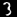, 4)，无论示例（手写的数字 3）是真实还是伪造，因为它与标签 4 不匹配。CGAN 判别器还应该学习拒绝所有图像-标签对，其中图像是伪造的，即使标签与图像匹配。

因此，为了欺骗判别器，CGAN 生成器不仅要生成看起来逼真的数据，它生成的示例还需要与它们的标签匹配。生成器完全训练后，这使我们能够通过传递所需的标签来指定我们想要 CGAN 合成的示例。

#### 8.2.1\. CGAN 生成器

为了使事情更加形式化，让我们将条件标签称为*y*。生成器使用噪声向量*z*和标签*y*来合成一个伪造的示例*G*(*z*, *y*) = *x**|*y*（读作“*x**给定，或者基于*y*”）。这个伪造示例的目标是在判别器的眼中尽可能接近给定标签的真实示例。图 8.1 说明了生成器。

##### 图 8.1\. CGAN 生成器：*G*(*z*, *y*) = *x**|*y*。使用随机噪声向量*z*和标签*y*作为输入，生成器产生一个伪造的示例*x**|*y*，力求与标签看起来逼真。

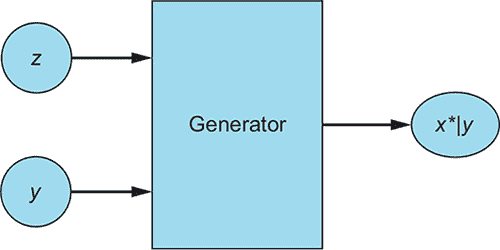

#### 8.2.2\. CGAN 判别器

判别器接收带有标签（*x*，*y*）的真实示例和带有生成它们的标签的伪造示例（*x**|*y*，*y*）。在真实示例-标签对上，判别器学习如何识别真实数据以及如何识别匹配的对。在生成器生成的示例上，它学习识别伪造的图像-标签对，从而学习将它们与真实示例区分开来。

判别器输出一个概率值，表示它认为输入是一个真实匹配对的信心程度。判别器的目标是学习拒绝所有伪造示例和所有未能匹配其标签的示例，同时接受所有真实示例-标签对，如图 8.2 所示。

##### 图 8.2。CGAN 判别器接收带有标签的真实示例(*x*, *y*)和假示例，以及用于合成它们的标签(*x**|*y*, *y*)。然后判别器输出一个概率（由 sigmoid 激活函数σ计算），指示输入对是真实的还是假的。

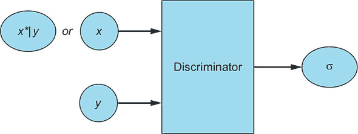

#### 8.2.3. 摘要表

两个 CGAN 子网络、它们的输入、输出和目标在表 8.1 中总结。

##### 表 8.1。CGAN 生成器和判别器网络

|   | 生成器 | 判别器 |
| --- | --- | --- |

| 输入 | 随机数字向量和标签：(*z*, *y*) | 判别器接收以下输入：

+   来自训练数据集的带标签的真实示例：(*x*, *y*)

+   生成器为匹配给定标签而创建的假示例，以及标签：(*x**&#124;*y, y*)

|

| 输出 | 努力匹配其标签的尽可能令人信服的假示例：*G*(*z*, *y*) = *x**&#124;*y* | 表示输入示例是否为真实匹配示例-标签对的单一概率 |
| --- | --- | --- |
| 目标 | 生成与标签匹配的逼真假数据 | 区分来自生成器的假示例-标签对和来自训练数据集的真实示例-标签对 |

#### 8.2.4. 架构图

将所有这些放在一起，图 8.3 展示了 CGAN 的高级架构图。注意，对于每个假示例，相同的标签 *y* 都传递给了生成器和判别器。此外，请注意，判别器从未被明确训练来通过在具有不匹配标签的真实示例上训练来拒绝不匹配的配对；它识别不匹配配对的能力是训练仅接受真实匹配配对的副产品。

##### 图 8.3。CGAN 生成器使用随机噪声向量 *z* 和标签 *y*（*n* 个可能标签之一）作为输入，并生成一个既逼真又令人信服的假示例 *x**|*y*。

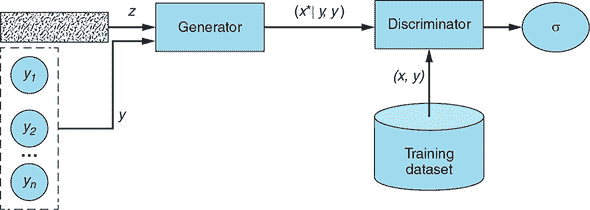


##### 注意

你可能已经注意到一个模式：对于几乎每个 GAN 变体，我们都提供了一个总结判别器和生成器网络输入、输出和目标的表格，以及网络架构图。这并非偶然；实际上，这些章节的主要目标之一是提供一个心理模板——一种可重复使用的框架——当你遇到偏离原始 GAN 的 GAN 实现时，可以查找的东西。分析生成器和判别器网络以及整体模型架构通常是最佳的第一步。


CGAN 判别器接收生成器产生的假标签示例(*x**|*y*, *y*)和真实标签示例(*x*, *y*)，并学习判断给定的示例-标签是真实还是假。

理论部分就到这里。现在是时候将你所学的知识付诸实践，并实现我们自己的 CGAN 模型了。

### 8.3\. 教程：实现条件 GAN

在本教程中，我们将实现一个 CGAN 模型，该模型学习生成我们选择的手写数字。最后，我们将为每个数字生成一个图像样本，以查看模型学习生成目标数据的效果如何。

#### 8.3.1\. 实现

我们的实现受到了开源 GitHub 仓库中 Keras GAN 模型的 CGAN 的启发（与我们在第三章和第四章中使用的是同一个）。特别是，我们使用了该仓库中 `Embedding` 层结合示例和标签到联合隐藏表示的方法（关于这一点稍后还会详细介绍）。

> ²
> 
> 请参阅 Erik Linder-Norén 的 Keras-GAN GitHub 仓库，2017，[`github.com/eriklindernoren/Keras-GAN`](https://github.com/eriklindernoren/Keras-GAN)。

然而，我们的 CGAN 模型与 Keras-GAN 仓库中找到的模型有所不同。我们对嵌入实现进行了重构，使其更易于阅读，并添加了详细的解释性注释。关键的是，我们还使我们的 CGAN 能够使用卷积神经网络，这会产生更真实的效果——回想一下第三章中 GAN 生成的图像与第四章中 DCGAN 生成的图像之间的差异！

包含添加的训练进度可视化的完整实现 Jupyter 笔记本可在我们的 GitHub 仓库的 chapter-8 文件夹中找到：[`github.com/GANs-in-Action/gans-in-action`](https://github.com/GANs-in-Action/gans-in-action)。代码已在 Python 3.6.0、Keras 2.1.6 和 TensorFlow 1.8.0 上进行了测试。为了加快训练时间，我们建议在 GPU 上运行模型。

#### 8.3.2\. 设置

你猜对了——第一步是导入我们模型所需的全部模块和库，如下所示。

##### 列表 8.1\. 导入语句

```
%matplotlib inline

import matplotlib.pyplot as plt
import numpy as np

from keras.datasets import mnist
from keras.layers import (
        Activation, BatchNormalization, Concatenate, Dense,
        Embedding, Flatten, Input, Multiply, Reshape)
from keras.layers.advanced_activations import LeakyReLU
from keras.layers.convolutional import Conv2D, Conv2DTranspose
from keras.models import Model, Sequential
from keras.optimizers import Adam
```

就像之前一样，我们在这里也指定了输入图像的大小、噪声向量 *z* 的大小以及数据集中的类别数量，具体如下。

##### 列表 8.2\. 模型输入维度

```
img_rows = 28
img_cols = 28
channels = 1

img_shape = (img_rows, img_cols, channels)     ***1***

z_dim = 100                                    ***2***

num_classes = 10                               ***3***
```

+   ***1* 输入图像维度**

+   ***2* 噪声向量的大小，用作生成器的输入**

+   ***3* 数据集中的类别数量**

#### 8.3.3\. CGAN 生成器

在本节中，我们实现 CGAN 生成器。到目前为止，你应该已经熟悉了网络的大部分内容，这些内容来自第四章和第七章。我们对 CGAN 的修改主要集中在输入处理上，其中我们使用嵌入和逐元素乘法将随机噪声向量 *z* 和标签 *y* 结合成一个联合表示。让我们来看看代码做了什么：

1.  使用 Keras 的`Embedding`层将标签*y*（一个从 0 到 9 的整数）转换为一个大小为`z_dim`（随机噪声向量的长度）的密集向量。

1.  使用 Keras 的`Multiply`层将标签嵌入与噪声向量*z*结合成一个联合表示。正如其名所示，该层将两个等长向量的对应条目相乘，并输出一个包含乘积的单个向量。

1.  将得到的向量作为输入输入到 CGAN 生成器网络的其余部分以合成图像。

图 8.4 展示了使用标签 7 作为示例的过程。

##### 图 8.4\. 将条件标签（本例中的 7）和随机噪声向量 z 组合成单个联合表示的步骤

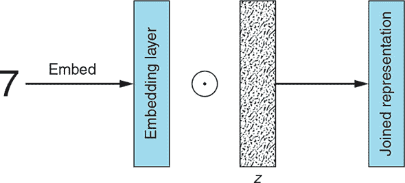

首先，我们将标签嵌入到与*z*相同大小的向量中。其次，我们乘以嵌入的标签和*z*（符号表示逐元素乘法）。然后，将得到的联合表示用作 CGAN 生成器网络的输入。

最后，以下列表展示了所有这些在 Python/Keras 代码中的样子。

##### 列表 8.3\. CGAN 生成器

```
def build_generator(z_dim):

    model = Sequential()

    model.add(Dense(256 * 7 * 7, input_dim=z_dim))                           ***1***
    model.add(Reshape((7, 7, 256)))

    model.add(Conv2DTranspose(128, kernel_size=3, strides=2, padding='same'))***2***

    model.add(BatchNormalization())                                          ***3***

    model.add(LeakyReLU(alpha=0.01))                                         ***4***

    model.add(Conv2DTranspose(64, kernel_size=3, strides=1, padding='same')) ***5***

    model.add(BatchNormalization())                                          ***3***

    model.add(LeakyReLU(alpha=0.01))                                         ***4***

    model.add(Conv2DTranspose(1, kernel_size=3, strides=2, padding='same'))  ***6***

    model.add(Activation('tanh'))                                            ***7***

    return model

def build_cgan_generator(z_dim):

    z = Input(shape=(z_dim, ))                                               ***8***

    label = Input(shape=(1, ), dtype='int32')                                ***9***

    label_embedding = Embedding(num_classes, z_dim, input_length=1)(label)   ***10***

    label_embedding = Flatten()(label_embedding)                             ***11***

    joined_representation = Multiply()([z, label_embedding])                 ***12***

    generator = build_generator(z_dim)

    conditioned_img = generator(joined_representation)                       ***13***

    return Model([z, label], conditioned_img)
```

+   ***1* 通过全连接层将输入重塑为 7 × 7 × 256 张量**

+   ***2* 转置卷积层，从 7 × 7 × 256 转换为 14 × 14 × 128 张量**

+   ***3* 批标准化**

+   ***4* 漏波 ReLU 激活函数**

+   ***5* 转置卷积层，从 14 × 14 × 128 转换为 14 × 14 × 64 张量**

+   ***6* 转置卷积层，从 14 × 14 × 64 转换为 28 × 28 × 1 张量**

+   ***7* 带有 tanh 激活函数的输出层**

+   ***8* 随机噪声向量 z**

+   ***9* 条件标签：整数 0–9，指定 G 应该生成的数量**

+   ***10* 标签嵌入：将标签转换为大小为 z_dim 的密集向量；生成形状为（batch_size，1，z_dim）的 3D 张量**

+   ***11* 将嵌入的 3D 张量展平为形状为（batch_size，z_dim）的 2D 张量**

+   ***12* 向量 z 和标签嵌入的逐元素乘积**

+   ***13* 为给定标签生成图像**

#### 8.3.4\. CGAN 判别器

接下来，我们实现 CGAN 判别器。就像前面的章节一样，网络架构应该对你来说很熟悉，除了我们处理输入图像及其标签的部分。在这里，我们也使用 Keras 的`Embedding`层将输入标签转换为密集向量。然而，与生成器不同，那里的模型输入是一个扁平向量，判别器接收三维图像。这需要定制处理，以下步骤将描述：

1.  取一个标签（一个从 0 到 9 的整数）并使用 Keras 的`Embedding`层将标签转换为大小为 28 × 28 × 1 = 784（展开图像的长度）的密集向量。

1.  将标签嵌入重塑为图像维度（28 × 28 × 1）。

1.  将重塑的标签嵌入连接到相应的图像上，创建一个形状为（28 × 28 × 2）的联合表示。你可以将其视为在其嵌入的标签“盖章”在顶部的图像。

1.  将图像-标签联合表示作为输入输入到 CGAN 判别器网络。请注意，为了使一切正常工作，我们必须调整模型输入维度为（28 × 28 × 2），以反映新的输入形状。

再次，为了使其更具体，让我们通过使用标签 7 作为示例来查看这个过程的外观；参见图 8.5。

##### 图 8.5\. 将标签（本例中为 7）和输入图像组合成单个联合表示的步骤

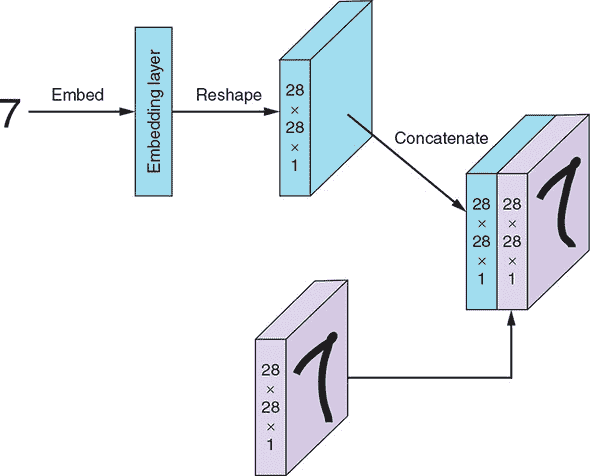

首先，我们将标签嵌入到一个与展平图像大小相同的向量中（28 × 28 × 1 = 784）。其次，我们将嵌入的标签重塑为与输入图像相同的形状（28 × 28 × 1）。第三，我们将重塑的嵌入标签连接到相应的图像上。然后，这个联合表示被传递到 CGAN 判别器网络作为输入。

除了预处理步骤之外，与第四章中的判别器网络相比，我们还需要对判别器网络进行一些额外的调整。（正如前一章所述，基于我们的 DCGAN 实现构建模型应该更容易看到 CGAN 特有的变化，而不会受到模型无关部分的实现细节的干扰。）首先，我们必须调整模型输入维度为（28 × 28 × 2），以反映新的输入形状。

第二，我们将第一个卷积层的深度从 32 增加到 64。这种变化背后的原因是由于连接的标签嵌入，编码的信息更多；这种网络架构在实验中确实产生了更好的结果。

在输出层，我们使用 *sigmoid* 激活函数来产生一个概率，即输入图像-标签对是真实的而不是伪造的——这里没有变化。最后，以下列表是我们的 CGAN 判别器实现。

##### 列表 8.4\. CGAN 判别器

```
def build_discriminator(img_shape):

    model = Sequential()

    model.add(                                                        ***1***

        Conv2D(64,
               kernel_size=3,
               strides=2,
               input_shape=(img_shape[0], img_shape[1], img_shape[2] + 1),
               padding='same'))

    model.add(LeakyReLU(alpha=0.01))                                  ***2***

    model.add(                                                        ***3***
        Conv2D(64,
               kernel_size=3,
               strides=2,
               input_shape=img_shape,
               padding='same'))

    model.add(BatchNormalization())                                   ***4***

    model.add(LeakyReLU(alpha=0.01))                                  ***5***

    model.add(                                                        ***6***
        Conv2D(128,
               kernel_size=3,
               strides=2,
               input_shape=img_shape,
               padding='same'))

    model.add(BatchNormalization())                                   ***7***

    model.add(LeakyReLU(alpha=0.01))                                  ***8***

    model.add(Flatten())                                              ***9***
    model.add(Dense(1, activation='sigmoid'))

    return model

def build_cgan_discriminator(img_shape):

    img = Input(shape=img_shape)                                      ***10***

    label = Input(shape=(1, ), dtype='int32')                         ***11***

    label_embedding = Embedding(num_classes,                          ***12***
                                np.prod(img_shape),
                                input_length=1)(label)

    label_embedding = Flatten()(label_embedding)                      ***13***

    label_embedding = Reshape(img_shape)(label_embedding)             ***14***

    concatenated = Concatenate(axis=-1)([img, label_embedding])       ***15***

    discriminator = build_discriminator(img_shape)

    classification = discriminator(concatenated)                      ***16***

    return Model([img, label], classification)
```

+   ***1* 卷积层，从 28 × 28 × 2 张量转换为 14 × 14 × 64 张量**

+   ***2* 漏波 ReLU 激活**

+   ***3* 卷积层，从 14 × 14 × 64 张量转换为 7 × 7 × 64 张量**

+   ***4* 批标准化**

+   ***5* 漏波 ReLU 激活**

+   ***6* 卷积层，从 7 × 7 × 64 张量转换为 3 × 3 × 128 张量**

+   ***7* 批标准化**

+   ***8* 漏波 ReLU（Leaky ReLU**）

+   ***9* 带有 sigmoid 激活的输出层**

+   ***10* 输入图像**

+   ***11* 输入图像的标签**

+   ***12* 标签嵌入：将标签转换为大小为 z_dim 的密集向量；产生形状为（batch_size, 1, 28 × 28 × 1）的 3D 张量**

+   ***13* 将嵌入的 3D 张量展平为形状为（batch_size, 28 × 28 × 1）的 2D 张量**

+   ***14* 将标签嵌入重塑为与输入图像相同的维度**

+   ***15* 将图像与其标签嵌入连接起来**

+   ***16* 对图像-标签对进行分类**

#### 8.3.5\. 构建模型

接下来，我们构建和编译 CGAN 判别器和生成器模型，如下所示。注意，在用于训练生成器的组合模型中，相同的输入标签被传递给生成器（以生成样本）和判别器（以做出预测）。

##### 列表 8.5\. 构建和编译 CGAN 模型

```
def build_cgan(generator, discriminator):

    z = Input(shape=(z_dim, ))                               ***1***

    label = Input(shape=(1, ))                               ***2***

    img = generator([z, label])                              ***3***

    classification = discriminator([img, label])

    model = Model([z, label], classification)                ***4***

    return model

discriminator = build_cgan_discriminator(img_shape)          ***5***
discriminator.compile(loss='binary_crossentropy',
                      optimizer=Adam(),
                      metrics=['accuracy'])

generator = build_cgan_generator(z_dim)                      ***6***

discriminator.trainable = False                              ***7***

cgan = build_cgan(generator, discriminator)                  ***8***
cgan.compile(loss='binary_crossentropy', optimizer=Adam())
```

+   ***1* 随机噪声向量 z**

+   ***2* 图像标签**

+   ***2* 对该标签生成的图像**

+   ***4* 组合生成器 -> 判别器模型** **G([z, label]) = x*** **D(x*) = classification**

+   ***5* 构建和编译判别器**

+   ***6* 构建生成器**

+   ***7* 在生成器训练期间保持判别器参数不变**

+   ***8* 使用固定判别器的 CGAN 模型构建和编译以训练生成器**

#### 8.3.6\. 训练

对于 CGAN 训练算法，每个训练迭代的细节如下。

| |
| --- |

**CGAN 训练算法**

*对于*每个训练迭代*执行*

1.  训练判别器：

    1.  从随机迷你批次中取出一批真实示例及其标签 (*x*, *y*)。

    1.  对于迷你批次计算 *D*((*x*, *y*)) 并将二元分类损失反向传播以更新 *θ*^((*D*)) 以最小化损失。

    1.  取出一批随机噪声向量及其类别标签 (*z*, *y*) 并生成一批假示例：*G*(*z*, *y*) = *x**|*y*。

    1.  对于迷你批次计算 *D*(*x**|*y*, *y*) 并将二元分类损失反向传播以更新 *θ*^((*D*)) 以最小化损失。

1.  训练生成器：

    1.  取出一批随机噪声向量及其类别标签 (*z*, *y*) 并生成一批假示例：*G*(*z*, *y*) = *x**|*y*。

    1.  对于给定的迷你批次，计算 *D*(*x**|*y*, *y*) 并将二元分类损失反向传播以更新 *θ*^((*G*)) 以最大化损失。

*结束 for*

| |
| --- |

以下列表实现了这个 CGAN 训练算法。

##### 列表 8.6\. CGAN 训练循环

```
accuracies = []
losses = []

def train(iterations, batch_size, sample_interval):

    (X_train, y_train), (_, _) = mnist.load_data()                           ***1***

    X_train = X_train / 127.5 - 1\.                                           ***2***
    X_train = np.expand_dims(X_train, axis=3)

    real = np.ones((batch_size, 1))                                          ***3***

    fake = np.zeros((batch_size, 1))                                         ***4***

    for iteration in range(iterations):

        idx = np.random.randint(0, X_train.shape[0], batch_size)             ***5***
        imgs, labels = X_train[idx], y_train[idx]

        z = np.random.normal(0, 1, (batch_size, z_dim))                      ***6***
        gen_imgs = generator.predict([z, labels])

        d_loss_real = discriminator.train_on_batch([imgs, labels], real)     ***7***
        d_loss_fake = discriminator.train_on_batch([gen_imgs, labels], fake)
        d_loss = 0.5 * np.add(d_loss_real, d_loss_fake)

        z = np.random.normal(0, 1, (batch_size, z_dim))                      ***8***

        labels = np.random.randint(0, num_classes, batch_size).reshape(-1, 1)***9***

        g_loss = cgan.train_on_batch([z, labels], real)                      ***10***

        if (iteration + 1) % sample_interval == 0:

            print("%d [D loss: %f, acc.: %.2f%%] [G loss: %f]" %             ***11***
                  (iteration + 1, d_loss[0], 100 * d_loss[1], g_loss))

            losses.append((d_loss[0], g_loss))                               ***12***
            accuracies.append(100 * d_loss[1])

            sample_images()                                                  ***13***
```

+   ***1* 加载 MNIST 数据集**

+   ***2* 将[0, 255]灰度像素值缩放到[–1, 1]**

+   ***2* 真图像的标签：全部为 1s**

+   ***4* 假图像的标签：全部为 0**

+   ***5* 获取一批随机真实图像及其标签**

+   ***6* 生成一批假图像**

+   ***7* 训练判别器**

+   ***8* 生成一批噪声向量**

+   ***9* 获取一批随机标签**

+   ***10* 训练生成器**

+   ***11* 输出训练进度**

+   ***12** 保存损失和准确率，以便在训练后绘制**

+   ***13** 输出生成的图像样本**

#### 8.3.7\. 输出样本图像

你可能从第三章和第四章中认出下一个函数。我们使用它来检查随着训练的进行，生成器产生的图像质量是如何提高的。列表 8.7 中的函数确实相似，但存在一些关键差异。

首先，我们不是生成一个 4×4 的随机手写数字网格，而是生成一个 2×5 的数字网格，第一行是 1 到 5，第二行是 6 到 9。这使得我们能够检查 CGAN 生成器学习生成特定数字的效果。其次，我们通过使用`set_title()`方法显示每个示例的标签。

##### 列表 8.7. 显示生成的图像

```
def sample_images(image_grid_rows=2, image_grid_columns=5):

    z = np.random.normal(0, 1, (image_grid_rows * image_grid_columns, z_dim))***1***

    labels = np.arange(0, 10).reshape(-1, 1)                                 ***2***

    gen_imgs = generator.predict([z, labels])                                ***3***

    gen_imgs = 0.5 * gen_imgs + 0.5                                          ***4***

    fig, axs = plt.subplots(image_grid_rows,                                 ***5***
                            image_grid_columns,
                            figsize=(10, 4),
                            sharey=True,
                            sharex=True)

    cnt = 0
    for i in range(image_grid_rows):
        for j in range(image_grid_columns):
            axs[i, j].imshow(gen_imgs[cnt, :, :, 0], cmap='gray')            ***6***
            axs[i, j].axis('off')
            axs[i, j].set_title("Digit: %d" % labels[cnt])
            cnt += 1
```

+   ***1. 采样随机噪声**

+   ***2. 获取图像标签 0-9**

+   ***3. 从随机噪声生成图像**

+   ***4. 将图像像素值缩放到[0, 1]**

+   ***5. 设置图像网格**

+   ***6. 输出一个图像网格**

图 8.6 展示了该函数的样本输出，并说明了在训练过程中 CGAN 生成的数字的改进。

##### 图 8.6. 从随机噪声开始，GCAN 学会了为训练数据集中的每个标签生成看起来逼真的数字。

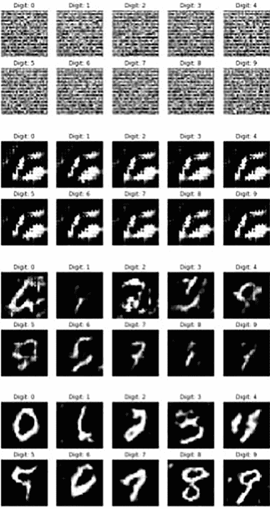

#### 8.3.8. 训练模型

最后，让我们运行我们刚刚实现的模型：

```
iterations = 12000                                ***1***
batch_size = 32
sample_interval = 1000

train(iterations, batch_size, sample_interval)    ***2***
```

+   ***1. 设置超参数**

+   ***2. 对 CGAN 进行指定次数的迭代训练**

#### 8.3.9. 检查输出：目标数据生成

图 8.7 展示了 CGAN 生成器在完全训练后产生的数字图像。在每一行中，我们指示生成器合成一个不同的数字，从 0 到 9。请注意，每个数字都以不同的书写风格呈现，这证明了 CGAN 不仅能够学习生成与训练数据集中每个标签匹配的示例，而且能够捕捉到训练数据的全部多样性。

##### 图 8.7. 每一行展示了一个用于匹配给定数字（0 到 9）的图像样本。如您所见，CGAN 生成器已经成功地学会了生成我们数据集中表示的每个类别。

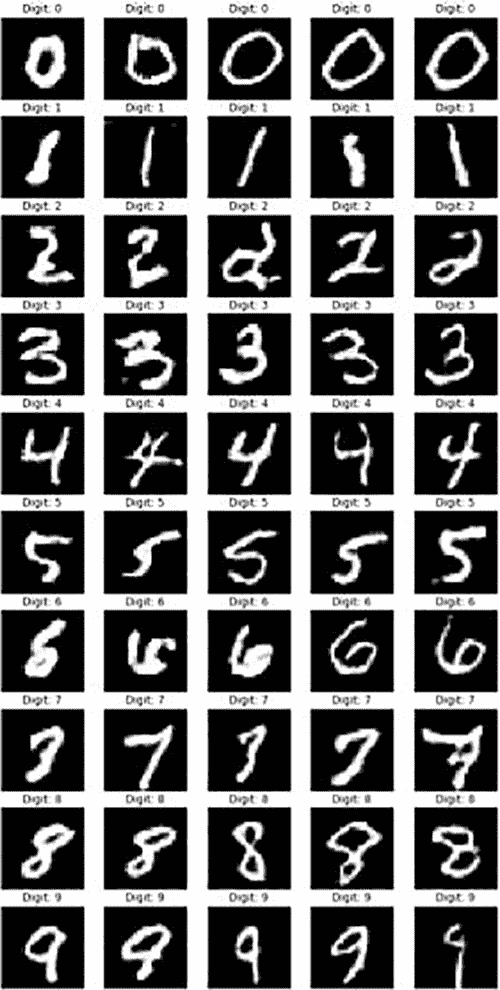

### 8.4. 结论

在本章中，您看到了如何使用标签来指导生成器和判别器的训练，以教会一个生成对抗网络（GAN）生成我们选择的假样本。除了 DCGAN 之外，CGAN 是最有影响力的早期 GAN 变体之一，它激发了无数新的研究方向。

在这些方法中，最有影响力和最有前景的是使用条件对抗网络作为图像到图像翻译问题的一般性解决方案。这类问题旨在将图像从一种模态转换为另一种模态。图像到图像翻译的应用范围从给黑白照片上色到将白天场景转换为夜晚，以及从地图视图合成卫星视图。

基于条件 GAN 范式最成功的早期实现之一是 pix2pix，它使用图像对（一个作为输入，另一个作为标签）来学习从一个域翻译到另一个域。回想一下，在理论和实践中，用于训练 CGAN 的条件信息可以远不止标签，以提供更复杂的使用案例和场景。例如，对于着色任务，图像对将是一张黑白照片（输入）和同一照片的彩色版本（标签）。你将在下一章中看到这些示例。

我们没有详细介绍 pix2pix，因为它发表后大约一年，就被另一种 GAN 变体所超越。这种变体不仅在图像到图像的翻译任务上超越了 pix2pix 的性能，而且无需配对图像就能完成这项任务。循环一致对抗网络（或 CycleGAN，正如这项技术后来所知）只需要两组代表两个域的图像（例如，一组黑白照片和一组彩色照片）。你将在下一章中了解这种引人注目的 GAN 变体。

### 概述

+   条件 GAN（CGAN）是一种 GAN 变体，其中生成器和判别器在训练期间都基于辅助数据，如类标签。

+   额外的信息限制了生成器合成特定类型的输出，并使判别器只能接受与给定额外信息匹配的真实示例。

+   作为教程，我们实现了一个 CGAN，通过使用 MNIST 类标签作为我们的条件信息，生成我们选择的逼真的手写数字。

+   嵌入将整数映射到所需大小的密集向量。我们使用嵌入从随机噪声向量和标签（用于 CGAN 生成器训练）以及输入图像和标签（用于 CGAN 判别器训练）创建联合隐藏表示。

## 第九章\. CycleGAN

*本章涵盖*

+   通过对整个图像进行条件化来扩展条件 GANs 的想法

+   探索最强大和复杂的 GAN 架构之一：CycleGAN

+   展示 GANs 的面向对象设计和其四个主要组件的架构

+   实现一个 CycleGAN 以运行苹果到橙子的转换

最后，一个几乎具有普遍吸引力的技术突破，因为似乎每个人都喜欢比较苹果和橙子。在本章中，你将学习如何做到这一点！但这不是一件小事，因此我们需要至少*两组*判别器和*两组*生成器来实现这一点。这显然使架构复杂化，因此我们需要花更多的时间来讨论它，但至少，这是一个很好的起点，以完全面向对象编程（OOP）的方式思考。

### 9.1\. 图像到图像的翻译

在上一章末尾我们提到的 GANs 应用的一个令人着迷的领域是*图像到图像的翻译*。在这个应用中，GANs 取得了巨大的成功——在视频、静态图像，甚至是风格转换中。事实上，GANs 在这些应用中处于前沿，因为它们几乎开启了一个全新的使用类别。由于它们的视觉特性，更成功的 GAN 变体通常在 YouTube 和 Twitter 上广为流传，所以如果您还没有看过这些视频，我们鼓励您通过搜索*pix2pix*、*CycleGAN*或*vid2vid*来查看它们。

实际上，这种翻译意味着我们的生成器输入是一个图片，因为我们需要我们的生成器（翻译器）从这个图像开始。换句话说，我们正在将一个图像从一个域映射到另一个域。以前，生成过程中用于播种的潜在向量通常是一个难以理解的向量。现在我们用输入图像来替换它。

将图像到图像翻译视为条件 GAN 的一个特殊情况是一个很好的思考方式。然而，在这种情况下，我们是在一个完整的图像上进行条件化（而不是仅仅一个类别）——通常与输出图像具有相同的维度性，然后将其作为标签（在第八章中介绍）提供给网络。在这个领域，第一个著名的例子是来自加州大学伯克利分校的一个图像翻译工作，如图 9.1 所示。

##### 图 9.1\. 条件 GANs 提供了一个强大的框架，用于图像翻译，在许多领域都表现出色。


（来源：“使用条件对抗网络的图像到图像翻译”，作者：Phillip Isola，[`github.com/phillipi/pix2pix`](https://github.com/phillipi/pix2pix).）

如您所见，我们可以从以下任何一种映射：

+   从语义标签（例如，在汽车应该画蓝色的地方画蓝色，在道路应该画紫色的地方画紫色）到街道的逼真图像

+   从卫星图像到类似于谷歌地图的视图

+   从日间图像到夜间图像

+   从黑白到彩色

+   从轮廓到合成的时尚物品

这个想法显然非常强大且灵活；然而，问题在于需要成对的数据。从第八章，您了解到我们需要为条件 GAN 提供标签。因为在这种情况下，我们使用另一张图像作为标签，除非我们映射到对应的图像——即在其他域中的完全相同的图像，否则这种映射没有意义。

因此，夜间图像需要与日间图像来自完全相同的位置。时尚物品的轮廓需要与训练集中其他域中完全彩色/合成的物品的精确匹配。换句话说，在训练过程中，GAN 需要能够访问原始域中物品的对应标签。

这通常是通过首先加载大量的彩色图片，对所有这些图片应用黑白滤镜，然后使用未修改的图像作为一个域，而黑白滤镜后的图像作为另一个域来完成的。这确保了我们在这两个域中都有相应的图像。然后我们可以在任何地方应用训练好的 GAN，但如果我们没有生成这些“完美”对子的简单方法，我们就很不幸了！

### 9.2. 循环一致性损失：去而复返的 aGAN

这组加州大学伯克利分校的天才洞察力是，我们实际上并不需要完美的对子.^([1]) 相反，我们只是完成循环：从一个域翻译到另一个域，然后再翻译回来。例如，我们将公园的夏季图片（域 A）翻译成冬季图片（域 B），然后再翻译回夏季（域 A）。现在我们基本上创建了一个循环，理想情况下，原始图片(*a*)和重建图片(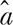)是相同的。如果它们不相同，我们可以在像素级别上衡量它们的损失，从而得到 CycleGAN 的第一个损失：*循环一致性损失*，这在图 9.2 中有所描述。

> ¹
> 
> 参见 Jun-Yan Zhu 等人 2017 年的论文“使用循环一致性对抗网络的未配对图像到图像翻译”，[`arxiv.org/pdf/1703.10593.pdf`](https://arxiv.org/pdf/1703.10593.pdf)。

##### 图 9.2。因为损失是双向的，我们现在不仅可以从夏季到冬季再现图像，还可以从冬季到夏季再现。如果 G 是从 A 到 B 的生成器，F 是从 B 到 A 的生成器，那么。

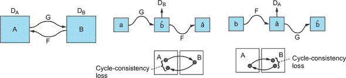

（来源：Jun-Yan Zhu 等人，2017 年，[`arxiv.org/pdf/1703.10593.pdf`](https://arxiv.org/pdf/1703.10593.pdf)）

一个常见的类比是思考*回译*的过程——一个中文句子翻译成英文，然后再翻译回中文应该给出相同的句子。如果不是这样，我们可以通过第一句和第三句之间的差异来衡量循环一致性损失。

要能够使用循环一致性损失，我们需要有两个生成器：一个将 A 翻译到 B，称为*G[AB]*，有时简单地称为*G*，然后另一个将 B 翻译到 A，称为*G[BA]*，简称*F*。技术上存在两个损失——正向循环一致性损失和反向循环一致性损失——但因为他们本质上意味着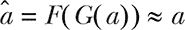以及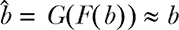，你可以认为这些基本上是相同的，但差一个。

### 9.3. 对抗损失

除了循环一致性损失之外，我们仍然有*对抗损失*。每个由生成器*G[AB]*进行的翻译都有一个相应的判别器*D[B]*，而*G[BA]*有判别器*D[A]*。可以这样考虑，我们在翻译到域 A 时总是测试图片是否看起来真实；因此我们使用*D[A]*，反之亦然。

这与更简单的架构中的想法相同，但现在，由于有两个损失，我们有两个判别器。我们需要确保不仅从苹果到橙子的转换看起来真实，而且从我们估计的橙子回到重建的苹果的转换也看起来真实。回想一下，对抗性损失确保图像看起来真实，因此它仍然是 CycleGAN 工作的关键。因此，对抗性损失被列为第二。循环中的第一个判别器尤为重要——否则，我们只会得到帮助 GAN 记忆它应该重建的噪声。^([3)] 图 9.3 展示了身份丢失的效果。

> ²
> 
> 在实践中，这要复杂一些，这取决于例如你是否包括正向和反向循环损失。但你可以将此作为一个心理模型来思考对抗性损失的重要性——记住我们有两个映射 A-B-A 和 B-A-B，所以两个判别器都可能在某个时刻成为第一个。

### 9.4\. 身份丢失

*身份丢失* 的概念很简单：我们希望 CycleGAN 保留图片的整体色彩结构（或 *温度*）。因此，我们引入了一个正则化项，帮助我们保持图片色调与原始图像的一致性。想象一下，这是一种确保即使在你对图片应用了许多滤镜之后，你仍然可以恢复原始图片的方法。

这是通过将域 A 中的图像输入到从 B 到 A 的生成器 (*G[BA]*) 中来实现的，因为 CycleGAN 应该理解它们已经在正确的域中。换句话说，我们惩罚对图像的不必要更改：如果我们输入一只斑马并试图“斑马化”一张图片，我们会得到同样的斑马，因为没有其他事情要做。图 9.3 展示了身份丢失的效果。

> ³
> 
> Jun Yan Zhu 等人，2017，[`arxiv.org/pdf/1703.10593.pdf`](https://arxiv.org/pdf/1703.10593.pdf)。更多信息请访问 [`mng.bz/loE8`](http://mng.bz/loE8)。

##### 图 9.3\. 一张图片胜过千言万语，用以阐明身份丢失的效果：在没有身份丢失的情况下，图片有明显的色调，由于似乎没有理由，所以我们试图惩罚这种行为。即使在黑白图片中，你也应该能够看到差异。然而，要看到它的全部效果，请查看在线的全彩版本。

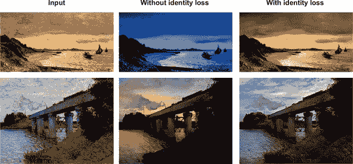

尽管从严格意义上讲，身份丢失不是 CycleGAN 工作的必要条件，但我们为了完整性而包含它。我们的实现和 CycleGAN 作者的最新实现都包含它，因为这种调整通常会导致经验上更好的结果，并强制执行一个看似合理的约束。但即使 CycleGAN 论文本身也只简要地将其作为似乎事后的合理化，所以我们没有对其进行深入探讨。

表 9.1 总结了本章中你学到的损失。

##### 表 9.1\. 损失

|   | 计算 | 衡量 | 确保 |
| --- | --- | --- | --- |
| 对抗性损失 | *L[GAN] (G,D[B],B,A)* = *E[b~p(b)]*[*logD[B]*(*b*)] *+ E[a~p(a)]*[*log*(*1-D[B]*(*G[AB]*(*a*))] (这是在第五章中介绍的古老的好 NS-GAN。) | 与之前的情况一样，损失衡量两个术语：第一个是给定图像是真实图像而不是翻译图像的可能性。第二个是生成器可能欺骗判别器的地方。请注意，这个公式仅适用于*D[B]*，等效的*D[A]*将在最终损失中体现。 | 翻译图像看起来真实、清晰，与真实图像无法区分。 |
| 循环一致性损失：正向传播 | *a*和之间的差异（用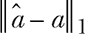^([a])表示） | 原始域*a*中的图像和两次翻译后的图像之间的差异。 | 原始图像和两次翻译后的图像是相同的。如果这失败了，我们可能没有连贯的映射 A-B-A。 |
| 循环一致性损失：反向传播 | 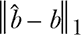 | 原始域*b*中的图像和两次翻译后的图像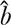之间的差异。 | 原始图像和两次翻译后的图像是相同的。如果这失败了，我们可能没有连贯的映射 B-A-B。 |
| 整体损失 | *L = L[GAN]*(*G,D[B],A,B*) + *L[GAN]*(*F,D[A],B,A*) + *λ*cyc | 所有四个损失相结合（由于两个生成器，因此是 2×对抗性）加上循环损失：一个术语中的正向和反向。 | 整体翻译是逼真的，并且有意义（提供匹配的图片）。 |
| 标识损失（在整体损失之外，为了与 CycleGAN 论文的符号保持一致） | *L*[identity] = *E[a~p(a)]*[&#124;&#124; *G[BA]*(*a*) – *a* &#124;&#124;] *+ E[b~p(b)]* [&#124;&#124; *G[AB]* (*b*) – *b* &#124;&#124;] | *B*中的图像与*G*AB 之间的差异以及反之亦然。 | CycleGAN 仅在需要时才更改图像的某些部分。 |

> ^a
> 
> 这种符号可能对一些人来说不熟悉，但它代表了两个项目之间的 L1 范数。为了简单起见，你可以将其视为对于每个像素，它与重建图像上相应像素之间的绝对差异。

### 9.5. 架构

CycleGAN 的设置直接基于 CGAN 架构，本质上是由两个 CGAN 结合在一起——或者，正如 CycleGAN 的作者们自己指出的，是一个自动编码器。回顾第二章，我们有一个输入图像*x*和重建图像*x**，这是在通过潜在空间*z*重建后的结果；参见图 9.4。

##### 图 9.4。在这张来自第二章的自动编码器图像中，我们使用了将人类概念（步骤 1）压缩成更紧凑的书面形式在信件中（步骤 2），然后将其扩展到（不完美的）同一概念在别人头脑中的想法（步骤 3）的类比。

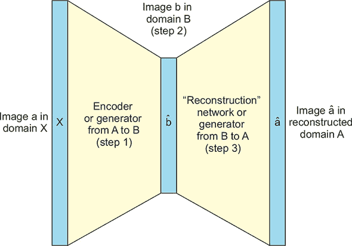

为了将这个图转换为 CycleGAN 的世界，*a*是域 A 中的一个图像，*b*是域 B 中的一个图像，而是重建的 A。然而，在 CycleGAN 的情况下，我们处理的是一个具有相同维度的潜在空间——步骤 2。这恰好是 CycleGAN 必须找到的另一个有意义的域（B）。即使对于自动编码器，潜在空间也只是另一个域，尽管它并不容易解释。

与我们在第二章中了解的内容相比，主要的新概念是引入了对抗性损失。这些以及许多其他自动编码器和 GAN 的混合体本身就是一个活跃的研究领域！因此，这也是一个对感兴趣的研究者来说很好的领域。但就目前而言，将这两个映射视为两个自动编码器：*F*(*G*(*a*))和*G*(*F*(*b*))。我们采用了自动编码器的基本思想——包括一种*显式*的损失函数，由循环一致性损失所代替——并在此基础上添加了判别器。两个判别器，每个步骤一个，确保两种转换（包括进入*潜在空间*）在其各自的域中看起来都像真实的图像。

#### 9.5.1. CycleGAN 架构：构建网络

在我们深入 CycleGAN 的实际实现之前，让我们简要地看一下图 9.5 中描述的整体简化实现。有两个流程：在上面的图中，流程 A-B-A 从一个域 A 的图像开始，在下面的图中，流程 B-A-B 从一个域 B 的图像开始。

##### 图 9.5。在这个 CycleGAN 的简化架构中，我们从一个输入图像开始，这个图像要么（1）被送到判别器进行评估，要么（2）被转换到另一个域，由另一个判别器评估，然后转换回来。

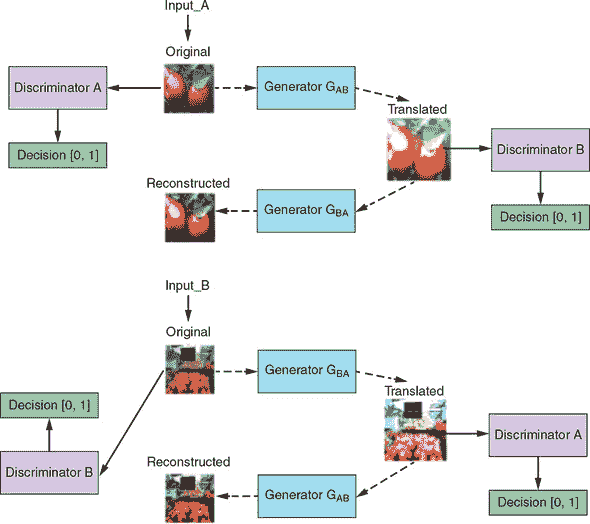

（来源：“在 TensorFlow 中理解和实现 CycleGAN”，作者 Hardik Bansal 和 Archit Rathore，2017 年，[`hardikbansal.github.io/CycleGANBlog/`](https://hardikbansal.github.io/CycleGANBlog/)。）

然后，图像遵循两条路径：它（1）被送入判别器以获取我们对其是否真实的判断，并且（2）（i）被送入生成器以将其转换为 B，然后（ii）由判别器 B 评估以查看它是否在域 B 中看起来像真实的图像，最终（iii）转换回 A 以允许我们测量循环损失。

底部图像基本上是顶部图像的一个*偏移一个周期*，遵循所有相同的根本步骤。我们将使用 apple2orange 数据集，但还有许多其他数据集可用，包括著名的 horse2zebra 数据集，你可以通过稍微修改代码并使用提供的 bash 脚本来下载数据轻松使用。

为了更清晰地总结图 9.5，表 9.2 回顾了所有四个主要网络。

##### 表 9.2. 网络

|    | 输入 | 输出 | 目标 |
| --- | --- | --- | --- |
| 生成器：从 A 到 B | 我们加载来自 A 的真实图片或从 B 到 A 的翻译。 | 我们将其翻译到域 B。 | 尝试在域 B 中创建看起来逼真的图像。 |
| 生成器：从 B 到 A | 我们加载来自 B 的真实图片或从 A 到 B 的翻译。 | 我们将其翻译到域 A。 | 尝试在域 A 中创建看起来逼真的图像。 |
| A 域判别器 | 我们提供一个 A 域的图片——无论是翻译的还是真实的。 | 图片为真实的概率。 | 尝试不要被从 B 到 A 的生成器欺骗。 |
| B 域判别器 | 我们提供一个 B 域的图片——无论是翻译的还是真实的。 | 图片为真实的概率。 | 尝试不要被从 A 到 B 的生成器欺骗。 |

#### 9.5.2. 生成器架构

图 9.6 展示了生成器的架构。我们使用代码中的变量名重新创建了图表，并包括了形状供您参考。这是一个*U-Net*架构的例子，因为当你以这种方式绘制它，使得每个分辨率都有自己的级别时，网络看起来像字母 U。

##### 图 9.6. 生成器的架构。生成器本身有一个收缩路径（d0 到 d3）和一个扩展路径（u1 到 u4）。收缩和扩展路径有时分别被称为编码器和解码器。

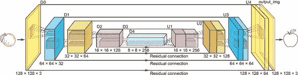

这里有几个需要注意的事项：

+   我们在编码器中使用标准的卷积层。

+   从这些中，我们创建*跳过连接*，以便信息更容易在网络中传播。在图中，这分别用 d0 到 d3 和 u1 到 u4 之间的轮廓和颜色编码表示。你可以看到解码器中一半的块来自这些跳过连接（注意特征图数量翻倍！）^([4])

    > ⁴
    > 
    > 正如你将看到的，这仅仅意味着我们将整个块/张量连接到解码器部分的相应颜色张量。

+   解码器使用反卷积层，加上一个最终的卷积层，将图像上采样到与原始图像等效的大小。

由于生成器具有编码器-解码器架构，因此自编码器对于生成器架构本身也是一个有用的教学工具：

+   ***编码器—*** 第 1 步来自图 9.4：这些是减少每个特征图分辨率（*层*或*切片*）的卷积层。这是收缩路径（d0 到 d3）。

+   ***解码器—*** 第 3 步来自图 9.4：这些是*反卷积*层（转置卷积），将图像放大回 128 × 128。这是扩展路径（u1 到 u4）。

为了明确，这里的自动编码器模型在两个方面是有用的。首先，整个 CycleGAN 架构可以看作是训练了两个自动编码器。^([[5)] 第二，U-Net 本身有被称为*编码器*和*解码器*的部分。

> ⁵
> 
> 参见 Jun-Yan Zhu 等人，2017 年，[`arxiv.org/pdf/1703.10593.pdf`](https://arxiv.org/pdf/1703.10593.pdf)。

你可能对降采样和随后的升采样也感到有些困惑，但这只是为了将图像压缩到最有意义的表示，同时还能添加回所有细节。这与自动编码器的推理相同，但现在我们还有一个路径来记住细微差别。这种架构——*U-Net 架构*——已经在几个领域被实证证明在多种分割任务上表现更好。关键思想是，尽管在降采样过程中我们可以专注于分类和理解大区域，包括更高分辨率的跳过连接可以保留可以准确分割的细节。

在我们的 CycleGAN 实现中，我们将使用带有跳过连接的 U-Net 架构，如图图 9.6 所示，这更易于阅读。然而，许多 CycleGAN 实现使用 ResNet 架构，你可以通过一些额外的工作自己实现。


##### 注意

ResNet 的主要优势是它使用了更少的参数，并在中间引入了一个称为*transformer*的步骤，该步骤使用残差连接代替我们的编码器-解码器跳过连接。


根据我们的测试，至少在所使用的数据集上，apple2orange 的结果保持不变。我们不是明确地定义了 transformer，而是提供了从卷积层到反卷积层的跳过连接（如图中所示）。我们将在代码中再次提及这些相似之处。现在，只需记住这一点。

#### 9.5.3. 判别器架构

CycleGAN 的判别器基于 PatchGAN 架构——我们将在代码部分深入技术细节。可能令人困惑的一点是，我们从这个判别器得到的不是一个浮点数作为输出，而是一组单通道值，可以将其视为一组迷你判别器，然后我们将它们平均在一起。

最终，这允许 CycleGAN 的设计完全卷积，意味着它可以相对容易地扩展到更高的分辨率。确实，在将视频游戏转换为现实或反之亦然的例子中，CycleGAN 的作者使用了 CycleGAN 的升级版本，由于完全卷积的设计，只有微小的修改。除此之外，判别器应该是对你之前见过的判别器的一个相对直接的实现，但现在有两个。

### 9.6\. GANs 的面向对象设计

我们在 TensorFlow 和面向对象编程（OOP）中始终使用对象，但在我们的代码中通常更功能性地处理架构，因为它们通常是简单的。在 CycleGAN 的情况下，架构是复杂的，因此我们需要一个结构，允许我们继续访问我们定义的原始属性和方法。因此，我们将 CycleGAN 编写为一个具有构建生成器和判别器以及运行训练的方法的 Python 类。

### 9.7\. 教程：CycleGAN

在这个教程中，我们将使用 Keras-GAN 实现，并使用具有 TensorFlow 后端的 Keras。^([6]) 在 Keras 2.2.4 和 TensorFlow 1.12.0 的最新测试中，`Keras_contrib`是从 hash 46fcdb9384b3bc9399c651b2b43640aa54098e64 安装的。这次，我们必须使用不同的数据集（也为了向你展示，尽管我们在第二章（../Text/kindle_split_011.xhtml#ch02）中的玩笑，但我们*确实*知道其他数据集）。但出于教育目的，我们将继续使用其中一个较简单的数据集——apple2orange。让我们直接进入正题，按照以下列表所示进行所有我们通常的导入。

> ⁶
> 
> 查看 Erik Linder-Norén 于 2017 年的 Keras-GAN GitHub 仓库，[`github.com/eriklindernoren/Keras-GAN`](https://github.com/eriklindernoren/Keras-GAN)。

##### 列表 9.1\. 导入所有内容

```
from __future__ import print_function, division
import scipy
from keras.datasets import mnist
from keras_contrib.layers.normalization import InstanceNormalization
from keras.layers import Input, Dense, Reshape, Flatten, Dropout, Concatenate
from keras.layers import BatchNormalization, Activation, ZeroPadding2D
from keras.layers.advanced_activations import LeakyReLU
from keras.layers.convolutional import UpSampling2D, Conv2D
from keras.models import Sequential, Model
from keras.optimizers import Adam
import datetime
import matplotlib.pyplot as plt
import sys
from data_loader import DataLoader
import numpy as np
import os
```

如同承诺的那样，我们将使用面向对象的编程风格。在下面的列表中，我们创建了一个包含所有初始化参数的 CycleGAN 类，包括数据加载器。数据加载器定义在我们的书籍 GitHub 仓库中。它简单地加载预处理后的数据。

##### 列表 9.2\. 开始 CycleGAN 类

```
class CycleGAN():
    def __init__(self):
        self.img_rows = 128                                             ***1***
        self.img_cols = 128                                             ***1***
        self.channels = 3                                               ***1***
        self.img_shape = (self.img_rows, self.img_cols, self.channels)

        self.dataset_name = 'apple2orange'                              ***2***
        self.data_loader = DataLoader(dataset_name=self.dataset_name,   ***3***
                                      img_res=(self.img_rows, self.img_cols))

        patch = int(self.img_rows / 2**4)                               ***4***
        self.disc_patch = (patch, patch, 1)

        self.gf = 32                                                    ***5***
        self.df = 64                                                    ***6***

        self.lambda_cycle = 10.0                                        ***7***
        self.lambda_id = 0.9 * self.lambda_cycle                        ***8***

        optimizer = Adam(0.0002, 0.5)
```

+   ***1* 输入形状**

+   ***2* 配置数据加载器**

+   ***3* 使用 DataLoader 对象导入预处理后的数据集**

+   ***4* 计算 D（PatchGAN）的输出形状**

+   ***5* G 的第一层中的过滤器数量**

+   ***6* D 的第一层中的过滤器数量**

+   ***7* 循环一致性损失权重**

+   ***8* 标识损失权重**

两个新术语是 `lambda_cycle` 和 `lambda_id`。第二个超参数影响身份损失。CycleGAN 作者本人指出，此值影响变化程度——尤其是在训练过程的早期。7 设置较低值会导致不必要的改变：例如，早期完全反转颜色。我们根据多次重新运行 apple2orange 训练过程选择了此值。通常，这个过程是理论驱动的炼金术。

> ⁷
> 
> 请参阅 Jun-Yan Zhu 的“pytorch-CycleGAN-and-pix2pix 常见问题解答”，2019 年 4 月，[`mng.bz/BY58`](http://mng.bz/BY58)。

第一个超参数—`lambda_cycle`—控制循环一致性损失的执行严格程度。设置此值较高将确保您的原始图像和重建图像尽可能接近。

#### 9.7.1\. 构建网络

因此，现在我们已经处理好了基本参数，我们将构建基本网络，如图 清单 9.3 所示。我们将从高层次视图开始，逐步深入。这包括以下内容：

1.  创建两个判别器 *D[A]* 和 *D[B]* 并编译它们

1.  创建两个生成器：

    1.  实例化 *G[AB]* 和 *G[BA]*

    1.  为两个方向的图像输入创建占位符

    1.  将它们都链接到另一个域中的图像

    1.  为在原始域中重建的图像创建占位符

    1.  为两个方向创建身份损失约束

    1.  目前不使判别器的参数可训练

    1.  编译两个生成器

##### 清单 9.3\. 构建网络

```
        self.d_A = self.build_discriminator()                     ***1***
        self.d_B = self.build_discriminator()                     ***1***
        self.d_A.compile(loss='mse',                              ***1***
                         optimizer=optimizer,                     ***1***
                         metrics=['accuracy'])                    ***1***
        self.d_B.compile(loss='mse',                              ***1***
                         optimizer=optimizer,                     ***1***
                         metrics=['accuracy'])                    ***1***

        self.g_AB = self.build_generator()                        ***2***
        self.g_BA = self.build_generator()                        ***2***

        img_A = Input(shape=self.img_shape)                       ***3***
        img_B = Input(shape=self.img_shape)                       ***3***

        fake_B = self.g_AB(img_A)                                 ***4***
        fake_A = self.g_BA(img_B)                                 ***4***
        reconstr_A = self.g_BA(fake_B)                            ***5***
        reconstr_B = self.g_AB(fake_A)                            ***5***
        img_A_id = self.g_BA(img_A)                               ***6***
        img_B_id = self.g_AB(img_B)                               ***6***

        self.d_A.trainable = False                                ***7***
        self.d_B.trainable = False                                ***7***

        valid_A = self.d_A(fake_A)                                ***8***
        valid_B = self.d_B(fake_B)                                ***8***

        self.combined = Model(inputs=[img_A, img_B],              ***9***
                              outputs=[valid_A, valid_B,          ***9***

                                       reconstr_A, reconstr_B,    ***9***
                                       img_A_id, img_B_id])       ***9***
        self.combined.compile(loss=['mse', 'mse',                 ***9***
                                    'mae', 'mae',                 ***9***
                                    'mae', 'mae'],                ***9***
                              loss_weights=[1, 1,
                                            self.lambda_cycle,
     self.lambda_cycle,
                                            self.lambda_id, self.lambda_id],
                              optimizer=optimizer)
```

+   ***1* 构建并编译判别器**

+   ***2* 从这里开始，我们构建生成器的计算图。这两行首先构建生成器。**

+   ***3* 从两个域获取图像**

+   ***4* 将图像转换到另一个域**

+   ***5* 将图像转换回原始域**

+   ***6* 图像的身份映射**

+   ***7* 对于结合模型，我们只训练生成器。**

+   ***8* 判别器确定转换图像的有效性**

+   ***9* 结合模型训练生成器欺骗判别器**

最后一点需要从前面的代码中澄清：`combined` 模型的输出以六个列表的形式出现。这是因为我们总是得到有效性（来自判别器）、重建和身份损失——一个用于 A-B-A，一个用于 B-A-B 循环——因此是六个。前两个是平方误差，其余是平均绝对误差。相对权重受前面描述的 `lambda` 因素影响。

#### 9.7.2\. 构建生成器

接下来，我们在 清单 9.4 中构建生成器代码，该代码使用我们在 第 9.5.2 节 中描述的跳跃连接。这是 U-Net 架构。这个架构比一些实现中使用的 ResNet 架构更简单。在我们的生成器函数中，我们首先定义辅助函数：

1.  将 `conv2d()` 函数定义为如下：

    1.  标准的 2D 卷积层

    1.  Leaky ReLU 激活

    1.  实例归一化^([8])

        > ⁸
        > 
        > 实例归一化类似于第四章中的批归一化，除了我们不是基于整个批次的全部信息进行归一化，而是对每个通道中的每个特征图分别进行归一化。实例归一化通常会产生更好的图像质量，适用于风格迁移或图像到图像翻译等任务——这正是 CycleGAN 所需要的！

1.  定义`deconv2d()`函数作为一个转置卷积（即 *反卷积*）层，它执行以下操作：

    > ⁹
    > 
    > 这里，*转置卷积*是——有人认为——一个更准确的术语。然而，只需将其视为卷积的相反，或反卷积。

    1.  提升输入层`input_layer`

    1.  如果我们设置了 dropout 率，可能会应用 dropout

    1.  总是应用`InstanceNormalization`

    1.  更重要的是，在其输出层和从图 9.4 的下采样部分对应维度的层之间创建跳过连接

    |  |
    | --- |

    ##### 注意

    在步骤 2d 中，我们使用简单的`UpSampling2D`，这不是一个学习参数，而是使用最近邻插值。

    |  |
    | --- |

    然后我们创建实际的生成器：

1.  将输入（128 × 128 × 3）分配给`d0`。

1.  通过卷积层`d1`运行，得到 64 × 64 × 32 层。

1.  将`d1`（64 × 64 × 32）应用`conv2d`得到 32 × 32 × 64（`d2`）。

1.  将`d2`（32 × 32 × 64）应用`conv2d`得到 16 × 16 × 128（`d3`）。

1.  将`d3`（16 × 16 × 128）应用`conv2d`得到 8 × 8 × 256（`d4`）。

1.  `u1`：上采样`d4`并在`d3`和`u1`之间创建跳过连接。

1.  `u2`：上采样`u1`并在`d2`和`u2`之间创建跳过连接。

1.  `u3`：上采样`u2`并在`d1`和`u3`之间创建跳过连接。

1.  `u4`：使用常规上采样得到 128 × 128 × 64 图像。

1.  使用常规的 2D 卷积去除额外的特征图，只得到 128 × 128 × 3（高度 × 宽度 × 颜色通道）

##### 列表 9.4\. 构建生成器

```
    def build_generator(self):
        """U-Net Generator"""

        def conv2d(layer_input, filters, f_size=4):
            """Layers used during downsampling"""
            d = Conv2D(filters, kernel_size=f_size,
                       strides=2, padding='same')(layer_input)
            d = LeakyReLU(alpha=0.2)(d)
            d = InstanceNormalization()(d)
            return d

        def deconv2d(layer_input, skip_input, filters, f_size=4,
            dropout_rate=0):
            """Layers used during upsampling"""
            u = UpSampling2D(size=2)(layer_input)
            u = Conv2D(filters, kernel_size=f_size, strides=1,
                       padding='same', activation='relu')(u)
            if dropout_rate:
                u = Dropout(dropout_rate)(u)
            u = InstanceNormalization()(u)
            u = Concatenate()([u, skip_input])
            return u

        d0 = Input(shape=self.img_shape)     ***1***

        d1 = conv2d(d0, self.gf)             ***2***
        d2 = conv2d(d1, self.gf * 2)         ***2***
        d3 = conv2d(d2, self.gf * 4)         ***2***
        d4 = conv2d(d3, self.gf * 8)         ***2***

        u1 = deconv2d(d4, d3, self.gf * 4)   ***3***
        u2 = deconv2d(u1, d2, self.gf * 2)   ***3***
        u3 = deconv2d(u2, d1, self.gf)       ***3***

        u4 = UpSampling2D(size=2)(u3)
        output_img = Conv2D(self.channels, kernel_size=4,
                            strides=1, padding='same', activation='tanh')(u4)

        return Model(d0, output_img)
```

+   ***1* 图像输入**

+   ***2* 下采样**

+   ***3* 上采样**

#### 9.7.3\. 构建判别器

现在是判别器方法，它使用一个辅助函数来创建由 2D 卷积、`LeakyReLU`和可选的`InstanceNormalization`组成的层。

我们以以下方式应用这些层，如图列表 9.5 所示：

1.  我们将输入图像（128 × 128 × 3）分配给`d1`（64 × 64 × 64）。

1.  我们将`d1`（64 × 64 × 64）分配给`d2`（32 × 32 × 128）。

1.  我们将`d2`（32 × 32 × 128）分配给`d3`（16 × 16 × 256）。

1.  我们将`d3`（16 × 16 × 256）分配给`d4`（8 × 8 × 512）。

1.  我们将`d4`（8 × 8 × 512）通过`conv2d`展平为 8 × 8 × 1。

##### 列表 9.5\. 构建判别器

```
def build_discriminator(self):

        def d_layer(layer_input, filters, f_size=4, normalization=True):
            """Discriminator layer"""
            d = Conv2D(filters, kernel_size=f_size,
                       strides=2, padding='same')(layer_input)
            d = LeakyReLU(alpha=0.2)(d)
            if normalization:
                d = InstanceNormalization()(d)
            return d

        img = Input(shape=self.img_shape)

        d1 = d_layer(img, self.df, normalization=False)
        d2 = d_layer(d1, self.df * 2)
        d3 = d_layer(d2, self.df * 4)
        d4 = d_layer(d3, self.df * 8)

        validity = Conv2D(1, kernel_size=4, strides=1, padding='same')(d4)

        return Model(img, validity)
```

#### 9.7.4\. 训练 CycleGAN

所有网络编写完毕后，我们现在将实现创建训练循环的方法。对于 CycleGAN 训练算法，每个训练迭代的细节如下。

| |
| --- |

**CycleGAN 训练算法**

*对于*每个训练迭代*执行*

1.  训练判别器：

    1.  从每个域（*imgs[A]* 和 *imgs[B]*）中随机抽取一个图像的小批量。

    1.  使用生成器 *G[AB]* 将 *imgs[A]* 转换为域 B，反之亦然，使用 *G[BA]*。

    1.  计算 *D[A]*(*imgs[A]*, 1) 和 *D[A]*(*G[BA]*(*imgs[B]*), 0) 以获取 A 中真实图像和从 B 转换的图像的损失。然后将这两个损失相加。*D[A]* 中的 1 和 0 作为标签。

    1.  计算 *D[B]*(*imgs[B]*, 1) 和 *D[B]*(*G[AB]*(*imgs[A]*), 0) 以获取 B 中真实图像和从 A 转换的图像的损失。然后将这两个损失相加。*D[B]* 中的 1 和 0 作为标签。

1.  将步骤 c 和 d 的损失相加以获得总判别器损失。训练生成器：

    1.  我们使用组合模型来

        +   输入来自域 A (*imgs[A]*) 和 B (*imgs[B]*) 的图像

        +   输出如下

            1.  A 的有效性：*D[A]*(*G[BA]*(*imgs[B]*))

            1.  B 的有效性：*D[B]*(*G[AB]*(*imgs[A]*))

            1.  重建 A：*G[BA]*(*G[AB]*(*imgs[A]*))

            1.  重建 B：*G[AB]*(*G[BA]*(*imgs[B]*))

            1.  A 的身份映射：*G[BA]*(*imgs[A]*))

            1.  B 的身份映射：*G[AB]*(*imgs[B]*))

    1.  然后，我们根据循环一致性损失、身份损失和对抗损失更新两个生成器的参数

        +   标量（判别器概率）的均方误差 (MSE)

        +   均方绝对误差 (MAE) 用于图像（无论是重建的还是身份映射的）

*结束 for*

| |
| --- |

下面的列表实现了这个 CycleGAN 训练算法。

##### 列表 9.6. 训练 CycleGAN

```
    def train(self, epochs, batch_size=1, sample_interval=50):

        start_time = datetime.datetime.now()

        valid = np.ones((batch_size,) + self.disc_patch)                  ***1***
        fake = np.zeros((batch_size,) + self.disc_patch)

        for epoch in range(epochs):
            for batch_i, (imgs_A, imgs_B) in enumerate(
                self.data_loader.load_batch(batch_size)):

                fake_B = self.g_AB.predict(imgs_A)                        ***2***
                fake_A = self.g_BA.predict(imgs_B)                        ***2***

                dA_loss_real = self.d_A.train_on_batch(imgs_A, valid)     ***3***
                dA_loss_fake = self.d_A.train_on_batch(fake_A, fake)      ***3***
                dA_loss = 0.5 * np.add(dA_loss_real, dA_loss_fake)        ***3***
                                                                          ***3***
                dB_loss_real = self.d_B.train_on_batch(imgs_B, valid)     ***3***
                dB_loss_fake = self.d_B.train_on_batch(fake_B, fake)      ***3***
                dB_loss = 0.5 * np.add(dB_loss_real, dB_loss_fake)        ***3***

                d_loss = 0.5 * np.add(dA_loss, dB_loss)                   ***4***

                g_loss = self.combined.train_on_batch([imgs_A, imgs_B],   ***5***
                                                      [valid, valid,
                                                       imgs_A, imgs_B,
                                                       imgs_A, imgs_B])
                if batch_i % sample_interval == 0:                        ***6***
                    self.sample_images(epoch, batch_i)                    ***7***
```

+   ***1. 对抗损失真实值***

+   ***2. 现在我们开始训练判别器。这些行将图像转换为相反的域。**

+   ***3. 训练判别器（原始图像 = 真实 / 转换 = 假）***

+   ***4. 总判别器损失***

+   ***5. 训练生成器***

+   ***6. 如果达到保存间隔 => 保存生成的图像样本***

+   ***7. 这个函数与您遇到过的类似，并在 GitHub 仓库中明确说明。**

#### 9.7.5. 运行 CycleGAN

我们已经编写了所有这些复杂的代码，现在准备好实例化一个 CycleGAN 对象，并查看一些从采样图像中获得的结果：

```
gan = CycleGAN()
gan.train(epochs=100, batch_size=64, sample_interval=10)
```

图 9.7 展示了我们辛勤工作的部分结果。

##### 图 9.7. 苹果转换为橙子，橙子转换为苹果。这些是我们 Jupyter 笔记本中直接显示的结果。（结果可能因随机种子、TensorFlow 和 Keras 的实现以及超参数而略有不同。）

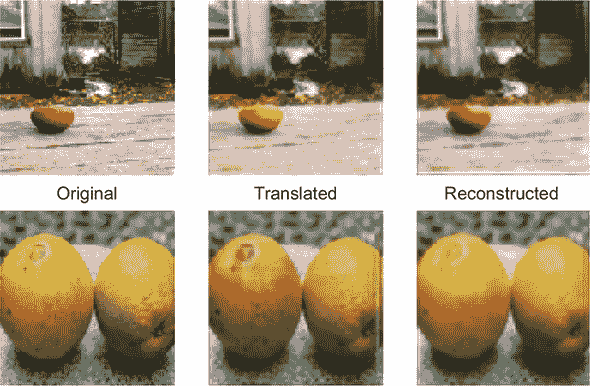

### 9.8. 扩展、增强和应用

当你运行这些结果时，我们希望你会像我们一样印象深刻。由于绝对惊人的结果，许多研究人员纷纷改进这项技术。本节详细介绍了 CycleGAN 的扩展，然后讨论了一些 CycleGAN 的应用。

#### 9.8.1\. 增强 CycleGAN

“从未配对数据中学习多对多映射的增强 CycleGAN”是对标准 CycleGAN 的一个真正巧妙的扩展，它在翻译过程中注入了潜在空间信息。在斯德哥尔摩的 ICML 2018 会议上提出，增强 CycleGAN 为我们提供了额外的变量，这些变量驱动着生成过程。^([10)] 就像我们在条件 GAN 的情况下使用潜在空间一样，我们可以在 CycleGAN 的设置中使用它，超越 CycleGAN 本身所做的工作。

> ^([10])
> 
> 参见 Ehsan Hosseini-Asl 的“增强循环对抗学习用于低资源域适应”，2019 年，[`arxiv.org/pdf/1807.00374.pdf`](https://arxiv.org/pdf/1807.00374.pdf).

例如，如果我们有 A 域中鞋的轮廓，我们可以在 B 域中生成一个样本，其中相同类型的鞋是蓝色的。在传统的 CycleGAN 情况下，它将始终是蓝色。但现在，有了我们可用的潜在变量，它可以变成橙色、黄色，或者我们选择的任何颜色。

这也是一个思考原始 CycleGAN 局限性的有用框架：因为我们没有给出任何额外的种子参数（例如额外的潜在向量 *z*），所以我们无法控制或改变输出结果。如果从一个特定的手提包轮廓中得到一个橙色的图像，它将始终是橙色。增强 CycleGAN 让我们对结果有了更多的控制，如图 9.8 所示。

##### 图 9.8\. 在增强 CycleGAN 的信息流中，我们有潜在向量 Za 和 Zb，它们与图像输入一起作为生成器的种子，有效地将问题简化为两个联合的 CGAN。这使我们能够控制生成。

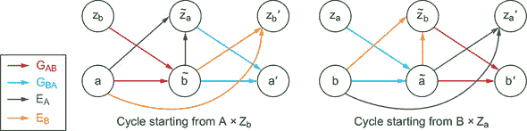

(来源：“从未配对数据中学习多对多映射的增强 CycleGAN”，作者：Amjad Almahairi 等，2018 年，[`arxiv.org/abs/1802.10151`](http://arxiv.org/abs/1802.10151).)

#### 9.8.2\. 应用

在 CycleGAN（或 CycleGAN 启发式）出现的不长的时间里，已经提出了许多应用。它们通常围绕创建模拟的虚拟环境，然后使它们变得逼真。例如，想象一下，如果你需要为一家自动驾驶汽车公司提供更多训练数据：只需在 Unity 或 GTA 5 图形引擎中模拟它，然后使用 CycleGAN 来转换数据。

如果你需要重现特定风险情况，而这些情况既昂贵又耗时（例如，汽车相撞，或消防车急速赶往目的地），但你需要在数据集中拥有它们，这尤其有效。对于一家自动驾驶汽车公司来说，这可能非常有用，以平衡数据集中罕见的风险情况，而正确的行为则更为重要。

这种框架的一个例子是 Cycle Consistent Adversarial Domain Adaptation (CyCADA).^([11]) 不幸的是，对这个工作方式的完整解释超出了本章的范围。这是因为还有许多这样的框架：一些甚至尝试在语言、音乐或其他形式的域适应中使用 CycleGAN。为了给你一个复杂性的感觉，图 9.9 展示了 CyCADA 的架构和设计。

> ¹¹
> 
> 见 Judy Hoffman 等人于 2017 年发表的“CyCADA: Cycle-Consistent Adversarial Domain Adaptation”，[`arxiv.org/pdf/1711.03213.pdf`](https://arxiv.org/pdf/1711.03213.pdf)。

##### 图 9.9。这种结构应该与之前的内容有些熟悉，所以希望这一章至少能给你一个良好的开端。有一点需要指出：我们现在有一个额外的步骤，包括标签和语义理解，这为我们提供了所谓的任务损失。这使我们能够检查生成的图像的语义意义。

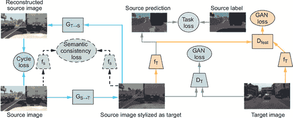

### 概述

+   由于需要完美的成对图像，图像到图像的翻译框架通常很难训练；CycleGAN 通过将其变成一个无配对域翻译来解决这一问题。

+   CycleGAN 有三个损失函数：

    +   **循环一致性**，它衡量原始图像与转换到不同域并再次转换回来的图像之间的差异

    +   **对抗性**，确保生成图像的逼真度

    +   **身份**，它保留图像的色彩空间

+   两个生成器使用 U-Net 架构，两个判别器使用基于 PatchGAN 的架构。

+   我们实现了 CycleGAN 的面向对象设计，并使用它将苹果转换为橙子。

+   CycleGAN 的实际应用包括自动驾驶汽车训练以及在翻译过程中创建不同风格图像的扩展。
