## 第三部分。从这里走向何方

第三部分 探索了你可以应用你在第一部分和第二部分中学到的关于 GANs 及其实现的一些实际用例和其他领域：

+   第十章 讨论了对抗样本（故意欺骗分类器犯错的手段），这是一个具有极大实践和理论重要性的领域。

+   第十一章探讨了 GANs 在医学和时尚领域的实际应用，其实现使用了本书中涵盖的 GAN 变体。

+   第十二章概述了 GANs 及其应用的伦理考量。我们还提到了那些对继续探索这一领域感兴趣的读者所关注的新兴 GAN 技术。

## 第十章。对抗样本

*本章涵盖*

+   一个在 GANs 之前出现且有着交织历史的迷人研究领域

+   计算机视觉环境中的深度学习方法

+   我们自己的带有真实图像和噪声的对抗样本

在本书的整个过程中，你已经将生成对抗网络（GANs）作为一个直观的概念来理解。然而，在 2014 年，GANs 似乎是一个巨大的信仰飞跃，尤其是对于那些不熟悉对抗样本这一新兴领域的人来说，包括伊恩·古德费洛（Ian Goodfellow）和其他人在这一领域的工作。1 这一章深入探讨了*对抗样本*——专门构建的样本，使其他分类算法失败。

> ¹
> 
> 请参阅 Christian Szegedy 等人于 2014 年发表的“神经网络的有趣特性”，[`arxiv.org/pdf/1312.6199.pdf`](https://arxiv.org/pdf/1312.6199.pdf)。

我们还讨论了它们与生成对抗网络（GANs）的联系，以及为什么和如何对抗性学习在机器学习（ML）中仍然是一个未解决的问题——这是当前方法的一个重要但很少被讨论的缺陷。尽管对抗样本在机器学习的鲁棒性、公平性和（网络安全）中扮演着重要角色，但这仍然是事实。

我们无法否认，在过去五年中，我们在机器学习匹配甚至超越人类水平性能的能力上取得了实质性进展——例如，在计算机视觉（CV）分类任务或玩游戏的能力。2 然而，仅仅关注指标和 ROC 曲线 3 对于我们理解（a）神经网络做出决策的原因（它们是如何工作的）以及（b）它们容易犯的错误是不够的。这一章触及了第一个问题，并深入探讨了第二个问题。在我们开始之前，应该指出的是，尽管这一章几乎完全涉及 CV 问题，但对抗样本已经在文本甚至人类等多样化的领域中得到了识别。4]

> ²
> 
> 视觉分类任务中构成人类水平表现的因素是一个复杂的话题。然而，至少在例如 Dota 2 和围棋这样的游戏中，人工智能已经以相当大的优势击败了人类专家。
> 
> ³
> 
> 一个 *接收者操作特征（ROC）曲线* 解释了假阳性和假阴性之间的权衡。我们也在第二章中遇到了它们。[`arxiv.org/abs/1901.06796`](http://arxiv.org/abs/1901.06796)。更多细节，维基百科有很好的解释。
> 
> ⁴
> 
> 参见 Wei Emma Zhang 等人撰写的“自然语言处理中深度学习模型的对抗攻击：综述”，2019 年，[`arxiv.org/abs/1901.06796`](http://arxiv.org/abs/1901.06796)。另见 Gamaleldin F. Elsayed 等人撰写的“欺骗计算机视觉和有限时间人类的对抗示例”，2018 年，[`arxiv.org/abs/1802.08195`](http://arxiv.org/abs/1802.08195)。

首先，当我们谈论神经网络的性能时，我们经常读到它们的错误率在大型 ImageNet 数据集上低于人类。这个经常被引用的统计数据——它更多的是一个学术玩笑而不是其他——掩盖了隐藏在平均数背后的性能差异。虽然人类的错误率往往是由他们无法区分数据集中突出显示的不同品种的狗所驱动的，但机器学习失败的情况则更为严重。经过进一步调查，对抗样本应运而生。

与人类不同，CV 算法在处理本质上非常不同且可能接近训练数据的问题上存在困难。因为算法必须对每张可能的图片做出预测，它必须在训练数据中看到的孤立且相距甚远的单个实例之间进行外推，即使我们有很多这样的实例。

当我们训练了 Inception V3 和 VGG-19 这样的网络时，我们发现了一种令人惊叹的方法，可以在训练数据周围的薄流形上实现图像分类。但当人们试图在这些算法的分类能力上找漏洞时，他们发现了一个宇宙般大小的陨坑——当前的机器学习算法很容易被微小的扭曲所欺骗。迄今为止，几乎所有主要的成功机器学习算法都或多或少地存在这一缺陷，而且确实，有些人推测这正是机器学习之所以有效的原因。

| |
| --- |

##### 注意

在监督设置中，想想我们的训练集。我们有一个训练流形——这是一个描述我们例子所在的高维分布的术语。例如，我们的 300 × 300 像素图像生活在 270,000 维的空间中（300 × 300 × 3 种颜色）。这使得训练变得非常复杂。

| |
| --- |

### 10.1. 对抗样本的背景

首先，我们想简要谈谈为什么我们把这一章放在书的末尾：

+   使用对抗性示例，我们通常试图生成新的示例来欺骗我们现有的系统，使其错误分类输入。我们通常要么作为邪恶的攻击者，要么作为研究人员来观察我们的系统将如何表现出鲁棒性。对抗性示例与生成对抗网络（GANs）的关系非常密切，尽管存在一些重要差异。

+   这将让你了解为什么生成对抗网络（GANs）可能如此难以训练，以及为什么我们现有的系统如此脆弱。

+   对抗性示例允许从生成对抗网络（GANs）中获得不同的一组应用，我们希望至少向您介绍它们的基本能力。

在应用方面，对抗性示例有几个有趣的原因：

+   正如讨论的那样，对抗性示例可以用于恶意目的，因此在关键系统中进行鲁棒性测试很重要。如果攻击者能够轻易地欺骗面部识别系统以获取你的手机访问权限怎么办？

+   它们帮助我们理解机器学习公平性——这是一个日益重要的主题。我们可以使用对抗性学习得到的表示，这些表示对分类很有用，但不会让攻击者恢复受保护的事实，这可能是确保我们的机器学习不会歧视任何人的最佳方法之一。

+   类似地，我们可以使用对抗性学习来保护个人敏感信息（可能是医疗或财务信息）的隐私。在这种情况下，我们只是关注个人信息不可恢复的问题。

根据当前的研究，了解对抗性示例是开始理解对抗性防御的唯一方法，因为大多数论文都是从描述他们所防御的攻击类型开始的，然后才尝试解决这些问题。在撰写本书时，没有通用的防御方法可以抵御所有类型的攻击。但这是否是研究它们的好理由取决于你对对抗性示例的看法。我们决定不详细讨论防御——在本章末尾的高层次思想之上——因为超出本书的范围。

### 10.2. 谎言、该死的谎言和分布

要真正理解对抗性示例，我们必须回到计算机视觉分类任务的领域——部分是为了了解这项任务有多困难。回想一下，从原始像素到最终能够对图像集进行分类是一项挑战。

这部分是因为，为了有一个真正可泛化的算法，我们必须对训练集中没有看到过的数据进行合理的预测。此外，当前图像与同一类训练集中最接近的图像在像素级上的差异很大，即使我们稍微改变拍摄图片的角度也是如此。

当我们拥有 300 × 300 像素大小的 RGB 空间中 10 万个图像的培训集时，我们必须以某种方式处理 270,000 个维度。当我们考虑所有*可能*的图像（不是我们实际观察到的，而是可能发生的），每个维度的像素值与其他维度是独立的，因为我们总是可以通过掷一个假设的 256 面骰子 270,000 次来生成一个有效的图片。因此，在 8 位色彩空间中，我们理论上拥有 256^(270,000)个示例（一个有 650,225 位的数字）。

我们需要大量的示例来覆盖这个空间的 1%。当然，这些图像中的大多数都没有意义。通常，我们的训练集比这稀疏得多，因此我们需要我们的算法使用这些相对有限的数据进行训练，以便外推到他们尚未看到的所有区域。这是因为算法最有可能看到的东西与我们训练集中的东西相差甚远。

| |
| --- |

##### 注意

拥有 10 万个示例通常被认为是深度学习算法真正开始发光的最低标准。

| |
| --- |

我们理解算法必须有意义地泛化；它们必须能够有意义地填补它们尚未看到任何示例的巨大空间。计算机视觉算法之所以有效，主要是因为它们可以为大量缺失的概率提供良好的猜测，但它们的优点也是它们的最大弱点。

### 10.3\. 训练的使用与滥用

在本节中，我们介绍两种思考对抗样本的方法——一种是从第一原理出发，另一种是通过类比。思考对抗样本的第一种方法是从小型机器学习分类的训练方式开始。记住，这些网络有数百万个参数。在整个训练过程中，我们更新其中的一些参数，以便类别与训练集中提供的标签相匹配。我们需要找到恰到好处的参数更新，这正是随机梯度下降（SGD）允许我们做到的。

现在回想一下在你知道很多关于 GANs 之前简单的分类器时代。这里我们有一种可学习的分类函数 *f[θ]*(*x*)（例如，深度神经网络，或 DNN），它由 *θ*（DNN 的参数）参数化，并接受 *x*（例如，图像）作为输入，产生一个分类 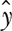。在训练时，我们然后取  并将其与真实的 *y* 进行比较，这就是我们如何得到损失 (*L*)。然后我们更新 *f[θ]*(*x*) 的参数，使得损失最小化。方程式 10.1，10.2，和 10.3 总结了这些。^([[5])

> ⁵
> 
> 请记住，这只是一个快速总结，我们不得不跳过一些细节，所以如果你能指出它们——太好了。如果你不能，我们建议阅读像 François Chollet 的《用 Python 进行深度学习》（Manning, 2017）这样的书籍，以复习具体细节。

##### equation 10.1\.

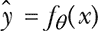

##### equation 10.2\.

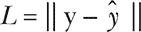

##### equation 10.3。

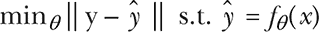

从本质上讲，我们已经将*预测*定义为神经网络在输入一个示例后的输出(方程式 10.1)。*损失*是真实标签和预测标签之间的一种差异(方程式 10.2)。因此，整体问题被表述为尝试最小化真实标签和预测标签之间的差异，这些差异构成了给定示例的预测，即 DNN 的参数(方程式 10.3)。

所有这些都进行得很好，但我们实际上如何最小化我们的分类损失？我们如何解决方程式 10.3 中表述的优化问题？我们通常使用基于 SGD 的方法来获取批次的*x*；然后我们计算损失函数相对于当前参数（*θ[t]*)的导数，并将其乘以我们的学习率（α），这构成了我们的新参数（*θ[t]* [+ 1]）。参见方程式 10.4。

##### equation 10.4。

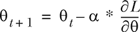

这是你能找到的关于深度学习最快的介绍。但现在你有了这个背景，想想这个强大的工具（SGD）是否也可以用于其他目的。例如，当我们向上而不是向下移动损失空间时会发生什么？结果发现，最大化错误而不是最小化错误要容易得多，但也很重要。而且像许多伟大的发现一样，它开始时是一个看似的 bug，后来变成了一个 hack：如果我们开始更新像素而不是权重会怎样？如果我们恶意地更新它们，就会发生对抗样本。

一些人对 SGD 的快速回顾可能感到困惑，所以让我们提醒自己一个典型的损失空间在图 10.1 中可能看起来是什么样子。

##### 图 10.1。记住，这是我们用深度学习算法可以实际得到的损失值类型。在左侧，你有等损失值的 2D 等高线，在右侧，你有损失空间的 3D 渲染。还记得第六章中的登山类比吗？

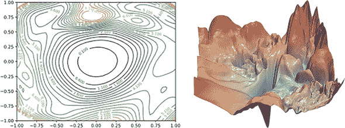

(来源：“可视化神经网络损失景观”，作者 Tom Goldstein 等，2018 年，[`github.com/tomgoldstein/loss-landscape`](https://github.com/tomgoldstein/loss-landscape)。)

考虑对抗样本的第二个有用的（尽管不完美）心智模型是通过类比。你可以将对抗样本视为类似于我们在前两章中遇到的那些条件生成对抗网络（Conditional GANs）。在对抗样本中，我们是在整个图像上进行条件化，并试图生成一个*域转换*或类似图像，但这个域能够欺骗分类器。“生成器”可以是一个简单的随机梯度上升算法，它只是调整图像以欺骗其他分类器。

无论哪种方式对你来说更有意义，我们现在直接深入探讨对抗性示例及其外观。它们是通过观察如何容易错误分类这些修改后的图像而被发现的。实现这一目标的第一种方法是最简单的*快速符号梯度方法（FSGM）*，它就像我们之前的描述一样简单。

你从梯度更新(方程 10.4)开始，查看符号，然后在相反方向上迈出小一步。事实上，图像经常看起来（几乎）完全相同！一张图片胜过千言万语，向您展示所需的噪声有多少；请参阅图 10.2。

##### 图 10.2\. 一点噪声就能产生很大的差异。中间的图片应用了噪声（差异），（右边的图片）。当然，右边的图片被大幅放大——大约 300 倍——并移动，以便它可以创建一个有意义的图像。

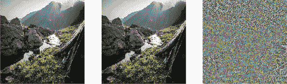

现在我们在这个未修改的假日图像上运行一个预训练的 ResNet-50 分类器，并检查前三个预测结果，如表 10.1 所示；请鼓掌。

##### 表 10.1\. 原始图像预测

| 排序 | 类别 | 置信度 |
| --- | --- | --- |
| 第一 | 山顶帐篷 | 0.6873 |
| 第二 | 岩石突出部 | 0.0736 |
| 第三 | 山谷 | 0.0717 |

最前面的三个都是合理的，其中`mountain_tent`占据首位，正如它应该的那样。表 10.2 显示了对抗性图像预测。前三个完全错过了`mountain_tent`，尽管有些建议至少与户外相符，但修改后的图像显然不是一座悬索桥。

##### 表 10.2\. 对抗性图像预测

| 排序 | 类别 | 置信度 |
| --- | --- | --- |
| 第一 | 火山 | 0.5914 |
| 第二 | 悬索桥 | 0.1685 |
| 第三 | 山谷 | 0.0869 |

这就是我们可以在仅约 200 个像素值（相当于将一个几乎黑色的像素变成几乎白色的像素）的预算内扭曲预测的程度——在整个图像上分散。

有一点令人害怕的是，创建整个示例所需的代码如此之少。在本章中，我们将使用一个名为`foolbox`的神奇库，它提供了许多方便的方法来创建对抗性示例。无需多言，让我们深入探讨。我们首先进行我们熟悉的导入，包括`foolbox`，这是一个专门设计来使对抗性攻击更简单的库。

##### 列表 10.1\. 我们可靠的导入

```
import numpy as np
from keras.applications.resnet50 import ResNet50
from foolbox.criteria import Misclassification, ConfidentMisclassification
from keras.preprocessing import image as img
from keras.applications.resnet50 import preprocess_input, decode_predictions
import matplotlib.pyplot as plt
import foolbox
import pprint as pp
Import keras
%matplotlib inline
```

接下来，我们定义一个方便的函数来加载更多图像。

##### 列表 10.2\. 辅助函数

```
def load_image(img_path: str):
  image = img.load_img(img_path, target_size=(224, 224))
  plt.imshow(image)
  x = img.img_to_array(image)
  return x

image = load_image('DSC_0897.jpg')
```

接下来，我们必须设置 Keras 以注册我们的模型并从 Keras 方便函数下载 ResNet-50。

##### 列表 10.3\. 创建表 10.1 和 10.2

```
keras.backend.set_learning_phase(0)                                      ***1***
kmodel = ResNet50(weights='imagenet')
preprocessing = (np.array([104, 116, 123]), 1)

fmodel = foolbox.models.KerasModel(kmodel, bounds=(0, 255),              ***2***
     preprocessing=preprocessing)                                        ***2***

to_classify = np.expand_dims(image, axis=0)                              ***3***
preds = kmodel.predict(to_classify)                                      ***4***
print('Predicted:', pp.pprint(decode_predictions(preds, top=20)[0]))
label = np.argmax(preds)                                                 ***5***

image = image[:, :, ::-1]                                                ***6***
attack = foolbox.attacks.FGSM(fmodel, threshold=.9,                      ***7***
     criterion=ConfidentMisclassification(.9))                           ***7***
adversarial = attack(image, label)                                       ***8***

new_preds = kmodel.predict(np.expand_dims(adversarial, axis=0))          ***9***
print('Predicted:', pp.pprint(decode_predictions(new_preds, top=20)[0]))
```

+   ***1* 实例化模型**

+   ***2* 从 Keras 模型创建 foolbox 模型对象**

+   ***3* 将图像调整为(1, 224, 224, 3)，以便它适合 ResNet-50，因为 ResNet-50 期望预测图像为批量形式。**

+   ***4* 调用 predict 并打印结果。**

+   ***5* 获取最高数字的索引，作为后续使用的标签**

+   ***6* ::-1 反转颜色通道，因为 Keras ResNet-50 期望 BGR 而不是 RGB。**

+   ***7* 创建攻击对象，设置高误分类标准**

+   ***8* 对源图像应用攻击**

+   ***9* 获取对抗图像的新预测**

这就是使用这些例子有多简单！现在你可能正在想，也许这只是 ResNet-50 在这些例子中受到影响。好吧，我们有一些坏消息要告诉你。ResNet 不仅在我们测试本章的各种代码设置时证明是最难被打破的分类器，而且在 DAWNBench 的每个 ImageNet 类别（这是 DAWNBench 中 CV 类别中最具挑战性的任务）中都是无可争议的赢家，如图 10.3 所示。图 10.3.^([6])

> ⁶
> 
> 请参阅 DAWNBench 上的“Image Classification on ImageNet”，[`dawn.cs.stanford.edu/benchmark/#imagenet`](https://dawn.cs.stanford.edu/benchmark/#imagenet)。

##### 图 10.3\. DAWNBench 是一个很好的地方，可以查看当前最先进的模型和 ResNet-50 的统治地位，至少截至 2019 年 7 月初。

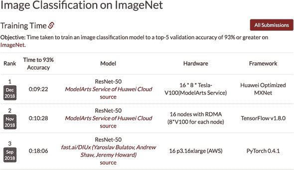

但对抗样本的最大问题是它们的普遍性。对抗样本不仅限于深度学习，而且可以迁移到不同的机器学习技术。如果我们针对一种技术生成一个对抗样本，那么它在另一个我们试图攻击的模型上也能合理地工作，如图 10.4 所示。

##### 图 10.4\. 这里显示的数字表示为该行中用来欺骗分类器的对抗样本的百分比，同时也欺骗了该列的分类器。这些方法是深度神经网络（DNNs）、逻辑回归（LR）、支持向量机（SVM）、决策树（DT）、最近邻（kNN）和集成（Ens.）。

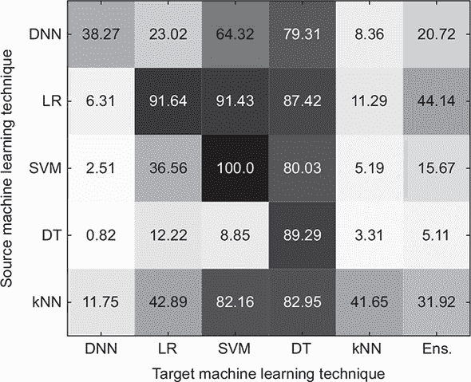

（来源：“机器学习中的可迁移性：使用对抗样本从现象到黑盒攻击”，Nicolas Papernot 等人，2016 年，[`arxiv.org/pdf/1605.07277.pdf`](https://arxiv.org/pdf/1605.07277.pdf)）

### 10.4\. 信号和噪声

更糟糕的是，许多对抗样本构建起来非常简单，我们可以用从`np.random.normal`中采样的高斯噪声同样容易地欺骗分类器。另一方面——为了支持我们之前关于 ResNet-50 是一个相当鲁棒的架构的观点——我们将向你展示其他架构对此问题的影响更大。

图 10.5 显示了在纯高斯噪声上运行 ResNet-50 的结果。然而，我们可以通过对噪声本身进行对抗攻击来查看我们的图像可能被误分类到什么程度——相当快地。

##### 图 10.5\. 很明显，在大多数情况下，我们不会在简单地采样的噪声上得到一个自信的分类作为错误类别。所以这是 ResNet-50 的加分项。在左侧，我们包括了我们所使用的均值和方差，以便你可以看到它们的影响。

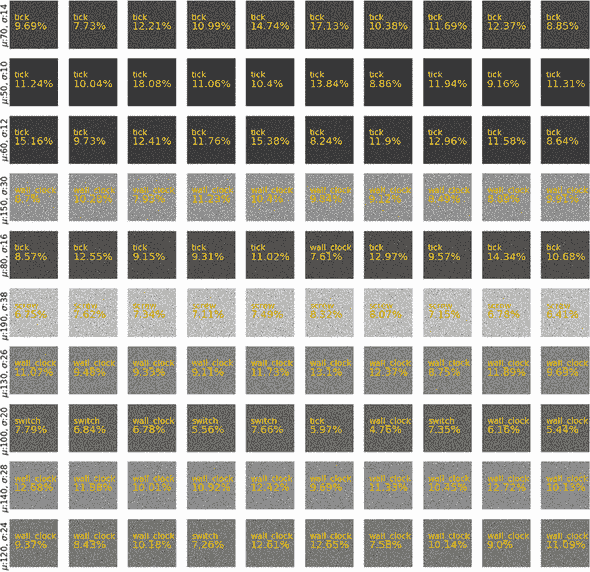

在列表 10.4 中，我们将使用一种*投影梯度下降（PGD）攻击*，如图图 10.6 所示。尽管这仍然是一种简单的攻击，但它值得进行高级解释。与之前的攻击不同，我们现在无论走向何方都会迈出一步——甚至“无效”的像素值——然后将其投影回可行空间。现在让我们将 PGD 攻击应用于图 10.7 中的高斯噪声，并运行 ResNet-50 以查看我们的表现。

##### 图 10.6\. 投影梯度下降在任意方向上迈出一步，然后使用投影找到点集中最近的等效点。在这种情况下，我们试图确保最终得到一个有效的图片：我们取一个示例 x(k)，并对其采取最优步骤到 y^((k + 1))，然后将其投影到一个有效的图像集 x^((k + 1))。

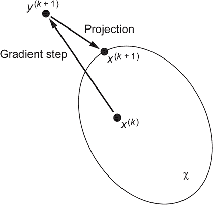

##### 图 10.7\. 当我们在对抗噪声上运行 ResNet-50 时，我们得到一个不同的故事：在应用 PGD 攻击后，大多数项目都被错误分类——仍然是一个简单的攻击。

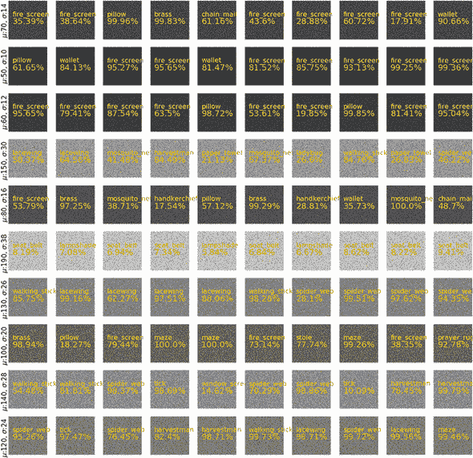

为了证明大多数架构甚至更差，我们将研究 Inception V3——一个在 CV 社区中赢得声誉的架构。的确，这个网络被认为非常可靠，我们在第五章中提到了它。在图 10.8 中，你可以看到即使是产生了 inception score 的东西在简单的例子上仍然失败。为了消除任何疑虑，Inception V3 仍然是最好的预训练网络之一，并且确实具有超人的准确率。

##### 图 10.8\. Inception V3 应用于高斯噪声。请注意，我们没有使用任何攻击；这种噪声只是从分布中采样的。

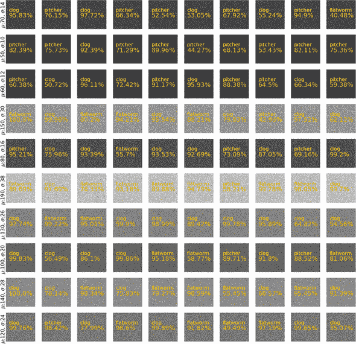

| |
| --- |

##### 备注

这只是普通的 Gaussian 噪声。你可以在代码中亲自看到没有应用任何对抗步骤。当然，你可以争论噪声可以预处理得更好。但即使是这一点也是一个巨大的对抗弱点。

| |
| --- |

如果你和我们一样，你可能在想，不可能，我想亲自看看。好吧，现在我们给你代码来重现这些图。因为每个代码都很相似，我们只看一次，并承诺下次会有更 DRY 的代码。

| |
| --- |

##### 备注

关于*不要重复自己（DRY）*代码的解释，请参阅维基百科[`en.wikipedia.org/wiki/Don%27t_repeat_yourself`](https://en.wikipedia.org/wiki/Don%27t_repeat_yourself)。

| |
| --- |

##### 列表 10.4\. 高斯噪声

```
fig = plt.figure(figsize=(20,20))
sigma_list = list(max_vals.sigma)                                          ***1***
mu_list = list(max_vals.mu)
conf_list = []

def make_subplot(x, y, z, new_row=False):                                  ***2***
    rand_noise = np.random.normal(loc=mu, scale=sigma, size=(224,224, 3))  ***3***
    rand_noise = np.clip(rand_noise, 0, 255.)                              ***4***
    noise_preds = kmodel.predict(np.expand_dims(rand_noise, axis=0))       ***5***
    prediction, num = decode_predictions(noise_preds, top=20)[0][0][1:3]   ***6***
    num = round(num * 100, 2)
    conf_list.append(num)
    ax = fig.add_subplot(x,y,z)                                            ***7***
    ax.annotate(prediction, xy=(0.1, 0.6),
            xycoords=ax.transAxes, fontsize=16, color='yellow')
    ax.annotate(f'{num}%' , xy=(0.1, 0.4),
            xycoords=ax.transAxes, fontsize=20, color='orange')
    if new_row:
        ax.annotate(f'$\mu$:{mu}, $\sigma$:{sigma}' ,
                    xy=(-.2, 0.8), xycoords=ax.transAxes,
                    rotation=90, fontsize=16, color='black')
    ax.imshow(rand_noise / 255)                                            ***8***
    ax.axis('off')

for i in range(1,101):                                                     ***9***
    if (i-1) % 10==0:
        mu = mu_list.pop(0)
        sigma = sigma_list.pop(0)
        make_subplot(10,10, i, new_row=True)
    else:
        make_subplot(10,10, i)

plt.show()
```

+   ***1* 以浮点数形式表示均值和方差列表**

+   ***2* 生成图 10.8 的核心功能**

+   ***3* 为每个均值和方差采样噪声**

+   ***4* 只允许 0-255 像素值**

+   ***5* 获得我们的第一个预测**

+   ***6* 分别获取预测类别和置信度**

+   ***7* 设置为注释代码图 10.8 并添加注释和文本**

+   ***8* 除以 255 将[0, 255]转换为[0, 1]**

+   ***9* 主循环允许我们将子图插入到图中**

### 10.5\. 并非所有希望都已破灭

现在，有些人开始担心对抗性示例的安全影响。然而，重要的是要从一个假设的攻击者的有意义的视角来看待这个问题。如果攻击者可以稍微改变每个像素，为什么不改变整个图像呢？^([7]) 为什么不输入一个完全不同的图像呢？为什么传入的示例必须是不易察觉的——而不是明显不同的？

> ⁷
> 
> 请参阅 Justin Gilmer 等人撰写的“对抗性示例研究游戏规则激励”，2018 年，[`arxiv.org/abs/1807.06732`](http://arxiv.org/abs/1807.06732)。

有些人以自动驾驶汽车和对抗性地干扰停车标志为例。但如果我们可以做到这一点，为什么攻击者不会完全喷漆覆盖停车标志，或者简单地用高速限制标志暂时遮挡停车标志呢？因为这些“传统攻击”与对抗性示例不同，将始终 100%有效，而对抗性攻击只有在它能够很好地转移并且没有被预处理扭曲时才会有效。

这并不意味着当你有一个关键任务机器学习应用时，你可以忽略这个问题。然而，在大多数情况下，对抗性攻击需要比更常见的攻击向量更多的努力，所以考虑到这一点是值得的。

然而，与大多数安全影响一样，对抗性攻击也有对抗性防御，试图防御许多类型的攻击。本章中涵盖的攻击是一些较容易的，但甚至更简单的攻击也存在——例如在 MNIST 上画一条线。即使这样也足以欺骗大多数分类器。

对抗性防御是一场不断发展的游戏，其中对某些类型的攻击有许多好的防御措施，但并非所有。这种转变可能非常快，以至于在 ICLR 2018 的提交截止日期后的三天内，就有八项提议和检查的防御措施被破解了.^([8])

> ⁸
> 
> ICLR 是*国际学习表示会议*，这是一个较小但很棒的机器学习会议。请参阅 2018 年 Anish Athalye 在 Twitter 上的内容，[`mng.bz/ad77`](http://mng.bz/ad77)。需要注意的是，还有三个作者未检查的防御措施。

### 10.6\. GAN 的对抗者

为了使与 GANs 的联系更加清晰，想象一个生成对抗性示例的系统，另一个系统则评估该示例的好坏——这取决于示例是否成功地欺骗了系统。这难道不让你想起了生成器（对手）和判别器（分类算法）吗？这两个算法再次竞争：对手试图通过轻微扰动图像来欺骗分类器，而分类器则试图不被欺骗。实际上，将 GANs 视为几乎是在循环中进行的机器学习对抗性示例，最终生成图像。

另一方面，你可以将迭代对抗攻击视为如果你取了一个 GAN，而不是指定目标是要生成最逼真的示例，而是指定目标是要生成能够欺骗分类器的示例。当然，你必须始终记住存在一些重要差异，通常在部署系统中你有一个固定的分类器。但这并不妨碍我们在对抗性训练中使用这个想法，其中一些实现甚至包括基于欺骗它的对抗性示例的重复重新训练分类器。这些技术正在逐渐接近典型的 GANs 设置。

为了给您一个例子，让我们看看一种已经作为可行的防御方法存在了一段时间的技术。在 *鲁棒流形防御* 中，我们采取以下步骤来防御对抗性示例：^([9])

> ⁹
> 
> 参见 Ajil Jalal 等人于 2019 年发表的论文“《鲁棒流形防御：使用生成模型的对抗性训练》”，[`arxiv.org/pdf/1712.09196.pdf`](https://arxiv.org/pdf/1712.09196.pdf)。

1.  我们取一个图像 *x*（对抗性或常规）并

    1.  将其投影回潜在空间 *z*。

    1.  使用生成器 *G* 生成与 *x* 相似的示例，称为 *x*，通过 *G*(*z*)。

1.  使用分类器 *C* 对此示例进行分类，即 *C*(*x*)，这通常已经比直接在 *x* 上运行分类错误率低得多。

然而，该防御的作者发现，仍然存在一些模糊的情况，其中分类器会被轻微的扰动欺骗。尽管如此，我们鼓励您查看他们的论文，因为这些情况对人类来说也往往是不清晰的，这是鲁棒模型的一个标志。为了解决这个问题，我们在流形上应用了对抗性训练：我们将一些这些对抗性案例纳入训练集，以便分类器学会区分这些案例和真实训练数据。

这篇论文表明，使用 GANs 可以给我们提供在轻微扰动后不会完全崩溃的分类器，甚至对抗一些最复杂的方法。下游分类器的性能确实会下降，就像大多数这些防御一样，因为我们的分类器现在必须被训练来隐式地处理这些对抗性案例。但即使有这个挫折，它也不是一个通用的防御。

当然，对抗训练有一些有趣的应用。例如，在一段时间内，半监督学习中最优秀的结果——最先进的技术——是通过使用对抗训练实现的。^([10)] 这随后被 GANs（还记得第七章吗？）和其他方法所挑战，但这并不意味着在你阅读这些文字的时候，对抗训练不会再次成为最先进的技术。

> ^(10)
> 
> 请参阅 Takeru Miyato 等人于 2018 年发表的“虚拟对抗训练：监督和半监督学习的正则化方法”，[`arxiv.org/pdf/1704.03976.pdf`](https://arxiv.org/pdf/1704.03976.pdf)。

希望这为你学习 GANs 和对抗样本提供了另一个理由——部分原因是因为在关键任务分类中，GANs 可能是未来的最佳防御手段，或者是因为本书范围之外的其它应用。^([11)] 这最好留给假设性的“对抗样本实战”。

> ^(11)
> 
> 这是在 ICLR 2019 上激烈争论的话题。尽管这些对话大多数是非正式的，但使用（伪）可逆生成模型作为分类图像“样本外”性的方法似乎是一条富有成效的途径。

总结来说，我们阐述了对抗样本的概念，并将它与 GANs 的联系变得更加具体。这是一个被低估的联系，但可以巩固你对这个具有挑战性的主题的理解。此外，对抗样本的一种防御手段就是 GANs 本身！^([12)] 因此，GANs 也具有解决这一差距的潜力，这可能是它们最初存在的原因。

> ^(12)
> 
> 请参阅 Jalal 等人于 2019 年发表的文章，[`arxiv.org/pdf/1712.09196.pdf`](https://arxiv.org/pdf/1712.09196.pdf)。

### 10.7. 结论

对抗样本是一个重要的领域，因为即使是商业计算机视觉产品也受到了这种不足的影响，并且仍然可以被学术界轻易欺骗。^([13)] 除了安全和机器学习可解释性应用之外，在公平性和鲁棒性方面还有许多实际用途。

> ^(13)
> 
> 请参阅 Andrew Ilyas 等人于 2018 年发表的“带有有限查询和信息限制的黑盒对抗攻击”，[`arxiv.org/abs/1804.08598`](https://arxiv.org/abs/1804.08598)。

此外，对抗样本是巩固你对深度学习和 GANs 理解的极好方式。对抗样本利用了训练分类器的一般困难以及欺骗特定分类器的相对容易。分类器需要对许多图像进行预测，而制作一个特殊的偏移量来精确欺骗分类器是容易的，因为有很多自由度。因此，我们可以轻松地得到对抗噪声，它完全改变了图片的标签，而不会在感知上改变图像。

对抗样本可以在许多领域和 AI 的许多领域中找到，而不仅仅是深度学习或计算机视觉。但正如你在代码中看到的，在计算机视觉中创建这些样本并不具有挑战性。存在针对这些样本的防御措施，你看到了一个使用 GANs 的例子，但对抗样本远未完全解决。

### 摘要

+   对抗样本，它们来自滥用问题空间的维度，是机器学习的一个重要方面，因为它们展示了 GANs 为什么能工作，以及为什么某些分类器容易被破坏。

+   我们可以轻松地使用真实图像和噪声生成自己的对抗样本。

+   在对抗样本中，可以使用的有效攻击向量很少。

+   对抗样本的应用包括网络安全和机器学习公平性，我们可以通过使用 GANs 来防御它们。

## 第十一章：GANs 的实际应用

*本章涵盖*

+   GANs 在医学领域的应用

+   GANs 在时尚领域的应用

就像生成手写数字和将苹果变成橘子一样吸引人，生成对抗网络（GANs）可以用于更多领域。本章探讨了 GANs 的一些实际应用。本章专注于 GANs 在实际应用中被充分利用的领域，这是非常合适的。毕竟，我们编写这本书的主要目标之一是提供必要的知识和工具，不仅让你理解到目前为止 GANs 所取得的成就，还让你能够找到你选择的新的应用。没有比研究几个成功的例子更好的开始这段旅程的地方了。

你已经看到了几个 GANs 的创新应用案例。第六章展示了渐进式 GANs 不仅可以创建逼真的人类面部渲染，还可以创建具有更大实际重要性的样本：医学乳腺 X 光片。第九章展示了 CycleGAN 如何通过将视频游戏中的剪辑转换为类似电影的场景来创建逼真的模拟虚拟环境，这些场景可以用来训练自动驾驶汽车。

本章更详细地回顾了 GANs 的应用。我们将探讨是什么激发了这些应用，是什么使它们特别适合从 GANs 带来的进步中受益，以及它们的创造者是如何实施它们的。具体来说，我们将探讨 GANs 在医学和时尚领域的应用。我们选择这两个领域基于以下标准：

+   它们不仅展示了 GANs 的学术价值，而且更重要的是，展示了商业价值。它们代表了 GAN 研究人员通过 GANs 取得的学术进步如何应用于解决现实世界问题。

+   它们使用的是本书中讨论的工具和技术可以理解的 GAN 模型。我们不会引入新的概念，而是将探讨我们实现的模型如何应用于除了 MNIST 以外的其他用途。

+   它们易于理解，无需专门的领域专业知识。例如，GAN 在化学和物理学中的应用通常对没有该领域强大背景的人来说难以理解。

此外，我们选择的领域和例子旨在展示 GAN 的通用性。在医学领域，我们展示了 GAN 在数据有限的情况下如何有用。在时尚领域，我们展示了另一个极端，并探讨了在大量数据集可用的情况下的 GAN 应用。即使你对医学或时尚没有兴趣，你将在本章中学到的工具和方法也适用于无数其他用例。

很遗憾，正如经常发生的那样，我们将要回顾的实际应用几乎无法在编码教程中重现，这是因为训练数据是专有的或难以获得的。因此，我们无法提供像本书中其他部分那样的完整编码教程，而只能提供 GAN 模型及其背后实现选择的详细解释。相应地，到本章结束时，你应该已经完全准备好通过仅对之前实现的 GAN 模型进行少量修改，并为其提供特定用例或类似用例的数据集，来实施本章中的任何应用。有了这些，让我们深入探讨。

### 11.1. GAN 在医学中的应用

本节介绍了 GAN 在医学中的应用。具体来说，我们探讨如何使用 GAN 生成的合成数据来扩大训练数据集，以帮助提高诊断准确性。

#### 11.1.1. 使用 GAN 提高诊断准确性

医学中的机器学习应用面临一系列挑战，这些挑战使得该领域非常适合从 GAN 中受益。也许最重要的是，由于收集医疗数据所涉及的困难，获取足够大的训练数据集以供监督机器学习算法使用是具有挑战性的。^[[1]] 获取医疗状况的样本往往既昂贵又不切实际。

> ¹
> 
> 请参阅 Maayan Frid-Adar 等人于 2018 年发表的《使用 GAN 进行合成数据增强以改善肝脏病变分类》，[`mng.bz/rPBg`](http://mng.bz/rPBg)。

与光学字符识别（OCR）的手写字母数据集或自动驾驶汽车的路面视频数据集不同，任何人都可以获取这些数据集，而医疗状况的例子则更难获得，并且通常需要专用设备来收集。更不用说患者隐私这一至关重要的考虑因素，它限制了医疗数据的收集和使用方式。

除了获取医疗数据集的困难之外，正确标记这些数据也是一个挑战，这个过程通常需要具有特定状况专业知识的人进行标注。^[[2]] 因此，许多医学应用未能从深度学习和人工智能的进步中受益。

> ²
> 
> 同上。

已经开发了许多技术来帮助解决小标签数据集的问题。在第七章中，你学习了如何使用 GANs 在半监督设置中提高分类算法的性能。你看到了 SGAN 如何仅使用极小部分标签进行训练就实现了优越的准确率。然而，这仅解决了医疗研究人员面临问题的一半。半监督学习有助于我们在拥有大量数据集但只有一小部分被标记的情况下。在许多医学应用中，拥有数据集一小部分标签只是问题的一部分——这小部分数据往往是唯一的数据！换句话说，我们没有成千上万的额外样本可供标记或用于半监督设置中的奢侈。

医学研究人员通过使用数据增强技术来克服数据集不足的挑战。对于图像，这些包括缩放（放大和缩小）、平移（左右和上下移动）以及旋转等小的调整和变换。图 11.1 展示了在计算机视觉中常用的数据增强示例。

> ³
> 
> 同上。

##### 图 11.1\. 通过改变现有数据来扩大数据集的技术包括缩放（放大和缩小）、平移（左右和上下移动）以及旋转。尽管这些技术在增加数据集大小方面非常有效，但经典的数据增强技术只能带来有限的数据多样性。

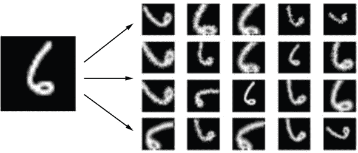

（来源：“数据增强：当数据有限时如何使用深度学习”，作者 Bharath Raj，2018 年，[`mng.bz/dxPD`](http://mng.bz/dxPD)。）

如您所想象，标准数据增强有许多局限性。首先，小的修改只会产生与原始图像差异不大的示例。因此，这些额外的示例并没有增加很多多样性，无法帮助算法学习泛化。[例如，在处理手写数字时，我们希望看到数字 6 以不同的书写风格呈现，而不仅仅是同一基本图像的排列组合。]^([4])

> ⁴
> 
> 同上。

在医学诊断的情况下，我们希望看到同一基本病理的不同示例。通过使用如 GANs 生成的合成示例来丰富数据集，有可能在传统增强技术之外进一步丰富可用数据。这正是以色列研究人员 Maayan Frid-Adar、Eyal Klang、Michal Amitai、Jacob Goldberger 和 Hayit Greenspan 着手研究的问题。

受到 GAN 在几乎任何领域都能合成高质量图像的能力的鼓舞，Frid-Adar 及其同事决定探索 GAN 在医学数据增强中的应用。他们选择专注于提高肝脏病变的分类。他们专注于肝脏的一个主要动机是，这个器官是三种最常见的转移性癌症发生地之一，仅在 2012 年就有超过 74.5 万人因肝癌而死亡。5 因此，有助于医生诊断高风险患者的工具和机器学习模型有可能拯救生命并改善无数患者的预后。

> ⁵
> 
> 参见 J. Ferlay 等人撰写的“全球癌症发病率与死亡率：GLOBOCAN 2012 的数据来源、方法和主要模式”，2015 年，*国际癌症杂志*，[`www.ncbi.nlm.nih.gov/pubmed/25220842`](https://www.ncbi.nlm.nih.gov/pubmed/25220842)。

#### 11.1.2. 方法论

Frid-Adar 及其团队发现自己陷入了一个两难境地：他们的目标是训练一个 GAN 来增强一个小数据集，但 GAN 本身需要大量的数据来训练。换句话说，他们想利用 GAN 来创建一个大数据集，但首先他们需要一个大数据集来训练 GAN。

他们的解决方案非常巧妙。首先，他们使用标准的数据增强技术来创建一个更大的数据集。其次，他们使用这个数据集来训练一个 GAN 以创建合成示例。第三，他们使用步骤 1 中增强的数据集以及步骤 2 中由 GAN 产生的合成示例来训练一个肝脏病变分类器。

研究人员使用的 GAN 模型是第四章中介绍的深度卷积 GAN（DCGAN）的一个变体。第四章。为了证明 GAN 在广泛的数据集和场景中的适用性，Frid-Adar 等人只需进行一些小的调整和定制，就能使 DCGAN 适用于他们的用例。正如图 11.2 所示，需要调整的模型部分只有隐藏层的维度以及生成器输出的维度和判别器网络的输入维度。

##### 图 11.2。Frid-Adar 等人采用的 DCGAN 模型架构，用于生成肝脏病变的合成图像以增强他们的数据集，旨在提高分类精度。该模型架构与第四章中的 DCGAN 相似，强调了 GAN 在广泛的数据集和用例中的适用性。（注意，该图只显示了伪造示例的 GAN 流程。）

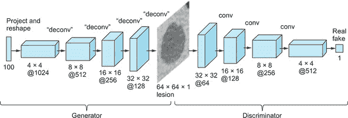

（来源：Frid-Adar 等人，2018 年，[`mng.bz/rPBg`](http://mng.bz/rPBg)）

与 MNIST 数据集中的 28 × 28 × 1 大小的图像不同，这个 GAN 处理的是 64 × 64 × 1 的图像。正如他们论文中提到的，Frid-Adar 等人还使用了 5 × 5 的卷积核——然而，这仅仅是网络超参数的一个小改动。除了由训练数据给出的图像大小之外，所有这些调整很可能都是通过试错确定的。研究人员不断调整参数，直到模型生成令人满意的图像。

在我们回顾 Frid-Adar 及其团队设计的方法效果如何之前，让我们暂停一下，来欣赏一下你对 GANs 的理解已经进步到了何种程度。早在本书的第四章中，你就已经学到了足够多的关于 GANs 的知识，可以将其应用于一个真实世界的场景，该场景在 2018 年国际生物医学成像研讨会上的一篇论文中有所讨论。（6）

> ⁶
> 
> 见 Frid-Adar 等，2018，[`mng.bz/rPBg`](http://mng.bz/rPBg)。

#### 11.1.3. 结果

使用 DCGAN 进行数据增强，Frid-Adar 及其团队与仅使用标准数据增强的基线相比，实现了分类准确率的显著提升。7 他们的结果总结在图 11.3 中，该图显示了随着训练样本数量（x 轴）增加，分类准确率（y 轴）的变化。

> ⁷
> 
> 同上。

##### 图 11.3。此图表显示了使用两种数据集增强策略添加新示例时的分类准确率：标准/经典数据增强；以及使用由 DCGAN 生成的合成示例进行增强。使用标准增强（点线），分类性能在约 80%时达到峰值。使用由 GAN 创建的示例（虚线）将准确率提升到超过 85%。

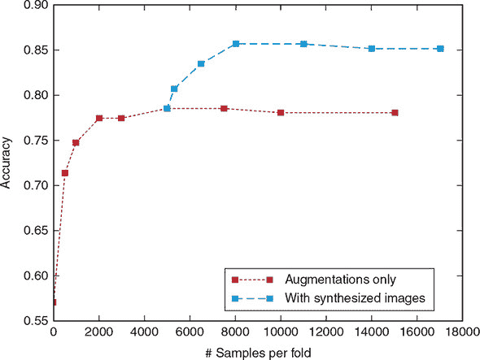

（来源：Frid-Adar 等，2018，[`mng.bz/rPBg`](http://mng.bz/rPBg)）

点线图展示了经典数据增强的分类性能。随着新（增强）训练样本数量的增加，性能得到提升；然而，当准确率达到 80%左右时，提升趋于平缓，超出这个范围后，额外的样本无法带来进一步的提升。

虚线显示了通过使用由 GAN 生成的合成示例增强数据集所获得的额外准确率提升。从额外经典增强示例停止提升准确率的点开始，Frid-Adar 等人添加了由他们的 DCGAN 生成的合成数据。分类性能从大约 80%提升到超过 85%，证明了 GANs 的有用性。

改善肝脏病变的分类只是医学中许多数据受限的应用场景之一，这些场景可以通过 GANs 产生的合成示例进行数据增强而受益。例如，由伦敦帝国理工学院 Christopher Bowles 领导的一组英国研究人员利用 GANs（特别是第六章中讨论的渐进式 GANs）来提高脑部分割任务的表现。^([8]) 关键的是，性能的提高可以解锁模型在实际应用中的可用性，特别是在医学等领域，准确性可能意味着生死之别。

> ⁸
> 
> 参见 Christopher Bowles 等人于 2018 年发表的“GAN Augmentation: Augmenting Training Data Using Generative Adversarial Networks”，[`arxiv.org/abs/1810.10863`](https://arxiv.org/abs/1810.10863).

让我们转换一下话题，探索 GANs 在一个风险较低且具有完全不同考虑和挑战领域的应用：时尚。

### 11.2\. 时尚领域的 GANs

与数据难以获得的医学不同，时尚研究人员幸运地拥有大量可用的数据集。像 Instagram 和 Pinterest 这样的网站上有无数套装和服装的图片，而像亚马逊和 eBay 这样的零售巨头拥有从袜子到连衣裙的数百万件商品的购买数据。

除了数据可用性之外，许多其他特性使时尚非常适合 AI 应用。时尚品味因顾客而异，个性化内容的能力有可能解锁重大的商业利益。此外，时尚趋势经常变化，对于品牌和零售商来说，快速反应并适应顾客不断变化的偏好至关重要。

在本节中，我们将探讨 GANs 在时尚领域的一些创新应用。

#### 11.2.1\. 使用 GANs 设计时尚

从无人机配送到无收银员杂货店，亚马逊对关于其未来探索的头条新闻并不陌生。2017 年，亚马逊又获得了一个，这次是关于公司利用 GANs（生成对抗网络）开发 AI 时尚设计师的雄心。这个故事发表在《MIT Technology Review》上，不幸的是，除了提到使用 GANs 设计符合特定风格的新产品外，细节很少。^([9])

> ⁹
> 
> 参见 Will Knight 于 2017 年发表的“Amazon Has Developed an AI Fashion Designer”，《MIT Technology Review》，[`mng.bz/VPqX`](http://mng.bz/VPqX).

幸运的是，Adobe 公司和加州圣地亚哥大学的学者们发表了一篇论文，其中他们着手实现相同的目标.^([10])他们的方法可以给我们一些线索，了解亚马逊 AI 研究实验室在秘密的面纱背后正在进行的时尚革命。他们使用从亚马逊爬取的数十万个用户、物品和评论的数据集，主要作者王成康和他的合作者训练了两个不同的模型：一个用于推荐时尚，另一个用于创造时尚.^([11])

> ¹⁰
> 
> 请参阅 2017 年 Jackie Snow 在《麻省理工学院技术评论》上发表的“This AI Learns Your Fashion Sense and Invents Your Next Outfit”，[`mng.bz/xlJ8`](http://mng.bz/xlJ8)。
> 
> ¹¹
> 
> 请参阅 Wang-Cheng Kang 等人 2017 年发表的“Visually-Aware Fashion Recommendation and Design with Generative Image Models”，[`arxiv.org/abs/1711.02231`](https://arxiv.org/abs/1711.02231)。

对于我们的目的，我们可以将推荐模型视为一个黑盒。我们唯一需要了解关于模型的信息是它做什么：对于任何一个人-物品对，它返回一个偏好分数；分数越高，物品与个人口味的匹配度越好。没有什么特别不寻常的。

后者模型更加新颖和有趣——不仅因为它使用了生成对抗网络（GANs），还因为康和他的同事们设计了两个富有创意的应用：

+   创建符合特定个人时尚品味的全新时尚物品

+   根据个人的时尚偏好对现有物品提出个性化修改建议。

在本节中，我们探讨康和他的团队是如何实现这些目标的。

#### 11.2.2. 方法论

让我们从模型开始。康和他的同事们使用了一个条件生成对抗网络（CGAN），以产品的类别作为条件标签。他们的数据集包含六个类别：上衣（男性和女性），下装（男性和女性），和鞋子（男性和女性）。

回想一下，在第八章中，我们使用 MNIST 标签来教一个 CGAN 生成我们想要的任何手写数字。以类似的方式（有意为之），康等人使用类别标签来训练他们的 CGAN 生成属于指定类别的时尚物品。尽管我们现在处理的是衬衫和裤子而不是三和四，但 CGAN 模型设置几乎与我们第八章中实现的相同。生成器使用随机噪声*z*和条件信息（标签/类别*c*）来合成图像，而判别器输出一个特定图像-类别对是真实还是虚假的概率。图 11.4 详细说明了康等人使用的网络架构。

##### 图 11.4. Kang 等人研究中使用的 CGAN 生成器和判别器网络的架构。标签 c 代表服装类别。研究人员将其用作条件标签，以引导生成器合成与给定类别匹配的图像，并使判别器识别真实图像-类别对。

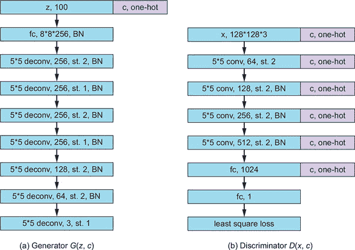

（来源：Kang 等人，2017，[`arxiv.org/abs/1711.02231`](https://arxiv.org/abs/1711.02231)。）

每个框代表一层；*fc*代表*全连接层*；*st*表示卷积核的步长，其尺寸（宽度×高度）作为卷积/反卷积层的第一个两个数字给出；*deconv*和*conv*表示使用的层类型：分别是常规卷积或转置卷积。*conv*或*deconv*后面的数字设置层的深度或等价地，使用的卷积核数量。*BN*告诉我们，在给定层的输出上使用了批归一化。注意，Kang 等人选择使用最小二乘损失而不是交叉熵损失。

配备了能够为数据集中每个顶级类别生成逼真服装物品的 CGAN，Kang 和他的同事们对其进行了两个具有重大实际潜力的应用的测试：创建新的个性化物品和对现有物品进行个性化修改。

#### 11.2.3. 创建符合个人偏好的新项目

为了确保产生的图像符合个人的时尚品味，Kang 和他的同事们提出了一种巧妙的方法。他们从以下洞察开始：鉴于他们的推荐模型根据一个人对给定物品的喜好程度为*现有*物品分配分数，生成*新*物品以最大化这种偏好分数的能力可能会产生符合个人风格和品味的物品。12

> ^（12）
> 
> 同上。

借用经济学和选择理论中的一个术语，13 Kang 等人称这个过程为*偏好最大化*。Kang 等人的方法独特之处在于，他们可能的物品宇宙不仅限于训练数据集的语料库，甚至不是整个亚马逊目录。多亏了他们的 CGAN，他们可以将新物品的生成微调到几乎无限的粒度。

> ^（13）
> 
> 见“选择理论导论”，作者：Jonathan Levin 和 Paul Milgrom，2004 年，[`mng.bz/AN2p`](http://mng.bz/AN2p)。

下一问题康和他的同事们需要解决的是确保 CGAN 生成器能够生成最大化个人偏好的时尚单品。毕竟，他们的 CGAN 被训练来只为给定类别生成看起来逼真的图像，*而不是*为特定个人。一个可能的选择是持续生成图像并检查它们的偏好分数，直到我们偶然发现一个分数足够高的图像。然而，考虑到可以生成的图像的几乎无限变化，这种方法将非常低效且耗时。

相反，康和他的团队通过将其构造成一个优化问题来解决这个问题：特别是约束最大化。约束（他们的算法必须操作的边界）是潜在空间的大小，由向量*z*的大小给出。Kang 等人使用了标准大小（100 维向量），每个数字在[–1, 1]范围内。为了使这些值可微分，以便它们可以在优化算法中使用，作者将向量*z*中的每个元素设置为*tanh*函数，随机初始化。^(14）

> ^(14)
> 
> 参见 Kang 等人，2017 年，[`arxiv.org/abs/1711.02231`](https://arxiv.org/abs/1711.02231)。

研究人员随后采用了梯度上升法。*梯度上升*与梯度下降类似，只不过我们不是通过迭代地向最陡的*下降*方向移动来*最小化*成本函数，而是通过迭代地向最陡的*增加*方向移动来*最大化*奖励函数（在这种情况下，是推荐模型给出的分数）。

Kang 等人展示的结果见图 11.5，该图比较了数据集中排名前三的图像与六个不同个人生成的排名前三的图像。Kang 等人解决方案的独创性得到了证实，他们产生的示例具有更高的偏好分数，这表明它们与购物者的风格和偏好更匹配。

##### 图 11.5。在 Kang 等人论文中呈现的结果中，每张图像都标注了其偏好分数。每一行显示了一个不同购物者和产品类别（男性和女性上衣、男性和女性下装、男性和女性鞋类）的结果。

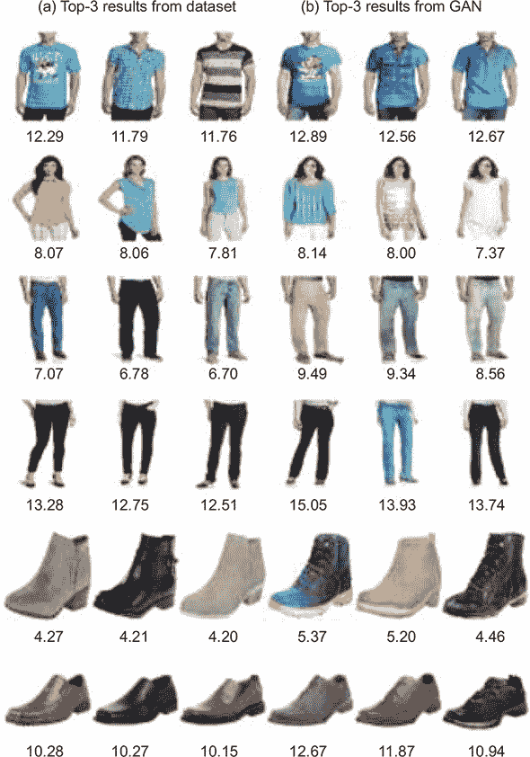

（来源：Kang 等人，2017 年，[`arxiv.org/abs/1711.02231`](https://arxiv.org/abs/1711.02231)）

左侧的三列显示了数据集中得分最高的物品；右侧的三列显示了得分最高的生成物品。根据偏好分数，生成的图像与购物者的偏好更匹配。

康和他的团队并没有止步于此。除了创造新物品外，他们还探索了他们开发的模型是否可以用来对现有物品进行修改，以适应个人的风格。鉴于时尚购物的主观性很强，能够调整服装直到“恰到好处”，具有显著的商业潜力。让我们看看康等人是如何解决这个挑战的。

#### 11.2.4\. 调整现有物品以更好地匹配个人偏好

记住，潜在空间中的数字（由输入向量*z*表示）具有现实意义，并且数学上彼此接近的向量（通过它们在占据的高维空间中的距离来衡量）往往会产生在内容和风格上相似的内容。因此，正如康等人所指出的，为了生成某些图像*A*的变体，我们只需要找到生成器用来创建该图像的潜在向量*zA*。然后，我们可以从邻近的向量生成图像，以生成相似的图像。

为了让它不那么抽象，让我们用一个具体的例子来看，使用我们最喜欢的数据集 MNIST。考虑一个输入向量*z’*，当将其输入生成器时，会产生数字 9 的图像。如果我们然后输入向量*z”*，从数学上讲，它在 100 维潜在空间中与*z’*非常接近，那么*z”*将产生另一个稍微不同的数字 8 的图像。这如图 11.6 所示。你曾在第二章中看到过一些这样的例子。在变分自编码器的背景下，中间/压缩表示与 GAN 世界中的*z*起的作用一样。

##### 图 11.6\. 在潜在空间中移动得到的数字 9 的变体（图片来自第二章）。邻近的向量会产生相同数字的变体。例如，注意当我们从第一行的左边移动到右边时，数字 9 最初是略微右倾的，但最终完全直立。也请注意，当我们足够远离时，数字 9 会变成另一个视觉上相似的数字。这种渐进的变体同样适用于更复杂的数据集，其中变体往往更加微妙。

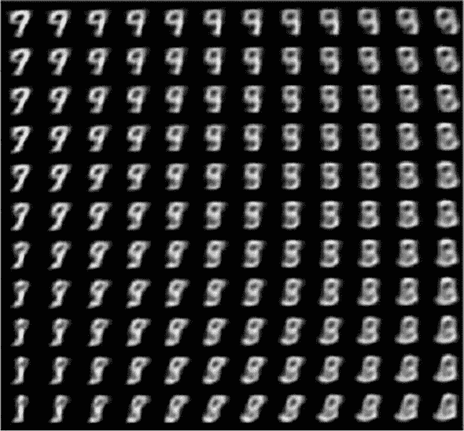

当然，在时尚领域，事情更加微妙。毕竟，一件裙子的照片比数字的灰度图像复杂得多。在生成 T 恤的向量周围在潜在空间中移动，可以产生不同颜色、图案和风格的 T 恤（例如 V 领与圆领相比）。这完全取决于生成器在训练期间内化的编码和意义类型。最好的办法是尝试一下。

这使我们来到了康和他的团队必须克服的下一个挑战。为了使前面的方法有效，我们需要想要修改的图像的向量 *z*。如果我们想要修改一个合成图像，这将很简单：我们每次生成图像时都可以记录向量 *z*，以便以后可以引用它。在我们的场景中，使情况复杂化的是，我们想要修改一个*真实*图像。

根据定义，真实图像不可能是由生成器产生的，因此没有向量 *z*。我们能做到的最好的事情是找到与我们要修改的图像尽可能接近的生成图像的潜在空间表示。换句话说，我们必须找到一个生成器用于合成与真实图像相似的图像的向量 *z*，并将其用作假设的*z*的代理，该*z*本应产生真实图像。

这正是康等人所做的事情。正如之前一样，他们首先将场景制定为一个优化问题。他们定义了一个损失函数，称为所谓的*重建损失*（两个图像之间差异的度量；损失越大，给定的一对图像之间的差异就越大）。^([15]) 以这种方式制定问题后，康等人随后通过梯度下降（最小化重建损失）迭代地找到与任何真实图像最接近的可能生成的图像。一旦我们得到一个与真实图像相似（因此也是用于生成它的向量 *z*）的假图像，我们就可以通过潜在空间操作来修改它。

> ¹⁵
> 
> 同上。

这就是康和他的同事们设计的这种方法充分展示其潜力的地方。我们可以在潜在空间中移动到生成我们想要修改的图像相似点的位置，同时优化给定用户的偏好。我们可以在图 11.7 中看到这个过程：当我们从每一行的左边移动到右边时，衬衫和裤子逐渐变得更加个性化。

##### 图 11.7\. 使用相同起始图像对六位购物者（三位男性和三位女性）进行个性化过程：男性的圆领衫和女性的裤子。

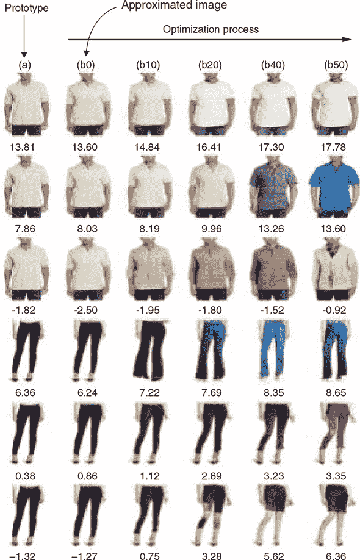

(来源：康等人，2017，[`arxiv.org/abs/1711.02231`](https://arxiv.org/abs/1711.02231)。)

例如，第一行的人正在寻找更鲜艳的选项，正如康等人所观察到的，第五行的人似乎更喜欢更亮的颜色和更破旧的外观；而最后一个人，看起来更喜欢裙子而不是牛仔裤。这是超个性化最极致的体现。难怪亚马逊注意到了这一点。

最左侧的照片显示了训练数据集中的真实产品；左侧第二张照片显示了与用作个性化过程起点的真实照片最接近的生成图像。每张图像都标注了其偏好分数。随着我们从左到右移动，该物品逐渐针对给定的个人进行优化。正如不断上升的分数所示，个性化过程提高了该物品与给定购物者的风格和品味相匹配的可能性。

### 11.3. 结论

本章涵盖的应用仅是 GANs 可能实现的应用的冰山一角。仅医学和时尚领域就有无数其他用例，更不用说其他领域。可以肯定的是，GANs 已经远远超出了学术领域，利用它们合成真实数据的能力，在众多应用中发挥着作用。

### 摘要

+   由于 GANs 的通用性，它们可以被用于广泛的非学术应用，并且可以轻松地重新用于 MNIST 之外的用例。

+   在医学领域，GANs 产生的合成示例可以提高分类精度，这超出了标准数据集增强策略所能达到的。

+   在时尚领域，GANs 可以用来创建新物品和修改现有物品，以更好地符合某人的个人风格。这是通过生成最大化推荐算法提供的偏好分数的图像来实现的。

## 第十二章. 展望未来

*本章涵盖*

+   生成模型的伦理

+   我们预计在未来几年中将占主导地位的三个最近改进：

    +   相对论生成对抗网络（RGAN）

    +   自注意力生成对抗网络（SAGAN）

    +   BigGAN

+   三种更前沿技术的进一步阅读

+   本书关键主题和主要收获的总结

在本章的最后，我们想简要概述一下我们对 GANs 伦理的看法。然后我们将讨论一些我们认为在未来将变得更加重要的创新。本章包含了一些高级理念，我们预计这些理念将定义 GANs 的未来，但它不包含任何代码。我们希望你能为即将到来的 GAN 之旅做好准备——即使是写作时还未发表的进步。最后，我们将总结并表达我们依依不舍的告别。

### 12.1. 伦理

世界开始意识到，AI 伦理——包括 GANs——是一个重要问题。一些机构已经决定不发布它们昂贵的预训练模型，以防它们被误用作生成虚假新闻的工具。1 数篇文章描述了 GANs 可能具有潜在恶意用途的方式。2

> ¹
> 
> 参见 Will Knight 在 2019 年《麻省理工学院技术评论》上发表的“An AI That Writes Convincing Prose Risks Mass-Producing Fake News”，[`mng.bz/RPGj`](http://mng.bz/RPGj)。
> 
> ²
> 
> 请参阅 Karen Hao 在 2019 年发表于《麻省理工学院技术评论》上的文章“AI 世界内部：创造美丽艺术和恐怖深度伪造”，[`mng.bz/2JA8`](http://mng.bz/2JA8)。另请参阅 Jakub Langr 在 2019 年发表于《福布斯》上的文章“AI 因 GANs 创新而变得富有创造力”，[`mng.bz/1w71`](http://mng.bz/1w71)。

我们都明白错误信息可能是一个大问题，并且具有逼真合成图像的 GANs 可能构成危险。想象一下合成一位世界领导人的视频，声称他们即将对另一个国家发动军事打击。纠正信息能否迅速传播以平息随之而来的恐慌？

这不是一本关于 AI 伦理的书，所以我们只是简要地触及这个话题。但我们坚信，对于我们所有人来说，思考我们所做的事情的伦理、我们工作的风险和意外后果是非常重要的。鉴于 AI 是一项如此可扩展的技术，思考我们是否在帮助创造一个我们想要生活的世界至关重要。

我们敦促您思考您的原则，并至少通过一个更成熟的伦理框架。我们不会讨论哪一个比另一个更好——毕竟，人类在许多更为平凡的事情上还没有就道德框架达成一致——但如果你还没有读过，请放下这本书并至少阅读其中之一。

| |
| --- |

##### 注意

您可以在[`ai.google/principles`](https://ai.google/principles)上了解谷歌的 AI 原则。道德 AI 与机器学习研究所详细介绍了其原则，请参阅[`ethical.institute/principles.html`](https://ethical.institute/principles.html)。另请参阅 Larry Dignan 于 2017 年发表在 ZDNet 上的文章“IBM 的 Rometty 阐述 AI 考虑因素和伦理原则”，[`mng.bz/ZeZm`](http://mng.bz/ZeZm)。

| |
| --- |

例如，被称为*深度伪造*的技术——尽管最初并非基于 GANs——被许多人视为一个令人担忧的来源。^([3)] 深度伪造——由*深度学习*和*伪造图像*组合而成——已经通过生成虚假政治视频和合成色情内容而证明具有争议性。很快，这项技术可能达到一个点，以至于无法判断视频或图像是否真实。鉴于 GANs 合成新图像的能力，它们可能很快就会主导这个领域。

> ³
> 
> 请参阅 Paul Chadwick 在 2018 年发表于《卫报》上的文章“谎言的回报，以及其他深度伪造新闻的挑战”，[`mng.bz/6wN5`](http://mng.bz/6wN5)。另请参阅 Roula Khalaf 在 2018 年发表于《金融时报》上的文章“如果你认为假新闻是个问题，那你就等着深度伪造吧”，[`mng.bz/PO8Y`](http://mng.bz/PO8Y)。

说每个人都应该考虑他们研究和代码的后果似乎还不够，但现实是，没有一劳永逸的解决方案。即使我们的初始关注完全是伦理方面的，无论我们是在研究还是工业界工作，我们都应该考虑这些影响。我们也不想给你们一个枯燥的讲座或未经证实的媒体炒作预测，但这是我们非常关心的问题。

人工智能伦理是一个真实存在的问题 *已经存在了*，我们在这里提出了三个真实的问题——AI 生成的虚假新闻、合成的政治宣言和强制性的色情内容。但还有很多其他问题存在，比如亚马逊使用一个显示对女性存在负面偏见的 AI 招聘工具。^[[4]] 但实际情况很复杂——有些人认为 GANs 倾向于在面部生成中偏爱女性形象。另一个角度是，GANs 也有潜力帮助 AI 更加道德——通过在半监督设置中合成代表性不足的类别，例如在面部识别问题中，从而提高在代表性不足的社区中的分类质量。

> ⁴
> 
> 见“亚马逊取消了对女性存在偏见的秘密 AI 招聘工具”，作者 Jeffrey Dastin，2018 年，路透社，[`mng.bz/Jz8K`](http://mng.bz/Jz8K)。

我们写这本书的部分原因是为了让每个人更加意识到 GANs 的可能性和可能的滥用。我们对 GANs 未来的学术和实际应用以及正在进行的研究感到兴奋，但我们也意识到一些应用可能具有负面用途。由于技术无法“重新发明”，我们必须了解其能力。我们绝不是说，如果没有 GANs，世界会变得更好——GANs 只是一个工具，正如我们所知，工具可以被滥用。

我们感到道德上有义务讨论这项技术的承诺和危险，否则，一小部分知情者更容易滥用它。尽管这本书不是为普通大众所写，但我们希望这能成为迈向更广泛意识的一个台阶——超越至今仍由 GANs 领域占主导地位的学术圈。同样，我们进行的许多公众宣传——我们希望——正在为这一主题的知识和讨论做出贡献。

随着越来越多的人了解这项技术，甚至现有的恶意行为者也不再能够出其不意地抓住任何人。我们希望 GANs 永远不会成为恶意行为的来源，但这可能过于理想化。最好的办法是让每个人都能了解 GANs 的知识——而不仅仅是学者和真正投入的恶意分子。我们还希望（迄今为止的所有证据似乎都指向这一现实），GANs 总体上将对艺术、科学和工程产生积极贡献。此外，人们也在研究 DeepFake 检测，结合了 GANs 和对抗性样本的想法，但我们必须谨慎，因为任何能够以任何程度的准确性检测这些样本的分类器都将使能够欺骗它的示例更加可信。

在许多方面，我们也希望开始一场更加深入的对话，而不需要任何夸张的表现——这是通过我们的书籍论坛或我们的 Twitter 账户与我们联系的一种邀请。我们意识到，我们需要各种不同的观点来不断检验我们的道德框架。我们也意识到，这些事情会随着时间的推移而发展，特别是在用例变得更加清晰的情况下。确实，有些人——比如来自 a16z 的 Benedict Evans——认为，谈论 AI 的监管或伦理与谈论数据库的伦理一样没有意义。重要的是用例，而不是技术。

### 12.2. GAN 创新

说到用例，我们知道 GANs 是一个不断发展的领域。在本节中，我们想快速更新您关于社区中不如前几章中某些主题稳健的一些事情，但我们预计这些事情在未来将非常重要。为了保持实用性，我们挑选出了三个具有有趣实际应用的 GAN 创新：一篇实用论文（RGAN）、GitHub 项目（SAGAN）或艺术应用（BigGAN）。

#### 12.2.1. 相对论生成对抗网络

很少有机会看到如此简单而优雅的更新，它几乎可以出现在原始论文中，同时足够强大，足以击败许多最先进的算法。*相对论生成对抗网络（RGAN）*就是这样一个例子。RGAN 的核心思想是，除了原始的 GAN（特别是你可能从第五章中回忆起的 NS-GAN）之外，我们还在生成器中添加了一个额外的项——迫使它使生成的数据看起来比真实数据更真实。

换句话说，生成器除了使假数据看起来更真实之外，还应该使真实数据看起来相对不那么真实，从而也增加了训练的稳定性。但当然，生成器唯一能够控制的数据是合成数据，因此生成器只能相对地实现这一点。

RGAN 的作者将其描述为 WGAN（我们之前讨论过的）的通用版本。让我们从第五章中的表 5.1 中的简化损失函数开始。

##### 方程式 12.1。

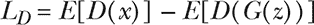

##### 方程式 12.2。


回想一下，方程式 12.1 描述了判别器的损失函数——我们测量真实数据(*D*(*x*))和生成数据(*D*(*G*(*z*)))之间的差异。方程式 12.2 然后描述了生成器的损失函数，其中我们试图让判别器相信它看到的样本是真实的。

要回到我们的直接前辈，记住 WGAN 试图最小化我们需要移动的概率质量，以使生成的分布看起来像真实分布。在这方面，RGAN 有很多相似之处（例如，判别器经常被称为*评论员*，而 WGAN 在本论文中被呈现为 RGAN 的特殊情况）。最终，两者都将当前状态作为单个数字来衡量——还记得地球迁移距离吗？

RGAN 的创新之处在于，我们不再得到生成器总是处于追赶状态的前所未有的动态。换句话说，生成器正在尝试生成比真实数据更真实的数据，这样它就不再总是处于防守状态。因此，*D*(*x*)可以被解释为真实数据比生成数据更真实概率。

在我们深入探讨高级别差异之前，我们将引入一种略微不同的符号，以近似论文中使用的符号，但简化。在方程式 12.3 和 12.4 中，*C*(*x*)充当类似于 WGAN 设置的评论员，^([5])您可能将其视为判别器。此外，*a*()定义为 log(sigmoid())。在论文中，*G*(*z*)被替换为*x[f]*表示假样本，而*x*通过下标*r*表示真实样本，但我们将遵循早期章节中更简单的符号。

> ⁵
> 
> 由于我们跳过了一些细节，我们希望向您提供高级概念，并保持符号的一致性，以便您可以自己填补空白。

##### 方程式 12.3。

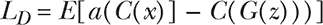

##### 方程式 12.4。

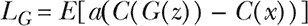

重要的是，在这些方程中，我们只看到生成器中的一个关键差异：真实数据现在被添加到损失函数中。这个看似简单的技巧使生成器的激励与永久劣势保持一致。为了理解这一点以及在其他理想化设置中的两个其他视角，让我们绘制不同的判别器输出，如图 12.1 所示。

##### 图 12.1\. 在发散最小化（a）中，生成器总是追赶判别器（因为发散总是≥0）。在（b）中，我们看到“良好”的 NS-GAN 训练是什么样的。再次，生成器不能获胜。在（c）中，我们可以看到现在生成器可以获胜，但更重要的是，生成器在训练的任何阶段都有东西可以追求（因此恢复有用的梯度）。

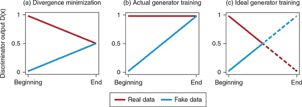

(来源：“相对判别器：标准 GAN 缺失的关键元素”，作者：Alexia Jolicoeur-Martineau，2018 年，[`arxiv.org/abs/1807.00734`](http://arxiv.org/abs/1807.00734).)

您可能会想，为什么仅仅添加这个术语就值得关注？嗯，这个简单的添加使得训练在略微增加的计算成本下变得更加稳定。这很重要，特别是当你想起“GANs Created Equal？”这篇论文来自第五章，其中作者们争论说，到目前为止考虑的所有主要 GAN 架构在调整额外的处理需求后，对原始 GAN 的改进仅是有限的。这是因为许多新的 GAN 架构仅在巨大的计算成本下表现更好，这使得它们不太有用，但 RGAN 有潜力改变整个 GAN 架构。

总是要意识到这个技巧，因为即使一个方法可能需要更少的更新步骤，但如果每个步骤因为额外的计算而需要两倍的时间，这真的值得吗？大多数会议的同行评审过程并不免疫于这种弱点，所以你必须小心。

##### 应用

您接下来的问题可能是，这在实践中为什么很重要？不到一年时间，这篇论文已经收集了超过 50 次引用^([6])——对于一个之前未知的作者的新论文来说，这是一个相当大的数字。此外，人们已经使用 RGAN 撰写了论文，例如，实现了最先进的语音（即，迄今为止的最佳性能）增强，击败了其他基于 GAN 和非 GAN 的方法.^([7])

> ⁶
> 
> 以下链接列出了所有引用 RGAN 论文的论文：[`mng.bz/omGj`](http://mng.bz/omGj)。
> 
> ⁷
> 
> 参见 Deepak Baby 和 Sarah Verhulst 于 2019 年发表的 IEEE-ICASSP 论文“SERGAN: 使用梯度惩罚的相对生成对抗网络进行语音增强”，[`ieeexplore.ieee.org/document/8683799`](https://ieeexplore.ieee.org/document/8683799)。

当您阅读此内容时，这篇论文应该已经可用，所以请随意查看。然而，解释这篇论文，包括所有必要的背景知识，超出了本书的范围。

#### 12.2.2\. 自注意力 GAN

我们相信下一个即将改变格局的创新是*自注意力生成对抗网络（SAGAN）*。注意力基于一个非常人性化的关于我们如何观察世界——一次关注一小块的想法。8 GAN 的注意力工作方式类似：你的意识能够专注于，比如说，桌子的一小部分，但你的大脑能够通过快速、微小的眼动，称为*眼跳（saccades）*，将整个桌子拼接在一起，同时仍然一次只关注图像的子集。

> ⁸
> 
> 请参阅尼克·查特（Nick Chater）所著的《The Mind Is Flat: The Illusion of Mental Depth and the Improvised Mind》（企鹅出版社，2018 年）。

计算机等效方法已在许多领域得到应用，包括自然语言处理（NLP）和计算机视觉。注意力可以帮助我们解决，例如，卷积神经网络（CNNs）忽略图片大部分内容的问题。众所周知，CNNs 依赖于一个小的感受野——由卷积的大小决定。然而，如您在第五章中可能回忆的那样，在生成对抗网络（GANs）中，感受野的大小可能会引起问题（如多头或多身体的情况），而 GAN 不会认为这是奇怪的。

这是因为在生成或评估图像的该子集时，我们可能会看到在一个区域中有一个腿，但我们没有看到在另一个区域中已经存在其他腿。这可能是由于卷积忽略了物体的结构，或者是因为腿或腿的旋转由不同的高级神经元表示，这些神经元之间没有交流。我们经验丰富的数据科学家会记得这正是 Hinton 的 CapsuleNets 试图解决的问题，但它们从未真正起飞。对其他人来说，简而言之，没有人能绝对确定为什么注意力可以解决这个问题，但一种好的思考方式是我们现在可以创建具有灵活感受野（形状）的*特征检测器*，真正关注给定图片的几个关键方面（参见图 12.2）。

##### 图 12.2\. 输出像素（2 × 2 块）忽略除了小的高亮区域之外的所有内容。注意力帮助我们解决这个问题。

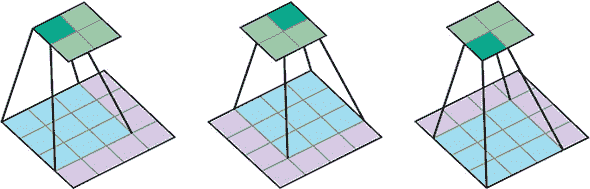

（来源：“Convolution Arithmetic”，作者：vdmoulin，2016 年，[`github.com/vdumoulin/conv_arithmetic`](https://github.com/vdumoulin/conv_arithmetic)）

回想一下，当我们的图像是 512 × 512 时，这尤其是一个问题，但最大的常用卷积大小是 7，这意味着有大量的被忽略的特征！即使在高级节点中，神经网络也可能没有适当地检查，例如，头部是否在正确的位置。因此，只要牛头在牛身体旁边，网络就不关心任何其他头部，只要至少有一个。但结构是错误的。

这些高级表示更难推理，因此即使是研究人员也不同意为什么会发生这种情况，但根据经验，网络似乎并没有注意到这一点。注意力使我们能够挑选出相关的区域——无论形状或大小——并相应地考虑它们。要了解注意力可以灵活关注的区域类型，请考虑 图 12.3。

##### 图 12.3\. 在这里，我们可以看到在给定的代表性查询位置下，注意力机制最关注的图像区域。我们可以看到，注意力机制通常关注不同形状和大小的区域，这是一个好兆头，因为我们希望它能挑选出图像中表明其类型的区域。

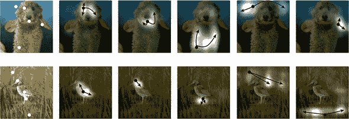

(来源：“Self-Attention Generative Adversarial Networks”，Han Zhang，2018，[`arxiv.org/abs/1805.08318`](http://arxiv.org/abs/1805.08318)。)

##### 应用

*DeOldify* ([`github.com/jantic/DeOldify`](https://github.com/jantic/DeOldify)) 是由 Jeremy Howard 的 fast.ai 课程学生 Jason Antic 开发的一种基于 SAGAN 的流行应用。DeOldify 使用 SAGAN 将旧图像和绘画着色到令人难以置信的精确程度。如图 12.4 所示，你可以将著名的历史照片和画作转换为全彩版本。

##### 图 12.4\. 南达科他州 Deadwood，1877 年。右侧的图像已被着色……用于黑白书籍。请相信我们。如果您不相信我们，请查看 Manning 网站上的在线 liveBook，亲自看看！

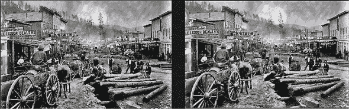

#### 12.2.3\. BigGAN

另一个震撼世界的架构是 *BigGAN*.^([9]) BigGAN 在 ImageNet 的所有 1,000 个类别上实现了高度逼真的 512 × 512 图像——这是当前一代 GAN 所认为几乎不可能完成的壮举。BigGAN 实现了之前最佳 inception 分数的三倍。简而言之，BigGAN 建立在 SAGAN 和频谱归一化之上，并在五个方向上进一步创新：

> ⁹
> 
> 参见 Andrew Brock 等人于 2019 年发表的“Large Scale GAN Training for High Fidelity Natural Image Synthesis”，[`arxiv.org/pdf/1809.11096.pdf`](https://arxiv.org/pdf/1809.11096.pdf)。

+   将 GAN 扩展到之前难以置信的计算规模。BigGAN 的作者使用了八倍的批量大小进行训练，这是他们成功的一部分——已经提供了 46% 的提升。理论上，训练 BigGAN 所需的资源总计达到 59,000 美元的计算能力.^([10])

    > ¹⁰
    > 
    > 参见 Mario Klingemann 的 Twitter 帖子 [`mng.bz/wll2`](http://mng.bz/wll2)。

+   与 SAGAN 架构相比，BigGAN 的每个层的通道数（特征图）数量是 1.5 倍。这可能是因为数据集的复杂性。

+   通过控制对抗过程来提高生成器和判别器的稳定性，从而带来整体更好的结果。不幸的是，这种基础的数学超出了本书的范围，但如果您对此感兴趣，我们建议从理解谱归一化开始。对于那些不感兴趣的人，您可以安慰自己，即使是作者在训练的后期部分也放弃了这种策略，并让模式崩溃，因为计算成本过高。

+   引入一种*截断技巧*来给我们一种控制多样性和保真度之间权衡的方法。如果我们从分布的中间部分采样（截断它），截断技巧可以达到更好的平等结果。这很有道理，因为这是 BigGAN“经验最丰富”的地方。

+   作者介绍了另外三个理论进步。然而，根据作者自己的性能表，这些似乎只对分数有轻微的影响，并且经常导致稳定性降低。它们对计算效率很有用，但我们将不讨论它们。

##### 应用

BigGAN 一个令人着迷的艺术应用是 Ganbreeder 应用程序，这得益于预训练模型和 Joel Simon 的辛勤工作。Ganbreeder 是一个基于网络的交互式（免费！）方式来探索 BigGAN 的潜在空间。它已被用于众多艺术应用中，作为产生新图像的一种方式。

您可以选择探索相邻的潜在空间，或者使用两个图像样本之间的线性插值来创建新的图像。图 12.5 展示了创建 Ganbreeder 后代的示例。

##### 图 12.5。每次您点击“制作孩子”按钮时，Ganbreeder 都会在附近的潜在空间中为您提供一组变异图像，产生下面的三幅图像。您可以从自己的样本或他人的样本开始——因此使其成为一种协作练习。这就是交叉混合部分的作用，您可以从空间的其它部分选择另一个有趣的样本，并将两个样本混合。最后，在编辑-基因中，您可以编辑参数（例如，在本例中的城堡和石墙）并添加更多或更少的这种特征到图片中。

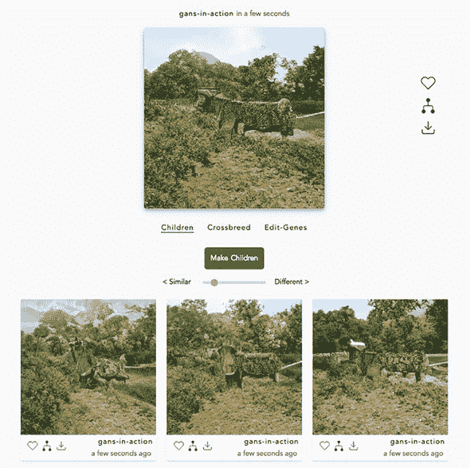

（来源：Ganbreeder，[`mng.bz/nv28`](http://mng.bz/nv28)。）

BigGAN 另一个值得注意的地方是 DeepMind 免费为我们提供了所有这些计算资源，并将预训练模型上传到了 TensorFlow Hub——一个我们用于第六章的机器学习代码仓库。

### 12.3. 进一步阅读

我们本想涵盖许多其他在学者和实践者作品中似乎越来越受欢迎的话题，但我们没有足够的空间。在这里，我们将至少列出三个供感兴趣的读者参考。我们希望我们已经为您提供了理解这些论文所需的一切。我们只挑选了三个，因为我们预计这一部分会很快发生变化：

+   *Style GAN* ([`arxiv.org/abs/1812.04948`](http://arxiv.org/abs/1812.04948)) 将 GAN 和“传统”风格迁移的理念相结合，使用户对生成的输出有更多的控制。这款来自 NVIDIA 的条件 GAN 已经能够通过几个级别的控制——从更细致的细节到整体图像——产生令人惊叹的全高清结果。这项工作建立在第六章的基础上，因此在你深入研究这篇论文之前，你可能想要重新阅读它。

+   *谱归一化* ([`arxiv.org/abs/1802.05957`](http://arxiv.org/abs/1802.05957)) 是一种复杂的正则化技术，需要一定的先进线性代数知识。现在，只需记住其用例——通过在网络上归一化权重以满足特定属性来稳定训练，这在 WGAN 中也是形式上要求的（在第五章[`arxiv.org/abs/1802.05957`](http://arxiv.org/abs/1802.05957)中有所涉及）。谱归一化在某种程度上与梯度惩罚相似。

+   *SPADE*，也称为 *GauGAN* ([`arxiv.org/pdf/1903.07291.pdf`](https://arxiv.org/pdf/1903.07291.pdf))，是 2019 年发表的一项前沿工作，它根据图像的语义图合成逼真的图像，正如你从第九章的开头所回忆的那样。图像的分辨率可以达到 512 × 256，但鉴于 NVIDIA 的能力，这可能在年底前增加。这可能是三种技术中最具挑战性的，但也是最受媒体关注的——可能是因为技术演示的令人印象深刻！

在 GAN 的世界中，发生的事情如此之多，以至于可能无法始终跟上最新动态。然而，我们希望，无论是在伦理框架还是最新有趣论文方面，我们都已经为你提供了所需的资源，以便观察这个不断发展的空间中的问题。确实，这是我们的希望，即使是对本章中介绍的 GAN 背后的创新也是如此。我们不知道这些是否会成为人们日常技巧包的一部分，但我们认为它们可能会。我们也希望这一点适用于本节中列出的最新创新。

### 12.4. 回顾与总结

我们希望我们讨论的尖端技术能够给你足够的素材，让你在本书结束时仍能继续探索 GAN。然而，在我们让你离开之前，回顾并总结你所学的内容是值得的。

我们从对 GANs 是什么以及它们如何工作的基本解释开始（第一章）并实现了这个系统的简单版本（第三章）。我们在一个更容易的环境中向您介绍了生成模型，即自编码器（第二章）。我们涵盖了 GANs 的理论（第三章和第五章）以及它们的不足之处和克服这些不足的一些方法（第五章）。这为后续的、更高级的章节提供了基础和工具。

我们实现了几个最经典和最有影响力的 GAN 变体——深度卷积 GAN（第四章）和条件 GAN（第八章）——以及一些最先进和复杂的变体——渐进式 GANs（第六章）和 CycleGANs（第九章）。我们还实现了半监督 GANs（第八章），这是一种旨在解决机器学习中最严重不足之一的 GAN 变体：缺乏大量标记的数据集。我们还探讨了 GANs 的许多实用和创新应用（第十一章），并展示了对抗性示例（第十章），这对所有机器学习都是一个挑战。

在这个过程中，您扩展了您的理论和实践工具箱。从 inception score 和 Fréchet inception distance (第五章) 到像素级特征归一化 (第六章)，批量归一化 (第四章)，以及 dropout (第七章），您学习了关于概念和技术，这些将在 GANs 及其它领域为您服务得很好。

回顾过去，当我们探索生成对抗网络（GANs）时，有几个主题反复出现，值得我们强调：

+   GANs 在实用用例和抵御理论要求及约束方面的适应性都非常强。这一点在第九章中 CycleGAN 的案例中可能最为明显。这项技术不仅不受其前辈需要成对数据的需求的限制，而且几乎可以在任何领域之间进行转换，从苹果和橙子到马和斑马。GANs 的适应性在第六章中也得到了体现，您在那里看到渐进式 GANs 可以学习生成与人类面部和医学乳腺 X 光片一样不同的图像，在第七章中，我们只需进行少量调整，就可以将判别器转变为多类分类器。

+   GANs 既是艺术也是科学。GANs 的美丽和诅咒——实际上，深度学习总体上也是如此——在于我们对它们在实践中为何如此有效理解有限。已知数学保证很少，大多数成就仅限于实验。这使得 GANs 容易受到许多训练陷阱的影响，例如模式崩溃，您可能还记得我们在第五章中的讨论。第五章。幸运的是，研究人员已经找到了许多技巧和窍门，这些技巧和窍门极大地减轻了这些挑战——从输入预处理到我们选择的优化器和激活函数——其中许多您在本书中已经了解，甚至在代码教程中亲自看到了。确实，正如本章介绍的 GAN 变体所显示的，提高 GANs 的技术仍在不断发展。

除了训练中的困难之外，还必须牢记，即使像 GANs 这样强大而多功能的技巧也有其他重要的局限性。GANs 被许多人誉为赋予机器创造力的技术。这在一定程度上是正确的——在短短几年内，GANs 已经成为合成假数据的无可争议的最先进技术；然而，它们在人类创造力方面还有所不足。

事实上，正如我们在本书中一次又一次地展示的那样，GANs 可以模仿几乎所有现有数据集的特征，并提出看起来似乎来自该数据集的例子。然而，由于它们的本质，GANs 不会远离训练数据。例如，如果我们有一个经典艺术大师作品的训练数据集，我们的 GAN 产生的例子将看起来更像米开朗基罗而不是杰克逊·波洛克。除非出现一种新的 AI 范式，赋予机器真正的自主性，否则最终将由（人类）研究人员引导 GAN 达到预期的最终目标。

当你实验 GAN 及其应用时，请记住，不仅包括在这本书中涵盖的实用技术、技巧和窍门，还包括本章讨论的伦理考量。带着这些，我们祝愿你们在 GAN 之旅中一切顺利。

—雅库布和弗拉基米尔

### 摘要

+   我们讨论了人工智能和生成对抗网络（GAN）的伦理问题，并探讨了道德框架、意识需求和讨论的开放性。

+   我们提供了我们认为将推动 GAN 未来发展的创新，并给出了以下高级概念的背景想法：

    +   相对论 GAN，它现在确保生成器考虑真实数据和生成数据的相对可能性

    +   SAGAN，其注意力机制与人类感知相似

    +   BigGAN，它使我们能够生成前所未有的 1,000 个 ImageNet 类别

+   我们强调了本书的两个关键重复主题：（1）GAN 的通用性以及（2）实验的必要性，因为，与深度学习的其他部分一样，GAN 既是艺术也是科学。
