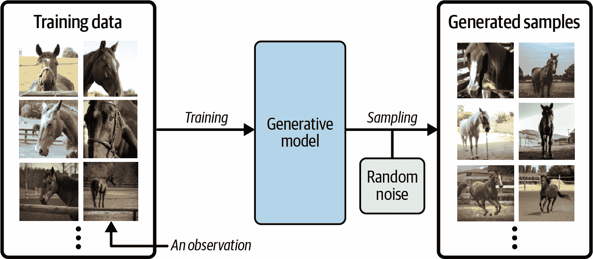
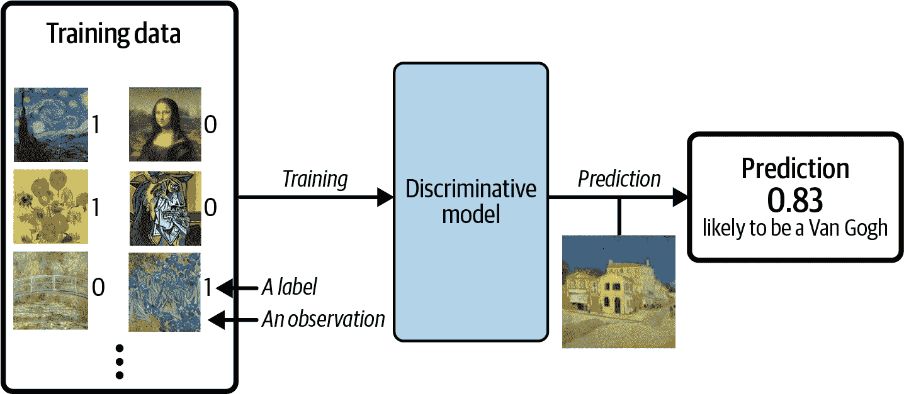
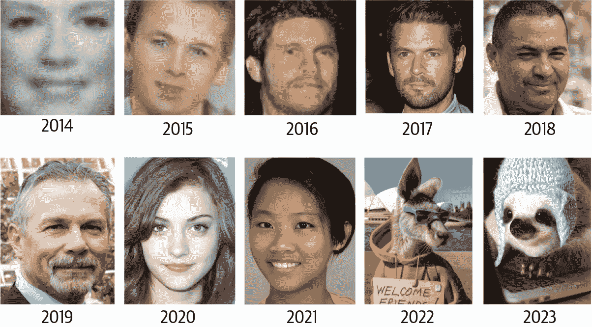
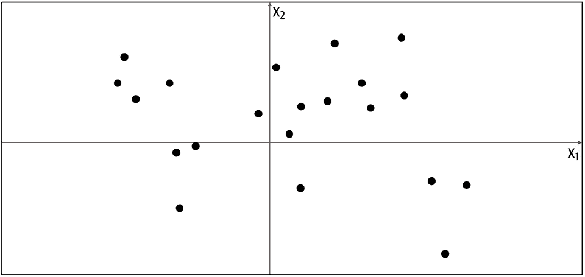
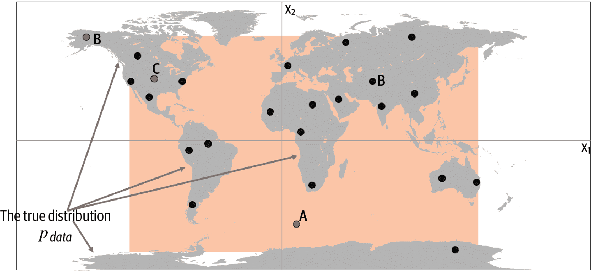
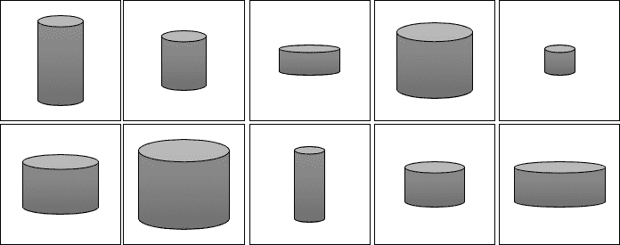
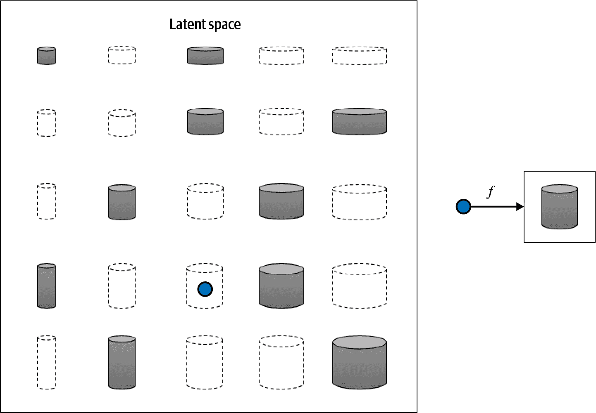
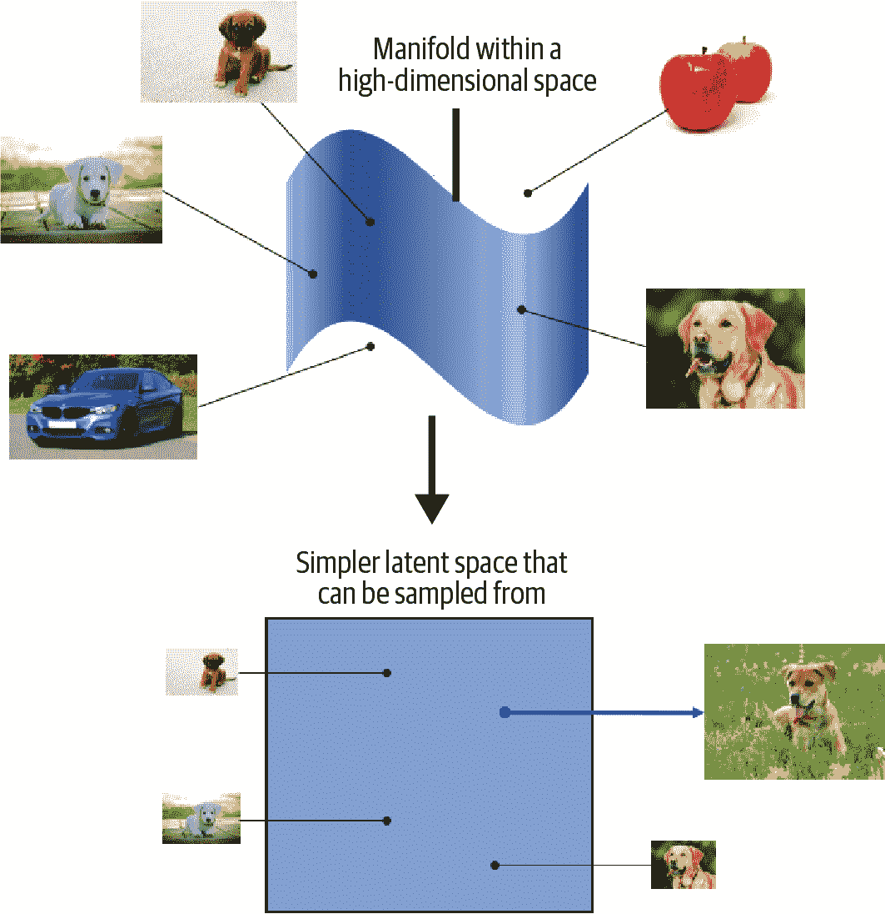
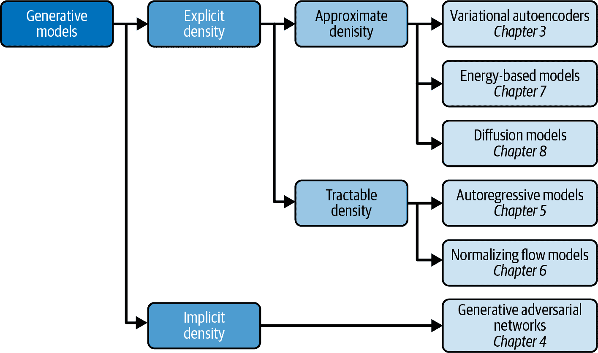

# 第一章：生成建模

本章是对生成建模领域的一般介绍。

我们将从一个温和的理论介绍生成建模开始，看看它是更广泛研究的判别建模的自然对应。然后我们将建立一个描述一个好的生成模型应该具有的理想特性的框架。我们还将阐明重要的概率概念，以便充分理解不同方法如何应对生成建模的挑战。

这将自然地引导我们到倒数第二部分，其中描述了如今主导该领域的六个广泛的生成模型家族。最后一部分解释了如何开始使用本书附带的代码库。

# 什么是生成建模？

生成建模可以被广泛定义如下：

> 生成建模是机器学习的一个分支，涉及训练一个模型来生成类似于给定数据集的新数据。

这在实践中意味着什么？假设我们有一个包含马照片的数据集。我们可以在这个数据集上*训练*一个生成模型，以捕捉马图片中像素之间复杂关系的规则。然后我们可以从这个模型中*采样*，创建出原始数据集中不存在的新颖、逼真的马的图片。这个过程在图 1-1 中有所说明。



###### 图 1-1。一个生成模型被训练来生成逼真的马的照片

为了构建一个生成模型，我们需要一个包含我们试图生成的实体的许多示例的数据集。这被称为*训练数据*，一个这样的数据点被称为*观察*。

每个观察结果由许多*特征*组成。对于图像生成问题，特征通常是单个像素值；对于文本生成问题，特征可以是单个单词或字母组合。我们的目标是构建一个能够生成新特征集的模型，看起来就好像它们是使用与原始数据相同的规则创建的。从概念上讲，对于图像生成来说，这是一个非常困难的任务，考虑到单个像素值可以被分配的方式数量庞大，而构成我们试图生成的实体图像的这种排列的数量相对较少。

一个生成模型必须是*概率*的，而不是*确定*的，因为我们希望能够对输出进行许多不同的变化采样，而不是每次都得到相同的输出。如果我们的模型仅仅是一个固定的计算，比如在训练数据集中每个像素的平均值，那么它就不是生成的。一个生成模型必须包括一个随机组件，影响模型生成的个体样本。

换句话说，我们可以想象存在某种未知的概率分布，解释为什么一些图像可能在训练数据集中找到，而其他图像则不可能。我们的工作是构建一个尽可能模拟这个分布的模型，然后从中采样生成新的、不同的观察结果，看起来就好像它们可能已经包含在原始训练集中。

## 生成模型与判别模型

为了真正理解生成建模的目标以及为什么这很重要，将其与其对应的*判别建模*进行比较是有用的。如果你学过机器学习，你所面对的大多数问题很可能是判别性的。为了理解区别，让我们看一个例子。

假设我们有一组绘画数据，一些是梵高画的，一些是其他艺术家的。有了足够的数据，我们可以训练一个判别模型来预测一幅给定的画是不是梵高画。我们的模型会学习到某些颜色、形状和纹理更有可能表明一幅画是荷兰大师的作品，对于具有这些特征的画作，模型会相应地增加其预测权重。图 1-2 展示了判别建模过程——注意它与图 1-1 中展示的生成建模过程的不同之处。



###### 图 1-2。一个训练有素的判别模型，用于预测一幅给定图像是否是梵高的画。

在进行判别建模时，训练数据中的每个观察都有一个*标签*。对于像我们的艺术家判别器这样的二元分类问题，梵高的画作将被标记为 1，非梵高的画作将被标记为 0。然后我们的模型学习如何区分这两组，并输出一个新观察具有标签 1 的概率——即它是不是梵高画的概率。

相比之下，生成建模不需要数据集被标记，因为它关注的是生成全新的图像，而不是试图预测给定图像的标签。

让我们正式定义这些类型的建模，使用数学符号：

# 条件生成模型

请注意，我们也可以构建一个生成模型来建模条件概率<math alttext="p left-parenthesis bold x vertical-bar y right-parenthesis"><mrow><mi>p</mi> <mo>(</mo> <mi>𝐱</mi> <mo>|</mo> <mi>y</mi> <mo>)</mo></mrow></math>——观察到具有特定标签<math alttext="y"><mi>y</mi></math>的观察<math alttext="bold x"><mi>𝐱</mi></math>的概率。

例如，如果我们的数据集包含不同类型的水果，我们可以告诉我们的生成模型专门生成一个苹果的图像。

一个重要的观点是，即使我们能够构建一个完美的判别模型来识别梵高的画作，它仍然不知道如何创作一幅看起来像梵高的画。它只能输出针对现有图像的概率，因为这是它被训练做的事情。我们需要训练一个生成模型，并从这个模型中采样，以生成具有高概率属于原始训练数据集的图像。

## 生成建模的崛起

直到最近，判别建模一直是机器学习中取得进展的主要驱动力。这是因为对于任何判别问题，相应的生成建模问题通常更难解决。例如，训练一个模型来预测一幅画是否是梵高的比起从头开始训练一个模型生成梵高风格的画作要容易得多。同样，训练一个模型来预测一段文本是否是查尔斯·狄更斯写的比起构建一个模型生成狄更斯风格的段落要容易得多。直到最近，大多数生成挑战都是难以实现的，许多人怀疑它们是否能够被解决。创造力被认为是一种纯粹的人类能力，无法被人工智能所匹敌。

然而，随着机器学习技术的成熟，这种假设逐渐削弱。在过去的 10 年中，该领域中最有趣的进展之一是通过将机器学习应用于生成建模任务的新颖应用。例如，图 1-3 展示了自 2014 年以来在面部图像生成方面已经取得的显著进展。



###### 图 1-3。使用生成建模进行人脸生成在过去十年中取得了显著进展（改编自[Brundage et al., 2018](https://www.eff.org/files/2018/02/20/malicious_ai_report_final.pdf))¹

除了更容易处理外，辨别建模在历史上比生成建模更容易应用于跨行业的实际问题。例如，医生可能会从一个可以预测给定视网膜图像是否显示青光眼迹象的模型中受益，但不一定会从一个可以生成眼睛背面的新颖图片的模型中受益。

然而，这也开始发生变化，随着越来越多的公司提供针对特定业务问题的生成服务。例如，现在可以访问 API，根据特定主题生成原创博客文章，生成您产品在任何您想要的环境中的各种图片，或者撰写社交媒体内容和广告文案以匹配您的品牌和目标信息。生成人工智能在游戏设计和电影制作等行业也有明显的积极应用，训练用于输出视频和音乐的模型开始增加价值。

## 生成建模和人工智能

除了生成建模的实际用途（其中许多尚未被发现），还有三个更深层次的原因，可以认为生成建模是解锁一种更复杂形式的人工智能的关键，超越了辨别建模单独可以实现的范围。

首先，从理论角度来看，我们不应该将机器训练仅限于简单地对数据进行分类。为了完整性，我们还应该关注训练能够捕捉数据分布更完整理解的模型，超越任何特定标签。这无疑是一个更难解决的问题，因为可行输出空间的维度很高，我们将归类为数据集的创作数量相对较少。然而，正如我们将看到的，许多推动辨别建模发展的相同技术，如深度学习，也可以被生成模型利用。

其次，正如我们将在第十二章中看到，生成建模现在被用于推动其他领域的人工智能进步，如强化学习（通过试错来教导代理优化环境中的目标）。假设我们想训练一个机器人在给定地形上行走。传统方法是在环境中运行许多实验，其中代理尝试不同的策略，或者在地形的计算机模拟中尝试。随着时间的推移，代理将学会哪些策略比其他策略更成功，因此逐渐改进。这种方法的挑战在于它相当僵化，因为它被训练来优化一个特定任务的策略。最近开始流行的另一种方法是，代替训练代理人学习环境的*世界模型*，使用生成模型，独立于任何特定任务。代理可以通过在自己的世界模型中测试策略，而不是在真实环境中测试，来快速适应新任务，这通常在计算上更有效，并且不需要为每个新任务从头开始重新训练。

最后，如果我们真的要说我们已经建立了一台获得了与人类相媲美的智能形式的机器，生成建模肯定是解决方案的一部分。自然界中最好的生成模型之一就是正在阅读本书的人。花点时间考虑一下你是一个多么不可思议的生成模型。你可以闭上眼睛想象大象从任何可能的角度看起来是什么样子。你可以想象你最喜欢的电视节目有许多不同的可能结局，你可以通过在脑海中思考各种未来并相应地采取行动来计划下周。当前的神经科学理论表明，我们对现实的感知并不是一个高度复杂的辨别模型，它根据我们的感官输入产生我们正在经历的预测，而是一个从出生开始就接受训练以产生准确匹配未来的环境的模型。一些理论甚至暗示，这个生成模型的输出就是我们直接感知为现实的东西。显然，深入了解我们如何构建机器来获得这种能力将是我们继续了解大脑运作和普遍人工智能的核心。

# 我们的第一个生成模型

有了这个想法，让我们开始我们激动人心的生成建模之旅。首先，我们将看一个生成模型的玩具示例，并介绍一些将帮助我们理解本书后面将遇到的更复杂架构的想法。

## 你好，世界！

让我们从在只有两个维度中玩一个生成建模游戏开始。我选择了一个用于生成点集<math alttext="bold upper X"><mi>𝐗</mi></math>的规则，如图 1-4 所示。让我们称这个规则为<math alttext="p Subscript d a t a"><msub><mi>p</mi> <mrow><mi>d</mi><mi>a</mi><mi>t</mi><mi>a</mi></mrow></msub></math>。你的挑战是选择一个不同的点<math alttext="bold x equals left-parenthesis x 1 comma x 2 right-parenthesis"><mrow><mi>𝐱</mi> <mo>=</mo> <mo>(</mo> <msub><mi>x</mi> <mn>1</mn></msub> <mo>,</mo> <msub><mi>x</mi> <mn>2</mn></msub> <mo>)</mo></mrow></math>，看起来像是由相同规则生成的。



###### 图 1-4。由未知规则生成的二维空间中的点集<math alttext="p Subscript d a t a"><msub><mi>p</mi> <mrow><mi>d</mi><mi>a</mi><mi>t</mi><mi>a</mi></mrow></msub></math>

你是如何选择的？你可能利用现有数据点的知识构建了一个心理模型<math alttext="p Subscript m o d e l"><msub><mi>p</mi> <mrow><mi>m</mi><mi>o</mi><mi>d</mi><mi>e</mi><mi>l</mi></mrow></msub></math>，来估计点更有可能出现的位置。在这方面，<math alttext="p Subscript m o d e l"><msub><mi>p</mi> <mrow><mi>m</mi><mi>o</mi><mi>d</mi><mi>e</mi><mi>l</mi></mrow></msub></math>是<math alttext="p Subscript d a t a"><msub><mi>p</mi> <mrow><mi>d</mi><mi>a</mi><mi>t</mi><mi>a</mi></mrow></msub></math>的*估计*。也许你决定<math alttext="p Subscript m o d e l"><msub><mi>p</mi> <mrow><mi>m</mi><mi>o</mi><mi>d</mi><mi>e</mi><mi>l</mi></mrow></msub></math>应该看起来像图 1-5——一个矩形框，点可能出现在其中，框外则不可能找到任何点。


###### 图 1-5。橙色框，<math alttext="p Subscript m o d e l"><msub><mi>p</mi> <mrow><mi>m</mi><mi>o</mi><mi>d</mi><mi>e</mi><mi>l</mi></mrow></msub></math>，是真实数据生成分布<math alttext="p Subscript d a t a"><msub><mi>p</mi> <mrow><mi>d</mi><mi>a</mi><mi>t</mi><mi>a</mi></mrow></msub></math>的估计

要生成一个新的观察结果，您可以简单地在框内随机选择一个点，或者更正式地，从分布<math alttext="p Subscript m o d e l"><msub><mi>p</mi> <mrow><mi>m</mi><mi>o</mi><mi>d</mi><mi>e</mi><mi>l</mi></mrow></msub></math>中*采样*。恭喜，您刚刚构建了您的第一个生成模型！您已经使用训练数据（黑点）构建了一个模型（橙色区域），您可以轻松地从中进行采样以生成其他似乎属于训练集的点。

现在让我们将这种思维形式化为一个框架，可以帮助我们理解生成建模试图实现的目标。

## 生成建模框架

我们可以在以下框架中捕捉建立生成模型的动机和目标。

现在让我们揭示真实的数据生成分布<math alttext="p Subscript d a t a"><msub><mi>p</mi> <mrow><mi>d</mi><mi>a</mi><mi>t</mi><mi>a</mi></mrow></msub></math>，看看这个框架如何适用于这个例子。正如我们从图 1-6 中看到的，数据生成规则只是世界陆地的均匀分布，没有机会在海洋中找到一个点。



###### 图 1-6。橙色框<math alttext="p Subscript m o d e l"><msub><mi>p</mi> <mrow><mi>m</mi><mi>o</mi><mi>d</mi><mi>e</mi><mi>l</mi></mrow></msub></math>是真实数据生成分布<math alttext="p Subscript d a t a"><msub><mi>p</mi> <mrow><mi>d</mi><mi>a</mi><mi>t</mi><mi>a</mi></mrow></msub></math>的估计（灰色区域）

显然，我们的模型<math alttext="p Subscript m o d e l"><msub><mi>p</mi> <mrow><mi>m</mi><mi>o</mi><mi>d</mi><mi>e</mi><mi>l</mi></mrow></msub></math>是对<math alttext="p Subscript d a t a"><msub><mi>p</mi> <mrow><mi>d</mi><mi>a</mi><mi>t</mi><mi>a</mi></mrow></msub></math>的过度简化。我们可以检查点 A、B 和 C，以了解我们的模型在多大程度上准确模拟了<math alttext="p Subscript d a t a"><msub><mi>p</mi> <mrow><mi>d</mi><mi>a</mi><mi>t</mi><mi>a</mi></mrow></msub></math>的成功和失败：

+   点 A 是由我们的模型生成的观察结果，但似乎并不是由<math alttext="p Subscript d a t a"><msub><mi>p</mi> <mrow><mi>d</mi><mi>a</mi><mi>t</mi><mi>a</mi></mrow></msub></math>生成的，因为它位于海洋中间。

+   点 B 永远不可能由<math alttext="p Subscript m o d e l"><msub><mi>p</mi> <mrow><mi>m</mi><mi>o</mi><mi>d</mi><mi>e</mi><mi>l</mi></mrow></msub></math>生成，因为它位于橙色框外。因此，我们的模型在产生观察结果的整个潜在可能性范围内存在一些缺陷。

+   点 C 是一个观察结果，可以由<math alttext="p Subscript m o d e l"><msub><mi>p</mi> <mrow><mi>m</mi><mi>o</mi><mi>d</mi><mi>e</mi><mi>l</mi></mrow></msub></math>和<math alttext="p Subscript d a t a"><msub><mi>p</mi> <mrow><mi>d</mi><mi>a</mi><mi>t</mi><mi>a</mi></mrow></msub></math>生成。

尽管模型存在缺陷，但由于它只是一个橙色框内的均匀分布，因此很容易从中进行采样。我们可以轻松地随机选择框内的一个点，以便从中进行采样。

此外，我们可以肯定地说，我们的模型是对捕捉一些基本高级特征的底层复杂分布的简单表示。真实分布被分为有大量陆地（大陆）和没有陆地（海洋）的区域。这也是我们模型的一个高级特征，除了我们只有一个大陆，而不是很多。

这个例子展示了生成建模背后的基本概念。我们在本书中将要解决的问题将会更加复杂和高维，但我们处理问题的基本框架将是相同的。

## 表示学习

值得深入探讨一下我们所说的学习高维数据的*表示*是什么意思，因为这是本书中将会反复出现的一个主题。

假设你想向一个在人群中寻找你并不知道你长什么样的人描述你的外貌。你不会从描述你照片的像素 1 的颜色开始，然后是像素 2，然后是像素 3，依此类推。相反，你会合理地假设对方对一个普通人的外貌有一个大致的概念，然后用描述像素组的特征来修正这个基线，比如*我有很金黄的头发*或*我戴眼镜*。只需不超过 10 条这样的描述，对方就能将描述映射回像素，生成一个你的形象。这个形象可能不完美，但足够接近你的实际外貌，让对方在可能有数百人的人群中找到你，即使他们以前从未见过你。

这就是*表示学习*的核心思想。我们不是直接对高维样本空间建模，而是使用一些较低维度的*潜在空间*来描述训练集中的每个观察，并学习一个能够将潜在空间中的点映射到原始域中的点的映射函数。换句话说，潜在空间中的每个点都是某个高维观察的*表示*。

这在实践中意味着什么？假设我们有一个由饼干罐的灰度图像组成的训练集(图 1-7)。



###### 图 1-7。饼干罐数据集

对我们来说，很明显有两个特征可以唯一代表这些罐子：罐子的高度和宽度。也就是说，我们可以将每个罐子的图像转换为一个仅有两个维度的潜在空间中的点，即使训练集中提供的图像是在高维像素空间中的。值得注意的是，这意味着我们也可以通过将适当的映射函数<math alttext="f"><mi>f</mi></math>应用于潜在空间中的新点，生成训练集中不存在的罐子的图像，如图 1-8 所示。

意识到原始数据集可以用更简单的潜在空间来描述对于机器来说并不容易——它首先需要确定高度和宽度是最能描述这个数据集的两个潜在空间维度，然后学习能够将这个空间中的点映射到灰度饼干罐图像的映射函数<math alttext="f"><mi>f</mi></math>。机器学习（特别是深度学习）赋予我们训练机器能够找到这些复杂关系的能力，而无需人类的指导。



###### 图 1-8。饼干罐的 2D 潜在空间和将潜在空间中的点映射回原始图像域的函数<math alttext="f"><mi>f</mi></math>

利用潜在空间训练模型的一个好处是，我们可以通过在更易管理的潜在空间内操作其表示向量，影响图像的高级属性。例如，要调整每个像素的阴影以使饼干罐的图像*更高*并不明显。然而，在潜在空间中，只需增加*高度*潜在维度，然后应用映射函数返回到图像域。我们将在下一章中看到一个明确的例子，不是应用于饼干罐而是应用于人脸。

将训练数据集编码到一个潜在空间中，以便我们可以从中进行采样并将点解码回原始域的概念对于许多生成建模技术是常见的，我们将在本书的后续章节中看到。从数学上讲，*编码器-解码器*技术试图将数据所在的高度非线性*流形*（例如，在像素空间中）转换为一个更简单的潜在空间，可以从中进行采样，因此很可能潜在空间中的任何点都是一个良好形成的图像的表示，如图 1-9 所示。



###### 图 1-9\. 在高维像素空间中的*狗*流形被映射到一个更简单的潜在空间，可以从中进行采样

# 核心概率理论

我们已经看到生成建模与概率分布的统计建模密切相关。因此，现在引入一些核心概率和统计概念是有意义的，这些概念将贯穿本书，用来解释每个模型的理论背景。

如果你从未学习过概率或统计学，不用担心。为了构建本书后面将看到的许多深度学习模型，不必对统计理论有深入的理解。然而，为了充分理解我们试图解决的任务，值得尝试建立对基本概率理论的扎实理解。这样，您将有基础来理解本章后面将介绍的不同类型的生成模型。

作为第一步，我们将定义五个关键术语，将每个术语与我们之前在二维世界地图中建模的生成模型的例子联系起来：

样本空间

*样本空间*是观察值 <math alttext="bold x"><mi>𝐱</mi></math> 可以取的所有值的完整集合。

###### 注意

在我们之前的例子中，样本空间包括世界地图上所有的纬度和经度点 <math alttext="bold x equals left-parenthesis x 1 comma x 2 right-parenthesis"><mrow><mi>𝐱</mi> <mo>=</mo> <mo>(</mo> <msub><mi>x</mi> <mn>1</mn></msub> <mo>,</mo> <msub><mi>x</mi> <mn>2</mn></msub> <mo>)</mo></mrow></math>。例如，<math alttext="bold x"><mi>𝐱</mi></math> = (40.7306, –73.9352) 是样本空间（纽约市）中属于真实数据生成分布的点。<math alttext="bold x"><mi>𝐱</mi></math> = (11.3493, 142.1996) 是样本空间中不属于真实数据生成分布的点（在海里）。

概率密度函数

*概率密度函数*（或简称*密度函数*）是一个将样本空间中的点 <math alttext="bold x"><mi>𝐱</mi></math> 映射到 0 到 1 之间的数字的函数 <math alttext="p left-parenthesis bold x right-parenthesis"><mrow><mi>p</mi> <mo>(</mo> <mi>𝐱</mi> <mo>)</mo></mrow></math>。密度函数在样本空间中所有点上的积分必须等于 1，以便它是一个明确定义的概率分布。

###### 注意

在世界地图的例子中，我们生成模型的密度函数在橙色框之外为 0，在框内为常数，使得密度函数在整个样本空间上的积分等于 1。

虽然只有一个真实的密度函数<math alttext="p Subscript d a t a Baseline left-parenthesis bold x right-parenthesis"><mrow><msub><mi>p</mi> <mrow><mi>d</mi><mi>a</mi><mi>t</mi><mi>a</mi></mrow></msub> <mrow><mo>(</mo> <mi>𝐱</mi> <mo>)</mo></mrow></mrow></math>被假定为生成可观测数据集，但有无限多个密度函数<math alttext="p Subscript m o d e l Baseline left-parenthesis bold x right-parenthesis"><mrow><msub><mi>p</mi> <mrow><mi>m</mi><mi>o</mi><mi>d</mi><mi>e</mi><mi>l</mi></mrow></msub> <mrow><mo>(</mo> <mi>𝐱</mi> <mo>)</mo></mrow></mrow></math>可以用来估计<math alttext="p Subscript d a t a Baseline left-parenthesis bold x right-parenthesis"><mrow><msub><mi>p</mi> <mrow><mi>d</mi><mi>a</mi><mi>t</mi><mi>a</mi></mrow></msub> <mrow><mo>(</mo> <mi>𝐱</mi> <mo>)</mo></mrow></mrow></math>。

参数建模

*参数建模*是一种技术，我们可以用来构建我们寻找适当<math alttext="p Subscript m o d e l Baseline left-parenthesis bold x right-parenthesis"><mrow><msub><mi>p</mi> <mrow><mi>m</mi><mi>o</mi><mi>d</mi><mi>e</mi><mi>l</mi></mrow></msub> <mrow><mo>(</mo> <mi>𝐱</mi> <mo>)</mo></mrow></mrow></math>的方法。*参数模型*是一组密度函数<math alttext="p Subscript theta Baseline left-parenthesis bold x right-parenthesis"><mrow><msub><mi>p</mi> <mi>θ</mi></msub> <mrow><mo>(</mo> <mi>𝐱</mi> <mo>)</mo></mrow></mrow></math>，可以用有限数量的参数<math alttext="theta"><mi>θ</mi></math>来描述。

###### 注意

如果我们假设均匀分布作为我们的模型族，那么我们可以在图 1-5 上绘制的所有可能框的集合是参数模型的一个示例。在这种情况下，有四个参数：框的左下角坐标<math alttext="left-parenthesis theta 1 comma theta 2 right-parenthesis"><mrow><mo>(</mo> <msub><mi>θ</mi> <mn>1</mn></msub> <mo>,</mo> <msub><mi>θ</mi> <mn>2</mn></msub> <mo>)</mo></mrow></math>和右上角<math alttext="left-parenthesis theta 3 comma theta 4 right-parenthesis"><mrow><mo>(</mo> <msub><mi>θ</mi> <mn>3</mn></msub> <mo>,</mo> <msub><mi>θ</mi> <mn>4</mn></msub> <mo>)</mo></mrow></math>的坐标。

因此，这个参数模型中的每个密度函数<math alttext="p Subscript theta Baseline left-parenthesis bold x right-parenthesis"><mrow><msub><mi>p</mi> <mi>θ</mi></msub> <mrow><mo>(</mo> <mi>𝐱</mi> <mo>)</mo></mrow></mrow></math>（即每个框）可以用四个数字<math alttext="theta equals left-parenthesis theta 1 comma theta 2 comma theta 3 comma theta 4 right-parenthesis"><mrow><mi>θ</mi> <mo>=</mo> <mo>(</mo> <msub><mi>θ</mi> <mn>1</mn></msub> <mo>,</mo> <msub><mi>θ</mi> <mn>2</mn></msub> <mo>,</mo> <msub><mi>θ</mi> <mn>3</mn></msub> <mo>,</mo> <msub><mi>θ</mi> <mn>4</mn></msub> <mo>)</mo></mrow></math>唯一表示。

可能性

参数集θ的*可能性*<math alttext="script upper L left-parenthesis theta vertical-bar bold x right-parenthesis"><mrow><mi>ℒ</mi> <mo>(</mo> <mi>θ</mi> <mo>|</mo> <mi>𝐱</mi> <mo>)</mo></mrow></math>是一个函数，用于衡量给定一些观察点<math alttext="bold x"><mi>𝐱</mi></math>的θ的合理性。它的定义如下：

<math alttext="script upper L left-parenthesis theta vertical-bar bold x right-parenthesis equals p Subscript theta Baseline left-parenthesis bold x right-parenthesis" display="block"><mrow><mi>ℒ</mi> <mrow><mo>(</mo> <mi>θ</mi> <mo>|</mo> <mi>𝐱</mi> <mo>)</mo></mrow> <mo>=</mo> <msub><mi>p</mi> <mi>θ</mi></msub> <mrow><mo>(</mo> <mi>𝐱</mi> <mo>)</mo></mrow></mrow></math>

也就是说，给定一些观察点<math alttext="bold x"><mi>𝐱</mi></math>的θ的可能性被定义为由<math alttext="theta"><mi>θ</mi></math>参数化的密度函数在点<math alttext="bold x"><mi>𝐱</mi></math>处的值。如果我们有一个完整的独立观测数据集<math alttext="bold upper X"><mi>𝐗</mi></math>，那么我们可以写成：

<math alttext="script upper L left-parenthesis theta vertical-bar bold upper X right-parenthesis equals product Underscript bold x element-of bold upper X Endscripts p Subscript theta Baseline left-parenthesis bold x right-parenthesis" display="block"><mrow><mi>ℒ</mi> <mrow><mo>(</mo> <mi>θ</mi> <mo>|</mo> <mi>𝐗</mi> <mo>)</mo></mrow> <mo>=</mo> <munder><mo>∏</mo> <mrow><mi>𝐱</mi><mo>∈</mo><mi>𝐗</mi></mrow></munder> <msub><mi>p</mi> <mi>θ</mi></msub> <mrow><mo>(</mo> <mi>𝐱</mi> <mo>)</mo></mrow></mrow></math>

###### 注意

在世界地图示例中，一个只覆盖地图左半部分的橙色框的似然为 0—它不可能生成数据集，因为我们观察到地图右半部分的点。在图 1-5 中的橙色框具有正的似然，因为在该模型下所有数据点的密度函数都为正。

由于 0 到 1 之间大量项的乘积可能会导致计算上的困难，我们通常使用*log-likelihood* ℓ代替：

<math alttext="script l left-parenthesis theta vertical-bar bold upper X right-parenthesis equals sigma-summation Underscript bold x element-of bold upper X Endscripts log p Subscript theta Baseline left-parenthesis bold x right-parenthesis" display="block"><mrow><mi>ℓ</mi> <mrow><mo>(</mo> <mi>θ</mi> <mo>|</mo> <mi>𝐗</mi> <mo>)</mo></mrow> <mo>=</mo> <munder><mo>∑</mo> <mrow><mi>𝐱</mi><mo>∈</mo><mi>𝐗</mi></mrow></munder> <mo form="prefix">log</mo> <msub><mi>p</mi> <mi>θ</mi></msub> <mrow><mo>(</mo> <mi>𝐱</mi> <mo>)</mo></mrow></mrow></math>

有统计原因解释为什么似然以这种方式定义，但我们也可以看到这种定义在直觉上是有道理的。一组参数θ的似然被定义为如果真实的数据生成分布是由θ参数化的模型，则看到数据的概率。

###### 警告

请注意，似然是*参数*的函数，而不是数据。它不应该被解释为给定参数集正确的概率—换句话说，它不是参数空间上的概率分布（即，它不会对参数求和/积分为 1）。

参数化建模的重点应该是找到最大化观察到的数据集𝐗的可能性的参数集的最优值^θ。

最大似然估计

*最大似然估计*是一种技术，它允许我们估计^θ——密度函数 pθ（𝐱）的参数集θ最有可能解释一些观察到的数据𝐗。更正式地说：

<math alttext="ModifyingAbove theta With caret equals arg max Underscript bold x Endscripts script l left-parenthesis theta vertical-bar bold upper X right-parenthesis" display="block"><mrow><mover accent="true"><mi>θ</mi> <mo>^</mo></mover> <mo>=</mo> <munder><mrow><mo form="prefix">arg</mo><mo movablelimits="true" form="prefix">max</mo></mrow> <mi>𝐱</mi></munder> <mi>ℓ</mi> <mrow><mo>(</mo> <mi>θ</mi> <mo>|</mo> <mi>𝐗</mi> <mo>)</mo></mrow></mrow></math>

^θ也被称为*最大似然估计*（MLE）。

###### 注意

在世界地图示例中，MLE 是仍然包含训练集中所有点的最小矩形。

神经网络通常*最小化*损失函数，因此我们可以等效地讨论找到*最小化负对数似然*的参数集：

<math alttext="ModifyingAbove theta With caret equals arg min Underscript theta Endscripts left-parenthesis minus script l left-parenthesis theta vertical-bar bold upper X right-parenthesis right-parenthesis equals arg min Underscript theta Endscripts left-parenthesis minus log p Subscript theta Baseline left-parenthesis bold upper X right-parenthesis right-parenthesis" display="block"><mrow><mover accent="true"><mi>θ</mi> <mo>^</mo></mover> <mo>=</mo> <munder><mrow><mo form="prefix">arg</mo><mo movablelimits="true" form="prefix">min</mo></mrow> <mi>θ</mi></munder> <mfenced separators="" open="(" close=")"><mo>-</mo> <mi>ℓ</mi> <mo>(</mo> <mi>θ</mi> <mo>|</mo> <mi>𝐗</mi> <mo>)</mo></mfenced> <mo>=</mo> <munder><mrow><mo form="prefix">arg</mo><mo movablelimits="true" form="prefix">min</mo></mrow> <mi>θ</mi></munder> <mfenced separators="" open="(" close=")"><mo>-</mo> <mo form="prefix">log</mo> <msub><mi>p</mi> <mi>θ</mi></msub> <mrow><mo>(</mo> <mi>𝐗</mi> <mo>)</mo></mrow></mfenced></mrow></math>

生成建模可以被看作是一种最大似然估计的形式，其中参数θ是模型中包含的神经网络的权重。我们试图找到这些参数的值，以最大化观察到的给定数据的可能性（或等效地，最小化负对数似然）。

然而，对于高维问题，通常不可能直接计算 pθ（𝐱）—它是*难以计算*的。正如我们将在下一节中看到的，不同类型的生成模型采取不同的方法来解决这个问题。

# 生成模型分类

虽然所有类型的生成模型最终都旨在解决相同的任务，但它们在对密度函数 pθ（𝐱）建模时采取了略有不同的方法。广义上说，有三种可能的方法：

1.  显式地对密度函数建模，但以某种方式限制模型，使得密度函数是可计算的。

1.  显式地建模密度函数的可处理近似。

1.  通过直接生成数据的随机过程隐式建模密度函数。

这些在图 1-10 中显示为分类法，与本书第 II 部分中将探索的六种生成模型家族并列。请注意，这些家族并不是相互排斥的—有许多模型是两种不同方法的混合体。您应该将这些家族视为生成建模的不同一般方法，而不是显式模型架构。



###### 图 1-10\. 生成建模方法的分类法

我们可以进行的第一个分割是在概率密度函数 <math alttext="p left-parenthesis bold x right-parenthesis"><mrow><mi>p</mi> <mo>(</mo> <mi>𝐱</mi> <mo>)</mo></mrow></math> 被*显式*建模和被*隐式*建模的模型之间。

*隐式密度模型*并不旨在估计概率密度，而是专注于产生直接生成数据的随机过程。隐式生成模型的最著名例子是*生成对抗网络*。我们可以进一步将*显式密度模型*分为直接优化密度函数（可处理模型）和仅优化其近似值的模型。

*可处理模型*对模型架构施加约束，使得密度函数具有易于计算的形式。例如，*自回归模型*对输入特征进行排序，以便可以按顺序生成输出—例如，逐字或逐像素。*归一化流模型*将一系列可处理、可逆函数应用于简单分布，以生成更复杂的分布。

*近似密度模型*包括*变分自动编码器*，引入潜变量并优化联合密度函数的近似值。*基于能量的模型*也利用近似方法，但是通过马尔可夫链采样，而不是变分方法。*扩散模型*通过训练模型逐渐去噪给定的先前损坏的图像来近似密度函数。

贯穿所有生成模型家族类型的共同主题是*深度学习*。几乎所有复杂的生成模型都以深度神经网络为核心，因为它们可以从头开始训练，学习控制数据结构的复杂关系，而不必事先硬编码信息。我们将在第二章中探讨深度学习，提供实际示例，帮助您开始构建自己的深度神经网络。

# 生成式深度学习代码库

本章的最后一节将帮助您开始构建生成式深度学习模型，介绍伴随本书的代码库。

###### 提示

本书中的许多示例都改编自[Keras 网站](https://oreil.ly/1UTwa)上提供的优秀开源实现。我强烈建议您查看这个资源，因为不断添加新模型和示例。

## 克隆存储库

要开始，您首先需要克隆 Git 存储库。*Git*是一个开源版本控制系统，可以让您将代码本地复制，以便在自己的计算机上或在基于云的环境中运行笔记本。您可能已经安装了这个，但如果没有，请按照与您操作系统相关的[说明](https://oreil.ly/tFOdN)进行操作。

要克隆本书的存储库，请导航到您想要存储文件的文件夹，并在终端中输入以下内容：

```py
git clone https://github.com/davidADSP/Generative_Deep_Learning_2nd_Edition.git
```

`您现在应该能够在计算机上的文件夹中看到文件。`  `## 使用 Docker

如果您没有自己的 GPU，也没有问题！本书中的所有示例都将在 CPU 上训练，尽管这将比在启用 GPU 的机器上使用时间更长。*README*中还有关于设置 Google Cloud 环境的部分，该环境可以让您按需使用 GPU。

## 在 GPU 上运行

# 总结

本章介绍了生成建模领域，这是机器学习的一个重要分支，它补充了更广泛研究的判别建模。我们讨论了生成建模目前是人工智能研究中最活跃和令人兴奋的领域之一，近年来在理论和应用方面取得了许多进展。

我们从一个简单的玩具示例开始，看到生成建模最终关注的是对数据的基础分布进行建模。这带来了许多复杂和有趣的挑战，我们将这些总结为了一个框架，以理解任何生成模型的理想特性。

本书的代码库旨在与*Docker*一起使用，这是一种免费的容器化技术，可以使您轻松开始使用新的代码库，而不受架构或操作系统的限制。如果您从未使用过 Docker，不用担心——书籍存储库中有如何开始的描述在*README*文件中。

在第二章中，我们将开始探索深度学习，并看到如何使用 Keras 构建可以执行判别建模任务的模型。这将为我们提供必要的基础，以便在后面的章节中解决生成式深度学习问题。

我们随后讨论了关键的概率概念，这将有助于充分理解每种生成建模方法的理论基础，并列出了我们将在本书的第 II 部分中探索的六种不同的生成模型系列。我们还看到了如何开始使用*Generative Deep Learning*代码库，方法是克隆存储库。
