# 第六章：正规化流模型

到目前为止，我们已经讨论了三类生成模型家族：变分自动编码器、生成对抗网络和自回归模型。每种模型都提出了不同的方法来解决建模分布 p(x)的挑战，要么通过引入一个可以轻松采样的潜变量（并在 VAE 中使用解码器或在 GAN 中使用生成器进行转换），要么通过可处理地将分布建模为前面元素值的函数（自回归模型）。

在本章中，我们将介绍一种新的生成模型家族——正规化流模型。正如我们将看到的，正规化流与自回归模型和变分自动编码器都有相似之处。像自回归模型一样，正规化流能够明确且可处理地建模数据生成分布 p(x)。像变分自动编码器一样，正规化流试图将数据映射到一个更简单的分布，比如高斯分布。关键区别在于，正规化流对映射函数的形式施加了约束，使其可逆，因此可以用来生成新的数据点。

在本章的第一节中，我们将详细探讨这个定义，然后使用 Keras 实现一个名为 RealNVP 的正规化流模型。我们还将看到如何扩展正规化流以创建更强大的模型，如 GLOW 和 FFJORD。

# 介绍

我们将从一个简短的故事开始，以阐明正规化流背后的关键概念。

雅各布和 F.L.O.W.机器的故事是对正规化流模型的描述。现在让我们更详细地探讨正规化流的理论，然后在使用 Keras 实现一个实际示例之前。

# 正规化流

正规化流模型的动机与我们在第三章中探讨的变分自动编码器的动机类似。简而言之，在变分自动编码器中，我们学习一个*编码器*映射函数，将一个复杂分布映射到一个我们可以从中采样的简单分布。然后我们还学习一个*解码器*映射函数，从简单分布到复杂分布，这样我们可以通过从简单分布中采样一个点 z 并应用学习到的转换来生成一个新的数据点。从概率上讲，解码器建模 p(x|z)，但编码器只是真实 p(z|x)的近似—编码器和解码器是两个完全不同的神经网络。

在正规化流模型中，解码函数被设计为编码函数的精确逆函数且计算迅速，使得正规化流具有可处理性质。然而，神经网络默认情况下不是可逆函数。这引发了一个问题，即我们如何创建一个可逆过程，将一个复杂分布（如一组水彩画的数据生成分布）转换为一个更简单的分布（如钟形高斯分布），同时仍然利用深度学习的灵活性和强大性。

为了回答这个问题，我们首先需要了解一种称为*变量变换*的技术。在本节中，我们将使用一个简单的二维示例，这样你可以看到归一化流是如何详细工作的。更复杂的例子只是基本技术的扩展。

## 变量变换

假设我们有一个在二维矩形<math alttext="upper X"><mi>X</mi></math>上定义的概率分布<math alttext="p Subscript upper X Baseline left-parenthesis x right-parenthesis"><mrow><msub><mi>p</mi> <mi>X</mi></msub> <mrow><mo>(</mo> <mi>x</mi> <mo>)</mo></mrow></mrow></math>（<math alttext="x equals left-parenthesis x 1 comma x 2 right-parenthesis"><mrow><mi>x</mi> <mo>=</mo> <mo>(</mo> <msub><mi>x</mi> <mn>1</mn></msub> <mo>,</mo> <msub><mi>x</mi> <mn>2</mn></msub> <mo>)</mo></mrow></math>），如图 6-2 所示。


###### 图 6-2。在二维空间中定义的概率分布<math alttext="p Subscript upper X Baseline left-parenthesis x right-parenthesis"><mrow><msub><mi>p</mi> <mi>X</mi></msub> <mrow><mo>(</mo> <mi>x</mi> <mo>)</mo></mrow></mrow></math>，在 2D（左）和 3D（右）中显示

这个函数在分布的定义域上积分为 1（即<math alttext="x 1"><msub><mi>x</mi> <mn>1</mn></msub></math>在范围[1, 4]，<math alttext="x 2"><msub><mi>x</mi> <mn>2</mn></msub></math>在范围[0, 2]），因此它代表了一个明确定义的概率分布。我们可以写成如下形式：

<math alttext="integral Subscript 0 Superscript 2 Baseline integral Subscript 1 Superscript 4 Baseline p Subscript upper X Baseline left-parenthesis x right-parenthesis d x 1 d x 2 equals 1" display="block"><mrow><msubsup><mo>∫</mo> <mrow><mn>0</mn></mrow> <mn>2</mn></msubsup> <msubsup><mo>∫</mo> <mrow><mn>1</mn></mrow> <mn>4</mn></msubsup> <msub><mi>p</mi> <mi>X</mi></msub> <mrow><mo>(</mo> <mi>x</mi> <mo>)</mo></mrow> <mi>d</mi> <msub><mi>x</mi> <mn>1</mn></msub> <mi>d</mi> <msub><mi>x</mi> <mn>2</mn></msub> <mo>=</mo> <mn>1</mn></mrow></math>

假设我们想要移动和缩放这个分布，使其在一个单位正方形<math alttext="upper Z"><mi>Z</mi></math>上定义。我们可以通过定义一个新变量<math alttext="z equals left-parenthesis z 1 comma z 2 right-parenthesis"><mrow><mi>z</mi> <mo>=</mo> <mo>(</mo> <msub><mi>z</mi> <mn>1</mn></msub> <mo>,</mo> <msub><mi>z</mi> <mn>2</mn></msub> <mo>)</mo></mrow></math>和一个将<math alttext="upper X"><mi>X</mi></math>中的每个点映射到<math alttext="upper Z"><mi>Z</mi></math>中的一个点的函数<math alttext="f"><mi>f</mi></math>来实现这一点： 

<math alttext="StartLayout 1st Row 1st Column z 2nd Column equals 3rd Column f left-parenthesis x right-parenthesis 2nd Row 1st Column z 1 2nd Column equals 3rd Column StartFraction x 1 minus 1 Over 3 EndFraction 3rd Row 1st Column z 2 2nd Column equals 3rd Column StartFraction x 2 Over 2 EndFraction EndLayout" display="block"><mtable displaystyle="true"><mtr><mtd columnalign="right"><mi>z</mi></mtd> <mtd><mo>=</mo></mtd> <mtd columnalign="left"><mrow><mi>f</mi> <mo>(</mo> <mi>x</mi> <mo>)</mo></mrow></mtd></mtr> <mtr><mtd columnalign="right"><msub><mi>z</mi> <mn>1</mn></msub></mtd> <mtd><mo>=</mo></mtd> <mtd columnalign="left"><mfrac><mrow><msub><mi>x</mi> <mn>1</mn></msub> <mo>-</mo><mn>1</mn></mrow> <mn>3</mn></mfrac></mtd></mtr> <mtr><mtd columnalign="right"><msub><mi>z</mi> <mn>2</mn></msub></mtd> <mtd><mo>=</mo></mtd> <mtd columnalign="left"><mfrac><msub><mi>x</mi> <mn>2</mn></msub> <mn>2</mn></mfrac></mtd></mtr></mtable></math>

请注意，这个函数是*可逆的*。也就是说，有一个函数<math alttext="g"><mi>g</mi></math>，它将每个<math alttext="z"><mi>z</mi></math>映射回其对应的<math alttext="x"><mi>x</mi></math>。这对于变量变换是必不可少的，否则我们无法在两个空间之间一致地进行前向和后向映射。我们可以通过简单地重新排列定义<math alttext="f"><mi>f</mi></math>的方程来找到<math alttext="g"><mi>g</mi></math>，如图 6-3 所示。

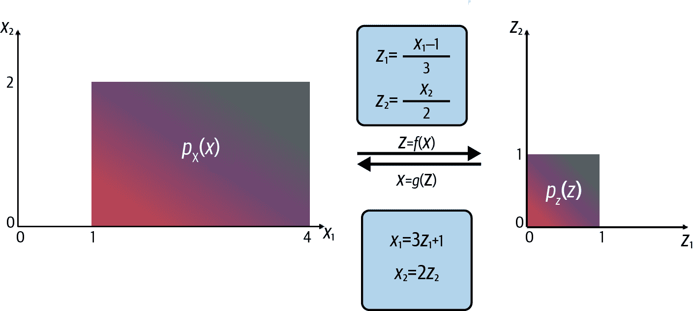

###### 图 6-3。在<math alttext="upper X"><mi>X</mi></math>和<math alttext="upper Z"><mi>Z</mi></math>之间改变变量

现在我们需要看看从<math alttext="upper X"><mi>X</mi></math>到<math alttext="upper Z"><mi>Z</mi></math>的变量变换如何影响概率分布<math alttext="p Subscript upper X Baseline left-parenthesis x right-parenthesis"><mrow><msub><mi>p</mi> <mi>X</mi></msub> <mrow><mo>(</mo> <mi>x</mi> <mo>)</mo></mrow></mrow></math>。我们可以通过将定义<math alttext="g"><mi>g</mi></math>的方程代入<math alttext="p Subscript upper X Baseline left-parenthesis x right-parenthesis"><mrow><msub><mi>p</mi> <mi>X</mi></msub> <mrow><mo>(</mo> <mi>x</mi> <mo>)</mo></mrow></mrow></math>来将其转换为一个以<math alttext="z"><mi>z</mi></math>为变量的函数<math alttext="p Subscript upper Z Baseline left-parenthesis z right-parenthesis"><mrow><msub><mi>p</mi> <mi>Z</mi></msub> <mrow><mo>(</mo> <mi>z</mi> <mo>)</mo></mrow></mrow></math>：

<math alttext="StartLayout 1st Row 1st Column p Subscript upper Z Baseline left-parenthesis z right-parenthesis 2nd Column equals 3rd Column StartFraction left-parenthesis left-parenthesis 3 z 1 plus 1 right-parenthesis minus 1 right-parenthesis left-parenthesis 2 z 2 right-parenthesis Over 9 EndFraction 2nd Row 1st Column Blank 2nd Column equals 3rd Column StartFraction 2 z 1 z 2 Over 3 EndFraction EndLayout" display="block"><mtable displaystyle="true"><mtr><mtd columnalign="right"><mrow><msub><mi>p</mi> <mi>Z</mi></msub> <mrow><mo>(</mo> <mi>z</mi> <mo>)</mo></mrow></mrow></mtd> <mtd><mo>=</mo></mtd> <mtd columnalign="left"><mfrac><mrow><mrow><mo>(</mo><mrow><mo>(</mo><mn>3</mn><msub><mi>z</mi> <mn>1</mn></msub> <mo>+</mo><mn>1</mn><mo>)</mo></mrow><mo>-</mo><mn>1</mn><mo>)</mo></mrow><mrow><mo>(</mo><mn>2</mn><msub><mi>z</mi> <mn>2</mn></msub> <mo>)</mo></mrow></mrow> <mn>9</mn></mfrac></mtd></mtr> <mtr><mtd><mo>=</mo></mtd> <mtd columnalign="left"><mfrac><mrow><mn>2</mn><msub><mi>z</mi> <mn>1</mn></msub> <msub><mi>z</mi> <mn>2</mn></msub></mrow> <mn>3</mn></mfrac></mtd></mtr></mtable></math>

然而，如果我们现在在单位正方形上对 p_Z(z)进行积分，我们会发现有问题！

<math alttext="integral Subscript 0 Superscript 1 Baseline integral Subscript 0 Superscript 1 Baseline StartFraction 2 z 1 z 2 Over 3 EndFraction d z 1 d z 2 equals one-sixth" display="block"><mrow><msubsup><mo>∫</mo> <mrow><mn>0</mn></mrow> <mn>1</mn></msubsup> <msubsup><mo>∫</mo> <mrow><mn>0</mn></mrow> <mn>1</mn></msubsup> <mfrac><mrow><mn>2</mn><msub><mi>z</mi> <mn>1</mn></msub> <msub><mi>z</mi> <mn>2</mn></msub></mrow> <mn>3</mn></mfrac> <mi>d</mi> <msub><mi>z</mi> <mn>1</mn></msub> <mi>d</mi> <msub><mi>z</mi> <mn>2</mn></msub> <mo>=</mo> <mfrac><mn>1</mn> <mn>6</mn></mfrac></mrow></math>

现在，转换后的函数 p_Z(z)不再是一个有效的概率分布，因为它只积分到 1/6。如果我们想要将数据上的复杂概率分布转换为一个简单的我们可以从中抽样的分布，我们必须确保它积分到 1。

缺少的因子 6 是因为我们转换后的概率分布的定义域比原始定义域小了六倍——原始矩形 X 的面积为 6，而这被压缩成了只有面积为 1 的单位正方形 Z。因此，我们需要将新的概率分布乘以一个归一化因子，该因子等于面积（或在更高维度中的体积）的相对变化。

幸运的是，有一种方法可以计算给定变换的体积变化——即变换的雅可比行列式的绝对值。让我们来解释一下！

## 雅可比行列式

函数 z=f(x)的雅可比矩阵是其一阶偏导数的矩阵，如下所示：

<math alttext="normal upper J equals StartFraction normal partial-differential z Over normal partial-differential x EndFraction equals Start 3 By 3 Matrix 1st Row 1st Column StartFraction normal partial-differential z 1 Over normal partial-differential x 1 EndFraction 2nd Column  ellipsis 3rd Column StartFraction normal partial-differential z 1 Over normal partial-differential x Subscript n Baseline EndFraction 2nd Row 1st Column  ellipsis 2nd Column  ellipsis 3rd Row 1st Column StartFraction normal partial-differential z Subscript m Baseline Over normal partial-differential x 1 EndFraction 2nd Column  ellipsis 3rd Column StartFraction normal partial-differential z Subscript m Baseline Over normal partial-differential x Subscript n Baseline EndFraction EndMatrix" display="block"><mrow><mi mathvariant="normal">J</mi> <mo>=</mo> <mstyle scriptlevel="0" displaystyle="true"><mfrac><mrow><mi>∂</mi><mi>z</mi></mrow> <mrow><mi>∂</mi><mi>x</mi></mrow></mfrac></mstyle> <mo>=</mo> <mfenced open="[" close="]"><mtable><mtr><mtd><mstyle scriptlevel="0" displaystyle="true"><mfrac><mrow><mi>∂</mi><msub><mi>z</mi> <mn>1</mn></msub></mrow> <mrow><mi>∂</mi><msub><mi>x</mi> <mn>1</mn></msub></mrow></mfrac></mstyle></mtd> <mtd><mo>⋯</mo></mtd> <mtd><mstyle scriptlevel="0" displaystyle="true"><mfrac><mrow><mi>∂</mi><msub><mi>z</mi> <mn>1</mn></msub></mrow> <mrow><mi>∂</mi><msub><mi>x</mi> <mi>n</mi></msub></mrow></mfrac></mstyle></mtd></mtr> <mtr><mtd><mo>⋱</mo></mtd> <mtd><mo>⋮</mo></mtd></mtr> <mtr><mtd><mstyle scriptlevel="0" displaystyle="true"><mfrac><mrow><mi>∂</mi><msub><mi>z</mi> <mi>m</mi></msub></mrow> <mrow><mi>∂</mi><msub><mi>x</mi> <mn>1</mn></msub></mrow></mfrac></mstyle></mtd> <mtd><mo>⋯</mo></mtd> <mtd><mstyle scriptlevel="0" displaystyle="true"><mfrac><mrow><mi>∂</mi><msub><mi>z</mi> <mi>m</mi></msub></mrow> <mrow><mi>∂</mi><msub><mi>x</mi> <mi>n</mi></msub></mrow></mfrac></mstyle></mtd></mtr></mtable></mfenced></mrow></math>

最好的方法是用我们的例子来解释。如果我们对 z1 关于 x1 进行偏导数，我们得到 1/3。如果我们对 z1 关于 x2 进行偏导数，我们得到 0。同样，如果我们对 z2 关于 x1 进行偏导数，我们得到 0。最后，如果我们对 z2 关于 x2 进行偏导数，我们得到 1/2。

因此，我们函数的雅可比矩阵如下：

<math alttext="upper J equals Start 2 By 2 Matrix 1st Row 1st Column one-third 2nd Column 0 2nd Row 1st Column 0 2nd Column one-half EndMatrix" display="block"><mrow><mi>J</mi> <mo>=</mo> <mfenced open="(" close=")"><mtable><mtr><mtd><mfrac><mn>1</mn> <mn>3</mn></mfrac></mtd> <mtd><mn>0</mn></mtd></mtr> <mtr><mtd><mn>0</mn></mtd> <mtd><mfrac><mn>1</mn> <mn>2</mn></mfrac></mtd></mtr></mtable></mfenced></mrow></math>

行列式仅对方阵有定义，并且等于通过将矩阵表示的变换应用于单位（超）立方体而创建的平行六面体的有符号体积。在二维中，这只是通过将矩阵表示的变换应用于单位正方形而创建的平行四边形的有符号面积。

有一个用于计算具有 n 维的矩阵行列式的[通用公式](https://oreil.ly/FuDCf)，其运行时间为𝒪(n³)。对于我们的例子，我们只需要二维的公式，如下所示：

<math alttext="normal d normal e normal t Start 2 By 2 Matrix 1st Row 1st Column a 2nd Column b 2nd Row 1st Column c 2nd Column d EndMatrix equals a d minus b c" display="block"><mrow><mi>det</mi> <mfenced open="(" close=")"><mtable><mtr><mtd><mi>a</mi></mtd> <mtd><mi>b</mi></mtd></mtr> <mtr><mtd><mi>c</mi></mtd> <mtd><mi>d</mi></mtd></mtr></mtable></mfenced> <mo>=</mo> <mi>a</mi> <mi>d</mi> <mo>-</mo> <mi>b</mi> <mi>c</mi></mrow></math>

因此，对于我们的示例，雅可比行列式的行列式是 <math alttext="one-third times one-half minus 0 times 0 equals one-sixth"><mrow><mfrac><mn>1</mn> <mn>3</mn></mfrac> <mo>×</mo> <mfrac><mn>1</mn> <mn>2</mn></mfrac> <mo>-</mo> <mn>0</mn> <mo>×</mo> <mn>0</mn> <mo>=</mo> <mfrac><mn>1</mn> <mn>6</mn></mfrac></mrow></math>。这是我们需要确保变换后的概率分布仍然积分为 1 的缩放因子为 1/6！

###### 提示

根据定义，行列式是有符号的——也就是说，它可以是负数。因此，我们需要取雅可比行列式的绝对值，以获得体积的相对变化。

## 变量转换方程

现在我们可以写下一个单一方程，描述在 <math alttext="upper X"><mi>X</mi></math> 和 <math alttext="upper Z"><mi>Z</mi></math> 之间变量转换的过程。这被称为*变量转换方程*（方程 6-1）。

##### 方程 6-1. 变量转换方程

<math alttext="p Subscript upper X Baseline left-parenthesis x right-parenthesis equals p Subscript upper Z Baseline left-parenthesis z right-parenthesis StartAbsoluteValue normal d normal e normal t left-parenthesis StartFraction normal partial-differential z Over normal partial-differential x EndFraction right-parenthesis EndAbsoluteValue" display="block"><mrow><msub><mi>p</mi> <mi>X</mi></msub> <mrow><mo>(</mo> <mi>x</mi> <mo>)</mo></mrow> <mo>=</mo> <msub><mi>p</mi> <mi>Z</mi></msub> <mrow><mo>(</mo> <mi>z</mi> <mo>)</mo></mrow> <mfenced separators="" open="|" close="|"><mi>det</mi> <mfenced separators="" open="(" close=")"><mfrac><mrow><mi>∂</mi><mi>z</mi></mrow> <mrow><mi>∂</mi><mi>x</mi></mrow></mfrac></mfenced></mfenced></mrow></math>

这如何帮助我们构建一个生成模型？关键在于理解，如果 <math alttext="p Subscript upper Z Baseline left-parenthesis z right-parenthesis"><mrow><msub><mi>p</mi> <mi>Z</mi></msub> <mrow><mo>(</mo> <mi>z</mi> <mo>)</mo></mrow></mrow></math> 是一个简单的分布，我们可以轻松地从中抽样（例如，高斯分布），那么理论上，我们所需要做的就是找到一个适当的可逆函数 <math alttext="f left-parenthesis x right-parenthesis"><mrow><mi>f</mi> <mo>(</mo> <mi>x</mi> <mo>)</mo></mrow></math>，可以将数据 <math alttext="upper X"><mi>X</mi></math> 映射到 <math alttext="upper Z"><mi>Z</mi></math>，以及相应的逆函数 <math alttext="g left-parenthesis z right-parenthesis"><mrow><mi>g</mi> <mo>(</mo> <mi>z</mi> <mo>)</mo></mrow></math>，可以用来将抽样的 <math alttext="z"><mi>z</mi></math> 映射回原始域中的点 <math alttext="x"><mi>x</mi></math>。我们可以使用涉及雅可比行列式的前述方程找到数据分布 <math alttext="p left-parenthesis x right-parenthesis"><mrow><mi>p</mi> <mo>(</mo> <mi>x</mi> <mo>)</mo></mrow></math> 的一个精确、可处理的公式。

然而，在实践中应用时存在两个主要问题，我们首先需要解决！

首先，计算高维矩阵的行列式在计算上是极其昂贵的——具体来说，是 <math alttext="script upper O left-parenthesis n cubed right-parenthesis"><mrow><mi>𝒪</mi> <mo>(</mo> <msup><mi>n</mi> <mn>3</mn></msup> <mo>)</mo></mrow></math>。这在实践中是完全不切实际的，因为即使是小的 32×32 像素灰度图像也有 1024 个维度。

其次，我们不清楚如何计算可逆函数 <math alttext="f left-parenthesis x right-parenthesis"><mrow><mi>f</mi> <mo>(</mo> <mi>x</mi> <mo>)</mo></mrow></math>。我们可以使用神经网络找到一些函数 <math alttext="f left-parenthesis x right-parenthesis"><mrow><mi>f</mi> <mo>(</mo> <mi>x</mi> <mo>)</mo></mrow></math>，但我们不能保证可以反转这个网络——神经网络只能单向工作！

为了解决这两个问题，我们需要使用一种特殊的神经网络架构，确保变量转换函数 <math alttext="f"><mi>f</mi></math> 是可逆的，并且其行列式易于计算。

我们将在接下来的部分中看到如何使用一种称为*实值非体积保持（RealNVP）变换*的技术来解决这个问题。

# RealNVP

RealNVP 首次由 Dinh 等人在 2017 年提出。在这篇论文中，作者展示了如何构建一个神经网络，可以将复杂的数据分布转换为简单的高斯分布，同时具有可逆性和易于计算雅可比行列式的期望特性。

# 运行此示例的代码

此示例的代码可以在位于书籍存储库中的*notebooks/06_normflow/01_realnvp/realnvp.ipynb*的 Jupyter 笔记本中找到。

该代码改编自由 Mandolini Giorgio Maria 等人创建的优秀[RealNVP 教程](https://oreil.ly/ZjjwP)，可在 Keras 网站上找到。

## 两个 moons 数据集

我们将在此示例中使用的数据集是由 Python 库`sklearn`中的`make_moons`函数创建的。这将创建一个嘈杂的 2D 点数据集，类似于两个新月形状，如图 6-4 所示。

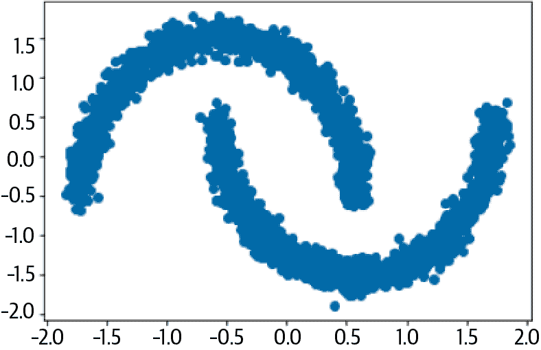

###### 图 6-4。二维中的两个 moons 数据集

创建此数据集的代码在示例 6-1 中给出。

##### 示例 6-1。创建一个*moons*数据集

```py
data = datasets.make_moons(3000, noise=0.05)[0].astype("float32") # ①
norm = layers.Normalization()
norm.adapt(data)
normalized_data = norm(data) # ②
```

①

创建一个包含 3,000 个点的嘈杂、非标准化的 moons 数据集。

②

将数据集归一化为均值为 0，标准差为 1。

我们将构建一个 RealNVP 模型，可以生成遵循与两个 moons 数据集类似分布的 2D 点。虽然这是一个非常简单的例子，但它将帮助我们详细了解正规化流模型在实践中的工作方式。

然而，首先，我们需要介绍一种新类型的层，称为耦合层。

## 耦合层

*耦合层*为其输入的每个元素产生一个比例和平移因子。换句话说，它产生两个与输入完全相同大小的张量，一个用于比例因子，一个用于平移因子，如图 6-5 所示。

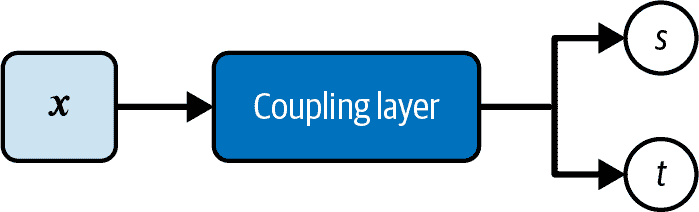

###### 图 6-5。耦合层输出两个与输入相同形状的张量：一个缩放因子（s）和一个平移因子（t）

为了为我们的简单示例构建自定义的`Coupling`层，我们可以堆叠`Dense`层以创建比例输出，并堆叠不同的`Dense`层以创建平移输出，如示例 6-2 所示。

###### 提示

对于图像，`Coupling`层块使用`Conv2D`层而不是`Dense`层。

##### 示例 6-2。Keras 中的`Coupling`层

```py
def Coupling():
    input_layer = layers.Input(shape=2) # ①

    s_layer_1 = layers.Dense(
        256, activation="relu", kernel_regularizer=regularizers.l2(0.01)
    )(input_layer) # ②
    s_layer_2 = layers.Dense(
        256, activation="relu", kernel_regularizer=regularizers.l2(0.01)
    )(s_layer_1)
    s_layer_3 = layers.Dense(
        256, activation="relu", kernel_regularizer=regularizers.l2(0.01)
    )(s_layer_2)
    s_layer_4 = layers.Dense(
        256, activation="relu", kernel_regularizer=regularizers.l2(0.01)
    )(s_layer_3)
    s_layer_5 = layers.Dense(
        2, activation="tanh", kernel_regularizer=regularizers.l2(0.01)
    )(s_layer_4) # ③

    t_layer_1 = layers.Dense(
        256, activation="relu", kernel_regularizer=regularizers.l2(0.01)
    )(input_layer) # ④
    t_layer_2 = layers.Dense(
        256, activation="relu", kernel_regularizer=regularizers.l2(0.01)
    )(t_layer_1)
    t_layer_3 = layers.Dense(
        256, activation="relu", kernel_regularizer=regularizers.l2(0.01)
    )(t_layer_2)
    t_layer_4 = layers.Dense(
        256, activation="relu", kernel_regularizer=regularizers.l2(0.01)
    )(t_layer_3)
    t_layer_5 = layers.Dense(
        2, activation="linear", kernel_regularizer=regularizers.l2(0.01)
    )(t_layer_4) # ⑤

    return models.Model(inputs=input_layer, outputs=[s_layer_5, t_layer_5]) # ⑥
```

①

我们示例中`Coupling`层块的输入有两个维度。

②

*缩放*流是一个大小为 256 的`Dense`层堆叠。

③

最终的缩放层大小为 2，并具有`tanh`激活。

④

*平移*流是一个大小为 256 的`Dense`层堆叠。

⑤

最终的翻译层大小为 2，并具有`linear`激活。

⑥

`Coupling`层被构建为一个 Keras `Model`，具有两个输出（缩放和平移因子）。

请注意，临时增加通道数以允许学习更复杂的表示，然后将其折叠回与输入相同数量的通道。在原始论文中，作者还在每一层上使用正则化器来惩罚大的权重。

### 通过耦合层传递数据

耦合层的架构并不特别有趣——它的独特之处在于输入数据在通过层时如何被掩盖和转换，如图 6-6 所示。

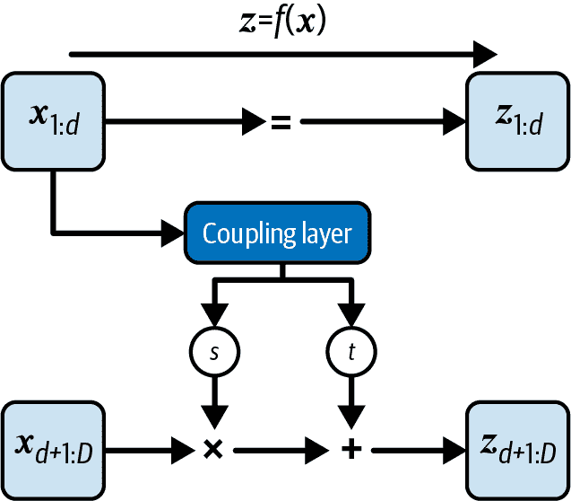

###### 图 6-6。通过耦合层转换输入<math alttext="x"><mi>x</mi></math>的过程

注意数据的前<math alttext="d"><mi>d</mi></math>维度被直接传递到第一个耦合层，剩下的<math alttext="upper D minus d"><mrow><mi>D</mi> <mo>-</mo> <mi>d</mi></mrow></math>维度完全被遮蔽（即设为零）。在我们的简单示例中，选择<math alttext="d equals 1"><mrow><mi>d</mi> <mo>=</mo> <mn>1</mn></mrow></math>意味着耦合层看到的不是两个值<math alttext="left-parenthesis x 1 comma x 2 right-parenthesis"><mrow><mo>(</mo> <msub><mi>x</mi> <mn>1</mn></msub> <mo>,</mo> <msub><mi>x</mi> <mn>2</mn></msub> <mo>)</mo></mrow></math>，而是看到<math alttext="left-parenthesis x 1 comma 0 right-parenthesis"><mrow><mo>(</mo> <msub><mi>x</mi> <mn>1</mn></msub> <mo>,</mo> <mn>0</mn> <mo>)</mo></mrow></math>。

层的输出是比例和平移因子。这些再次被遮蔽，但这次是与之前的*反向*遮罩，只有后半部分被放行——即在我们的示例中，我们得到<math alttext="left-parenthesis 0 comma s 2 right-parenthesis"><mrow><mo>(</mo> <mn>0</mn> <mo>,</mo> <msub><mi>s</mi> <mn>2</mn></msub> <mo>)</mo></mrow></math>和<math alttext="left-parenthesis 0 comma t 2 right-parenthesis"><mrow><mo>(</mo> <mn>0</mn> <mo>,</mo> <msub><mi>t</mi> <mn>2</mn></msub> <mo>)</mo></mrow></math>。然后这些被逐元素应用到输入的后半部分<math alttext="x 2"><msub><mi>x</mi> <mn>2</mn></msub></math>，而输入的前半部分<math alttext="x 1"><msub><mi>x</mi> <mn>1</mn></msub></math>则直接传递，完全不被更新。总之，对于维度为<math alttext="upper D"><mi>D</mi></math>的向量，其中<math alttext="d less-than upper D"><mrow><mi>d</mi> <mo><</mo> <mi>D</mi></mrow></math>，更新方程如下：

<math alttext="StartLayout 1st Row 1st Column z Subscript 1 colon d 2nd Column equals 3rd Column x Subscript 1 colon d 2nd Row 1st Column z Subscript d plus 1 colon upper D 2nd Column equals 3rd Column x Subscript d plus 1 colon upper D Baseline circled-dot normal e normal x normal p left-parenthesis s left-parenthesis x Subscript 1 colon d Baseline right-parenthesis right-parenthesis plus t left-parenthesis x Subscript 1 colon d Baseline right-parenthesis EndLayout" display="block"><mtable displaystyle="true"><mtr><mtd columnalign="right"><msub><mi>z</mi> <mrow><mn>1</mn><mo>:</mo><mi>d</mi></mrow></msub></mtd> <mtd><mo>=</mo></mtd> <mtd columnalign="left"><msub><mi>x</mi> <mrow><mn>1</mn><mo>:</mo><mi>d</mi></mrow></msub></mtd></mtr> <mtr><mtd columnalign="right"><msub><mi>z</mi> <mrow><mi>d</mi><mo>+</mo><mn>1</mn><mo>:</mo><mi>D</mi></mrow></msub></mtd> <mtd><mo>=</mo></mtd> <mtd columnalign="left"><mrow><msub><mi>x</mi> <mrow><mi>d</mi><mo>+</mo><mn>1</mn><mo>:</mo><mi>D</mi></mrow></msub> <mo>⊙</mo> <mi>exp</mi> <mfenced separators="" open="(" close=")"><mi>s</mi> <mo>(</mo> <msub><mi>x</mi> <mrow><mn>1</mn><mo>:</mo><mi>d</mi></mrow></msub> <mo>)</mo></mfenced> <mo>+</mo> <mi>t</mi> <mrow><mo>(</mo> <msub><mi>x</mi> <mrow><mn>1</mn><mo>:</mo><mi>d</mi></mrow></msub> <mo>)</mo></mrow></mrow></mtd></mtr></mtable></math>

您可能想知道为什么我们要费力构建一个遮蔽了这么多信息的层。答案很明显，如果我们调查这个函数的雅可比矩阵的结构：

<math alttext="StartFraction normal partial-differential z Over normal partial-differential x EndFraction equals Start 2 By 2 Matrix 1st Row 1st Column bold upper I 2nd Column 0 2nd Row 1st Column StartFraction normal partial-differential z Subscript d plus 1 colon upper D Baseline Over normal partial-differential x Subscript 1 colon d Baseline EndFraction 2nd Column normal d normal i normal a normal g left-parenthesis normal e normal x normal p left-bracket s left-parenthesis x Subscript 1 colon d Baseline right-parenthesis right-bracket right-parenthesis EndMatrix" display="block"><mrow><mfrac><mrow><mi>∂</mi><mi>z</mi></mrow> <mrow><mi>∂</mi><mi>x</mi></mrow></mfrac> <mo>=</mo> <mfenced open="[" close="]"><mtable><mtr><mtd><mi>𝐈</mi></mtd> <mtd><mn>0</mn></mtd></mtr> <mtr><mtd><mfrac><mrow><mi>∂</mi><msub><mi>z</mi> <mrow><mi>d</mi><mo>+</mo><mn>1</mn><mo>:</mo><mi>D</mi></mrow></msub></mrow> <mrow><mi>∂</mi><msub><mi>x</mi> <mrow><mn>1</mn><mo>:</mo><mi>d</mi></mrow></msub></mrow></mfrac></mtd> <mtd><mrow><mi>diag</mi> <mo>(</mo> <mi>exp</mi> <mrow><mo>[</mo> <mi>s</mi> <mrow><mo>(</mo> <msub><mi>x</mi> <mrow><mn>1</mn><mo>:</mo><mi>d</mi></mrow></msub> <mo>)</mo></mrow> <mo>]</mo></mrow> <mo>)</mo></mrow></mtd></mtr></mtable></mfenced></mrow></math>

左上角的<math alttext="d times d"><mrow><mi>d</mi> <mo>×</mo> <mi>d</mi></mrow></math>子矩阵只是单位矩阵，因为<math alttext="z Subscript 1 colon d Baseline equals x Subscript 1 colon d"><mrow><msub><mi>z</mi> <mrow><mn>1</mn><mo>:</mo><mi>d</mi></mrow></msub> <mo>=</mo> <msub><mi>x</mi> <mrow><mn>1</mn><mo>:</mo><mi>d</mi></mrow></msub></mrow></math>。这些元素直接传递而不被更新。因此，右上角的子矩阵为 0，因为<math alttext="z Subscript 1 colon d"><msub><mi>z</mi> <mrow><mn>1</mn><mo>:</mo><mi>d</mi></mrow></msub></math>不依赖于<math alttext="x Subscript d plus 1 colon upper D"><msub><mi>x</mi> <mrow><mi>d</mi><mo>+</mo><mn>1</mn><mo>:</mo><mi>D</mi></mrow></msub></math>。

左下角的子矩阵是复杂的，我们不寻求简化这个。右下角的子矩阵只是一个对角矩阵，填充有<math alttext="normal e normal x normal p left-parenthesis s left-parenthesis x Subscript 1 colon d Baseline right-parenthesis right-parenthesis"><mrow><mi>exp</mi> <mo>(</mo> <mi>s</mi> <mrow><mo>(</mo> <msub><mi>x</mi> <mrow><mn>1</mn><mo>:</mo><mi>d</mi></mrow></msub> <mo>)</mo></mrow> <mo>)</mo></mrow></math> ，因为<math alttext="z Subscript d plus 1 colon upper D"><msub><mi>z</mi> <mrow><mi>d</mi><mo>+</mo><mn>1</mn><mo>:</mo><mi>D</mi></mrow></msub></math>是线性相关于<math alttext="x Subscript d plus 1 colon upper D"><msub><mi>x</mi> <mrow><mi>d</mi><mo>+</mo><mn>1</mn><mo>:</mo><mi>D</mi></mrow></msub></math>，梯度仅依赖于缩放因子（而不依赖于平移因子）。图 6-7 显示了这个矩阵形式的图表，只有非零元素被填充为彩色。

注意对角线上方没有非零元素—因此，这种矩阵形式被称为*下三角形*。现在我们看到了以这种方式构造矩阵的好处—下三角矩阵的行列式就等于对角线元素的乘积。换句话说，行列式不依赖于左下子矩阵中的任何复杂导数！

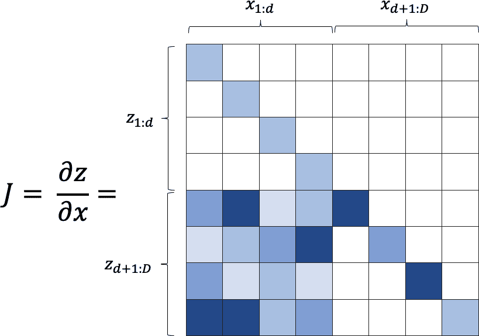

###### 图 6-7。变换的雅可比矩阵——一个下三角矩阵，行列式等于对角线上元素的乘积

因此，我们可以将这个矩阵的行列式写成如下形式：

<math alttext="normal d normal e normal t left-parenthesis normal upper J right-parenthesis equals normal e normal x normal p left-bracket sigma-summation Underscript j Endscripts s left-parenthesis x Subscript 1 colon d Baseline right-parenthesis Subscript j Baseline right-bracket" display="block"><mrow><mi>det</mi> <mrow><mo>(</mo> <mi mathvariant="normal">J</mi> <mo>)</mo></mrow> <mo>=</mo> <mi>exp</mi> <mfenced separators="" open="[" close="]"><munder><mo>∑</mo> <mi>j</mi></munder> <mi>s</mi> <msub><mrow><mo>(</mo><msub><mi>x</mi> <mrow><mn>1</mn><mo>:</mo><mi>d</mi></mrow></msub> <mo>)</mo></mrow> <mi>j</mi></msub></mfenced></mrow></math>

这是很容易计算的，这是构建归一化流模型的两个最初目标之一。

另一个目标是函数必须易于反转。我们可以看到这是正确的，因为我们可以通过重新排列正向方程来写出可逆函数，如下所示：

<math alttext="StartLayout 1st Row 1st Column x Subscript 1 colon d 2nd Column equals 3rd Column z Subscript 1 colon d 2nd Row 1st Column x Subscript d plus 1 colon upper D 2nd Column equals 3rd Column left-parenthesis z Subscript d plus 1 colon upper D Baseline minus t left-parenthesis x Subscript 1 colon d Baseline right-parenthesis right-parenthesis circled-dot normal e normal x normal p left-parenthesis minus s left-parenthesis x Subscript 1 colon d Baseline right-parenthesis right-parenthesis EndLayout" display="block"><mtable displaystyle="true"><mtr><mtd columnalign="right"><msub><mi>x</mi> <mrow><mn>1</mn><mo>:</mo><mi>d</mi></mrow></msub></mtd> <mtd><mo>=</mo></mtd> <mtd columnalign="left"><msub><mi>z</mi> <mrow><mn>1</mn><mo>:</mo><mi>d</mi></mrow></msub></mtd></mtr> <mtr><mtd columnalign="right"><msub><mi>x</mi> <mrow><mi>d</mi><mo>+</mo><mn>1</mn><mo>:</mo><mi>D</mi></mrow></msub></mtd> <mtd><mo>=</mo></mtd> <mtd columnalign="left"><mrow><mrow><mo>(</mo> <msub><mi>z</mi> <mrow><mi>d</mi><mo>+</mo><mn>1</mn><mo>:</mo><mi>D</mi></mrow></msub> <mo>-</mo> <mi>t</mi> <mrow><mo>(</mo> <msub><mi>x</mi> <mrow><mn>1</mn><mo>:</mo><mi>d</mi></mrow></msub> <mo>)</mo></mrow> <mo>)</mo></mrow> <mo>⊙</mo> <mi>exp</mi> <mfenced separators="" open="(" close=")"><mo>-</mo> <mi>s</mi> <mo>(</mo> <msub><mi>x</mi> <mrow><mn>1</mn><mo>:</mo><mi>d</mi></mrow></msub> <mo>)</mo></mfenced></mrow></mtd></mtr></mtable></math>

等效图表显示在图 6-8 中。

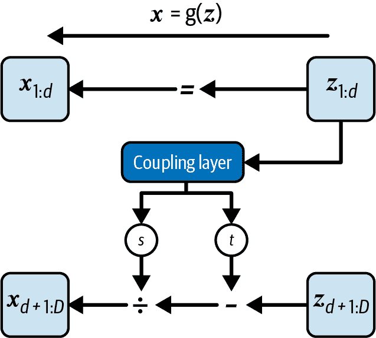

###### 图 6-8。逆函数 x = g(z)

现在我们几乎拥有构建 RealNVP 模型所需的一切。然而，仍然存在一个问题—我们应该如何更新输入的前<d>个元素？目前，它们被模型完全保持不变！

### 堆叠耦合层

为了解决这个问题，我们可以使用一个非常简单的技巧。如果我们将耦合层堆叠在一起，但交替掩码模式，那么被一个层保持不变的层将在下一个层中更新。这种架构的额外好处是能够学习数据的更复杂表示，因为它是一个更深的神经网络。

这些耦合层的雅可比矩阵仍然很容易计算，因为线性代数告诉我们，矩阵乘积的行列式是对角线上元素的乘积。同样，两个函数的复合的逆函数就是逆函数的复合，如下方程所示：

<math alttext="StartLayout 1st Row 1st Column normal d normal e normal t left-parenthesis normal upper A dot normal upper B right-parenthesis 2nd Column equals 3rd Column normal d normal e normal t left-parenthesis normal upper A right-parenthesis normal d normal e normal t left-parenthesis normal upper B right-parenthesis 2nd Row 1st Column left-parenthesis f Subscript b Baseline ring f Subscript a Baseline right-parenthesis Superscript negative 1 2nd Column equals 3rd Column f Subscript a Superscript negative 1 Baseline ring f Subscript b Superscript negative 1 EndLayout" display="block"><mtable displaystyle="true"><mtr><mtd columnalign="right"><mrow><mi>det</mi> <mo>(</mo> <mi mathvariant="normal">A</mi> <mo>·</mo> <mi mathvariant="normal">B</mi> <mo>)</mo></mrow></mtd> <mtd><mo>=</mo></mtd> <mtd columnalign="left"><mrow><mi>det</mi> <mo>(</mo> <mi mathvariant="normal">A</mi> <mo>)</mo> <mi>det</mi> <mo>(</mo> <mi mathvariant="normal">B</mi> <mo>)</mo></mrow></mtd></mtr> <mtr><mtd columnalign="right"><msup><mrow><mo>(</mo><msub><mi>f</mi> <mi>b</mi></msub> <mo>∘</mo><msub><mi>f</mi> <mi>a</mi></msub> <mo>)</mo></mrow> <mrow><mo>-</mo><mn>1</mn></mrow></msup></mtd> <mtd><mo>=</mo></mtd> <mtd columnalign="left"><mrow><msubsup><mi>f</mi> <mi>a</mi> <mrow><mo>-</mo><mn>1</mn></mrow></msubsup> <mo>∘</mo> <msubsup><mi>f</mi> <mi>b</mi> <mrow><mo>-</mo><mn>1</mn></mrow></msubsup></mrow></mtd></mtr></mtable></math>

因此，如果我们堆叠耦合层，每次翻转掩码，我们可以构建一个神经网络，能够转换整个输入张量，同时保留具有简单雅可比行列式和可逆性的基本属性。图 6-9 显示了整体结构。

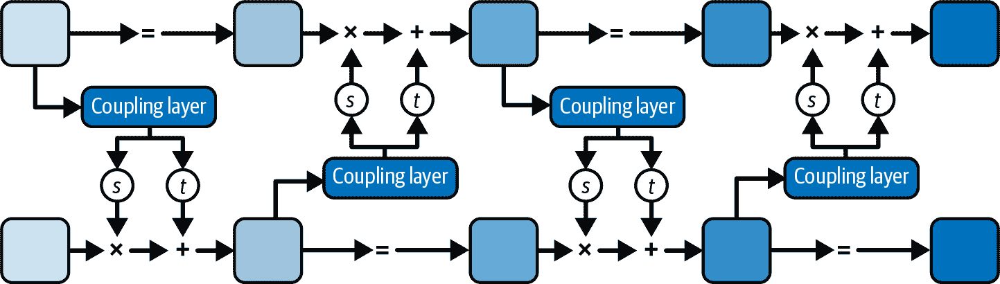

###### 图 6-9。堆叠耦合层，每层交替掩码

## 训练 RealNVP 模型

现在我们已经构建了 RealNVP 模型，我们可以训练它来学习两个月亮数据集的复杂分布。记住，我们希望最小化模型下数据的负对数似然 <math alttext="minus log p Subscript upper X Baseline left-parenthesis x right-parenthesis"><mrow><mo>-</mo> <mo form="prefix">log</mo> <mrow><msub><mi>p</mi> <mi>X</mi></msub> <mrow><mo>(</mo> <mi>x</mi> <mo>)</mo></mrow></mrow></mrow></math> 。使用方程 6-1，我们可以写成如下形式：

<math alttext="minus log p Subscript upper X Baseline left-parenthesis x right-parenthesis equals minus log p Subscript upper Z Baseline left-parenthesis z right-parenthesis minus log StartAbsoluteValue normal d normal e normal t left-parenthesis StartFraction normal partial-differential z Over normal partial-differential x EndFraction right-parenthesis EndAbsoluteValue" display="block"><mrow><mo>-</mo> <mo form="prefix">log</mo> <mrow><msub><mi>p</mi> <mi>X</mi></msub> <mrow><mo>(</mo> <mi>x</mi> <mo>)</mo></mrow></mrow> <mo>=</mo> <mo>-</mo> <mo form="prefix">log</mo> <mrow><msub><mi>p</mi> <mi>Z</mi></msub> <mrow><mo>(</mo> <mi>z</mi> <mo>)</mo></mrow></mrow> <mo>-</mo> <mo form="prefix">log</mo> <mfenced separators="" open="|" close="|"><mi>det</mi> <mfenced separators="" open="(" close=")"><mfrac><mrow><mi>∂</mi><mi>z</mi></mrow> <mrow><mi>∂</mi><mi>x</mi></mrow></mfrac></mfenced></mfenced></mrow></math>

我们选择正向过程<f>的目标输出分布 <math alttext="p Subscript upper Z Baseline left-parenthesis z right-parenthesis"><mrow><msub><mi>p</mi> <mi>Z</mi></msub> <mrow><mo>(</mo> <mi>z</mi> <mo>)</mo></mrow></mrow></math> 为标准高斯分布，因为我们可以轻松从这个分布中采样。然后，我们可以通过应用逆过程<g>将从高斯分布中采样的点转换回原始图像域，如图 6-10 所示。

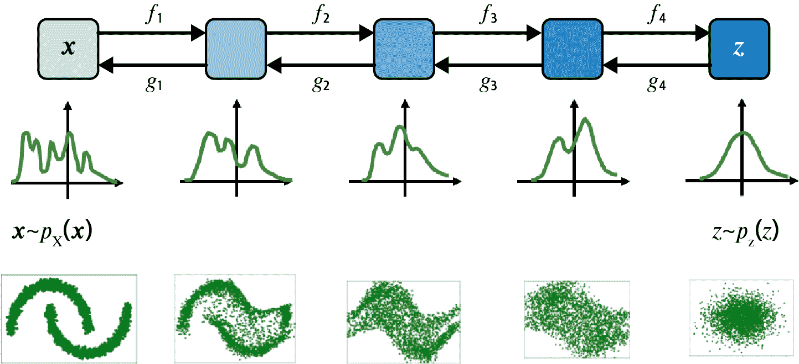

###### 图 6-10。在 1D（中间行）和 2D（底部行）中，将复杂分布<math alttext="p Subscript upper X Baseline left-parenthesis x right-parenthesis"><mrow><msub><mi>p</mi> <mi>X</mi></msub> <mrow><mo>(</mo> <mi>x</mi> <mo>)</mo></mrow></mrow></math>和简单高斯<math alttext="p Subscript upper Z Baseline left-parenthesis z right-parenthesis"><mrow><msub><mi>p</mi> <mi>Z</mi></msub> <mrow><mo>(</mo> <mi>z</mi> <mo>)</mo></mrow></mrow></math>之间的转换

示例 6-3 展示了如何构建一个 RealNVP 网络，作为自定义的 Keras `Model`。

##### 示例 6-3。在 Keras 中构建 RealNVP 模型

```py
class RealNVP(models.Model):
    def __init__(self, input_dim, coupling_layers, coupling_dim, regularization):
        super(RealNVP, self).__init__()
        self.coupling_layers = coupling_layers
        self.distribution = tfp.distributions.MultivariateNormalDiag(
            loc=[0.0, 0.0], scale_diag=[1.0, 1.0]
        ) # ①
        self.masks = np.array(
            [[0, 1], [1, 0]] * (coupling_layers // 2), dtype="float32"
        ) # ②
        self.loss_tracker = metrics.Mean(name="loss")
        self.layers_list = [
            Coupling(input_dim, coupling_dim, regularization)
            for i in range(coupling_layers)
        ] # ③

    @property
    def metrics(self):
        return [self.loss_tracker]

    def call(self, x, training=True):
        log_det_inv = 0
        direction = 1
        if training:
            direction = -1
        for i in range(self.coupling_layers)[::direction]: # ④
            x_masked = x * self.masks[i]
            reversed_mask = 1 - self.masks[i]
            s, t = self.layers_listi
            s *= reversed_mask
            t *= reversed_mask
            gate = (direction - 1) / 2
            x = (
                reversed_mask
                * (x * tf.exp(direction * s) + direction * t * tf.exp(gate * s))
                + x_masked
            ) # ⑤
            log_det_inv += gate * tf.reduce_sum(s, axis = 1) # ⑥
        return x, log_det_inv

    def log_loss(self, x):
        y, logdet = self(x)
        log_likelihood = self.distribution.log_prob(y) + logdet # ⑦
        return -tf.reduce_mean(log_likelihood)

    def train_step(self, data):
        with tf.GradientTape() as tape:
            loss = self.log_loss(data)
        g = tape.gradient(loss, self.trainable_variables)
        self.optimizer.apply_gradients(zip(g, self.trainable_variables))
        self.loss_tracker.update_state(loss)
        return {"loss": self.loss_tracker.result()}

    def test_step(self, data):
        loss = self.log_loss(data)
        self.loss_tracker.update_state(loss)
        return {"loss": self.loss_tracker.result()}

model = RealNVP(
    input_dim = 2
    , coupling_layers= 6
    , coupling_dim = 256
    , regularization = 0.01
)

model.compile(optimizer=optimizers.Adam(learning_rate=0.0001))

model.fit(
    normalized_data
    , batch_size=256
    , epochs=300
)
```

①

目标分布是标准的 2D 高斯分布。

②

在这里，我们创建交替的掩码模式。

③

定义 RealNVP 网络的`Coupling`层列表。

④

在网络的主`call`函数中，我们遍历`Coupling`层。如果`training=True`，那么我们通过层向前移动（即从数据到潜在空间）。如果`training=False`，那么我们通过层向后移动（即从潜在空间到数据）。

⑤

这行描述了正向和反向方程，取决于`direction`（尝试将`direction = -1`和`direction = 1`代入以证明这一点！）。

⑥

雅可比行列式的对数，我们需要计算损失函数，简单地是缩放因子的总和。

⑦

损失函数是转换数据的对数概率的负和，根据我们的目标高斯分布和雅可比行列式的对数确定。

## RealNVP 模型的分析

模型训练完成后，我们可以使用它将训练集转换为潜在空间（使用正向方向<math alttext="f"><mi>f</mi></math>），更重要的是，将潜在空间中的采样点转换为看起来可能是从原始数据分布中采样的点（使用反向方向<math alttext="g"><mi>g</mi></math>）。

图 6-11 显示了在任何学习之前网络的输出 - 正向和反向方向只是直接传递信息，几乎没有任何转换。

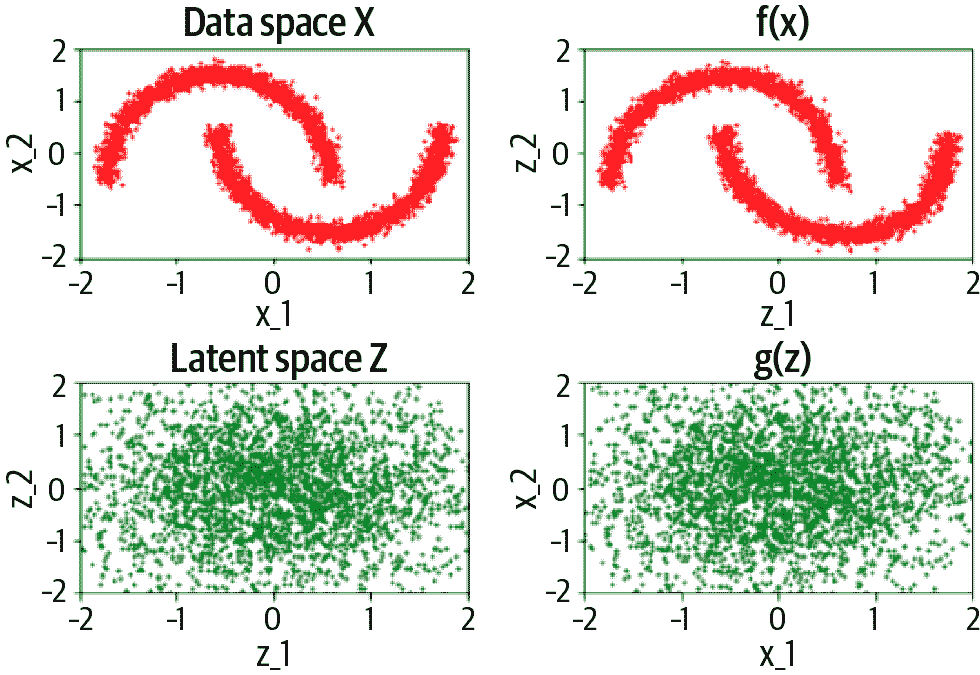

###### 图 6-11。RealNVP 模型在训练前的输入（左）和输出（右），用于正向过程（顶部）和反向过程（底部）

训练后（图 6-12），正向过程能够将训练集中的点转换为类似高斯分布的分布。同样，反向过程可以将从高斯分布中采样的点映射回类似原始数据的分布。

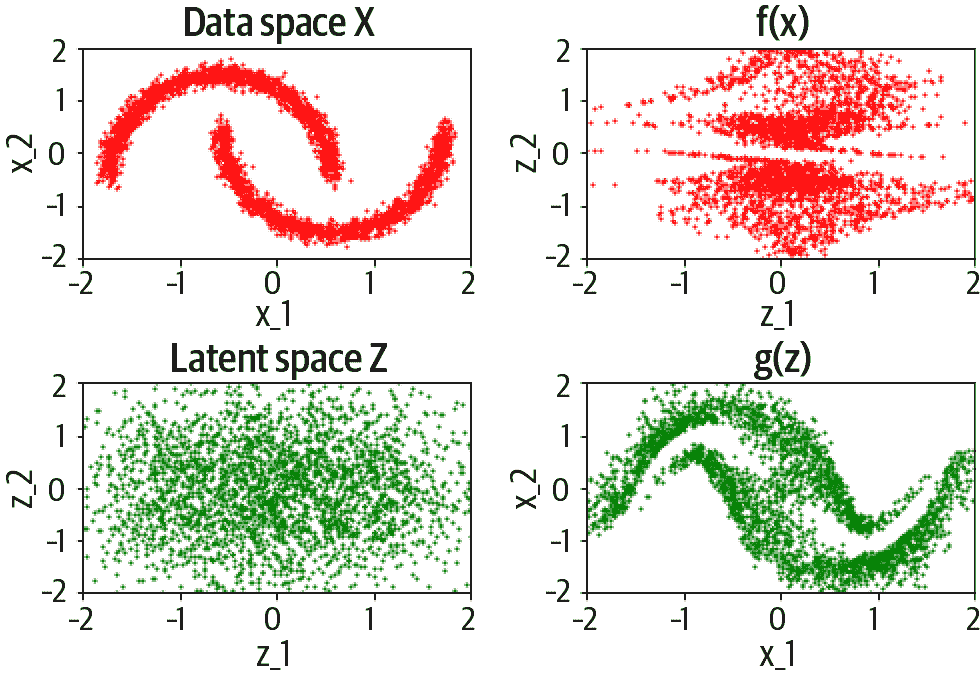

###### 图 6-12。RealNVP 模型在训练后的输入（左）和输出（右），用于正向过程（顶部）和反向过程（底部）

训练过程的损失曲线显示在图 6-13 中。

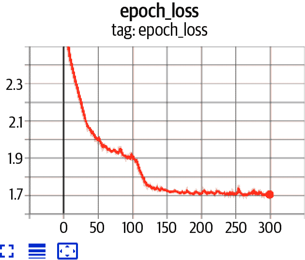

###### 图 6-13。RealNVP 训练过程的损失曲线

这完成了我们对 RealNVP 的讨论，这是正则化流生成模型的一个特定案例。在下一节中，我们将介绍一些现代正则化流模型，这些模型扩展了 RealNVP 论文中介绍的思想。

# 其他正则化流模型

另外两个成功且重要的正则化流模型是*GLOW*和*FFJORD*。以下部分描述了它们所取得的关键进展。

## GLOW

在 NeurIPS 2018 上展示的 GLOW 是第一个证明归一化流能够生成高质量样本并产生可遍历以操作样本的有意义潜在空间的模型之一。关键步骤是用可逆的 1×1 卷积层替换反向掩码设置。例如，在应用于图像的 RealNVP 中，通道的顺序在每一步之后都会翻转，以确保网络有机会转换所有的输入。而在 GLOW 中，应用了 1×1 卷积，这有效地作为一种通用方法来产生模型所需的任何通道排列。作者表明，即使加入了这一步骤，整体分布仍然是可处理的，具有易于大规模计算的行列式和逆。

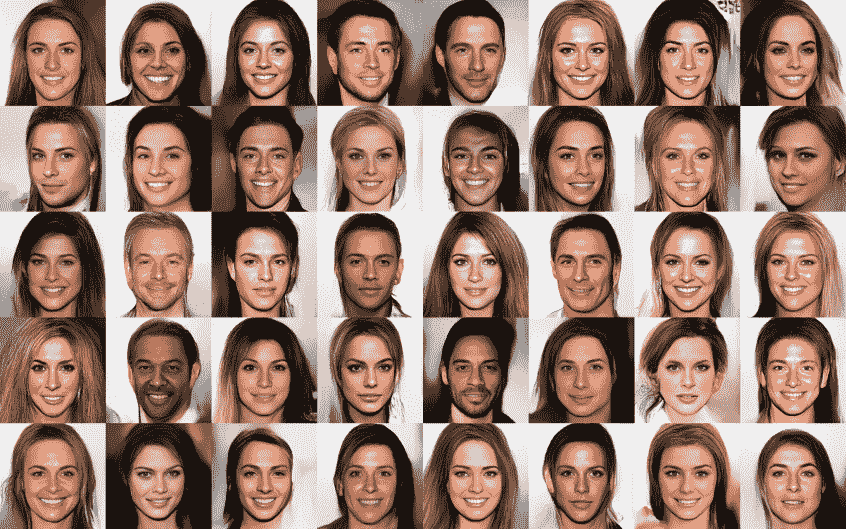

###### 图 6-14。GLOW 模型的随机样本（来源：[Kingma 和 Dhariwal，2018](https://arxiv.org/abs/1807.03039)）²

## FFJORD

RealNVP 和 GLOW 是离散时间归一化流模型，即它们通过一组离散的耦合层来转换输入。FFJORD（用于可扩展可逆生成模型的自由形式连续动力学），在 ICLR 2019 上展示了如何将转换建模为连续时间过程（即，通过将流中步数趋近于无穷大且步长趋近于零的极限来实现）。在这种情况下，动力学是使用由神经网络产生的普通微分方程（ODE）来建模的。使用黑盒求解器来解决在时间 t1 处的 ODE，即找到在时间 t0 处从高斯分布中采样的一些初始点 z0 的 z1，如下面的方程所描述的那样：

<math alttext="StartLayout 1st Row 1st Column z 0 2nd Column tilde 3rd Column p left-parenthesis z 0 right-parenthesis 2nd Row 1st Column StartFraction normal partial-differential z left-parenthesis t right-parenthesis Over normal partial-differential t EndFraction 2nd Column equals 3rd Column f Subscript theta Baseline left-parenthesis x left-parenthesis t right-parenthesis comma t right-parenthesis 3rd Row 1st Column x 2nd Column equals 3rd Column z 1 EndLayout" display="block"><mtable displaystyle="true"><mtr><mtd columnalign="right"><msub><mi>z</mi> <mn>0</mn></msub></mtd> <mtd><mo>∼</mo></mtd> <mtd columnalign="left"><mrow><mi>p</mi> <mo>(</mo> <msub><mi>z</mi> <mn>0</mn></msub> <mo>)</mo></mrow></mtd></mtr> <mtr><mtd columnalign="right"><mfrac><mrow><mi>∂</mi><mi>z</mi><mo>(</mo><mi>t</mi><mo>)</mo></mrow> <mrow><mi>∂</mi><mi>t</mi></mrow></mfrac></mtd> <mtd><mo>=</mo></mtd> <mtd columnalign="left"><mrow><msub><mi>f</mi> <mi>θ</mi></msub> <mrow><mo>(</mo> <mi>x</mi> <mrow><mo>(</mo> <mi>t</mi> <mo>)</mo></mrow> <mo>,</mo> <mi>t</mi> <mo>)</mo></mrow></mrow></mtd></mtr> <mtr><mtd columnalign="right"><mi>x</mi></mtd> <mtd><mo>=</mo></mtd> <mtd columnalign="left"><msub><mi>z</mi> <mn>1</mn></msub></mtd></mtr></mtable></math>

转换过程的图示在图 6-15 中展示。

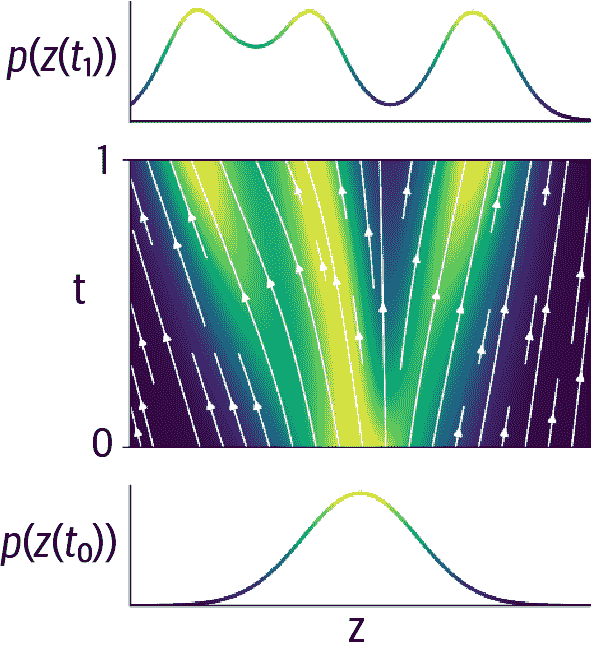

###### 图 6-15。FFJORD 通过由神经网络参数化的普通微分方程模拟数据分布与标准高斯之间的转换（来源：[Will Grathwohl 等人，2018](https://arxiv.org/abs/1810.01367)）³

# 总结

在本章中，我们探讨了诸如 RealNVP、GLOW 和 FFJORD 等归一化流模型。

归一化流模型是由神经网络定义的可逆函数，允许我们通过变量的改变直接建模数据密度。在一般情况下，变量改变方程要求我们计算一个高度复杂的雅可比行列式，这对于除了最简单的例子之外都是不切实际的。

为了规避这个问题，RealNVP 模型限制了神经网络的形式，使其符合两个基本标准：可逆且雅可比行列式易于计算。

它通过堆叠耦合层来实现，这些层在每一步产生尺度和平移因子。重要的是，耦合层在数据流经网络时会掩盖数据，以确保雅可比是下三角形的，因此具有易于计算的行列式。通过在每一层翻转掩码，实现了对输入数据的完全可见性。

按设计，尺度和平移操作可以轻松地被反转，因此一旦模型训练完成，就可以通过网络反向运行数据。这意味着我们可以将正向转换过程定向到标准高斯分布，从中轻松采样。然后，我们可以通过网络反向运行采样点以生成新的观测数据。

RealNVP 论文还展示了如何将这种技术应用于图像，通过在耦合层内部使用卷积，而不是密集连接层。GLOW 论文将这一思想扩展到消除任何硬编码排列掩模的必要性。FFJORD 模型引入了连续时间归一化流的概念，通过将转换过程建模为由神经网络定义的 ODE。

总的来说，我们已经看到了归一化流是一个强大的生成建模家族，可以生成高质量的样本，同时保持能够可靠地描述数据密度函数的能力。

¹ Laurent Dinh 等人，“使用 Real NVP 进行密度估计”，2016 年 5 月 27 日，[*https://arxiv.org/abs/1605.08803v3*](https://arxiv.org/abs/1605.08803v3)。

² Diedrick P. Kingma 和 Prafulla Dhariwal，“Glow: 具有可逆 1x1 卷积的生成流”，2018 年 7 月 10 日，[*https://arxiv.org/abs/1807.03039*](https://arxiv.org/abs/1807.03039)。

³ Will Grathwohl 等人，“FFJORD: 用于可扩展可逆生成模型的自由形式连续动力学”，2018 年 10 月 22 日，[*https://arxiv.org/abs/1810.01367*](https://arxiv.org/abs/1810.01367)。
