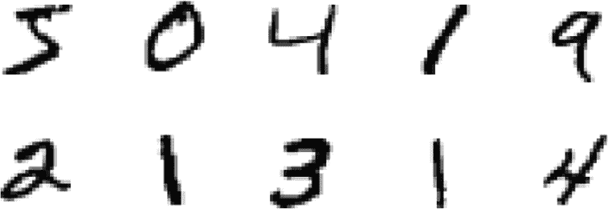
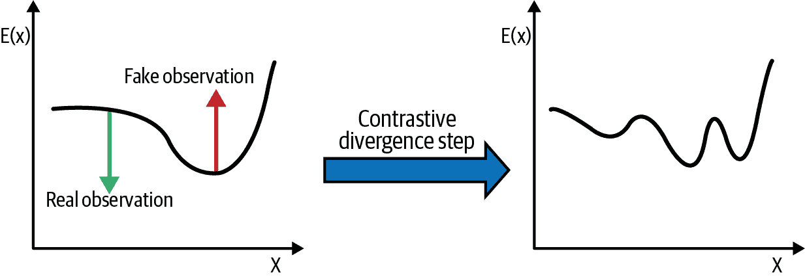
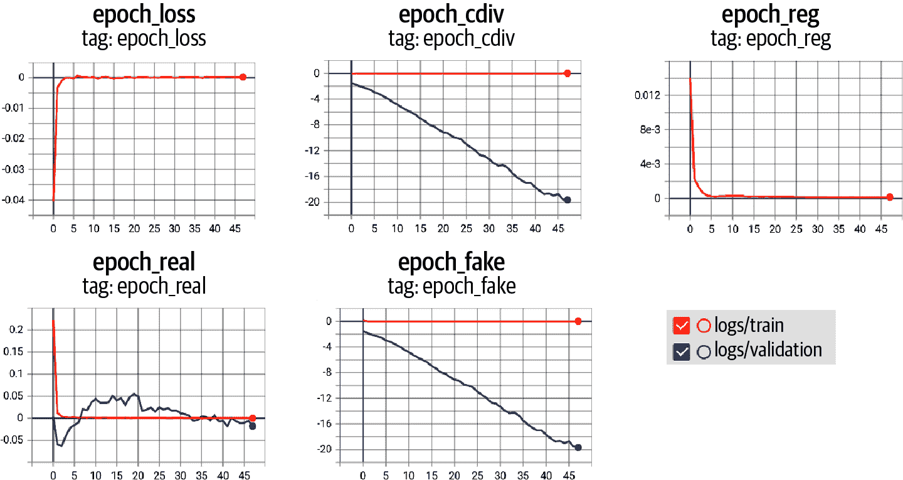
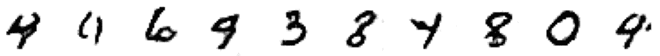
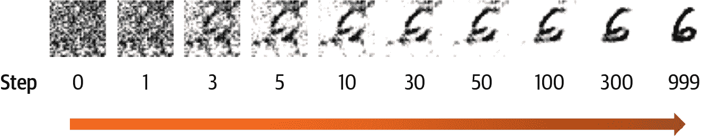

# 第七章：基于能量的模型

基于能量的模型是一类广泛的生成模型，借鉴了建模物理系统的一个关键思想——即，事件的概率可以用玻尔兹曼分布来表示，这是一个特定函数，将实值能量函数归一化在 0 到 1 之间。这个分布最初是由路德维希·玻尔兹曼在 1868 年提出的，他用它来描述处于热平衡状态的气体。

在本章中，我们将看到如何使用这个想法来训练一个生成模型，用于生成手写数字的图像。我们将探索几个新概念，包括用于训练 EBM 的对比散度和用于采样的朗之万动力学。

# 介绍

我们将从一个简短的故事开始，以说明基于能量的模型背后的关键概念。

Diane Mixx 和 Long-au-Vin 跑步俱乐部的故事捕捉了基于能量建模的关键思想。现在让我们更详细地探讨理论，然后我们将使用 Keras 实现一个实际示例。

# 基于能量的模型

基于能量的模型试图使用*玻尔兹曼分布*（方程式 7-1）来建模真实的数据生成分布，其中 <math alttext="upper E left-parenthesis x right-parenthesis"><mrow><mi>E</mi> <mo>(</mo> <mi>x</mi> <mo>)</mo></mrow></math> 被称为观察结果 <math alttext="x"><mi>x</mi></math> 的*能量函数*（或*分数*）。

##### 方程式 7-1。玻尔兹曼分布

<math alttext="p left-parenthesis bold x right-parenthesis equals StartFraction e Superscript minus upper E left-parenthesis bold x right-parenthesis Baseline Over integral Underscript ModifyingAbove bold x With bold caret element-of bold upper X Endscripts e Superscript minus upper E left-parenthesis ModifyingAbove bold x With bold caret right-parenthesis Baseline EndFraction" display="block"><mrow><mi>p</mi> <mrow><mo>(</mo> <mi>𝐱</mi> <mo>)</mo></mrow> <mo>=</mo> <mfrac><msup><mi>e</mi> <mrow><mo>-</mo><mi>E</mi><mo>(</mo><mi>𝐱</mi><mo>)</mo></mrow></msup> <mrow><msub><mo>∫</mo> <mrow><mover accent="true"><mi>𝐱</mi> <mo>^</mo></mover><mo>∈</mo><mi>𝐗</mi></mrow></msub> <msup><mi>e</mi> <mrow><mo>-</mo><mi>E</mi><mo>(</mo><mover accent="true"><mi>𝐱</mi> <mo>^</mo></mover><mo>)</mo></mrow></msup></mrow></mfrac></mrow></math>

在实践中，这意味着训练一个神经网络 <math alttext="upper E left-parenthesis x right-parenthesis"><mrow><mi>E</mi> <mo>(</mo> <mi>x</mi> <mo>)</mo></mrow></math>，对可能的观察输出低分数（使得 <math alttext="p bold x"><mrow><mi>p</mi> <mi>𝐱</mi></mrow></math> 接近于 1），对不太可能的观察输出高分数（使得 <math alttext="p bold x"><mrow><mi>p</mi> <mi>𝐱</mi></mrow></math> 接近于 0）。

用这种方式建模数据存在两个挑战。首先，我们不清楚如何使用我们的模型来采样新的观察结果——我们可以用它来生成给定观察结果的分数，但如何生成一个得分低的观察结果（即，一个可信的观察结果）？

其次，方程式 7-1 的标准化分母包含一个对于除了最简单的问题外都难以计算的积分。如果我们无法计算这个积分，那么我们就无法使用最大似然估计来训练模型，因为这要求 <math alttext="p bold x"><mrow><mi>p</mi> <mi>𝐱</mi></mrow></math> 是一个有效的概率分布。

基于能量的模型的关键思想是，我们可以使用近似技术来确保我们永远不需要计算难以计算的分母。这与标准化流形形成对比，标准化流形需要我们付出很大的努力，以确保我们对标准高斯分布应用的变换不会改变输出仍然是有效的概率分布的事实。

我们通过使用一种称为对比散度（用于训练）和一种称为朗之万动力学（用于采样）的技术来避开棘手的难以计算的分母问题，这些技术遵循了杜和莫达奇在 2019 年的论文“基于能量的模型的隐式生成和建模”的思想。我们将在本章后面详细探讨这些技术，同时构建我们自己的 EBM。

首先，让我们准备一个数据集并设计一个简单的神经网络，来表示我们的实值能量函数 <math alttext="upper E left-parenthesis x right-parenthesis"><mrow><mi>E</mi> <mo>(</mo> <mi>x</mi> <mo>)</mo></mrow></math>。

# 运行此示例的代码

此示例的代码可以在书籍存储库中的*notebooks/07_ebm/01_ebm/ebm.ipynb*中找到。

这段代码是根据 Philip Lippe 的优秀教程“深度基于能量的生成模型”进行调整的。

## MNIST 数据集

我们将使用标准的[MNIST 数据集](https://oreil.ly/mSvhc)，其中包含手写数字的灰度图像。数据集中的一些示例图像显示在图 7-2 中。



###### 图 7-2。MNIST 数据集中的图像示例

数据集已经预先打包到 TensorFlow 中，因此可以按照示例 7-1 中所示下载。

##### 示例 7-1。加载 MNIST 数据集

```py
from tensorflow.keras import datasets
(x_train, _), (x_test, _) = datasets.mnist.load_data()
```

像往常一样，我们将像素值缩放到范围[-1, 1]，并添加一些填充使图像大小为 32×32 像素。我们还将其转换为 TensorFlow 数据集，如示例 7-2 中所示。

##### 示例 7-2。预处理 MNIST 数据集

```py
def preprocess(imgs):
    imgs = (imgs.astype("float32") - 127.5) / 127.5
    imgs = np.pad(imgs , ((0,0), (2,2), (2,2)), constant_values= -1.0)
    imgs = np.expand_dims(imgs, -1)
    return imgs

x_train = preprocess(x_train)
x_test = preprocess(x_test)
x_train = tf.data.Dataset.from_tensor_slices(x_train).batch(128)
x_test = tf.data.Dataset.from_tensor_slices(x_test).batch(128)
```

现在我们有了数据集，我们可以构建代表我们能量函数<math alttext="上标 E 左括号 x 右括号"><mrow><mi>E</mi> <mo>(</mo> <mi>x</mi> <mo>)</mo></mrow></math>的神经网络。

## 能量函数

能量函数<math alttext="上标 E 下标θ左括号 x 右括号"><mrow><msub><mi>E</mi> <mi>θ</mi></msub> <mrow><mo>(</mo> <mi>x</mi> <mo>)</mo></mrow></mrow></math>是一个具有参数<math alttext="θ"><mi>θ</mi></math>的神经网络，可以将输入图像<math alttext="x"><mi>x</mi></math>转换为标量值。在整个网络中，我们使用了一个称为*swish*的激活函数，如下面的侧边栏所述。

网络是一组堆叠的`Conv2D`层，逐渐减小图像的尺寸同时增加通道数。最后一层是一个具有线性激活的单个完全连接单元，因此网络可以输出范围内的值（<math alttext="负无穷"><mrow><mo>-</mo> <mi>∞</mi></mrow></math>，<math alttext="正无穷"><mi>∞</mi></math>）。构建它的代码在示例 7-3 中给出。

##### 示例 7-3。构建能量函数<math alttext="上标 E 左括号 x 右括号"><mrow><mi>E</mi> <mo>(</mo> <mi>x</mi> <mo>)</mo></mrow></math>神经网络

```py
ebm_input = layers.Input(shape=(32, 32, 1))
x = layers.Conv2D(
    16, kernel_size=5, strides=2, padding="same", activation = activations.swish
)(ebm_input) # ①
x = layers.Conv2D(
    32, kernel_size=3, strides=2, padding="same", activation = activations.swish
)(x)
x = layers.Conv2D(
    64, kernel_size=3, strides=2, padding="same", activation = activations.swish
)(x)
x = layers.Conv2D(
    64, kernel_size=3, strides=2, padding="same", activation = activations.swish
)(x)
x = layers.Flatten()(x)
x = layers.Dense(64, activation = activations.swish)(x)
ebm_output = layers.Dense(1)(x) # ②
model = models.Model(ebm_input, ebm_output) # ③
```

①

能量函数是一组堆叠的`Conv2D`层，带有 swish 激活。

②

最后一层是一个单个完全连接单元，具有线性激活函数。

③

一个将输入图像转换为标量能量值的 Keras `Model`。

## 使用 Langevin 动力学进行采样

能量函数只为给定输入输出一个分数——我们如何使用这个函数生成能量分数低的新样本？

我们将使用一种称为*Langevin 动力学*的技术，利用了我们可以计算能量函数相对于其输入的梯度的事实。如果我们从样本空间中的一个随机点开始，并朝着计算出的梯度的相反方向迈出小步，我们将逐渐减小能量函数。如果我们的神经网络训练正确，那么随机噪声应该在我们眼前转变成类似于训练集中的观察结果的图像！

# 随机梯度 Langevin 动力学

重要的是，当我们穿越样本空间时，我们还必须向输入添加少量随机噪声；否则，有可能陷入局部最小值。因此，该技术被称为随机梯度 Langevin 动力学。³

我们可以将这种梯度下降可视化为 图 7-4 中所示，对于一个具有能量函数值的三维空间。路径是一个嘈杂的下降，沿着能量函数 <math alttext="upper E left-parenthesis x right-parenthesis"><mrow><mi>E</mi> <mo>(</mo> <mi>x</mi> <mo>)</mo></mrow></math> 的负梯度相对于输入 <math alttext="x"><mi>x</mi></math> 下降。在 MNIST 图像数据集中，我们有 1,024 个像素，因此在一个 1,024 维空间中导航，但是相同的原则适用！


###### 图 7-4\. 使用朗之万动力学的梯度下降

值得注意的是，这种梯度下降与我们通常用来训练神经网络的梯度下降之间的区别。

在训练神经网络时，我们使用反向传播计算*损失函数*相对于网络的*参数*（即权重）的梯度。然后我们将参数在负梯度方向上微调，这样经过多次迭代，我们逐渐最小化损失。

使用朗之万动力学，我们保持神经网络权重*固定*，计算*输出*相对于*输入*的梯度。然后我们将输入在负梯度方向上微调，这样经过多次迭代，我们逐渐最小化输出（能量分数）。

这两个过程都利用了相同的思想（梯度下降），但是应用于不同的函数，并且针对不同的实体。

形式上，朗之万动力学可以用以下方程描述：

<math alttext="x Superscript k Baseline equals x Superscript k minus 1 Baseline minus eta normal nabla Subscript x Baseline upper E Subscript theta Baseline left-parenthesis x Superscript k minus 1 Baseline right-parenthesis plus omega" display="block"><mrow><msup><mi>x</mi> <mi>k</mi></msup> <mo>=</mo> <msup><mi>x</mi> <mrow><mi>k</mi><mo>-</mo><mn>1</mn></mrow></msup> <mo>-</mo> <mi>η</mi> <msub><mi>∇</mi> <mi>x</mi></msub> <msub><mi>E</mi> <mi>θ</mi></msub> <mrow><mo>(</mo> <msup><mi>x</mi> <mrow><mi>k</mi><mo>-</mo><mn>1</mn></mrow></msup> <mo>)</mo></mrow> <mo>+</mo> <mi>ω</mi></mrow></math>

其中 <math alttext="omega tilde script upper N left-parenthesis 0 comma sigma right-parenthesis"><mrow><mi>ω</mi> <mo>∼</mo> <mi>𝒩</mi> <mo>(</mo> <mn>0</mn> <mo>,</mo> <mi>σ</mi> <mo>)</mo></mrow></math> 和 <math alttext="x Superscript 0 Baseline tilde script upper U"><mrow><msup><mi>x</mi> <mn>0</mn></msup> <mo>∼</mo> <mi>𝒰</mi></mrow></math>（-1,1）。<math alttext="eta"><mi>η</mi></math> 是必须调整的步长超参数——太大会导致步骤跳过最小值，太小则算法收敛速度太慢。

###### 提示

<math alttext="x Superscript 0 Baseline tilde script upper U"><mrow><msup><mi>x</mi> <mn>0</mn></msup> <mo>∼</mo> <mi>𝒰</mi></mrow></math>（-1,1）是范围[-1,1]上的均匀分布。

我们可以编写我们的朗之万采样函数，如 示例 7-4 所示。

##### 示例 7-4\. 朗之万采样函数

```py
def generate_samples(model, inp_imgs, steps, step_size, noise):
    imgs_per_step = []
    for _ in range(steps): # ①
        inp_imgs += tf.random.normal(inp_imgs.shape, mean = 0, stddev = noise) # ②
        inp_imgs = tf.clip_by_value(inp_imgs, -1.0, 1.0)
        with tf.GradientTape() as tape:
            tape.watch(inp_imgs)
            out_score = -model(inp_imgs) # ③
        grads = tape.gradient(out_score, inp_imgs) # ④
        grads = tf.clip_by_value(grads, -0.03, 0.03)
        inp_imgs += -step_size * grads # ⑤
        inp_imgs = tf.clip_by_value(inp_imgs, -1.0, 1.0)
        return inp_imgs
```

①

循环执行给定数量的步骤。

②

向图像中添加少量噪音。

③

通过模型传递图像以获得能量分数。

④

计算输出相对于输入的梯度。

⑤

向输入图像中添加少量梯度。

## 使用对比散度进行训练

现在我们知道如何从样本空间中采样一个新的低能量点，让我们将注意力转向训练模型。

我们无法应用最大似然估计，因为能量函数不输出概率；它输出的是一个在样本空间中不积分为 1 的分数。相反，我们将应用 Geoffrey Hinton 在 2002 年首次提出的一种技术，称为*对比散度*，用于训练非归一化评分模型。⁴

我们希望最小化的值（一如既往）是数据的负对数似然：

<math alttext="script upper L equals minus double-struck upper E Subscript x tilde normal d normal a normal t normal a Baseline left-bracket log p Subscript theta Baseline left-parenthesis bold x right-parenthesis right-bracket" display="block"><mrow><mi>ℒ</mi> <mo>=</mo> <mo>-</mo> <msub><mi>𝔼</mi> <mrow><mi>x</mi><mo>∼</mo> <mi>data</mi></mrow></msub> <mfenced separators="" open="[" close="]"><mo form="prefix">log</mo> <msub><mi>p</mi> <mi>θ</mi></msub> <mrow><mo>(</mo> <mi>𝐱</mi> <mo>)</mo></mrow></mfenced></mrow></math>

当 <math alttext="p Subscript theta Baseline left-parenthesis bold x right-parenthesis"><mrow><msub><mi>p</mi> <mi>θ</mi></msub> <mrow><mo>(</mo> <mi>𝐱</mi> <mo>)</mo></mrow></mrow></math> 具有玻尔兹曼分布的形式，能量函数为 <math alttext="upper E Subscript theta Baseline left-parenthesis bold x right-parenthesis"><mrow><msub><mi>E</mi> <mi>θ</mi></msub> <mrow><mo>(</mo> <mi>𝐱</mi> <mo>)</mo></mrow></mrow></math> ，可以证明该值的梯度可以写成以下形式（Oliver Woodford 的“对比散度笔记”进行完整推导）：⁵

<math alttext="StartLayout 1st Row 1st Column normal nabla Subscript theta Baseline script upper L 2nd Column equals 3rd Column double-struck upper E Subscript x tilde normal d normal a normal t normal a Baseline left-bracket normal nabla Subscript theta Baseline upper E Subscript theta Baseline left-parenthesis bold x right-parenthesis right-bracket minus double-struck upper E Subscript x tilde normal m normal o normal d normal e normal l Baseline left-bracket normal nabla Subscript theta Baseline upper E Subscript theta Baseline left-parenthesis bold x right-parenthesis right-bracket EndLayout" display="block"><mtable displaystyle="true"><mtr><mtd columnalign="right"><mrow><msub><mi>∇</mi> <mi>θ</mi></msub> <mi>ℒ</mi></mrow></mtd> <mtd><mo>=</mo></mtd> <mtd columnalign="left"><mrow><msub><mi>𝔼</mi> <mrow><mi>x</mi><mo>∼</mo> <mi>data</mi></mrow></msub> <mfenced separators="" open="[" close="]"><msub><mi>∇</mi> <mi>θ</mi></msub> <msub><mi>E</mi> <mi>θ</mi></msub> <mrow><mo>(</mo> <mi>𝐱</mi> <mo>)</mo></mrow></mfenced> <mo>-</mo> <msub><mi>𝔼</mi> <mrow><mi>x</mi><mo>∼</mo> <mi>model</mi></mrow></msub> <mfenced separators="" open="[" close="]"><msub><mi>∇</mi> <mi>θ</mi></msub> <msub><mi>E</mi> <mi>θ</mi></msub> <mrow><mo>(</mo> <mi>𝐱</mi> <mo>)</mo></mrow></mfenced></mrow></mtd></mtr></mtable></math>

这在直觉上是有很多意义的-我们希望训练模型输出真实观察的大负能量分数，并为生成的假观察输出大正能量分数，以便这两个极端之间的对比尽可能大。

换句话说，我们可以计算真实和假样本的能量分数之间的差异，并将其用作我们的损失函数。

要计算假样本的能量分数，我们需要能够从分布 <math alttext="p Subscript theta Baseline left-parenthesis bold x right-parenthesis"><mrow><msub><mi>p</mi> <mi>θ</mi></msub> <mrow><mo>(</mo> <mi>𝐱</mi> <mo>)</mo></mrow></mrow></math> 中精确抽样，但由于不可解的分母，这是不可能的。相反，我们可以使用 Langevin 采样过程生成一组能量分数较低的观察。这个过程需要运行无限多步才能产生完美样本（显然是不切实际的），因此我们运行一些小步数，假设这足以产生有意义的损失函数。

我们还维护一个来自先前迭代的样本缓冲区，这样我们可以将其用作下一批的起点，而不是纯随机噪声。生成采样缓冲区的代码如示例 7-5 所示。

##### 示例 7-5。`缓冲区`

```py
class Buffer:
    def __init__(self, model):
        super().__init__()
        self.model = model
        self.examples = [
            tf.random.uniform(shape = (1, 32, 32, 1)) * 2 - 1
            for _ in range(128)
        ] # ①

    def sample_new_exmps(self, steps, step_size, noise):
        n_new = np.random.binomial(128, 0.05) # ②
        rand_imgs = (
            tf.random.uniform((n_new, 32, 32, 1)) * 2 - 1
        )
        old_imgs = tf.concat(
            random.choices(self.examples, k=128-n_new), axis=0
        ) # ③
        inp_imgs = tf.concat([rand_imgs, old_imgs], axis=0)
        inp_imgs = generate_samples(
            self.model, inp_imgs, steps=steps, step_size=step_size, noise = noise
        ) # ④
        self.examples = tf.split(inp_imgs, 128, axis = 0) + self.examples # ⑤
        self.examples = self.examples[:8192]
        return inp_imgs
```

①

采样缓冲区用一批随机噪声初始化。

②

平均而言，每次有 5%的观察是从头开始生成的（即，随机噪声）。

③

其余的随机从现有缓冲区中提取。

④

这些观察被连接并通过 Langevin 采样器运行。

⑤

生成的样本被添加到缓冲区中，缓冲区被修剪为最多 8,192 个观察。

图 7-5 显示了对比散度的一个训练步骤。真实观察的分数被算法推低，而假观察的分数被拉高，每一步之后都不考虑对这些分数进行归一化。



###### 图 7-5。对比散度的一步

我们可以编写对比散度算法的训练步骤，如示例 7-6 所示，在自定义 Keras 模型中。 

##### 示例 7-6。使用对比散度训练的 EBM

```py
class EBM(models.Model):
    def __init__(self):
        super(EBM, self).__init__()
        self.model = model
        self.buffer = Buffer(self.model)
        self.alpha = 0.1
        self.loss_metric = metrics.Mean(name="loss")
        self.reg_loss_metric = metrics.Mean(name="reg")
        self.cdiv_loss_metric = metrics.Mean(name="cdiv")
        self.real_out_metric = metrics.Mean(name="real")
        self.fake_out_metric = metrics.Mean(name="fake")

    @property
    def metrics(self):
        return [
            self.loss_metric,
            self.reg_loss_metric,
            self.cdiv_loss_metric,
            self.real_out_metric,
            self.fake_out_metric
        ]

    def train_step(self, real_imgs):
        real_imgs += tf.random.normal(
            shape=tf.shape(real_imgs), mean = 0, stddev = 0.005
        ) # ①
        real_imgs = tf.clip_by_value(real_imgs, -1.0, 1.0)
        fake_imgs = self.buffer.sample_new_exmps(
            steps=60, step_size=10, noise = 0.005
        ) # ②
        inp_imgs = tf.concat([real_imgs, fake_imgs], axis=0)
        with tf.GradientTape() as training_tape:
            real_out, fake_out = tf.split(self.model(inp_imgs), 2, axis=0) # ③
            cdiv_loss = tf.reduce_mean(fake_out, axis = 0) - tf.reduce_mean(
                real_out, axis = 0
            ) # ④
            reg_loss = self.alpha * tf.reduce_mean(
                real_out ** 2 + fake_out ** 2, axis = 0
            ) # ⑤
            loss = reg_loss + cdiv_loss
        grads = training_tape.gradient(loss, self.model.trainable_variables) # ⑥
        self.optimizer.apply_gradients(
            zip(grads, self.model.trainable_variables)
        )
        self.loss_metric.update_state(loss)
        self.reg_loss_metric.update_state(reg_loss)
        self.cdiv_loss_metric.update_state(cdiv_loss)
        self.real_out_metric.update_state(tf.reduce_mean(real_out, axis = 0))
        self.fake_out_metric.update_state(tf.reduce_mean(fake_out, axis = 0))
        return {m.name: m.result() for m in self.metrics}

    def test_step(self, real_imgs): # ⑦
        batch_size = real_imgs.shape[0]
        fake_imgs = tf.random.uniform((batch_size, 32, 32, 1)) * 2 - 1
        inp_imgs = tf.concat([real_imgs, fake_imgs], axis=0)
        real_out, fake_out = tf.split(self.model(inp_imgs), 2, axis=0)
        cdiv = tf.reduce_mean(fake_out, axis = 0) - tf.reduce_mean(
            real_out, axis = 0
        )
        self.cdiv_loss_metric.update_state(cdiv)
        self.real_out_metric.update_state(tf.reduce_mean(real_out, axis = 0))
        self.fake_out_metric.update_state(tf.reduce_mean(fake_out, axis = 0))
        return {m.name: m.result() for m in self.metrics[2:]}

ebm = EBM()
ebm.compile(optimizer=optimizers.Adam(learning_rate=0.0001), run_eagerly=True)
ebm.fit(x_train, epochs=60, validation_data = x_test,)
```

①

为真实图像添加少量随机噪声，以避免模型过度拟合训练集。

②

一组假图像从缓冲区中抽样。

③

真实和假图像通过模型运行以产生真实和假分数。

④

对比散度损失简单地是真实和假观察的分数之间的差异。

⑤

添加正则化损失以避免分数变得过大。

⑥

通过反向传播计算网络权重相对于损失函数的梯度。

⑦

`test_step` 用于在验证过程中计算一组随机噪声和训练集中的数据之间的对比散度。它可以作为衡量模型训练效果的指标（见下一节）。

## 能量基模型的分析

训练过程中的损失曲线和支持指标显示在 Figure 7-6 中。



###### 图 7-6\. EBM 训练过程的损失曲线和指标

首先，注意到在训练步骤中计算的损失在各个周期中大致保持不变且较小。虽然模型不断改进，但与训练集中的真实图像进行比较的缓冲区中生成的图像质量也在提高，因此我们不应该期望训练损失显著下降。

因此，为了评估模型性能，我们还建立了一个验证过程，该过程不从缓冲区中采样，而是对一组随机噪声进行评分，并将其与训练集中的示例进行比较。如果模型正在改进，我们应该看到对比散度随着周期的增加而下降（即，它在区分随机噪声和真实图像方面变得更好），如 Figure 7-6 中所示。

从 EBM 生成新样本只需运行 Langevin 采样器进行大量步骤，从一个静止状态（随机噪声）开始，如 Example 7-7 中所示。观测被迫 *下坡*，沿着相对于输入的评分函数的梯度，以便在噪声中出现一个合理的观测。

##### 示例 7-7\. 使用 EBM 生成新观测

```py
start_imgs = np.random.uniform(size = (10, 32, 32, 1)) * 2 - 1
gen_img = generate_samples(
    ebm.model,
    start_imgs,
    steps=1000,
    step_size=10,
    noise = 0.005,
    return_img_per_step=True,
)
```

在经过 50 个周期的训练后，采样器生成的一些观测示例显示在 Figure 7-7 中。



###### 图 7-7\. 使用 EBM 模型的 Langevin 采样器生成的示例以指导梯度下降

我们甚至可以展示单个观测是如何通过在 Langevin 采样过程中拍摄当前观测的快照生成的——这在 Figure 7-8 中展示。



###### 图 7-8\. Langevin 采样过程中不同步骤的观测快照

## 其他能量基模型

在前面的例子中，我们使用了使用对比散度和 Langevin 动力学采样器训练的深度 EBM。然而，早期的 EBM 模型并没有使用 Langevin 采样，而是依赖于其他技术和架构。

最早的能量基模型之一是 *Boltzmann 机*。⁶ 这是一个全连接的无向神经网络，其中二进制单元要么是 *可见*（*v*），要么是 *隐藏*（*h*）。网络的给定配置的能量定义如下：

<math alttext="upper E Subscript theta Baseline left-parenthesis v comma h right-parenthesis equals minus one-half left-parenthesis v Superscript upper T Baseline upper L v plus h Superscript upper T Baseline upper J h plus v Superscript upper T Baseline upper W h right-parenthesis" display="block"><mrow><msub><mi>E</mi> <mi>θ</mi></msub> <mrow><mo>(</mo> <mi>v</mi> <mo>,</mo> <mi>h</mi> <mo>)</mo></mrow> <mo>=</mo> <mo>-</mo> <mfrac><mn>1</mn> <mn>2</mn></mfrac> <mfenced separators="" open="(" close=")"><msup><mi>v</mi> <mi>T</mi></msup> <mi>L</mi> <mi>v</mi> <mo>+</mo> <msup><mi>h</mi> <mi>T</mi></msup> <mi>J</mi> <mi>h</mi> <mo>+</mo> <msup><mi>v</mi> <mi>T</mi></msup> <mi>W</mi> <mi>h</mi></mfenced></mrow></math>

其中 <math alttext="upper W comma upper L comma upper J"><mrow><mi>W</mi> <mo>,</mo> <mi>L</mi> <mo>,</mo> <mi>J</mi></mrow></math> 是模型学习的权重矩阵。训练通过对比散度实现，但使用 Gibbs 采样在可见层和隐藏层之间交替，直到找到平衡。实际上，这是非常缓慢的，不适用于大量隐藏单元。

###### 提示

请查看 Jessica Stringham 的博客文章 [“Python 中的 Gibbs 采样”](https://oreil.ly/tXmOq) 以获取 Gibbs 采样的优秀简单示例。

这个模型的扩展，*受限玻尔兹曼机*（RBM），移除了相同类型单元之间的连接，因此创建了一个两层的二部图。这使得 RBM 可以堆叠成*深度信念网络*，以建模更复杂的分布。然而，使用 RBM 对高维数据进行建模仍然是不切实际的，因为仍然需要长混合时间的吉布斯采样。

直到 2000 年代末，EBM 才被证明具有对更高维数据集进行建模的潜力，并建立了一个构建深度 EBM 的框架。⁷ Langevin 动力学成为 EBM 的首选采样方法，后来演变成一种称为*得分匹配*的训练技术。这进一步发展成一种称为*去噪扩散概率模型*的模型类，为 DALL.E 2 和 ImageGen 等最先进的生成模型提供动力。我们将在第八章中更详细地探讨扩散模型。

# 摘要

基于能量的模型是一类生成模型，利用能量评分函数——一个经过训练的神经网络，用于为真实观察输出低分数，为生成观察输出高分数。计算由该得分函数给出的概率分布需要通过一个难以处理的分母进行归一化。EBM 通过利用两个技巧来避免这个问题：对比散度用于训练网络，Langevin 动力学用于采样新观察。

能量函数通过最小化生成样本得分与训练数据得分之间的差异来进行训练，这种技术称为对比散度。可以证明这等价于最小化负对数似然，这是最大似然估计所要求的，但不需要我们计算难以处理的归一化分母。在实践中，我们近似为假样本的采样过程，以确保算法保持高效。

深度 EBM 的采样是通过 Langevin 动力学实现的，这是一种利用得分相对于输入图像的梯度逐渐将随机噪声转化为合理观察的技术，通过更新输入进行小步骤，沿着梯度下降。这改进了早期的方法，如受限玻尔兹曼机使用的吉布斯采样。

¹ 杜一伦和伊戈尔·莫达奇，“基于能量的模型的隐式生成和建模”，2019 年 3 月 20 日，[*https://arxiv.org/abs/1903.08689*](https://arxiv.org/abs/1903.08689)。

² Prajit Ramachandran 等人，“搜索激活函数”，2017 年 10 月 16 日，[*https://arxiv.org/abs/1710.05941v2*](https://arxiv.org/abs/1710.05941v2)。

³ Max Welling 和 Yee Whye Teh，“通过随机梯度 Langevin 动力学进行贝叶斯学习”，2011 年，[*https://www.stats.ox.ac.uk/~teh/research/compstats/WelTeh2011a.pdf*](https://www.stats.ox.ac.uk/~teh/research/compstats/WelTeh2011a.pdf)

⁴ Geoffrey E. Hinton，“通过最小化对比散度训练专家乘积”，2002 年，[*https://www.cs.toronto.edu/~hinton/absps/tr00-004.pdf*](https://www.cs.toronto.edu/~hinton/absps/tr00-004.pdf)。

⁵ Oliver Woodford，“对比散度笔记”，2006 年，[*https://www.robots.ox.ac.uk/~ojw/files/NotesOnCD.pdf*](https://www.robots.ox.ac.uk/~ojw/files/NotesOnCD.pdf)。

⁶ David H. Ackley 等人，“玻尔兹曼机的学习算法”，1985 年，*认知科学* 9(1), 147-165。

⁷ Yann Lecun 等人，“基于能量的学习教程”，2006 年，*[*https://www.researchgate.net/publication/200744586_A_tutorial_on_energy-based_learning*](https://www.researchgate.net/publication/200744586_A_tutorial_on_energy-based_learning)*.
