# 第八章：扩散模型

与 GANs 并驾齐驱，扩散模型是过去十年中引入的最具影响力和影响力的生成建模技术之一。在许多基准测试中，扩散模型现在胜过以前的最先进 GANs，并迅速成为生成建模从业者的首选选择，特别是对于视觉领域（例如，OpenAI 的 DALL.E 2 和 Google 的 ImageGen 用于文本到图像生成）。最近，扩散模型在广泛任务中的应用呈现爆炸性增长，类似于 2017 年至 2020 年间 GAN 的普及。

许多支撑扩散模型的核心思想与本书中已经探索过的早期类型的生成模型（例如，去噪自动编码器，基于能量的模型）有相似之处。事实上，名称*扩散*灵感来自热力学扩散的深入研究：在 2015 年，这一纯物理领域与深度学习之间建立了重要联系。¹

在基于分数的生成模型领域也取得了重要进展，²^,³这是能量基模型的一个分支，直接估计对数分布的梯度（也称为分数函数），以训练模型，作为使用对比散度的替代方法。特别是，杨松和斯特凡诺·厄尔蒙使用多个尺度的噪声扰动应用于原始数据，以确保模型-一个*噪声条件分数网络*（NCSN）在低数据密度区域表现良好。

突破性的扩散模型论文于 2020 年夏天发表。⁴在前人的基础上，该论文揭示了扩散模型和基于分数的生成模型之间的深刻联系，作者利用这一事实训练了一个可以在几个数据集上与 GANs 匹敌的扩散模型，称为*去噪扩散概率模型*（DDPM）。

本章将介绍理解去噪扩散模型工作原理的理论要求。然后，您将学习如何使用 Keras 构建自己的去噪扩散模型。

# 介绍

为了帮助解释支撑扩散模型的关键思想，让我们从一个简短的故事开始！

DiffuseTV 故事描述了扩散模型背后的一般思想。现在让我们深入探讨如何使用 Keras 构建这样一个模型的技术细节。

# 去噪扩散模型（DDM）

去噪扩散模型背后的核心思想很简单-我们训练一个深度学习模型，在一系列非常小的步骤中去噪图像。如果我们从纯随机噪音开始，在理论上我们应该能够不断应用该模型，直到获得一个看起来好像是从训练集中绘制出来的图像。令人惊奇的是，这个简单的概念在实践中效果如此出色！

让我们首先准备一个数据集，然后逐步介绍前向（加噪）和后向（去噪）扩散过程。

# 运行此示例的代码

此示例的代码可以在书籍存储库中位于*notebooks/08_diffusion/01_ddm/ddm.ipynb*的 Jupyter 笔记本中找到。

该代码改编自 András Béres 在 Keras 网站上创建的优秀[去噪扩散隐式模型教程](https://oreil.ly/srPCe)。

## 花卉数据集

我们将使用通过 Kaggle 提供的[牛津 102 花卉数据集](https://oreil.ly/HfrKV)。这是一组包含各种花卉的 8000 多张彩色图像。

您可以通过在书籍存储库中运行 Kaggle 数据集下载脚本来下载数据集，如示例 8-1 所示。这将把花卉图像保存到*/data*文件夹中。

##### 示例 8-1。下载牛津 102 花卉数据集

```py
bash scripts/download_kaggle_data.sh nunenuh pytorch-challange-flower-dataset
```

“通常情况下，我们将使用 Keras 的`image_dataset_from_directory`函数加载图像，将图像调整为 64×64 像素，并将像素值缩放到范围[0, 1]。我们还将数据集重复五次，以增加时代长度，并将数据分成 64 张图像一组，如示例 8-2 所示。

##### 示例 8-2。加载牛津 102 花卉数据集

```py
train_data = utils.image_dataset_from_directory(
    "/app/data/pytorch-challange-flower-dataset/dataset",
    labels=None,
    image_size=(64, 64),
    batch_size=None,
    shuffle=True,
    seed=42,
    interpolation="bilinear",
) # ①

def preprocess(img):
    img = tf.cast(img, "float32") / 255.0
    return img

train = train_data.map(lambda x: preprocess(x)) # ②
train = train.repeat(5) # ③
train = train.batch(64, drop_remainder=True) # ④
```

①

使用 Keras 的`image_dataset_from_directory`函数加载数据集（在训练期间需要时）。

②

将像素值缩放到范围[0, 1]。

③

将数据集重复五次。

④

将数据集分成 64 张图像一组。

数据集中的示例图像显示在图 8-2 中。

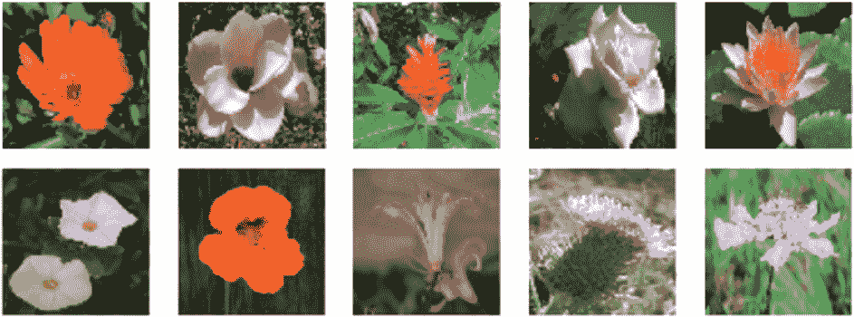

###### 图 8-2。牛津 102 花卉数据集中的示例图像

现在我们有了数据集，我们可以探讨如何向图像添加噪声，使用前向扩散过程。` `##前向扩散过程

假设我们有一幅图像<math alttext="bold x 0"><msub><mi>𝐱</mi> <mn>0</mn></msub></math>，我们希望在大量步骤（比如，<math alttext="upper T equals 1 comma 000"><mrow><mi>T</mi> <mo>=</mo> <mn>1</mn> <mo>,</mo> <mn>000</mn></mrow></math>）中逐渐损坏，以至于最终与标准高斯噪声不可区分（即，<math alttext="bold x Subscript upper T"><msub><mi>𝐱</mi> <mi>T</mi></msub></math>应具有零均值和单位方差）。我们应该如何做到这一点呢？

我们可以定义一个函数<math alttext="q"><mi>q</mi></math>，它向图像<math alttext="bold x Subscript t minus 1"><msub><mi>𝐱</mi> <mrow><mi>t</mi><mo>-</mo><mn>1</mn></mrow></msub></math>添加方差为<math alttext="beta Subscript t"><msub><mi>β</mi> <mi>t</mi></msub></math>的少量高斯噪声，以生成新图像<math alttext="bold x Subscript t"><msub><mi>𝐱</mi> <mi>t</mi></msub></math>。如果我们不断应用这个函数，我们将生成一系列逐渐嘈杂的图像（<math alttext="bold x 0 comma ellipsis comma bold x Subscript upper T Baseline"><mrow><msub><mi>𝐱</mi> <mn>0</mn></msub> <mo>,</mo> <mo>...</mo> <mo>,</mo> <msub><mi>𝐱</mi> <mi>T</mi></msub></mrow></math>），如图 8-3 所示。

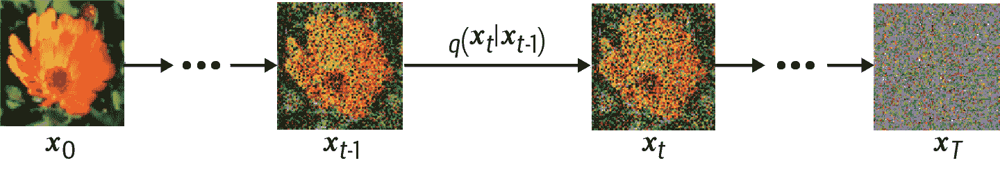

###### 图 8-3。前向扩散过程<math alttext="q"><mi>q</mi></math>

我们可以将这个更新过程数学地表示如下（这里，<math alttext="epsilon Subscript t minus 1"><msub><mi>ϵ</mi> <mrow><mi>t</mi><mo>-</mo><mn>1</mn></mrow></msub></math>是具有零均值和单位方差的标准高斯分布）：

<math alttext="bold x Subscript t Baseline equals StartRoot 1 minus beta Subscript t Baseline EndRoot bold x Subscript t minus 1 Baseline plus StartRoot beta Subscript t Baseline EndRoot epsilon Subscript t minus 1" display="block"><mrow><msub><mi>𝐱</mi> <mi>t</mi></msub> <mo>=</mo> <msqrt><mrow><mn>1</mn> <mo>-</mo> <msub><mi>β</mi> <mi>t</mi></msub></mrow></msqrt> <msub><mi>𝐱</mi> <mrow><mi>t</mi><mo>-</mo><mn>1</mn></mrow></msub> <mo>+</mo> <msqrt><msub><mi>β</mi> <mi>t</mi></msub></msqrt> <msub><mi>ϵ</mi> <mrow><mi>t</mi><mo>-</mo><mn>1</mn></mrow></msub></mrow></math>

请注意，我们还要缩放输入图像<math alttext="bold x Subscript t minus 1"><msub><mi>𝐱</mi> <mrow><mi>t</mi><mo>-</mo><mn>1</mn></mrow></msub></math>，以确保输出图像<math alttext="bold x Subscript t"><msub><mi>𝐱</mi> <mi>t</mi></msub></math>的方差随时间保持恒定。这样，如果我们将原始图像<math alttext="bold x 0"><msub><mi>𝐱</mi> <mn>0</mn></msub></math>归一化为零均值和单位方差，那么<math alttext="bold x Subscript upper T"><msub><mi>𝐱</mi> <mi>T</mi></msub></math>将在足够大的<math alttext="upper T"><mi>T</mi></math>时逼近标准高斯分布，通过归纳，如下所示。

如果我们假设<math alttext="bold x Subscript t minus 1"><msub><mi>𝐱</mi> <mrow><mi>t</mi><mo>-</mo><mn>1</mn></mrow></msub></math>具有零均值和单位方差，那么<math alttext="StartRoot 1 minus beta Subscript t Baseline EndRoot bold x Subscript t minus 1"><mrow><msqrt><mrow><mn>1</mn> <mo>-</mo> <msub><mi>β</mi> <mi>t</mi></msub></mrow></msqrt> <msub><mi>𝐱</mi> <mrow><mi>t</mi><mo>-</mo><mn>1</mn></mrow></msub></mrow></math>的方差将为<math alttext="1 minus beta Subscript t"><mrow><mn>1</mn> <mo>-</mo> <msub><mi>β</mi> <mi>t</mi></msub></mrow></math>，而<math alttext="StartRoot beta Subscript t Baseline EndRoot epsilon Subscript t minus 1"><mrow><msqrt><msub><mi>β</mi> <mi>t</mi></msub></msqrt> <msub><mi>ϵ</mi> <mrow><mi>t</mi><mo>-</mo><mn>1</mn></mrow></msub></mrow></math>的方差将为<math alttext="beta Subscript t"><msub><mi>β</mi> <mi>t</msub></math>，使用<math alttext="upper V a r left-parenthesis a upper X right-parenthesis equals a squared upper V a r left-parenthesis upper X right-parenthesis"><mrow><mi>V</mi> <mi>a</mi> <mi>r</mi> <mrow><mo>(</mo> <mi>a</mi> <mi>X</mi> <mo>)</mo></mrow> <mo>=</mo> <msup><mi>a</mi> <mn>2</mn></msup> <mi>V</mi> <mi>a</mi> <mi>r</mi> <mrow><mo>(</mo> <mi>X</mi> <mo>)</mo></mrow></mrow></math>的规则。将这些加在一起，我们得到一个新的分布<math alttext="bold x Subscript t"><msub><mi>𝐱</mi> <mi>t</mi></msub></math>，均值为零，方差为<math alttext="1 minus beta Subscript t Baseline plus beta Subscript t Baseline equals 1"><mrow><mn>1</mn> <mo>-</mo> <msub><mi>β</mi> <mi>t</mi></msub> <mo>+</mo> <msub><mi>β</mi> <mi>t</mi></msub> <mo>=</mo> <mn>1</mn></mrow></math>，使用<math alttext="upper V a r left-parenthesis upper X plus upper Y right-parenthesis equals upper V a r left-parenthesis upper X right-parenthesis plus upper V a r left-parenthesis upper Y right-parenthesis"><mrow><mi>V</mi> <mi>a</mi> <mi>r</mi> <mo>(</mo> <mi>X</mi> <mo>+</mo> <mi>Y</mi> <mo>)</mo> <mo>=</mo> <mi>V</mi> <mi>a</mi> <mi>r</mi> <mo>(</mo> <mi>X</mi> <mo>)</mo> <mo>+</mo> <mi>V</mi> <mi>a</mi> <mi>r</mi> <mo>(</mo> <mi>Y</mi> <mo>)</mo></mrow></math>的规则，对于独立的<math alttext="upper X"><mi>X</mi></math>和<math alttext="upper Y"><mi>Y</mi></math>。因此，如果<math alttext="bold x 0"><msub><mi>𝐱</mi> <mn>0</mn></msub></math>被归一化为零均值和单位方差，那么我们保证对所有<math alttext="bold x Subscript t"><msub><mi>𝐱</mi> <mi>t</mi></msub></math>都成立，包括最终图像<math alttext="bold x Subscript upper T"><msub><mi>𝐱</mi> <mi>T</mi></msub></math>，它将近似为标准高斯分布。这正是我们需要的，因为我们希望能够轻松地对<math alttext="bold x Subscript upper T"><msub><mi>𝐱</mi> <mi>T</mi></msub></math>进行采样，然后通过我们训练过的神经网络模型应用反向扩散过程！

换句话说，我们的前向噪声过程<math alttext="q"><mi>q</mi></math>也可以写成如下形式：

<math alttext="q left-parenthesis bold x Subscript t Baseline vertical-bar bold x Subscript t minus 1 Baseline right-parenthesis equals script upper N left-parenthesis bold x Subscript t Baseline semicolon StartRoot 1 minus beta Subscript t Baseline EndRoot bold x Subscript t minus 1 Baseline comma beta Subscript t Baseline bold upper I right-parenthesis" display="block"><mrow><mi>q</mi> <mrow><mo>(</mo> <msub><mi>𝐱</mi> <mi>t</mi></msub> <mo>|</mo> <msub><mi>𝐱</mi> <mrow><mi>t</mi><mo>-</mo><mn>1</mn></mrow></msub> <mo>)</mo></mrow> <mo>=</mo> <mi>𝒩</mi> <mrow><mo>(</mo> <msub><mi>𝐱</mi> <mi>t</mi></msub> <mo>;</mo> <msqrt><mrow><mn>1</mn> <mo>-</mo> <msub><mi>β</mi> <mi>t</mi></msub></mrow></msqrt> <msub><mi>𝐱</mi> <mrow><mi>t</mi><mo>-</mo><mn>1</mn></mrow></msub> <mo>,</mo> <msub><mi>β</mi> <mi>t</mi></msub> <mi>𝐈</mi> <mo>)</mo></mrow></mrow></math>

## 重新参数化技巧

从图像<math alttext="bold x 0"><msub><mi>𝐱</mi> <mn>0</mn></msub></math>直接跳转到图像的任何噪声版本<math alttext="bold x Subscript t"><msub><mi>𝐱</mi> <mi>t</mi></msub></math>也会很有用，而不必经过<math alttext="t"><mi>t</mi></math>次<math alttext="q"><mi>q</mi></math>的应用。幸运的是，我们可以使用一种重新参数化技巧来实现这一点。

如果我们定义<math alttext="alpha Subscript t Baseline equals 1 minus beta Subscript t"><mrow><msub><mi>α</mi> <mi>t</mi></msub> <mo>=</mo> <mn>1</mn> <mo>-</mo> <msub><mi>β</mi> <mi>t</mi></msub></mrow></math>和<math alttext="alpha overbar Subscript t Baseline equals product Underscript i equals 1 Overscript t Endscripts alpha Subscript i"><mrow><msub><mover accent="true"><mi>α</mi> <mo>¯</mo></mover> <mi>t</mi></msub> <mo>=</mo> <msubsup><mo>∏</mo> <mrow><mi>i</mi><mo>=</mo><mn>1</mn></mrow> <mi>t</mi></msubsup> <msub><mi>α</mi> <mi>i</mi></msub></mrow></math>，那么我们可以写成以下形式：

<math alttext="StartLayout 1st Row 1st Column bold x Subscript t 2nd Column equals 3rd Column StartRoot alpha Subscript t Baseline EndRoot bold x Subscript t minus 1 plus StartRoot 1 minus alpha Subscript t Baseline EndRoot epsilon Subscript t minus 1 2nd Row 1st Column Blank 2nd Column equals 3rd Column StartRoot alpha Subscript t Baseline alpha Subscript t minus 1 Baseline EndRoot bold x Subscript t minus 2 plus StartRoot 1 minus alpha Subscript t Baseline alpha Subscript t minus 1 Baseline EndRoot epsilon 3rd Row 1st Column Blank 2nd Column equals 3rd Column  ellipsis 4th Row 1st Column Blank 2nd Column equals 3rd Column StartRoot alpha overbar Subscript t Baseline EndRoot bold x 0 plus StartRoot 1 minus alpha overbar Subscript t Baseline EndRoot epsilon EndLayout" display="block"><mtable displaystyle="true"><mtr><mtd columnalign="right"><msub><mi>𝐱</mi> <mi>t</mi></msub></mtd> <mtd><mo>=</mo></mtd> <mtd columnalign="left"><mrow><msqrt><msub><mi>α</mi> <mi>t</mi></msub></msqrt> <msub><mi>𝐱</mi> <mrow><mi>t</mi><mo>-</mo><mn>1</mn></mrow></msub> <mo>+</mo> <msqrt><mrow><mn>1</mn> <mo>-</mo> <msub><mi>α</mi> <mi>t</mi></msub></mrow></msqrt> <msub><mi>ϵ</mi> <mrow><mi>t</mi><mo>-</mo><mn>1</mn></mrow></msub></mrow></mtd></mtr> <mtr><mtd><mo>=</mo></mtd> <mtd columnalign="left"><mrow><msqrt><mrow><msub><mi>α</mi> <mi>t</mi></msub> <msub><mi>α</mi> <mrow><mi>t</mi><mo>-</mo><mn>1</mn></mrow></msub></mrow></msqrt> <msub><mi>𝐱</mi> <mrow><mi>t</mi><mo>-</mo><mn>2</mn></mrow></msub> <mo>+</mo> <msqrt><mrow><mn>1</mn> <mo>-</mo> <msub><mi>α</mi> <mi>t</mi></msub> <msub><mi>α</mi> <mrow><mi>t</mi><mo>-</mo><mn>1</mn></mrow></msub></mrow></msqrt> <mi>ϵ</mi></mrow></mtd></mtr> <mtr><mtd><mo>=</mo></mtd> <mtd columnalign="left"><mo>⋯</mo></mtd></mtr> <mtr><mtd><mo>=</mo></mtd> <mtd columnalign="left"><mrow><msqrt><msub><mover accent="true"><mi>α</mi> <mo>¯</mo></mover> <mi>t</mi></msub></msqrt> <msub><mi>𝐱</mi> <mn>0</mn></msub> <mo>+</mo> <msqrt><mrow><mn>1</mn> <mo>-</mo> <msub><mover accent="true"><mi>α</mi> <mo>¯</mo></mover> <mi>t</mi></msub></mrow></msqrt> <mi>ϵ</mi></mrow></mtd></mtr></mtable></math>

请注意，第二行使用了我们可以将两个高斯函数相加以获得一个新高斯函数的事实。因此，我们有一种方法可以从原始图像<math alttext="bold x 0"><msub><mi>𝐱</mi> <mn>0</mn></msub></math>跳转到前向扩散过程的任何步骤<math alttext="bold x Subscript t"><msub><mi>𝐱</mi> <mi>t</mi></msub></math>。此外，我们可以使用<math alttext="alpha overbar Subscript t"><msub><mover accent="true"><mi>α</mi> <mo>¯</mo></mover> <mi>t</mi></msub></math>值来定义扩散进度表，而不是原始的<math alttext="beta Subscript t"><msub><mi>β</mi> <mi>t</mi></msub></math>值，解释为<math alttext="alpha overbar Subscript t"><msub><mover accent="true"><mi>α</mi> <mo>¯</mo></mover> <mi>t</mi></msub></math>是由信号（原始图像，<math alttext="bold x 0"><msub><mi>𝐱</mi> <mn>0</mn></msub></math>）引起的方差，而<math alttext="1 minus alpha overbar Subscript t"><mrow><mn>1</mn> <mo>-</mo> <msub><mover accent="true"><mi>α</mi> <mo>¯</mo></mover> <mi>t</mi></msub></mrow></math>是由噪声（<math alttext="epsilon"><mi>ϵ</mi></math>）引起的方差。

前向扩散过程<math alttext="q"><mi>q</mi></math>也可以写成如下形式：

<math alttext="q left-parenthesis bold x Subscript t Baseline vertical-bar bold x 0 right-parenthesis equals script upper N left-parenthesis bold x Subscript t Baseline semicolon StartRoot alpha overbar Subscript t Baseline EndRoot bold x 0 comma left-parenthesis 1 minus alpha overbar Subscript t Baseline right-parenthesis bold upper I right-parenthesis" display="block"><mrow><mi>q</mi> <mrow><mo>(</mo> <msub><mi>𝐱</mi> <mi>t</mi></msub> <mo>|</mo> <msub><mi>𝐱</mi> <mn>0</mn></msub> <mo>)</mo></mrow> <mo>=</mo> <mi>𝒩</mi> <mrow><mo>(</mo> <msub><mi>𝐱</mi> <mi>t</mi></msub> <mo>;</mo> <msqrt><msub><mover accent="true"><mi>α</mi> <mo>¯</mo></mover> <mi>t</mi></msub></msqrt> <msub><mi>𝐱</mi> <mn>0</mn></msub> <mo>,</mo> <mrow><mo>(</mo> <mn>1</mn> <mo>-</mo> <msub><mover accent="true"><mi>α</mi> <mo>¯</mo></mover> <mi>t</mi></msub> <mo>)</mo></mrow> <mi>𝐈</mi> <mo>)</mo></mrow></mrow></math>

## 扩散进度表

请注意，我们也可以在每个时间步长选择不同的<math alttext="beta Subscript t"><msub><mi>β</mi> <mi>t</mi></msub></math>——它们不必全部相同。<math alttext="beta Subscript t"><msub><mi>β</mi> <mi>t</mi></msub></math>（或<math alttext="alpha overbar Subscript t"><msub><mover accent="true"><mi>α</mi> <mo>¯</mo></mover> <mi>t</mi></msub></math>）值随着<math alttext="t"><mi>t</mi></math>的变化被称为*扩散进度表*。

在原始论文中（Ho 等人，2020 年），作者选择了一个*线性扩散进度表*用于<math alttext="beta Subscript t"><msub><mi>β</mi> <mi>t</mi></msub></math>——即，<math alttext="beta Subscript t"><msub><mi>β</mi> <mi>t</mi></msub></math>随着<math alttext="t"><mi>t</mi></math>线性增加，从<math alttext="beta 1 equals"><mrow><msub><mi>β</mi> <mn>1</mn></msub> <mo>=</mo></mrow></math>0.0001 到<math alttext="beta Subscript upper T Baseline equals"><mrow><msub><mi>β</mi> <mi>T</mi></msub> <mo>=</mo></mrow></math>0.02。这确保在噪声过程的早期阶段，我们采取比在后期阶段更小的噪声步骤，当图像已经非常嘈杂时。

我们可以编写一个线性扩散进度表，如示例 8-3 所示。

##### 示例 8-3。线性扩散进度表

```py
def linear_diffusion_schedule(diffusion_times):
    min_rate = 0.0001
    max_rate = 0.02
    betas = min_rate + tf.convert_to_tensor(diffusion_times) * (max_rate - min_rate)
    alphas = 1 - betas
    alpha_bars = tf.math.cumprod(alphas)
    signal_rates = alpha_bars
    noise_rates = 1 - alpha_bars
    return noise_rates, signal_rates

T = 1000
diffusion_times = [x/T for x in range(T)] # ①
linear_noise_rates, linear_signal_rates = linear_diffusion_schedule(
    diffusion_times
) # ②
```

①

扩散时间是 0 到 1 之间等间隔的步骤。

②

线性扩散进度表应用于扩散时间以产生噪声和信号速率。

在后续的一篇论文中发现，*余弦扩散进度表*优于原始论文中的线性进度表。余弦进度表定义了以下<math alttext="alpha overbar Subscript t"><msub><mover accent="true"><mi>α</mi> <mo>¯</mo></mover> <mi>t</mi></msub></math>值：

<math alttext="alpha overbar Subscript t Baseline equals cosine squared left-parenthesis StartFraction t Over upper T EndFraction dot StartFraction pi Over 2 EndFraction right-parenthesis" display="block"><mrow><msub><mover accent="true"><mi>α</mi> <mo>¯</mo></mover> <mi>t</mi></msub> <mo>=</mo> <msup><mo form="prefix">cos</mo> <mn>2</mn></msup> <mrow><mo>(</mo> <mfrac><mi>t</mi> <mi>T</mi></mfrac> <mo>·</mo> <mfrac><mi>π</mi> <mn>2</mn></mfrac> <mo>)</mo></mrow></mrow></math>

因此，更新的方程如下（使用三角恒等式 <math alttext="cosine squared left-parenthesis x right-parenthesis plus sine squared left-parenthesis x right-parenthesis equals 1"><mrow><msup><mo form="prefix">cos</mo> <mn>2</mn></msup> <mrow><mo>(</mo> <mi>x</mi> <mo>)</mo></mrow> <mo>+</mo> <msup><mo form="prefix">sin</mo> <mn>2</mn></msup> <mrow><mo>(</mo> <mi>x</mi> <mo>)</mo></mrow> <mo>=</mo> <mn>1</mn></mrow></math>）：

<math alttext="bold x Subscript t Baseline equals cosine left-parenthesis StartFraction t Over upper T EndFraction dot StartFraction pi Over 2 EndFraction right-parenthesis bold x 0 plus sine left-parenthesis StartFraction t Over upper T EndFraction dot StartFraction pi Over 2 EndFraction right-parenthesis epsilon" display="block"><mrow><msub><mi>𝐱</mi> <mi>t</mi></msub> <mo>=</mo> <mo form="prefix">cos</mo> <mrow><mo>(</mo> <mfrac><mi>t</mi> <mi>T</mi></mfrac> <mo>·</mo> <mfrac><mi>π</mi> <mn>2</mn></mfrac> <mo>)</mo></mrow> <msub><mi>𝐱</mi> <mn>0</mn></msub> <mo>+</mo> <mo form="prefix">sin</mo> <mrow><mo>(</mo> <mfrac><mi>t</mi> <mi>T</mi></mfrac> <mo>·</mo> <mfrac><mi>π</mi> <mn>2</mn></mfrac> <mo>)</mo></mrow> <mi>ϵ</mi></mrow></math>

这个方程是论文中使用的实际余弦扩散时间表的简化版本。作者还添加了一个偏移项和缩放，以防止扩散过程开始时噪声步骤太小。我们可以编写余弦和偏移余弦扩散时间表，如示例 8-4 所示。

##### 示例 8-4\. 余弦和偏移余弦扩散时间表

```py
def cosine_diffusion_schedule(diffusion_times): # ①
    signal_rates = tf.cos(diffusion_times * math.pi / 2)
    noise_rates = tf.sin(diffusion_times * math.pi / 2)
    return noise_rates, signal_rates

def offset_cosine_diffusion_schedule(diffusion_times): # ②
    min_signal_rate = 0.02
    max_signal_rate = 0.95
    start_angle = tf.acos(max_signal_rate)
    end_angle = tf.acos(min_signal_rate)

    diffusion_angles = start_angle + diffusion_times * (end_angle - start_angle)

    signal_rates = tf.cos(diffusion_angles)
    noise_rates = tf.sin(diffusion_angles)

    return noise_rates, signal_rates
```

①

纯余弦扩散时间表（不包括偏移或重新缩放）。

②

我们将使用的偏移余弦扩散时间表会调整时间表，以确保在扩散过程开始时噪声步骤不会太小。

我们可以计算每个 <math alttext="t"><mi>t</mi></math> 的 <math alttext="alpha overbar Subscript t"><msub><mover accent="true"><mi>α</mi> <mo>¯</mo></mover> <mi>t</mi></msub></math> 值，以显示在线性、余弦和偏移余弦扩散时间表的每个阶段中有多少信号（ <math alttext="alpha overbar Subscript t"><msub><mover accent="true"><mi>α</mi> <mo>¯</mo></mover> <mi>t</mi></msub></math> ）和噪声（ <math alttext="1 minus alpha overbar Subscript t"><mrow><mn>1</mn> <mo>-</mo> <msub><mover accent="true"><mi>α</mi> <mo>¯</mo></mover> <mi>t</mi></msub></mrow></math> ）通过，如图 8-4 所示。

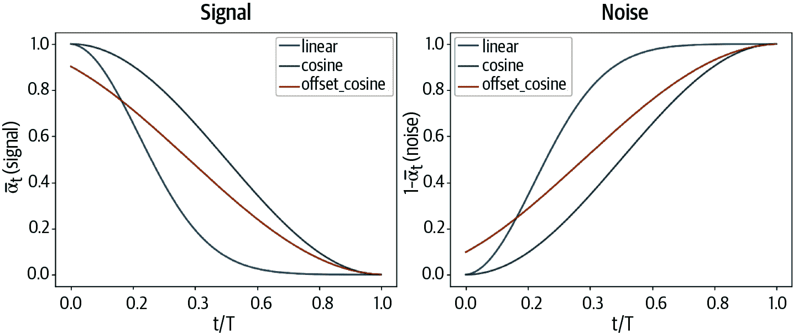

###### 图 8-4\. 在扩散过程的每个步骤中的信号和噪声，对于线性、余弦和偏移余弦扩散时间表

请注意，余弦扩散时间表中的噪声级别上升速度较慢。余弦扩散时间表将噪声逐渐添加到图像中，比线性扩散时间表更有效地提高了训练效率和生成质量。这也可以在被线性和余弦时间表破坏的图像中看到（图 8-5）。

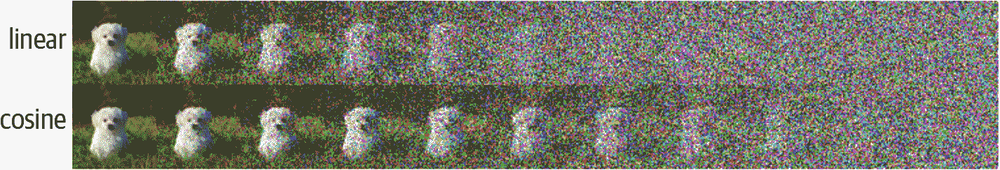

###### 图 8-5\. 一个图像被线性（顶部）和余弦（底部）扩散时间表破坏，从 0 到 T 的等间距值（来源：[Ho 等人，2020](https://arxiv.org/abs/2006.11239)）

## 反向扩散过程

现在让我们看一下反向扩散过程。简而言之，我们要构建一个神经网络 <math alttext="p Subscript theta Baseline left-parenthesis bold x Subscript t minus 1 Baseline vertical-bar bold x Subscript t Baseline right-parenthesis"><mrow><msub><mi>p</mi> <mi>θ</mi></msub> <mrow><mo>(</mo> <msub><mi>𝐱</mi> <mrow><mi>t</mi><mo>-</mo><mn>1</mn></mrow></msub> <mo>|</mo> <msub><mi>𝐱</mi> <mi>t</mi></msub> <mo>)</mo></mrow></mrow></math>，它可以*撤销*扩散过程，即近似反向分布 <math alttext="q left-parenthesis bold x Subscript t minus 1 Baseline vertical-bar bold x Subscript t Baseline right-parenthesis"><mrow><mi>q</mi> <mo>(</mo> <msub><mi>𝐱</mi> <mrow><mi>t</mi><mo>-</mo><mn>1</mn></mrow></msub> <mo>|</mo> <msub><mi>𝐱</mi> <mi>t</mi></msub> <mo>)</mo></mrow></math>。如果我们能做到这一点，我们可以从 <math alttext="script upper N left-parenthesis 0 comma bold upper I right-parenthesis"><mrow><mi>𝒩</mi> <mo>(</mo> <mn>0</mn> <mo>,</mo> <mi>𝐈</mi> <mo>)</mo></mrow></math> 中随机采样噪声，然后多次应用反向扩散过程以生成新颖的图像。这在图 8-6 中可视化。

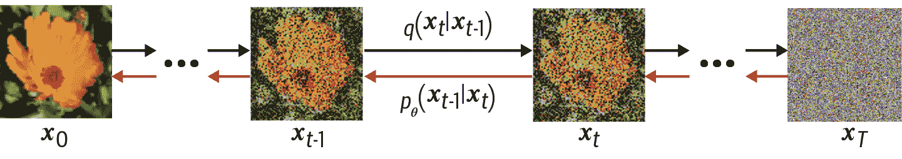

###### 图 8-6。反向扩散过程<math alttext="p Subscript theta Baseline period left-parenthesis bold x Subscript t minus 1 Baseline vertical-bar bold x Subscript t Baseline right-parenthesis"><mrow><msub><mi>p</mi> <mi>θ</mi></msub> <mo>.</mo> <mrow><mo>(</mo> <msub><mi>𝐱</mi> <mrow><mi>t</mi><mo>-</mo><mn>1</mn></mrow></msub> <mo>|</mo> <msub><mi>𝐱</mi> <mi>t</mi></msub> <mo>)</mo></mrow></mrow></math>试图*撤消*由正向扩散过程产生的噪声

反向扩散过程和变分自动编码器的解码器之间存在许多相似之处。 在两者中，我们的目标都是使用神经网络将随机噪声转换为有意义的输出。 扩散模型和 VAE 之间的区别在于，在 VAE 中，正向过程（将图像转换为噪声）是模型的一部分（即，它是学习的），而在扩散模型中，它是非参数化的。

因此，将与变分自动编码器中相同的损失函数应用是有意义的。 原始的 DDPM 论文推导出了这个损失函数的确切形式，并表明可以通过训练一个网络<math alttext="epsilon Subscript theta"><msub><mi>ϵ</mi> <mi>θ</mi></msub></math>来预测已添加到给定图像<math alttext="bold x bold 0"><msub><mi>𝐱</mi> <mn mathvariant="bold">0</mn></msub></math>的噪声<math alttext="epsilon"><mi>ϵ</mi></math>在时间步<math alttext="t"><mi>t</mi></math>。

换句话说，我们对图像<math alttext="bold x bold 0"><msub><mi>𝐱</mi> <mn mathvariant="bold">0</mn></msub></math>进行采样，并通过<math alttext="t"><mi>t</mi></math>个噪声步骤将其转换为图像<math alttext="bold x Subscript t Baseline equals StartRoot alpha overbar Subscript t Baseline EndRoot bold x 0 plus StartRoot 1 minus alpha overbar Subscript t Baseline EndRoot epsilon"><mrow><msub><mi>𝐱</mi> <mi>t</mi></msub> <mo>=</mo> <msqrt><msub><mover accent="true"><mi>α</mi> <mo>¯</mo></mover> <mi>t</mi></msub></msqrt> <msub><mi>𝐱</mi> <mn>0</mn></msub> <mo>+</mo> <msqrt><mrow><mn>1</mn> <mo>-</mo> <msub><mover accent="true"><mi>α</mi> <mo>¯</mo></mover> <mi>t</mi></msub></mrow></msqrt> <mi>ϵ</mi></mrow></math>。 我们将这个新图像和噪声率<math alttext="alpha overbar Subscript t"><msub><mover accent="true"><mi>α</mi> <mo>¯</mo></mover> <mi>t</msub></math>提供给神经网络，并要求它预测<math alttext="epsilon"><mi>ϵ</mi></math>，采取梯度步骤来计算预测<math alttext="epsilon Subscript theta Baseline left-parenthesis bold x Subscript t Baseline right-parenthesis"><mrow><msub><mi>ϵ</mi> <mi>θ</mi></msub> <mrow><mo>(</mo> <msub><mi>𝐱</mi> <mi>t</mi></msub> <mo>)</mo></mrow></mrow></math>和真实<math alttext="epsilon"><mi>ϵ</mi></math>之间的平方误差。

我们将在下一节中查看神经网络的结构。 值得注意的是，扩散模型实际上维护了两个网络副本：一个是通过梯度下降主动训练的网络，另一个是权重的指数移动平均（EMA）网络，该网络是在先前的训练步骤中对主动训练网络的权重进行指数移动平均。 EMA 网络不太容易受到训练过程中的短期波动和峰值的影响，因此在生成方面比主动训练网络更稳健。 因此，每当我们想要从网络生成输出时，我们都会使用 EMA 网络。

模型的训练过程如图 8-7 所示。

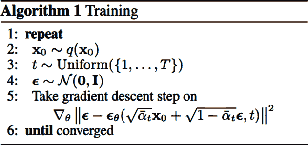

###### 图 8-7。去噪扩散模型的训练过程（来源：[Ho 等人，2020](https://arxiv.org/abs/2006.11239)）

在 Keras 中，我们可以将这个训练步骤编码为示例 8-5 所示。

##### 示例 8-5。Keras 扩散模型的`train_step`函数

```py
class DiffusionModel(models.Model):
    def __init__(self):
        super().__init__()
        self.normalizer = layers.Normalization()
        self.network = unet
        self.ema_network = models.clone_model(self.network)
        self.diffusion_schedule = cosine_diffusion_schedule

    ...

    def denoise(self, noisy_images, noise_rates, signal_rates, training):
        if training:
            network = self.network
        else:
            network = self.ema_network
        pred_noises = network(
            [noisy_images, noise_rates**2], training=training
        )
        pred_images = (noisy_images - noise_rates * pred_noises) / signal_rates

        return pred_noises, pred_images

    def train_step(self, images):
        images = self.normalizer(images, training=True) # ①
        noises = tf.random.normal(shape=tf.shape(images)) # ②
        batch_size = tf.shape(images)[0]
        diffusion_times = tf.random.uniform(
            shape=(batch_size, 1, 1, 1), minval=0.0, maxval=1.0
        ) # ③
        noise_rates, signal_rates = self.cosine_diffusion_schedule(
            diffusion_times
        ) # ④
        noisy_images = signal_rates * images + noise_rates * noises # ⑤
        with tf.GradientTape() as tape:
            pred_noises, pred_images = self.denoise(
                noisy_images, noise_rates, signal_rates, training=True
            ) # ⑥
            noise_loss = self.loss(noises, pred_noises)  # ⑦
        gradients = tape.gradient(noise_loss, self.network.trainable_weights)
        self.optimizer.apply_gradients(
            zip(gradients, self.network.trainable_weights)
        ) # ⑧
        self.noise_loss_tracker.update_state(noise_loss)

        for weight, ema_weight in zip(
            self.network.weights, self.ema_network.weights
        ):
            ema_weight.assign(0.999 * ema_weight + (1 - 0.999) * weight) # ⑨

        return {m.name: m.result() for m in self.metrics}

    ...
```

①

我们首先将图像批次归一化为零均值和单位方差。

②

接下来，我们对形状与输入图像匹配的噪声进行采样。

③

我们还对随机扩散时间进行采样…​

④

…并使用这些根据余弦扩散计划生成噪声和信号速率。

⑤

然后我们将信号和噪声权重应用于输入图像以生成嘈杂的图像。

⑥

接下来，我们通过要求网络预测噪声然后撤消添加噪声的操作，使用提供的`noise_rates`和`signal_rates`来去噪嘈杂的图像。

⑦

然后我们可以计算预测噪声和真实噪声之间的损失（平均绝对误差）…​

⑧

…​并根据这个损失函数采取梯度步骤。

⑨

EMA 网络权重更新为现有 EMA 权重和训练后的网络权重在梯度步骤后的加权平均值。

## U-Net 去噪模型

现在我们已经看到了我们需要构建的神经网络的类型（一个预测添加到给定图像的噪声的网络），我们可以看一下使这种可能的架构。

DDPM 论文的作者使用了一种称为*U-Net*的架构类型。这个网络的图表显示在图 8-8 中，明确显示了张量在通过网络时的形状。

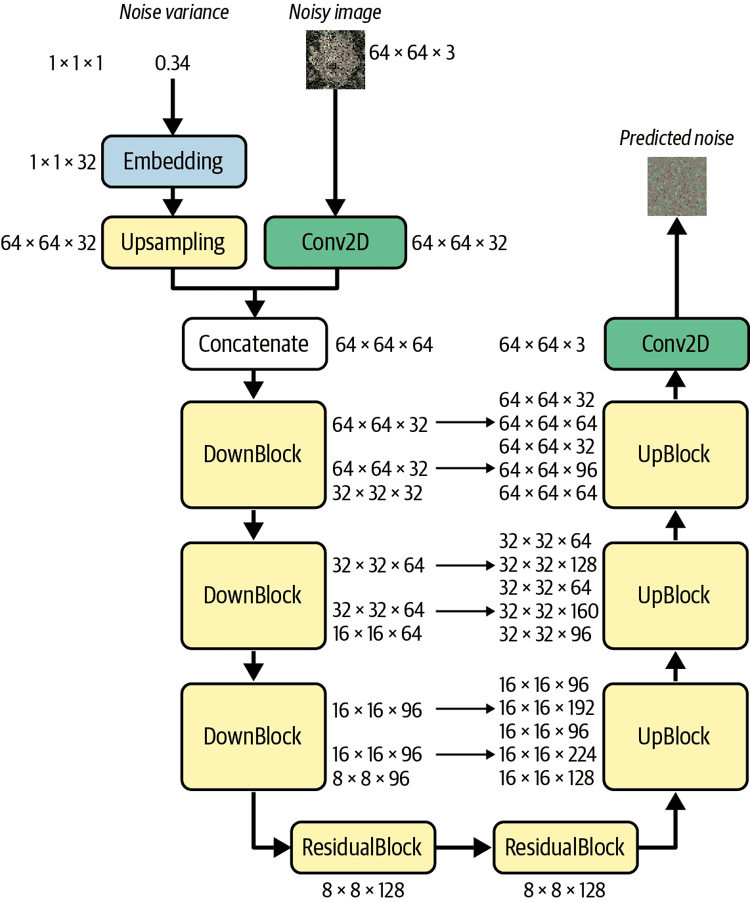

###### 图 8-8\. U-Net 架构图

类似于变分自动编码器，U-Net 由两部分组成：下采样部分，其中输入图像在空间上被压缩但在通道上被扩展，以及上采样部分，其中表示在空间上被扩展，而通道数量减少。然而，与 VAE 不同的是，在网络的上采样和下采样部分之间还有*跳跃连接*。VAE 是顺序的；数据从输入到输出依次通过网络的每一层。U-Net 不同，因为跳跃连接允许信息绕过网络的部分并流向后续层。

当我们希望输出具有与输入相同的形状时，U-Net 特别有用。在我们的扩散模型示例中，我们希望预测添加到图像中的噪声，这个噪声与图像本身的形状完全相同，因此 U-Net 是网络架构的自然选择。

首先让我们看一下在 Keras 中构建这个 U-Net 的代码，显示在示例 8-6 中。

##### 示例 8-6\. Keras 中的 U-Net 模型

```py
noisy_images = layers.Input(shape=(64, 64, 3)) # ①
x = layers.Conv2D(32, kernel_size=1)(noisy_images) # ②

noise_variances = layers.Input(shape=(1, 1, 1)) # ③
noise_embedding = layers.Lambda(sinusoidal_embedding)(noise_variances) # ④
noise_embedding = layers.UpSampling2D(size=64, interpolation="nearest")(
    noise_embedding
) # ⑤

x = layers.Concatenate()([x, noise_embedding]) # ⑥

skips = [] # ⑦

x = DownBlock(32, block_depth = 2)([x, skips]) # ⑧
x = DownBlock(64, block_depth = 2)([x, skips])
x = DownBlock(96, block_depth = 2)([x, skips])

x = ResidualBlock(128)(x) # ⑨
x = ResidualBlock(128)(x)

x = UpBlock(96, block_depth = 2)([x, skips]) # ⑩
x = UpBlock(64, block_depth = 2)([x, skips])
x = UpBlock(32, block_depth = 2)([x, skips])

x = layers.Conv2D(3, kernel_size=1, kernel_initializer="zeros")(x) # ⑪ 

unet = models.Model([noisy_images, noise_variances], x, name="unet") # ⑫
```

①

U-Net 的第一个输入是我们希望去噪的图像。

②

这个图像通过一个`Conv2D`层传递，以增加通道数量。

③

U-Net 的第二个输入是噪声方差（一个标量）。

④

这是使用正弦嵌入编码的。

⑤

这个嵌入被复制到空间维度以匹配输入图像的大小。

⑥

两个输入流在通道上连接。

⑦

`skips`列表将保存我们希望连接到下游`UpBlock`层的`DownBlock`层的输出。

⑧

张量通过一系列`DownBlock`层传递，这些层减小了图像的大小，同时增加了通道的数量。

⑨

然后，张量通过两个`ResidualBlock`层传递，这些层保持图像大小和通道数量恒定。

⑩

接下来，张量通过一系列`UpBlock`层传递，这些层增加图像的大小，同时减少通道数。跳跃连接将输出与较早的`DownBlock`层的输出合并。

⑪ 

最终的`Conv2D`层将通道数减少到三（RGB）。

⑫

U-Net 是一个 Keras `Model`，它以嘈杂的图像和噪声方差作为输入，并输出预测的噪声图。

要详细了解 U-Net，我们需要探索四个概念：噪声方差的正弦嵌入、`ResidualBlock`、`DownBlock`和`UpBlock`。

### 正弦嵌入

*正弦嵌入*最初是由 Vaswani 等人在一篇论文中引入的。我们将使用 Mildenhall 等人在题为“NeRF: Representing Scenes as Neural Radiance Fields for View Synthesis”的论文中使用的这个原始想法的改编。

我们希望能够将标量值（噪声方差）转换为一个不同的高维向量，能够提供更复杂的表示，以便在网络中下游使用。原始论文使用这个想法将句子中单词的离散位置编码为向量；NeRF 论文将这个想法扩展到连续值。

具体来说，标量值*x*被编码如下方程所示：

<math alttext="gamma left-parenthesis x right-parenthesis equals left-parenthesis sine left-parenthesis 2 pi e Superscript 0 f Baseline x right-parenthesis comma ellipsis comma sine left-parenthesis 2 pi e Superscript left-parenthesis upper L minus 1 right-parenthesis f right-parenthesis Baseline x right-parenthesis comma cosine left-parenthesis 2 pi e Superscript 0 f Baseline x right-parenthesis comma ellipsis comma cosine left-parenthesis 2 pi e Superscript left-parenthesis upper L minus 1 right-parenthesis f Baseline x right-parenthesis right-parenthesis" display="block"><mrow><mi>γ</mi> <mrow><mo>(</mo> <mi>x</mi> <mo>)</mo></mrow> <mo>=</mo> <mo>(</mo> <mo form="prefix">sin</mo> <mrow><mo>(</mo> <mn>2</mn> <mi>π</mi> <msup><mi>e</mi> <mrow><mn>0</mn><mi>f</mi></mrow></msup> <mi>x</mi> <mo>)</mo></mrow> <mo>,</mo> <mo>⋯</mo> <mo>,</mo> <mo form="prefix">sin</mo> <mrow><mo>(</mo> <mn>2</mn> <mi>π</mi> <msup><mi>e</mi> <mrow><mo>(</mo><mi>L</mi><mo>-</mo><mn>1</mn><mo>)</mo><mi>f</mi><mo>)</mo></mrow></msup> <mi>x</mi> <mo>)</mo></mrow> <mo>,</mo> <mo form="prefix">cos</mo> <mrow><mo>(</mo> <mn>2</mn> <mi>π</mi> <msup><mi>e</mi> <mrow><mn>0</mn><mi>f</mi></mrow></msup> <mi>x</mi> <mo>)</mo></mrow> <mo>,</mo> <mo>⋯</mo> <mo>,</mo> <mo form="prefix">cos</mo> <mrow><mo>(</mo> <mn>2</mn> <mi>π</mi> <msup><mi>e</mi> <mrow><mo>(</mo><mi>L</mi><mo>-</mo><mn>1</mn><mo>)</mo><mi>f</mi></mrow></msup> <mi>x</mi> <mo>)</mo></mrow> <mo>)</mo></mrow></math>

其中我们选择<math alttext="上限 L 等于 16"><mrow><mi>L</mi> <mo>=</mo> <mn>16</mn></mrow></math>，是我们期望的噪声嵌入长度的一半，<math alttext="f 等于 ln(1000)/(L-1)"><mrow><mi>f</mi> <mo>=</mo> <mfrac><mrow><mo form="prefix">ln</mo><mo>(</mo><mn>1000</mn><mo>)</mo></mrow> <mrow><mi>L</mi><mo>-</mo><mn>1</mn></mrow></mfrac></mrow></math>是频率的最大缩放因子。

这产生了图 8-9 中显示的嵌入模式。

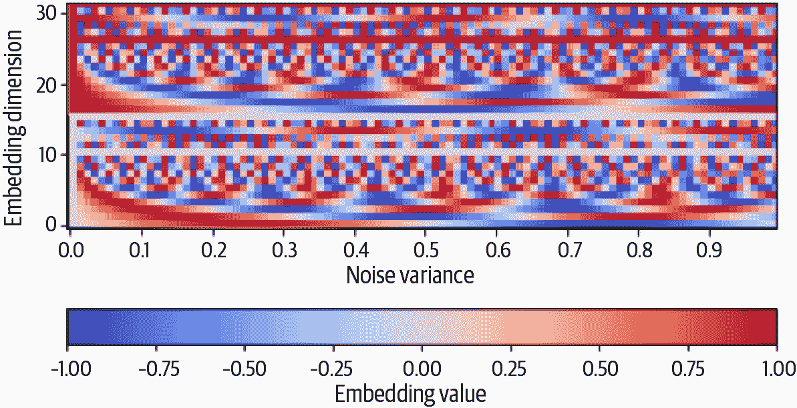

###### 图 8-9。噪声方差从 0 到 1 的正弦嵌入模式

我们可以将这个正弦嵌入函数编码如示例 8-7 所示。这将一个单一的噪声方差标量值转换为长度为 32 的向量。

##### 示例 8-7。编码噪声方差的`sinusoidal_embedding`函数

```py
def sinusoidal_embedding(x):
    frequencies = tf.exp(
        tf.linspace(
            tf.math.log(1.0),
            tf.math.log(1000.0),
            16,
        )
    )
    angular_speeds = 2.0 * math.pi * frequencies
    embeddings = tf.concat(
        [tf.sin(angular_speeds * x), tf.cos(angular_speeds * x)], axis=3
    )
    return embeddings
```

### 残差块

`DownBlock`和`UpBlock`都包含`ResidualBlock`层，所以让我们从这些层开始。我们在第五章中构建 PixelCNN 时已经探讨过残差块，但为了完整起见，我们将在这里进行回顾。

*残差块*是一组包含跳跃连接的层，将输入添加到输出中。残差块帮助我们构建更深的网络，可以学习更复杂的模式，而不会受到梯度消失和退化问题的严重影响。梯度消失问题是指随着网络变得更深，通过更深层传播的梯度很小，因此学习速度非常慢。退化问题是指随着神经网络变得更深，它们不一定像较浅的对应网络那样准确——准确性似乎在一定深度上饱和，然后迅速退化。

# 退化

退化问题有点反直觉，但在实践中观察到，因为更深的层至少必须学习恒等映射，这并不是微不足道的——尤其考虑到更深的网络面临的其他问题，比如梯度消失问题。

这个解决方案最初在 2015 年 He 等人的 ResNet 论文中首次提出。通过在主要加权层周围包含一个跳跃连接*高速公路*，块可以选择绕过复杂的权重更新，简单地通过恒等映射传递。这使得网络可以在不牺牲梯度大小或网络准确性的情况下进行深度训练。

`ResidualBlock`的图示如图 8-10 所示。请注意，在一些残差块中，我们还在跳跃连接上包含一个额外的具有核大小 1 的`Conv2D`层，以使通道数与块的其余部分保持一致。

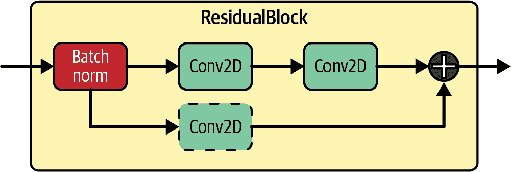

###### 图 8-10。U-Net 中的`ResidualBlock`

我们可以像示例 8-8 中所示的那样在 Keras 中编写`ResidualBlock`。

##### 示例 8-8。U-Net 中的`ResidualBlock`代码

```py
def ResidualBlock(width):
    def apply(x):
        input_width = x.shape[3]
        if input_width == width: # ①
            residual = x
        else:
            residual = layers.Conv2D(width, kernel_size=1)(x)
        x = layers.BatchNormalization(center=False, scale=False)(x) # ②
        x = layers.Conv2D(
            width, kernel_size=3, padding="same", activation=activations.swish
        )(x) # ③
        x = layers.Conv2D(width, kernel_size=3, padding="same")(x)
        x = layers.Add()([x, residual]) # ④
        return x

    return apply
```

①

检查输入中的通道数是否与我们希望该块输出的通道数匹配。如果不匹配，可以在跳跃连接上包含额外的`Conv2D`层，以使通道数与块的其余部分保持一致。

②

应用`BatchNormalization`层。

③

应用两个`Conv2D`层。

④

将原始块输入添加到输出中，以提供块的最终输出。

### DownBlocks 和 UpBlocks

每个连续的`DownBlock`通过`block_depth`（在我们的示例中为 2）`ResidualBlock`增加通道数，同时还应用最终的`AveragePooling2D`层以将图像尺寸减半。每个`ResidualBlock`都添加到一个列表中，以便稍后由`UpBlock`层作为 U-Net 中的跳跃连接使用。

`UpBlock`首先应用一个`UpSampling2D`层，通过双线性插值将图像大小加倍。每个连续的`UpBlock`通过`block_depth`（=2）`ResidualBlock`减少通道数，同时还通过 U-Net 中的跳跃连接将`DownBlock`的输出连接起来。这个过程的图示如图 8-11 所示。

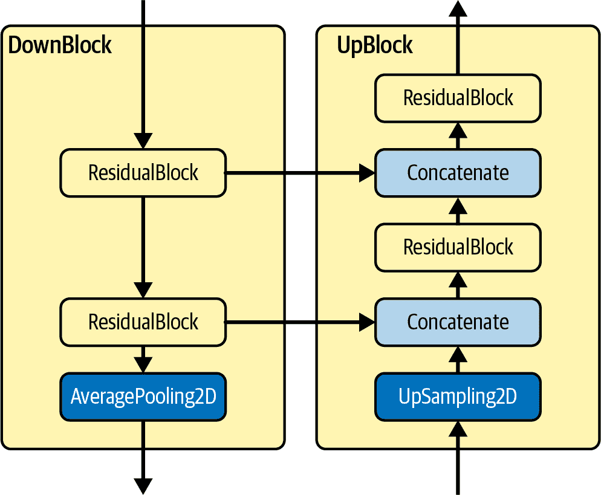

###### 图 8-11。U-Net 中的`DownBlock`和相应的`UpBlock`

我们可以使用 Keras 编写`DownBlock`和`UpBlock`，如示例 8-9 所示。

##### 示例 8-9。U-Net 模型中的`DownBlock`和`UpBlock`代码

```py
def DownBlock(width, block_depth):
    def apply(x):
        x, skips = x
        for _ in range(block_depth):
            x = ResidualBlock(width)(x) # ①
            skips.append(x) # ②
        x = layers.AveragePooling2D(pool_size=2)(x) # ③
        return x

    return apply

def UpBlock(width, block_depth):
    def apply(x):
        x, skips = x
        x = layers.UpSampling2D(size=2, interpolation="bilinear")(x) # ④
        for _ in range(block_depth):
            x = layers.Concatenate()([x, skips.pop()]) # ⑤
            x = ResidualBlock(width)(x) # ⑥
        return x

    return apply
```

①

`DownBlock`通过给定`width`的`ResidualBlock`增加图像中的通道数…​

②

…每个都保存在一个列表（`skips`）中，以便稍后由`UpBlock`使用。

③

最终的`AveragePooling2D`层将图像的维度减半。

④

`UpBlock`从一个`UpSampling2D`层开始，将图像大小加倍。

⑤

`DownBlock`层的输出通过`Concatenate`层连接到当前输出。

⑥

`ResidualBlock`用于在图像通过`UpBlock`时减少通道数。

## 训练扩散模型

现在我们已经准备好训练我们的去噪扩散模型了！示例 8-10 创建、编译和拟合扩散模型。

##### 示例 8-10。训练`DiffusionModel`的代码

```py
model = DiffusionModel() # ①
model.compile(
    optimizer=optimizers.experimental.AdamW(learning_rate=1e-3, weight_decay=1e-4),
    loss=losses.mean_absolute_error,
) # ②

model.normalizer.adapt(train) # ③

model.fit(
    train,
    epochs=50,
) # ④
```

①

实例化模型。

②

编译模型，使用 AdamW 优化器（类似于 Adam，但带有权重衰减，有助于稳定训练过程）和平均绝对误差损失函数。

③

使用训练集计算归一化统计数据。

④

在 50 个时代内拟合模型。

损失曲线（噪音平均绝对误差[MAE]）显示在图 8-12 中。

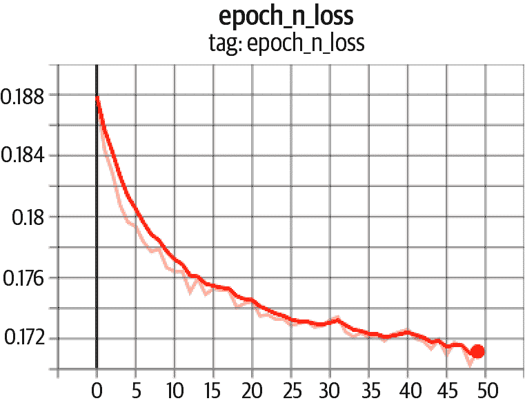

###### 图 8-12。噪音平均绝对误差损失曲线，按时代

## 从去噪扩散模型中采样

为了从我们训练好的模型中采样图像，我们需要应用反向扩散过程-也就是说，我们需要从随机噪音开始，并使用模型逐渐消除噪音，直到我们得到一个可以识别的花朵图片。

我们必须记住，我们的模型是经过训练的，用于预测在训练集中添加到给定嘈杂图像的总噪音量，而不仅仅是在噪音过程的最后一个时间步骤中添加的噪音。然而，我们不希望一次性消除所有噪音-在一次预测中从纯随机噪音中预测图像显然不会奏效！我们宁愿模仿正向过程，并在许多小步骤中逐渐消除预测的噪音，以使模型能够适应自己的预测。

为了实现这一点，我们可以在两个步骤中从<math alttext="x Subscript t"><msub><mi>x</mi> <mi>t</mi></msub></math>跳到<math alttext="x Subscript t minus 1"><msub><mi>x</mi> <mrow><mi>t</mi><mo>-</mo><mn>1</mn></mrow></msub></math>，首先使用我们模型的噪音预测来计算原始图像<math alttext="x 0"><msub><mi>x</mi> <mn>0</mn></msub></math>的估计，然后重新应用预测的噪音到这个图像，但只在<math alttext="t minus 1"><mrow><mi>t</mi> <mo>-</mo> <mn>1</mn></mrow></math>个时间步骤内，产生<math alttext="x Subscript t minus 1"><msub><mi>x</mi> <mrow><mi>t</mi><mo>-</mo><mn>1</mn></mrow></msub></math>。这个想法在图 8-13 中显示。

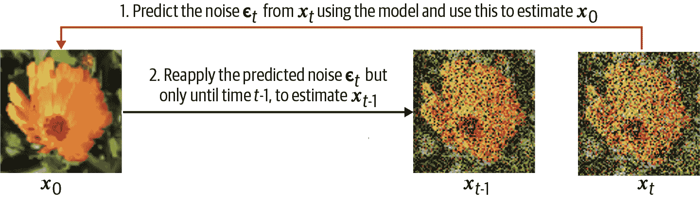

###### 图 8-13。扩散模型采样过程的一步

如果我们重复这个过程多次，最终我们将得到一个经过许多小步骤逐渐引导的<math alttext="x 0"><msub><mi>x</mi> <mn>0</mn></msub></math>的估计。实际上，我们可以自由选择采取的步数，关键是，它不必与训练噪音过程中的大量步数（即 1,000）相同。它可以小得多-在这个例子中，我们选择了 20。

以下方程（Song 等，2020）数学上描述了这个过程：

<math alttext="bold x Subscript t minus 1 Baseline equals StartRoot alpha overbar Subscript t minus 1 Baseline EndRoot ModifyingBelow left-parenthesis StartFraction bold x Subscript t Baseline minus StartRoot 1 minus alpha overbar Subscript t Baseline EndRoot epsilon Subscript theta Superscript left-parenthesis t right-parenthesis Baseline left-parenthesis bold x Subscript t Baseline right-parenthesis Over StartRoot alpha overbar Subscript t Baseline EndRoot EndFraction right-parenthesis With bottom-brace Underscript predicted bold x 0 Endscripts plus ModifyingBelow StartRoot 1 minus alpha overbar Subscript t minus 1 Baseline minus sigma Subscript t Superscript 2 Baseline EndRoot dot epsilon Subscript theta Superscript left-parenthesis t right-parenthesis Baseline left-parenthesis bold x Subscript t Baseline right-parenthesis With bottom-brace Underscript direction pointing to bold x Subscript t Baseline Endscripts plus ModifyingBelow sigma Subscript t Baseline epsilon Subscript t Baseline With bottom-brace Underscript random noise Endscripts" display="block"><mrow><msub><mi>𝐱</mi> <mrow><mi>t</mi><mo>-</mo><mn>1</mn></mrow></msub> <mo>=</mo> <msqrt><msub><mover accent="true"><mi>α</mi> <mo>¯</mo></mover> <mrow><mi>t</mi><mo>-</mo><mn>1</mn></mrow></msub></msqrt> <munder><munder accentunder="true"><mfenced separators="" open="(" close=")"><mfrac><mrow><msub><mi>𝐱</mi> <mi>t</mi></msub> <mo>-</mo><msqrt><mrow><mn>1</mn><mo>-</mo><msub><mover accent="true"><mi>α</mi> <mo>¯</mo></mover> <mi>t</mi></msub></mrow></msqrt> <msubsup><mi>ϵ</mi> <mi>θ</mi> <mrow><mo>(</mo><mi>t</mi><mo>)</mo></mrow></msubsup> <mrow><mo>(</mo><msub><mi>𝐱</mi> <mi>t</mi></msub> <mo>)</mo></mrow></mrow> <msqrt><msub><mover accent="true"><mi>α</mi> <mo>¯</mo></mover> <mi>t</mi></msub></msqrt></mfrac></mfenced> <mo>︸</mo></munder> <mrow><mtext>predicted</mtext><msub><mi>𝐱</mi> <mn>0</mn></msub></mrow></munder> <mo>+</mo> <munder><munder accentunder="true"><mrow><msqrt><mrow><mn>1</mn><mo>-</mo><msub><mover accent="true"><mi>α</mi> <mo>¯</mo></mover> <mrow><mi>t</mi><mo>-</mo><mn>1</mn></mrow></msub> <mo>-</mo><msubsup><mi>σ</mi> <mi>t</mi> <mn>2</mn></msubsup></mrow></msqrt> <mo>·</mo><msubsup><mi>ϵ</mi> <mi>θ</mi> <mrow><mo>(</mo><mi>t</mi><mo>)</mo></mrow></msubsup> <mrow><mo>(</mo><msub><mi>𝐱</mi> <mi>t</mi></msub> <mo>)</mo></mrow></mrow> <mo>︸</mo></munder> <mrow><mtext>direction</mtext><mtext>pointing</mtext><mtext>to</mtext><msub><mi>𝐱</mi> <mi>t</mi></msub></mrow></munder> <mo>+</mo> <munder><munder accentunder="true"><mrow><msub><mi>σ</mi> <mi>t</mi></msub> <msub><mi>ϵ</mi> <mi>t</mi></msub></mrow> <mo>︸</mo></munder> <mrow><mtext>random</mtext><mtext>noise</mtext></mrow></munder></mrow></math>

让我们来分解一下。方程式右侧括号内的第一个项是估计的图像 <math alttext="x 0"><msub><mi>x</mi> <mn>0</mn></msub></math>，使用我们网络预测的噪声 <math alttext="epsilon Subscript theta Superscript left-parenthesis t right-parenthesis"><msubsup><mi>ϵ</mi> <mi>θ</mi> <mrow><mo>(</mo><mi>t</mi><mo>)</mo></mrow></msubsup></math> 计算得到。然后我们通过 <math alttext="t minus 1"><mrow><mi>t</mi> <mo>-</mo> <mn>1</mn></mrow></math> 信号率 <math alttext="StartRoot alpha overbar Subscript t minus 1 Baseline EndRoot"><msqrt><msub><mover accent="true"><mi>α</mi> <mo>¯</mo></mover> <mrow><mi>t</mi><mo>-</mo><mn>1</mn></mrow></msub></msqrt></math> 缩放这个值，并重新应用预测的噪声，但这次是通过 <math alttext="t minus 1"><mrow><mi>t</mi> <mo>-</mo> <mn>1</mn></mrow></math> 噪声率 <math alttext="StartRoot 1 minus alpha overbar Subscript t minus 1 Baseline minus sigma Subscript t Superscript 2 Baseline EndRoot"><msqrt><mrow><mn>1</mn> <mo>-</mo> <msub><mover accent="true"><mi>α</mi> <mo>¯</mo></mover> <mrow><mi>t</mi><mo>-</mo><mn>1</mn></mrow></msub> <mo>-</mo> <msubsup><mi>σ</mi> <mi>t</mi> <mn>2</mn></msubsup></mrow></msqrt></math> 进行缩放。还添加了额外的高斯随机噪声 <math alttext="sigma Subscript t Baseline epsilon Subscript t"><mrow><msub><mi>σ</mi> <mi>t</mi></msub> <msub><mi>ϵ</mi> <mi>t</mi></msub></mrow></math>，其中 <math alttext="sigma Subscript t"><msub><mi>σ</mi> <mi>t</msub></math> 确定了我们希望生成过程有多随机。

特殊情况 <math alttext="sigma Subscript t Baseline equals 0"><mrow><msub><mi>σ</mi> <mi>t</mi></msub> <mo>=</mo> <mn>0</mn></mrow></math> 对于所有的 <math alttext="t"><mi>t</mi></math> 对应于一种称为*去噪扩散隐式模型*（DDIM）的模型，由 Song 等人在 2020 年提出。⁹ 使用 DDIM，生成过程完全是确定性的—也就是说，相同的随机噪声输入将始终产生相同的输出。这是可取的，因为这样我们在潜在空间的样本和像素空间中生成的输出之间有一个明确定义的映射。

在我们的示例中，我们将实现一个 DDIM，从而使我们的生成过程确定性。DDIM 采样过程（反向扩散）的代码显示在示例 8-11 中。

##### 示例 8-11\. 从扩散模型中采样

```py
class DiffusionModel(models.Model):

...

    def reverse_diffusion(self, initial_noise, diffusion_steps):
        num_images = initial_noise.shape[0]
        step_size = 1.0 / diffusion_steps
        current_images = initial_noise
        for step in range(diffusion_steps): # ①
            diffusion_times = tf.ones((num_images, 1, 1, 1)) - step * step_size # ②
            noise_rates, signal_rates = self.diffusion_schedule(diffusion_times) # ③
            pred_noises, pred_images = self.denoise(
                current_images, noise_rates, signal_rates, training=False
            ) # ④
            next_diffusion_times = diffusion_times - step_size # ⑤
            next_noise_rates, next_signal_rates = self.diffusion_schedule(
                next_diffusion_times
            ) # ⑥
            current_images = (
                next_signal_rates * pred_images + next_noise_rates * pred_noises
            ) # ⑦
        return pred_images # ⑧
```

①

观察固定数量的步骤（例如，20 步）。

②

扩散时间都设置为 1（即在反向扩散过程开始时）。

③

根据扩散计划计算噪声和信号率。

④

U-Net 用于预测噪声，从而使我们能够计算去噪图像的估计。

⑤

扩散时间减少一步。

⑥

计算新的噪声和信号率。

⑦

通过根据扩散计划率重新应用预测噪声到预测图像，计算出 `t-1` 图像。

⑧

经过 20 步，最终的 <math alttext="bold x 0"><msub><mi>𝐱</mi> <mn>0</mn></msub></math> 预测图像被返回。

## 扩散模型的分析

现在我们将看一下我们训练模型的三种不同用法：用于生成新图像，测试反向扩散步数如何影响质量，以及在潜在空间中两个图像之间的插值。

### 生成图像

为了从我们训练的模型中生成样本，我们只需运行逆扩散过程，确保最终去标准化输出（即，将像素值带回范围[0, 1]）。我们可以在`DiffusionModel`类中使用示例 8-12 中的代码来实现这一点。

##### 示例 8-12。使用扩散模型生成图像

```py
class DiffusionModel(models.Model):

...

    def denormalize(self, images):
        images = self.normalizer.mean + images * self.normalizer.variance**0.5 # ①
        return tf.clip_by_value(images, 0.0, 1.0)

    def generate(self, num_images, diffusion_steps):
        initial_noise = tf.random.normal(shape=(num_images, 64, 64, 3)) # ①
        generated_images = self.reverse_diffusion(initial_noise, diffusion_steps) # ②
        generated_images = self.denormalize(generated_images) # ③
        return generated_images
```

①

生成一些初始噪声图。

②

应用逆扩散过程。

③

网络输出的图像将具有零均值和单位方差，因此我们需要通过重新应用从训练数据计算得出的均值和方差来去标准化。

在图 8-14 中，我们可以观察到训练过程中不同时期扩散模型的一些样本。

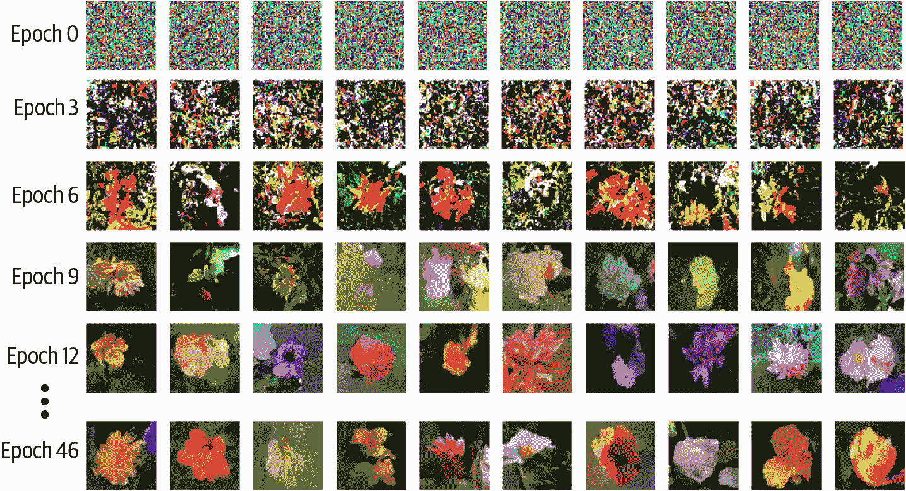

###### 图 8-14。训练过程中不同时期扩散模型的样本

### 调整扩散步数

我们还可以测试调整逆向过程中扩散步数如何影响图像质量。直观地，过程中步数越多，图像生成的质量就越高。

我们可以在图 8-15 中看到，随着扩散步数的增加，生成的质量确实会提高。从初始抽样的噪声中一次性跳跃，模型只能预测出一个朦胧的颜色斑块。随着步数的增加，模型能够改进和锐化生成物。然而，生成图像所需的时间与扩散步数成线性关系，因此存在权衡。在 20 和 100 个扩散步之间的改进很小，因此在这个例子中我们选择 20 作为质量和速度之间的合理折衷。

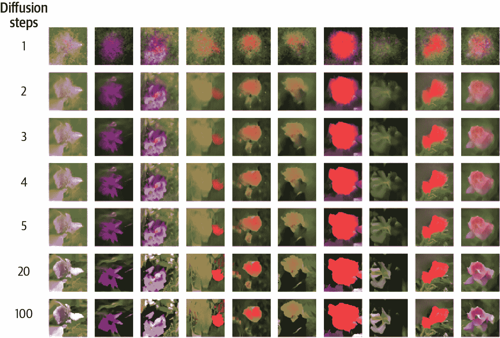

###### 图 8-15。随着扩散步数的增加，图像质量提高

### 在图像之间进行插值

最后，正如我们之前在变分自动编码器中看到的那样，我们可以在高斯潜在空间中的点之间进行插值，以便在像素空间中平滑过渡。在这里，我们选择使用一种球面插值的形式，确保方差在混合两个高斯噪声图之间保持恒定。具体来说，每一步的初始噪声图由<math alttext="a sine left-parenthesis StartFraction pi Over 2 EndFraction t right-parenthesis plus b cosine left-parenthesis StartFraction pi Over 2 EndFraction t right-parenthesis"><mrow><mi>a</mi> <mo form="prefix">sin</mo> <mrow><mo>(</mo> <mfrac><mi>π</mi> <mn>2</mn></mfrac> <mi>t</mi> <mo>)</mo></mrow> <mo>+</mo> <mi>b</mi> <mo form="prefix">cos</mo> <mrow><mo>(</mo> <mfrac><mi>π</mi> <mn>2</mn></mfrac> <mi>t</mi> <mo>)</mo></mrow></mrow></math>给出，其中<math alttext="t"><mi>t</mi></math>从 0 平滑地变化到 1，<math alttext="a"><mi>a</mi></math>和<math alttext="b"><mi>b</mi></math>是我们希望在其间插值的两个随机抽样的高斯噪声张量。

生成的图像显示在图 8-16 中。

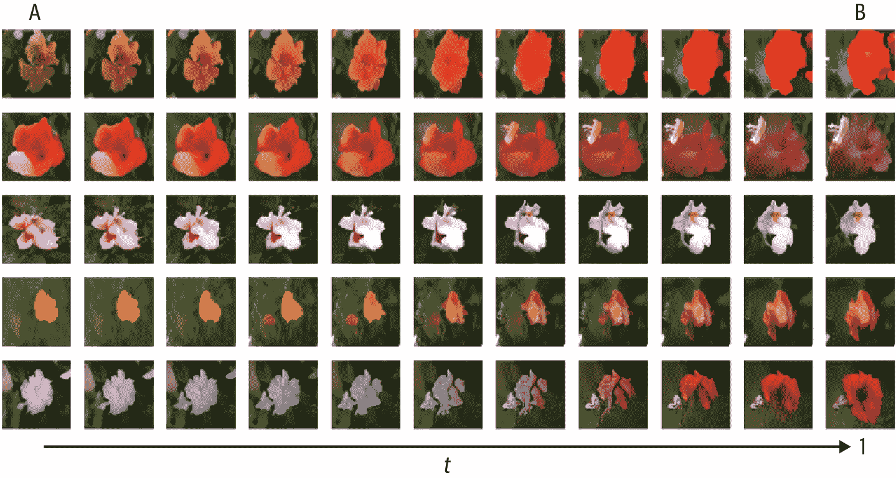

###### 图 8-16。使用去噪扩散模型在图像之间进行插值`  `# 总结

在本章中，我们探索了近期最令人兴奋和有前途的生成建模领域之一：扩散模型。特别是，我们实现了一篇关于生成扩散模型的关键论文（Ho 等人，2020）中介绍的原始去噪扩散概率模型（DDPM）的思想。然后，我们借鉴了去噪扩散隐式模型（DDIM）论文中的思想，使生成过程完全确定性。

我们已经看到扩散模型由前向扩散过程和逆扩散过程组成。 前向扩散过程通过一系列小步骤向训练数据添加噪声，而逆扩散过程包括试图预测添加的噪声的模型。

我们利用重新参数化技巧，以便在前向过程的任何步骤中计算带噪声的图像，而无需经历多个加噪步骤。 我们已经看到，用于向数据添加噪声的参数选择计划在模型的整体成功中起着重要作用。

逆扩散过程由一个 U-Net 参数化，试图在每个时间步预测噪声，给定在该步骤的噪声图像和噪声率。 U-Net 由`DownBlock`组成，它们增加通道数同时减小图像的大小，以及`UpBlock`，它们减少通道数同时增加大小。 噪声率使用正弦嵌入进行编码。

从扩散模型中进行采样是在一系列步骤中进行的。 使用 U-Net 来预测添加到给定噪声图像的噪声，然后用于计算原始图像的估计。 然后使用较小的噪声率重新应用预测的噪声。 从标准高斯噪声分布中随机抽取的随机点开始，重复这个过程一系列步骤（可能明显小于训练过程中使用的步骤数），以获得最终生成。

我们看到，在逆过程中增加扩散步骤的数量会提高图像生成质量，但会降低速度。 我们还执行了潜在空间算术，以在两个图像之间插值。

¹ Jascha Sohl-Dickstein 等，“使用非平衡热力学进行深度无监督学习”，2015 年 3 月 12 日，[*https://arxiv.org/abs/1503.03585*](https://arxiv.org/abs/1503.03585)

² 杨松和 Stefano Ermon，“通过估计数据分布的梯度进行生成建模”，2019 年 7 月 12 日，[*https://arxiv.org/abs/1907.05600*](https://arxiv.org/abs/1907.05600)。

³ 杨松和 Stefano Ermon，“改进训练基于分数的生成模型的技术”，2020 年 6 月 16 日，[*https://arxiv.org/abs/2006.09011*](https://arxiv.org/abs/2006.09011)。

⁴ Jonathon Ho 等，“去噪扩散概率模型”，2020 年 6 月 19 日，[*https://arxiv.org/abs/2006.11239*](https://arxiv.org/abs/2006.11239)。

⁵ Alex Nichol 和 Prafulla Dhariwal，“改进去噪扩散概率模型”，2021 年 2 月 18 日，[*https://arxiv.org/abs/2102.09672*](https://arxiv.org/abs/2102.09672)。

⁶ Ashish Vaswani 等，“注意力就是一切”，2017 年 6 月 12 日，[*https://arxiv.org/abs/1706.03762*](https://arxiv.org/abs/1706.03762)。

⁷ Ben Mildenhall 等，“NeRF：将场景表示为神经辐射场进行视图合成”，2020 年 3 月 1 日，[*https://arxiv.org/abs/2003.08934*](https://arxiv.org/abs/2003.08934)。

⁸ Kaiming He 等，“用于图像识别的深度残差学习”，2015 年 12 月 10 日，[*https://arxiv.org/abs/1512.03385*](https://arxiv.org/abs/1512.03385)。

⁹ 宋嘉明等，“去噪扩散隐式模型”，2020 年 10 月 6 日，[*https://arxiv.org/abs/2010.02502*](https://arxiv.org/abs/2010.02502)`
