# 第十章：高级 GANs

第四章介绍了生成对抗网络（GANs），这是一类生成模型，在各种图像生成任务中取得了最先进的结果。模型架构和训练过程的灵活性导致学术界和深度学习从业者找到了设计和训练 GAN 的新方法，从而产生了许多不同的高级架构，我们将在本章中探讨。

# 介绍

详细解释所有 GAN 发展及其影响可能需要另一本书。GitHub 上的[GAN Zoo 代码库](https://oreil.ly/Oy6bR)包含了 500 多个不同的 GAN 示例，涵盖了从 ABC-GAN 到 ZipNet-GAN 的各种 GAN，并附有相关论文链接！

在本章中，我们将介绍对该领域产生影响的主要 GANs，包括对每个模型的模型架构和训练过程的详细解释。

我们将首先探讨 NVIDIA 推动图像生成边界的三个重要模型：ProGAN、StyleGAN 和 StyleGAN2。我们将对每个模型进行足够详细的分析，以理解支撑架构的基本概念，并看看它们如何各自建立在早期论文的想法基础上。

我们还将探讨另外两种重要的 GAN 架构，包括引入注意力机制的 Self-Attention GAN（SAGAN）和 BigGAN，后者在 SAGAN 论文中的许多想法基础上构建。我们已经在第九章中看到了注意力机制在变换器中的威力。

最后，我们将介绍 VQ-GAN 和 ViT VQ-GAN，它们融合了变分自动编码器、变换器和 GAN 的思想。VQ-GAN 是谷歌最先进的文本到图像生成模型 Muse 的关键组成部分。我们将在第十三章中更详细地探讨所谓的多模型。

# 训练您自己的模型

为了简洁起见，我选择不在本书的代码库中直接构建这些模型的代码，而是将尽可能指向公开可用的实现，以便您可以根据需要训练自己的版本。

# ProGAN

ProGAN 是 NVIDIA 实验室在 2017 年开发的一种技术，旨在提高 GAN 训练的速度和稳定性。ProGAN 论文建议，不要立即在全分辨率图像上训练 GAN，而是首先在低分辨率图像（例如 4×4 像素）上训练生成器和鉴别器，然后在训练过程中逐步添加层以增加分辨率。

让我们更详细地了解*渐进式训练*的概念。

# 训练您自己的 ProGAN

Bharath K 在[Paperspace 博客](https://oreil.ly/b2CJm)上提供了一个关于使用 Keras 训练自己的 ProGAN 的优秀教程。请记住，训练 ProGAN 以达到论文中的结果需要大量的计算能力。

## 渐进式训练

与 GANs 一样，我们构建两个独立的网络，生成器和鉴别器，在训练过程中进行统治之争。

在普通的 GAN 中，生成器总是输出全分辨率图像，即使在训练的早期阶段也是如此。可以合理地认为，这种策略可能不是最佳的——生成器可能在训练的早期阶段学习高级结构较慢，因为它立即在复杂的高分辨率图像上操作。首先训练一个轻量级的 GAN 以输出准确的低分辨率图像，然后逐渐增加分辨率，这样做会更好吗？

这个简单的想法引导我们进入*渐进式训练*，这是 ProGAN 论文的一个关键贡献。ProGAN 分阶段训练，从一个已经通过插值压缩到 4×4 像素图像的训练集开始，如图 10-1 所示。

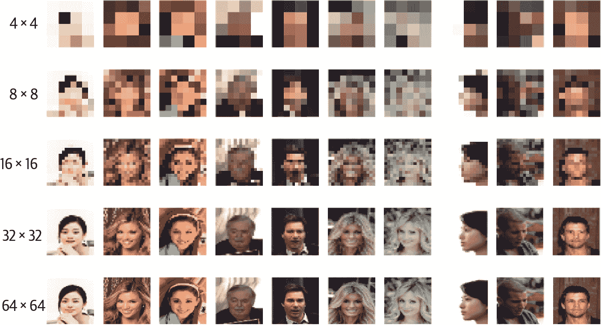

###### 图 10-1。数据集中的图像可以使用插值压缩到较低分辨率

然后，我们可以最初训练生成器，将潜在输入噪声向量<math alttext="z"><mi>z</mi></math>（比如长度为 512）转换为形状为 4×4×3 的图像。匹配的鉴别器需要将大小为 4×4×3 的输入图像转换为单个标量预测。这第一步的网络架构如图 10-2 所示。

生成器中的蓝色框表示将特征图转换为 RGB 图像的卷积层（`toRGB`），鉴别器中的蓝色框表示将 RGB 图像转换为一组特征图的卷积层（`fromRGB`）。

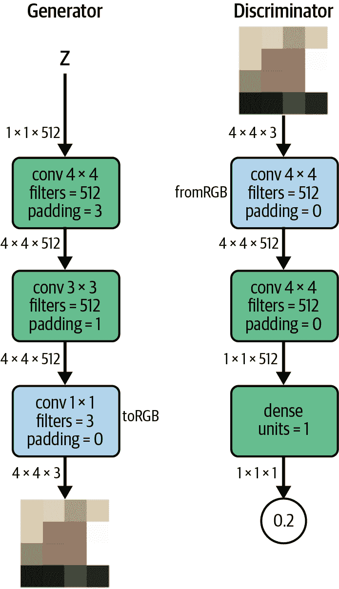

###### 图 10-2。ProGAN 训练过程的第一阶段的生成器和鉴别器架构

在论文中，作者训练这对网络，直到鉴别器看到了 800,000 张真实图像。现在我们需要了解如何扩展生成器和鉴别器以处理 8×8 像素图像。

为了扩展生成器和鉴别器，我们需要融入额外的层。这在两个阶段中进行，过渡和稳定，如图 10-3 所示。

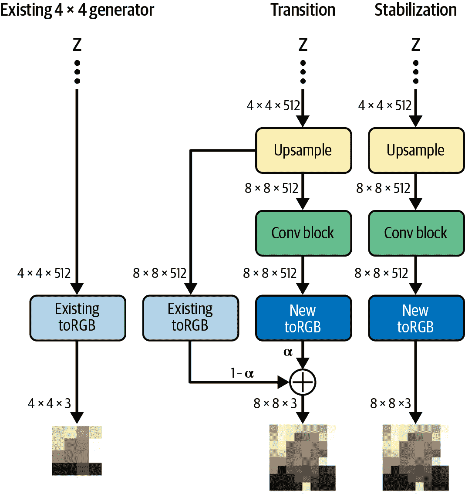

###### 图 10-3。ProGAN 生成器训练过程，将网络从 4×4 图像扩展到 8×8（虚线代表网络的其余部分，未显示）

让我们首先看一下生成器。在*过渡阶段*中，新的上采样和卷积层被附加到现有网络中，建立了一个残差连接以保持现有训练过的`toRGB`层的输出。关键的是，新层最初使用一个参数<math alttext="alpha"><mi>α</mi></math>进行掩蔽，该参数在整个过渡阶段逐渐从 0 增加到 1，以允许更多新的`toRGB`输出通过，减少现有的`toRGB`层。这是为了避免网络在新层接管时出现*冲击*。

最终，旧的`toRGB`层不再有输出流，网络进入*稳定阶段*——进一步的训练期间，网络可以微调输出，而不经过旧的`toRGB`层。

鉴别器使用类似的过程，如图 10-4 所示。

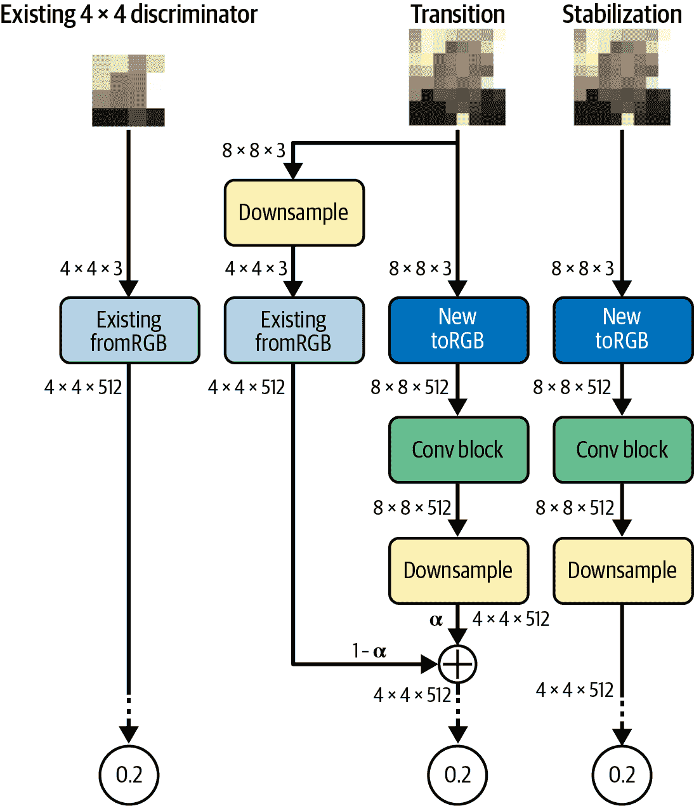

###### 图 10-4。ProGAN 鉴别器训练过程，将网络从 4×4 图像扩展到 8×8（虚线代表网络的其余部分，未显示）

在这里，我们需要融入额外的降采样和卷积层。同样，这些层被注入到网络中——这次是在网络的开始部分，就在输入图像之后。现有的`fromRGB`层通过残差连接连接，并在过渡阶段逐渐淡出，随着新层在过渡阶段接管时逐渐淡出。稳定阶段允许鉴别器使用新层进行微调。

所有过渡和稳定阶段持续到鉴别器已经看到了 800,000 张真实图像。请注意，即使网络是渐进训练的，也没有层被*冻结*。在整个训练过程中，所有层都保持完全可训练。

这个过程继续进行，将 GAN 从 4×4 图像扩展到 8×8，然后 16×16，32×32，依此类推，直到达到完整分辨率（1,024×1,024），如图 10-5 所示。

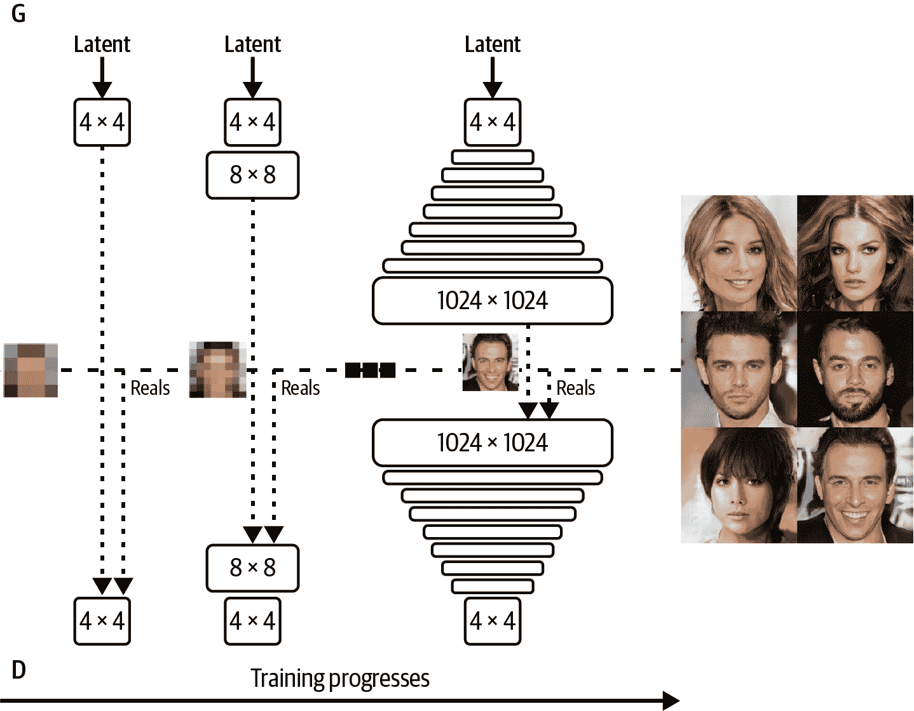

###### 图 10-5。ProGAN 训练机制，以及一些示例生成的人脸（来源：[Karras 等人，2017](https://arxiv.org/abs/1710.10196)）

完整渐进训练过程完成后，生成器和鉴别器的整体结构如图 10-6 所示。

###### 图 10-6\. 用于生成 1,024×1,024 像素 CelebA 面孔的 ProGAN 生成器和鉴别器的结构（来源：[Karras 等人，2018](https://arxiv.org/abs/1812.04948))

该论文还提出了其他几个重要贡献，即小批量标准差、均衡学习率和像素级归一化，以下部分将简要描述。

### 小批量标准差

*小批量标准差*层是鉴别器中的额外层，附加了特征值的标准差，跨所有像素和整个小批量平均作为额外（常数）特征。这有助于确保生成器在输出中创建更多的变化——如果整个小批量中的变化较小，则标准差将很小，鉴别器可以使用此特征来区分假批次和真实批次！因此，生成器被激励确保它生成与真实训练数据中存在的变化量相似的数量。

### 均衡学习率

ProGAN 中的所有全连接和卷积层都使用*均衡学习率*。通常，神经网络中的权重是使用诸如*He 初始化*之类的方法进行初始化的——这是一个高斯分布，其标准差被缩放为与层的输入数量的平方根成反比。这样，具有更多输入的层将使用与零的偏差较小的权重进行初始化，通常会提高训练过程的稳定性。

ProGAN 论文的作者发现，当与 Adam 或 RMSProp 等现代优化器结合使用时，这会导致问题。这些方法会对每个权重的梯度更新进行归一化，使得更新的大小与权重的规模（幅度）无关。然而，这意味着具有较大动态范围（即具有较少输入的层）的权重将比具有较小动态范围（即具有更多输入的层）的权重需要更长时间来调整。发现这导致了 ProGAN 中生成器和鉴别器不同层的训练速度之间的不平衡，因此他们使用*均衡学习率*来解决这个问题。

在 ProGAN 中，权重使用简单的标准高斯进行初始化，而不管层的输入数量如何。归一化是动态应用的，作为对层的调用的一部分，而不仅仅是在初始化时。这样，优化器会将每个权重视为具有大致相同的动态范围，因此会应用相同的学习率。只有在调用层时，权重才会按照 He 初始化器的因子进行缩放。

### 像素级归一化

最后，在 ProGAN 中，生成器中使用*像素级归一化*，而不是批归一化。这将每个像素中的特征向量归一化为单位长度，并有助于防止信号在网络中传播时失控。像素级归一化层没有可训练的权重。

## 输出

除 CelebA 数据集外，ProGAN 还应用于大规模场景理解（LSUN）数据集的图像，并取得了出色的结果，如图 10-7 所示。这展示了 ProGAN 相对于早期 GAN 架构的强大之处，并为未来的迭代（如 StyleGAN 和 StyleGAN2）铺平了道路，我们将在接下来的部分中探讨。

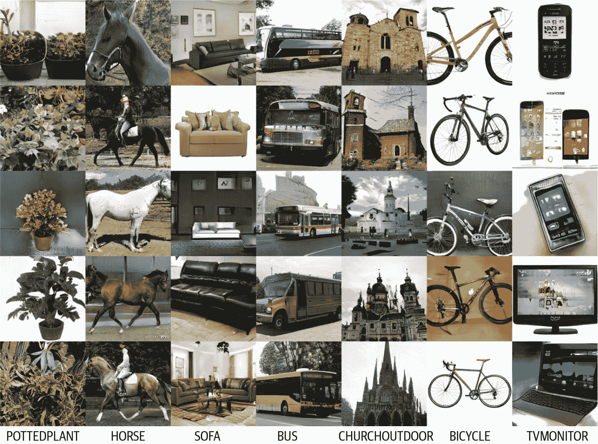

###### 图 10-7\. 在 LSUN 数据集上渐进训练的 ProGAN 生成的示例，分辨率为 256×256（来源：[Karras 等人，2017](https://arxiv.org/abs/1710.10196)）

# StyleGAN

StyleGAN³是 2018 年的一个 GAN 架构，建立在 ProGAN 论文中的早期思想基础上。实际上，鉴别器是相同的；只有生成器被改变。

通常在训练 GAN 时，很难将潜在空间中对应于高级属性的向量分离出来——它们经常是*纠缠在一起*，这意味着调整潜在空间中的图像以使脸部更多雀斑，例如，可能也会无意中改变背景颜色。虽然 ProGAN 生成了极其逼真的图像，但它也不例外。我们理想情况下希望完全控制图像的风格，这需要在潜在空间中对特征进行分离。

StyleGAN 通过在网络的不同点显式注入风格向量来实现这一点：一些控制高级特征（例如，面部方向）的向量，一些控制低级细节（例如，头发如何落在额头上）的向量。

StyleGAN 生成器的整体架构如图 10-8 所示。让我们逐步走过这个架构，从映射网络开始。

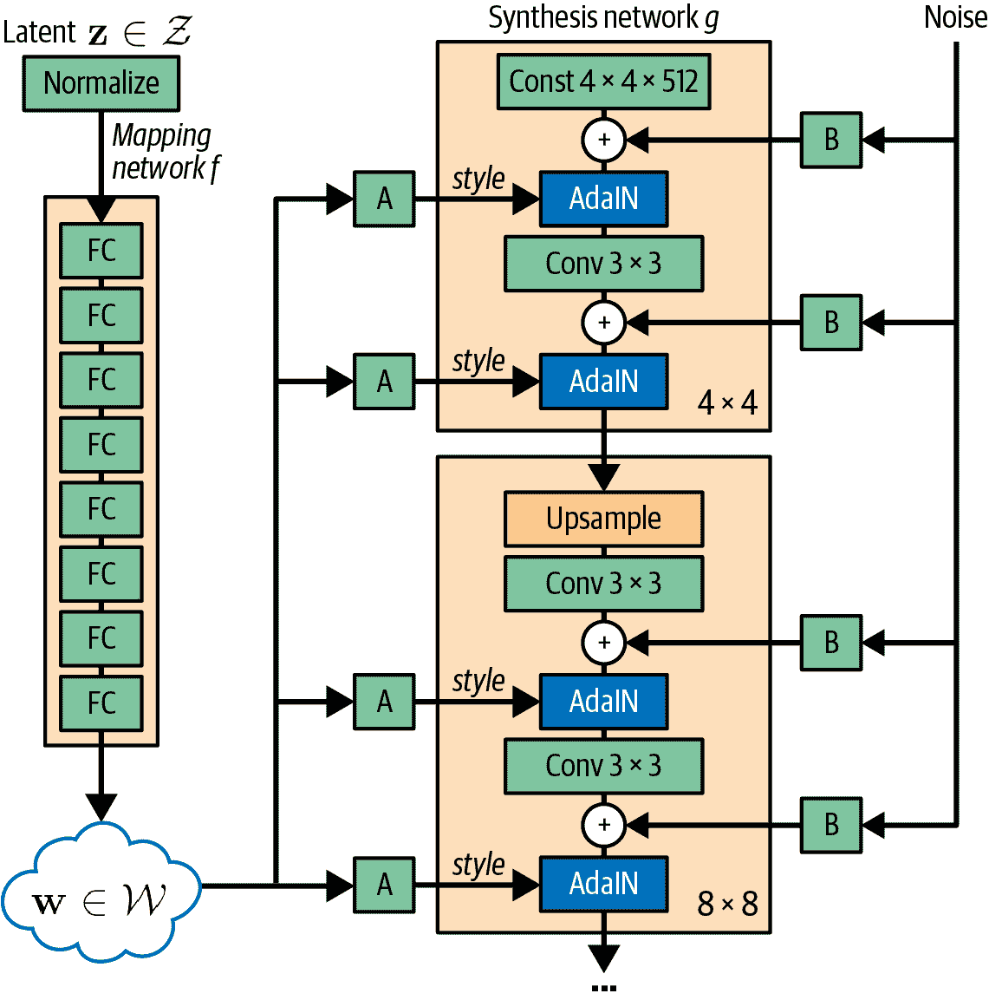

###### 图 10-8。StyleGAN 生成器架构（来源：[Karras et al., 2018](https://arxiv.org/abs/1812.04948)）

# 训练您自己的 StyleGAN

Soon-Yau Cheong 在[Keras 网站](https://oreil.ly/MooSe)上提供了一个关于使用 Keras 训练自己的 StyleGAN 的优秀教程。请记住，要实现论文中的结果，训练 StyleGAN 需要大量的计算资源。

## 映射网络

*映射网络* <math alttext="f"><mi>f</mi></math> 是一个简单的前馈网络，将输入噪声 <math alttext="bold z element-of script upper Z"><mrow><mi>𝐳</mi> <mo>∈</mo> <mi>𝒵</mi></mrow></math> 转换为不同的潜在空间 <math alttext="bold w element-of script upper W"><mrow><mi>𝐰</mi> <mo>∈</mo> <mi>𝒲</mi></mrow></math>。这使得生成器有机会将嘈杂的输入向量分解为不同的变化因素，这些因素可以被下游的风格生成层轻松捕捉到。

这样做的目的是将图像的风格选择过程（映射网络）与生成具有给定风格的图像的过程（合成网络）分开。

## 合成网络

合成网络是生成具有给定风格的实际图像的生成器，由映射网络提供。如图 10-8 所示，风格向量 <math alttext="bold w"><mi>𝐰</mi></math> 被注入到合成网络的不同点，每次通过不同的密集连接层 <math alttext="upper A Subscript i"><msub><mi>A</mi> <mi>i</mi></msub></math>，生成两个向量：一个偏置向量 <math alttext="bold y Subscript b comma i"><msub><mi>𝐲</mi> <mrow><mi>b</mi><mo>,</mo><mi>i</mi></mrow></msub></math> 和一个缩放向量 <math alttext="bold y Subscript s comma i"><msub><mi>𝐲</mi> <mrow><mi>s</mi><mo>,</mo><mi>i</mi></mrow></msub></math>。这些向量定义了应该在网络中的这一点注入的特定风格，也就是告诉合成网络如何调整特征图以使生成的图像朝着指定的风格方向移动。

通过*自适应实例归一化*（AdaIN）层实现这种调整。

### 自适应实例归一化

AdaIN 层是一种神经网络层，通过参考风格偏差<math alttext="bold y Subscript b comma i"><msub><mi>𝐲</mi> <mrow><mi>b</mi><mo>,</mo><mi>i</mi></mrow></msub></math>和比例<math alttext="bold y Subscript s comma i"><msub><mi>𝐲</mi> <mrow><mi>s</mi><mo>,</mo><mi>i</mi></mrow></msub></math>调整每个特征图<math alttext="bold x Subscript i"><msub><mi>𝐱</mi> <mi>i</mi></msub></math>的均值和方差。这两个向量的长度等于合成网络中前一卷积层输出的通道数。自适应实例归一化的方程如下：

<math alttext="StartLayout 1st Row  AdaIN left-parenthesis bold x Subscript i Baseline comma bold y right-parenthesis equals bold y Subscript s comma i Baseline StartFraction bold x Subscript i Baseline minus mu left-parenthesis bold x Subscript i Baseline right-parenthesis Over sigma left-parenthesis bold x Subscript i Baseline right-parenthesis EndFraction plus bold y Subscript b comma i Baseline EndLayout" display="block"><mtable displaystyle="true"><mtr><mtd columnalign="right"><mrow><mtext>AdaIN</mtext> <mrow><mo>(</mo> <msub><mi>𝐱</mi> <mi>i</mi></msub> <mo>,</mo> <mi>𝐲</mi> <mo>)</mo></mrow> <mo>=</mo> <msub><mi>𝐲</mi> <mrow><mi>s</mi><mo>,</mo><mi>i</mi></mrow></msub> <mfrac><mrow><msub><mi>𝐱</mi> <mi>i</mi></msub> <mo>-</mo><mi>μ</mi><mrow><mo>(</mo><msub><mi>𝐱</mi> <mi>i</mi></msub> <mo>)</mo></mrow></mrow> <mrow><mi>σ</mi><mo>(</mo><msub><mi>𝐱</mi> <mi>i</mi></msub> <mo>)</mo></mrow></mfrac> <mo>+</mo> <msub><mi>𝐲</mi> <mrow><mi>b</mi><mo>,</mo><mi>i</mi></mrow></msub></mrow></mtd></mtr></mtable></math>

自适应实例归一化层确保注入到每一层的风格向量只影响该层的特征，防止任何风格信息在层之间泄漏。作者表明，这导致潜在向量<math alttext="bold w"><mi>𝐰</mi></math>比原始<math alttext="bold z"><mi>𝐳</mi></math>向量更具解耦性。

由于合成网络基于 ProGAN 架构，因此是逐步训练的。在合成网络中较早层的风格向量（当图像分辨率最低时为 4×4、8×8）将影响比网络后期（64×64 到 1,024×1,024 像素分辨率）更粗糙的特征。这意味着我们不仅可以通过潜在向量<math alttext="bold w"><mi>𝐰</mi></math>完全控制生成的图像，还可以在合成网络的不同点切换<math alttext="bold w"><mi>𝐰</mi></math>向量以改变各种细节级别的风格。

### 风格混合

作者使用一种称为*风格混合*的技巧，确保生成器在训练过程中不能利用相邻风格之间的相关性（即，每层注入的风格尽可能解耦）。不仅仅是采样单个潜在向量<math alttext="bold z"><mi>𝐳</mi></math>，而是采样两个<math alttext="left-parenthesis bold z bold 1 comma bold z bold 2 right-parenthesis"><mrow><mo>(</mo> <msub><mi>𝐳</mi> <mn mathvariant="bold">1</mn></msub> <mo>,</mo> <msub><mi>𝐳</mi> <mn mathvariant="bold">2</mn></msub> <mo>)</mo></mrow></math>，对应两个风格向量<math alttext="left-parenthesis bold w bold 1 comma bold w bold 2 right-parenthesis"><mrow><mo>(</mo> <msub><mi>𝐰</mi> <mn mathvariant="bold">1</mn></msub> <mo>,</mo> <msub><mi>𝐰</mi> <mn mathvariant="bold">2</mn></msub> <mo>)</mo></mrow></math>。然后，在每一层，随机选择<math alttext="left-parenthesis bold w bold 1"><mrow><mo>(</mo> <msub><mi>𝐰</mi> <mn mathvariant="bold">1</mn></msub></mrow></math>或<math alttext="bold w bold 2 right-parenthesis"><mrow><msub><mi>𝐰</mi> <mn mathvariant="bold">2</mn></msub> <mrow><mo>)</mo></mrow></mrow></math>，以打破可能存在的向量之间的任何相关性。

### 随机变化

合成器网络在每个卷积后添加噪音（通过一个学习的广播层<math alttext="upper B"><mi>B</mi></math>传递），以考虑诸如单个头发的放置或面部背后的背景等随机细节。再次强调，噪音注入的深度会影响对图像的影响粗糙程度。

这也意味着合成网络的初始输入可以简单地是一个学习到的常量，而不是额外的噪音。在风格输入和噪音输入中已经存在足够的随机性，以生成图像的足够变化。

## StyleGAN 的输出

图 10-9 展示了 StyleGAN 的工作原理。

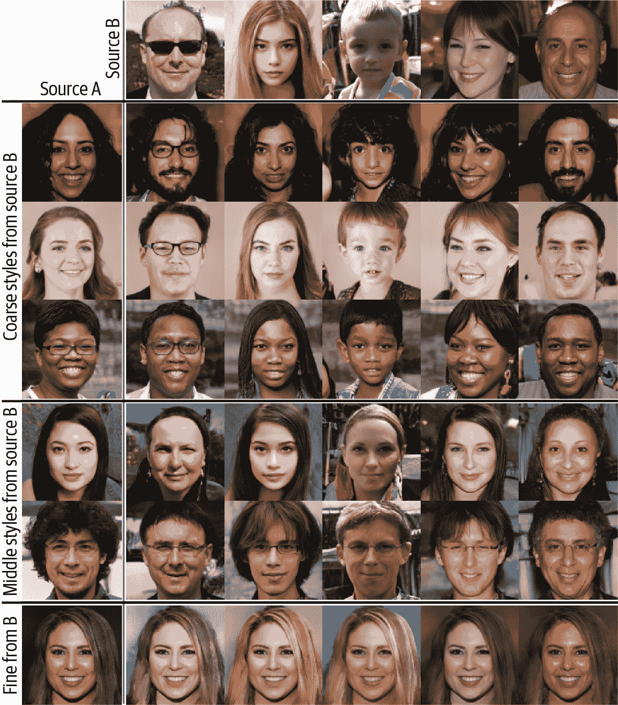

###### 图 10-9. 在不同细节级别上合并两个生成图像的风格（来源：[Karras 等人，2018](https://arxiv.org/abs/1812.04948)）

这里，两个图像，源 A 和源 B，是从两个不同的 <math alttext="bold w"><mi>𝐰</mi></math> 向量生成的。为了生成一个合并的图像，源 A 的 <math alttext="bold w"><mi>𝐰</mi></math> 向量通过合成网络，但在某个时刻，被切换为源 B 的 <math alttext="bold w"><mi>𝐰</mi></math> 向量。如果这个切换发生得很早（4 × 4 或 8 × 8 分辨率），则从源 B 传递到源 A 的是粗略的风格，如姿势、脸型和眼镜。然而，如果切换发生得更晚，只有来自源 B 的细粒度细节被传递，比如脸部的颜色和微结构，而来自源 A 的粗略特征被保留。

# StyleGAN2

在这一系列重要的 GAN 论文中的最终贡献是 StyleGAN2。这进一步构建在 StyleGAN 架构之上，通过一些关键改变提高了生成输出的质量。特别是，StyleGAN2 生成不会像 *伪影* 那样受到严重影响——在 StyleGAN 中发现的图像中的水滴状区域，这些伪影是由于 StyleGAN 中的自适应实例归一化层引起的，如 图 10-10 所示。

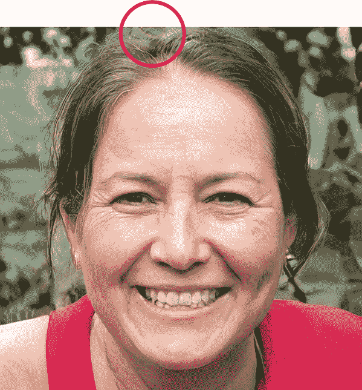

###### 图 10-10\. 一个 StyleGAN 生成的人脸图像中的伪影（来源：[Karras et al., 2019](https://arxiv.org/abs/1912.04958)）

StyleGAN2 中的生成器和鉴别器与 StyleGAN 不同。在接下来的章节中，我们将探讨这两种架构之间的关键区别。

# 训练您自己的 StyleGAN2

使用 TensorFlow 训练您自己的 StyleGAN 的官方代码可在 [GitHub](https://oreil.ly/alB6w) 上找到。请注意，为了实现论文中的结果，训练一个 StyleGAN2 需要大量的计算资源。

## 权重调制和去调制

通过删除生成器中的 AdaIN 层并将其替换为权重调制和去调制步骤，解决了伪影问题，如 图 10-11 所示。 <math alttext="bold w"><mi>𝐰</mi></math> 代表卷积层的权重，在 StyleGAN2 中通过调制和去调制步骤直接在运行时更新。相比之下，StyleGAN 的 AdaIN 层在图像张量通过网络时操作。

StyleGAN 中的 AdaIN 层只是一个实例归一化，后面跟着样式调制（缩放和偏置）。StyleGAN2 中的想法是在运行时直接将样式调制和归一化（去调制）应用于卷积层的权重，而不是卷积层的输出，如 图 10-11 所示。作者展示了这如何消除了伪影问题，同时保持对图像样式的控制。

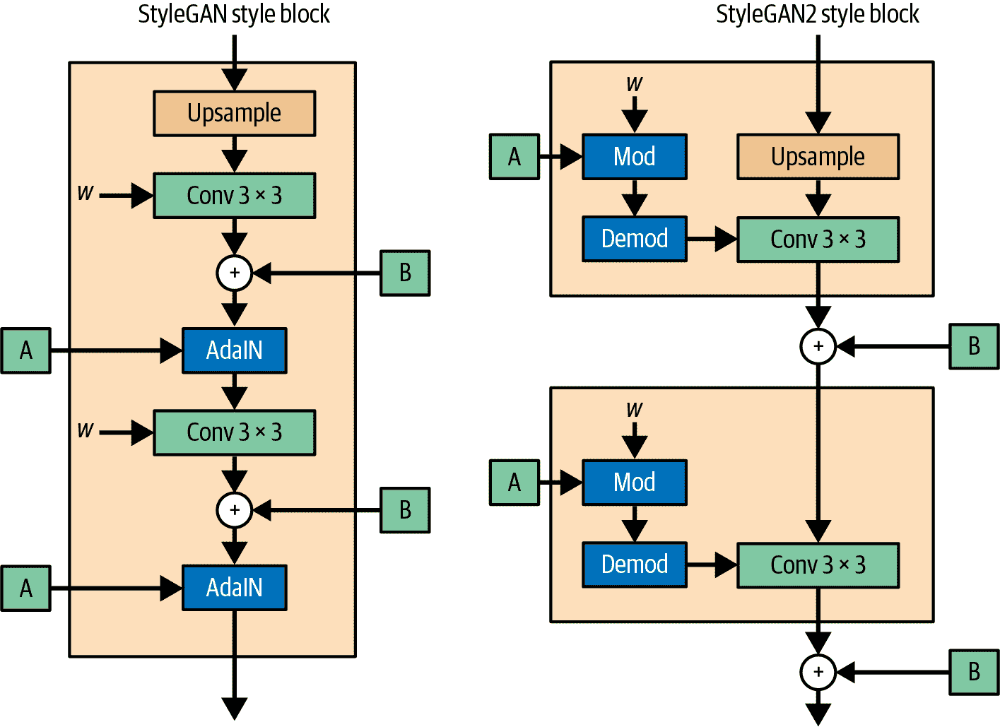

###### 图 10-11\. StyleGAN 和 StyleGAN2 样式块之间的比较

在 StyleGAN2 中，每个密集层 <math alttext="upper A"><mi>A</mi></math> 输出一个单一的样式向量 <math alttext="s Subscript i"><msub><mi>s</mi> <mi>i</mi></msub></math>，其中 <math alttext="i"><mi>i</mi></math> 索引了相应卷积层中的输入通道数。然后将这个样式向量应用于卷积层的权重，如下所示：

<math alttext="w Subscript i comma j comma k Superscript prime Baseline equals s Subscript i Baseline dot w Subscript i comma j comma k" display="block"><mrow><msubsup><mi>w</mi> <mrow><mi>i</mi><mo>,</mo><mi>j</mi><mo>,</mo><mi>k</mi></mrow> <msup><mo>'</mo></msup></msubsup> <mo>=</mo> <msub><mi>s</mi> <mi>i</mi></msub> <mo>·</mo> <msub><mi>w</mi> <mrow><mi>i</mi><mo>,</mo><mi>j</mi><mo>,</mo><mi>k</mi></mrow></msub></mrow></math>

这里，<math alttext="j"><mi>j</mi></math> 索引了层的输出通道，<math alttext="k"><mi>k</mi></math> 索引了空间维度。这是过程的 *调制* 步骤。

然后，我们需要归一化权重，使它们再次具有单位标准差，以确保训练过程的稳定性。这是 *去调制* 步骤：

<math alttext="w Subscript i comma j comma k Superscript double-prime Baseline equals StartFraction w Subscript i comma j comma k Superscript prime Baseline Over StartRoot sigma-summation Underscript i comma k Endscripts w Subscript i comma j comma k Superscript prime Baseline squared plus epsilon EndRoot EndFraction" display="block"><mrow><msubsup><mi>w</mi> <mrow><mi>i</mi><mo>,</mo><mi>j</mi><mo>,</mo><mi>k</mi></mrow> <msup><mrow><mo>'</mo><mo>'</mo></mrow></msup></msubsup> <mo>=</mo> <mfrac><msubsup><mi>w</mi> <mrow><mi>i</mi><mo>,</mo><mi>j</mi><mo>,</mo><mi>k</mi></mrow> <msup><mo>'</mo></msup></msubsup> <msqrt><mrow><munder><mo>∑</mo> <mrow><mi>i</mi><mo>,</mo><mi>k</mi></mrow></munder> <msup><mrow><msubsup><mi>w</mi> <mrow><mi>i</mi><mo>,</mo><mi>j</mi><mo>,</mo><mi>k</mi></mrow> <msup><mo>'</mo></msup></msubsup></mrow> <mn>2</mn></msup> <mo>+</mo><mi>ε</mi></mrow></msqrt></mfrac></mrow></math>

其中 <math alttext="epsilon"><mi>ϵ</mi></math> 是一个小的常数值，用于防止除以零。

在论文中，作者展示了这个简单的改变足以防止水滴状伪影，同时通过样式向量保持对生成图像的控制，并确保输出的质量保持高水平。

## 路径长度正则化

StyleGAN 架构的另一个变化是在损失函数中包含了额外的惩罚项——*这被称为路径长度正则化*。

我们希望潜在空间尽可能平滑和均匀，这样在任何方向上潜在空间中的固定大小步长会导致图像的固定幅度变化。

为了鼓励这一属性，StyleGAN2 旨在最小化以下术语，以及通常的 Wasserstein 损失和梯度惩罚：

<math alttext="double-struck upper E Subscript w comma y Baseline left-parenthesis parallel-to bold upper J Subscript w Superscript down-tack Baseline y parallel-to Subscript 2 Baseline minus a right-parenthesis squared" display="block"><mrow><msub><mi>𝔼</mi> <mrow><mi>𝑤</mi><mo>,</mo><mi>𝑦</mi></mrow></msub> <msup><mfenced separators="" open="(" close=")"><msub><mfenced separators="" open="∥" close="∥"><msubsup><mi>𝐉</mi> <mi>𝑤</mi> <mi>⊤</mi></msubsup> <mi>𝑦</mi></mfenced> <mn>2</mn></msub> <mo>-</mo><mi>a</mi></mfenced> <mn>2</mn></msup></mrow></math>

在这里，<math alttext="w"><mi>𝑤</mi></math>是由映射网络创建的一组样式向量，<math alttext="y"><mi>𝑦</mi></math>是从<math alttext="script upper N left-parenthesis 0 comma bold upper I right-parenthesis"><mrow><mi>𝒩</mi> <mo>(</mo> <mn>0</mn> <mo>,</mo> <mi>𝐈</mi> <mo>)</mo></mrow></math>中绘制的一组嘈杂图像，<math alttext="bold upper J Subscript w Baseline equals StartFraction normal partial-differential g Over normal partial-differential w EndFraction"><mrow><msub><mi>𝐉</mi> <mi>𝑤</mi></msub> <mo>=</mo> <mfrac><mrow><mi>∂</mi><mi>g</mi></mrow> <mrow><mi>∂</mi><mi>𝑤</mi></mrow></mfrac></mrow></math>是生成器网络相对于样式向量的雅可比矩阵。

术语<math alttext="parallel-to bold upper J Subscript w Superscript down-tack Baseline y parallel-to Subscript 2"><msub><mfenced separators="" open="∥" close="∥"><msubsup><mi>𝐉</mi> <mi>𝑤</mi> <mi>⊤</mi></msubsup> <mi>𝑦</mi></mfenced> <mn>2</mn></msub></math>测量了经雅可比矩阵给出的梯度变换后图像<math alttext="y"><mi>𝑦</mi></math>的幅度。我们希望这个值接近一个常数<math alttext="a"><mi>a</mi></math>，这个常数是动态计算的，作为训练进行时<math alttext="parallel-to bold upper J Subscript w Superscript down-tack Baseline y parallel-to Subscript 2"><msub><mfenced separators="" open="∥" close="∥"><msubsup><mi>𝐉</mi> <mi>𝑤</mi> <mi>⊤</mi></msubsup> <mi>𝑦</mi></mfenced> <mn>2</mn></msub></math>的指数移动平均值。

作者发现，这个额外的术语使探索潜在空间更可靠和一致。此外，损失函数中的正则化项仅在每 16 个小批次中应用一次，以提高效率。这种技术称为*懒惰正则化*，不会导致性能的明显下降。

## 没有渐进增长

StyleGAN2 训练的另一个重大更新是在训练方式上。StyleGAN2 不再采用通常的渐进式训练机制，而是利用生成器中的跳过连接和鉴别器中的残差连接来将整个网络作为一个整体进行训练。它不再需要独立训练不同分辨率，并将其作为训练过程的一部分混合。

图 10-12 展示了 StyleGAN2 中的生成器和鉴别器块。

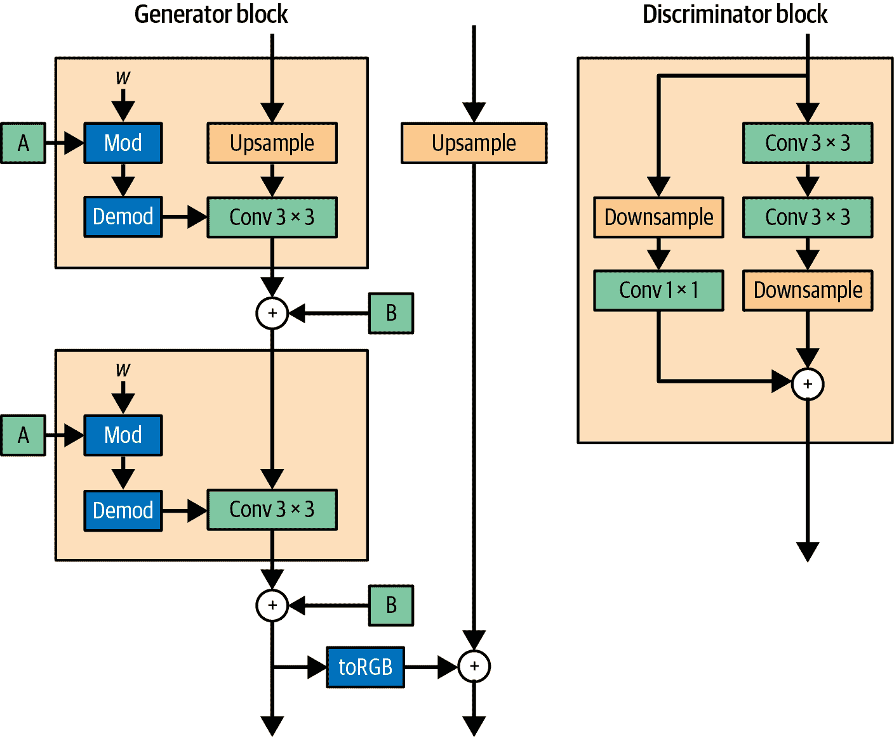

###### 图 10-12。StyleGAN2 中的生成器和鉴别器块

我们希望能够保留的关键属性是，StyleGAN2 从学习低分辨率特征开始，并随着训练的进行逐渐完善输出。作者表明，使用这种架构确实保留了这一属性。在训练的早期阶段，每个网络都受益于在较低分辨率层中细化卷积权重，而通过跳过和残差连接将输出传递到较高分辨率层的方式基本上不受影响。随着训练的进行，较高分辨率层开始占主导地位，因为生成器发现了更复杂的方法来改善图像的逼真度，以欺骗鉴别器。这个过程在图 10-13 中展示。

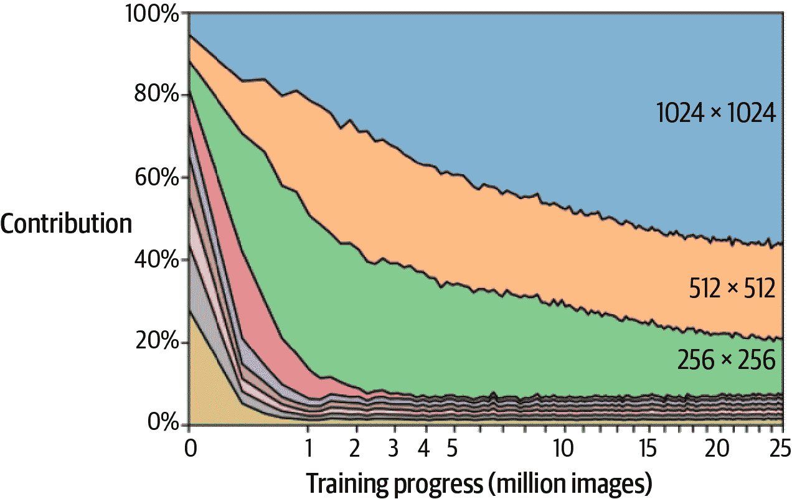

###### 图 10-13。每个分辨率层对生成器输出的贡献，按训练时间（改编自[Karras 等人，2019](https://arxiv.org/pdf/1912.04958.pdf)）

## StyleGAN2 的输出

一些 StyleGAN2 输出的示例显示在图 10-14 中。迄今为止，StyleGAN2 架构（以及诸如 StyleGAN-XL 这样的扩展变体）仍然是 Flickr-Faces-HQ（FFHQ）和 CIFAR-10 等数据集上图像生成的最先进技术，根据基准网站[Papers with Code](https://oreil.ly/VwH2r)。

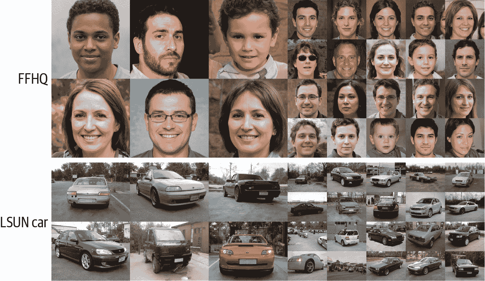

###### 图 10-14。FFHQ 人脸数据集和 LSUN 汽车数据集的未筛选 StyleGAN2 输出（来源：[Karras 等人，2019](https://arxiv.org/pdf/1912.04958.pdf))

# 其他重要的 GAN

在这一部分中，我们将探讨另外两种架构，它们也对 GAN 的发展做出了重大贡献——SAGAN 和 BigGAN。

## 自注意力生成对抗网络（SAGAN）

自注意力生成对抗网络（SAGAN）是 GAN 的一个重要发展，因为它展示了如何将驱动序列模型（如 Transformer）的注意机制也纳入到基于 GAN 的图像生成模型中。图 10-15 展示了介绍这种架构的论文中的自注意力机制。

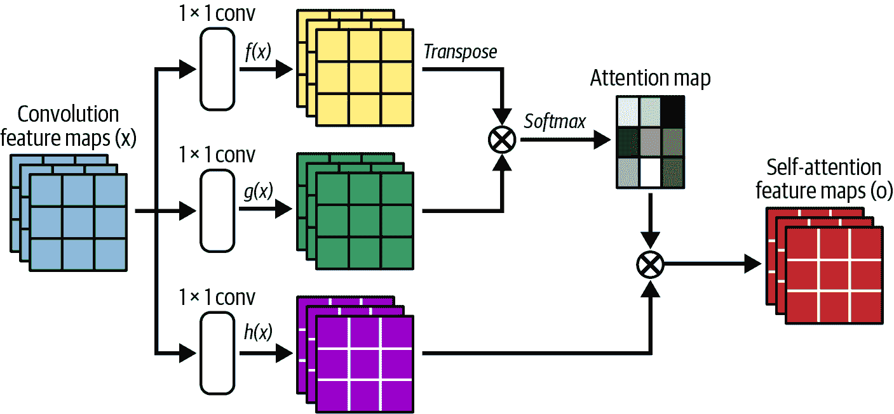

###### 图 10-15。SAGAN 模型中的自注意机制（来源：[Zhang 等人，2018](https://arxiv.org/abs/1805.08318)）

不包含注意力的基于 GAN 的模型的问题在于，卷积特征图只能在局部处理信息。连接图像一侧的像素信息到另一侧需要多个卷积层，这会减小图像的尺寸，同时增加通道数。在这个过程中，精确的位置信息会被减少，以捕捉更高级的特征，这使得模型学习远距离像素之间的长距离依赖性变得计算上低效。SAGAN 通过将我们在本章前面探讨过的注意力机制纳入到 GAN 中来解决这个问题。这种包含的效果在图 10-16 中展示。

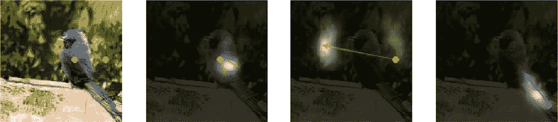

###### 图 10-16。SAGAN 生成的一幅鸟的图像（最左侧单元格）以及由最终基于注意力的生成器层生成的像素的注意力图（右侧单元格）（来源：[Zhang 等人，2018](https://arxiv.org/abs/1805.08318))

红点是鸟身体的一部分，因此注意力自然地集中在周围的身体细胞上。绿点是背景的一部分，这里注意力实际上集中在鸟头的另一侧，即其他背景像素上。蓝点是鸟的长尾的一部分，因此注意力集中在其他尾部像素上，其中一些与蓝点相距较远。对于没有注意力的像素来说，尤其是对于图像中的长、细结构（例如这种情况下的尾巴），要维持这种长距离依赖性将会很困难。

# 训练您自己的 SAGAN

使用 TensorFlow 训练自己的 SAGAN 的官方代码可在[GitHub](https://oreil.ly/rvej0)上找到。请注意，要实现论文中的结果，训练 SAGAN 需要大量的计算资源。

## BigGAN

BigGAN，由 DeepMind 开发，扩展了 SAGAN 论文中的思想。图 10-17 展示了一些由 BigGAN 生成的图像，该模型在 ImageNet 数据集上进行了训练，分辨率为 128×128。

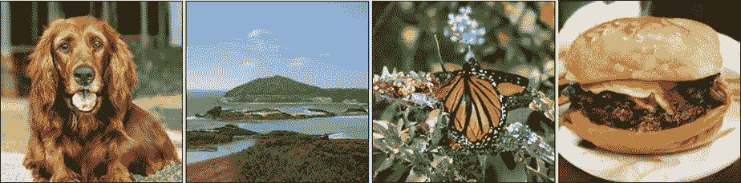

###### 图 10-17。由 BigGAN 生成的图像示例（来源：[Brock 等人，2018](https://arxiv.org/abs/1809.11096))

除了对基本 SAGAN 模型进行一些增量更改外，论文中还概述了将模型提升到更高层次的几项创新。其中一项创新是所谓的“截断技巧”。这是指用于采样的潜在分布与训练期间使用的 <math alttext="z tilde script upper N left-parenthesis 0 comma bold upper I right-parenthesis"><mrow><mi>z</mi> <mo>∼</mo> <mi>𝒩</mi> <mo>(</mo> <mn>0</mn> <mo>,</mo> <mi>𝐈</mi> <mo>)</mo></mrow></math> 分布不同。具体来说，采样期间使用的分布是“截断正态分布”（重新采样具有大于一定阈值的 <math alttext="z"><mi>z</mi></math> 值）。截断阈值越小，生成样本的可信度越高，但变异性降低。这个概念在图 10-18 中展示。

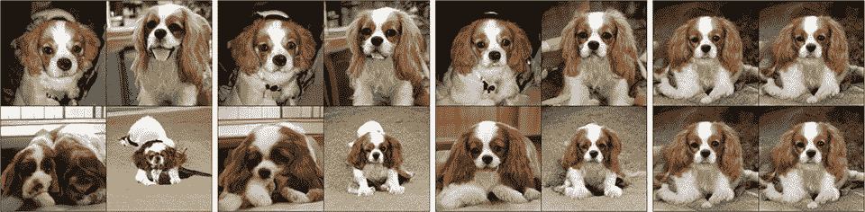

###### 图 10-18\. 截断技巧：从左到右，阈值设置为 2、1、0.5 和 0.04（来源：[Brock 等人，2018](https://arxiv.org/abs/1809.11096)）

正如其名称所示，BigGAN 在某种程度上是对 SAGAN 的改进，仅仅是因为它更“大”。BigGAN 使用的批量大小为 2,048，比 SAGAN 中使用的 256 的批量大小大 8 倍，并且每一层的通道大小增加了 50%。然而，BigGAN 还表明，通过包含共享嵌入、正交正则化以及将潜在向量 <math alttext="z"><mi>z</mi></math> 包含到生成器的每一层中，而不仅仅是初始层，可以在结构上改进 SAGAN。

要全面了解 BigGAN 引入的创新，我建议阅读原始论文和[相关演示材料](https://oreil.ly/vPn8T)。

# 使用 BigGAN

在[ TensorFlow 网站](https://oreil.ly/YLbLb)上提供了一个使用预训练的 BigGAN 生成图像的教程。

## VQ-GAN

另一种重要的 GAN 类型是 2020 年推出的 Vector Quantized GAN（VQ-GAN）。这种模型架构建立在 2017 年的论文“神经离散表示学习”中提出的一个想法之上，即 VAE 学习到的表示可以是离散的，而不是连续的。这种新型模型，即 Vector Quantized VAE（VQ-VAE），被证明可以生成高质量的图像，同时避免了传统连续潜在空间 VAE 经常出现的一些问题，比如“后验坍缩”（学习到的潜在空间由于过于强大的解码器而变得无信息）。

###### 提示

OpenAI 在 2021 年发布的文本到图像模型 DALL.E 的第一个版本（参见第十三章）使用了具有离散潜在空间的 VAE，类似于 VQ-VAE。

通过“离散潜在空间”，我们指的是一个学习到的向量列表（“码书”），每个向量与相应的索引相关联。VQ-VAE 中编码器的工作是将输入图像折叠到一个较小的向量网格中，然后将其与码书进行比较。然后，将每个网格方格向量（通过欧氏距离）最接近的码书向量传递给解码器进行解码，如图 10-19 所示。码书是一个长度为 <math alttext="d"><mi>d</mi></math>（嵌入大小）的学习向量列表，与编码器输出和解码器输入中的通道数相匹配。例如，<math alttext="e 1"><msub><mi>e</mi> <mn>1</mn></msub></math> 是一个可以解释为“背景”的向量。

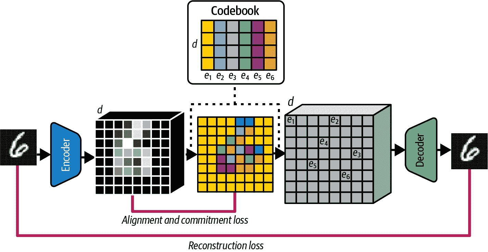

###### 图 10-19\. VQ-VAE 的示意图

代码本可以被看作是一组学习到的离散概念，这些概念由编码器和解码器共享，以描述给定图像的内容。VQ-VAE 必须找到一种方法，使这组离散概念尽可能具有信息量，以便编码器可以准确地用特定的代码向量*标记*每个网格方块，这对解码器是有意义的。因此，VQ-VAE 的损失函数是重构损失加上两个项（对齐和承诺损失），以确保编码器的输出向量尽可能接近代码本中的向量。这些项取代了典型 VAE 中编码分布和标准高斯先验之间的 KL 散度项。

然而，这种架构提出了一个问题——我们如何对新颖的代码网格进行采样，以传递给解码器生成新的图像？显然，使用均匀先验（为每个网格方块均等概率选择每个代码）是行不通的。例如，在 MNIST 数据集中，左上角的网格方块很可能被编码为*背景*，而靠近图像中心的网格方块不太可能被编码为这样。为了解决这个问题，作者使用了另一个模型，一个自回归的 PixelCNN（参见第五章），来预测网格中下一个代码向量，给定先前的代码向量。换句话说，先验是由模型学习的，而不是像普通 VAE 中的标准高斯先验那样静态的。

# 训练您自己的 VQ-VAE

有一篇由 Sayak Paul 撰写的优秀教程，介绍如何使用 Keras 在[Keras 网站](https://oreil.ly/dmcb4)上训练自己的 VQ-VAE。

VQ-GAN 论文详细介绍了 VQ-VAE 架构的几个关键变化，如图 10-20 所示。

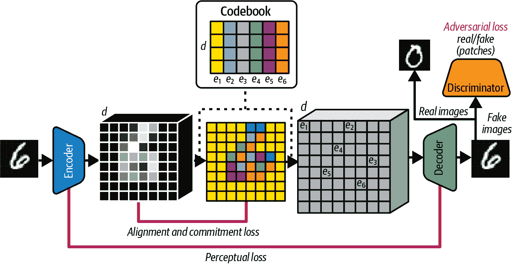

###### 图 10-20。VQ-GAN 的图表：GAN 鉴别器通过额外的对抗损失项帮助 VAE 生成更清晰的图像

首先，正如名称所示，作者包括一个 GAN 鉴别器，试图区分 VAE 解码器的输出和真实图像，损失函数中还有一个对抗项。众所周知，GAN 生成的图像比 VAE 更清晰，因此这个添加改善了整体图像质量。请注意，尽管名称中有 VAE，但 VAE 仍然存在于 VQ-GAN 模型中——GAN 鉴别器是一个额外的组件，而不是 VAE 的替代品。将 VAE 与 GAN 鉴别器（VAE-GAN）结合的想法首次由 Larsen 等人在他们 2015 年的论文中提出。

其次，GAN 鉴别器预测图像的小块是否真实或伪造，而不是一次性预测整个图像。这个想法（*PatchGAN*）被应用在 2016 年由 Isola 等人介绍的成功的*pix2pix*图像到图像模型中，并且也成功地作为*CycleGAN*的一部分应用，另一个图像到图像的风格转移模型。PatchGAN 鉴别器输出一个预测向量（每个块的预测），而不是整个图像的单个预测。使用 PatchGAN 鉴别器的好处在于，损失函数可以衡量鉴别器在基于*风格*而不是*内容*来区分图像方面的表现如何。由于鉴别器预测的每个单独元素基于图像的一个小方块，它必须使用块的风格而不是内容来做出决定。这是有用的，因为我们知道 VAE 生成的图像在风格上比真实图像更模糊，因此 PatchGAN 鉴别器可以鼓励 VAE 解码器生成比其自然产生的更清晰的图像。

第三，与使用单个 MSE 重建损失不同，该损失将输入图像像素与 VAE 解码器输出像素进行比较，VQ-GAN 使用*感知损失*项，计算编码器中间层的特征图与解码器相应层之间的差异。这个想法来自于侯等人 2016 年的论文，¹⁴作者在其中展示了这种对损失函数的改变导致更逼真的图像生成。

最后，模型的自回归部分使用 Transformer 而不是 PixelCNN，训练以生成代码序列。Transformer 在 VQ-GAN 完全训练后的一个单独阶段中进行训练。作者选择仅使用在要预测的令牌周围的滑动窗口内的令牌，而不是完全自回归地使用所有先前的令牌。这确保了模型可以扩展到需要更大潜在网格大小和因此需要 Transformer 生成更多令牌的更大图像。

## ViT VQ-GAN

Yu 等人在 2021 年的论文“Vector-Quantized Image Modeling with Improved VQGAN”中对 VQ-GAN 进行了最后一个扩展。¹⁵ 在这里，作者展示了如何将 VQ-GAN 的卷积编码器和解码器替换为 Transformer，如图 10-21 所示。

对于编码器，作者使用*Vision Transformer*（ViT）。¹⁶ ViT 是一种神经网络架构，将最初设计用于自然语言处理的 Transformer 模型应用于图像数据。ViT 不使用卷积层从图像中提取特征，而是将图像分成一系列补丁，对其进行标记化，然后将其作为输入馈送到编码器 Transformer 中。

具体来说，在 ViT VQ-GAN 中，非重叠的输入补丁（每个大小为 8×8）首先被展平，然后投影到低维嵌入空间中，位置嵌入被添加。然后，这个序列被馈送到标准编码器 Transformer 中，生成的嵌入根据学习的码书进行量化。这些整数代码然后由解码器 Transformer 模型处理，最终输出是一系列补丁，可以被拼接在一起形成原始图像。整体的编码器-解码器模型被作为自动编码器端到端训练。

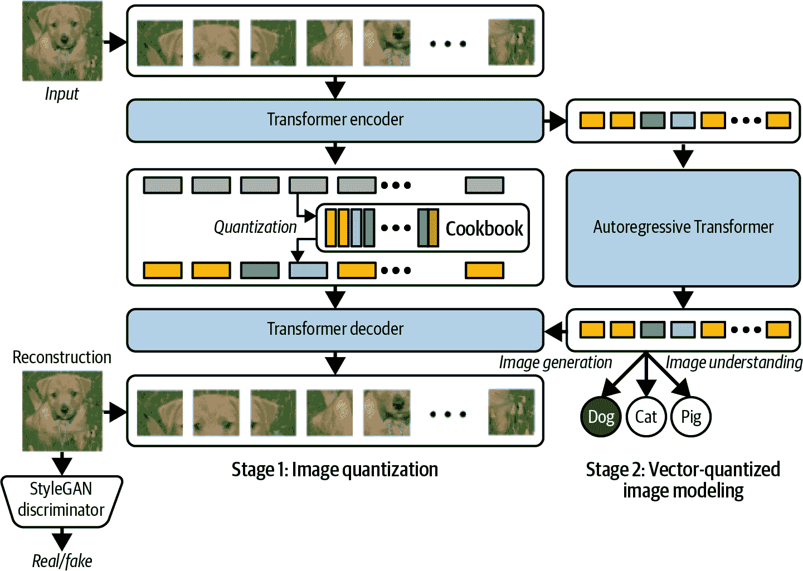

###### 图 10-21。ViT VQ-GAN 的图表：GAN 鉴别器通过额外的对抗损失项帮助 VAE 生成更清晰的图像（来源：[Yu and Koh, 2022](https://ai.googleblog.com/2022/05/vector-quantized-image-modeling-with.html)）¹⁷

与原始 VQ-GAN 模型一样，训练的第二阶段涉及使用自回归解码器 Transformer 生成代码序列。因此，在 ViT VQ-GAN 中总共有三个 Transformer，另外还有 GAN 鉴别器和学习的码书。论文中 ViT VQ-GAN 生成的图像示例显示在图 10-22 中。

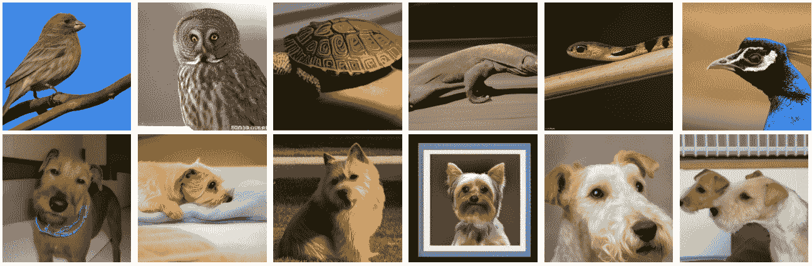

###### 图 10-22。ViT VQ-GAN 在 ImageNet 上训练生成的示例图像（来源：[Yu et al., 2021](https://arxiv.org/pdf/2110.04627.pdf)）

# 总结

在本章中，我们回顾了自 2017 年以来一些最重要和有影响力的 GAN 论文。特别是，我们探讨了 ProGAN、StyleGAN、StyleGAN2、SAGAN、BigGAN、VQ-GAN 和 ViT VQ-GAN。

我们从 2017 年 ProGAN 论文中首创的渐进训练概念开始探索。2018 年 StyleGAN 论文引入了几个关键改变，使对图像输出有更大的控制，例如用于创建特定样式向量的映射网络和允许在不同分辨率注入样式的合成网络。最后，StyleGAN2 用权重调制和解调制步骤替换了 StyleGAN 的自适应实例归一化，同时还进行了额外的增强，如路径正则化。该论文还展示了如何保留渐进分辨率细化的可取属性，而无需逐步训练网络。

我们还看到了如何将注意力的概念构建到 GAN 中，2018 年引入了 SAGAN。这使网络能够捕捉长距离依赖关系，例如图像相对两侧的相似背景颜色，而无需依赖深度卷积映射将信息传播到图像的空间维度。BigGAN 是这个想法的延伸，进行了几个关键改变，并训练了一个更大的网络以进一步提高图像质量。

在 VQ-GAN 论文中，作者展示了如何将几种不同类型的生成模型结合起来产生很好的效果。在最初引入具有离散潜在空间的 VAE 概念的 VQ-VAE 论文的基础上，VQ-GAN 还包括一个鼓励 VAE 通过额外的对抗损失项生成更清晰图像的鉴别器。自回归 Transformer 用于构建一个新颖的代码令牌序列，可以由 VAE 解码器解码以生成新颖图像。ViT VQ-GAN 论文进一步扩展了这个想法，通过用 Transformer 替换 VQ-GAN 的卷积编码器和解码器。

¹ Huiwen Chang 等人，“Muse: 通过遮罩生成 Transformer 进行文本到图像生成”，2023 年 1 月 2 日，[*https://arxiv.org/abs/2301.00704*](https://arxiv.org/abs/2301.00704)。

² Tero Karras 等人，“用于改善质量、稳定性和变化的 GAN 的渐进增长”，2017 年 10 月 27 日，[*https://arxiv.org/abs/1710.10196*](https://arxiv.org/abs/1710.10196)。

³ Tero Karras 等人，“用于生成对抗网络的基于样式的生成器架构”，2018 年 12 月 12 日，[*https://arxiv.org/abs/1812.04948*](https://arxiv.org/abs/1812.04948)。

⁴ Xun Huang 和 Serge Belongie，“使用自适应实例归一化实时进行任意风格转移”，2017 年 3 月 20 日，[*https://arxiv.org/abs/1703.06868*](https://arxiv.org/abs/1703.06868)。

⁵ Tero Karras 等人，“分析和改进 StyleGAN 的图像质量”，2019 年 12 月 3 日，[*https://arxiv.org/abs/1912.04958*](https://arxiv.org/abs/1912.04958)。

⁶ Axel Sauer 等人，“StyleGAN-XL: 将 StyleGAN 扩展到大型多样数据集”，2022 年 2 月 1 日，[*https://arxiv.org/abs/2202.00273v2*](https://arxiv.org/abs/2202.00273v2)。

⁷ Han Zhang 等人，“自注意力生成对抗网络”，2018 年 5 月 21 日，[*https://arxiv.org/abs/1805.08318*](https://arxiv.org/abs/1805.08318)。

⁸ Andrew Brock 等人，“用于高保真自然图像合成的大规模 GAN 训练”，2018 年 9 月 28 日，[*https://arxiv.org/abs/1809.11096*](https://arxiv.org/abs/1809.11096)。

⁹ Patrick Esser 等人，“驯服 Transformer 以进行高分辨率图像合成”，2020 年 12 月 17 日，[*https://arxiv.org/abs/2012.09841*](https://arxiv.org/abs/2012.09841)。

¹⁰ Aaron van den Oord 等人，“神经离散表示学习”，2017 年 11 月 2 日，[*https://arxiv.org/abs/1711.00937v2*](https://arxiv.org/abs/1711.00937v2)。

¹¹ Anders Boesen Lindbo Larsen 等人，“超越像素的自动编码：使用学习的相似度度量”，2015 年 12 月 31 日，[*https://arxiv.org/abs/1512.09300*](https://arxiv.org/abs/1512.09300)。

¹² Phillip Isola 等人，“带条件对抗网络的图像到图像翻译”，2016 年 11 月 21 日，[*https://arxiv.org/abs/1611.07004v3*](https://arxiv.org/abs/1611.07004v3)。

¹³ Jun-Yan Zhu 等人，“使用循环一致性对抗网络进行无配对图像到图像翻译”，2017 年 3 月 30 日，[*https://arxiv.org/abs/1703.10593*](https://arxiv.org/abs/1703.10593)。

¹⁴ Xianxu Hou 等人，“深度特征一致变分自动编码器”，2016 年 10 月 2 日，[*https://arxiv.org/abs/1610.00291*](https://arxiv.org/abs/1610.00291)。

¹⁵ Jiahui Yu 等人，“改进的 VQGAN 进行矢量量化图像建模”，2021 年 10 月 9 日，[*https://arxiv.org/abs/2110.04627*](https://arxiv.org/abs/2110.04627)。

¹⁶ Alexey Dosovitskiy 等人，“一幅图像价值 16x16 个词：规模化图像识别的 Transformer”，2020 年 10 月 22 日，[*https://arxiv.org/abs/2010.11929v2*](https://arxiv.org/abs/2010.11929v2)。

¹⁷ Jiahui Yu 和 Jing Yu Koh，“改进的 VQGAN 进行矢量量化图像建模”，2022 年 5 月 18 日，[*https://ai.googleblog.com/2022/05/vector-quantized-image-modeling-with.html*](https://ai.googleblog.com/2022/05/vector-quantized-image-modeling-with.html)。
