# 第十三章：多模态模型

到目前为止，我们已经分析了专注于单一数据模态的生成学习问题：文本、图像或音乐。我们已经看到了 GAN 和扩散模型如何生成最先进的图像，以及 Transformer 如何引领文本和图像生成的方式。然而，作为人类，我们没有跨模态的困难——例如，描述给定照片中正在发生的事情，创作数字艺术来描绘书中虚构的幻想世界，或将电影配乐与给定场景的情感相匹配。我们能训练机器做同样的事吗？

# 介绍

*多模态学习*涉及训练生成模型以在两种或更多种不同类型的数据之间进行转换。在过去两年中引入的一些最令人印象深刻的生成模型具有多模态性质。在本章中，我们将详细探讨它们的工作原理，并考虑未来的生成建模将如何受到大型多模态模型的影响。

我们将探讨四种不同的视觉语言模型：来自 OpenAI 的 DALL.E 2；来自 Google Brain 的 Imagen；来自 Stability AI、CompVis 和 Runway 的 Stable Diffusion；以及来自 DeepMind 的 Flamingo。

###### 提示

本章的目的是简明扼要地解释每个模型的工作原理，而不深入探讨每个设计决策的细节。有关更多信息，请参考每个模型的各自论文，其中详细解释了所有设计选择和架构决策。

文本到图像生成侧重于从给定的文本提示生成最先进的图像。例如，给定输入“用造型粘土制成的一颗西兰花头，在阳光下微笑”，我们希望模型能够输出一个与文本提示精确匹配的图像，如图 13-1 所示。

这显然是一个极具挑战性的问题。文本理解和图像生成本身就很难解决，正如我们在本书的前几章中所看到的。这样的多模态建模提出了额外的挑战，因为模型还必须学习如何跨越两个领域之间的鸿沟，并学习一个共享表示，使其能够准确地将一段文本转换为高保真图像而不丢失信息。

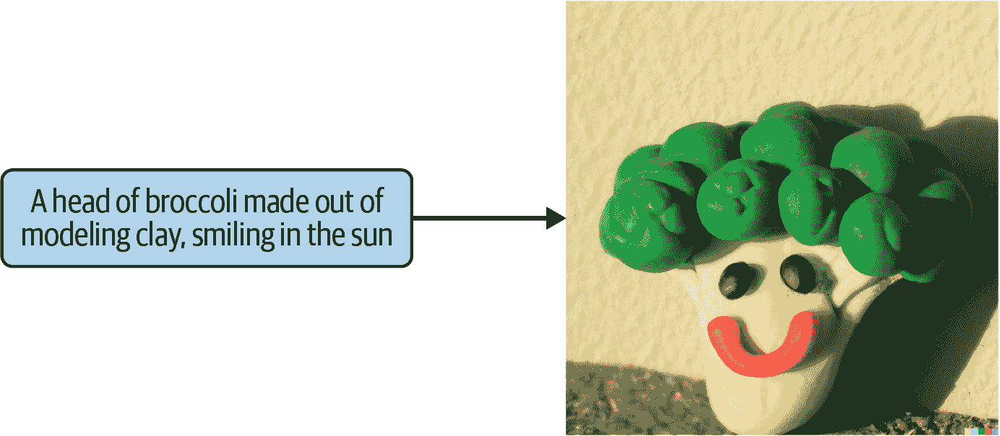

###### 图 13-1。DALL.E 2 进行文本到图像生成的示例

此外，为了取得成功，模型必须能够结合可能从未见过的概念和风格。例如，没有米开朗基罗的壁画中有人们戴着虚拟现实头盔，但我们希望我们的模型能够在我们要求时创建这样的图像。同样，模型准确推断生成图像中的对象如何与彼此相关，基于文本提示。例如，“宇航员骑着甜甜圈穿越太空”的图片应该与“宇航员在拥挤的空间里吃甜甜圈”的图片看起来截然不同。模型必须学习单词如何通过上下文赋予意义，以及如何将实体之间的明确文本关系转换为暗示相同含义的图像。

# DALL.E 2

我们将要探索的第一个模型是*DALL.E 2*，这是由 OpenAI 设计用于文本到图像生成的模型。该模型的第一个版本，DALL.E，是在 2021 年 2 月发布的，引发了对生成多模态模型的新一波兴趣。在本节中，我们将调查该模型的第二次迭代，DALL.E 2，于 2022 年 4 月发布，距离第一个版本发布仅一年多一点。

DALL.E 2 是一个非常令人印象深刻的模型，进一步增进了我们对 AI 解决这类多模态问题能力的理解。它不仅在学术上具有影响力，还迫使我们提出与 AI 在创造性过程中的角色有关的重大问题，这些问题以前被认为是人类独有的。我们将从探索 DALL.E 2 的工作方式开始，建立在本书前面已经探讨过的关键基本思想之上。

## 架构

要理解 DALL.E 2 的工作原理，我们必须首先了解其整体架构，如图 13-2 所示。

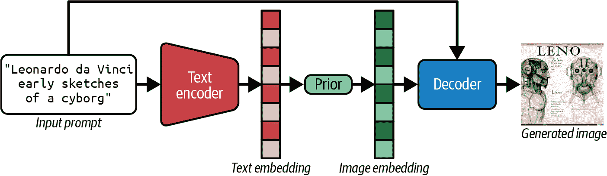

###### 图 13-2\. DALL.E 2 架构

有三个不同的部分需要考虑：*文本编码器*、*先验*和*解码器*。文本首先通过文本编码器传递，以产生文本嵌入向量。然后，该向量通过先验进行转换，以产生图像嵌入向量。最后，这通过解码器传递，连同原始文本，以生成图像。我们将依次逐个步骤地介绍每个组件，以全面了解 DALL.E 2 在实践中的工作方式。

## 文本编码器

文本编码器的目的是将文本提示转换为表示文本提示概念含义的嵌入向量，该向量位于潜在空间内。正如我们在前几章中所看到的，将离散文本转换为连续潜在空间向量对于所有下游任务都是至关重要的，因为我们可以根据特定目标进一步操纵向量。

在 DALL.E 2 中，作者并不是从头开始训练文本编码器，而是利用了一个名为*对比语言-图像预训练*（CLIP）的现有模型，也是由 OpenAI 制作的。因此，要理解文本编码器，我们必须首先了解 CLIP 的工作原理。

## CLIP

[CLIP](https://openai.com/blog/clip)³是 OpenAI 于 2021 年 2 月发布的一篇论文中公布的（就在第一篇 DALL.E 论文发布几天后），该论文将其描述为“一种能够有效地从自然语言监督中学习视觉概念的神经网络。”

它使用一种称为*对比学习*的技术将图像与文本描述进行匹配。该模型在从互联网上抓取的 4 亿个文本-图像对数据集上进行训练——一些示例对显示在图 13-3 中。作为比较，ImageNet 中有 1400 万个手动注释的图像。给定一幅图像和一组可能的文本描述，它的任务是找到实际与图像匹配的描述。 

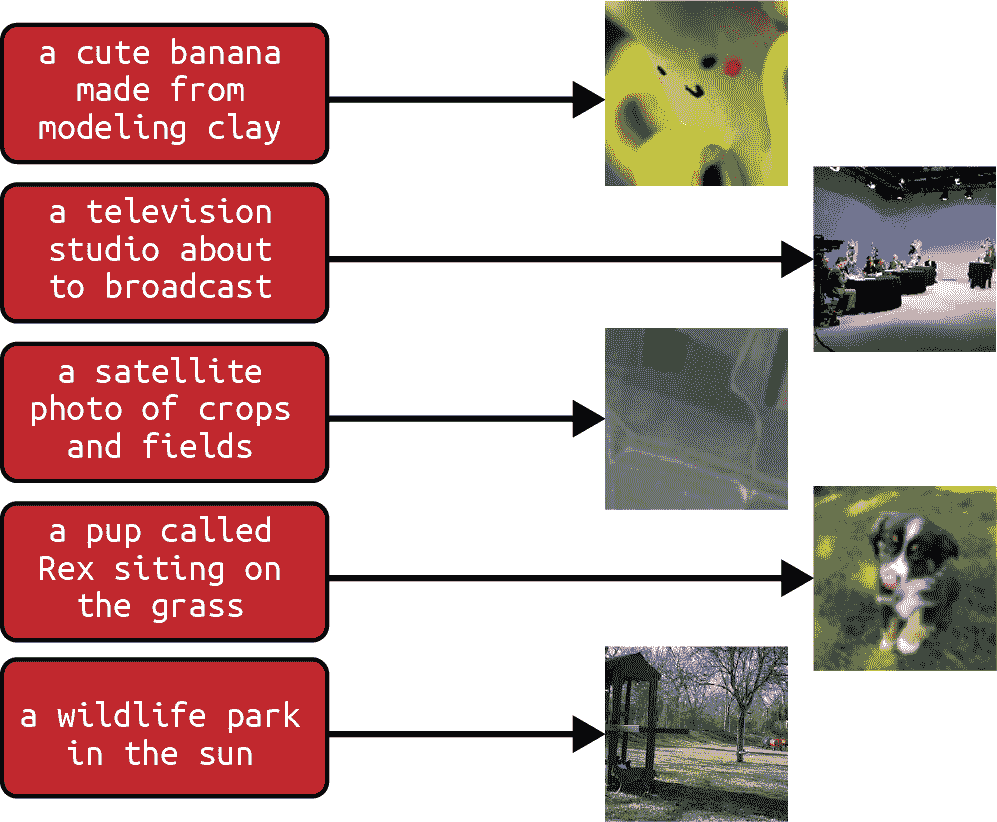

###### 图 13-3\. 文本-图像对的示例

对比学习背后的关键思想很简单。我们训练两个神经网络：一个*文本编码器*，将文本转换为文本嵌入，以及一个*图像编码器*，将图像转换为图像嵌入。然后，给定一批文本-图像对，我们使用*余弦相似度*比较所有文本和图像嵌入组合，并训练网络，以最大化匹配文本-图像对之间的分数，并最小化不正确的文本-图像对之间的分数。这个过程在图 13-4 中显示。

# CLIP 不是生成模型

请注意，CLIP 本身不是生成模型——它不能生成图像或文本。它更接近于判别模型，因为最终输出是关于给定图像最接近哪个文本描述（或反之亦然，哪个图像最接近给定文本描述）的预测。

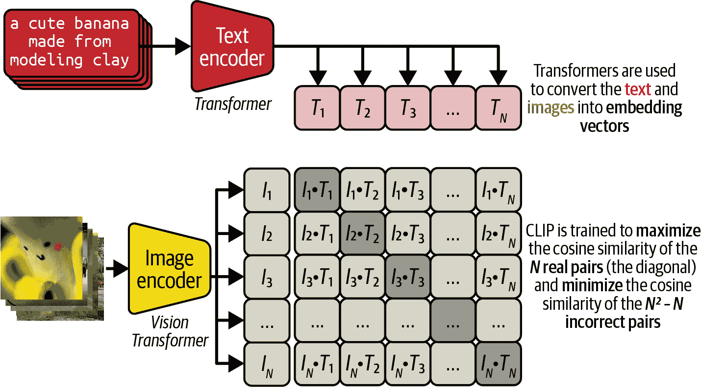

###### 图 13-4\. CLIP 训练过程

文本编码器和图像编码器都是 Transformer——图像编码器是 Vision Transformer（ViT），在“ViT VQ-GAN”中介绍，它将注意力的相同概念应用于图像。作者测试了其他模型架构，但发现这种组合产生了最好的结果。

CLIP 特别有趣的地方在于它可以用于对从未接触过的任务进行*零样本预测*。例如，假设我们想使用 CLIP 来预测 ImageNet 数据集中给定图像的标签。我们可以首先通过使用模板（例如“一张<标签>的照片”）将 ImageNet 标签转换为句子，如图 13-5 所示。

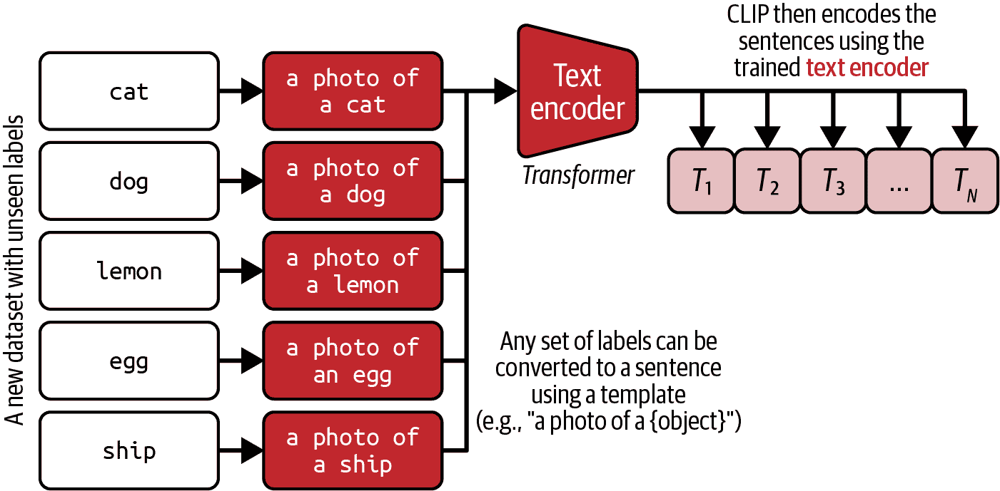

###### 图 13-5\. 将新数据集中的标签转换为标题，以生成 CLIP 文本嵌入

为了预测给定图像的标签，我们可以通过 CLIP 图像编码器传递图像，并计算图像嵌入与所有可能文本嵌入之间的余弦相似度，以找到得分最高的标签，如图 13-6 所示。

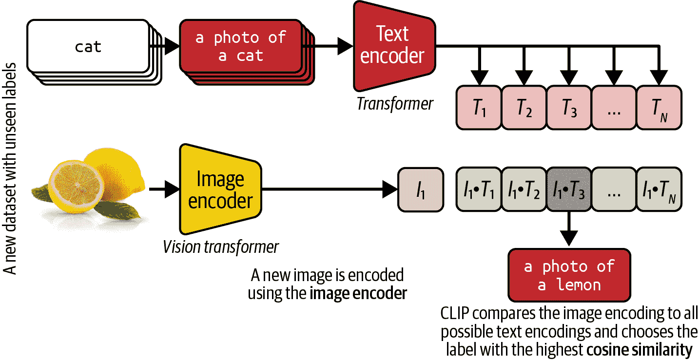

###### 图 13-6\. 使用 CLIP 预测图像内容

请注意，我们无需重新训练 CLIP 神经网络，即可将其应用于新任务。它使用语言作为一个通用领域，通过它可以表达任何一组标签。

使用这种方法，可以证明 CLIP 在各种图像数据集标签挑战中表现良好（图 13-7）。其他模型通常在应用于具有相同标签的不同数据集时失败，因为它们高度优化于它们训练的个别数据集。CLIP 更加稳健，因为它学习了对完整文本描述和图像的深刻概念理解，而不仅仅擅长于将单个标签分配给给定数据集中的图像的狭窄任务。

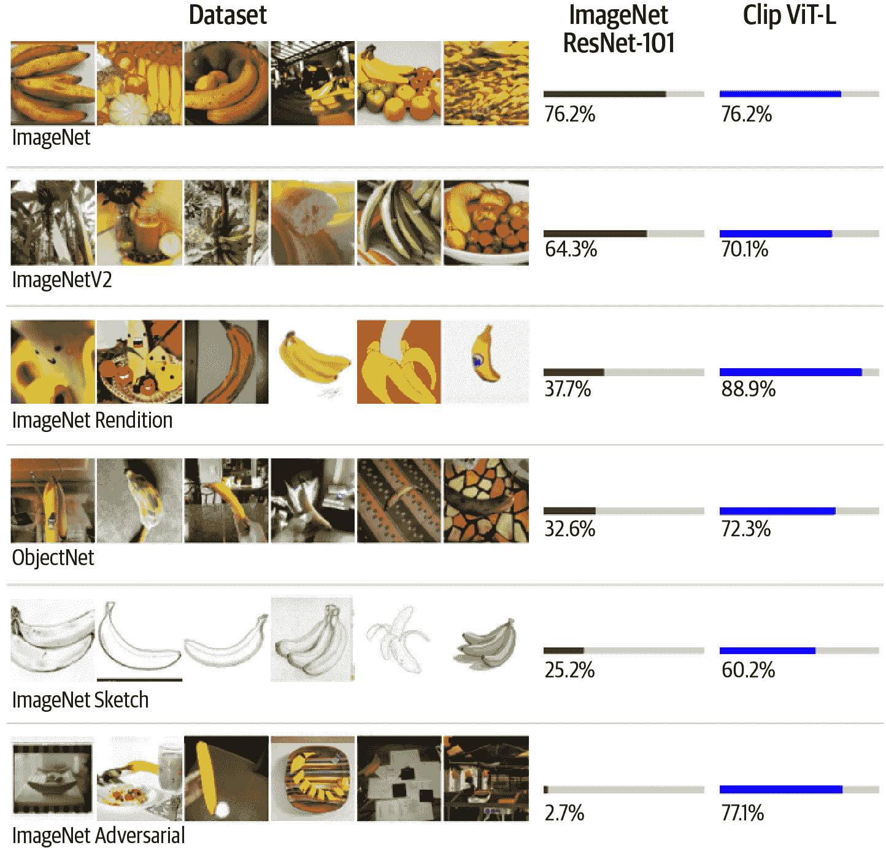

###### 图 13-7\. CLIP 在各种图像标签数据集上表现良好（来源：[Radford 等人，2021](https://arxiv.org/abs/2103.00020)）

如前所述，CLIP 是根据其区分能力来衡量的，那么它如何帮助我们构建生成模型，如 DALL.E 2 呢？

答案是，我们可以将训练好的文本编码器作为 DALL.E 2 等更大模型的一部分，冻结权重。训练好的编码器只是一个将文本转换为文本嵌入的通用模型，对于生成图像等下游任务应该是有用的。文本编码器能够捕捉文本的丰富概念理解，因为它经过训练，使其尽可能与其匹配的图像嵌入对应物相似，后者仅由配对图像产生。因此，它是我们需要能够从文本领域跨越到图像领域的桥梁的第一部分。

## 先验

下一阶段的过程涉及将文本嵌入转换为 CLIP 图像嵌入。DALL.E 2 的作者尝试了两种不同的方法来训练先验模型：

+   自回归模型

+   扩散模型

他们发现扩散方法优于自回归模型，并且在计算效率上更高。在本节中，我们将看看两者的区别。

### 自回归先验

自回归模型按顺序生成输出，通过对输出标记（例如单词、像素）进行排序，并将下一个标记的生成条件放在前面的标记上。我们已经在之前的章节中看到了这在循环神经网络（例如 LSTMs）、Transformer 和 PixelCNN 中的应用。

DALL.E 2 的自回归先验是一个编码器-解码器 Transformer。它经过训练，可以在给定 CLIP 文本嵌入的情况下重现 CLIP 图像嵌入，如图 13-8 所示。请注意，原始论文中提到了一些自回归模型的附加组件，为了简洁起见，我们在这里省略了。

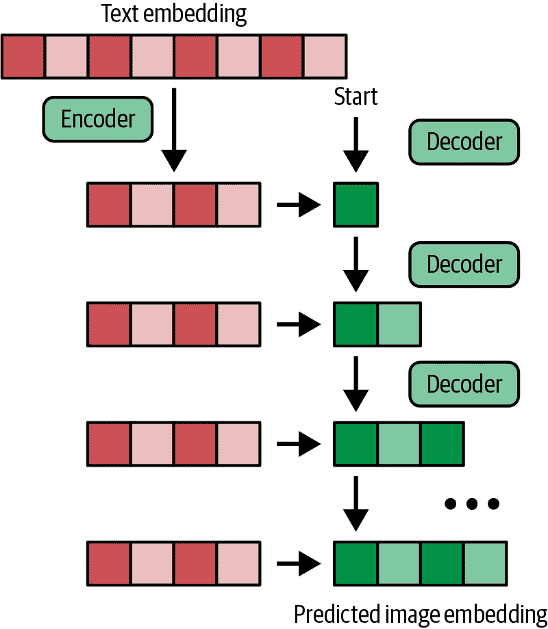

###### 图 13-8\. DALL.E 2 的自回归先验的简化图

该模型在 CLIP 文本-图像对数据集上进行训练。您可以将其视为我们需要的桥梁的第二部分，以便从文本领域跳转到图像领域：我们正在将一个向量从文本嵌入潜在空间转换为图像嵌入潜在空间。

输入文本嵌入由 Transformer 的编码器处理，产生另一个表示，传递给解码器，同时传递当前生成的输出图像嵌入。输出是逐个元素生成的，使用教师强制来比较预测的下一个元素与实际的 CLIP 图像嵌入。

生成的顺序性意味着自回归模型在计算效率上不如作者尝试的其他方法，接下来我们将看一下这些方法。

### 扩散先验

正如我们在第八章中看到的，扩散模型正迅速成为生成建模从业者的首选之一，与 Transformer 并列。在 DALL.E 2 中，一个仅使用解码器的 Transformer 作为先验，通过扩散过程进行训练。

训练和生成过程如图 13-9 所示。再次强调，这是一个简化版本；原始论文包含了扩散模型结构的所有细节。

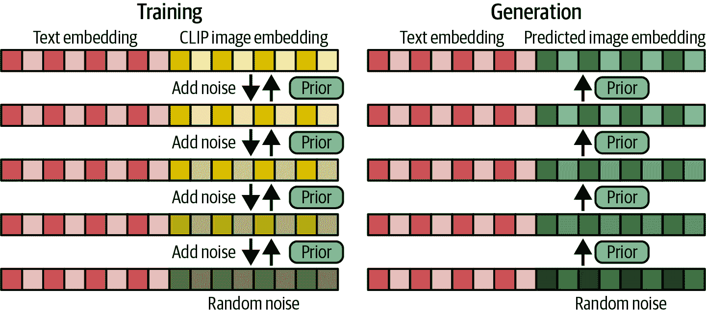

###### 图 13-9。DALL.E 2 扩散先验训练和生成过程的简化图示

在训练过程中，每个 CLIP 文本和图像嵌入对首先被连接成一个单一向量。然后，图像嵌入在 1,000 个时间步长内被加入噪声，直到它与随机噪声无法区分。然后扩散先验被训练以预测上一个时间步长的去噪图像嵌入。先验在整个过程中都可以访问文本嵌入，因此能够根据这些信息对其预测进行条件化，逐渐将随机噪声转换为预测的 CLIP 图像嵌入。损失函数是去噪步骤中的平均均方误差。

为了生成新的图像嵌入，我们随机采样一个向量，将相关文本嵌入前置，并通过训练好的扩散先验多次传递。

## 解码器

DALL.E 2 的最后部分是解码器。这是模型的一部分，根据文本提示和先验输出的预测图像嵌入生成最终图像。

解码器的架构和训练过程借鉴了早前 OpenAI 发表的一篇论文，该论文于 2021 年 12 月发表，介绍了一种名为 Guided Language to Image Diffusion for Generation and Editing (GLIDE)的生成模型。⁴

GLIDE 能够从文本提示中生成逼真的图像，这与 DALL.E 2 的工作方式非常相似。不同之处在于 GLIDE 不使用 CLIP 嵌入，而是直接使用原始文本提示进行训练，从头开始训练整个模型，如图 13-10 所示。

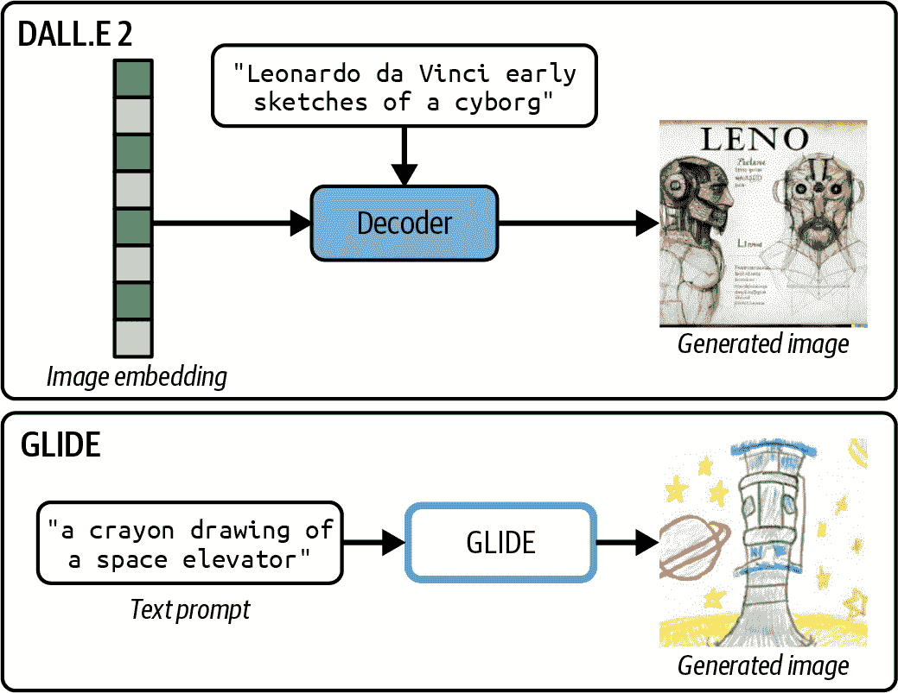

###### 图 13-10。DALL.E 2 和 GLIDE 之间的比较—GLIDE 从头开始训练整个生成模型，而 DALL.E 2 利用 CLIP 嵌入将信息从初始文本提示传递下去

让我们先看看 GLIDE 是如何工作的。

### GLIDE

GLIDE 作为一个扩散模型进行训练，使用 U-Net 架构作为去噪器，使用 Transformer 架构作为文本编码器。它学会了根据文本提示消除添加到图像中的噪声。最后，一个*上采样器*被训练以将生成的图像缩放到 1,024×1,024 像素。

GLIDE 从头开始训练 35 亿（B）参数模型—模型的视觉部分（U-Net 和上采样器）有 23 亿参数，Transformer 有 12 亿参数。它在 2.5 亿文本-图像对上进行训练。

扩散过程如图 13-11 所示。使用 Transformer 创建输入文本提示的嵌入，然后用于引导 U-Net 进行去噪过程。我们在第八章中探讨了 U-Net 架构；当图像的整体大小应保持不变时（例如，用于风格转移、去噪等），这是一个完美的模型选择。

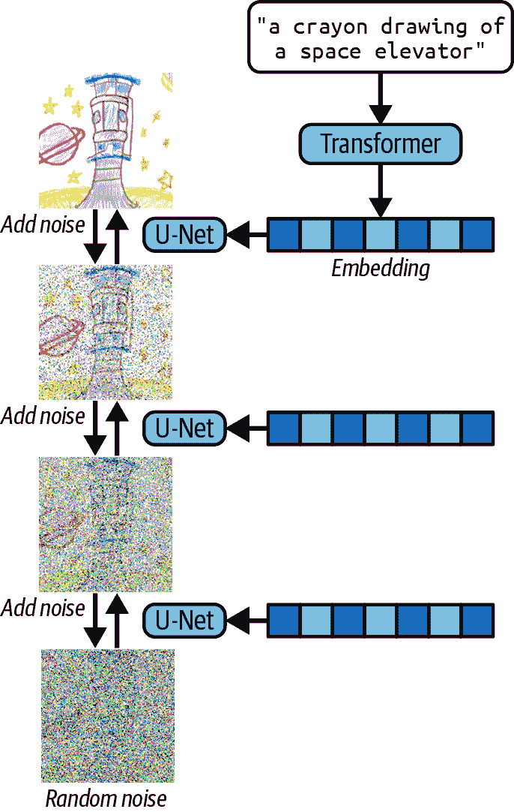

###### 图 13-11。GLIDE 扩散过程

DALL.E 2 解码器仍然使用 U-Net 去噪器和 Transformer 文本编码器架构，但另外还有预测的 CLIP 图像嵌入来进行条件。这是 GLIDE 和 DALL.E 2 之间的关键区别，如图 13-12 所示。

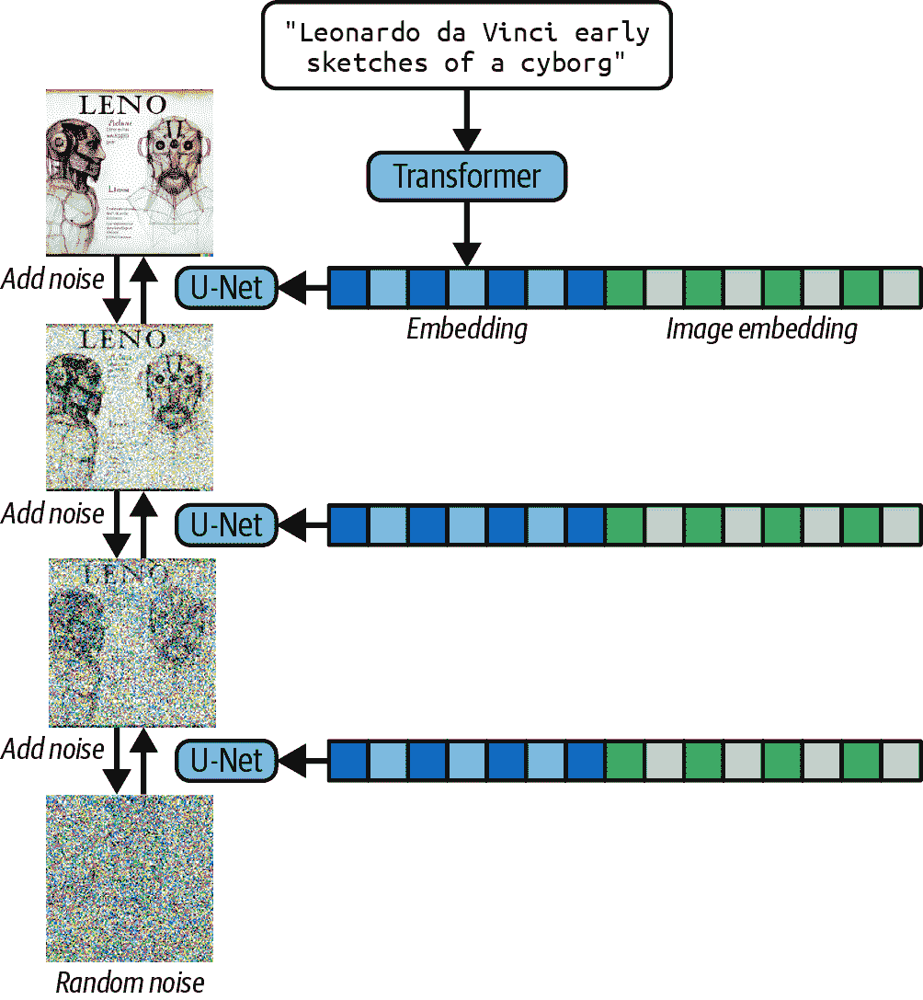

###### 图 13-12。DALL.E 2 解码器还额外依赖于先验产生的图像嵌入

与所有扩散模型一样，要生成新图像，我们只需对一些随机噪声进行多次 U-Net 去噪，条件是 Transformer 文本编码和图像嵌入。输出是一个 64×64 像素的图像。

### 上采样器

解码器的最后部分是上采样器（两个单独的扩散模型）。第一个扩散模型将图像从 64×64 转换为 256×256 像素。第二个再次转换，从 256×256 到 1,024×1,024 像素，如图 13-13 所示。

上采样很有用，因为这意味着我们不必构建处理高维图像的大型上游模型。我们可以在整个过程的最后阶段之前使用小图像，然后应用上采样器。这节省了模型参数，并确保更高效的上游训练过程。

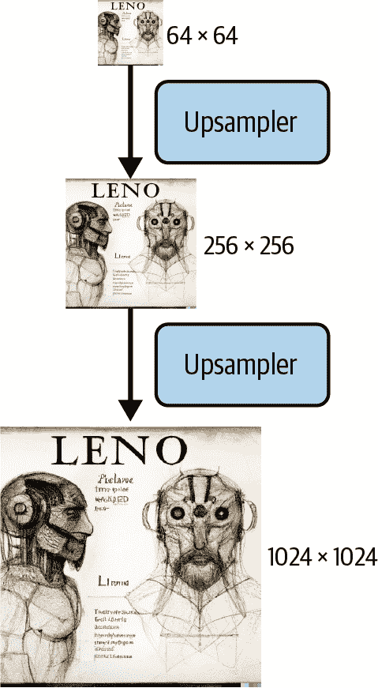

###### 图 13-13。第一个 Upsampler 扩散模型将图像从 64×64 像素转换为 256×256 像素，而第二个将图像从 256×256 像素转换为 1,024×1,024 像素

这就是 DALL.E 2 模型的解释！总之，DALL.E 2 利用预训练的 CLIP 模型立即生成输入提示的文本嵌入。然后使用称为先验的扩散模型将其转换为图像嵌入。最后，它实现了一个 GLIDE 风格的扩散模型，以生成输出图像，条件是预测的图像嵌入和 Transformer 编码的输入提示。

## DALL.E 2 的示例

可以在[官方网站](https://openai.com/dall-e-2)上找到 DALL.E 2 生成的更多图像示例。该模型能够以令人惊讶的方式将复杂、不同的概念结合在一起，以一种现实、可信的方式，这代表了 AI 和生成建模的重大进步。

在论文中，作者展示了该模型可以用于除文本到图像生成之外的其他目的。其中一个应用是创建给定图像的变化，我们将在下一节中探讨。

### 图像变化

如前所述，使用 DALL.E 2 解码器生成图像时，我们对由纯随机噪声组成的图像进行采样，然后逐渐减少噪声量，使用依赖于提供的图像嵌入的去噪扩散模型。选择不同的初始随机噪声样本将导致不同的图像。

为了生成给定图像的变化，我们只需要建立其图像嵌入以供解码器使用。我们可以使用原始的 CLIP 图像编码器来获得这个，它专门设计用于将图像转换为其 CLIP 图像嵌入。这个过程如图 13-14 所示。

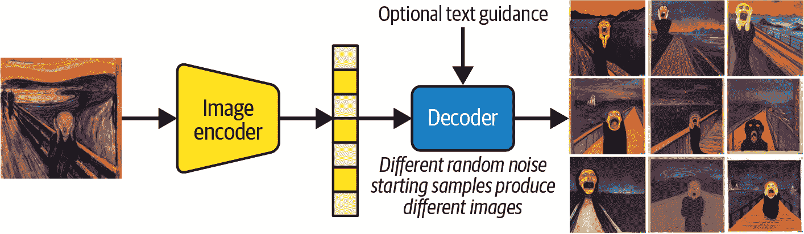

###### 图 13-14。DALL.E 2 可用于生成给定图像的变化

### 先验的重要性

作者探索的另一条途径是建立先验的重要性。先验的目的是为解码器提供一个有用的图像表示，利用预训练的 CLIP 模型。然而，这一步骤可能是不必要的——也许我们可以直接将文本嵌入传递给解码器，而不是图像嵌入，或者完全忽略 CLIP 嵌入，只根据文本提示进行条件化。这会影响生成的质量吗？

为了测试这一点，作者尝试了三种不同的方法：

1.  只将文本提示（以及图像嵌入的零向量）提供给解码器。

1.  将文本提示和文本嵌入（就像它是图像嵌入一样）提供给解码器。

1.  将文本提示和图像嵌入（即完整模型）提供给解码器。

示例结果显示在图 13-15 中。我们可以看到，当解码器缺乏图像嵌入信息时，它只能产生文本提示的粗略近似，缺少关键信息，如计算器。将文本嵌入视为图像嵌入稍微好一些，尽管它无法捕捉刺猬和计算器之间的关系。只有带有先验的完整模型才能产生准确反映提示中包含的所有信息的图像。

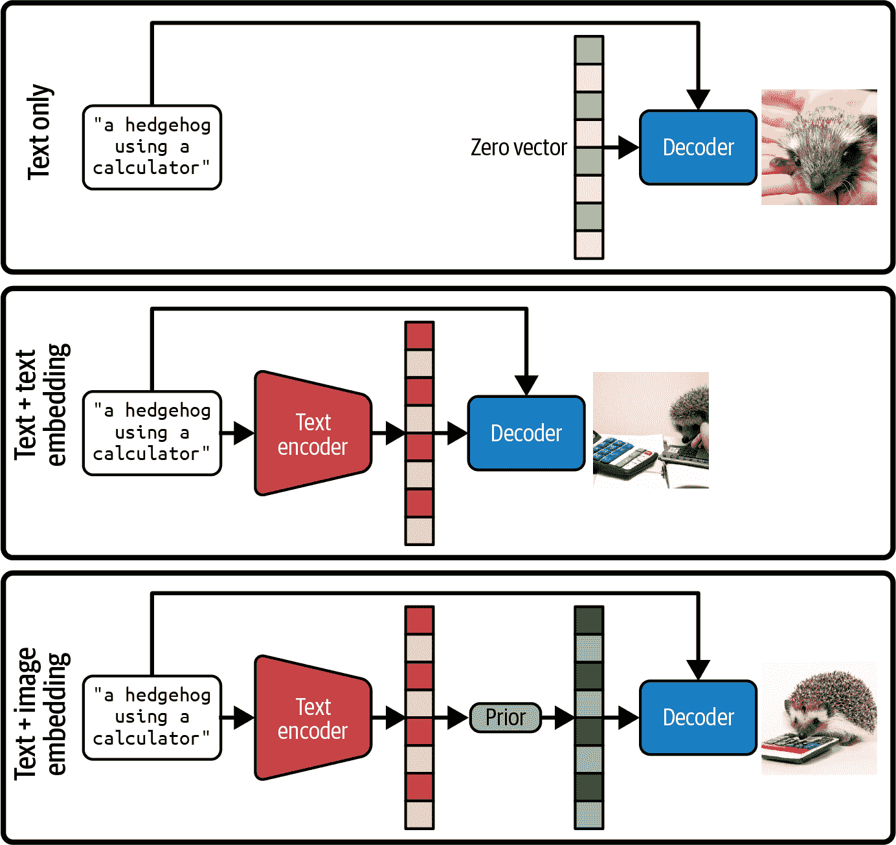

###### 图 13-15。先验为模型提供了额外的上下文，并帮助解码器产生更准确的生成物（来源：[Ramesh 等人，2022](https://arxiv.org/pdf/2204.06125.pdf)）

### 限制

在 DALL.E 2 论文中，作者还强调了模型的几个已知限制。其中两个（属性绑定和文本生成）显示在图 13-16 中。

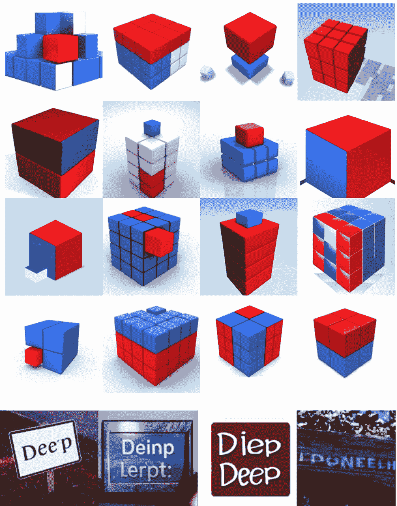

###### 图 13-16。DALL.E 2 的两个限制在于其将属性绑定到对象和再现文本信息的能力——顶部提示：“一个红色立方体放在一个蓝色立方体上”；底部提示：“一个写着深度学习的标志”（来源：[Ramesh 等人，2022](https://arxiv.org/pdf/2204.06125.pdf)）

*属性绑定*是模型理解给定文本提示中单词之间关系的能力，特别是属性如何与对象相关联。例如，提示“一个红色立方体放在一个蓝色立方体上”在视觉上必须与“一个蓝色立方体放在一个红色立方体上”有明显区别。与之前的模型（如 GLIDE）相比，DALL.E 在这方面有些困难，尽管生成的整体质量更好且更多样化。

此外，DALL.E 2 无法准确再现文本——这可能是因为 CLIP 嵌入不捕捉拼写，而只包含文本的更高级表示。这些表示可以部分成功地解码为文本（例如，单个字母大多正确），但没有足够的组合理解来形成完整的单词。

# Imagen

在 OpenAI 发布 DALL.E 2 一个多月后，Google Brain 团队发布了他们自己的文本到图像模型称为 Imagen。我们在本章中已经探讨的许多核心主题也与 Imagen 相关：例如，它使用文本编码器和扩散模型解码器。

在接下来的部分中，我们将探讨 Imagen 的整体架构，并将其与 DALL.E 2 进行比较。

## 架构

Imagen 架构的概述显示在图 13-17 中。

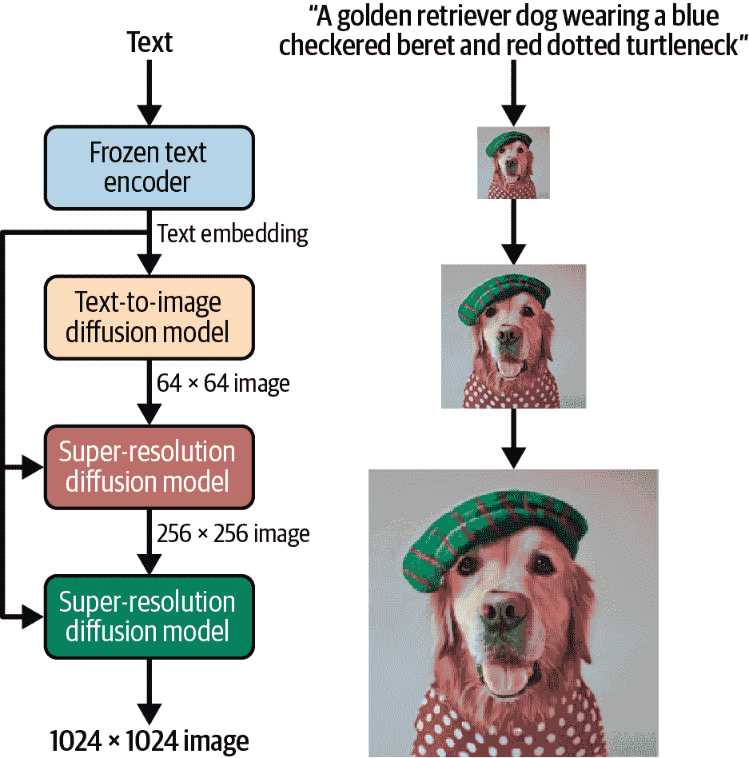

###### 图 13-17。Imagen 架构（来源：[Saharia 等人，2022](https://arxiv.org/abs/2205.11487)）

冻结文本编码器是预训练的 T5-XXL 模型，一个大型编码器-解码器 Transformer。与 CLIP 不同，这个模型仅在文本上进行训练，而不是图像，因此它不是一个多模态模型。然而，作者发现它仍然在 Imagen 中作为文本编码器表现非常出色，并且扩展这个模型对整体性能的影响比扩展扩散模型解码器更大。

与 DALL.E 2 一样，Imagen 的解码扩散模型基于 U-Net 架构，以文本嵌入为条件。对标准 U-Net 架构进行了几项架构改进，以产生作者称之为*高效 U-Net*的模型。该模型使用更少的内存，收敛更快，并且比以前的 U-Net 模型具有更好的样本质量。

将生成的图像从 64×64 像素升级到 1,024×1,024 像素的上采样器超分辨率模型也是扩散模型，继续使用文本嵌入来指导上采样过程。

## DrawBench

Imagen 论文的另一个贡献是*DrawBench*——一个包含 200 个文本提示的套件，用于文本到图像的评估。文本提示涵盖 11 个类别，如*计数*（生成指定数量的对象的能力）、*描述*（生成描述对象的复杂和长文本提示的能力）和*文本*（生成引用文本的能力）。为了比较两个模型，DrawBench 文本提示通过每个模型，并将输出交给一组人类评分员进行评估，评估涵盖两个指标：

对齐

哪张图更准确地描述了标题？

保真度

哪张图更逼真（看起来更真实）？

DrawBench 人类评估的结果显示在图 13-18 中。

DALL.E 2 和 Imagen 都是在文本到图像生成领域做出了重大贡献的显著模型。虽然 Imagen 在许多 DrawBench 基准测试中表现优于 DALL.E 2，但 DALL.E 2 提供了 Imagen 中没有的额外功能。例如，因为 DALL.E 2 利用了 CLIP（一个多模态文本-图像模型），它能够接受图像作为输入来生成图像嵌入。这意味着 DALL.E 2 能够提供图像编辑和图像变化的功能。这在 Imagen 中是不可能的；文本编码器是一个纯文本模型，因此无法输入图像。

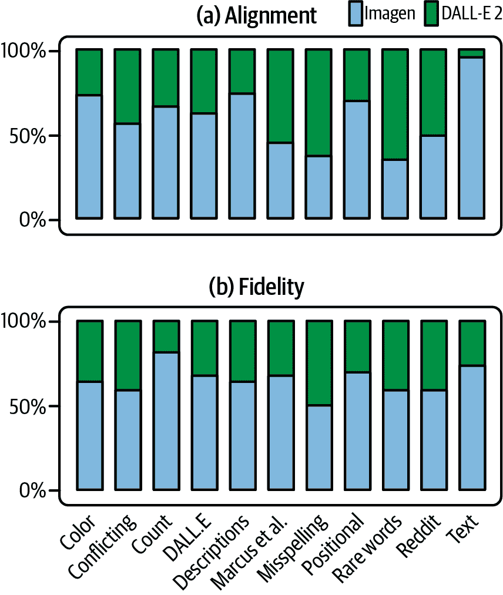

###### 图 13-18\. 在对齐和图像保真度方面比较 Imagen 和 DALL.E 2（来源：[Saharia 等人，2022](https://arxiv.org/abs/2205.11487)）

## Imagen 的示例

示例 Imagen 生成显示在图 13-19 中。

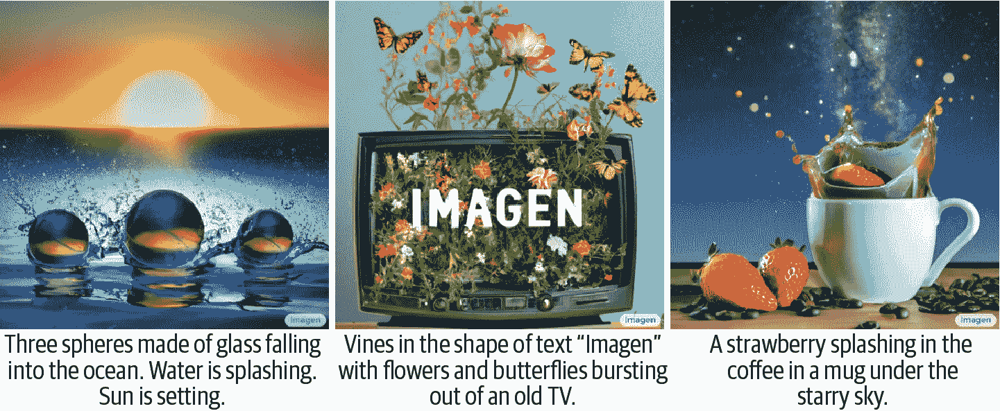

###### 图 13-19\. 示例 Imagen 生成（来源：[Saharia 等人，2022](https://arxiv.org/abs/2205.11487)）

# 稳定扩散

我们将探讨的最后一个文本到图像扩散模型是*稳定扩散*，由[Stability AI](https://stability.ai)于 2022 年 8 月发布，与[慕尼黑路德维希·马克西米利安大学计算机视觉与学习研究小组](https://ommer-lab.com)和[Runway](https://runwayml.com)合作。它与 DALL.E 2 和 Imagen 不同，因为它的代码和模型权重已经通过[Hugging Face](https://oreil.ly/BTrWI)公开发布。这意味着任何人都可以在自己的硬件上与模型互动，而无需使用专有 API。

## 架构

稳定扩散和之前讨论的文本到图像模型之间的主要架构差异在于它使用*潜在扩散*作为其基础生成模型。潜在扩散模型（LDMs）是由 Rombach 等人在 2021 年 12 月提出的，在论文“使用潜在扩散模型进行高分辨率图像合成”中。⁶ 该论文的关键思想是将扩散模型包装在一个自动编码器中，使得扩散过程在图像的潜在空间表示上运行，而不是在图像本身上运行，如图 13-20 所示。

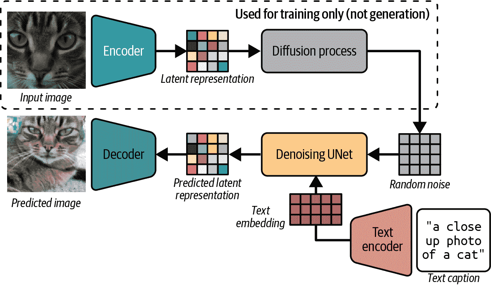

###### 图 13-20\. 稳定扩散架构

这一突破意味着去噪 U-Net 模型相对轻量化，与操作完整图像的 U-Net 模型相比。自动编码器处理将图像细节编码到潜在空间并将潜在空间解码回高分辨率图像的繁重工作，使扩散模型纯粹在潜在的概念空间中工作。这为训练过程带来了显著的速度和性能提升。

去噪过程也可以选择由通过文本编码器传递的文本提示引导。稳定扩散的第一个版本使用了 OpenAI 的预训练 CLIP 模型（与 DALL.E 2 中相同），但稳定扩散 2 使用了一个名为[OpenCLIP](https://oreil.ly/RaCbu)的自定义训练的 CLIP 模型，该模型是从头开始训练的。

## 稳定扩散的示例

图 13-21 展示了稳定扩散 2.1 的一些示例输出—您可以通过[Hugging Face](https://oreil.ly/LpGW4)上托管的模型尝试自己的提示。

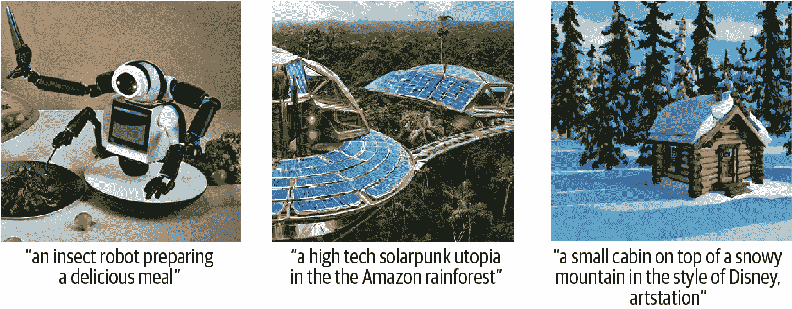

###### 图 13-21\. 稳定扩散 2.1 的示例输出

# 探索潜在空间

如果您想探索稳定扩散模型的潜在空间，我强烈推荐在 Keras 网站上进行的[演练](https://oreil.ly/4sNe5)。

# Flamingo

到目前为止，我们已经看过三种不同类型的文本到图像模型。在本节中，我们将探索一种多模态模型，它可以根据文本和视觉数据流生成文本。Flamingo 是 DeepMind 在 2022 年 4 月发表的一篇论文中介绍的，⁷是一系列视觉语言模型（VLMs），作为预训练的仅视觉和仅语言模型之间的桥梁。

在这一部分，我们将介绍 Flamingo 模型的架构，并将其与我们迄今为止看到的文本到图像模型进行比较。

## 架构

Flamingo 的整体架构显示在图 13-22 中。为了简洁起见，我们将仅探讨该模型的核心组件—视觉编码器、感知器重采样器和语言模式—以足够的细节来突出使 Flamingo 独特的关键思想。我强烈建议阅读原始研究论文，对模型的每个部分进行彻底审查。

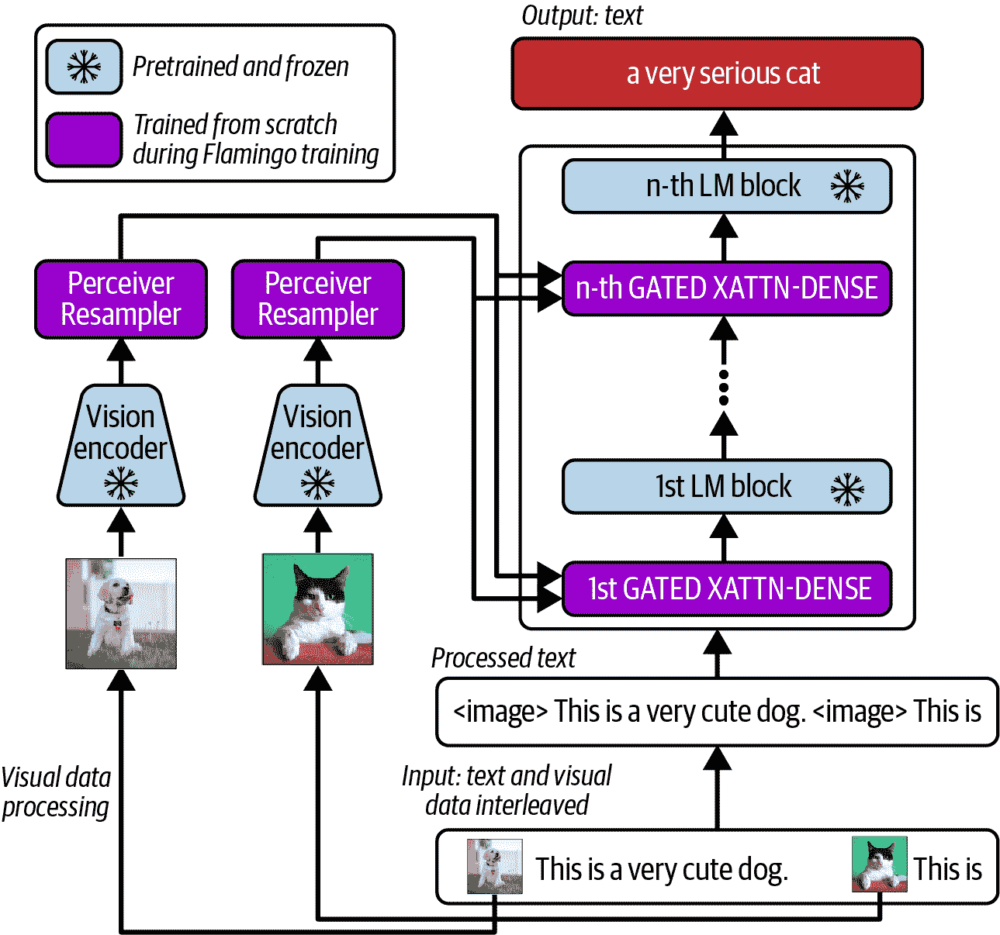

###### 图 13-22\. Flamingo 架构（来源：[Alayrac 等人，2022](https://arxiv.org/pdf/2204.14198.pdf)）

## 视觉编码器

Flamingo 模型与纯文本到图像模型（如 DALL.E 2 和 Imagen）之间的第一个区别是，Flamingo 可以接受交错的文本和视觉数据的组合。这里，*视觉数据*包括视频和图像。

视觉编码器的工作是将输入中的视觉数据转换为嵌入向量（类似于 CLIP 中的图像编码器）。Flamingo 中的视觉编码器是一个预训练的无归一化 ResNet（NFNet），由 Brock 等人在 2021 年介绍⁸—具体来说，是一个 NFNet-F6（NFNet 模型从 F0 到 F6，大小和功率逐渐增加）。这是 CLIP 图像编码器和 Flamingo 视觉编码器之间的一个关键区别：前者使用 ViT 架构，而后者使用 ResNet 架构。

视觉编码器是使用与 CLIP 论文中引入的对比目标相同的图像-文本对进行训练的。训练后，权重被冻结，以便对 Flamingo 模型的任何进一步训练不会影响视觉编码器的权重。

视觉编码器的输出是一个特征的 2D 网格，然后在传递给 Perceiver Resampler 之前被展平为 1D 向量。视频通过每秒采样 1 帧处理，并将每个快照独立通过视觉编码器传递以产生几个特征网格；然后在展平特征之前添加了学习的时间编码，并将结果连接成一个单一向量。

## Perceiver Resampler

传统编码器 Transformer（例如 BERT）中的内存需求随着输入序列长度呈二次方增长，这就是为什么输入序列通常被限制在一定数量的标记上（例如 BERT 中的 512 个）。然而，视觉编码器的输出是一个长度可变的向量（由于可变的输入图像分辨率和可变的视频帧数），因此可能非常长。

Perceiver 架构专门设计用于高效处理长输入序列。它不是对整个输入序列执行自注意力，而是使用固定长度的潜在向量，并仅将输入序列用于交叉注意力。具体来说，在 Flamingo Perceiver Resampler 中，*key*和*value*是输入序列和潜在向量的串联，而*query*仅是潜在向量本身。图 13-23 显示了视频数据的视觉编码器和 Perceiver Resampler 过程的图示。

！

###### 图 13-23。应用于视频输入的 Perceiver Resampler（来源：[Alayrac 等人，2022](https://arxiv.org/pdf/2204.14198.pdf)）

Perceiver Resampler 的输出是一个固定长度的潜在向量，传递给语言模型。

## 语言模型

语言模型由几个堆叠的块组成，以解码器 Transformer 的风格输出预测的文本延续。事实上，语言模型的大部分来自一个名为*Chinchilla*的预训练 DeepMind 模型。2022 年 3 月发表的 Chinchilla 论文⁹展示了一个设计得比同行要小得多的语言模型（例如，Chinchilla 的参数为 70B，而 GPT-3 的参数为 170B），同时在训练中使用了更多标记。作者表明，该模型在一系列任务上优于更大的模型，突出了在训练更大的模型和在训练期间使用更多标记之间优化权衡的重要性。

Flamingo 论文的一个关键贡献是展示了 Chinchilla 如何适应与插入语言数据（`Y`）一起工作的额外视觉数据（`X`）。让我们首先探讨语言和视觉输入是如何结合以产生语言模型的输入的（图 13-24）。

首先，文本通过用`<image>`标记替换视觉数据（例如图像），并使用`<EOC>`（块结束）标记将文本分成*块*。每个块最多包含一个图像，该图像始终位于块的开头，即假定后续文本仅与该图像相关。序列的开头也用`<BOS>`（句子开头）标记。

接下来，序列被标记化，每个标记被赋予一个索引（`phi`），对应于前面的图像索引（如果在块中没有前置图像，则为`0`）。这样，文本标记（`Y`）可以被强制只与对应于其特定块的图像标记（`X`）进行交叉关注，通过掩蔽。例如，在图 13-24 中，第一个块不包含图像，因此 Perceiver Resampler 的所有图像标记都被掩盖。第二个块包含图像 1，因此这些标记可以与图像 1 的图像标记进行交互。同样，最后一个块包含图像 2，因此这些标记可以与图像 2 的图像标记进行交互。

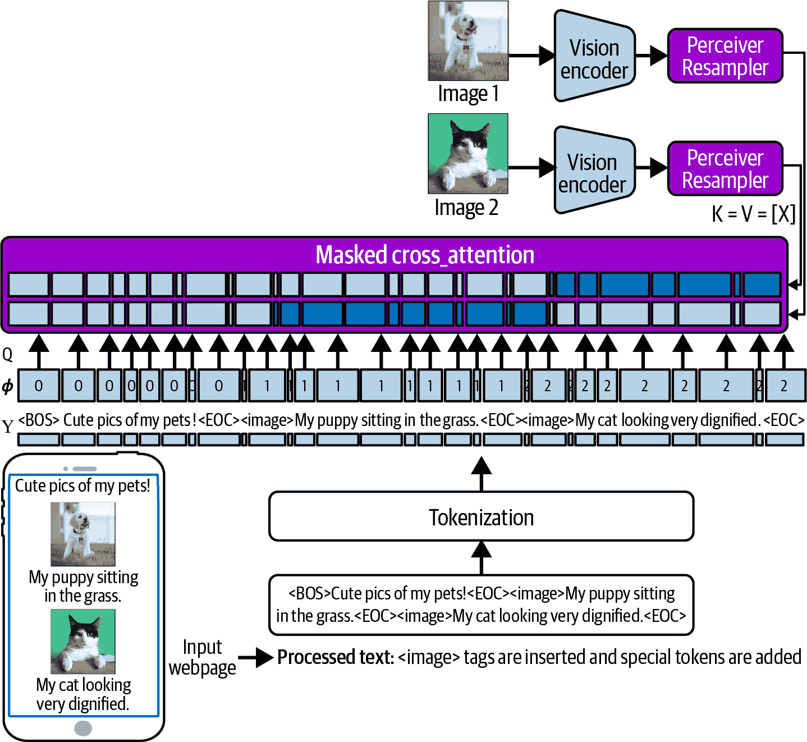

###### 图 13-24。掩蔽的交叉关注（XATTN），结合视觉和文本数据——浅蓝色条目被掩盖，深蓝色条目未被掩盖（来源：[Alayrac 等人，2022](https://arxiv.org/pdf/2204.14198.pdf))

现在我们可以看到这个掩蔽的交叉关注组件如何融入语言模型的整体架构中（图 13-25）。

蓝色的 LM 层组件是来自 Chinchilla 的冻结层，这些层在训练过程中不会更新。紫色的`GATED XATTN-DENSE`层作为 Flamingo 的一部分进行训练，包括混合语言和视觉信息的掩蔽交叉关注组件，以及随后的前馈（密集）层。

该层是*门控*的，因为它通过两个不同的 tanh 门传递来自交叉关注和前馈组件的输出，这两个门都初始化为零。因此，当网络初始化时，`GATED XATTN-DENSE`层没有贡献——语言信息直接通过。`alpha`门控参数由网络学习，随着训练的进行逐渐混合视觉数据的信息。

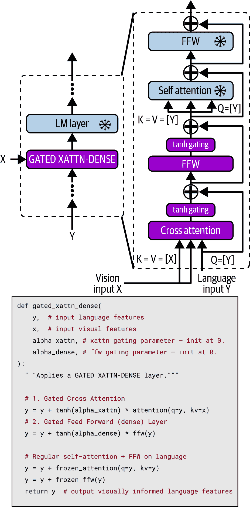

###### 图 13-25。Flamingo 语言模型块，包括来自 Chinchilla 的冻结语言模型层和一个`GATED XATTN-DENSE`层（来源：[Alayrac 等人，2022](https://arxiv.org/pdf/2204.14198.pdf)）

## 来自 Flamingo 的例子

Flamingo 可以用于各种目的，包括图像和视频理解，对话提示和视觉对话。在图 13-26 中，我们可以看到 Flamingo 的一些示例。

###### 图 13-26。从 80B 参数 Flamingo 模型获得的输入和输出示例（来源：[Alayrac 等人，2022](https://arxiv.org/pdf/2204.14198.pdf)）

请注意，在每个示例中，Flamingo 以真正的多模式风格混合文本和图像信息。第一个示例使用图像代替文字，并能够建议一个适当的书籍来继续提示。第二个示例展示了视频中的帧，Flamingo 正确地识别了行动的后果。最后三个示例都展示了 Flamingo 如何交互使用，通过对话提供额外信息或通过进一步提问进行探究。

看到一台机器能够回答如此广泛的模态和输入任务范围内的复杂问题，真是令人惊讶。在论文中，作者们量化了 Flamingo 在一组基准任务上的能力，并发现在许多基准测试中，Flamingo 能够超越专门针对特定任务的模型的性能。这突显了大型多模型可以迅速适应各种任务，并为开发不仅仅局限于单一任务的 AI 代理铺平了道路，而是真正可以在推理时由用户引导的通用代理。

# 总结

在本章中，我们探讨了四种不同的最先进多模型：DALL.E 2，Imagen，Stable Diffusion 和 Flamingo。

DALL.E 2 是来自 OpenAI 的大规模文本到图像模型，可以根据文本提示生成各种风格的逼真图像。它通过将预训练模型（例如 CLIP）与先前作品（GLIDE）中的扩散模型架构相结合来工作。它还具有额外的功能，例如能够通过文本提示编辑图像并提供给定图像的变体。尽管它存在一些限制，例如不一致的文本渲染和属性绑定，但 DALL.E 2 是一个非常强大的 AI 模型，已经帮助推动生成建模领域进入一个新时代。

另一个超越先前基准的模型是 Google Brain 的 Imagen。这个模型与 DALL.E 2 有许多相似之处，例如文本编码器和扩散模型解码器。两个模型之间的一个关键区别是 Imagen 文本编码器是在纯文本数据上训练的，而 DALL.E 2 文本编码器的训练过程涉及图像数据（通过对比 CLIP 学习目标）。作者表明，这种方法在各种任务中取得了最先进的性能，通过他们的 DrawBench 评估套件。

稳定扩散是来自 Stability AI、CompVis 和 Runway 的开源产品。这是一个文本到图像的模型，其模型权重和代码都是免费提供的，因此您可以在自己的硬件上运行它。稳定扩散特别快速和轻量，因为它使用了一个在自动编码器的潜在空间上运行的潜在扩散模型，而不是图像本身。

最后，DeepMind 的 Flamingo 是一种视觉语言模型，即它接受交错的文本和视觉数据流（图像和视频），并能够继续通过附加文本提示的方式进行文本输出，类似解码器 Transformer 的风格。其关键贡献在于展示了如何通过视觉编码器和感知器重采样器将视觉信息输入到 Transformer 中，将视觉输入特征编码为少量的视觉标记。语言模型本身是 DeepMind 早期 Chinchilla 模型的扩展，经过调整以融入视觉信息。

所有这四个都是多模态模型强大性能的显著例子。未来，生成建模很可能会变得更加多模态化，AI 模型将能够通过交互式语言提示轻松跨越模态和任务。

阿迪蒂亚·拉梅什等人，“零样本文本到图像生成”，2021 年 2 月 24 日，https://arxiv.org/abs/2102.12092。

阿迪蒂亚·拉梅什等人，“具有 CLIP 潜在特征的分层文本条件图像生成”，2022 年 4 月 13 日，https://arxiv.org/abs/2204.06125。

亚历克斯·拉德福德等人，“从自然语言监督中学习可转移的视觉模型”，2021 年 2 月 26 日，https://arxiv.org/abs/2103.00020。

亚历克斯·尼科尔等人，“GLIDE: 朝向逼真图像生成和编辑的文本引导扩散模型”，2021 年 12 月 20 日，https://arxiv.org/abs/2112.10741。

奇特万·萨哈里亚等人，“具有深度语言理解的逼真文本到图像扩散模型”，2022 年 5 月 23 日，https://arxiv.org/abs/2205.11487。

罗宾·隆巴赫等人，“使用潜在扩散模型进行高分辨率图像合成”，2021 年 12 月 20 日，https://arxiv.org/abs/2112.10752。

让-巴蒂斯特·阿拉拉克等人，“Flamingo: 一种用于少样本学习的视觉语言模型”，2022 年 4 月 29 日，https://arxiv.org/abs/2204.14198。

⁸ Andrew Brock 等人，“无归一化的高性能大规模图像识别”，2021 年 2 月 11 日，[*https://arxiv.org/abs/2102.06171*](https://arxiv.org/abs/2102.06171)。

⁹ Jordan Hoffmann 等人，“训练计算优化的大型语言模型”，2022 年 3 月 29 日，[*https://arxiv.org/abs/2203.15556v1*](https://arxiv.org/abs/2203.15556v1)。
