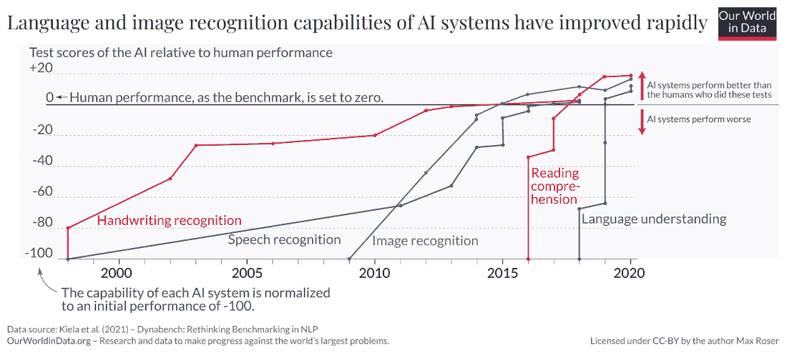
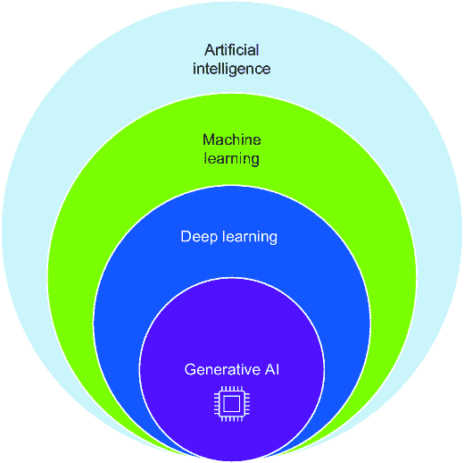
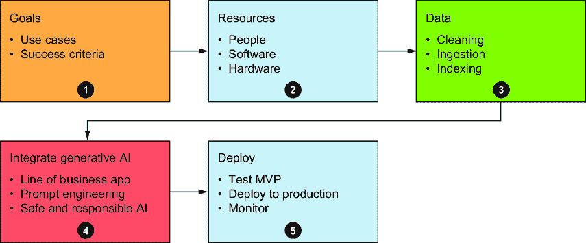

# 第一章：生成式人工智能简介

### 本章涵盖

+   生成式人工智能简介

+   使用生成式人工智能可以生成的示例

+   采用生成式人工智能时组织的指导

+   生成式人工智能的关键用例

+   生成式人工智能与其他人工智能类型的比较

人工智能（AI）熟悉且已经存在多年。我们都在使用搜索引擎、阅读产品推荐、收听定制播放列表或在我们用手机打字时使用建议的单词时使用它——所有这些动作都是由 AI 驱动的。然而，在 AI 领域，一切似乎都焕然一新，全世界都在热烈地讨论它，特别是关于生成式人工智能。

生成式人工智能，人工智能技术中一个迷人且独特的进步，已经引起了公众的兴趣并激发了全球的热情。OpenAI 的 ChatGPT 显著提升了其知名度，两个月内吸引了 1 亿用户——这是人类历史上任何技术最快的用户采用率。许多企业认为这项技术是下一波数字化转型和自动化的关键驱动力。生成式人工智能可以创建新的内容和流程，从而增强各种业务运营。它已经被用于生成各种内容，从图像、文本和音乐到更复杂的结果，如设计模式和代码。其潜力巨大且令人兴奋，能够生成几乎任何东西——从新的游戏关卡到新颖的食谱等等。

随着人工智能技术的飞速进步，实现人类水平性能的旅程显著加速。图 1.1 生动地展示了图像和语言识别能力如何迅速超越人类水平，标志着人工智能的一个重大里程碑。



##### 图 1.1 人工智能系统能力 [1]

本书探讨了这一新兴技术的各个方面。我们将讨论实际的应用案例以及企业如何将生成式人工智能集成到现有框架中。此外，我们还将探讨其技术基础、关键组件以及应用架构中必要的修改。此外，我们还将研究在生产环境中实施人工智能的最有效实践以及如何最优地管理其运营。

生成式人工智能与其他类型的 AI 根本不同，因为它涉及创造全新的东西，而不是修改或复制其训练数据。而传统人工智能基于输入数据进行预测，生成模型通过预测下一组单词来创造新事物，这些单词基于其生成和理解现实世界语义的能力。这些新事物涵盖了广泛的文本、图像、音乐和 3D 模型。我们将看到企业如何适应使用这些新技术。生成式人工智能，就像富有想象力的艺术家或富有创造力的小说家一样，从信息碎片中描绘出生动的画面，写出触动灵魂的诗歌，并从无中创造出整个宇宙。欢迎，亲爱的读者，来到令人敬畏的生成式人工智能世界——一个机器学习理解、分析和创造的世界。

## 1.1 这本书是关于什么的？

阅读此书后，您将全面了解生成式人工智能及其在企业中的应用。本书涵盖了生成式人工智能的基本技术和原理，包括基础模型、大型语言模型、嵌入以及相关的算法和架构。它将提供所需的知识，以识别和实施将生成式人工智能融入您组织的人工智能战略和项目中的步骤。此外，本书还展示了生成式人工智能在企业环境中开发和部署的实际案例和指南。它还探讨了架构模式、最佳实践和与现有系统和企业工作流程的集成模式的新兴应用。本书突出了企业应了解的新兴工具和趋势，包括提示工程、可解释人工智能、迁移学习和强化学习（特别是从人类反馈中学习的强化学习，或 RLHF）。

本书面向多元化的受众，包括开发者、软件架构师、数据科学家、企业决策者以及在各行各业企业中工作的高级用户。本书中现实世界企业场景的例子主要关注技术方面，并展示了生成式人工智能如何解决许多企业面临的独特挑战。这里讨论的基本原理同样适用于较小的组织和初创企业。此外，我们将探讨与生成式人工智能相关的挑战和风险，例如使用企业和个人数据、伦理考量、数据隐私、安全和安全考量，以便在将这些技术融入组织时做出明智的决策。

##### LLM 模型和平台

本书主要使用 Azure OpenAI 和 OpenAI，这是顶级的大型语言模型和发布平台。它们已经投入生产近两年（截至撰写时），是最稳定、经过测试且适用于云规模企业使用的。成千上万家企业依赖并使用这些平台。

目标是帮助您理解生成式 AI 以及如何利用新技术为您的企业服务。即使您使用不同的 LLM，这些概念和原语也是相同的。在本书中，我们还将看到其他 LLM 和提供商的示例，了解这些概念是如何相同的，以及 API 和 SDK 是如何类似于 OpenAI 的。我们还深入探讨了各种开源模型。

最后，许多这些模型仅适用于企业账户，并不对所有人开放。因此，我无法访问所有这些模型，但我可以访问 Microsoft 堆栈，这也是我们在这里使用它的另一个原因。

## 1.2 什么是生成式 AI？

生成式 AI 并非 AI 领域的新兴领域，但最近它获得了更多的普及和关注。它可以在各种输出中生成新的内容——从逼真的人类面孔和有说服力的文本，到创作音乐和开发新型药物化合物。这种新的 AI 技术涉及复制现有模式、想象新的模式、构建新的场景以及创造新的知识。



##### 图 1.2 生成式 AI 概述

如图 1.2 所示，生成式 AI 是 AI 的一个子领域，它通过大量数据训练来学习底层模式和分布。其神奇之处在于它能够生成新颖和原创的内容，这是以前被认为仅是人类独创性的专属领域。

机器学习和深度学习为我们理解生成式 AI 提供了必要的根本技术。它们为我们提供了导航 AI 领域和了解数据工程、模型训练和推理背后的过程的工具箱。随着我们通过本书的进展，我们将应用这些原则，但不会深入细节。已有多本书籍专门讨论这两个主题，对于细节，读者更明智的做法是查阅那些书籍。

在最简单的层面上，机器学习（ML）是关注计算机如何从数据中学习的科学学科。在机器学习中，我们不是明确编程计算机执行任务，而是开发能够从数据中学习并基于数据做出预测或决策的算法。这种数据驱动的决策适用于众多现实世界场景，从电子邮件中的垃圾邮件过滤到电子商务平台上的推荐系统。

深度学习（DL），作为机器学习的一个子集，进一步发展了这一概念。它使用具有多个层的人工神经网络。这些网络试图模拟人类大脑的行为——尽管是简化的形式——以从大量数据中学习。虽然单层神经网络仍然可以做出近似预测，但额外的隐藏层可以帮助优化其准确性。深度学习推动了今天许多 AI 应用，并有助于以改进的效率、速度和规模执行任务。

人工智能模型是一种复杂的算法结构，在大量数据集上训练以自主执行特定任务，如文本生成、翻译和决策。这些模型通过学习数据模式来模仿人类的认知能力，这使得它们能够理解和生成自然语言。一旦训练完成，开发者应认识到这些模型可以独立地使用机器学习和深度学习技术处理和分析数据。机器学习模型将数学框架应用于数据以进行预测，而深度学习模型则使用神经网络处理涉及非结构化数据的复杂任务。本质上，人工智能模型是一个自给自足的工具，在训练后可以根据学习到的数据模式执行智能任务，这对于创建智能应用至关重要。

生成式人工智能是深度学习的一个分支。许多人错误地认为 ChatGPT 是生成式人工智能。ChatGPT 是一个使用生成式人工智能最简单形式的网络应用程序。ChatGPT 的兴起和流行让许多人接触到了生成式人工智能，而被称为大型语言模型（LLM）的其他生成模型的力量，正如其名称所暗示的，与语言相关。OpenAI 在多样化的互联网文本上训练 ChatGPT 以产生类似人类的对话。除了 ChatGPT 之外，表 1.1 概述了今天使用的某些关键生成式人工智能模型；这些模型根据生成式人工智能领域类型分组：语言、图像和代码生成。

##### 表 1.1 流行的人工智能生成模型

| 名称 | 描述 | 领域 |
| --- | --- | --- |
| 生成式预训练转换器（GPT）  | OpenAI 开发的一个大型语言模型，在大量文本和代码数据集上训练，可以生成文本、翻译语言、编写各种类型的创意内容，并能够提供信息丰富的回答。GPT4-Omni（更常被称为 GPT-4o）是一个多模态模型。在撰写本文时，它是最新版本，是 GPT-4 的重大升级，提供了速度、成本和功能上的改进。 | 语言/多模态  |
| Llama 3  | Meta 最近发布了自然大型语言模型的第三个版本，在特殊许可证下开源。这些模型有多种大小和不同的功能。 | 语言  |
| Claude 3  | Anthropic 公司推出了 Claude 3 模型系列，包括 Claude 3 Haiku、Claude 3 Sonnet 和 Claude 3 Opus。这些模型提供了一系列功能，其中 Opus 是最智能的。它能够执行复杂任务，展现出接近人类的理解和流畅度。与 OpenAI 的 ChatGPT 类似，Claude 可以根据提示生成文本、编写代码、总结和推理等。 | 语言  |
| Cohere Command | Cohere 提供了其 Command 系列中的两个模型（Command R 和 Command R+）。虽然这些 LLMMS 优化了各种用例，但 Cohere 的新大型语言模型 Command R+ 优化了对话交互和长上下文任务。它旨在对复杂的检索增强生成（RAG）工作流程和多步骤工具使用提供高性能。 | 语言/多模态 |
| Mistral | Mistral 大型语言模型是专为文本生成和其他语言任务设计的先进人工智能模型。它们拥有不同尺寸的模型，从一系列开源模型（Mistral-7B、8x7B 和 8x22B）到优化的商业模型（Mistral 小型、中型和大型），每个模型都针对不同的推理复杂度和工作负载进行了定制。 | 语言 |
| Gemini | Gemini 是谷歌的新多模态模型，能够理解文本、图像、视频和音频。它将提供不同尺寸（超大型、专业型和纳米型），每个尺寸都有不同的功能。 | 语言/多模态 |
| DALL-E | OpenAI 开发的视觉人工智能模型，可以从文本提示创建逼真的图像。 | 图像 |
| Stable Diffusion | 这是一个开源的图像生成模型，可以从提示输入生成图像。它主要用于根据文本描述生成详细图像，也可以应用于其他任务，如修复、扩展和生成图像到图像的翻译。 | 图像 |
| Midjourney | Midjourney 是一家名为 Midjourney, Inc. 的初创公司使用自然语言提示进行图像生成的模型，类似于 OpenAI 的 DALL-E 和 Stable Diffusion。 | 图像 |
| CodeWhisperer | CodeWhisperer 是一个 AWS 代码生成模型，可以在多种编程语言中生成代码，包括 Python、Java、JavaScript 和 TypeScript。 | 代码 |
| CodeLlama | CodeLlama 是基于 Llama 2 构建的大型语言模型，专门针对代码进行训练。它提供多种尺寸，并支持多种流行的编程语言。 | 代码 |
| Codex | Codex 是一个专门针对代码进行训练的大型语言模型，用于帮助代码生成。它支持超过十种编程语言，包括一些常用的，如 C#、Java、Python、JavaScript、SQL、Go、PHP 和 Shell 等。 | 代码 |

以下列表描述了今天生成式人工智能应用的一些领域。随着生成式人工智能技术的发展，我们预计将看到更多创新和创造性的应用。

+   *图像*——这项技术可以创建现实中不存在的真实人物、物体和场景的图像。它被用于各种目的，例如为游戏和娱乐创建虚拟世界，为电子商务生成逼真的产品图像，以及为其他人工智能模型提供训练数据。

+   *视频*—创建现实中不存在的内容的视频。这项技术用于多种目的，例如为电影和电视剧制作特效、为其他 AI 模型生成训练数据以及为营销和广告创建个性化视频内容。

+   *文本（语言）*—这项技术创建逼真的文本，例如新闻文章、博客文章和创意写作。它用于多种目的，例如为网站和社交媒体生成内容、创建个性化营销材料和创建合成数据。

+   *文本（代码）*—生成式 AI 模型在开发者编写代码时提供增强和辅助。GitHub 的研究发现，使用其 Copilot 功能的开发者感觉生产力提高了 88%，在重复性任务上的速度提高了 96%。

+   *音乐*—生成式 AI 模型正被用于创作原创和富有创意的新音乐。这项技术服务于多种目的，例如为电影和电视剧创作音乐、生成个性化播放列表以及为其他 AI 模型创建训练数据。

我们将在下一章深入探讨生成式 AI 是如何工作的，但就目前而言，让我们讨论一下可以使用这项技术生成的内容以及它如何帮助您的企业。

## 1.3 我们可以生成什么？

当涉及到使用生成式 AI 生成事物时，天空才是极限。正如之前所讨论的，我们可以生成文本、图像、音乐、代码、声音甚至设计。在我们查看可以生成的示例之前，值得注意的是，生成式 AI 并不像人类那样理解内容。它使用数据中的模式（其训练集的一部分）来生成新的、类似的数据——生成内容的品质和相关性直接关联到训练数据的品质和相关性。

### 1.3.1 实体提取

我们可以使用生成式 AI，特别是大型语言模型（LLM），从文本中提取实体。实体是我们感兴趣的信息片段。在过去，我们需要使用命名实体识别（NER）模型进行实体提取；此外，该模型需要看到数据，并作为其数据集的一部分进行训练。有了 LLM 模型，我们无需任何训练即可完成这项工作，并且它们更加准确。虽然传统的 NER 方法有效，但它们通常需要人工努力和特定领域的定制。LLMs 显著减轻了这一负担，为各个领域提供了更高效且通常更准确的 NER 方法。一个关键原因是 Transformer 架构，我们将在接下来的几章中介绍。这是一个传统 AI 比生成式 AI 更加僵化和缺乏灵活性的绝佳例子。

在这里，我们将使用 OpenAI 的 GPT-4 模型从文本中提取姓名、公司名称、地点、电子邮件和电话号码：

****从下面的文本中提取姓名、公司、电子邮件和电话号码：

你好。我叫 Amit Bahree。我来自华盛顿州西雅图的 Acme 保险公司。我的同事提到你对了解我们的全面福利政策感兴趣。你方便的时候能给我回个电话（555）111-2222，我们可以一起讨论福利？我可以在周一至周五的正常工作时间联系到。如果你愿意，你也可以通过 aweomseinsrance@acme.com 邮箱联系我。谢谢，Amit。

我们可以在图 1.3 的输出中看到模型提取的实体。


##### 图 1.3 实体提取

### 1.3.2 生成文本

以多种方式生成文本是生成式 AI 的基本功。我们可以生成各种内容，如诗歌、笑话和个性化内容。在这个例子中，我们将使用 GPT-4 为一本关于生成式 AI 的新书生成图书发行邮件。我们向模型提供一个包含我们要求和一些背景信息的提示，以便构建。我们设定场景，概述要求，并添加额外的背景信息，如文本的语气，这将为我们生成邮件。

由于底层模型（称为基础模型，将在下一章中介绍）的广泛性质，它也擅长理解语法和拼写错误。例如，我们拼写错了“pracrtices”和“architectes”，但它都理解了：

** 为即将在所有书店上市的全新生成式 AI 书籍撰写一封简短的图书发行邮件。本书涵盖了生成式 AI 的介绍、不同类型和应用场景，以及企业最佳实践，包括它们如何将这项新的 AI 技术融入其业务流程。本书由 Manning 出版，作者为 Amit Bahree。本书名为《生成式 AI 在行动：企业 AI 的实际应用与案例研究》，目标读者为开发人员和企业架构师，语气友好且令人兴奋。

1.  邮件的标题应该是什么？

1.  邮件正文应该是什么？

我们得到了以下相当不错的回答：

1.  ** 1. 主题行：“探索我们的新书《Amit Bahree 的“生成式 AI 在行动”》中生成式 AI 的力量！”

1.  2. 邮件正文：

亲爱的 [收件人姓名]，

我很高兴地宣布，由 Amit Bahree 撰写并由 Manning 出版的引人注目的新书《生成式 AI 在行动：企业 AI 的实际应用与案例研究》已发布。

我们动态的商业环境需要尖端解决方案，生成式 AI 正是如此。它是科技行业最令人兴奋的进步之一，并且可能成为您业务的变革者。无论您是开发者还是企业架构师，这本书都是您利用生成式 AI 力量的入场券。

“生成式人工智能实战”揭示了生成式人工智能的复杂性。它提供了一个易于理解的介绍，深入探讨了其不同类型、用例以及它如何能够革新业务流程。此外，它还提供了企业将这一前沿技术融入运营的最佳实践。

这是您可以从这次启发性的阅读中期待的内容：

+   生成式人工智能的全面介绍。

+   探索各种类型的生成式人工智能及其现实世界的应用。

+   通过案例研究展示了企业如何利用生成式人工智能。

+   关于在您的企业中实施生成式人工智能的最佳实践的宝贵指导。

我们精心挑选了这本书，使生成式人工智能对任何渴望理解和使用它的人都能触手可及。因此，无论你是 AI 的新手还是寻求保持在技术进步前沿的资深专业人士，“生成式人工智能实战”正是你一直在等待的资源。

我们很高兴地分享，“生成式人工智能实战”现在在所有主要书店都有售。今天抓起你的副本，开始你的用生成式人工智能改变业务的旅程。

感谢您的持续支持，祝您阅读愉快！

最好的祝愿，

[您的姓名]

[您的职位]

[您的联系信息]

### 1.3.3 生成图像

我们不仅限于仅生成文本——我们可以使用提示生成图像。为了明确，模型不会找到满足这些属性的可比图像；相反，它会生成一些全新的东西，这些东西在现实中并不存在。如果我们要求一些在现实世界中不可能存在的奇异事物，比如一只狗坐在桌子旁，戴着眼镜，在泰姬陵的背景下写书，这都没有关系。AI 可以分解并理解每个方面，然后利用这些信息创造新的东西，就像艺术家一样。在图 1.4 中，我们使用 OpenAI 的 DALL-E 3 模型根据提示生成图像。

****生成一张狗戴着眼镜坐在桌子旁，用电脑编写关于人工智能的书籍的图像。让它成为一张积极的图像，背景是远处窗户中金色的泰姬陵。


##### 图 1.4 使用 DALL-E 3 进行图像生成

### 1.3.4 生成代码

当思考生成代码时，将 AI 视为能够创建一些函数和例程，而不是能够创建完全功能的应用程序是有帮助的。大量的代码是关于不同运行时和框架的脚手架，而不是关于精确的业务逻辑。在这些场景中，代码生成可以帮助提高开发者的生产力。在以下示例中，我们使用 GPT-3.5 为经典的“Hello, World！”函数生成代码。我们可以给出以下提示，它将为我们生成代码。

****为一位新手开发者编写一个使用 OpenAI API 的 Python“Hello World”等效代码，并将输出翻译成法语。

你会得到类似于列表 1.1 的答案，包括启动所需的步骤，这令人印象深刻。当然，这只是一个说明性的例子，用来展示模型的力量——理解请求的上下文和规则，包括编程语言、软件开发工具包（SDK）、要使用的包，最后生成代码。此代码不遵循既定的最佳实践（例如，不应该在代码中包含 API 密钥）。

##### 列表 1.1 “Hello, World!”调用 OpenAI 服务

```py
import os
from openai import OpenAI

gpt_model = "gpt-3.5-turbo"

# Replace with your actual OpenAI API key
client = OpenAI(api_key='your-api-key')

# Generate English text
response_english = client.chat.completions.create(
    model="gpt-3.5-turbo",
    messages=[
      {
        "role": "user",
        "content": "Hello, World!"
      }
    ],
    max_tokens=50
)
english_text = response_english.choices[0].message.content.strip()
print(english_text)

# Translate English text to French
response_french = client.chat.completions.create(
    model="gpt-3.5-turbo",

    messages=[
      {
        "role": "user",
        "content": "Translate the following English 
          ↪text to French: " + english_text
      }
    ],
    max_tokens=100
)

# This prints the translation to French
print(response_french.choices[0].message.content.strip())
```

运行脚本：

```py
python helloworld.py
```

输出如图 1.5 所示。请注意，由于 AI 的非确定性本质，每次运行时我们都会得到略微不同的响应。在第三章中，我们将看到如何使用不同的选项来控制一些这些行为，并引导模型变得更加确定。这些选项中的一些是大型语言模型（LLMs），这是一种生成式 AI 模型。我们将在下一章中探讨 LLMs。


##### 图 1.5 生成的代码

当我们概述代码生成时，大型语言模型（LLMs）可以在与代码相关的其他方面提供帮助，例如可解释性、优化和可读性。我们将在第五章中更详细地介绍代码。

### 1.3.5 解决逻辑问题的能力

生成式 AI 推理能力令人印象深刻。由于这些 AI 技术的涌现行为，如果我们可以通过提示表达问题域，我们就可以得到一个答案，以及逐步的思考过程。这类似于人类思考、分解和解决问题的方法。

例如，我们可以要求模型解决一个简单的数学方程，解释步骤，并给出答案。

****解决此问题，并逐步思考。

如果 x = 80 且 y = 60

当 y = 30 时，x 是多少？

这里是模型逐步工作并通过其步骤以及它所经历的精确思维过程的响应。使用传统 AI 实现这一点，在更广泛的领域空间中实现泛化，将是困难的，如果不是不可能的：

****鉴于当 y = 60 时 x = 80，我们可以建立一个比例来求解当 y = 30 时的 x。

在这个例子中，我们假设 x 和 y 之间存在线性关系，即 x 与 y 成正比。因此，当 y 减半时，x 也会减半。

使用给定的值：

x1/y1 = x2/y2

其中：

x1 = 80

y1 = 60

y2 = 30

我们正在尝试找到 x2。

我们可以设置方程：

80/60 = x2/30

解 x2，我们得到：

x2 = (80/60) * 30

这简化为：

x2 = (4/3) * 30

x2 = 40

因此，如果 y = 30，那么 x = 40。

传统人工智能无法解决这个问题，因为它对世界的理解很狭窄。它不能理解问题的意图来概述一个逐步的过程，因为传统人工智能不是生成性的。它只能遵循明确编程进它的指令。

然而，生成性人工智能可以理解问题的意图，因为它对世界的理解更广泛，并且可以生成逐步的过程。这还允许生成性人工智能模型的涌现行为。这种行为是概述逐步过程的能力。它不是模型任何单个组件中存在的，而是从组件的交互中产生的。下一章将在介绍大型语言模型时更详细地介绍涌现行为。

### 1.3.6 生成音乐

与我们使用提示生成图像的方式类似，我们也可以用音乐来做同样的事情。与文本相比，音乐生成仍然是一个新兴领域，但底层模型和技术正在快速发展。我们可以使用生成性人工智能音乐模型，如来自 Google 的 MusicLM 或 Meta 及其他公司的 MusicGen，来生成音乐。例如，如图 1.6 所示，我们可以使用一个提示，如“创建一首冥想曲，用长笛和吉他营造出平静和舒缓的感觉。音乐应该节奏缓慢，专注于营造平和与宁静的感觉。”这会生成几个 30 秒的剪辑。


##### 图 1.6 MusicLM 的截图

### 1.3.7 生成视频

Sora 是来自 OpenAI 的新人工智能模型，可以生成文本到视频场景。它可以根据用户的文本描述（提示）创建逼真和富有创意的场景。这些提示可以决定从艺术风格到想象中的图像或现实世界的情况。Sora 创建短视频剪辑，同时保持视觉质量并遵循用户的指令。

除了 Sora，还有一些其他模型可以生成视频。一个例子是 Runway 的 Gen-2，它具有与 Sora 相同的能力。Pika 是另一个由人工智能驱动的视频生成器，可以从提示生成视频和 3D 动画。Hotshot 是 Sora 的开源选项。最后，还有来自 StabilityAI 的 Stable Video Diffusion。与其它模型相比，Sora 似乎更先进，可以创建长达一分钟的剪辑，具有连贯的角色和动作。

## 1.4 企业用例

生成式 AI 领域正处于陡峭的上升轨迹上，市场价值估计从 2022 年的 17.5 亿美元飙升至到 2027 年的预计 330 亿美元，复合年增长率(CAGR)达到 80% [2]。彭博情报的行业专家预测，在十年内市场将扩大到 1.3 万亿美元，从 2022 年记录的 400 亿美元跃升 [3]。GenAI 的广泛应用在各个行业中都很明显，包括金融服务和客户关系管理，这得益于其增强洞察力和生产力的能力。考虑到 Gartner 预测到 2027 年 90%的服务提供商将采用 GenAI 进行软件开发 [4]，很明显，生成式 AI 不仅正在重塑现有的商业格局，而且也在为新的市场前景铺平道路。企业迅速将 GenAI 整合到其产品中，将自己置于这场技术革命的前沿和它带来的众多机会的前沿。

生成式 AI 是一种强大的技术，可以从现有内容或数据中创建新的内容或数据。许多企业在其组织内外使用它来满足不同的用例。其中一些是为了提高他们的工作流程或效率，而另一些则向客户提供更好的服务或产品。根据目的的不同，使用生成式 AI 的挑战也各不相同。例如，一个常见的挑战是当 AI 系统产生一些没有意义的东西时（即，它编造了东西——也称为幻觉）。这通常比外部处理更容易处理，因为客户可能对 AI 系统有更高的期望或更低的信任度。

有许多原因导致 AI 系统倾向于产生幻觉，但通常是因为底层模型无法在其训练数据中区分事实和虚构。大型语言模型(LLMs)被训练生成连贯、上下文感知的文本，而不是事实准确性的回应。当提示或上下文不准确但与任务相关时，它们往往会产生幻觉。我们将在本书的后面部分介绍幻觉以及可以用来减少它们的技巧。

表 1.2 概述了一些企业用例。这些用例是通用的，因为它们是更横向的例子，适用于多个行业。表 1.3 概述了一些特定行业的用例。

##### 表 1.2：生成式 AI 的企业横向用例

| 横向用例 | 描述 |
| --- | --- |
| 内容生成 | GPT-4 可以生成内容，如博客、报告、电子邮件和社交媒体帖子，这有助于企业扩大其内容营销的努力。  |
| 个性化营销 | 生成式 AI 可以创建个性化的营销内容，如电子邮件、着陆页和社交媒体帖子。这可以帮助企业更有效地接触目标受众并提高转化率。  |
| 客户服务 | 生成式 AI 可用于创建能够回答客户问题并解决问题的聊天机器人。这可以使人工客服代表有更多时间专注于更复杂的工作。许多这些聊天机器人都是通过类似企业 ChatGPT 的范式实现的。 |
| 风险管理 | 生成式 AI 可以识别和预测风险，如欺诈、网络攻击和供应链中断。这可以帮助企业降低风险并保护其资产。 |
| 合规性 | 生成式 AI 可以生成合规的文件，例如合同、报告和披露。这可以帮助企业节省时间和金钱，并降低违规风险。 |
| 软件开发 | 在软件开发中，生成式 AI 可以生成新代码、提供代码片段，甚至编写简单的软件，可能节省时间并减少错误。它还帮助文档化代码、重构、生成测试用例和优化现有代码。 |
| 数据增强 | 在数据科学和机器学习领域，当用于模型训练的真实数据不足时，生成式 AI 可以创建合成数据。 |
| 合同管理 | 生成式 AI 的关键应用案例是合同生成和合同理解——既创建法律文件的草案，又理解包含特定监管和区域法律要求的企业和特定公司政策的法律合同。这种方法减少了人为错误，并帮助企业做出明智的决策。 |

##### 表 1.3 生成式 AI 的行业特定应用案例

| 行业应用案例 | 描述 |
| --- | --- |
| 金融 | 在金融领域，生成式 AI 可以模拟不同场景以帮助决策、风险评估以及新金融产品和服务的开发。客户运营以增强服务和针对每位客户的解决方案基于交易和历史记录。 |
| 医疗保健 | 生成式 AI 用于开发新药和治疗，设计医疗设备，创建个性化患者治疗方案，并生成有关说明、风险和药物相互作用的病人文档。 |
| 制造业 | 生成式 AI 用于设计新产品、优化制造流程和改进质量控制。 |
| 零售和消费品 | 生成式 AI 用于个性化购物体验、推荐产品、管理库存、加速消费者研究、增强供应链等。 |
| 品牌和销售 | 市场营销和销售已经广泛使用 AI。生成式 AI 正在帮助提升行业的某些方面——特别是帮助我们理解实时客户趋势、嵌入到虚拟助手中的个性化接触以及动态的客户旅程。 |

这些只是生成式 AI 在企业的几个应用案例。随着技术的不断发展，我们可以期待看到更多创新和有影响力的应用。

## 1.5 不宜使用生成式 AI 的情况

在企业环境中使用生成式 AI 与个人出于个人原因使用它有很大不同。组织必须遵循适用于其行业的某些法规和期望，其中一些可能因地区而异。此外，还有其他财务、法律、技术和道德方面的考虑。如果 AI 生成的内容不正确、充满偏见，或者只是简单的不礼貌——这会引发什么问题？例如，如果 AI 聊天机器人搞砸了一个食谱，那没什么大不了的，但如果它给修理复杂机械的人提供了错误的指示，那就完全是另一回事了。

如果企业没有为生成式 AI 制定适当的道德准则，可能会导致意想不到的后果。生成式 AI 可以创造虚假信息和虚假内容，包括虚假新闻文章、虚假图像、敏感内容和恶意内容。图片不再值千言万语；有些图片做得太好，以至于越来越难以区分虚假和真实图像。在某些情况下，生成的输出也可能侵犯第三方版权材料。增加人工监督和贡献可以帮助解决这些挑战。

生成式 AI 模型也可能无意中放大训练数据中存在的偏见，导致产生具有问题性的输出，这些输出会持续传播刻板印象和有害意识形态。它们还可以生成虚构或不合逻辑的回应，这些回应没有基于事实（即，幻觉）。

公司需要有一个明确的计划来使用生成式 AI，并确保它与业务目标一致，例如它将如何影响销售、营销、商业、服务和 IT 工作。在生死攸关的决策中，确保有人参与其中，由人类作为最终决策者，AI 作为副驾驶协助。

## 1.6 生成式 AI 与传统 AI 有何不同？

传统 AI，现在有些人称之为窄 AI，是我们今天遇到的主要 AI 形式。它使用经典数据科学和系统方法，通过使用各种方法和技术从数据中提取洞察和知识。它通常包括以下步骤：数据收集、数据准备、数据分析、特征工程、训练和数据验证。传统 AI 在预定义的边界内预测事物，这些边界是编码在模型中的规则和指令。它只能根据预定义的条件、约束和潜在结果行事。因此，结果是确定性的且相对可预测的。例如，传统 AI 可以被编程来自动化客户服务，通过聊天机器人生成基于预定义脚本的响应。虽然这些系统在其规定的领域内非常有效，但它们仍然在自己的轨道上，不能学习并适应其编程知识之外的情况——这就是所谓的窄 AI。到目前为止，企业所做的大多数 AI 实现都是传统 AI。

相比之下，生成式 AI 倾向于概率方法，其结果是基于受输入数据和学习模式影响的概率计算得出的。这使得这些 AI 系统能够创建既没有硬编码也没有明确教授给系统的输出。生成式 AI 需要经典的数据科学流程，它在许多方面都增强了并补充了这一流程。生成式 AI 可以帮助处理新的数据类型和内容，评估生成输出的质量和有效性，并确保生成式 AI 的道德和负责任的使用。经典数据科学和生成式 AI 必须共同工作，从数据中创造价值和影响。

一个显著的区别是，与这些较新的生成式 AI 模型交流的方式是通过使用提示词，正如我们在示例中看到的那样。更正式地说，提示词是一组指令，告诉生成式 AI 系统我们想要创建哪种内容。提示词越好，结果越好。提示词应该根据你想要收到的响应类型以及你所使用的生成式 AI 的具体情况来定制。我们将在稍后更详细地介绍提示词工程。

提示词让我们能够更加表达自己，不仅概述要求和意图，还能通过语言捕捉同情和情感。提示词工程是开发者和企业的一个新兴领域，它更像是艺术而非科学。

****写一首关于提示词工程与传统 AI 的有趣俳句。

AI 生成的文本：

****老 AI 无趣，

通过提示词我们工程化得更多——

笑声连连，再来一次！

表 1.4 概述了广泛的类别，以展示生成式和传统 AI 架构之间的差异。同时，值得注意的是，不同类型的 AI 之间存在很多重叠。例如，聊天机器人可能会同时使用生成式和预测模型，根据对语言的学习理解生成响应，并预测用户可能认为最有帮助的响应类型。

##### 表 1.4 生成式 AI 与传统 AI 的区别

| 领域 | 区别 |
| --- | --- |
| 创建与预测 | 传统 AI 专注于预测或分类任务，基于现有数据识别某个事物或预测接下来会发生什么。生成式 AI 创建新的内容和输出，这些在原始数据中并不存在。  |

| 部署和推理 | 相比于生成式 AI，传统 AI 模型更简单，需要的计算资源更少，这使得它们可以在各种硬件上运行，从小型边缘设备到大型云集群，无所不在。这种云到边缘的灵活性对企业来说是一个巨大的优势。生成式模型庞大且复杂；大部分情况下，它们只能通过 API 在大型云计算节点上获得，这也有其他优势，例如，这些基础模型中编码的世界知识对每个人都是可用的。然而，还有其他需要考虑的约束。

注意：存在越来越多的较小开源模型可以在本地运行，但今天，它们仍然更多是实验性和初级的。许多人声称自己是 AI 质量（AIQ），类似于 OpenAI 的模型。鉴于生成式 AI 覆盖的广泛范围，出现了一套新的基准，例如斯坦福大学的语言模型全面评估（HELM），以及 Hugging Face 最近发布的开放 LLM 排行榜。我们将在本书后面关于评估和基准的部分深入探讨这些内容。

|

| 训练方法 | 生成式模型需要不同的训练方法（自监督和多任务学习），由于需要大量数据、模型大小和计算资源，因此这种方法更长且成本更高。管理和这些相关的成本和复杂性是巨大的，我们将在本章后面讨论这些问题。  |
| --- | --- |
| 训练数据集 | 生成式 AI 模型通常在大量现有内容的数据集上进行训练，而传统 AI 模型通常在较小标记数据集上进行训练。例如，用于图像生成的生成式 AI 模型可能是在数百万张图像的数据集上训练的。相比之下，用于图像分类的判别式 AI 模型可能是在几千个标记图像数据集上训练的。  |
| 模型复杂性 | 生成式 AI 模型通常比其他类型的模型更复杂，因为它们需要学习数据中的模式和关系，以生成与现有内容相似的新内容。  |
| 适应方法 | 传统 AI 除了标注更多数据和完成完整的机器学习循环（包括训练、部署和评估）之外，没有其他适应技术。相比之下，生成式 AI 拥有广泛的世界知识。有时，需要根据特定需求和任务对其进行定制，或者提炼内部私有和专有知识；这是通过适应来实现的。根据需要，可以使用各种技术。 |

## 1.7 企业应采取什么方法？

生成式 AI 可以弥补传统数据驱动 AI 系统的局限性，并提供一个非凡的工具包来构建更智能的应用和系统；对企业来说，可能性是广阔且令人兴奋的。想象一下设计能够随着时间的推移自我优化的系统，或者开发能够撰写电子邮件和报告、生成代码片段等的人工智能助手（Copilots），从而提高生产力和缩短上市时间。

许多组织可能会被生成式 AI 的兴奋和错失良机的恐惧所吸引，它看起来像是魔法。然而，事实是，拥有像 GPT-4 这样的基础模型，一个大型语言模型，本身并不会带来任何区别。这些高级 AI 系统必须像任何其他外部软件一样实施并连接到企业的业务线和流程。我们将在后续章节中看到如何实现这一点的例子。

在整体方法上，应该很少有变化；企业在整合生成式 AI 时仍应采取深思熟虑和战略性的方法。以下是一些关键考虑因素——这些涵盖了大多数企业需要考虑的各个方面，从战略到业务再到技术：

+   *循序渐进*。从小处着手，不要急于求成。从一个小的试点项目开始，以评估、学习和适应。这是一个复杂的技术，开发和部署有效的生成式 AI 应用需要时间。不要期望一夜之间看到结果。

+   *明确目标和合适的使用场景*。对企业来说，仔细评估潜在的使用场景并选择那些最有可能带来价值的使用场景非常重要。所选的使用场景将指导 AI 模型的选择、数据准备和资源分配。一些生成式 AI 应用已经比较成熟，并有着成功的记录，而其他应用仍处于早期阶段。

+   *建立治理政策*。生成式 AI 可以生成数据，其中一些可能敏感或有害。企业必须建立治理政策，以确保这些数据被负责任和安全地使用。这些政策应解决数据所有权、隐私和安全等问题。

+   *建立负责任的 AI 和伦理治理**。 考虑使用生成式 AI 的伦理影响是很重要的。建立一个独立的负责任的 AI 和伦理政策集，这些政策反映了公司的价值观，并且对于管理其声誉和品牌非常重要。这包括 AI 输出中的偏见、生成内容的潜在滥用、生成内容中的幻觉和错误细节，以及自动化人类以前执行的任务的影响。一个强大的 AI 治理和伦理框架可以帮助管理这些风险。

+   *实验和迭代**。 与计算机科学不同，AI，尤其是生成式 AI，是非确定性的，并且根据模型参数和设置，输出可能相当不同。与任何 AI 应用一样，在实施生成式 AI 时采取迭代方法是至关重要的。从小项目开始，从结果中学习，并逐步扩大规模。这种方法有助于管理风险并获得实践经验。

+   *为失败设计**。 目前大多数生成式 AI 模型作为云 API 商业上可用。因此，它们比更传统的 API 复杂，并且具有相当大的延迟。企业应遵循云最佳实践并为失败设计。他们还应考虑重试机制的最佳实践，包括指数退避策略、缓存、安全等。

+   *扩展现有架构**。 这些新的生成式 AI 端点是整个系统中的额外部分。因此，大多数组织将希望保持其现有的架构指导和实践，并扩展其现有的架构和最佳实践，而不是从头开始。需要纳入新的结构，如上下文窗口、令牌和嵌入等。

+   *带来你的数据**。 企业区别于其他企业的主要不同之处在于它们的专有数据和相关的提示；因此，确定在使用由 GenAI 驱动的应用程序时如何利用它们的专有内部数据至关重要。这需要基于手头的用例，如果不妥善管理，可能会迅速变得复杂，这将在后续章节中讨论，当我们谈到 RAG 时。

+   *管理成本**。 生成式 AI 复杂且成本高昂。成本通常以不同的方式衡量（例如，以令牌计），而不是以 API 调用计。对于企业来说，这许多都是新的和不同的，成本很容易失控。

+   *补充传统 AI**。 在大多数情况下，生成式 AI 将有助于协助企业现有的传统 AI 投资。这两套技术不是相互排斥的，而是相互支持的。

+   *开源模型与商业模型**.* 一些模型是商业可用的，例如 Azure OpenAI 的 GPT 模型，而一些是开源的，例如 Stable Diffusion。根据用例，验证要使用哪些模型、许可允许什么以及已经覆盖了哪些法律和监管方面非常重要。

## 1.8 架构考虑因素

假设您是一位看到所有关于生成式 AI 的新闻以及主要科技公司各种产品公告的企业开发者。在这种情况下，您可能会认为对于 AI 来说，一切都已经改变。然而，在现实中，并没有什么改变。

从企业角度来看，需要考虑生成式 AI 的新方面—大多数，如果不是全部，这些都会是添加到现有架构最佳实践和指南中的内容，而不是完全摒弃。我们将在本书的后续章节中详细说明，但新的架构模式必须在高层次上得到考虑。我们已经涉及了许多这些方面，但关键的是

+   *提示词*—我们将看到如何评估围绕提示词的工程和管理方面，包括令牌和上下文窗口。

+   *模型适应性*—目标是使输出更适合特定任务。

+   *将生成式 AI 集成到现有的企业业务系统中*—这些新的 AI 模型本身并不能解决商业问题。

+   *设计容错*—在构建关键任务系统时，这个方面本身并不是什么新事物，但许多人仍然走捷径。

+   *成本和投资回报率**—*这些生成式 AI 系统非常昂贵，因为其背后的计算成本也非常高。随着时间的推移，成本将会下降，但它们必须在前瞻性地规划和设计。例如，OpenAI 的 GPT-3.5 Turbo 的成本下降了 90%，而其质量与 GPT-3 相比也提高了 90% [5]。

+   *开源（OSS）与商业模式的政策和方法**—*每周都会有新的模型为 AI 系统提供动力并发布。有些是商业的，有些是开源的，具有不同的许可结构。

+   *供应商**—*目前有少数供应商的企业可以使用，但很快就会有更多。今天，最成熟的两个是 OpenAI 和 Azure OpenAI。前者针对小型公司和初创企业，而后者针对企业。谷歌也在 Google Cloud 上发布其生成式 AI 套件，亚马逊也有类似的公告。此外，许多资金充足的初创公司也宣布了类似的产品，如 Anthropic 和 Mistral。企业需要将它们视为供应商，并确定他们希望利用和依赖哪一个。

## 1.9 因此，您的企业希望使用生成式 AI。接下来该怎么做？

您的企业已经迈出了使用生成式 AI 推动创新和效率的关键一步。然而，了解接下来会发生什么对于最大化这种先进技术的利益和减轻风险至关重要。

要开始，我们将使用实施企业 ChatGPT 的例子，并概述在高级别上所需的步骤。在接下来的几章中，我们将深入探讨更多技术细节，包括实施指导和最佳实践。图 1.7 展示了企业中典型工作流程的高级概述。



##### 图 1.7 实施生成式 AI 的高级概述

您应该从为您的聊天机器人设定明确的目标开始。您希望通过生成式 AI 解决哪些挑战？它如何能帮助您最多？这可以是任何事情，从为营销创建内容到通过聊天机器人增强客户服务，预测商业计划，甚至创新新产品或服务。在我们的例子中，我们正在构建一个企业 ChatGPT，例如 OpenAI 的 ChatGPT，但它是部署并在企业环境中运行，使用内部和专有数据，并且只有授权用户可以访问。

接下来，我们需要确保我们有必要的资源可用，即具有正确能力的人员、合适的软硬件框架、定义成功指标，以及适当的治理和伦理原则。

然后，考虑数据。在我们的例子中，企业聊天机器人需要访问相关的高质量企业数据，用户可以加以利用。这些数据需要被摄取和索引以帮助回答专有问题。在此之前，数据必须得到妥善管理，确保隐私和遵守法律。记住，输入数据的质量将影响输出质量。

接下来，我们需要将企业聊天机器人集成到解决我们试图解决的问题和用例的业务应用程序中。作为一家企业，我们还将希望解决与生成式 AI 相关的风险，并实施关于安全和负责任 AI 的企业指导。

最后，尽管我们可能已经准备好在生产中部署，但实施生成式 AI 不是一个一次性的事件，而是一个旅程。它需要持续的监控、测试和微调，以确保其最优和负责任地运行。从较小的、可管理的项目开始，随着您在处理这项强大技术方面获得更多信心和专业知识，逐步扩大规模是个好主意。

采用生成式 AI 是一项重大的承诺，可能会改变您的企业，但它需要周密的规划、适当的资源、持续的监控和对伦理考量的坚定不移的关注。有了这些，您的企业可以享受到生成式 AI 的众多好处。

## 摘要

+   生成式 AI 可用于多个用例，例如实体提取；生成特定和个性化的文本、图像、代码和音乐；解释文本；以及解决逻辑问题。

+   生成人工智能的应用案例可以横跨大多数行业（如客户服务和个性化营销）或特定行业（如金融中的欺诈检测或医疗保健中的个性化治疗方案）。

+   传统人工智能主要在预定义的狭窄通道中运行，只能在那些维度上行动，与更广泛且更具灵活性的生成人工智能不同。

+   本章概述了企业在采用和实施生成人工智能时需要考虑的方法和架构。
