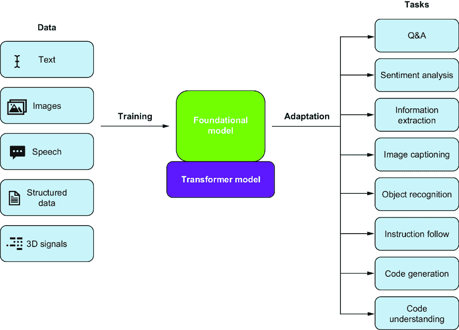
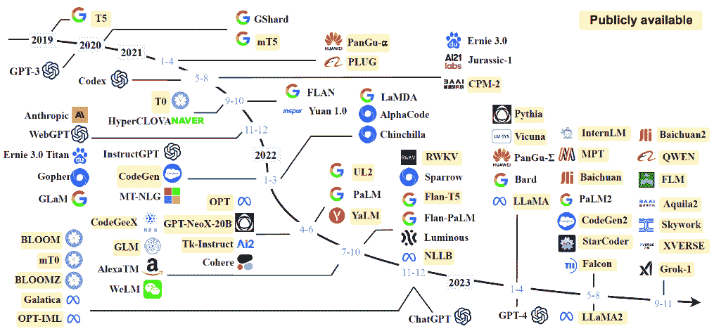
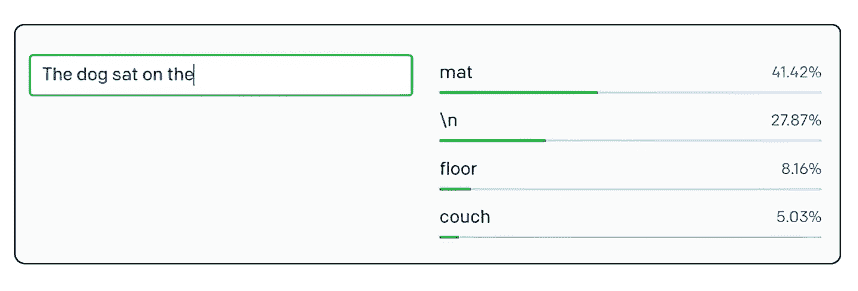
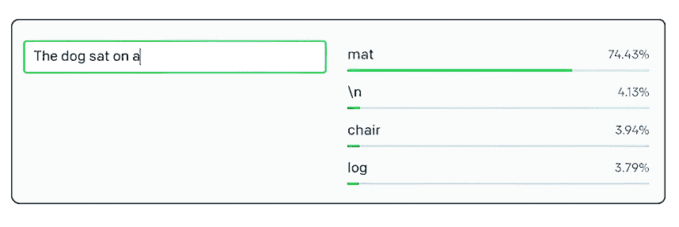
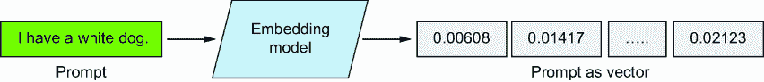
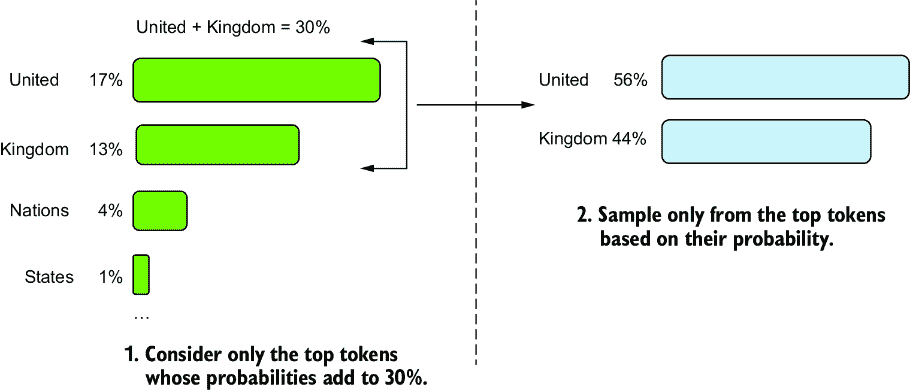
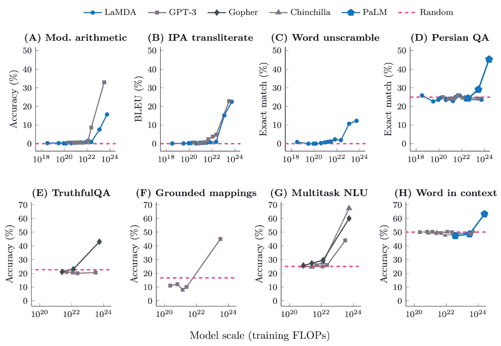

# 第二章：大型语言模型简介

### 本章涵盖

+   LLMs 概述

+   由 LLMs 驱动的关键用例

+   基础模型及其对 AI 发展的影响

+   LLMs（大型语言模型）的新架构概念，例如提示（prompts）、提示工程（prompt engineering）、嵌入（embeddings）、标记（tokens）、模型参数（model parameters）、上下文窗口（context window）和涌现行为（emergent behavior）

+   小型语言模型概述

+   开源和商业 LLMs 的比较

大型语言模型（LLMs）是基于给定输入能够理解和生成类似人类文本的生成式 AI 模型。LLMs 是许多自然语言处理（NLP）任务的基础，如搜索、语音转文本、情感分析、文本摘要等。此外，它们是通用语言模型，经过预训练，可以针对特定任务和目的进行微调。

本章探讨了 LLMs 的迷人世界及其对人工智能（AI）的变革性影响。作为 AI 领域的一项重大进步，LLMs 在理解和生成类似人类文本方面表现出惊人的能力，从而使得 LLMs 在各个行业得到广泛应用。在这里，我们深入探讨 LLMs 的关键用例、不同类型的 LLMs 以及颠覆了 AI 发展的基础模型概念。

本章讨论了 LLMs 的基本概念，如提示、提示工程、嵌入、标记、模型参数、上下文窗口、Transformer 架构和涌现行为。最后，我们比较了开源和商业 LLMs，突出了它们的优缺点。在本章结束时，您将全面了解 LLMs 及其对 AI 应用和研究的影响。LLMs 建立在基础模型之上；因此，在更深入地讨论 LLMs 之前，我们将首先概述这些模型是什么。

## 2.1 基础模型概述

由斯坦福研究人员于 2021 年提出的基础模型在很大程度上改变了 AI 系统的构建方式。它们不同于特定任务的模型，转向了更广泛、更适应性的模型，这些模型在大数据量上训练。这些模型在多种自然语言任务上表现出色，如机器翻译和问答，因为它们从大量的文本和代码数据集中学习通用的语言表示。这些表示可以用于执行各种任务，甚至包括它们没有明确训练过的任务，如图 2.1 所示。

在更技术性的术语中，基础模型利用了已建立的机器学习技术，如自监督学习和迁移学习，使它们能够将获得的知识应用于各种任务。通过深度学习开发，这些模型采用多层人工神经网络来理解复杂的数据模式；因此，它们在处理非结构化数据方面的能力，如图像、音频和文本。这也扩展到 3D 信号——代表 3D 属性的数据，如捕获空间维度和深度的激光雷达传感器的 3D 点云、3D 医学成像（如 CT 扫描）或用于计算机图形和模拟的 3D 模型。这些可以用于基于 3D 数据进行预测，例如物体识别、场景理解和机器人以及自动驾驶车辆的导航。

注意：迁移学习是一种机器学习技术，其中为某一任务开发的模型被重新用作类似任务的起点。我们不是从头开始，而是使用先前任务的知识来在新任务上表现更好。这就像使用以前工作的知识来在新但相关的岗位上表现出色。

生成式 AI 和基础模型紧密相连。如前所述，在大量数据集上训练的基础模型可以适应执行各种任务；这种特性使它们特别适合于生成式 AI，并允许创建新内容。这些模型广泛的知识库允许有效的迁移学习，这可以用于在多个领域生成新的、上下文适当的内容。它们代表了一种统一的方法，其中单个模型可以生成各种输出，由于广泛的训练，它们提供了最先进的性能。如果没有基础模型作为骨干，就不会有生成式 AI 模型。



##### 图 2.1 基础模型概述

这里有一些常见的基础模型示例：

+   GPT（生成预训练转换器）家族是由 OpenAI 开发的 NLP 模型家族。它是一个在大量文本和代码数据集上训练的大型语言模型，这使得它能够生成文本、翻译语言、创作内容以及提供信息性的回答。GPT-4，在撰写本文时的最新版本，也是一个多模态模型——它既能处理语言也能处理图像。

+   Codex 是一个专门针对代码进行训练的大型语言模型，用于帮助代码生成。它支持超过十种编程语言，包括一些常用的，如 C#、Java、Python、JavaScript、SQL、Go、PHP 和 Shell 等。

+   Claude 是由一家名为 Anthropic 的初创公司构建的 LLM。与 OpenAI 的 ChatGPT 类似，当给出一定的提示时，它可以预测序列中的下一个标记，并可以生成文本、编写代码、总结和推理。

+   BERT（来自 Transformer 的双向编码器表示）是由谷歌开发的一种自然语言处理模型。它是一个双向模型，这意味着它可以从左到右和从右到左处理文本。这一特性使得它更擅长理解单词和短语的上下文。

+   PaLM（路径语言模型）及其继任者 PaLM2 是由谷歌开发的大型多模态语言模型。多模态模型可以同时处理文本、代码和图像，使其能够在这些模态中执行比仅在一个模态中操作的传统语言模型更广泛的任务。

+   Gemini 是谷歌最新的 AI 模型，能够理解文本、图像、视频和音频。它是一个多模态模型，描述为能够在数学、物理和其他领域完成复杂任务，以及理解和生成各种编程语言中的高质量代码。Gemini 是从头开始构建的多模态模型，这意味着它可以泛化并无缝地理解、操作和结合不同类型的信息。它也是谷歌所有 AI 工具的新总称，取代了 Google Bard 和 Duet AI，并被认为是对 PaLM 模型的继承。

一旦训练了基础模型，就可以通过微调其参数来将其适应广泛的下游任务。微调涉及调整模型的参数以优化模型以特定任务。这可以使用少量标记数据进行。通过为特定任务或领域微调这些模型，我们利用它们对语言的普遍理解，并补充以特定任务的知识。这种方法的好处包括时间和资源效率，以及显著的灵活性。我们还可以通过提示工程来调整模型，我们将在本章后面讨论。现在我们更了解基础模型，让我们来探索 LLMs。

## 2.2 LLMs 概述

LLMs 代表了人工智能的重大进步。它们在大量文本数据上接受训练，如书籍、文章和网站，以学习人类语言的模式。它们也难以开发和维护，因为它们需要大量的数据、计算和工程资源。OpenAI 的 ChatGPT 是 LLM 的一个例子——它通过预测文本中已使用的单词的概率来生成类似人类的文本。

该模型通过调整其内部参数以最小化预测与训练数据中实际结果之间的差异，从而学会生成连贯且与上下文相关的句子。在生成文本时，模型会选择概率最高的单词作为其后续输出，然后对下一个单词重复此过程。

大型语言模型（LLMs）是为自然语言处理和语言生成任务而改编的基础模型。这些 LLMs 是通用的，可以处理没有特定任务训练数据的任务。正如前一章简要描述的，给定正确的提示，它们可以回答问题、撰写文章、总结文本、翻译语言，甚至生成代码。LLMs 可以应用于不同行业中的许多应用，如第一章概述的——从摘要到分类、问答聊天机器人、内容生成、数据分析、实体提取等。在我们深入了解 LLMs 之前，让我们看看 Transformer 架构，这是这些基础模型成为可能的原因。

## 2.3 Transformer 架构

变压器是基础模型的基础，并负责其卓越的语言理解能力。Transformer 模型首次在 2017 年由 Vaswani 等人撰写的论文“Attention Is All You Need”中提出[1]。从那时起，基于 Transformer 的模型在许多任务中已成为最先进的模型。GPT 和 BERT 是基于 Transformer 的模型的例子，GPT 中的“T”代表 Transformer。

在其核心，Transformer 使用一种称为注意力（特别是自注意力）的机制，这使得模型能够考虑句子的整个上下文，同时考虑所有单词，而不是逐词处理句子。这种方法更高效，可以提高许多 NLP 任务的结果。

这种方法的优点是它捕捉了无论它们在文本中的位置如何的依赖关系，这是语言理解中的一个关键因素。这对于机器翻译和文本摘要等任务至关重要，在这些任务中，一个句子的意义可能取决于相隔几个单词的术语。

变压器可以并行化其计算，这使得它们比其他类型的神经网络训练得更快。这种机制使得模型能够关注任务输入中最相关的部分。

在生成式 AI 的背景下，一个 Transformer 模型会通过权衡输入的每个部分在生成输出中的重要性，接收一个输入（例如一个提示）并生成一个输出（例如下一个单词或句子的完成）。例如，在句子“The cat sat on the...”中，一个 Transformer 模型在确定可能的下一个单词可能是“mat”时，可能会给单词“cat”赋予很大的权重。这些模型通过预测序列中的下一个项目——句子中的下一个单词或旋律中的下一个音符——来展示其生成特性。我们将在下一章中进一步探讨这一点。

变压器模型通常非常大，需要大量的计算资源来训练和使用。用汽车类比，可以将变压器模型视为超级引擎，需要大量能量来运行，但能做惊人的事情。可以将其视为在 ResNET 50 等模型之后的下一步，ResNET 50 用于识别图像。ResNET 50 像一辆有 50 个档位的汽车，而 OpenAI 的 GPT-3 像一辆有 96 个档位和额外功能的重型卡车。由于它们的先进能力，这些模型是创建智能 AI 输出的首选。

LLMs 使用变压器，它由编码器和解码器组成。编码器处理输入文本（即提示），并生成一系列表示输入文本意义的隐藏状态。解码器使用这些隐藏状态来生成输出文本。这些编码器和解码器形成一层，类似于一个小型大脑。可以将多层堆叠在一起。如前所述，GPT3 是一个仅包含解码器的模型，有 96 层。

## 2.4 训练截止点

在基础模型的情况下，训练截止点指的是模型训练结束的点，即收集用于训练模型的数据的时间。在 OpenAI 开发的 AI 模型（如 GPT-3 或 GPT-4）的情况下，训练截止点是模型最后一次在新数据上训练的时间。

这个截止点很重要，因为在此之后，模型不会意识到任何事件、进步、新概念或语言使用的变化。例如，GPT-3.5 Turbo 的训练数据截止日期是 2021 年 9 月，GPT-4 Turbo 是 2023 年 4 月，GPT-4o 是 2023 年 10 月，这意味着模型不知道在此点之后的现实世界事件或各个领域的进步。

关键点在于，尽管这些模型可以根据它们训练的数据生成文本，但在训练截止点之后，它们不会学习或更新它们的知识。它们无法访问或从互联网或任何外部数据库检索实时信息。它们的响应完全是基于它们在训练期间学到的模式生成的。

注意：最近宣布 ChatGPT 的付费版本将通过 Bing 插件访问互联网，并不意味着模型有更准确的信息。这使用了一种称为 RAG（检索增强生成）的模式，将在第七章中介绍。

## 2.5 LLMs 类型

如表 2.1 所示，存在三种 LLMs 类别。当我们谈论 LLMs 时，拥有上下文至关重要，在某些情况下可能并不明显。这非常重要，因为我们使用模型时可以走的路径不是可以互换的，选择正确的类型取决于试图解决的问题的使用案例。此外，还依赖于一个人如何有效地将模型适应特定的使用案例。

##### 表 2.1 LLMs 类型

| LLM 类型 | 描述 |
| --- | --- |
| 基础大型语言模型 | 这些是原始模型，在大量文本数据语料库上预训练，可以根据在训练期间学习到的模式生成文本。有些人也把这些原始语言模型称为基础模型，甚至称其为基础模型；它们可以直接用于生成文本。它们学习到强大且通用的表示，但在特定任务上缺乏专业知识。GPT-3 的 DaVinci 模型就是一个基础大型语言模型的例子。  |
| 基于指令的大型语言模型 | 这涉及使用基础大型语言模型，并在提示输入中提供明确的指令。在前一章中我们看到的许多示例中，我们指示模型遵循指令，例如“将以下文本翻译成法语：”或“总结这篇文章：”。有时，这些模型也被称为指令调整的大型语言模型。  |
| 微调的大型语言模型 | 微调涉及在基础大型语言模型上进一步训练，通常是在它在特定领域表现不佳的任务上。一个例子是，如果我们想让它理解医学主题，就在医学文献上训练模型；如果我们想让它对特定行业的客户咨询做出回应，就在客户服务互动上训练模型。微调可以帮助使模型更准确或对特定任务或领域更有帮助，但它需要额外的数据和训练时间。  |

值得注意的是，所有这些方法都有其优缺点：

+   基础大型语言模型具有多功能性，可以在不进行额外训练的情况下处理许多任务。然而，它们可能不如您期望的那样准确或可靠，尤其是在特定任务或领域，尤其是在企业环境中。

+   对于某些任务，基于指令的使用可能非常有效，但它需要仔细的提示制作，并且并不从根本上改变模型的能力。这正是许多提示工程技术和最佳实践适用的地方。

+   微调对于特定任务或领域可以产生出色的结果。然而，它需要额外的资源，并伴随着过度拟合训练数据的危险，这可能会限制模型泛化到新示例的能力。

此外，可以采取（零样本、少样本和迁移学习）等方法来进一步调整大型语言模型以适应特定任务，使其在这些特定领域表现更好且更稳健。在某种程度上，所实施的大型语言模型类型也决定了哪种方法更适合需求。每种方法都有其优点和缺点，最佳选择取决于具体任务、可用数据和现有资源：

+   *零样本学习*——模型可以在训练过程中没有看到该任务的示例的情况下泛化到该任务。例如，我们可以要求一个仅在英语上训练的模型将英语翻译成德语，即使它在训练期间没有看到任何特定的德语语言示例。它可以通过语义相似性、词嵌入和机器学习来实现零样本翻译。使用这些技术，我们可以测量即使在不同的语言中，两个单词的相似程度。

+   *少样本学习*——这涉及到向模型展示我们想要执行的任务的示例，然后要求模型用新的示例执行相同的任务。因此，如果我们想让一个模型识别推文的情感，我们可能会向它展示一些推文及其相关情感的示例，然后要求它预测新推文的情感。

+   *迁移学习*——这涉及到在一个任务上训练一个模型，然后使用它在不同但相关的任务上应用学到的知识。例如，尽管 LLMs 是在语言上而不是在特定的客户支持票据上训练的，但它们可以被用来将客户支持票据分类到不同的类别，如账单、技术问题或一般咨询。这有助于简化客户支持流程并确保快速解决，提高客户满意度。

## 2.6 小型语言模型

小型语言模型（SLMs）是一种新兴趋势，它激发了众多企业的兴趣。它们是较大语言模型的缩小版，旨在提供较大模型的许多好处，同时更加资源高效和易于访问。它们在多个方面与 LLMs（例如，GPT-4）不同，主要在于规模和复杂性、计算资源、训练和运营成本以及性能质量。知识蒸馏和迁移学习等技术使小型模型能够在分析、翻译和摘要方面表现出色，且训练速度更快。在某些情况下，它们甚至可以匹配或超越较大的 LLMs，从而成为游戏规则的改变者。

在规模和复杂性方面，SLMs 比 GPT-4 等大型模型明显更小，参数也更少。这种规模差异是显著的：一个小型模型可能有数百万到数十亿个参数，而大型模型可能有数十亿或数百亿个参数。这种规模和复杂性的减少使得 SLMs 在处理和生成语言的方式上与大型模型有根本性的不同。

从计算资源的角度来看，SLMs 较小的规模需要更少的计算能力。这种减少的需求使它们更适合于处理能力有限的应用或实时响应至关重要的场合。对计算资源的需求减少也意味着 SLMs 可以在更广泛的环境中部署，包括边缘设备或处理能力较低的系统中。

关于培训和运营成本，SLMs 通常培训成本和运营成本较低。这种成本效益源于其简化了的结构和更少的数据量需求。因此，SLMs 对预算有限的个人和组织来说更加可负担，从而实现了高级语言处理技术的民主化。

然而，在性能和质量方面，尽管能够有效地处理广泛的语言任务，SLMs 通常无法达到大型模型的性能水平。这在需要广泛理解上下文或专业知识的更复杂任务中尤为明显。大型模型凭借其更深入和广泛的数据和理解，更能应对这种复杂性。相比之下，SLMs 可能由于自身在规模和训练方面的内在限制而难以应对这些挑战。

战略性数据选择和新的创新培训方法是 Phi 系列等 SLMs 之所以如此成功的关键原因。战略性数据选择优先考虑质量而非数量，并涉及使用教科书质量的数据，包括合成数据集和精心挑选的网页数据 [2]。数据的选择旨在提供坚实的常识推理和一般知识基础。这种数据选择战略对于模型在一系列任务中的卓越性能至关重要。

相比之下，创新的培训方法包括从小型模型如 Phi-1.5 扩展到 Phi-2 [3]，并将知识嵌入其中。这种方法加速了训练收敛并提高了基准分数，挑战了传统的扩展定律，并证明了即使是小型语言模型也能实现显著的性能。

SLMs 目前仍处于生命周期早期，但越来越多的企业开始考虑将其用于生产环境。然而，它们的准备情况很大程度上取决于具体需求和应用环境。以下是一些需要考虑的因素：

+   *任务复杂性*—SLMs 适合更简单、更明确的任务。然而，如果企业应用涉及复杂语言理解或生成，可能需要更大的模型以实现最佳性能。

+   *资源限制*—SLMs 是计算资源有限或需要将模型部署到边缘设备的企业的一个优秀选择，因为它们对资源的需求较低。

+   *成本效益*—运营 SLMs 在计算资源和能源消耗方面通常比运营大型模型更具成本效益。这对于希望最小化运营成本的企业来说可能是一个重大优势。

+   *速度和响应性*—SLMs 可以提供更快的响应时间，这对于需要实时交互的应用程序至关重要，例如客户服务聊天机器人。

+   *本地化*——对于由于监管或政策原因无法部署或连接到云的应用，SLM 可以是一个选择，因为它们可以更容易地在本地或私有云中部署。

现在可用的 SLM 的一些例子包括

+   *Phi-3*——微软最近推出的 Phi-2 后继者，一个小型语言模型系列，在各种基准测试中优于其他类似甚至更大的模型，有三种尺寸：mini（3.8B）、small（7B）和 medium（14B）。

+   *Phi-2*——微软的一个 27 亿参数模型，在推理和语言理解任务上展示了最先进的性能，其性能可以超过其 25 倍大小的模型。

+   *Orca 2*——微软的一个 7 亿或 13 亿参数模型，从更强大的教师模型中学习各种推理技术和解决方案策略 5。

+   *Gemini Nano*——谷歌的一个 1.22 亿参数模型，是 Gemini 系列的一部分，专为在边缘设备上进行高效推理和部署而设计。

+   *DistilBERT*——BERT 的一个更小的版本，在保持 97%的语言理解能力的同时，体积缩小了 40%，速度提高了 60%。

+   *GPT-Neo*——GPT 架构的一个更小的版本（125M 和 1.3B），是 EleutherAI 创建的 GPT-Neo 系列的一部分。

当由于成本、速度或计算需求而无法部署大型模型时，这些 SLM 特别有用。它们平衡性能和效率，使高级 NLP 能力更加易于访问。

尽管 SLM 可能不适合每个企业应用，尤其是那些需要深度理解或复杂语言生成的应用，但在许多场景中，它们已经准备好投入生产，尤其是在效率、速度和成本是关键考虑因素的情况下。企业应评估其具体需求和限制，以确定 SLM 是否适合其应用。

## 2.7 开源 LLM 与商业 LLM

今天的商业模型在 AI 质量和广泛能力方面提供了顶级性能。然而，自从 ChatGPT 发布以来，开源模型的方向发生了显著转变。许多这些开源项目专注于开发更小的基础模型，声称它们可以在不造成重大损失的情况下达到几乎相同的质量水平。图 2.2 [4]展示了这些谱系以及它们如何迅速爆炸。



##### 图 2.2：拥有 10+B 参数的 LLM 时间线：LLM 综述

### 2.7.1 商业 LLM

目前，有几种商业 LLM，它们已经开始印刷并开始产生影响。几乎所有的 LLM 都遵循 OpenAI 模式，并通过我们使用的 API 公开。尽管它们仍然是初创公司，但许多都有严重的资金，并且它们的创始人有深厚的科研背景：

+   OpenAI 是一个 AI 研究实验室，开发和发布前沿 AI 模型，如 GPT 系列。它无疑是今天最具影响力的。它有几个基础模型，如 GPT-4、DALL.E 和 ChatGPT，在这个群体中最为成熟，得到了微软的全力支持和拥有。

+   Azure OpenAI 和 OpenAI 提供了对强大语言模型的访问，但它们的性质和实现方式不同。主要区别在于 Azure OpenAI 是一种托管服务，而 OpenAI 则不是。微软负责 Azure OpenAI 的底层基础设施和维护，使其成为资源不足的企业管理 OpenAI 部署的有价值选择。此外，Azure OpenAI 将原始 OpenAI 模型打包成开发者友好的服务，开发者可以无缝地将这些服务集成到他们的应用程序中。这些服务运行在 Azure 上，确保了高可扩展性、可靠性和全球可用性。

+   Anthropic 是由前 OpenAI 工程师创立的初创公司，发布了 Claude，这是一个可以生成文本和代码的 LLM。他们的关键区别在于使用宪法 AI [5] 实现了 LLM。宪法 AI 使用强化学习（RL）和传统的监督学习，并声称可以产生更少的危害性输出。截至本文发表时，Anthropic 获得了谷歌和亚马逊的支持。Claude 3，最新一代的模型，有三个版本：Haiku（小型）、Sonnet（中型）和 Opus（大型）模型。

+   Gemini 是谷歌最新的 GenAI 模型，作为最近推出的 Google AI Studio 产品的一部分，可在 Google Cloud 提供的服务中使用。在撰写本文时，谷歌正在对模型进行私人预览，开放 API 访问。

+   Cohere AI，一家起源于 Transformer 论文（《注意力即一切所需》）的初创公司，拥有 LLM 以及其他产品，如 Neural Search 和 Embed。

### 2.7.2 开源 LLMs

新一代的开源 LLM 正在涌现，其中一些将与 ChatGPT 竞争。如图 2.1 所示，数量太多，难以一一列举，但表中列出了几个值得注意的例子。

##### 表 2.2 开源 LLMs

| 公司 | 开源 LLM | 参数大小 |
| --- | --- | --- |
| Meta | Meta 的 Llama LLM 是许多其他 OSS 模型受到启发的模型之一。它有多种大小（7B、13B、33B 和 65B），虽然比 GPT-3 小，但在许多任务上可以匹敌。Meta 与研究人员分享了这些模型（并且它们也被单独泄露到网络上），激励了许多其他人以此作为起点。 | 各种（7B–65B） |
| Databricks | Databricks 最近发布了 Dolly 的 v2 版本，他们将其称为“世界上第一个真正开放的指令调整 LLM”。它是在 CCA 3.0 许可证下发布的，允许任何人使用、扩展和修改它，包括商业用途。 | 12B |
| Alpaca | 斯坦福大学的 Alpaca，基于 Llama 的指令模型，声称在某些任务上可以匹配 GPT-3.5 Turbo 的性能。 | 7B |
| FreedomGPT  | 这是一个基于 Alpaca 的开源对话代理。他们声称提供 100% 无审查和私密的对话。  | 未公开  |
| Vicuna  | 来自多个机构（加州大学伯克利分校、卡内基梅隆大学、斯坦福大学、加州大学圣地亚哥分校和 MBZUAI）的学术研究人员发布了 Vicuna，这是 Llama 的一个微调版本，在许多任务上与 GPT4 的性能相匹配。  | 13B  |
| Koala  | 伯克利人工智能研究实验室发布了 Koala，这是使用互联网对话微调的 Llama 版本。  | 13B  |
| ChatLLaMa  | 从技术上来说，它不是一个模型，而是为模型提供的工具。Nebuly AI 发布了 ChatLLaMa，这是一个库，可以使用您的数据创建类似 ChatGPT 的对话助手。  | 7B  |
| ColossalChat  | 加州大学伯克利分校的 ColossalAI 项目发布了 ColossalChat，这是一个类似于 ChatGPT 的模型，包括基于 Llama 的完整强化学习与人类反馈（RLHF）管道。  | 7B  |
| Falcon  | 阿联酋的技术创新研究所（TII）发布了一系列名为 Falcon LLM 模型的 LLM。当时，Falcon 是有史以来发布的最大开源 LLM，并在开源 LLM 排行榜上位居榜首。最近，一个更强大的 180B 参数模型再次位居排行榜首位。  | 各种（1B–180B）  |
| Mistral  | 法国初创公司 Mistral AI 开发了一系列模型。其中一些是开源模型，根据 Apache 2.0 许可证发布，这是一个允许在任何环境下无限制使用的宽松许可。如前一章所述，他们也有商业模型。  | 各种（7B – 141B）  |

##### OpenAI 与 Azure OpenAI

Azure OpenAI 和 OpenAI 都是提供访问 OpenAI 强大语言模型的服务，但它们有一些关键区别。OpenAI 更适合小型和中型企业的个人开发者和新创公司。相比之下，Azure OpenAI 旨在满足需要在不同地区提供额外安全和可用性的企业，以及有监管需求的企业。

Azure OpenAI 提供了额外的企业级功能，例如数据隐私、客户管理的密钥、静态加密、私有网络、区域可用性和负责任的 AI 内容过滤。这些功能对于需要遵守特定安全或监管要求的企业来说可能很重要。

因此，这两个服务之间的 API 相似但不完全相同。然而，底层模型是相同的，Azure OpenAI 有一个包含这些大多数企业所需额外功能的部署。

## 2.8 LLM 的关键概念

本节描述了典型大型语言模型（LLM）实现的架构。图 2.3 展示了在高级别上常见 LLM 实现的抽象结构；每次我们使用 LLM，如 OpenAI 的 GPT，都会遵循此过程。


##### 图 2.3 LLM 的概念架构

模型从输入文本——提示开始。首先，使用标记化将其转换为一系列标记。然后，每个标记通过称为嵌入的过程转换为数值向量，这作为编码器的输入。

编码器处理输入序列并生成一系列隐藏状态。然后，这些隐藏状态被输入到解码器中，并带有起始标记。解码器通过预测下一个标记（基于前一个标记和隐藏状态）一次生成一个输出序列。

一旦所有层都处理了信息，模型就会预测学习序列中的下一个标记。这个结果被转换回文本，我们看到响应。这个过程在一个迭代循环中运行，并且对每个新生成的标记都会发生，从而创建出一个连贯的文本输出。模型生成的最终文本是这个分层、迭代过程的涌现属性。最终的输出序列也被称为完成。

让我们更详细地检查这些大型语言模型（LLM）的各个方面。

### 2.8.1 提示

提示是我们与这些模型“交谈”的方式。提示只是用自然语言描述我们试图通过自然语言完成的任务的文本。这些模型的输出也是文本。以这种方式（自然语言）表达我们的意图（而不是遵守机器的输入限制）的能力使提示变得强大。在提示中构建或设计文本类似于编程模型，并创建一个称为提示工程的新范式，这将在本书的后面部分介绍。

提示允许我们使用相同的范式捕捉更广泛的意图和情感。在以下两个由 AI 生成的示例中，一个提示要求写一首俳句来概述 LLM 是多么伟大：一首俳句是快乐的，另一首是悲伤的。在同一个任务上获得这种程度情感和表现力是不可能的。

****写一首快乐的俳句，赞美大型语言模型是多么伟大。

****AI 生成的响应

LLMs 很棒

它们可以聊天并生成

创造性和智能

****写一首悲伤的俳句，赞美大型语言模型是多么伟大。

****AI 生成的响应

LLMs 很棒

但它们无法感受或爱

只能模拟

注意：LLM 并不像人类那样理解文本。它们是统计模型，通过学习数据中的模式并使用这些模式来生成输出。尽管它们的输出令人印象深刻，但这些模型并不像我们那样理解生成的内容——包括信念、欲望、意识、对与错。它们只是极其擅长根据他们看到的数百万次模式预测文本序列中的下一个单词。

### 2.8.2 标记

标记是 LLM 用于处理请求和响应（即理解和生成文本）的基本文本单位。分词是将文本转换为称为标记的较小单元序列的过程。在使用 LLM 时，我们使用标记与这些模型进行对话，这是理解 LLM 的最基本要素之一。

当将 LLM 集成到您的应用程序或解决方案中时，标记是新的货币。它们直接关联到运行模型的成本，无论是金钱还是延迟和吞吐量的体验。标记越多，模型必须进行的处理就越多。这意味着模型需要更多的计算资源，这意味着性能降低和延迟增加。

LLM 在处理文本之前将其转换为标记。根据分词算法的不同，它们可以是单个字符、单词、子词，甚至是更大的语言单位。一个粗略的规则是，一个标记大约是四个字符或 0.75 个单词的英文文本。对于今天的大多数 LLM，它们支持的标记大小包括输入提示和响应。

让我们通过一个例子来说明这一点。图 2.4 展示了句子“我有一只名叫 Champ 的白色狗”是如何被分词的（在此例中使用的是 OpenAI 的分词器）。每个块代表一个不同的标记。在这个例子中，我们使用了八个标记。


##### 图 2.4 分词器示例

LLM 通过预测给定序列（即输入提示）中最有可能跟随的下一个单词或符号（标记）来生成文本。我们在图 2.5 中展示了这一过程的视觉表示，其中右侧的标记列表显示了跟随提示“The dog sat on.”的标记的最高概率。我们可以通过本章后面将要看到的几个参数来影响其中一些标记的概率。


##### 图 2.5 LLM—下一个标记预测器

假设我们有一个长度为 n 的标记序列。利用这些 n 个标记作为上下文，我们生成随后的标记，即 n + 1。这个新预测的标记随后被添加到原始的标记序列中，从而扩展了上下文。因此，生成标记 n + 2 的扩展上下文窗口变为 n + (n + 1)。这个过程在达到预定的停止条件（如特定的序列或标记的大小限制）时重复进行。

例如，如果我们有一个句子，“夏威夷披萨是我的最爱”，我们看到下一个单词的概率分布如图 2.6 所示。最可能的单词是“类型”，完成句子“夏威夷披萨是我的最爱类型”。


##### 图 2.6 下一个标记概率分布

如果你再次运行这个示例，你将得到一个与这里显示不同的概率。这是因为大多数 AI 是非确定性的，特别是在 LLMs 的情况下。同时，它可能预测一个标记，并且很可能在模型在训练阶段学习到的所有可能的标记中进行观察。

我们还使用了两个示例，说明了单个标记如何极大地改变分布（将一个单词从“the”改为“a”）。图 2.7 显示，最可能的下一个标记是“mat”，概率为 41%。我们还看到了其他标记及其概率分布的列表。



##### 图 2.7 示例 1

然而，将一个标记从“the”改为“a”会极大地改变下一个分布集，使得“mat”的概率从 30 点上升到近 75%，如图 2.8 所示。



##### 图 2.8 示例 2

一些与 LLMs 相关的设置很重要，并且可以改变模型的行为和文本生成方式。这些设置是模型配置，可以通过 API、GUI 或两者来更改。我们将在本章后面更详细地介绍模型配置。

### 2.8.3 计数标记

许多开发者在使用 LLM 时可能对跟踪标记不太熟悉，尤其是在企业环境中。然而，计数标记有多个重要原因：

+   *内存限制*—LLMs 在一次遍历中可以处理的最大标记数量。这是由于它们架构的内存限制，通常由它们的上下文窗口定义（我们将在本章后面讨论的另一个概念）。例如，OpenAI 最新的 GPT-4o 模型有一个 128K 的内容窗口，而 Google 最新的 Gemini 1.5 Pro 有一个 1M 标记的内容窗口。另一个 OpenAI 模型 GPT3.5-Turbo 有两个模型支持 8K 和 16K 标记长度。正在进行研究以解决这一问题，例如微软研究机构的 LongNet [6]，它展示了如何扩展到 1B 上下文窗口。重要的是指出，这仍然是一个活跃的研究领域，尚未产品化。

+   *成本*—在考虑成本时，有两个维度：从延迟、内存和整体体验的角度来看的计算成本，以及实际成本。对于每次调用，处理标记所需的计算资源与标记的长度直接相关。随着标记长度的增加，它需要更多的时间来处理，导致更高的计算需求（特别是内存和 GPU）和更高的延迟。这也意味着使用 LLMs 的成本增加。

+   *AI 质量*—模型输出的质量取决于它被要求生成或处理的标记数量。如果文本太短，模型可能没有足够的上下文来提供好的答案。相反，如果文本太长，模型可能在回答中失去连贯性。我们将在第六章的后续部分讨论提示工程中关于好与坏的概念。

对于许多企业来说，成本和性能是决定是否使用标记的关键因素。一般来说，较小的模型比较大的模型更经济高效。

列表 2.1 展示了计算标记数量的简单方法。在这个例子中，我们使用了一个由 OpenAI 发布的开源库`tiktoken`。这个标记化器库实现了一个字节对编码（BPE）算法。这些标记化器是为它们各自的 LLM 设计的，确保了在预训练和微调过程中的高效标记化和最佳性能。如果你使用 OpenAI 的任何模型，你必须使用这个标记化器；许多其他 transformer 模型也使用它。如果需要，你可以使用`pip install tiktoken`来安装`tiktoken`库。

##### 列表 2.1 GPT 的标记计数

```py
import tiktoken as tk

def count_tokens(string: str, encoding_name: str) -> int:
    # Get the encoding
    encoding = tk.get_encoding(encoding_name)  #1

    # Encode the string
    encoded_string = encoding.encode(string)

    # Count the number of tokens
    num_tokens = len(encoded_string)
    return num_tokens

# Define the input string
prompt = “I have a white dog named Champ”

# Display the number of tokens in the String
print(“Number of tokens:” , count_tokens(prompt, “cl100k_base”))
```

#1 编码指定了文本如何转换为标记。

运行此代码，正如预期的那样，给出了以下输出：

```py
$ python countingtokens.py
Number of tokens: 7
```

注意：字节对编码（BPE）是一种在 NLP 任务中广泛使用的压缩算法，如文本分类、文本生成和机器翻译。BPE 的一个优点是它是可逆的且无损的，因此我们可以获取原始文本。BPE 可以在标记化器训练数据未见过的任何文本上工作，并压缩文本，从而产生比原始文本更短的标记序列。BPE 还有助于泛化语言中的重复模式，并提供对语法的更好理解。例如，现在分词（-ing 形式）在英语中相当常见（swimming, running, debugging 等）。BPE 会将其分割成不同的标记，所以“swim”和“-ing”在 swimming 中变成了两个标记，并且泛化得更好。

如果我们不确定要使用的编码名称，而不是使用`get_encoding()`函数，我们可以使用`encoding_for_model()`函数。这个函数接受我们想要使用的模型的名称，并利用相应的编码，例如`encoding = tiktoken.encoding_for_model('gpt-4').`对于 OpenAI，表格 2.3 显示了不同的支持编码。

##### 表格 2.3 OpenAI 编码

| 编码 | OpenAI 模型 |
| --- | --- |
| `cl100k_base` | gpt-4, gpt-3.5-turbo, gpt-35-turbo, text-embedding-ada-002 |
| `p50k_base` | Codex 模型，text-davinci-002，text-davinci-003 |
| `r50k_base` | GPT-3 模型（davinci, curie, babage, ada） |

列表 2.2 展示了如何使用不同的编码以及如何从标记中获取原始文本。我们现在应该将其视为一个基本结构，但对于更高级的使用案例，如缓存和文本分块——这些内容我们将在本书的后续章节中介绍。

##### 列表 2.2 标记

```py
import tiktoken as tk

def get_tokens(string: str, encoding_name: str) -> str:
    # Get the encoding
    encoding = tk.get_encoding(encoding_name)

    # Encode the string
    return encoding.encode(string)

def get_string(tokens: str, encoding_name: str) -> str:
    # Get the encoding
    encoding = tk.get_encoding(encoding_name)

    # Decode the tokens
    return encoding.decode(tokens)

# Define the input string
prompt = “I have a white dog named Champ.”

# Display the tokens
print(“cl100k_base Tokens:” , get_tokens(prompt, “cl100k_base”))
print(“  p50k_base Tokens:” , get_tokens(prompt, “p50k_base”))
print(“  r50k_base Tokens:” , get_tokens(prompt, “r50k_base”))

print(“Original String:” , get_string([40, 617, 264, 4251, 5679, 7086, 56690, 13], “cl100k_base”))

$ python encodings.py
cl100k_base Tokens: [40, 617, 264, 4251, 5679, 7086, 56690, 13]
  p50k_base Tokens: [40, 423, 257, 2330, 3290, 3706, 29260, 13]
  r50k_base Tokens: [40, 423, 257, 2330, 3290, 3706, 29260, 13]
Original String: I have a white dog named Champ.
```

除了我们在示例中使用的`tiktoken`库之外，还有一些其他流行的标记化器。请记住，每个标记化器都是为相应的 LLM 设计的，不能互换：

+   *WordPiece*——由谷歌的 BERT 模型使用，它根据最频繁的词片段将文本分割成更小的单元，允许高效地表示罕见或不在词汇表中的单词。

+   *SentencePiece*——Meta 的 RoBERTa 模型（鲁棒优化 BERT）使用该模型。它将 WordPiece 和 BPE 方法结合到一个单一的语言无关框架中，从而提供了更多的灵活性。

+   *T5 分词器*——基于 SentencePiece，它被 Google 的 T5 模型（文本到文本迁移转换器）所使用。

+   *XLM 分词器*——它在 Meta 的 XLM（跨语言语言模型）中使用，并实现了一个带有学习嵌入的 BPE 方法（BPEmb）。它旨在处理多语言文本并支持跨语言迁移学习。

### 2.8.4 嵌入

嵌入是强大的机器学习工具，用于表示单词的大输入。它们在向量空间中捕捉语义相似性（即如图 2.9 所示的一组向量），使我们能够确定两个文本片段是否代表相同的意义。通过提供相似度分数，嵌入可以帮助我们更好地理解不同文本片段之间的关系。

嵌入背后的理念是，含义相似的单词应该有相似的向量表示，这是通过它们的距离来衡量的。它们之间距离较小的向量表明它们高度相关，而距离较长的向量表明相关性较低。有几种方法可以衡量相似性；我们将在第七章中介绍这些方法。

这些向量是在训练过程中学习的，用于捕捉单词或短语的含义。AI 算法可以轻松地利用这些浮点数向量。



##### 图 2.9 嵌入

例如，单词“猫”可能由一个向量表示为[0.2, 0.3, -0.1]，而单词“狗”可能表示为[0.4, 0.1, 0.2]。这些向量然后可以被用作机器学习模型的输入，用于诸如文本分类、情感分析和机器翻译等任务。

当模型在大量的文本数据语料库上训练时，会学习到嵌入。其理念是基于训练数据中单词或短语的上下文来捕捉它们的含义。

根据任务的不同，有几种创建嵌入的算法：

+   相似度嵌入擅长捕捉两篇或多篇文本之间的语义相似性。

+   文本搜索嵌入衡量长文档是否与短查询相关。

+   代码搜索嵌入对于嵌入代码片段和自然语言搜索查询是有用的。

注意：由一种方法创建的嵌入不能被另一种方法理解。换句话说，如果你使用 OpenAI 的 API 创建嵌入，其他提供商的嵌入将无法理解你创建的向量，反之亦然。

列表 2.3 展示了如何获取嵌入（以本例中的 OpenAI 为例）。我们定义了一个名为`get_embedding()`的函数，它接受一个字符串作为参数，我们需要为该字符串创建嵌入。该函数使用 OpenAI 的 API，通过`text-embedding-ada-002`模型为输入文本生成嵌入。嵌入以浮点数列表的形式返回。

##### 列表 2.3 在 OpenAI 中获取嵌入

```py
import os
from openai import OpenAI

client = OpenAI(api_key=’your-API-key’)

def get_embedding(text):
    response = client.embeddings.create(
        model="text-embedding-ada-002",
        input=text)
    return response.data[0].embedding

embeddings = get_embedding("I have a white dog named Champ.")
print("Embedding Length:", len(embeddings))
print("Embedding:", embeddings[:5])
```

从嵌入产生的向量空间不是一对一映射到标记，但可以更多。以下展示了前几个示例的输出。为了简洁，我们只显示了列表中的前五项：

```py
print("Embedding Length:", len(embeddings))
print("Embedding:", embeddings[:5])
```

### 2.8.5 模型配置

大多数大型语言模型（LLM）向用户公开了一些配置设置，允许用户在一定程度上调整模型的操作和行为。虽然一些参数会根据模型实现而变化，但三个关键配置是温度、顶概率（`top_p`）和最大响应。请注意，某些实现可能具有不同的名称，但含义相同。OpenAI 对 GPT 的实现将最大响应称为 max tokens。让我们更详细地探讨这些设置。

#### 最大响应

被称为最大响应的参数实际上定义了模型生成的文本长度的上限。这意味着一旦模型达到这个预定的长度，无论它是否在单词或句子中间，它都会停止文本生成。理解这个配置非常重要，因为大多数模型可以处理的标记大小有限。增加这个大小对应着更高的计算需求，导致延迟和成本的增加。

#### 温度

在生成文本时，与任何基础模型一样，固有的随机性导致每次调用模型时都会产生不同的输出。温度是控制模型随机程度最重要的设置之一。通常，这是一个从 0 到 1 的值，其中 0 代表更准确和可预测的输出。相反，将值设置为 1 会使输出更加多样化和随机，如图 2.10 所示。


##### 图 2.10 温度设置及其对概率的影响

#### 顶概率（top_p）

顶概率（`top_p`）参数（也称为核采样）是语言模型 API 中的一个设置，它引导文本生成过程的随机性。此参数允许用户微调模型生成的文本中创造性和可靠性的平衡。它定义了一个阈值概率；当模型生成文本时，只有概率高于此阈值的单词才会被考虑。当语言模型生成文本时，它会预测每个单词在序列中作为下一个单词的概率。`top_p`参数有助于截断这个概率分布，以增强生成文本的质量。

例如，对于输出生成，将`top_p`设置为较低值（例如，0.3），模型将只考虑序列中下一个单词概率最高的前 30%的单词，如图 2.11 所示。这使得文本更加可预测和变化较少。然而，如果我们将`top_p`设置为较高值（例如，0.9），模型将考虑一个更广泛的单词范围，包括那些不太可能的单词。这可能导致更加多样化和可能更有趣的生成。



##### 图 2.11 展示了 top-p 的工作原理示例

#### 一个示例

让我们展示如何程序化地使用这些设置。以下代码片段展示了如何使用 OpenAI 进行这些配置的示例。大多数这些设置都很少使用，是可选的，并且会默认值。只有一些选项，如`max_tokens`和`temperature`，在几乎每个用例中都会使用：

```py
client = OpenAI(api_key=’your-API-key’)
response = client.completions.create(
  model="text-davinci-003",
  prompt="...",
  temperature=1,
  max_tokens=256,
  top_p=1,
  frequency_penalty=0,
  presence_penalty=0
)
```

由于 API 是无状态的，这些设置可以在不同实例和同一实例的 API 调用之间有所不同，具体取决于试图实现的业务场景。此外，这些设置的全球最优值并不存在，它们取决于任务。一般来说，如果您想要一个平衡的输出并且不希望模型产生过多的幻觉，温度设置为 0.7 或 0.8 是好的。表 2.4 概述了控制行为的配置设置。

##### 表 2.4 LLM 配置设置

| 配置 | 描述 |
| --- | --- |
| 最大标记数 | 这为每个模型响应的标记数设置了一个限制。根据模型的不同，最大限制在提示（包括系统消息、示例、消息历史和用户查询）和模型的响应之间共享。 |
| 温度 | 这控制随机性。降低温度意味着模型会产生更多重复和确定性的响应。提高温度会导致更多意外或创造性的响应。尝试调整温度或`top_p`，但不要同时调整。通常，随着序列变长，模型在预测上自然变得更加自信，因此可以在长提示中使用更高的温度而不会离题。相反，在短提示上使用高温设置可能会导致输出不稳定。 |
| Top 概率（`top_p`） | 这是一个概率阈值，类似于温度，控制随机性，但使用不同的方法。降低`top_p`将缩小模型标记选择的范围，只选择最可能的标记，并忽略不太可能的标记的长尾。提高`top_p`将允许模型从高概率和低概率的标记中进行选择。尝试调整温度或`top_p`，但不要同时调整。 |
| 停止序列 | 这使得模型在期望的点结束其响应。模型响应将在指定的序列之前结束，这样它就不会包含停止序列文本。 |
| 频率惩罚 | 这根据标记在文本中出现的频率成比例地减少了重复标记的可能性。这降低了在回复中重复相同文本的可能性。 |
| 出现惩罚 | 这减少了重复之前文本中已出现任何标记的可能性。这增加了在回复中引入新主题的可能性。 |

### 2.8.6 上下文窗口

上下文窗口是一个相对较新且非常重要的概念。它指的是 LLM 在做出预测时考虑的特定单词或标记周围的标记或词语的范围。上下文窗口帮助模型理解词语之间的依赖关系和关系，使其能够生成更准确和连贯的预测。

例如，在预测句子中的下一个单词时，上下文窗口可能包括几个在目标单词之前出现的单词。上下文窗口的大小可能因模型及其架构而异。在 LLM 中，上下文窗口可以相当大，允许模型捕捉到词语之间的长距离依赖关系和复杂的语义关系。这些较长的上下文窗口可以帮助在文本生成、翻译和摘要等任务上获得更好的输出。

当前的 LLM 架构将上下文窗口大小限制在几千个标记。尽管一些较新的模型支持高达一百万个标记，但上下文窗口仍然是一个关键的关注点，主要是因为注意力机制的全球性质导致计算成本与上下文长度呈二次方关系。换句话说，上下文窗口越大，计算成本与输入数据大小的平方成正比。虽然拥有更大的上下文窗口可能看起来很好，但重要的是要理解它既有积极的一面，也有消极的一面。拥有更大的上下文窗口，模型的性能在理解和生成方面都会变得较慢，并且具有更高的延迟。虽然我们可能觉得更长的上下文会更好，但通常情况下，如果小窗口足以完成当前任务，则使用较小的窗口会更好——它的性能会比大窗口更好。其中一些优点是

+   *提高对上下文的理解*—更长的上下文窗口允许模型捕捉到长距离依赖关系和词语之间复杂的语义关系，从而实现更好的预测和更连贯的文本生成。然而，这需要付出相当大的代价，并且应该谨慎使用。

+   *在复杂任务中的更好表现*—拥有更广泛的上下文窗口，语言模型在需要更好理解更广泛上下文的任务上表现更佳，例如机器翻译、摘要和情感分析。

这里有一些缺点：

+   *增加的计算需求*—更长的上下文窗口需要更多的内存和计算能力来处理和存储额外的信息，这可能导致更长的训练和推理时间，并需要更强大的硬件或分布式计算解决方案。

+   *过拟合的潜力*—随着上下文窗口的增加，模型变得更加复杂，更容易过拟合，尤其是在训练数据有限的情况下。过拟合发生在模型学会在训练数据上表现出色，但在处理新的和未见过的数据时遇到困难。

+   *处理非常长序列的困难*—尽管较长的上下文窗口可以提高性能，但它们在处理极长序列时也可能带来挑战。一些模型可能难以在如此长的距离上保持必要的信息，从而导致性能下降。

+   *收益递减*—虽然增加上下文窗口大小可以提高性能，但可能存在一个收益递减的点，进一步增加只会带来微小的改进。在达到最佳性能时，平衡上下文窗口大小、计算成本和模型复杂性是至关重要的。

上下文窗口作为一个概念，对于几个原因来说非常重要：

+   *捕捉依赖关系*—上下文窗口允许模型理解文本中单词、短语或句子之间的关系。这有助于模型掌握输入的整体意义和上下文。

+   *提高预测准确性*—这可能是我们使用 LLMs 时看到的大部分情况，其中上下文窗口使模型能够根据前面的文本生成更准确和连贯的建议。

+   *提供更好的理解背景*—通过考虑上下文窗口，大型语言模型（LLMs）可以更好地理解正在发挥作用的上下文，从而在文本中理解句法和语义关系；这有助于更准确的语言理解和生成。

### 2.8.7 提示工程

提示工程是一个相对较新的领域，涉及整理或设计提示以从机器学习模型（尤其是 LLMs）中引发期望的响应或行为。这是一种强大的技术，可以提高语言模型在各种任务上的性能。提示工程是一个新兴领域，需要创造力和对细节的关注。

提示工程可以被视为一种艺术和科学。它涉及仔细选择和措辞输入命令，以帮助引导 AI 产生期望的输出。这些输入命令可以简单到选择正确的单词、短语和格式，以引导模型为特定任务生成高质量和相关的文本。

例如，为了得到详细的答案，你可能使用这样的提示：“详细解释……”，或者为了得到快速总结，你可能使用“用几个要点总结……”。同样，为了使 AI 以特定作者的风格写作，你可能使用这样的提示：“以 P. G. Wodehouse 的笔触写一段文字。”

提示工程需要理解 AI 模型的能力、底层训练数据和它对不同类型输入的反应方式。有效的提示工程可以显著提高 AI 模型在各种任务中的实用性。请注意，本节只是对提示工程作为一个基本概念进行介绍；我们将在第六章中更深入地探讨提示工程。

### 2.8.8 模型适应性

LLMs 是预训练和通用的，有时它们必须进行微调。它们在大量文本数据集上训练，可以作为在较小数据集上训练特定任务的起点。在较小数据集上微调基础 LLM 可以提高其在该特定任务上的表现。

微调是将预训练模型进一步训练在新任务或数据集上。预训练模型被用作起点，并在训练过程中调整模型的权重以提高其在新任务上的表现。微调常用于迁移学习，其中在一个任务上训练的模型被适应到另一个相关任务。

微调 LLMs 的一些例子包括以下内容：

+   *文本分类*——在特定的文本分类任务上微调 LLM，例如情感分析或垃圾邮件检测

+   *问答*——在特定的问答任务上微调 LLM，例如回答关于特定主题的问题

+   *语言生成*——在特定的语言生成任务上微调 LLM，例如生成摘要或翻译

微调 LLM，如 GPT-3.5 Turbo，可以是一种强大的方式来为特定任务定制模型，但它也可能非常昂贵，应该是最后的选项之一。在某些情况下，微调也可能导致灾难性遗忘。这发生在模型在新数据集上微调时，导致它忘记从原始训练数据中学到的知识，从而导致微调模型失去推理能力。我们将在第九章更详细地介绍模型适应，包括微调的任何陷阱。

### 2.8.9 演化行为

演化行为的概念定义了基础模型和大型语言模型（LLMs）的重要性。演化行为指的是 LLMs 在与环境交互时表现出的意外行为，特别是在用大量数据进行训练时。LLMs 并非明确训练以具备这些能力，而是通过观察自然语言来学习它们。行为的出现是隐式诱导的，而不是显式构建的；它既是科学兴奋的源泉，也是对未预见到后果的焦虑。

如图 2.12 所示，一个模型在多个自然语言基准测试（例如，问答）上的表现并不比随机机会好，直到它们达到一定的规模，在本例中是通过训练计算量（以 FLOPs 衡量）。在这个点上，模型的表现急剧上升，这是演化能力的例子。这有助于我们理解 LLMs 的演化属性并不存在于较小的模型中。此外，这些能力只在模型规模达到一定阈值时才会出现。演化属性不能通过外推较小模型的表现来预测。



##### 图 2.12 模型规模按训练计算需求（FLOP）衡量

让我们通过代码示例来看看，因为代码的确切逻辑和性质无法预先确定或为 LLM 编程。它需要依赖基础模型的涌现行为特性来理解、分析和理解代码。

假设我们有如下所示的反转字符串的 C 代码。这使用了 C 的一些更高级的特性，如指针、XOR 运算符和宏。在我们的例子中，我们使用 GPT-4 将这个 C 函数转换为 Python。

##### 列表 2.4 用于反转字符串的 C 语言函数

```py
#include <String.h> // for strlen()

// reverse the given null-terminated String in place
void inplace_reverse(char * str)
{
  if (str)
  {
    char * end = str + strlen(str) - 1;

    // swap the values in the two given variables
    // XXX: fails when a and b refer to same memory location
#   define XOR_SWAP(a,b) do\
    {\
      a ^= b;\
      b ^= a;\
      a ^= b;\
    } while (0)

    // walk inwards from both ends of the String, 
    // swapping until we get to the middle
    while (str < end)
    {
      XOR_SWAP(*str, *end);
      str++;
      end--;
    }
#   undef XOR_SWAP
  }
}
```

第一步将是要求我们的语言模型使用类似于下一个提示的提示将此代码转换为 Python。为了简洁起见，我们再次省略了 C 函数（列表 2.4）。代码是提示的一部分。

****将此 C 函数转换为 Python：

```py
#include <string.h> // for strlen()

// reverse the given null-terminated String in place
void inplace_reverse(char * str)
{
...
}

```

列表 2.5 展示了将代码转换为 Python 后我们模型的输出。它很好地理解了 C 函数的执行过程，并在响应中概述了 Python 的不同约束和特性。请注意，我们没有给它任何关于函数执行方式的提示。它自己解析了 `while` 循环，展示了涌现行为的例子。

****这个函数将返回反转后的字符串而不是修改原始字符串，因为 Python 字符串是不可变的。换句话说，一旦在 Python 中创建了一个字符串，它就不能被更改。因此，在这个 Python 上下文中，函数 `inplace_reverse` 有点名不副实。你可以考虑将其重命名为类似 `reverse_string` 的名称。

##### 列表 2.5 转换为 Python 的字符串反转函数

```py
def inplace_reverse(str):
    if str:
        # Convert the String to a list since strings are immutable in Python
        lst = list(str)

        # Initialize two pointers at the start and end of the list
        start = 0
        end = len(lst) - 1

        # Reverse the list in place
        while start < end:
            # XOR_SWAP equivalent in Python
            lst[start], lst[end] = lst[end], lst[start]

            # Move the pointers towards the center of the list
            start += 1
            end -= 1

        # Convert the list back into a string
        return ''.join(lst)
    return str
```

我们可以通过询问模型以下内容来进一步简化它：

****你能进一步简化并优化 Python 代码吗？

****当然可以！在 Python 中反转字符串最简单的方法之一是使用切片。以下是一个返回字符串反转的函数：

```py
def reverse_string(s):
    return s[::-1]

```

`[::-1]` 是一个从字符串末尾开始并向后移动的切片。

然而，如果你想模拟 C 程序中的相同逻辑，即使用两个指针就地反转字符串，这里有一个更 Pythonic 的实现方式：

```py
def reverse_string(s):
    lst = list(s)
    lst.reverse()
    return ''.join(lst)

```

在这个版本中，我们将字符串转换为列表，使用内置的 `reverse` 函数就地反转列表，然后将列表重新连接成字符串。Python 中的 `reverse` 函数使用类似的两个指针方法，但这一切都在幕后进行，所以代码看起来要简单得多。

响应中指出的类似两个指针方法展示了涌现特性的强大。我们从未在对话的任何地方明确指出这一点。

在本章中，我们探讨了使 LLMs 工作核心概念，以及在我们将新的生成式 AI 技术在企业中实施时需要注意的事项。我们涵盖了新的概念，如提示、提示工程、嵌入、标记、模型参数、上下文窗口、Transformer 架构和涌现行为。现在，我们已经对 LLMs 及其在下一章中的影响有了广泛的理解，让我们将其付诸实践，通过 API 生成文本，包括通过提示提供指令的补全和可以进行对话的聊天，并在对话的上下文中生成文本。

## 摘要

+   大型语言模型（LLMs）代表了人工智能领域的一项重大进步。它们通过在大量文本数据上训练来学习人类语言的模式。

+   LLMs 是通用型的，可以处理不需要特定任务训练数据的任务，例如回答问题、撰写文章、总结文本、翻译语言和生成代码。

+   关键的 LLM 应用案例包括摘要、分类、问答/聊天机器人、内容生成、数据分析、翻译和本地化、流程自动化、研发、情感分析和实体提取。

+   LLMs 的类型包括基础型、基于指令的和微调型 LLM。每种类型都有其优缺点，并由基础模型驱动。

+   基础模型是在大规模数据上训练的大型 AI 模型，这使得模型能够适应广泛的下游任务。

+   一些关键的 LLM 概念包括提示、提示工程、嵌入、标记、模型参数、上下文窗口、Transformer 架构和涌现行为。

+   开源和商业 LLMs 各有优缺点，商业模型通常提供最先进的性能，而开源模型则提供更多定制和集成的灵活性。

+   小型语言模型（SLMs）是新兴的轻量级生成式 AI 模型的新趋势，可以生成文本、总结文档、翻译语言和回答问题。在某些情况下，它们提供的能力与较大模型相似。
