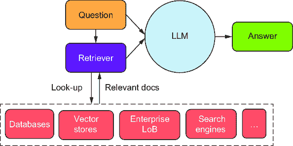
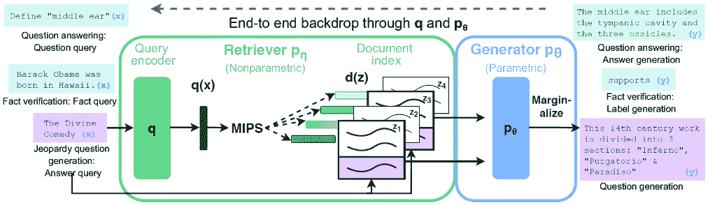

# 第七章：检索增强生成：秘密武器

### 本章涵盖

+   检索增强生成（RAG）的概念

+   结合大型语言模型的 RAG 架构的优势

+   理解向量数据库和索引在实现 RAG 中的作用

+   向量搜索的基础和距离函数的理解

+   RAG 实现中的挑战和潜在解决方案

+   RAG 中文本分块的不同方法

正如我们所见，大型语言模型（LLMs）非常强大，帮助我们实现直到最近都不可能完成的事情。有趣的是，LLMs 捕获了世界的知识，并且任何人都可以通过 API 在世界任何地方访问。

然而，LLMs 有一个知识限制：它们的理解和知识延伸到它们最后一次训练截止日期；在那之后，它们没有新的信息。因此，LLMs 无法利用最新信息。此外，LLMs 的训练语料库不包含任何私有或非公开知识。因此，LLMs 无法操作并回答企业特定的专有问题。

解决这个问题的实际方法之一是使用一个名为检索增强生成（RAG）的模式。本章将探讨如何使用 RAG 来增强 LLMs 并使用您的数据。您将了解 RAG 是什么，为什么它对企业管理应用有用，以及如何使用向量数据库和索引来实现它。最后，本章将讨论一些分块策略，以优化 RAG 的相关性和效率。

在本章中，我们将首先了解 RAG。在下一章中，我们将在此基础上结合所有概念，构建一个端到端的示例。

## 7.1 什么是 RAG？

RAG 是一种方法，它将额外数据与语言模型的输入相结合，以改进其输出，而不改变初始提示。这些补充数据可以来自组织的数据库或外部更新源。然后，语言模型处理合并的信息，将其知识库中的事实数据包含在其响应中。这种技术在需要最新数据和将其整合到您的信息中时特别有用。

在技术术语上，RAG 将预训练的语言模型和外部知识索引合并，以增强语言生成。Facebook AI Research 在一篇题为“用于知识密集型 NLP 任务的检索增强生成”的研究中首次介绍了 RAG [1]。它证明了 RAG 模型可以在自然语言处理（NLP）的各种知识密集型任务上实现最先进的成果，例如开放域问答、事实验证和自然语言推理。它还证明，与不使用额外数据的领先语言模型相比，RAG 模型可以生成更精确、多样和事实的语言。

RAG 模型结合了密集段落检索器和序列到序列模型的力量，基于大量文本生成有信息量的答案。它旨在通过将信息检索与生成语言模型相结合，改善问答系统、事实核查和问题生成任务。

图 7.1 展示了 RAG 模式的整体方法和概述。从高层次来看，有两个组件：检索器和生成器。正如其名所示，检索器负责检索信息，而生成器是 LLM，用于生成文本。



##### 图 7.1 RAG 架构概述

基础模型，特别是像 OpenAI GPT 系列这样的 LLM，具有巨大的潜力，但也存在一些缺点。这些模型虽然强大，但知识库是静态的，这意味着它们在训练后不知道事件或发展，随着时间的推移会变得过时。它们也受到训练数据的影响很大，任何数据中的偏差、错误信息或不平衡都会污染模型的输出。此外，LLM 缺乏对内容的真正理解，通常仅基于训练期间观察到的模式生成文本，而没有理解。这在具有特定政策和规则的企业场景中可能会出现问题。最后，这些模型可以创建看似合理但实际上错误的信息，如果没有可靠的验证方法，可能会传播错误信息。

RAG 通过利用这些外部知识来源来补充 LLM 的内部信息，有助于提高响应质量。这在解决 LLM 的静态知识方面特别有帮助，因为它们无法为其训练截止日期之后发生的事件或事实提供准确的生成。

RAG 是与 LLM 一起工作的一个重要组件，与提示工程一样。通过访问更广泛的信息种类，RAG 可以产生更准确和更有信息量的答案。它确保模型依赖于最新、最可靠的事实，并且用户可以看到其来源，确保其陈述可以经过验证以确保正确性，并最终值得信赖。

## 7.2 RAG 的优势

虽然 RAG 仍处于发展的早期阶段，但它有潜力改变文本生成模型的格局。RAG 可以被利用来为许多应用产生更全面、多样和事实性的文本生成模型。本节深入探讨了企业可以获得的众多好处。

RAG 能够实时从外部资源中提取数据，对于需要最新数据的行业，如金融、医疗保健或新闻业，是一个变革性的突破。无论是跟踪市场动态、更新医疗记录还是报道新闻，RAG 都能保证包含最新信息。这确保了输出始终相关且最新。

与传统的机器学习技术相比，RAG 为企业提供了一种成本效益高的替代方案。传统的技术可能需要在添加新数据时重新训练模型。然而，使用 RAG，企业只需更新外部数据集，从而节省了与模型训练和数据处理相关的宝贵时间和成本。

当需要引用数据或显示来源引用时，RAG 特别有用。它可以将生成数据锚定在原始材料中，甚至提供引用。这在学术、法律或专业场景中非常有价值，在这些场景中，精确的信息来源是必需的。

RAG 的适用性扩展到它可以处理的数据类型，它能够处理各种格式的结构化和非结构化数据。这种适应性使得 RAG 可以在各种应用中使用，从分析复杂的数据集到处理和生成多媒体内容。

实施 RAG（检索与评估）技术可以增强客户互动并促进决策的改善。在客户服务或聊天机器人应用中，RAG 可以从数据库或常见问题解答（FAQs）中检索详细信息，从而产生更准确和建设性的回应。此外，RAG 可以将来自大型数据集的见解与语言模型生成相结合，在决策支持系统中提供全面和有信息量的建议。

RAG 的可扩展性和性能非常出色，使企业能够在不过度负担语言模型的情况下利用大量外部数据集。这允许基于广泛的信息生成输出，而不会损害模型的性能或效率。

RAG 还允许根据业务领域定制外部数据集。例如，一家制药公司可以维护一个仅用于新药研究的独立数据集，从而使 RAG 能够提供特定领域的回应。从研发角度来看，生物技术或技术等行业可以从 RAG 检索相关文献或数据洞察的能力中大大受益，从而加快创新过程。

RAG 为将外部数据集集成到语言模型中提供了一个动态、高效和灵活的解决方案。这一特性使得自动化系统中的信息更加准确、相关和及时，从而提高了效率、客户满意度和决策质量。

##### 什么是数据锚定？

数据锚定意味着将大型语言模型（LLMs）与外部信息源连接起来。数据锚定可以通过各种方法完成；然而，RAG 是一种常见的方法。通常，这些外部数据源是根据用例需求选择的，这提高了生成输出的质量和可靠性。通过为 LLMs 提供特定用例、相关且不在 LLMs 训练数据中的信息，数据锚定可以使生成的输出更好。这样，LLMs 可以使用来自外部源的数据作为上下文，并为用户提供更精确和相关的答案。

数据锚定的某些好处包括

+   它可以帮助 LLMs 产生更事实性和可靠的输出，因为它减少了幻觉的风险，即 LLMs 在输出中创造虚假或误导性信息的情况。

+   它可以帮助大型语言模型（LLMs）产生更多样化和具有代表性的输出，使它们能够从各种来源和角度获取信息，并避免在内部知识中产生偏见或错误。

+   它可以帮助 LLMs 产生更定制化和个性化的输出，使它们能够适应用户的偏好、需求和目标，并提供定制化的解决方案或建议。

RAG 模型可以利用存储在文本语料库中的大量信息，通过相关的事实和细节来丰富其输出。它们还可以处理开放域问题以及需要推理和推断的任务，这些任务超出了 LLMs 的范围。让我们更详细地探讨 RAG 架构。

## 7.3 RAG 架构

之前概述了 RAG 架构由两个主要组件组成：检索器和 LLM。检索器从不同的企业系统中提取数据，如图 7.2[1]所示。这些组件可以根据应用和任务进行调整和适应，并且它们共同为 RAG 模型提供了很大的灵活性和力量。

检索器可以访问私有知识源和搜索引擎中的信息。这是 Bing Chat 背后的机制，有助于提供更及时的信息。这个检索器不仅仅进行搜索——它只过滤出相关信息，这些信息成为生成模型的上下文。



##### 图 7.2 RAG 在知识密集型 NLP 任务中的概述[1]

RAG 模式结合信息检索和文本生成，以增强语言模型的输出。查询编码器最初将输入问题或陈述编码成一个向量。这个向量`q(x)`随后被非参数检索器用来筛选预先编译的文档索引，寻找与查询相关的文档。

检索器采用最大内积搜索（MIPS），它识别与查询向量最相似的文档。这些文档被预先编码成向量，在文档索引中表示为`d(z)`。

生成器（即 LLM）利用检索到的文档中的信息来生成类似人类的文本。这个架构组件负责回答问题、验证事实或生成新问题。

最终过程是边缘化，在这个过程中，RAG 模型不是依赖于单一文档来生成响应，而是考虑所有相关的文档。它通过将每个检索到的文档的概率相加来计算每个可能答案的整体概率，通过将广泛检索到的信息整合到最终文本生成中，确保了更全面和情境化的意识。

另一个关键组件是 LLM（大型语言模型），它从检索模型中获取上下文并生成自然语言输出。生成模型还会向检索模型提供反馈，以随着时间的推移提高其准确性。这通过提示工程（prompt engineering）来实现，正如我们在上一章所看到的。

## 7.4 检索系统

检索器本质上是在图 7.2 中所示的各种知识源中进行搜索的组件。其主要目的是在信息库中搜索，找到可以使用的相关信息。检索到的信息随后提供给生成模型，该模型使用这些信息来生成其输出。

在 RAG 中使用了两种主要的检索系统：稀疏和密集。稀疏检索器是传统的检索系统，使用传统的搜索技术，如词频-逆文档频率（TF-IDF），将查询与文档相匹配。密集检索器是较新的检索系统，使用机器学习将查询和文档编码为向量，然后根据它们的向量相似度将查询与文档相匹配。

在 RAG 架构（检索增强生成）中选择正确的检索系统类型（稀疏或密集）至关重要，因为它从根本上影响模型的表现力和适用性。稀疏检索器，如使用 TF-IDF 的检索器，速度快且效率高，使用倒排索引根据关键词重叠匹配查询与文档。这使得它们适合于计算资源有限的大规模、关键词依赖型搜索任务。然而，它们可能在语言的细微之处，如同义词和细微措辞上遇到困难。

相比之下，密集检索器利用机器学习技术将查询和文档编码为向量，捕捉到超越简单关键词匹配的更深层次的语义关系。这使得它们能够处理更复杂的查询并更好地理解上下文，这对于具有模糊或专业语言的查询尤其有益。虽然密集检索器通常会产生更相关和上下文适当的文档，但它们计算密集，需要大量的训练数据，这使得它们在训练阶段和推理阶段都资源密集。

在选择稀疏检索器或密集检索器时，应考虑任务的具体需求，包括查询的性质、领域特定性、资源可用性和对细微语言理解的需求。

检索器的选择会影响计算效率和深度理解之间的平衡。尽管它们有计算成本，但密集检索器通常被用于需要细微理解语言的任务。然而，稀疏检索器在速度和效率至关重要的应用中或预期查询与文档文本紧密匹配的情况下可能仍然可行。最适合特定应用的最佳检索器将取决于其具体要求和实施和维护系统的资源。

##### BM25、TF-IDF 和 DPR 是什么？

BM25 是搜索引擎用来估计文档与给定搜索查询的相关性的排名函数。它是信息检索中最广泛使用的排名函数之一。BM25 考虑了许多因素，包括文档中查询术语的词频（TF）、查询术语的逆文档频率（IDF）以及文档的长度。

TF-IDF 是一种用于评估一个词在文档集合中对文档重要性的统计度量。TF-IDF 值与词在文档中出现的次数成正比。它与包含该词的文档集合中的文档数量成反比。TF-IDF 通常用于信息检索和文本挖掘，根据文档与给定查询的相关性对文档进行排名。

DPR 是一种神经网络模型，用于从大型文本语料库中检索相关段落。它在大量的文本和代码数据集上训练，并学习将段落和查询嵌入到密集的向量空间中。DPR 通过计算段落和查询向量之间的余弦相似度，可以语义上检索与查询相似的段落。

BM25 和 TF-IDF 是文档与给定查询相关性的统计度量。然而，BM25 考虑了额外的因素，例如文档的长度和词频的饱和度。DPR 可以用来提高 BM25 和 TF-IDF 排名函数的性能。

在高层次上，我们需要遵循图 7.3 中概述的过程来利用 LLMs 在我们的数据上的力量。检索器抽取的源数据需要分成更小的块。这是为了使信息更易于管理并符合 LLMs 的上下文窗口。接下来，我们必须创建这些小块的嵌入并将它们作为元数据链接到源数据。最后，这些嵌入和相关元数据应该持久化存储在数据存储中。


##### 图 7.3 LLMs 的自定义数据

为了使 RAG 高效和可扩展，检索组件必须快速从数十亿个潜在候选中获取最相关的文档。我们需要两个组件来帮助解决这个挑战：一个向量数据库和一个索引。向量数据库是一个存储并提供对结构化或非结构化数据（例如文本或图像）及其向量嵌入（数据的数值表示）访问的系统。向量索引是一种数据结构，它能够在高维向量空间中实现高效和快速的近邻查找。

没有高效的向量数据库和索引，检索步骤将变成瓶颈，使整个 RAG 系统变得缓慢且不实用。使用这些工具，相关文档可以实时检索，使生成组件能够快速生成答案，并使系统适用于如开放域问答等应用。让我们更详细地探讨这两个方面。

## 7.5 理解向量数据库

向量数据库使企业能够在生产环境中管理、安全和扩展嵌入。对于许多企业来说，用于语义搜索用例的向量数据库解决了生产系统所需的性能和安全要求。

向量数据库专门设计用于操作嵌入向量。随着最近 LLMs 和生成式 AI 的普及，使用嵌入来编码非结构化数据的使用也日益增长。向量数据库已成为企业交付和扩展这些用例的有效解决方案。

向量数据库是专门存储数据为高维向量和其原始内容的数据库。它们提供了向量索引和传统数据库的能力，例如优化存储、可扩展性、灵活性和查询语言支持。它们允许用户根据其语义或上下文意义找到和检索相似或相关的数据。

考虑到大型语料库中文档的庞大数量，将查询向量与每个文档向量进行暴力比较在计算上是不可行的。解决方案是向量搜索，它包括索引和数据库，允许在多维空间中进行高效的存储和近邻查找。图 7.4 展示了在实现 LLMs 的 RAG 模式时，整合向量数据库的典型流程。


##### 图 7.4 向量数据库典型流程

向量数据库可以帮助 RAG 模型快速找到与给定查询最相似的文档或段落，并将它们用作 LLM 的额外上下文。根据速度和准确度之间的权衡，向量数据库还可以支持各种检索策略，如精确、近似或混合方法。拥有向量数据库是一个好的开始，但找到最相似的文档或段落只能通过向量索引来实现。

### 7.5.1 什么是向量索引？

向量索引是向量数据库中的数据结构，旨在提高处理效率，尤其适用于与 LLMs（大型语言模型）一起遇到的高维向量数据。其功能是简化数据库内的搜索和检索过程。通过实现向量索引，系统可以执行快速相似度搜索，识别与给定输入向量最接近或最相似的向量。本质上，向量索引的设计是为了实现快速和精确的相似度搜索，促进向量嵌入的恢复。

他们使用各种技术，如哈希、聚类或基于树的方法，来组织向量，以便基于它们的距离或相似性度量轻松找到最相似的向量。例如，FAISS（Facebook AI Similarity Search）是一个流行的向量索引，能够高效地处理数十亿个向量。

要为您的嵌入创建向量索引，有许多选项，例如精确或近似最近邻算法（例如 HNSW 或 IVF）、不同的距离度量（例如余弦或欧几里得）或各种压缩技术（例如量化或剪枝）。您的索引方法取决于平衡速度、准确性和内存消耗。我们可以使用不同的数学方法来比较两个向量嵌入的相似程度——这些在搜索和匹配不同嵌入时很有用。让我们看看向量搜索的含义以及我们如何在搜索时应用不同的数学函数。

### 7.5.2 向量搜索

向量搜索是一种查询操作，根据相似性度量找到与给定查询向量最相似的向量。在 LLMs 的 RAG 模式中，向量索引存储 LLM 可以检索作为生成响应上下文的文档嵌入或段落。向量搜索用于根据查询向量与索引中文档向量的相似度，找到与查询最相关的文档或段落。

相似度度量是数学方法，用于比较两个向量并计算它们之间的距离值。这个距离值表示两个向量在语义意义上的相似程度或差异程度。

距离可以基于多个标准，例如两点之间的线段长度、两个方向之间的角度或两个数组中不匹配元素的数量。相似度度量对于涉及分组或分类数据对象的机器学习任务很有用，特别是对于向量或语义搜索。

例如，如果我们想找到与“puppy”相似的单词，我们可以为这个单词生成一个向量嵌入，并寻找具有接近向量嵌入的其他单词，例如“dog”（图 7.5）。


##### 图 7.5 向量搜索

我们应该选择最适合用例数据需求和查询需求的相似度度量。我们必须使用相似度度量来执行向量搜索，这是一种计算两个向量之间距离的数学方法。距离越小，向量越相似。一些流行的企业级服务，如 Azure AI Search，支持多种相似度度量。一些更常见的相似度搜索包括

+   *余弦相似度*—这个度量计算两个向量之间角度的余弦值。它的范围从 –1 到 1，其中 1 表示相同的向量，–1 表示相反的向量。余弦相似度常用于归一化嵌入空间。

+   *平方欧几里得或 L2 平方距离*—它计算两个向量之间的直线距离。它的范围从 0 到 ∞ [0, ∞]，其中 0 表示相同的向量，较大的值表示更不相似的向量。平方欧几里得距离也称为 L2 范数。

+   *点积*—这个度量计算两个向量的模长乘积以及它们之间角度的余弦值。它的范围从 –∞ 到 ∞ [–, ∞]，其中 0 表示正交向量，较大的值表示更相似的向量。点积对于归一化嵌入空间等同于余弦相似度，但更高效。

+   *汉明距离*—这个度量计算每个维度上向量之间的差异数量。

+   *曼哈顿或 L1 距离*—这个度量衡量两个向量坐标之间绝对差值的总和。它的范围从 0 到 ∞ [0, ∞]，其中 0 表示相同的向量，较大的值表示向量不同，即不相似的向量。

图 7.6 展示了不同的相似度函数。使用与基础模型训练相同的度量是很重要的。例如，在 OpenAI GPT 类模型的情况下，距离函数是余弦相似度。


##### 图 7.6 不同的相似度函数

注意：OpenAI 嵌入被归一化到长度 1，这意味着每个向量的模长等于 1。因此，如果我们使用归一化到长度 1 的 OpenAI 嵌入，我们可以选择余弦相似度或欧几里得距离作为我们的距离函数，向量搜索将得到相同的结果。然而，余弦相似度可能计算得更快，因为它只涉及点积运算。

选择合适的距离度量取决于具体用例、数据的性质和期望的结果。表 7.1 简要概述了何时使用每种度量。

##### 表 7.1 选择合适的距离度量

| 度量 | 何时使用 | 优点 | 缺点 |
| --- | --- | --- | --- |
| 余弦相似度 | 适用于文本和文档相似度，其中向量的幅度不如方向重要；在 NLP 任务中很常见 | 在高维空间和归一化向量中有效；忽略向量的幅度，专注于方向，使其适合比较不同长度的文档 | 如果向量的幅度很重要，则效果不佳。 |
| 平方欧几里得（L2）距离 | 适用于几何或空间数据，如图像处理或聚类多维数值数据时 | 反映了欧几里得空间中点之间的实际距离，使其直观且适用于空间数据集。 | 它可能对数据的规模敏感。高维可能导致维度诅咒。 |
| 点积 | 适用于高容量、高维数据，如推荐系统中的用户偏好 | 计算效率高，特别是对于稀疏向量。对于向量幅度很重要的情况很有用。 | 其解释不如余弦相似度直观，并且可能对向量幅度敏感。 |
| 汉明距离 | 最佳用于比较二进制或分类数据，如遗传序列或数据传输中的错误检测 | 对于具有离散属性的集合简单而有效 | 它仅适用于长度相等的字符串，不考虑差异的幅度。 |
| 曼哈顿（L1）距离 | 适用于网格状路径查找（例如，城市道路布局）以及个体维度差异重要的场合 | 比 L2 距离更敏感于个体维度的差异；对异常值有鲁棒性。 | 它可能无法反映非网格状空间或高维数据中的真实距离。 |

## 7.6 RAG 挑战

考虑实施 RAG 系统的企业面临几个需要仔细考虑的障碍。首先，确保随着数据量的增加而有效扩展至关重要。随着数据增长，检索索引的复杂性和大小也随之增加。管理这种增长变得具有挑战性，需要更多的计算资源。具体来说，密集检索系统在计算和存储方面资源密集，需要仔细平衡以确保可扩展性。此外，随着文档量的增加，保持高效和快速的检索索引变得至关重要。并行化请求、管理重试机制和部署适当的基础设施对于实现可扩展的 RAG 系统是必不可少的。

确保索引数据的质最和相关性是另一个重大关注点。RAG 系统的效用取决于其数据的质量；过时或不相关信息将导致低质量的响应——垃圾输入垃圾输出的原则仍然非常适用。这强调了精心管理和定期更新文档索引以符合企业不断变化需求的必要性。

一旦部署，RAG 系统在集成现有工作流程时引入了额外的复杂性，需要持续维护以确保性能一致。RAG 系统需要无缝集成到企业的现有技术环境中。这个过程通常涉及解决复杂的数据治理问题并确保系统互操作性。

RAG 系统涉及实时对密集向量进行复杂编码和查询，这可能导致延迟并影响响应时间。对于需要快速答案的应用，这种延迟可能无法满足用户对及时性的期望。此外，RAG 模型的复杂性质使得确定错误原因变得困难。无论错误发生在检索还是生成过程中，找到并有效修复错误都是重要的。此外，一旦部署，RAG 系统在集成现有工作流程时引入了额外的复杂性。确保顺利集成到企业的技术环境中涉及处理数据治理问题和系统兼容性。

从社会技术角度来看，确保 RAG 系统公平无偏至关重要。从训练数据中延续现有偏差的风险是真实存在的，可能会产生深远的影响，需要严格的监督和缓解策略。此外，隐私和安全也是关键因素，尤其是如果索引数据包括机密信息时，需要严格遵守数据保护法规。

分块是 RAG 实现需要解决的关键问题。分块是将长文本分割成 LLM 可以更容易处理的较小段。这有助于降低模型的计算和内存需求，并提高输出文本的质量和相关性。分块还可以帮助模型专注于文本中最关键的部分，避免不重要的或重复的部分。分块困难很大；我们将在以下章节中详细讨论这些问题。

企业需要意识到这些挑战，并权衡它们与 RAG 系统可以带来的好处，例如在自然语言处理任务中提高准确性和上下文相关性。在实施基于 RAG 的解决方案时，他们必须考虑成本、资源和潜在风险方面的权衡。

## 7.7 克服分块挑战

今天，企业在实施生产规模的 RAG 时面临许多挑战。如前所述，分块是将长序列文本划分为更小、更易管理的片段的过程。这对于处理能力有限的 LLMs 来说是必要的。RAG 模型通常使用分块算法将输入文本划分为更小的分块，然后 LLM 进行处理。LLM 为每个分块生成一个响应，然后将这些响应连接起来形成最终输出。

然而，分块对 RAG 模型来说可能具有挑战性，原因如下：

+   分块可能与文本的自然边界不一致。这可能导致 LLM 生成语法错误或语义不连贯的响应。

+   分块在长度和复杂性上可能有所不同。这可能会使 LLM 难以生成质量一致的响应。

+   分块可能包含多个意图。这可能会使 LLM 难以识别正确的意图并生成适当的响应。

我们首先理解一种分块策略。

### 7.7.1 分块策略

搜索的一个缺点是我们只能将有限的信息放入上下文窗口。如果我们以 OpenAI 模型为衡量标准，根据模型的不同，我们只能使用有限的信息集进行传递，如表 7.2 所示。在实际情况中，这个长度甚至更短，因为我们需要为生成留出空间。这就是分块变得关键的地方。

##### 表 7.2 OpenAI 模型上下文长度

| Open AI 模型 | 最大长度（标记大小） |
| --- | --- |
| GPT-3.5 Turbo  | 4K 个标记；约 5 页  |
| GPT-4  | 8K 个标记；约 10 页  |
| GPT-4 32K  | 32K 个标记；约 40 页  |
| GPT-4 Turbo, GPT-4o  | 128K 个标记；约 300 页  |

分块意味着将大文档或文本段落分解成更小、更易于消化的部分或分块。这样做是为了使检索过程更快、更好，尤其是在处理大量文本集合时；主要原因也是 LLMs 的上下文窗口约束。分块对 RAG 有用的几个原因包括：

+   *粒度*—在查询大型语料库以获取相关信息时，在较小分块粒度上搜索可能比在整个文档上搜索更精确的检索结果。这可以提高 RAG 生成的答案的整体质量。

+   *效率*—处理较小的分块可以使检索过程更高效，尤其是在使用将每个分块嵌入到高维向量空间中的密集检索器时。

+   *灵活性*—分块允许系统将不同长度的相关信息与给定查询相匹配，从而在考虑相关性的方面提供更大的灵活性。

在考虑块化策略时，我们需要全面考虑，并看看由此产生的搜索如何捕捉用户的查询本质。如果一个块太大或太小，可能会导致不准确的结果。作为一个简单的规则，如果一个块对我们人类来说有意义，无需额外信息，那么大型语言模型（LLM）也能理解它。

对于对话用例，随着对话的逐轮来回和对话的变长，评估在当前上下文中下一次轮次需要多少先前的对话是很重要的。添加更大的块可能会影响相关性，我们也会达到 LLM 上下文窗口的限制。

让我们以客户服务聊天机器人场景为例，服务提供商——一个移动通信提供商。对话可能从一个主题开始，比如激活新手机的问题，然后转向其他主题，如计划细节、附加产品、覆盖范围详情、账单、支付方式等。在这个例子中，当对话从一个主题转向另一个主题时，在许多情况下，我们不需要所有的先前历史和对话，它可以被丢弃或裁剪。当然，在某些情况下，我们可能只想获取当前对话上下文所需的详细信息。

信息块的大小取决于用例和用户的预期行为。例如，如果我们对一个段落进行块化，我们得到一个向量表示，它从内容中捕获了更多的意义。这与句子级别的嵌入不同，句子级别的嵌入向量表示反映了句子更多的意义。这可能导致与其他句子的比较，并且比之前的基于段落的策略更有限。

### 7.7.2 影响块化策略的因素

在我们深入研究不同的块化方法之前，从块化策略的角度考虑一些额外因素将有助于我们在保持可接受的性能和成本阈值的同时，平衡更高的准确性：

+   *内容性质*——被索引的内容的性质会影响块化策略。例如，较短的文本，如推文，可能需要与较长的文本，如书籍或报告，不同的块化方式。较短的文本可能需要组合在一起，而较长的文本，如文档、报告等，可能需要分解成更小的部分以进行高效处理。

+   *LLM 及其关联的嵌入模型*——LLM 及其关联的嵌入模型也会影响块化策略。例如，一些模型可能更擅长处理较小的块，或者根据它们的架构，处理特定大小的块，而其他模型可能更适合处理较大的块。了解我们将使用哪个 LLM 及其关联的嵌入模型很重要。例如，当使用 OpenAI 时，我们应该考虑 256 或 512 个标记大小的`text-embedding-ada-002`嵌入。

+   *查询复杂性*—用户查询的长度和复杂性会影响分块方法。更复杂的查询可能需要更复杂的分块策略来匹配相关数据。重要的是要记住，LLM 不是搜索引擎，不应作为搜索引擎使用。查询复杂性是多维的，包括长度和复杂性，可能需要将查询分解成更小的子查询，这些子查询针对原始查询的不同方面，然后再将所有内容汇总到答案中。例如，查询“英国的首都是什么？”非常具体且直接。相比之下，查询“美国各行业中人工智能崛起的经济影响是什么？”是多方面的。它需要更深入地了解技术（例如，本例中的 AI）以及地理和行业细节，以推断影响的含义。

+   *集成到应用中*—理解输出（查询结果）在应用中的使用方式也可以影响分块策略。例如，LLM 的限制和上下文窗口可能决定了如何分块数据以实现最佳结果。这还包括应用可能需要的其他数据和元数据。

+   *数据预处理*—预处理数据有助于提高生成质量并帮助我们确定一个可能的好大小。预处理可能包括清理额外噪声或使用其他 AI 技术提取信息，包括数据清理、将数据从一种格式转换到另一种格式、如果需要则进行特征归一化、分词、移除常见停用词（如“是”、“的”、“和”）等。

+   *评估和比较不同的分块大小*—评估和比较不同分块大小对过程质量和性能的影响至关重要。在企业环境中，这可能尤为重要，因为分块大小可能会根据内容性质而变化，并且需要在准确性和性能之间取得平衡。这种评估将包括质量和性能两个方面。

在考虑分块信息时，可以采取一些方法，如表 7.3 所述。值得注意的是，理想的分块策略可能因语料库、查询性质和应用的具体要求而异。可能需要进行实验，以找到特定 RAG 实现中最有效的方案。

##### 表 7.3 分块方法

| 分块方法 | 描述 |
| --- | --- |
| 固定长度 | 将文档分成固定数量的单词或标记的分块。这很简单，但有时可能会分割本应保留在一起的信息。  |
| 滑动窗口 | 使用固定大小的滑动窗口，带有或不带重叠数据。这可以确保不会错过文本中的重要边界，但如果有显著的重叠，也可能导致冗余。 |
| 基于标点的分割 | 根据标点符号，如段落或章节来分割文本。这种方法比固定长度块分割更少随意性，并且通常可以保留内容的语义完整性。然而，它可能导致块大小不固定。 |
| 主题或部分分隔符 | 在结构化文档，如维基百科文章中，可以使用自然分隔符，如章节或子章节来定义内容块。这种方法确保了块内内容在语义上是连贯的。 |
| 自适应 | 使用算法或模型，根据文档的内容自适应地确定最佳的块分割方式。这可能更复杂，但可能产生语义上连贯的块。 |

根据文本的大小和结构，有不同方法可以对 RAG 进行块分割。一些常见的方法包括

+   *句子分割*——正如其名所示，使用句子边界来分割文本，这对于确保每个块包含完整的句子，保留上下文和意义是有用的。

+   *固定长度分割*——在这里，文本被分割成固定长度的块。这有时会导致句子在中间被截断。

+   *基于标记的分割*——根据固定数量的标记（例如，单词）来分割文本。这比句子分割更细致，但仍然可能导致句子被截断。

+   *语义块分割*——使用自然语言处理（NLP）工具来识别文本中的连贯段。例如，根据主题或段落分割文本。

+   *分层块分割*——将文本分割成分层部分，如章节、节和子节。

为了说明不同的块分割方法（固定长度和基于语义的 NLP）可能如何影响结果，我们以维基百科中的英国宪法[2]为例作为我们的输入文本。当我们应用固定长度块分割方法时，我们可以在图 7.7 中看到结果。文本被分割成固定大小的块，在这个简单的例子中，我们可以看到一些信息被截断，一些上下文丢失。


##### 图 7.7 固定长度块分割方法

英国宪法的文本出现在图 7.8 中，使用基于 NLP 的块分割方法。由于 NLP 理解文本和上下文，它会在适当的级别上使用正确的标记来保持意义和准确性。


##### 图 7.8 基于 NLP 的块分割方法

这些块分割策略对于任何我们选择的提供者或 LLM 都很有用和重要。在接下来的章节中，我们将看到如何应用这些策略。我们将从 Sentence Splitter 开始，这是一个基于新行分割文本的文本分割器。

### 7.7.3 处理未知复杂性

有时，我们事先不知道用户查询的复杂性和长度。在这种情况下，能够处理未知长度和复杂性的用户查询的 RAG 实现可能会具有挑战性。以下是一些确定这种场景下分块方法的策略：

+   *自适应分块*—实现一个自适应分块机制，根据查询长度和复杂性自动调整分块的大小。对于较短、较简单的查询，可以使用较小的分块，而对于较长、较复杂的查询，可能需要较大的分块来捕捉必要上下文。

+   *预处理启发式方法*—在分块之前使用启发式方法分析查询。这些启发式方法可以通过查看诸如独特单词数量、专业术语的存在或句法结构等因素来估计复杂性。基于这种估计，分块机制可以调整分块的大小。

+   *动态检索窗口*—实现一个基于查询动态扩展或收缩的动态检索窗口。如果初始检索结果不满意，窗口可以调整以包含更多或更少的文档，或改变分块粒度。

+   *重叠分块*—创建重叠的分块以确保在分块边界处不会丢失任何关键信息。这种方法有助于在查询跨越多个分块时保持上下文。根据具体用例，这也可能压倒其他信息，这不是默认应该做的事情。

+   *机器学习方法*—使用传统的机器学习模型根据查询特征预测最佳分块大小。该模型可以在查询和最佳分块大小的数据集上训练，并通过在验证集上的性能确定最佳分块大小。

+   *回退策略*—当初始分块没有产生良好结果时，应制定回退策略。这可能涉及使用不同的分块大小重新查询，或者在初始响应未达到某些置信度阈值时使用不同的分块策略。

+   *反馈循环*—实现一个反馈循环，其中用户交互可以帮助调整分块。如果用户表示不满意，系统可以自动尝试不同的分块策略以改进响应。

+   *混合方法*—结合前面提到的几种策略来处理各种查询。例如，结合自适应分块和回退策略，该策略持续使用用户反馈，可以改进分块机制。

在实践中，最佳解决方案将结合这些策略以适应特定用例，并且需要通过试错来提高性能。此外，使系统的组件灵活可以允许在收集更多关于用户输入查询类型的信息时对分块机制进行更改和升级。

### 7.7.4 分块句子

基于句子的分割器是一种根据句子边界（如句号、问号或感叹号）将文本分割成块的方法。这种方法可以保留文本的意义和连贯性，因为每个块包含一个或多个完整的句子。

列表 7.1 展示了简单实现：使用正则表达式将输入文本分割成句子。该函数在输入文本中每个句号（.）、感叹号（!）或问号（?）的出现处分割文本。这些字符通常用于表示英语中句子的结束。结果是字符串列表，每个字符串都是原始文本中的一个句子。

##### 列表 7.1 分割句子函数

```py
def split_sentences(text):
    sentences = re.split('[.!?]', text)   #1
    sentences = [sentence.strip() for sentence in sentences if sentence]
    return sentences
```

#1 在这些字符的每个出现处分割句子

实现相同功能的另一种方法是使用基于句子的分割器，例如 Python 中的`textwrap`库。这个函数`wrap()`可以根据给定的宽度将字符串分割成字符串列表。我们可以传递额外的参数来确保单词不会在句子中间被分割。

##### 列表 7.2 使用`textwrap`分割句子

```py
def split_sentences_by_textwrap(text):
    max_chunk_size = 2048            #1

    chunks = textwrap.wrap(text,     #2
        width=max_chunk_size,
        break_long_words=False,
        break_on_hyphens=False)

    return chunks
```

#1 设置最大块大小

#2 将文本分割成块

需要指出的是，`textwrap.wrap()`和`re.split()`函数有不同的用途，它们的效率、速度和准确性取决于具体的使用场景。

`textwrap`库的原始目的是为了显示目的，并帮助我们格式化和包装字符串，以便我们可以控制最大行长度。对于其预期用例来说，它既高效又快速。然而，它不是为分割文本成句子而设计的，所以如果您用它来达到这个目的，可能不会很准确。例如，如果句子比指定的宽度长，它可能会在句子中间进行分割。

正则表达式中的`split()`函数在模式匹配的地方分割字符串。当与模式`[.!?]`一起使用时，它可以很好地将文本分割成句子。它对于所做的工作来说既快又有效。然而，它不考虑行长度或单词边界，所以如果您需要限制每个块的大小，`re.split()`可能不是最佳选择。

在速度方面，这两个函数都非常快，应该适用于大多数典型用例。对于非常长的字符串，速度可能会成为一个问题，但在大多数情况下，差异不会很明显。至于准确性，如果我们需要将文本分割成句子，`re.split()`将更准确。如果您需要将文本包装到特定的行长度，`textwrap.wrap()`将更准确。

这两个函数都非常高效，因为它们是 Python 标准库的一部分，并且是用 C 语言实现的。效率也会取决于输入字符串的大小和复杂性。

### 7.7.5 使用自然语言处理进行块分割

如前例所述，我们可以使用自然语言处理（NLP）方法将文本分割成块；这些块可以基于语言特征，如子句、短语或实体。与前面概述的句子分割方法相比，这种方法可以捕捉文本的意义和上下文，但它可能需要更多的计算资源和领域知识。让我们看看使用目前最常用的两个 NLP 库——自然语言工具包（NLTK）和 spaCy 的一些示例。

#### 使用 NLTK

NLTK 是自然语言处理和文本分析中最知名的库之一。它提供了易于使用的接口，用于访问许多语料库和词汇资源。此外，它还包括一系列用于分类、分词、词干提取、标注、解析等文本处理的库。NTLK 可以通过多种方式安装；在 conda 的情况下，我们可以使用以下命令：`conda install -c anaconda nltk`。对于 pip，我们可以使用`pip install nltk`。在我们能够使用 NLTK 之前，我们需要安装 NLTK 数据，这可以通过 NLTK 的数据下载器完成。一种简单的方法是使用管理员权限运行 Python 解释器并运行以下命令。更多详细信息可以在[`www.nltk.org/data.html`](https://www.nltk.org/data.html)找到：

```py
>>> import nltk
>>> nltk.download()
```

下面的列表展示了如何使用`sent_tokenize()`函数实现 NLTK，将文本分割成句子。

##### 列表 7.3 使用 NLP 进行文本块化

```py
def split_sentences_by_nltk(text):
 chunks = []
  for sentence in nltk.sent_tokenize(text):
    chunks.append(sentence)

  return chunks
```

`sent_tokenize()`函数使用`PunktSentenceTokenizer`的一个实例，这是一个基于无监督机器学习的分词器，它预训练好并准备好进行句子分割。如果文本非常大，你可能需要考虑使用生成器表达式而不是列表推导式以提高内存效率。

下一个列表展示了如何将前面的函数重写为生成函数。

##### 列表 7.4 使用 NLP 进行块化：生成函数

```py
def split_sentences_by_nltk(text):
    for sentence in nltk.sent_tokenize(text):
        yield sentence
```

NLTK 在块化方面具有相当的优势。它可以检测句子边界并在这些行上分割，它对于将文本分割成单个句子也非常有效，这对于块化大型文本很有用，同时确保句子不会被中间打断。

从企业角度来看，值得注意的是，虽然 NLTK 功能全面，适合研究和教育目的，但在速度方面可能并不总是最有效的。其他库如 spaCy 可能更适合生产级应用，尤其是在处理大量文本时。

#### 使用 spaCy

spaCy 是一个免费的、开源的 Python NLP 库，它提供了一系列 NLP 任务，包括句子分割、命名实体识别、词性标注和依存句法分析。它还适用于将文本块化并将单词分组到有意义的单元中，例如名词短语、动词短语和介词短语。

spaCy 是 RAG 实现的良好选择，因为它高效且快速，尤其是在实时处理大量文本时。它是准确且可靠的，可以根据具体需求进行定制。例如，spaCy 可以用于使用不同的语言理论进行文本分块，例如短语结构语法和依存语法。

在我们能够使用 spaCy 之前，我们需要安装所需的软件包并下载适合 spaCy 使用的适当预训练语言模型。如果使用 conda，我们可以使用以下命令安装 spaCy：`conda install -c conda-forge spacy`。如果我们使用 pip，则可以使用以下命令：`pip install spacy`。在示例中，我们使用以下命令下载名为 `en_core_web_sm` 的小型通用英语语言模型：`python -m spacy download en_core_web_sm`。

spaCy 为不同的目的和语言提供了额外的模型。除了小型英语模型之外，还有中型和大型模型可供选择——分别为 `en_core_web_md` 和 `en_core_web_lg`，以提供更全面的词向量。模型越大，处理所需的时间就越长。选择模型不仅涉及大小；还必须考虑准确性、语言和领域。有关预训练模型的更多详细信息，请参阅[`spacy.io/usage/models/`](https://spacy.io/usage/models/)。

下面的列表展示了如何使用 spaCy 进行分块。在这个例子中，我们考虑了 LLMs 上下文窗口的标记计数，并且我们还提供了在分块之间重叠文本的选项，以允许上下文连续性。

##### 列表 7.5 使用 spaCy 进行句子分块

```py
def split_sentences_by_spacy(text, max_tokens, overlap=0, model="en_core_web_sm"):
    nlp = spacy.load(model)    #1

    doc = nlp(text)            #2
    sentences = [sent.text for sent in doc.sents]

    tokens_lengths = [count_tokens(sent) for sent in sentences]   #3

    chunks = []
    start_idx = 0

    while start_idx < len(sentences):
        current_chunk = []
        current_token_count = 0
        for idx in range(start_idx, len(sentences)):
            if current_token_count + tokens_lengths[idx] > max_tokens:
                break
            current_chunk.append(sentences[idx])
            current_token_count += tokens_lengths[idx]

        chunks.append(" ".join(current_chunk))

        if overlap >= len(current_chunk):   #4
            start_idx += 1
        else:
            start_idx += len(current_chunk) - overlap

    return chunks
```

#1 加载 spaCy 模型

#2 使用 spaCy 将文本分句

#3 分句并累积标记

#4 滑动窗口调整

这些技术具有不同的优点和计算特性。让我们尝试所有这些技术并比较它们的性能、持续时间和效果。例如，我们使用 Azure OpenAI 和 FIFA 2023 女子世界杯作为数据[3]。这发生在 2023 年，在本文发表时，LLMs 缺乏这方面的知识，因为它超出了训练截止日期。

对于这个例子，我们将 FIFA 2023 女子世界杯的维基百科页面保存为原始文本字段。该文件未经处理，生成的文件足够混乱，足以反映企业可能会遇到的真实世界问题。

在这个例子中，如列表 7.6 所示，我们使用相同的文件运行四种不同的分块技术，并概述了每种技术执行所需的时间、创建的分块数量以及使用的标记。我们还使用 GPT3 创建文本的摘要。

我们首先加载名为 women_fifa_worldcup_2023.txt 的存储文本文件。我们分别应用四种不同的分块技术，然后使用相同的 GPT 模式对它们进行总结。我们首先使用基本的句子分块方法进行分块并处理这些内容。然后，我们使用 `textwrap`、NLTK 和 spaCy 处理相同的文件。我们在每次运行时记录一些简单的遥测数据，并在最后展示所有这些数据，包括摘要。

注意，书中已经使用过几个辅助函数，例如 `get_embedding()`、`count_tokens()` 等等——为了简洁，我们不再一一列举。完整的代码示例可以在本书配套的 GitHub 代码仓库中找到 ([`bit.ly/GenAIBook`](https://bit.ly/GenAIBook))。

##### 列表 7.6 句子分块比较

```py
import nltk
import spacy
...

GPT_MODEL = "gpt-35-turbo"

def generate_summaries(chunks):
    summaries = []                              #1
    # loop through each chunk
    for chunk in tqdm(chunks):
        prompt = f"Summarize the following text in one
        ↪sentence:\n{chunk}\nSummary:"
        response = openai.Completion.create(     #2
            engine=GPT_MODEL,
            prompt=prompt,
            max_tokens=800,
            temperature=0.7        )
        summary = response.choices[0].text
        summaries.append(summary)
        sleep(1)                                 #3

    # return the list of summaries
    return summaries

def process_chunks(sentences):
    sentence_embeddings = []
    total_token_count = 0

    for i, sentence in enumerate(tqdm(sentences)):
        total_token_count += count_tokens( 
              ↪sentence, "cl100k_base")  #4
        embedding = get_embedding(sentence)
        sentence_embeddings.append([sentence, embedding])

    print("\tNumber of sentence embeddings:", len(sentence_embeddings))
    print("\tTotal number of tokens:", total_token_count)

    return sentence_embeddings

TEXT_FILE = f"data/women_fifa_worldcup_2023.txt"      #5

with open(TEXT_FILE, "r") as f:
    text = f.read()

print("1\. Simple sentence chunking ...")
sentences = split_sentences(text)

process_chunks(sentences)

print("="*20)
# ===================================

#Reset variables
summaries = []
sentences = []
sentence_embeddings = []
total_token_count = 0
chunks = []

print("2\. Sentence chunking using textwrap ...")
chunks = split_sentences_by_textwrap(text)   #6
process_chunks(chunks)

# ===================================

#Reset variables
...

print("3\. Sentence chunking using NLTK ...")
chunks = split_sentences_by_nltk(text)        #7
process_chunks(chunks)

# ===================================

#Reset variables
...

print("4\. Sentence chunking using spaCy ...")
chunks = split_sentences_by_spacy(text, 
               ↪max_tokens=2000, overlap=0)   #8
process_chunks(chunks)

# ===================================
summaries = generate_summaries(chunks)          #9
print("Summaries generated by OpenAI API:")
print(summaries)
```

#1 空列表用于存储摘要

#2 完成生成分块的摘要

#3 速率限制

#4 计算句子中的标记数量

#5 我们想要分块的文件

#6 使用 textwrap 进行文本分块

#7 使用 NLTK 进行文本分块

#8 使用 spaCy 进行文本分块

#9 使用 OpenAI API 为每个分块生成摘要

表 7.4 显示了运行此操作时的输出，时间持续以秒为单位。正如预期的那样，处理相同输入文本所需的时间根据所使用的技术有很大差异。

##### 表 7.4 句子分块比较

| 分块方法 | 嵌入数量 | 标记数量 | 执行时间（秒） |
| --- | --- | --- | --- |
| 简单 | 120  | 5815  | 16.96  |
| 使用 `textwrap` | 12  | 5933  | 1.66  |
| 使用 `NLTK` | 105  | 5909  | 13.31  |
| 使用 `spaCy` | 4  | 5876  | 5.8  |

以下是由 LLM 使用 spaCy 分块生成的摘要；这些摘要简明扼要，信息丰富，这正是我们想要的：

```py
Summaries generated by OpenAI API:
[" The FIFA Women's World Cup is an international association football competition contested by the senior women's national teams of members of FIFA, and has been held every four years since 1991; the most successful team is the United States, with four titles,..."]
```

这个例子表明，`textwrap` 方法是最快的，只需 1.66 秒；这并不意味着 `textwrap` 方法总是最合适且我们应该采用的方法。我们必须根据每种情况、涉及的信息类型和用例来评估这一点。让我们探讨选择最佳分块策略所需的决策因素。

#### 选择正确的策略

是否使用基于 NLP 的分块策略或固定长度分块方法取决于当前任务的具体要求和限制。表 7.5 列出了部分决策因素。

##### 表 7.5 分块决策因素

| 决策因素 | 描述 |
| --- | --- |
| 任务要求 | 如果任务需要理解语言的细微差别，例如回答依赖于上下文的问题或生成连贯的文本，基于 NLP 的分块更可取。  |
| 性能 | 如果保持上下文不是关键，并且存在性能限制，固定长度分块可能是更好的选择。  |
| 资源可用性 | 对于计算资源有限的工程项目，固定长度分块资源消耗较少，且更容易扩展。  |
| 数据特征 | 基于自然语言处理的分块可以使用具有清晰语言界定的文本边界（如结构良好的文档）。相比之下，如果文本结构不佳或边界不明确，固定长度分块可能更实用。 |

可能会从一个固定长度的方法开始，因为它简单，然后在需要更多复杂性时切换到基于 NLP 的方法。一些高级系统甚至可能同时使用这两种方法，使用固定长度分块快速处理大量文本，然后使用基于 NLP 的分块处理更小、更可控的块以提高上下文和意义。让我们改变话题，看看我们如何分块其他文档，例如 PDF。

## 7.8 分块 PDF

在高层次上，将 PDF 文件分块与将句子分块相当相似。对于不太复杂且具有基本表格或图像的 PDF 文件，有多种选择。一个简单的开始方法是使用 PyPDF2 库。PyPDF2 是一个开源的 Python PDF 库，可以对 PDF 页面执行各种操作，如拆分、合并、裁剪和转换。它还可以从 PDF 中提取文本、自定义数据、密码和元数据。

列表 7.7 展示了如何使用它。我们可以在 conda 中使用以下命令安装 PyPDF2：`conda install -c conda-forge pypdf2`，或者如果使用 pip，则 `pip install pypdf2`。这是可以像之前讨论的任何其他文本一样分块和处理的文本。这个库不处理图像；如果 PDF 中有任何图像，它们将被忽略。请注意，以下列表仅显示为简洁起见的相关部分；本书的 GitHub 仓库有完整的代码。

##### 列表 7.7 从 PDF 中提取文本

```py
import PyPDF2
def extract_text_from_pdf(pdf_path):
    with open(pdf_path, 'rb') as file:
        reader = PyPDF2.PdfReader(file)
        print("Number of PDF pages:", len(reader.pages))
        text = ""
        for  page in reader.pages:
            page_text = page.extract_text()
            text += page_text
            #print(page_text)
    return text
```

#### 处理 PDF 中的表格和图像

尽管在上一个示例中处理文本似乎相当直接，但 PDF 可以增加很多复杂性。文本提取的准确性取决于 PDF 本身，因为并非所有 PDF 都以易于提取的方式编码文本。以下列表显示了一个如何从 PDF 中处理图像和表格进行分块的示例，但总体来说，这将是一个挑战。

##### 列表 7.8 如何提取表格和图像的示例

```py
from PIL import Image
import tabula
from pdfminer.high_level import extract_pages
from PyPDF2 import PdfReader
...

# Define the PDF file path
pdf_file = f"data/test.pdf"
output_folder = f"data/temp/"

text = ''                  #1

def process_element(element, iw):
    global text
    if isinstance(element, LTTextBox):
        text += element.get_text()
    elif isinstance(element, LTImage):
        bmp_file = iw.export_image(element)            #2
        bmp_file = os.path.join(iw.outdir, bmp_file)
        img = Image.open(bmp_file)       #3
        png_file = bmp_file.rsplit('.', 1)[0] + '.png'  #4
        img.save(png_file)
    if isinstance(element, LTFigure):
        for child in element:
            process_element(child, iw)

iw = ImageWriter(output_folder)             #5

page = next(extract_pages(pdf_file))    #6

for element in page:
    process_element(element, iw)

with open(output_folder + 'text.txt', 'w', encoding='utf-8') as f:
    f.write(text)

tables = tabula.read_pdf(pdf_file, pages='all')  #7

for i, table in enumerate(tables):              #8
    table.to_csv(f'{output_folder}table_{i}.csv', index=False)
```

#1 创建一个空字符串以存储文本

#2 将图像导出为 BMP 文件

#3 使用 PIL 打开 BMP 文件

#4 将图像转换为 PNG 格式并保存

#5 创建一个 ImageWriter 对象以保存图像

#6 从 PDF 文件中获取第一页

#7 读取表格

#8 将每个表格保存到单独的文件中

在 PDF 中解析和处理图像和表格比较困难，尤其是要一致且可预测地处理。企业可以通过链式连接其他机器学习模型来解决此问题，而不仅仅是尝试解析文档。微软的 Azure 文档智能是一个允许企业实施此功能的服务。

#### Azure 文档智能

Azure AI Document Intelligence 是一种云服务，它使用先进的 ML 模型从文档中自动提取文本、关键值、表格和结构，将它们转换为可操作的数据。它为文档分析提供三种类型的 ML 模型：针对常见场景的预构建模型（例如，ID、收据）、基于您的数据训练的自定义模型以及用于结构化内容提取的文档分析模型。

与许多 Python PDF 处理包不同，它支持多种文档格式，处理复杂布局、手写文本和对象，并允许通过 REST API 进行自定义 ML 模型创建，以从 PDF 等文档中提取数据，并使用 RAG 模式进行摘要或答案生成。

列表 7.9 展示了如何使用预构建布局模型分析文档。我们使用预构建布局模型开始分析一个样本文档，并迭代结果。它检测每一页的文本和表格，包括理解行和列。请注意，Document Intelligence 在 conda 上尚不可用，因此我们将使用 pip 来安装它：`pip install azure-ai-formrecognizer`。

##### 列表 7.9 Azure AI Document Intelligence 预构建布局操作

```py
from azure.core.credentials import AzureKeyCredential
from azure.ai.formrecognizer import DocumentAnalysisClient

endpoint = "YOUR_FORM_RECOGNIZER_ENDPOINT"
key = "YOUR_FORM_RECOGNIZER_KEY"

# sample document
pdf_file = f"YOUR_PDF_FILE"

document_analysis_client = DocumentAnalysisClient(
    endpoint=endpoint, credential=AzureKeyCredential(key)
)

poller = poller = document_analysis_client.begin_analyze_document_from_url(
    "prebuilt-layout", pdf_file)    #1
result = poller.result() #2

for page in result.pages:              #3
    for line_idx, line in enumerate(page.lines):
        print(
         "...Line # {} has text content '{}'".format(
        line_idx,
        line.content.encode("utf-8")   #4
        )
    )

    for selection_mark in page.selection_marks:
        print("...Selection mark is '{}'".format(
         selection_mark.state,       #5
         )
    )

for table_idx, table in enumerate(result.tables):
    print(
        "Table # {} has {} rows and {} columns".format(
        table_idx, table.row_count, table.column_count
        )
    )

    for cell in the table.cells:                  #6
        print(
            "...Cell[{}][{}] has content '{}'".format(
            cell.row_index,
            cell.column_index,
            cell.content.encode("utf-8"),
            )
        )
```

#1 调用 API 使用预构建布局分析 PDF

#2 获取分析结果

#3 遍历 PDF 中的所有页面

#4 提取页面上的每一行文本

#5 检查是否存在选择标记

#6 解析 PDF 中找到的表格

更多关于 Azure Document Intelligence 的详细信息可以在[`mng.bz/6YNA`](https://mng.bz/6YNA)找到。

## 摘要

+   LLM 在其训练截止日期之后没有任何最新信息，并且不知道私有和专有信息。检索增强生成（RAG）是帮助解决这些限制的技术。

+   RAG 是一种强大的技术，它提供最新和基于事实的信息，从而提高了 LLM 的响应质量。它还有助于固定数据，并可以提高 LLM 在质量、多样性和定制方面的生成。

+   由向量索引和数据库驱动的向量搜索对于使 RAG 实现的检索组件高效和可扩展至关重要。它们使实时、大规模语义搜索成为可能，这对于需要快速访问大量信息的应用程序至关重要。

+   RAG 必须处理各种挑战，其中分块是最关键的。由于 LLM 内容窗口的限制，我们需要将大量数据分块，并采用各种技术来分割信息——固定长度、滑动窗口、基于标点符号、基于部分或自适应。每种方法都有其优势和挑战，需要在用例、形状和数据类型的具体情况下进行考虑。

+   理解和解析 PDF 为块是困难的，尤其是如果它们包含图像和表格。使用其他 ML 模型，如 Azure Document Intelligence 进行级联，可以帮助简化这一过程。

+   结合提示工程，RAG 有助于解决各种企业场景和环境中如动态信息访问、成本效率、扎根、引用、可扩展性和定制化等方面的需求。
