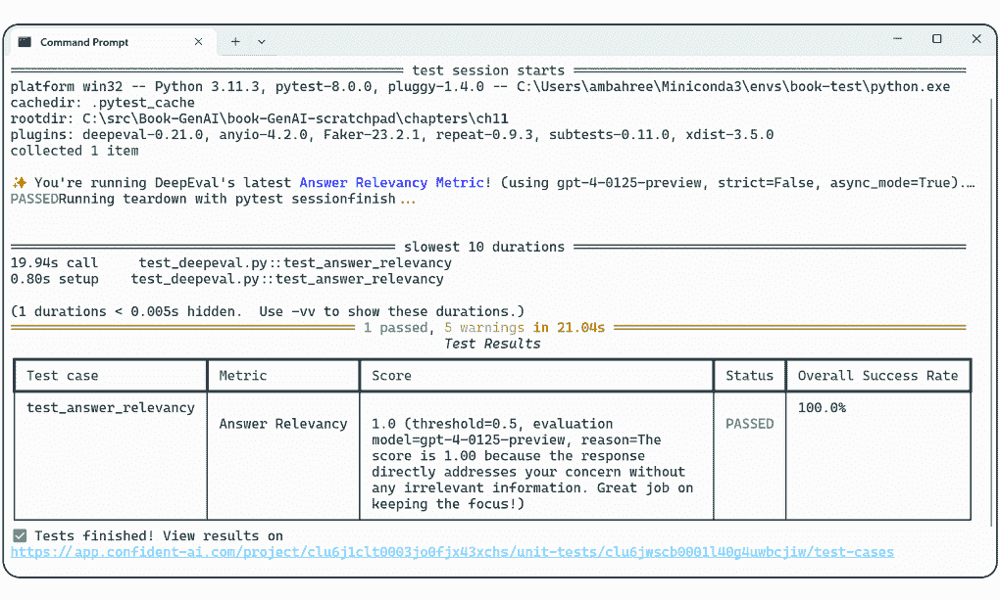

# 第十二章：评估和基准

### 本章涵盖

+   理解基准测试和评估 LLMs 的重要性

+   学习不同的评估指标

+   基准测试模型性能

+   实施全面的评估策略

+   评估基准的最佳实践和需要考虑的关键评估标准

考虑到近期对通用人工智能（GenAI）以及大型语言模型（LLMs）的兴趣激增，谨慎和负责任地处理这些新颖且不确定的特性至关重要。许多排行榜和研究表明，LLMs 在各种任务中可以匹配人类的表现，例如参加标准化测试或创作艺术，引发了热情和关注。然而，它们的创新性和不确定性需要谨慎处理。

在生产部署中基准测试大型语言模型（LLMs）的作用不容小觑。它涉及评估性能、比较模型、指导改进、加速技术进步、管理成本和延迟，并确保现实应用中任务流的效率。虽然评估是 LLMOps 的一部分，但它们在确保 LLMs 满足各种应用需求中的关键性，使得本章需要单独讨论。

评估 LLMs 并非一项简单任务，而是一个复杂且多方面的过程，需要定量和定性的方法。在评估 LLMs 时，必须采用涵盖模型性能和效果的各个方面进行全面评估的方法。斯坦福大学的人本人工智能（HAI）每年发布一份 AI 指数报告[1]，旨在收集和跟踪与 AI 相关的不同数据点。我们面临的最具挑战性的问题之一是缺乏标准化的评估，这使得在能力和潜在风险及危害方面对不同模型进行系统比较变得极其困难。这意味着我们没有客观的衡量标准来衡量这些特定模型的好坏或智能程度，这突显了评估过程的复杂性和重要性。

当我们在这一初始阶段讨论通用人工智能（GenAI）评估时，大多数讨论都集中在准确性和性能评估上，这些评估旨在衡量语言模型理解并产生类似人类语言文本的能力。这一方面对于依赖于生成内容质量和相关性的应用非常重要，例如聊天机器人、内容创作和摘要任务。

有三种一般类型的评估可以衡量准确性和性能：判断语言质量的传统评估指标、评估特定任务的 LLM 特定基准，以及人工评估。让我们首先了解 LLM 评估是什么，并了解一些与评估相关的最佳实践。

## 12.1 LLM 评估

评估 LLM 至关重要，以确保它们可靠且适用于实际应用。一个强大的评估策略涵盖了性能指标，如准确性、流畅性、连贯性和相关性。这些指标帮助我们了解模型在不同情境下的优缺点。以下是我总结的几个作为最佳实践考虑的领域：

+   为了对 LLM 进行有意义的评估，必须在其设计的使用案例上进行测试，这意味着在多种自然语言处理（NLP）任务上使用模型，例如摘要、问答和翻译。评估过程应使用标准指标，如 ROUGE（Recall-Oriented Understudy for Gisting Evaluation）进行摘要，以保持可靠性和可比性。

+   LLM 评估的另一个重要方面是提示（prompts）的创建。提示必须明确且公平，以提供对模型能力的有效评估。这确保了评估结果反映了模型的实际性能。

+   基准测试（benchmarking）是一项关键实践，它使人们能够根据现有标准和其它模型评估 LLM 的性能。这不仅跟踪了进展，还确定了需要改进的领域。结合持续的开发实践，持续的评估过程允许定期评估和改进 LLM。

+   LLM 的评估必须在每个步骤都涉及伦理考量。该过程必须检查模型是否存在偏见、公平性和伦理问题，并关注训练数据和输出。此外，用户体验应该是评估的关键部分，确保模型输出符合用户需求和期望。

+   评估必须在每个阶段都是透明的。记录标准、方法和结果允许独立验证，并增加对 LLM 能力的信心。最后，评估结果应指导持续改进周期，根据性能指标和反馈改进模型、训练数据和评估过程。

这些实践强调了以严格和系统的方法评估 LLM 的重要性，确保它们准确但同时也公平、道德且适用于各种应用。

通过遵循这些实践，企业可以开展可靠有效的评估，开发出值得信赖且有助于不同用途的 LLM。既然我们已经了解了评估是什么，让我们来看看我们应该使用的某些指标。它们可以分为传统和较新的 LLM 特定评估指标。

## 12.2 传统评估指标

BLEU（双语评估助手）、ROUGE（基于回忆的摘要评估助手）和 BERTScore（BERT 相似度得分）是一些较为标准化的度量标准。这些度量标准有助于量化模型输出与参考文本之间的语言质量，并用于评估机器翻译或文本摘要等任务中的文本质量。尽管如此，它们在方法和关注的文本方面有所不同。表 12.1 展示了这三个分数的详细解释。我们将在下一节中展示如何计算这些度量。

##### 表 12.1 传统评估度量

| 度量标准 | 重点关注 | 方法 | 局限性 |
| --- | --- | --- | --- |
| BLEU  | 它主要衡量精确度，即机器生成文本中出现在参考文本中的单词百分比。  | 它将候选翻译的 n-gram（单词序列）与参考翻译进行比较，并计算匹配项。  | 由于它没有考虑同义词或单词的上下文，因此它可能会错过语义意义。它还处理不好单词重排。  |
| ROUGE  | 它更侧重于回忆，关注参考文本中出现在生成文本中的单词百分比。  | 它有几个变体，如 ROUGE-N，它比较 n-gram，以及 ROUGE-L，它查看最长公共子序列。  | 与 BLEU 一样，ROUGE 可能会忽略语义相似性和释义，因为它基于精确的词匹配。  |
| BERTScore  | 它评估语义相似性，而不是依赖于精确的词匹配。  | 它使用 BERT 等模型生成的上下文嵌入来表示文本，并计算这些嵌入之间的余弦相似度。  | 由于它考虑了每个词的上下文，因此它比 BLEU 和 ROUGE 更好地捕捉到释义和语义意义。  |

比如 ROUGE、BLEU 和 BERTScore 等度量标准，它们比较由 LLM 生成的文本和人类编写的参考文本之间的相似性。它们通常用于评估摘要和机器翻译等任务。

### 12.2.1 BLEU

BLEU（双语评估助手）[2]是一种用于评估从一种自然语言到另一种自然语言的机器翻译质量的算法。其核心思想是衡量机器输出与人类翻译之间的对应关系。换句话说，根据 BLEU，机器翻译越接近专业的人类翻译，质量就越好。BLEU 不考虑可理解性或语法正确性；它关注内容重叠。

### 12.2.2 ROUGE

ROUGE（基于回忆的摘要评估助手）[3]是一组用于 NLP 中评估自动文本摘要和机器翻译性能的度量标准。其主要目标是对比机器生成的摘要或翻译与人类参考摘要。它评估以下方面：

+   *召回率*——ROUGE 衡量系统摘要捕获了多少参考摘要的内容。它评估系统恢复或捕获参考内容的效果。

+   *精确度*——它还评估系统摘要中有多少是相关、必要或有用的。

+   *F 度量*——它结合精确度和召回率，提供一个平衡的系统性能视图。

ROUGE 有不同的版本，如 ROUGE-N（使用 n-gram）和 ROUGE-L（基于最长公共子序列算法）。通过观察单个单词和序列，ROUGE 帮助我们衡量 NLP 算法在摘要和翻译任务中的有效性。

然而，ROUGE 存在局限性。它仅依赖于表面层的重叠，不考虑语义意义或流畅性。对停用词、词干提取和词序的敏感性会影响分数。虽然 ROUGE 提供了有价值的见解，但考虑其他评估指标和人类判断来全面评估摘要质量是至关重要的。研究人员通常使用多种指标来评估摘要模型。

### 12.2.3 BERTScore

BERTScore [4] 是衡量文本生成质量的一个指标。它使用预训练的 BERT 模型嵌入来比较候选句和参考句。其思路是基于余弦相似性，在候选句和参考句中找到相似单词。这个指标在句子级和系统级评估中与人类意见一致。它包含以下要素：

+   *上下文嵌入*——BERTScore 使用考虑每个单词上下文的嵌入来表示候选句和参考句。

+   *余弦相似度*——它计算候选文本和参考文本嵌入之间的余弦相似度。

+   *标记匹配*——为了计算精确度和召回率分数，候选文本中的每个标记都与参考文本中最相似的标记进行匹配。

+   *F1 分数*——将精确度和召回率结合起来计算 F1 分数，提供一个单一的质量度量。

BERTScore 相对于传统的指标如 BLEU 的关键优势在于其捕捉语义相似性的能力。这意味着它能够识别不同单词具有相似含义的情况，以及相同单词在不同语境中的使用。

### 12.2.4 传统指标评估的示例

让我们通过一个简单的例子将所有这些内容结合起来，使其变得真实。这里我们有两个信息摘要，可以评估哪一个可能更好。

在这个例子中，我们将比尔及梅琳达·盖茨基金会的 AI 开发原则作为我们想要分析和理解的文章。这篇文章可在[`mng.bz/vJe4`](https://mng.bz/vJe4)找到。从文章中，我们创建了两个摘要进行比较。在这种情况下，一个是 NLTK 创建的，另一个是由另一个 LLM（GPT-3.5）创建的。这也可以是两个不同的人写版本或任何其他组合。我们使用`newspaper3K`和`bert_score`包下载文章，并使用 Hugging Face Evaluate 包进行评估。这些可以在 conda 中使用`conda install -c conda-forge newspaper3k evaluate bert_score`安装。在 pip 中，使用`pip install evaluate newspaper3k bert_score`。

我们首先使用`newspaper3k`下载并解析文章。然后，我们应用`nlp()`函数处理文章，并从摘要属性中获取摘要。我们必须确保在应用 NLP 之前文章已被下载并解析；请注意，这仅适用于西方语言。我们将 NLP 创建的摘要作为我们的参考摘要，并使用`Evaluate`库来计算特定指标。代码示例展示了如何实现这一点。

##### 列表 12.1 自动评估指标

```py
from openai import AzureOpenAI
import evaluate
from bert_score import BERTScorer
...

AOAI_API_KEY = os.getenv("AOAI_KEY")           #1
AZURE_ENDPOINT = os.getenv("AOAI_ENDPOINT")   #1
...

URL = "https://www.gatesfoundation.org/ideas/articles/ 
             ↪artificial-intelligence-ai-development-principles"

def get_article(URL, config):                 #2
    article = Article(URL, config=config)
    article.download(recursion_counter=2)
    article.parse()
    article.nlp()
    return article.text, article.summary

def generate_summary(client, article_text):               #3
    prompt = f"Summarize the following article:\n\n{article_text}"
    conversation = [{"role": "system", "content": 
                             ↪"You are a helpful assistant."}]
    conversation.append({"role": "user", "content": prompt})

    response = client.chat.completions.create(
        model=MODEL,
        messages = conversation,
        temperature = TEMPERATURE,
        max_tokens = MAX_TOKENS,
    )
    return response.choices[0].message.content.strip()

def calculate_scores(generated_summary, reference_summary): #4
    metric = evaluate.load("bleu", trust_remote_code=True)
    bleu_score = metric.compute(predictions=
                 ↪[generated_summary], references=[reference_summary])

    metric = evaluate.load("rouge", trust_remote_code=True)
    rouge_score = metric.compute(predictions=
                  ↪[generated_summary], references=[reference_summary])

    scorer = BERTScorer(lang="en")
    p1, r1, f1 = scorer.score([generated_summary], [reference_summary])
    bert_score = f"Precision: {p1} Recall: {r1} F1 Score: {f1.tolist()[0]}"

    return bleu_score, rouge_score, bert_score

# Main code
client = AzureOpenAI(
      azure_endpoint = AZURE_ENDPOINT,
      api_key=AOAI_API_KEY,
      api_version=API_VERSION
)

config = Config()                                             #5
config.browser_user_agent = USER_AGENT                       #5
config.request_timeout = 10                                  #5
article_text, reference_summary = get_article(URL, config)

generated_summary = generate_summary(client, article_text)
bleu_score, rouge_score, bert_score = calculate_scores(
                         ↪generated_summary, reference_summary)

print(f"BLEU:{bleu_score}, ROUGE:{rouge_score}, BERT: {bert_score}")
```

#1 设置 OpenAI 详细信息

#2 下载和解析文章的函数；返回文章文本和摘要

#3 使用 OpenAI 总结文章

#4 计算指标（BLEU、ROUGE 等）的函数

#5 配置 newspaper3k 以允许下载文章

这是执行代码时我们可以观察到的输出：

```py
BLEU score: {'bleu': 0.04699157347901134, 
             ↪'precisions': [0.32857142857142857, 
                    ↪0.09352517985611511, 
                    ↪0.021739130434782608, 
                    ↪0.0072992700729927005], 
            ↪'brevity_penalty': 1.0, 
            ↪'length_ratio': 1.2727272727272727, 
            ↪'translation_length': 140, [
            ↪'reference_length': 110}

ROUGE score: {'rouge1': 0.3463203463203463, ]
              ↪'rouge2': 0.09606986899563319, 
              ↪'rougeL': 0.1645021645021645, 
              ↪'rougeLsum': 0.2683982683982684}

BERT score: Precision: tensor([0.8524]) 
            ↪Recall: tensor([0.8710]) 
            ↪F1 Score: 0.8616269826889038
```

正如我们所见，BLEU 分数由几个组成部分构成，这些组成部分共同评估机器翻译与一组参考翻译之间的质量。让我们逐一检查每个组成部分，并了解其含义，从表 12.2 中概述的 BLEU 分数开始。表 12.3 和 12.4 分别显示了 ROUGE 分数和 BERT 分数的结果。

##### 表 12.2 BLEU 分数

| 组件值 | 含义 |
| --- | --- |
| BLEU：0.047（4.7%） | 这是整体 BLEU 分数，相当低。BLEU 分数的范围从 0 到 1（或 0%到 100%），分数越高表示翻译质量越好。分数低于 10%通常被认为很差。 |
| 精确度 | 这些是 1-gram、2-gram、3-gram 和 4-gram 匹配的 n-gram 精确度分数。我们的分数表明有相当数量的 1-gram 匹配，但较长的匹配很少，这表明翻译中有一些正确的单词，但缺乏连贯的短语和句子。 |
| 简洁性惩罚：1.0 | 这意味着没有简洁性惩罚；翻译长度与参考长度相比是合适的。 |
| 长度比：1.27 | 翻译比参考文本长 27%，这可能表明有些冗长。 |
| 翻译长度：140 | 机器翻译文本的长度 |
| 参考长度：110 | 参考文本的长度 |

##### 表 12.3 ROUGE 分数

| 组件值 | 含义 |
| --- | --- |
| ROUGE-1：0.3463（34.63%） | 它衡量系统输出和参考摘要之间 1-gram 的重叠。一个适中的分数表明有相当多的重叠。 |
| ROUGE-2：0.0961（9.61%） | 它衡量 bigram 的重叠，比 ROUGE-1 更严格。低分数表明系统在形成准确的短语方面有困难。 |
| ROUGE-L：0.1645（16.45%） | 它衡量最长公共子序列，表明单词的流畅性和顺序。该分数表明流畅性有限。 |
| ROUGE-Lsum：0.2684（26.84%） | 它类似于 ROUGE-L，但考虑了最长公共子序列的总和，表明对内容结构的理解略好。 |

##### 表 12.4 BERT 分数

| 组件值 | 含义 |
| --- | --- |
| 精确率：0.8524（85.24%） | 它衡量候选文本中有多少单词是相关或必要的。 |
| 召回率：0.8710（87.10%） | 它衡量候选文本捕捉参考内容多少。 |
| F1 分数：0.8616（86.16%） | 这是精确率和召回率的调和平均值，提供了一个平衡两者的单一分数。F1 分数接近 1 表示更好的性能。 |

BLEU 和 ROUGE 分数表明，翻译或摘要还有改进的空间，尤其是在形成连贯的短语和句子方面。然而，BERT 分数相当高，表明候选文本在语义上与参考文本相似，并捕捉了其大部分内容。因此，尽管翻译可能不会逐词与参考文本匹配，但它确实很好地传达了相同的基本意义。

尽管 BERTScore、ROUGE 和 BLEU 等指标有助于比较相似文本，但它们主要关注表面相似性。它们可能无法捕捉语义等价性或生成文本的整体质量。这些更传统的指标通常会对能够生成连贯流畅文本的 LLM（大型语言模型）进行惩罚。对于这些情况，我们需要 LLM 特定任务的基准。

## 12.3 LLM 特定任务的基准

测量 LLM 在各种 NLP 任务上的性能需要特定任务的基准。它们是为了测试模型在特定领域或任务中理解、推理和生成自然语言的能力而创建的，为比较不同模型提供了明确的方式。这些基准可以揭示模型的能力和局限性，从而实现有针对性的改进。

特定任务的基准评估 LLM 在特定 NLP 任务（如文本分类、情感分析、问答、摘要等）上的表现。这些基准通常由具有预定义输入和预期输出的数据集组成，允许通过准确率、F1 分数或 BLEU 分数等指标对模型性能进行定量评估，具体取决于任务。一些关键的 LLM 基准包括基础性、相关性、连贯性、流畅性和 GPT 相似性；这些评估指标在表 12.5 中概述。

##### 表 12.5 LLM 评估指标

| 指标 | 侧重 | 方法 | 何时使用？ |
| --- | --- | --- | --- |
| 基础性 | 它评估模型生成的答案与源数据（用户提供的上下文）中的信息匹配得有多好。这个指标确保 AI 生成的答案有上下文支持。 | 它评估 AI 生成的答案中的陈述与源上下文匹配得有多好，确保上下文支持这些陈述。评分从 1（差）到 5（好）。 | 当我们想要检查 AI 响应与给定上下文匹配并得到确认时使用它。当在查找信息、回答问题和总结内容时，确保事实正确和上下文精确很重要时也使用它。 |
| 连贯性 | 它评估模型生成与人类语言相似、连贯的自然输出的能力。 | 它评估生成的结构化和连接性如何。这个评分从 1（差）到 5（好）。 | 在评估模型在实际场景中生成的响应的易用性和用户友好性时使用它。 |
| 流畅性 | 它衡量模型生成响应的语法熟练度和可读性。 | 流畅性衡量评估生成的文本如何遵循语法规则、句法结构和合适的词汇选择。评分从 1（差）到 5（好）。 | 该工具评估生成文本的语言准确性，确保其遵循适当的语法规则、句法结构和词汇选择。 |
| GPT 相似度 | 它比较源数据（真实情况）句子与 AI 模型输出句子的相似度。 | 这种评估涉及为真实情况和模型预测创建句子级嵌入，这些是高维向量表示，编码了句子的语义意义和上下文。 | 使用它来获得模型性能的无偏测量，特别是在我们有正确响应的文本生成任务中。这让我们可以检查生成的文本与预期内容匹配的紧密程度，有助于我们评估模型的质量和准确性。 |

为了说明其工作原理，我们将应用基于 G-Eval 方法的无参考评估方法。无参考意味着我们不需要将生成的摘要与现有的参考摘要进行比较。让我们先了解 G-Eval。

### 12.3.1 G-Eval：NLG 评估的测量方法

G-Eval [5] 提出了一种用于衡量自然语言生成（NLG）系统生成文本质量的新框架。利用大型语言模型（LLMs），G-Eval 结合了思维链提示方法与表格填写技术，以检查 NLG 输出的不同方面，例如连贯性、一致性和相关性。G-Eval 仅根据输入提示和文本本身来判断生成内容的品质，无需任何参考文本，因此被认为是无参考的。

该方法特别适用于新颖的数据集和人类参考较少的任务。这种灵活性使 G-Eval 适用于各种创新应用，尤其是在数据持续演变或高度具体的领域。以下是 G-Eval 将有益的几个场景：

+   *医疗报告生成*—在医疗领域，自动化的系统从各种患者数据中生成定制报告时，G-Eval 可以评估报告的正确性、一致性和医学相关性。由于患者情况差异很大，基于参考的常规指标可能并不总是适用，这使得 G-Eval 成为一个更适应性和合适的选项，保证了医疗报告的质量和可靠性。

+   *法律文件撰写*—当 AI 创建适合特定案例的法律文件时，G-Eval 评估这些文件在满足法律要求、清晰性和连贯性以及遵循规则方面的表现。在无法为每种情况都提供精确参考文本的法律情况下，这一点尤为重要，但准确性和符合法律标准至关重要。

+   *创意内容评估*—在需要创造力的领域，如广告或视频游戏叙事，新颖性至关重要。G-Eval 帮助评估此类内容的创新性、吸引力和目标受众的适用性，提供了一种衡量创造力的质量的方法，这不仅仅是词或短语相似性的衡量。

+   *基于 AI 的内容审核*—G-Eval 可以通过使用 AI 系统来审核不断变化的在线内容，即使在没有可靠参考数据的情况下，也能帮助验证审核措施是否合适且成功。这在需要考虑上下文和敏感性的在线环境中尤为重要。

这些例子展示了 G-Eval 如何以类似人类的标准和灵活性评估人工智能生成文本的质量，这对于传统指标不足的 GenAI 应用来说非常重要。G-Eval 对于希望开发和使用有效自然语言生成解决方案的企业具有许多优势：

+   G-Eval 与人类评估的协议度比传统的指标如 BLEU 和 ROUGE 要好得多。这在开放式和创造性的自然语言生成任务中尤为明显，因为传统的指标往往失效。通过更精确地衡量自然语言生成系统的质量，G-EVAL 帮助企业就其开发和部署做出明智的选择。

+   G-Eval 使用来自大型语言模型（LLM）的输出标记的概率来生成细粒度的连续分数。这能够捕捉到生成文本之间的细微差异，比传统指标提供更详细的反馈，而传统指标往往依赖于离散评分。这种精确的反馈对于企业在调整其自然语言生成系统以获得最佳性能时非常有帮助。

+   G-Eval 的一个有趣特性是它可以被定制以通过改变提示和评估标准来评估不同的自然语言生成（NLG）任务。这种灵活性消除了对特定任务评估者的需求，使得企业在使用各种 NLG 应用时的评估过程更加简便。

然而，基于 LLM 的评估者可能存在的一个问题是，它们可能更喜欢由 LLM 生成的文本。这个问题需要更多的研究和解决方案，以确保可靠的正确评估，尤其是在使用基于 LLM 的指标来增强 NLG 系统时。

G-Eval 为企业提供了一种潜在的 NLG 评估方法，可以帮助创建和使用更高效、更可靠的 NLG 系统，用于不同的目的。让我们看看我们如何使用它。

我们可以通过一个简单的例子来展示 G-Eval 如何非常有帮助。想象一家企业想要评估客户服务聊天机器人。这些聊天机器人通常被训练来处理各种客户问题和疑问，它们的性能对于维持客户满意度和忠诚度至关重要。例如，让我们考虑一个关于服务的客户投诉。假设一位客户在电子邮件中写下以下投诉：

> 我对服务延迟感到极其失望。我被告知两天内交付，但现在已经过去一周了，没有任何更新。这是不可接受的。

现在想象两个由客户服务机器人生成的不同自动响应：

+   *响应 A（更直接和通用）*——“我们对造成的任何不便表示歉意。您的投诉已登记。我们将尽快更新您。”

+   *响应 B（更具同理心和具体性）*——“我们非常抱歉听到这个延迟，并完全理解您的挫折感。这不是我们想要提供的服务体验。我们的团队正在优先处理这个问题，我们将在明天早上之前与您联系，更新您的交付情况。”

传统的指标，如 BLEU 和 ROUGE，可能会根据某些单词或短语与一组预定义的正确响应的匹配程度来评估这些响应。如果参考响应倾向于通用认可，那么响应 A 可能会得到合理的分数。然而，这些指标可能会错过对客户满意度至关重要的语气和具体性的细微差别。当使用 G-Eval 进行评估时，更有可能评估响应的内容、语气、同理心和针对具体投诉的相关性。它将考虑响应如何有效地解决客户的情绪状态和提出的问题。在我们的例子中，响应 B 在 G-Eval 上可能会得到更高的分数，因为它承认了客户的感受，提供了具体的承诺，并设定了明确的期望——这些都是对人类评判者（即客户）在评估客户服务质量时非常重要的。

对于企业来说，尤其是在客户服务等领域，自动响应的有效性可以显著影响客户满意度和忠诚度。G-Eval 与人类评估更一致，因为它捕捉了现实生活中互动中重要的定性方面——如同理心、具体性和保证——但这些通常被传统的指标如 BLEU 和 ROUGE 所忽视。

### 12.3.2 基于 LLM 的评估指标示例

在本例中，我们使用 Azure OpenAI 的 GPT-4 模型实现 G-Eval 方法来衡量文本摘要的好坏。它使用了以下四个标准：相关性、连贯性、一致性和流畅性。我们有一篇文章和两个基于它的摘要。此外，我们使用代码对每个摘要在这四个标准上进行评分，并展示哪个更好。作为一个例子，我们使用了比尔及梅琳达·盖茨基金会的 AI 原则，这些原则被列为“指导我们与 AI 合作的第一原则”，并且可以在[`mng.bz/vJe4`](https://mng.bz/vJe4)在线访问。

我们有两个从这篇文章中制作的摘要，我们想要将其与文章进行比较。NLP 库制作了一个摘要，另一个是由 LLM（谷歌的 Gemini Pro 1.5）制作的。我们已经将这些内容保存在本地以便于访问，并且从那里读取它们。下载文章并创建摘要的完整代码可以在本书的 GitHub 仓库中找到。

列表 12.2 和 12.3 展示了本例的关键区域以及完整代码。([`bit.ly/GenAIBook`](https://bit.ly/GenAIBook))。我们使用提示工程和 RAG 定义了评估指标及其标准和方法。每个都描述了评分标准以及在评估摘要时应遵循的步骤。请注意，为了简洁起见，我们没有展示所有代码。

##### 列表 12.2 基于 LLM 的评估指标

```py
EVALUATION_PROMPT_TEMPLATE = """                       #1
You will be given one summary written for an article. Your task [
↪is to rate the summary using one metric. Make sure you read 
↪and understand these instructions very carefully. 

Evaluation Criteria:
{criteria}

Evaluation Steps:
{steps}

Example:
Source Text:

{document}

Summary:
{summary}

Evaluation Form (scores ONLY):
- {metric_name}
"""

# Metric 1: Relevance             #2
RELEVANCY_SCORE_CRITERIA = """
Relevance(1-5) - selection of important content from the source. \
The summary should include only important information from the 
↪source document. \
Annotators were instructed to penalize summaries which contained 
↪redundancies and excess information.
"""

RELEVANCY_SCORE_STEPS = """        #3
1\. Read the summary and the source document carefully.
2\. Compare the summary to the source document and identify the 
   ↪main points of the article.
3\. Assess how well the summary covers the main points of the article,
   ↪and how much irrelevant or redundant information it contains.
4\. Assign a relevance score from 1 to 5.
"""

# Metric 2: Coherence             #4
COHERENCE_SCORE_CRITERIA = """
Coherence(1-5) - the collective quality of all sentences. \
...

COHERENCE_SCORE_STEPS = """                  #5
1\. Read the article carefully and identify the main topic and key points.
2\. Read the summary and compare it to the article. Check if the summary 
...

# Metric 3: Consistency                  #6
CONSISTENCY_SCORE_CRITERIA = """
Consistency(1-5) - the factual alignment between the summary and the 
↪summarized source.
...

CONSISTENCY_SCORE_STEPS = """               #7
1\. Read the article carefully and identify its main facts and details.
2\. Read the summary and compare it to the article. Check if the 
   ↪summary ...

# Metric 4: Fluency                         #8
FLUENCY_SCORE_CRITERIA = """
Fluency(1-3): the quality of the summary in terms of grammar, spelling, punctuation, word choice, and sentence structure.
...

FLUENCY_SCORE_STEPS = """                 #9
Read the summary and evaluate its fluency based on the given criteria. 
↪Assign a fluency score from 1 to 3.
...
```

#1 基于 G-Eval 的评估提示模板

#2 定义了 G-Eval 概述的相关性指标

#3 概述了相关性指标的规则以及如何进行测量

#4 定义了 G-Eval 概述的连贯性指标

#5 概述了连贯性指标的规则以及如何进行测量

#6 定义了一致性指标，如 G-Eval 所述

#7 概述了一致性指标的规则以及如何进行测量

#8 定义了 G-Eval 概述的流畅性指标

#9 概述了流畅性指标的规则以及如何进行测量

我们已经解释了定义指标和计算规则的提示。现在看看列表 12.3 中的其余代码。这很简单，我们做以下操作：

+   使用`get_article()`函数获取文章和摘要。

+   使用`get_geval_score()`函数，遍历评估指标和摘要，为每个组合生成一个 G-Eval 评分，并将结果存储在字典中。

+   最后，将字典转换为数据框，以便我们可以进行转置并打印到控制台。

注意：Azure OpenAI 的参数设置相当严格，`max_ tokens` 设置为 5，`temperature` 设置为 0，`top_p` 设置为 1。

##### 列表 12.3 基于 LLM 的评估指标

```py
def get_article():                  #1
    with open('./data/gates_foundation_article.txt', 'r') as f:
        article = f.read()
    with open('./data/gates_foundation_summary1.txt', 'r') as f:
        nlp_summary = f.read()
    with open('./data/gates_foundation_summary2.txt', 'r') as f:
        llm_summary = f.read()
    return article, nlp_summary, llm_summary

def get_geval_score(criteria: str, steps: str, document: str, 
↪summary: str, metric_name: str):                 #2
    prompt = EVALUATION_PROMPT_TEMPLATE.format(        #3
        criteria=criteria,
        steps=steps,
        metric_name=metric_name,
        document=document,
        summary=summary,
    )

    response = client.chat.completions.create(      #4
        model=MODEL,
        messages = [{"role": "user", "content": prompt}],
        temperature = 0,
        max_tokens = 5,
        top_p = 1,
        frequency_penalty = 0,
        presence_penalty = 0,
        stop = None
    )
    return response.choices[0].message.content

evaluation_metrics = {
    "Relevance": (RELEVANCY_SCORE_CRITERIA, RELEVANCY_SCORE_STEPS),      
    "Coherence": (COHERENCE_SCORE_CRITERIA, COHERENCE_SCORE_STEPS),
    "Consistency": (CONSISTENCY_SCORE_CRITERIA, CONSISTENCY_SCORE_STEPS),
    "Fluency": (FLUENCY_SCORE_CRITERIA, FLUENCY_SCORE_STEPS),
}

# Main code
client = AzureOpenAI(
    azure_endpoint = AZURE_ENDPOINT,
    api_key=AOAI_API_KEY,
    api_version=API_VERSION
)

article_text, nlp_summary, llm_summary = get_article()

summaries = {"NLP Summary (1)": nlp_summary,
             "LLM Summary (2)": llm_summary}

data = {"Evaluation Score": [], "Summary": [], "Score": []}   #5

print("Starting evaluation...")
for eval_type, (criteria, steps) in evaluation_metrics.items():
    for summ_type, summary in summaries.items():                #6
        data["Evaluation Score"].append(eval_type)                 #6
        data["Summary"].append(summ_type)                          #6
        result = get_geval_score(criteria, steps, article_text,    #6
                                 summary, eval_type)               #6 
        numeric_part = ''.join(filter(str.isdigit, 
                          ↪result.strip()))              #7
        if numeric_part:
            score_num = int(float(result.strip()))                  
            data["Score"].append(score_num)                         #8

max_values = {key: max(values) for key, values in data.items()}

df = pd.DataFrame(data)                             #9

pivot_df = df.pivot(index='Evaluation Score',                  #10
                    columns='Summary',
                    values='Score')

print(pivot_df)
```

#1 函数用于从磁盘加载文件

#2 函数用于计算各种评估指标

#3 设置 G-Eval 的提示

#4 完成 API 以运行评估

#5 字典用于存储评估结果

#6 遍历评估指标和摘要

#7 检查结果是否为空以及是否为数字

#8 评估结果存储在字典中

#9 将字典转换为 Pandas DataFrame

#10 将 DataFrame 旋转以方便可视化

此输出的结果如下：

```py
Starting evaluation...
Summary          LLM Summary (2) NLP Summary (1)
Evaluation Score
Coherence                     5*              1
Consistency                   5*              4
Fluency                       3               2
Relevance                     5*              2
```

让我们看看我们如何解释这些结果以及这些分数的含义：

+   一致性衡量的是文本中是否存在矛盾以及在整个摘要中保持相同标准。LLM 的 5 分表明它保持了一致的语气、风格和事实准确性。虽然很好，但传统的 NLP 的 4 分表明在保持这些元素一致性方面存在一些小问题。

+   一致性关系到文本中不存在矛盾以及在整个摘要中保持相同标准。LLM 的高分为 5，表明它保持了一致的语气、风格和事实准确性。虽然很好，但传统的 NLP 的 4 分表明在保持这些元素一致性方面存在一些小问题。

+   流畅性评估文本的流畅性和语言的自然性。LLM 的 3 分表明中等流畅性；语言通常清晰，但可能有一些笨拙的表达或复杂性，可能会妨碍可读性。传统的 NLP，得分较低，可能表现出更严重的问题，如语法错误或不自然的句子结构。

+   相关性衡量摘要如何很好地反映原始内容的主要观点和目的。LLM 的 5 分表明它有效地捕捉并专注于原始文本的关键要素，提供了一个满足读者信息需求的摘要。传统的 NLP，得分为 2，可能包含一些相关信息，但可能遗漏重要细节或包含不相关内容。

正如我们所见，评估 LLM 需要的不仅仅是传统任务，还包括更困难的基准，这些基准衡量更高层次的理解、逻辑和适应能力。其中一些基准，如 HELM、HEIM、HellaSWAG 和 MMLU（大规模多任务语言理解），因其难度和范围而引人注目。

### 12.3.3 HELM

HELM（语言模型全面评估）[6]是斯坦福大学引入的用于评估基础模型的全面框架。该框架旨在全面评估语言模型，重点关注其能力、局限性和相关风险。旨在提高模型透明度，HELM 提供了对模型在不同场景下性能的更深入理解。它将大量与语言模型相关的潜在场景和指标进行分类。然后根据其覆盖范围和实用性，对这些场景和指标进行评估，确保 HELM 是一个实用且有用的企业工具。

HELM 方法采用多指标评估，评估每个选定场景的准确性、校准、鲁棒性、公平性、偏差、毒性和效率等各个方面。它包括在不同标准化条件下进行的大规模语言模型评估，以确保可比性。此外，HELM 通过向公众共享所有模型提示和完成内容来促进开放性。这还辅以一个模块化工具包，便于社区内持续基准测试。

对于考虑使用生成式人工智能语言模型的企业，HELM 提供了有价值的信息，以做出明智的选择。它允许在不同指标上比较不同的模型，有助于选择最合适的模型。此外，HELM 通过评估潜在的危害，如偏差和毒性，帮助降低风险，使企业能够在实际应用之前识别和解决问题。通过访问原始模型预测和评估数据，HELM 促进的透明度和信任进一步增强了组织内部使用语言模型的理解和信心。

### 12.3.4 HEIM

斯坦福大学引入了一个名为全面评估文本到图像模型（HEIM）[7]的基准，以提供对文本到图像模型优缺点进行全面定量分析。与其他评估文本-图像对齐和图像质量的方法不同，HEIM 检查了 12 个在现实世界中使用模型的重要方面。其中一些方面包括美学、原创性、推理、知识、偏差、毒性和效率。

HEIM 通过精心策划 62 个场景，对文本到图像模型进行全面评估。这种全面的方法揭示了没有哪个模型在所有领域都表现出色，突出了不同模型之间的不同优势和劣势。

HEIM 应成为企业的一个关键评估标准，因为它提供了一个透明和标准化的方式来评估文本到图像模型。通过了解这些模型的优点和局限性，企业可以就特定任务或服务使用哪些模型做出明智的决定。此外，评估有助于识别潜在风险，如偏见或毒性，这可能会对企业的法律和声誉产生影响。因此，对于构建和部署生成式人工智能应用的企业来说，HEIM 基准在以下四个维度提供了宝贵的见解：

+   *模型选择*—HEIM 强调没有哪个模型在所有方面都出色。企业必须根据其应用的具体需求仔细评估和选择模型。例如，专注于艺术创作的应用可能会优先考虑美学和原创性，而需要事实准确性的应用可能会侧重于对齐和知识。

+   *风险缓解*—HEIM 强调评估偏见、毒性和公平性。企业必须确保其应用在道德上是合理的，避免延续有害的刻板印象或生成不适当的内容。这需要谨慎的模型选择、微调和实施安全措施。

+   *性能优化*—评估推理、鲁棒性和多语言能力对于确保应用可靠性和用户满意度至关重要。企业必须选择在多种场景和用户输入下表现良好的模型。

+   *效率考量*—图像生成效率影响用户体验和运营成本。企业在选择和部署模型时，应考虑模型大小、速度和资源需求之间的权衡。

我们将展示一个示例并解释如何应用 HEIM 来思考模型。如前所述，HEIM 通过创建涵盖其 12 个评估方面的场景来评估文本到图像模型。如果我们想测试这 12 个方面之一——文本-图像对齐方面——HEIM 可能会使用一个场景，其中模型接收到一个复杂的文本提示，然后检查生成的图像与提示细节和背景的匹配程度。以下是一个可能的评估场景：

+   *提示*—“黄昏时分未来派城市景观，飞车和霓虹灯在下面的水中反射。”

+   *模型生成*—模型根据提示生成图像。

+   *评估*—人工评估者或自动化指标会从多个因素评估图像：

    +   图像是否准确描绘了黄昏时的城市景观？

    +   是否有描述中的飞车和霓虹灯？

    +   水中有反射吗？看起来有多逼真？

    +   总体而言，图像与提示的匹配程度如何？

在这种场景下，该模型的表现将对其在文本-图像对齐方面的总体评分做出贡献。将创建类似场景以评估其他方面，如图像质量、原创性、推理等。对所有 12 个方面的综合评估可以深入了解模型的能力和局限性。

HEIM 的方法确保模型在生成视觉上吸引人的图像和对其文本、创造力以及潜在偏见或伦理问题的理解能力上得到评估。这种全面评估对于企业至关重要，因为它帮助他们选择与其价值观和需求相一致、同时意识到所涉及风险的模型。

关于 HEIM 的更多细节，包括排行榜、数据集以及其他依赖项，如模型访问统一 API，可以在[`crfm.stanford.edu/helm/heim/latest`](https://crfm.stanford.edu/helm/heim/latest)找到。

### 12.3.5 HellaSWAG

HellaSWAG [8] 是一个具有挑战性的基准，用于测试 AI 模型的常识推理能力。它通过添加更多样化和复杂的多项选择题集来改进其上一个版本 SWAG，这些题目要求模型进行更多语言处理以外的操作。

HellaSWAG 是一个任务，其中每个问题都提供了一个带有四个可能结局的场景，LLM 必须在选项中选择最合适的结局。例如，以下问题是来自 HellaSWAG 数据集的。问题由 LLM 给出的上下文和四个选项组成，这些选项是该上下文的可能结局。只有一个选项与常识推理相符。在这个例子中，选项 C 被突出显示：

一个女人在外面拿着桶和狗。狗在四处跑动，试图避免洗澡。她……

A. 用肥皂冲洗桶并吹干狗的头。

B. 用水管防止它变得太滑。

C. 把狗弄湿后，它又跑开了。

D. 狗和狗一起进入浴缸。

模型的选择与正确答案进行比较，以衡量其性能。这种测试方法评估了 LLM 对语言细微差别和常识逻辑的深入理解，以及对现实世界情况复杂性的理解。在 HellaSWAG 中表现良好意味着模型具有细微的理解和推理能力，这对于需要复杂语境和逻辑掌握的应用至关重要。

如果感兴趣，HellaSWAG 的数据集可以通过 HuggingFace 在线获取，网址为[`huggingface.co/datasets/Rowan/hellaswag`](https://huggingface.co/datasets/Rowan/hellaswag)。

### 12.3.6 大规模多任务语言理解

大规模多任务语言理解（MMLU）[9]基准评估了 LLM 在各个主题和领域的知识广度和深度。MMLU 因其涵盖数百个与不同知识领域相关的任务而脱颖而出，从科学和文学到历史和社会科学。

MMLU 是在观察到尽管许多语言模型在 NLP 任务上表现出色，但它们在自然语言理解（NLU）方面却存在困难的情况下开发的。之前的基准如 GLUE 和 SuperGLUE 很快就被 LLMs 掌握，这表明需要更严格的测试。MMLU 旨在通过使用训练期间遇到的知识来测试语言理解和问题解决能力，以填补这一空白。

该基准涵盖了包括人文、社会科学、自然科学和其他专业领域在内的各种学科的问题，难度从基础到高级专业水平不等。这种方法的独特之处在于，当时大多数自然语言理解（NLU）基准都集中在基础知识上。MMLU 试图通过测试专业知识来突破界限，这对大型语言模型（LLMs2）来说是一个新的挑战。

与 HellaSWAG 类似，MMLU 通常采用多选题格式，其中模型必须从一组选项中识别正确答案。这些不同任务的整体准确率显示了模型的总体性能，全面衡量了其在各个领域的语言理解和知识应用。在 MMLU 上的高性能意味着模型拥有大量信息，并且擅长使用这些知识正确回答问题和解决问题。这种广泛的理解能力对于开发能够微妙且信息丰富地处理人类知识和语言的 LLMs 至关重要。

虽然 MMLU 非常全面，但它面临着几个限制。首先，语言模型在这项测试上的表现可能受到其训练数据多样性和质量的影响。如果某些主题代表性不足，模型在这些领域可能会表现不佳。此外，MMLU 主要评估模型是否能够生成正确答案，但并不评估它们如何得出这些结论。在推理过程与结果同样重要的应用中，这一点至关重要。

另一个重要的关注点是测试中可能存在的偏见。由于 MMLU 由各种来源构建，它可能无意中包含这些材料中的偏见，影响模型评估的公平性，尤其是在敏感话题上。此外，存在模型可能过度拟合特定 MMLU 格式和风格的风险，优化测试性能而不是真正的理解和实际应用的风险。

此外，运行如此全面的测试在后勤方面需求巨大，需要大量的计算资源，这些资源可能不是所有研究人员都能获得的。这种限制可能会限制从测试中获得见解的范围。最后，知识的可扩展性提出了挑战；随着领域的演变，测试必须定期更新以保持相关性，这需要持续的资源投入。这些因素突出了使用 MMLU 作为基准的复杂性，并强调了持续改进以保持其效力和相关性的必要性。

### 12.3.7 使用 Azure AI Studio 进行评估

作为 Azure 客户，您可以使用这些评估，因为它们已经集成到 Azure AI Studio 中。它包括记录、查看和探索详细评估指标的工具，您可以选择使用自定义评估流程和批量运行而不进行评估。使用 AI Studio，我们可以从测试数据集或流程中运行带有现成评估指标的评估。为了提高适应性，我们还可以创建自己的评估流程。

在您可以使用 AI 辅助指标评估您的模型之前，请确保您已准备好以下事项：

+   CSV 或 JSONL 格式的测试数据集。如果您没有准备好的数据集，您也可以通过 UI 手动输入数据。

+   部署的这些模型之一：GPT-3.5 模型、GPT-4 模型或 Davinci 模型。

+   用于运行评估的计算实例运行时。

图 12.1 展示了如何设置各种测试的示例。更多详细信息可在[`mng.bz/4pMj`](https://mng.bz/4pMj)找到。

如果您不使用 Azure，其他类似选项也存在，例如 DeepEval（见下一节）。这个开源 LLM 评估框架允许运行多个 LLM 指标，并使这个过程变得相当简单。


##### 图 12.1 Azure AI Studio 评估

### 12.3.8 DeepEval：一个 LLM 评估框架

DeepEval 是一个免费的 LLM 评估框架，它的工作方式类似于`pytest`（Python 的一个流行测试框架），但专注于单元测试 LLM 输出。DeepEval 使用最新的研究，根据诸如幻觉、答案相关性以及 RAGAS（检索增强生成评估）等指标来评估 LLM 输出。这些指标依赖于 LLM 和运行在您计算机本地的其他 NLP 模型进行评估。

DeepEval 支持许多适用于企业应用的有用功能。它可以同时评估整个数据集，创建自定义指标，比较任何 LLM 与流行基准，并在生产中实时评估。此外，它与 LlamaIndex 和 Hugging Face 等工具兼容，并自动连接到 Confident AI，以在整个 LLM 应用程序的生命周期内进行持续评估。

该框架还提供了一个平台用于记录测试结果，测量指标通过/失败情况，选择和比较最佳超参数，组织评估测试用例/数据集，以及监控生产中的实时 LLM 响应。本书不详细涵盖 DeepEval；更多详细信息可在他们的 GitHub 仓库中找到：[`github.com/confident-ai/deepeval`](https://github.com/confident-ai/deepeval)。图 12.2 展示了测试指标的一个简单示例。



##### 图 12.2 DeepEval 测试会话示例

## 12.4 新评估基准

在过去 12 到 18 个月中，我们注意到 AI 模型在 ImageNet、SQuAD 和 SuperGLUE 等既定行业基准上的性能已经达到饱和，仅举几个例子。这促使行业开发更具挑战性的基准。其中一些较新的基准包括用于编码的 SWE-bench、用于通用推理的 MMMU、用于道德推理的 MoCa 和用于幻觉的 HaluEval。

### 12.4.1 SWE-bench

为了衡量能够编码的 GenAI 系统的进展，我们需要更困难的任务来评估它们。SWE-bench [10] 是一个包含近数百个来自现实世界 GitHub 和 Python 仓库的软件工程问题的数据集。它对 AI 编码技能提出了更严峻的挑战，要求系统在多个功能之间进行更改，处理不同的执行环境，并执行复杂的推理。

SWE-bench 数据集评估系统自动解决 GitHub 问题的能力。它收集了来自 12 个流行 Python 仓库的 2,294 个问题-问题请求对。评估是通过验证提出的解决方案使用单元测试，并将它们与 PR 后的行为作为参考解决方案进行比较来进行的。

SWE-bench 的主要评估指标是*解决任务实例的百分比*。换句话说，它衡量模型解决给定问题的有效性——解决实例的百分比越高，模型的性能越好。有关 SWE-bench 的更多详细信息，请参阅[`www.swebench.com`](https://www.swebench.com)。

### 12.4.2 MMMU

MMMU（大规模多学科多模态理解和推理基准）[9] 是一个新基准，旨在评估多模态模型在需要大学水平学科知识和多学科专家级推理的任务上的能力。它包括来自大学考试、测验和教科书的 11.5K 多模态问题，涵盖六个核心学科：艺术与设计、商业、科学、健康与医学、人文社会科学和科技与工程。这些问题涵盖了 30 个主题和 183 个子领域，包括 30 种高度异质化的图像类型，如图表、图表、地图、表格、乐谱和化学结构。

MMMU 的独特之处在于它专注于使用特定领域的知识和具有挑战性的模型进行高级感知和推理，以执行专家面临的任务。该基准已被用于评估多个开源 LLM 和专有模型，如 GPT-4V，突显了 MMMU 带来的重大挑战。即使是高级模型也仅实现了 56%至 59%的准确率，表明仍有很大的改进空间。它通过评估 LLM 在不同学科和子领域使用各种图像类型进行感知、理解和推理的能力来运作。该基准关注 LLM 中的三个基本技能：感知、知识和推理。

注意，之前讨论的 MMLU 可能看起来与 MMMU 相同；然而，它们是不同的。MMLU 评估语言模型在各个领域广泛基于文本的任务上的表现，专注于语言理解。相比之下，MMMU 评估多模态模型，要求模型在多个专业学科中具备视觉和文本理解能力，从而挑战模型处理复杂、特定领域的多模态内容。

MMMU 基准为多模态模型提出了几个关键挑战，包括

+   *全面性*——由于基准包括广泛学科中的 11.5K 个大学水平问题，模型必须具备广泛的知识基础和理解多个领域的知识。

+   *高度异质化的图像类型*——问题涉及 30 种不同的图像类型，如图表、图表、地图、表格、乐谱和化学结构。这意味着模型必须能够解释和理解各种视觉信息。

+   *交织的文本和图像*——许多问题都包含文本和图像的混合，要求模型处理和整合来自两种模态的信息，以得出正确答案。

+   *专家级感知和推理*——这些任务需要深厚的专业知识以及专家级的推理，类似于人类专家在其各自领域所面临的挑战。

这些挑战旨在拉伸现有多模态模型的极限，测试它们进行复杂感知、分析思维和特定领域推理的能力。这些问题要求对主题有深刻的理解，以及在复杂场景中使用知识的能力，即使对于人类专家也是如此。

### 12.4.3 MoCa

MoCa（在因果和道德判断任务上衡量人类-语言模型对齐的框架）[11]评估了 LLMs 在做出关于基于文本场景的因果和道德判断时与人类参与者对齐的程度。AI 模型在语言和视觉任务上可以表现良好，但它们做出道德决策的能力，尤其是与人类观点相匹配的决策能力，尚不清楚。为了研究这个主题，斯坦福大学的研究人员创建了一个包含道德方面的人类故事数据集（MoCa）。在这里，我们将查看每个细节：

+   *因果判断*——人类通过将他们的理解组织成直观的理论，本能地理解事件、人物以及他们周围的世界。这些理论帮助我们推理物体和代理之间如何相互作用，包括与因果关系相关的概念。MoCa 框架收集了认知科学论文中的故事数据集，并为每个故事标注了他们所研究的因素。然后，它测试 LLMs 是否对文本场景做出与人类一致的因果判断。在总体层面上，随着更近期的 LLMs 的出现，一致性有所提高。然而，统计分析显示，LLMs 在权衡各种因素的方式上与人类参与者不同。

+   *道德判断*—这些任务评估代理在类似叙事的文本中进行道德推理。这些任务和数据集在结构上有所不同，从自由形式的轶事到更结构化的输入。MoCa 框架评估 LLM 在这些场景中与人类道德直觉的契合程度。

MoCa 使用的最主要指标是接收者操作特征（ROC）曲线下的面积（AuROC），它衡量 LLM 与人类判断之间的契合度。此外，准确率作为比较模型之间的次要指标。

分数越高，与人类道德判断的契合度越接近。这项研究产生了有趣的结果。没有模型能够完美匹配人类的道德体系。然而，像 GPT-4 和 Claude 这样的新、大型模型与像 GPT-3 这样的小型模型相比，在人类道德情感上的契合度更高，这表明随着 AI 模型规模的扩大，它们逐渐与人类在道德上更加契合。

总结来说，MoCa 提供了 LLM 如何处理因果和道德推理的见解，揭示了它们的隐含倾向和与人类直觉的契合（或缺乏契合）。我们可以在[`moca-llm.github.io`](https://moca-llm.github.io)上了解更多关于 MoCa 的详细信息。

### 12.4.4 HaluEval

HaluEval [12] 基准是一个大规模评估框架，旨在评估大型语言模型（LLM）在识别幻觉方面的性能。在此背景下，幻觉指的是与来源冲突或无法通过事实知识验证的 LLM 生成内容。该基准包括一组生成和人工标注的幻觉样本。

使用采样-过滤的两步框架来创建这些样本，通常基于 ChatGPT 等模型的响应。人类标注员还通过在响应中标注幻觉来做出贡献。HaluEval 的实证结果表明，包括 ChatGPT 在内的 LLM 可以通过制造不可验证的信息在特定主题上生成幻觉内容。

该研究还探讨了当前 LLM 在寻找幻觉方面的能力。它可以使 LLM 在问答、基于知识的对话和文本摘要等任务中识别出幻觉。结果显示，许多 LLM 在这些任务上存在困难，强调了幻觉是一个严重且持续存在的问题。

HaluEval 基准包括 5,000 个来自 ChatGPT 的通用用户查询和 30,000 个来自三个任务（问答、基于知识的对话和文本摘要）的特定示例。这是理解并提高 LLM 生成准确和可验证内容可靠性的重要一步。HaluEval 的 GitHub 仓库[`github.com/RUCAIBox/HaluEval`](https://github.com/RUCAIBox/HaluEval)提供了更多详细信息。

## 12.5 人工评估

人工评估在理解 LLMs 的质量方面发挥着关键作用，因为它捕捉到了自动化指标可能忽略的细微差别、上下文和潜在的偏见。为了企业能够进行有效的人工评估，他们需要首先定义明确的准则来指导 LLMs 输出的评估。这些准则应涵盖准确性、流畅性、相关性以及是否存在任何偏见等方面。为确保一致性和客观性，企业应为评估者制定全面的指南和评分标准。

在选择合适的评估方法时，企业有多种选择。他们可以聘请领域专家或经过培训的标注者进行详细评估，或者选择众包平台，如 Amazon Mechanical Turk ([`www.mturk.com`](https://www.mturk.com))，以访问更广泛的评估者群体。下一步涉及数据收集和标注，这需要用户友好的界面和清晰的指示以确保质量和一致性。收集足够的数据以产生具有统计意义的成果也同样重要。

收集数据后，进行彻底的分析是必要的。企业应采用统计方法来衡量评分者间的一致性并确认评估的可靠性。从这个过程中得出的见解应随后用于对 LLMs 进行迭代改进，包括调整训练数据、模型架构和提示工程。定期进行人工评估对于监控进度和确定需要进一步改进的领域至关重要。

虽然人工评估非常有价值，但它也带来了一些挑战。它可能成本高昂且耗时，尤其是在处理大量数据集时。还存在人类判断中主观性和偏见的风险。然而，通过提供明确的指南、为评估者提供充分的培训以及采用适当的聚合方法，这些问题可以得到缓解。

有多种工具和平台可以帮助简化人工评估流程。众包平台提供对多样化工作力的访问，而标注工具提供高效的数据标注功能。还有可用的评估框架，包括为 LLM 评估和人工评估专门设计的指标库和脚本。

一些辅助标注的工具示例包括 Label Studio ([`labelstud.io`](https://labelstud.io))，它提供开源和商业版本。Prodigy ([`prodi.gy`](https://prodi.gy)) 是另一个支持文本、图像、视频和音频的标注工具。也存在仅支持文本的标注工具，例如 Labellerr ([`www.labellerr.com`](https://www.labellerr.com))。

一些公司专注于 LLM 评估，提供强大的测试框架和各种资源以协助评估过程。对于不习惯使用 PromptFlow 等工具实施自己的评估框架的企业，如我们在上一章中看到的，以及 Weights and Biases ([`wandb.ai`](https://wandb.ai))等，现在有新的公司专注于 LLM 评估，例如 Giskard ([`www.giskard.ai`](https://www.giskard.ai))。

通过遵循这些步骤并利用现有资源，企业可以为 LLM 实施结构化和有效的评估流程。重要的是要记住，这是一个不断发展的领域，跟上最新发展和培训对于保持评估质量至关重要。

## 摘要

+   基准测试系统对于验证 GenAI 和 LLM 的性能、指导改进和确认实际适用性至关重要。它们帮助我们评估生成 AI 和 LLM 在部署到生产环境中的效率和准备情况。

+   评估与 LLM 之间的相关性是一个新兴的领域。我们应该使用传统指标、LLM 特定任务的基准和人工评估来评估 LLM 的性能，并确保其适用于实际应用。G-Eval 是一种无参考评估方法，使用 LLM 来评估生成文本的连贯性、一致性和相关性。

+   传统的指标如 BLEU、ROUGE 和 BERTScore 有助于衡量文本生成质量，并基于 n-gram 匹配或语义相似性对文本进行数值评估。它们在完全代表上下文意义和释义方面面临一些挑战。

+   LLM 特定基准衡量 LLM 在文本分类、情感分析和问答等任务上的表现。它们引入了新的指标，如扎根性、连贯性、流畅性和 GPT 相似度，有助于评估 LLM 输出的质量以及它们与人类标准接近的程度。

+   有效的 LLM 评估方法包括在相关环境中进行测试、创建公平的提示、进行伦理审查以及评估用户体验。这些包括如 HELMA、HEIM、HellaSWAG 和 MMLU 等高级基准，它们测试 LLM 在各种场景和功能上的表现。

+   工具如 Azure AI Studio 和 DeepEval 框架使企业环境中的 LLM 评估变得有效。这些工具允许开发定制的评估工作流程、批量执行并将实时评估纳入生产环境。
