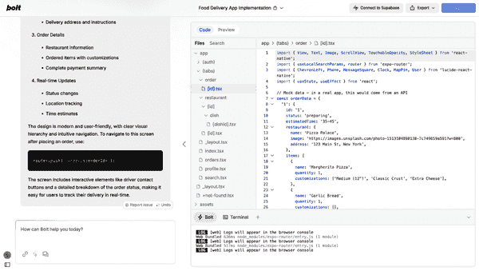
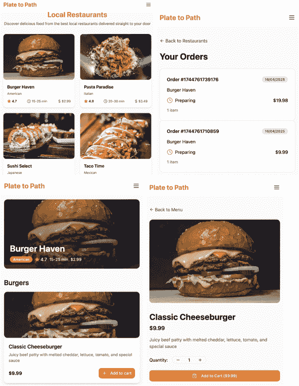
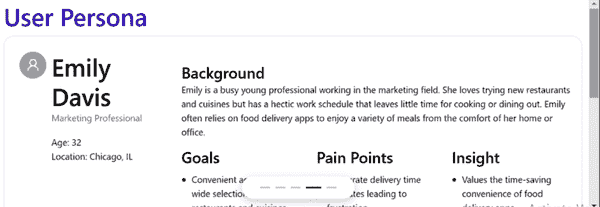

# 第二章：用户界面和用户体验设计

软件应用的世界依赖于美丽的*用户界面（UI）*和直观的*用户体验（UX）*。UI 设计关乎产品看起来如何以及用户如何与之进行视觉交互。它侧重于布局、颜色、按钮、字体，以及塑造软件产品视觉体验的一切。另一方面，UX 设计关乎产品对用户的感受，以及它是否直观且易于使用。UX 关乎可用性、导航流程，并确保整体体验流畅且用户友好。两者携手合作，共同创造优秀的软件产品。

在过去几十年中，创建这些界面和体验一直是 UI/UX 设计师的工作。他们通常与软件工程师配对，以实现功能以及将设计变为现实的后端工作流程，为全球用户提供集成的体验。将 UI/UX 设计转化为功能性的前端代码是一个劳动密集型的过程。传统上，设计师和工程师紧密合作，以确保设计的视觉美学能够准确转化为响应式、交互式的用户界面。这个过程通常涉及多次迭代、对细节的细致关注，以及对设计原则和编码标准的深入了解。

自 2022 年和 2023 年文本到图像生成式 AI 模型的出现以来，UI/UX 设计经历了巨大的变革。当我于 2025 年写下这些内容时，最近的 AI 工具现在可以从自然语言描述的想法中生成 UI 设计，并从 UI 设计中生成功能性的前端代码。这些工具通过自动化过程的大部分内容，正在革新设计到代码的工作流程。这极大地减少了将设计变为现实所需的时间和精力，并使设计专业人士的工作效率大大提高。AI 工具可以显著缩小概念与实施之间的差距。

例如，为新应用程序进行线框图和草图设计的第一个迭代可能需要超过一周的时间来完成——有时甚至需要超过一个月，这取决于项目的复杂性。新的 AI 设计生成器可以将线框图时间缩短到不到一天，并使每个反馈循环更快。这些工具将设计转化为功能性前端代码的能力意味着一个人或团队能够在几分钟（或几小时，包括迭代）内从用自然语言描述一个想法到生成功能性的前端代码，而不是需要几周或几个月。

本章将探讨 UI 设计和 UX 设计领域的一些领先工具，旨在涵盖两者之间广泛的活动。

# 设计和前端开发中的人工智能工具类型

在本章中，我将重点关注两种类型的人工智能工具：那些将想法转化为设计的工具，以及那些将设计转化为代码的工具。

将想法转化为设计的工具

这听起来像是 UI/UX 设计师的工作，但想想看：如果创建设计变得更容易、更快、对没有专业设计技能的人来说更容易访问，那么普通的前端开发者可能将能够创建设计和代码，而不仅仅是当前的工作范围，即只编写代码。这将为软件工程师，尤其是那些在前端工作的人带来巨大的赋能，他们能够独立创建基本的设计。

将设计转换为代码的工具

这个部分补充了第一章中涵盖的工具，这些工具可以从自然语言提示生成代码。这里的工具可以从基于图像的草图或 Figma 设计文件生成代码。（如果你不熟悉它，Figma 对于 UI/UX 设计师来说就像 Visual Studio Code 对于软件开发者一样。）

大多数可用的 UI/UX 设计生成工具都是完全基于浏览器和云的。它们使用简单，无需复杂的软件安装，并且可以通过浏览器和 URL 轻松访问。一些工具，如[QoQo.ai](https://qoqo.ai)，作为设计平台如 Figma 的插件。

本章所涵盖的大部分产品都是最近才发布的，处于产品开发的早期阶段。它们将在接下来的几个月和几年里持续发展，推出新的功能和改进的功能。在我撰写这篇文章的时候，这些设计工具在成熟度上比像[GitHub Copilot](https://oreil.ly/6tmUG)这样的软件开发工具落后一两年。

我预计在 UI/UX 领域，我们还将看到更多基于浏览器的工具，更多流行的设计平台的附加组件或插件，以及更多集成到设计师和前端开发团队之间使用的协作工具。（对于许多团队来说，类似 Git 的工具可能仍然是 Figma，但对于其他团队来说，可能是 Jira 或 Notion 等流行协作工具的插件——我们将看到。）

# 使用 AI 工具进行 UI/UX 的优缺点

就像任何工具一样，本章中的工具既有优点也有缺点。其中一些优点包括：

效率和速度

AI 工具可以在极短的时间内处理设计文件和组件，并生成相应的代码，这比人类开发者所需的时间要少得多。这种快速周转可以加快项目时间表并降低成本。

一致性

通过自动化转换过程，AI 工具有助于在整个项目中保持设计元素的一致实施。

可访问性

没有技术或设计专长的个人可以掌握这些工具并创建功能界面，这种转变有助于民主化 UI/UX 设计。

原型和迭代

AI 生成的代码允许更快地进行原型设计。设计师和工程师可以快速测试和迭代他们的想法，将新产品推向市场比以往任何时候都要快。

本章讨论的工具的缺点包括：

代码质量

AI 工具生成的代码并不总是符合人类生成代码的标准。它可能效率较低，阅读和维护起来更困难，因此——正如我在整本书中强调的那样——开发者必须在将其投入生产之前彻底检查和修改生成的代码。1

设备兼容性

AI 生成的代码可能没有针对所有浏览器、操作系统和屏幕尺寸进行完全优化。这可能导致响应性和跨设备兼容性问题，需要额外的努力来调试和修复。

定制和灵活性

虽然 AI 工具可以很好地处理标准设计模式，但它们可能难以处理更复杂、定制的元素。这极大地限制了创造力和根据特定需求定制设计的能力。因此，人类的创造力仍然是必需的。

缺乏原创性和独特性

AI 工具通常会产生与现有设计相似的设计。这些工具是在当前设计和流行趋势上训练的，这可能导致原创性和独特性的缺乏，一些设计看起来很通用或重复，无法脱颖而出。尽管 AI 工具可以提供一个有用的起点或灵感，但它们远远无法与有才华的人类设计师的创造力相匹配。

在利用 AI 进行自动化和依赖人类才能保证质量和创造力之间取得正确的平衡是成功将这些工具整合到设计流程中的关键。

# UI/UX AI 工具的应用场景

UI/UX 设计辅助工具帮助设计过程的各个部分。它们可以按以下方式分类：

+   设计构思助手

+   用户研究和分析工具

+   色彩调色板和样式生成器

+   布局和组件生成器

+   可访问性检查器

+   个性化引擎

+   语音用户界面（VUI）设计师

+   手势和运动设计工具

+   线框和原型设计工具

+   设计到代码转换器

本章重点介绍最后两项，它们位于 UI 和前端代码的交汇处，因此对软件工程师来说最有兴趣。其他针对 UX 和产品研究工作流程特定部分的工具通常更具体于设计师和其他与软件开发者协作较为松散的角色，如产品经理、产品分析师和 UX 研究人员。

因此，我使用以下用例来评估本章中的工具：

快速原型设计

AI 工具可以根据初始输入和设计描述快速生成线框和原型。这是设计过程中的一个重要部分，设计师们需要花费数小时进行来回迭代。有了这些工具，创建原型要快得多，设计师可以快速迭代多个设计选项。这种灵活性也可以使复杂的流程，如 A/B 测试，变得更加容易接触。

从模板进行设计

AI 工具可以在组件、颜色和样式等设计原则上进行训练，通过生成遵循既定设计系统、品牌和指南的设计，确保产品不同部分的一致性。这导致应用程序中具有统一设计元素和风格的连贯用户体验。虽然这种“工厂”方法不会促进创造力，但它确实为那些只需要创建看起来像现有屏幕但具有新功能的新屏幕的用例带来了显著的价值。（坦白地说，无论好坏，大多数软件开发都由这种“工厂”方法组成，正如低代码和无代码工具日益增长的流行所证明的那样。）

可访问性评估

AI 工具可以自动检查并提高 UI 设计对残疾人士的可访问性，确保符合如网络内容可访问性指南（WCAG）和包容性设计实践等标准——正如第三章中介绍的工具对软件代码所做的那样。这些功能可以识别可访问性问题并提出修复建议，从而减少所需的手动工作量。

用户研究和个性化

AI UI/UX 设计工具可以分析关于用户行为、需求和偏好的数据，以调整其输出以适应特定的用户群体或个人，从而提高参与度、保留率和满意度。通过利用数据驱动的洞察力，这些工具确保以用户为中心的设计。这可以极大地扩展现有用例。例如，如果目标是创建针对特定客户群体的新着陆页，使用这些工具，您可以根据特定参数创建完整的产品变体。没有它们，每个产品变体都需要一个繁重的软件开发周期。

内容生成

AI 工具有助于生成 UI 元素的内容，例如占位符文本、图像和图标。这迅速用真实内容填充设计，使原型在测试中更加逼真，并确保与设计风格和调性的统一。这使设计师能够专注于流程中更具创造性的方面。

# 评估流程

我在本章中的过程如下：我为每个选定的 UI 设计工具提交了一个简短的设计提示，在每个工具上运行相同的挑战，并比较了它们的输出。我还评估了它们将生成的设计转换为前端 HTML CSS、Next.js 和 React 代码的能力。我审查了市场上可用的 20 多个工具。正如预期的那样，它们遵循了长尾分布：一些工具按广告宣传的那样工作，而其他工具则产生了较差的输出或存在其他问题，阻止我运行测试。许多 AI 领域的工具是由初创公司开发的，其产品处于非常早期的发展阶段。

在尝试了这些工具后，我选择了每个类别中提供实际测试用例价值的最佳四个工具。然后，我根据 1 到 10 的评分标准对每个工具进行评分，其中 1 分是最差的（一个出错且根本无法运行的解决方案），10 分是完美无瑕的，5 分是设计并不完全符合要求。我仔细查看每个类别的顶级产品，详细说明其优缺点，然后提供关于亚军更简洁的信息。

还需要注意的是，本章中描述的所有测试都是在 2025 年春季进行的。鉴于这些工具及其底层模型的快速演变，您可能在稍后的时间对相同的提示得到不同的结果。

# UI 工具

我要求本章中涵盖的每个 AI 工具为移动食品配送应用生成屏幕设计。以下是提供的详细提示：

```py
Create a user-friendly food delivery app that allows customers to browse 
local restaurants, view menus, place orders, and track delivery status 
in real-time. The app should include these screens: Login, Restaurant 
and Menu Browsing, Order Placement, and Tracking. 

Style: App should be modern and minimalist, focusing on ease of use and 
visual appeal. The design should incorporate a clean layout. Add in 
mouth-watering food images.
```

让我们看看这些工具的表现如何。

## Uizard

[Uizard](https://uizard.io) 有一句营销标语，我认为它为这个领域的大多数其他参与者设定了标准：“忘掉无代码，无设计时代来临。”代码自动化与设计自动化的类比非常有意义。正如无代码承诺在极短的时间和预算内提供相同的功能，无设计也可能对设计过程产生同等的影响。

Uizard 产品始于 2017 年在丹麦哥本哈根的一个名为 pix2code 的机器学习研究项目。根据 [Uizard 的营销资料](https://oreil.ly/Yeeio)，“它允许开发者通过 AI 快速轻松地可视化产品想法。这有助于加快设计师和软件开发者的工作流程。它的使命是民主化设计，让世界各地的非设计师都能构建数字交互式产品。”

在提示屏幕 (图 2-1) 上，我要求 Uizard 使用上一节中的提示生成一个食品配送应用的屏幕。


###### 图 2-1\. Uizard 自动设计器的提示屏幕

图 2-2 展示了它生成的设计。


###### 图 2-2\. 由 Uizard 生成的屏幕（共 11 个）

您可以在 [Uizard 的网站上](https://oreil.ly/GfXvV)看到它生成的所有屏幕，包括交互，作为预览。

Uizard 的一个独特功能是它创建了一个设计的交互式演示，包括屏幕之间的实际交互和过渡。这使得它成为将想法转化为可演示概念的首选网站，甚至在编写任何代码之前。另一方面，Uizard 并不像 Bolt.new 或 Lovable 这样的其他工具那样生成代码，这些工具在生成设计的同时生成工作代码，使得将代码提交到 GitHub 甚至立即部署工作应用变得容易。

我给 Uizard 评了 8 分（满分 10 分）。它的设计组件非常出色，但在生成工作代码方面有所不足。

## Bolt.new

[Bolt.new](http://bolt.new)是 StackBlitz 于 2024 年 10 月推出的一款基于浏览器的 AI 开发工具。它使包括没有技术技能的用户在内的用户能够使用自然语言提示创建前端 Web 和移动应用程序。通过集成 WebContainers、Supabase 和 Netlify 等技术，Bolt.new 允许从浏览器中无缝生成代码、进行身份验证和部署。这种方法简化了开发过程，使其对更广泛的受众变得可访问。

该平台经历了快速增长，在推出后的两个月内实现了 2000 万美元的年度经常性收入（ARR），到 2025 年 2 月达到了 4000 万美元的 ARR.^(2) 在超过 300 万注册用户和 100 万月活跃用户的情况下，Bolt.new 已成为历史上增长最快的 AI 工具之一。其成功归因于其用户友好的界面、高效的开发工作流程以及能够迅速将想法转化为功能应用程序的能力。

我给 Bolt.new 相同的提示，它生成了图 2-3 中看到的 app 设计。

生成的屏幕非常稳固，具有我预期在这样的应用程序中应有的页面、导航和层次结构。它为每个屏幕生成了逼真的模拟文本和图像，使它们看起来很好。页脚中有一个明显的故障，既有缺失的图标图像，也有爬行的导航，但除此之外，设计非常好。

Bolt.new 最好的地方在于它可以帮助**超越**从自然语言提示生成设计：它还生成了底层代码。在这种情况下，它生成了 TypeScript 的前端代码。


###### 图 2-3\. Bolt.new 生成的屏幕

如图 2-4 所示，Bolt.new 的工作空间包括：

+   左侧的一个提示区域，我可以在这里请求新的屏幕、更改、修复等。

+   一个代码编辑器，我可以在这里看到实际生成的代码并进行实时更改

+   一个控制台，我可以在这里看到错误、日志以及代码执行产生的任何其他内容

+   一个预览区域，我可以在这里看到所有屏幕，例如图 2-3 中的截图

+   导出和部署我的应用程序的选项



###### 图 2-4\. Bolt.new 工作空间

Bolt.new 是一个一站式商店，旨在完全取代不仅仅是设计师，还包括 IDE 和云服务提供商——因为，当我发布我的应用程序时，它托管在 Bolt.new 的服务器上。鉴于其全面的功能集，我给 Bolt.new 打 10 分。

## 可爱

[Lovable](https://lovable.dev) 是一个基于浏览器的 AI 开发平台，由同名的瑞典初创公司于 2024 年 11 月推出。它使技术性和非技术性用户都能使用自然语言提示构建全栈 Web 应用程序。通过结合像 Supabase 这样的后端服务和 GitHub 这样的版本控制工具，Lovable 自动化从数据库设置到部署的整个过程。结果是开发体验大大简化，任何有想法的人都可以直接从他们的浏览器中启动功能软件。

仅仅三个月，Lovable 的年度经常性收入（ARR）就达到了 1700 万美元，吸引了超过 30,000 名付费订阅者。每天启动超过 50,000 个新项目，它是迄今为止增长最快的 AI 开发工具之一。3 其大部分动力来自于其直观的界面和抽象传统软件开发复杂性的能力，使得该领域——尤其是前端界面——比以往任何时候都更容易接触。

我为食品配送应用程序提供了相同的提示，Lovable 生成了如图 2-5 所示的应用程序设计。



###### 图 2-5\. Lovable 生成的屏幕

与 Bolt.new 非常相似，Lovable 在屏幕左侧有一个聊天机器人 UI，允许用户用自然语言提示新的屏幕、更改、修复等。它还有一个顶部的切换按钮，可以在预览和“开发模式”之间切换。预览模式显示了生成的设计，如图 2-5 所示，而开发模式显示了生成的代码。顶部有按钮，允许用户轻松地将代码与 GitHub 同步或部署应用程序。

我给 Lovable 评了 10 分（满分 10 分）。我认为它是这个领域的领先者，与 Bolt.new 并驾齐驱。两者都能满足从自然语言提示中获取专业设计和工作代码的使用案例。

# UX 工具

在本节简短的内容中，我涵盖了 UI/UX 设计工作流程中 UX 部分的工具：用户研究、产品工作流程和可用性。

这里是我用于评估 UX 工具的提示：

```py
Create a user persona for an 18-25-year-old university student trying 
to order food online from a restaurant using our application. 

Description: 18-25, Female, Male, University undergraduate from 
Los Angeles, California, single, and no children. Looking for a 
user-friendly platform to order food very fast, track orders, and 
make payments
```

## QoQo.ai

[QoQo.ai](http://qoqo.ai)（发音为“cocoa”）是一个 AI-for-UX-design 的 Figma 插件，有助于设计的早期阶段。设计师可以使用它来生成 UX 画像、旅程图、网站图和 UX 文案。UI/UX 设计师、产品经理和产品研究人员，通常负责这些任务，将利用这个工具节省时间；它还可以使这些任务对软件工程师更加容易接触，帮助他们更好地与用户互动。

我向 QoQo 提供了前面的提示，AI 在几秒钟内就生成了一个详细的用户画像（如图 2-6 所示）。


###### 图 2-6\. QoQo 用户画像

我给 QoQo 评分为 8 分（满分 10 分）。它能完成任务，而且没有学习曲线。它感觉像是一个 GPT 包装器，因为它生成文本并将其放入预定义的括号中，这对于开始设计软件产品的 UI/UX 来说可以提供巨大的价值。

## 研究工作室

[研究工作室](https://researchstudio.ai) 是一款由人工智能驱动的应用程序，旨在自动化客户和用户研究分析流程。此工具特别适用于需要将用户访谈转化为可操作见解、分析满意度和快速生成品牌报告的研究人员和设计师。传统上，用户体验研究人员需要花费数小时翻阅大量数据以提取见解。研究工作室简化了这一过程，使其更快、更高效。

研究工作室的平台允许您在三个开源的 LLM（大型语言模型）之间进行选择：Claude AI、Mistral 或 OpenAI 的 GPT-4o。您上传您的用户访谈，它将提取见解生成报告。它还可以使用从访谈和数据中收集到的信息来撰写报告。输出包括用户流程、功能地图和问题分析等多种报告类型。

为了评估此工具，我使用 Claude AI（单独使用）生成了一些原始输入。我要求它根据以下提示从我们的模拟食品配送应用的用户中生成 50 份调查响应：

```py
Generate 50 survey responses from users of a food delivery app, reflecting their
thoughts after using the app for some time. The responses should highlight both 
positive and negative views, including any problems they faced and suggestions 
for features that could improve the app's efficiency and user experience.
```

这些响应包括正面和负面的反馈，以及改进建议。以下是从 [Claude 的输出](https://oreil.ly/2zbPd) 中的一些示例：

```py
1\. "The app is fast and easy to use. Love the variety of restaurants!"

2\. "Delivery times are often longer than estimated. Please improve accuracy."

3\. "I wish there was an option to schedule orders in advance."

4\. "The customer service is excellent, always helpful when I have issues."
```

我将响应传递给研究工作室以提取见解（图 2-7）并要求它根据内置的报告类型撰写一份综合报告（图 2-8）。


###### 图 2-7\. 研究工作室将原始用户评论转化为“见解”地图



###### 图 2-8\. 研究工作室从调查响应生成的见解地图

我给研究工作室评分为 7 分（满分 10 分）。虽然它感觉像是一个简单的 LLM 包装器，但它对工作流程的处理做得很好，并且确实为那些希望将大量数据压缩成结构化的产品见解以用于其下一个软件开发迭代的人提供了价值。

# 工具比较

在我评估的 20 多个工具中，包括本章中介绍的四款工具，Galileo AI 在文本到 UI 工具中脱颖而出。它将图像重新制作成美丽设计的能力也使其脱颖而出。正如我之前提到的，这个领域仍然处于非常初级的阶段，所以我只能想象这些工具在未来几年将如何发展。

我评估的 UX 工具在底层技术方面不太复杂，但这并不是批评：它们对于它们的使用案例来说已经足够好了。

表 2-1\. AI UI/UX 工具概述

| 工具 | 目的 | 测试性能 |
| --- | --- | --- |
| Uizard | UI 生成 | 7/10 |
| Bolt.new | UI 和代码生成 | 10/10 |
| Lovable | UI 和代码生成 | 10/10 |
| QoQo.ai | UX 自动化 | 8/10 |
| Research Studio | UX 自动化 | 7/10 |

# 结论

我开始写这一章时，期望是错误的。考虑到它们的新颖性，我没有期望这个领域的工具在其当前状态下非常有用。我错了。现在我对这个领域以及我们将在未来几个月和几年内看到的软件开发流程的演变感到非常兴奋。

从设计生成前端代码，随着从提示（如 Bolt.new 和 Lovable 所见）生成设计和工作代码的用例越来越普遍，这无疑是最好地针对软件工程师，尤其是那些从事前端工作的人的角度。这是一个变革性的变化，将为世界各地的软件工程师节省数百万小时。

其他用例似乎更多地针对设计师，因为它们是设计师的工作。但想想看：我们的工具变得越来越强大，如果完成相同的工作所需的时间更少，软件工程师可以管理更多的设计工作流程。确实，我们的雇主和团队领导可能会越来越多地要求我们这样做。

这些工具使软件工程师能够产生可工作的设计，鉴于它们发展的惊人速度，我可以预见许多团队将不再需要专业的设计师来制作大量屏幕。当然，专业的交互、品牌化的 UI 元素或复杂的用户体验细微差别仍然最好由专业的 UI/UX 设计师来处理。但我可以想象，大多数标准应用程序流程，如注册流程、列表和简介页面，将由这些 AI 工具很好地服务。

从前，软件工程师从未如此有权收集他们产品的用户反馈，将反馈结构化成可操作的见解，生成改进的设计，将它们转化为代码，并将新版本推送到生产环境中。得益于这些工具，产品迭代周期将显著缩短。掌握这些工具的专业人士将比那些仅限于编写代码的人有更大的市场需求。当我于 2025 年初写下这些文字时，我注意到最近几个月“产品工程师”这一职位的需求大幅增长，这正好符合我描述的机遇：能够理解客户需求，将其转化为产品功能描述，并交付满足这些描述的代码的软件工程师。

^(1) 这又是节省编写代码时间与花费更多时间调试、修复和改进代码之间的权衡的一个例子。从概念上讲，这与 21 世纪初 Dreamweaver 生成的 HTML 代码的权衡没有太大区别，或者与近期低代码工具的出现，这些工具生成的模板代码通常难以定制和适应特定需求。

^(2) Akshay from Startup Spells. March 22, 2025\. [“Bolt.new: The 2nd Fastest-Growing Product in History (Behind ChatGPT)”](https://oreil.ly/nnAaP). *Startup Spells.*

^(3) Stephane at Lovable. February 25, 2025\. [“Announcing $15m Added Funding to Build the Last Piece of Software”](https://oreil.ly/UuLvM). *Lovable* (blog).
