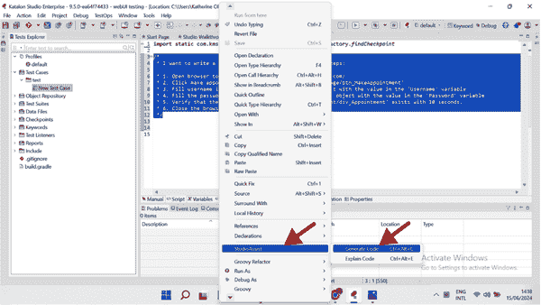
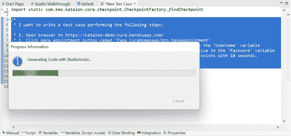
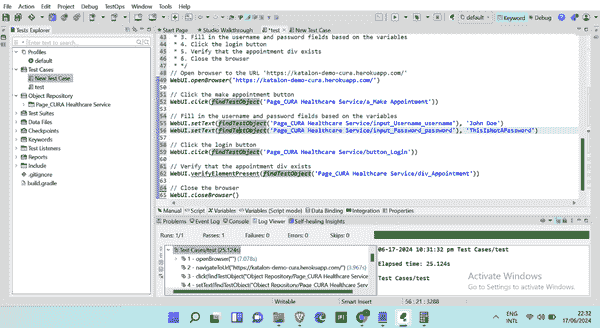

# 第四章：自动化测试和质量保证

测试和质量保证（QA）通常是新软件代码在部署到生产之前必须通过的最后一道关卡。它们的最终目标是找到成本高昂的 bug 或其他突出的问题，这些问题可能已经通过了代码审查（如前一章所述），以避免将它们投入生产。

QA 过程发生在代码开发、审查和接受合并到代码库之后。在测试和 QA 作为概念之间偶尔会有混淆，这可能是因为在不同公司中，传统上涉及的利益相关者被称为测试工程师或 QA 工程师。无论头衔如何，他们通常负责本章中涵盖的过程。

通常，质量保证（QA）过程包括在一个与生产环境紧密匹配且模拟用户行为的测试环境中执行手动和/或自动化测试，以捕捉任何在代码审查过程中遗漏的 bug。

当在测试/QA 过程中发现此类 bug 时，该功能将回归到开发状态。负责实施的原始软件工程师必须在将功能推送到审查和 QA 之前修复这些问题。这些回归循环旨在确保最终部署到生产中的代码确实是无 bug 的。

这些流程对于任何软件开发团队都是至关重要的。我们可以将它们分为两大类：自动化和手动。

自动化测试

自动化测试使用专门的软件工具来执行预编写的测试用例。这种方法对于重复性和回归测试非常高效，因为它减少了验证新代码更改所需的时间。自动化确保了一致性和精确性，最小化了人为错误的风险，并实现了广泛的测试覆盖。自动化测试可以全天候运行，提供快速反馈，并允许持续集成和持续交付（CI/CD）管道。尽管最初设置自动化测试和维护它们都需要努力，但长期的好处包括更快的发布周期、更高的准确性和快速检测和解决缺陷的能力。

手动测试

在手动测试中，测试人员细致地执行测试用例，而不依赖自动化工具。他们模拟最终用户的行为来识别缺陷，确保软件在现实世界场景中的行为符合预期。这种方法允许对细节有深入的理解和适应性，通常能够捕捉到自动化脚本可能遗漏的问题，例如用户界面问题和可用性问题。虽然手动测试可能耗时且劳动密集，但它对于探索性测试仍然是必不可少的，在探索性测试中，创造力和直觉对于发现意外的 bug 和确保无缝的用户体验至关重要。

质量保证（QA）本质上是一个细致、谨慎的过程，这往往使其成为延迟功能上线的一个瓶颈。因此，市场上存在一些 AI 工具，它们提出要加速这一过程中的不同部分。本章将特别关注其中的两种工具。

人工智能正在改变自动化测试的各个方面。例如，直到最近，自动化测试还涉及编写复杂的脚本。然而，现在许多自动化测试工具提供了创建测试的方法，而无需编写任何代码。您可以使用简单的、普通的英语创建自动测试，以检查软件应用程序中的每个组件和功能。借助 AI 驱动的工具，视觉测试也得到了简化，这些工具可以自动检测视觉错误，确保用户界面看起来和工作如预期。这些改进使测试过程更加有效和高效，从而允许测试人员专注于提高软件的整体质量。

# 人工智能测试工具类型

除了自动化/手动划分之外，我们还可以根据 AI 工具在测试生命周期中针对的具体领域，将软件测试和质量保证的 AI 工具分类为*功能性*和*非功能性*。

功能性人工智能测试工具

正如其名所示，*功能性*测试工具验证软件应用程序是否准确执行了所有预期的功能。这些工具关注系统做什么。它们的目标是测试应用程序的内部组件是否提供了预期的输出。功能性测试工具处理单元测试、集成测试、视觉测试、回归测试和冒烟测试等。

非功能性人工智能测试工具

*非功能性*人工智能测试工具评估软件超出其功能行为的方面，例如其性能、兼容性、可用性、安全性和可靠性。这些工具专注于评估软件的*性能*而不是其行为。它们测量速度、响应时间和资源利用率，等等。

这两类工具的目标是识别潜在的性能问题和安全漏洞。它们使用基于客户使用数据、内部公司文档，甚至行业监管规范或标准的深度学习模型进行训练。这些算法可以学会识别可能表明性能瓶颈或安全风险的模式。这种潜在的“智能”使得这些 AI 工具成为软件开发生命周期中质量保证阶段人类的重要伙伴。使用这些工具的最大收益是它们可以在近乎实时的情况下，对大型代码库应用其固有的测试敏锐度。

常见的挫败感是 QA（质量保证）过程耗时较长，因为复杂的产品和庞大的代码库通常有数百种不同的用户路径需要测试，而手动进行这项工作非常耗时。自动化工具并不会降低人工参与的价值，但它们确实可以自动化大量重复性工作，让人类 QA 专业人士能够专注于关键流程，例如在最近的拉取请求中更改的流程，或者构成 20%工作量却带来 80%影响的那些工作（正如[Pareto 原理](https://oreil.ly/qCXc5)所描述的，这在软件开发中经常被使用）。

本章中我评估的许多突出工具结合了功能性和非功能性测试能力，因为它们旨在集成到各种开发环境中。这些工具可以根据每个团队的背景和偏好以不同的方式使用。例如，测试是 CI/CD 流程中最显著的部分之一。得益于 CI/CD 集成测试工具，我们现在在开发过程中持续进行测试，而不是等到开发完成后。这种持续集成方法提供了关于软件性能和内部功能实时反馈。

CI/CD 集成的 AI 测试工具在每次构建后自动测试对代码所做的更改。持续测试确保在开发周期早期就识别并解决问题，从而降低了生产中出现缺陷的风险。这种方法促进了质量文化，并允许更快、更可靠地发布软件。

相比之下，基于浏览器和云的工具在浏览器或云中运行测试，提供了灵活性和可访问性。它们允许在不同的设备和环境中进行测试，无需复杂的设置，如 IDEs 和 CI/CD 集成工具。

# 用例

软件开发者和各个行业的工程团队正在将 AI 测试和 QA 工具集成到他们的流程中。以下是我们看到的一些突出的用例：

自动化测试创建

建立测试自动化曾经非常缓慢且耗时。设计和编写测试脚本、运行回归测试以及进行所有中间步骤都需要大量的时间和精神带宽。这正是许多 AI 驱动的测试工具旨在帮助解决的问题，它们可以在几秒钟内从简单的英语提示中生成全面的测试脚本。这种自然语言处理（NLP）的脚本编写方法使得自动化复杂工作流程变得容易。这反过来又使得测试对技术和非技术利益相关者都变得可访问。AI 生成的测试脚本通常基于用户行为和之前测试数据中的现有模式，这使得测试更加相关，更接近人类 QA 测试员所创建的。

提高测试准确性

提高准确性意味着更少的代码错误会从 QA 阶段滑到生产阶段。AI 算法的超级能力是，与手动测试员不同，它们可以大规模地捕捉模式和异常。在广泛的代码库和过去的测试数据上接受训练，有助于它们更容易地发现可能表明需要回滚功能的细微差别。

遇到错误后的自我修复能力

具有自我修复能力的 AI 测试工具可以自动检测并修复测试脚本中的问题，当应用程序的 UI 或代码更改导致测试失败时。这确保了所有测试都保持功能性和最新状态，无需人工干预。从历史上看，更新是 QA 团队面临的最大挑战之一，因为 UI 的更改意味着过去编写的许多测试也需要更改。这些 AI 工具可以显著减轻 QA 团队的工作负担，并使 QA 过程更快、更可靠。

更快的软件发布周期

通过使用人工智能测试工具自动化重复性任务，我们可以将软件应用的发布周期缩短十倍。开发者可以将更多的时间集中在创新新功能和提升产品上，而不是整天试图捕捉错误或编写测试脚本。公司也可以更快地响应市场需求和用户反馈。

# 需要人类测试员

重要的是要记住，尽管这些人工智能工具可以很好地捕捉到最终会破坏生产的错误和问题，但在测试过程中人类的直觉仍然至关重要。这不仅仅关乎这里审查的工具的限制，也关乎其背后的 AI 算法。它超越了这些。软件开发团队并不总是以绝对完美的方式编写 100%的需求和边缘情况。

我可以根据自己领导软件团队超过十年的经验来说：总是会有基于最后时刻的用户反馈、销售部门的临时请求，甚至 CEO 的电话中的特定例外而进行的变更和注意事项。虽然团队努力正确地记录所有需求，并在软件开发任务描述中捕捉边缘情况和测试计划，但结果永远不会完美。存在差距。因为这些是 AI 工具接受训练的书面材料，并且它们将项目需求视为测试的最终指令，因此它们最终会错过那些需求或临时例外的某些细微差别。

更不用说，坦白说，通常只有人类才能拥有的特定上下文意识。我们需要人类来适应行业范围内的事件或敏感的用户关注。软件开发是一个复杂的问题，产品和代码库越广泛，纯 AI 驱动的 QA 过程显示出其局限性和差距的可能性就越大。

AI 算法的好坏取决于用于训练它们的数据。正如本章所示，它们绝对可以帮助很多，尤其是在像测试大量用户旅程和应用流程这样的重复性体力劳动中。但人类监控、审查和干预对于流程的关键部分仍然是必需的。

# 评估流程

大多数在质量保证自动化领域的公司都服务于企业客户。考虑到企业公司通常拥有更大的团队、更广泛的产品和更高的质量控制标准，这是有道理的。虽然这完全正常且预期如此，但它影响了我选择在此展示的工具的过程，因为我更倾向于选择可以通过简单的自助注册过程访问且提供免费试用工具。这是一个故意的选择，以便让读者更容易采取行动，尽管这确实排除了一些需要我与销售团队协商价格套餐的工具。我决定这些工具超出了本书的范围。

即使有这个限制，在我研究本章时，我审查了 20 多个自动化测试工具（其中许多属于企业销售类别）。我列出了以下两个突出显示的工具。

为了评估和比较本章中的人工智能测试工具，我使用每个工具编写和运行了针对[a 简单直接的测试网站](https://katalon-demo-cura.herokuapp.com)的测试用例：一个用于预约医生的基本 Web 应用程序。由于开发一个全面的端到端自动化测试框架是一项重大任务，我专注于评估这些测试工具提供的特定 AI 功能，以展示它们将 AI 集成到软件测试中的潜力。

本书中的示例并非旨在代表一个完整的测试框架，而是为了展示如何使用集成在自动化测试工具中的 AI 功能。本章的主要目标是展示 AI 在软件测试领域的可能性及其简单性，而不是提供一个现成的解决方案。

我评估了这些工具中的 AI 功能如何增强测试过程的各个方面，例如生成测试用例、创建测试数据、执行测试和分析结果。

测试网站

*https://katalon-demo-cura.herokuapp.com*

应用程序描述

具有登录页面的 Web 应用程序，用于预约医生

测试描述

自动化医疗保健服务网站上的一系列操作。此测试确保患者可以导航应用程序并使用它成功预约与医生会面。我们想看看应用程序上是否一切如预期般工作。

步骤

我们打算生成/创建测试用例，自动评估以下内容：

+   登录页面是否工作正常

+   用户在更新所有必填字段后能否成功预约

+   预约历史记录记录了每一次的预约

测试用例 1

1.  导航到*https://katalon-demo-cura.herokuapp.com*。

1.  点击“预约”按钮。

1.  在用户名字段中设置文本“John Doe”。

1.  在密码字段中设置加密文本。

1.  点击“登录”按钮。

1.  检查当输入正确信息时，用户是否能够成功登录。

测试用例 2

在“预约”页面：

1.  选择访问日期。

1.  选择“医疗保险”选项。

1.  选择“申请医院再次入院”选项。

1.  在文本区域中输入注释。

1.  预约一个预约。

1.  确认用户在提交包含所有正确信息的预约表单后 10 秒内能够成功预约。

测试用例 3

1.  切换菜单。

1.  通过点击“历史”访问历史页面。

1.  确认刚刚预约的预约出现在历史记录中。

现在，让我们检查我找到的顶级 AI 测试工具，看看它们是如何遵循这些说明并使用它们的 AI 功能评估网站的。

## Katalon Studio

[Katalon Studio](https://oreil.ly/xREhC)，由 Katalon Inc.于 2015 年推出，是一个支持移动应用、Web 应用、桌面应用和 API 的自动化软件 QA 工具。公司的网站强调它“在整个平台上嵌入 AI，以更快地测试、更清晰地查看，并通过更少的瓶颈简化测试自动化。”

Katalon Studio 是 Katalon 生态系统中的第一个工具。从那时起，又增加了两个额外的工具。Katalon Recorder 是一个浏览器自动化扩展，用于创建和运行 Firefox、Edge 和 Chrome 测试。Katalon TestOps 是一个测试编排平台，它集中管理测试计划和管理工作，简化 DevOps 流程并增强跨团队合作。

Katalon 中包含的 AI 增强测试功能包括：

+   从纯英文指令生成 Groovy 代码（Groovy 是用于在 Katalon 中编写测试用例的脚本语言）

+   根据提示自动生成测试脚本

+   一个虚拟数据分析员功能，该功能分析所有您的 TestOps 数据并生成报告

+   自愈功能

如前所述，Katalon 的自愈 AI 自动帮助您修复运行中中断的测试。当您发布新功能或更改组件时，您不需要手动维护现有的测试脚本。回归测试计划也自动处理：AI 引擎立即重新运行您现有的功能和非功能测试，以确保您之前开发和测试的软件组件即使在添加了新更改后仍能正确执行。

在 Katalon 中创建测试用例时，您通常要么录制测试并回放，要么使用 Groovy 编写测试脚本。

### 实际示例

在这个例子中，我使用了 StudioAssist AI，Katalon 的生成式 AI，它帮助程序员从简单的语言提示中编写测试用例。我使用它来编写医疗保健服务网站的测试用例。为了这个测试，我扮演了一个不知道 Groovy 语法的利益相关者。我使用 Katalon 的 StudioAssist AI 功能生成 Groovy 脚本，这些脚本设置了我的测试。我在提示中编写了我想要的测试，然后它为我创建了一个 Groovy 测试脚本，我随后运行它来评估软件。StudioAssist 还有助于解释它生成的每一行代码的功能。

我创建了一个新的测试项目，设置了一个测试文件夹，并导航到脚本选项卡以开始编写我的测试。以下是给 StudioAssist AI 的提示：

Prompt:

```py
I want to write a test case performing the following steps: 
1\. Open the browser to https://katalon-demo-cura.herokuapp.com
2\. Click the make appointment button named 
'Page_CuraHomepage/btn_MakeAppointment' 
3\. Fill username in the 'Page_Login/txt_Username' object with the value 
in the 'Username' variable
4\. Fill the password in the Page_Login/txt_Password' object with the 
value in the 'Password' variable
5\. Verify that the appointment div 'Page_CuraAppointment/div_Appointment' 
exists within 10 seconds. 
6\. Close the browser  
```

Katalon StudioAssist 生成了正确 Groovy 语法的测试用例（在示例 4-1 中完整展示），当运行时执行测试脚本（参见图 4-1、4-2 和 4-3）。



###### 图 4-1\. 使用 StudioAssist UI 选项生成测试时，Katalon 的直观性



###### 图 4-2\. 使用 Katalon 生成测试需要几秒钟



###### 图 4-3\. 在 StudioAssist UI 上由 Katalon 生成的测试

##### 示例 4-1\. 由 Katalon 生成的测试的完整代码

```py
/* I want to write a Katalon Studio test case to perform the following steps.
* 1\. Open browser to the URL  'https://katalon-demo-cura.herokuapp.com/'
* 2\. Click the make appointment button
* 3\. Fill in the username and password fields based on the variables
* 4\. Click the login button
* 5\. Verify that the appointment div exists
* 6\. Close the browser
* */
// Open browser to the URL 'https://katalon-demo-cura.herokuapp.com/'
WebUI.openBrowser('https://katalon-demo-cura.herokuapp.com/')

// Click the make appointment button
WebUI.click(findTestObject('Page_CURA Healthcare Service/a_Make Appointment'))

// Fill in the username and password fields based on the variables
WebUI.setText(findTestObject('Page_CURA Healthcare Service/input_Username_username'), 
                             'John Doe')
WebUI.setText(findTestObject('Page_CURA Healthcare Service/input_Password_password'), 
                             'ThisIsNotAPassword')

// Click the login button
WebUI.click(findTestObject('Page_CURA Healthcare Service/button_Login'))

// Verify that the appointment div exists
WebUI.verifyElementPresent(
      findTestObject('Page_CURA Healthcare Service/div_Appointment'))

// Close the browser
WebUI.closeBrowser()

```

如您所见，生成的测试满足了我提供的说明，代码也使用了正确的语法。

### Pros

+   StudioAssist 对非技术用户来说易于使用和调试，因为它将自然语言提示转换为正确的 Groovy 测试语法。

+   内置关键字和模板可以加快测试创建过程，并减少对大量编码的需求。

+   它的自我修复功能会在应用程序 UI 发生变化时自动更新测试脚本。

+   StudioAssist 与流行的 CI/CD 工具和测试框架如 Jenkins、Git 和 Jira 集成。

### Cons

+   Katalon 要求你下载并安装 StudioAssist（如前述截图所示），这增加了额外的设置工作。

+   Katalon 有时可能会慢，尤其是在处理大型测试套件或复杂测试场景时。

+   在 Katalon StudioAssist UI 中有一点点学习曲线。一些选项隐藏在顶部栏的级联选项中，你需要学习键盘快捷键。

我给 Katalon 评 9 分（满分 10 分）。它极大地帮助从简单的英语文本提示中编写测试，并在同一 UI 中针对我想要测试的应用程序执行它们。我不会给它评 10 分的唯一原因是缺点列表中提到的学习曲线。它确实可以更直观，尽管这是复杂企业产品的典型用户体验，而 Katalon 已经是这种产品了。

现在我们转向第二个工具。

## testRigor

我接下来测试的工具是[测试 Rigor](https://oreil.ly/OM9lJ)，这是一个由 AI 驱动的自动化工具，旨在简化软件测试。与传统测试工具不同，testRigor 允许开发者创建和执行测试而无需编写代码。其 NLP 能力允许您用普通英语描述应用程序的功能。然后 AI 生成、执行并报告测试用例，显著减少了全面软件测试所需的时间和专业技术。

### 实际例子

在我对 testRigor 的评估中，一个真正突出的功能是完全无代码的测试创建过程。我无需编写任何测试代码。相反，我提供了我的测试网站 URL 和应用程序的简要描述以及它应该如何表现。我还提供了我的测试目标和指定要生成的测试用例数量。AI 处理了从生成测试到执行它们再到生成详细测试报告的所有事情（见图 4-4 和 4-5)。


###### 图 4-4\. 生成测试用例的提示和描述


###### 图 4-5\. 测试应用程序执行并通过

如您所知，测试的目标是检查用户是否能在 10 秒内登录并成功预约。

### 优点

+   testRigor 使用基于行为的测试用例创建，允许根据用户与应用程序的交互方式创建测试。这绕过了测试语法的复杂性，这可能防止非技术用户或小型团队流失。

+   testRigor 的测试产品非常易于访问，这使得它脱颖而出。它是完全基于云的，这消除了安装额外软件的需求（与 Katalon 不同）。这使得它可以从任何地方轻松访问和使用。

+   它与流行的 CI/CD 管道（如 Jenkins 和 CircleCI）以及支持 bug 跟踪工具（如 Jira）集成，这使得它能够无缝地与团队已经使用的工具集成。

+   自我修复功能，就像 Katalon 的，当现有应用程序工作流程发生变化时，可以减少测试团队的工作负担。

### 缺点

+   跳过实际的测试编写对于小型团队和偶尔的用户来说很棒，但我怀疑它对已经建立大型测试基础设施的大型团队来说可能不实用。对于这些软件团队（占大多数），自动化测试的价值在于生成正确语法的测试。

+   这种绕过的副作用是，testRigor 不提供与传统测试语言和框架相同的灵活性和控制。它不适合复杂的测试场景或广泛的应用程序工作流程。

由于这些限制，我给 testRigor 评分为 7 分（满分 10 分）。除此之外，它是一个“一用就知”的优秀 UX，非常适合那些没有复杂测试基础设施的较小团队，或者测试需求偶尔且只想检查产品是否符合要求的团队。

# 工具比较

Katalon 和 testRigor 各有优势，以满足不同的测试需求，尽管两者都利用人工智能和机器学习来增强其功能。表 4-1 提供了比较。

Katalon

Katalon 提供了一套强大的功能，旨在处理复杂的测试场景。它特别适用于需要全面测试覆盖的大型测试项目，以及已经拥有测试基础设施、团队和流程的软件开发团队。虽然学习曲线比 testRigor 更陡峭，但 Katalon 的功能深度和应对多样化测试需求时的灵活性使其成为更多软件开发团队的强大工具，尤其是大型团队或那些在复杂产品上工作的团队。

testRigor

我对 testRigor 的简洁性和易用性印象深刻。学习曲线明显较短，我发现从注册到实际测试结果的速度非常快。该工具在产品功能频繁变化的环境中表现出色，需要快速和持续的测试。我认为 testRigor 最适合初创团队或偶尔使用一次的用户，他们没有现成的测试基础设施，并且他们的产品需求可能变化过于频繁，以至于他们甚至无法设置如此强大的测试环境。另一方面，testRigor 对那些 Katalon 优势所在的团队提出了限制；也就是说，对于大型团队和更复杂的产品工作流程。

表 4-1\. 人工智能测试工具概述

| 工具 | UX | 测试性能 |
| --- | --- | --- |
| Katalon | 仓库 | 9/10 |
| testRigor | 浏览器 | 7/10 |

# 结论

在本章分析的工具中，Katalon 被证明是大型团队和企业产品的良好选择，而 testRigor 则被证明是初创公司和边缘产品的赢家。这很好地覆盖了软件开发市场，并展示了不同类型产品和成熟度水平的团队如何从使用人工智能测试工具中受益。

如果你曾经从事过软件测试或 QA 工作，或者如果你只是为任何你编写的代码编写过单元测试，你就会知道编写测试并随着应用程序的演变和扩展而保持它们更新的劳动强度有多大。

我经常参与关于预算规划和路线图讨论的对话，在这些对话中，稳健的测试被推迟，或者过时的测试被简单地视为应该逐步淘汰的技术债务。对于技术和非技术利益相关者来说，对适当的测试实践存在偏见是非常常见的，其中一个关键原因就是，在历史上，要实现这些测试需要巨大的投资。

这就引出了 AI 测试工具可以带来的大部分价值。在软件开发中，我们一直在寻找帕累托原则的体现：“投入 20%的努力就能带来 80%的路线图项目价值的是什么？”作为一个 CTO，我多次参与这些讨论。在质量保证（QA）中，创造 80%价值的 20%的努力包括正确定义应用程序工作流程；与用户和客户讨论问题和边缘情况；为将实施要求的开发人员提供额外的细节，以映射出细微差别；最终，在上线前作为最后的把关人进行用户验收测试。

另外的 80%的努力，只创造了 20%的价值，是实际编写和执行每个测试以验证代码是否满足要求的工作。AI 工具在这方面表现出色。能够用自然语言提供指令，并得到语法正确、准备就绪、可以执行的测试，这是一个节省大量时间的用例。当测试变得过时并被简单地注释掉时，这些自我修复能力可以在应用程序代码更改时更新测试，这是一个很好的后备措施，因为迫切需要将发布版本投入生产。

这些是日常决策，它们往往将适当的软件测试降级为第二优先级。AI 工具可以帮助缓解这些担忧，并有助于确保在生产中运行的软件得到适当的测试且无错误。这不能仅靠 AI 工具来完成，因为这些工具不会取代人类。恰恰相反：在质量保证（QA）中的人类任务是至关重要的，因为它们定义了测试范围，并为 AI 工具以高标准完成繁琐工作提供了关键指南。

再次强调，“AI + human”的结合可以改善一个经常令人沮丧的过程，以产生更高品质的输出。
