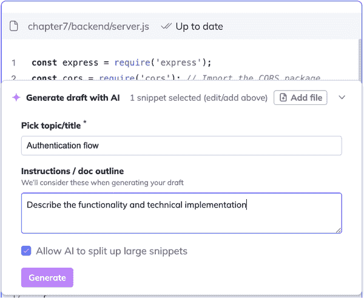
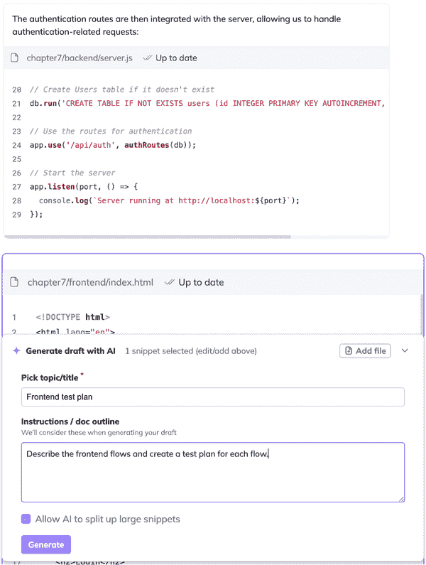
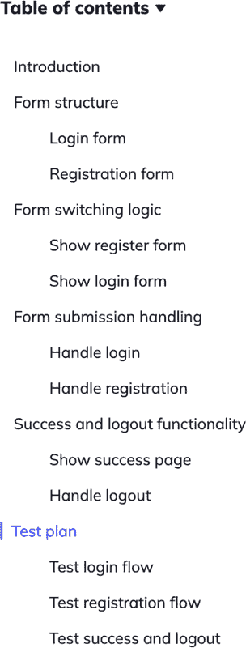
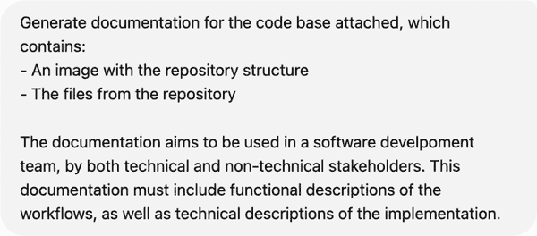
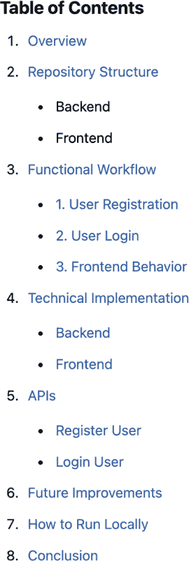

# 第六章：文档和技术写作

文档对于软件开发中的清晰度、一致性和知识传递至关重要。它确保团队成员在入职时理解代码，并在日常工作中减少学习曲线，减少丢失上下文和随之而来的错误和重构的机会。

文档对于非技术利益相关者也很重要，例如产品经理、客户支持代表以及从事市场营销、销售和运营工作的人。清晰的文档促进了团队之间的协作，并创建了一个单一的真实来源，防止了误解。随着软件的发展，适当的文档简化了代码库的维护和新开发者的入职，增强了项目的寿命。

在公司外部，记录如何使用软件产品可以帮助销售和市场营销工作，防止客户入职期间的困难，并促进用户与产品的互动。为外部利益相关者记录功能和工作流程也是收集他们对如何改进产品反馈的绝佳起点。

尽管其重要性不言而喻，但文档往往根本不会被编写。软件工程师通常不喜欢为人类写作，因此如果可能，他们通常会跳过这一步骤。但他们几乎总是处于截止日期的压力之下，当需要做出妥协时，文档往往是被留下的其中一项。即使文档确实被编写，繁重的工作量和时间压力往往会导致内容仓促或不完整。编写高质量的文档需要时间。其他挑战包括找到合适的详细程度，以及随着系统的发展保持文档的更新。

在最近的基于大型语言模型（LLM）的人工智能浪潮之前，AI 工具已经帮助生成书面内容多年。例如 Grammarly 这样的写作工具，它可以帮助找到正确的单词并修复错误，对于使用外语写作的人来说特别有帮助。在软件开发中，Swagger 和 Javadoc 等工具也使用 AI 与代码更新同步自动生成 API 文档。

我在本章中审查的工具是最近推出的，大多数是在 2022 年生成人工智能浪潮开始以来，它们都旨在将生成文档的简单性从代码扩展到简单的模块（如 API）和辅助工具（如 Grammarly）之外。有些旨在足够胜任，以取代编写文档中人类行动的需求。

# 文档类型

在软件开发中，常见的四种文档类型包括：

API/SDK 文档

对于开发者来说，API 和软件开发工具包（SDK）的文档是一项关键资源，它提供了关于软件系统中可用功能、方法和服务的清晰、结构化细节。这些文档接口充当不同软件组件之间的桥梁，确保开发者可以高效地集成和使用系统。

内部文档和功能规格

当业务利益相关者定义一个新产品或新功能以实现业务目标时，他们会编写功能规格说明，以便让软件工程师知道要实现哪些功能。工程师的角色是扩展这些规格说明，包括技术系统设计、架构决策和工作流程，这些文档不仅记录了实现了什么，还记录了是如何实现的。这种类型的文档对于随着时间的推移维护和演进软件项目至关重要，尤其是在原始工程师不再在岗的情况下。

用户指南和手册

这些文档帮助非技术用户了解如何使用软件。它们包括从安装说明到故障排除技巧的一切。在销售过程中，它们作为销售和营销同事的支持材料，以及客户使用产品时都很有用。这里的挑战在于为没有技术背景的用户编写文档。

发布说明和变更日志

这些文档用于传达软件的变化，例如错误修复、新功能或性能改进。除了让每个人了解情况外，有效的发布说明还通知内部和外部利益相关者需要更新集成和工作流程以适应这些变化。

# 评估过程

我评估了 20 多个文档和技术写作领域的 AI 工具，以便在本章中突出显示四个工具。这里涵盖的每个工具都符合以下标准：

+   它是一个由有能力的团队支持的专业项目。

+   它能生成高质量的结果。

+   它提供了一定程度的功能，免费或试用。

+   在撰写本文时（2025 年中期），它具有很高的采用率。

对于这次测试，我创建了一个非常简单的认证流程，包括前端和后端。完整的代码，可在本书的[GitHub 仓库](https://github.com/sergiopereira-io/oreilly_book)中找到，包含注册、登录和登出的流程。我使用了本章中的 AI 工具来记录我的代码。我的主要比较点是生成的文档是否可以用于之前解释的四个文档用例中的任何一个。

再次，对于这次测试，我优先考虑那些可以通过简单注册和免费试用使用的工具，因此我避开了企业级工具。

每个测试生成的完整文档都可以在本书的[GitHub 仓库](https://github.com/sergiopereira-io/oreilly_book)中找到。

## Swimm

[Swimm](https://swimm.io) 是一款专为软件工程师设计的 AI 驱动文档工具。它自动化了代码文档的创建和维护。为了确保它与每次代码更改保持同步，Swimm 直接集成到代码仓库中。工程师可以为特定的代码文件或代码片段创建文档，或者在每个新的拉取请求（PR）中创建/更新文档。后者对于大多数软件开发团队的流程来说是一个很好的选择，因为 PR 代表了代码库中最细粒度的迭代。每次这样的迭代都需要进行文档记录，并且每次迭代都有可能使现有的文档过时。

我认为这个流程与第三章中的自动化代码审查相当。我可以看到如何将这些工具嵌入到仓库中，以提供与现有软件开发流程的无缝集成。

虽然 Swimm 可以集成到仓库中，并在每个 PR 上创建或更新文档，但为了这次比较测试，我没有使用那个特定的流程。我简单地使用了基于浏览器的 Swimm UI，这允许我连接仓库，选择要记录的特定文件，并提示在文档中包含什么，如图图 6-1 所示。



###### 图 6-1\. Swimm 创建文档的部件

在这个流程中，我要求 Swimm 使用一个简单的提示来记录我身份验证流程的后端部分：

```py
Describe the functionality and technical implementation. 

```

所需的输出是一个可以用于内部查看正在进行的项目，并为未来团队成员入职的文档。您可以在图 6-2 中看到结果的样本。



###### 图 6-2\. Swimm 为后端文档生成的输出样本

这个输出相当不错。我喜欢文档的结构以及其内容。然而，我的身份验证流程可能过于简单，无法展示 Swimm 的全部潜力。因此，我测试了第二个示例，以创建一个更复杂的文档：

```py
Describe the frontend code and create a test plan for each flow. 
```

结果再次非常好。它生成了一份完整的文档（其目录可以在图 6-3 中找到），包括一个高级介绍，然后深入探讨影响流程的具体代码组件，因此应该进行文档记录。



###### 图 6-3\. Swimm 为前端代码生成的文档目录

文档的最后部分，正如我要求的，确定了代码的主要流程，并为每个流程提供了测试计划。实际的测试计划相当简单，但这可能是由于底层流程的简单性所导致的，如图所示：

**测试计划**

测试登录流程

1.  验证登录表单默认可见。

1.  输入有效凭据并提交；预期会收到成功消息。

1.  输入无效凭据并提交；预期会收到错误警报。

1.  点击“在此注册”并确保注册表单出现。

测试注册流程

1.  点击“在此注册”以切换到注册表单。

1.  输入有效详细信息并提交；预期会收到成功消息。

1.  输入无效详细信息并提交；预期会收到错误警报。

1.  点击“在此登录”并确保重新出现登录表单。

测试成功和注销

1.  在成功登录或注册后，验证成功消息是否显示。

1.  点击注销按钮并确保再次显示登录表单。

Swimm 在这项测试中表现良好。使用这个工具很容易上手，并且它以正确的 Markdown 格式生成了与我请求相关的相关文档，这是技术文档的标准。然而，我发现 Swimm 只能一次记录一个代码文件，这产生了非常零散的文档片段，它们更像是*read.me*文件，而不是高级代码库和流程文档。

我认为将 Swimm 的工作范围扩大到更广泛的源材料是一个自然的演变，Swimm 可以利用其优越的集成流程为整个代码库或至少是文件组创建文档。它可以横向工作，通过使用所有前端文件作为文档的对象来记录前端代码的结构，或者纵向工作，通过使用与该功能相关的所有文件来记录功能流程。

因此，我将 Swimm 评为 6/10。虽然用户体验很好，但输出质量仍然远未达到我期望从我的团队那里得到的文档质量。

## ChatGPT

[ChatGPT](https://chat.openai.com)是大多数软件工程师首选的用于创建文档的 LLM 工具，因此我在本章中包括它，特别是 GPT-4o 模型，这是截至写作时（2025 年中期）最先进的模型。

我首先提示 ChatGPT 为我生成代码的文档。我在提示中包括了所有六个代码文件、仓库结构的截图（以便它理解代码文件之间的关系），以及文档应包含的说明，如图 6-4 所示。



###### 图 6-4\. 向 ChatGPT 提供文档我的代码的说明

如图 6-5 中的目录表所示，ChatGPT 生成了非常全面的文档。



###### 图 6-5\. ChatGPT 生成的文档的目录

这是一个非常好的输出；它是非常完整的文档，包括所有预期的主要组件的章节，从高级上下文（如仓库结构）到对每个特定组件的详细深入研究，例如 API，如图 6-6 所示。


###### 图 6-6\. ChatGPT 对 API 模块的文档

您可以要求 ChatGPT 直接输出 Markdown 文件格式的文档。我将 ChatGPT 生成的最终文档（以及本章中的其他工具）提交到了书的[GitHub 仓库](https://github.com/sergiopereira-io/oreilly_book)。

如预期的那样，ChatGPT 在这个有限范围的测试中表现非常好。它可以一次处理多达 20 个文件，并且文件大小限制因文件类型而异。虽然这对我的认证应用等小型项目来说完全没问题，但对于大多数生产级应用来说是不够的。除了这些限制之外，与连接到仓库的工具相比，ChatGPT 还提供了一个不方便的用户界面。需要手动上传文件并给 ChatGPT 提供有关其结构和关系的上下文信息，这使得它更难以使用，尤其是在大型项目中。

因此，我为这个用例将 ChatGPT 评为 7/10。文档的质量非常好，但有一个限制和不便的用户界面的前提。软件工程师需要一些创造力才能在每份文档的 20 个文件限制内记录应用程序的集群（通过功能或堆栈的一部分或模块）。

## Cursor

[Cursor](https://www.cursor.com)是 AI 编码工具空间中的相对新玩家。它于 2023 年推出，并在 GitHub Copilot 引领的具有 AI 代码辅助功能的 IDE 特定类别中占据了巨大的市场份额。截至 2024 年 8 月，Cursor 拥有 40,000 名客户。1

Cursor 的产品是一个 AI 原生 IDE，它最初是从流行的 Visual Studio Code 分支出来的。它允许软件工程师选择哪个 LLM 应该为工具提供动力；我使用了 Anthropic 的 Claude 3.5 Sonnet。作为一个实际的 IDE，Cursor 可以查看我仓库中的所有代码文件，无论它们的数量或大小。您可以通过聊天功能输入提示，如图 6-7 所示。


###### 图 6-7\. 向 Cursor 生成文档的提示

生成的文档 Cursor 良好，包含了预期的主要组件部分，如图 6-8 中的目录表所示。


###### 图 6-8\. Cursor 生成的文档的目录

尽管 Cursor 的概述非常全面，内容的相关性也很强，但在生成 Markdown 文档方面，Cursor 有一个显著的缺陷。由于某种原因（可能是 bug），生成的内容只有部分格式化为 Markdown 文件。它将一些部分输出为纯文本，如图 6-9 中的片段。这使得阅读变得更加困难。


###### 图 6-9\. Cursor 生成的 Markdown 文档中的格式问题

尽管存在这些格式问题，生成的文档内容广泛，涵盖了正确的话题，并且具有正确的技术深度。它绝对符合我认为我团队可以接受的文档标准。因此，我给 Cursor 评分为 8/10。

## Scribe

[Scribe](https://scribehow.com) 是本章中其他工具非常不同的工具。这个工具最适合以视觉方式创建用户指南、标准操作程序（SOPs）或错误报告。虽然我使用 Swimm、ChatGPT 和 Cursor 的重点是创建关于特定产品或功能的技术实现的书面文档，但我使用 Scribe 来生成关于产品功能指南。

虽然 Scribe 是在 2019 年作为一个基本的屏幕捕获工具创建的，但我用于这次测试的功能，称为 Scribe AI，仅在 2023 年推出。它利用了原始功能，允许用户记录浏览器会话，但与仅仅存储录制视频不同，它还根据录制中的屏幕转换创建了一个完整的带有注释的工作流程。这就是为什么它适用于 UI 相关用例，如错误报告和产品指南。

为了开始测试，我安装了 Scribe 的 Chrome 扩展程序，并使用它记录了一个简单的会话，包括注册新账户和登录该账户。我的目标是让 Scribe 生成一份用户指南，我可以与外部非技术利益相关者，如产品用户分享。

我第一次录制会话的经历相当顺畅；我第一次尝试就轻松地得到了我需要的录制。它被称为 Scribe，这个名字既指视频录制，也指生成的带有注释的工作流程，并且可以在[这个公共链接](https://oreil.ly/lsVD3)中找到。我认为这个输出是好的，因为它识别了我的工作流程中的屏幕转换，并捕获了每个屏幕的截图，突出显示了用户在屏幕上执行的动作，导致转换。结果是符合用户影子工具（如 Hotjar 或 Fullstory）的，这些工具通常用于用户研究和错误跟踪。

Scribe 提供了一个功能，可以将前面提供的公共链接中的原始 HTML 文档转换为 AI 生成的文档。我使用了身份验证流程来测试这个功能，它允许用户编写一个提示，指定从屏幕录制中生成的文档部分。我的指示很简单，如图 6-10 所示。

![assets/gasd_0610.png]

###### 图 6-10\. 指示 Scribe 从原始网站动作跟踪生成文档

生成的文档[在此处公开可用](https://oreil.ly/WcT6u)。我发现这个输出令人失望。它很一般；感觉它可能是关于任何应用的，而不是专门关于我的。它生成了一份文档并将 Scribes（特定的流程）嵌入其中，而不是基于我记录的流程生成文档，这是我原本的意图。这让我认为，这个工具可能更适合生成包含多个不同 Scribes 合并在一起的大型文档（例如，产品指南）。生成的文档内容与用例的相关性不大。因此，我将 Scribe 评为 5/10。

# 工具比较

表 6-1 比较了本章中讨论的每个工具的评分。

表 6-1\. AI 文档工具概述

| 工具 | 用户体验 | 测试性能 |
| --- | --- | --- |
| Swimm | 代码库扩展 | 6/10 |
| ChatGPT | 网站 | 7/10 |
| Cursor | 集成开发环境 | 8/10 |
| Scribe | Chrome 扩展 | 5/10 |

# 结论

作为一名超过十年的 CTO，我发现文档是那些总是缺乏但从未达到值得暂停正在进行的工作来修复的程度的事情之一。事实上，糟糕的文档是一种技术债务，但它不会破坏系统或降低性能。然而，它确实会降低*团队*的性能，这在软件开发团队中可能是一种不那么明显但可能更具有破坏性的债务形式。

我一直发现很难推动我的团队中的软件工程师首先编写文档，更不用说保持文档的组织、可访问性和更新了。我认为像本章中我审查的这类 AI 工具可以在使这个过程更容易的过程中发挥基本作用。通过一个简单的提示，它们可以在几秒钟内生成文档。一个人类至少需要一个小时或两个小时才能生成类似的文档。而且，这种时间投入会随着复杂性的增加而增加：系统越大，正确记录并保持文档更新的挑战和耗时就越大。在一个几十人的团队中，这项工作可能会轻易地累计到每年数千小时的集体工作时间。

虽然 AI 工具可以立即创建文档，但它们也可以创建糟糕的文档（就像人类可以一样）。我建议团队在文档方面采取与设置编码指南相同的方法：为提示或甚至为文档创建一个模板，其中包含预定义的章节和子章节。这可以作为防止文档不必要的冗长的一个后盾，并通过使内容更容易找到来促进可读性。

上述所有内容说明，由 AI 工具创建的文档必须由团队成员*始终*进行彻底的审查和编辑。虽然生成 90%的成果只需几秒钟，但最终的修订和质量控制必须由人类完成，因为输出并不总是满足目标。以 Scribe 为例，生成的文档是通用的；如果有人工审查员，他们就会捕捉到这个缺陷并手动改进文档。

^(1) Anysphere Team. August 22, 2024\. [“A 系列和魔法”](https://www.cursor.com/blog/series-a). *Cursor* (博客).
