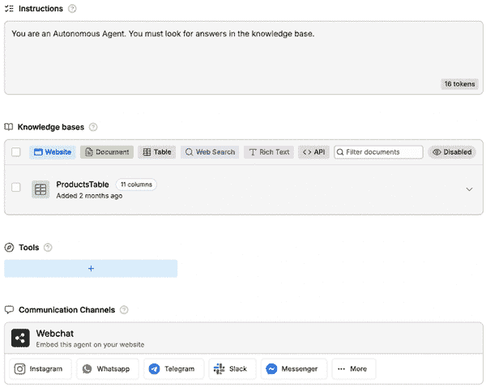
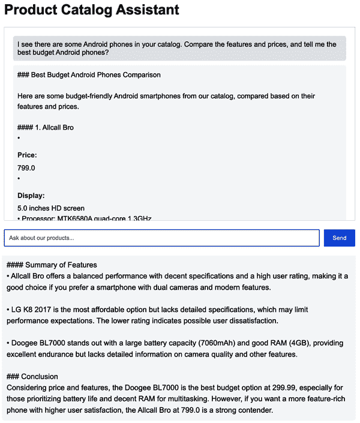

# 第七章：聊天机器人和虚拟助手

聊天机器人已经成为数字客户服务和自动化的一个基本组成部分，超过十年了。最初作为简单的基于规则的程序构建，传统的聊天机器人遵循预定义的逻辑树来处理重复性任务，例如回答常见问题、在客户支持中提供自动化响应或在结构化工作流程中收集用户信息。与今天的基于 LLM 的机器人相比，这些聊天机器人的功能并不强大，但它们成为了一种自动化高容量、低复杂度交互的非常流行的方式。然而，它们的技术实现在与非结构化对话、歧义或偏离预期模式的用户输入方面遇到了困难。通常体验感觉僵硬且不自然——人们明显知道他们是在与一台机器对话，这些用户交互通常会以令人沮丧的声明结束，例如，“我不明白。请再试一次。”

现在人们已经习惯了与基于 LLM（大型语言模型）的工具如 ChatGPT 聊天，基于规则的聊天机器人方法似乎已经成为了遥远的记忆。今天的 AI 聊天机器人不再仅仅依赖于预定义的脚本和规则。相反，它们利用复杂的自然语言处理（NLP）、上下文理解和生成式 AI 来提供动态、类似人类的交互。这些进步意味着聊天机器人的角色已经显著扩展，包括以下任务：

+   理解复杂的查询并给出相关、结构良好的答案

+   在对话中保持记忆，提供连续性和上下文

+   代表用户采取行动，例如预订预约或检索个性化数据

+   随时间学习和适应，根据现实世界的交互进行改进

+   与外部 API 和数据库集成以获取实时信息

这种转变意味着软件工程师现在可以访问广泛的各种工具和框架，以帮助我们构建智能聊天机器人，从无代码工作流程构建器到完全可定制的 AI 助手，这些助手利用代理推理和训练数据。无论你想构建一个简单的自动化帮助台机器人，还是一个能够进行复杂决策的 AI 代理，技术现在比以往任何时候都更容易获得。

# 聊天机器人实现类型

实现聊天机器人的主要选项有三种：

无代码 AI 聊天机器人

这些工具承诺，没有编程知识的用户也能够部署 AI 助手。它们通常具有易于使用的界面，用户可以在其中上传数据集、定义工作流程并选择底层 AI 模型。虽然这些工具是为非技术用户推广的，但我将它们包括在书中，因为根据我的经验，某些技术知识通常需要将这些工具与其他公司工作流程的部分集成，而这最终成为软件工程师工作范围的一部分。

这些无代码聊天机器人是之前提到的基于规则的聊天机器人的自然演变，并针对相同的用例：客户支持、电商和常见问题自动化。

拖放式聊天机器人构建器

这些工具旨在弥合简单性和灵活性之间的差距，以适应不同客户的需求。它们通常易于设置，并允许用户通过连接具有预定义功能的框来直观地构建对话流程，同时集成 AI 功能以实现动态交互。开发者可以自动化工作流程，并在聊天机器人的后端使用更复杂的逻辑。

这些聊天机器人构建器针对客户服务、线索生成和内部工作流程自动化等用例。

基于代码的 AI 框架

这些通常是 SDK、API 或开源仓库，允许软件工程师完全控制聊天机器人的行为，然后他们将其用作模板来实现定制的聊天机器人体验。它们对训练数据的标准通常更高。用例包括代理推理、与其他工具和工作流程的集成，甚至数据安全（因为这些聊天机器人可以托管在公司云基础设施上）。

# 评估流程

为了比较聊天机器人构建工具，我创建了一个与这个[在线零售数据集](https://github.com/sergiopereira-io/oreilly_book/blob/main/chapter8/data/product-catalog.csv)交互的聊天机器人，这个数据集由机器学习领域的另一位 O’Reilly 作者 Lucas Soares 创建。它包含了一个电商店铺的交易数据；我使用它来测试聊天机器人检索事实数据和回答复杂用户查询的能力。

每个聊天机器人都使用一组预定义的查询进行测试，评估其：

+   设置和部署简便

+   获取事实信息的能力

+   在多次交互中保留上下文的能力

+   处理复杂查询的能力

我测试了多个工具，但我在前一个章节概述的每个类别中都包含了一个工具。

让我们从无代码选项开始：Chatbase。

## Chatbase

[Chatbase](https://www.chatbase.co)于 2022 年推出，是一款无代码 AI 聊天机器人构建器，允许用户通过上传文档或数据集来创建和训练聊天机器人。由于其简单的界面和与 OpenAI 的 GPT 模型的集成，它成为了一个易于使用的解决方案，适用于希望自动化其支持和客户互动但不需要技术专长的企业。尽管该产品相对较新，Chatbase 已在小型企业、单干者和初创公司中得到采用，尤其是在处理客户支持和常见问题自动化方面。该工具提供免费层选项和付费计划以扩展聊天机器人的功能。

对于这次测试，我在 Chatbase 网站上创建了一个免费账户，并寻找创建我的聊天机器人的方法。我很快找到了添加训练数据的地方，我的电子表格包含电子商务产品目录（见图 7-1）。在两三分钟内，我就开始与我的聊天机器人互动。


###### 图 7-1. Chatbase 的源界面，用户可以添加训练数据

一旦聊天机器人准备就绪，我就开始提问，就像我是一个真正的客户：

```py
I see there are some Android phones in your catalog. Compare the 
features and prices, and tell me the best budget Android phones.

```

对于第一个问题，它做得很好，检索到正确的结果并以良好的格式显示，如图 7-2 所示。


###### 图 7-2. 对我的 Chatbase 聊天机器人的第一个问题（截断到可见区域）

在第二个问题中，我故意询问了一个不存在的产品：

```py
I’m looking for a laptop below $10\. What’s the best option?
```

这是一种常见的幻觉来源，而且我的 Chatbase 聊天机器人再次表现出色，声明没有产品与我的查询匹配（见图 7-3）。


###### 图 7-3. 对我的 Chatbase 聊天机器人的第二个问题

对于第三个问题，我提出了一个更复杂的问题，不仅询问目录中的特定产品，还要求 Chatbase 比较它们的属性，并最终提供推荐：

```py
You have mobile phones and digital cameras. I’m interested in 
photography, should I buy the Sony Xperia XA2 Ultra or the Pentax 
K-1 camera? Why?
```

再次，我的 Chatbase 聊天机器人做得很好，说明了每个选项的属性，并就何时购买哪一个提供了建议（见图 7-4）。

Chatbase 还通过其连接部分使发布聊天机器人变得非常简单。只需几点击，我就能获得一些代码，通过聊天气泡或 iframe 将我的聊天机器人嵌入到网站中。我对上传训练数据、测试聊天机器人和发布它的简便性印象深刻。

Chatbase 在测试中表现非常出色，如果你有特定的训练数据并对提示进行一些修改以获得所需的功能、语气等，这可能是在网站上集成聊天机器人的最简单方法之一。因此，我给它打了 9/10 分。我没有给它打 10/10 分，因为最终产品的行为与底层 LLM（gpt-4o-mini，在本测试中）的默认行为非常相似。换句话说，如果用户将相同的训练数据上传到 ChatGPT 并提问，答案会非常相似。尽管如此，通过几点击就能完成所有这些操作并发布聊天机器人仍然令人印象深刻。


###### 图 7-4. 对我的 Chatbase 聊天机器人的第三个问题

## Botpress

拖放选项 [Botpress](https://botpress.com) 于 2017 年成立，作为一个开源聊天机器人开发平台，当时意味着基于规则的聊天机器人。当前版本的产品提供了一个可视化构建器，使用户能够创建复杂的对话逻辑，并将生成的机器人与第三方 API 和其他应用程序集成。近年来，Botpress 的采用率有所增长，尤其是在寻求替代封闭源代码聊天机器人平台的中型企业组织中。由于其模块化架构和自托管选项，它吸引了需要遵守数据隐私法规同时保持可扩展性的企业。

为了测试 Botpress，我遵循了与 Chatbase 相同的剧本。我在 Botpress 网站上创建了一个免费账户，并通过其小部件构建了一个代理（这就是它对聊天机器人的称呼）。我花了一些时间才弄清楚如何添加训练数据，因为我首先需要在单独的页面上创建一个表格（它是 CSV 格式训练数据的名称），然后将它作为知识库添加到我的机器人中（见图 7-5）。



###### 图 7-5\. Botpress 的代理构建器 UI，用户可以在其中添加训练数据和配置他们的工作流程

Botpress 提供了除简单聊天机器人功能之外更多选项。用户可以添加不同的代理和工具，并使用它们构建一个工作流程，作为机器人底下的后端推理（见图 7-6）。它比 Chatbase 更强大；然而，要创建一个简单的机器人并运行起来，我花费了 30 到 40 分钟的尝试和错误。


###### 图 7-6\. Botpress 的工作流程构建器——我为测试选择了一个非常简单的流程

聊天机器人最终准备就绪后，我开始与之互动，提出与 Chatbase 机器人（见图 7-7）完全相同的问题。


###### 图 7-7\. 向我的 Botpress 聊天机器人提出的第一个问题

对于第一个问题，机器人正确地检索了三款预算 Android 手机；然而，它还提供了一个价格为 $0 的选项，这显然是一个数据错误，它没有向我标记出来。如果我是真正的客户，我可能会对这种建议感到有些沮丧。

同样，在第二个问题中，我故意询问一个不存在的产品，我的 Botpress 机器人做得很好，正确地指出没有产品符合我的查询（见图 7-8）。


###### 图 7-8\. 向我的 Botpress 聊天机器人提出的第二个问题

第三，我再次提出一个关于比较带摄像头的手机复杂的问题。我的 Botpress 机器人做得很好，列出了每个选项的属性，并指出何时推荐购买其中一个。然而，格式并不理想，因为每个产品的属性都被压缩在一个单独的项目符号中（见图 7-9）。


###### 图 7-9\. 向我的 Botpress 聊天机器人提出的第三个问题

Botpress 还提供一键发布功能，为您的聊天机器人创建一个独立的 URL，并提供针对最常用用例的简单指南（实现聊天气泡、嵌入到网站中等）。

Botpress 在测试中表现良好。一些答案缺乏打磨可能是因为在这次测试的日期（2024 年 8 月 6 日）默认使用了较旧的模型（gpt-4o-2024-08-06）。它比 Chatbase 拥有更全面的流程功能；然而，对于新用户来说，其 UI 相当具有挑战性。我给它打 8/10 分。

## LangChain

基于代码的框架[LangChain](https://www.langchain.com)于 2022 年出现，以应对对开发者友好型框架日益增长的需求，用于构建 AI 驱动应用程序。它旨在与流行的 LLM（如 GPT-4、Claude 和开源替代品）集成，并允许软件工程师创建具有高级推理能力、记忆和动态 API 集成的自定义 AI 助手。该框架在寻求构建超越基本聊天机器人交互的基于代理系统的 AI 工程师和初创公司中得到了快速采用，并已成为 LLM 驱动应用程序和 AI 代理的首选框架。

对于这次测试，我使用 LangChain 框架编写了自己的聊天机器人。这是一个非常文档齐全的框架，因此启动起来相当容易。从我创建空仓库到以下图像中的聊天机器人，我大约花了 30 到 40 分钟（在 Cursor 的帮助下处理样板代码、代码中的冗长部分以及最后的格式调整）。生成的代码可在本书的[GitHub 仓库](https://github.com/sergiopereira-io/oreilly_book)中找到。我在本地机器上运行了它，并使用 gpt-4o-mini 模型进行了这次测试。

对于第一个问题，机器人正确地检索了三部安卓手机，建议了一部实际上的好预算手机，并解释了其推理过程，这也很好（参见图 7-10）。



###### 图 7-10。我的第一个问题的开始和结束以及我用 LangChain 编写的聊天机器人的响应（冗长的中间部分未显示）

对于第二个问题，关于不存在的产品，机器人确实意识到不存在这样的产品（参见图 7-11）。回复“我不知道”是由于对提示中“如果你不知道答案，就说我不知道”这一部分的字面解释。这很奇特，但实际上是正确的。


###### 图 7-11。对我的 LangChain 聊天机器人的第二个问题

在比较手机与摄像头的复杂问题上，我的 LangChain 聊天机器人表现良好，列举了每个选项的属性以及选择其中一个或另一个的权衡（见图 7-12）。它的回答与使用其他工具创建的聊天机器人的回答非常一致，这说明了输出中有多少可以归因于底层模型。


###### 图 7-12\. 我的第三个问题的开始和结束以及 LangChain 聊天机器人的回答（中间详细部分未显示）

LangChain 不提供一键发布选项。我在本地机器上运行了这段代码，但要使聊天机器人公开可访问，我需要将其部署在云服务器上。此外，LangChain 没有现成的指南来集成我的聊天机器人作为气泡聊天或嵌入到其他人的网站中；这需要根据需求开发。

我已经使用 LangChain 实现了几个现实世界的聊天机器人解决方案，并且非常喜欢它。它允许你构建简单的聊天机器人或更复杂的聊天机器人，以及使用 LangGraph 的多代理工作流程。这是一个强大的解决方案，但确实需要软件开发技能。它也拥有非常好的文档，拥有一个优秀的开发者社区。借助 Cursor 和 GitHub Copilot 等其他 AI 工具的帮助，这些实现所需的时间只是几年前的一小部分。因此，我给 LangChain 打 10/10 分。

# 工具比较

在这次测试中，所有工具的表现都非常出色，这也是它们被包括在这里的原因（见表 7-1）。然而，LangChain 将继续成为我构建任何类型聊天机器人的首选工具。

表 7-1\. AI 聊天机器人工具概述

| 工具 | UX | 测试性能 |
| --- | --- | --- |
| Chatbase | 无代码 AI 聊天机器人 | 9/10 |
| Botpress | 拖放式聊天机器人构建器 | 8/10 |
| LangChain | AI 代码框架 | 10/10 |

# 结论

作为一名首席技术官，我多年来构建了许多聊天机器人，大多数是在最近的生成式人工智能浪潮之前，功能仅限于预定义的逻辑树和非常狭窄的应用场景。

本章的测试突出了现在可以以最小的努力构建一个高度功能的聊天机器人。这些聊天机器人在特定数据上训练、语气、推理范围以及遵循所需用例的具体能力方面都表现出色。毫不奇怪，成千上万的企业正在将这些功能集成到他们的产品中。观察用户界面模式的巨大转变，从传统的列表→搜索→详细方法转向允许用户以更非结构化的方式“与数据交谈”的聊天机器人 UI，这也是很有趣的。

值得注意的是，这种向聊天机器人用户界面的转变为幻觉、部分响应以及其他 LLM 技术的众所周知的小怪癖创造了空间。确实，我写这一章的主要收获是，在这个测试中所有工具的输出都高度依赖于它们所使用的底层 LLM——无论是好是坏。用户只需进行最小程度的操作，就能设置一个令人印象深刻的聊天机器人，它能获取信息、正确地组织信息并得出复杂的结论。但聊天机器人的输出仍然非常受底层 LLM 的限制，例如幻觉。
