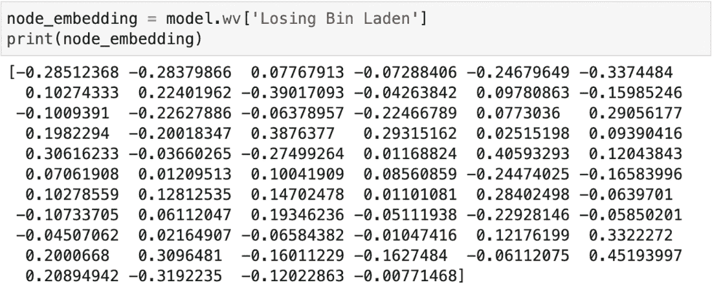
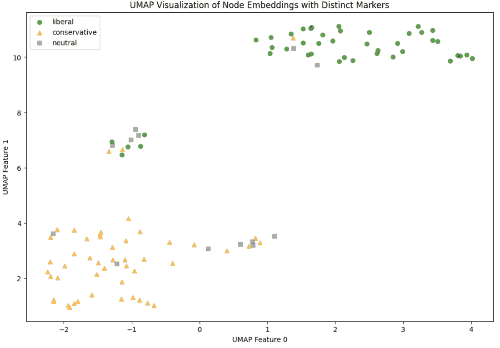
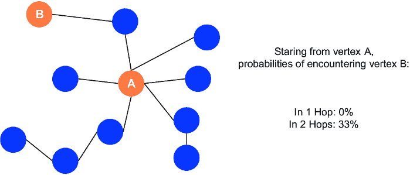
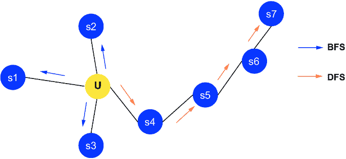
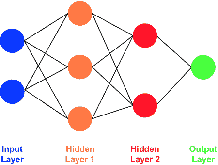
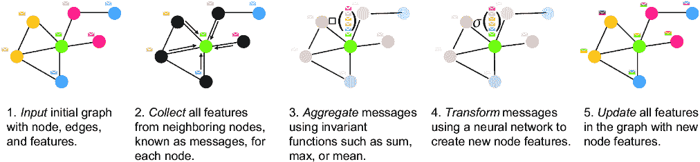

# 第二章：图嵌入

### 本章涵盖

+   探索图嵌入及其重要性

+   使用非 GNN 和 GNN 方法创建节点嵌入

+   在半监督问题上比较节点嵌入

+   深入探讨嵌入方法

图嵌入是图机器学习中的基本工具。它们将图复杂的结构——无论是整个图、单个节点还是边——转换成一个更易于管理的、低维度的空间。我们这样做是为了将复杂的数据集压缩成更容易处理的形式，同时不丢失其固有的模式和关系，这些信息将应用于图神经网络（GNN）或其他机器学习方法。

正如我们所学的，图封装了网络中的关系和交互，无论是社交网络、生物网络还是任何实体相互连接的系统。嵌入以紧凑的形式捕捉这些现实生活中的关系，促进了可视化、聚类或预测建模等任务。

有许多策略可以推导这些嵌入，每种都有其独特的方法和应用：从使用网络拓扑的经典图算法，到分解表示图的矩阵的线性代数技术，以及更高级的方法如 GNN [1]。GNN 之所以突出，是因为它们可以将嵌入过程直接集成到学习算法本身。

在传统的机器学习工作流程中，嵌入作为单独的步骤生成，在回归或分类等任务中作为降维技术。然而，GNN 将嵌入生成与模型的训练过程合并。随着网络通过其层处理输入，嵌入被精炼和更新，使得学习阶段和嵌入阶段不可分割。这意味着 GNN 在训练时间学习图数据的最大信息表示。

使用图嵌入可以显著提升你的数据科学和机器学习项目，尤其是在处理复杂网络数据时。通过在低维空间中捕捉图的本质，嵌入使得将各种其他机器学习技术应用于图数据成为可能，为分析和模型构建开辟了一个广阔的可能性世界。

在本章中，我们首先介绍图嵌入以及关于政治书籍购买图的案例研究。我们首先使用 Node2Vec（N2V）来建立一个非 GNN 方法的基线，引导您了解其实际应用。在第 2.2 节中，我们转向 GNN，提供基于 GNN 的嵌入的动手介绍，包括设置、预处理和可视化。第 2.3 节提供了 N2V 和 GNN 嵌入的比较分析，突出了它们的应用。本章随后通过讨论这些嵌入方法的理论方面结束，特别关注 N2V 背后的原理和 GNN 中的消息传递机制。本章所采用的过程在图 2.1 中得到了说明。


##### 图 2.1 第二章过程和目标总结

注意：本章的代码以笔记本形式存储在 GitHub 仓库中（[`mng.bz/qxnE`](https://mng.bz/qxnE)）。本章的 Colab 链接和数据可以在同一位置访问。

## 2.1 使用 Node2Vec 创建嵌入

在许多领域，理解网络中的关系是一个核心任务，从社交网络分析到生物学和推荐系统。在本节中，我们将探讨如何使用受自然语言处理（NLP）中的 Word2Vec 启发的技术*Node2Vec（N2V）*来创建节点嵌入。N2V 通过模拟随机游走来捕捉图中节点的上下文，使我们能够在低维空间中理解节点之间的邻域关系。这种方法对于识别模式、聚类相似节点以及为机器学习任务准备数据是有效的。

为了使这个过程易于理解，我们将使用`Node2Vec` Python 库，它对初学者友好，尽管在大型图上可能较慢。N2V 有助于创建捕获节点之间结构关系的嵌入，然后我们可以将其可视化，以揭示关于图结构的见解。我们的工作流程涉及几个步骤：

1.  *加载数据并设置 N2V 参数。* 我们首先加载数据，并使用特定的参数初始化 N2V 来控制随机游走，例如游走长度和每个节点的游走次数。

1.  *创建嵌入。* N2V 通过在图上执行随机游走来生成节点嵌入，有效地将每个节点的局部邻域总结为向量格式。

1.  *转换嵌入。* 得到的嵌入被保存，然后转换为适合可视化的格式。

1.  *在二维中可视化嵌入。* 我们使用 UMAP，一种降维技术，将这些嵌入投影到二维空间，使其更容易可视化和解释结果。

我们的数据是政论书籍数据集，它由 2004 年美国选举期间在 Amazon.com 上频繁共同购买的书籍（边）连接而成[3]。使用这个数据集提供了一个令人信服的例子，说明 N2V 如何揭示共同购买行为中的潜在模式，可能反映了书籍购买者中更广泛的意识形态分组[4]。表 2.1 提供了政论书籍图的关键信息。

##### 表 2.1 政论书籍数据集概览

| 在 Amazon.com 上共同购买的政论书籍 |  |
| --- | --- |
| 节点数量（书籍） | 105 |
| 左倾节点 | 41.0% |
| 右倾节点 | 46.7% |
| 中立节点 | 12.4% |
| 边的数量 边代表两本书之间共同购买的发生频率。 | 441 |

政论书籍数据集包含以下内容：

+   *节点* — 代表由[Amazon.com](http://Amazon.com)销售的关于美国政治的书籍。

+   *边* — 指示相同买家频繁共同购买，如亚马逊的“购买此书的顾客也购买了这些其他书籍”功能所示。

在图 2.2 中，书籍根据其政治立场进行着色 — 深色代表自由主义，浅色代表保守主义，条纹代表中立。这些类别是通过 Mark Newman 对亚马逊上发布的书籍描述和评论的定性分析来分配的。


##### 图 2.2 政论书籍数据集的图形可视化。右倾书籍（节点）以浅色显示，并聚集在图的上半部分，左倾书籍以深色阴影显示，并聚集在图的下半部分，中立的政治立场以深色方块显示，并出现在中间。当两个节点相连时，表示它们在 Amazon.com 上经常一起购买。

这个数据集由 Valdis Krebs 编制，可通过 GNN in Action 仓库（[`mng.bz/qxnE`](https://mng.bz/qxnE)）或卡内基梅隆大学网站（[`mng.bz/mG8M`](https://mng.bz/mG8M)）获取，包含 105 本书（节点）和 441 条边（共同购买）。如果您想了解更多关于这个数据集的背景信息，Krebs 已经撰写了一篇文章包含这些信息[4]。

使用 N2V，我们旨在探索这本书集合的结构，基于政治倾向和不同书籍类别之间可能存在的关联来揭示洞察。通过可视化 N2V 创建的嵌入，我们可以更好地理解书籍是如何分组的，哪些书籍可能拥有共同的受众，为政治敏感时期的消费者行为提供有价值的见解。

从可视化中可以看出，数据已经按照逻辑方式进行了聚类。这得益于*Kamada-Kawai 算法*这一图算法，它仅利用拓扑数据而不使用元数据，因此对图形可视化很有用。这种图形可视化技术将节点定位在反映它们连接的位置，旨在使紧密连接的节点彼此靠近，而较少连接的节点则相隔较远。它是通过将节点视为由弹簧连接的点，迭代调整其位置，直到弹簧中的“张力”最小化来实现的。这导致布局自然地揭示了基于图形结构的集群和关系。

对于政治书籍数据集，Kamada-Kawai 算法帮助我们根据在亚马逊上共同购买的频率来可视化书籍（节点），而不使用任何外部信息，如政治立场或书籍标题。这使我们能够看到书籍是如何根据购买行为分组在一起的。在接下来的步骤中，我们将使用 N2V 等方法创建嵌入，以捕获更详细的模式和进一步区分不同的书籍组。

### 2.1.1 加载数据、设置参数和创建嵌入

我们使用`Node2Vec`和`NetworkX`库来体验我们的第一次图嵌入实践。通过使用 pip 安装这些包后，我们使用`NetworkX`库加载我们的数据集的图形数据，该数据存储在.gml 格式（图形建模语言，GML）中，并使用`Node2Vec`库生成嵌入。

GML 是一种简单、可读的纯文本文件格式，用于表示图结构。它以结构化的方式存储有关节点、边及其属性的信息，使其易于读取和写入图数据。例如，一个.gml 文件可能包含节点列表（例如，我们数据集中的书籍）和边（表示共同购买的联系），以及额外的属性，如标签或权重。这种格式在交换不同软件和工具之间的图数据方面得到了广泛应用。通过使用`NetworkX`加载.gml 文件，我们可以轻松地在 Python 中操作和分析图形。

在`Node2Vec`库的`Node2Vec`函数中，我们可以使用以下参数来指定进行的计算和输出嵌入的性质：

+   *嵌入的大小（*`dimensions`*）* — 将其视为每个节点配置文件的详细程度，就像记录了多少种不同的特征一样。标准的详细程度是 128 个特征，但你可以根据你希望每个节点的配置文件有多复杂来调整这个值。

+   *每次遍历的长度（*`Walk Length`*）* — 这是指每次随机遍历你的图形有多远，通常的旅程是 80 步。如果你想看到节点周围更多的邻域，增加这个数字。

+   *每个节点的行走次数（`Num` `Walks`*）—这告诉我们我们将从每个节点开始行走多少次。从 10 次行走开始可以提供一个良好的概述，但如果你想要更全面地了解节点的周围环境，可以考虑进行更多次行走。

+   *回溯控制（返回参数，`p`*）—这个设置有助于决定我们的行走是否应该回到它曾经去过的地方。将其设置为 1 可以保持平衡，但调整它可以使你的行走更具或更少的探索性。

+   *探索深度（输入-输出参数，`q`*）—这一部分是关于选择是接受更广泛的邻域场景（例如，当`q`大于 1 时的广度优先搜索）还是深入特定的路径（例如，当`q`小于 1 时的深度优先搜索），其中 1 是两者的混合。

根据你想了解的节点及其连接的情况调整这些设置。想要更深入的了解？调整探索深度。想要更广泛的上下文？调整行走长度和行走次数。此外，请注意，你的嵌入大小应该与所需的细节水平相匹配。一般来说，尝试这些参数的不同组合以查看对嵌入的影响是一个好主意。

对于这个练习，我们将使用前四个参数。关于这些参数的更详细信息可以在第 2.4 节中找到。

列表 2.1 中的代码首先使用`NetworkX`库的`read_gml`方法将图加载到名为`books_graph`的变量中。接下来，使用加载的图初始化一个 N2V `模型`。此模型设置了特定的参数：它将为每个节点创建 64 维的嵌入，使用 30 步长的行走，从每个节点开始执行 200 次行走以收集上下文，并在四个工作器上并行运行这些操作以加快处理速度。

然后使用`fit`方法中定义的附加参数训练 N2V 模型。这包括设置每个目标节点周围 10 个节点的上下文窗口大小以学习嵌入，考虑所有节点至少一次（`min_count=1`），并在训练过程中每次处理四个单词（在这个上下文中是节点）。

训练完成后，我们使用`model`的`wv`方法（反映其 NLP 传承，wv 代表词向量）访问节点嵌入。对于我们的下游任务，我们使用字典推导式将每个节点映射到其嵌入。

##### 列表 2.1 生成 N2V 嵌入

```py
import NetworkX as nx
from Node2Vec import Node2Vec
books_graph = nx.read_gml('PATH_TO_GML_FILE')   #1
node2vec = Node2Vec(books_graph, dimensions=64,
 walk_length=30, num_walks=200, workers=4)   #2
model = node2vec.fit(window=10, min_count=1,\
batch_words=4)   #3
embeddings = {str(node): model.wv[str(node)]\
 for node in gml_graph.nodes()}   #4
```

#1 从 GML 文件中加载图数据到 NetworkX 图对象

#2 使用输入图的指定参数初始化 N2V 模型

#3 训练 N2V 模型

#4 从 N2V 模型中提取并存储生成的节点嵌入到字典中

### 2.1.2 揭秘嵌入

让我们探索这些嵌入是什么以及为什么它们有价值。*嵌入*是一个密集的数值向量，以捕捉节点、边或图的结构和关系的方式表示其身份。在我们的上下文中，由 N2V 创建的嵌入使用拓扑信息捕捉节点在图中的位置和邻域。这意味着它总结了节点如何与其他节点连接，有效地捕捉了其在网络中的角色和重要性。稍后，当我们使用 GNN 创建嵌入时，它们也将封装节点的特征，提供包含结构和属性的双重丰富表示。我们将在第 2.4 节中深入了解嵌入的理论方面。

这些嵌入非常强大，因为它们将复杂的高维图数据转换成固定大小的向量格式，可以轻松用于各种分析和机器学习任务。例如，它们允许我们通过揭示图中的模式、集群和关系来执行探索性数据分析。除此之外，嵌入可以直接用作机器学习模型中的特征，其中向量的每个维度代表一个独特的特征。这在理解数据点之间的结构和连接的应用中特别有用，例如在社会网络或推荐系统中，这可以显著提高模型性能。

为了说明这一点，考虑一下我们政治书籍数据集中代表书籍《丢失的本·拉登》的节点。使用命令`model.wv['Losing` `Bin` `Laden']`，我们可以检索其密集向量嵌入。这个向量如图 2.3 所示，捕捉了书籍在共同购买书籍网络中的各种角色，提供了一个紧凑、信息丰富的表示，可用于进一步分析或作为其他模型的输入。



##### 图 2.3 提取与政治书籍《丢失的本·拉登》相关的节点嵌入。输出是一个以 Python 列表表示的密集向量。

这些嵌入可用于探索性数据分析，以查看图中的模式和关系。然而，它们的用途更广泛。一个常见应用是将这些向量用作使用表格数据的机器学习问题中的特征。在这种情况下，我们嵌入数组中的每个元素将成为表格数据中一个独特的特征列。这可以为模型训练中的其他属性添加丰富的表示。在下一节中，我们将探讨如何可视化这些嵌入，以深入了解它们所代表的模式和关系。

### 2.1.3 转换和可视化嵌入

如统一流形近似和投影（UMAP）之类的可视化方法是将高维数据集降低到低维空间的有力工具[5]。UMAP 特别有效于识别内在集群和可视化在高度数据中难以感知的复杂结构。与其他方法，如 t-SNE 相比，UMAP 在保留局部和全局结构方面表现出色，使其成为揭示数据中不同尺度上的模式和关系的理想选择。

当 N2V 通过捕获我们的数据网络结构生成嵌入时，UMAP 将这些高维嵌入映射到低维空间（通常是两到三个维度）。这种映射旨在使相似的节点彼此靠近，同时保留更广泛的结构关系，从而提供对图拓扑的更全面可视化。在获得我们的 N2V 嵌入并将它们转换为数值数组后，我们使用两个组件初始化 UMAP 模型，以将我们的数据投影到二维平面上。通过仔细选择参数，如邻居数量和最小距离，UMAP 可以在揭示细粒度局部关系和保持集群之间的全局距离之间取得平衡。

通过使用 UMAP，我们获得了更准确和可解释的图嵌入可视化，如下所示列表，使我们能够比使用 t-SNE 等传统方法更有效地探索和分析模式、集群和结构。

##### 列表 2.2 使用 UMAP 可视化嵌入

```py
node_embeddings = [embeddings[str(node)] \
for node in gml_graph.nodes()]   #1
node_embeddings_array = np.array(node_embeddings)  

umap_model = umap.UMAP(n_neighbors=15, min_dist=0.1, n_components=2, \
random_state=42)
umap_features = umap_model.fit_transform\
(node_embeddings_array)  #2

plt.scatter(umap_features[:, 0], \
umap_features[:, 1], color=node_colors, alpha=0.7)  #3
```

#1 将嵌入转换为 UMAP 的向量列表

#2 初始化和拟合 UMAP

#3 使用 UMAP 嵌入绘制节点并按其值着色

结果图 2.4 封装了由 N2V 提炼并由 UMAP 可视化的政治书籍图嵌入。节点根据其政治立场以不同的阴影出现。可视化展开了一个可识别的结构，其中潜在的集群对应于各种政治倾向。



##### 图 2.4 展示了由 N2V 生成并通过 UMAP 可视化的政治书籍数据集图嵌入。形状和阴影的变化区分了三个政治类别。

你可能会想知道为什么我们不直接将 N2V 嵌入的维度从`64`降低到`2`并直接可视化它们，完全绕过 UMAP？在列表 2.3 中，我们展示了这种方法，直接将 2D N2V 转换应用于我们的`books_graph`对象。（有关这些方法的更多技术细节和理论，请参阅第 2.4 节。）

`dimensions`参数设置为`2`，旨在实现直接的二维表示，适合立即可视化，无需进一步降维。其他参数保持不变。

一旦模型根据指定的窗口和词批次设置拟合，我们就提取 2D 嵌入并将它们存储在一个字典中，该字典以每个节点的字符串表示为键。这使得可以直接从节点映射到其嵌入向量。

提取的 2D 点被编译成一个 NumPy 数组并绘制。我们使用标准的`Matplotlib`库创建这些点的散点图，并使用准备好的颜色方案来直观地表示每个节点的政治倾向。

##### 列表 2.3 无 t-SNE 可视化 2D N2V 嵌入

```py
node2vec = Node2Vec(gml_graph, dimensions=2, \
walk_length=30, num_walks=200, workers=4)   #1
model = node2vec.fit(window=10, min_count=1,\
 batch_words=4)   #2

embeddings_2d = {str(node): model.wv[str(node)] \
for node in gml_graph.nodes()}   #3

points = np.array([embeddings_2d[node] \
for node in gml_graph.nodes()])   #4

plt.scatter(points[:, 0], points[:, 1], \
color=node_colors, alpha=0.7)   #5
```

#1 初始化 N2V，使用 2D 嵌入进行可视化

#2 使用指定的窗口和行走设置训练 N2V 模型

#3 将节点映射到它们的 2D 嵌入

#4 为每个节点的嵌入形成 2D 点数组

#5 使用指定的节点颜色绘制 2D 嵌入

结果显示了书籍如何根据政治倾向被分开，类似于 UMAP 的结果，但书籍更加密集地聚集在一起（见图 2.5）。然后，这两个嵌入在图 2.6 中展示。


##### 图 2.5 由 N2V 生成并可视化的政治书籍数据集图嵌入，用于两个维度。形状和阴影变化区分了三个政治类别。在这里，我们看到与图 2.4 中类似的按政治倾向的聚类，但更加密集。


##### 图 2.6 N2V 和 t-SNE 生成的嵌入比较以及 2D Node2Vec 的直接可视化

很明显，这两种方法都知道根据政治倾向将书籍分成组。N2V 在分离书籍方面表达性较弱，将它们在两个维度上聚集在一起。同时，UMAP 更适合在两个维度上分散书籍。这些维度中包含的相关好处或信息取决于手头的任务。

### 2.1.4 超越可视化：N2V 嵌入的应用和考虑

虽然可视化 N2V 嵌入可以为数据集的结构提供直观的见解，但其用途远不止图形表示。N2V 是一种专门为图设计的嵌入方法；它通过在图中模拟随机游走来捕捉节点的局部和全局结构属性。这个过程允许 N2V 创建密集的数值向量，这些向量总结了每个节点在整个网络中的位置和上下文。

这些嵌入可以作为丰富特征输入用于各种机器学习任务，如分类、推荐或聚类。例如，在我们的政治书籍数据集中，嵌入可以帮助根据书籍的共购买模式预测书籍的政治倾向，或者向具有相似政治兴趣的用户推荐书籍。它们甚至可以用来根据书籍的内容预测未来的销售。

然而，了解 N2V 学习方法的本质，即它是**归纳的**，是很重要的。归纳学习旨在仅与训练数据集一起工作，并且不能在没有重新训练模型的情况下泛化到新的、未见的节点。这一特性使得 N2V 在所有节点和边都事先已知的情况下非常有效，但在新数据点或连接频繁出现的动态环境中则不太适用。本质上，N2V 专注于从现有图中提取详细模式和关系，而不是开发能够轻松适应新数据的模型。

虽然这种归纳性质有其局限性，但它也提供了显著的优势。因为 N2V 在训练过程中使用了图的完整结构，它可以捕捉到可能被更通用方法遗漏的复杂关系和依赖。这使得 N2V 在数据完整、固定结构已知且稳定的情况下特别强大。然而，为了有效地应用 N2V，至关重要的是要确保图数据以能够捕捉所有相关特征的方式表示。在某些情况下，可能需要向图中添加额外的边或节点，以完全表示潜在的关系。

对于那些对归纳模型有更深入理解以及 N2V 方法与其他方法比较感兴趣的人来说，2.4.2 节提供了更多细节。该节将进一步探讨归纳学习和归纳学习之间的权衡[6, 7]，帮助你理解何时采用每种方法最为合适。

虽然 N2V 在生成能够捕捉固定图结构的嵌入方面是有效的，但现实世界的数据通常需要更灵活和可泛化的方法。这种需求将我们引向了第一个用于创建节点嵌入的 GNN 架构。与仅限于训练数据中特定节点和边的归纳方法 N2V 不同，GNNs 可以以归纳的方式学习。这意味着 GNNs 能够泛化到新的、未见的节点或边，而无需在整个图上重新训练。

GNNs 通过不仅理解网络的复杂结构，还将节点特征和关系纳入学习过程来实现这一点。这种方法允许 GNNs 动态地适应图中的变化，使它们非常适合数据持续演变的应用。从 N2V 到 GNNs 的转变代表了从关注静态数据集内的深度分析到更广泛适用于各种演变网络的适用性的关键过渡。这种适应性为需要灵活性和可扩展性的更广泛的基于图机器学习应用奠定了基础。在下一节中，我们将探讨 GNNs 如何超越 N2V 和其他归纳方法的能力，允许构建更灵活、更强大的模型，以处理现实世界数据的动态特性。

## 2.2 使用 GNN 创建嵌入

尽管 N2V 提供了一种通过捕捉图的本地和全局结构来生成嵌入的强大方法，但它的本质上是归纳方法，这意味着它不能轻易地泛化到未见过的节点或边，除非重新训练。尽管 N2V 的扩展使其能够在归纳设置中工作，但 GNNs 本质上是为归纳学习设计的。这意味着它们可以从图数据中学习一般模式，从而允许它们做出预测或为新节点或边生成嵌入，而无需重新训练整个模型。这使 GNNs 在灵活性和适应性至关重要的场景中具有显著优势。

GNNs 不仅结合了图的结构信息，如 N2V，而且它们还使用节点特征来创建更丰富的表示。这种双重能力使得 GNNs 能够学习图内复杂的相互关系以及单个节点的特定特征，使它们在需要这两种类型信息的重要任务中表现出色。

虽然 GNNs 在许多应用中展示了令人印象深刻的性能，但它们并不在所有情况下都优于 N2V 等方法。例如，N2V 和其他基于随机游走的方法有时在标记数据稀缺或噪声的情景中表现更好，这得益于它们仅通过图结构就能工作，而不需要额外的节点特征。

### 2.2.1 构建嵌入

与 N2V 不同，GNNs 在训练期间同时学习图表示和执行节点分类或链接预测等任务。整个图的信息通过连续的 GNN 层进行处理，每一层都细化节点嵌入，而不需要为它们的创建单独的步骤。

为了展示 GNN 如何从图数据中提取特征，我们将使用一个未训练的模型进行简单的传递，以生成初步嵌入。即使没有通常涉及训练的优化，这种方法也将展示 GNNs 如何使用消息传递（在 2.4.4 节中进一步探讨）来更新嵌入，捕捉图的结构和节点特征。当添加优化时，这些嵌入将针对特定任务进行调整，如节点分类或链接预测。

#### 定义我们的 GNN 架构

我们通过定义一个简单的 GCN 架构来启动我们的过程，如列表 2.4 所示。我们的`SimpleGNN`类继承自`torch.nn.Module`，由两个`GCNConv`层组成，这是我们的 GNN 的构建块。这种架构如图 2.7 所示，包括第一层、一个消息传递层(`self.conv1`)、一个激活(`torch.relu`)、一个 dropout 层(`torch.dropout`)和第二个消息传递层。

##### 列表 2.4 我们的`SimpleGNN`类

```py
class SimpleGNN_embeddings(torch.nn.Module):
    def __init__(self, num_features, hidden_channels):   #1
        super(SimpleGNN, self).__init__()
        self.conv1 = GCNConv(num_features, \
hidden_channels)   #2
        self.conv2 = GCNConv(hidden_channels,\
 hidden_channels)  #3

    def forward(self, x, edge_index):   #4
        x = self.conv1(x, edge_index)  #5
        x = torch.relu(x)   #6
        x = torch.dropout(x, p=0.5, train=self.training)   #7
        x = self.conv2(x, edge_index)    #8
        return x   #9
```

#1 初始化 GNN 类，包括输入和隐藏层大小

#2 从输入特征到隐藏通道的第一个 GCN 层

#3 隐藏空间中的第二个 GCN 层

#4 前向传递函数定义数据流

#5 第一个 GCN 层处理

#6 非线性激活函数

#7 训练过程中的 Dropout 正则化

#8 第二个 GCN 层处理

#9 返回最终的节点嵌入


##### 图 2.7 `SimpleGNN`模型架构图

让我们谈谈 GNNs 特有的架构方面。激活和 Dropout 在许多深度学习场景中都很常见。然而，GNN 层在本质上与传统的深度学习层不同。允许 GNNs 从图数据中学习的核心原理是消息传递。对于每个 GNN 层，除了更新层的权重外，还会从每个节点或边邻域收集一个“消息”，并用于更新一个嵌入。本质上，每个节点向其邻居发送消息，并同时从他们那里接收消息。对于每个节点，其新的嵌入是通过结合自己的特征和从邻居那里聚合的消息，通过非线性变换的组合来计算的。

在这个例子中，我们将使用图卷积网络（GCN）作为我们的消息传递 GNN 层。我们在第三章中对 GCNs 进行了更详细的描述。现在，你只需要知道 GCNs 作为消息传递层，对于构建嵌入至关重要。

#### 数据准备

接下来，我们准备我们的数据。我们将从上一节中的相同图表开始，即`books_gml`，以它的`NetworkX`形式。我们必须将这个`NetworkX`对象转换成适合与 PyTorch 操作使用的张量形式。因为 PyTorch Geometric (PyG)有许多将图对象转换的功能，我们可以通过`data = from_NetworkX(gml_graph)`这一步相当简单地完成。`from_NetworkX`方法特别将边列表和节点/边属性转换成 PyTorch 张量。

对于 GNNs，生成节点嵌入需要初始化节点特征。在我们的例子中，我们没有任何预定义的节点特征。当没有节点特征可用或它们不具信息性时，通常的做法是随机初始化节点特征。一种更有效的方法是使用*Xavier 初始化*，该方法通过从保持激活多样性一致性的分布中抽取值来设置初始节点特征。这项技术确保模型从平衡的表示开始，防止梯度消失或爆炸等问题。

通过使用 Xavier 初始化 `data.x`，我们为 GNN 提供了一个起点，使其能够从非信息性特征中学习有意义的节点嵌入。在训练过程中，网络调整这些初始值以最小化损失函数。当损失函数与特定目标（如节点预测）对齐时，从初始随机特征学习到的嵌入将针对当前任务进行调整，从而产生更有效的表示。我们使用以下方法随机化节点特征：

```py
data.x = torch.randn((data.num_nodes, 64), dtype=torch.float)
'nn.init.xavier_uniform_(data.x) '
```

我们还可以使用 N2V 练习中的嵌入作为节点特征。回想一下 2.1.3 节中的 `node_embeddings` 对象：

```py
node_embeddings = [embeddings[str(node)] for node in gml_graph.nodes()]
```

从这个结果中，我们可以将节点嵌入转换为 PyTorch 张量对象，并将其分配给节点特征对象，`data.x`：

```py
node_features = torch.tensor(node_embeddings, dtype=torch.float) 
data.x = node_features
```

#### 将图通过 GNN 传递

在我们的 GNN 模型结构定义和图数据格式化为 PyG 后，我们进入嵌入生成步骤。我们初始化我们的模型，`SimpleGNN`，指定每个节点的特征数量和网络中隐藏通道的大小。

```py
model = SimpleGNN(num_features=data.x.shape[1], hidden_channels=64)
```

在这里，我们指定了 64 个隐藏通道，因为我们想将生成的嵌入与使用 `node2vec` 方法生成的嵌入进行比较，后者有 64 个维度。由于第二个 GNN 层是最后一层，输出将是一个 64 元素的向量。

初始化完成后，我们使用 `model.eval()` 将模型切换到评估模式。在推理或验证阶段，当我们想要做出预测或评估模型性能而不修改模型参数时，使用此模式。具体来说，`model.eval()` 关闭了特定于训练的某些行为，例如 *dropout*，它随机停用一些神经元以防止过拟合，以及 *批量归一化*，它对 mini-batch 中的输入进行归一化。通过禁用这些功能，模型提供一致且确定性的输出，确保评估能够准确反映其在未见数据上的真实性能。

禁用梯度计算很重要，因为在正向传递和嵌入生成过程中它们不是必需的。因此，我们使用 `torch.no_grad()`，这确保了记录反向传播操作的计算图不会被构建，从而防止我们意外地改变性能。

接下来，我们将节点特征矩阵（`data.x`）和边索引（`data.edge_index`）通过模型传递。结果是 `gnn_embeddings`，一个张量，其中每一行对应于我们图中节点的嵌入——这是我们的 GNN 学习到的数值表示，为下游任务（如可视化或分类）做好准备：

```py
model.eval()
with torch.no_grad():
    gnn_embeddings = model(data.x, data.edge_index)
```

在生成这些嵌入后，我们使用 UMAP 来可视化它们，就像我们在 2.1.3 节中做的那样。由于我们一直在使用在 GPU 上运行的 PyTorch 张量数据类型，我们需要将我们的嵌入转换为 NumPy 数组数据类型，以便使用 PyTorch 之外的 CPU 上的分析方法：

```py
gnn_embeddings_np = gnn_embeddings.detach().cpu().numpy()
```

通过这种转换，我们可以按照在 N2V 案例中使用的流程生成 UMAP 计算和可视化。得到的散点图（图 2.8）是我们图中集群的第一印象。我们根据每个节点的标签（左倾、右倾或中立）添加不同的阴影，以显示相似倾向的书籍被相当好地分组，因为这些嵌入仅从拓扑结构构建。

接下来，让我们讨论 GNN 嵌入的使用方式以及它们与 N2V 生成的嵌入的不同之处。


##### 图 2.8 通过 GNN 传递图生成的嵌入可视化

### 2.2.2 GNN 与 N2V 嵌入的比较

在整本书中，我们主要使用 GNN 来生成嵌入，因为嵌入过程是 GNN 架构固有的。虽然嵌入在我们探索的方法和应用的其余部分中扮演着关键角色，但它们的呈现往往是微妙的，并不总是被强调。这种方法使我们能够专注于 GNN 机器学习的更广泛概念和应用，而不会因为技术细节而减慢速度。尽管如此，承认嵌入的潜在力量和适应性是我们全文中获得的先进技术和洞察力的核心。

GNN 生成的节点嵌入特别强大，因为它们能够通过其归纳性质，使我们能够通过使用它们来解决广泛的图相关任务。归纳学习使得这些嵌入能够推广到新的、未见的节点，甚至完全新的图，而无需重新训练模型。相比之下，N2V 嵌入仅限于它们被训练的特定图，并且难以适应新数据。让我们重申 GNN 嵌入与其他嵌入方法（如 N2V [1, 3]）不同的关键方式。

#### 适应新图的能力

GNN 嵌入的一个关键特性是其适应性。因为 GNN 学习一个将节点特征映射到嵌入的函数，所以这个函数可以应用于新图中的节点，而无需重新训练，前提是节点具有相似的特征空间。这种归纳能力在图可能随时间演变或模型需要应用于不同但结构相似的图的应用中特别有价值。另一方面，N2V 需要为每个新的图或节点集重新应用。

#### 增强的特征集成

GNNs（图神经网络）在嵌入过程中天生考虑节点特征，这使得每个节点都能有复杂和细腻的表现。这种节点特征与结构信息的结合，比 N2V 和其他仅关注图拓扑的方法提供了更全面的视角。这种能力使得 GNN 嵌入特别适合于节点特征包含大量额外信息的任务。

#### 任务特定优化

GNN 嵌入与特定任务（如节点分类、链接预测甚至图分类）一起训练。通过端到端训练，GNN 模型学会优化嵌入以适应当前任务，与使用如 N2V 生成的预生成嵌入相比，可能带来更高的性能和效率。

话虽如此，虽然 GNN 嵌入在适应性和对新数据的适用性方面具有明显优势，但 N2V 嵌入也有其优势，尤其是在捕捉特定图结构中的细微模式方面。在实践中，GNN 和 N2V 嵌入之间的选择可能取决于任务的特定要求、图数据的性质以及计算环境的限制。

对于那些图结构静态且定义明确的任务，N2V 可能提供了一种更简单且计算效率更高的解决方案。相反，对于动态图、大规模应用或需要结合节点特征的场景，GNN 通常会是更稳健和通用的选择。此外，当任务本身定义不明确且工作具有探索性时，N2V 可能更快且更容易使用。

我们现在已经成功构建了第一个 GNN 嵌入。这是所有 GNN 模型的关键第一步，从这一点开始，所有后续步骤都将基于它。在下一节中，我们将给出一些后续步骤的示例，并展示如何使用嵌入来解决机器学习问题。

## 2.3 使用节点嵌入

半监督学习，涉及标记数据和未标记数据的组合，为比较不同的嵌入技术提供了宝贵的机会。在本章中，我们将探讨如何使用 GNN 和 N2V 嵌入来预测标签，当大多数数据缺乏标签时。

我们的任务涉及政治书籍数据集（`books_graph`），其中节点代表政治书籍，边表示共同购买关系。为了使过程更清晰，让我们回顾迄今为止采取的步骤，并概述我们的下一步计划，如图 2.9 所示。


##### 图 2.9 第二章采取的步骤概述

我们从`books_graph`数据集开始，以图格式进行轻量级预处理，为嵌入准备数据。对于 N2V，这包括将数据集从.gml 文件转换为`NetworkX`格式。对于基于 GNN 的嵌入，我们将`NetworkX`图转换为 PyTorch 张量，并使用 Xavier 初始化来初始化节点特征，以确保层间变异性平衡。

在准备数据后，我们使用 N2V 和 GCN 生成了嵌入。现在，在本节中，我们将将这些嵌入应用于半监督分类问题。这涉及到进一步处理以定义分类任务，其中仅保留了 20%的书籍标签，模拟了一个具有稀疏标记数据的现实场景。

我们将使用两组嵌入（N2V 和 GCN）和两种不同的分类器：一个随机森林分类器（将嵌入用作表格特征）和一个 GCN 分类器（使用图结构和节点特征）。目标是预测书籍的政治倾向，其余 80%的标签基于给定的嵌入进行推断。

### 2.3.1 数据预处理

首先，我们对`books_gml`数据集进行一些额外的预处理（见列表 2.5）。我们必须以适合学习过程的方式格式化标签。因为所有节点都有标签，我们还必须通过随机选择节点来设置半监督问题，从这些节点中隐藏标签。

与属性`'c'`关联的节点被分类为`'right'`，而与`'l'`关联的节点被分类为`'left'`。不符合这些标准的节点，包括具有中性或未指定属性的节点，被归类为`'neutral'`。然后，将这些分类放入一个 NumPy 数组`labels`中，以便于优化的计算处理。

然后，创建了一个名为`indices`的数组，表示数据集中所有节点的位置索引。这些索引的一个子集，对应于总节点数的 20%，被指定为我们标记的数据。

为了管理标记和未标记的数据，初始化并填充了布尔掩码`labelled_mask`和`unlabelled_mask`。`labelled_mask`对于选为标记的索引设置为`True`；这些是相应节点的真实标签。同样，`unlabelled_mask`设置为`False`。这些掩码将数据集分割为训练和评估部分，确保算法在正确的数据子集上正确训练和验证。

##### 列表 2.5 半监督问题的预处理

```py
labels = []
for node, data in gml_graph.nodes(data=True):   #1
    if data['value'] == 'c':
        labels.append('right')
    elif data['value'] == 'l':
        labels.append('left')
    else:  
        labels.append('neutral')
labels = np.array(labels)

random.seed(52)   #2

indices = list(range(len(labels)))   #3

labelled_percentage = 0.2    #4

labelled_indices = random.sample(indices, \
int(labelled_percentage * len(labels)))   #5

labelled_mask = np.zeros(len(labels), dtype=bool)   #6
unlabelled_mask = np.ones(len(labels), dtype=bool)

labelled_mask[labelled_indices] = True   #7
unlabelled_mask[labelled_indices] = False

labelled_labels = labels[labelled_mask]   #8
unlabelled_labels = labels[unlabelled_mask]

label_mapping = {'left': 0, 'right': 1, 'neutral': 2}   #9
numeric_labels = np.array([label_mapping[label] for label in labels])
```

#1 提取标签并处理中性值

#2 用于可重复性的随机种子

#3 所有节点的索引

#4 保留 20%的数据作为标记数据

#5 选择保留标记的索引子集

#6 初始化标签数据和未标记数据的掩码

#7 更新掩码

#8 使用掩码分割数据集

#9 将标签转换为数值形式

现在我们对模型训练数据进行转换，如列表 2.6 所示。对于由 GNN 生成的嵌入，`X_train_gnn`和`y_train_gnn`被分配了嵌入数组和相应的数字标签，这些标签通过一个`labelled_mask`进行过滤。这个掩码是一个布尔数组，指示图中哪些节点是标签子集的一部分，确保只有具有已知标签的数据点包含在训练集中。

对于 N2V 嵌入，采用类似的方法，并添加预处理步骤以对齐嵌入与其对应的标签。每个节点的嵌入按`books_graph`中节点出现的顺序聚合到 NumPy 数组`X_n2v`中。这确保了嵌入与其标签之间的一致性，对于监督学习任务是一个关键步骤。随后，`X_train_n2v`和`y_train_n2v`被填充了 N2V 嵌入和标签，再次应用`labelled_mask`来过滤标记数据点。

##### 列表 2.6 预处理：构建训练数据

```py
X_train_gnn = gnn_embeddings[labelled_mask]   #1
Y_train_gnn = numeric_labels[labelled_mask]  

X_n2v = np.array([embeddings[str(node)] \
for node in gml_graph.nodes()])  #2
X_train_n2v = X_n2v[labelled_mask]              #3
y_train_n2v = numeric_labels[labelled_mask]     #3
```

#1 用于 GNN 嵌入

#2 用于 N2V 嵌入

#3 确保 N2V 嵌入与标签顺序相同

对于 N2V 嵌入，不需要额外的对齐步骤，因为 GNN 模型在以结构化方式处理整个图时，内在地维护了节点的顺序。因此，GNN 的输出嵌入自然地按照输入图的节点顺序排序。

相比之下，N2V 通过从每个节点开始的独立随机游走来生成嵌入，生成的嵌入的顺序不一定与原始图数据结构中节点的顺序相匹配。因此，需要一个显式的对齐步骤来确保每个 N2V 嵌入与其从图中提取的对应标签正确关联。这一步骤对于监督学习任务至关重要，在这些任务中，将特征（嵌入）与标签的正确匹配对于模型训练和评估至关重要。对于这个任务，我们使用属性`index_to_key`，它包含节点标识符，按照它们在模型中处理和存储的顺序排列。

### 2.3.2 随机森林分类

在我们的数据准备就绪后，我们使用第 2.1 节和第 2.2 节中的 GNN 和 N2V 嵌入作为`RandomForestClassifier`的输入特征，如列表 2.7 所示。

##### 列表 2.7 预处理：构建训练数据

```py
clf_gnn = RandomForestClassifier()   #1
clf_gnn.fit(X_train_gnn, y_train_gnn)

clf_n2v = RandomForestClassifier()  #2
clf_n2v.fit(X_train_n2v, y_train_n2v)
```

#1 GNN 嵌入的分类器

#2 N2V 嵌入的分类器

这种方法使我们能够直接比较嵌入的预测能力，如表 2.2 所示。

##### 表 2.2 分类性能

| 嵌入类型 | 准确率 | F1 分数 |
| --- | --- | --- |
| GNN  | 83.33%  | 82.01%  |
| N2V  | 84.52%  | 80.72%  |

对于这个基本的分类练习，我们将使用两个基本指标来评估我们模型的性能：

+   *准确率*—这个指标衡量模型在所有预测中正确预测的比例。它提供了一个直接的评估，即分类器正确识别书籍政治倾向的频率。例如，准确率为 84.52%意味着模型在大约 100 次中有 85 次正确预测了书籍的倾向。

+   *F1 分数*—这是一个更细微的指标，它平衡了精确度和召回率，在数据不平衡的情况下尤其有用——这意味着类别并不均匀地表示。它提供了精确度（真实正预测数除以总正预测数）和召回率（真实正预测数除以实际正总数）的调和平均值。更高的 F1 分数表明模型在正确识别不同类别的存在和不存在方面表现出稳健的性能，同时最小化错误正例和错误负例。

性能指标显示，当在`RandomForestClassifier`中使用时，N2V 嵌入产生了略高的准确率 84.52%，而 GNN 嵌入为 83.33%。然而，GNN 嵌入实现了略好的 F1 分数 82.01%，而 N2V 嵌入为 80.72%。这种细微的差异强调了两种嵌入类型之间的潜在权衡：虽然 N2V 提供了略好的整体预测准确率，但 GNN 嵌入可能在多数和少数类别上提供更平衡的性能。

通常，GNN 的归纳性质为学习不同大小图的网络节点表示提供了一个稳健的框架。即使在较小的图上，GNN 也能有效地学习节点之间的底层模式和交互，这从更高的 F1 分数中可以看出，这表明在分类任务中精确度和召回率之间的平衡更好。

在这个背景下，GNN 和 N2V 嵌入的选择也可能取决于分析的具体目标和最感兴趣的性能指标。如果优先考虑实现尽可能高的准确率，并且数据集不太可能显著扩展，那么 N2V 可能是更合适的选择。相反，如果任务重视精确度和召回率之间的平衡，并且有将学习到的模型应用于类似但新的图的可能性，那么 GNN 提供了宝贵的灵活性和稳健性，即使对于较小的数据集也是如此。在将 N2V 和 GNN 嵌入用作随机森林模型的输入之后，接下来让我们研究当我们将它们用作全端到端 GNN 模型的输入时会发生什么。

### 2.3.3 全端到端模型中的嵌入

在上一节中，我们使用了 GNN 和 N2V 嵌入作为静态输入到传统的机器学习模型中，即随机森林分类器。在这里，我们使用一个端到端的 GNN 模型来解决相同的标签预测问题。通过“端到端”，我们指的是在预测标签的同时生成嵌入。这意味着这里的嵌入不会是静态的，因为随着 GNN 的学习，它将更新节点嵌入。

为了构建这个模型，我们将使用之前相同的工具——`books_gml` 数据集和 `SimpleGNN` 架构。我们将稍微修改 GNN，通过在末尾添加 log `softmax` 激活，以方便对三标签分类问题的输出。我们还将稍微修改 `SimpleGNN` 类的输出，使我们能够观察到嵌入以及预测输出。我们的过程包括以下内容：

+   数据准备

+   模型/架构修改

+   建立训练循环

+   研究性能

+   研究嵌入预训练和训练后

#### 数据准备

假设我们使用 `books_gml` 数据集，将其转换为 PyG 框架内使用的进程保持不变。我们将训练两种版本的数据：一种使用随机初始化的节点特征，另一种使用 N2V 嵌入的节点特征。

#### 模型修改

我们使用相同的 `SimpleGNN` 类及其修改。首先，在这个 `SimpleGNN` 类的增强版本中，我们扩展了其功能，为每个节点提供预测输出。这是通过将第二个 GCN 层产生的嵌入应用 log `softmax` 激活来实现的。log `softmax` 输出为每个节点的潜在类别提供了一个归一化的对数概率分布，用于分类任务。

第二，我们引入双重输出。该方法返回两个值：来自 `conv2` 层的原始嵌入，它捕获节点表示，以及这些嵌入的 log `softmax`。为了观察嵌入和预测，我们将 `forward` 方法返回两者。除了这个双层模型之外，我们还添加了两个层到这个架构中，以形成一个四层模型进行比较，如列表 2.8 所示。

##### 列表 2.8 预处理：构建训练数据

```py
class SimpleGNN_inference(torch.nn.Module):
    def __init__(self, num_features, hidden_channels):
        super(SimpleGNN, self).__init__()
        self.conv1 = GCNConv(num_features, hidden_channels)
        self.conv2 = GCNConv(hidden_channels, hidden_channels)

    def forward(self, x, edge_index):
        # First Graph Convolutional layer
        x = self.conv1(x, edge_index)
        x = F.relu(x)
        x = F.dropout(x, training=self.training)

        # Second Graph Convolutional layer
        x = self.conv2(x, edge_index)
        predictions = F.log_softmax(x, dim=1)    #1

        return x, predictions   #2
```

#1 通过将最终卷积层通过 log softmax 预测类别

#2 该类返回最后一个嵌入和预测。

#### 建立训练循环

我们在半监督学习环境中为 GNN 模型编写训练循环，如列表 2.9 所示。这个循环遍历指定数量的 epoch，其中 epoch 代表整个训练数据集的一次完整遍历。在每个 epoch 中，模型的参数被更新以最小化损失函数，该函数量化了预测输出与训练集中节点实际标签之间的差异。对于那些熟悉深度学习训练循环编程的人来说，这应该非常熟悉。对于那些需要快速提醒的人来说，以下描述了初始化和运行训练循环的一些关键步骤：

+   *优化器初始化*—当创建优化器时，它会使用一个特定的学习率进行初始化。例如，在这里我们使用 Adam 优化器，初始学习率为 0.01。

+   *归零梯度*—`optimizer.zero_grad()` 确保在每次更新之前重置梯度，防止它们在 epoch 之间累积。

+   *模型前向传播*—模型处理节点特征（`data.x`）和图结构（`data.edge_index`）以产生输出预测。在半监督设置中，并非所有节点都有标签，因此模型的输出包括对标记节点和无标记节点的预测。

+   *应用训练掩码*—`out_masked` `=` `out[data.train_mask]` 对模型的输出应用掩码，以仅选择对应于标记节点的预测。这在半监督学习中至关重要，因为在半监督学习中，只有一部分节点具有已知的标签。

+   *损失计算和反向传播*—损失函数 `loss_fn` 将选定的预测（`out_masked`）与标记节点的真实标签（`train_labels`）进行比较。`loss.backward()` 调用计算损失函数相对于模型参数的梯度，然后通过 `optimizer.step()` 更新这些参数。

+   *日志记录*—训练循环在固定间隔（在这种情况下为每 10 轮）打印损失，以监控训练进度。

##### 列表 2.9 训练循环

```py
for epoch in range(3000):    #1
    optimizer.zero_grad()

    _, out = model(data.x, data.edge_index)   #2

    out_masked = out[data.train_mask]   #3

    loss = loss_fn(out_masked, train_labels)   #4
    loss.backward()
    optimizer.step()

    if epoch % 10 == 0:    #5
        print(f'Epoch {epoch}, Log Loss: {loss.item()}')
```

#1 训练轮数

#2 将节点特征和 edge_index 传递给模型

#3 应用训练掩码以仅选择标记节点的输出

#4 仅使用标记节点计算损失

#5 每 10 轮打印一次损失

此过程迭代地细化模型的参数，以提高其在数据集标记部分上的预测能力，目标是学习一个能够很好地泛化到无标记节点，甚至可能到新的、未见过的数据的模型。

#### GNN 结果：随机化与 N2V 节点特征

让我们比较分类任务，比较随机节点特征与 N2V 节点特征的 GNN 性能，如表 2.3 所示。

##### **表 2.3 使用不同节点特征的 GNN 模型的分类性能**

| 模型 | GNN 准确率 | GNN F1 分数 |
| --- | --- | --- |
| 双层，随机化特征 | 82.27% | 82.14% |
| 双层，N2V 特征 | 87.79% | 88.10% |
| 四层，随机化特征 | 86.58% | 86.90% |
| 四层，N2V 特征 | 88.99% | 89.29% |

表格总结了不同 GNN 模型的性能，基于它们的准确率和 F1 分数。它突出了使用 N2V 特征的 GNN 在所有模型配置中一致优于使用随机化特征。具体来说，具有 N2V 特征的四层 GNN 实现了最高的准确率和 F1 分数，这表明从 N2V 嵌入中提取的有意义节点表示的有效性。如果我们对节点具有更多具体信息，就像我们在第三章中所做的那样，GNN 嵌入可能会进一步提高 GNN 模型的准确率。

#### 结果：GNN 与随机森林

我们现在比较本节中 GNN 模型的性能与上一节中随机森林模型的性能（见表 2.4）。

##### **表 2.4 GNN 模型和随机森林模型分类性能的比较**

| 模型 | 数据输入 | 准确率 | F1 分数 |
| --- | --- | --- | --- |
| 随机森林 | GNN 嵌入 | 83.33% | 82.01% |
| 随机森林 | N2V 嵌入 | 84.52% | 80.72% |
| 两层简单 GNN | 具有随机节点特征的图 | 82.27% | 82.14% |
| 两层简单 GNN | 使用 n2v 嵌入作为节点特征的图 | 87.79% | 88.10% |
| 四层简单 GNN | 随机节点特征的图 | 86.58% | 86.90% |
| 四层简单 GNN | 使用 n2v 嵌入作为节点特征的图 | 88.99% | 89.29% |

图 2.10 可视化表 2.4 的结果。总体而言，GNN 模型优于随机森林模型。


##### 图 2.10 比较随机森林与 GNN 分类性能的图表。只有一个 GNN 模型被随机森林超越：在具有随机节点特征的图数据上训练的两层模型在准确率方面被超越。

当比较 GNN 模型与随机森林模型的性能时，我们可以得出几个观察结果。当在由 GNN 透传或 N2V 嵌入得到的嵌入上进行训练时，随机森林达到与两层简单 GNN 模型相当的准确率。然而，在考虑 F1 分数时，两个 GNN 模型都优于随机森林。值得注意的是，四层简单 GNN 模型，尤其是在使用 N2V 嵌入作为特征时，比随机森林模型表现出显著更好的性能，展示了更高的准确率和 F1 分数。

这表明，虽然随机森林在准确率方面可能优于简单的 GNN 架构，如两层模型，但在 F1 分数方面，更复杂的 GNN 架构表现出更优越的性能，尤其是在使用 N2V 等复杂的节点嵌入时。因此，在随机森林和 GNN 之间进行选择时，应考虑准确率、F1 分数以及模型架构的复杂性和输入特征的性质，以实现给定任务和数据集的最佳性能。

需要注意的是，这个简短的例子并没有对 GNN 或随机森林模型进行广泛的微调。对这两种类型的模型进行进一步的优化可能会显著提高它们的性能。微调超参数、调整模型架构和优化训练过程都可以有助于提高 GNN 和随机森林分类器的准确率和 F1 分数。因此，虽然这里呈现的结果为小图数据集上的性能提供了初步的见解，我们建议您尝试这些模型并实验其性能。

## 2.4 内部结构

本节深入探讨了图表示和嵌入的理论基础，特别是在 GNN 的背景下。它强调了嵌入在将复杂的图数据转换为低维、可管理的形式并保留关键信息方面的重要性。

我们区分两种主要的学习类型：归纳和演绎。归纳方法，如 N2V，针对训练数据优化嵌入，使其在已知数据集中有效，但不太适应新数据。相比之下，归纳方法，如 GNNs，通过在训练过程中整合图结构和节点特征，使模型能够泛化到新的、未见过的数据。本节还探讨了 N2V（随机游走）和 GNNs（消息传递）背后的机制。

### 2.4.1 表示和嵌入

理解图表示和嵌入的作用对于在机器学习中有效地应用 GNNs 至关重要。表示将复杂的图数据转换为更简单、更易管理的形式，同时不丢失关键信息，从而促进对图内部结构的分析和解释。在 GNNs 的背景下，表示使图数据以与机器学习算法兼容的方式处理，确保图的丰富和复杂结构得到保留。

传统的如邻接矩阵和边列表的方法为表示图结构提供了一种基础方式，但它们往往不足以捕捉更丰富的信息，如节点特征或微妙的拓扑细节。这种局限性正是图嵌入发挥作用的地方。图嵌入是图、节点或边的低维向量表示，它保留了基本的结构和关系信息。就像将高分辨率图像降低到紧凑的特征向量一样，嵌入将图的复杂性压缩，同时保留其独特的特征。

嵌入简化了数据处理，并为机器学习应用开辟了新的可能性。它们使复杂图在二维或三维中可视化成为可能，使我们能够更直观地探索其固有的结构和关系。此外，嵌入作为各种下游任务的通用输入，如节点分类和链接预测，正如本章前面的部分所展示的。通过在原始图数据和机器学习模型之间架起桥梁，嵌入是解锁 GNNs 全部潜力的关键。

#### 节点相似性和上下文的重要性

图嵌入的一个重要用途是在图中封装相似性和上下文的概念。在空间上下文中，邻近性（或相似性）通常转化为点之间的可测量距离或角度。

对于图而言，这些概念在连接和路径的术语下被重新定义。节点之间的相似性可以通过它们的连通性来解释，即从一个节点移动到另一个节点需要多少“跳数”或步骤，或者是在图上随机游走时从一个节点穿越到另一个节点的可能性（图 2.11）。


##### 图 2.11 相似性概念的比较：在平面上使用距离（左）和使用图上的步数（右）

另一种思考邻近性的方式是使用概率：给定两个节点（节点 A 和节点 B），如果我从节点 A 开始跳跃，遇到节点 B 的概率是多少？在图 2.12 中，如果跳跃次数为 1，概率为 0，因为从节点 A 到节点 B 不可能在一跳内到达。然而，如果跳跃次数为 2，那么我们需要先计算有多少不同的可能路径。假设在遍历中不会遇到任何节点两次，并且每个方向的可能性相同。在这些假设下，从节点 A 开始有三个独特的 2 跳路径。其中，只有一条通向节点 B。因此，概率是三分之一，或者说 33%。这种基于概率的节点间邻近性测量方法提供了对图拓扑的细微理解，这意味着图结构可以编码在概率空间内。



##### 图 2.12 展示了基于概率计算的邻近性概念：给定从节点 A 的行走路径，遇到节点 B 的概率是邻近性的度量。

这里解释的思想与我们接近图嵌入的归纳和转导方法相关。这两种方法都使用节点邻近性的概念，尽管方式不同，以生成能够捕捉节点关系和图结构的嵌入。归纳方法擅长推广以适应新的、未见过的数据，使模型能够适应并学习超出其初始训练集。相反，转导方法专门优化嵌入以适应训练数据本身，使其在其学习环境中非常有效，但引入新数据时灵活性较低。

### 2.4.2 转导和归纳方法

嵌入创建的方式决定了其后续使用的范围。在这里，我们研究可以广泛归类为转导和归纳的嵌入方法。转导嵌入方法学习单个静态图中固定节点集的表示：

+   这些方法直接优化每个节点的单个嵌入。

+   整个图结构必须在训练期间可用。

+   这些方法无法自然地推广到未见过的节点或图。

+   添加新节点需要重新训练整个模型。

+   例如，包括 DeepWalk [8]、N2V 和矩阵分解方法。

+   转导方法使我们能够缩小预测问题的范围。对于转导，我们只关心我们呈现的数据。

+   对于大量数据，这些方法在计算上成本较高。

归纳嵌入方法学习一个生成嵌入的函数，允许推广到未见过的节点甚至全新的图：

+   这些方法学习聚合和转换节点特征和局部图结构。

+   这些方法可以在不重新训练的情况下为以前未见过的节点生成嵌入。

+   节点属性或结构特征通常被使用。

+   这些方法对于动态或扩展图更加灵活和可扩展。

+   示例包括 GraphSAGE、GCNs 和图注意力网络（GATs）。

让我们用两个示例来说明这一点：

+   *示例 1：电子邮件垃圾邮件检测*—一个用于电子邮件垃圾邮件检测的归纳模型在标记的电子邮件数据集（垃圾邮件或非垃圾邮件）上训练，并从训练数据中学习泛化。一旦训练完成，该模型可以对新到达的电子邮件进行分类，判断其为垃圾邮件或非垃圾邮件，而无需重新训练。

在这个例子中，归纳方法不会更好，因为模型需要为每个新的电子邮件批次重新训练，这使得它们在计算上昂贵且不适用于实时垃圾邮件检测。

+   *示例 2：社交网络社区检测的半监督学习*—一个归纳模型使用整个图来识别社交网络中的社区。通过结合标记和无标记的节点，该模型更好地利用了网络：归纳模型不会充分利用特定的网络结构和节点互连，因为它们只处理部分数据——训练集。这不足以进行准确的社区检测。

表 2.5 比较了迄今为止我们学到的图表示类型，包括由非嵌入方法和嵌入方法生成的表示。

##### 表 2.5 不同图表示方法

| 表示 | 描述 | 示例 |
| --- | --- | --- |

| 基本数据表示 | • 对于涉及网络遍历的分析方法非常有用 • 对于某些节点分类算法有用

• 提供的信息：节点和边邻居

| • 邻接表 • 边列表

• 邻接矩阵

|

| 归纳（浅层）嵌入 | • 对于未在数据上训练的数据无作用 • 难以扩展

| • DeepWalk • N2V

• TransE

• RESCAL

• 图分解

• 谱技术

|

| 归纳嵌入 | • 模型可以推广到新的和结构不同的图 • 将数据表示为连续空间中的向量

• 学习从数据（新和旧）到连续空间中位置的映射

| • GNNs 可以用于归纳生成嵌入 • Transformers

• N2V 与特征拼接

|

##### 与归纳嵌入方法相关的术语总结

与嵌入方法相关且有时与其互换使用的两个额外术语是*浅层方法*和*编码器*。在这里，我们将简要区分这些术语。

之前解释过的归纳方法是一大类方法，其中图嵌入是其中一个应用。因此，在我们当前关于表示学习的背景下，归纳学习属性保持不变。

在机器学习中，*浅层*通常用来指代深度学习模型或算法的相反。这些模型与深度学习模型不同，因为它们不使用多个处理层从输入数据中产生输出。在我们的图/节点嵌入的上下文中，这个术语也指那些不是基于深度学习的方法，但更具体地指向那些模仿简单的查找表，而不是从监督学习算法生成的通用模型。

任何能够再现数据低维表示（嵌入）的方法通常被称为*编码器*。这个编码器简单地匹配给定的数据点，如节点（甚至整个图）到其在低维空间中的相应嵌入。GNNs 可以广泛地理解为编码器的一类，类似于 Transformers。然而，有一些特定的 GNN 编码器，如图自动编码器（GAE），你将在第五章中遇到。

### 2.4.3 N2V：图上的随机游走

随机游走方法通过在图上使用随机游走来构建嵌入。使用这些方法，两个节点 A 和 B 之间的相似性被定义为从节点 A 到一个随机图遍历中遇到节点 B 的概率（正如我们在 2.4.1 节中描述的）。这些游走是不受限制的，没有任何限制阻止游走回溯或多次遇到相同的节点。

对于每个节点，我们在其邻域内执行随机游走。随着我们执行越来越多的随机游走，我们开始注意到我们遇到的节点类型的相似性。一个潜在的心理模型是探索一个城市或森林。例如，在一个独特的邻域中，当我们多次走相同的街道或路径时，我们开始注意到房屋有相似的风格，树木有相似的种类。

随机游走方法的结果是每个游走访问的节点向量，具有不同的起始节点。在即将出现的图 2.13 中，我们展示了如何在我们可以在图上行走（或搜索）的一些示例。

DeepWalk 是一种通过为每个节点执行固定大小的多个随机游走来创建嵌入的方法，并从这些中计算嵌入。在这里，任何路径出现的可能性都是相同的，这使得游走无偏，意味着所有通过边连接的节点在每个步骤中遇到的可能性都是相同的。图 2.13 上的 DeepWalk 的输出可能是向量[u, s1, s3]或向量[u, s1, s2, s4, s5]。这些向量中的每一个都包含随机游走中访问的唯一节点。

N2V 通过在这些随机游走中引入可调偏置来改进 DeepWalk。想法是能够在节点附近邻域的学习和更远处的学习中权衡。N2V 通过两个参数来捕捉这一点：

+   `p`—控制路径游走返回到前一个节点的概率。

+   `q`——控制深度优先搜索（DFS，一种强调远端节点的跳跃策略）或广度优先搜索（BFS，一种强调附近节点的策略）的概率。DFS 和 BFS 在图 2.13 中展示，我们展示了四个跳跃发生的情况。

为了模拟 DeepWalk 算法，`p`和`q`都会被设置为`0`，这样搜索就是**无偏的**。因此，对于图 2.13，N2V 的输出可以是[u, s1,s2]或[u,s4,s5,s6]，这取决于行走是 BFS 还是 DFS。



##### 图 2.13 展示了基于随机行走和这些图遍历策略生成的嵌入的深度优先搜索（DFS）和广度优先搜索（BFS）。DFS（浅色箭头）优先深入一条路径，而 BFS（深色箭头）优先检查所有相邻和附近的路径。

一旦我们有了节点向量，我们通过使用神经网络来预测给定节点的最可能相邻节点来创建嵌入。通常，这个神经网络是浅层的，只有一个隐藏层。训练后，隐藏层就变成了该节点的嵌入。

### 2.4.4 消息传递作为深度学习

深度学习方法通常由构建块或层组成，这些层接受一些基于张量的输入，并在通过各个层流动时对其进行转换。最后，应用更多的转换和聚合以生成预测。然而，通常隐藏层的输出会直接在模型架构中的其他任务中被利用，或者作为其他模型的输入。这就是我们在第 2.3 节中分类问题中看到的情况。我们构建了一个访问节点向量，然后这些节点被传递给深度学习模型。深度学习模型学会了根据起始节点预测未来的节点。但实际的嵌入包含在网络中的**隐藏层**。

提示：为了复习深度学习，请阅读弗朗索瓦·肖莱特（François Chollet）的《Python 深度学习》（Manning, 2021）。

我们在图 2.14 中展示了深度前馈神经网络的经典架构，具体来说是一个多层感知器（MLP）。简而言之，网络以节点向量为输入，隐藏层被训练以产生一个输出向量，以完成某些任务，例如识别节点类别。输入向量可能是展平的图像，输出可能是一个数字，反映图像中狗或猫的位置。在 N2V 示例中，输入是起始节点的向量，输出是在从起始节点遍历图后访问的其他节点向量。在图像示例中，输出是显式的任务函数，即根据图像中是否包含狗或猫来对图像进行分类。在 N2V 中，输出隐含在图结构中。我们知道后续访问的节点，但我们感兴趣的是网络如何编码数据，即它是如何构建节点数据的嵌入。这包含在隐藏层中，通常我们只取最后一层。



##### 图 2.14 多层感知器的结构

对于 GNNs，输入将是整个图结构，输出将是嵌入。因此，模型在构建嵌入的方式上是明确的。然而，输出并不局限于嵌入。相反，我们可以将输出作为分类，例如在图中的该节点是否有特定的政治倾向。嵌入再次隐含在隐藏层中。然而，整个过程被封装在一个单一模型中，因此我们不需要提取这些数据。相反，我们使用了嵌入来实现我们的目标，例如节点分类。

尽管 GNNs 的架构与前馈神经网络非常不同，但也有一些相似之处。在我们所学习的许多 GNNs 中，一个以张量形式表示的图被输入到 GNN 架构中，并应用一到多个消息传递迭代。消息传递过程如图 2.15 所示。



##### 图 2.15 我们的消息传递层的元素。每个消息传递层由聚合、转换和更新步骤组成。

在第一章中，我们首先讨论了消息传递的概念。在其最简单形式中，消息传递反映了我们从节点或边获取信息或数据并将其发送到其他地方[1]。消息是数据，我们在图的结构中传递消息。每个消息可以包含发送者或接收者的信息，或者通常是两者都有。

我们现在可以进一步解释为什么消息传递对于 GNNs 如此重要。消息传递步骤通过使用节点信息和节点邻近区域的信息（包括附近节点数据和连接它们的边数据）来更新每个节点的信息。消息传递是我们构建关于我们的图表示的方法。这些是构建图嵌入的关键机制，这些嵌入为其他任务，如节点分类提供了信息。在构建这些节点（或边）嵌入时，有两个重要的方面需要考虑。

首先，我们需要考虑消息中包含的内容。在我们之前的例子中，我们有一个关于政治主题的书籍列表。这个数据集只包含关于书籍的共购买连接和它们的政治倾向标签。然而，如果我们有额外的信息，比如书籍长度、作者名字，甚至是简介，那么这些节点特征就可以包含在我们的消息中。然而，重要的是要记住，它也可能是边数据，比如当另一本书一起购买时，这也可能包含在消息中。实际上，有时消息可以同时包含节点和边数据。

其次，我们需要考虑在制作每个嵌入时想要考虑多少本地信息。我们需要知道要采样多少邻近区域的信息。当我们介绍随机游走方法时已经讨论过这一点。我们需要定义在采样我们的图时需要跳过多少步。

在 GNNs（图神经网络）中，数据和跳数对于消息传递至关重要。特征，无论是节点还是边数据，都是消息，而跳数是我们传递消息的次数。这两者都由 GNN 的层来控制。隐藏层的数量是我们将发送消息的跳数。每个隐藏层的输入是消息中包含的数据。对于 GNNs 来说，这几乎总是情况，但值得注意的是，这并不总是正确的。有时，其他机制，如注意力，可以确定从邻近区域的消息传递样本的深度。我们将在第四章讨论图注意力网络（GATs）。在此之前，理解 GNN 中的层数反映了消息传递过程中进行的跳数是一个很好的直觉。

对于前馈网络，如图 2.15 左侧所示，信息在我们神经网络的节点之间传递。在 GNN 中，这些信息包括我们在图上发送的消息。对于每个消息传递步骤，我们神经网络中的顶点从一步之遥的节点或边收集信息。因此，如果我们想让节点表示考虑每个节点三步之遥的节点，我们需要三个隐藏的消息传递层。三个层可能看起来并不多，但覆盖的图量会随着步数的增加而指数级增长。直观上，我们可以将其理解为一种六度分隔原理——所有人之间都只有六度的社会距离。这意味着我和你之间可能通过全球综合社交网络中的六个短暂的跳跃而连接。

不同的消息传递方案会导致不同的 GNN 变体。因此，在这本书中我们研究的每个 GNN，我们都会密切关注消息传递的数学和代码实现。一个重要的方面是我们如何聚合消息，我们将在第三章深入讨论 GCN 时进行讨论。

在消息传递之后，得到的张量会通过前馈层，从而产生预测。在图 2.16 的左侧，该图展示了用于节点预测的 GNN 模型，数据流经消息传递层，然后张量通过一个额外的 MLP 和激活函数以输出预测。例如，我们可以使用我们的 GNN 来分类员工是否可能加入一家新公司或获得良好的推荐。


##### 图 2.16 一个简单的 GNN 架构图（左侧）。一个图在左侧输入，遇到节点信息传递层。随后是 MLP 层。应用激活后，产生预测。一个 GNN 架构（右侧）。

然而，就像之前图示的前馈神经网络一样，我们也可以只输出隐藏层，并直接与该输出工作。对于 GNN，这个输出是图、节点或边嵌入。

关于 GNN 中的消息传递的最后一点是，在 GNN 的消息传递层中的每一步，我们将从节点传递信息到另一个跳数远的节点。重要的是，一个神经网络随后从单跳邻居那里获取数据并应用非线性变换。这是 GNNs 的美丽之处；我们在单个节点和/或边的层面上应用许多小的神经网络来构建图特征的嵌入。因此，当我们说消息传递层就像神经网络的第 1 层时，我们实际上是在说它是许多单个神经网络的第 1 层，这些神经网络都在学习局部节点数据或边特定数据。在实践中，整体代码构建和训练与一个单一变换相同，但当我们深入研究复杂 GNN 模型的工作原理时，应用单个非线性变换的直觉将变得有用。

## 摘要

+   节点和图嵌入是强大的方法，可以从我们的数据中提取洞察，并且可以作为我们的机器学习模型中的输入/特征。有几种独立的方法可以生成此类嵌入。GNNs 在其架构中内置了嵌入。

+   图嵌入，包括节点和边嵌入，是将复杂图数据转换为适合机器学习任务的格式的基础技术。

+   我们探索了两种主要的图嵌入类型：N2V，一种归纳方法，以及基于 GNN 的嵌入，一种归纳方法，每种方法都有其独特的特性和应用。

+   N2V 在固定数据集上操作，使用随机游走来建立节点上下文和相似性，但它不能推广到未见数据或图。

+   相反，GNNs 是灵活的归纳框架，可以为新的、未见数据生成嵌入，使它们能够适应不同的图结构。

+   在机器学习任务中，如半监督学习，嵌入的比较揭示了根据数据大小、复杂性和具体问题选择正确嵌入方法的重要性。

+   尽管随机森林分类器在处理较小图的 N2V 和 GNN 嵌入方面非常有效，但 GNNs 展示了使用图拓扑和节点特征的独特能力，尤其是在较大和更复杂的图中。

+   嵌入可以被用作传统机器学习模型和图数据可视化和洞察提取中的特征。
