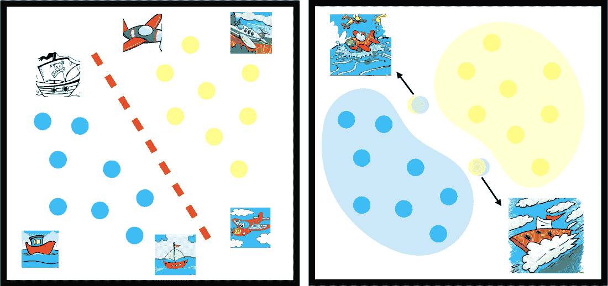
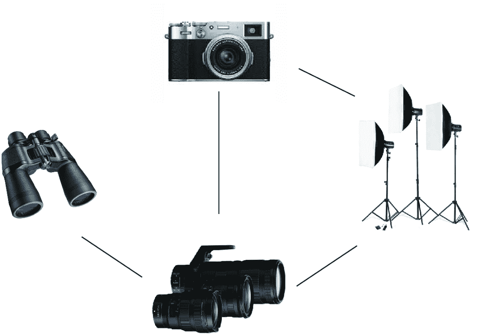
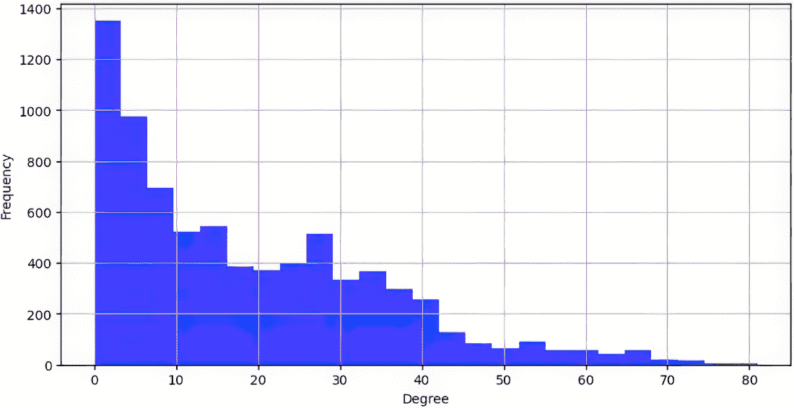
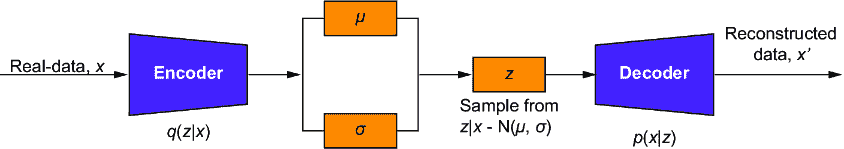
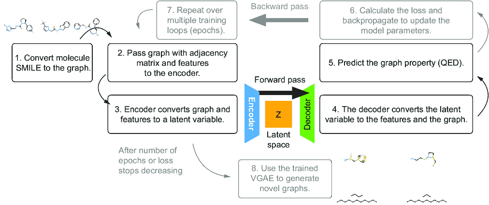
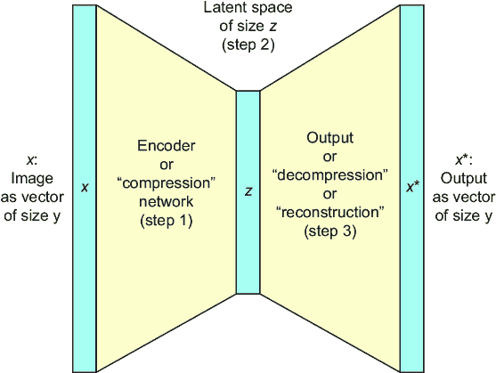
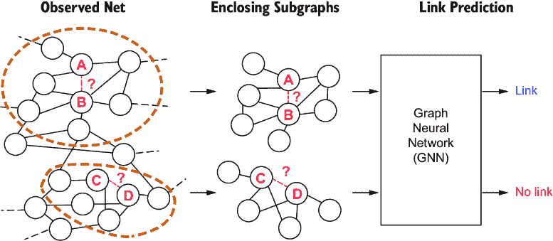
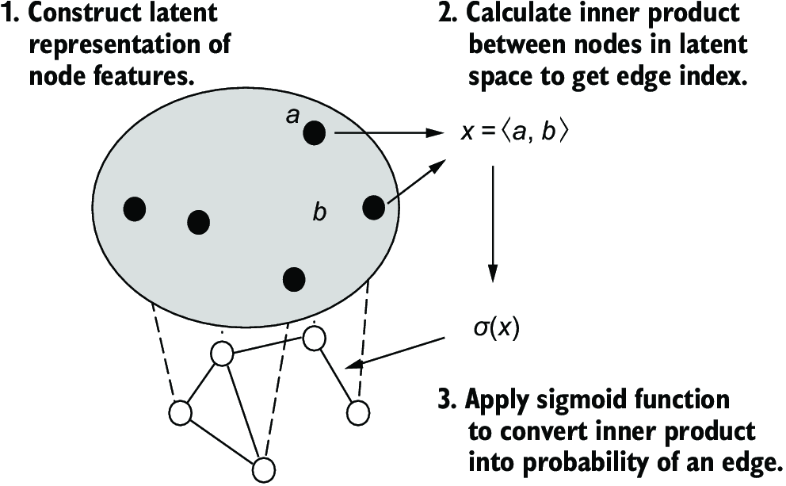
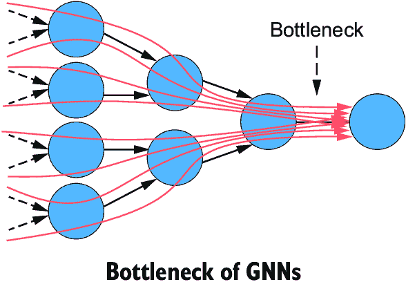

# 第五章：图自动编码器

### 本章涵盖

+   区分区分性和生成性模型

+   将自动编码器和变分自动编码器应用于图

+   使用 PyTorch Geometric 构建图自动编码器

+   过度压缩和图神经网络

+   链接预测和图生成

到目前为止，我们已经介绍了如何将经典深度学习架构扩展到图结构数据。在第三章中，我们考虑了卷积图神经网络（GNNs），它们将卷积算子应用于数据中识别模式。在第四章中，我们探讨了注意力机制以及如何将其用于改进图学习任务（如节点分类）的性能。

卷积 GNN 和注意力 GNN 都是*区分性* *模型*的例子，因为它们学会区分不同数据实例，例如照片是猫还是狗。在本章中，我们介绍了*生成性* *模型*的主题，并通过两种最常见架构——自动编码器和变分自动编码器（VAEs）——对其进行探讨。生成性模型旨在学习整个数据空间，而不是像区分性模型那样在数据空间内分离边界。例如，生成性模型学习如何生成猫和狗的图像（学习再现猫或狗的方面，而不是仅仅学习区分两个或多个类别的特征，如猫的尖耳朵或猎犬的长耳朵）。

我们将发现，区分性模型学会在数据空间中分离边界，而生成性模型学会对数据空间本身进行建模。通过近似数据空间，我们可以从生成性模型中采样以创建训练数据的新的示例。在先前的例子中，我们可以使用我们的生成性模型来制作新的猫或狗的图像，甚至是一些具有两者特征的混合版本。这是一个非常强大的工具，对于初学者和资深数据科学家来说都是重要的知识。近年来，深度生成模型，即使用人工神经网络的生成模型，在许多语言和视觉任务上显示出惊人的能力。例如，DALL-E 模型系列能够根据文本提示生成新的图像，而像 OpenAI 的 GPT 模型这样的模型已经极大地改变了聊天机器人的能力。

在本章中，你将学习如何扩展生成式架构以作用于图结构数据，从而产生图自动编码器（GAEs）和变分图自动编码器（VGAEs）。这些模型与之前章节中的区分性模型不同。正如我们将看到的，生成式模型对整个数据空间进行建模，并且可以与区分性模型结合用于下游机器学习任务。

为了展示生成式方法在学习任务中的强大能力，我们回到第三章中介绍的亚马逊产品共同购买网络。然而，在第三章中，你学习了如何根据物品在网络中的位置预测其可能属于的类别。在本章中，我们将展示如何根据物品的描述预测其在网络中的位置。这被称为*边缘*（或链接）*预测*，在例如设计推荐系统时经常出现。我们将运用对 GAEs 的理解来进行边缘预测，构建一个可以预测图中节点何时连接的模型。我们还将讨论过度压缩的问题，这是 GNNs 的一个特定考虑因素，以及我们如何将 GNN 应用于生成潜在的化学图。

到本章结束时，你应该了解何时何地使用图生成模型（而不是判别模型）的基本知识，以及当我们需要时如何实现它们。

注意：本章的代码以笔记本形式存储在 GitHub 仓库中（[`mng.bz/4aGQ`](https://mng.bz/4aGQ)）。本章的 Colab 链接和数据可以在同一位置访问。

## 5.1 生成模型：学习如何生成

深度学习的经典例子是，给定一组标记图像，如何训练模型来*学习*为新的和未见过的图像分配什么标签。如果我们考虑一组船只和飞机的图像，我们希望我们的模型能够区分这些不同的图像。如果我们随后向模型传递一个新图像，我们希望我们的模型能够正确地将其识别为，例如，一艘船。判别模型通过学习基于其特定目标标签来区分类别。通常使用卷积架构（在第三章中讨论）和基于注意力的架构（在第四章中介绍）来创建判别模型。然而，正如我们将看到的，它们也可以被纳入生成模型。为了理解这一点，我们首先必须了解判别和生成建模方法之间的区别。

### 5.1.1 生成模型和判别模型

如前几章所述，我们用来训练模型的原始数据集被称为我们的*训练数据*，我们试图预测的标签被称为我们的*训练目标*。未见过的数据是我们的*测试数据*，我们希望学习*目标标签*（从训练中）以对测试数据进行分类。另一种描述方式是使用条件概率。我们希望我们的模型返回给定数据实例 X 时某些目标 Y 的概率。我们可以将其写为 P(Y|X)，其中竖线表示 Y 是“条件”于 X 的。

正如我们所说的，判别性模型学习区分**之间**的类别。这相当于在数据空间中学习数据的分离边界。相比之下，生成性模型学习建模数据空间本身。它们捕捉数据空间中数据的整个分布，并且当面对一个新的示例时，它们会告诉我们新示例的可能性有多大。使用概率语言，我们说它们建模了数据与目标之间的**联合概率**，P(X,Y)。一个典型的生成性模型可能是一个用于预测句子中下一个单词的模型（例如，许多现代智能手机中的自动完成功能）。生成性模型为每个可能的下一个单词分配一个概率，并返回那些概率最高的单词。判别性模型可以告诉你一个单词具有某种特定情感的可能性有多大，而生成性模型将建议使用哪个单词。

回到我们的图像示例，生成性模型近似图像的整体分布。这可以在图 5.1 中看到，其中生成性模型已经学会了数据空间中点的位置（而不是它们是如何被区分的）。这意味着生成性模型必须比它们的判别性对应物学习数据中的更复杂的相关性。例如，生成性模型学习到“飞机有翅膀”和“船只出现在水中”。另一方面，判别性模型只需要学习“船”与“非船”之间的区别。它们可以通过寻找图像中的明显标志，如桅杆、龙骨或吊杆来实现。然后它们可以很大程度上忽略图像的其余部分。因此，生成性模型在训练时可能更耗费计算资源，可能需要更大的网络架构。（在第 5.5 节中，我们将描述过度压缩问题，这是大型 GNN 的一个特定问题。）



##### 图 5.1 生成性任务与判别性任务的比较。在左侧，判别性模型学习区分不同类型的船只和飞机图像。在右侧，生成性模型试图学习整个数据空间，这允许创建新的合成示例，例如天空中的船只或水上的飞机。

### 5.1.2 合成数据

由于判别模型在训练上比生成模型计算成本更低，且对异常值更鲁棒，你可能会 wonder 为什么我们还要使用生成模型。然而，生成模型在数据标注相对昂贵但生成数据集相对容易的情况下是有效的工具。例如，生成模型在药物发现中越来越受欢迎，它们可以生成可能具有某些特性的新候选药物，例如减少某些疾病的影响的能力。从某种意义上说，生成模型试图学习如何创建合成数据，这使我们能够创建新的数据实例。例如，图 5.2 中显示的任何人都不存在，而是通过从数据空间中采样（使用生成模型近似）来创建的。


##### 图 5.2 显示合成面孔的图（来源：[1]）

生成模型创建的合成示例可以用来增强一个昂贵的数据集。我们不需要在每种条件下拍摄很多面部照片，而是可以使用生成模型创建新的数据示例（例如，一个人戴着帽子、眼镜和口罩），以增加我们的数据集，使其包含棘手的边缘情况。然后，这些合成示例可以用来进一步改进我们的其他模型（例如，一个识别某人是否戴着口罩的模型）。然而，在引入合成数据时，我们必须小心不要将其他偏差或噪声引入我们的数据集中。

此外，判别模型通常用于生成模型之后。这是因为生成模型通常以“自监督”的方式进行训练，不依赖于数据标签。它们学习将复杂的高维数据压缩（或*编码*）到低维。这些低维表示可以用来更好地揭示我们数据中的潜在模式。这被称为*降维*，有助于数据聚类或分类任务。稍后，我们将看到生成模型如何在不看到其标签的情况下将图分离成不同的类别。在标注每个数据点成本高昂的情况下，生成模型可以节省大量成本。让我们继续了解我们的第一个生成 GNN 模型。

## 5.2 用于链接预测的图自动编码器

深度生成模型的一个基本且流行的模型是自动编码器。自动编码器框架之所以被广泛使用，是因为它具有极高的适应性。正如第三章中提到的注意力机制可以用于改进许多不同的模型一样，自动编码器可以与许多不同的模型结合，包括不同类型的 GNN。一旦理解了自动编码器的结构，编码器和解码器可以用任何类型的神经网络替换，包括第二章中提到的不同类型的 GNN，如图卷积网络（GCN）和 GraphSAGE 架构。

然而，在将自动编码器应用于基于图的数据时，我们需要小心。在重建我们的数据时，我们也必须重建我们的邻接矩阵。在本节中，我们将探讨使用第三章中的亚马逊产品数据集实现 GAE 的方法[2]。我们将构建一个用于链接预测任务的 GAE，这是处理图时常见的问题。这允许我们重建邻接矩阵，并且在我们处理有缺失数据的数据集时特别有用。我们将遵循以下过程：

1.  定义模型：

    1.  创建一个编码器和解码器。

    1.  使用编码器创建一个潜在空间进行采样。

1.  定义训练和测试循环，包括适合构建生成模型的损失函数。

1.  将数据准备为图，包括边列表和节点特征。

1.  训练模型，传递边数据以计算损失。

1.  使用测试数据集测试模型。

### 5.2.1 对第三章中亚马逊产品数据集的回顾

在第三章中，我们学习了带有共同购买者信息的亚马逊产品数据集。这个数据集包含了关于一系列不同物品的购买信息，包括谁购买了它们以及如何购买，以及物品的分类，这些分类在第三章中作为标签。我们已经学习了如何将这个表格数据集转换为图结构，通过这样做，可以使我们的学习算法更加高效和强大。我们还已经在不经意间使用了一些降维技术。主成分分析（PCA）被应用于亚马逊产品数据集以创建特征。每个产品描述都被使用词袋算法转换为数值，然后 PCA 被应用于将（现在已经是数值的）描述减少到 100 个特征。

在本章中，我们将重新审视亚马逊产品数据集，但目的是不同的。我们将使用我们的数据集来学习链接预测。本质上，这意味着学习我们图中的节点之间的*关系*。这有许多用例，例如预测用户接下来想看哪些电影或电视节目，在社交媒体平台上建议新的连接，甚至预测更有可能违约的客户。在这里，我们将用它来预测亚马逊电子产品数据集中哪些产品应该连接在一起，如图 5.3 所示。有关链接预测的更多详细信息，请参阅本章末尾的 5.5 节。



##### 图 5.3 亚马逊电子产品数据集，其中不同的产品，如相机和镜头，根据它们是否曾经一起购买而相互连接

与所有数据科学项目一样，首先查看数据集并理解问题所在是值得的。我们首先加载数据，就像我们在第三章中所做的那样，这将在列表 5.1 中展示。数据已预处理并标记，因此可以使用 NumPy 加载。有关数据集的更多详细信息，请参阅[2]。

##### 列表 5.1 加载数据

```py
import numpy as np

filename = 'data/new_AMZN_electronics.npz'

data = np.load(filename)

loader = dict(data)
print(loader)
```

前面的输出打印以下内容：

```py
{'adj_data': array([[0., 0., 0., ..., 0., 0., 0.],
       [0., 0., 0., ..., 0., 0., 0.],
       [0., 0., 0., ..., 0., 0., 0.],
       ...,
       [0., 0., 0., ..., 0., 0., 0.],
       [0., 0., 0., ..., 0., 0., 0.]],\
 dtype=float32), 'attr_data': \
array([[0., 0., 0., ..., 0., 1., 0.],
       [0., 0., 0., ..., 0., 0., 0.],
       ...,
       [0., 1., 0., ..., 0., 0., 0.],
       [1., 1., 0., ..., 0., 0., 0.],
       [0., 0., 0., ..., 0., 0., 1.]],\
 dtype=float32), 'labels': \
array([6, 4, 3, ..., 1, 2, 3]),\
 'class_names': array(['Film Photography',\
 'Digital Cameras', 'Binoculars & Scopes',
       'Lenses', 'Tripods & Monopods', 'Video Surveillance',
       'Lighting & Studio', 'Flashes'], dtype='<U19')}
```

数据加载完成后，我们可以查看一些基本统计数据和数据细节。我们感兴趣的是边缘或链接预测，因此了解存在多少不同的边缘是很有价值的。我们可能还想了解有多少个组件以及平均度，以了解我们的图有多连通。我们将在下面的列表中展示计算这些值的代码。

##### 列表 5.2 探索性数据分析

```py
adj_matrix = torch.tensor(loader['adj_data'])
if not adj_matrix.is_sparse:
    adj_matrix = adj_matrix.to_sparse()

feature_matrix = torch.tensor(loader['attr_data'])
labels = loader['labels']

class_names = loader.get('class_names')
metadata = loader.get('metadata')

num_nodes = adj_matrix.size(0)
num_edges = adj_matrix.coalesce().values().size(0)   #1
density = num_edges / (num_nodes \
* (num_nodes - 1) / 2) if num_nodes \
> 1 else 0  #2
```

#1 这只因为邻接矩阵是无向的。

#2 实际边与可能边的比率

我们还绘制了度数的分布，以查看连接如何变化，如以下列表和图 5.4 所示。

##### 列表 5.3 绘制图形

```py
degrees = adj_matrix.coalesce().indices().numpy()[0]    #1
degree_count = np.bincount(degrees, minlength=num_nodes)

plt.figure(figsize=(10, 5))
plt.hist(degree_count, bins=25, alpha=0.75, color='blue')
plt.xlabel('Degree')
plt.ylabel('Frequency')
plt.grid(True)
plt.show()
```

#1 获取每个非零值对应的行索引

我们发现共有 7,650 个节点，超过 143,000 条边，整体密度为 0.0049。因此，我们的图是中等大小（约 10,000 个节点），但非常稀疏（密度远小于 0.05）。我们看到大多数节点的度数较低（小于 10），但还存在一个度数较高的边的高峰（约 30）和更长的尾部。总的来说，我们看到高度数的节点非常少，这在低密度的图中是预期的。



##### 图 5.4 亚马逊电子产品共同购买者图的度分布

### 5.2.2 定义图自动编码器

接下来，我们将使用生成模型，即自动编码器，来估计和预测亚马逊电子产品数据集中的链接。这样做是有先例的，因为链接预测是 Kipf 和 Welling 在 2012 年首次发布 GAE 时应用的问题[3]。在他们开创性的论文中，他们介绍了 GAE 及其变分扩展，我们将在稍后讨论这些内容，并将这些模型应用于图深度学习的三个经典基准，即 Cora 数据集、CiteSeer 和 PubMed。如今，大多数图深度学习库都使得创建和开始训练 GAE 非常容易，因为它们已经成为最受欢迎的基于图的深度生成模型之一。我们将在本节中更详细地查看构建一个 GAE 所需的步骤。

GAE 模型类似于典型的自动编码器。唯一的区别是，我们网络中的每一层都是一个 GNN，例如 GCN 或 GraphSAGE 网络。在图 5.5 中，我们展示了 GAE 架构的示意图。总的来说，我们将使用编码器网络将我们的边缘数据压缩成低维表示。


##### 图 5.5 GAE 的示意图，展示了模型的关键元素，如编码器、潜在空间和解码器

对于我们的 GAE，我们需要定义的第一个东西是编码器，它将我们的数据转换成潜在表示。实现编码器的代码片段在列表 5.4 中给出。我们首先导入我们的库，然后构建一个 GNN，其中每一层都逐渐变小。

##### 列表 5.4 图编码器

```py
from torch_geometric.nn import GCNConv   #1

class GCNEncoder(torch.nn.Module):                         #2
    def __init__(self, input_size, layers, latent_dim):    #2
        super().__init__() #2
        self.conv0 = GCNConv(input_size, layers[0])    #3
        self.conv1 = GCNConv(layers[0], layers[1])     #3
        self.conv2 = GCNConv(layers[1], latent_dim)    #3

    def forward(self, x, edge_index):           #4
        x = self.conv0(x, edge_index).relu()    #4
        x = self.conv1(x, edge_index).relu()    #4
        return self.conv2(x, edge_index)        #4
```

#1 从 PyG 加载 GCNConv 模型

#2 定义编码器层并使用预定义的大小初始化它

#3 定义编码器每一层的网络

#4 使用边缘数据的编码器前向传递

注意，我们还需要确保我们的前向传递可以从我们的图中返回边缘数据，因为我们将使用我们的自动编码器从潜在空间重建图。换句话说，自动编码器将学习如何从特征空间的一个低维表示中重建邻接矩阵。这意味着它也在学习如何从新数据中预测边缘。为了做到这一点，我们需要让自动编码器结构学习重建边缘，特别是通过改变解码器。在这里，我们将使用内积从潜在空间预测边缘。这如列表 5.5 中所示。（要了解为什么我们使用内积，请参阅第 5.5 节的技术细节。）

##### 列表 5.5 图解码器

```py
class InnerProductDecoder(torch.nn.Module):     #1
    def __init__(self):                        
         super().__init__()                    

def forward(self, z, edge_index):     #2
        value = (z[edge_index[0]] * \
z[edge_index[1]]).sum(dim=1)   #3
        return torch.sigmoid(value)
```

#1 定义解码器层

#2 说明解码器的形状和大小（这再次是编码器的反转）

#3 解码器的前向传递

现在我们已经准备好在 GAE 类中将编码器和解码器结合起来，该类包含两个子模型（见列表 5.6）。请注意，我们现在没有用任何输入或输出大小初始化解码器，因为这只是在将编码器的输出与边缘数据应用内积。

##### 列表 5.6 图自动编码器

```py
   class GraphAutoEncoder(torch.nn.Module):
        def __init__(self, input_size, layers, latent_dims):
            super().__init__()
            self.encoder = GCNEncoder(input_size, \
   layers, latent_dims)     #1
            self.decoder = InnerProductDecoder()      #2

        def forward(self, x):
            z = self.encoder(x)
            return self.decoder(z)
```

#1 定义 GAE 的编码器

#2 定义解码器

在 PyTorch Geometric (PyG) 中，通过仅导入 GAE 类，GAE 模型可以变得更加简单，该类在传递给编码器后自动构建解码器和自动编码器。当我们在本章后面构建 VGAE 时，我们将使用此功能。

### 5.2.3 训练图自动编码器进行链接预测

在构建了我们的 GAE 之后，我们可以继续使用它来对 Amazon Products 数据集的子模型进行边缘预测。整体框架将遵循典型的深度学习问题格式，我们首先加载数据，准备数据，并将这些数据分成训练、测试和验证数据集；定义我们的训练参数；然后训练和测试我们的模型。这些步骤在图 5.6 中显示。


##### 图 5.6 训练我们的模型进行链接预测的总体步骤

我们首先加载数据集并为其学习算法做准备，这已经在列表 5.1 中完成。为了使用 PyG 模型进行 GAE 和 VGAE，我们需要从邻接矩阵中构建一个边缘索引，这可以通过使用 PyG 的一个实用函数 `to_edge_index` 轻松完成，正如我们在以下列表中描述的那样。

##### 列表 5.7 构建边索引

```py
from torch_geometrics.utils import to_edge_index   #1

edge_index, edge_attr = to_edge_index(adj_matrix)   #2
num_nodes = adj_matrix.size(0)
```

#1 从 PyG 实用库中加载 to_edge_index

#2 将邻接矩阵转换为边索引和边属性向量

然后我们加载 PyG 库并将我们的数据转换为 PyG 数据对象。我们还可以对我们的数据集应用转换，其中特征和邻接矩阵的加载方式与第三章中描述的相同。首先，我们对特征进行归一化，然后根据图的边或链接将我们的数据集划分为训练集、测试集和验证集，如列表 5.8 所示。这是进行链接预测时的一个关键步骤，以确保我们正确地分割了数据。在代码中，我们使用了 5%的数据用于验证，10%的数据用于测试数据，注意我们的图是无向的。在这里，我们没有添加任何负样本训练数据。

##### 列表 5.8 转换为 PyG 对象

```py
data = Data(x=feature_matrix,         #1
            edge_index=edge_index,   
            edge_attr=edge_attr,     
            y=labels)                

device = torch.device('cuda' if torch.cuda.is_available() else 'cpu')

transform = T.Compose([\
     T.NormalizeFeatures(),\                  #2
     T.ToDevice(device),                     
     T.RandomLinkSplit(num_val=0.05,\
     num_test=0.1, is_undirected=True,       
     add_negative_train_samples=False)])     
train_data, val_data, test_data = transform(data)
```

#1 将我们的数据转换为 PyG 数据对象

#2 对我们的数据进行转换并将链接划分为训练、测试和验证集

一切准备就绪后，我们现在可以将 GAE 应用于 Amazon Products 数据集。首先，我们定义我们的模型、优化器和损失函数。我们将二元交叉熵损失应用于解码器的预测值，并将其与我们的真实边索引进行比较，以查看我们的模型是否正确地重建了邻接矩阵，如以下列表所示。

##### 列表 5.9 定义模型

```py
input_size, latent_dims = feature_matrix.shape[1], 16   #1
layers = [512, 256]                                    
model = GraphAutoEncoder(input_size, layers, latent_dims)   #2
model = model.to(device)

optimizer = torch.optim.Adam(model.parameters(), lr=0.01)
criterion = torch.nn.BCEWithLogitsLoss()   #3
```

#1 指定编码器的形状

#2 定义具有正确形状的 GAE

#3 我们现在的损失是二元交叉熵。

使用二元交叉熵损失是很重要的，因为我们想计算每个边是真实边的概率，其中真实边对应于未被隐藏且不需要预测的边（即正样本）。编码器学习压缩边数据但不会改变边的数量，而解码器学习预测边。从某种意义上说，我们在这里结合了判别性和生成性步骤。因此，二元交叉熵给出了在这些节点之间可能存在边的概率。它是二元的，因为边要么应该存在（标签 1），要么不应该存在（标签 0）。我们可以将所有二元交叉熵概率大于 0.5 的边与训练循环每个 epoch 中的实际真实边进行比较，如以下列表所示。

##### 列表 5.10 训练函数

```py
def train(model, criterion, optimizer):

    model.train() 

    optimizer.zero_grad() 
    z = model.encoder(train_data.x,\
    train_data.edge_index)   #1

    neg_edge_index = negative_sampling(\         #2
    edge_index=train_data.edge_index,\
    num_nodes=train_data.num_nodes,             
    num_neg_samples=train_data.\
    edge_label_index.size(1), method='sparse')  

    edge_label_index = torch.cat(                     #3
    [train_data.edge_label_index, neg_edge_index],    #3
    dim=-1,)                                          #3

    out = model.decoder(z, edge_label_index).view(-1)   #4

    edge_label = torch.cat([        #5
    train_data.edge_label,         
train_data.edge_label.new_zeros\
(neg_edge_index.size(1))           
    ], dim=0)                      
    loss = criterion(out, edge_label)   #6
    loss.backward()                     #6
    optimizer.step() #6

    return loss
```

#1 将图编码为潜在表示

#2 执行新一轮的负采样

#3 将新的负样本与边标签索引结合

#4 生成边预测

#5 将边标签与 0s 结合用于负样本

#6 计算损失并进行反向传播

在这里，我们首先将我们的图编码成潜在表示。然后我们进行一轮负采样，为每个 epoch 抽取新的样本。负采样在训练期间取一个随机子集的非存在标签，而不是现有的正标签，以解决真实标签和非存在标签之间的类别不平衡。一旦我们有了这些新的负样本，我们将它们与我们的原始边缘标签索引连接起来，并将这些传递给我们的解码器以获得一个重构的图。最后，我们将我们的真实边缘标签与负边缘的 0 标签连接起来，并计算预测边缘和真实边缘之间的损失。请注意，我们在这里不是进行批量学习；相反，我们选择在每个 epoch 期间在整个数据上训练。

我们在列表 5.11 中展示的测试函数比我们的训练函数简单得多，因为它不需要执行任何负采样。相反，我们只需使用真实和预测的边缘，并返回一个接收者操作特征（ROC）/曲线下面积（AUC）分数来衡量我们模型的准确率。回想一下，ROC/AUC 曲线将在 0 和 1 之间变化，一个完美的模型，其预测 100%正确，将有一个 AUC 为 1。

##### 列表 5.11 测试函数

```py
from sklearn.metrics import roc_auc_score

@torch.no_grad() 
def test(data):
    model.eval() 
    z = model.encode(data.x, data.edge_index)   #1
    out = model.decode(z, \
    data.edge_label_index).view(-1).sigmoid()   #2
    loss = roc_auc_score(data.edge_label.cpu().numpy(),   #3
                        out.cpu().numpy())                #3
    return loss
```

#1 将图编码成潜在表示

#2 使用完整的边缘标签索引解码图

#3 计算整体 ROC/AUC 分数

在每个时间步，我们将使用我们验证数据中的所有边缘数据来计算一个模型的整体成功率。训练完成后，我们使用测试数据来计算最终的测试准确率，如下所示。

##### 列表 5.12 训练循环

```py
best_val_auc = final_test_auc = 0 
for epoch in range(1, 201): 
    loss = train(model, criterion, optimizer)  #1
    val_auc = test(val_data)   #2
    if val_auc > best_val_auc: 
        best_val_auc = val_auc 
test_auc = test(test_data)   #3
```

#1 执行训练步骤

#2 在验证数据上测试我们的更新模型

#3 在测试数据上测试我们的最终模型

我们发现，经过 200 个 epoch 后，我们达到了超过 83%的准确率。甚至更好，当我们使用测试集来查看我们的模型能够多好地预测边缘时，我们得到了 86%的准确率。我们可以将我们的模型性能解释为有 86%的时间可以向购买者推荐有意义的商品，假设所有未来的数据都和我们的当前数据集相同。这是一个非常好的结果，展示了图神经网络（GNNs）在推荐系统中的有用性。我们还可以通过探索我们新构建的潜在空间来更好地理解数据集的结构，或者通过执行额外的分类和特征工程任务来使用我们的模型。接下来，我们将学习图自动编码器模型最常见的扩展之一——变分图自动编码器（VGAE）。

## 5.3 变分图自动编码器

自动编码器将数据映射到潜在空间中的离散点。为了从训练数据集之外采样并生成新的合成数据，我们可以在这些离散点之间进行插值。这正是我们在图 5.1 中描述的过程，我们生成了未见过的数据组合，例如飞艇。然而，自动编码器是确定性的，其中每个输入映射到潜在空间中的一个特定点。这可能导致采样时的尖锐不连续性，这可能会影响数据生成的性能，导致合成的数据不能很好地再现原始数据集。为了改进我们的生成过程，我们需要确保我们的潜在空间结构良好，即*常规*。例如，在图 5.7 中，我们展示了如何使用 Kullback-Liebler 散度（KL 散度）重构潜在空间以改善重建。


##### 图 5.7 常规空间是连续和紧致的，但数据区域可能会变得不那么分离。或者，高重建损失通常意味着数据分离良好，但潜在空间可能覆盖不足，导致生成样本较差。在这里，KL 散度指的是 Kullback-Liebler 散度。

KL 散度是衡量一个概率分布与另一个概率分布差异的度量。它计算将一个分布（原始数据分布）中的值编码到另一个分布（潜在空间）中所需的“额外信息”量。在左侧，数据组（*x*[*i*]）重叠不多，这意味着 KL 散度较高。在右侧，不同数据组之间存在更多重叠（相似性），这意味着 KL 散度较低。当构建具有高 KL 散度的更常规的潜在空间时，我们可以获得非常好的重建效果，但插值效果较差，而对于低 KL 散度，情况则相反。更多细节请参阅第 5.5 节。

*常规*意味着空间满足两个属性：连续性和紧致性。*连续性*意味着潜在空间中邻近的点被解码成大约相似的事物，而*紧致性*意味着潜在空间中的任何一点都应导致一个有意义的解码表示。这些术语，即大约相似和有意义的，有精确的定义，你可以在*《使用 PyTorch 学习生成式 AI》*（Manning，2024；[`mng.bz/AQBg`](https://mng.bz/AQBg)）中了解更多。然而，对于本章，你需要知道的是，这些属性使得从潜在空间中采样变得更加容易，从而产生更干净的生成样本，并可能提高模型精度。

当我们对潜在空间进行正则化时，我们使用变分方法，这些方法通过概率分布（或密度）来建模整个数据空间。正如我们将看到的，使用变分方法的主要好处是潜在空间结构良好。然而，变分方法并不一定保证更高的性能，因此在使用这些类型的模型时，通常很重要的一点是要测试自动编码器和变分对应物。这可以通过查看测试数据集上的重建分数（例如，均方误差）、对潜在编码应用一些降维方法（例如，t-SNE 或均匀流形近似和投影[UMAP]），或使用特定任务的度量（例如，图像的 Inception Score 或文本生成的 ROUGE/METEOR）来实现。对于图而言，最大均值差异（MMD）、图统计或图核方法都可以用来比较不同合成的图副本。

在接下来的几节中，我们将更详细地介绍将数据空间建模为概率密度意味着什么，以及我们如何仅用几行代码将我们的图自动编码器转换为 VGAE。这些依赖于一些关键的概率机器学习概念，如 KL 散度和重参数化技巧，我们将在第 5.5 节中概述这些概念。对于对这些概念进行更深入的了解，我们推荐阅读《概率深度学习》（Manning，2020）。让我们构建一个 VGAE 架构，并将其应用于之前相同的 Amazon Products 数据集。

### 5.3.1 构建变分图自动编码器

VGAE 架构与 GAE 模型类似。主要区别在于，*变分*图编码器的输出是通过从概率密度中采样生成的。我们可以用其均值和方差来表征密度。因此，编码器的输出现在将是之前空间每个维度的均值和方差。然后，解码器将这个采样的潜在表示解码，使其看起来像输入数据。这可以在图 5.8 中看到，其中高级模型是我们现在将之前的自动编码器扩展到输出均值和方差，而不是从潜在空间中输出点估计。这允许我们的模型从潜在空间中进行概率采样。



##### 图 5.8 展示了通用 VAE 的结构，我们现在从潜在空间中的概率密度中采样，而不是像典型自动编码器那样从点估计中采样。VGAE 扩展了 VAE 架构，使其适用于图结构数据。

我们必须调整我们的架构，并更改我们的损失以包括一个额外的项来正则化潜在空间。列表 5.13 提供了一个 VGAE 的代码片段。列表 5.4 和列表 5.13 中的`VariationalGCNEncoder`层之间的相似之处在于，我们已经将潜在空间的维度加倍，并在前向传递的末尾从编码器返回均值和对数方差。

##### 列表 5.13 `VariationalGCNEncoder`

```py
class VariationalGCNEncoder(torch.nn.Module):            #1
  def __init__(self, input_size, layers, latent_dims):
    super().__init__()
    self.layer0 = GCNConv(input_size, layers[0])
    self.layer1 = GCNConv(layers[0], layers[1])
    self.mu = GCNConv(layers[1], latent_dims)           
    self.logvar = GCNConv(layers[1], latent_dims)       

  def forward(self, x, edge_index):
    x = self.layer0(x, edge_index).relu()
    x = self.layer1(x, edge_index).relu()
    mu = self.mu(x, edge_index)
    logvar = self.logvar(x, edge_index)
    return mu, logvar                      #2
```

#1 添加均值和对数方差变量以进行采样

#2 前向传递返回均值和对数方差变量

当我们讨论 GAE 时，我们了解到解码器使用内积来返回邻接矩阵或边列表。之前我们明确实现了内积。然而，在 PyG 中，这个功能是内置的。为了构建 VGAE 结构，我们可以调用下面的`VGAE`函数。

##### 列表 5.14 变分图自动编码器（`VGAE`）

```py
from torch_geometric.nn import VGAE   #1
model = VGAE(VariationalGCNEncoder(input_size,\
 layers, latent_dims))
```

#1 使用 PyG 库中的 VGAE 函数构建自动编码器

这个功能使得构建 VGAE 变得更加简单，其中 PyG 中的 VGAE 函数负责处理重新参数化技巧。现在我们有了我们的 VGAE 模型，接下来我们需要修改训练和测试函数以包含 KL 散度损失。下面的列表显示了训练函数。

##### 列表 5.15 训练函数

```py
def train(model, criterion, optimizer):
    model.train() 
    optimizer.zero_grad() 
    z = model.encode(train_data.x, train_data.edge_index)      #1

    neg_edge_index = negative_sampling( 
    edge_index=train_data.edge_index, num_nodes=train_data.num_nodes,
    num_neg_samples=train_data.edge_label_index.size(1), method='sparse')

    edge_label_index = torch.cat( 
    [train_data.edge_label_index, neg_edge_index], 
    dim=-1,) 
    out = model.decode(z, edge_label_index).view(-1)          

    edge_label = torch.cat([ 
    train_data.edge_label,
    train_data.edge_label.new_zeros(neg_edge_index.size(1))
    ], dim=0)

    loss = criterion(out, edge_label)            #2
+ (1 / train_data.num_nodes) * model.kl_loss()  

    loss.backward() 
    optimizer.step()

    return loss
```

#1 由于我们正在使用 PyG 的 VGAE 函数，我们需要使用编码和解码方法。

#2 在损失中添加由 KL 散度给出的正则化项

这是我们之前在列表 5.12 中用于训练 GAE 模型的相同训练循环。唯一的区别是我们将一个额外的项添加到损失中，以最小化 KL 散度，并将`encoder`和`decoder`方法调用更改为`encode`和`decode`（我们还需要在我们的测试函数中更新这些）。否则，训练保持不变。请注意，多亏了 PyG 添加的功能，这些更改比我们在 PyTorch 中早期所做的更改要简单得多。然而，通过逐一完成这些额外步骤，我们可以对 GAE 的底层架构有更多的直观理解。

我们现在可以将我们的 VGAE 应用于 Amazon Products 数据集，并使用它进行边预测，这产生了 88%的整体测试准确率。这略高于我们的 GAE 准确率。重要的是要注意，VGAEs 并不一定会给出更高的准确率。因此，你应该始终尝试 GAE 和 VGAE，并在使用此架构时进行仔细的模型验证。

### 5.3.2 何时使用变分图自动编码器

由于 VGAE 的准确度与 GAE 相似，因此认识到这两种方法的局限性是很重要的。一般来说，当你想构建一个生成模型或你想使用数据的一个方面来学习另一个方面时，GAEs 和 VGAEs 是很好的模型。例如，我们可能想为姿态预测制作一个基于图的模型。我们可以使用 GAE 和 VGAE 架构来根据视频片段预测未来的姿态。（我们将在后面的章节中看到类似的例子。）当我们这样做时，我们正在使用 GAE/VGAE 来学习一个基于身体的图，条件是每个身体部分的未来位置。然而，如果我们特别感兴趣于生成新数据，例如用于药物发现的新的化学图，那么 VGAEs 通常更好，因为潜在空间更有结构。

通常，GAEs 对于特定的重建任务（如链接预测或节点分类）非常出色，而 VGAEs 更适合那些需要更大或更多样化合成样本的任务，例如当你想要生成全新的子图或小图时。与 GAEs 相比，VGAEs 也更适合于当底层数据集有噪声时，因为 GAEs 更快且更适合具有清晰结构的图数据。最后，请注意，由于它们的变分方法，VGAEs 更不容易过拟合，因此它们可能具有更好的泛化能力。像往常一样，你的架构选择取决于手头的问题。

在本章中，我们学习了两个生成模型的例子，即 GAE 和 VGAE 模型，以及如何实现这些模型以与图结构化数据一起工作。为了更好地理解如何使用这个模型类，我们将我们的模型应用于边缘预测任务。然而，这只是在应用生成模型中的一步。

在许多需要生成模型的情况下，我们使用连续的自动编码器层来进一步降低我们系统的维度并增加我们的重建能力。在药物发现和化学科学领域，GAEs 允许我们重建邻接矩阵（正如我们在这里所做的那样），以及重建分子类型甚至分子的数量。GAEs 在许多科学和工业领域被频繁使用。现在你也有了尝试它们的工具。

在下一节中，我们将演示如何使用 VGAE 生成具有特定品质的新图，例如具有高性质的新分子，这表明其作为潜在药物候选人的有用性。

## 5.4 使用 GNNs 生成图

到目前为止，我们考虑了如何使用我们图的生成模型来估计节点之间的边。然而，有时我们感兴趣的不仅仅是生成节点或边，而是整个图。当试图理解或预测图级数据时，这尤其重要。在这个例子中，我们将通过使用我们的 GAE 和 VGAEs 来生成具有某些特性的新潜在分子来实现这一点，这些分子可以用来合成。

GNN 对影响最大的领域之一是药物发现，特别是对新分子或潜在药物的身份识别。2020 年，一种新的抗生素被提出，它是通过使用 GNN 发现的，而在 2021 年，一种用于识别食物中致癌物的新的方法被发表，该方法也使用了 GNN。从那时起，已经有许多其他论文使用 GNN 作为工具来加速药物发现流程。

### 5.4.1 分子图

我们将考虑那些在 ZINC 数据集中已筛选过的药物的小分子，该数据集大约有 250,000 个单独的分子。这个数据集中的每个分子都有额外的数据，包括以下内容：

+   **简化分子输入行系统（SMILES）* —分子结构或分子 *图* 的 ASCII 格式描述。*

**重要属性* —合成可及性分数（SAS）、水-辛醇分配系数（`logP`），最重要的是，定量估计药物相似度（QED）的度量，这突出了该分子作为潜在药物的可能性。*

*为了使这个数据集能够被我们的 GNN 模型使用，我们需要将其转换为合适的图结构。在这里，我们将使用 PyG 来定义我们的模型并运行我们的深度学习流程。因此，我们首先下载数据，然后使用 NetworkX 将数据集转换为图对象。我们在列表 5.16 中下载数据集，生成了以下输出：

```py
     smiles     logP     qed     SAS
0     CC(C)(C)c1ccc2occ(CC(=O)Nc3ccccc3F)c2c1
     5.05060     0.702012     2.084095
1     C[C@@H]1CC(Nc2cncc(-c3nncn3C)c2)CC@@HC1
     3.11370     0.928975     3.432004
2     N#Cc1ccc(-c2ccc(OC@@HN3CCCC3)c3ccccc3)...
     4.96778     0.599682     2.470633
3     CCOC(=O)[C@@H]1CCCN(C(=O)c2nc
      (-c3ccc(C)cc3)n3c...     
      4.00022     0.690944     2.822753
4     N#CC1=C(SCC(=O)Nc2cccc(Cl)c2)N=C([O-])
      C@H:
     response = requests.get(url)
     response.raise_for_status() 
     with open(filename, 'wb') as f:
     f.write(response.content)

url = "https://raw.githubusercontent.com/
aspuru-guzikgroup/chemical_vae/master/models/
zinc_properties/250k_rndm_zinc_drugs_clean_3.csv"
filename = "250k_rndm_zinc_drugs_clean_3.csv"

download_file(url, filename)

df = pd.read_csv(filename)
df["smiles"] = df["smiles"].apply(lambda s: s.replace("\n", ""))
```

在列表 5.17 中，我们定义了一个函数，用于将 SMILES 转换为小图，然后我们使用这些图来创建 PyG 数据集。我们还为我们数据集中的每个对象添加了一些附加信息，例如我们可以用于进一步数据探索的重原子数量。在这里，我们使用递归 SMILES 深度优先搜索（DFS）工具包（RDKit）包（[www.rdkit.org/docs/index.xhtml](http://www.rdkit.org/docs/index.xhtml)），这是一个出色的开源化学信息学工具。

##### 列表 5.17 创建分子图数据集

```py
   from torch_geometric.data import Data
   import torch
   from rdkit import Chem

   def smiles_to_graph(smiles, qed):
     mol = Chem.MolFromSmiles(smiles)
        if not mol:
             return None

        edges = []
        edge_features = []
        for bond in mol.GetBonds():
             edges.append([bond.GetBeginAtomIdx(), bond.GetEndAtomIdx()])
             bond_type = bond.GetBondTypeAsDouble()
             bond_feature = [1 if i == bond_type\
             else 0 for i in range(4)]
             edge_features.append(bond_feature)

        edge_index = torch.tensor(edges, dtype=torch.long).t().contiguous()
        edge_attr = torch.tensor(edge_features, dtype=torch.float)
        x = torch.tensor([atom.GetAtomicNum()\
 for atom in mol.GetAtoms()], \
 dtype=torch.float).view(-1, 1)

        num_heavy_atoms = mol.GetNumHeavyAtoms()

        return Data(x=x, edge_index=edge_index,\
 edge_attr=edge_attr, \
qed=torch.tensor([qed], \
dtype=torch.float), \
num_heavy_atoms=num_heavy_atoms)
```

我们数据集的一个随机样本如图 5.9 所示，突出了我们的分子图的多样性及其小型化，其中每个图都少于 100 个节点和边。


##### 图 5.9 示例分子图及其药物相似度（QED）的定量估计

### 5.4.2 识别新的药物候选物

在图 5.10 中，我们开始看到 QED 如何随着不同的分子结构而变化。药物发现的主要障碍之一是不同分子潜在组合的数量以及如何知道哪些分子需要合成并测试其药效。这远在将药物引入人体、动物（体内）或有时甚至细胞（体外）试验之前。即使仅使用分子图来评估分子如溶解度等问题也可能是一个挑战。在这里，我们将专注于预测分子的 QED，以查看哪些分子最有可能作为药物有潜在用途。为了说明 QED 如何变化，请参见图 5.10，其中包含四个具有高（约 0.95）和低（约 0.12）QED 的分子。我们可以看到这些分子之间的一些定性差异，例如低 QED 的分子中强键的数量增加。然而，直接从图中估计 QED 是一个挑战。为了帮助我们完成这项任务，我们将使用 GNN 来生成和评估新的潜在药物。


##### 图 5.10 高 QED（顶部）和低 QED（底部）的分子

我们的工作将基于两篇重要的论文，这些论文展示了生成模型如何成为识别新分子的有效工具（Gómez-Bombarelli 等人[4]和 De Cao 等人[5]）。具体来说，Gómez-Bombarelli 等人表明，通过构建数据空间（即我们在本章前面描述的潜在空间）的平滑表示，可以优化以找到具有特定感兴趣特性的新候选者。这项工作大量借鉴了 Victor Basu[6]帖子中概述的 Keras 库中的等效实现。图 5.11 重现了[5]中的基本思想。


##### 图 5.11 展示了如何将训练用于重建小图的图自动编码器也用于进行属性预测的例子。属性预测应用于潜在空间，并创建了一个特定图属性的学得梯度——在我们的案例中，是 QED 值。

在图 5.11 中，我们可以看到底层模型结构是一个自动编码器，就像我们在本章中讨论过的那些一样。在这里，我们将分子的 SMILES 作为输入传递给编码器，然后用于构建不同分子表示的潜在空间。这表现为不同颜色区域代表不同的分子组。然后，解码器被设计成忠实地将潜在空间转换回原始分子。这与我们在图 5.5 中展示的自动编码器结构类似。

除了潜在空间，我们现在还有一个额外的函数，它将预测分子的属性。在图 5.11 中，我们将预测的属性也是我们正在优化的属性。因此，通过学习如何将分子和属性（在我们的案例中是 QED）编码到潜在空间中，我们可以优化药物发现，生成具有高 QED 的新候选分子。

在我们的例子中，我们将使用变分自编码器（VGAE）。该模型包括两个损失：一个重构损失，用于衡量编码器接收到的原始输入数据与解码器输出之间的差异，以及一个衡量潜在空间结构的度量，我们使用 KL 散度。

除了这两个损失函数，我们还将添加一个额外的函数：属性预测损失。属性预测损失在通过属性预测模型运行潜在表示后，估计预测属性和实际属性之间的均方误差（MSE），如图 5.11 中间所示。

为了训练我们的图神经网络（GNN），我们将第 5.15 列中提供的早期训练循环进行修改，以包含这些单独的损失。这可以在第 5.18 列中看到。在这里，我们使用二元交叉熵（BCE）作为邻接矩阵的重构损失，而属性预测损失仅考虑量子电动力学（QED），可以基于均方误差（MSE）。

##### 列表 5.18：分子图生成的损失

```py
        def calculate_loss(self, pred_adj, \
   true_adj, qed_pred, qed_true, mu, logvar):
             adj_loss = F.binary_cross_entropy\
   (pred_adj, true_adj)   #1

             qed_loss = F.mse_loss\
(qed_pred.view(-1), qed_true.view(-1))     #2

             kl_loss = -0.5 * torch.mean\
(torch.sum(1 + logvar - mu.pow(2)\     #3
 - logvar.exp(), dim=1))

             return adj_loss + qed_loss + kl_loss
```

#1 重构损失

#2 属性预测损失

#3 KL 散度损失

### 5.4.3 用于生成图的 VGAE

现在我们已经有了训练数据和损失，我们可以开始考虑模型。总体而言，这个模型将与本章 earlier 讨论过的模型相似，即 GAE 和 VGAE。然而，我们需要对我们的模型进行一些细微的调整，以确保它能很好地应用于当前的问题：

+   使用异构图神经网络（GCN）来考虑不同的边类型。

+   训练解码器以生成整个图。

+   引入一个属性预测层。

让我们逐一看看这些。

#### 异构图神经网络

我们生成的图将具有不同的边类型，这些边类型连接着我们的图的节点。具体来说，原子之间可以有不同的键数，如单键、双键、三键，甚至*芳香键*，这些键与形成环状结构的分子相关。具有多个边类型的图被称为异构图，因此我们需要使我们的 GNN 适用于异构图。

到目前为止，我们考虑的所有图都是同构图（只有一种边类型）。在第 5.19 列中，我们展示了第三章中讨论的 GCN 如何适应异构图。在这里，我们明确地绘制了一些异构图的不同特征。然而，需要注意的是，许多 GNN 包已经支持异构图模型。例如，PyG 有一个名为`HeteroConv`的特定模型类。

列表 5.19 展示了创建异构 GCN 的代码。这基于 PyG 中的消息传递类，这是所有 GNN 模型的基础。我们还使用 PyTorch 的`Parameter`类创建一个新的参数子集，这些参数针对不同的边类型（关系）是特定的。最后，我们在此处还指定，消息传递框架中的聚合操作基于求和（`'add'`）。如果您感兴趣，可以随意尝试其他聚合操作。

##### 列表 5.19 异构 GCN

```py
from torch.nn import Parameter
from torch_geometric.nn import MessagePassing

   class HeterogeneousGraphConv(MessagePassing):
def __init__(self, in_channels, out_channels, num_relations, bias=True):
        super(HeterogeneousGraphConv, self).\
__init__(aggr='add')       #1
        self.in_channels = in_channels
        self.out_channels = out_channels
        self.num_relations = num_relations

        self.weight = Parameter(torch.\
Tensor(num_relations, in_channels, \
out_channels))  #2
        if bias:
             self.bias = Parameter(torch.Tensor(out_channels))
        else:
             self.register_parameter('bias', None)

        self.reset_parameters()

        def reset_parameters(self):
             torch.nn.init.xavier_uniform_(self.weight)
             if self.bias is not None:
                  torch.nn.init.zeros_(self.bias)

        def forward(self, x, edge_index, edge_type):

       return self.propagate\
(edge_index, size=(x.size(0), 
x.size(0)), x=x, edge_type=edge_type)  #3

       def message(self, x_j, edge_type, index, size):   #4

            W = self.weight[edge_type]    #5
            x_j = torch.matmul(x_j.unsqueeze(1), W).squeeze(1)

            return x_j

       def update(self, aggr_out):
            if self.bias is not None:
                 aggr_out += self.bias
            return aggr_out
```

#1 "添加"聚合

#2 权重参数

#3 使用 edge_type 来选择权重。

#4 x_j 的形状为[E, in_channels]，而 edge_type 的形状为[E]。

#5 选择相应的权重。

在前面的 GNN 的基础上，我们可以将编码器组合为这些单独的 GNN 层的组合。这如图表 5.20 所示，其中我们遵循与定义我们的边编码器时相同的逻辑（参见图表 5.13），只是我们现在用异构 GCN 层替换了 GCN 层。由于我们有不同的边类型，我们现在还必须指定不同类型（关系）的数量，以及将特定的边类型传递给图编码器的正向函数。同样，我们返回对数方差和均值，以确保潜在空间是通过分布而不是点样本来构建的。

##### 列表 5.20 小图编码器

```py
   class VariationalGCEncoder(torch.nn.Module):
        def __init__(self, input_size, layers, latent_dims, num_relations):
             super().__init__()
             self.layer0 = HeterogeneousGraphConv(input_size, 
   layers[0], num_relations)                                     #1
             self.layer1 = HeterogeneousGraphConv(layers[0], 
   layers[1], num_relations)                                    
             self.layer2 = HeterogeneousGraphConv(layers[1], 
   latent_dims, num_relations)                                  

        def forward(self, x, edge_index, edge_type):
             x = F.relu(self.layer0\
(x, edge_index, edge_type))              #2
             x = F.relu(self.layer1\
(x, edge_index, edge_type))             
             mu = self.mu(x, edge_index) 
             logvar = self.logvar(x, edge_index)
             return mu, logvar
```

#1 异构 GCNs

#2 前向传递 GCNs

#### 图解码器

在我们之前的例子中，我们使用 GAE 在单个图中的节点之间生成和预测边。然而，我们现在对使用我们的自动编码器生成整个图感兴趣。因此，我们不再仅仅考虑内积解码器来考虑图中边的存在，而是解码每个小分子图的邻接矩阵和特征矩阵。这如图表 5.21 所示。

##### 列表 5.21 小图解码器

```py
class GraphDecoder(nn.Module):
        def __init__(self, latent_dim, adjacency_shape, feature_shape):
        super(GraphDecoder, self).__init__()

        self.dense1 = nn.Linear(latent_dim, 128)
        self.relu1 = nn.ReLU()
        self.dropout1 = nn.Dropout(0.1)

        self.dense2 = nn.Linear(128, 256)
        self.relu2 = nn.ReLU()
        self.dropout2 = nn.Dropout(0.1)

        self.dense3 = nn.Linear(256, 512)
        self.relu3 = nn.ReLU()
        self.dropout3 = nn.Dropout(0.1)

        self.adjacency_output = nn.Linear(512,\
torch.prod(torch.tensor(adjacency_shape)).item())
        self.feature_output = nn.Linear(512,\
torch.prod(torch.tensor(feature_shape)).item())

        def forward(self, z):
             x = self.dropout1(self.relu1(self.dense1(z)))
             x = self.dropout2(self.relu2(self.dense2(x)))
             x = self.dropout3(self.relu3(self.dense3(x)))

             adj = self.adjacency_output(x)   #1
             adj = adj.view(-1, *self.adjacency_shape)
             adj = (adj + adj.transpose(-1, -2)) / 2    #2
             adj = F.softmax(adj, dim=-1)                     #3

             features = self.feature_output(x)   #4
             features = features.view(-1, *self.feature_shape)
             features = F.softmax(features, dim=-1)    #5

             return adj, features
```

#1 生成邻接矩阵

#2 对邻接矩阵进行对称化

#3 应用 softmax

#4 生成特征

#5 应用 softmax

这段代码的大部分是典型的解码器风格网络。我们从一个小的网络开始，该网络与编码器创建的潜在空间维度相匹配。然后我们通过网络的后续层逐步增加图的尺寸。在这里，我们可以使用简单的线性网络，其中我们包括网络 dropout 以提高性能。在最后一层，我们将解码器输出重塑为邻接矩阵和特征矩阵。我们还确保在应用 softmax 之前，邻接矩阵是对称的。我们通过对邻接矩阵加上其转置并除以 2 来对称化邻接矩阵。这确保了节点`i`连接到`j`，而`j`也连接到`i`。然后我们对邻接矩阵应用 softmax 进行归一化，确保每个节点发出的所有边之和为 1。我们还可以在此处做出其他选择，例如使用最大值、应用阈值或使用 sigmoid 函数而不是 softmax。一般来说，平均+ softmax 是一个好的方法。

#### 属性预测层

剩下的就是将编码器和解码器网络合并成一个最终模型，该模型可用于分子图生成，如列表 5.22 所示。总体而言，这遵循了与列表 5.14 中相同的步骤，其中我们定义了编码器和解码器，并使用了重新参数化技巧。唯一的区别是，我们还包含了一个简单的线性网络来预测图的属性，在这种情况下，是 QED。这应用于重新参数化后的潜在表示（`z`）。

##### 列表 5.22 用于分子图生成的 VGAE

```py
   import torch
   import torch.nn as nn
   import torch.nn.functional as F
   from torch_geometric.nn import MessagePassing

   class VGAEWithPropertyPrediction(nn.Module):
        def __init__(self, encoder, decoder, latent_dim):
             super(VGAEWithPropertyPrediction, self).__init__()
             self.encoder = encoder
             self.decoder = decoder
             self.property_prediction_layer = nn.Linear(latent_dim, 1)

        def reparameterize(self, mu, logvar):
             std = torch.exp(logvar / 2)
             eps = torch.randn_like(std)
             return eps.mul(std).add_(mu)

        def forward(self, data):
             mu, logvar = self.encoder(data.x, \
data.edge_index, data.edge_attr)
             z = self.reparameterize(mu, logvar)
             adj_recon, x_recon = self.decoder(z)
             qed_pred = self.property_prediction_layer(z)
             return adj_recon, x_recon, qed_pred, mu, logvar, z
```

模型的输出包括均值和对数方差，这些被传递到 KL 散度中；重构的邻接矩阵和特征矩阵，传递到重构损失中；以及预测的 QED 值，这些用于预测损失。使用这些，我们就可以计算我们网络的损失，并通过网络权重反向传播损失来细化生成的图，使其具有特定的、较高的 QED 值。接下来，我们将展示如何在我们的训练和测试循环中实现这一点。

### 5.4.4 使用 GNN 生成分子

在上一节中，我们讨论了使用 GNN 生成分子所需的所有单个部分。现在，我们将不同的元素组合在一起，并展示如何使用 GNN 创建针对特定属性优化的新图。在图 5.12 中，我们展示了使用 GNN 生成具有高 QED 的分子的步骤。这些步骤包括创建合适的图来表示小分子，将这些图通过我们的自编码器传递，预测特定的分子特征，如 QED，然后重复这些步骤，直到我们能够重新创建具有特定特征的新颖分子图。



##### 图 5.12 使用 GNN 生成分子的步骤

剩下的关键要素是将我们的损失函数与适应的 VGAE 模型相结合。这在上面的列表 5.23 中展示，它定义了我们的训练循环。这与你在前面章节和示例中看到的先前训练循环类似。主要思想是我们的模型用于预测图的某些属性。然而，在这里我们预测的是整个图，如预测的邻接矩阵（`pred_adj`）和预测的特征矩阵（`pred_feat`）所定义的。

我们模型的输出和真实数据传递到我们的损失计算方法中，该方法包含重建损失、KL 散度损失和属性预测损失。最后，我们计算梯度惩罚，它作为我们模型（在 5.5 节中更详细地定义）的进一步正则化器。在计算了损失和梯度之后，我们通过模型进行反向传播，将优化器向前移动一步，并返回损失。

##### 列表 5.23 分子图生成训练函数

```py
   def train(model, optimizer, data, test=False):
        model.train()
        optimizer.zero_grad()

        pred_adj, pred_feat, pred_qed, mu, logvar, _ = model(data)

        real_adj = create_adjacency_matrix\
(data.edge_index, data.edge_attr, \
num_nodes=NUM_ATOMS)
        real_x = data.x
        real_qed = data.qed

        loss = calculate_loss\
(pred_adj[0], real_adj, pred_qed, \
real_qed, mu, logvar)   #1

        total_loss = loss

        if not test:
             total_loss.backward()
        optimizer.step()
        return total_loss.item()
```

#1 计算损失

在训练过程中，我们发现模型损失下降，这表明模型正在有效地学习如何复制新型分子。我们在图 5.13 中展示了其中一些分子。


##### 图 5.13 使用 GNN 生成的小分子图

为了更好地理解预测 QED 属性在我们潜在空间中的分布，我们将编码器应用于新的数据子集，并查看数据在潜在空间中的前两个轴，如图 5.14 所示。在这里，我们可以看到潜在空间已经被构建成将具有更高 QED 的分子聚集在一起。因此，通过从这个区域周围的区域进行采样，我们可以识别出新的分子进行测试。未来的工作将需要验证我们的结果，但作为发现新分子的第一步，我们已经证明 GNN 模型可能被用来提出新的、可能具有价值的药物候选者。


##### 图 5.14 药物分子的潜在空间

在本章中，我们关注的是生成任务而不是经典判别模型。我们展示了生成模型，如 GAEs 和 VGAEs，可以用于边缘预测，学习识别节点之间的连接，这些节点可能没有可用信息。然后我们继续展示，当我们应用我们的 GNN 生成具有高 QED 的新小分子时，生成式 GNN 可以用来发现图的不知名部分，如节点或边，甚至可以生成全新的、复杂的图。这些结果强调了 GNN 对于在化学、生命科学以及许多处理大量单个图的学科领域工作的研究人员来说是至关重要的工具。

此外，我们已经了解到 GNNs 在判别性和生成性任务中都非常有用。在这里，我们考虑小分子图的主题，但 GNNs 也已被应用于知识图和小型社交集群。在下一章中，我们将探讨如何通过结合生成性 GNN 和时间编码来学习生成随时间一致性的图。在这种精神下，我们进一步前进，学习如何教会 GNN 如何行走。

## 5.5 内部结构

深度生成模型使用人工神经网络来建模数据空间。深度生成模型的经典例子之一是自动编码器。自动编码器包含两个关键组件，编码器和解码器，都由神经网络表示。它们学习如何将数据编码（压缩）成低维表示，以及如何解码（解压缩）它。图 5.15 显示了一个基本的自动编码器，它以图像作为输入并压缩它（步骤 1）。这导致低维表示，或潜在空间（步骤 2）。然后自动编码器重建图像（步骤 3），这个过程会重复进行，直到输入图像（x）和输出图像（x*）之间的重建误差尽可能小。自动编码器是 GAEs 和 VGAEs 背后的基本思想。



##### 图 5.15 自动编码器的结构 [9]

### 5.5.1 理解链接预测任务

链接预测是图学习中的常见问题，尤其是在我们对我们数据的不完整知识有所了解的情况下。这可能是由于图随时间变化，例如，我们预计新客户将使用电子商务服务，我们希望有一个模型可以在那时提供最佳建议产品。或者，获取这种知识可能成本高昂，例如，如果我们希望我们的模型预测哪些药物组合会导致特定的疾病结果。最后，我们的数据可能包含错误或故意隐藏的细节，例如社交媒体平台上的虚假账户。链接预测使我们能够推断图中节点之间的**关系**。本质上，这意味着创建一个模型来预测节点何时以及如何连接，如图 5.16 所示。



##### 图 5.16 实际中如何进行链接预测的示意图。输入图的子图（子图）被传递给 GNN，其中缺少不同的链接，模型学习预测何时重新创建链接。

对于链接预测，模型将接受节点对作为输入，并预测这些节点是否连接（是否应该*链接*）。为了训练模型，我们还需要真实的目标。我们通过在图中隐藏一部分链接来生成这些目标。这些隐藏的链接成为我们将学习推断的缺失数据，被称为*负样本*。然而，我们还需要一种方法来编码节点对的信息。这两个部分都可以通过 GAEs 同时解决，因为自动编码器既编码关于边的信息，又预测边是否存在。

### 5.5.2 内积解码器

内积解码器在图中被使用，因为我们希望从特征数据的潜在表示中重建邻接矩阵。GAE 学习如何根据节点的潜在表示重建图（推断边）。在高维空间中的内积计算两个位置之间的距离。我们使用内积，通过 sigmoid 函数进行缩放，来获得节点之间边的概率。本质上，我们使用潜在空间中点之间的距离作为解码时节点连接的概率。这使我们能够构建一个解码器，它从我们的潜在空间中抽取样本，并返回边的存在概率，即执行边预测，如图 5.17 所示。



##### 图 5.17 链接预测模型训练的整体步骤

内积解码器通过取我们数据的潜在表示并使用我们数据的传递边索引来计算这个数据的内积来工作。然后我们应用 sigmoid 函数到这个值上，这会返回一个矩阵，其中每个值代表两个节点之间存在边的概率。

#### 正则化潜在空间

简单来说，KL 散度告诉我们，如果我们使用错误的概率密度来估计某物的概率，我们会做得有多糟糕。假设我们有两个硬币，并想要猜测一个硬币（我们知道它是公平的）与另一个硬币（我们不知道它是否公平）匹配得有多好。我们试图使用具有已知概率的硬币来预测具有未知概率的硬币的概率。如果它是一个好的预测器（未知的硬币实际上是公平的），那么 KL 散度将为零。两个硬币的概率密度相同；然而，如果我们发现这个硬币是一个坏的预测器，那么 KL 散度将很大。这是因为两个概率密度将相距甚远。在图 5.18 中，我们可以明确地看到这一点。我们试图使用条件概率密度 P(Z|X)来建模未知的概率密度 Q(z)。随着密度的重叠，这里的 KL 散度将很低。


##### 图 5.18 KL 散度计算两个概率密度之间的差异程度。高 KL 散度意味着它们很好地分离，而低 KL 散度意味着它们没有分离。

实际上，我们通过在损失中引入 KL 散度将自编码器转换为 VGAE。我们的意图是既最小化编码器和解码器之间的差异，就像在自编码器损失中那样，也最小化由我们的编码器给出的概率分布与用于生成我们数据的“真实”分布之间的差异。这是通过将 KL 散度添加到损失中实现的。对于许多标准的 VGAE，这由以下给出

##### (5.1)


其中 (*p*||*q*) 表示概率 *p* 相对于概率 *q* 的散度。术语 *m* 是潜在特征的均值，log(var) 是方差的对数。我们在构建 VGAE 时，在损失函数中使用这个值，确保正向传递返回均值和方差给我们的解码器。

#### 过度压缩

我们已经讨论了如何通过消息传递传播节点和边表示来使用 GNN 找出有关节点的信息。这些用于创建单个节点或边的嵌入，有助于引导模型执行某些特定任务。在本章中，我们讨论了如何构建一个模型，通过将消息传递层创建的所有嵌入传播到潜在空间来构建潜在表示。两者都执行图特定数据的降维和表示学习。

然而，GNNs 在如何使用信息来表示方面存在一个特定的限制。GNNs 遭受一种被称为*过度压缩*的问题，这指的是在图中传播许多跳（即消息传递）的信息如何导致性能的显著下降。这是因为每个节点接收信息来自的邻域，也称为其感受野，随着 GNN 层数的增加而呈指数增长。随着通过这些层进行消息传递而聚合的信息越来越多，来自远端节点的信号与来自近端节点的信息相比变得稀释。这导致节点表示变得相似或更均匀，最终收敛到相同的表示，也称为过度平滑，这在第四章中已讨论过。

实证证据表明，这可能在只有三到四层时就开始发生[7]，如图 5.19 所示。这突出了 GNN 与其他深度学习架构之间的一个关键区别：我们很少希望构建一个非常深的模型，其中有很多层堆叠在一起。对于具有许多层的模型，通常也会引入其他方法来确保包括长距离信息，例如跳跃连接或注意力机制。



##### 图 5.19 过度压缩的可视化（来源：Alon 和 Yahav [7]）

在本章前面的例子中，我们讨论了使用 GNNs 进行药物发现。在这里，我们考虑了一个图相对较小的例子。然而，当图变得更大时，长程相互作用变得重要的风险会增加。这在化学和生物学中尤其如此，图中极端端的节点可能对图的总体性质有不成比例的影响。在化学的背景下，这些可能是一对位于大分子两端的原子，它们决定了分子的总体性质，如毒性。我们需要考虑以有效建模问题的相互作用范围或信息流被称为*问题半径*。在设计 GNN 时，我们需要确保层数至少与问题半径一样大。

通常，有几种方法可以解决 GNNs 的过度压缩问题：

+   确保不要堆叠太多的层。

+   在节点之间添加新的“虚假”边，这些节点相隔很远/跳数很多，或者引入一个连接到所有其他节点的单个节点，这样问题半径就减少到 2。

+   使用采样，如 GraphSAGE，它从邻域中采样或引入跳跃连接，这些连接类似地跳过一些局部邻居。对于采样方法，重要的是在损失局部信息与获得更多长程信息之间取得平衡。

所有这些方法都非常特定于问题，当决定长程相互作用是否重要时，你应该仔细思考你图中节点之间的交互类型。例如，在下一章中，我们考虑了运动预测，其中头部相对于膝盖对脚的影响可能很小。或者，正如本章所描述的分子图，可能来自更远节点的较大影响。因此，解决过度压缩等问题最重要的部分是确保你对问题和数据都有扎实的理解。

## 摘要

+   判别模型学习区分数据类别，而生成模型学习模拟整个数据空间。

+   生成模型通常用于执行降维。主成分分析（PCA）是一种线性降维方法。

+   自动编码器包含两个关键组件，编码器和解码器，都由神经网络表示。它们学习如何将数据编码（压缩）成低维表示，以及如何解码（解压缩）它。对于自动编码器，低维表示被称为潜在空间。

+   VAEs 将自动编码器扩展到损失中包含正则化项。这个正则化项通常是 Kullback-Liebler（KL）散度，它衡量两个分布之间的差异——学习到的潜在分布和先验分布。VAEs 的潜在空间更加结构化和连续，其中每个点代表一个概率密度，而不是固定的点编码。

+   自动编码器和变分自动编码器（VAEs）也可以应用于图。它们分别是图自动编码器（GAE）和变分图自动编码器（VGAE）。它们与典型的自动编码器和 VAEs 类似，但解码器元素通常是应用于边列表的点积。

+   GAEs 和 VGAEs 在边缘预测任务中非常有用。它们可以帮助我们预测图中可能存在的隐藏边。
