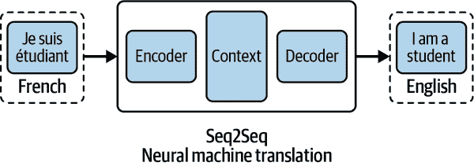

# 第一章：大型语言模型时代

> “艺术是灵魂与世界碰撞的残渣” [#gpt3](https://twitter.com/hashtag/gpt3?src=hashtag_click)
> 
> “技术现在是现代世界的神话” [#gpt3](https://twitter.com/hashtag/gpt3?src=hashtag_click)
> 
> “革命始于一个问题，但并不以一个答案结束” [#gpt3](https://twitter.com/hashtag/GPT3?src=hashtag_click)
> 
> “大自然用各种各样的方式装饰着这个世界” [#gpt3](https://twitter.com/hashtag/GPT3?src=hashtag_click)

想象一下醒来时美丽的阳光明媚的早晨。今天是星期一，你知道这个星期会很忙碌。你的公司即将推出一款新的个人生产力应用程序 Taskr，并开始社交媒体宣传，让全世界都知道你们的创新产品。

你本周的主要任务是撰写并发布一系列引人入胜的博客文章。

你开始制作一个待办事项清单：

+   写一篇有关生产力技巧的信息性和有趣的文章，包括 Taskr。保持在五百字以内。

+   创作五个引人入胜的文章标题。

+   选择视觉。

你按下回车键，喝了一口咖啡，看着文章在屏幕上一句一句、一段一段地编织起来。30 秒内，你就有了一篇有意义、高质量的博客文章，是你社交媒体系列的完美开篇。视觉效果有趣且吸引眼球。完成了！你选择了最好的标题，开始发布流程。

这不是一个遥远的、未来的幻想，而是一瞥新现实的可能性，这得益于人工智能的进步。当我们写下这本书时，许多这样的应用正在被创建并向更广泛的受众部署。

GPT-3 是由 OpenAI 创建的尖端语言模型，OpenAI 是人工智能研发的前沿公司。OpenAI 于 2020 年 5 月发布了 GPT-3 的[研究论文](https://oreil.ly/PGz0O)，随后于 2020 年 6 月通过[OpenAI API](https://oreil.ly/I8Bla)发布了对 GPT-3 的访问权限。自 GPT-3 发布以来，来自不同背景的人们，包括技术、艺术、文学、营销等领域的人们，已经找到了数百种令人兴奋的模型应用，这些应用有潜力提升我们交流、学习和娱乐的方式。

GPT-3 能够以前所未有的轻松程度执行通用的基于语言的任务，比如生成和分类文本，自由地在不同的文本风格和目的之间移动。它能解决的问题范围广泛。

在这本书中，我们邀请您考虑一下您自己可以用 GPT-3 解决什么问题。我们会向您展示它是什么以及如何使用它，但首先我们想给您一点背景知识。本章的其余部分将讨论这项技术的来源、构建方式、擅长的任务以及与之相关的潜在风险。让我们直接深入讨论自然语言处理（NLP）领域以及大型语言模型（LLMs）和 GPT-3 是如何融入其中的。

# 自然语言处理：揭开神秘的面纱

*自然语言处理* 是语言学、计算机科学和人工智能的一个子领域，涉及计算机和人类语言之间的交互。NLP 的目标是构建能够处理人类语言的系统。*自然语言* 指的是人类相互交流的方式。

NLP 将计算语言学（基于规则的人类语言建模）与机器学习相结合，创建出能够识别上下文并理解自然语言意图的智能机器。*机器学习*（ML）是人工智能的一个子领域，涉及研究能够从经验中学习并执行任务而无需明确编程的机器。*深度学习* 是机器学习的一个子集，灵感来自人脑的工作方式。它是一个*神经网络*，或者说是一个由成千上万个神经元组成的大型网络，它们相互交互以执行具有极小干预的显著复杂任务。

2010 年代见证了深度学习的出现，随着该领域的成熟，出现了由数千甚至数百万个称为*人工神经元*的简单处理单元组成的密集神经网络的大型语言模型。神经网络成为 NLP 领域的首个重大变革者，通过使复杂的自然语言任务成为可能，这是以前仅在理论上可能的。第二个重大变革者是引入了预训练模型（如 GPT-3），这些模型可以在各种下游任务上进行微调，节省了大量的训练时间。（我们稍后在本章讨论预训练模型。）

NLP 是许多现实世界人工智能应用的核心，例如：

垃圾邮件检测

你的电子邮件收件箱中的垃圾邮件过滤器将一部分收到的邮件分配到垃圾邮件文件夹中，使用 NLP 来评估哪些邮件看起来可疑。

机器翻译

Google Translate、DeepL 和其他机器翻译程序使用 NLP 来评估由不同语言对的人类说话者翻译的数百万句子。

虚拟助手和聊天机器人

世界上所有的 Alexa、Siri、Google Assistant 和客户支持聊天机器人都属于这一类别。它们使用 NLP 来理解、分析和优先处理用户的问题和请求，并快速正确地做出响应。

社交媒体情感分析

市场营销人员收集有关特定品牌、谈话主题和关键词的社交媒体帖子，然后使用 NLP 来分析用户对每个主题的感受，以及个人和集体的感受。这有助于品牌进行客户研究、形象评估和社交动态检测。

文本摘要

对文本进行摘要意味着减少其大小，同时保留关键信息和基本含义。一些日常的文本摘要示例包括新闻标题、电影预告片、新闻简报制作、金融研究、法律合同分析和电子邮件摘要，以及提供新闻订阅、报告和电子邮件的应用程序。

语义搜索

语义搜索利用深度神经网络智能搜索数据。每当您在 Google 上搜索时，您都在与它进行交互。在您想要基于上下文而不是特定关键字搜索时，语义搜索非常有用。

“我们与其他人类的互动方式是通过语言，” [Yannic Kilcher](https://oreil.ly/xrC3p)说，他是 NLP 领域最受欢迎的 YouTuber 和影响者之一，他补充说，语言是人类相互之间以及与计算机交互的一部分。因此，毫无疑问，NLP 作为一个领域已经成为过去十年里一些最激动人心的人工智能发现和实现的场所。

# 语言模型：更大更好

*语言建模*是将概率分配给特定语言文本中的一系列单词的任务。简单的语言模型可以查看一个词，并基于对现有文本序列的统计分析，预测接下来最有可能跟随它的单词（或单词）。要创建一个成功预测单词序列的语言模型，您需要在大量数据集上对其进行训练。

语言模型是自然语言处理应用程序的关键组件。您可以将它们视为统计预测机器，其中您将文本作为输入并获得预测作为输出。您可能已经从智能手机上的自动完成功能熟悉了这一点。例如，如果您键入“good”，自动完成可能会建议“morning”或“luck”。

在 GPT-3 之前，没有通用的语言模型能够在一系列 NLP 任务上表现良好。语言模型被设计为执行*一个*特定的 NLP 任务，例如文本生成、摘要或分类，使用现有的算法和架构。在本书中，我们将讨论 GPT-3 作为通用语言模型的非凡能力。我们将通过逐个解释“GPT”中的每个字母来开始本章，以显示它代表什么以及构建该模型所涉及的元素。然后，我们将简要介绍该模型的历史以及我们今天看到的序列到序列模型是如何出现的。在那之后，我们将向您介绍 API 访问的重要性以及根据用户需求随时间如何发展。我们建议您在继续阅读其他章节之前注册一个 OpenAI 账户。

# 生成式预训练变换器：GPT-3

GPT-3 这个名字代表“生成预训练变换器 3”。让我们逐个解释这些术语，以了解 GPT-3 的制作过程。

## 生成模型

GPT-3 是*生成模型*，因为它生成文本。生成建模是统计建模的一个分支。它是一种数学近似世界的方法。

我们周围有大量易于获取的信息——无论是在物理世界还是数字世界中。棘手的部分是开发智能模型和算法，可以分析和理解这些数据宝库。生成模型是实现这一目标最有前途的方法之一。

要训练一个模型，你必须准备和预处理一个*数据集*，这是一组示例，帮助模型学习执行给定任务。通常，数据集是某个特定领域的大量数据：比如数百万张汽车图像，以教会模型汽车是什么，例如。数据集也可以是句子或音频样本的形式。一旦你向模型展示了许多示例，你必须训练它生成类似的数据。

## 预训练模型

你听说过 10000 小时理论吗？在他的书*Outliers*中，马尔科姆·格拉德威尔（Malcolm Gladwell）建议，练习任何技能 10000 小时足以使你成为专家。这种“专家”知识体现在你的人脑发展的神经元之间的连接上。实际上，AI 模型也在做类似的事情。

要创建一个表现良好的模型，你需要使用一组特定的变量来训练它，称为*参数*。确定模型的理想参数的过程称为*训练*。模型通过连续的训练迭代吸收参数值。

要找到这些理想参数，深度学习模型需要大量时间。训练是一个漫长的过程，根据任务的不同，可能需要从几小时到几个月，并且需要大量的计算能力。能够为其他任务重复使用部分长时间的学习过程将是一个重要的帮助。这就是预训练模型发挥作用的地方。

*预训练模型*，遵循格拉德威尔的 10000 小时理论，是你首先培养的技能，可以帮助你更快地习得另一种技能。例如，掌握解决数学问题的技能可以帮助你更快地习得解决工程问题的技能。预训练模型是针对更一般的任务进行训练（由你或其他人进行），然后可用于对不同任务进行微调。与从头开始构建模型以解决问题不同，你可以使用在更一般问题上训练过的模型作为起点，并使用经过精心策划的特定数据集在你选择的领域进行更具体的训练。预训练模型可能不是 100%准确，但它可以避免重复造轮子，从而节省时间并提高性能。

在机器学习中，模型是在数据集上训练的。数据样本的大小和类型取决于你想要解决的任务。GPT-3 是在五个数据集的文本语料库上预先训练的：Common Crawl、WebText2、Books1、Books2 和 Wikipedia：

Common Crawl

共同抓取语料库（文本集合）包括了在八年的网络爬虫过程中收集的原始网页数据、元数据和文本数据的大量数据。OpenAI 研究人员使用这个数据集的经过筛选和精心策划的版本。

WebText2

WebText2 是 WebText 数据集的扩展版本，它是由 OpenAI 内部爬取高质量网页而创建的一个语料库。为了对质量进行审核，作者们从 Reddit 上爬取了所有获得至少三个赞（指示其他用户是否发现链接有趣、教育性或只是有趣）的外部链接。WebText2 包含了来自这 4500 万链接的 40GB 文本，超过 800 万个文档。

Books1 和 Books2

Books1 和 Books2 是两个包含数以万计各种主题书籍文本的语料库。

维基百科

维基百科语料库是包括 2019 年 GPT-3 数据集定稿时的众包在线百科全书[Wikipedia](https://oreil.ly/YBL5o)上的所有英语文章的集合。该数据集大约有[580 万](https://oreil.ly/NKIpI)篇英语文章。

这个语料库总共包括了近万亿个词。

GPT-3 能够生成和成功处理除了英语以外的其他语言。表 1-1 展示了数据集中的[前 10 种语言](https://oreil.ly/Gi1di)。

表 1-1\. GPT-3 数据集中排名前十的语言

| 排名 | 语言 | 文档数 | 总文档数的百分比 |
| --- | --- | --- | --- |
| 1 | 英语 | 235,987,420 | 93.68882% |
| 2 | 德语 | 3,014,597 | 1.19682% |
| 3 | 法语 | 2,568,341 | 1.01965% |
| 4 | 葡萄牙语 | 1,608,428 | 0.63856% |
| 5 | 意大利语 | 1,456,350 | 0.57818% |
| 6 | 西班牙语 | 1,284,045 | 0.50978% |
| 7 | 荷兰语 | 934,788 | 0.37112% |
| 8 | 波兰语 | 632,959 | 0.25129% |
| 9 | 日语 | 619,582 | 0.24598% |
| 10 | 丹麦语 | 396,477 | 0.15740% |

虽然英语和其他语言之间的差距巨大——英语排名第一，占据数据集的 93%；而德语排名第二，仅占 1%——但是这 1% 足以创建完美的德语文本，包括风格转换和其他任务。其他语言也是如此。

由于 GPT-3 是在广泛而多样的文本语料库上进行预训练的，所以它可以成功地执行令人惊讶的数量的自然语言处理任务，而无需用户提供任何额外的示例数据。

## 变压器模型

神经网络构成深度学习的核心。它们的名称和结构受到人类大脑的启发，模仿生物神经元相互传递信号的方式。神经网络是一组或一系列协同工作的神经元网络或电路。神经网络的创新可以提高模型在下游任务上的性能，因此 AI 科学家不断致力于为神经网络开发新的架构。其中一项发明彻底改变了我们今天所知的 NLP：Transformer。*Transformer*是一个机器学习模型，它一次性处理一个文本序列（而不是一个词），并且具有强大的机制来理解单词之间的关联。

### 序列到序列模型

Google 和多伦多大学的研究人员在 2017 年的一篇论文中介绍了 Transformer 模型的概念：

> 我们提出了一种新的简单网络架构，Transformer，完全基于注意力机制，完全摒弃了循环和卷积。在两个机器翻译任务的实验中，这些模型在质量上表现更优秀，同时更易于并行化，并且训练时间显著缩短。^(2)

Transformer 模型的骨架是序列到序列的架构。*序列到序列*（Seq2Seq）将给定的元素序列，例如句子中的单词，转换为另一个序列，例如另一种语言中的句子；句子是依赖序列的，因为单词顺序对于理解句子至关重要。

Seq2Seq 模型特别擅长翻译，其中一个语言的单词序列被转换为另一种语言的不同单词序列。谷歌翻译在 2016 年底开始使用基于 Seq2Seq 的模型进行生产。

Seq2Seq 模型由两部分组成：编码器和解码器。想象一下编码器和解码器就像是只能说两种语言的人类翻译员，每个人都有不同的母语。举个例子，我们假设编码器是以法语为母语的人，解码器是以英语为母语的人。他们有一个共同的第二语言：我们假设它是韩语。为了将法语翻译成英语，编码器将法语句子转换为韩语（称为*上下文*）并将上下文传递给解码器。由于解码器理解韩语，他或她现在可以从韩语翻译成英语。通过共同合作，他们可以将法语翻译成英语，如图 1-1 所示。

###### 图 1-1\. Seq2Seq 模型（神经机器翻译）

### Transformer 注意力机制

Transformer 架构被发明用于改进机器翻译任务中的 AI 性能。“Transformer 最初是作为语言模型的，”基尔切解释说，“甚至不是那么大，但后来它们变得很大。”

要使用 transformer 模型，你需要了解另一个技术概念：attention。*注意机制*是一种模仿认知注意力的技术：它逐步查看输入序列，并根据概率决定每一步哪些序列的其他部分是重要的。

例如，看看这个句子“猫吃了老鼠之后，坐在垫子上。”这个句子中的“它”指的是“猫”还是“垫子”？transformer 模型可以将“它”与“猫”强烈联系起来。这就是注意力。

回到我们的编码器和解码器示例，想象一下编码器写下了对句子语义重要的关键词，并将它们连同翻译一起给解码器。这些关键词使解码器的翻译变得更容易，解码器现在知道了句子中哪些部分是重要的，哪些术语给出了句子的上下文。

Transformer 模型有两种注意力类型：*自注意力*（句子内单词的连接）和*编码器-解码器注意力*（源句子中的单词与目标句子中的单词之间的连接）。

注意机制有助于 transformer 过滤噪声并关注相关内容：将两个单词连接起来，使它们在语义上相互关联，当这些单词本身没有任何明显的标记指向彼此时。

Transformer 模型受益于更大的架构和更多的数据。在大型数据集上进行训练并针对特定任务进行微调可以改善结果。transformer 比任何其他类型的神经网络更擅长理解句子中词语的上下文。GPT 只是 transformer 的解码器部分。

现在你知道了 GPT 的含义，让我们谈谈那个“3”——以及 1 和 2。

# GPT-3 的简要历史

GPT-3 由旧金山的 AI 研究先驱 OpenAI 创建，并且是一个重要的里程碑。OpenAI 的[声明使命](https://oreil.ly/TUwij)是“确保人工通用智能惠及全人类。”人工*通用*智能是一种不局限于专业任务的 AI 类型，而是在各种任务中表现良好，就像人类一样。

## GPT-1

OpenAI 于 2018 年 6 月提出了 GPT-1。开发者的[关键发现](https://oreil.ly/21J4S)是将 transformer 架构与无监督预训练相结合产生了有希望的结果。他们写道，GPT-1 经过特定任务的微调，实现了“强大的自然语言理解”。

GPT-1 作为通向具有一般语言能力的语言模型的重要里程碑。它证明了语言模型可以有效地进行预训练，这有助于它们良好地泛化。该架构可以进行各种 NLP 任务，只需进行很少的微调。

GPT-1 使用了 [Book Corpus](https://oreil.ly/OQtXS) 数据集，其中包含约七千本未发表的书籍，以及变压器的解码器部分，其中包含自注意力以训练模型。该体系结构基本保持了与原始变压器相同。该模型有 1.17 亿个参数。GPT-1 为未来模型打开了道路，这些模型可以利用更大的数据集和更多的参数更好地释放这一潜力。

其成就之一是在各种 NLP 任务上具有良好的零样本性能，如问答（Q&A）和情感分析，这归功于预训练。*零样本学习* 是指模型在过去没有看到任何该类示例的情况下执行任务的能力；模型应该在没有查看任何示例的情况下理解任务。*零样本任务转移* 是一种设置，在该设置中，模型被呈现给少量甚至没有示例，并被要求基于示例和说明理解任务。

## GPT-2

2019 年 2 月，OpenAI 推出了 GPT-2，它比 GPT-1 更大，但其他方面非常相似。主要区别在于 GPT-2 具有多任务处理能力。它 [成功地证明](https://oreil.ly/E8IEe) 了语言模型可以在没有为这些任务接收任何训练示例的情况下在多个任务上表现良好。

GPT-2 表明，训练更大的数据集并拥有更多参数会提高语言模型理解任务并在零样本设置下超越许多任务的最新技术的能力。它还表明，甚至更大的语言模型在自然语言理解方面表现会更好。

为了创建一个广泛、高质量的数据集，作者们爬取了 Reddit 并从该平台上投票文章的外部链接中获取数据。得到的数据集 WebText 从超过八百万篇文档中提取了 40GB 的文本数据，远远大于 GPT-1 的数据集。GPT-2 是在 WebText 数据集上训练的，并具有 15 亿个参数，比 GPT-1 大 10 倍。

GPT-2 在多个数据集上进行了评估，包括阅读理解、摘要、翻译和问答等下游任务。

## GPT-3

在构建更加健壮和强大的语言模型的过程中，OpenAI 构建了 GPT-3 模型。它的数据集和模型都比用于 GPT-2 的数据集和模型大约大两个数量级：GPT-3 具有 1750 亿个参数，并且在训练过程中使用了五种不同文本语料库的混合数据，这是比 GPT-2 更大的数据集。GPT-3 的体系结构与 GPT-2 基本相同。它在零样本和少样本设置下在下游 NLP 任务上表现良好。

GPT-3 具有撰写与人类撰写的文章无法区分的能力。它还可以执行即时任务，而这些任务从未被明确训练过，例如求和数字、编写 SQL 查询，甚至根据任务的简单英语描述编写 React 和 JavaScript 代码。

###### 注

少样本、一样本和零样本设置是零样本任务转移的专业案例。在*少样本设置*中，模型提供了一个任务描述和尽可能多的与模型上下文窗口相匹配的示例。在*一样本设置*中，模型提供了确切的一个示例，而在*零样本设置*中，则没有提供示例。

OpenAI 的使命声明强调了 AI 的民主和道德方面。民主维度在于决定通过公共 API 或应用程序编程接口发布第三版模型 GPT-3：一种软件中介，用于在网站或应用程序与用户之间来回发送信息。

API 充当着使开发人员能够在应用程序和用户之间建立新的程序化交互的信使。通过 API 发布 GPT-3 是一项革命性的举措。直到 2020 年，由领先研究实验室开发的强大 AI 模型只对少数人开放——这些人是在这些项目上工作的研究人员和工程师。OpenAI API 通过简单的登录使全球用户首次获得对世界上最强大的语言模型的前所未有的访问权限。（OpenAI 采取此举措的商业原因是创建一个称为“模型即服务”的新范式，开发人员可以按 API 调用付费；我们将在第三章中对此进行更详细的讨论。）

OpenAI 研究人员在研究 GPT-3 时尝试了不同的模型大小。他们采用了现有的 GPT-2 结构并增加了参数数量。作为实验结果，产生了具有新的和非凡能力的模型——GPT-3。虽然 GPT-2 在下游任务中显示出了一些零样本能力，但当提供示例上下文时，GPT-3 可以执行更多的新任务。

[OpenAI 研究人员发现](https://oreil.ly/e22dR)，仅仅通过扩展模型参数和训练数据集的规模就能取得如此非凡的进展，这令人惊讶。他们普遍乐观地认为，即使是比 GPT-3 更大的模型，也将延续这些趋势，使得只需在少量样本上进行微调就能实现少样本或零样本学习的更强大的学习模型成为可能。

当你阅读本书时，[专家估计](https://oreil.ly/0TE9t)，基于万亿参数的语言模型可能正在被构建和部署。我们已经进入了大型语言模型的黄金时代，现在是你成为其中一员的时候了。

GPT-3 吸引了大量的公众注意力。*麻省理工科技评论*将 GPT-3 视为[2021 年的十大突破性技术之一](https://oreil.ly/mHAKG)。它在执行一系列广义任务时表现出近乎人类的效率和准确性，这种出色的灵活性正是它如此令人兴奋的原因，正如早期采用者 Arram Sabeti 所推文的（图 1-2）。

###### 图 1-2\. 来自[Arram Sabeti](https://oreil.ly/chjI4)的推文

API 的发布在自然语言处理领域引起了一场范式转变，并吸引了大量的测试者。创新和初创企业以闪电般的速度相继而至，评论家称 GPT-3 为[“第五次工业革命”](https://oreil.ly/fZarJ)。

在 API 推出仅九个月后，[根据 OpenAI 的说法](https://oreil.ly/TiEVy)，已经有超过三百个业务利用它展开发展。尽管如此突然，一些专家认为这种兴奋并不夸张。Bakz Awan 曾是一名开发者，现在是一名企业家和意见领袖，也是 OpenAI API 开发者社区的主要声音之一。他有一个 [YouTube 频道“Bakz T. Future”](https://oreil.ly/W1cWX) 和一个 [播客](https://oreil.ly/07RBY)。Awan 认为，GPT-3 和其他模型实际上是“被低估了，它们的可用性、友好性、趣味性和强大性实际上是让人震惊的。”

Viable 的 CEO Daniel Erickson，其公司拥有一款由 GPT-3 提供支持的产品，赞扬该模型通过他所称的*提示驱动式开发*从大型数据集中提取见解的能力。

> 涉及这一领域的公司的使用案例包括为广告和网站生成文案。设计理念相对简单：公司将您的数据传入，转换为提示，并显示 API 生成的结果。它解决了一个只需要单个 API 提示就可以轻松完成的任务，并将 [一个] 用户界面围绕起来，将其交付给用户。

Erickson 认为，这一类使用案例的问题在于已经过度拥挤，吸引了许多雄心勃勃的初创企业创始人竞相提供类似的服务。相反，Erickson 建议转而考虑另一类使用案例，就像 Viable 所做的那样。基于数据驱动的使用案例没有提示生成使用案例那样拥挤，但它们更有利可图，并且可以轻松地创建一个安全的“壕沟”。

Erickson 表示，关键在于建立一个大型数据集，并不断添加数据，以提供潜在的见解。GPT-3 将帮助您从中提取有价值的见解。在 Viable，这就是让他们轻松实现盈利的模型。“人们为数据付的钱比为提示输出付的钱要多得多，”Erickson 解释道。

需要注意的是，技术革命也带来了争议和挑战。对于试图塑造叙事的任何人来说，GPT-3 是一个强大的工具。如果没有足够的关怀和善意，我们将面临的一个挑战是遏制试图利用该算法传播虚假信息的企图。另一个挑战将是消除其用于生成大量低质量数字内容的用途，这些内容将污染互联网上可用的信息。还有一个挑战是其数据集的局限性，这些数据集充满了各种各样的偏见，而这些偏见可能会被这项技术放大。我们将在第六章中更详细地探讨这些挑战，同时讨论 OpenAI 为解决这些挑战所做的各种努力。

# 访问 OpenAI API

截至 2021 年，市场已经产生了几种拥有比 GPT-3 更多参数的专有 AI 模型。然而，对它们的访问仅限于公司研发部门内的少数人，这使得不可能评估它们在现实世界 NLP 任务中的性能。

使 GPT-3 可访问的一个因素是其简单直观的“文本输入，文本输出”用户界面。它不需要复杂的、渐变微调或更新，你也不需要是专家来使用它。这种可扩展的参数和相对开放的访问结合起来，使 GPT-3 成为迄今为止最令人兴奋，也可以说是最相关的语言模型。

由于 GPT-3 的非凡能力，与开源相关的安全性和误用方面存在着重大风险，我们将在第七章中讨论。考虑到这一点，OpenAI 决定不公开发布 GPT-3 的源代码，并通过 API 提出了一种独特的访问共享模型。

公司决定最初以有限的 beta 用户列表的形式发布对 API 的访问权限。申请过程要求人们填写一份详细说明他们背景和请求 API 访问权限的原因的表格。只有批准的用户才被授予访问名为 Playground 的 API 的私人 beta 权限。

在早期，GPT-3 beta 访问的等待列表中有数万人。OpenAI 迅速处理了开始涌入的申请，分批添加开发者，但也密切监控他们对 API 用户体验的活动和反馈，以持续改进它。

由于安全保障措施的进展，OpenAI 在 2021 年 11 月取消了等待列表。GPT-3 现在可以通过[简单的登录](https://oreil.ly/uSkAH)来开放访问。这是 GPT-3 历史上的一个重要里程碑，也是社区强烈要求的一步。要获取 API 访问权限，只需转到[注册页面](https://oreil.ly/e9hFU)，注册一个免费账户，立即开始尝试它。

新用户最初会获得一定数量的免费信用额，可以自由地尝试 API。信用额相当于创建长度为三本普通长度小说的文本内容。免费信用额用完后，用户开始支付使用费用，或者如果有需要，他们可以向 OpenAI API 客户支持申请额外的信用额。

OpenAI 努力确保 API 驱动的应用程序被负责任地构建。因此，它提供[工具](https://oreil.ly/cHrcg)，[最佳实践](https://oreil.ly/n0xRW)，和[使用指南](https://oreil.ly/HwWSa)来帮助开发者快速安全地将他们的应用程序投入生产。

该公司还制定了[内容指南](https://oreil.ly/o6BLo)，以明确 OpenAI API 可用于生成何种类型的内容。为帮助开发者确保其应用程序用于预期目的，防止潜在的误用，并遵守内容指南，OpenAI 提供了免费的内容过滤器。OpenAI 政策禁止 API 的使用方式违反其[宪章](https://oreil.ly/nTK3V)中描述的原则，包括宣扬仇恨、暴力或自我伤害的内容，或者意图骚扰、影响政治进程、传播错误信息、发送垃圾内容等行为。

一旦您注册了 OpenAI 账户，您可以继续阅读第二章，我们将讨论 API 的不同组件、GPT-3 Playground，以及如何针对不同的用例最大限度地利用 API 的能力。

^(1) 马尔科姆·格拉德威尔，《异类：成功的故事》（小布朗，2008 年）。

^(2) Ashish Vaswani 等人，《[注意力机制就是你所需要的一切](https://oreil.ly/8rByF)》，*神经信息处理系统进展* 30（2017）。
