# 第二章：使用 OpenAI API

即使 GPT-3 是世界上最复杂和复杂的语言模型，其功能也被抽象为一个简单的“文本输入，文本输出”的接口提供给最终用户。本章将带您开始使用该接口、Playground，并涵盖 OpenAI API 的技术细节，因为细节总是揭示真正的精华。

要完成本章的学习，您需要在 [*https://beta.openai.com/signup*](https://beta.openai.com/signup) 注册一个 OpenAI 账户。如果您还没有，请立即注册。

# 浏览 OpenAI Playground

您的 OpenAI 开发者账户提供了访问 API 和无限可能性的权限。我们将从 Playground 开始，这是一个基于 Web 的沙盒环境，允许您尝试 API，了解其组件的工作原理，并访问开发者文档和 OpenAI 社区。然后，我们将向您展示如何构建强大的提示，以生成您应用程序的良好响应。最后，我们将通过 GPT-3 执行四个自然语言处理任务的示例来结束本章：分类、命名实体识别（NER）、摘要和文本生成。

在一次与 OpenAI 产品和合作副总裁彼得·韦林德（Peter Welinder）的采访中，我们询问了如何为首次使用 Playground 的用户提供关键建议。他告诉我们，他的建议取决于用户的角色。如果用户具有机器学习背景，彼得鼓励他们“首先忘记他们已经知道的东西，然后只需进入 Playground，尝试让 GPT-3 做你希望它做的事情，只需询问它。”他建议用户“把 GPT-3 想象成你要求做某事的朋友或同事。你会如何描述你希望他们做的任务？然后，看看 GPT-3 如何回应。如果它的回应不符合你的要求，就修改你的指令。”

正如 YouTuber 和 NLP 影响者 [Bakz Awan](https://oreil.ly/sPTfo) 所说：“非技术人员问：我需要学位来使用这个吗？我需要懂编程才能使用它吗？绝对不需要。您可以使用 Playground。您不需要编写一行代码。您会立即得到结果。任何人都可以做到。”

###### 注意

在开始使用 Playground 之前，我们建议阅读 OpenAI 的 [快速入门教程](https://oreil.ly/Zivxx) 和 [开发者文档](https://oreil.ly/btPCR)。

这里是开始使用 Playground 的步骤：

1.  登录到 [*https://openai.com*](https://openai.com)，并从主菜单导航到 Playground。

1.  查看 Playground 屏幕（图 2-1）。

    +   标记为 1 的大文本框是您提供文本输入（提示）的位置。

    +   右侧标记为 2 的框是参数设置窗格，它使您可以调整参数。

    +   标记为 3 的框允许您加载一个 *预设*：一个示例提示和 Playground 设置。提供您自己的训练提示或加载现有的预设。

        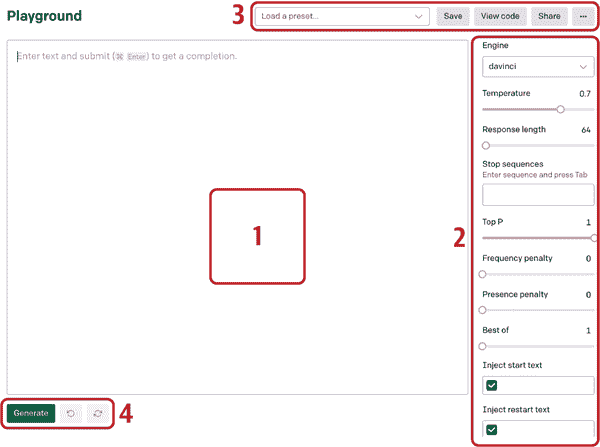

        ###### 图 2-1\. Playground 界面，2022 年 1 月 10 日截图

1.  选择现有的问答预设（标记为 3）。这将自动加载训练提示以及相关的参数设置。单击生成按钮（在图 2-1 中标记为 4）。

1.  API 处理您的输入并在同一文本框中提供响应（称为*完成*）。它还显示了您使用的令牌数量。*令牌*是用于确定每个 API 调用价格的单词的数值表示；我们将在本章后面讨论它们。

1.  屏幕底部右侧是令牌计数，左侧是一个生成按钮（参见图 2-2）。

    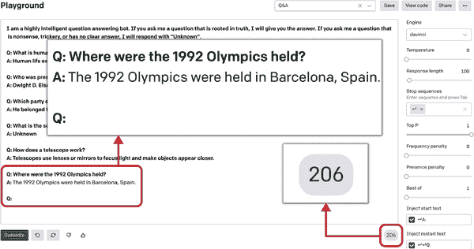

    ###### 图 2-2\. 带令牌计数的问答提示完成

1.  每次单击生成按钮，GPT-3 都会考虑文本输入字段中的提示和完成，并将它们视为下一个完成的训练提示的一部分。

这是您可以在图 2-2 中看到的提示：

```py
I am a highly intelligent question answering bot. If you ask me a question that
is rooted in truth, I will give you the answer. If you ask me a question that is
nonsense, trickery, or has no clear answer, I will respond with "Unknown".

Q: What is human life expectancy in the United States?
A: Human life expectancy in the United States is 78 years.

Q: Who was president of the United States in 1955?
A: Dwight D. Eisenhower was president of the United States in 1955.

Q: Which party did he belong to?
A: He belonged to the Republican Party.

Q: What is the square root of banana?
A: Unknown

Q: How does a telescope work?
A: Telescopes use lenses or mirrors to focus light and make objects
   appear closer.

Q: Where were the 1992 Olympics held?
```

这是完成：

```py
A: The 1992 Olympics were held in Barcelona, Spain.
```

现在您已经了解了 Playground 的基本概述，让我们深入了解提示工程和设计的细节。

## 提示工程和设计

OpenAI API 彻底改变了我们与 AI 模型互动的方式，剥离了复杂的编程语言和框架。特斯拉人工智能总监 Andrej Karpathy 在 GPT-3 发布后开玩笑地说，编程 3.0 就是关于提示设计的（他发布的表情包在图 2-3）。您提供的训练提示与您获得的完成质量之间存在直接关系。您的文字结构和排列方式会严重影响输出。了解提示设计是释放 GPT-3 真正潜力的关键。

写好提示的秘诀在于了解 GPT-3 对世界的了解。正如 Awan 指出的那样：“它只看过文本。这意味着你不应该期望它了解物理世界，尽管它显然了解。它可以描述《蒙娜丽莎》，[可能]告诉你[关于]它的意义，重要性，历史[的]，但它从未见过[这幅画]，因为它只受过文本训练。”

你的工作是让模型利用它已有的信息生成有用的结果。在字谜游戏中，表演者给其他玩家足够的信息来猜出秘密单词。同样，对于 GPT-3，我们只给模型足够的上下文（以训练提示的形式）来找出模式并执行给定的任务。

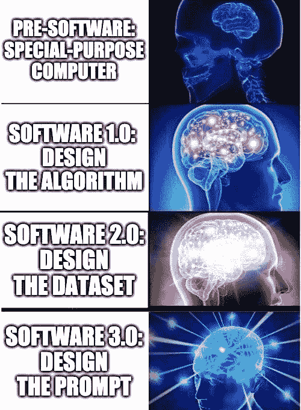

###### 图 2-3\. 表情包来源未知，由[Andrej Karpathy 在 2020 年 6 月 18 日发布](https://oreil.ly/Fs6hp)

###### 提示

在设计训练提示时，目标是从模型中获得一个*零-shot*的响应：也就是说，看看你是否可以在没有引导模型的外部训练示例的情况下获得你想要的响应。如果不能，那么向前移动，而不是向它展示整个数据集，而是向它展示一些例子。设计训练提示的标准流程是首先尝试零-shot，然后是几-shot，然后是基于语料库的微调（稍后在本章中描述）。

GPT-3 是通向通用人工智能的第一步，因此它也有其局限性。它并不知道一切，也无法以人类的方式推理，但是当你知道如何与它交流时，它是非常有能力的。这就是提示工程艺术的地方。

GPT-3 并非真相说者，但它是一位出色的故事讲述者。它接受文本输入，并试图以它认为最佳完成输入的文本来回应。如果你给它几行你最喜欢的小说，它会试图以相同风格继续。它通过导航上下文来工作，没有适当的上下文，它会生成不一致的回应。让我们看一个例子，以了解 GPT-3 是如何处理输入提示并生成输出的：

```py
Q: What is human life expectancy in the United States?
A:
```

如果你向 GPT-3 提供这样的提示而没有任何上下文，你实际上是在要求它从其训练数据宇宙中寻找一般性答案。结果将是一般化和不一致的回应，因为模型不知道使用哪部分训练数据来回答问题。

另一方面，提供正确的上下文将会极大地提高回应的质量。它简单地限制了模型必须检查以回答问题的训练数据的宇宙，从而产生更具体和切题的回应：

```py
I am a highly intelligent question answering bot. If you ask me a question that
is rooted in truth, I will give you the answer. If you ask me a question that
is nonsense, trickery, or has no clear answer, I will respond with "Unknown".

Q: What is human life expectancy in the United States?
A:
```

你可以把 GPT-3 处理输入的方式想象成人类大脑的处理方式。当有人向我们提出任何没有适当上下文的问题时，我们往往会给出随机的回应。这是因为没有任何适当的方向或上下文，很难得到精确的回应。GPT-3 也是如此；它的训练数据宇宙如此之大，以至于在没有任何外部上下文或方向的情况下，很难导航到正确的响应。

像 GPT-3 这样的 LLM 在给定正确上下文的情况下能够进行创意写作和回答事实性问题。以下是我们用于创建高效和有效的训练提示的五步公式：

1.  定义你试图解决的问题以及它是什么类型的 NLP 任务，例如分类、问答、文本生成或创意写作。

1.  想一想是否有办法得到一个零-shot 解决方案。如果你认为你需要外部示例来为你的用例引导模型，那么请认真考虑。

1.  现在想一想，考虑到 GPT-3 的“文本输入，文本输出”接口，您可能如何以文本形式表达问题。考虑所有可能的场景来以文本形式表示您的问题。例如，假设您想要构建一个广告文案助手，可以通过查看产品名称和描述来生成创意文案。为了以“文本输入，文本输出”格式来界定这个目标，您可以将输入定义为产品名称和描述，输出定义为广告文案：

    ```py
    Input: Betty's Bikes, for price-sensitive shoppers
    Output: Low prices and huge selection. Free and fast delivery. 
    Order online today!
    ```

1.  如果您最终使用外部示例，请尽量少用，并尝试包含多样性，捕捉所有表示以避免模型过拟合或预测偏差。

这些步骤将作为每次从零开始创建训练提示时的标准框架。在您可以为数据问题构建端到端解决方案之前，您需要更多地了解 API 的工作原理。让我们通过查看其组件来深入了解。

# OpenAI API 的工作原理

我们将在章节中更详细地讨论 图 2-4 中的所有这些组件。

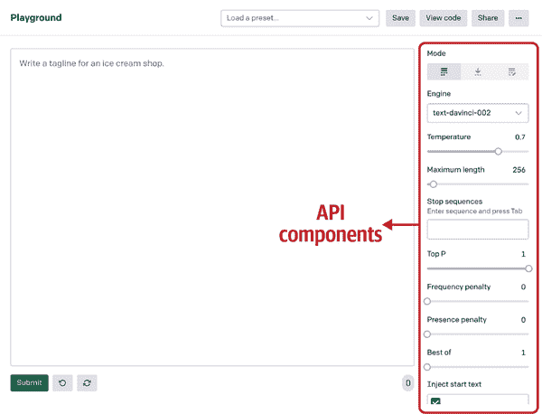

###### 图 2-4\. API 的组件

表 2-1 显示了 OpenAI API 中组件的概述。

表 2-1\. OpenAI API 中的组件

| 组件 | 功能 |
| --- | --- |
| 执行引擎 | 确定用于执行的语言模型 |
| 响应长度 | 设置 API 在其完成中包含的文本量的限制 |
| 温度和 Top P | 温度控制响应的随机性，表示为从 0 到 1 的范围。Top P 控制模型应考虑的随机结果数量，如温度所示；它确定了随机性的范围。 |
| 频率惩罚和存在惩罚 | 频率惩罚通过“惩罚”模型来减少重复生成相同行的可能性。存在惩罚增加模型讨论新主题的可能性。 |
| 最佳选择 | 允许您在服务器端指定要生成的完成数（n），并返回“n”个完成中的最佳选择 |
| 停止序列 | 指定信号 API 停止生成完成的一组字符 |
| 注入起始和重新启动文本 | 注入起始文本允许您在完成的开头插入文本。注入重新启动文本允许您在完成的末尾插入文本。 |
| 显示概率 | 允许您通过显示模型对于给定输入可以生成的标记的概率来调试文本提示 |

## 执行引擎

*执行引擎* 确定用于执行的语言模型。选择正确的引擎是确定您模型能力的关键，从而获得正确输出。GPT-3 提供了四种大小和功能各异的执行引擎：Davinci、Ada、Babbage 和 Curie。Davinci 是最强大的，也是 Playground 的默认引擎。

## 响应长度

*响应长度*设置了 API 在其完成中包含多少文本的限制。因为 OpenAI 按 API 调用生成的文本长度收费（如前所述，这转化为令牌，或者是单词的数字表示），响应长度（也以令牌表示）对于预算有限的人来说是一个关键参数。更高的响应长度将使用更多的令牌并且成本更高。例如，如果进行分类任务，将响应文本调节器设置为 100 不是一个好主意：API 可能会生成无关的文本并使用额外的令牌，这将在您的账户上产生费用。由于技术限制，API 支持最多 2048 个令牌的提示和完成的组合。因此，在使用 API 时，您需要小心，确保提示和预期完成不超过最大响应长度，以避免突然完成。如果您的用例涉及大文本提示和完成，解决方法是想出在令牌限制内解决问题的创造性方法，例如缩短提示，将文本分成较小的片段，并链接多个请求。

## 温度和 Top P

*温度*调节器控制响应的创造性，表示为从 0 到 1 的范围。温度值较低意味着 API 将预测模型看到的第一件事情，导致最正确但可能枯燥，变化较小的文本。另一方面，温度值较高意味着模型在预测结果之前评估可能适合上下文的响应。生成的文本将更加多样化，但语法错误和无意义生成的可能性更高。

*Top P* 控制模型应考虑的随机结果数量，如温度调节器所建议的；它确定了随机性的*范围*。Top P 的范围是从 0 到 1。接近零的值意味着随机响应将受到限制：例如，如果值为 0.1，则只有 10% 的随机响应将被视为完成。这使得引擎*确定性*，这意味着它将始终为给定的输入文本生成相同的输出。如果值设置为 1，API 将考虑所有响应以完成，冒险并提出创造性的响应。较低的值限制了创造力；较高的值扩展了视野。

温度和 Top P 对输出产生重要影响。有时候，要想明白何时以及如何使用它们以获得所需的输出可能会令人困惑。两者相关联：改变其中一个的值会影响另一个。因此，通过将 Top P 设置为 1，您可以允许模型通过探索整个响应谱来释放其创造力，并通过使用温度调节器来控制随机性。

###### 提示

我们始终建议更改 Top P 或温度，并将另一个设置为 1。

大型语言模型依赖概率方法而不是传统逻辑。它们可以为相同输入生成各种响应，具体取决于您设置模型参数的方式。模型试图在其训练的数据宇宙中找到最佳的概率匹配，而不是每次都寻找完美解决方案。

正如我们在第一章中提到的，GPT-3 的训练数据宇宙是巨大的，包括各种公开可用的书籍，互联网论坛和 OpenAI 专门策划的维基百科文章，使其能够为给定提示生成各种完成。这就是温度和 Top P，有时被称为“创造力旋钮”，发挥作用的地方：您可以调节它们以生成更自然或更抽象的响应，其中包含一些富有创意的元素。

假设你要使用 GPT-3 为你的初创公司生成名称。您可以将温度调节旋钮设置为较高水平，以获得最具创意的响应。当我们日夜努力寻找我们初创公司的完美名称时，我们调高了温度。GPT-3 出手相助，帮助我们找到了一个我们喜欢的名字：Kairos 数据实验室。

在其他情况下，您的任务可能需要很少或根本不需要创造力：例如分类和问答任务。对于这些任务，请保持较低的温度。

让我们看一下图 2-5，使用一个简单的分类示例，根据它们的名称将公司归类为一般的桶或类别。

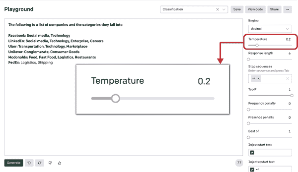

###### 图 2-5\. 温度组件

我们的提示：

```py
The following is a list of companies and the categories they fall into:

Facebook: Social Media, Technology
LinkedIn: Social Media, Technology, Enterprise, Careers
Uber: Transportation, Technology, Marketplace
Unilever: Conglomerate, Consumer Goods
Mcdonalds: Food, Fast Food, Logistics, Restaurants
FedEx:
```

以及输出：

```py
Logistics, Shipping
```

正如您在图 2-5 中看到的那样，我们再次使用温度来控制随机性的程度。您还可以通过将温度旋钮保持设置为 1 而更改 Top P 来做到这一点。

## 频率和存在惩罚

与温度和 Top P 调节旋钮一样，频率惩罚和存在惩罚调节旋钮考虑的是文本提示（前一个完成加上新输入），而不是内部模型参数，当决定输出时，现有文本因此影响新的完成。*频率惩罚*通过“惩罚”它来减少模型完全重复相同行的可能性。*存在惩罚*增加了它谈论新话题的可能性。

当您希望防止相同的完成文本在多个完成之间重复时，这些就派上用场了。尽管这些旋钮相似，但有一个重要区别。如果建议的文本输出重复（例如，模型在之前的完成或同一会话期间使用了完全相同的标记），并且模型选择旧输出而不是新输出，则会应用频率惩罚。如果给定文本中存在标记*，则将应用存在惩罚。

## 最佳效果

GPT-3 使用 *最佳选择* 功能在服务器端生成多个完成，对它们进行幕后评估，然后为您提供最佳的概率结果。使用“最佳选择”参数，您可以指定要在服务器端生成的完成数 (*n*)。模型将返回 *n* 个完成中的最佳完成（每个标记的最低对数概率）。

这使您能够在单个 API 调用中评估多个提示完成，而不是重复调用 API 来检查相同输入的不同完成的质量。但是，使用“最佳选择”是昂贵的：它花费了 *n* 倍于提示中的标记。例如，如果您将“最佳选择”值设置为 2，则将收取输入提示中标记的两倍的费用，因为在后台，API 将生成两个完成并显示给您最佳的一个。

“最佳选择”根据您的使用情况可以从 1 到 20 不等。如果您的使用情况为为客户提供一致的输出质量，则可以将“最佳选择”值设置为较高的数字。另一方面，如果您的使用情况涉及太多的 API 调用，则将“最佳选择”值设置为较低的数字是有意义的，以避免不必要的延迟和成本。我们建议在使用“最佳选择”参数生成多个提示时保持响应长度最小，以避免额外收费。

## 停止序列

*停止序列* 是一组字符，用于指示 API 停止生成完成。这有助于避免使用不必要的标记，对于常规用户来说，这是一项重要的节省成本功能。

您可以为 API 提供最多四个序列，以停止生成进一步的标记。

让我们看看 图 2-6 中的示例语言翻译任务，以了解停止序列的工作原理。在此示例中，将英语短语翻译为法语。我们使用重启序列“英语：”作为停止序列：每当 API 遇到该短语时，它将停止生成新的标记。

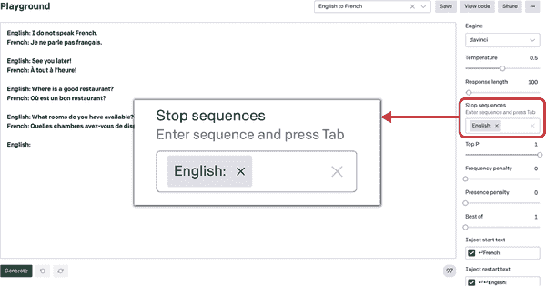

###### 图 2-6\. 停止序列组件

## 注入开始文本和注入重启文本

*注入开始文本* 和 *注入重启文本* 参数允许您分别在完成的开始或结束处插入文本。您可以使用它们来保持所需的模式。通常，这些设置与停止序列一起使用，就像我们的示例中一样。提示具有模式，其中提供了一个带有前缀“英语：”（重启文本）的英语句子，然后生成带有前缀“法语：”（开始文本）的翻译输出。因此，任何人都可以轻松区分两者，并创建一个模型和用户都可以清楚理解的训练提示。

每当我们为此类提示运行模型时，它会自动在输出之前注入开始文本“法语：”，并在下一个输入之前注入重启文本“英语：”，以便可以保持这种模式。

## 显示概率

*显示概率*参数位于 Playground 设置窗格的底部。在传统软件工程中，开发人员使用 *调试器* 来调试（调试）一段代码。您可以使用显示概率参数来调试您的文本提示。每当您选择此参数，您将看到突出显示的文本。将光标悬停在上面将显示模型可以为指定的特定输入生成的标记列表，以及它们的相应概率。

您可以使用此参数来检查您的选项。此外，它可以帮助您看到可能更有效的替代方案。显示概率参数有三个设置：

最有可能

列出最有可能被考虑作为完成的标记，按概率递减的顺序。

最不可能

列出最不可能被考虑作为完成的标记，按概率递减的顺序。

完整光谱

显示可能被选择完成的整个标记宇宙。

让我们在一个简单提示的情境下看看这个参数。我们想要用一个简单、众所周知的短语开头输出句子：“从前有一天。”我们向 API 提供提示“从前有一”，然后我们在显示概率选项中选中“最有可能”选项。

如图 2-7 所示，它将“time”作为响应生成。因为我们将“显示概率”参数设置为最有可能，API 不仅显示响应，还显示可能的选项列表以及它们的概率。

现在您已经有了一个概述，让我们更详细地看看这些组件。

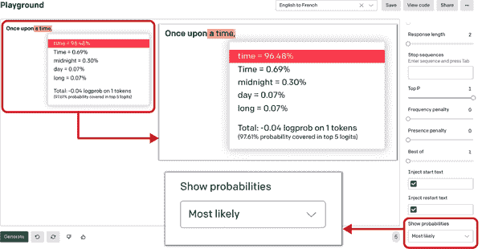

###### 图 2-7\. 显示概率组件显示最有可能的标记

# 执行引擎

如图 2-7 所述，OpenAI API 提供四个执行引擎，通过参数数量和性能能力进行区分。执行引擎驱动 OpenAI API。它们是“autoML”解决方案，提供自动化的 ML 方法和流程，使机器学习可用于非专家。它们易于配置并适应给定的数据集和任务。

四个主要的执行引擎按字母顺序命名，分别是：Ada（以埃达·洛夫莱斯命名）、Babbage（查尔斯·巴贝奇）、Curie（居里夫人玛丽·居里）和 Davinci（列奥纳多·达·芬奇）。让我们深入了解每个执行引擎，以了解在使用 GPT-3 时何时使用哪个引擎，首先从达芬奇开始。

## 达芬奇

达芬奇是最大的执行引擎，在打开 Playground 时是默认的。它可以做任何其他引擎可以做的事情，通常需要更少的指令并且结果更好。然而，这样做的折衷是它的每个 API 调用成本更高，比其他引擎慢。您可能想使用其他引擎来优化成本和运行时间。

###### 提示

在测试新想法和提示时，我们建议从 Davinci 开始，因为它具有出色的能力。尝试 Davinci 是了解 API 能力的好方法。然后，随着您对问题陈述的了解逐渐加深，您可以逐渐降低预算和运行时间。一旦您知道自己想要实现什么，您可以选择留在 Davinci（如果成本和速度不是问题），或者您可以转向 Curie 或其他成本较低的引擎，并尝试根据其能力优化输出。您可以使用[OpenAI’s Comparison Tool](https://oreil.ly/EDggA)生成比较引擎输出、设置和响应时间的 Excel 电子表格。

Davinci 应该是您处理需要理解内容的任务的首选，例如总结会议记录或生成创意广告文案。它擅长解决逻辑问题并解释虚构角色的动机。它甚至可以编写故事。Davinci 还能够解决一些涉及因果关系的最具挑战性的 AI 问题。

## Curie

Curie 旨在找到功率和速度之间的最佳平衡，这对于执行大规模分类等高频任务或将模型投入生产非常重要。

Curie 在执行问答和作为通用聊天机器人方面也表现不错。例如，如果您正在构建客户支持聊天机器人，您可能会选择 Curie 来更快地服务高容量请求。

虽然 Davinci 在分析复杂文本方面更强大，但 Curie 可以以低延迟和闪电般的速度执行。在选择 Davinci 还是 Curie 投入生产之前，弄清楚您的用例并进行成本效益分析是明智的。

## Babbage

Babbage 比 Curie 更快，但无法执行涉及理解复杂意图的任务。然而，它非常能干，并且在语义搜索排名和分析文档与搜索查询匹配程度方面是首选。它比 Curie 和 Davinci 便宜，并且是涉及频繁 API 调用的简单问题的首选选择。

## Ada

Ada 是可用引擎中最快且成本最低的。它可以执行不需要细微理解背景的简单任务，例如解析文本、纠正语法或简单分类。通过提供更多输入上下文，可以提高 Ada 的性能。对于涉及频繁 API 调用的用例，Ada 可以是首选模型；通过正确配置设置，它可以实现与更大模型类似的结果。您对 API 参数进行的实验越多，您就会对适用于您的用例的设置有更多了解。

## Instruct Series

基于四个主要模型，OpenAI 推出了一系列[InstructGPT](https://oreil.ly/fzVk4)模型，这些模型在理解指令并遵循它们方面表现更好，同时比原始的 GPT-3 毒性更低、更真实。它们是使用来自 OpenAI 对齐研究的技术开发的。这些模型是在与人类的合作中训练的，并且现在作为 OpenAI API 的默认语言模型部署。

图 2-8 和 2-9 展示了 InstructGPT 和 GPT 系列 Davinci 引擎针对相同输入生成的两个输出。

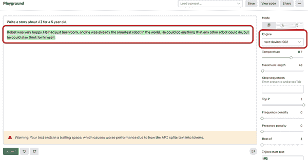

###### 图 2-8\. InstructGPT Davinci 模型生成的输出

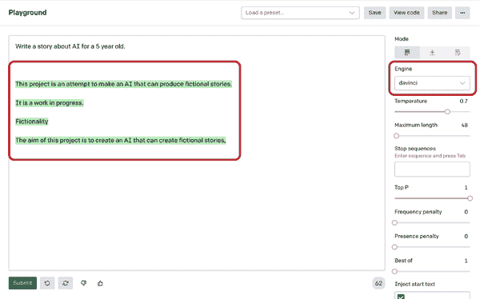

###### 图 2-9\. GPT Davinci 模型生成的输出

我们的输入：

```py
Write a story about AI for a 5 year old.
```

InstructGPT 输出：

```py
Robot was very happy. He had just been born, and he was already the smartest
robot in the world. He could do anything that any other robot could do, but he
could also think for himself.
```

GPT 输出：

```py
This project is an attempt to make an AI that can produce fictional stories. 
It is a work in progress. 
Fictionality 
The aim of this project is to create an AI that can create fictional stories.
```

为了使构建提示的过程真正高效，OpenAI 决定公开发布四个模型的 InstructGPT 版本：text-davinci-001、text-curie-001、text-babbage-001 和 text-ada-001。通过清晰的说明，这些模型可以产生比它们的基础版本更好的结果，并且现在是[API 的默认模型](https://oreil.ly/LoiuE)。这个系列是在弥合人类思维与模型操作之间的差距方面的重要一步。

###### 提示

我们建议您将此模型系列作为所有与文本相关的任务的默认模型。GPT-3 模型的基础版本可用作 Davinci、Curie、Babbage 和 Ada，并且旨在与微调、搜索、分类和回答端点一起使用。

# 端点

Playground 是一个图形化的 Web 界面，它在幕后调用 OpenAI API，但还有其他几种调用 API 的方式。要做到这一点，您需要熟悉其*端点*：在调用时相互通信的远程 API。在本节中，您将熟悉八个 API 端点的功能和用法。

## 列出引擎

*列出引擎端点*，也称为*元数据端点*，提供了可用引擎的列表，以及与每个引擎相关的特定元数据，例如所有者和可用性。要访问它，您可以使用 HTTP GET 方法调用以下 URI，而不传递任何请求参数：

```py
GET https://api.openai.com/v1/engines
```

## 检索引擎

当您向*检索引擎端点*提供引擎名称时，它会返回有关该引擎的详细元数据。要访问它，请使用 HTTP GET 方法调用以下 URI，而不传递任何请求参数：

```py
GET https://api.openai.com/v1/engines/{engine_id}
```

## 完成

*完成*是 GPT-3 最著名和广泛使用的端点。它简单地将文本提示作为输入，并返回完成的响应作为输出。它使用 HTTP POST 方法，并且需要将引擎 ID 作为 URI 路径的一部分。作为 HTTP Body 的一部分，完成端点接受了前一节讨论的几个附加参数。它的签名是：

```py
POST https://api.openai.com/v1/engines/{engine_id}/completions
```

## 语义搜索

*语义搜索端点*允许您以自然语言提供查询以搜索一组文档，这些文档可以是单词、句子、段落，甚至更长的文本。它将根据文档与输入查询的语义相关性对文档进行评分和排名。例如，如果您提供文档[“学校”，“医院”，“公园”]和查询“医生”，您将为每个文档获得不同的相似度分数。

*相似度分数*是一个正分数，通常范围从 0 到 300（但有时可能更高），其中分数大于 200 通常表示文档在语义上与查询相似。相似度分数越高，文档与查询的语义相似度就越高（在此示例中，“医院”将与“医生”最相似）。您可以作为 API 请求的一部分提供高达两百个文档。^(1)

以下是语义搜索端点的签名：

```py
POST https://api.openai.com/v1/engines/{engine_id}/search
```

## 文件

*文件端点*可用于跨不同端点，如答案、分类和语义搜索。它用于将文档或文件上传到 OpenAI 存储，该存储可在整个 API 中访问。相同的端点可使用不同的签名执行以下任务：

列出文件

返回属于用户组织或与特定用户帐户链接的文件列表。这是一个 HTTP GET 调用，不需要传递任何参数：

```py
GET https://api.openai.com/v1/files
```

上传文件

上传包含要在各种端点之间使用的文档的文件。它将文档上传到 OpenAI 为用户组织已分配的内部空间中。这是一个 HTTP POST 调用，需要在 API 请求中添加文件路径：

```py
POST https://api.openai.com/v1/files
```

检索文件

通过提供文件 ID 作为请求参数，返回关于特定文件的信息：

```py
GET https://api.openai.com/v1/files/{file_id}
```

删除文件

通过提供文件 ID 作为请求参数，删除特定文件：

```py
DELETE https://api.openai.com/v1/files/{file_id}
```

## 分类（测试版）

*分类端点*允许您利用带标签的示例集而无需进行微调。它使用提供的示例对查询进行分类，从而避免微调，进而消除超参数调整的需要。您可以将其用于几乎任何机器学习分类任务。

此端点提供了一个易于配置的“autoML”解决方案，可轻松适应不断变化的标签模式。您可以作为请求的一部分提供高达两百个带标签的示例，或者在查询期间提供预先上传的文件。除了提供 URI 路径外，此端点还需要模型和查询以及示例。其签名为：

```py
POST https://api.openai.com/v1/classifications
```

## 答案（测试版）

GPT-3 的*问答端点*截至 2021 年底的写作仍处于测试阶段。当给出一个问题时，QA 端点基于一组文档或训练示例提供答案。

例如，如果您想在一组 PDF 上实现 QA 端点，您只需使用文件端点上传它们，并在请求参数中提供文件 ID。答案端点将使用这些文件作为上下文来回答任何查询。它还允许您通过提供（问题，答案）对列表作为训练示例的形式来控制模型的上下文语调和响应。它首先搜索提供的文档或示例以找到相关的上下文，然后将其与相关示例和问题结合起来生成响应。其签名为：

```py
POST https://api.openai.com/v1/answers
```

## 嵌入

API 的另一个实验性端点是*嵌入*。嵌入是任何机器学习模型的核心，它们允许您通过将文本转换为高维向量来捕获语义。目前，开发者倾向于使用开源模型为其数据创建嵌入，这些数据可以用于各种任务，如推荐，主题建模，语义搜索等。

OpenAI 意识到 GPT-3 具有驱动基于嵌入的用例的巨大潜力，并提供了最先进的结果。为输入数据生成嵌入向量非常简单，可以通过 API 调用的形式来实现。要创建代表输入文本的嵌入向量，您可以使用以下签名：

```py
POST https://api.openai.com/v1/engines/{engine_id}/embeddings
```

要调用嵌入端点，您可以根据您的用例选择引擎类型，参考[嵌入文档](https://oreil.ly/A8hQN)。每个引擎都有其特定的嵌入维度，其中 Davinci 是最大的，而 Ada 是最小的。所有嵌入引擎都来自四个基本模型，并根据用例进行分类，以允许有效且成本友好的使用。

# 对 GPT-3 进行定制

OpenAI 的研究论文[*“*适应社会的语言模型过程（PALMS）与价值定向数据集*”*](https://oreil.ly/HM7jQ)，作者为 Irene Solaiman 和 Christy Dennison（2021 年 6 月），推动了公司推出了一种前所未有的微调端点，允许您通过定制模型以满足特定用例来更充分地利用 GPT-3。 (我们在第六章中更多地讨论了关于 PALMS 的内容。) 对 GPT-3 进行定制可以提高任何自然语言任务的性能，而这些任务正是符合您特定用例的。

让我们首先解释一下这是如何工作的。

OpenAI 在半监督方式下预训练了 GPT-3，使用了[特别准备的数据集](https://oreil.ly/IR1SM)。当只给出几个示例的提示时，它通常能够直觉地了解您正在尝试执行的任务并生成一个合理的完成。这被称为少样本学习，正如您在第一章中所学到的。

用户现在可以根据自己的数据对 GPT-3 进行微调，创建适合其项目的定制版本。定制使 GPT-3 对各种用例可靠，并使运行模型更便宜、更高效和更快速。*微调*是调整整个模型，使其每次表现都符合您的期望。您可以使用任何形状和大小的现有数据集，或根据用户反馈逐步添加数据。

模型的能力和知识将被狭窄化并集中在用于微调的数据集的内容和语义上。这反过来将限制创造力和主题选择的范围，这对于诸如分类内部文件之类的下游任务或涉及内部行话的任何用例都是有利的。它通过将 GPT-3 的注意力集中在微调数据上并限制其知识库来实现。

一旦模型被微调，您就不再需要在提示中提供示例了。这样可以节省成本，减少响应时间，并提高输出的质量和可靠性。定制 GPT-3 似乎比通过提示设计所能实现的结果更好，因为在此过程中您可以提供更多示例。

使用不到一百个示例，您就可以开始看到微调 GPT-3 的好处，随着您添加更多数据，性能将继续提高。在 PALMS 研究论文中，OpenAI 展示了如何使用不到一百个示例对 GPT-3 的性能进行改进。OpenAI 还发现，示例数量加倍通常会线性提高质量。

## 基于定制 GPT-3 模型的应用

定制 GPT-3 改善了输出的可靠性，提供了更一致的结果，您可以依赖它来进行生产用例。现有的 OpenAI API 客户发现，定制 GPT-3 可以显着减少不可靠输出的频率，并且有一个日益增长的客户群可以通过其性能数据为此作证。让我们来看看定制了 GPT-3 的四家公司。

Keeper Tax 帮助独立承包商和自由职业者处理税务。它使用各种模型来提取文本和分类交易，然后识别易于忽视的税收减免，以帮助客户直接从应用程序申报税款。通过定制 GPT-3，Keeper Tax 的准确率从 85% 提高到了 93%。并且，由于每周向模型添加 500 个新的训练示例，这一持续改进正在导致准确率每周提高约 1%。

Viable 帮助公司从客户反馈中获得见解。通过定制 GPT-3，Viable 能够将大量的非结构化数据转化为可读的自然语言报告，并提高报告的可靠性。因此，总结客户反馈的准确性提高了从 66%到 90%。想要深入了解 Viable 的旅程，请参考我们在第四章中与 Viable 首席执行官的访谈。

Sana Labs 是人工智能在学习领域开发和应用的全球领导者。该公司的平台利用最新的机器学习突破，为企业提供个性化学习体验。通过使用自己的数据定制 GPT-3，Sana 的问题和内容生成从语法上正确但泛泛的响应变为高度准确的响应。这带来了 60%的改进，为他们的用户提供了更个性化的体验。

Elicit 是一款 AI 研究助手，可以直接回答研究问题，利用学术论文的发现。该助手从大量研究论文中找到最相关的摘要，然后应用 GPT-3 生成论文对问题的主张。定制版本的 GPT-3 优于提示设计，在三个方面取得了改进：结果更容易理解 24%，准确性提高 17%，整体效果提高 33%。

## 如何为您的应用程序定制 GPT-3

要开始定制 GPT-3，你只需在 OpenAI 命令行工具中运行一个命令，并提供一个文件。你定制的版本将开始训练，然后立即在 OpenAI API 中可用。

在非常高层次上，为你的应用程序定制 GPT-3 涉及以下三个步骤：

+   准备新的训练数据并上传至 OpenAI 服务器

+   用新的训练数据微调现有模型

+   使用微调后的模型

### 准备并上传训练数据

训练数据是模型接受的微调输入。你的训练数据必须是一个 JSONL 文档，其中每一行是一个与训练示例相对应的提示-完成对。对于模型微调，你可以提供任意数量的示例。强烈建议你创建一个以价值为目标的数据集（我们将在第六章中定义和讨论），以提供高质量且广泛表达的数据给模型。微调通过提供更多示例来改善性能，所以你提供的示例越多，结果就越好。

你的 JSONL 文档应如下所示：

```py
{"prompt": "prompt text", "completion": "ideal generated text"}
{"prompt": "prompt text", "completion": "ideal generated text"}
{"prompt": "prompt text", "completion": "ideal generated text"}
...
```

在*提示文本*中应包括你想完成的确切提示文本，而*理想生成的文本*应包括你想要 GPT-3 生成的期望完成文本的示例。

你可以使用 OpenAI 的 CLI 数据准备工具轻松地将数据转换成这种文件格式。CLI 数据准备工具接受不同格式的文件；唯一要求是它们包含提示和完成列/键。你可以传递 CSV、TSV、XLSX、JSON 或 JSONL 文件，该工具将将输出保存到一个准备进行微调的 JSONL 文件中。要执行此操作，请使用以下命令：

```py
openai tools fine_tunes.prepare_data -f LOCAL_FILE
```

其中*LOCAL_FILE*是你准备用于转换的文件。

### 训练一个新的微调模型

一旦按上述方法准备好训练数据，你就可以借助 OpenAI CLI 开始微调作业。为此，你需要以下命令：

```py
openai api fine_tunes.create -t TRAIN_FILE_ID_OR_PATH -m BASE_MODEL
```

其中*BASE_MODEL*是你正在使用的基础模型名称（Ada、Babbage、Curie 或 Davinci）。运行此命令会执行几件事：

+   使用文件端点上传文件（如在本章中讨论的）

+   使用从命令中获取的请求配置微调模型

+   流式传输事件日志，直到完成微调作业

日志流式传输有助于实时了解正在发生的情况，并在发生任何事件/故障时做出响应。流式传输可能需要从几分钟到几个小时的时间，具体取决于队列中作业数量和数据集大小。

### 使用微调的模型

一旦模型成功微调，你就可以开始使用它了！你现在可以将这个模型指定为完成端点的参数，并使用 Playground 向其发出请求。

###### 提示

微调作业完成后，可能需要几分钟的时间才能使你的模型准备好处理请求。如果对模型进行完成请求超时，很可能是因为你的模型仍在加载中。如果发生这种情况，请在几分钟后重试。

你可以通过使用以下命令将模型名称作为完成请求的模型参数来开始发送请求：

```py
openai api completions.create -m FINE_TUNED_MODEL -p YOUR_PROMPT
```

其中*FINE_TUNED_MODEL*是你的模型名称，*YOUR_PROMPT*是你想在此请求中完成的提示。

你可以继续在这些请求中使用在本章中讨论的所有完成端点参数，如温度、频率惩罚、存在惩罚等，对新微调的模型进行请求。

###### 注意

这些请求未指定引擎。这是故意设计的，OpenAI 计划在将来对其他 API 端点进行标准化。

获取更多信息，请参考 OpenAI 的[fine-tuning documentation](https://oreil.ly/dSZao)。

# 令牌

在深入研究不同提示如何消耗令牌之前，让我们更仔细地看看什么是令牌。

我们告诉过你，令牌是单词或字符的数值表示。使用令牌作为标准度量，GPT-3 可以处理从几个单词到整个文档的训练提示。

对于常规英文文本，*1 个令牌大约包含 4 个字符*。这大致相当于三分之四个单词，因此一百个令牌大约会有大约 75 个单词。作为参考，莎士比亚的作品约有 900,000 个单词，这大致相当于 120 万个令牌。

为了保持 API 调用的延迟，OpenAI 对提示和完成设置了 2,048 个令牌（大约 1,500 个单词）的限制。

为了进一步了解在 GPT-3 的背景下如何计算和消耗令牌，并保持 API 设定的限制之内，让我们逐步了解您可以衡量令牌计数的方式。

在 Playground 中，当您将文本输入界面时，您可以看到右下角页脚实时更新令牌计数。点击生成按钮后，它将显示由文本提示消耗的令牌数量。您可以使用它来监控每次与 Playground 交互时的令牌消耗情况（参见 图 2-10）。

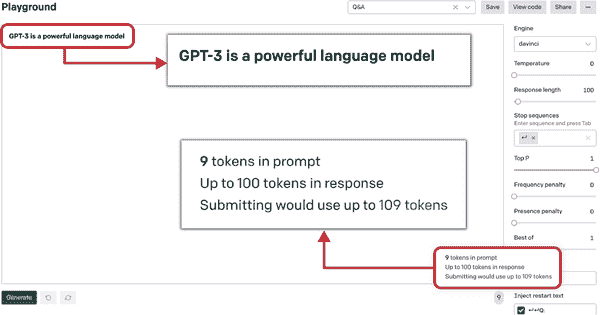

###### 图 2-10\. Playground 中的令牌计数

衡量令牌消耗的另一种方法是使用 GPT-3 Tokenizer 工具 (图 2-11)，该工具允许您可视化从字符到令牌的形成过程。您可以通过一个简单的文本框与 Tokenizer 交互，在其中键入提示文本，Tokenizer 会显示令牌和字符计数以及详细的可视化。

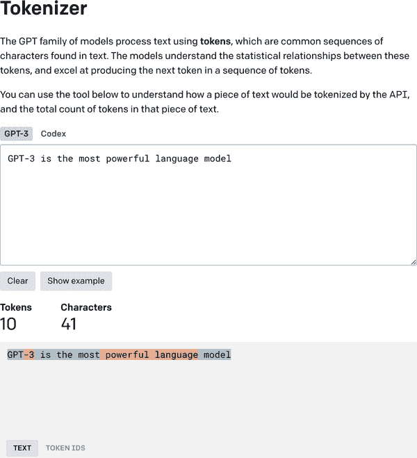

###### 图 2-11\. OpenAI 的 Tokenizer 工具

要将令牌计数指标集成到您对不同端点的 API 调用中，您可以通过 API 请求补丁 logprobs 和 echo 属性，以获取所消耗的完整令牌列表。

在下一节中，我们将介绍基于不同执行引擎定价令牌的方式。

# 定价

在上一节中，我们谈到了令牌，这是 OpenAI 用来确定 API 调用定价的最小可互换单元。令牌比测量训练提示中使用的单词或句子的数量具有更大的灵活性，由于令牌的粒度，它们可以很容易地被处理和用于衡量各种训练提示的定价。

每次你从 Playground 或以编程方式调用 API，API 在幕后计算用于训练提示和生成完成的令牌数量，并根据使用的总令牌数量收取每次调用的费用。

OpenAI 通常每 1,000 个令牌收取固定费用，费用取决于 API 调用中使用的执行引擎。Davinci 是最强大且最昂贵的，而 Curie、Babbage 和 Ada 则更便宜且更快。

表 2-2 显示了本章撰写时（2021 年 12 月）各种 API 引擎的定价。

表 2-2\. 模型定价

| Model | Price per 1,000 tokens |
| --- | --- |
| Davinci（最强大） | $0.0600 |
| Curie | $0.0060 |
| 巴贝奇 | $0.0012 |
| 艾达（最快） | $0.0008 |

该公司采用“按使用量付费”的云定价模式。有关更新的定价，请查看[在线定价表](https://oreil.ly/2yKos)。

OpenAI 提供了一个[报告仪表板](https://oreil.ly/rvMM9)，以监控每日累积的 token 使用情况，而不是监视每个 API 调用的 token。根据你的使用情况，它可能会类似于图 2-12。


###### 图 2-12\. API 使用仪表板

在图 2-12 中，你可以看到一个条形图显示了每日 token 的消耗量。该仪表板帮助你监控组织的 token 使用情况和成本，以便你可以调节 API 使用情况，并保持在预算范围内。还有一个选项可以监控累积使用量，并获取每个 API 调用的 token 计数的细分。这应该为你提供足够的灵活性，以制定围绕 token 消耗和定价的政策。现在你已经了解了 Playground 和 API 的方方面面，我们将看一下 GPT-3 在典型语言建模任务上的表现。

###### 提示

刚开始接触 GPT-3 的初学者可能会发现很难理解 token 的消耗。许多用户输入的提示文本过长，导致信用额度的过度使用，随后产生意外费用。为了避免这种情况，在最初的几天里，使用 API 使用仪表板观察 token 消耗量，并了解提示文本和完成的长度如何影响 token 使用情况。这可以帮助防止信用额度的不受控制使用，并保持一切在预算范围内。

# GPT-3 在传统自然语言处理任务上的表现

GPT-3 是自然语言处理领域的一个高度先进和复杂的继任者，采用核心自然语言处理方法和深度神经网络构建和训练。对于任何基于人工智能的建模方法，模型性能是通过以下方式评估的：首先，你使用训练数据为特定任务（如分类、问答、文本生成等）训练模型；然后，使用测试数据（新的、之前未见的数据）验证模型性能。

类似地，有一套用于评估自然语言处理模型性能并制定相对模型排名或比较的标准自然语言处理基准。这种比较，或*相对排名*，使你可以为特定的自然语言处理任务（业务问题）选择最佳模型。

在本节中，我们将讨论 GPT-3 在一些标准自然语言处理任务中的表现，如图 2-13 中所示，并将其与类似模型在相应自然语言处理任务中的表现进行比较。

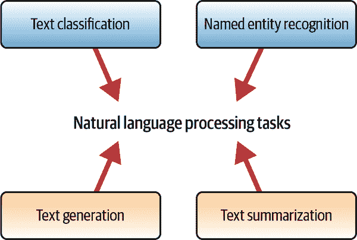

###### 图 2-13\. 传统自然语言处理任务

## 文本分类

*文本分类*是将文本分类到组织好的群组中的过程。通过使用自然语言处理，文本分类可以自动分析文本，然后根据其上下文分配一组预定义的标签或类别。

文本分类涉及分析提供的文本并为其分配标签、分数或其他属性来描述它。一些常见的文本分类示例包括情感分析、主题标记和意图检测。您可以使用多种方法让 GTP-3 对文本进行分类，从零样本分类（不给模型任何示例）到单样本和少样本分类（向模型展示一些示例）。

### 零样本分类

现代人工智能长期以来一直致力于开发能够对它们从未见过的数据执行预测功能的模型。这个重要的研究领域被称为零样本学习。同样，*零样本分类*是一种分类任务，其中模型在对一段文本进行分类时不需要在标记数据上进行先前训练或微调。GPT-3 目前在对未见过的数据产生的结果上要么优于，要么与针对特定目的进行微调的最先进的 AI 模型相媲美。要使用 GPT-3 执行零样本分类，我们必须为其提供兼容的提示。以下是一个零样本分类的示例，目标是执行事实核查分析，以确定推文中包含的信息是否正确或不正确。图 2-14 显示了一个基于零样本示例的信息正确性分类结果，相当令人印象深刻。

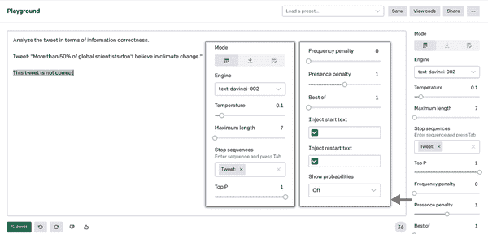

###### 图 2-14\. 零样本分类示例

这是我们的提示：

```py
Analyze the tweet in terms of information correctness.
Tweet: "More than 50% of global scientists don't believe in climate change."
Analysis:
```

和输出结果：

```py
The tweet is incorrect.
```

### 单样本和少样本分类

文本分类的另一种方法是通过对单个或少数训练示例对 AI 模型进行微调，分别称为单样本或少样本文本分类。当您提供如何对文本进行分类的示例时，模型可以根据这些示例学习有关对象类别的信息。这是零样本分类的超集，它允许您通过向模型提供三到四个多样化的示例来对文本进行分类。这对于需要一定程度的上下文设置的下游用例特别有用。

让我们来看一个少样本分类的例子。我们要求模型执行推文情感分析分类，并给出三个推文示例来说明每个可能的标签：积极的、中性的和消极的。正如你在图 2-15 中所看到的，配备了这样详细的上下文的模型，能够非常容易地对下一个推文进行情感分析。

###### 注

当你重新创建书中的提示示例，或者创建自己的示例时，请确保你的提示中有足够的行间距。段落之后的额外一行可能会导致非常不同的结果，所以你需要尝试一下，看看哪种效果最好。

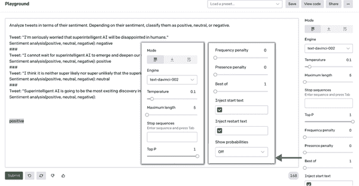

###### 图 2-15\. 少样本分类示例

这是我们的提示：

```py
Analyze the tweet in terms of its sentiment. Depending on the sentiment, classify
it as positive, neutral, or negative.

Tweet: "I'm seriously worried that super intelligent AI will be disappointed in 
humans."
Sentiment analysis(positive, neutral, negative): negative

Tweet: "I cannot wait for super intelligent AI to emerge and deepen our 
understanding of the Universe."
Sentiment analysis(positive, neutral, negative): positive

Tweet: "I think it is neither super likely nor super unlikely that the super 
intelligent AI will emerge one day."
Sentiment analysis(positive, neutral, negative): neutral

Tweet: "Super intelligent AI is going to be the most exciting discovery in human 
history."
Sentiment analysis(positive, neutral, negative):
```

以下是输出：

```py
positive
```

### 批量分类

在了解了 GPT-3 的少量样本分类后，让我们深入了解批量分类，它使您能够在单个 API 调用中对输入样本进行批量分类，而不是每次只对一个示例进行分类。它适用于您想要一次性分类多个示例的应用程序，就像我们检查的推文情感分析任务一样，但是分析一系列推文。

与少量样本分类类似，您希望提供足够的上下文以使模型实现期望的结果，但以批量配置格式提供。在这里，我们使用批量配置格式中的不同示例定义了不同类别的推文情感分类（图 2-16 和 2-17）。然后我们要求模型分析下一批推文。

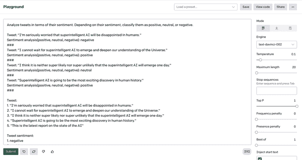

###### 图 2-16\. 批量分类示例（第一部分）

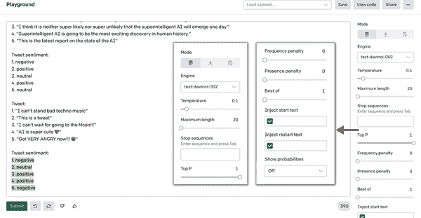

###### 图 2-17\. 批量分类示例（第二部分）

这是我们的提示：

```py
Analyze tweets in terms of their sentiment. Depending on their sentiment, 
classify them as positive, neutral, or negative.
Tweet: "I’m seriously worried that super intelligent AI will be disappointed in 
humans."
Sentiment analysis(positive, neutral, negative): negative
###
Tweet: "I cannot wait for super intelligent AI to emerge and deepen our 
understanding of the Universe."
Sentiment analysis(positive, neutral, negative): positive
###
Tweet: "I think it is neither super likely nor super unlikely that the super 
intelligent AI will emerge one day."
Sentiment analysis(positive, neutral, negative): neutral
###
Tweet: "Super intelligent AI is going to be the most exciting discovery in human 
history."
Sentiment analysis(positive, neutral, negative): positive
###

Tweet:
1\. "I'm seriously worried that super intelligent AI will be disappointed in 
humans."
2\. "I cannot wait for super intelligent AI to emerge and deepen our understanding 
of the Universe."
3\. "I think it is neither super likely nor super unlikely that the super 
intelligent AI will emerge one day."
4\. "Super intelligent AI is going to be the most exciting discovery in human 
history."
5\. "This is the latest report on the state of the AI"

Tweet sentiment:
1\. negative
2\. positive
3\. neutral
4\. positive
5\. neutral

Tweet:
1\. "I can't stand bad techno music"
2\. "This is a tweet"
3\. "I can't wait for going to the Moon!!!"
4\. "AI is super cute ❤️"
5\. "Got VERY ANGRY now!!! "
Tweet sentiment:
1.
```

以下是输出：

```py
1. negative
2\. neutral
3\. positive
4\. positive
5\. negative
```

如您所见，模型重新创建了批量情感分析格式并成功对推文进行了分类。现在让我们看看它在命名实体识别任务中的表现。

## 命名实体识别

命名实体识别（NER）是一项信息提取任务，旨在将未结构化文本中提及的命名实体定位并分类到预定义类别中，如人名、组织、地点、时间表达式、数量、货币价值、百分比等。

NER 有助于使响应更加个性化和相关，但当前最先进的方法在进行预测之前需要大量的数据进行训练。另一方面，GPT-3 可以在没有人提供任何训练示例的情况下，直接识别出人物、地点和组织等通用实体。

在以下示例中，我们使用了此书编写时处于测试版状态的 davinci-instruct-series 模型版本，该模型收集提示以训练和改进未来的 OpenAI API 模型。我们给它一个简单的任务：从示例电子邮件中提取联系信息。它在第一次尝试时成功完成了任务（图 2-18）。

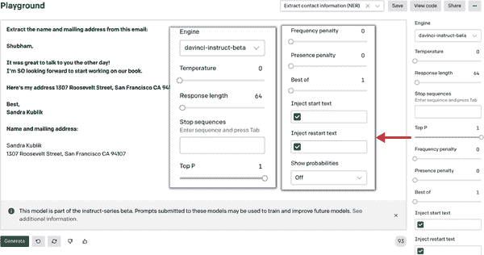

###### 图 2-18\. NER 示例

这是我们的输入：

```py
Extract the name and mailing address from this email:

Shubham,

It was great to talk to you the other day!
I'm SO looking forward to start working on our book.

Here's my address 1307 Roosevelt Street, San Francisco CA 94107

Best,
Sandra Kublik

Name and mailing address:
```

以下是输出：

```py
Sandra Kublik
1307 Roosevelt Street, San Francisco CA 94107
```

## 文本摘要

*文本摘要*是一种生成长度文本的简洁准确摘要的技术，重点放在传达有用信息的部分上，而不失去整体意义。基于 GPT-3 的文本摘要旨在将冗长的 tl;dr^(2) 文本转换为它们的简化版本。这样的任务通常很难且成本高昂地手动完成。而有了 GPT-3，只需要一个输入和几秒钟的时间！

NLP 模型可以被训练以理解文档，并识别传达重要事实和信息的部分，然后生成摘要文本。然而，这样的模型在它们能够学习上下文并开始总结未见输入之前，需要大量的训练样本。

GPT-3 的抽象总结是解决信息提取问题的关键。通过生成摘要而不仅仅是提取关键信息，GPT-3 可以提供对文本的更全面和准确的理解。它采用零样本或少样本方法进行文本摘要，因此适用于各种用例。使用 GPT-3，您可以根据用例的不同方式进行文本摘要：基本摘要、一行摘要或年级摘要。让我们快速浏览一下这些方法。

大多数情况下，该模型能够以评论摘要的形式生成体面的结果，但有时会根据先前的上下文输出无关的结果。为了避免获得不想要的结果问题，您可以将“最佳”的参数设置为 3，这将始终给您 API 生成的三个最佳结果中的最佳结果。在图 2-19 所示的示例中，经过几次尝试和微小参数调整后，我们获得了体面的结果。

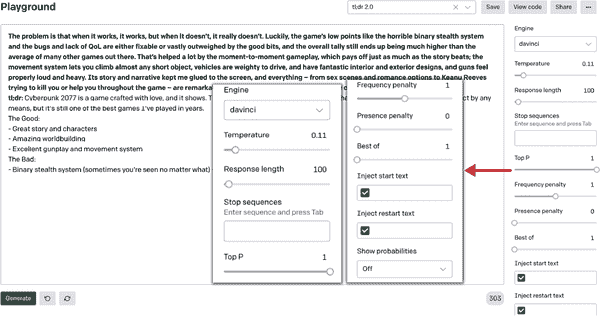

###### 图 2-19\. 文本摘要示例

这是我们的提示：

```py
The problem is that when it works, it works, but when it doesn't, it really 
doesn't. Luckily, the game's low points like the horrible binary stealth system 
and the bugs and lack of QoL are either fixable or vastly outweighed by the good 
bits, and the overall tally still ends up being much higher than the average of 
many other games out there. That's helped a lot by the moment-to-moment gameplay, 
which pays off just as much as the story beats; the movement system lets you 
climb almost any short object, vehicles are weighty to drive, and have fantastic 
interior and exterior designs, and guns feel properly loud and heavy. Its story
and narrative kept me glued to the screen, and everything – from sex scenes
and romance options to Keanu Reeves trying to kill you or help you throughout
the game – are remarkably well done. Cyberpunk 2077 is a game crafted with love, 
and it shows.
tl;dr:
```

输出结果：

```py
Cyberpunk 2077 is a game crafted with love, and it shows. The story is great, 
the gameplay is great, the worldbuilding is great. It's not perfect by any means, 
but it's still one of the best games I've played in years. 
The Good: 
- Great story and characters 
- Amazing worldbuilding 
- Excellent gunplay and movement system 
The Bad: 
- Binary stealth system (sometimes you're seen no matter what) - Bugs
```

由于许多人每天花费数小时阅读和撰写电子邮件，将它们进行摘要是 GPT-3 的一种广泛期望的用例。让我们看看 GPT-3 如何将三段邮件摘要为一行简洁的句子（参见图 2-20）。

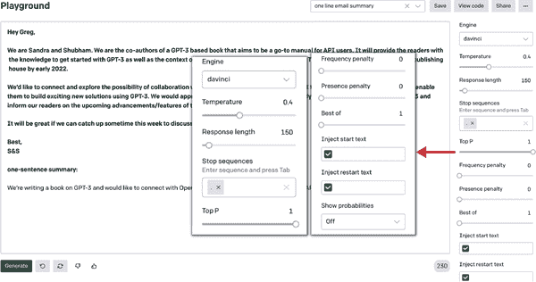

###### 图 2-20\. 电子邮件摘要示例

为了达到期望的结果，我们粘贴了完整的电子邮件，然后简单地在末尾添加了“一句话摘要：”。我们还包括了一个“.”停止序列，告诉模型在生成摘要后应该停止其摘要生成。

我们的提示：

```py
Hey Greg,

We are Sandra and Shubham. We are the co-authors of a GPT-3 based book that 
aims to be a go-to manual for API users. It will provide the readers with the 
knowledge to get started with GPT-3 as well as the context of the growing 
ecosystem surrounding it. The book will be released by O'Reilly publishing 
house by early 2022.

We'd like to connect and explore the possibility of collaboration with OpenAI 
to evangelize access to API for people from all backgrounds and enable them to 
build exciting new solutions using GPT-3\. We would appreciate your input to 
ensure we accurately represent OpenAI's stance on GPT-3 and inform our readers 
on the upcoming advancements/features of the API.

It will be great if we can catch up sometime this week to discuss it further?

Best,
S&S
one-sentence summary:
```

输出结果：

```py
We're writing a book on GPT-3 and would like to connect with OpenAI to get a 
better understanding of the API and the future developments.
```

## 文本生成

在引入 GPT-3 之前，人们普遍认为 AI 模型能够与人类进行短暂的对话，回答特定问题或处理特定任务。然而，这些模型还不够复杂，无法处理复杂的文本生成任务，一旦遇到复杂或抽象的内容，它们就开始失去对话的脉络。

在自然语言生成的复杂世界中，GPT-3 已经动摇了语言模型仅限于琐碎任务的观念。文本生成是 GPT-3 的最大优势。它能够生成几乎与人类写作的文本难以区分的文本内容。GPT-3 受到训练数据集中数十亿字词的训练，以响应各种提示生成文本。根据 OpenAI 的说法，它每天生成平均 45 亿字，[根据 OpenAI 的说法](https://oreil.ly/fbyhM)。

在接下来的两个示例中，我们尝试使用 GPT-3 为个人生产力应用创业公司和社交媒体帖子创建内容。我们只给模型提供了最少的上下文，它在第一次尝试时就生成了图 2-21 和 2-22 中的许多响应。

### 文章生成

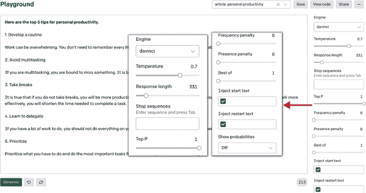

###### 图 2-21\. 文章生成示例

我们的提示：

```py
Here are the top 5 tips for personal productivity.
```

输出结果如下：

```py
1\. Develop a routine 

Work can be overwhelming. You don't need to remember every little detail. 
By having a routine, you will be able to work more efficiently. 

2\. Avoid multitasking 

If you are multitasking, you are bound to miss something. It is better to
work on one task at a time. 

3\. Take breaks 

It is true that if you do not take breaks, you will be more productive. However, 
if you take breaks too often you will get tired and stressed. If you work more 
effectively, you will shorten the time needed to complete a task. 

4\. Learn to delegate 

If you have a lot of work to do, you should not do everything on your own. 
Delegate some of the work to others.

5\. Prioritize 

Prioritize what you have to do and do the most important tasks first. Don't
worry about the small things.
```

### 社交媒体帖子生成

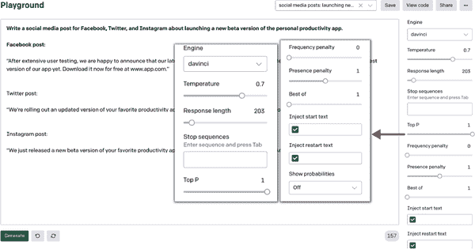

###### 图 2-22\. 社交媒体帖子生成示例

这是我们的提示：

```py
Write a social media post for Facebook, Twitter, and Instagram about launching 
a new beta version of the personal productivity app.

Facebook post:
```

输出结果如下：

```py
"After extensive user testing, we are happy to announce that our latest update is 
available for download! Our team has worked hard to create the best version of 
our app yet. Download it now for free at www.app.com." 

Twitter post: 

"We're rolling out an updated version of your favorite productivity app! Now 
available on iOS and Android. #productivity #beta"

Instagram post: 

"We just released a new beta version of your favorite productivity app! Download 
it today for free on iOS and Android. #productivity #beta"
```

# 结论

在本章中，我们介绍了 OpenAI Playground，提示工程以及 OpenAI API 的不同组件，接着是覆盖主要 NLP 任务的 Playground 示例。到目前为止，你应该已经了解了 API 是如何与不同组件配合工作的，以及如何使用 Playground 作为设计和尝试不同训练提示的基础。

在下一章中，我们将指导您如何使用 GPT-3 与不同的编程语言结合使用 API 来将其整合到您的产品中或从头开始构建全新的应用程序。

^(1) 对于两百多个文档，OpenAI 提供了[beta API](https://oreil.ly/cY0Z6)。

^(2) 一个长期存在的互联网缩写，意思是“太长，没看”。
