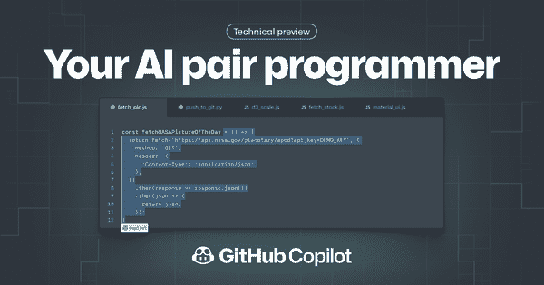

# 第五章：企业的 GPT-3

当新的创新或技术转变发生时，大型企业通常是最后采用的。它们的等级结构由各种专制级别组成，而法律批准和文书工作的标准流程通常限制了试验自由，使得企业难以成为早期采用者。但是对于 GPT-3 来说似乎并非如此。一旦 API 发布，企业就开始尝试使用它。然而，它们遇到了一个重大障碍：数据隐私。

在其最简单的形式中，语言模型所做的就是预测下一个单词，给定一系列先前的单词。正如你在第二章中学到的那样，OpenAI 已经设计了几种技术，将语言模型（如 GPT-3）的功能从简单的下一个单词预测转变为更有用的 NLP 任务，如回答问题、摘要文件和生成特定上下文的文本。通常，通过微调语言模型或使其模仿特定行为来实现最佳结果，方法是使用领域特定数据提供几个示例来对其进行条件化。您可以使用训练提示提供示例，但更健壮的解决方案是使用微调 API 创建定制训练模型。

OpenAI 以开放式 API 的形式提供 GPT-3，用户提供输入数据，API 返回输出数据。对于打算使用 GPT-3 的企业来说，正确保护、处理和处理用户数据是一个关键问题。OpenAI 的 Welinder 指出，尽管企业领导人对 GPT-3 表达了各种关注，“SOC2 合规性、地理围栏和能够在私人网络内运行 API 的能力是其中最大的关注点。”

OpenAI 有关模型安全性和滥用的措施旨在涵盖数据隐私和安全的各种问题。例如，Stenography 的创始人 Bram Adams 告诉我们关于 OpenAI API 的隐私和安全方面。“目前，Stenography 是一个直通 API——就像一条收费公路。这样人们将会把他们的代码传递过去，而不会在任何地方保存或记录。”在这些防护栏之外，Stenography 是[OpenAI 使用条款](https://oreil.ly/qjxIM)的一个超集。

我们与几家公司的代表谈过，了解了阻止他们在生产中使用 OpenAI API 的原因。大多数人都强调了两个常见的关注点：

+   OpenAI 提供的 GPT-3 API 端点不应保留或保存作为模型微调/训练过程的一部分提供给它的任何训练数据的任何部分。

+   在将其数据发送到 OpenAI API 之前，公司希望确保第三方无法通过向 API 提供任何输入来提取或访问数据。

OpenAI 回应了客户关于数据处理和隐私的担忧和问题，提供了安全审查、企业合同、数据处理协议、第三方安全认证工作等。一些客户和 OpenAI 讨论的问题包括客户的数据是否可以用于改善 OpenAI 模型，这可能会提高客户期望用例的性能，但会引发有关数据隐私和内部合规义务的担忧；关于客户数据的存储和保留限制；以及关于数据安全处理和处理的义务。

本章的其余部分将深入探讨三个案例研究，展示了像 GitHub、Microsoft 和 Algolia 这样的全球企业如何处理这些问题，并且如何规模化使用 GPT-3。您还将了解到 OpenAI 如何通过与 Microsoft Azure OpenAI 服务的合作来适应企业级产品的需求。

# 案例研究：GitHub Copilot

让我们从 GitHub Copilot 开始这段旅程，这是 2021 年最热门的产品之一。GitHub Copilot（图 5-1）是一款首创的 AI 协作编程工具，可帮助用户更快地编写代码，减少工作量。GitHub Next 副总裁 Oege de Moor 表示，该产品的使命是“触及所有开发者，最终目标是使编程变得无障碍”。自动化琐碎任务，如编写冗余代码和编写单元测试用例，使开发者能够“专注于工作的真正创造性部分，即决定软件实际应该做什么”，以及“更多地思考产品概念，而不是陷在代码中难以解脱”。

正如 Awan 告诉我们的：“我很兴奋能够在更多的副业项目上工作，因为我知道我将得到 GitHub Copilot 的帮助。现在我几乎就像有了一个联合创始人。Codex 和 Copilot 大约写了我的代码的 2 到 10%，类似这样。所以它已经让我加速了 2 到 10%。而且所有这些都是呈指数增长的。那么明年 GPT-3 会是什么样子？明年 Codex 会是什么样子？我可能会加速 30%。”

让我们深入了解 Copilot 的内部工作原理。

###### 图 5-1。GitHub Copilot

## 工作原理

GitHub Copilot 根据您正在处理的代码提取上下文，基于诸如文档字符串、注释和函数名称等内容。然后，它会在编辑器内自动建议下一行，甚至整个函数，以生成样板代码并建议匹配代码实现的测试用例。它通过使用用户代码编辑器的插件与广泛的框架和编程语言一起工作，使其几乎与语言无关，同时轻量且易于使用。

OpenAI 研究科学家哈里·爱德华兹指出，Copilot 对于在新语言或框架中工作的程序员也是一个有用的工具：“试图通过搜索一切来编写不熟悉的语言的代码，就像只带着一本短语书在陌生的国家里导航。使用 GitHub Copilot 就像雇佣了一名翻译。”

GitHub Copilot 由 OpenAI 的 Codex 提供支持，这是 GPT-3 模型的后裔，正如我们在 Chapter 4 中所述，它专门设计用于解释和编写代码。“GitHub 是超过 7300 万开发者的家园，[包括] 包含了社区集体知识的大量公开数据，”德莫尔说。这意味着 Codex 有数十亿行可供训练的公开可用代码。它理解编程语言和人类语言。

Codex 依靠支持性评论或简单英语指令来生成相关代码，如 Figure 5-2 所示。Copilot 编辑器扩展智能地选择要发送到 GitHub Copilot 服务的上下文，后者运行 OpenAI 的 Codex 模型来合成建议。尽管 Copilot 生成代码，用户仍然有掌控权：你可以浏览建议的选项，选择接受或拒绝，以及手动编辑建议的代码。GitHub Copilot 会根据你所做的编辑进行调整，并匹配你的编码风格。德莫尔解释说：“它将自然语言与源代码链接起来，这样你就可以在两个方向上使用它。你可以使用源代码生成注释，也可以使用注释生成源代码，使其具有极大的功能。”

和当你将神经网络扩展到一个显著规模时结果会消失。通过传统的深度学习，一直以来都是规模小，参数较少的模型是一种规范，以避免消失梯度问题，并在模型训练过程中引入复杂性。自从成立以来，“简单模型是最好的模型”的奥卡姆剃刀在人工智能社区中一直是神圣不可侵犯的原则。这个原则一直是训练新模型的参考中心，这阻碍了人们对规模进行实验的积极性。

2020 年，当 OpenAI 推出其标志性语言模型 GPT-3 时，扩展的潜力开始受到关注，人们对人工智能社区的普遍观念开始发生变化。人们开始意识到“规模的赠予”可以产生更广义的人工智能，其中像 GPT-3 这样的单一模型可以执行一系列任务。

托管和管理像 GPT-3 这样的模型需要在许多不同层面上的精湛技术，包括模型架构的优化、其部署以及公众如何访问它。德·莫尔告诉我们：“当我们推出 Copilot 时，它在最初阶段使用的是 OpenAI API 基础设施，然后在推出后，我们迎来了大量的回应，有那么多人注册并想要使用这个产品。”

尽管 API 能够处理大量的请求，但实际的请求数量及其频率仍然让 OpenAI 团队感到惊讶。德·莫尔和他的团队“意识到需要一个更高效、更大的基础设施来进行部署，幸运的是，微软 Azure OpenAI 正好在那个时候浮出水面”，使他们能够进行所需的 Azure 部署基础设施转换。

当我们询问关于构建和扩展 Copilot 的经验时，德·莫尔分享道：“早期我们曾有一个误导性的信念，即准确性是唯一最重要的事情，但在产品发展的过程中，我们意识到实际上是强大的人工智能模型和无瑕的用户体验之间存在着权衡。” Copilot 团队很快意识到，速度与建议准确性之间存在权衡，就像任何足够规模的深度学习模型一样。

一般来说，深度学习模型的层数越多，它的准确性就越高。然而，更多的层也意味着运行速度会变慢。Copilot 团队不得不在两者之间找到平衡，正如德·莫尔所解释的那样：“我们的用例要求模型以闪电般的速度提供响应，并提供多个备选建议；如果速度不够快，用户很容易就会超过模型并自己编写代码。因此，我们发现一个略微弱一些的模型，可以快速给出响应，同时保持结果的质量”是答案。

对 GitHub Copilot 的快速用户采用和兴趣让团队中的每个人都感到惊讶，但事情并没有结束。由于产品的实用性和代码建议的质量，团队看到使用 Copilot 生成的代码量呈指数增长，平均“35%的新编写代码是由 Copilot 提出的。随着我们在模型能力和建议速度之间找到正确平衡的不断接近，这个数字将继续增加。” 德摩尔说。

被问及作为向 Copilot 提交请求的一部分提交的代码的数据安全性和隐私方面时，德摩尔告诉我们，“Copilot 的架构是设计成这样的，当用户将代码输入 Copilot 时，不会有任何代码泄露给其他用户的可能性。GitHub Copilot 是一个代码合成器，而不是一个搜索引擎：它建议的绝大部分代码都是独一无二的生成的，从未被见过。我们发现，大约有 0.1% 的时间，建议可能包含一些直接来自训练集的代码片段。”

## GitHub Copilot 的下一步是什么？

德摩尔认为 Copilot 在代码审查和编写方面有很大潜力。他说：“想象一下自动化的代码审查器，它自动查看您的更改并提出建议，使您的代码更好、更高效。如今 GitHub 的代码审查过程由人工审阅者进行，我们也正在探索 Copilot 审查的想法。”

探索中的另一个功能是代码解释。德摩尔解释说，用户可以选择一段代码片段，“Copilot 可以用简单的英语解释它。” 这有潜力作为一个有用的学习工具。此外，德摩尔表示，Copilot 希望提供帮助工具，用于“将代码从一种编程语言翻译成另一种编程语言”。

Copilot 为开发人员以及任何想要发挥创造力并构建一款软件来实现其想法的人打开了无限的机会世界。在 GitHub Copilot 和 OpenAI 的 Codex 出现之前，生成生产级代码、AI 辅助代码审查以及将代码从一种语言翻译成另一种语言等功能一直是遥不可及的梦想。LLM 的出现与无代码和低代码平台的结合将使人们能够释放创造力，构建有趣而意想不到的应用。

# 案例研究：Algolia Answers

Algolia 是一家知名的搜索解决方案提供商，客户跨越了财富 500 强公司到新一代的初创企业。它提供了一个符号化、基于关键字的搜索 API，可以与任何现有产品或应用程序集成。在 2020 年，Algolia 与 OpenAI 合作，将 GPT-3 与其已有的搜索技术连接起来。下一代产品是 Algolia Answers，它使客户能够构建智能的、基于语义的、单一的搜索终端，用于搜索查询。“我们构建的是其他公司使用的技术，”Algolia 的产品经理 Dustin Coates 说。

Coates 说，他的团队所说的 *智能搜索* 是指“您搜索一些东西，然后立即得到响应—不仅是得到记录，而是得到文章—而是得到实际回答问题的内容。”简而言之，它是“一个搜索体验，人们不必准确输入单词。”

## 评估自然语言处理选项

Algolia 成立了一个专门的团队来处理这个领域。当 OpenAI 联系他们询问 Algolia 是否对 GPT-3 感兴趣时，Coates 的团队将其与竞争技术进行了比较。Algolia 机器学习工程师 Claire Helme-Guizon，也是原始 Algolia Answers 团队的成员，解释说：“我们研究了类似 BERT 的模型，以优化速度，DistilBERT，以及像 RoBERTa 这样更稳定的模型，以及 GPT-3 的不同变体，如 DaVinci、Ada 等。”他们创建了一个评分系统来比较不同模型的质量，并了解它们的优势和劣势。他们发现，Coates 说，GPT-3 在搜索结果质量方面“表现得非常好。”速度和成本是弱点，但 API 最终是一个决定性因素，因为它允许 Algolia 在不必维护其基础架构的情况下使用该模型。Algolia 询问了现有客户是否可能对这样的搜索体验感兴趣，回应非常积极。

即使拥有这样的结果质量，Algolia 仍然有很多问题：它对客户会如何运作？架构是否可扩展？财务上可行吗？为了回答这些问题，Coates 解释说：“我们设计了具有较长文本内容的特定用例”，比如发布和帮助台。

对于一些使用案例，仅依靠 GPT-3 获得搜索结果已经足够，但对于其他复杂的使用案例，可能需要将 GPT-3 与其他模型集成。由于 GPT-3 是根据某个时间点之前的数据进行训练的，因此在涉及新鲜度、流行度或个性化结果的使用案例方面会遇到困难。在结果质量方面，Algolia 团队面临的挑战在于，由 GPT-3 生成的语义相似度分数并不是他们客户关心的唯一指标。他们需要以某种方式将相似度分数与其他指标结合起来，以确保客户获得满意的结果。因此，他们引入了其他开源模型，以与 GPT-3 结合展示最佳结果。

## 数据隐私

引入这项新技术时 Algolia 面临的最大挑战之一是法律问题。Coates 表示：“在整个项目中，通过法律、安全和采购可能是我们做的最困难的事情之一，因为你正在发送这些客户数据并为这个 ML 模型提供数据。我们如何删除这些数据？我们如何确保其符合 GDPR？^([1)我们如何处理所有这些事情？我们如何知道 OpenAI 不会拿取这些数据并将其馈送到其他所有模型中去？因此，有很多问题需要回答，也有很多协议需要制定。”

## 成本

到目前为止，我们见过的大多数 GPT-3 使用案例都是面向消费者的业务（B2C）产品，但对于像 Algolia 这样的企业对企业（B2B）公司来说，游戏规则是不同的。他们不仅需要 OpenAI 的定价适合他们，而且还需要优化他们的定价以适应客户，这样他们“才能盈利并且客户仍然对我们正在构建的内容感兴趣。”

在搜索解决方案业务中，成功是以吞吐量为基础衡量的。因此，自然而然地应该考虑质量、成本和速度之间的权衡。Coates 表示：“即使在我们知道成本之前，Ada 对我们来说也是正确的模型，因为速度很快。但是即使，比方说，Davinci 足够快，我们可能仍然会选择 Ada，只是因为成本措施。”

Helme-Guizon 指出，影响成本的因素包括“token 的数量以及您发送的文件数量和长度”。Algolia 的方法是构建“尽可能小的上下文窗口”，即一次发送到 API 的数据量，“在质量上仍然足够相关”。

那么他们是如何解决这个问题的呢？Coates 解释道：“我们在 OpenAI 公布价格之前就开始了合作，我们已经走得足够远，并且从我们在其他地方所见到的东西来看，质量是足够好的，而不知道价格是多少。所以我们有了一段相当多的失眠夜晚，不知道价格是多少。然后一旦我们知道价格，[就是]想出如何降低成本。因为当我们第一次看到价格时，我们不确定我们是否能够使其发挥作用。”

他们确实在优化他们的使用情况下的价格方面投入了大量工作，因为根据 Coates 的说法，价格将是每个试图在 GPT-3 基础上构建业务的人的“一个普遍性挑战”。因此，在产品开发的早期阶段就开始考虑价格优化是非常推荐的。

## 速度和延迟

速度对于 Algolia 来说尤为重要；该公司承诺为客户提供毫秒级延迟的闪电般快速搜索能力。当团队评估了 OpenAI 的提议时，他们对结果的质量感到满意，但 GPT-3 的延迟是无法接受的。“在我们传统的搜索中，结果往返时间少于 50 毫秒，” Coates 说。“我们正在跨越数亿个文档进行搜索，而且必须是实时的。当我们早期与 OpenAI 合作时，每个查询都需要几分钟。”

Algolia 确实决定尝试使用 GPT-3，并开始了 Algolia Answers 的初始实验阶段和 beta 推出。然而，降低延迟和货币成本需要大量的努力。“我们最初的总延迟约为 300 毫秒，有时达到 400 毫秒，” Coates 回忆道，“我们不得不将其降低到 50 到 100 毫秒的范围内，以便我们的客户可以使用它。”最终，Algolia 提出了语义高亮，这是一种利用在 GPT-3 之上训练的问答模型执行小型搜索并找出正确答案的技术。将 GPT-3 与其他开源模型结合使用导致了总体延迟的降低。他们的结果质量更好，Helme-Guizon 补充道，因为“模型被训练来找到答案，而不仅仅是相关的单词。”

Algolia Answers 架构的一个关键方面，Helme-Guizon 表示，是*阅读器检索架构*，在其中，AI 阅读器“浏览子文档并阅读它们，使用 Ada 理解它们，并根据查询为我们提供语义值的置信度评分。”尽管这是“一个很好的第一解决方案，”她补充道，但它面临着许多挑战，“特别是延迟，因为您有一个依赖性，您无法异步地处理第一批和第二批。”

GPT-3 使用从预测中得出的嵌入来计算余弦相似度，这是一种用于确定两个文档相似程度的数学指标，而不考虑它们的大小。Coates 总结了这些挑战：首先，“你不能发送太多的文档，否则响应会太慢，或者成本会在经济上太高。”第二个是“放置一个足够广泛的网，以获取所有相关文档，同时保持时间和成本的控制。”

## 所学到的经验

那么，如果 Algolia Answers 今天不得不从零开始，它会有什么不同的做法呢？“有时候与 GPT-3 一起工作会让人感到不知所措，” Coates 说道。“我们会在产品开发的早期阶段提出一些首要问题，比如，‘我们是否愿意在语义理解上受到打击，因为我们为其他方面的提升付出了如此巨大的代价？’我认为我们会更多地考虑延迟和不同排名因素的交汇。”他补充说，他可以看到这个项目“回归到基于 BERT 的模型。我们可能会说，原始质量并不像我们从 GPT-3 中得到的那样。这是无可否认的。但我认为，尽管我们对技术产生了浓厚的兴趣，但我们发现了一些我们没有解决的客户问题，技术必须追随客户问题的步伐，而不是反过来。”

那么 Algolia 对搜索未来的看法是什么呢？“我们不认为任何人真正解决了文本相关性和语义相关性的融合问题。这是一个非常困难的问题，因为有时候情况可能是文本相关的，但实际上并不能回答问题，” Coates 说道。他设想着“更传统的、文本基础、更可理解和可解释的一面，与这些更先进的语言模型相结合”。

# 案例研究：微软 Azure OpenAI 服务

Algolia 在 OpenAI API 上已经成熟了，但很快公司希望在欧洲扩大业务，这意味着它需要 GDPR 的合规性。它开始与微软合作，后者正在推出其 Azure OpenAI 服务。在下一个案例研究中，我们将看看那项服务。

## 注定要成为的伙伴关系

微软和 OpenAI 在 2019 年宣布了一项合作伙伴关系，其目标是让微软 Azure 客户访问 GPT-3 的能力。这个合作伙伴关系基于共同的愿景，即希望确保 AI 和 AGI 的安全部署。微软向 OpenAI 投资了十亿美元，资助了 API 的推出，该 API 运行在 Azure 上。这一合作伙伴关系的最终目标是向更多人提供访问大型语言模型的机会。

Dominic Divakaruni，Azure OpenAI 服务负责人和主要产品经理，表示他一直把这次合作看作是一种天作之合的伙伴关系，指出微软 CEO 萨提亚·纳德拉和 OpenAI CEO Sam Altman 经常谈论确保人工智能的好处能够被广泛获取和分配。两家公司都关注人工智能创新中的安全性。

Divakaruni 表示，目标是“充分利用彼此的优势”，特别是 OpenAI 在用户体验和建模方面取得的进展以及微软在企业、大型销售团队和云基础设施方面的现有关系。考虑到其客户群体，微软 Azure 团队了解企业云客户在合规性、认证、网络安全等方面的基本要求。

对于微软来说，对 GPT-3 的兴趣主要在于它开创了新局面，并且在 LLM 类别中首先可用。微软投资的另一个关键因素是，它获得了独家使用 OpenAI 的知识产权资产的能力。虽然存在 GPT-3 的替代方案，但 Divakaruni 表示 OpenAI API 的集中化是独一无二的。他指出，用于文本分析或翻译等服务的模型需要云提供商做“相当多的工作”才能适应 API 服务。然而，OpenAI 提供的是“用于各种任务的相同 API”，而不是“为特定任务创建的定制 API”。

## 一个 Azure 本地化的 OpenAI API

OpenAI 知道扩展云基础设施至关重要。从 OpenAI API 的起源开始，一直都有在 Azure 中有一个 API 实例的想法，以便能够触及更多的客户。Divakaruni 提到 OpenAI API 和 Azure OpenAI 服务平台之间的相似性比差异性更多。从技术角度来看，目标非常相似：为人们提供相同的 API 和相同模型的访问权限。Azure OpenAI 服务的形态将更加 Azure 本地化，但微软希望能够匹配 OpenAI 客户的开发者体验，尤其是一些客户从 OpenAI API 迁移到 Azure OpenAI 服务时。

在编写本书时，我们已经捕捉到 Azure OpenAI 服务团队正在启动平台，还有许多问题需要解决，然后才能广泛向客户发布。OpenAI 服务现在正在为其服务添加越来越多的模型；其目标是最终在可用模型方面达到或只落后于 OpenAI API 几个月。

## 资源管理

两种服务之间的一个区别在于它们如何处理资源管理。*资源*是通过服务可管理的项目（无论是 OpenAI API 还是 Microsoft Azure）。在 OpenAI 的上下文中，资源的示例可能是一个 API 账户或与账户关联的积分池。Azure 提供了更复杂的资源集，如虚拟机、存储账户、数据库、虚拟网络、订阅和管理组。

虽然 OpenAI 为每个组织提供单个 API 账户，在 Azure 中公司可以创建多个不同的资源，可以跟踪、监视和分配给不同的成本中心。“它通常只是 Azure 的另一个资源，”微软 Azure OpenAI 服务的高级项目经理 Christopher Hoder 说，这使得它易于开箱即用。

Azure 内的*资源管理*是一种部署和管理功能，使客户能够在 Azure 账户中创建、更新和删除资源。它带有访问控制、锁定和标记等功能，用于在部署后保护和组织客户资源。

Azure 有几个资源管理层，允许公司和组织更好地管理定价和资源，Hoder 说。在高层次上，有一个组织的 Azure 账户，而在该账户内，有多个 Azure 订阅。在其中，有资源组，然后是资源本身。“所有这些都可以进行监控、分段和访问控制，”Hoder 补充说，这在大规模部署时尤其重要。

## 安全性和数据隐私

尽管微软迄今未公开多少关于其安全性的信息，但 Divakaruni 告诉我们，公司专注于三个主要点：内容过滤器、滥用监控和以安全为先的方法。团队正在致力于更多强制安全性的元素，并计划利用客户反馈了解在它们正式推出之前哪些元素对用户最有意义。

团队还在努力编写文档，详细说明隐私政策如何实施，将与客户分享，以确保微软在保护客户数据的同时履行负责任使用人工智能的义务。“许多来找我们的客户对目前 OpenAI 的实施方式有所顾虑，因为它更加开放，我们正在解决[这些顾虑]，”Divakaruni 说。

内容过滤器已经以 PII（个人可识别信息）过滤器的形式引入，它可以阻止性和其他类型的内容，其范围仍在确定中。“在这里的理念是为客户提供正确的旋钮，以调整和迭代适用于他们特定领域的内容，”Divakaruni 说。

微软的企业客户在安全性方面要求严格。Azure OpenAI API Service 团队正在利用其为 Bing 和 Office 等其他产品所做的工作。微软在模型开发和突破方面有着悠久的历史。 “Office 已经提供了语言产品一段时间了。因此，在这个领域我们有非常丰富的内容审核能力…我们有一个专门的科学团队致力于构建适合这些模型的过滤器。” Divakaruni 说。

OpenAI API 的用户经常请求 *地理围栏*，这是一种在真实地理区域周围设定虚拟边界的技术，创建分隔区域以保持数据在特定位置。如果数据移动到指定半径外，它可以在启用地理的电话或其他便携式电子设备上触发操作。例如，它可以在一个人进入或离开地理围栏时通知管理员，然后以推送通知或电子邮件的形式向用户的移动设备生成警报。地理围栏使企业能够准确跟踪、营销和有效地通知管理员。Azure 的地理围栏功能仍在不断完善中，但 Divakaruni 表示它已经在试验性基础上为一些特定客户实施，例如 GitHub Copilot。

## 企业级的模型即服务

Azure OpenAI Service 已经与许多大型企业客户在平台上展开合作，但微软尚未准备公开讨论它们，引用隐私问题和公众舆论的敏感性。它现在可以提及的是一些内部服务的例子。GitHub Copilot 最初在 OpenAI API 上启动，但现在，主要出于规模原因，已经转移到 Azure OpenAI Service 上。在 Azure 上运行的其他内部服务的例子包括 Dynamics 365 客户服务、Power Apps、ML to code 和 Power BI 服务。

Divakaruni 表示，他们看到了金融服务行业和传统企业对提升客户体验的极大兴趣。 “有大量的文本信息需要处理，分析师需要摘要并快速地确定对他们来说相关和有意义的文本。我认为客户服务行业也是一个巨大的未开发领域。有大量的信息被锁定在音频中，可以转录，以及在呼叫中心信息中，这些信息可能为试图改善客户体验的公司提供有意义的洞察。” 他们看到的另一组使用案例是公司通过训练 GPT-3 来加速他们的内部 API 和软件开发工具的开发人员生产率，从而使这些工具对其员工更易于访问。

Divakaruni 指出，许多其核心优势不在于人工智能或机器学习的企业希望以能够为其业务流程增加有意义价值或增强客户体验的方式应用人工智能。他们利用微软的实地优势来帮助他们构建解决方案。Azure OpenAI 服务团队完全预计其复杂的模型即服务方法将成为主流，Hoder 表示。他指出，微软通过将其嵌入到诸如 Office 和 Dynamics 之类的消费者应用程序中来提供其即用即用的体验。需要更独特或定制支持的客户会向下一层转向像 Power 平台这样的服务，该平台面向业务用户和开发人员，提供无代码或低代码的方式来定制机器学习和人工智能。“如果你再往下走一点，再定制一点，再侧重于开发人员一点，你就会到达认知服务。这确实是我们通过基于 REST API 的服务提供人工智能能力的模型。现在我们正在引入一个更精细的层次，即 OpenAI 服务……然后在底层，我们有专注于数据科学的工具与 Azure 机器学习，” Hoder 解释道。

微软看到了对 Azure OpenAI 服务的大量客户需求，但也可以证明其迄今为止在其他服务方面的成功，例如语音识别服务和表单识别器。“我们看到了对于能够拍摄图像，以结构化方式提取信息，并从 PDF 中提取表格和其他信息以进行自动数据摄入，然后结合分析和搜索功能的需求。”Hoder 说。（例如，参见这个[案例研究](https://oreil.ly/1QA4i)，了解客户如何使用基于微软 REST API 的人工智能/机器学习服务。）

## 其他微软人工智能和机器学习服务

Azure OpenAI 服务会影响微软产品线中的其他人工智能/机器学习服务，如 Azure Machine Learning Studio 吗？Divakaruni 告诉我们市场上两者都有位置：“绝对不是一家独大。市场上需要多种提供特定客户需求的解决方案。”客户的需求可能有很大不同。他们可能需要生成然后标记与其特定用例相关的数据。他们可以使用 Azure ML Studio 或 SageMaker 等平台从头开始构建模型，然后为此目的训练一个精简的、较小的模型。

当然，这是大多数人无法接触到的一个小众领域。Hoder 指出，将数据科学能力带给客户“扩大了接入范围；使之民主化。”Divakaruni 同意：“你将越来越多地看到一个趋势，即更大、更复杂的模型通过服务来暴露，而不是由人们自己构建。” 为什么？“根本事实是，训练这些模型需要大量的计算和大量的数据。能够开发这些模型的公司可惜是少数。但是我们有能力，就应该让它们为世界所用。”

一般来说，那些能够承担昂贵资源的公司的数据科学团队更倾向于为其特定用例构建自己的知识产权，使用像 Azure Machine Learning Studio 这样的低级 ML 平台。 Divakaruni 认为，这种需求不太可能消失。

## 企业建议

调查 Azure OpenAI 服务的企业，Divakaruni 说，可以像调查任何其他云服务一样进行：您首先从对您最有意义的地方开始，然后查看各种技术是否满足您的需求。“虽然技术很酷，当然有一个哇因素，但你仍然必须从‘这对我作为一个企业，对我的团队最有用在哪里？’开始，然后寻找一套技术来解决这个问题。”

下一步是研究如何从实验进入生产阶段：“您需要构建的其他东西是什么？” Divakaruni 将这一步称为“应用程序粘合剂，某人需要在周围注入，确保这些模型实际上能够行为正常，并且可以在实时应用场景中使用。”这是一项非常重要的任务，但企业需要考虑这一点，以了解基于 GPT-3 的应用程序将需要什么样的投资。 Divakaruni 建议问：“当您进行自动化时，这个模型是否真的产生了相关的东西？当它实际上内置到一个应用程序中时，这个功能的使用——它是否在做它应该做的事情？”

## 使用 OpenAI 还是 Azure OpenAI 服务：您应该使用哪个？

对于有兴趣探索 GPT-3 的公司来说，问题是：OpenAI API 还是 Azure OpenAI 服务？Divakaruni 认为，OpenAI API 版本更适合那些正在探索各种选择但没有任何具体项目实施想法的公司。在访问方面，OpenAI 显然走得更远，其游乐场使个人用户和公司更容易进行实验。 OpenAI API 还允许访问最新的实验模型和扩展 API 功能的 API 端点。

另一方面，Azure OpenAI 服务针对的是具有生产用例的用户群体，这些用户从 OpenAI API “毕业”，或者需要满足不同的合规和隐私规定。两个组织鼓励客户进行实验和验证其用例，然后使用 OpenAI API 确定它们。如果该平台满足其需求，微软鼓励客户继续使用它，但当他们的生产需求变得更加成熟，开始需要更多的合规性时，他们应考虑过渡到 Azure。

# 结论

在本章中，您了解了企业如何大规模使用基于 GPT-3 的产品，以及新的微软 Azure OpenAI 服务如何为有意成为 GPT-3 生态系统的一部分的企业铺平道路。我们深入探讨了扩展基于 GPT-3 的产品的微妙之处，并分享了一些来自大规模、企业级产品旅程的建议。在第六章中，我们将讨论围绕 OpenAI API 和 LLMs 的一些争议和挑战。  

^(1) 欧盟的[《通用数据保护条例》](https://gdpr.eu/tag/gdpr)要求公司不得隐藏在难以理解的条款和条件背后。GDPR 要求公司明确定义其数据隐私政策，并使其易于访问。
