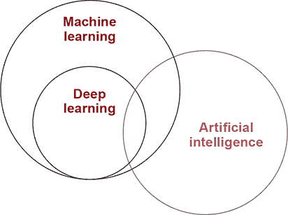
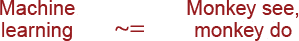
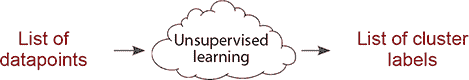
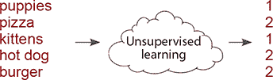
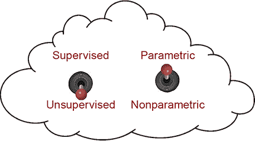
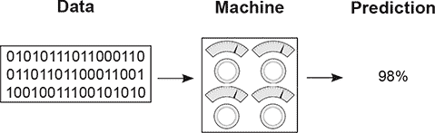
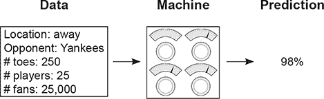
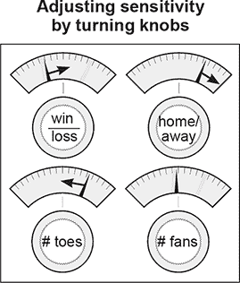
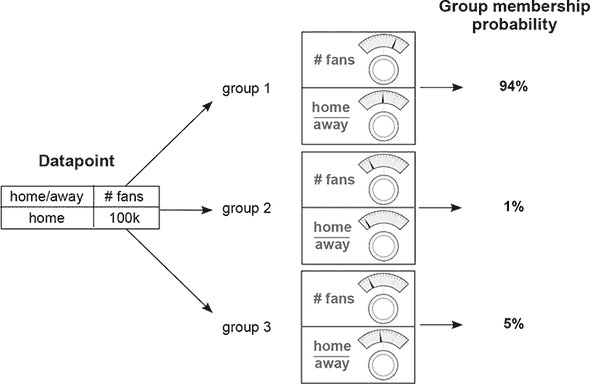
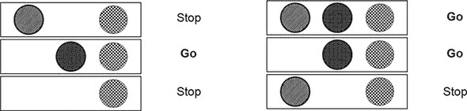

## 第二章\. 基本概念：机器是如何学习的？

**本章**

+   深度学习、机器学习和人工智能是什么？

+   **参数模型**和**非参数模型**是什么？

+   **监督学习**和**无监督学习**是什么？

+   机器如何学习？

> “机器学习将在五年内导致每一次成功的 IPO 胜利。”
> 
> *埃里克·施密特，谷歌执行董事长，云计算平台会议主题演讲，2016 年*

### 深度学习是什么？

#### 深度学习是机器学习方法的一个子集

深度学习是机器学习的一个子集，机器学习是一个致力于研究和发展能够学习的机器（有时目标是最终实现通用人工智能）的领域。

在工业界，深度学习被用于解决计算机视觉（图像）、自然语言处理（文本）和自动语音识别（音频）等各个领域的实际任务。简而言之，深度学习是机器学习工具箱中的一种方法子集，主要使用**人工神经网络**，这是一种类算法，其灵感来源于人脑。

注意到在这个图中，并非所有深度学习都集中在追求通用人工智能（如电影中的感知机器）上。许多这种技术的应用都是用来解决工业中各种各样的问题。本书旨在专注于教授深度学习的基础知识，无论是前沿研究还是工业应用，都有助于为这两种情况做好准备。

### 机器学习是什么？

> “一个研究领域，它赋予计算机在没有明确编程的情况下学习的能力。”
> 
> *归功于亚瑟·萨缪尔*

由于深度学习是机器学习的一个子集，那么机器学习是什么？最普遍地说，它就是其名称所暗示的。机器学习是计算机科学的一个子领域，其中**机器学习**执行那些它们没有被明确编程的任务。简而言之，机器观察到一个模式，并试图以某种方式直接或间接地模仿它。

我将直接和间接模仿与机器学习的两种主要类型相提并论：**监督学习**和**无监督学习**。监督机器学习是两个数据集之间模式的直接模仿。它总是试图将一个输入数据集转换成一个输出数据集。这可以是一种非常强大和有用的能力。考虑以下例子（**输入**数据集加粗，**输出**数据集斜体）：

+   使用图像的**像素**来检测**猫**的**存在**或**不存在**

+   使用你喜欢的**电影**来预测你可能喜欢的更多**电影**

+   使用某人的**话语**来预测他们是否**快乐**或**悲伤**

+   使用天气传感器**数据**来预测**降雨****概率**

+   使用汽车发动机**传感器**来预测最佳的**调整****设置**

+   使用新闻**数据**来预测明天的**股价**

+   使用一个输入**数字**来预测其两倍大小的**数字**

+   使用原始**音频文件**来预测音频的**转录**

这些都是监督机器学习任务。在所有情况下，机器学习算法都试图模仿两个数据集之间的模式，以便它能够**使用一个数据集来预测另一个数据集**。对于这些例子中的任何一个，想象一下，如果你只有输入数据集，就有能力预测**输出**数据集。这种能力将是深远的。

### 监督机器学习

#### 监督学习转换数据集

监督学习是将一个数据集转换为另一个数据集的方法。例如，如果你有一个名为“周一股票价格”的数据集，它记录了过去 10 年每周一每只股票的价格，以及另一个名为“周二股票价格”的数据集，它记录了同一时间段内的价格，一个监督学习算法可能会尝试使用一个来预测另一个。

如果你成功地在 10 年的周一和周二数据上训练了监督机器学习算法，那么你就可以根据前一个周一的股票价格预测未来任何一天的周二股票价格。我鼓励你停下来思考一下这一点。

监督机器学习是应用人工智能（也称为窄 AI）的精髓。它有助于将你已知的**知识**作为输入，快速转化为你想要知道的**知识**。这使得监督机器学习算法能够在看似无限多的方式上扩展人类智能和能力。

大多数使用机器学习的工作结果都是训练某种类型的监督分类器。即使是未监督的机器学习（你将在下一刻了解更多关于它的信息）通常也是为了帮助开发一个准确的监督机器学习算法。

在本书的剩余部分，你将创建能够接受可观察、可记录的输入数据，并通过扩展，**可知**的数据，并将其转换为需要逻辑分析的有价值输出数据算法。这就是监督机器学习的力量。

### 未监督机器学习

#### 未监督学习对数据进行分组

未监督学习与监督学习有一个共同属性：它将一个数据集转换为另一个数据集。但它转换成的数据集**不是事先已知或理解的**。与监督学习不同，没有“正确答案”是你试图让模型复制的。你只需告诉未监督算法“在这个数据中找到模式，并告诉我关于它们的信息。”

例如，*将数据集聚类成组*是一种无监督学习。聚类将一系列*数据点*转换成一系列*聚类标签*。如果它学习了 10 个聚类，这些标签通常是数字 1-10。每个数据点将根据它所在的聚类分配一个数字。因此，数据集从一系列数据点变成一系列标签。为什么标签是数字？算法没有告诉你这些聚类的名称。它怎么能知道呢？它只是说：“嘿科学家！我找到了一些结构。看起来你的数据中有些组。这里它们是！”

我有个好消息！这种聚类的想法，你可以作为无监督学习的定义，可靠地保存在你的脑海中。尽管无监督学习有许多形式，*所有形式的无监督学习都可以被视为一种聚类形式*。你将在本书后面的内容中了解更多。

查看这个例子。尽管算法没有告诉这些聚类的名称，你能想出它是如何聚类这些单词的吗？（答案：1 == cute 和 2 == delicious。）稍后，我们将解开其他形式的无监督学习也是聚类形式的原因，以及这些聚类对于监督学习是有用的。

### 参数化与非参数化学习

#### 过于简化：试错学习与计数和概率

最后两页将所有机器学习算法分为两组：监督学习和无监督学习。现在，我们将讨论另一种将相同的机器学习算法分为两组的方法：参数化和非参数化。所以，如果我们考虑我们的小型机器学习云，它有两个设置：

如您所见，实际上有四种不同的算法可供选择。一个算法要么是无监督的，要么是监督的，要么是参数化的，要么是非参数化的。而前一个关于监督的部分是关于学习到的*模式类型*，参数化则是关于学习是如何*存储*的，通常，通过扩展，也是关于*学习方法*。首先，让我们看看参数化与非参数化的正式定义。据记录，关于确切差异的讨论仍然存在。

| |
| --- |

参数化模型的特点是具有固定数量的参数，而非参数化模型的参数数量是*无限的*（由数据决定）。

| |
| --- |

例如，假设问题是将一个正方体放入正确的（正方形）孔中。有些人（如婴儿）只是把它塞进所有的孔，直到它适合某个地方（参数化）。然而，一个青少年可能会数一数边的数量（四条），然后寻找具有相同数量的孔（非参数化）。参数化模型倾向于使用试错法，而非参数化模型倾向于计数。让我们更深入地了解一下。

### 监督参数化学习

#### 过于简化：使用旋钮的试错学习

监督参数学习机器是具有固定数量旋钮的机器（这就是参数部分），学习是通过旋转旋钮来进行的。输入数据进来，根据旋钮的角度进行处理，并转换为*预测*。

学习是通过调整旋钮到不同的角度来完成的。如果您试图预测红袜队是否会赢得世界系列赛，那么这个模型首先会收集数据（例如体育统计数据，如胜负记录或平均每名球员的脚趾数量）并做出预测（例如 98%的机会）。接下来，模型会观察红袜队是否真的获胜。在知道他们是否获胜后，学习算法会*更新旋钮*，以便在下一次看到*相同或类似输入数据*时做出更准确的预测。

如果球队的胜负记录是一个好的预测因素，它可能会“提高”胜负记录旋钮。相反，如果这个数据点不是一个好的预测因素，它可能会“降低”平均每名球员的脚趾数量旋钮。这就是参数模型学习的方式！

注意，模型所学习的一切都可以通过任何给定时间旋钮的位置来捕捉。您也可以将这种学习模型视为一种搜索算法。您通过尝试配置、调整它们并重新尝试来“搜索”适当的旋钮配置。

进一步注意，试错的概念并不是正式的定义，但它是非参数模型的一个常见（但有例外）属性。当存在任意（但固定）数量的旋钮可以旋转时，需要一定程度的搜索来找到最佳配置。这与非参数学习形成对比，非参数学习通常是基于计数，并且（或多或少）在发现新的计数对象时添加新的旋钮。让我们将监督参数学习分解为其三个步骤。

#### 第 1 步：预测

为了说明监督参数学习，让我们继续使用体育类比，尝试预测红袜队是否会赢得世界系列赛。正如之前提到的，第一步是收集体育统计数据，将它们通过机器，并预测红袜队获胜的概率。

#### 第 2 步：与真实模式比较

第二步是将预测结果（98%）与您关注的模式（例如红袜队是否获胜）进行比较。遗憾的是，他们输了，所以比较是这样的

+   **预测**：98% > **事实**：0%

这一步认识到，如果模型预测了 0%，它就能完美地预测球队即将到来的失败。您希望机器准确，这导致了第 3 步。

#### 第 3 步：学习模式

这一步通过研究模型在预测时*多少*次错过了（98%）以及输入数据*是什么*（体育统计数据）来调整旋钮。然后，根据输入数据调整旋钮，以便做出更准确的预测。

理论上，下次这个步骤看到相同的体育统计数据时，预测值将低于 98%。请注意，每个旋钮代表*预测对不同类型输入数据的敏感性*。这就是你在“学习”时改变的内容。

### 无监督参数学习

无监督参数学习采用了一种非常相似的方法。让我们从高层次的角度来梳理一下步骤。记住，无监督学习完全是关于数据分组。无监督参数学习使用旋钮来分组数据。但在这种情况下，通常为每个组提供几个旋钮，每个旋钮将输入数据的亲和力映射到特定的组（有例外和细微差别——这是一个高层次描述）。让我们来看一个例子，假设你想要将数据分成三个组。

| 主场或客场 | # 球迷数量 |
| --- | --- |
| **主队** **客队** **主队** **客队** **客队** **客队** | **100k** 50k **100k** **99k** 50k **10k** **11k** |

在数据集中，我已经识别出三个你可能会希望参数模型找到的簇。它们通过格式化为**组 1**、**组 2**和*组 3*来表示。让我们将第一个数据点通过一个训练好的无监督模型传播，如下所示。注意，它最强烈地映射到**组 1**。

每个组的机器试图将输入数据转换为一个介于 0 到 1 之间的数字，告诉我们输入数据是该组的*概率是成员的概率*。这些模型在训练方式和最终属性上存在很大差异，但就高层次而言，它们调整参数以将输入数据转换为其所属的组（们）。

### 非参数学习

#### 过于简化的说法：基于计数的方法

非参数学习是一类算法，其中参数的数量基于数据（而不是预定义的）。这使得它适用于一般以某种方式计数的方法，从而根据数据中计数项的数量增加参数的数量。例如，在监督设置中，一个非参数模型可能会计算特定颜色的街灯导致汽车“行驶”的次数。在只计算了几个例子之后，这个模型就能够预测*中间*的灯总是（100%）导致汽车行驶，而*右侧*的灯只有时（50%）导致汽车行驶。

注意到这个模型将有三个参数：三个计数表示每种颜色的灯光开启和汽车行驶的次数（可能除以总观察次数）。如果有五个灯光，就会有五个计数（五个参数）。使这个简单模型成为*非参数模型*的特点是参数的数量根据数据变化（在这种情况下，是灯光的数量）。这与参数模型形成对比，参数模型从一组固定的参数开始，更重要的是，科学家可以根据自己的意愿调整模型参数的数量或减少（无论数据如何）。

仔细观察的人可能会质疑这个想法。之前的参数模型似乎为每个输入数据点都有一个旋钮。大多数参数模型仍然需要基于数据中的类别数量某种形式的*输入*。因此，你可以看到参数和非参数算法之间存在一个*灰色区域*。即使是参数算法也多少会受到数据中类别数量的影响，即使它们没有明确地计数模式。

这也说明了“参数”是一个通用术语，仅指用于建模模式的数字集合（没有任何关于这些数字如何使用的限制）。计数是参数。权重是参数。计数或权重的归一化变体是参数。相关系数可以是参数。这个术语指的是用于建模模式的数字集合。实际上，深度学习是一类参数模型。我们在这本书中不会进一步讨论非参数模型，但它们是一类有趣且强大的算法。

### 摘要

在本章中，我们深入探讨了机器学习的各种风味。你了解到机器学习算法要么是监督的，要么是无监督的，要么是参数的，要么是非参数的。此外，我们还探讨了是什么使得这四组不同的算法各具特色。你了解到监督机器学习是一类算法，其中你学会根据另一个数据集预测一个数据集，而无监督学习通常将单个数据集分组为各种类型的聚类。你了解到参数算法具有固定数量的*参数*，而非参数算法根据数据集调整其参数数量。

深度学习使用神经网络进行监督学习和无监督预测。到目前为止，我们一直停留在概念层面，帮助你在这个领域找到自己的位置。在下一章，你将构建你的第一个神经网络，所有随后的章节都将基于*项目*。所以，拿出你的 Jupyter 笔记本，让我们开始吧！
