## 第三章. 神经预测简介：前向传播

**本章**

+   一个简单的网络进行预测

+   神经网络是什么，它做什么？

+   使用多个输入进行预测

+   使用多个输出进行预测

+   使用多个输入和输出进行预测

+   在预测上进行预测

> “我尽量避免参与预测业务。这很容易让人看起来像个白痴。”
> 
> *沃伦·埃利斯，漫画书作家、小说家和编剧*

### 第 1 步：预测

#### 本章是关于预测的

在上一章中，你学习了关于预测、比较、学习的范例。在本章中，我们将深入探讨第一步：*预测*。你可能记得预测步骤看起来很像这样：

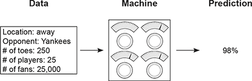

在本章中，你将了解神经网络预测的这三个不同部分在内部是如何工作的。让我们从第一个开始：数据。在你的第一个神经网络中，你将一次预测一个数据点，如下所示：

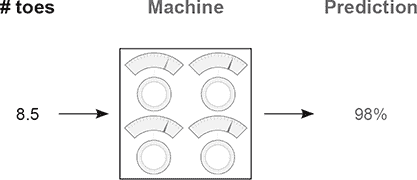

以后你会发现，你一次处理的点数数量对网络的外观有重大影响。你可能想知道，“我如何选择一次传播多少点数？”答案是取决于你认为神经网络是否可以用你给它的数据准确预测。

例如，如果我在尝试预测照片中是否有猫，我肯定需要一次性向我的网络展示图像的所有像素。为什么？好吧，如果我只给你一个像素的图像，你能分类图像中是否含有猫吗？我也不能！（顺便说一句，这是一个一般性的规则：总是向网络提供足够的信息，其中“足够的信息”被宽泛地定义为人类可能需要做出相同预测所需的信息量。）

现在让我们先跳过网络。实际上，只有在你理解了输入和输出数据集的形状之后，你才能创建一个网络（现在，“形状”意味着“列数”或“你一次处理的点数数量”）。让我们专注于对棒球队能否获胜的单一预测：

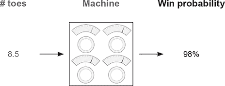

现在你已经知道你想要输入一个数据点并输出一个预测，你可以创建一个神经网络。因为你只有一个输入数据点和输出数据点，所以你将构建一个将输入点映射到输出点的单一控制网络。（抽象地说，这些“控制”实际上被称为*权重*，从现在起我将这样称呼它们。）所以，不再多言，这是你的第一个神经网络，它有一个单一的权重将输入“脚趾数量”映射到输出“赢？”：

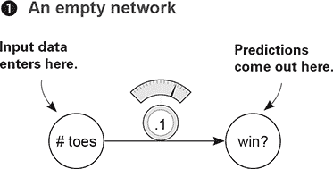

如你所见，这个网络一次只接受一个数据点（棒球队伍中每名球员的平均脚趾数量）并输出一个预测（它认为队伍是否会赢）。

### 一个简单的神经网络进行预测

#### 让我们从最简单的神经网络开始

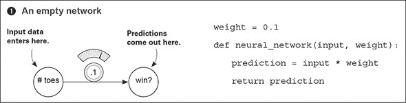


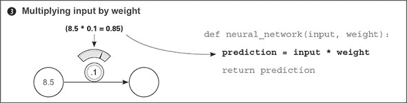

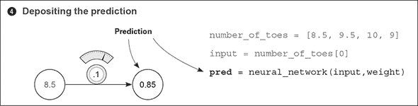

### **什么是神经网络？**

#### 这是你的第一个神经网络

要启动神经网络，打开 Jupyter 笔记本并运行以下代码：

```
weight = 0.1

def neural_network(input, weight):      *1*

    prediction = input * weight         *1*

    return prediction                   *1*
```

+   **1* 网络**

现在，运行以下代码：

```
number_of_toes = [8.5, 9.5, 10, 9]      *1*

input = number_of_toes[0]               *1*

pred = neural_network(input,weight)     *1*
print(pred)                             *1*
```

+   **1* 如何使用网络进行预测**

你刚刚制作了你的第一个神经网络，并使用它进行了预测！恭喜！最后一行打印了预测（`pred`）。它应该是 0.85。那么，神经网络是什么？现在，它是一个或多个可以乘以输入数据的*权重*来做出*预测*。


**什么是输入数据？**

它是在现实世界中的某个地方记录的数字。它通常是容易知道的事情，比如今天的温度、棒球运动员的打击率，或者昨天的股价。

**什么是预测？**

**预测**是神经网络告诉你的内容，*给定输入数据*，例如“给定温度，今天人们穿运动服的可能性是**0%**”或“给定棒球运动员的打击率，他击出全垒打的概率是**30%**”或“给定昨天的股价，今天的股价将是**101.52**”。

**这个预测总是正确吗？**

有时候，神经网络会犯错误，但它可以从错误中学习。例如，如果它预测得过高，它将调整其权重以在下一次预测得更低，反之亦然。

**网络是如何学习的？**

尝试和错误！首先，它尝试做出预测。然后，它查看预测是否过高或过低。最后，它改变权重（向上或向下）以在下一次看到相同输入时更准确地预测。


### 这个神经网络做什么？

#### 它将输入乘以一个权重。它通过一定的量“缩放”输入

在上一节中，你使用神经网络进行了第一次预测。最简单的神经网络形式使用*乘法*的力量。它取一个输入数据点（在这种情况下，8.5）并将其与权重相乘。如果权重是 2，那么神经网络将*加倍*输入。如果权重是 0.01，那么网络将输入除以 100。正如你所看到的，一些权重值使输入*变大*，而其他值使输入*变小*。

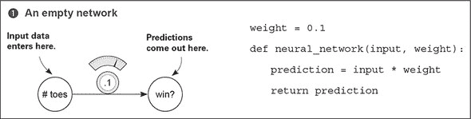

神经网络的界面很简单。它接受一个`input`变量作为*信息*和一个`weight`变量作为*知识*，并输出一个`prediction`。你将看到的每一个神经网络都是这样工作的。它使用权重中的*知识*来解释输入数据中的*信息*。后来的神经网络将接受更大、更复杂的`input`和`weight`值，但这个相同的根本前提始终是正确的。

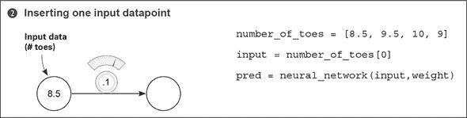

在这种情况下，信息是比赛前棒球队的平均脚趾数。请注意以下几点。首先，神经网络没有访问任何除了一个实例之外的信息。如果在这次预测之后，你输入`number_of_toes[1]`，网络不会记得它在最后一个时间步长中做出的预测。神经网络只知道你作为输入提供的内容。它会忘记其他所有内容。稍后，你将学习如何通过一次输入多个输入来给神经网络一个“短期记忆”。


另一种思考神经网络权重值的方法是将其视为网络输入和预测之间的*敏感性*度量。如果权重非常高，那么即使是最微小的输入也能产生一个非常大的预测！如果权重非常小，那么即使大的输入也会产生小的预测。这种敏感性类似于*音量*。“提高权重”放大了相对于输入的预测：权重就像一个音量旋钮！

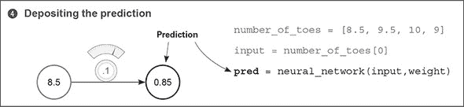

在这种情况下，神经网络实际上是在对`number_of_toes`变量应用一个*音量旋钮*。理论上，这个音量旋钮可以告诉你，根据球队每个球员的平均脚趾数，球队获胜的可能性。这可能或可能不奏效。说实话，如果球队成员的平均脚趾数为 0，他们可能会打得非常糟糕。但棒球比这要复杂得多。在下一节中，你将同时提供多份信息，以便神经网络可以做出更明智的决策。

注意，神经网络不仅预测正数——它们还可以*预测负数*，甚至可以将*负数作为输入*。也许你想预测今天人们穿大衣的概率。如果温度是-10 摄氏度，那么一个负权重将预测人们穿大衣的概率很高。

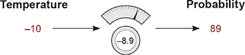

### 使用多个输入进行预测

#### 神经网络可以结合多个数据点的智能

之前的神经网络能够接受一个数据点作为输入，并基于该数据点做出一个预测。也许你一直在想，“平均脚趾数真的能作为一个好的预测指标吗？”如果是这样，你就有发现了。如果你能一次给网络提供比每个球员的平均脚趾数更多的信息，会怎样？在这种情况下，理论上，网络应该能够做出更准确的预测。好吧，实际上，网络可以一次接受多个输入数据点。看看下一个预测：


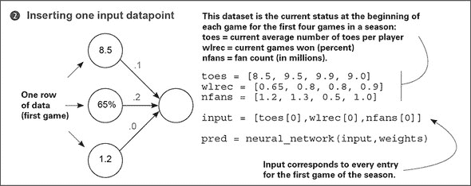

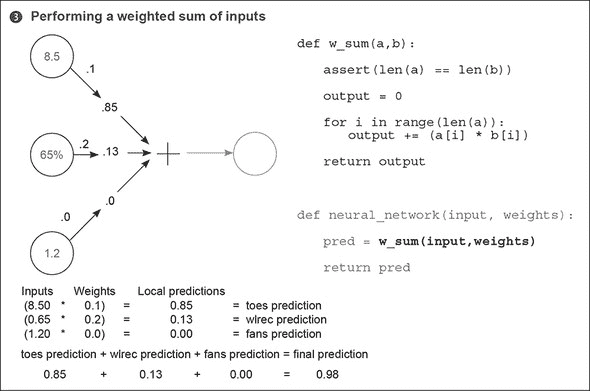

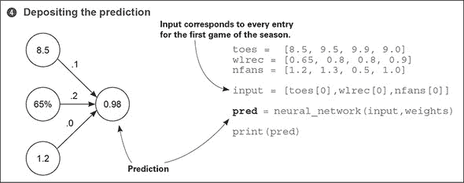

### 多个输入：这个神经网络做什么？

#### 它将三个输入乘以三个旋钮权重，并将它们相加。T- 这是一个加权求和

在上一节的结尾，你意识到你简单神经网络的限制因素：它只是一个数据点的音量旋钮。在示例中，这个数据点是棒球队伍每位球员的平均脚趾数。你了解到，为了做出准确的预测，你需要构建能够*同时结合多个输入*的神经网络。幸运的是，神经网络完全能够做到这一点。

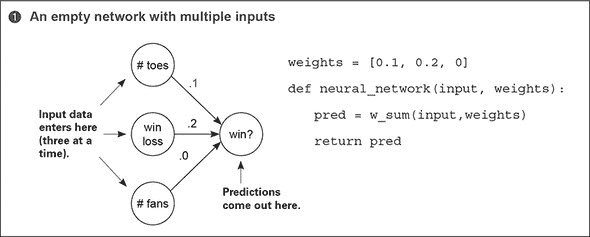

这个新的神经网络可以一次接受每个预测的*多个输入*。这使得网络能够结合各种形式的信息，做出更明智的决策。但使用权重的根本机制并没有改变。你仍然需要将每个输入通过其自身的音量旋钮。换句话说，你需要将每个输入乘以其自身的权重。

这里的新特性是，由于你有多个输入，你必须分别求和它们的预测值。因此，你需要将每个输入乘以其相应的权重，然后将所有局部预测值相加。这被称为*输入的加权求和*，或简称为*加权求和*。有些人也将加权求和称为*点积*，你将会看到。


**一个相关的提醒**

神经网络的接口很简单：它接受一个`input`变量作为信息和一个`weights`变量作为知识，并输出一个预测。


同时处理多个输入的新需求证明了使用新工具的必要性。这个工具被称为*向量*，如果你一直在你的 Jupyter 笔记本中跟随，你已经使用过它了。向量不过是一个*数字列表*。在示例中，`input`是一个向量，`weights`也是一个向量。你能在之前的代码中找到更多的向量吗？（还有三个。）

实际上，向量在你想执行涉及数字组的操作时非常有用。在这种情况下，你正在执行两个向量之间的加权求和（点积）。你正在取两个长度相等的向量（`input`和`weights`），根据其位置（`input`中的第一个位置乘以`weights`中的第一个位置，以此类推）乘以每个数字，然后将结果相加。

任何时间当你对两个长度相等的向量进行数学运算，并且根据它们在向量中的位置配对值（再次强调：位置 0 与 0 配对，1 与 1 配对，以此类推），这被称为*逐元素*运算。因此，*逐元素加法*是将两个向量相加，而*逐元素乘法*是两个向量的乘法。


**挑战：向量数学**

能够操作向量是深度学习的一个基石技术。看看你是否能编写执行以下操作的函数：

+   `def elementwise_multiplication(vec_a, vec_b)`

+   `def elementwise_addition(vec_a, vec_b)`

+   `def vector_sum(vec_a)`

+   `def vector_average(vec_a)`

然后，看看你是否可以使用这两种方法之一来执行点积！

| |
| --- |

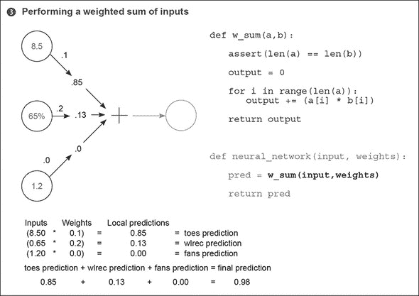

点积（加权求和）如何以及为什么工作背后的直觉是真正理解神经网络如何进行预测的最重要部分之一。简单地说，点积给出了两个向量之间的“相似度”概念。考虑以下例子：

|

```
a = [ 0, 1, 0, 1]
b = [ 1, 0, 1, 0]
c = [ 0, 1, 1, 0]
d = [.5, 0,.5, 0]
e = [ 0, 1,-1, 0]
```

|

```
w_sum(a,b) = 0
w_sum(b,c) = 1
w_sum(b,d) = 1
w_sum(c,c) = 2
w_sum(d,d) = .5
w_sum(c,e) = 0
```

|

最大的加权求和(`w_sum(c,c)`)是在完全相同的向量之间。相比之下，因为`a`和`b`没有重叠的权重，它们的点积为零。也许最有趣的加权求和是在`c`和`e`之间，因为`e`有一个负权重。这个负权重抵消了它们之间的正相似性。但是，`e`与自身的点积会产生数字 2，尽管有负权重（双重否定转为正数）。让我们熟悉点积操作的各项属性。

有时可以将点积的性质等同于逻辑“与”。考虑`a`和`b`：

```
a = [ 0, 1, 0, 1]
b = [ 1, 0, 1, 0]
```

如果你问`a[0] AND b[0]`是否都有值，答案是“否”。如果你问`a[1] AND b[1]`是否都有值，答案仍然是“否”。因为这对于所有四个值都是“总是”成立的，所以最终分数等于 0。每个值都未通过逻辑“与”。

```
b = [ 1, 0, 1, 0]
c = [ 0, 1, 1, 0]
```

然而，`b`和`c`有一个共享值的列。它通过了逻辑“与”，因为`b[2]`和`c[2]`都有权重。这一列（仅这一列）导致分数上升到 1。

```
c = [ 0, 1, 1, 0]
d = [.5, 0,.5, 0]
```

幸运的是，神经网络也能够模拟部分“与”运算。在这种情况下，`c`和`d`与`b`和`c`共享相同的列，但由于`d`在那里只有 0.5 的权重，最终分数只有 0.5。我们在神经网络建模概率时利用了这一属性。

```
d = [.5, 0,.5, 0]
e = [-1, 1, 0, 0]
```

在这个类比中，负权重往往意味着逻辑“非”运算符，因为任何与负权重配对的正权重都会导致分数下降。此外，如果两个向量都具有负权重（例如`w_sum(e,e)`），那么神经网络将执行“双重否定”并添加权重。此外，有些人可能会说这是“与”之后的“或”，因为如果任何一行显示权重，分数就会受到影响。因此，对于`w_sum(a,b)`，如果(`a[0] AND b[0]`)“或”(`a[1] AND b[1]`)，依此类推，那么`w_sum(a,b)`返回一个正分数。此外，如果其中一个值是负数，那么该列就得到一个“非”。

有趣的是，这为我们提供了一种阅读权重的粗略语言。让我们读几个例子，好吗？这些假设你在执行`w_sum(input,weights)`，并且这些`if`语句的“然后”是一个抽象的“然后给出高分”：

```
weights = [ 1, 0, 1] => if input[0] OR input[2]

weights = [ 0, 0, 1] => if input[2]

weights = [ 1, 0, -1] => if input[0] OR NOT input[2]

weights = [ -1, 0, -1] => if NOT input[0] OR NOT input[2]

weights = [ 0.5, 0, 1] => if BIG input[0] or input[2]
```

注意在最后一行中，`weight[0] = 0.5` 表示相应的 `input[0]` 必须更大才能补偿较小的权重。正如我提到的，这是一种非常粗略的近似语言。但当我试图在脑海中想象底层的运作时，我发现它非常有用。这将在未来对你有很大帮助，尤其是在以越来越复杂的方式组合网络时。

基于这些直觉，当神经网络进行预测时，这意味着什么？粗略地说，这意味着网络根据输入与权重的相似度给出高分数。注意在下面的示例中，`nfans` 在预测中被完全忽略，因为与之相关的权重是 0。最敏感的预测器是 `wlrec`，因为其权重是 0.2。但高分的主导力量是脚趾的数量（`ntoes`），不是因为权重最高，而是因为输入与权重的组合远远是最高的。

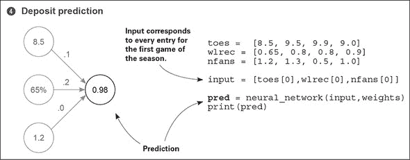

这里有一些额外的要点需要注意，以供进一步参考。你不能随机排列权重：它们需要处于特定的位置。此外，权重的值和输入的值都会决定对最终得分的整体影响。最后，负权重将导致某些输入减少最终预测（反之亦然）。

### 多个输入：完整的可运行代码

这个例子中的代码片段组合在以下代码中，该代码创建并执行了一个神经网络。为了清晰起见，我使用 Python 的基本属性（列表和数字）将所有内容都写出来了。但有一种更好的方法，我们将在未来开始使用。

**之前的代码**

```
def w_sum(a,b):

    assert(len(a) == len(b))

    output = 0

    for i in range(len(a)):
        output += (a[i] * b[i])

    return output

weights = [0.1, 0.2, 0]

def neural_network(input, weights):

    pred = w_sum(input,weights)

    return pred

toes = [8.5, 9.5, 9.9, 9.0]
wlrec = [0.65, 0.8, 0.8, 0.9]
nfans = [1.2, 1.3, 0.5, 1.0]

input = [toes[0],wlrec[0],nfans[0]]    *1*
pred = neural_network(input,weights)
print(pred)
```

+   ***1* 输入对应于赛季第一场比赛的每个条目。**

有一个名为 NumPy 的 Python 库，代表“数值 Python”。它具有创建向量和执行常见函数（如点积）的高效代码。无需多言，以下是相同的代码，使用 NumPy 实现。

**NumPy 代码**

```
import numpy as np

weights = np.array([0.1, 0.2, 0])

def neural_network(input, weights):

    pred = input.dot(weights)

    return pred

toes = np.array([8.5, 9.5, 9.9, 9.0])
wlrec = np.array([0.65, 0.8, 0.8, 0.9])
nfans = np.array([1.2, 1.3, 0.5, 1.0])

input = np.array([toes[0],wlrec[0],nfans[0]])    *1*
pred = neural_network(input,weights)
print(pred)
```

+   ***1* 输入对应于赛季第一场比赛的每个条目。**

两个网络都应该输出 `0.98`。注意在 NumPy 代码中，你不需要创建一个 `w_sum` 函数。相反，NumPy 有一个可以调用的 `dot` 函数（简称“点积”）。你将来会使用的许多函数都有 NumPy 的对应版本。

### 使用多个输出进行预测

#### 神经网络也可以仅使用单个输入进行多次预测

可能比多个输入更简单的一种增强是多输出。预测发生的方式与有三个独立单权重神经网络的预测相同。

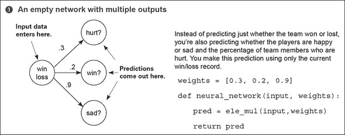

在这种设置中，最重要的评论是要注意三个预测是完全独立的。与具有多个输入和单个输出的神经网络不同，那里的预测无疑是相互关联的，这个网络真正地表现为三个独立的组件，每个组件接收相同的数据输入。这使得网络易于实现。

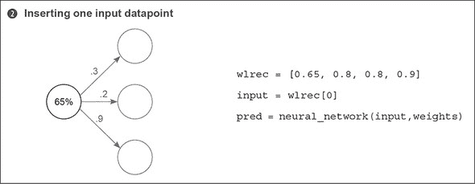

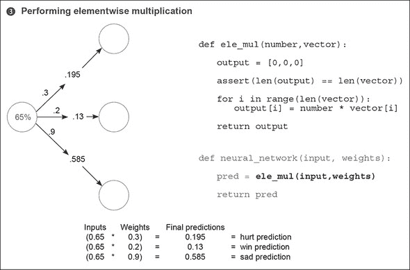

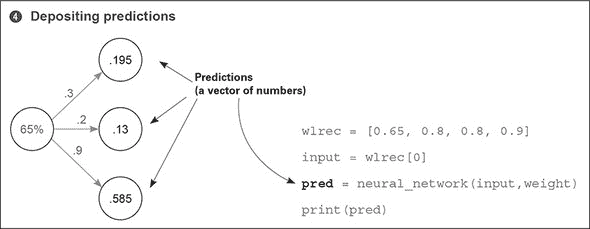

### 使用多个输入和输出进行预测

#### 神经网络可以根据多个输入预测多个输出

最后，构建具有多个输入或输出的网络的方式可以组合起来构建一个具有多个输入*和*多个输出的网络。就像之前一样，一个权重将每个输入节点连接到每个输出节点，并且预测以通常的方式进行。

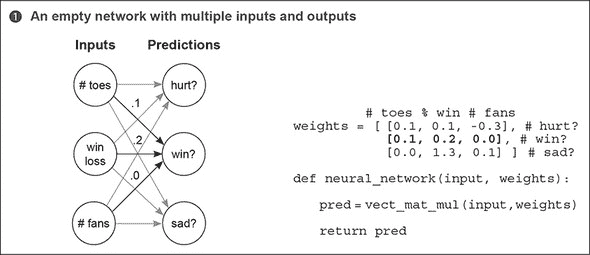

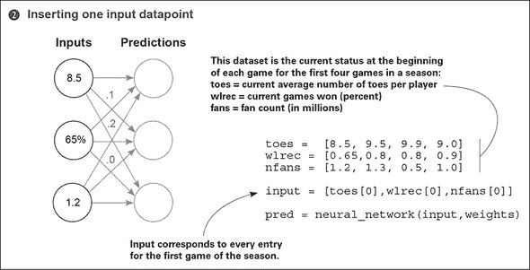

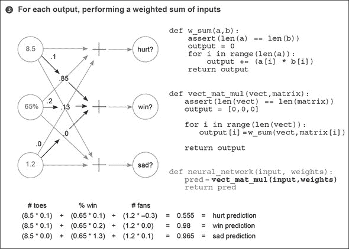

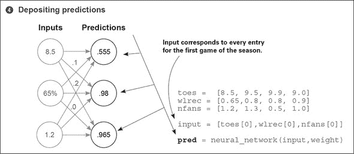

### 多个输入和输出：它是如何工作的？

#### 它对输入执行三个独立的加权求和以做出 - 三个预测

你可以从两个角度看待这个架构：将其视为每个输入节点出来的三个权重，或者每个输出节点进入的三个权重。目前，我发现后者更有益。将这个神经网络视为三个独立的点积：三个独立的输入加权求和。每个输出节点对其输入进行自己的加权求和并做出预测。

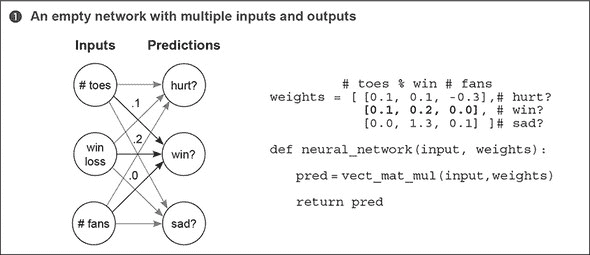

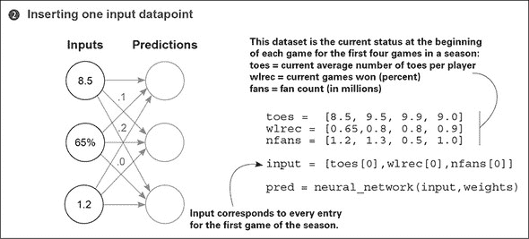

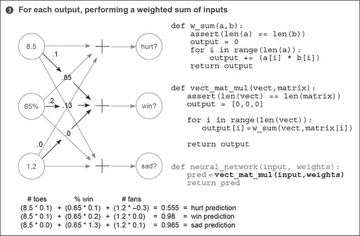

如前所述，我们选择将这个网络视为一系列加权求和。因此，之前的代码创建了一个名为`vect_mat_mul`的新函数。这个函数遍历每个权重的行（每一行都是一个向量）并使用`w_sum`函数进行预测。它实际上执行了三个连续的加权求和，并将它们的预测存储在一个名为`output`的向量中。这里有很多权重在飞舞，但这并不比其他你见过的网络更高级。

我想使用这个*向量列表*和*一系列加权求和*的逻辑来介绍两个新概念。看看步骤 1 中的`weights`变量？它是一个向量列表。向量列表被称为*矩阵*。正如其名所示。常用的函数使用矩阵。其中之一被称为*向量-矩阵乘法*。一系列加权求和正是这样：你取一个向量并与矩阵中的每一行进行点积。^([*]) 你将在下一节中发现，NumPy 有特殊的函数来帮助。 

> ^*
> 
> 如果你熟悉线性代数，更正式的定义是将权重存储/处理为列向量而不是行向量。这将在稍后纠正。

### 在预测上进行预测

#### 神经网络可以堆叠！

如以下图所示，你也可以将一个网络的输出作为输入提供给另一个网络。这会导致连续两次向量-矩阵乘法。你可能还不清楚为什么会有这样的预测；但有些数据集（如图像分类）包含过于复杂的模式，无法用一个单权重矩阵来表示。稍后，我们将讨论这些模式的特点。现在，只需知道这是可能的就足够了。

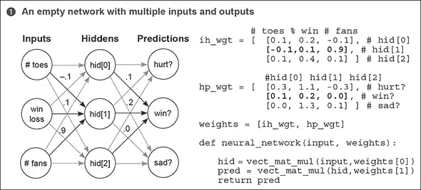

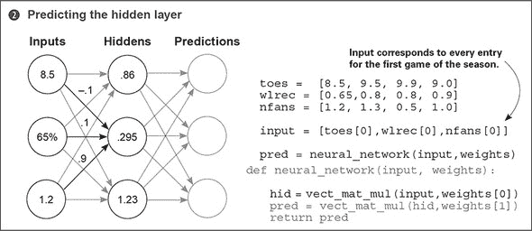

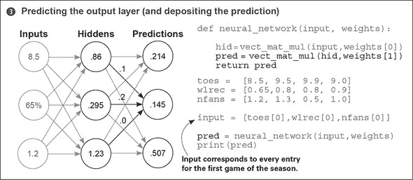

下面的列表展示了如何使用一个方便的 Python 库 NumPy 来执行上一节中用代码编写的相同操作。使用像 NumPy 这样的库可以使你的代码更快、更容易阅读和编写。

**NumPy 版本**

```
import numpy as np

# toes % win # fans
ih_wgt = np.array([
            [0.1, 0.2, -0.1], # hid[0]
            [-0.1,0.1, 0.9], # hid[1]
            [0.1, 0.4, 0.1]]).T # hid[2]

# hid[0] hid[1] hid[2]
hp_wgt = np.array([
            [0.3, 1.1, -0.3], # hurt?
            [0.1, 0.2, 0.0], # win?
            [0.0, 1.3, 0.1] ]).T # sad?

weights = [ih_wgt, hp_wgt]

def neural_network(input, weights):

    hid = input.dot(weights[0])
    pred = hid.dot(weights[1])
    return pred

toes = np.array([8.5, 9.5, 9.9, 9.0])
wlrec = np.array([0.65,0.8, 0.8, 0.9])
nfans = np.array([1.2, 1.3, 0.5, 1.0])

input = np.array([toes[0],wlrec[0],nfans[0]])

pred = neural_network(input,weights)
print(pred)
```

### NumPy 快速入门

#### NumPy 为你做了几件事情。让我们揭示这个魔法的秘密

到目前为止，在本章中，我们讨论了两种新的数学工具：向量和矩阵。你还了解到了在向量和矩阵上发生的不同操作，包括点积、逐元素乘法和加法以及向量-矩阵乘法。对于这些操作，你已经编写了可以在简单的 Python `list` 对象上操作的 Python 函数。

在短期内，你需要继续编写和使用这些函数，以确保你完全理解它们内部的运作。但现在我已经提到了 NumPy 和几个主要操作，我想快速概述一下基本的 NumPy 使用方法，以便你为过渡到仅使用 NumPy 的章节做好准备。让我们再次从基础知识开始：向量和矩阵。

在 NumPy 中，你可以以多种方式创建向量和矩阵。大多数神经网络中常用的技术在前面的代码中列出。请注意，创建向量和矩阵的过程是相同的。如果你只创建了一行的矩阵，你就是在创建一个向量。并且，正如数学中通常的做法一样，你通过列出 `(rows,columns)` 来创建矩阵。我之所以这么说，只是为了让你记住顺序：行在前，列在后。让我们看看你可以对这些向量和矩阵执行的一些操作：

```
print(a * 0.1)       *1*
print(c * 0.2)       *2*
print(a * b)         *3*
print(a * b * 0.2)   *4*
print(a * c)         *5*

print(a * e)         *6*
```

+   ***1* 将向量 a 中的每个数乘以 0.1**

+   ***2* 将矩阵 c 中的每个数乘以 0.2**

+   ***3* 在 a 和 b 之间逐元素相乘（列配对）**

+   ***4* 逐元素相乘，然后乘以 0.2**

+   ***5* 对矩阵 c 的每一行执行逐元素乘法，因为 c 的列数与 a 相同**

+   ***6* 因为 a 和 e 的列数不同，这会导致“值错误：操作数无法一起广播...”**

```
import numpy as np

a = np.array([0,1,2,3])   *1*
b = np.array([4,5,6,7])   *2*
c = np.array([[0,1,2,3],  *3*
              [4,5,6,7]])

d = np.zeros((2,4))       *4*
e = np.random.rand(2,5)   *5*

print(a)
print(b)
print(c)
print(d)
print(e)
```

+   ***1* 向量**

+   ***2* 另一个向量**

+   ***3* 矩阵**

+   ***4* 2×4 的零矩阵**

+   ***5* 随机 2×5 矩阵，数值介于 0 和 1 之间**

**输出**

```
[0 1 2 3]
[4 5 6 7]
[[0 1 2 3]
 [4 5 6 7]]
[[ 0\.  0\.  0\.  0.]
 [ 0\.  0\.  0\.  0.]]
[[ 0.22717119  0.39712632
0.0627734   0.08431724
0.53469141]
 [ 0.09675954  0.99012254
0.45922775  0.3273326
0.28617742]]
```

现在运行所有之前的代码。第一部分“起初令人困惑但最终美妙”的魔法应该已经可见了。当你用`*`函数乘以两个变量时，NumPy 会自动检测你正在处理什么类型的变量，并试图弄清楚你所说的操作。这可能会非常方便，但有时会使 NumPy 代码变得难以阅读。确保你在进行过程中跟踪每个变量的类型。

对于任何逐元素操作（`+`、`-`、`*`、`/`）的一般规则是，两个变量必须有相同的列数，或者其中一个变量必须只有一个列。例如，`print(a * 0.1)`将一个向量乘以一个单个数字（一个标量）。NumPy 会说，“哦，我敢打赌我应该在执行向量-标量乘法，”然后它将标量（0.1）乘以向量中的每个值。这看起来与`print(c * 0.2)`完全一样，但 NumPy 知道`c`是一个矩阵。因此，它执行标量-矩阵乘法，将`c`中的每个元素乘以 0.2。因为标量只有一个列，你可以将它乘以任何东西（或除、加或减）。

接下来是`print(a * b)`。NumPy 首先确定它们都是向量。因为这两个向量都没有只有一个列，NumPy 会检查它们是否有相同数量的列。它们确实有，所以 NumPy 知道要根据它们在向量中的位置逐个元素相乘。加法、减法和除法也是同样的道理。

`print(a * c)`可能是最难以捉摸的。`a`是一个有四个列的向量，而`c`是一个(2 × 4)矩阵。它们都没有只有一个列，所以 NumPy 会检查它们是否有相同数量的列。它们确实有，所以 NumPy 会将向量`a`与`c`的每一行相乘（就像它在每一行上执行逐元素向量乘法一样）。

再次，最令人困惑的部分是，如果你不知道哪些是标量、向量或矩阵，所有这些操作看起来都是一样的。当你“阅读 NumPy”时，你实际上在做两件事：阅读操作并跟踪每个操作的*形状*（行数和列数）。这需要一些练习，但最终它会变得像本能一样。让我们看看 NumPy 中矩阵乘法的几个例子，并注意每个矩阵的输入和输出形状。

```
a = np.zeros((1,4))
b = np.zeros((4,3))

c = a.dot(b)      *1*
print(c.shape)    *2*
```

+   ***1* 长度为 4 的向量**

+   ***2* 4 行 3 列的矩阵**

**输出**

```
(1,3)
```

使用`dot`函数时有一个黄金法则：如果你将两个你要“点积”的变量的`(rows,cols)`描述放在一起，相邻的数字应该总是相同的。在这种情况下，你正在将(1,4)与(4,3)进行点积。它运行正常并输出(1,3)。从变量形状的角度来看，你可以这样想，无论你是点积向量还是矩阵：它们的*形状*（行数和列数）必须对齐。左矩阵的列必须等于右矩阵的行，这样`(a,b).dot(b,c) = (a,c)`。

```
a = np.zeros((2,4))         *1*
b = np.zeros((4,3))         *2*

c = a.dot(b)
print(c.shape)              *3*

e = np.zeros((2,1))         *4*
f = np.zeros((1,3))         *5*

g = e.dot(f)
print(g.shape)              *6*

h = np.zeros((5,4)).T       *7* *8*
i = np.zeros((5,6))         *9*

j = h.dot(i)
print(j.shape)              *10*

h = np.zeros((5,4))         *11*
i = np.zeros((5,6))         *12*
j = h.dot(i)
print(j.shape)              *13*
```

+   ***1* 2 行 4 列的矩阵**

+   ***2* 4 行 3 列的矩阵**

+   ***3* 输出 (2,3)**

+   ***4* 2 行 1 列的矩阵**

+   ***5* 1 行 3 列的矩阵**

+   ***6* 输出 (2,3)**

+   ***7* 抛出错误；.T 翻转矩阵的行和列。**

+   ***8* 4 行 5 列的矩阵**

+   ***9* 6 行 5 列的矩阵**

+   ***10* 输出 (4,6)**

+   ***11* 5 行 4 列的矩阵**

+   ***12* 5 行 6 列的矩阵**

+   ***13* 抛出错误**

### 摘要

#### 为了进行预测，神经网络执行输入的重复加权求和

你在本章中看到了越来越多种类的神经网络。我希望你清楚，相对较少的简单规则被反复使用，以创建更大、更先进的神经网络。网络智能取决于你赋予它的权重值。

本章我们所做的一切都是所谓的前向传播的形式，其中神经网络接收输入数据并做出预测。之所以称为前向传播，是因为你正在将激活信号*正向*传播通过网络。在这些例子中，*激活*是指所有不是权重且对每个预测都是唯一的数字。

在下一章，你将学习如何设置权重，以便你的神经网络做出准确的预测。正如预测是基于几个简单的技术，这些技术被重复/堆叠在一起一样，*权重学习*也是一个由许多简单技术组成的系列，这些技术在一个架构中被多次组合。那里见！
