## 第四章。神经网络学习简介：梯度下降

**在本章中**

+   神经网络能做出准确的预测吗？

+   为什么要测量误差？

+   热和冷学习

+   从误差中计算方向和数量

+   梯度下降

+   学习就是减少误差

+   导数及其如何用于学习

+   离散度和 alpha

> “对假设有效性的唯一相关检验是其预测与经验的比较。”
> 
> *米尔顿·弗里德曼，《正面经济学论文集》（芝加哥大学出版社，1953 年）*

### 预测、比较和学习

在第三章中，你学习了“预测、比较、学习”这一范式，并且我们深入探讨了第一步：*预测*。在这个过程中，你学到了许多东西，包括神经网络的主要部分（节点和权重）、数据集如何融入网络（匹配一次进入的数据点的数量），以及如何使用神经网络进行预测。

也许这个过程引发了这样的问题：“我们如何设置权重值，以便网络能够准确预测？”回答这个问题是本章的主要内容，因为我们涵盖了范式中的下一步：*比较*和*学习*。

### 比较

#### 比较提供了一个衡量预测“错过”多少的度量

一旦你做出了预测，下一步就是评估你的表现如何。这听起来可能是一个简单的概念，但你很快会发现，想出一个好的方法来衡量误差是深度学习中最重要且最复杂的问题之一。

你可能一直在做测量误差的事情，而你可能没有意识到这一点。也许你（或你认识的人）放大了较大的误差，而忽略了非常小的误差。在本章中，你将学习如何用数学方法教会网络这样做。你还将了解到误差始终是正的！我们将考虑一个类比，即弓箭手射中靶心：无论射击是低了一英寸还是高了一英寸，误差仍然是 1 英寸。在神经网络的*比较*步骤中，你需要考虑这些属性来衡量误差。

提前提醒，在本章中，我们只评估了一种简单的误差测量方法：*均方误差*。这只是评估神经网络准确性的许多方法之一。

这一步将给你一个关于你错过了多少的感觉，但这还不足以进行学习。*比较*逻辑的输出是一个“热或冷”类型的信号。给定一些预测，你会计算一个误差度量，它会说“很多”或“很少”。它不会告诉你为什么你错过了，你错过了哪个方向，或者你应该做什么来纠正错误。它更多或更少地说“大错”、“小错”或“完美预测”。关于错误应该做什么，将在下一步，*学习*中解决。

### 学习

#### 学习告诉每个权重如何改变以减少误差

学习的关键在于*错误归因*，或者说找出每个权重在产生错误中扮演了什么角色的艺术。这是深度学习的指责游戏。在本章中，我们将用许多页面来探讨深度学习指责游戏中最流行的版本：*梯度下降*。

最终，这会导致为每个权重计算一个数字。这个数字代表该权重应该更高或更低，以便减少错误。然后你将根据这个数字移动权重，任务就完成了。

### 比较：你的网络是否做出了好的预测？

#### 让我们来测量错误并找出答案！

在你的 Jupyter 笔记本中执行以下代码。它应该打印`0.3025`：

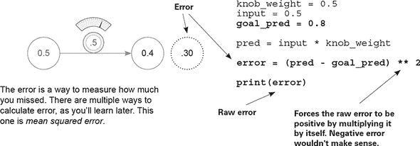


**goal_pred 变量是什么？**

与`input`一样，`goal_pred`是在现实世界中记录的数字。但它通常是难以观察的东西，比如“给定温度，有多少百分比的人*确实*穿了运动服”；或者“给定他的打击率，击球手*是否*击出了全垒打”。 

**为什么错误要平方？**

想象一个射箭手射中靶心。当箭射高了 2 英寸，射箭手错过了多少？当箭射低了 2 英寸，射箭手错过了多少？两种情况下，射箭手都只错过了 2 英寸。将“你错过了多少”平方的主要原因在于，它迫使输出为*正数*。`(pred - goal_pred)`在某些情况下可能是负数，*与实际错误不同*。

**平方不会使大错误（>1）更大，小错误（<1）更小吗？**

呃 ... 这是一种有点奇怪的测量错误的方法，但结果证明，*放大*大错误和*减少*小错误是可以接受的。稍后，你将使用这个错误来帮助网络学习，你更希望它*关注*大错误，而不是过多地担心小错误。好父母也是如此：如果错误足够小（比如铅笔断了），他们实际上会忽略错误；但如果错误很大（比如车祸），他们可能会非常严厉。你明白为什么平方是有价值的吗？


### 为什么要测量错误？

#### 测量错误简化了问题

训练神经网络的目的是做出正确的预测。这正是你想要的。在前面章节提到的最实用的情况下，你希望网络能够接受你容易计算的输入（今天的股价）并预测难以计算的事情（明天的股价）。这就是神经网络有用的原因。

结果表明，将`knob_weight`改为使网络正确预测`goal_prediction`比将其改为使`error == 0`要复杂一些。以这种方式看待问题有一些更简洁的地方。最终，这两个陈述说的是同一件事，但试图*将错误降到 0*似乎更直接。

#### 测量错误的不同方法*优先考虑错误的方式不同*。

如果现在这有点牵强，那没关系，但回想一下我之前说的：通过**平方**错误，小于 1 的数字会变得更小，而大于 1 的数字会变得更大。你将改变我所说的**纯错误**（`pred - goal_pred`），使得大的错误变得非常大，而小的错误迅速变得无关紧要。

通过这种方式测量错误，你可以将大错误优先于小错误。当你有相当大的纯错误（比如说，10）时，你会告诉自己你有**非常大的错误**（10**2 == 100）；而相比之下，当你有小的纯错误（比如说，0.01）时，你会告诉自己你有**非常小的错误**（0.01**2 == 0.0001）。你明白我说的优先级是什么吗？这只是修改你**认为的错误**，以便放大大的错误，而大量忽略小的错误。

相反，如果你取的是错误的绝对值而不是平方错误，你就不会有这种优先级。错误就只是纯错误的正值——这很好，但不同。关于这一点，稍后还会详细说明。

#### 你为什么只想看到**正**的错误？

最终，你将处理数百万个`input` -> `goal_prediction`对，我们仍然希望做出准确的预测。因此，你将尝试将**平均误差**降低到 0。

如果错误可以是正的也可以是负的，这就带来了问题。想象一下，如果你试图让神经网络正确预测两个数据点——两个`input` -> `goal_prediction`对。如果第一个有 1000 的错误，第二个有-1000 的错误，那么**平均错误**将是**零**！你会让自己误以为你预测得完美，但实际上每次都差了 1000！这会很糟糕。因此，你希望每个预测的错误始终是**正**的，这样在平均时它们就不会意外地相互抵消。

### 神经学习最简单的形式是什么？

#### 使用热冷方法进行学习

最后，学习实际上就是关于一件事：调整`knob_weight`向上或向下，以减少错误。如果你一直这样做，错误降到 0，你就完成了学习！你怎么知道是向上还是向下转动旋钮？嗯，你尝试**向上和向下**转动，看看哪一个可以减少错误！哪一个减少了错误，就用来更新`knob_weight`。这很简单但很有效。你一次又一次地这样做，最终错误等于 0，这意味着神经网络正在以完美的准确性进行预测。

| |
| --- |

**热冷学习**

**热冷学习**意味着调整权重以查看哪个方向可以最大程度地减少错误，然后在这个方向上移动权重，重复这个过程，直到错误达到 0。

| |
| --- |

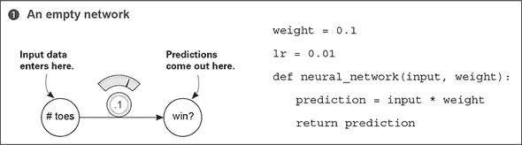

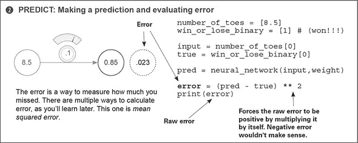

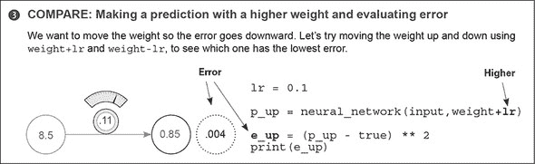

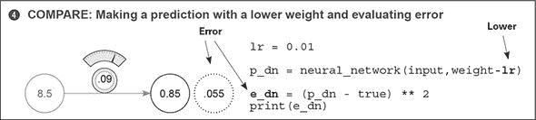

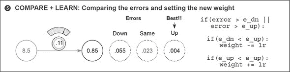

这最后五步是热冷学习的一次迭代。幸运的是，这个迭代本身就让我们非常接近正确答案（新的错误仅为 0.004）。但在正常情况下，我们可能需要重复这个过程很多次才能找到正确的权重。有些人可能需要训练他们的网络数周或数月才能找到足够好的权重配置。

这揭示了神经网络学习实际上是什么：一个*搜索问题*。你正在*搜索*最佳可能的权重配置，以便网络的错误降到 0（并做出完美预测）。与其他所有形式的搜索一样，你可能找不到你想要的，即使你找到了，也可能需要一些时间。接下来，我们将使用热冷学习进行稍微困难一些的预测，以便你可以看到这个搜索过程！

### 热冷学习

#### 这可能是最简单的学习形式

在你的 Jupyter 笔记本中执行以下代码。（新的神经网络修改用**粗体**标出。）此代码尝试正确预测 0.8：

```
weight = 0.5
input = 0.5
goal_prediction = 0.8

step_amount = 0.001                                        *1*

for iteration in range(1101):                              *2*

    prediction = input * weight
    error = (prediction - goal_prediction) ** 2

    print("Error:" + str(error) + " Prediction:" + str(prediction))

    up_prediction = input * (weight + step_amount)         *3*
    up_error = (goal_prediction - up_prediction) ** 2

    down_prediction = input * (weight - step_amount)       *4*
    down_error = (goal_prediction - down_prediction) ** 2

    if(down_error < up_error):
        weight = weight - step_amount                      *5*

    if(down_error > up_error):
        weight = weight + step_amount                      *6*
```

+   ***1* 每次迭代移动权重多少**

+   ***2* 多次重复学习，以便错误可以持续减小。**

+   ***3* 尝试向上！**

+   ***4* 尝试向下！**

+   ***5* 如果向下更好，就向下走！**

+   ***6* 如果向上更好，就向上走！**

当我运行这段代码时，我看到了以下输出：

```
Error:0.3025 Prediction:0.25
Error:0.30195025 Prediction:0.2505
            ....
Error:2.50000000033e-07 Prediction:0.7995
Error:1.07995057925e-27 Prediction:0.8       *1*
```

+   ***1* 最后一步正确预测了 0.8！**

### 热冷学习的特点

#### 这很简单

热冷学习法很简单。在做出预测之后，你预测两次更多，一次稍微增加权重，再次稍微减少权重。然后根据哪个方向给出了更小的错误来移动`权重`。重复足够多次后，最终将`错误`减少到 0。


**为什么我迭代了正好 1,101 次？**

例子中的神经网络在经过恰好那么多次迭代后达到了 0.8。如果你超过这个范围，它将在 0.8 和略高于或略低于 0.8 之间来回摆动，导致左页底部打印的错误日志不那么美观。你可以随意尝试。


#### 问题 1：它不够高效

你必须预测*多次*才能更新单个`knob_weight`。这似乎非常低效。

#### 问题 2：有时无法预测确切的预期目标

设置`step_amount`后，除非完美的`权重`正好在`n*step_amount`处，否则网络最终会超过一些小于`step_amount`的数字。当它这样做时，它将开始交替在`goal_prediction`的每一侧之间。将`step_amount`设置为 0.2 来观察这个效果。如果你将`step_amount`设置为 10，你真的会破坏它。当我尝试这样做时，我看到了以下输出。它从未接近 0.8！

```
Error:0.3025 Prediction:0.25
Error:19.8025 Prediction:5.25
Error:0.3025 Prediction:0.25
Error:19.8025 Prediction:5.25
Error:0.3025 Prediction:0.25
....
.... repeating infinitely...
```

真正的问题是，即使你知道移动`weight`的正确*方向*，你也不知道正确的*数量*。相反，你随机选择一个固定的值（`step_amount`）。此外，这个数量与`error`没有任何关系。无论`error`是大是小，`step_amount`都是相同的。所以，冷热学习有点令人沮丧。它效率低下，因为对于每个`weight`更新，你需要预测三次，而且`step_amount`是任意的，这可能会阻止你学习正确的`weight`值。

如果你能有一种方法来计算每个`weight`的方向和数量，而无需反复进行预测，会怎么样？

### 从误差计算方向和数量

#### 让我们来测量误差并找到方向和数量！

在你的 Jupyter 笔记本中执行此代码：

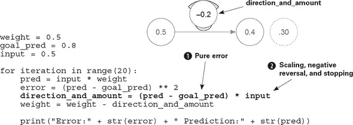

你在这里看到的是一种称为*梯度下降*的更高级的学习形式。这种方法允许你（在单行代码中，这里用**粗体**显示）计算你应该改变`weight`以减少`error`的*方向*和*数量*。

| |
| --- |

**方向和数量是什么？**

`direction_and_amount`代表你想要如何改变`weight`。第一部分***1***是我所说的*纯误差*，等于（`pred - goal_pred`）。（关于这一点，稍后会有更多介绍。）第二部分***2***是乘以`input`进行的缩放、负反转和停止操作，它修改了纯误差，使其准备好更新`weight`。

**纯误差是什么？**

纯误差是（`pred - goal_pred`），它表示你错过的原始方向和数量。如果这是一个*正*数，你预测得太高，反之亦然。如果这是一个*大*数，你错得很多，等等。

**缩放、负反转和停止是什么？**

这三个属性共同作用，将纯误差转换为你要改变`weight`的绝对数量。它们通过解决纯误差不足以对`weight`进行良好修改的三个主要边缘情况来实现这一点。

**停止是什么？**

停止是乘以`input`后对纯误差产生的第一个（也是最简单）的影响。想象一下将 CD 播放器插入你的立体声音响。如果你把音量开到最大，但 CD 播放器是关着的，音量变化就不会起作用。停止在神经网络中解决了这个问题。如果`input`是 0，那么它将迫使`direction_and_amount`也变为 0。当`input`为 0 时，你不会学习（改变音量），因为没有东西可以学习。每个`weight`值都有相同的`error`，移动它没有区别，因为`pred`始终为 0。

**负反转是什么？**

这可能是最困难和最重要的效果。通常（当 `input` 为正时），向上移动 `weight` 会使预测向上移动。但如果 `input` 为负，那么突然 `weight` 的方向就改变了！当 `input` 为负时，向上移动 `weight` 会使预测向下移动。它是相反的！你该如何解决这个问题？嗯，如果 `input` 为负，将纯错误乘以 `input` 将会反转 `direction_and_amount` 的符号。这是负反转，确保即使 `input` 为负，`weight` 也能向正确的方向移动。

**什么是缩放？**

缩放是乘以 `input` 后对纯错误产生的第三个影响。从逻辑上讲，如果 `input` 很大，你的 `weight` 更新也应该很大。这更多的是一个副作用，因为它经常失控。稍后，你将使用 *alpha* 来处理这种情况。


当你运行前面的代码时，你应该看到以下输出：

```
Error:0.3025 Prediction:0.25
Error:0.17015625 Prediction:0.3875
Error:0.095712890625 Prediction:0.490625
                    ...

Error:1.7092608064e-05 Prediction:0.79586567925
Error:9.61459203602e-06 Prediction:0.796899259437
Error:5.40820802026e-06 Prediction:0.797674444578     *1*
```

+   ***1* 最后的步骤正确地接近了 0.8！**

在这个例子中，你在一个简化的环境中看到了梯度下降的作用。接下来，你将在其更自然的环境中看到它。一些术语可能会有所不同，但我会用一种使其更明显适用于其他类型网络（如具有多个输入和输出的网络）的方式编写代码。

### 梯度下降的一次迭代

#### 这对一个训练示例（输入->真实）对进行权重更新

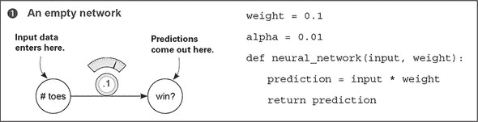

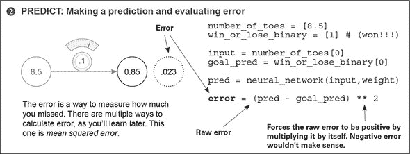

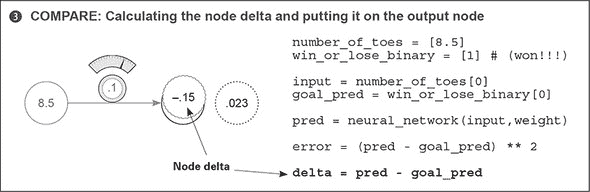

`delta` 是衡量这个节点错过多少的度量。真实预测是 1.0，而网络的预测是 0.85，所以网络低估了 0.15。因此，`delta` 是负值 0.15。

梯度下降和这种实现之间的主要区别是新的变量 `delta`。它是节点过高或过低的原始量。你首先计算你希望输出节点有多大的不同，然后才计算 `direction_and_amount` 来改变 `weight`（在第 4 步中，现在重命名为 `weight_delta`）：

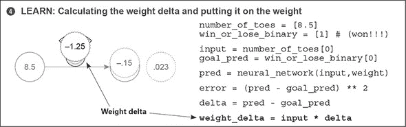

`weight_delta` 是衡量一个权重导致网络错过多少的度量。你通过将权重的输出节点 `delta` 乘以权重的 `input` 来计算它。因此，你通过 *缩放* 输出节点 `delta` 的 `input` 来创建每个 `weight_delta`。这考虑了上述三个 `direction_and_amount` 的属性：缩放、负反转和停止。

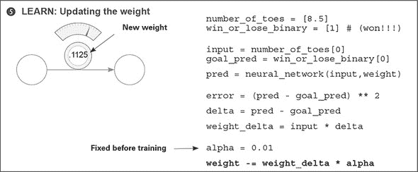

在使用它来更新 `weight` 之前，你将 `weight_delta` 乘以一个小的数字 `alpha`。这让你可以控制网络学习的速度。如果它学得太快，它可能会过于激进地更新权重并超出范围。（关于这一点稍后会有更多讨论。）请注意，权重更新与热学习和冷学习产生了相同的变化（小的增加）。

### 学习就是减少错误

#### 你可以修改权重以减少错误

将前几页的代码组合起来，我们现在有以下内容：

```
weight, goal_pred, input = (0.0, 0.8, 0.5)

for iteration in range(4):

    pred = input * weight              *1*
    error = (pred - goal_pred) ** 2    *1*
    delta = pred - goal_pred
    weight_delta = delta * input
    weight = weight - weight_delta
    print("Error:" + str(error) + " Prediction:" + str(pred))
```

+   ***1* 最后的步骤正确地接近了 0.8！**


**学习的黄金法则**

这种方法调整每个`weight`的正确方向和正确数量，以便将`error`减少到 0。


你所要做的一切就是找出正确的方向和数量来修改`weight`，以便`error`下降。秘密在于`pred`和`error`的计算。注意你在`error`计算中使用`pred`。让我们用生成它的代码替换`pred`变量：

```
error = ((input * weight) - goal_pred) ** 2
```

这根本不会改变`error`的值！它只是将两行代码合并，并直接计算`error`。记住，`input`和`goal_prediction`分别固定在 0.5 和 0.8（你在网络开始训练之前设置了它们）。所以，如果你用它们的值替换变量名，秘密就变得明显了：

```
error = ((0.5 * weight) - 0.8) ** 2
```


**秘密**

对于任何`input`和`goal_pred`，`error`和`weight`之间定义了一种精确的关系，这是通过结合`prediction`和`error`公式找到的。在这种情况下：

```
error = ((0.5 * weight) - 0.8) ** 2
```


假设你增加了`weight` 0.5。如果`error`和`weight`之间存在精确的关系，你应该能够计算出这也将如何移动`error`。如果你想将`error`移动到特定的方向，这能实现吗？

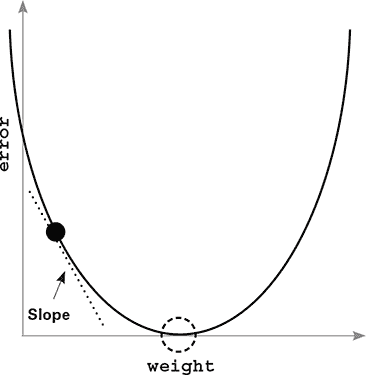

此图表示根据前一个公式中的关系，每个`weight`的每个`error`值。注意它形成了一个漂亮的碗形。黑色圆点位于当前`weight`和`error`的点。虚线圆圈是你想要到达的地方（`error`等于 0）。


**关键要点**

斜率指向碗的*底部*（最低`error`），无论你在碗的哪个位置。你可以使用这个斜率来帮助神经网络减少错误。


### 让我们观察学习过程中的几个步骤

#### 我们最终能找到碗底吗？

```
weight, goal_pred, input = (0.0, 0.8, 1.1)

for iteration in range(4):
    print("-----\nWeight:" + str(weight))
    pred = input * weight
    error = (pred - goal_pred) ** 2
    delta = pred - goal_pred
    weight_delta = delta * input
    weight = weight - weight_delta
    print("Error:" + str(error) + " Prediction:" + str(pred))
    print("Delta:" + str(delta) + " Weight Delta:" + str(weight_delta))
```

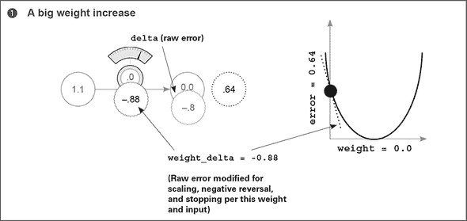

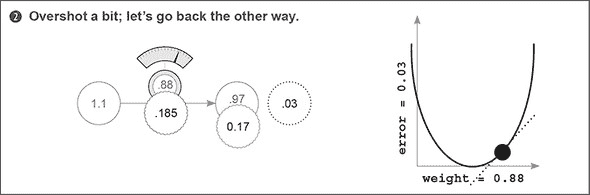

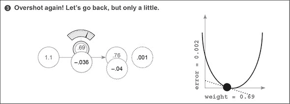

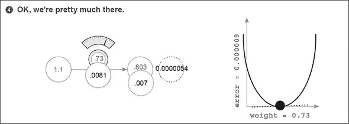

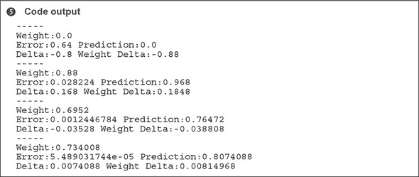

### 为什么这能工作？权重增量（weight_delta）到底是什么？

#### 让我们回顾一下并讨论函数。什么是函数？你如何理解它？

考虑这个函数：

```
def my_function(x):
   return x * 2
```

函数接收一些数字作为输入，并给出另一个数字作为输出。正如你可以想象的那样，这意味着函数定义了输入数字和输出数字之间的一种关系。也许你也能看出学习函数的能力为什么如此强大：它让你能够将一些数字（比如图像像素）转换为其他数字（比如图像包含猫的概率）。

每个函数都有你可能称之为*动态部分*的部分：你可以调整或改变这些部分来使函数生成的输出不同。考虑一下前一个例子中的`my_function`。问问自己，“是什么控制着这个函数的输入和输出之间的关系？”答案是，2。对于下面的函数，也提出同样的问题：

```
error = ((input * weight) - goal_pred) ** 2
```

是什么控制着`input`和输出（`error`）之间的关系？有很多东西在起作用——这个函数稍微复杂一些！`goal_pred`、`input`、`**2`、`weight`以及所有括号和代数运算（加法、减法等等）都在计算误差中发挥作用。调整其中任何一个都会*改变*误差。这一点很重要。

作为一种思维练习，考虑将`goal_pred`改为减少误差。这很愚蠢，但完全可行。在现实生活中，你可能会称这（设定目标为你的能力所及）为“放弃”。你是在否认你犯了错误！这也不行。

如果你改变`input`直到`error`降到 0 会怎样？嗯，这就像是你想看到的世界而不是实际的世界。你正在改变输入数据，直到你预测你想预测的东西（这大致是*inceptionism*的工作方式）。

现在考虑改变 2，或者加法、减法或乘法。这只是在最初改变计算`error`的方式。如果误差计算实际上不能给出你遗漏了多少（如几页前提到的正确属性）的良好度量，那么这种计算是没有意义的。这也不行。

剩下什么？唯一剩下的变量是`weight`。调整它不会改变你对世界的看法，也不会改变你的目标，更不会破坏你的误差度量。改变`weight`意味着函数*符合数据中的模式*。通过迫使函数的其他部分保持不变，你迫使函数正确地模拟数据中的某些模式。它只允许修改网络*预测*的方式。

总结一下：你修改误差函数的特定部分，直到`error`值降到 0。这个误差函数是通过一系列变量计算得出的，其中一些你可以改变（权重），而另一些你不能（输入数据、输出数据和误差逻辑）：

```
weight = 0.5
goal_pred = 0.8
input = 0.5

for iteration in range(20):
    pred = input * weight
    error = (pred - goal_pred) ** 2
    direction_and_amount = (pred - goal_pred) * input
    weight = weight - direction_and_amount

    print("Error:" + str(error) + " Prediction:" + str(pred))
```

| |
| --- |

**关键要点**

你可以修改`pred`计算中的任何东西，除了`input`。

| |
| --- |

我们将在本书的剩余部分（以及许多深度学习研究人员将花费他们余生的时间）尝试所有你能想象到的关于那个`pred`计算的方法，以便它能做出良好的预测。学习就是自动改变预测函数，使其做出良好的预测——即，使后续的`error`降到 0。

现在你已经知道你可以改变什么，那么你如何着手进行改变呢？这就是关键所在。这就是机器学习，对吧？在下一节中，我们将详细讨论这一点。

### 对一个概念的狭隘视野

#### 概念：学习就是调整权重以将误差降至 0

到目前为止，在本章中，我们一直在强调学习实际上只是调整`weight`以将`error`降至 0 的想法。这是秘密配方。说实话，知道如何做到这一点完全关乎理解`weight`和`error`之间的*关系*。如果你理解这种关系，你就可以知道如何调整`weight`以减少`error`。

我所说的“理解关系”是什么意思呢？嗯，理解两个变量之间的关系就是理解*一个变量如何改变另一个变量*。在这种情况下，你真正追求的是这两个变量之间的*敏感性*。敏感性是方向和数量的另一种说法。你想要知道`error`对`weight`的敏感性。你想要知道当你改变`weight`时，`error`变化的方向和数量。这就是目标。到目前为止，你已经看到了两种不同的方法，试图帮助你理解这种关系。

当你调整`weight`（热学习和冷学习）并研究它对`error`的影响时，你实际上是在实验性地研究这两个变量之间的关系。这就像走进一个有 15 个不同未标记的开关的房间。你开始打开和关闭它们，以了解它们与房间内各种灯光的关系。你做了同样的事情来研究`weight`和`error`之间的关系：你上下调整`weight`，观察它如何改变`error`。一旦你知道了关系，你就可以使用两个简单的`if`语句将`weight`移动到正确的方向：

```
if(down_error < up_error):
    weight = weight - step_amount

if(down_error > up_error):
    weight = weight + step_amount
```

现在，让我们回到之前结合了`pred`和`error`逻辑的公式。正如提到的，它们在`error`和`weight`之间定义了一个精确的关系：

```
error = ((input * weight) - goal_pred) ** 2
```

这段代码，女士们先生们，是秘密。这是一个公式。这是`error`和`weight`之间的关系。这种关系是精确的。它是可计算的。它是普遍的。它现在是，将来也始终是。

现在，你如何使用这个公式来知道如何改变`weight`，以便`error`向特定方向移动？*那*才是正确的问题。停下。我恳求你。停下并欣赏这个时刻。这个公式是这两个变量之间的精确关系，现在你将找出如何改变一个变量，以使另一个变量向特定方向移动。

事实上，有一种方法可以用于*任何*公式。你会用它来减少误差。

### 一个有杆从里面伸出来的箱子

想象一下，你坐在一个纸箱前，这个纸箱有两个圆形杆从两个小孔中伸出。蓝色杆从箱子中伸出 2 英寸，红色杆从箱子中伸出 4 英寸。想象一下，我告诉你这些杆是连接的，但我不会告诉你连接的方式。你必须通过实验来找出答案。

所以，你拿起蓝色的杆子，向里推 1 英寸，然后观察，在你推的过程中，红色的杆子也向盒子里移动了 2 英寸。然后，你把蓝色的杆子拉回 1 英寸，红色的杆子又跟着拉出，拉出 2 英寸。你学到了什么？好吧，似乎红色和蓝色杆子之间存在一种关系。无论你移动蓝色杆子多少，红色杆子都会移动两倍的距离。你可能会说以下是真的：

```
red_length = blue_length * 2
```

实际上，对于“当我拉这部分时，另一部分移动了多少？”有一个正式的定义，它被称为导数，它实际上意味着“当我拉杆 Y 时，杆 X 移动了多少？”

在红色和蓝色杆子的例子中，“当我拉蓝色时红色移动了多少”的导数是 2。仅仅是 2。为什么是 2？这是由公式确定的乘法关系：

```
red_length = blue_length * 2     *1*
```

+   ***1* 导数**

注意，你总是有两个变量之间的导数。你总是在寻找当你改变一个变量时，另一个变量是如何移动的。如果导数是正的，那么当你改变一个变量时，另一个将朝着相同的方向移动。如果导数是负的，那么当你改变一个变量时，另一个将朝着相反的方向移动。

考虑几个例子。因为`red_length`相对于`blue_length`的导数是 2，这两个数会朝着同一方向移动。更具体地说，红色会以两倍于蓝色的速度在同一方向上移动。如果导数是-1，红色将以相同的数量朝相反方向移动。因此，给定一个函数，导数表示当你改变另一个变量时，一个变量变化的方向和数量。这正是我们一直在寻找的。

### 导数：取两个

#### 你对它们还是有点不确定？让我们从另一个角度来考虑

我听说人们有两种解释导数的方式。一种方式是关于理解当你移动另一个变量时，函数中的一个变量是如何变化的。另一种方式是说导数是直线或曲线上某一点的斜率。实际上，如果你取一个函数并绘制它（画出它），你绘制的线的斜率与“当你改变另一个变量时，一个变量变化了多少”是同一回事。让我通过绘制我们最喜欢的函数来展示给你看：

```
error = ((input * weight) - goal_pred) ** 2
```

记住，`goal_pred`和`input`是固定的，所以你可以重写这个函数：

```
error = ((0.5 * weight) - 0.8) ** 2
```

因为只剩下两个变量会改变（其余的都是固定的），你可以计算每个`权重`及其对应的`误差`。让我们把它们画出来。

如你所见，图表看起来像一个大 U 形曲线。注意，中间也有一个点，其中`error`等于 0。注意，在那个点右边，线的斜率是正的，而在那个点左边，线的斜率是负的。也许更有趣的是，离*目标权重*越远，斜率越陡。

这些是有用的属性。斜率的符号给你方向，斜率的陡峭程度给你数量。你可以使用这两个属性来帮助找到目标`权重`。

即使现在，当我看那条曲线时，我也很容易失去对它所代表的含义的跟踪。这类似于学习中的冷热法。如果你尝试了所有可能的`权重`值并绘制出来，你就会得到这条曲线。

关于导数的显著之处在于，它们可以超越计算`误差`的大公式（本节开头），看到这条曲线。你可以计算任何`权重`值的线的斜率（导数）。然后你可以使用这个斜率（导数）来确定哪个方向可以减少误差。更好的是，根据斜率的陡峭程度，你可以至少得到一些关于你距离斜率为零的优化点的距离的想法（尽管这不是一个精确的答案，你会在后面学到更多）。

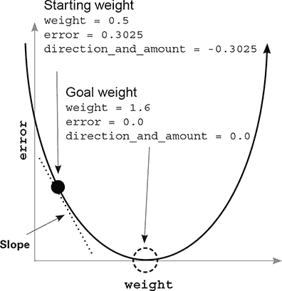

### 你真正需要知道的是

#### 使用导数，你可以从任何公式中挑选任意两个变量，并了解它们是如何相互作用的

看看这个*巨大的函数*：

```
y = (((beta * gamma) ** 2) + (epsilon + 22 - x)) ** (1/2)
```

关于导数，你需要知道的是。对于任何函数（即使是这个巨大的函数），你都可以挑选任意两个变量，并理解它们之间的关系。对于任何函数，你都可以挑选两个变量，像我们之前做的那样，将它们绘制在 x-y 图上。对于任何函数，你都可以挑选两个变量，并计算当你改变其中一个变量时，另一个变量会发生多少变化。因此，对于任何函数，你可以学习如何改变一个变量，以便你可以将另一个变量移动到某个方向。对不起，我再次强调这个观点，但重要的是你要在内心深处知道这一点。

总结：在这本书中，你将构建神经网络。神经网络实际上就是一件事情：你用来计算误差函数的一组权重。对于任何误差函数（无论多么复杂），你都可以计算任何`权重`与网络的最终`误差`之间的关系。有了这些信息，你可以改变神经网络中的每个`权重`，将`误差`降低到 0——这正是你将要做的。

### 你真正不需要知道的是

#### 微积分

所以，学习如何从任何函数中取任意两个变量并计算它们之间关系的方法，大约需要大学三个学期的时间。说实话，如果你上完这三个学期是为了学习如何进行深度学习，你将只会用到你所学内容的一小部分。实际上，微积分只是关于记住并练习每个可能函数的每个可能的导数规则。

在这本书中，我将做我在现实生活中通常做的事情（因为我懒惰——我是说，高效）：在参考表中查找导数。你需要知道的是导数代表什么。它是函数中两个变量之间的关系，这样你就可以知道当你改变另一个变量时，一个变量会改变多少。它只是两个变量之间的敏感性。

我知道这有很多信息要说，“它是两个变量之间的敏感性”，但确实是。请注意，这可以包括**正敏感性**（当变量一起移动时），**负敏感性**（当它们朝相反方向移动时），以及零敏感性（当一个变量保持固定，无论你对另一个变量做什么）。例如，*y* = 0 * *x*。移动 *x*，*y* 总是 0。

关于导数就说到这里。让我们回到梯度下降。

### 如何使用导数进行学习

#### 权重变化量是你的导数

误差和误差的导数以及权重的区别是什么？误差是你错过多少的衡量标准。导数定义了每个权重和你的错过之间的关系。换句话说，它告诉改变权重对误差的贡献有多大。所以，现在你知道这个，你是如何使用它来将误差移动到特定方向的呢？

你已经学会了函数中两个变量之间的关系，但你如何利用这种关系呢？实际上，这是非常直观的。再次查看误差曲线。黑色点代表权重开始的地方：（0.5）。虚线圆圈是你想要它去的地方：目标权重。你看到连接黑色点的虚线吗？那就是斜率，也就是导数。它告诉你在这个曲线上，当你改变权重时，误差会改变多少。注意它是向下指的：它是一个负斜率。

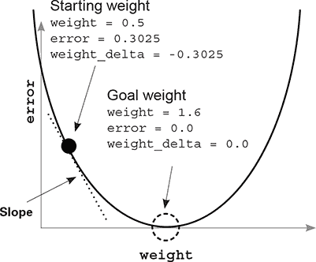

直线或曲线的斜率始终指向直线或曲线最低点的相反方向。所以，如果你有一个负斜率，你增加权重以找到误差的最小值。看看吧。

那么，你是如何使用导数来找到误差最小值（误差图中的最低点）的呢？你移动到斜率的相反方向——导数的相反方向。你可以取每个权重值，计算它与误差的导数（这样你比较的是两个变量：权重和误差），然后改变权重，使其与斜率的相反方向。这样就会移动到最小值。

记住目标：你试图找出改变权重的方向和数量，以便误差下降。导数给出了函数中任何两个变量之间的关系。你使用导数来确定任何权重和误差之间的关系。然后你将权重移动到导数的相反方向，以找到最低的权重。哇！神经网络就学会了。

这种学习方法（寻找误差最小值）被称为*梯度下降*。这个名字应该看起来很直观。你将权重值移动到梯度的相反方向，从而将误差减少到 0。通过*相反*，我的意思是当你有一个负梯度时，增加权重，反之亦然。就像重力一样。

### 看起来熟悉吗？

```
weight = 0.0
goal_pred = 0.8
input = 1.1

for iteration in range(4):
    pred = input * weight
    error = (pred - goal_pred) ** 2
    delta = pred - goal_pred
    weight_delta = delta * input        *1*
    weight = weight - weight_delta

    print("Error:" + str(error) + " Prediction:" + str(pred))
```

+   ***1* 导数（误差随权重变化的速度）**

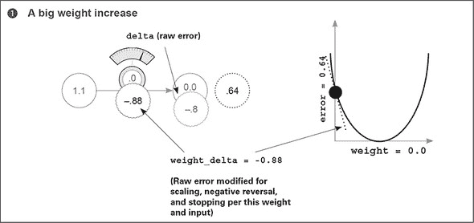

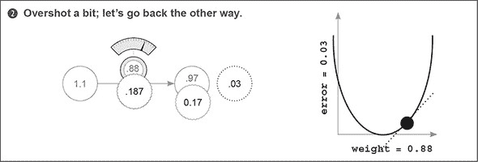

### 打破梯度下降

#### 只给我代码！

```
weight = 0.5
goal_pred = 0.8
input = 0.5

for iteration in range(20):
    pred = input * weight
    error = (pred - goal_pred) ** 2
    delta = pred - goal_pred
    weight_delta = input * delta
    weight = weight - weight_delta
    print("Error:" + str(error) + " Prediction:" + str(pred))
```

当我运行这段代码时，我看到了以下输出：

```
Error:0.3025 Prediction:0.25
Error:0.17015625 Prediction:0.3875
Error:0.095712890625 Prediction:0.490625
                    ...

Error:1.7092608064e-05 Prediction:0.79586567925
Error:9.61459203602e-06 Prediction:0.796899259437
Error:5.40820802026e-06 Prediction:0.797674444578
```

现在它已经起作用了，让我们来破坏它。尝试调整起始`权重`、`goal_pred`和`input`数字。你可以将它们都设置为几乎任何值，神经网络将找出如何使用权重根据输入预测输出。看看你是否能找到神经网络无法预测的组合。我发现尝试破坏某物是了解它的好方法。

让我们尝试将`input`设置为 2，但仍然尝试让算法预测 0.8。会发生什么？看看输出：

```
Error:0.04 Prediction:1.0
Error:0.36 Prediction:0.2
Error:3.24 Prediction:2.6
            ...

Error:6.67087267987e+14 Prediction:-25828031.8
Error:6.00378541188e+15 Prediction:77484098.6
Error:5.40340687069e+16 Prediction:-232452292.6
```

哇！这不是你想要的。预测爆炸了！它们在负数和正数之间交替，每一步都离真实答案越来越远。换句话说，每次更新权重都会过度校正。在下一节中，你将了解如何对抗这种现象。

### 可视化过度校正

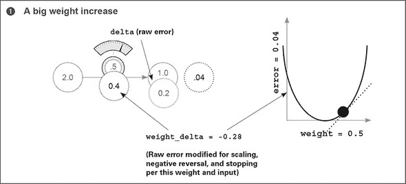

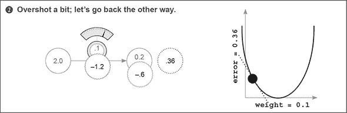

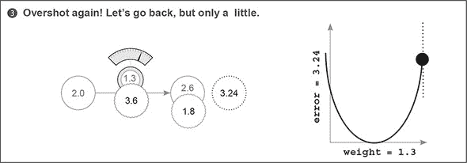

### 发散

#### 有时候神经网络的价值会爆炸。哎呀？

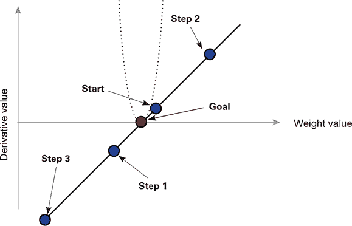

究竟发生了什么？误差爆炸是由你使输入变大的事实引起的。考虑你是如何更新权重的：

```
weight = weight - (input * (pred - goal_pred))
```

如果输入足够大，即使误差很小，这也可能导致权重更新很大。当你有一个大的权重更新和小的误差时会发生什么？网络会过度校正。如果新的误差更大，网络会过度校正得更多。这导致了你之前看到的称为*发散*的现象。

如果你有一个大的输入，预测对权重的变化非常敏感（因为`pred = input * weight`）。这可能导致网络过度校正。换句话说，即使权重仍然从 0.5 开始，该点的导数非常陡峭。看看图中 U 形误差曲线有多紧？

这真的很直观。你是如何预测的？通过将输入乘以权重。所以，如果输入很大，权重的微小变化会导致预测的变化。误差对权重非常敏感。换句话说，导数非常大。你是如何使它变小的？

### 引入 alpha

#### 这是防止过度校正权重更新的最简单方法

你试图解决的问题是什么？如果输入太大，那么权重更新可能会过度纠正。症状是什么？当你过度纠正时，新的导数在幅度上甚至比开始时更大（尽管符号将是相反的）。

停下来思考一下。再次看看上一节中的图表，以了解症状。第二步离目标更远，这意味着导数的幅度更大。这导致第三步比第二步更远离目标，神经网络就这样继续下去，表现出发散。

症状就是这种过度调整。解决方案是将权重更新乘以一个分数以使其更小。在大多数情况下，这涉及到将权重更新乘以一个介于 0 和 1 之间的单个实数，称为*alpha*。注意：这不会对核心问题产生影响，即输入较大。它也会减少不太大的输入的权重更新。

对于即使是最新技术的神经网络，找到合适的 alpha 通常是通过猜测来完成的。你观察错误随时间的变化。如果它开始发散（上升），那么 alpha 太高了，你就减小它。如果学习进展得太慢，那么 alpha 太低了，你就增加它。有其他方法比简单的梯度下降更有效地解决这个问题，但梯度下降仍然非常受欢迎。

### 代码中的 alpha

#### 我们的“alpha”参数在哪里发挥作用？

你刚刚了解到 alpha 减少了权重更新，以防止它过度调整。这对代码有什么影响？嗯，你根据以下公式更新权重：

```
weight = weight - derivative
```

考虑到 alpha 的变化相对较小，如以下所示。注意，如果 alpha 很小（比如说，0.01），它将大大减少权重更新，从而防止它过度调整：

```
weight = weight - (alpha * derivative)
```

这很简单。让我们将 alpha 安装到本章开头的小型实现中，并在`input` = 2 的地方运行它（之前这不起作用）：

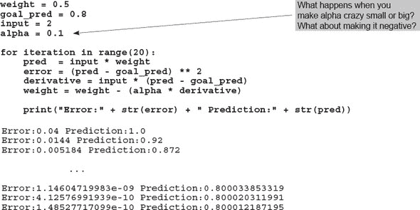

哇！现在最小的神经网络又可以做出良好的预测了。我是怎么知道将 alpha 设置为 0.1 的呢？说实话，我试了，而且它有效。尽管过去几年深度学习取得了疯狂的发展，但大多数人只是尝试几个 alpha 的量级（10，1，0.1，0.01，0.001，0.0001），然后从那里调整以查看哪个效果最好。这更多的是艺术而不是科学。有更多高级的方法可以到达那里，但现在，尝试各种 alpha，直到找到一个似乎效果很好的。玩一玩。

### 记忆

#### 是时候真正学习这些内容了

这可能听起来有点过于激烈，但我无法强调我从这个练习中发现的价值的多少：尝试从记忆中在 Jupyter 笔记本（或者如果你必须的话，一个.py 文件）中构建上一节中的代码。我知道这可能看起来有些过度，但（就我个人而言）直到我能够完成这个任务，我都没有在神经网络上有“顿悟”的时刻。

为什么这会起作用呢？首先，唯一知道你是否已经从本章中获取了所有必要信息的方法就是尝试从你的脑海中复现它。神经网络有很多小的移动部件，很容易遗漏其中一个。

这对于本书的其余部分为什么很重要呢？在接下来的章节中，我会以更快的速度引用本章讨论的概念，这样我就可以有更多的时间来讲解新的材料。当我提到“将你的 alpha 参数化添加到权重更新中”这样的内容时，你能够立即识别出我指的是本章中的哪些概念，这是至关重要的。

也就是说，我个人以及许多过去接受过我关于这个主题建议的人，通过记忆神经网络代码的小片段获得了巨大的益处。
