## 第五章\. 一次学习多个权重：泛化梯度下降

**本章内容**

+   多输入梯度下降学习

+   冻结一个权重：它做什么？

+   多输出梯度下降学习

+   多输入和输出梯度下降学习

+   可视化权重值

+   可视化点积

> “你不会通过遵循规则来学习走路。你是通过做和摔倒来学习的。”
> 
> *理查德·布兰森，[`mng.bz/oVgd`](http://mng.bz/oVgd)*

### 多输入梯度下降学习

#### 梯度下降也适用于多输入

在上一章中，你学习了如何使用梯度下降来更新权重。在这一章中，我们将或多或少地揭示如何使用相同的技巧来更新包含多个权重的网络。让我们先从深入浅出开始，好吗？以下图表显示了具有多个输入的网络如何学习。

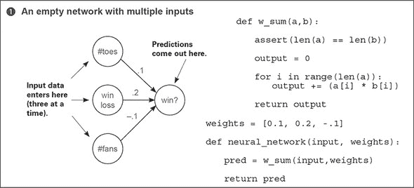

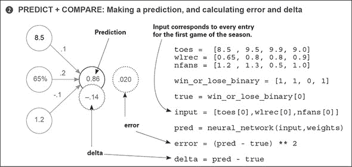

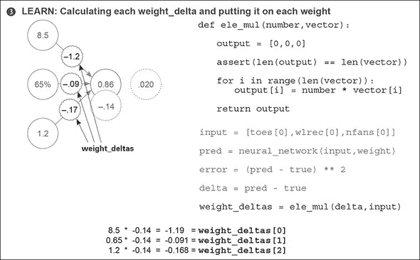

这张图没有什么新东西。每个 `weight_delta` 都是通过将其输出 `delta` 乘以其 `input` 来计算的。在这种情况下，因为三个权重共享相同的输出节点，它们也共享该节点的 `delta`。但由于它们的 `input` 值不同，权重有不同的 `weight_delta`。注意，你可以重用之前的 `ele_mul` 函数，因为你在 `weights` 中的每个值都乘以相同的值 `delta`。

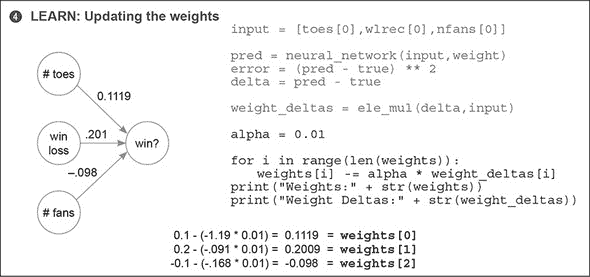

### 多输入梯度下降解释

#### 简单易行，理解起来非常迷人

当与单权重神经网络并排放置时，多输入的梯度下降在实践中似乎相当明显。但涉及的属性非常迷人，值得讨论。首先，让我们并排看看它们。

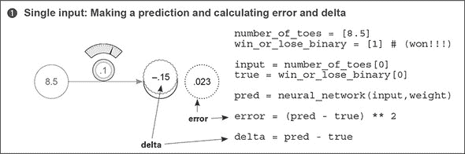

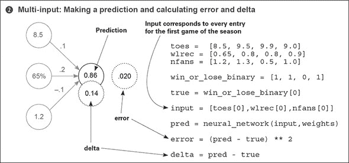

在输出节点生成 `delta` 之前，单输入和多输入的梯度下降是相同的（除了我们在第三章中研究的预测差异）。你做出预测，并以相同的方式计算 `error` 和 `delta`。但问题仍然存在：当你只有一个 `weight` 时，你只有一个 `input`（一个 `weight_delta` 生成）。现在你有三个。你怎么生成三个 `weight_delta`？

#### 你如何将单个 delta（在节点上）转换为三个 weight_delta 值？

记住 `delta` 与 `weight_delta` 的定义和目的。`delta` 是衡量你希望节点值差异多少的度量。在这种情况下，你通过节点值和希望节点值是多少之间的直接减法来计算它（预测 - 真实）。正 `delta` 表示节点的值太高，负 `delta` 表示太低。

| |
| --- |

**delta**

你希望节点值高多少或低多少的度量，以便在给定当前训练示例的情况下完美预测。

| |
| --- |

`weight_delta`，另一方面，是减少`node_delta`的方向和数量的一个**估计**，通过导数推断得出。你是如何将`delta`转换成`weight_delta`的？你将`delta`乘以权重的`input`。


**weight_delta**

基于导数估计你应该移动权重以减少`node_delta`的方向和数量，考虑到缩放、负反转和停止。


从单个权重的角度来考虑，如右图所示：

+   **`delta`:** 嘿，`input`s——是的，你们三个。下次，预测得高一点。

+   **单个权重：** 嗯：如果我的`input`是 0，那么我的权重就不会起作用，我就不会改变任何东西（**停止**）。如果我的`input`是负数，那么我就会想减少我的权重而不是增加它（**负反转**）。但我的`input`是正的，而且相当大，所以我**猜测**我的个人预测对聚合输出非常重要。我将大大提高我的权重来补偿（**缩放**）。

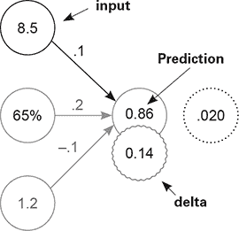

单个权重增加了其值。

那三个属性/陈述真正说了什么？它们都（停止、负反转和缩放）观察了权重在`delta`中的作用如何受到其`input`的影响。因此，每个`weight_delta`都是`delta`的一种输入修改版本。

这又把我们带回了最初的问题：如何将一个（节点）`delta`转换成三个`weight_delta`值？嗯，因为每个权重都有一个独特的输入和一个共享的`delta`，你使用每个相应权重的`input`乘以`delta`来创建每个相应的`weight_delta`。让我们看看这个过程是如何实施的。

在接下来的两个图中，你可以看到为之前单个输入架构和新的多输入架构生成`weight_delta`变量。也许最容易看到它们多么相似的方法是阅读每个图底部的伪代码。注意，多权重版本将`delta`（0.14）乘以每个输入来创建各种`weight_delta`。这是一个简单的过程。

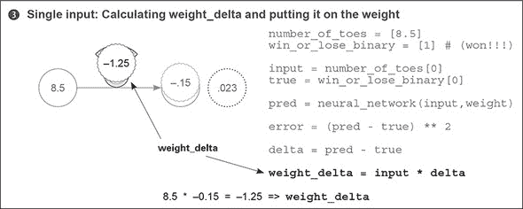

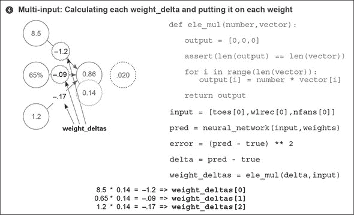

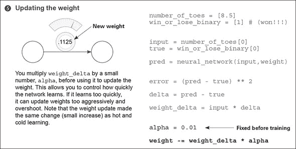

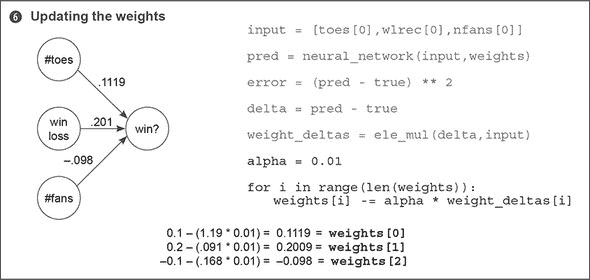

最后一步几乎与单个输入网络相同。一旦你有了`weight_delta`值，你将它们乘以`alpha`并从权重中减去。这实际上是之前相同的过程，只是在多个权重上重复，而不是单个权重。

### 让我们观察几个学习步骤

```
def neural_network(input, weights):
  out = 0
  for i in range(len(input)):
    out += (input[i] * weights[i])
  return out

def ele_mul(scalar, vector):
  out = [0,0,0]
  for i in range(len(out)):
    out[i] = vector[i] * scalar
  return out

toes = [8.5, 9.5, 9.9, 9.0]
wlrec = [0.65, 0.8, 0.8, 0.9]
nfans = [1.2, 1.3, 0.5, 1.0]

win_or_lose_binary = [1, 1, 0, 1]
true = win_or_lose_binary[0]

alpha = 0.01
weights = [0.1, 0.2, -.1]
input = [toes[0],wlrec[0],nfans[0]]

for iter in range(3):

  pred = neural_network(input,weights)

  error = (pred - true) ** 2
  delta = pred - true

  weight_deltas=ele_mul(delta,input)

  print("Iteration:" + str(iter+1))
  print("Pred:" + str(pred))
  print("Error:" + str(error))
  print("Delta:" + str(delta))
  print("Weights:" + str(weights))
  print("Weight_Deltas:")
  print(str(weight_deltas))
  print(
  )

  for i in range(len(weights)):
    weights[i]-=alpha*weight_deltas[i]
```

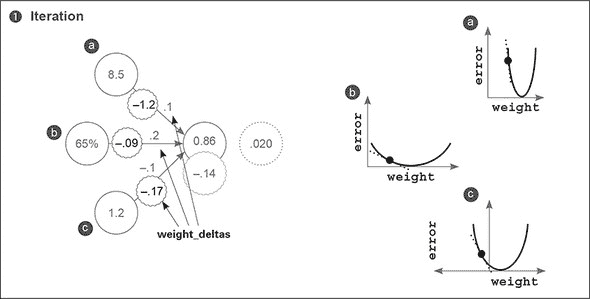

我们可以为每个权重制作三个单独的错误/权重曲线，每个权重一个。和之前一样，这些曲线的斜率（虚线）反映了`weight_delta`值。注意，***a***比其他曲线更陡。为什么与其他共享相同输出`delta`和`error`测量的`weight_delta`对于***a***来说更陡？因为***a***的`input`值显著高于其他，因此导数更高。

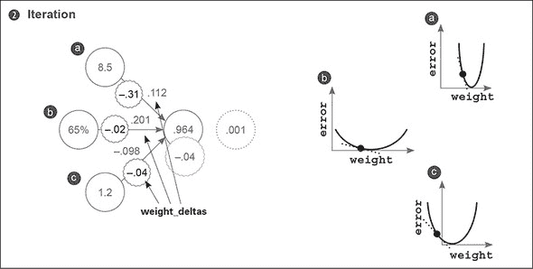


这里有一些额外的收获。大部分的学习（权重变化）都是在具有最大输入***a***的权重上进行的，因为输入会显著改变斜率。这并不一定在所有情况下都是有益的。一个名为*归一化*的子领域有助于鼓励在所有权重上学习，尽管有如这种数据集特征。这种显著的斜率差异迫使我将`alpha`设置得低于我想要的（0.01 而不是 0.1）。尝试将`alpha`设置为 0.1：你是否看到***a***导致它发散？

### 冻结一个权重：它有什么作用？

这个实验在理论上有点高级，但我认为它是理解权重如何相互影响的一个很好的练习。你将再次进行训练，但权重***a***将永远不会调整。你将尝试仅使用权重***b***和***c***（`weights[1]`和`weights[2]`）来学习训练示例。

```
def neural_network(input, weights):
  out = 0
  for i in range(len(input)):
    out += (input[i] * weights[i])
  return out

def ele_mul(scalar, vector):
  out = [0,0,0]
  for i in range(len(out)):
    out[i] = vector[i] * scalar
  return out

toes = [8.5, 9.5, 9.9, 9.0]
wlrec = [0.65, 0.8, 0.8, 0.9]
nfans = [1.2, 1.3, 0.5, 1.0]

win_or_lose_binary = [1, 1, 0, 1]
true = win_or_lose_binary[0]

alpha = 0.3
weights = [0.1, 0.2, -.1]
input = [toes[0],wlrec[0],nfans[0]]

for iter in range(3):
  pred = neural_network(input,weights)

  error = (pred - true) ** 2
  delta = pred - true

  weight_deltas=ele_mul(delta,input)
  weight_deltas[0] = 0

  print("Iteration:" + str(iter+1))
  print("Pred:" + str(pred))
  print("Error:" + str(error))
  print("Delta:" + str(delta))
  print("Weights:" + str(weights))
  print("Weight_Deltas:")
  print(str(weight_deltas))
  print(
  )

  for i in range(len(weights)):
    weights[i]-=alpha*weight_deltas[i]
```

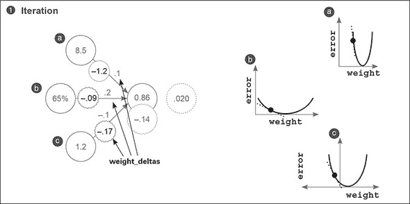

你可能很惊讶地看到***a***仍然找到了碗底。为什么？好吧，曲线是每个单独的权重相对于全局错误的度量。因此，因为`error`是共享的，当一个权重找到碗底时，所有权重都会找到碗底。

这是一个极其重要的教训。首先，如果你用***b***和***c***权重收敛（达到`error` = 0），然后尝试训练***a***，***a***就不会移动。为什么？`error` = 0，这意味着`weight_delta`是 0。这揭示了神经网络的一个潜在有害特性：***a***可能是一个强大的输入，具有大量的预测能力，但如果网络意外地发现如何在没有它的情况下准确预测训练数据，那么它将永远不会学会将其纳入其预测中。

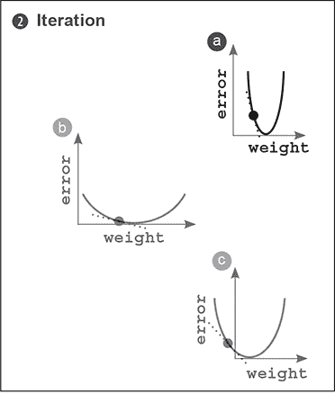

注意***a***是如何找到碗底的。不是黑色点在移动，而是曲线似乎向左移动。这意味着什么？黑色点只有在权重更新时才能水平移动。因为在这个实验中***a***的权重被冻结了，所以点必须保持固定。但是`error`显然降到了 0。

这告诉你了图表的真正含义。实际上，这些都是四维形状的二维切片。三个维度是权重值，第四个维度是错误。这个形状被称为*错误平面*，信不信由你，它的曲率是由训练数据决定的。为什么是这样？

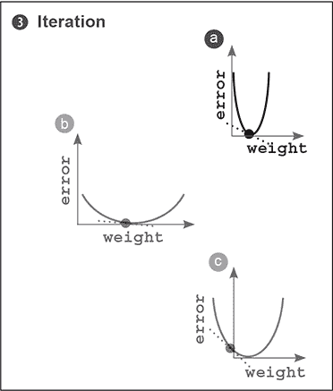

`error` 由训练数据决定。任何网络都可以有任意的 `weight` 值，但给定任何特定的权重配置的 `error` 值是由数据 100%决定的。你已经看到输入数据的陡峭程度是如何影响 U 形曲线的（在几次场合）。你真正试图用神经网络做到的是找到这个大错误平面上的最低点，这里的最低点指的是最低的 `error`。有趣，对吧？我们稍后会回到这个想法，所以现在先把它记下来。

### 多输出梯度下降学习

#### 神经网络也可以仅使用单个输入进行多次预测

也许这看起来有点明显。你以相同的方式计算每个 `delta`，然后将它们都乘以相同的单个输入。这变成了每个权重的 `weight_delta`。到目前为止，我希望你已经清楚，一个简单的机制（随机梯度下降）被一致地用于在各种架构中进行学习。

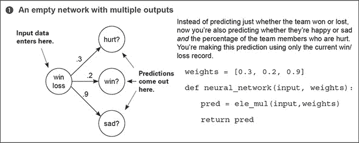

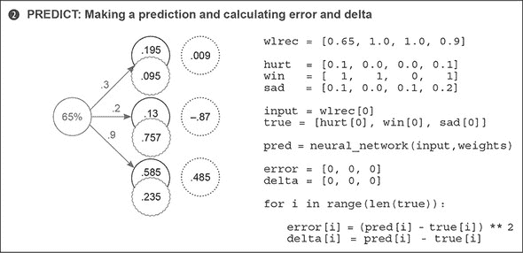

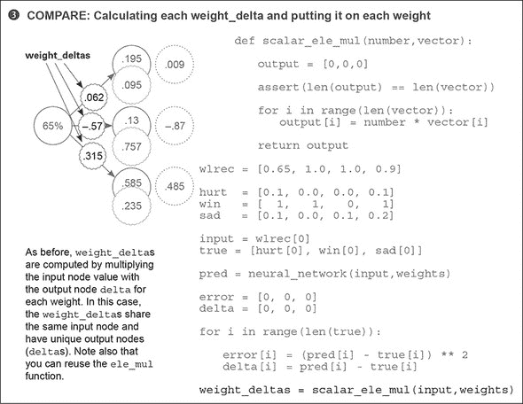


### 多输入多输出的梯度下降

#### 梯度下降可以推广到任意大的网络

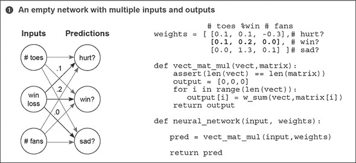

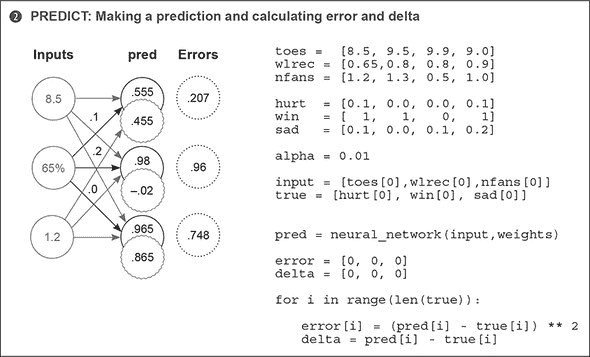

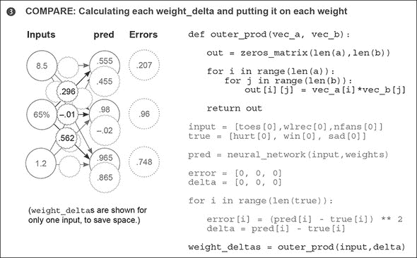

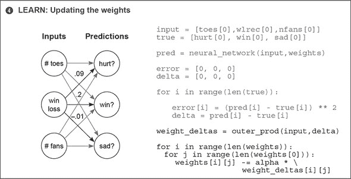

### 这些权重学习了什么？

#### 每个权重都试图减少错误，但它们在总体上学习了什么？

恭喜！这是本书中我们开始转向第一个真实世界数据集的部分。幸运的是，它具有历史意义。

它被称为修改后的国家标准与技术研究院（MNIST）数据集，它由一些年前高中生和美国人口普查局员工手写的数字组成。有趣的是，这些手写数字是人们手写的黑白图像。每个数字图像都附有他们实际写的数字（0-9）。在过去几十年里，人们一直使用这个数据集来训练神经网络读取人类手写，而今天，你将要做同样的工作。

每个图像只有 784 个像素（28 × 28）。鉴于你有 784 个像素作为输入和 10 个可能的标签作为输出，你可以想象神经网络的形状：每个训练示例包含 784 个值（每个像素一个），所以神经网络必须有 784 个输入值。很简单，对吧？你调整输入节点的数量以反映每个训练示例中的数据点数量。你想要预测 *10 个概率*：每个数字一个。给定一个输入绘制，神经网络将产生这 10 个概率，告诉你哪个数字最有可能被绘制。

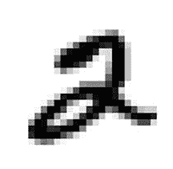

你如何配置神经网络以产生 10 个概率？在上一节中，你看到了一个可以一次接受多个输入并基于该输入做出多个预测的神经网络图。你应该能够修改这个网络，使其具有正确数量的输入和输出，以适应新的 MNIST 任务。你需要调整它，使其有 784 个输入和 10 个输出。

在 MNISTPreprocessor 笔记本中有一个脚本，用于预处理 MNIST 数据集，并将前 1000 张图像和标签加载到两个名为`images`和`labels`的 NumPy 矩阵中。你可能想知道：“图像是二维的。我如何将(28 × 28)像素加载到一个平坦的神经网络中？”目前，答案是简单的：将图像展平成一个 1 × 784 的向量。你将取像素的第一行，并将其与第二行、第三行等拼接起来，直到你有一个包含每张图像的像素列表（784 个像素长）。

此图表示新的 MNIST 分类神经网络。它与你之前用多个输入和输出训练的网络最相似。唯一的区别是输入和输出的数量，这已经大幅增加。此网络有 784 个输入（每个 28 × 28 图像中的像素一个）和 10 个输出（每个可能的数字一个）。

如果这个网络能够完美预测，它将接受图像的像素（比如，下一个图中的 2）并在正确的输出位置（第三个）预测 1.0，在其他所有位置预测 0。如果它能够对数据集中的所有图像都这样做，它将没有错误。

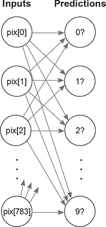

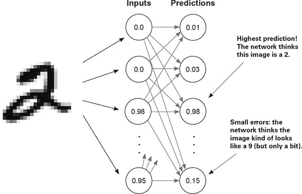

在训练过程中，网络将调整输入和预测节点之间的权重，以便在训练中使`error`值接近 0。但这意味着什么？修改大量权重以学习整体模式是什么意思？

### 可视化权重值

在神经网络研究中（尤其是对于图像分类器）的一个有趣且直观的实践是将权重可视化成图像。如果你看这个图，你就会明白为什么。

每个输出节点都有来自每个像素的权重。例如，2?节点有 784 个输入权重，每个权重映射像素和数字 2 之间的关系。

这个关系是什么？嗯，如果权重高，这意味着模型认为该像素和数字 2 之间存在高度的相关性。如果数字非常低（负数），那么网络认为该像素和数字 2 之间的相关性非常低（甚至可能是负相关性）。

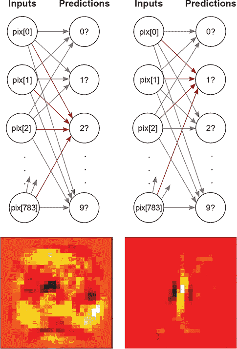

如果你将权重打印成与输入数据集图像相同形状的图像，你可以看到哪些像素与特定的输出节点相关性最高。在我们的例子中，使用 2 和 1 的权重分别创建的两个图像中，出现了非常模糊的 2 和 1。亮区代表高权重，暗区代表负权重。中性颜色（如果你在电子书中阅读，则是红色）代表权重矩阵中的 0。这表明网络通常知道 2 和 1 的形状。

为什么会这样？这把我们带回到了点积的课程。让我们快速回顾一下。

### 可视化点积（加权求和）

回想一下点积是如何工作的。它们取两个向量，逐元素相乘，然后对输出求和。考虑以下例子：

```
a = [ 0, 1, 0, 1]
b = [ 1, 0, 1, 0]

    [ 0, 0, 0, 0] -> 0    *1*
```

+   ***1* 分**

首先，你需要将 `a` 和 `b` 中的每个元素相互相乘，在这种情况下，创建了一个全为 0 的向量。这个向量的和也是 0。为什么？因为这两个向量没有共同点。

```
c = [ 0, 1, 1, 0]            b = [ 1, 0, 1, 0]
d = [.5, 0,.5, 0]            c = [ 0, 1, 1, 0]
```

但 `c` 和 `d` 之间的点积返回更高的分数，因为具有正值的列之间存在重叠。两个相同向量的点积通常会导致更高的分数。结论是：*点积是衡量两个向量之间相似性的粗略度量。*

这对权重和输入意味着什么？嗯，如果 `weight` 向量与 2 的 `input` 向量相似，那么它将输出一个高分，因为这两个向量相似。相反，如果 `weight` 向量与 2 的 `input` 向量不相似，它将输出一个低分。你可以在以下图中看到这一点。为什么最高分（0.98）比较低分（0.01）高？

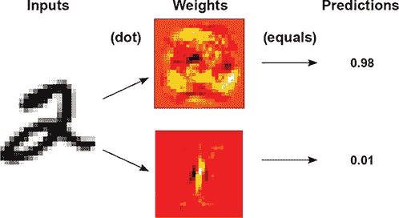

### 摘要

#### 梯度下降是一种通用学习算法

本章最重要的潜台词可能是梯度下降是一个非常灵活的学习算法。如果你以某种方式组合权重，可以计算误差函数和 `delta`，梯度下降可以告诉你如何移动权重以减少误差。本书的剩余部分将探讨梯度下降对不同的权重组合和误差函数有用的不同类型。下一章也不例外。
