## 第六章\. 构建您的第一个深度神经网络：反向传播简介

**本章内容**

+   街灯问题

+   矩阵和矩阵关系

+   全局、批量和随机梯度下降

+   神经网络学习相关性

+   过拟合

+   创建您自己的相关性

+   反向传播：长距离错误归因

+   线性与非线性的比较

+   有时相关性的秘密

+   您的第一个深度网络

+   代码中的反向传播：整合一切

> “O 深思考计算机，”他说，“我们为你设计的任务是这个。我们想让你告诉我们……”他停顿了一下，“答案。”
> 
> *道格拉斯·亚当斯，《银河系漫游指南》*

### 街灯问题

#### 这个玩具问题考虑了网络如何学习整个数据集

想象一下你正在一个外国国家的街角。当你接近时，你抬头发现街灯很陌生。你怎么知道什么时候可以过马路？

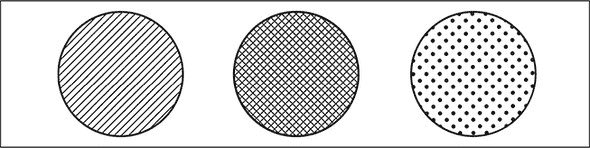

你可以通过解读街灯来判断是否安全过马路。但在这个情况下，你不知道如何解读它。哪些灯光组合表示是时候*走*了？哪些表示是时候*停*了？为了解决这个问题，你可能会坐在街角几分钟，观察每个灯光组合与周围人选择走或停之间的相关性。你坐下并记录以下模式：

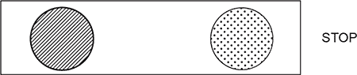

好吧，第一个灯没有人走过。这时你可能在想，“哇，这个模式可以是任何东西。左边的灯或右边的灯可能与停止相关，或者中央的灯可能与行走相关。”没有办法知道。让我们再取一个数据点：

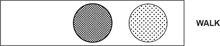

人们走了，所以这个灯的某些东西改变了信号。你唯一确定的是最右边的灯似乎没有指示一个方向或另一个方向。也许它无关紧要。让我们收集另一个数据点：

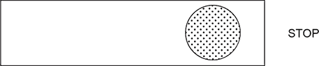

现在你正在取得进展。这次只有中间的灯改变了，你得到了相反的模式。工作假设是中间的灯表示人们感到安全可以走。在接下来的几分钟里，你记录以下六个灯光模式，注意人们是走还是停。你注意到整体上有模式吗？

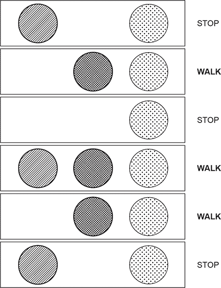

如预期的那样，中间（交叉）灯与是否安全过马路之间存在完美的相关性。你是通过观察所有单个数据点并*寻找相关性*来学习这个模式的。这就是你要训练神经网络去做的。

### 准备数据

#### 神经网络不读街灯

在前面的章节中，你学习了监督算法。你了解到它们可以将一个数据集转换成另一个数据集。更重要的是，它们可以将*你知道的*数据集转换成*你想知道的*数据集。

如何训练一个监督神经网络？你向它展示两个数据集，并要求它学习如何将一个转换成另一个。回想一下街灯问题。你能识别出两个数据集吗？哪一个你总是知道？哪一个你想要知道？

你确实有两个数据集。一方面，你有六个街灯状态。另一方面，你有六个关于人们是否行走的观察。这些就是这两个数据集。

你可以训练神经网络将你所知道的数据库转换为你想要知道的数据库。在这个特定的现实世界例子中，你知道任何给定时间的街灯状态，而你想要知道是否安全过马路。

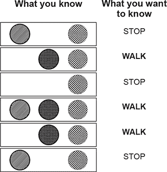

为了准备这些数据供神经网络使用，你首先需要将其分成这两组（你所知道的和你要知道的）。注意，如果你交换了哪个数据集在哪个组中，你可以尝试反向操作。对于某些问题，这可行。

### 矩阵及其矩阵关系

#### 将街灯转换为数学

数学不理解街灯。如前所述，你想要教会神经网络将街灯模式转换为正确的停止/行走模式。这里的关键词是*模式*。你真正想要做的是以数字的形式模仿街灯的模式。让我给你展示一下我的意思。

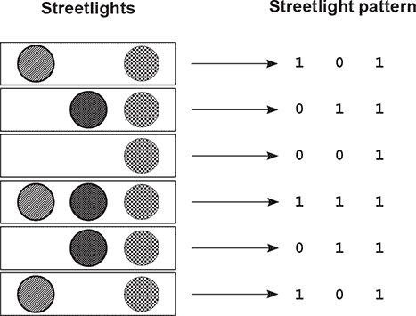

注意，这里显示的数字模式模仿了街灯以 1 和 0 的形式的模式。每个灯光都有一个列（总共有三列，因为有三个灯光）。还要注意的是，有六行代表六个不同的观察到的街灯。

这种由 1 和 0 组成的结构被称为*矩阵*。行和列之间的关系在矩阵中很常见，尤其是在数据矩阵（如街灯）中。

在数据矩阵中，惯例是给每个*记录的例子*一个单独的*行*。同样，惯例是给每个*被记录的事物*一个单独的*列*。这使得矩阵易于阅读。

因此，一列包含了一个事物被记录的每一个状态。在这种情况下，一列包含了一个特定灯光的每一个开/关状态的记录。每一行包含了一个特定时间点上每个灯光的同时状态。这同样是常见的。

#### 良好的数据矩阵完美地模仿外部世界

数据矩阵不必全是 1 和 0。如果街灯是调光开关，并且以不同的强度打开和关闭，会怎样？也许街灯矩阵看起来会更像这样：

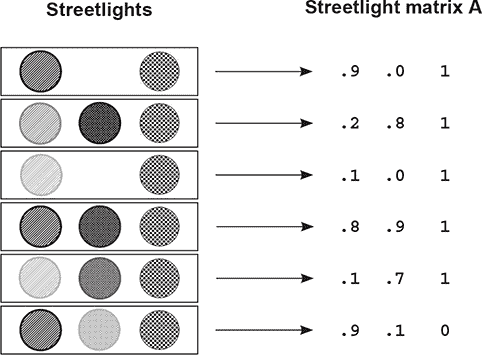

矩阵 A 是完全有效的。它模仿了现实世界中（街灯）存在的模式，因此你可以要求计算机解释它们。以下矩阵仍然有效吗？

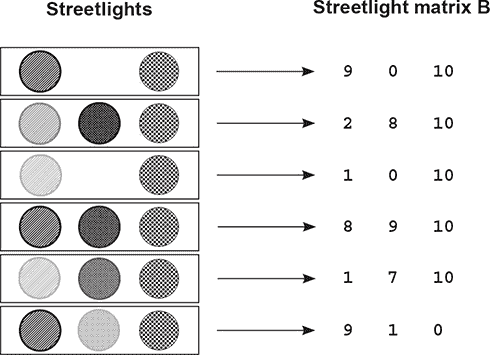

矩阵 (B) *是* 有效的。它充分捕捉了各种训练示例（行）和灯光（列）之间的关系。注意 `Matrix A * 10 == Matrix B` (`A * 10 == B`)。这意味着这些矩阵是 *标量倍数* 的关系。

#### 矩阵 A 和 B 都包含相同的基础模式

重要的启示是，存在无数个矩阵可以完美地反映数据集中的路灯模式。甚至下一个展示的也是完美的。

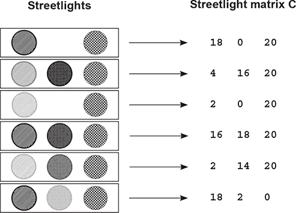

重要的是要认识到，基础模式并不等同于矩阵。它是矩阵的 *属性*。实际上，它是这三个矩阵（A、B 和 C）的属性。模式是这些矩阵所 *表达* 的。模式也存在于路灯中。

这个 *输入数据模式* 是你希望神经网络学习转换成 *输出数据模式* 的。但为了学习输出数据模式，你还需要以矩阵的形式捕捉这种模式，如下所示。

注意，你可以反转 1 和 0，输出矩阵仍然可以捕捉数据中存在的底层 STOP/WALK 模式。你知道这一点，因为无论你将 1 分配给 WALK 还是 STOP，你仍然可以将 1 和 0 解码成底层的 STOP/WALK 模式。

生成的矩阵被称为 *无损表示*，因为你可以完美地在你的停止/行走笔记和矩阵之间进行转换。

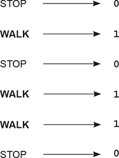

### 在 Python 中创建一个矩阵或两个

#### 将矩阵导入 Python

你已经将路灯模式转换成了一个矩阵（只包含 1 和 0 的矩阵）。现在让我们在 Python 中创建这个矩阵（以及更重要的是，其基础模式），以便神经网络可以读取它。Python 的 NumPy 库（在第三章中介绍）正是为了处理矩阵而构建的。让我们看看它的实际应用：

```
import numpy as np
streetlights = np.array( [ [ 1, 0, 1 ],
                            [ 0, 1, 1 ],
                            [ 0, 0, 1 ],
                            [ 1, 1, 1 ],
                            [ 0, 1, 1 ],
                            [ 1, 0, 1 ] ] )
```

如果你是一个常规的 Python 用户，这段代码中应该有一些东西会令你印象深刻。矩阵只是一个列表的列表。它是一个数组的数组。什么是 NumPy？NumPy 实际上只是一个用于数组的数组的高级包装器，它提供了特殊的、以矩阵为导向的函数。让我们也创建一个 NumPy 矩阵来输出数据：

```
walk_vs_stop = np.array( [ [ 0 ],
                           [ 1 ],
                           [ 0 ],
                           [ 1 ],
                           [ 1 ],
                           [ 0 ] ] )
```

你想让神经网络做什么？将 `streetlights` 矩阵学习转换成 `walk_vs_stop` 矩阵。更重要的是，你希望神经网络将 `streetlights` 具有相同基础模式的任何矩阵转换成一个包含 `walk_vs_stop` 基础模式的矩阵。关于这一点稍后详细说明。让我们先尝试使用神经网络将 `streetlights` 转换成 `walk_vs_stop`。

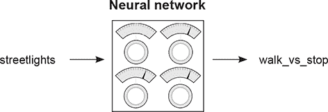

### 构建神经网络

你现在已经学习了几个章节关于神经网络的内容。你有一个新的数据集，你将创建一个神经网络来解决它。以下是一些示例代码，用于学习第一个路灯模式。这应该看起来很熟悉：

```
import numpy as np
weights = np.array([0.5,0.48,-0.7])
alpha = 0.1

streetlights = np.array( [ [ 1, 0, 1 ],
                           [ 0, 1, 1 ],
                           [ 0, 0, 1 ],
                           [ 1, 1, 1 ],
                           [ 0, 1, 1 ],
                           [ 1, 0, 1 ] ] )

walk_vs_stop = np.array( [ 0, 1, 0, 1, 1, 0 ] )

input = streetlights[0]                  *1*
goal_prediction = walk_vs_stop[0]        *2*

for iteration in range(20):
    prediction = input.dot(weights)
    error = (goal_prediction - prediction) ** 2
    delta = prediction - goal_prediction
    weights = weights - (alpha * (input * delta))

    print("Error:" + str(error) + " Prediction:" + str(prediction))
```

+   ***1* [1,0,1]**

+   ***2* 等于 0（停止）**


这个代码示例可能会让你回忆起在第三章中学到的几个细微差别。首先，`dot`函数的使用是一种在两个向量之间执行点积（加权求和）的方法。但第三章中没有包括 NumPy 矩阵执行元素级加法和乘法的方法：

```
import numpy as np

a = np.array([0,1,2,1])
b = np.array([2,2,2,3])

print(a*b)             *1*
print(a+b)             *2*
print(a * 0.5)         *3*
print(a + 0.5)         *4*
```

+   ***1* 元素级乘法**

+   ***2* 元素级加法**

+   ***3* 向量-标量乘法**

+   ***4* 向量-标量加法**

NumPy 使这些操作变得简单。当你将两个向量之间的`+`号时，它做你期望的事情：将两个向量相加。除了这些不错的 NumPy 运算符和新的数据集之外，这里显示的神经网络与之前构建的相同。


### 学习整个数据集

#### 神经网络只学习了一个路灯。难道我们不想让它学习所有的路灯吗？

到目前为止，在这本书中，你已经训练了能够学习如何模拟单个训练示例（`输入` -> `目标预测`对）的神经网络。但现在你正在尝试构建一个神经网络，告诉你是否可以过马路。你需要它知道不止一个路灯。你该如何做到这一点？你可以一次性在所有路灯上训练它：

```
import numpy as np

weights = np.array([0.5,0.48,-0.7])
alpha = 0.1

streetlights = np.array( [[ 1, 0, 1 ],
                          [ 0, 1, 1 ],
                          [ 0, 0, 1 ],
                          [ 1, 1, 1 ],
                          [ 0, 1, 1 ],
                          [ 1, 0, 1 ] ] )

walk_vs_stop = np.array( [ 0, 1, 0, 1, 1, 0 ] )

input = streetlights[0]                *1*
goal_prediction = walk_vs_stop[0]      *2*

for iteration in range(40):
    error_for_all_lights = 0
    for row_index in range(len(walk_vs_stop)):
        input = streetlights[row_index]
        goal_prediction = walk_vs_stop[row_index]

        prediction = input.dot(weights)

        error = (goal_prediction - prediction) ** 2
        error_for_all_lights += error

        delta = prediction - goal_prediction
        weights = weights - (alpha * (input * delta))
        print("Prediction:" + str(prediction))
    print("Error:" + str(error_for_all_lights) + "\n")

                     Error:2.6561231104
                     Error:0.962870177672
                     ...
                     Error:0.000614343567483
                     Error:0.000533736773285
```

+   ***1* [1,0,1]**

+   ***2* 等于 0（停止）**

### 完整、批量和随机梯度下降

#### 随机梯度下降一次更新一个示例的权重

事实上，这种一次学习一个示例的想法是梯度下降的一个变体，称为*随机梯度下降*，并且它是可以用来学习整个数据集的一小部分方法之一。

随机梯度下降是如何工作的？正如你在上一个示例中看到的，它对每个训练示例分别进行预测和权重更新。换句话说，它首先处理第一个路灯，尝试预测它，计算`权重变化量`，并更新权重。然后它继续处理第二个路灯，依此类推。它多次迭代整个数据集，直到找到对所有训练示例都适用的工作权重配置。

#### (Full) 梯度下降一次更新一个数据集的权重

如在第四章介绍中所述，学习整个数据集的另一种方法是梯度下降（或*平均/完整梯度下降*）。不是为每个训练示例更新一次权重，网络计算整个数据集上的平均`权重变化量`，只在计算完整平均时改变权重。

#### 批量梯度下降在 n 个示例后更新权重

这将在稍后更详细地介绍，但还有一个第三种配置，它在随机梯度下降和完整梯度下降之间取了一个折中。不是在仅一个示例或整个示例数据集之后更新权重，而是选择一个*批量大小*（通常在 8 到 256 之间）的示例，之后更新权重。

我们将在本书的后面部分进一步讨论这个问题，但到目前为止，认识到之前的例子创建了一个神经网络，通过逐个训练每个示例，可以学习整个街灯数据集。

### 神经网络学习相关性

#### 最后一个神经网络学到了什么？

你刚刚完成了一个单层神经网络的训练，用于识别街灯模式并判断是否安全过马路。让我们暂时从神经网络的视角来看一下。神经网络并不知道它正在处理街灯数据。它所试图做的只是识别哪个输入（在三个可能的输入中）与输出相关。通过分析网络的最终权重位置，它正确地识别了中间的灯。

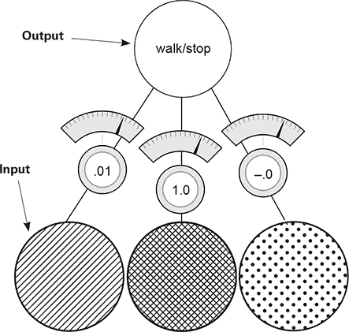

注意中间的权重非常接近 1，而左侧和右侧的权重非常接近 0。从高层次来看，所有用于学习的迭代、复杂过程实际上完成了一件非常简单的事情：网络*识别了中间输入和输出之间的相关性*。相关性位于权重被设置为高数值的地方。相反，输出方面的*随机性*出现在左侧和右侧的权重（权重值非常接近 0）。

网络是如何识别相关性的呢？好吧，在梯度下降的过程中，每个训练示例都对权重施加了*上压力*或*下压力*。平均而言，中间权重有更多的上压力，而其他权重有更多的下压力。压力从何而来？为什么不同权重的压力不同？

### 上下压力

#### 它来自数据

每个节点都在尝试根据输入正确预测输出。在大多数情况下，每个节点在尝试这样做时都会忽略所有其他节点。唯一的*交叉通信*发生在所有三个权重必须共享相同的误差度量。*权重更新*不过是将这个共享的误差度量乘以每个相应的输入。

你为什么要这样做？神经网络学习的关键部分是*错误归因*，这意味着给定一个共享的误差，网络需要找出哪些权重做出了贡献（以便进行调整），哪些权重*没有*做出贡献（因此可以保持不变）。

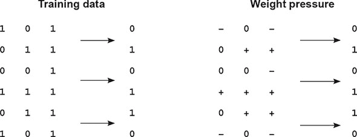

考虑第一个训练示例。因为中间输入是 0，所以对于这个预测来说，中间权重*完全无关紧要*。无论权重是多少，它都会乘以 0（输入）。因此，无论错误是过高还是过低，都可以*归因于*左侧和右侧的权重。

考虑第一个训练示例的压力。如果网络应该预测 0，而两个输入是 1，这将导致错误，这会驱动权重值*趋向于 0*。

权重压力表有助于描述每个训练示例对每个相应权重的影响。+表示它有向 1 的压力，-表示它有向 0 的压力。零（0）表示没有压力，因为输入数据点是 0，所以该权重不会改变。注意，最左侧的权重有两个负号和一个正号，所以平均而言，权重将趋向于 0。中间的权重有三个正号，所以平均而言，权重将趋向于 1。

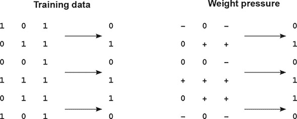

每个单独的权重都试图补偿错误。在第一个训练示例中，最右侧和最左侧的输入与期望输出之间存在*不相关性*。这导致这些权重承受向下压力。

这种现象在所有六个训练示例中都发生，通过向 1 的压力奖励相关性，通过向 0 的压力惩罚不相关性。平均而言，这导致网络找到中间权重和输出之间的相关性成为主要的预测力量（输入加权平均中的最重权重），使网络非常准确。


**底线**

预测是输入的加权总和。学习算法通过向上压力（趋向于 1）奖励与输出相关的输入，同时通过向下压力惩罚与输出不相关的输入。输入的加权总和通过将不相关的输入加权到 0，找到了输入和输出之间的完美相关性。


你体内的数学家可能有点不舒服。向上压力和向下压力几乎不是精确的数学表达式，而且有很多边缘情况，这种逻辑不成立（我们将在下一部分讨论）。但你会发现，这是一个*极其*有价值的近似，允许你暂时忽略梯度下降的所有复杂性，只需记住*学习奖励相关性*与更大的权重（或者更普遍地说，*学习在两个数据集之间找到相关性*）。

### 边缘情况：过拟合

#### 有时候相关性是偶然发生的

再次考虑训练数据中的第一个示例。如果最左侧的权重是 0.5，而最右侧的权重是-0.5 怎么办？他们的预测将等于 0。网络将完美预测。但它并没有学会如何安全地预测街灯（这些权重在现实世界中会失败）。这种现象被称为*过拟合*。


**深度学习的最大弱点：过拟合**

错误在所有权重之间共享。如果特定的权重配置*意外地*在预测和输出数据集之间创建了完美的相关性（即`error`等于 0），而没有给予最佳输入最重的权重，*神经网络将停止学习*。


如果没有其他训练示例，这个致命的缺陷将使神经网络瘫痪。其他训练示例做了什么？好吧，让我们看看第二个训练示例。它将最右侧权重向上推，同时不改变最左侧权重。这打破了第一个示例中停止学习的平衡。只要你不只训练第一个示例，其余的训练示例将帮助网络避免陷入任何单个训练示例存在的这些边缘情况配置。

这*非常重要*。神经网络非常灵活，可以找到许多不同的权重配置，这些配置可以正确预测训练数据的一个子集。如果你在这个神经网络上训练前两个训练示例，它很可能会在它对其他训练示例不起作用的地方停止学习。本质上，它记住了这两个训练示例，而不是找到将*泛化*到任何可能的街灯配置的*相关性*。

如果你只训练在两个街灯上，并且网络只找到这些边缘情况配置，它可能*无法*告诉你当它看到训练数据中没有的街灯时是否安全过马路。

| |
| --- |

**关键要点**

你在深度学习中最面临的挑战是说服你的神经网络*泛化*而不是仅仅*记忆*。你还会再次看到这一点。

| |
| --- |

### 边缘情况：冲突的压力

#### 有时相关性会自我斗争

考虑以下权重压力表的最右侧列。你看到了什么？

这一列似乎向上和向下的压力时刻数量相等。但网络正确地将这个（最右侧）权重推至 0，这意味着向下的压力时刻必须大于向上的。这是如何工作的？

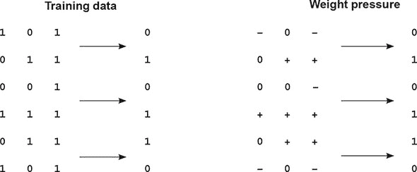

左侧和中间的权重有足够的信号自行收敛。左侧权重降至 0，中间权重向 1 移动。随着中间权重的不断升高，正例的错误持续减少。但当它们接近最佳位置时，最右侧权重的去相关性变得更加明显。

让我们考虑一个极端的例子，其中左侧和中间权重分别完美地设置为 0 和 1。网络会发生什么？如果右侧权重高于 0，那么网络预测过高；如果右侧权重低于 0，网络预测过低。

随着其他节点学习，它们吸收了一些错误；它们吸收了部分相关性。它们使网络以*适度*的相关性进行预测，这减少了错误。其他权重随后只尝试调整它们的权重，以正确预测剩余的内容。

在这种情况下，因为中间权重有持续的信号来吸收所有的关联性（由于中间输入和输出之间的 1:1 关系），当你想要预测 1 时的错误变得非常小，但预测 0 时的错误变得很大，推动中间权重向下。

#### 并非总是能如预期般成功。

在某些方面，你有点幸运。如果中间节点没有如此完美地相关，网络可能难以沉默最右侧的权重。稍后你将学习到*正则化*，它迫使具有冲突压力的权重移动向 0。

作为预览，正则化是有优势的，因为如果一个权重向上和向下的压力相等，它对任何事情都没有帮助。它对任何方向都没有帮助。本质上，正则化的目的是说，只有具有真正强关联性的权重才能保留；其他所有东西都应该被沉默，因为它们在增加噪声。这有点像自然选择，作为副作用，它会导致神经网络训练更快（迭代次数更少），因为最右侧的权重存在正负压力的问题。

在这种情况下，因为最右侧的节点没有明确的关联性，网络会立即开始将其驱动向 0。如果没有正则化（就像你之前训练的那样），你不会在学习到最右侧的输入是无用的，直到左侧和中间部分开始找出它们的模式。关于这一点，稍后还会详细说明。

如果网络在数据的一个输入列和输出列之间寻找关联性，那么神经网络会如何处理以下数据集？

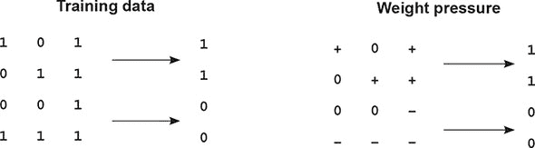

任何输入列和输出列之间都没有关联性。每个权重都有相等向上的压力和向下的压力。*这个数据集对神经网络来说是一个真正的问题。*

以前，你可以解决具有向上和向下压力的输入数据点，因为其他节点会开始解决正面的或负面的预测，将平衡节点吸引到向上或向下。但在这个情况下，所有输入在正负压力之间都是平衡的。你该怎么办？

### 学习间接关联

#### 如果你的数据没有关联性，就创建具有关联性的中间数据！

以前，我描述神经网络为一个在输入和输出*数据集*之间寻找关联性的工具。我想稍微细化一下这个描述。实际上，神经网络在它们的输入和输出*层*之间寻找关联性。

你将输入层的值设置为输入数据的单独行，并尝试训练网络，使得输出层等于输出数据集。奇怪的是，神经网络并不了解数据。它只是在输入层和输出层之间寻找关联性。


不幸的是，这是一个新的没有输入和输出之间相关性的街灯数据集。解决方案很简单：使用两个这样的网络。第一个将创建一个与输出有有限相关性的中间数据集，第二个将使用这种有限的相关性来正确预测输出。

| |
| --- |

因为输入数据集与输出数据集不相关，所以你会使用输入数据集来创建一个中间数据集，这个中间数据集与输出数据集*确实*相关。这有点像作弊。

| |
| --- |

### 创建相关性

这是一张新神经网络的图片。你基本上是将两个神经网络堆叠在一起。中间层的节点（`layer_1`）代表*中间数据集*。目标是训练这个网络，即使输入数据集（`layer_0`）和输出数据集（`layer_2`）之间没有相关性，你创建的`layer_1`数据集*使用`layer_0`*将与`layer_2`相关。

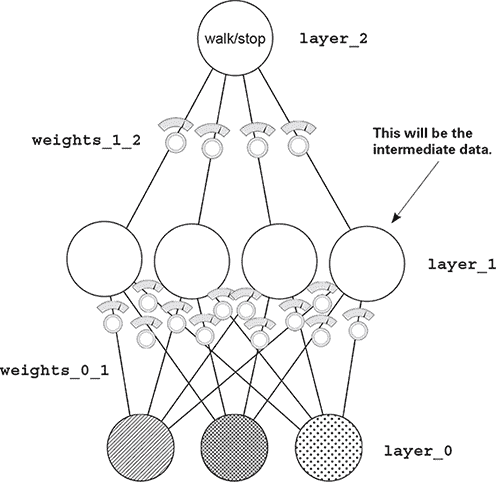

注意：这个网络仍然只是一个函数。它有一系列以特定方式收集在一起的权重。此外，梯度下降仍然有效，因为你可以计算出每个权重对误差的贡献，并调整它以将误差减少到 0。这正是你将要做的。

### 堆叠神经网络：综述

#### 第三章简要提到了堆叠神经网络。让我们回顾一下

当你看到下面的架构时，预测发生的方式正如我所说的“堆叠神经网络”时你可能预期的那样。第一个较低网络的输出（`layer_0`到`layer_1`）是第二个较高网络的输入（`layer_1`到`layer_2`）。这些网络的预测与之前看到的是相同的。

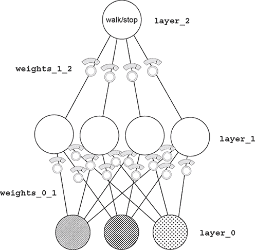

当你开始思考这个神经网络是如何学习的时候，你已经知道了很多。如果你忽略较低的权重，并认为它们的输出是训练集，那么神经网络的顶部（`layer_1`到`layer_2`）就像之前章节中训练的网络一样。你可以使用所有相同的学习逻辑来帮助它们学习。

你还不理解的部分是如何更新`layer_0`和`layer_1`之间的权重。它们使用什么作为它们的误差度量？你可能还记得第五章，缓存的/归一化的误差度量被称为`delta`。在这种情况下，你需要弄清楚如何知道`layer_1`的`delta`值，这样它们可以帮助`layer_2`做出准确的预测。

### 反向传播：长距离误差归因

#### 加权平均误差

从 `layer_1` 到 `layer_2` 的预测是什么？它是 `layer_1` 上值的加权平均值。如果 `layer_2` 比预期高 *x* 量，你怎么知道哪些 `layer_1` 上的值导致了错误？那些具有 *更高权重* (`weights_1_2`) 的值贡献更多。那些从 `layer_1` 到 `layer_2` 的 *较低权重* 的值贡献较少。

考虑一个极端情况。假设 `layer_1` 到 `layer_2` 的最左侧权重为零。这个 `layer_1` 节点导致了网络错误的程度是多少？*零*。

这太简单了，几乎有点好笑。从 `layer_1` 到 `layer_2` 的权重正好描述了每个 `layer_1` 节点对 `layer_2` 预测的贡献程度。这意味着这些权重也正好描述了每个 `layer_1` 节点对 `layer_2` 错误的贡献程度。

你如何使用 `layer_2` 上的 `delta` 来确定 `layer_1` 上的 `delta`？你将其乘以 `layer_1` 的相应权重。这就像预测逻辑的反向。这种移动 `delta` 信号的过程被称为 *反向传播*。


### 反向传播：为什么这行得通？

#### 加权平均 delta

在第五章（chapter 5）的神经网络中，`delta` 变量告诉你这个节点的值在下一次应该改变的方向和量。所有反向传播能让你做的只是说，“嘿，如果你想使这个节点比现在高 *x* 量，那么这四个先前的节点每个都需要比现在高/低 `x*weights_1_2` 量，因为这些权重将预测放大了 `weights_1_2` 倍。”

当反向使用时，`weights_1_2` 矩阵会按适当的比例放大错误。它放大错误，这样你知道每个 `layer_1` 节点应该向上或向下移动多少。

一旦你知道这一点，你就可以像之前一样更新每个权重矩阵。对于每个权重，将其输出 `delta` 乘以其输入 `value`，并按这个量调整权重（或者你可以用 `alpha` 进行缩放）。

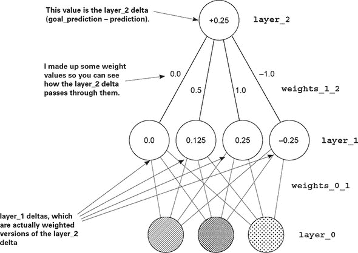

### 线性与非线性

#### 这可能是书中最难理解的概念。让我们慢慢来

我将向你展示一个现象。结果证明，你需要再添加一个部件才能使这个神经网络进行训练。让我们从两个角度来分析。第一个角度将展示为什么神经网络没有这个部件就无法训练。换句话说，首先我会向你展示为什么神经网络目前是出问题的。然后，一旦你添加了这个部件，我会向你展示它是如何解决这个问题。现在，先看看这个简单的代数式：

```
1 * 10 * 2 = 100              1 * 0.25 * 0.9 = 0.225
5 * 20 = 100                  1 * 0.225 = 0.225
```

这里是关键点：对于任何两次乘法，我都可以使用一次乘法来完成相同的事情。结果证明，这是不好的。看看下面的例子：

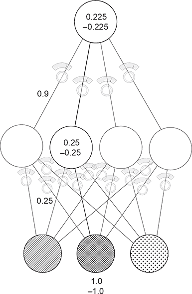

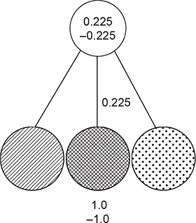

这两个图显示了两个训练示例，一个输入是 1.0，另一个输入是-1.0。底线是：**对于你创建的任何三层网络，都有一个具有相同行为的两层网络**。堆叠两个神经网络（正如你目前所知道的）不会给你带来任何额外的力量。两个连续的加权求和只是单个加权求和的一个更昂贵的版本。

### 为什么神经网络仍然不起作用

#### 如果你像现在这样训练三层网络，它不会收敛

| |
| --- |

**问题：**对于任何两个连续的加权求和的输入，都存在一个具有完全相同行为的单个加权求和。三层网络能做的，两层网络也能做。

| |
| --- |

在修复之前，让我们谈谈中间层（`layer_1`）。现在，每个节点（四个中的每一个）都从每个输入接收一个权重。让我们从相关性的角度来考虑这个问题。中间层中的每个节点都订阅了与每个输入节点一定量的相关性。如果一个输入到中间层的权重是 1.0，那么它订阅了该节点运动的 100%。如果该节点上升 0.3，中间节点将跟随。如果连接两个节点的权重是 0.5，中间层中的每个节点都订阅了该节点运动的 50%。

中间节点唯一摆脱特定输入节点相关性的方法就是它从另一个输入节点订阅额外的相关性。对这个神经网络**没有任何新的贡献**。每个隐藏节点都从输入节点订阅一小部分相关性。

中间节点无法为对话添加任何内容；它们无法拥有自己的相关性。它们与各种输入节点或多或少都有相关性。

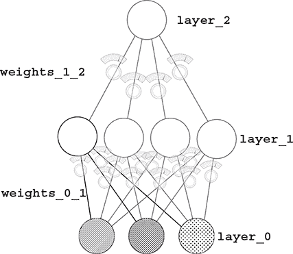

但因为你**知道**在新数据集中，任何输入与输出之间都没有相关性，那么中间层如何帮助呢？它混合了一堆已经无用的相关性。你真正需要的是中间层能够选择性地与输入相关联。

你希望中间层**有时**与输入相关联，**有时**不相关。这给了它自己的相关性。这使得中间层有机会不仅仅总是与一个输入保持**x**%的相关性，与另一个输入保持**y**%的相关性。相反，它可以在想要的时候与一个输入保持**x**%的相关性，但在其他时候完全不相关。这被称为**条件相关性**或**有时相关性**。

### 有时相关性的秘诀

#### 当值低于 0 时关闭节点

这可能看起来太简单而不起作用，但考虑一下：如果一个节点的值下降到 0 以下，通常节点仍然会与输入保持相同的相关性。它只是碰巧是负值。但如果你在节点为负时将其关闭（将其设置为 0），那么它在与输入相关时总是具有*零相关性*。

这意味着什么？节点现在可以有选择地挑选和选择它想要与什么相关联的时刻。这允许它说，“当右输入关闭时，让我与左输入完美相关。”它是如何做到这一点的呢？好吧，如果左输入的权重是 1.0，而右输入的权重是一个巨大的负数，那么同时打开左输入和右输入将导致节点始终为 0。但如果只有左输入打开，节点将采用左输入的值。

这在以前是不可能的。以前，中间节点要么总是与输入相关联，要么总是不相关。现在它可以是有条件的。现在它可以为自己发声了。

| |
| --- |

**解决方案**：通过在任何中间节点为负时将其关闭，你允许网络有时从各种输入中订阅相关性。这对于两层神经网络是不可能的，因此为三层网络增加了力量。

| |
| --- |

这种“如果节点为负，则将其设置为 0”的逻辑的术语是*非线性*。没有这种调整，神经网络是*线性的*。没有这种技术，输出层只能从两层网络中已有的相关性中进行选择。它正在订阅输入层的一部分，这意味着它不能解决新的街灯数据集。

非线性有很多种。但这里讨论的，在许多情况下，是最好的选择。它也是最简单的。（它被称为`relu`。）

值得注意的是，大多数其他书籍和课程都说连续的矩阵乘法是线性变换。我觉得这不太直观。这也使得理解非线性如何贡献以及为什么选择一个而不是另一个（我们稍后会讨论）变得更困难。它说，“没有非线性，两次矩阵乘法可能就是 1。”我的解释，虽然不是最简洁的答案，但是对为什么需要非线性的一种直观解释。

### 快速休息一下

#### 那最后一部分可能感觉有点抽象，这是完全可以接受的

事情是这样的。前几章使用的是简单的代数，所以所有东西最终都基于根本简单的工具。这一章开始基于你之前学到的前提。以前，你学到了这样的课程：

| |
| --- |

你可以计算出错误与任何一个权重之间的关系，这样你就知道改变权重是如何影响错误的。然后你可以利用这一点将错误降低到 0。

| |
| --- |

那是一个*巨大的教训*。但现在我们正在超越它。因为我们已经解决了为什么它会起作用的原因，所以你可以直接接受这个陈述。下一个重要的教训出现在本章的开头：


通过一系列训练示例调整权重以减少误差，最终是在寻找输入层和输出层之间的相关性。如果不存在相关性，则误差永远不会达到 0。


这是一个*更大的教训*。这主要意味着你现在可以暂时忘记之前的教训。你不需要它。现在你专注于相关性。要点是，你不能一次想太多。接受每一个教训，让自己相信它。当它是对更细粒度教训的更简洁总结（更高的抽象）时，你可以放下细粒度，专注于理解更高的总结。

这类似于一个专业的游泳者、骑自行车者或类似的运动员，他们需要结合对许多小课程的综合流畅知识。一个击球手挥棒击球，学习了成千上万的小课程，最终达到一个伟大的挥棒。但当他走到击球区时，他不会想到所有这些。他的动作是流畅的——甚至是无意识的。学习这些数学概念也是如此。

神经网络寻找输入和输出之间的相关性，你不再需要担心它是如何发生的。你只需要知道它确实发生了。现在我们正在建立在这个想法的基础上。让自己放松，相信你已经学到的东西。

### 您的第一个深度神经网络

#### 这是如何进行预测的方法

以下代码初始化权重并执行前向传播。新代码是**粗体**。

```
import numpy as np

np.random.seed(1)

def relu(x):                                           *1*
    return (x > 0) * x

alpha = 0.2
hidden_size = 4

streetlights = np.array( [[ 1, 0, 1 ],
                          [ 0, 1, 1 ],
                          [ 0, 0, 1 ],
                          [ 1, 1, 1 ] ] )

walk_vs_stop = np.array([[ 1, 1, 0, 0]]).T

weights_0_1 = 2*np.random.random((3,hidden_size)) - 1  *2*
weights_1_2 = 2*np.random.random((hidden_size,1)) - 1

layer_0 = streetlights[0]
layer_1 = relu(np.dot(layer_0,weights_0_1))
layer_2 = np.dot(layer_1,weights_1_2)                  *3*
```

+   ***1* 此函数将所有负数设置为 0。**

+   ***2* 现在有两套权重连接三个层（随机初始化）**

+   ***3* 层 _1 的输出通过 relu 函数处理，其中负值变为 0。这是下一层，层 _2 的输入。**

对于代码的每一部分，请跟随图示。输入数据进入`layer_0`。通过`dot`函数，信号从`layer_0`沿着权重向上传递到`layer_1`（在每个四个`layer_1`节点上执行加权求和）。然后，`layer_1`上的这些加权求和通过`relu`函数传递，该函数将所有负数转换为 0。然后对最终节点，`layer_2`执行最终的加权求和。

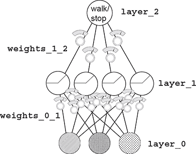

### 代码中的反向传播

#### 你可以学习每个权重对最终误差的贡献量

在上一章的结尾，我提出一个断言，即记住两层神经网络代码将非常重要，这样你就可以在我引用更高级的概念时快速轻松地回忆它。这就是记忆的重要性所在。

以下列表是新的学习代码，并且你一定要识别和理解前几章中提到的部分。如果你迷失了方向，就去 第五章，记住代码，然后回来。这将在某一天产生重大影响。

```
import numpy as np

np.random.seed(1)

def relu(x):
    return (x > 0) * x                                                   *1*

def relu2deriv(output):
    return output>0                                                      *2*

alpha = 0.2
hidden_size = 4

weights_0_1 = 2*np.random.random((3,hidden_size)) - 1
weights_1_2 = 2*np.random.random((hidden_size,1)) - 1

for iteration in range(60):
   layer_2_error = 0
   for i in range(len(streetlights)):
      layer_0 = streetlights[i:i+1]
      layer_1 = relu(np.dot(layer_0,weights_0_1))
      layer_2 = np.dot(layer_1,weights_1_2)

      layer_2_error += np.sum((layer_2 - walk_vs_stop[i:i+1]) ** 2)

      layer_2_delta = (walk_vs_stop[i:i+1] - layer_2)
      layer_1_delta=layer_2_delta.dot(weights_1_2.T)*relu2deriv(layer_1) *3*

      weights_1_2 += alpha * layer_1.T.dot(layer_2_delta)
      weights_0_1 += alpha * layer_0.T.dot(layer_1_delta)

   if(iteration % 10 == 9):
      print("Error:" + str(layer_2_error))
```

+   ***1* 当 x > 0 时返回 x；否则返回 0**

+   ***2* 当输入大于 0 时返回 1；否则返回 0**

+   ***3* 这一行通过将 layer_2_delta 乘以其连接权重 _1_2，根据 layer_2 的 delta 计算出 layer_1 的 delta。**

信不信由你，唯一真正新的代码是加粗的部分。其他所有内容在本质上都与前面的页面相同。`relu2deriv` 函数在 `output` > 0 时返回 1；否则返回 0。这是 `relu` 函数的 *斜率*（即 *导数*）。它起着重要的作用，你将在下一刻看到。

记住，目标是 *错误归因*。这是关于弄清楚每个权重对最终错误贡献了多少。在第一个（两层）神经网络中，你计算了一个 `delta` 变量，它告诉你希望输出预测变得更高或更低。看看这里的代码。你以相同的方式计算 `layer_2_delta`。没有什么新的。（再次，如果你忘记了这部分是如何工作的，请回到 第五章。） 

现在你已经知道了最终预测应该向上或向下移动多少（`delta`），你需要弄清楚每个中间（`layer_1`）节点应该向上或向下移动多少。这些实际上是 *中间预测*。一旦你有了 `layer_1` 的 `delta`，你就可以使用之前相同的过程来计算权重更新（对于每个权重，将其输入值乘以其输出 `delta` 并将 `weight` 值增加这么多）。

你如何计算 `layer_1` 的 `delta`？首先，做显而易见的事情：将输出 `delta` 乘以连接到它的每个权重。这给出了每个权重对那个错误的贡献的加权。还有一件事需要考虑。如果 `relu` 将 `layer_1` 节点的输出设置为 0，那么它没有对错误做出贡献。当这种情况发生时，你应该也将该节点的 `delta` 设置为 0。将每个 `layer_1` 节点乘以 `relu2deriv` 函数可以实现这一点。`relu2deriv` 要么是 1，要么是 0，这取决于 `layer_1` 的值是否大于 0。

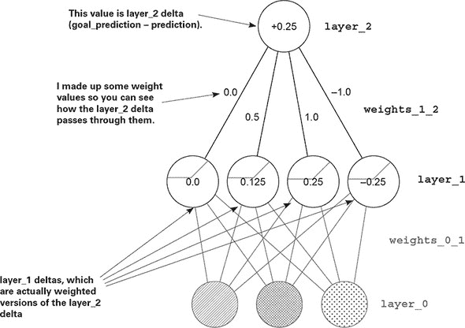

### 一次反向传播迭代

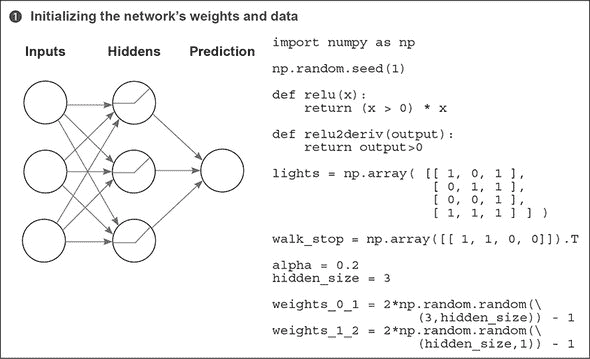

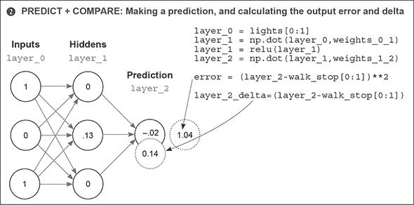

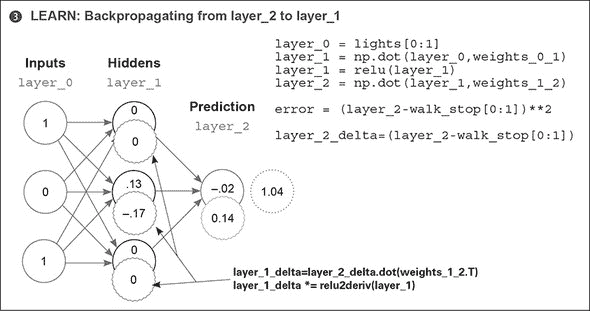

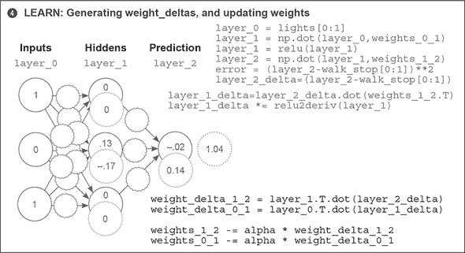

如你所见，反向传播是关于计算中间层的 `delta`，以便你可以执行梯度下降。要做到这一点，你需要取 `layer_2` 上 `layer_1` 的加权平均 `delta`（由它们之间的权重加权）。然后关闭（设置为 0）没有参与前向预测的节点，因为它们不可能对错误做出贡献。

### 将所有内容整合在一起

#### 下面是你可以运行的自我依赖程序（运行时输出如下）

```
import numpy as np

np.random.seed(1)

def relu(x):
    return (x > 0) * x         *1*

def relu2deriv(output):
    return output>0            *2*

streetlights = np.array( [[ 1, 0, 1 ],
                          [ 0, 1, 1 ],
                          [ 0, 0, 1 ],
                          [ 1, 1, 1 ] ] )

walk_vs_stop = np.array([[ 1, 1, 0, 0]]).T

alpha = 0.2
hidden_size = 4

weights_0_1 = 2*np.random.random((3,hidden_size)) - 1
weights_1_2 = 2*np.random.random((hidden_size,1)) - 1

for iteration in range(60):
   layer_2_error = 0
   for i in range(len(streetlights)):
      layer_0 = streetlights[i:i+1]
      layer_1 = relu(np.dot(layer_0,weights_0_1))
      layer_2 = np.dot(layer_1,weights_1_2)

      layer_2_error += np.sum((layer_2 - walk_vs_stop[i:i+1]) ** 2)

      layer_2_delta = (layer_2 - walk_vs_stop[i:i+1])
      layer_1_delta=layer_2_delta.dot(weights_1_2.T)*relu2deriv(layer_1)

      weights_1_2 -= alpha * layer_1.T.dot(layer_2_delta)
      weights_0_1 -= alpha * layer_0.T.dot(layer_1_delta)

   if(iteration % 10 == 9):
      print("Error:" + str(layer_2_error))
```

+   ***1* 当 x 大于 0 时返回 x；否则返回 0**

+   ***2* 当输入大于 0 时返回 1；否则返回 0**

```
Error:0.634231159844
Error:0.358384076763
Error:0.0830183113303
Error:0.0064670549571
Error:0.000329266900075
Error:1.50556226651e-05
```

### 深度网络为什么重要？

#### 创建具有相关性的“中间数据集”有什么意义？

考虑这里显示的猫图片。进一步考虑，我有一个包含有猫和无猫图片的数据集（并且我已将它们标记为这样）。如果我想训练一个神经网络，使其从像素值预测图片中是否有猫，那么两层网络可能存在问题。

就像在最后一个街灯数据集中一样，单个像素与图片中是否有猫无关。只有像素的不同配置与是否有猫相关。


这就是深度学习的本质。深度学习全部在于创建中间层（数据集），其中每个中间层的节点代表不同输入配置的存在或不存在。

这样，对于猫图像数据集，不需要单个像素与照片中是否有猫相关联。相反，中间层将尝试识别可能与猫相关联（例如耳朵、猫眼或猫毛）或不相关联的像素配置。许多类似猫的配置的存在将给最终层提供所需的信息（相关性），以便正确预测猫的存在或不存在。

信不信由你，你可以使用三层网络并继续堆叠更多的层。一些神经网络有数百层，每个节点都在检测不同输入数据的配置中扮演其角色。本书的其余部分将致力于研究这些层中的不同现象，以探索深度神经网络的全部力量。

为了达到这个目的，我必须提出与第五章相同的挑战：记住之前的代码。为了使接下来的章节可读，你需要非常熟悉代码中的每个操作。除非你能从记忆中构建一个三层神经网络，否则不要越过这一点！
