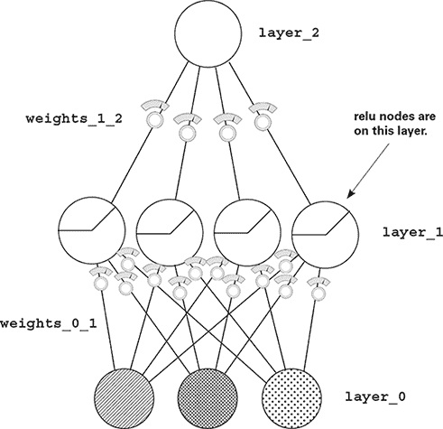
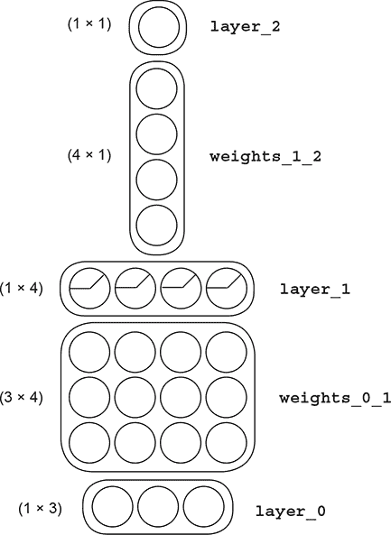
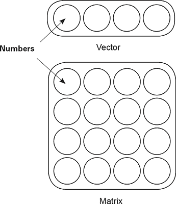
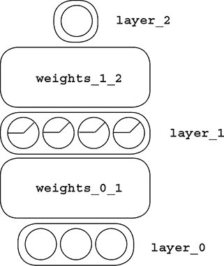
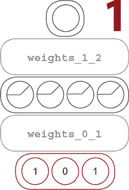
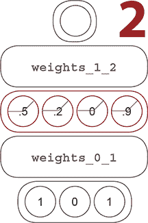
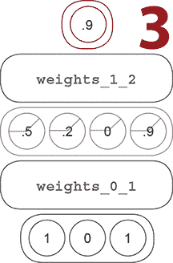
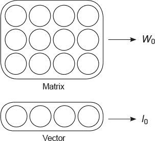
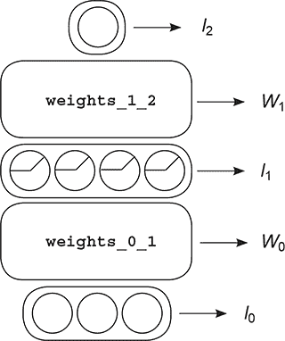
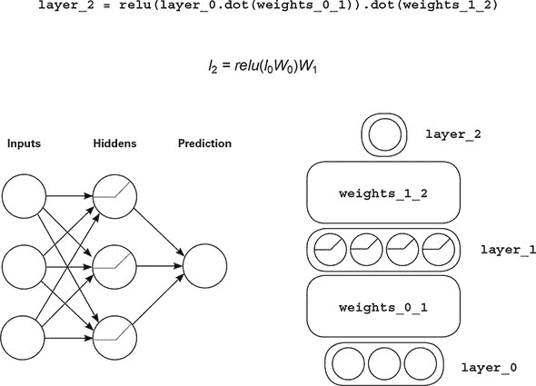

## 第七章. 如何在头脑中和纸上描绘神经网络

**在本章中**

+   相关性总结

+   简化可视化

+   观察网络预测

+   用字母而不是图片来可视化

+   连接变量

+   可视化工具的重要性

> “数字有一个重要的故事要讲。它们依赖于你给予它们一个清晰而有说服力的声音。”
> 
> *斯蒂芬·弗，IT 创新者、教师和顾问*

### 是时候简化了

#### 总是考虑所有事情是不切实际的。心理工具可以帮助

第六章以一个相当令人印象深刻的代码示例结束。仅仅神经网络就包含了 35 行非常密集的代码。阅读它时，很明显有很多事情在进行；并且这段代码包括超过 100 页的概念，当结合在一起时，可以预测是否安全过马路。

我希望你在每一章中都能继续通过记忆来重建这些示例。随着示例的增大，这个练习就不再仅仅是记住代码的具体字母，而是更多地关于记住概念，然后根据这些概念重建代码。

在本章中，这种在你的脑海中构建高效概念的结构正是我想讨论的。尽管它不是一个架构或实验，但它可能是我能给你提供的最重要的价值。在这种情况下，我想展示我是如何在我的脑海中以高效的方式总结所有的小课程，以便我能做诸如构建新的架构、调试实验以及在新的问题和新的数据集上使用架构之类的事情。

#### 让我们先回顾一下你到目前为止学到的概念

这本书从小的课程开始，然后在它们之上构建抽象层。我们首先讨论了机器学习背后的思想。然后我们进步到单个线性节点（或*神经元*）如何学习，然后是水平组神经元（层）和垂直组（层堆叠）。在这个过程中，我们讨论了学习实际上只是将错误减少到 0，我们使用微积分来发现如何改变网络中的每个权重，以帮助将错误移动到 0 的方向。

接下来，我们讨论了神经网络如何搜索（有时创建）输入和输出数据集之间的相关性。这个最后的想法使我们能够忽略之前关于单个神经元行为的课程，因为它简洁地总结了之前的课程。神经元、梯度、层堆叠等总和导致一个单一的想法：神经网络寻找并创建相关性。

保留这个相关性概念而不是之前较小的概念对于学习深度学习很重要。否则，很容易被神经网络的复杂性所淹没。让我们为这个想法起一个名字：*相关性总结*。

### 相关性总结

#### 这是向更高级的神经网络前进的合理关键

**相关性总结**

神经网络试图找到输入层和输出层之间的直接和间接相关性，这些层分别由输入和输出数据集决定。

| |
| --- |

在 10,000 英尺的高度上，这是所有神经网络都在做的事情。鉴于神经网络实际上只是一系列通过层连接的矩阵，让我们稍微放大一下，考虑一下任何特定的权重矩阵正在做什么。

| |
| --- |

**局部相关性总结**

任何一组权重都会优化以学习如何将其输入层与输出层所说的内容相关联。

| |
| --- |

当你只有两层（输入和输出）时，权重矩阵知道输出层基于输出数据集所说的内容。它寻找输入和输出数据集之间的相关性，因为它们被捕获在输入和输出层中。但当你有多个层时，这会变得更加复杂，记得吗？

| |
| --- |

**全局相关性总结**

一个早期层所说的内容可以通过将后续层所说的内容乘以它们之间的权重来确定。这样，后续层可以告诉早期层它们需要的信号类型，最终找到与输出的相关性。这种交叉通信被称为*反向传播*。

| |
| --- |

当全局相关性教给每一层它应该是什么时，局部相关性可以在局部优化权重。当最终层的神经元说，“我需要稍微高一点”时，它就会继续告诉它前面层的所有神经元，“嘿，前一层，给我更高的信号。”然后它们会告诉它们前面的神经元，“嘿，给我们更高的信号。”这就像一场巨大的电话游戏——游戏结束时，每一层都知道它的哪些神经元需要更高或更低，然后局部相关性总结接管，相应地更新权重。

### 之前过于复杂的可视化

#### 在简化心理图的同时，让我们也简化一下可视化。

在这一点上，我预计你脑海中神经网络的可视化就像这里显示的图片（因为这是我们用的那个）。输入数据集在`layer_0`中，通过权重矩阵（一堆线条）连接到`layer_1`，依此类推。这是一个有用的工具，用于学习如何将权重集合和层组合起来学习一个函数。

但向前推进，这幅图过于详细。考虑到相关性总结，你已经知道你不再需要担心单个权重的更新方式。后续层已经知道如何与早期层通信，并告诉它们，“嘿，我需要更高的信号”或“嘿，我需要更低的信号”。说实话，你不再关心权重值，只关心它们是否按预期行为，以适当的方式捕捉相关性，并实现泛化。

为了反映这种变化，让我们在纸上更新可视化。我们还将做一些其他事情，这些事情在以后会变得有意义。正如你所知，神经网络是一系列权重矩阵。当你使用网络时，你也会创建与每一层对应的向量。

在这个图中，权重矩阵是节点之间的线条，向量是节点条带。例如，`weights_1_2`是一个矩阵，`weights_0_1`是一个矩阵，`layer_1`是一个向量。

在后面的章节中，我们将以越来越有创意的方式排列向量和矩阵，因此，而不是显示每个节点通过每个权重连接的细节（如果我们有 500 个节点在`layer_1`中，这会变得难以阅读），让我们从一般的角度来思考。让我们把它们看作任意大小的向量和矩阵。

### 简化的可视化

#### 神经网络就像乐高积木，每一块积木都是一个向量或矩阵

在接下来的内容中，我们将以人们用乐高积木搭建新结构的方式构建新的神经网络架构。关于相关性总结的妙处在于，导致它的所有片段（反向传播、梯度下降、alpha、dropout、小批量等）并不依赖于乐高积木的特定配置。无论你如何拼接矩阵序列，用层将其粘合在一起，神经网络都会通过修改输入层和输出层之间的权重来尝试学习数据中的模式。

为了反映这一点，我们将使用右边的部件构建所有神经网络。条带是向量，方框是矩阵，圆圈是单个权重。请注意，方框可以看作是“向量的向量”，水平或垂直排列。

**主要收获**

左边的图片仍然提供了构建神经网络所需的所有信息。你知道所有层和矩阵的形状和大小。当你知道相关性总结及其所有内容时，之前的细节就不再必要了。但我们还没有完成：我们可以进一步简化。

### 进一步简化

#### 矩阵的维度由层决定

在上一节中，你可能已经注意到了一个模式。每个矩阵的维度（行数和列数）与其前后层的维度有直接关系。因此，我们可以进一步简化可视化。

考虑右边的可视化。我们仍然有构建神经网络所需的所有信息。我们可以推断出`weights_0_1`是一个（3 × 4）的矩阵，因为前一层（`layer_0`）有三个维度，下一层（`layer_1`）有四个维度。因此，为了使矩阵足够大，以便有一个单独的权重将`layer_0`中的每个节点与`layer_1`中的每个节点连接起来，它必须是一个（3 × 4）的矩阵。

这使我们开始思考使用相关性总结的神经网络。所有这些神经网络要做的就是调整权重，以找到`layer_0`和`layer_2`之间的相关性。它将使用本书中提到的所有方法来完成这项工作。但是，输入层和输出层之间权重和层的不同配置对网络是否成功找到相关性（以及/或找到相关性的速度）有重大影响。

神经网络中层的特定配置和权重被称为其*架构*，我们将在本书的剩余大部分内容中讨论各种架构的优缺点。正如相关性总结提醒我们的，神经网络调整权重以找到输入层和输出层之间的相关性，有时甚至在隐藏层中发明相关性。不同的架构*使信号通道更容易发现相关性*。

好的神经网络架构使信号通道，以便更容易发现相关性。伟大的架构还过滤噪声，以帮助防止过拟合。

大多数关于神经网络的研究都是关于寻找新的架构，这些架构可以更快地找到相关性，并且更好地泛化到未见过的数据。我们将在本书的剩余大部分内容中讨论新的架构。

### 让我们看看这个网络如何预测

#### 让我们想象街灯示例中的数据流经系统

在图 1 中，从街灯数据集中选择了一个单个数据点。`layer_0`被设置为正确的值。

在图 2 中，对`layer_0`执行了四个不同的加权求和。这四个加权求和由`weights_0_1`执行。提醒一下，这个过程被称为*向量矩阵乘法*。这四个值被存入`layer_1`的四个位置，并通过`relu`函数（将负值设置为 0）传递。为了清楚起见，`layer_1`中从左数第三个值原本会是负数，但`relu`函数将其设置为 0。

如图 3 所示，最终步骤执行了`layer_1`的加权平均，再次使用向量矩阵乘法过程。这产生了数字 0.9，这是网络的最终预测。

**复习：向量矩阵乘法**

向量矩阵乘法执行多个*加权求和*的向量。矩阵必须具有与向量值相同的行数，以便矩阵中的每一列执行一个独特的加权求和。因此，如果矩阵有四列，将生成四个加权求和。每个求和的加权根据矩阵的值执行。

### 使用字母而不是图片进行可视化

#### 所有这些图片和详细解释实际上只是简单的代数

正如我们为矩阵和向量定义了简单的图示，我们也可以用字母的形式进行相同的可视化。

如何用数学来可视化一个 *矩阵*？选择一个大写字母。我尽量选择一个容易记住的，比如 *W* 代表“权重”。小写的 0 表示它可能是几个 *W* 中的一个。在这种情况下，网络有两个。也许令人惊讶的是，我可以选择任何大写字母。小写的 0 是一个额外的标识，让我可以调用所有的权重矩阵 *W*，以便区分它们。这是你的可视化；让它容易记住。

如何用数学来可视化一个 *向量*？选择一个小写字母。为什么我选择了字母 *l*？嗯，因为我有一堆层向量，我觉得 *l* 容易记住。为什么我选择称之为 *l*-zero？因为我有多个层，让所有它们都变成 *l* 并编号，而不是为每一层想新字母，看起来很合适。这里没有错误答案。

如果这样在数学中可视化矩阵和向量，那么网络中的所有部分看起来是什么样子？在右侧，你可以看到一组变量指向神经网络各自的区域。但定义它们并不显示它们之间的关系。让我们通过向量-矩阵乘法来组合这些变量。

### 链接变量

#### 字母可以组合起来表示函数和操作

向量-矩阵乘法很简单。为了可视化两个字母相互乘法，将它们并排放置。例如：

| 代数 | 翻译 |
| --- | --- |
| *l*[0]*W*[0] | “使用层 0 向量与权重矩阵 0 进行向量-矩阵乘法。” |
| *l*[1]*W*[1] | “取层 1 向量并与权重矩阵 1 进行向量-矩阵乘法。” |

你甚至可以加入像 `relu` 这样的任意函数，使用看起来几乎与 Python 代码完全相同的符号。这是疯狂直观的东西。

| *l*[1] = *relu*(*l*[0]*W*[0]) | “为了创建层 1 向量，取层 0 向量并与权重矩阵 0 进行向量-矩阵乘法；然后对输出执行 relu 函数（将所有负数设置为 0）。” |
| --- | --- |
| *l*[2] = *l*[1]*W*[1] | “为了创建层 2 向量，取层 1 向量并与权重矩阵 1 进行向量-矩阵乘法。” |

如果你注意到，层 2 的代数包含了层 1 作为输入变量。这意味着你可以通过链接它们来用一个表达式表示整个 *神经网络*。

| *l*[2] = *relu*(*l*[0]*W*[0])*W*[1] | 因此，前向传播步骤中的所有逻辑都可以包含在这个公式中。注意：这个公式中包含了向量和矩阵具有正确维度的假设。 |
| --- | --- |

### 所有东西并排在一起

#### 让我们在一个地方看到可视化、代数公式和 Python 代码。

我认为在这个页面上不需要太多对话。花一分钟时间看看通过这四种不同的方式看到的前向传播的每一部分。我希望你能真正理解前向传播，并通过从不同角度观察，在一个地方理解架构。

### 可视化工具的重要性

#### 我们将研究新的架构

在接下来的章节中，我们将以一些创造性的方式将这些矢量和矩阵结合起来。我描述每个架构的能力完全取决于我们是否有一个共同的语言来描述它们。因此，请在你能够清楚地看到前向传播如何操作这些矢量和矩阵，以及如何用各种形式描述它们之前，不要超出这一章。

**关键要点**

良好的神经网络架构能够有效地引导信号，使得相关性易于发现。优秀的架构还能够过滤噪声，帮助防止过拟合。

如前所述，神经网络架构控制着信号在网络中的流动方式。你创建这些架构的方式将影响网络检测相关性的方式。你会发现，你需要创建能够最大化网络关注存在有意义相关性的区域的架构，并最小化网络关注包含噪声的区域的架构。

但是不同的数据集和领域具有不同的特性。例如，图像数据与文本数据具有不同类型的信号和噪声。尽管神经网络可以在许多情况下使用，但由于它们定位特定类型相关性的能力，不同的架构将更适合不同的问题。因此，在接下来的几章中，我们将探讨如何修改神经网络以特别寻找你正在寻找的相关性。那里见！
