## 第九章：建模概率和非线性：激活函数

**在本章中**

什么是激活函数？

标准隐藏激活函数

+   Sigmoid

+   Tanh

标准输出激活函数

+   Softmax

激活函数安装说明

> “我知道 2 和 2 等于 4——如果我能证明这一点，我也会很高兴——但我必须说，如果通过某种方式我能把 2 和 2 变成 5，那会给我带来更大的快乐。”
> 
> *乔治·戈登·拜伦，致安 abella Milbanke 的信，1813 年 11 月 10 日*

### 什么是激活函数？

#### 它是在预测期间应用于层的神经元的函数

*激活函数*是在预测期间应用于层的神经元的函数。这应该看起来非常熟悉，因为你一直在使用一个名为`relu`的激活函数（如这里所示的三层神经网络）。`relu`函数的作用是将所有负数转换为 0。

简单来说，激活函数是任何可以取一个数字并返回另一个数字的函数。但是，宇宙中有无限多的函数，并不是所有的函数都适合作为激活函数。

激活函数有几个约束条件。使用这些约束之外的函数通常是个坏主意，你很快就会看到。

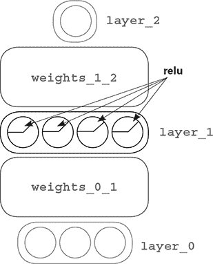

#### 约束 1：函数必须是连续的，并且在定义域内是无限的

正确激活函数的第一个约束是它必须对任何输入都有一个输出数字。换句话说，你不应该能够输入一个没有输出的数字。

稍显过度，但看看左侧的函数（四条不同的线）是否没有为每个`x`值定义`y`值？它只在四个点上定义。这将是一个糟糕的激活函数。然而，右侧的函数是连续的，并且在定义域内是无限的。对于任何输入（`x`），你都可以计算出输出（`y`）。

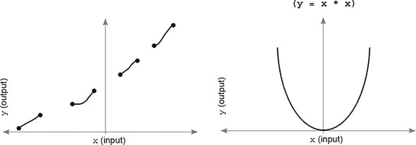

#### 约束 2：好的激活函数是单调的，永远不会改变方向

第二个约束是函数必须是 1:1 的。它永远不能改变方向。换句话说，它必须始终增加或始终减少。

例如，看看以下两个函数。这些形状回答了“给定`x`作为输入，函数描述的`y`值是什么？”的问题。左侧的函数（`y = x * x`）不是一个理想的激活函数，因为它既不是始终增加也不是始终减少。

你怎么判断呢？注意，有许多情况下两个`x`的值对应一个`y`的值（除了 0 以外的所有值都如此）。然而，右侧的函数始终在增加！没有任何两个`x`的值会有相同的`y`值：

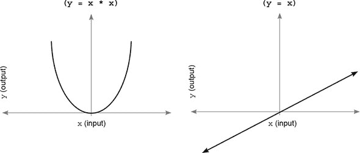

这个特定的约束在技术上并不是一个要求。与有缺失值的函数（非连续的）不同，你可以优化非单调的函数。但考虑多个输入值映射到相同输出值的含义。

当你在神经网络中学习时，你正在寻找正确的权重配置以产生特定的输出。如果有多个正确答案，这个问题可能会变得更加困难。如果有多种方式可以得到相同的输出，那么网络就有多个可能的完美配置。

一个乐观主义者可能会说：“嘿，这太好了！如果答案可以在多个地方找到，那么你更有可能找到正确的答案！”而一个悲观主义者可能会说：“这太糟糕了！现在你没有正确的方向去减少错误，因为你可以在任何方向上前进，理论上都可以取得进步。”

不幸的是，悲观主义者所识别的现象更为重要。对于这个主题的高级研究，更多地了解凸优化与非凸优化；许多大学（和在线课程）都有专门针对这些问题的课程。

#### 约束 3：好的激活函数是非线性的（它们会弯曲或转向）

第三个约束需要回顾一下第六章。还记得“有时相关性”吗？为了创建它，你必须允许神经元选择性地与输入神经元相关联，使得一个来自一个输入到神经元的非常负的信号可以减少它与任何输入的相关性（在`relu`的情况下，通过迫使神经元降至 0）。

实际上，这种现象是由任何曲线函数促进的。另一方面，看起来像直线的函数会放大进入的加权平均值。放大某物（乘以一个常数，如 2）不会影响神经元与其各种输入的相关性。它会使表示的集体相关性更响亮或更微弱。但激活函数不允许一个权重影响神经元与其他权重的相关性。你真正想要的是“选择性”的相关性。给定一个具有激活函数的神经元，你希望一个进入的信号能够增加或减少神经元与所有其他进入信号的相关性。所有曲线都做到了这一点（程度不同，你将会看到）。

因此，这里左边显示的函数被认为是线性函数，而右边的是非线性的，通常会成为更好的激活函数（尽管有例外，我们稍后会讨论）。

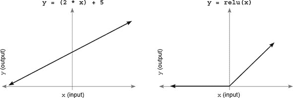

#### 约束 4：好的激活函数（及其导数）应该能够高效地计算

这个很简单。你将频繁地调用这个函数（有时是数十亿次），所以你不想让它计算得太慢。许多最近的激活函数之所以受欢迎，是因为它们易于计算，尽管牺牲了它们的表达能力（`relu`就是这样一个很好的例子）。

### 标准隐藏层激活函数

#### 在无限可能的功能中，哪些是最常用的？

即使有这些限制，也应该清楚，可以使用无限（可能还是超越无限的？）数量的函数作为激活函数。在过去的几年里，最先进的激活函数取得了很大的进展。但仍然只有相对较少的激活函数能够满足大部分激活需求，而且大多数情况下对它们的改进都是微小的。

#### sigmoid 是最基本的激活函数

`sigmoid`很棒，因为它可以平滑地将无限多的输入压缩到 0 和 1 之间的输出。在许多情况下，这让你可以解释任何单个神经元的输出作为一个概率。因此，人们既在隐藏层也在输出层使用这种非线性。

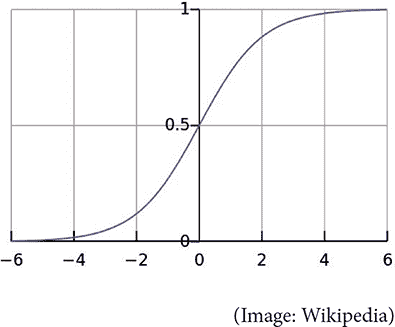

#### tanh 对于隐藏层比 sigmoid 更好

关于`tanh`的酷之处在于。还记得建模选择性相关性吗？好吧，`sigmoid`提供不同程度的正相关性。这很好。`tanh`与`sigmoid`相同，只是它的范围在-1 和 1 之间！

这意味着它也可以引入一些*负相关性*。尽管它对输出层（除非你预测的数据在-1 和 1 之间）并不是特别有用，但负相关性的这一方面在隐藏层中非常强大；在许多问题上，`tanh`在隐藏层中会比`sigmoid`表现得更好。

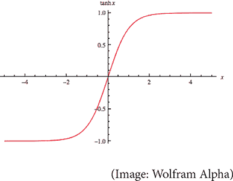

### 标准输出层激活函数

#### 选择最好的一个取决于你试图预测什么

结果表明，对隐藏层激活函数的最佳选择可能与输出层激活函数的最佳选择大不相同，尤其是在分类方面。总的来说，输出层有三种主要类型。

#### 配置 1：预测原始数据值（无激活函数）

这可能是最直接但最不常见的一种输出层。在某些情况下，人们希望训练一个神经网络将一个数字矩阵转换成另一个数字矩阵，其中输出的范围（最低值和最高值之间的差异）不是概率。一个例子可能是根据周围州的温度预测科罗拉多州的平均温度。

这里要关注的主要是确保输出非线性可以预测正确的答案。在这种情况下，`sigmoid` 或 `tanh` 会被认为是不合适的，因为它强制每个预测都在 0 和 1 之间（你想要预测任何温度，而不仅仅是 0 到 1 之间的温度）。如果我要训练一个网络来做这个预测，我非常可能会在没有输出激活函数的情况下训练网络。

#### 配置 2：预测无关的 yes/no 概率（sigmoid）

你通常希望在一个神经网络中做出多个二元概率。我们在第五章的“具有多个输入和输出的梯度下降”部分中这样做过，根据输入数据预测球队是否会赢，是否有伤害，以及球队的士气（快乐或悲伤）。

作为旁白，当一个神经网络有隐藏层时，同时预测多个事物可能是有益的。通常，当网络预测一个标签时，它会学到一些对其他标签有用的东西。例如，如果网络在预测球队是否会赢得球赛方面非常出色，那么相同的隐藏层很可能对预测球队是否会高兴或悲伤也非常有用。但是，如果没有这个额外信号，网络可能很难预测快乐或悲伤。这通常因问题而异很大，但值得记住。

在这些情况下，最好使用 `sigmoid` 激活函数，因为它为每个输出节点分别建模单独的概率。

#### 配置 3：预测哪个概率（softmax）

在神经网络中，最常见的情况是预测许多标签中的一个。例如，在 MNIST 数字分类器中，你想要预测图像中是哪个数字。你知道提前图像不可能包含超过一个数字。你可以用 `sigmoid` 激活函数训练这个网络，并声明最高的输出概率是最可能的。这会工作得相当好。但有一个激活函数来模拟“越有可能是一个标签，其他标签的可能性就越小”的想法会更好。

我们为什么喜欢这种现象？考虑权重更新的方式。假设 MNIST 数字分类器应该预测图像是 9。也假设原始加权总和进入最终层（在应用激活函数之前）的值如下：

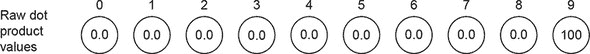

网络的原始输入到最后一层预测除了节点 9 以外的每个节点为 0，而节点 9 预测为 100。你可能称之为完美。让我们看看当这些数字通过 `sigmoid` 激活函数运行时会发生什么：

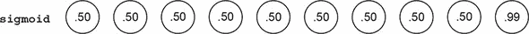

奇怪的是，网络现在似乎不太确定：9 仍然是最高，但网络似乎认为有 50%的可能性它可能是其他任何数字。真奇怪！另一方面，`softmax`对输入的解释非常不同：


这看起来很棒。不仅 9 是最高的，而且网络甚至没有怀疑它可能是其他任何可能的 MNIST 数字。这看起来可能像是`sigmoid`的理论缺陷，但当你反向传播时，它可能会有严重的后果。考虑在`sigmoid`输出上如何计算均方误差。从理论上讲，网络预测得几乎完美，对吧？当然，它不会反向传播很多错误。但`sigmoid`不是这样：

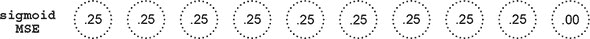

看看所有的错误！尽管网络预测得完美，但这些权重将进行大规模的权重更新。为什么？为了`sigmoid`达到 0 错误，它不仅必须预测真实输出的最高正数；它还必须预测其他所有地方都是 0。而`softmax`问，“哪个数字似乎最适合这个输入？”`sigmoid`说，“你最好相信它只有数字 9，并且与其他 MNIST 数字没有共同之处。”

### 核心问题：输入具有相似性

#### 不同的数字具有特征。让网络相信这是好事

MNIST 数字并不都是完全不同的：它们有重叠的像素值。平均的 2 与平均的 3 有很多共同之处。

为什么这很重要？嗯，作为一条一般规则，相似的输入会产生相似的输出。当你拿一些数字并将它们乘以一个矩阵时，如果起始数字很相似，那么结束数字也会很相似。

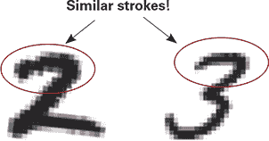

考虑这里显示的 2 和 3。如果我们正向传播 2，并且不小心有一部分概率流向了标签 3，这对网络来说意味着什么，以至于它认为这是一个大错误并做出大的权重更新？它会惩罚网络，使其不能通过除了与 2s 独家相关的特征之外的其他任何特征来识别 2。它会惩罚网络，使其基于，比如说，顶部曲线来识别 2。为什么？因为 2 和 3 在图像顶部的曲线是相同的。使用`sigmoid`训练会惩罚网络尝试根据这个输入预测 2，因为这样做它就会寻找与 3s 相同的输入。因此，当出现 3 时，2 标签会得到一些概率（因为图像的一部分看起来像 2）。

会有什么副作用？大多数图像在图像中间共享很多像素，所以网络会开始尝试专注于边缘。考虑右侧显示的 2 检测节点权重。

看看图像中间有多混乱？最重的权重是图像边缘 2 的端点。一方面，这些可能是 2 的最佳单个指标，但最好的整体是网络能够看到整个形状。这些单个指标可能会被稍微偏离中心或倾斜错误方向的 3 意外触发。网络没有学习到 2 的真正本质，因为它需要学习 2 而不是 1，不是 3，不是 4，等等。

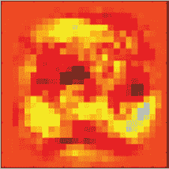

我们希望输出激活函数不会惩罚相似的标签。相反，我们希望它关注所有可能指示任何潜在输入的信息。而且，`softmax`的概率总和总是等于 1。你可以将任何单个预测解释为预测是特定标签的全局概率。`softmax`在理论和实践中都表现更好。

### `softmax`计算

#### `softmax`将每个输入值进行指数化，然后除以层的总和

让我们看看之前神经网络假设输出值的`softmax`计算。我将再次在这里展示，这样你可以看到`softmax`的输入：

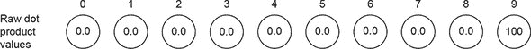

要在整个层上计算`softmax`，首先将每个值进行指数化。对于每个值`x`，计算`e`的`x`次幂（`e`是一个特殊的数，大约是 2.71828...）。`e``^x`的值显示在右侧。

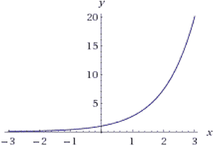

注意，它将每个预测转换成正数，其中负数变成了非常小的正数，而大数变成了非常大的数。（如果你听说过指数增长，那可能就是在谈论这个函数或一个非常相似的函数。）

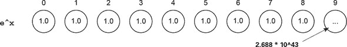

简而言之，所有的 0 都变成了 1（因为 1 是*`e`*`^x`的 y 截距），而 100 变成了一个巨大的数字（2 后面跟着 43 个 0）。如果有任何负数，它们变成了介于 0 和 1 之间的数。下一步是将这一层的所有节点相加，然后将这一层的每个值除以这个总和。这实际上使得除了标签 9 的值之外的所有数字都变成了 0。

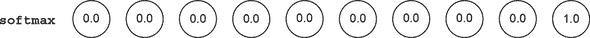

`softmax`的好处是，网络预测的某个值越高，它预测的其他值就越低。它增加了所谓的衰减的“尖锐度”。它鼓励网络以非常高的概率预测一个输出。

要调整它执行这一操作的积极性，在指数化时使用比`e`稍高或稍低的数字。较小的数字会导致较低的衰减，而较大的数字会导致较高的衰减。但大多数人只是坚持使用`e`。

### 激活函数安装说明

#### 你如何将你最喜欢的激活函数添加到任何层中？

现在我们已经涵盖了各种激活函数，并解释了它们在神经网络隐藏层和输出层中的有用性，让我们谈谈将激活函数正确安装到神经网络中的方法。幸运的是，你已经在你的第一个深度神经网络中看到了如何使用非线性的例子：你向隐藏层添加了`relu`激活函数。将其添加到正向传播相对简单。你取了`layer_1`将有的值（没有激活），并对每个值应用了`relu`函数：

```
layer_0 = images[i:i+1]
layer_1 = relu(np.dot(layer_0,weights_0_1))
layer_2 = np.dot(layer_1,weights_1_2)
```

这里有一些术语需要记住。*层的输入*指的是非线性之前的值。在这种情况下，`layer_1`的输入是`np.dot(layer_0,weights_0_1)`。这不要与前面的层`layer_0`混淆。

在正向传播中向层添加激活函数相对简单。但在反向传播中正确补偿激活函数则要微妙得多。

在第六章中，我们进行了一个有趣的操作来创建`layer_1_delta`变量。无论`relu`如何将`layer_1`的值强制设为 0，我们也会将`delta`乘以 0。当时的推理是，“因为`layer_1`的值为 0 对输出预测没有影响，它也不应该对权重更新有任何影响。它不负责错误。”这是更微妙属性的一种极端形式。考虑`relu`函数的形状。

对于正数，`relu`的斜率正好是 1。对于负数，`relu`的斜率正好是 0。修改这个函数的输入（通过一个非常小的量）如果它预测的是正值，将产生 1:1 的效果，如果它预测的是负值，将产生 0:1 的效果（没有效果）。这个斜率是衡量`relu`的输出在输入变化时将如何变化的一个指标。

由于此时`delta`的目的在于告诉前面的层“下次让我的输入更高或更低”，这个`delta`非常有用。它修改了从后续层反向传播回来的`delta`，以考虑这个节点是否对错误有贡献。

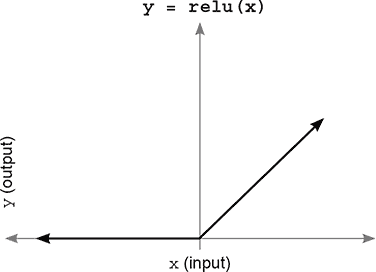

因此，在反向传播时，为了生成`layer_1_delta`，将来自`layer_2`的反向传播`delta`（`layer_2_delta.dot(weights_1_2.T)`）乘以在正向传播中预测的点处的`relu`斜率。对于某些`delta`，斜率是 1（正值），而对于其他`delta`，斜率是 0（负值）：

```
error += np.sum((labels[i:i+1] - layer_2) ** 2)

correct_cnt += int(np.argmax(layer_2) == \
                                np.argmax(labels[i:i+1]))

layer_2_delta = (labels[i:i+1] - layer_2)
layer_1_delta = layer_2_delta.dot(weights_1_2.T)\
                            * relu2deriv(layer_1)

weights_1_2 += alpha * layer_1.T.dot(layer_2_delta)
weights_0_1 += alpha * layer_0.T.dot(layer_1_delta)

def relu(x):
    return (x >= 0) * x       *1*

def relu2deriv(output):
    return output >= 0        *2*
```

+   ***1* 如果 x > 0，则返回 x；否则返回 0**

+   ***2* 如果输入 > 0，则返回 1；否则返回 0**

`relu2deriv`是一个特殊函数，它可以接受`relu`的输出并计算在该点`relu`的斜率（它对输出向量中的所有值都这样做）。这引发了一个问题，如何对其他不是`relu`的非线性进行调整？考虑`relu`和`sigmoid`：

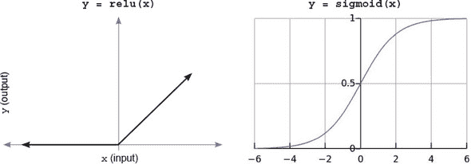

这些图中的重要之处在于斜率是输入的微小变化对输出影响程度的一个指标。你想要修改输入的`delta`（来自下一层），以考虑在此节点之前更新权重是否会有任何影响。记住，最终目标是调整权重以减少误差。这一步鼓励网络在调整权重将几乎没有效果的情况下保持权重不变。它是通过乘以斜率来实现的。对于`sigmoid`来说，也是如此。

### 将差分乘以斜率

#### 要计算层差分（layer_delta），需要将反向传播的差分乘以层的斜率

`layer_1_delta[0]`表示为了减少网络（对于特定的训练示例）的误差，层 1 的第一个隐藏节点应该比现在高多少或低多少。当没有非线性时，这是`layer_2`的加权平均`delta`。


但神经元上`delta`的最终目标是通知权重它们是否应该移动。如果移动它们没有任何效果，它们（作为一个组）应该保持不变。对于`relu`来说，这是显而易见的，它要么开启要么关闭。`sigmoid`可能更为微妙。

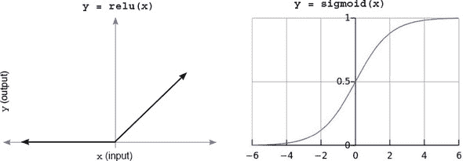

考虑一个单一的`sigmoid`神经元。当输入从任一方向接近 0 时，`sigmoid`对输入变化的敏感性会逐渐增加。但非常正的和非常负的输入接近斜率接近 0。因此，当输入变得非常正或非常负时，对输入权重的小幅变化对神经元在此训练示例中的误差变得不那么相关。更广泛地说，许多隐藏节点对于准确预测 2（可能它们只用于 8）是不相关的。你不应该过多地调整它们的权重，因为这样可能会损害它们在其他地方的有用性。

相反，这也产生了一种**粘性**的概念。那些在一个方向上（对于相似的训练示例）之前被大量更新的权重会自信地预测一个高值或低值。这些非线性特性有助于使偶尔的错误训练示例难以破坏多次被强化的智能。

### 将输出转换为斜率（导数）

#### 大多数优秀的激活函数都能将它们的输出转换为斜率。(- (效率提升！)

现在你已经知道向层添加激活函数会改变该层的`delta`计算方式，让我们讨论一下行业是如何高效地做到这一点的。必要的新的操作是计算所使用的非线性的导数。

大多数非线性（所有流行的非线性）使用一种计算导数的方法，这可能会让熟悉微积分的你们感到惊讶。大多数优秀的激活函数不是以通常的方式在曲线上的某个点上计算导数，而是有一种方法，可以通过层的前向传播的 *输出* 来计算导数。这已经成为计算神经网络中导数的标准做法，并且非常方便。

以下是一个小型表格，列出了你迄今为止看到的函数及其导数。`输入` 是 NumPy 向量（对应于层的输入）。`输出` 是层的预测。`导数` 是对应于每个节点激活导数导数的向量导数。`真实值` 是真实值的向量（通常对于正确标签位置为 1，其他地方为 0）。

| 函数 | 前向传播 | 反向传播 delta |
| --- | --- | --- |
| relu | ones_and_zeros = (输入 > 0) 输出 = 输入 * ones_and_zeros | mask = 输出 > 0 导数 = 输出 * mask |
| sigmoid | 输出 = 1 / (1 + np.exp(-输入)) | 导数 = 输出 * (1 - 输出) |
| tanh | 输出 = np.tanh(输入) | 导数 = 1 - (输出²) |
| softmax | temp = np.exp(输入) 输出 /= np.sum(temp) | temp = (输出 - 真实值) 输出 = temp / len(真实值) |

注意，`softmax` 的 `delta` 计算是特殊的，因为它只用于最后一层。理论上还有更多的事情发生，但我们没有时间在这里讨论。现在，让我们在 MNIST 分类网络中安装一些更好的激活函数。

### 升级 MNIST 网络

#### 让我们将 MNIST 网络升级，以反映你所学的知识。

理论上，`tanh` 函数应该是一个更好的隐藏层激活函数，而 `softmax` 应该是一个更好的输出层激活函数。当我们测试它们时，它们确实达到了更高的分数。但事情并不总是像看起来那么简单。

为了正确调整这些新激活函数的网络，我不得不进行一些调整。对于 `tanh`，我必须减小输入权重的标准差。记住，你随机初始化权重。`np.random.random` 创建一个在 0 和 1 之间随机分布的随机矩阵。通过乘以 0.2 并减去 0.1，你将这个随机范围重新缩放为 -0.1 和 0.1 之间。这对于 `relu` 工作得很好，但对于 `tanh` 来说则不太理想。`tanh` 喜欢有一个更窄的随机初始化范围，所以我将其调整为 -0.01 和 0.01 之间。

我还移除了错误计算，因为我们还没有准备好进行这项工作。技术上讲，`softmax` 最好与一个称为 *交叉熵* 的错误函数一起使用。这个网络正确地计算了用于此误差测量的 `layer_2_delta`，但由于我们还没有分析为什么这个误差函数是有利的，所以我移除了计算它的代码。

最后，就像对神经网络所做的几乎所有改动一样，我不得不重新审视`alpha`调整。我发现为了在 300 次迭代内达到良好的分数，需要更高的`alpha`值。哇哦！正如预期的那样，网络达到了更高的测试准确率，达到了 87%。

```
import numpy as np, sys
np.random.seed(1)

from keras.datasets import mnist
(x_train, y_train), (x_test, y_test) = mnist.load_data()

images, labels = (x_train[0:1000].reshape(1000,28*28)\
                                              / 255, y_train[0:1000])
one_hot_labels = np.zeros((len(labels),10))
for i,l in enumerate(labels):
    one_hot_labels[i][l] = 1
labels = one_hot_labels

test_images = x_test.reshape(len(x_test),28*28) / 255
test_labels = np.zeros((len(y_test),10))
for i,l in enumerate(y_test):
    test_labels[i][l] = 1

def tanh(x):
    return np.tanh(x)
def tanh2deriv(output):
    return 1 - (output ** 2)
def softmax(x):
    temp = np.exp(x)
    return temp / np.sum(temp, axis=1, keepdims=True)

alpha, iterations, hidden_size = (2, 300, 100)
pixels_per_image, num_labels = (784, 10)
batch_size = 100

weights_0_1 = 0.02*np.random.random((pixels_per_image,hidden_size))-0.01
weights_1_2 = 0.2*np.random.random((hidden_size,num_labels)) - 0.1

for j in range(iterations):
    correct_cnt = 0
    for i in range(int(len(images) / batch_size)):
        batch_start, batch_end=((i * batch_size),((i+1)*batch_size))
        layer_0 = images[batch_start:batch_end]
        layer_1 = tanh(np.dot(layer_0,weights_0_1))
        dropout_mask = np.random.randint(2,size=layer_1.shape)
        layer_1 *= dropout_mask * 2
        layer_2 = softmax(np.dot(layer_1,weights_1_2))

        for k in range(batch_size):
            correct_cnt += int(np.argmax(layer_2[k:k+1]) == \
                          np.argmax(labels[batch_start+k:batch_start+k+1]))
        layer_2_delta = (labels[batch_start:batch_end]-layer_2)\
                                           / (batch_size * layer_2.shape[0])
        layer_1_delta = layer_2_delta.dot(weights_1_2.T) \
                                                       * tanh2deriv(layer_1)
        layer_1_delta *= dropout_mask

        weights_1_2 += alpha * layer_1.T.dot(layer_2_delta)
        weights_0_1 += alpha * layer_0.T.dot(layer_1_delta)
    test_correct_cnt = 0

    for i in range(len(test_images)):

        layer_0 = test_images[i:i+1]
        layer_1 = tanh(np.dot(layer_0,weights_0_1))
        layer_2 = np.dot(layer_1,weights_1_2)
        test_correct_cnt += int(np.argmax(layer_2) == \
                                               np.argmax(test_labels[i:i+1]))
    if(j % 10 == 0):
        sys.stdout.write("\n"+ "I:" + str(j) + \
         " Test-Acc:"+str(test_correct_cnt/float(len(test_images)))+\
         " Train-Acc:" + str(correct_cnt/float(len(images))))

I:0 Test-Acc:0.394 Train-Acc:0.156   I:150 Test-Acc:0.8555 Train-Acc:0.914
I:10 Test-Acc:0.6867 Train-Acc:0.723 I:160 Test-Acc:0.8577 Train-Acc:0.925
I:20 Test-Acc:0.7025 Train-Acc:0.732 I:170 Test-Acc:0.8596 Train-Acc:0.918
I:30 Test-Acc:0.734 Train-Acc:0.763  I:180 Test-Acc:0.8619 Train-Acc:0.933
I:40 Test-Acc:0.7663 Train-Acc:0.794 I:190 Test-Acc:0.863 Train-Acc:0.933
I:50 Test-Acc:0.7913 Train-Acc:0.819 I:200 Test-Acc:0.8642 Train-Acc:0.926
I:60 Test-Acc:0.8102 Train-Acc:0.849 I:210 Test-Acc:0.8653 Train-Acc:0.931
I:70 Test-Acc:0.8228 Train-Acc:0.864 I:220 Test-Acc:0.8668 Train-Acc:0.93
I:80 Test-Acc:0.831 Train-Acc:0.867  I:230 Test-Acc:0.8672 Train-Acc:0.937
I:90 Test-Acc:0.8364 Train-Acc:0.885 I:240 Test-Acc:0.8681 Train-Acc:0.938
I:100 Test-Acc:0.8407 Train-Acc:0.88 I:250 Test-Acc:0.8687 Train-Acc:0.937
I:110 Test-Acc:0.845 Train-Acc:0.891 I:260 Test-Acc:0.8684 Train-Acc:0.945
I:120 Test-Acc:0.8481 Train-Acc:0.90 I:270 Test-Acc:0.8703 Train-Acc:0.951
I:130 Test-Acc:0.8505 Train-Acc:0.90 I:280 Test-Acc:0.8699 Train-Acc:0.949
I:140 Test-Acc:0.8526 Train-Acc:0.90 I:290 Test-Acc:0.8701 Train-Acc:0.94
```
