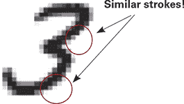
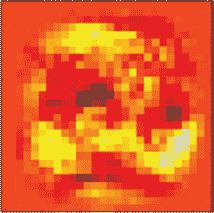
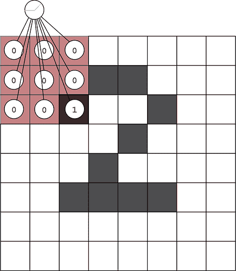
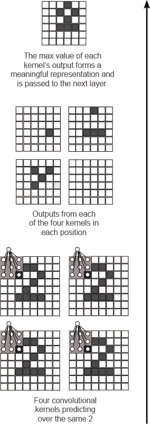

## 第十章。关于边缘和角落的神经网络学习：卷积神经网络简介

**本章内容**

+   在多个地方重用权重

+   卷积层

> “卷积神经网络中使用的池化操作是一个大错误，而它之所以能如此有效，简直是一场灾难。”
> 
> *来自 Reddit 的“问我任何问题”活动，作者：杰弗里·辛顿*

### 在多个地方重用权重

#### 如果你需要在多个地方检测到相同的特征，请使用相同的权重！

神经网络中最大的挑战是过拟合，当神经网络记住数据集而不是学习有用的抽象，这些抽象可以推广到未见过的数据。换句话说，神经网络学习根据数据集中的噪声进行预测，而不是依赖于基本信号（还记得关于泥土中嵌入叉子的类比吗？）。



过拟合通常是由于学习特定数据集所需的参数过多。在这种情况下，网络有如此多的参数，以至于它可以记住训练数据集中每个细微的细节（神经网络：“啊，我看到我们又有图像编号 363 了。这是编号 2。”），而不是学习高级抽象（神经网络：“嗯，它有一个弯曲的顶部，左下角有一个漩涡，右边有一个尾巴；它一定是 2。”）。当神经网络有很多参数但训练示例不多时，过拟合很难避免。

我们在第八章中详细介绍了这个主题，当时我们探讨了正则化作为对抗过拟合的手段。但正则化并不是唯一的技术（甚至不是最理想的技术）来防止过拟合。

正如我提到的，过拟合关注的是模型中权重数量与学习这些权重所需的数据点数量之间的比率。因此，有一种更好的方法来对抗过拟合。当可能时，最好使用某种松散定义的*结构*。

结构是指你选择性地在神经网络中选择重用权重以实现多个目的，因为我们相信相同的模式需要在多个地方被检测到。正如你将看到的，这可以显著减少过拟合，并导致更精确的模型，因为它减少了权重与数据的比率。



但是，通常移除参数会使模型的表达能力降低（更难学习模式），如果你在重用权重的地方足够聪明，模型可以同样具有表达能力，但更能抵抗过拟合。也许令人惊讶的是，这种技术也往往使模型变得更小（因为需要存储的实际参数更少）。神经网络中最著名和最广泛使用的结构称为*卷积*，当用作层时，称为*卷积层*。

### 卷积层

#### 在每个位置都重复使用很多非常小的线性层，而不是一个单一的大的层

卷积层背后的核心思想是，而不是有一个大型的、密集的线性层，其中每个输入都连接到每个输出，你反而有很多非常小的线性层，通常少于 25 个输入和一个输出，你可以在每个输入位置使用这些层。每个微型层被称为卷积核，但实际上它不过是一个具有少量输入和一个输出的婴儿线性层。



这里展示了一个单一的 3 × 3 卷积核。它将在当前位置预测，然后向右移动一个像素，再次预测，然后再次向右移动，以此类推。一旦它扫描了整个图像，它将向下移动一个像素，然后向左扫描，重复直到它在图像中的每个可能位置都进行了预测。结果将是一个较小的核预测正方形，这些预测被用作下一层的输入。卷积层通常有很多核。

在右下角有四个不同的卷积核处理同一个 2 的 8 × 8 图像。每个核产生一个 6 × 6 预测矩阵。使用四个 3 × 3 核的卷积层的结果是四个 6 × 6 预测矩阵。你可以将这些矩阵逐元素相加（逐元素求和池化），逐元素取平均值（平均池化），或者计算逐元素的最大值（最大池化）。

最后一个版本证明是最受欢迎的：对于每个位置，查看每个核的输出，找到最大值，并将其复制到页面右上角的最终 6 × 6 矩阵中。这个最终矩阵（只有这个矩阵）然后被前向传播到下一层。

在这些图中需要注意几个方面。首先，右下角的核只在前向传播 1，前提是它专注于一条水平线段。左下角的核只在前向传播 1，前提是它专注于一个向上向右的对角线。最后，右下角的核没有识别出它被训练去预测的任何模式。

重要的是要认识到，这项技术允许每个核学习特定的模式，然后在图像的某个地方搜索该模式的存在。一个小的权重集可以训练一个更大的训练示例集，因为尽管数据集没有变化，每个微型核在多个数据段上多次前向传播，从而改变了权重与训练数据点的比率。这对网络有强大的影响，极大地减少了它对训练数据的过度拟合能力，并增加了它的一般化能力。



### NumPy 中的简单实现

#### 只需想想微型线性层，你就已经知道你需要知道的内容了

让我们从前向传播开始。这个方法展示了如何在 NumPy 中从一批图像中选择一个子区域。请注意，它为整个批次选择了相同的子区域：

```
def get_image_section(layer,row_from, row_to, col_from, col_to):
    sub_section = layer[:,row_from:row_to,col_from:col_to]
    return subsection.reshape(-1,1,row_to-row_from, col_to-col_from)
```

现在，让我们看看这个方法是如何使用的。因为它选择了一批输入图像的一个子集，所以你需要多次调用它（在图像的每个位置上）。这样的`for`循环看起来可能像这样：

```
layer_0 = images[batch_start:batch_end]
layer_0 = layer_0.reshape(layer_0.shape[0],28,28)
layer_0.shape

sects = list()
for row_start in range(layer_0.shape[1]-kernel_rows):
    for col_start in range(layer_0.shape[2] - kernel_cols):
        sect = get_image_section(layer_0,
                                 row_start,
                                 row_start+kernel_rows,
                                 col_start,
                                 col_start+kernel_cols)
        sects.append(sect)

expanded_input = np.concatenate(sects,axis=1)
es = expanded_input.shape
flattened_input = expanded_input.reshape(es[0]*es[1],-1)
```

在这段代码中，`layer_0`是一个形状为 28 × 28 的图像批次。`for`循环遍历图像中的每个（`kernel_rows` × `kernel_cols`）子区域，并将它们放入一个名为`sects`的列表中。然后，这个部分列表以独特的方式连接和重塑。

（暂时）假设每个单独的子区域都是它自己的图像。因此，如果你有一个包含 8 张图像的批次，并且每张图像有 100 个子区域，那么你就可以假装这是一个包含 800 张更小图像的批次。通过一个只有一个输出神经元的线性层前向传播它们，就相当于预测每个批次中每个子区域的线性层（暂停并确保你理解了这一点）。

如果你使用具有*n*个输出神经元的线性层进行前向传播，它将生成与在每个输入位置的图像中预测*n*个线性层（核）相同的输出。你这样做是因为这样做可以使代码更简单、更快：

```
kernels = np.random.random((kernel_rows*kernel_cols,num_kernels))
               ...
kernel_output = flattened_input.dot(kernels)
```

以下列表显示了整个 NumPy 实现：

```
import numpy as np, sys
np.random.seed(1)

from keras.datasets import mnist

(x_train, y_train), (x_test, y_test) = mnist.load_data()

images, labels = (x_train[0:1000].reshape(1000,28*28) / 255,
                  y_train[0:1000])

one_hot_labels = np.zeros((len(labels),10))
for i,l in enumerate(labels):
    one_hot_labels[i][l] = 1
labels = one_hot_labels

test_images = x_test.reshape(len(x_test),28*28) / 255
test_labels = np.zeros((len(y_test),10))
for i,l in enumerate(y_test):
    test_labels[i][l] = 1

def tanh(x):
    return np.tanh(x)

def tanh2deriv(output):
    return 1 - (output ** 2)

def softmax(x):
    temp = np.exp(x)
    return temp / np.sum(temp, axis=1, keepdims=True)

alpha, iterations = (2, 300)
pixels_per_image, num_labels = (784, 10)
batch_size = 128

input_rows = 28
input_cols = 28

kernel_rows = 3
kernel_cols = 3
num_kernels = 16

hidden_size = ((input_rows - kernel_rows) *
               (input_cols - kernel_cols)) * num_kernels

kernels = 0.02*np.random.random((kernel_rows*kernel_cols,
                                 num_kernels))-0.01

weights_1_2 = 0.2*np.random.random((hidden_size,
                                    num_labels)) - 0.1

def get_image_section(layer,row_from, row_to, col_from, col_to):
    section = layer[:,row_from:row_to,col_from:col_to]
    return section.reshape(-1,1,row_to-row_from, col_to-col_from)

for j in range(iterations):
    correct_cnt = 0
    for i in range(int(len(images) / batch_size)):
        batch_start, batch_end=((i * batch_size),((i+1)*batch_size))
        layer_0 = images[batch_start:batch_end]
        layer_0 = layer_0.reshape(layer_0.shape[0],28,28)
        layer_0.shape

        sects = list()
        for row_start in range(layer_0.shape[1]-kernel_rows):
            for col_start in range(layer_0.shape[2] - kernel_cols):
                sect = get_image_section(layer_0,
                                         row_start,
                                         row_start+kernel_rows,
                                         col_start,
                                         col_start+kernel_cols)
                sects.append(sect)

        expanded_input = np.concatenate(sects,axis=1)
        es = expanded_input.shape
        flattened_input = expanded_input.reshape(es[0]*es[1],-1)

        kernel_output = flattened_input.dot(kernels)
        layer_1 = tanh(kernel_output.reshape(es[0],-1))
        dropout_mask = np.random.randint(2,size=layer_1.shape)
        layer_1 *= dropout_mask * 2
        layer_2 = softmax(np.dot(layer_1,weights_1_2))

        for k in range(batch_size):
            labelset = labels[batch_start+k:batch_start+k+1]
            _inc = int(np.argmax(layer_2[k:k+1]) ==
                               np.argmax(labelset))
            correct_cnt += _inc

        layer_2_delta = (labels[batch_start:batch_end]-layer_2)\
                        / (batch_size * layer_2.shape[0])
        layer_1_delta = layer_2_delta.dot(weights_1_2.T) * \
                        tanh2deriv(layer_1)
        layer_1_delta *= dropout_mask
        weights_1_2 += alpha * layer_1.T.dot(layer_2_delta)
        l1d_reshape = layer_1_delta.reshape(kernel_output.shape)
        k_update = flattened_input.T.dot(l1d_reshape)
        kernels -= alpha * k_update

    test_correct_cnt = 0

    for i in range(len(test_images)):

        layer_0 = test_images[i:i+1]
        layer_0 = layer_0.reshape(layer_0.shape[0],28,28)
        layer_0.shape

        sects = list()
        for row_start in range(layer_0.shape[1]-kernel_rows):
            for col_start in range(layer_0.shape[2] - kernel_cols):
                sect = get_image_section(layer_0,
                                         row_start,
                                         row_start+kernel_rows,
                                         col_start,
                                         col_start+kernel_cols)
                sects.append(sect)

        expanded_input = np.concatenate(sects,axis=1)
        es = expanded_input.shape
        flattened_input = expanded_input.reshape(es[0]*es[1],-1)

        kernel_output = flattened_input.dot(kernels)
        layer_1 = tanh(kernel_output.reshape(es[0],-1))
        layer_2 = np.dot(layer_1,weights_1_2)

        test_correct_cnt += int(np.argmax(layer_2) ==
                                np.argmax(test_labels[i:i+1]))
    if(j % 1 == 0):
        sys.stdout.write("\n"+ \
         "I:" + str(j) + \
         " Test-Acc:"+str(test_correct_cnt/float(len(test_images)))+\
         " Train-Acc:" + str(correct_cnt/float(len(images))))

                   I:0 Test-Acc:0.0288 Train-Acc:0.055
                   I:1 Test-Acc:0.0273 Train-Acc:0.037
                   I:2 Test-Acc:0.028 Train-Acc:0.037
                   I:3 Test-Acc:0.0292 Train-Acc:0.04
                   I:4 Test-Acc:0.0339 Train-Acc:0.046
                   I:5 Test-Acc:0.0478 Train-Acc:0.068
                   I:6 Test-Acc:0.076 Train-Acc:0.083
                   I:7 Test-Acc:0.1316 Train-Acc:0.096
                   I:8 Test-Acc:0.2137 Train-Acc:0.127

                                  ....

                 I:297 Test-Acc:0.8774 Train-Acc:0.816
                 I:298 Test-Acc:0.8774 Train-Acc:0.804
                 I:299 Test-Acc:0.8774 Train-Acc:0.814
```

如你所见，将第九章中的网络的第一层替换为卷积层，可以进一步减少几个百分点的错误。卷积层的输出（`kernel_output`）本身也是一系列二维图像（每个输入位置中每个核的输出）。

大多数卷积层的应用都是将多层堆叠在一起，使得每个卷积层将前一层作为输入图像处理。（你可以自由地将这作为一个个人项目来做；这将进一步提高准确性。）

堆叠卷积层是允许非常深的神经网络（以及由此产生的“深度学习”这一术语的普及）的主要发展之一。不能过分强调这一发明是该领域的里程碑时刻；没有它，我们可能仍然处于写作时的上一个 AI 冬天。

### 摘要

#### 重复使用权重是深度学习中最重要的一项创新。

卷积神经网络是一种比你所意识到的更一般的发展。重用权重以提高准确性的概念非常重要，并且有直观的基础。考虑一下你为了检测图像中是否有猫需要理解什么。首先，你需要理解颜色，然后是线条和边缘，角落和小的形状，最终是这些低级特征的组合，这些特征对应于猫。假设神经网络也需要学习这些低级特征（如线条和边缘），检测线条和边缘的智能就体现在权重中。

但如果你使用不同的权重来分析图像的不同部分，每个权重的部分都必须独立地学习线条是什么。为什么？好吧，如果一组权重观察图像的一部分学会了线条是什么，就没有理由认为另一部分的权重会以某种方式拥有使用该信息的能力：它位于网络的另一部分。

卷积是利用学习的一个特性。偶尔，，你需要多次使用相同的思想或智能；如果是这样，你应该尝试在这些位置使用相同的权重。这带我们到了本书中最重要的思想之一。如果你不学习其他任何东西，请学习这一点：

| |
| --- |

**结构技巧**

当神经网络需要在多个地方使用相同的思想时，应努力在这两个地方使用相同的权重。这将通过提供更多样本供学习，使这些权重变得更加智能，从而提高泛化能力。

| |
| --- |

过去五年（有些在之前）中深度学习领域最大的发展（其中一些在之前）都是这一想法的迭代。卷积、循环神经网络（RNNs）、词嵌入以及最近发布的胶囊网络都可以通过这个角度来理解。当你知道一个网络将在多个地方需要相同的思想时，强迫它在那些地方使用相同的权重。我完全预期更多的深度学习发现将继续基于这一想法，因为发现新的、更高层次的抽象思想，神经网络可以在其架构的各个部分重复使用，是具有挑战性的。
