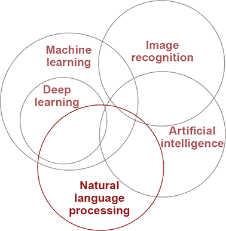
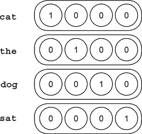
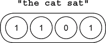
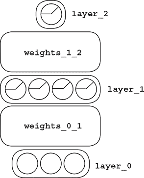
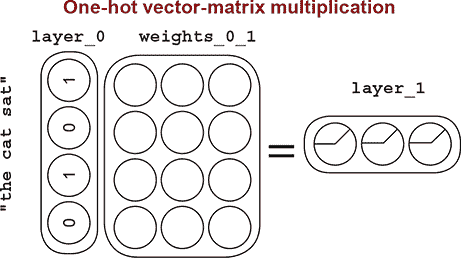
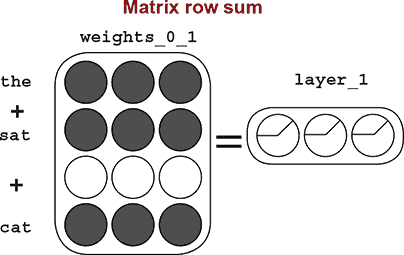
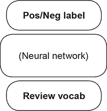
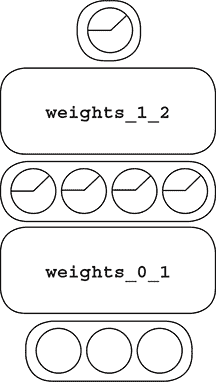
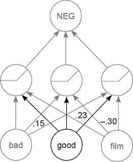
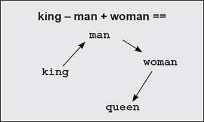

## 第十一章。理解语言的网络：王 - 男 + 女 == ?

**本章内容**

+   自然语言处理（NLP）

+   监督 NLP

+   捕获输入数据中的词相关性

+   嵌入层的介绍

+   神经架构

+   比较词嵌入

+   填空

+   意义来源于损失

+   词类比

> “人是一个缓慢、粗心大意但聪明的人；计算机是快速、准确但愚蠢的。”
> 
> *约翰·费菲尔，在《财富》杂志，1961 年*

### 理解语言意味着什么？

#### 人们关于语言会做出哪些预测？

到目前为止，我们一直在使用神经网络来建模图像数据。但神经网络可以用来理解更广泛的数据集。探索新的数据集也让我们对神经网络的一般知识有了很多了解，因为不同的数据集通常根据数据中隐藏的挑战来证明不同的神经网络训练风格。



我们将从这个章节开始，探索一个与深度学习重叠的古老领域：*自然语言处理*（NLP）。这个领域专门致力于人类语言的自动化理解（之前没有使用深度学习）。我们将讨论深度学习对这个领域的处理方法的基本原理。

### 自然语言处理（NLP）

#### NLP 被划分为一系列任务或挑战

可能最快了解自然语言处理（NLP）的方法之一是考虑 NLP 社区试图解决的许多挑战中的一些。以下是 NLP 中常见的几种分类问题类型：

+   使用文档的*字符*来预测*单词的开始和结束位置*。

+   使用文档的*单词*来预测*句子开始和结束的位置*。

+   使用句子中的*单词*来预测*每个单词的词性*。

+   使用句子中的*单词*来预测*短语开始和结束的位置*。

+   使用句子中的*单词*来预测*命名实体（人、地点、事物）引用的开始和结束位置*。

+   使用文档中的*句子*来预测*哪些代词指的是同一个人/地点/事物*。

+   使用句子中的*单词*来预测句子的*情感*。

一般而言，NLP 任务试图做以下三件事情之一：为文本区域（如词性标注、情感分类或命名实体识别）贴标签；将两个或更多文本区域（如指代消解，试图回答两个对现实世界事物的提及是否实际上指的是同一个现实世界事物，其中现实世界事物通常是人、地点或其他命名实体）链接起来；或者根据上下文尝试填补缺失的信息（缺失的单词）。

可能也明显地看出机器学习和 NLP 是如何紧密相连的。直到最近，大多数最先进的 NLP 算法都是高级、概率性、非参数模型（不是深度学习）。但最近两个主要神经网络算法的发展和普及已经席卷了 NLP 领域：神经词嵌入和循环神经网络（RNNs）。

在本章中，我们将构建一个词嵌入算法，并展示它如何提高自然语言处理算法的准确性。在下一章中，我们将创建一个循环神经网络，并展示它在预测序列时的有效性。

还值得一提的是，自然语言处理（可能使用深度学习）在人工智能进步中扮演的关键角色。人工智能寻求创造能够像人类一样（甚至超越人类）思考和与世界互动的机器。自然语言处理在这个努力中扮演着非常特殊的角色，因为语言是人类意识逻辑和沟通的基础。因此，机器使用和理解语言的方法构成了机器中类似人类逻辑的基础：思想的基础。

### 监督式自然语言处理

#### 输入单词，输出预测

你可能还记得第二章中的以下图示。监督学习就是将“你所知道的”转化为“你想要知道的”。到目前为止，“你所知道的”总是以某种方式由数字组成。但自然语言处理使用文本作为输入。你该如何处理它？


因为神经网络只将输入数字映射到输出数字，所以第一步是将文本转换为数值形式。就像我们转换街灯数据集一样，我们需要将现实世界的数据（在这种情况下，文本）转换为神经网络可以消费的*矩阵*。实际上，我们如何做这一点非常重要！


我们应该如何将文本转换为数字？回答这个问题需要对问题进行一些思考。记住，神经网络在其输入层和输出层之间寻找相关性。因此，我们希望以使输入和输出之间的相关性对网络来说*最明显*的方式将文本转换为数字。这将使训练更快，泛化能力更好。

为了知道哪种输入格式能让网络最明显地感知输入/输出相关性，我们需要了解输入/输出数据集的样子。为了探讨这个话题，让我们接受挑战，进行*主题分类*。

### IMDB 电影评论数据集

#### 你可以预测人们发布的评论是正面还是负面

IMDB 电影评论数据集是一组评论->评分对，通常看起来像以下这样（这是一个模仿，并非来自 IMDB）：

> “这部电影太糟糕了！剧情枯燥，表演不可信，我还把爆米花洒在了衬衫上。”
> 
> *评分：1（星星）*

整个数据集大约由 50,000 个这样的对组成，其中输入评论通常是几句话，输出评分在 1 到 5 星之间。人们认为这是一个*情感数据集*，因为星星表示电影评论的整体情感。但很明显，这个情感数据集可能与其他情感数据集（如产品评论或医院患者评论）有很大不同。

你想要训练一个神经网络，它可以使用输入文本来准确预测输出分数。为了实现这一点，你必须首先决定如何将输入和输出数据集转换为矩阵。有趣的是，输出数据集是一个数字，这可能使得它更容易开始。你将调整星级范围在 0 到 1 之间，而不是 1 到 5，这样你就可以使用二进制的`softmax`。这就是你需要对输出所做的所有事情。我将在下一页上展示一个例子。

然而，输入数据却有些棘手。首先，让我们考虑原始数据。它是一系列字符。这带来了一些问题：不仅输入数据是文本而不是数字，而且它是*可变长度*的文本。到目前为止，神经网络总是需要一个固定大小的输入。你需要克服这个问题。

因此，原始输入将不起作用。接下来要问的问题是，“这些数据中的哪些将与输出有相关性？”表示这个属性可能效果很好。首先，我不期望任何字符（在字符列表中）与情感有任何相关性。你需要以不同的方式思考。

那么，关于单词呢？这个数据集中的一些单词会有一些相关性。我敢打赌*糟糕*和*不可信*与评分有显著的负相关性。这里的*负相关性*是指，随着它们在任何输入数据点（任何评论）中的频率增加，评分往往会下降。

也许这个属性更普遍！也许单词本身（即使在没有上下文的情况下）会与情感有显著的相关性。让我们进一步探讨这个问题。

### 在输入数据中捕捉单词相关性

#### 词袋模型：给定一个评论的词汇，预测情感

如果你观察到 IMDB 评论的词汇与其评分之间的相关性，那么你可以进行下一步：创建一个表示电影评论词汇的输入矩阵。

在这种情况下通常的做法是创建一个矩阵，其中每一行（向量）对应于每一部电影评论，每一列表示评论是否包含词汇表中的特定单词。为了创建评论的向量，你计算评论的词汇表，然后在对应的列中为该评论放置 1，其他所有地方放置 0。这些向量有多大？嗯，如果有 2000 个单词，并且你需要在每个向量中为每个单词留出空间，那么每个向量将有 2000 个维度。

这种存储形式被称为*独热编码*，是编码二进制数据（在可能的输入数据点词汇表中，输入数据点的二进制存在或不存在）最常见的形式。如果词汇表只有四个单词，独热编码可能看起来像这样：

```
import numpy as np

onehots = {}
onehots['cat'] = np.array([1,0,0,0])
onehots['the'] = np.array([0,1,0,0])
onehots['dog'] = np.array([0,0,1,0])
onehots['sat'] = np.array([0,0,0,1])

sentence = ['the','cat','sat']
x = word2hot[sentence[0]] + \
    word2hot[sentence[1]] + \
    word2hot[sentence[2]]

print("Sent Encoding:" + str(x))
```



正如你所见，我们为词汇表中的每个术语创建一个向量，这允许你使用简单的向量加法来创建表示总词汇子集的向量（例如，与句子中的单词相对应的子集）。

```
*Output:*        Sent Encoding:[1 1 0 1]
```



注意，当你为几个术语（如“the cat sat”）创建嵌入时，如果单词重复出现多次，你有多种选择。如果短语是“cat cat cat”，你可以选择将“cat”的向量相加三次（结果为`[3,0,0,0]`），或者只取唯一的“cat”一次（结果为`[1,0,0,0]`）。后者通常对语言来说效果更好。

### 预测电影评论

#### 使用编码策略和之前的网络，你可以预测情感

使用我们刚才确定的战略，你可以为情感数据集中的每个单词构建一个向量，并使用之前的两层网络来预测情感。我会展示代码，但我强烈建议你尝试从记忆中完成这个任务。打开一个新的 Jupyter 笔记本，加载数据集，构建你的独热向量，然后构建一个神经网络来预测每篇电影评论的评分（正面或负面）。

我会这样进行预处理步骤：

```
import sys

f = open('reviews.txt')
raw_reviews = f.readlines()
f.close()

f = open('labels.txt')
raw_labels = f.readlines()
f.close()

tokens = list(map(lambda x:set(x.split(" ")),raw_reviews))

vocab = set()
for sent in tokens:
    for word in sent:
        if(len(word)>0):
            vocab.add(word)
vocab = list(vocab)

word2index = {}
for i,word in enumerate(vocab):
    word2index[word]=i

input_dataset = list()
for sent in tokens:
    sent_indices = list()
    for word in sent:
        try:
            sent_indices.append(word2index[word])
        except:
            ""
    input_dataset.append(list(set(sent_indices)))

target_dataset = list()
for label in raw_labels:
    if label == 'positive\n':
        target_dataset.append(1)
    else:
        target_dataset.append(0)
```

### 嵌入层的简介

#### 这还有一个使网络更快的小技巧

右边是之前神经网络的图，你现在将使用它来预测情感。但在那之前，我想描述一下层名称。第一层是数据集（`layer_0`）。接下来是所谓的*线性层*（`weights_0_1`）。接下来是一个`relu`层（`layer_1`），另一个线性层（`weights_1_2`），然后是输出，也就是预测层。实际上，你可以通过用嵌入层替换第一个线性层（`weights_0_1`）来稍微缩短到`layer_1`的路径。



使用 1s 和 0s 的向量在数学上等同于对矩阵的几行求和。因此，选择`weights_0_1`的相关行并求和要比进行大规模的向量-矩阵乘法更高效。因为情感词汇量大约有 70,000 个单词，大部分的向量-矩阵乘法都是在输入向量中的 0 与矩阵的不同行相乘后再求和。选择矩阵中对应每个单词的行并求和要高效得多。



使用选择行并执行求和（或平均）的过程，意味着将第一线性层（`weights_0_1`）作为嵌入层。从结构上看，它们是相同的（`layer_1`使用两种方法进行前向传播时都是一样的）。唯一的区别是求和少量行要快得多。



#### 在运行之前的代码后，运行此代码

```
import numpy as np
np.random.seed(1)

def sigmoid(x):
    return 1/(1 + np.exp(-x))

alpha, iterations = (0.01, 2)
hidden_size = 100

weights_0_1 = 0.2*np.random.random((len(vocab),hidden_size)) - 0.1
weights_1_2 = 0.2*np.random.random((hidden_size,1)) - 0.1

correct,total = (0,0)
for iter in range(iterations):

    for i in range(len(input_dataset)-1000):               *1*

        x,y = (input_dataset[i],target_dataset[i])
        layer_1 = sigmoid(np.sum(weights_0_1[x],axis=0))   *2*
        layer_2 = sigmoid(np.dot(layer_1,weights_1_2))     *3*
        layer_2_delta = layer_2 - y                        *4*
        layer_1_delta = layer_2_delta.dot(weights_1_2.T)   *5*
        weights_0_1[x] -= layer_1_delta * alpha
        weights_1_2 -= np.outer(layer_1,layer_2_delta) * alpha

        if(np.abs(layer_2_delta) < 0.5):
            correct += 1
        total += 1
        if(i % 10 == 9):
            progress = str(i/float(len(input_dataset)))
            sys.stdout.write('\rIter:'+str(iter)\
                             +' Progress:'+progress[2:4]\
                             +'.'+progress[4:6]\
                             +'% Training Accuracy:'\
                             + str(correct/float(total)) + '%')
    print()
correct,total = (0,0)
for i in range(len(input_dataset)-1000,len(input_dataset)):

       x = input_dataset[i]
       y = target_dataset[i]

       layer_1 = sigmoid(np.sum(weights_0_1[x],axis=0))
       layer_2 = sigmoid(np.dot(layer_1,weights_1_2))

    if(np.abs(layer_2 - y) < 0.5):
        correct += 1
    total += 1
print("Test Accuracy:" + str(correct / float(total)))
```

+   ***1* 在前 24,000 条评论上进行训练**

+   ***2* 嵌入 + sigmoid**

+   ***3* 线性 + softmax**

+   ***4* 将预测与真实值进行比较**

+   ***5* 反向传播**

### 解释输出

#### 神经网络在过程中学到了什么？

这是电影评论神经网络的结果。从一个角度来看，这与我们之前讨论过的相同的相关性总结：

```
Iter:0 Progress:95.99% Training Accuracy:0.832%
Iter:1 Progress:95.99% Training Accuracy:0.8663333333333333%
Test Accuracy:0.849
```

神经网络正在寻找输入数据点和输出数据点之间的相关性。但这些数据点具有我们熟悉的特征（尤其是语言的那些特征）。此外，考虑由相关性总结检测到的语言模式，以及更重要的是，哪些模式不会被检测到，这一点极为有益。毕竟，仅仅因为网络能够在输入和输出数据集之间找到相关性，并不意味着它理解了语言中的每一个有用模式。



此外，理解网络（在其当前配置下）能够学习的内容与它为了正确理解语言所需知道的内容之间的区别，是一条极其富有成效的思考路线。这正是处于最前沿的研究人员所考虑的，也是我们在这里将要考虑的。

电影评论网络学习了哪些关于语言的知识？让我们首先考虑呈现给网络的内容。如右上角的图所示，你将每篇评论的词汇作为输入，并要求网络预测两个标签中的一个（`正面`或`负面`）。鉴于相关性总结表明网络将在输入和输出数据集之间寻找相关性，至少你可以期望网络识别出具有正或负相关性的单词（单独来看）。

这自然地导致了相关性总结。你呈现一个词的存在或不存在。因此，相关性总结将找到这种存在/不存在与两个标签中的每一个之间的直接相关性。但这并不是全部的故事。



### 神经架构

#### 架构的选择是如何影响网络学习的内容的？

我们刚刚讨论了神经网络学习的第一种、最简单类型的信息：输入和目标数据集之间的直接相关性。这一观察结果在很大程度上是神经网络智能的起点。（如果一个网络无法在输入和输出数据之间发现直接相关性，那么可能出了问题。）更复杂架构的发展基于寻找比直接相关性更复杂模式的需要，而这个网络也不例外。

识别直接相关性的最小架构是一个两层网络，其中网络有一个直接从输入层连接到输出层的单权重矩阵。但我们的网络有一个隐藏层。这引发了一个问题，这个隐藏层有什么作用？

基本上，隐藏层是将前一层的数据点分组为 *n* 组（其中 *n* 是隐藏层中神经元的数量）。每个隐藏神经元接收一个数据点并回答问题：“这个数据点是否在我的组中？”随着隐藏层的不断学习，它会寻找其输入的有用分组。什么是有用的分组？

如果一个输入数据点分组能够做两件事，那么它是有用的。首先，分组必须对预测输出标签有用。如果它对输出预测没有用，*相关性总结永远不会引导网络找到该组*。这是一个非常有价值的认识。神经网络研究的大部分内容都是关于找到训练数据（或为网络制造的其他信号，以便它能够人为地预测）以找到对任务有用的分组（例如预测电影评论星级）。我们将在稍后讨论这一点。

其次，如果分组是数据中你关心的实际现象，那么它是有用的。不良的分组只是记住数据。好的分组能够捕捉到有用的语言现象。

例如，在预测电影评论是正面还是负面时，理解“糟糕”和“不糟糕”之间的差异是一种强大的分组。如果有一个神经元在看到“糟糕”时关闭，在看到“不糟糕”时打开，这将是一个强大的分组，供下一层使用以做出最终预测。但由于神经网络输入是评论的词汇，“它很棒，不糟糕”与“它很糟糕，不棒”创造了完全相同的`layer_1`值。因此，网络非常不可能创建一个理解否定意义的隐藏神经元。

基于某种语言模式测试层是否相同或不同，是了解架构是否可能使用相关性总结找到该模式的一个很好的第一步。如果你可以构建两个具有相同隐藏层的例子，一个有你感兴趣的模式，另一个没有，那么网络不太可能找到该模式。

正如你刚刚学到的，隐藏层在本质上将前一层的数据分组。在细粒度层面，每个神经元将数据点分类为属于或不属于其组。在更高层面，如果两个数据点（电影评论）属于许多相同的组，则它们是相似的。最后，如果连接到各种隐藏神经元的权重（每个单词的组亲和力度量）相似，则两个输入（单词）是相似的。有了这些知识，在前一个神经网络中，你应该在连接到隐藏神经元的单词权重中观察到什么？

#### 你应该在连接单词和隐藏神经元的权重中看到什么？

这里有一个提示：具有相似预测能力的单词应该属于相似的组（隐藏神经元配置）。这对连接每个单词到每个隐藏神经元的权重意味着什么？

这里是答案。与相似标签（正面或负面）相关的单词将会有类似的权重将它们连接到各种隐藏神经元。这是因为神经网络学会将它们归入相似的隐藏神经元，以便最终层（`weights_1_2`）可以做出正确的正面或负面预测。

您可以通过选择一个特别积极或消极的词语，并搜索具有最相似权值的其他词语来观察这一现象。换句话说，您可以取每个词语，并查看哪些其他词语与每个隐藏神经元（每个组）具有最相似的权值连接。



“好”的三个粗体权值形成了“好”的嵌入。它们反映了“好”这个术语是每个组（隐藏神经元）的成员程度。具有相似预测能力的词语具有相似的词嵌入（权值）。

属于相似组的词语将具有相似的正负标签预测能力。因此，属于相似组且具有相似权值（权重）的词语也将具有相似的含义。从抽象的角度来看，在神经网络中，一个神经元与同一层中其他神经元的含义相似，当且仅当它与下一层和/或前一层的连接权重相似。

### 比较词嵌入

#### 如何可视化权重相似性？

对于每个输入词语，您可以通过选择`weights_0_1`中对应的行来选择从该词语到各个隐藏神经元的权值列表。行中的每个条目代表从该行词语到每个隐藏神经元的权值。因此，为了确定哪些词语与目标术语最相似，您需要比较每个词语的向量（矩阵的行）与目标术语的向量。选择的比较方法是称为*欧几里得距离*，如下面的代码所示：

```
from collections import Counter
import math

def similar(target='beautiful'):
    target_index = word2index[target]
    scores = Counter()
    for word,index in word2index.items():
        raw_difference = weights_0_1[index] - (weights_0_1[target_index])
        squared_difference = raw_difference * raw_difference
        scores[word] = -math.sqrt(sum(squared_difference))

     return scores.most_common(10)
```

这使得您可以根据网络轻松查询最相似的词语（神经元）：

```
print(similar('beautiful'))           print(similar('terrible'))

[('beautiful', -0.0),                 [('terrible', -0.0),
 ('atmosphere', -0.70542101298),       ('dull', -0.760788602671491),
 ('heart', -0.7339429768542354),       ('lacks', -0.76706470275372),
 ('tight', -0.7470388145765346),       ('boring', -0.7682894961694),
 ('fascinating', -0.7549291974),       ('disappointing', -0.768657),
 ('expecting', -0.759886970744),       ('annoying', -0.78786389931),
 ('beautifully', -0.7603669338),       ('poor', -0.825784172378292),
 ('awesome', -0.76647368382398),       ('horrible', -0.83154121717),
 ('masterpiece', -0.7708280057),       ('laughable', -0.8340279599),
 ('outstanding', -0.7740642167)]       ('badly', -0.84165373783678)]
```

如您所预期的那样，每个词语最相似的术语是它自己，其次是具有与目标术语相似有用性的词语。再次，正如您所预期的那样，因为网络只有两个标签（`正面`和`负面`），输入术语根据它们倾向于预测的标签分组。

这是一种标准的关联总结现象。它试图根据预测的标签在网络上创建相似的表现（`layer_1`值），以便能够预测正确的标签。在这种情况下，副作用是输入到`layer_1`的权重根据输出标签分组。

关联总结现象的关键启示是对这一现象的直观理解。它始终试图说服隐藏层基于应该预测的标签保持相似。

### 神经元的含义是什么？

#### 意义完全基于预测的目标标签

注意，不同词语的含义并没有完全反映您可能如何将它们分组。与“美丽”最相似的术语是“气氛”。这是一个宝贵的教训。为了预测电影评论是正面还是负面，这些词语具有几乎相同的意义。但在现实世界中，它们的含义却截然不同（例如，一个是形容词，另一个是名词）。

```
print(similar('beautiful'))           print(similar('terrible'))

[('beautiful', -0.0),                 [('terrible', -0.0),
 ('atmosphere', -0.70542101298),       ('dull', -0.760788602671491),
 ('heart', -0.7339429768542354),       ('lacks', -0.76706470275372),
 ('tight', -0.7470388145765346),       ('boring', -0.7682894961694),
 ('fascinating', -0.7549291974),       ('disappointing', -0.768657),
 ('expecting', -0.759886970744),       ('annoying', -0.78786389931),
 ('beautifully', -0.7603669338),       ('poor', -0.825784172378292),
 ('awesome', -0.76647368382398),       ('horrible', -0.83154121717),
 ('masterpiece', -0.7708280057),       ('laughable', -0.8340279599),
 ('outstanding', -0.7740642167)]       ('badly', -0.84165373783678)]
```

这一认识非常重要。网络中（神经元）的含义是基于目标标签定义的。神经网络中的所有内容都是基于试图正确预测的相关性总结进行语境化的。因此，尽管你和我对这些单词非常了解，但神经网络对任务之外的所有信息一无所知。

你如何让网络学习关于神经元（在这种情况下，是单词神经元）的更细微的信息？好吧，如果你给它输入和目标数据，这些数据需要更细微的语言理解，它就会有理由学习各种术语的更细微的解释。

你应该使用神经网络来预测什么，以便它为单词神经元学习更有趣的权重值？你将用于学习单词神经元更有趣的权重值的学习任务是一个美化的填空任务。为什么使用这个？首先，有几乎无限的训练数据（互联网），这意味着神经网络有几乎无限的信号来学习关于单词的更细微的信息。此外，能够准确地填充空白至少需要一些关于现实世界的上下文概念。

例如，在以下示例中，空白处更可能是被“anvil”（砧）还是“wool”（羊毛）正确填充？让我们看看神经网络能否解决这个问题。


### 填空

#### 通过拥有更丰富的学习信号来学习单词的更丰富含义

这个例子几乎与上一个例子使用完全相同的神经网络，只有一些修改。首先，你不会预测针对电影评论的单个标签，而是将每个（五个单词）短语中的每个单词（焦点词）移除，并尝试训练一个网络来根据剩余的短语确定被移除的单词的身份。其次，你将使用一种称为*负采样*的技巧来使网络训练更快。

考虑到为了预测哪个术语缺失，你需要为每个可能的单词提供一个标签。这将需要数千个标签，这将导致网络训练缓慢。为了克服这一点，让我们在每次前向传播步骤中随机忽略每个标签的大部分（即，假装它们不存在）。虽然这看起来可能是一种粗略的近似，但在实践中这是一种效果很好的技术。以下是本例的预处理代码：

```
import sys,random,math
from collections import Counter
import numpy as np

np.random.seed(1)
random.seed(1)
f = open('reviews.txt')
raw_reviews = f.readlines()
f.close()

tokens = list(map(lambda x:(x.split(" ")),raw_reviews))
wordcnt = Counter()
for sent in tokens:
    for word in sent:
        wordcnt[word] -= 1
vocab = list(set(map(lambda x:x[0],wordcnt.most_common())))

word2index = {}
for i,word in enumerate(vocab):
    word2index[word]=i

concatenated = list()
input_dataset = list()
for sent in tokens:
    sent_indices = list()
    for word in sent:
        try:
             sent_indices.append(word2index[word])
             concatenated.append(word2index[word])
        except:
            ""
    input_dataset.append(sent_indices)
concatenated = np.array(concatenated)

random.shuffle(input_dataset)

alpha, iterations = (0.05, 2)
hidden_size,window,negative = (50,2,5)

weights_0_1 = (np.random.rand(len(vocab),hidden_size) - 0.5) * 0.2
weights_1_2 = np.random.rand(len(vocab),hidden_size)*0

layer_2_target = np.zeros(negative+1)
layer_2_target[0] = 1

def similar(target='beautiful'):
  target_index = word2index[target]

  scores = Counter()
  for word,index in word2index.items():
    raw_difference = weights_0_1[index] - (weights_0_1[target_index])
    squared_difference = raw_difference * raw_difference
    scores[word] = -math.sqrt(sum(squared_difference))
  return scores.most_common(10)

def sigmoid(x):
    return 1/(1 + np.exp(-x))

for rev_i,review in enumerate(input_dataset * iterations):
  for target_i in range(len(review)):

    target_samples = [review[target_i]]+list(concatenated\                   *1*
      [(np.random.rand(negative)*len(concatenated)).astype('int').tolist()]) *1*

       left_context = review[max(0,target_i-window):target_i]
       right_context = review[target_i+1:min(len(review),target_i+window)]

       layer_1 = np.mean(weights_0_1[left_context+right_context],axis=0)
       layer_2 = sigmoid(layer_1.dot(weights_1_2[target_samples].T))
       layer_2_delta = layer_2 - layer_2_target
       layer_1_delta = layer_2_delta.dot(weights_1_2[target_samples])

       weights_0_1[left_context+right_context] -= layer_1_delta * alpha
       weights_1_2[target_samples] -= np.outer(layer_2_delta,layer_1)*alpha

  if(rev_i % 250 == 0):
    sys.stdout.write('\rProgress:'+str(rev_i/float(len(input_dataset)
        *iterations)) + "   " + str(similar('terrible')))
  sys.stdout.write('\rProgress:'+str(rev_i/float(len(input_dataset)
        *iterations)))
print(similar('terrible'))

  Progress:0.99998 [('terrible', -0.0), ('horrible', -2.846300248788519),
  ('brilliant', -3.039932544396419), ('pathetic', -3.4868595532695967),
  ('superb', -3.6092947961276645), ('phenomenal', -3.660172529098085),
  ('masterful', -3.6856112636664564), ('marvelous', -3.9306620801551664),
```

+   ***1* 只预测随机子集，因为预测每个词汇都非常昂贵**

### 意义来源于损失

使用这个新的神经网络，你可以主观地看到单词嵌入的聚类方式有所不同。以前单词是根据预测“积极”或“消极”标签的可能性进行聚类的，而现在它们是根据在同一短语中出现的可能性进行聚类的（有时不考虑情感）。

| Predicting POS/NEG | Fill in the blank |
| --- | --- |

|

```
print(similar('terrible'))

[('terrible', -0.0),
 ('dull', -0.760788602671491),
 ('lacks', -0.76706470275372),
 ('boring', -0.7682894961694),
 ('disappointing', -0.768657),
 ('annoying', -0.78786389931),
 ('poor', -0.825784172378292),
 ('horrible', -0.83154121717),
 ('laughable', -0.8340279599),
 ('badly', -0.84165373783678)]

print(similar('beautiful'))

[('beautiful', -0.0),
 ('atmosphere', -0.70542101298),
 ('heart', -0.7339429768542354),
 ('tight', -0.7470388145765346),
 ('fascinating', -0.7549291974),
 ('expecting', -0.759886970744),
 ('beautifully', -0.7603669338),
 ('awesome', -0.76647368382398),
 ('masterpiece', -0.7708280057),
 ('outstanding', -0.7740642167)]
```

|

```
print(similar('terrible'))

[('terrible', -0.0),
 ('horrible', -2.79600898781),
 ('brilliant', -3.3336178881),
 ('pathetic', -3.49393193646),
 ('phenomenal', -3.773268963),
 ('masterful', -3.8376122586),
 ('superb', -3.9043150978490),
 ('bad', -3.9141673639585237),
 ('marvelous', -4.0470804427),
 ('dire', -4.178749691835959)]

print(similar('beautiful'))

[('beautiful', -0.0),
 ('lovely', -3.0145597243116),
 ('creepy', -3.1975363066322),
 ('fantastic', -3.2551041418),
 ('glamorous', -3.3050812101),
 ('spooky', -3.4881261617587),
 ('cute', -3.592955888181448),
 ('nightmarish', -3.60063813),
 ('heartwarming', -3.6348147),
 ('phenomenal', -3.645669007)]
```

|

关键的收获是，尽管网络在具有非常相似架构（三层，交叉熵，`sigmoid`非线性）的相同数据集上进行了训练，但你可以通过改变你告诉网络预测的内容来影响网络在其权重中学习的内容。尽管它正在查看相同的统计信息，但你可以根据你选择的输入和目标值来定位它学习的内容。暂时，让我们称这个过程为选择你希望网络学习的内容为*智能目标化*。

控制输入/目标值并不是执行智能目标化的唯一方法。您还可以调整网络如何衡量错误，它所具有的层的大小和类型，以及要应用的正则化类型。在深度学习研究中，所有这些技术都属于构建所谓的*损失函数*的范畴。

#### 神经网络实际上并不是学习数据；它们最小化损失函数

在第四章中，你学习了学习是关于调整神经网络中的每个权重，将错误降低到 0。在本节中，我将从不同角度解释相同的现象，选择错误，以便神经网络学习我们感兴趣的模式。你还记得这些教训吗？


**学习的黄金法则**

调整每个权重到正确的方向和正确的量，以便将`错误`减少到 0。

**秘密**

对于任何`输入`和`goal_pred`，定义了`错误`和`权重`之间的精确关系，这是通过结合`预测`和`错误`公式找到的。

```
error = ((0.5 * weight) - 0.8) ** 2
```


也许你还记得这个公式来自单权重神经网络。在那个网络中，你可以通过首先正向传播（`0.5 * 权重`）然后与目标（0.8）进行比较来评估错误。我鼓励你不要从两个不同步骤（正向传播，然后错误评估）的角度来思考，而应该将整个公式（包括正向传播）视为错误值的评估。这个上下文将揭示不同词嵌入聚类背后的真正原因。尽管网络和数据集相似，但错误函数在本质上不同，导致每个网络内部的不同词聚类。

| 预测 POS/NEG | 填空 |
| --- | --- |

|

```
print(similar('terrible'))

[('terrible', -0.0),
 ('dull', -0.760788602671491),
 ('lacks', -0.76706470275372),
 ('boring', -0.7682894961694),
 ('disappointing', -0.768657),
 ('annoying', -0.78786389931),
 ('poor', -0.825784172378292),
 ('horrible', -0.83154121717),
 ('laughable', -0.8340279599),
 ('badly', -0.84165373783678)]
```

|

```
print(similar('terrible'))

[('terrible', -0.0),
 ('horrible', -2.79600898781),
 ('brilliant', -3.3336178881),
 ('pathetic', -3.49393193646),
 ('phenomenal', -3.773268963),
 ('masterful', -3.8376122586),
 ('superb', -3.9043150978490),
 ('bad', -3.9141673639585237),
 ('marvelous', -4.0470804427),
 ('dire', -4.178749691835959)]
```

|

#### 损失函数的选择决定了神经网络的认知

一个 *误差函数* 的更正式的术语是 *损失函数* 或 *目标函数*（这三个短语可以互换使用）。将学习视为最小化损失函数（这包括前向传播）的过程，可以提供一个更广泛的视角来理解神经网络是如何学习的。两个神经网络可能具有相同的起始权重，在相同的数据集上进行训练，但最终学习到非常不同的模式，因为您选择了不同的损失函数。在两个电影评论神经网络的情况下，损失函数之所以不同，是因为您选择了两个不同的目标值（正面或负面与填空）。

不同的架构、层、正则化技术、数据集和非线性并不是真的那么不同。这些都是您可以用来构建损失函数的方式。如果网络没有正确学习，解决方案通常可以来自这些可能的任何一种。

例如，如果一个网络过度拟合，您可以通过选择更简单的非线性、较小的层大小、较浅的架构、更大的数据集或更激进的正则化技术来增强损失函数。所有这些选择将对损失函数产生根本上的相似影响，并对网络的行为产生相似的影响。它们相互作用，随着时间的推移，您将学会如何改变一个影响另一个的性能；但就目前而言，重要的启示是学习是关于构建损失函数然后最小化它。

无论何时您想让神经网络学习一个模式，您需要知道的一切都会包含在损失函数中。当您只有一个权重时，这使得损失函数变得简单，正如您所回忆的那样：

|

```
error = ((0.5 * weight) - 0.8) ** 2
```

|

但随着您将大量复杂的层连接起来，损失函数将变得更加复杂（这是可以的）。但请记住，如果出现问题，解决方案就在损失函数中，这包括前向预测和原始误差评估（如均方误差或交叉熵）。

### 国王 – 男人 + 女人 ~= 女王

#### 单词类比是之前构建的网络的一个有趣的结果

在结束这一章之前，让我们讨论一下，在撰写本文时，仍然是神经网络词嵌入（如我们刚刚创建的词向量）最著名的属性之一。填空的任务创建了具有有趣现象的词嵌入，这种现象被称为 *单词类比*，您可以对不同单词的向量执行基本的代数运算。

例如，如果你在一个足够大的语料库上训练前面的网络，你将能够从`king`的向量中减去`man`的向量，加上`woman`的向量，然后搜索最相似的向量（除了查询中的那些）。结果证明，最相似的向量通常是“queen”。在电影评论上训练的填空网络中甚至有类似的现象。

```
          def analogy(positive=['terrible','good'],negative=['bad']):

              norms = np.sum(weights_0_1 * weights_0_1,axis=1)
              norms.resize(norms.shape[0],1)

              normed_weights = weights_0_1 * norms

              query_vect = np.zeros(len(weights_0_1[0]))
              for word in positive:
                  query_vect += normed_weights[word2index[word]]
              for word in negative:
                  query_vect -= normed_weights[word2index[word]]

              scores = Counter()
              for word,index in word2index.items():
                  raw_difference = weights_0_1[index] - query_vect
                  squared_difference = raw_difference * raw_difference
                  scores[word] = -math.sqrt(sum(squared_difference))

              return scores.most_common(10)[1:]

     *terrible – bad + good ~=*                 *elizabeth – she + he ~=*

analogy(['terrible','good'],['bad'])     analogy(['elizabeth','he'],['she'])

[('superb', -223.3926217861),            [('christopher', -192.7003),
 ('terrific', -223.690648739),            ('it', -193.3250398279812),
 ('decent', -223.7045545791),             ('him', -193.459063887477),
 ('fine', -223.9233021831882),            ('this', -193.59240614759),
 ('worth', -224.03031703075),             ('william', -193.63049856),
 ('perfect', -224.125194533),             ('mr', -193.6426152274126),
 ('brilliant', -224.2138041),             ('bruce', -193.6689279548),
 ('nice', -224.244182032763),             ('fred', -193.69940566948),
 ('great', -224.29115420564)]             ('there', -193.7189421836)]
```

### 单词类比

#### 数据中现有特性的线性压缩

当这个特性首次被发现时，它引起了人们的极大兴奋，因为人们推测了许多这种技术的可能应用。这本身就是一个惊人的特性，它确实在生成各种类型的单词嵌入方面创造了一个真正的 cottage industry。但自从那时起，单词类比特性本身并没有增长多少，而目前大部分的语言研究工作都集中在循环架构上（我们将在第十二章中讨论）。

话虽如此，由于选择损失函数的结果，对单词嵌入中发生的事情有一个良好的直观理解是非常宝贵的。你已经了解到损失函数的选择可以影响单词的分组方式，但这个单词类比现象是另一回事。是什么新的损失函数导致了这种现象的发生？

如果你考虑一个单词嵌入有两个维度，那么也许更容易想象这些单词类比是如何工作的。

```
king  = [0.6 , 0.1]
man   = [0.5 , 0.0]
woman = [0.0 , 0.8]
queen = [0.1 , 1.0]

king - man = [0.1 , 0.1]
queen - woman  = [0.1 , 0.2]
```



“king”（国王）/“man”（男人）与“queen”（王后）/“woman”（女人）之间的相对有用性是相似的。为什么？ “king”和“man”之间的差异留下了一个`royalty`（皇室）向量。有一组与男性、女性相关的单词，然后还有另一组在皇室方向的分组。

这可以追溯到选择的损失函数。当单词“king”出现在一个短语中时，它会改变其他单词以某种方式出现的概率。它增加了与“man”相关的单词的概率以及与皇室相关的单词的概率。短语中出现的“queen”增加了与“woman”相关的单词的概率以及与皇室（作为一个群体）相关的概率。因此，由于单词对输出概率有这种类似维恩图的影响，它们最终订阅了类似的组合分组。

简而言之，“king”订阅了隐藏层的男性维度和皇室维度，而“queen”订阅了隐藏层的女性维度和皇室维度。从“king”的向量中减去一些男性维度的近似值并添加女性维度，可以得到接近“queen”的结果。最重要的收获是，这更多地关于语言的特性，而不是深度学习。这些共现统计的任何线性压缩都会表现出类似的行为。

### 摘要

#### 你已经学到了很多关于神经词嵌入以及损失对学习的影响的知识。

在本章中，我们探讨了使用神经网络研究语言的基本原理。我们从自然语言处理的主要问题概述开始，然后探讨了神经网络如何使用词嵌入在词级别模拟语言。你还学习了损失函数的选择如何改变词嵌入捕获的性质。我们最后讨论了在这个领域可能最神奇的一种神经现象：词类比。

与其他章节一样，我鼓励您从头开始构建本章的示例。尽管这个章节看起来似乎是独立的，但关于损失函数创建和调整的教训是无价的，并且在你未来章节中处理越来越复杂的策略时将极其重要。祝你好运！
