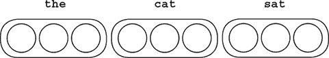
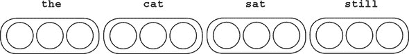
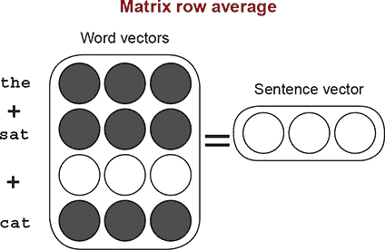
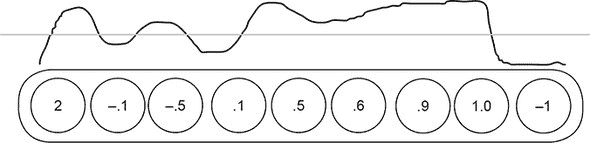
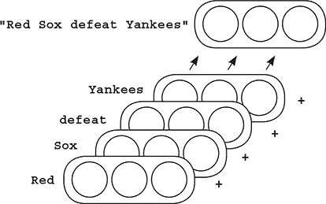
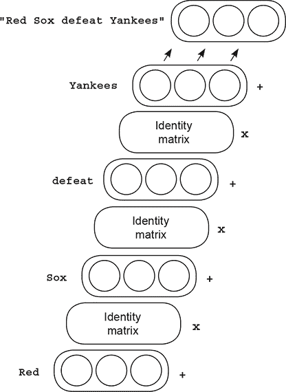
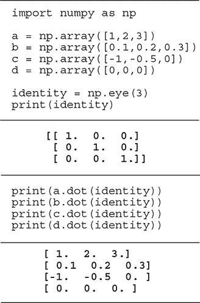
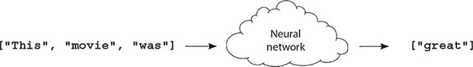
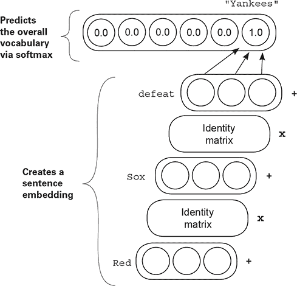

## 第十二章：像莎士比亚一样写作的神经网络：用于可变长度数据的循环层

**本章内容**

+   任意长度挑战

+   平均词向量的惊人力量

+   词袋向量局限性

+   使用单位向量求和词嵌入

+   学习过渡矩阵

+   学习创建有用的句子向量

+   Python 中的正向传播

+   具有任意长度的正向传播和反向传播

+   具有任意长度的权重更新

> “循环神经网络有一种神奇的力量。”
> 
> *安德烈·卡帕蒂，“循环神经网络的不合理有效性”，[`mng.bz/VPW`](http://mng.bz/VPW)*

### 任意长度挑战

#### 让我们用神经网络来模拟任意长度的数据序列！

本章和第十一章相互交织，我鼓励你在深入研究这一章之前，确保你已经掌握了第十一章中的概念和技术。第十一章中，你学习了关于自然语言处理（NLP）的内容。这包括如何修改损失函数来学习神经网络权重中的特定信息模式。你还培养了对词嵌入的理解，以及它如何与其他词嵌入表示相似度的细微差别。在本章中，我们将通过创建能够传达可变长度短语和句子意义的嵌入来扩展这种对嵌入传达单个词语意义的直觉。

让我们首先考虑这个挑战。如果你想要创建一个包含整个符号序列的向量，就像词嵌入存储关于一个词的信息一样，你会如何实现？我们将从最简单的方法开始。从理论上讲，如果你连接或堆叠词嵌入，你将得到一种类型的向量，它包含整个符号序列。



但这种方法仍有不足之处，因为不同的句子会有不同长度的向量。这使得比较两个向量变得困难，因为其中一个向量会突出出来。考虑以下第二句话：



理论上，这两个句子应该非常相似，比较它们的向量应该显示出高度的相似性。但是因为“the cat sat”是一个较短的向量，你必须选择“the cat sat still”向量中的哪一部分进行比较。如果你从左边对齐，向量看起来将完全相同（忽略“the cat sat still”实际上是一个不同的句子这一事实）。但是如果你从右边对齐，那么向量看起来将非常不同，尽管四分之三的单词是相同的，并且顺序相同。尽管这种朴素的方法显示出一些希望，但在以有用方式（可以与其他向量进行比较的方式）表示句子意义方面还远远不够理想。

### 比较真的重要吗？

#### 为什么你应该关心你是否可以比较两个句子向量？

比较两个向量的行为很有用，因为它可以近似地反映出神经网络所看到的内容。即使你不能直接读取两个向量，你也能判断它们是相似还是不同（使用第十一章中的函数 chapter 11）。如果生成句子向量的方法没有反映出你观察到的两个句子之间的相似性，那么网络在识别两个句子相似时也会遇到困难。它所需要处理的只有向量！

当我们继续迭代并评估计算句子向量的各种方法时，我想让你记住我们为什么要这样做。我们试图从神经网络的视角出发。我们问，“相关性总结是否会找到与这个句子向量类似的句子和期望标签之间的相关性，或者两个几乎相同的句子会产生截然不同的向量，使得句子向量和相应的标签之间的相关性非常小？”我们希望创建对预测句子中的事物有用的句子向量，这至少意味着相似的句子需要创建相似的向量。

之前创建句子向量的方法（连接）存在问题，因为它们对齐的方式相当任意，所以让我们探索下一个最简单的方法。如果你取句子中每个单词的向量并取平均值会怎样？嗯，一开始，你不必担心对齐问题，因为每个句子向量长度相同！



此外，“the cat sat”和“the cat sat still”这两个句子将会有相似的句子向量，因为进入它们的单词是相似的。更好的是，“a dog walked”可能和“the cat sat”相似，即使没有单词重叠，因为使用的单词也是相似的。

实际上，平均词嵌入是一种出奇有效的创建词嵌入的方法。它并不完美（正如你将看到的），但它很好地捕捉了你可能感知到的词语之间复杂关系的各个方面。在继续之前，我认为从第十一章中提取词嵌入并尝试平均策略将非常有益。

### 平均词向量的惊人力量

#### 它是神经预测中强大而常用的工具

在上一节中，我提出了创建表示一系列词语意义的向量的第二种方法。这种方法取句子中对应词语的向量的平均值，直观地，我们期望这些新的平均句子向量以几种期望的方式表现。

在本节中，让我们使用上一章生成的嵌入来玩句子向量。将第十一章中的代码提取出来，像之前一样在 IMDB 语料库上训练嵌入，然后让我们实验平均句子嵌入。

在右侧是之前比较词嵌入时执行的同一次归一化。但这次，让我们将所有词嵌入预先归一化到一个称为`normed_weights`的矩阵中。然后，创建一个名为`make_sent_vect`的函数，并使用它通过平均方法将每个评论（单词列表）转换为嵌入。这存储在矩阵`reviews2vectors`中。

```
import numpy as np
norms = np.sum(weights_0_1 * weights_0_1,axis=1)
norms.resize(norms.shape[0],1)
normed_weights = weights_0_1 * norms

def make_sent_vect(words):
  indices = list(map(lambda x:word2index[x],\
        filter(lambda x:x in word2index,words)))
  return np.mean(normed_weights[indices],axis=0)

reviews2vectors = list()
for review in tokens:                           *1*
  reviews2vectors.append(make_sent_vect(review))
reviews2vectors = np.array(reviews2vectors)

def most_similar_reviews(review):
  v = make_sent_vect(review)
  scores = Counter()
  for i,val in enumerate(reviews2vectors.dot(v)):
    scores[i] = val
  most_similar = list()

  for idx,score in scores.most_common(3):
    most_similar.append(raw_reviews[idx][0:40])
  return most_similar
most_similar_reviews(['boring','awful'])

     ['I am amazed at how boring this film',
      'This is truly one of the worst dep',
      'It just seemed to go on and on and.]
```

+   ***1* 分词评论**

在此之后，你将创建一个函数，通过在输入评论的向量与语料库中每个其他评论的向量之间执行点积，来查询给定输入评论的最相似评论。这种点积相似度指标与我们之前在第四章中简要讨论的相同，当时你正在学习使用多个输入进行预测。

可能令人惊讶的是，当你查询两个词“无聊”和“糟糕”之间的平均向量最相似的评论时，你收到了三个非常负面的评论。似乎在这些向量中存在有趣的统计信息，使得负面和正面的嵌入聚集在一起。

### 这些嵌入中信息是如何存储的？

#### 当你平均词嵌入时，平均形状保持不变

考虑这里发生的事情需要一点抽象思维。我建议你花一段时间消化这类信息，因为它可能与你习惯的教训不同。暂时，我想让你考虑一个词向量可以像这样被可视化为一条*波浪线*：



不要将向量视为数字列表，而要将其视为一条有高点和低点的线，这些高点低点对应于向量中不同位置的高值和低值。如果你从语料库中选择了几个词，它们可能看起来像这样：

考虑各种单词之间的相似性。注意，每个向量的对应形状是唯一的。但“糟糕”和“无聊”在形状上具有一定的相似性。“美丽”和“奇妙”也与它们的形状相似，但与其它单词不同。如果我们对这些小波浪线进行聚类，具有相似意义的单词会聚在一起。更重要的是，这些波浪线的一部分本身就有真正的意义。


例如，对于负面词汇，从左侧大约 40%的位置有一个向下然后向上的尖峰。如果我要继续绘制与单词对应的线条，这个尖峰将继续保持独特。那个尖峰并没有什么神奇之处意味着“负面”，如果我重新训练网络，它可能会出现在其他地方。这个尖峰仅表明负面，因为所有负面词汇都有这个特征！

因此，在训练过程中，这些形状被塑造成不同的曲线在不同位置传达意义（如第十一章所述）。当你对一个句子中的单词取平均曲线时，句子的最主导意义是真实的，而任何特定单词产生的噪声则被平均掉。

### 神经网络如何使用嵌入？

#### 神经网络检测与目标标签相关的曲线

你已经了解到一种将词嵌入视为具有独特性质（曲线）的波浪线的新方法。你还了解到，这些曲线是在训练过程中逐步发展以实现目标目标的。在某种意义上相似意义的单词通常会共享曲线上的一个独特弯曲：权重中的高低模式组合。在本节中，我们将考虑相关性总结过程如何将这些曲线作为输入进行处理。对于一层来说，将这些曲线作为输入意味着什么呢？

实际上，神经网络消费嵌入的方式就像它在本书早期章节中消费街灯数据集一样。它寻找隐藏层中各种凹凸和曲线与它试图预测的目标标签之间的相关性。这就是为什么具有特定相似方面的单词会共享相似的凹凸和曲线。在训练过程中某个时刻，神经网络开始发展不同单词形状之间的独特特征，以便将其区分开来，并将它们分组（给予它们相似的凹凸/曲线），以帮助做出准确的预测。但这又是总结第十一章末尾教训的另一种方式。我们希望进一步探讨。

在本章中，我们将探讨将这些嵌入求和成一个句子嵌入的含义。这种求和向量对哪些类型的分类会有用？我们已经确定，对句子中所有单词嵌入取平均会得到一个具有句子中所有单词特征平均值的向量。如果有很多积极词汇，最终的嵌入将看起来有些积极（其他单词的噪声通常相互抵消）。但请注意，这种方法有点模糊：给定足够多的单词，这些不同的波浪线都应该平均在一起，通常变成一条直线。

这引出了这种方法的第一大弱点：当试图将任意长度的信息序列（一个句子）存储到固定长度的向量中时，如果你试图存储太多，最终句子向量（作为众多单词向量的平均值）将平均成一个直线（接近 0 的向量）。

简而言之，这个过程存储句子信息的方式并不优雅。如果你试图将太多单词存储到单个向量中，最终你几乎什么都没有存储。话虽如此，一个句子通常不会有很多单词；如果一个句子有重复的模式，这些句子向量可能是有用的，因为句子向量将保留被求和的单词向量中最占主导地位的图案（例如，前一部分中的负峰值）。

### 词袋向量的局限性

#### 当你对单词嵌入取平均时，顺序变得无关紧要

平均嵌入的最大问题是它们没有顺序的概念。例如，考虑两个句子“Yankees defeat Red Sox”和“Red Sox defeat Yankees”。使用平均方法为这两个句子生成句子向量将得到相同的向量，但这两个句子传达的信息正好相反！此外，这种方法忽略了语法和句法，所以“Red Sox Yankees defeat Sox”也会得到相同的句子嵌入。

将单词嵌入求和或平均以形成短语或句子嵌入的方法在经典上被称为“词袋”方法，因为这与把一堆单词扔进一个袋子类似，顺序没有被保留。关键限制是你可以取任何句子，打乱所有单词的顺序，并生成一个句子向量，无论你如何打乱单词，向量都会相同（因为加法是结合的：*a* + *b* == *b* + *a*）。

本章的真正主题是以一种顺序**确实**重要的方式生成句子向量。我们希望创建的向量是，打乱它们的顺序会改变结果向量。更重要的是，**顺序重要性的方式**（也称为**顺序改变向量的方式**）应该**被学习**。这样，神经网络对顺序的表示就可以围绕尝试解决语言任务来构建，并且通过扩展，希望捕捉到语言中顺序的本质。我在这里使用语言作为例子，但你可以将这些陈述推广到任何序列。语言只是一个特别具有挑战性但普遍为人所知的领域。

生成序列（如句子）向量的最著名和最成功的方法之一是**循环神经网络**（RNN）。为了向您展示它是如何工作的，我们将首先提出一种新的、看似浪费的方法来使用所谓的**单位矩阵**进行平均词嵌入。单位矩阵只是一个任意大的正方形矩阵（行数等于列数），其中 0 填充，从左上角到右下角有 1。

这三个矩阵都是单位矩阵，它们有一个目的：与**任何**向量进行向量-矩阵乘法都会返回原始向量。如果我将向量 `[3,5]` 乘以顶部的单位矩阵，结果将是 `[3,5]`。

```
  [1,0]
  [0,1]

 [1,0,0]
 [0,1,0]
 [0,0,1]

[1,0,0,0]
[0,1,0,0]
[0,0,1,0]
[0,0,0,1]
```

### 使用单位向量求和词嵌入

#### 让我们使用不同的方法实现相同的逻辑

你可能会认为单位矩阵没有用。一个将向量输入并输出相同向量的矩阵有什么用？在这种情况下，我们将将其用作教学工具，展示如何设置一种更复杂的方法来求和词嵌入，以便神经网络在生成最终的句子嵌入时可以考虑到顺序。让我们探索另一种求和嵌入的方法。



这是将多个词嵌入相加形成句子嵌入（除以单词数量得到平均句子嵌入）的标准技术。右侧的示例在每次求和之间增加了一步：通过单位矩阵进行向量-矩阵乘法。

“红色”的向量乘以单位矩阵，然后将输出与“索克斯”的向量相加，接着将“索克斯”的向量通过单位矩阵进行向量-矩阵乘法并加到“击败”的向量上，以此类推，直到整个句子。注意，因为通过单位矩阵进行向量-矩阵乘法返回的是相同的向量，所以右侧的过程与左上角的过程产生**完全相同的句子嵌入**。



是的，这确实是浪费计算，但这种情况即将改变。这里要考虑的主要问题是，如果使用的矩阵不是单位矩阵，那么改变单词的顺序将改变生成的嵌入。让我们用 Python 来看看这个例子。

### 完全不改变任何东西的矩阵

#### 让我们用 Python 使用单位矩阵创建句子嵌入

在本节中，我们将演示如何在 Python 中玩转单位矩阵，并最终实现上一节中提到的新句子向量技术（证明它产生相同的句子嵌入）。

在右侧，我们首先初始化长度为 3 的四个向量（`a`、`b`、`c`和`d`），以及一个三行三列的单位矩阵（单位矩阵总是方阵）。请注意，单位矩阵具有从左上角到右下角的对角线上的 1（顺便说一下，这在线性代数中被称为**对角线**）。任何对角线上有 1 而其他地方都是 0 的方阵都是单位矩阵。



我们然后继续对每个向量与单位矩阵进行向量矩阵乘法（使用 NumPy 的点函数）。如您所见，此过程的输出是一个与输入向量相同的新向量。

由于单位矩阵与向量的矩阵乘法返回相同的向量，将此过程纳入句子嵌入应该看起来很简单，确实如此：

```
this = np.array([2,4,6])
movie = np.array([10,10,10])
rocks = np.array([1,1,1])

print(this + movie + rocks)
print((this.dot(identity) + movie).dot(identity) + rocks)
```

```
[13 15 17]
[ 13\.  15\.  17.]
```

两种创建句子嵌入的方法都会生成相同的向量。这仅仅是因为单位矩阵是一种非常特殊的矩阵。但如果我们不使用单位矩阵会怎样呢？如果我们使用不同的矩阵会怎样呢？实际上，单位矩阵是**唯一**保证返回与它进行向量矩阵乘法相同的向量的矩阵。没有其他矩阵有这样的保证。

### 学习转换矩阵

#### 如果允许单位矩阵改变以最小化损失会怎样？

在我们开始之前，让我们记住目标：生成根据句子意义聚类的句子嵌入，这样给定一个句子，我们可以使用向量找到具有相似意义的句子。更具体地说，这些句子嵌入应该关注单词的顺序。

之前，我们尝试过将词嵌入相加。但这意味着“红袜队击败洋基队”与句子“洋基队击败红袜队”具有相同的向量，尽管这两个句子具有相反的意义。相反，我们希望形成句子嵌入，使得这两个句子生成**不同**的嵌入（但仍以有意义的方式进行聚类）。理论上是这样的，如果我们使用单位矩阵创建句子嵌入的方式，但使用任何除单位矩阵之外的矩阵，句子嵌入将根据顺序的不同而不同。

现在显然的问题是：用哪个矩阵代替单位矩阵。有无限多的选择。但在深度学习中，这类问题的标准答案是，“你将像学习神经网络中的任何其他矩阵一样学习这个矩阵！”好吧，所以你将只学习这个矩阵。怎么学？

每当你想要训练一个神经网络学习某样东西时，你总是需要给它一个学习任务。在这种情况下，这个任务应该要求它通过学习有用的词向量和有用的单位矩阵修改来生成有趣的句子嵌入。你应该使用什么任务？


当你想要生成有用的词嵌入（填空）时，目标相似。让我们尝试完成一个非常类似的任务：训练一个神经网络，使其能够接受一系列单词并尝试预测下一个单词。



### 学习创建有用的句子向量

#### 创建句子向量，进行预测，并通过其部分修改句子向量

在这个下一个实验中，我不想让你像以前那样思考网络。相反，考虑创建一个句子嵌入，使用它来预测下一个单词，然后修改形成句子嵌入的相关部分，以使这个预测更准确。因为你正在预测下一个单词，所以句子嵌入将由你迄今为止看到的句子部分组成。神经网络将类似于图中的样子。

它由两个步骤组成：创建句子嵌入，然后使用该嵌入来预测下一个单词。这个网络的输入是文本“Red Sox defeat”，要预测的单词是“Yankees”。



我在词向量之间的框中写下了**单位矩阵**。这个矩阵最初将只是一个单位矩阵。在训练过程中，你将反向传播梯度到这些矩阵中，并更新它们以帮助网络做出更好的预测（就像网络中其余的权重一样）。

这样，网络将学会如何整合比词嵌入总和更多的信息。通过允许（最初是单位矩阵的）矩阵发生变化（并成为**不是**单位矩阵），你让神经网络学会如何创建嵌入，其中单词呈现的顺序会改变句子嵌入。但这种变化不是任意的。网络将学会以对预测下一个单词的任务**有用**的方式整合单词的顺序。

你还将**转换矩阵**（最初是单位矩阵的矩阵）约束为都是同一个矩阵。换句话说，从“Red”到“Sox”的矩阵将被重新用于从“Sox”到“defeat”的转换。网络在一个转换中学到的任何逻辑都将被用于下一个转换，并且只有对每个预测步骤有用的逻辑才允许在网络中学习。

### Python 中的正向传播

#### 让我们看看如何执行简单的正向传播

现在你已经对想要构建的概念有了概念上的理解，让我们来看看 Python 中的玩具版本。首先，让我们设置权重（我使用了一个包含九个单词的有限词汇量）：

```
import numpy as np

def softmax(x_):
    x = np.atleast_2d(x_)
    temp = np.exp(x)
    return temp / np.sum(temp, axis=1, keepdims=True)

word_vects = {}
word_vects['yankees'] = np.array([[0.,0.,0.]])   *1*
word_vects['bears'] = np.array([[0.,0.,0.]])     *1*
word_vects['braves'] = np.array([[0.,0.,0.]])    *1*
word_vects['red'] = np.array([[0.,0.,0.]])       *1*
word_vects['sox'] = np.array([[0.,0.,0.]])       *1*
word_vects['lose'] = np.array([[0.,0.,0.]])      *1*
word_vects['defeat'] = np.array([[0.,0.,0.]])    *1*
word_vects['beat'] = np.array([[0.,0.,0.]])      *1*
word_vects['tie'] = np.array([[0.,0.,0.]])       *1*

sent2output = np.random.rand(3,len(word_vects))  *2*

identity = np.eye(3)                             *3*
```

+   ***1* 词嵌入**

+   ***2* 句子嵌入以输出分类权重**

+   ***3* 转换权重**

这段代码创建了三组权重。它创建了一个包含词嵌入、单位矩阵（转换矩阵）和分类层的 Python 字典。这个分类层`sent2output`是一个权重矩阵，用于根据长度为 3 的句子向量预测下一个单词。有了这些工具，正向传播变得非常简单。这是如何使用句子“red sox defeat” -> “yankees”进行正向传播的：

```
layer_0 = word_vects['red']                             *1*
layer_1 = layer_0.dot(identity) + word_vects['sox']     *1*
layer_2 = layer_1.dot(identity) + word_vects['defeat']  *1*

pred = softmax(layer_2.dot(sent2output))                *2*
print(pred)                                             *2*
```

+   ***1* 创建句子嵌入**

+   ***2* 在整个词汇表上预测**

```
[[ 0.11111111  0.11111111  0.11111111  0.11111111  0.11111111  0.11111111
   0.11111111  0.11111111  0.11111111]]
```

### 你如何进行反向传播？

#### 这可能看起来有点复杂，但它们是你已经学过的相同步骤

你刚刚看到了如何进行这个网络的正向预测。一开始，可能不清楚如何进行反向传播。但它很简单。也许你会看到：

```
layer_0 = word_vects['red']                             *1*
layer_1 = layer_0.dot(identity) + word_vects['sox']     *2*
layer_2 = layer_1.dot(identity) + word_vects['defeat']

pred = softmax(layer_2.dot(sent2output))                *3*
print(pred)                                             *3*
```

+   ***1* 正常神经网络 (第一章–第五章)**

+   ***2* 一些奇怪的附加部分**

+   ***3* 再次是正常神经网络 (第九章的内容)**

根据前面的章节，你应该对计算损失和反向传播直到得到`layer_2`的梯度，即`layer_2_delta`感到舒适。在这个时候，你可能想知道，“我应该向哪个方向反向传播？”梯度可以通过通过`identity`矩阵乘法向后传播回到`layer_1`，或者它们可以进入`word_vects['defeat']`。

当你在正向传播过程中将两个向量相加时，你将相同的梯度反向传播到加法运算的**两边**。当你生成`layer_2_delta`时，你将反向传播两次：一次通过单位矩阵创建`layer_1_delta`，然后再次传播到`word_vects['defeat']`：

```
y = np.array([1,0,0,0,0,0,0,0,0])                   *1*

pred_delta = pred - y
layer_2_delta = pred_delta.dot(sent2output.T)
defeat_delta = layer_2_delta * 1                    *2*
layer_1_delta = layer_2_delta.dot(identity.T)
sox_delta = layer_1_delta * 1                       *3*
layer_0_delta = layer_1_delta.dot(identity.T)
alpha = 0.01
word_vects['red'] -= layer_0_delta * alpha
word_vects['sox'] -= sox_delta * alpha
word_vects['defeat'] -= defeat_delta * alpha
identity -= np.outer(layer_0,layer_1_delta) * alpha
identity -= np.outer(layer_1,layer_2_delta) * alpha
sent2output -= np.outer(layer_2,pred_delta) * alpha
```

+   ***1* 针对的是“yankees”的单热向量**

+   ***2* 可以忽略第十一章中的“1”**

+   ***3* 再次，可以忽略“1”**

### 让我们开始训练它！

#### 你已经拥有了所有工具；让我们在玩具语料库上训练网络

为了让你对正在发生的事情有一个直观的了解，让我们首先在一个称为 Babi 数据集的玩具任务上训练新的网络。这个数据集是一个合成的问答语料库，用于教机器如何回答关于环境的简单问题。你现在还没有用它来进行问答（还没有），但任务的简单性将帮助你更好地看到学习单位矩阵带来的影响。首先，下载 Babi 数据集。以下是 bash 命令：

```
wget http://www.thespermwhale.com/jaseweston/babi/tasks_1-20_v1-1.tar.gz
tar -xvf tasks_1-20_v1-1.tar.gz
```

使用一些简单的 Python，你可以打开并清理一个小数据集来训练网络：

```
import sys,random,math
from collections import Counter
import numpy as np

f = open('tasksv11/en/qa1_single-supporting-fact_train.txt','r')
raw = f.readlines()
f.close()

tokens = list()
for line in raw[0:1000]:
    tokens.append(line.lower().replace("\n","").split(" ")[1:])

print(tokens[0:3])

[['Mary', 'moved', 'to', 'the', 'bathroom'],
 ['John', 'went', 'to', 'the', 'hallway'],
 ['Where', 'is', 'Mary', 'bathroom'],
```

如你所见，这个数据集包含各种简单的陈述和问题（已移除标点符号）。每个问题后面都跟着正确的答案。在问答（QA）的上下文中，神经网络按顺序读取陈述并基于最近读取的陈述中的信息回答问题（要么正确要么错误）。

目前，你将训练网络尝试在给定一个或多个起始单词的情况下完成每个句子。在这个过程中，你会看到允许循环矩阵（之前是单位矩阵）学习的重要性。

### 设置环境

#### 在你能够创建矩阵之前，你需要了解你有多少个参数

与词嵌入神经网络一样，你首先需要创建一些有用的计数、列表和实用函数，以便在预测、比较、学习过程中使用。这些实用函数和对象在此处显示，应该看起来很熟悉：

```
vocab = set()                     def words2indices(sentence):
for sent in tokens:                   idx = list()
    for word in sent:                 for word in sentence:
        vocab.add(word)                   idx.append(word2index[word])
                                      return idx
vocab = list(vocab)

word2index = {}                   def softmax(x):
for i,word in enumerate(vocab):       e_x = np.exp(x - np.max(x))
    word2index[word]=i                return e_x / e_x.sum(axis=0)
```

在左侧，你创建了一个简单的词汇表单词列表以及一个查找字典，允许你在单词的文本和其索引之间来回转换。你将使用词汇表列表中的索引来选择嵌入和预测矩阵的哪一行和哪一列对应于哪个单词。在右侧是一个将单词列表转换为索引列表的实用函数，以及用于`softmax`的函数，你将使用它来预测下一个单词。

以下代码初始化了随机种子（以获得一致的结果），然后将嵌入大小设置为 10。你创建了一个词嵌入矩阵、循环嵌入矩阵以及一个初始的`start`嵌入。这是表示空短语的嵌入，这对于网络模拟句子倾向于如何开始至关重要。最后，还有一个`decoder`权重矩阵（就像嵌入一样）和一个`one_hot`实用矩阵：

```
np.random.seed(1)
embed_size = 10

embed = (np.random.rand(len(vocab),embed_size) - 0.5) * 0.1    *1*

recurrent = np.eye(embed_size)                                 *2*

start = np.zeros(embed_size)                                   *3*

decoder = (np.random.rand(embed_size, len(vocab)) - 0.5) * 0.1 *4*

one_hot = np.eye(len(vocab))                                   *5*
```

+   ***1* Word embeddings**

+   ***2* Embedding -> embedding (initially the identity matrix)**

+   ***3* Sentence embedding for an empty sentence**

+   ***4* Embedding -> output weights**

+   ***5* One-hot lookups (for the loss function)**

### 前向传播任意长度

#### 你将使用前面描述的相同逻辑进行前向传播

以下代码包含前向传播和预测下一个单词的逻辑。请注意，尽管构建可能感觉不熟悉，但它遵循与之前相同的程序，在求和嵌入的同时使用单位矩阵。在这里，单位矩阵被替换为一个名为`recurrent`的矩阵，它被初始化为全 0（并且将通过训练来学习）。

此外，你不仅预测最后一个单词，而且在每个时间步长都基于前一个单词生成的嵌入进行预测（`layer['pred']`）。这比每次想要预测新词时都从短语的开头进行新的前向传播更有效。

```
def predict(sent):

    layers = list()
    layer = {}
    layer['hidden'] = start
    layers.append(layer)

    loss = 0

    preds = list()                                                   *1*
    for target_i in range(len(sent)):

        layer = {}

        layer['pred'] = softmax(layers[-1]['hidden'].dot(decoder))   *2*

        loss += -np.log(layer['pred'][sent[target_i]])

        layer['hidden'] = layers[-1]['hidden'].dot(recurrent) +\     *3*
                                              embed[sent[target_i]]
        layers.append(layer)
    return layers, loss
```

+   ***1* Forward propagates**

+   ***2* Tries to predict the next term**

+   ***3* Generates the next hidden state**

与你过去学到的内容相比，这段代码并没有什么特别之处，但有一个特定的部分我想确保你在我们继续前进之前熟悉。名为 `layers` 的列表是一种新的正向传播方式。

注意，如果 `sent` 的长度较大，你最终会进行更多的正向传播。因此，你不能再像以前那样使用静态层变量。这次，你需要根据所需数量不断向列表中添加新层。确保你对这个列表的每一部分都感到舒适，因为如果在正向传播过程中你不熟悉它，那么在反向传播和权重更新步骤中了解情况将会非常困难。

### 随机长度反向传播

#### 你将使用前面描述的相同逻辑进行反向传播

正如“红袜队击败洋基队”示例中所述，让我们实现任意长度序列的反向传播，假设你有权访问上一节中函数返回的前向传播对象。最重要的对象是 `layers` 列表，它包含两个向量（`layer['state']` 和 `layer['previous->hidden']`）。

为了进行反向传播，你需要将输出梯度添加到每个列表中一个新的对象，称为 `layer['state_delta']`，它将代表该层的梯度。这对应于“红袜队击败洋基队”示例中的 `sox_delta`、`layer_0_delta` 和 `defeat_delta` 等变量。你正在以这种方式构建相同的逻辑，使其能够消费正向传播逻辑中的变长序列。

```
for iter in range(30000):                                                  *1*
    alpha = 0.001
    sent = words2indices(tokens[iter%len(tokens)][1:])
    layers,loss = predict(sent)

      for layer_idx in reversed(range(len(layers))):                       *2*
          layer = layers[layer_idx]
          target = sent[layer_idx-1]
             if(layer_idx > 0):                                            *3*
                 layer['output_delta'] = layer['pred'] - one_hot[target]
                 new_hidden_delta = layer['output_delta']\
                                                 .dot(decoder.transpose())

                 if(layer_idx == len(layers)-1):                           *4*
                     layer['hidden_delta'] = new_hidden_delta
                 else:
                     layer['hidden_delta'] = new_hidden_delta + \
                     layers[layer_idx+1]['hidden_delta']\
                                             .dot(recurrent.transpose())
             else: # if the first layer
                 layer['hidden_delta'] = layers[layer_idx+1]['hidden_delta']\
                                                 .dot(recurrent.transpose())
```

+   ***1* 正向**

+   ***2* 反向传播**

+   ***3* 如果不是第一层**

+   ***4* 如果是最后一层，不要从后面拉取，因为它不存在**

在进入下一节之前，确保你能阅读这段代码并向朋友（或者至少是自己）解释它。这段代码中没有新的概念，但它的构建可能一开始会让你觉得有些陌生。花点时间将这段代码中写的内容与“红袜队击败洋基队”示例中的每一行联系起来，你应该为下一节和更新使用反向传播得到的梯度权重做好准备。

### 随机长度权重更新

#### 你将使用前面描述的相同逻辑来更新权重

与正向和反向传播逻辑一样，这个权重更新逻辑并不新颖。但我在解释了它之后才提出它，这样你可以专注于工程复杂性，希望你已经（可能）已经理解了理论复杂性。

```
for iter in range(30000):                                              *1*
    alpha = 0.001
    sent = words2indices(tokens[iter%len(tokens)][1:])

    layers,loss = predict(sent)

    for layer_idx in reversed(range(len(layers))):                     *2*
        layer = layers[layer_idx]
        target = sent[layer_idx-1]

        if(layer_idx > 0):
            layer['output_delta'] = layer['pred'] - one_hot[target]
            new_hidden_delta = layer['output_delta']\
                                            .dot(decoder.transpose())

            if(layer_idx == len(layers)-1):                            *3*
                layer['hidden_delta'] = new_hidden_delta
            else:
                layer['hidden_delta'] = new_hidden_delta + \
                layers[layer_idx+1]['hidden_delta']\
                                        .dot(recurrent.transpose())
        else:
            layer['hidden_delta'] = layers[layer_idx+1]['hidden_delta']\
                                            .dot(recurrent.transpose())

    start -= layers[0]['hidden_delta'] * alpha / float(len(sent))      *4*
    for layer_idx,layer in enumerate(layers[1:]):

        decoder -= np.outer(layers[layer_idx]['hidden'],\
                        layer['output_delta']) * alpha / float(len(sent))

        embed_idx = sent[layer_idx]
        embed[embed_idx] -= layers[layer_idx]['hidden_delta'] * \
                                                       alpha / float(len(sent))
        recurrent -= np.outer(layers[layer_idx]['hidden'],\
                        layer['hidden_delta']) * alpha / float(len(sent))

    if(iter % 1000 == 0):
        print("Perplexity:" + str(np.exp(loss/len(sent))))
```

+   ***1* 正向**

+   ***2* 反向传播**

+   ***3* 如果是最后一层，不要从后面拉取，因为它不存在**

+   ***4* 更新权重**

### 执行和输出分析

#### 你将使用前面描述的相同逻辑来更新权重

现在是真相大白的时候：当你运行它时会发生什么？嗯，当我运行这段代码时，我得到了一个被称为 *困惑度* 的指标的相对稳定的下降趋势。技术上讲，困惑度是通过一个对数函数传递的正确标签（单词）的概率，取反，然后指数化（*e*^*x*）。

但从理论上讲，它代表了两个概率分布之间的差异。在这种情况下，完美的概率分布将是 100%的概率分配给正确的术语，而其他地方都是 0%。

当两个概率分布不匹配时，困惑度会很高，而当它们匹配时，困惑度会很低（接近 1）。因此，像所有与随机梯度下降一起使用的损失函数一样，困惑度的下降是一个好现象！这意味着网络正在学习预测与数据匹配的概率。

```
                        Perplexity:82.09227500075585
                        Perplexity:81.87615610433569
                        Perplexity:81.53705034457951
                                    ....
                        Perplexity:4.132556753967558
                        Perplexity:4.071667181580819
                        Perplexity:4.0167814473718435
```

但这几乎不能告诉你权重中发生了什么。困惑度多年来一直受到一些批评（尤其是在语言建模社区中），因为它被过度用作一个指标。让我们更仔细地看看预测：

```
sent_index = 4

l,_ = predict(words2indices(tokens[sent_index]))

print(tokens[sent_index])

for i,each_layer in enumerate(l[1:-1]):
    input = tokens[sent_index][i]
    true = tokens[sent_index][i+1]
    pred = vocab[each_layer['pred'].argmax()]
    print("Prev Input:" + input + (' ' * (12 - len(input))) +\
          "True:" + true + (" " * (15 - len(true))) + "Pred:" + pred)
```

这段代码接受一个句子，并预测模型认为最可能的单词。这很有用，因为它可以让你对模型所具有的特征有一个感觉。它做对了哪些事情？它犯了哪些错误？你将在下一节中看到。

#### 查看预测可以帮助你了解正在发生的事情

你可以查看神经网络在训练过程中学习时的输出预测，这不仅可以帮助你了解它所选择的模式类型，还可以了解它学习这些模式的顺序。经过 100 个训练步骤后，输出看起来是这样的：

```
['sandra', 'moved', 'to', 'the', 'garden.']
Prev Input:sandra      True:moved          Pred:is
Prev Input:moved       True:to             Pred:kitchen
Prev Input:to          True:the            Pred:bedroom
Prev Input:the         True:garden.        Pred:office
```

神经网络往往是从随机开始的。在这种情况下，神经网络可能只偏向于它在第一次随机状态中开始的任何单词。让我们继续训练：

```
['sandra', 'moved', 'to', 'the', 'garden.']
Prev Input:sandra      True:moved          Pred:the
Prev Input:moved       True:to             Pred:the
Prev Input:to          True:the            Pred:the
Prev Input:the         True:garden.        Pred:the
```

经过 10,000 个训练步骤后，神经网络挑选出最常见的单词（“the”）并在每个时间步预测它。这是循环神经网络中一个非常常见的错误。在高度倾斜的数据集中学习更精细的细节需要大量的训练。

```
['sandra', 'moved', 'to', 'the', 'garden.']
Prev Input:sandra      True:moved          Pred:is
Prev Input:moved       True:to             Pred:to
Prev Input:to          True:the            Pred:the
Prev Input:the         True:garden.        Pred:bedroom.
```

这些错误真的很有趣。在只看到单词“sandra”之后，网络预测了“is”，虽然并不完全等同于“moved”，但也不是一个糟糕的猜测。它选择了错误的动词。接下来，注意“to”和“the”这两个词是正确的，这并不令人惊讶，因为这些是数据集中的一些更常见的单词，并且据推测，网络已经被训练了许多次来预测在动词“moved”之后的短语“to the”。最后的错误也很引人注目，将“bedroom”误认为是单词“garden”。

重要的是要注意，几乎没有任何方法可以让这个神经网络完美地学习这个任务。毕竟，如果我只给你单词“sandra moved to the”，你能告诉我正确的下一个单词吗？需要更多的上下文来解决这个任务，但在我看来，这个任务无法解决，这实际上为分析它失败的方式提供了教育意义。

### 摘要

#### 循环神经网络预测任意长度的序列

在本章中，你学习了如何为任意长度的序列创建向量表示。最后一个练习训练了一个线性循环神经网络，根据之前的一串术语预测下一个术语。为此，它需要学习如何创建能够将可变长度的术语字符串准确表示为固定大小向量的嵌入。

这最后一句话应该引发一个问题：神经网络如何将可变数量的信息拟合到固定大小的盒子中？事实是，句子向量并没有编码句子中的所有内容。循环神经网络的游戏规则不仅仅是这些向量记得什么，还包括它们忘记了什么。在预测下一个单词的情况下，大多数 RNN 学习到只有最后几个单词真正必要，^([*])并且它们学会了忘记（即在它们的向量中不形成独特模式）历史中更早的单词。

> ^*
> 
> 例如，参见 Michał Daniluk 等人撰写的“Frustratingly Short Attention Spans in Neural Language Modeling”（在 2017 年 ICLR 会议上发表的论文），[`arxiv.org/abs/1702.04521`](https://arxiv.org/abs/1702.04521)。

但请注意，这些表示的生成过程中没有非线性。你认为这会带来什么样的局限性？在下一章中，我们将使用非线性性和门来形成一个称为**长短期记忆网络**（LSTM）的神经网络，来探讨这个问题以及其他问题。但首先，确保你能坐下来（从记忆中）编写一个能够收敛的工作线性 RNN。这些网络的动力和控制流可能有点令人畏惧，复杂性即将大幅增加。在继续之前，熟悉一下本章所学的内容。

就这样，让我们深入探讨 LSTMs！
