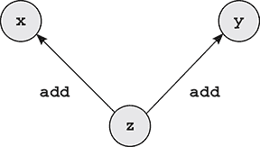
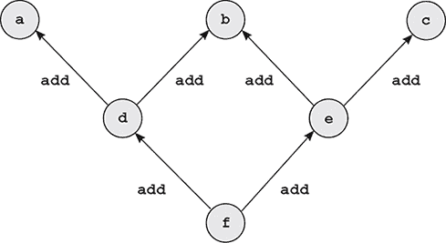
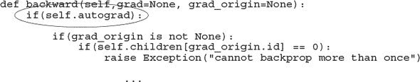
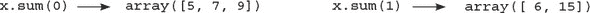
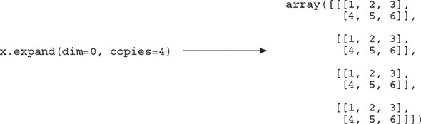
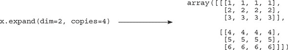
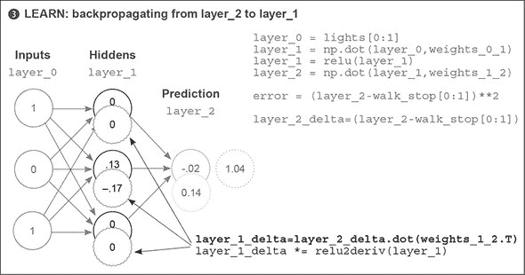
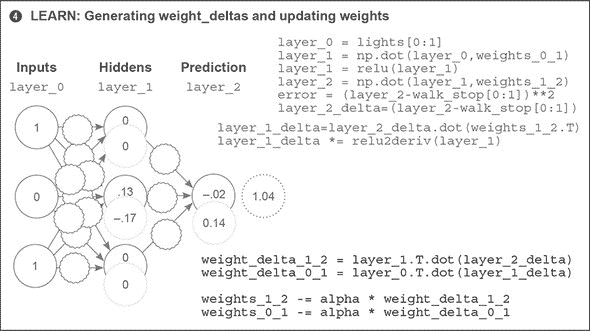
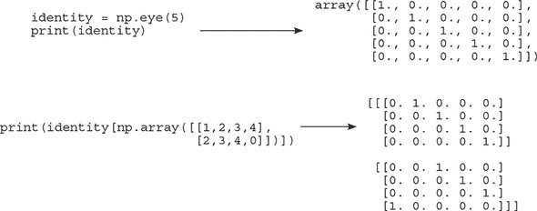
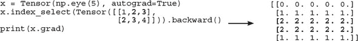

## 第十三章：介绍自动优化：让我们构建一个深度学习框架

**本章**

+   什么是深度学习框架？

+   张量简介

+   自动求导简介

+   加法反向传播是如何工作的？

+   如何学习一个框架

+   非线性层

+   嵌入层

+   交叉熵层

+   循环层

> “无论我们基于碳还是硅，在本质上都没有区别；我们都应该得到适当的尊重。”
> 
> *亚瑟·C·克拉克，2010 年：《2001 太空漫游》（1982 年）*

### 什么是深度学习框架？

#### 好的工具可以减少错误，加快开发速度，并提高运行时性能

如果你长期关注深度学习，你可能已经遇到了一些主要的框架，例如 PyTorch、TensorFlow、Theano（最近已弃用）、Keras、Lasagne 或 DyNet。在过去几年中，框架的发展非常迅速，尽管所有框架都是免费的开源软件，但每个框架周围都有一股竞争和团结的气氛。

到目前为止，我一直在避免讨论框架的话题，因为首先，了解这些框架底层的工作原理对于你来说极其重要，这可以通过自己实现算法（从 NumPy 的零开始）来实现。但现在我们将过渡到使用框架，因为接下来你将要训练的网络——长短期记忆网络（LSTMs）——非常复杂，描述它们实现的 NumPy 代码难以阅读、使用或调试（梯度无处不在）。

深度学习框架的创建正是为了减轻这种代码复杂性。特别是如果你希望在 GPU 上训练神经网络（提供 10-100 倍的训练速度），深度学习框架可以显著减少代码复杂性（减少错误并提高开发速度），同时提高运行时性能。出于这些原因，它们在研究社区中几乎被普遍使用，对深度学习框架的深入了解将成为你成为深度学习用户或研究人员的旅程中必不可少的。

但我们不会跳入你听说过的任何深度学习框架，因为这会阻碍你了解复杂模型（如 LSTMs）底层的工作原理。相反，你将根据框架发展的最新趋势构建一个轻量级的深度学习框架。这样，你将毫无疑问地了解框架在用于复杂架构时的作用。此外，自己构建一个小框架应该会为使用实际的深度学习框架提供一个平稳的过渡，因为你已经熟悉了 API 及其底层的功能。我发现这项练习很有益，我在构建自己的框架中学到的教训在尝试调试麻烦的模型时特别有用。

框架是如何简化你的代码的？抽象地说，它消除了多次重复编写代码的需要。具体来说，深度学习框架最有益的部分是其对自动反向传播和自动优化的支持。这些功能让你只需指定模型的正向传播代码，框架会自动处理反向传播和权重更新。大多数框架甚至通过提供高级接口来简化常见的层和损失函数，使正向传播代码更容易编写。

### 张量简介

#### 张量是向量和矩阵的抽象形式

到目前为止，我们一直在使用向量和矩阵作为深度学习的基本数据结构。回想一下，矩阵是一系列向量的列表，而向量是一系列标量（单个数字）的列表。张量是这种嵌套数字列表形式的抽象版本。向量是一维张量。矩阵是二维张量，更高维度的称为*n*维张量。因此，一个新的深度学习框架的开始是构建这种基本类型，我们将称之为`Tensor`：

```
import numpy as np

class Tensor (object):

     def __init__(self, data):
         self.data = np.array(data)

     def __add__(self, other):
         return Tensor(self.data + other.data)

     def __repr__(self):
         return str(self.data.__repr__())

     def __str__(self):
         return str(self.data.__str__())

x = Tensor([1,2,3,4,5])
print(x)

    [1 2 3 4 5]

y = x + x
print(y)

    [ 2   4   6   8 10]
```

这是这种基本数据结构的第一个版本。请注意，它将所有数值信息存储在 NumPy 数组（`self.data`）中，并且支持一个张量操作（加法）。添加更多操作相对简单：在张量类上创建更多具有适当功能的功能。

### 自动梯度计算（autograd）简介

#### 以前，你手动执行了反向传播。让我们让它自动化吧！

在第四章中，你学习了关于导数的内容。从那时起，你一直在为每个训练的神经网络手动计算导数。回想一下，这是通过在神经网络中向后移动来完成的：首先计算网络的输出处的梯度，然后使用该结果来计算下一个组件的导数，依此类推，直到架构中的所有权重都有正确的梯度。这种计算梯度的逻辑也可以添加到张量对象中。让我向你展示我的意思。新的代码以**粗体**显示：

```
import numpy as np

class Tensor (object):

     def __init__(self, data, creators=None, creation_op=None):
         self.data = np.array(data)
         self.creation_op = creation_op
         self.creators = creators
         self.grad = None

     def backward(self, grad):
         self.grad = grad

         if(self.creation_op == "add"):
             self.creators[0].backward(grad)
             self.creators[1].backward(grad)

     def __add__(self, other):
         return Tensor(self.data + other.data,
                       creators=[self,other],
                       creation_op="add")

     def __repr__(self):
         return str(self.data.__repr__())

     def __str__(self):
         return str(self.data.__str__())

x = Tensor([1,2,3,4,5])
y = Tensor([2,2,2,2,2])

z = x + y
z.backward(Tensor(np.array([1,1,1,1,1])))
```

此方法引入了两个新概念。首先，每个张量都获得两个新属性。`creators`是一个列表，包含用于创建当前张量的任何张量（默认为`None`）。因此，当两个张量`x`和`y`相加时，`z`有两个`creators`，即`x`和`y`。`creation_op`是一个相关功能，它存储创建过程中使用的`creators`指令。因此，执行`z` = `x` + `y`创建了一个包含三个节点（`x`、`y`和`z`）和两个边（`z` -> `x`和`z` -> `y`）的计算图。每个边都标记为`creation_op add`。此图允许你递归地反向传播梯度。



在这个实现中引入的第一个新概念是，每当进行数学运算时，自动创建这个图。如果你对`z`进行了进一步的操作，图将继续与指向`z`的任何结果新变量相关联。

在`Tensor`的这个版本中引入的第二个新概念是使用这个图来计算梯度。当你调用`z.backward()`时，它会根据应用于创建`z`（`add`）的函数，发送`x`和`y`的正确梯度。查看图，你将一个梯度向量（`np.array([1,1,1,1,1])`）放在`z`上，然后它们被应用到它们的父节点上。正如你在第四章中学到的，通过加法进行反向传播意味着在反向传播时也要应用加法。在这种情况下，因为只有一个梯度要加到`x`或`y`上，所以你将`z`上的梯度复制到`x`和`y`上：

```
print(x.grad)
print(y.grad)
print(z.creators)
print(z.creation_op)

[1 1 1 1 1]
[1 1 1 1 1]
[array([1, 2, 3, 4, 5]), array([2, 2, 2, 2, 2])]
add
```

这种形式的 autograd 最优雅的部分可能是它还可以递归地工作，因为每个向量都会在其所有`self.creators`上调用`.backward()`：

|

```
a = Tensor([1,2,3,4,5])
b = Tensor([2,2,2,2,2])
c = Tensor([5,4,3,2,1])
d = Tensor([-1,-2,-3,-4,-5])
e = a + b
f = c + d
g = e + f
g.backward(Tensor(np.array([1,1,1,1,1])))
print(a.grad)
```

| **输出**

```
[1 1 1 1 1]
```

|

### 一个快速的检查点

#### Tensor 中的所有内容都是已经学到的知识的另一种形式

在继续之前，我想首先承认，即使考虑梯度在图形结构上流动可能感觉有点牵强或费劲，但与你已经使用过的内容相比，这并不是什么新鲜事。在关于 RNN 的上一章中，你在一个方向上进行了正向传播，然后在（虚拟图）激活上进行了反向传播。

你并没有在图形数据结构中明确编码节点和边。相反，你有一个层的列表（字典），并手动编码了正向和反向传播操作的正确顺序。现在你正在构建一个很好的接口，这样你就不需要写那么多代码了。这个接口让你可以递归地进行反向传播，而无需手动编写复杂的反向传播代码。

本章主要涉及一些理论性的内容。它主要讲述的是学习深度神经网络时常用的工程实践。特别是，在正向传播过程中构建的这种图结构被称为**动态计算图**，因为它是在正向传播过程中即时构建的。这种类型的 autograd 存在于较新的深度学习框架中，如 DyNet 和 PyTorch。而像 Theano 和 TensorFlow 这样的旧框架则有一个所谓的**静态计算图**，它是在正向传播开始之前就定义好的。

通常，动态计算图更容易编写/实验，而静态计算图由于底层的一些复杂逻辑，运行速度更快。但请注意，动态和静态框架最近正朝着中间发展，允许动态图编译为静态图（以获得更快的运行时间）或允许静态图动态构建（以获得更易实验）。从长远来看，你很可能会两者都拥有。主要区别在于正向传播是在图构建期间发生还是在图已经定义之后发生。在这本书中，我们将坚持使用动态的。

本章的主要目的是帮助您为现实世界中的深度学习做好准备，在那里您将花费 10%（或更少）的时间思考新的想法，90%的时间用于弄清楚如何让深度学习框架协同工作。有时调试这些框架可能极其困难，因为大多数错误不会引发错误并打印出堆栈跟踪。大多数错误隐藏在代码中，导致网络无法按预期训练（即使它看起来似乎在训练）。

所有这些只是为了真正深入本章。当你在凌晨 2 点追逐一个优化错误，这个错误阻止你获得那个美味的最新分数时，你会很高兴你做了这件事。

### 被多次使用的张量

#### 基本 autograd 有一个相当讨厌的错误。让我们把它压扁！

当前版本的`Tensor`只支持将反向传播到变量一次。但有时，在正向传播过程中，你会多次使用同一个张量（神经网络的权重），因此图的不同部分将反向传播梯度到同一个张量。但当前代码在反向传播到被多次使用的变量时（是多个子张量的父张量）会计算错误的梯度。我的意思如下：

```
a = Tensor([1,2,3,4,5])
b = Tensor([2,2,2,2,2])
c = Tensor([5,4,3,2,1])

d = a + b
e = b + c
f = d + e
f.backward(Tensor(np.array([1,1,1,1,1])))

print(b.grad.data == np.array([2,2,2,2,2]))

array([False, False, False, False, False])
```

在这个例子中，`b`变量在创建`f`的过程中被使用了两次。因此，其梯度应该是两个导数的总和：`[2,2,2,2,2]`。这里展示了由这一系列操作创建的结果图。注意现在有两个指针指向`b`：因此，它应该是来自`e`和`d`的梯度的总和。



但当前`Tensor`的实现只是用前一个导数覆盖每个导数。首先，`d`应用其梯度，然后它被`e`的梯度覆盖。我们需要改变梯度写入的方式。

### 将 autograd 升级以支持多用途张量

#### 添加一个新函数，并更新三个旧函数

对`Tensor`对象的这次更新增加了两个新功能。首先，梯度可以累积，以便当变量被多次使用时，它从所有子张量接收梯度：

```
import numpy as np
class Tensor (object):

    def __init__(self,data,
                 autograd=False,
                 creators=None,
                 creation_op=None,
                 id=None):

        self.data = np.array(data)
        self.creators = creators
        self.creation_op = creation_op
        self.grad = None
        self.autograd = autograd
        self.children = {}
        if(id is None):
            id = np.random.randint(0,100000)
        self.id = id

        if(creators is not None):
            for c in creators:
                if(self.id not in c.children):                        *1*
                    c.children[self.id] = 1
                else:
                    c.children[self.id] += 1

    def all_children_grads_accounted_for(self):                       *2*
        for id,cnt in self.children.items():
            if(cnt != 0):
                return False
        return True

    def backward(self,grad=None, grad_origin=None):
        if(self.autograd):
            if(grad_origin is not None):
                if(self.children[grad_origin.id] == 0):               *3*
                    raise Exception("cannot backprop more than once")
                else:
                    self.children[grad_origin.id] -= 1

            if(self.grad is None):
                self.grad = grad                                      *4*
            else:
                self.grad += grad

            if(self.creators is not None and
               (self.all_children_grads_accounted_for() or
                grad_origin is None)):

                if(self.creation_op == "add"):
                    self.creators[0].backward(self.grad, self)
                    self.creators[1].backward(self.grad, self)        *5*

    def __add__(self, other):
        if(self.autograd and other.autograd):
            return Tensor(self.data + other.data,
                          autograd=True,
                          creators=[self,other],
                          creation_op="add")
        return Tensor(self.data + other.data)

    def __repr__(self):
        return str(self.data.__repr__())

    def __str__(self):
        return str(self.data.__str__())

a = Tensor([1,2,3,4,5], autograd=True)
b = Tensor([2,2,2,2,2], autograd=True)
c = Tensor([5,4,3,2,1], autograd=True)

d = a + b
e = b + c
f = d + e

f.backward(Tensor(np.array([1,1,1,1,1])))

print(b.grad.data == np.array([2,2,2,2,2]))
```

+   ***1* 跟踪张量有多少个子张量**

+   ***2* 检查张量是否从每个子张量接收到了正确数量的梯度**

+   ***3* 检查是否可以反向传播，或者你是否正在等待梯度，如果是，则递减计数器**

+   ***4* 从多个子节点累积梯度**

+   ***5* 开始实际的反向传播**

```
[ True  True  True  True  True]
```

此外，你创建了一个`self.children`计数器，在反向传播期间计算每个子节点接收到的梯度数量。这样，你也可以防止变量意外地从同一个子节点两次进行反向传播（这会抛出异常）。

第二个新增功能是一个具有相当冗长名称的新函数`all_children_grads_accounted_for()`。这个函数的目的是计算一个张量是否从其图中的所有子节点接收到了梯度。通常，每当在图中的中间变量上调用`.backward()`时，它会立即对其父节点调用`.backward()`。但由于一些变量从多个父节点接收梯度值，每个变量需要等待直到它具有局部的最终梯度后，再调用`.backward()`对其父节点进行反向传播。

如前所述，从深度学习理论的角度来看，这些概念并不新颖；这些都是深度学习框架试图面对的工程挑战。更重要的是，它们是你在标准框架中调试神经网络时将面临的那种挑战。在继续之前，花点时间玩一下这段代码，熟悉它。尝试删除不同的部分，看看它以各种方式崩溃。尝试两次调用`.backprop()`。

### 加法反向传播是如何工作的？

#### 让我们研究这个抽象，以了解如何添加对更多函数的支持

到目前为止，这个框架已经达到了一个令人兴奋的地方！你现在可以通过将函数添加到`Tensor`类并添加其导数到`.backward()`方法来支持任意操作。对于加法，有以下方法：

```
def __add__(self, other):
    if(self.autograd and other.autograd):
        return Tensor(self.data + other.data,
                      autograd=True,
                      creators=[self,other],
                      creation_op="add")
    return Tensor(self.data + other.data)
```

对于通过加法函数的反向传播，以下是`.backward()`方法中的以下梯度传播：

```
           if(self.creation_op == "add"):
             self.creators[0].backward(self.grad, self)
             self.creators[1].backward(self.grad, self)
```

注意，在这个类中其他地方并没有处理加法。通用的反向传播逻辑被抽象化，所以所有必要的加法定义都包含在这两个地方。进一步注意，反向传播逻辑在每次加法中都会调用`.backward()`两次，一次针对每个参与加法的变量。因此，反向传播逻辑的默认设置是始终将反向传播应用于图中的每个变量。但有时，如果变量关闭了自动微分（`self.autograd` == `False`），则会跳过反向传播。这个检查是在`.backward()`方法中进行的：



尽管加法的反向传播逻辑将梯度反向传播到所有对其有贡献的变量，但除非将该变量的 `.autograd` 设置为 `True`，否则反向传播不会运行（对于 `self.creators[0]` 或 `self.creators[1]` 分别）。注意，在 `__add__()` 的第一行中，创建的张量（稍后是 `running.backward()`）的 `self.autograd` 仅当 `self.autograd` == `other.autograd` == `True` 时才为 `True`。

### 添加对否定的支持

#### 让我们修改支持加法以支持否定

现在加法功能已经正常工作，你应该能够复制并粘贴加法代码，进行一些修改，并为否定添加自动微分支持。让我们试试。`__add__` 函数的修改内容以粗体显示：

```
def __neg__(self):
    if(self.autograd):
        return Tensor(self.data * -1,
                      autograd=True,
                      creators=[self],
                      creation_op="neg")
    return Tensor(self.data * -1)
```

几乎所有内容都是相同的。你不接受任何参数，所以“other”参数已在多个地方被移除。让我们看看你应该添加到 `.backward()` 中的反向传播逻辑。`__add__` 函数反向传播逻辑的修改内容以粗体显示：

```
             if(self.creation_op == "neg"):
               self.creators[0].backward(self.grad.__neg__())
```

因为 `__neg__` 函数只有一个创建者，所以你只需要调用一次 `.backward()`。如果你想知道如何知道正确的梯度进行反向传播，请回顾第 4、5 和 6 章。你现在可以测试新的代码了：

```
a = Tensor([1,2,3,4,5], autograd=True)
b = Tensor([2,2,2,2,2], autograd=True)
c = Tensor([5,4,3,2,1], autograd=True)

d = a + (-b)
e = (-b) + c
f = d + e

f.backward(Tensor(np.array([1,1,1,1,1])))

print(b.grad.data == np.array([-2,-2,-2,-2,-2]))

[ True  True  True  True  True]
```

当你使用 `-b` 而不是 `b` 进行前向传播时，反向传播的梯度也会翻转符号。此外，你不需要对一般的反向传播系统做任何修改来使其工作。你可以根据需要创建新的函数。让我们添加一些吧！

### 添加对其他函数的支持

#### 减法、乘法、求和、扩展、转置和矩阵乘法

使用你为加法和否定学到的相同思想，让我们添加几个其他函数的前向和反向传播逻辑：

```
def __sub__(self, other):
     if(self.autograd and other.autograd):
         return Tensor(self.data - other.data,
                       autograd=True,
                       creators=[self,other],
                       creation_op="sub")
     return Tensor(self.data - other.data)

 def __mul__(self, other):
     if(self.autograd and other.autograd):
         return Tensor(self.data * other.data,
                       autograd=True,
                       creators=[self,other],
                       creation_op="mul")
     return Tensor(self.data * other.data)

 def sum(self, dim):
     if(self.autograd):
         return Tensor(self.data.sum(dim),
                        autograd=True,
                        creators=[self],
                        creation_op="sum_"+str(dim))
     return Tensor(self.data.sum(dim))

 def expand(self, dim,copies):

     trans_cmd = list(range(0,len(self.data.shape)))
     trans_cmd.insert(dim,len(self.data.shape))
     new_shape = list(self.data.shape) + [copies]
     new_data = self.data.repeat(copies).reshape(new_shape)
     new_data = new_data.transpose(trans_cmd)

     if(self.autograd):
         return Tensor(new_data,
                       autograd=True,
                       creators=[self],
                       creation_op="expand_"+str(dim))
     return Tensor(new_data)

 def transpose(self):
     if(self.autograd):
         return Tensor(self.data.transpose(),
                       autograd=True,
                       creators=[self],
                       creation_op="transpose")
     return Tensor(self.data.transpose())

 def mm(self, x):
     if(self.autograd):
         return Tensor(self.data.dot(x.data),
                       autograd=True,
                       creators=[self,x],
                       creation_op="mm")
     return Tensor(self.data.dot(x.data))
```

我们之前讨论了所有这些函数的导数，尽管 `sum` 和 `expand` 可能看起来有些陌生，因为它们有新的名称。`sum` 在张量的一个维度上执行加法；换句话说，假设你有一个名为 `x` 的 2 × 3 矩阵：

```
            x = Tensor(np.array([[1,2,3],
                                [4,5,6]]))
```

`.sum(dim)` 函数在一个维度上求和。`x.sum(0)` 将得到一个 1 × 3 矩阵（长度为 3 的向量），而 `x.sum(1)` 将得到一个 2 × 1 矩阵（长度为 2 的向量）：



你使用 `expand` 来通过 `.sum()` 进行反向传播。这是一个复制数据沿一个维度的函数。给定相同的矩阵 `x`，沿第一个维度复制会得到两个张量副本：



为了明确起见， whereas `.sum()` 移除一个维度（2 × 3 -> 只剩 2 或 3），`expand` 添加一个维度。2 × 3 的矩阵变成了 4 × 2 × 3。您可以将其视为一个包含四个张量的列表，每个张量都是 2 × 3。但如果您扩展到最后一个维度，它将沿着最后一个维度复制，因此原始张量中的每个条目都变成了一个条目的列表：



因此，当您对一个在该维度有四个条目的张量执行 `.sum(dim=1)` 时，您需要在反向传播时对梯度执行 `.expand(dim=1, copies=4)`。

您现在可以将相应的反向传播逻辑添加到 `.backward()` 方法中：

```
         if(self.creation_op == "sub"):
              new = Tensor(self.grad.data)
              self.creators[0].backward(new, self)
              new = Tensor(self.grad.__neg__().data)
              self.creators[1].backward(, self)

          if(self.creation_op == "mul"):
              new = self.grad * self.creators[1]
              self.creators[0].backward(new , self)
              new = self.grad * self.creators[0]
              self.creators[1].backward(new, self)

          if(self.creation_op == "mm"):
              act = self.creators[0]                    *1*
              weights = self.creators[1]                *2*
              new = self.grad.mm(weights.transpose())
              act.backward(new)
              new = self.grad.transpose().mm(act).transpose()
              weights.backward(new)

          if(self.creation_op == "transpose"):
              self.creators[0].backward(self.grad.transpose())

          if("sum" in self.creation_op):
              dim = int(self.creation_op.split("_")[1])
              ds = self.creators[0].data.shape[dim]
              self.creators[0].backward(self.grad.expand(dim,ds))

          if("expand" in self.creation_op):
              dim = int(self.creation_op.split("_")[1])
              self.creators[0].backward(self.grad.sum(dim))
```

+   ***1* 通常是一个激活**

+   ***2* 通常是一个权重矩阵**

如果您不确定这个功能，最好的做法是回顾一下您在第六章中是如何进行反向传播的。那一章有展示反向传播每个步骤的图表，其中一部分我在这里又展示了一遍。

梯度从网络的末端开始。然后您通过调用与用于将激活向前传递到网络中的函数相对应的函数，将错误信号 *反向传递到网络中*。如果最后一个操作是矩阵乘法（并且确实是），您通过在转置矩阵上执行矩阵乘法（点积）来进行反向传播。

在以下图像中，这发生在 `layer_1_delta=layer_2_delta.dot (weights_1_2.T)` 这一行。在之前的代码中，它发生在 `if(self.creation_op == "mm")`（加粗显示）。您正在执行与之前（按前向传播的相反顺序）完全相同的操作，但代码组织得更好。





### 使用 autograd 训练神经网络

#### 您不再需要编写反向传播逻辑！

这可能看起来需要相当多的工程努力，但很快就会得到回报。现在，当您训练神经网络时，您不必编写任何反向传播逻辑！作为一个玩具示例，这里有一个用于手动反向传播的神经网络：

```
import numpy
np.random.seed(0)

data = np.array([[0,0],[0,1],[1,0],[1,1]])
target = np.array([[0],[1],[0],[1]])

weights_0_1 = np.random.rand(2,3)
weights_1_2 = np.random.rand(3,1)

for i in range(10):

    layer_1 = data.dot(weights_0_1)                     *1*
    layer_2 = layer_1.dot(weights_1_2)

    diff = (layer_2 - target)                           *2*
    sqdiff = (diff * diff)
    loss = sqdiff.sum(0)                                *3*
    layer_1_grad = diff.dot(weights_1_2.transpose())    *4*
    weight_1_2_update = layer_1.transpose().dot(diff)
    weight_0_1_update = data.transpose().dot(layer_1_grad)

    weights_1_2 -= weight_1_2_update * 0.1
    weights_0_1 -= weight_0_1_update * 0.1
    print(loss[0])
```

+   ***1* 预测**

+   ***2* 比较**

+   ***3* 均方误差损失**

+   ***4* 学习；这是反向传播的部分。**

```
0.4520108746468352
0.33267400101121475
0.25307308516725036
0.1969566997160743
0.15559900212801492
0.12410658864910949
0.09958132129923322
0.08019781265417164
0.06473333002675746
0.05232281719234398
```

您必须以这种方式进行前向传播，使得 `layer_1`、`layer_2` 和 `diff` 作为变量存在，因为您稍后需要它们。然后您必须将每个梯度反向传播到相应的权重矩阵，并适当地更新权重。

```
import numpy
np.random.seed(0)

data = Tensor(np.array([[0,0],[0,1],[1,0],[1,1]]), autograd=True)
target = Tensor(np.array([[0],[1],[0],[1]]), autograd=True)

w = list()
w.append(Tensor(np.random.rand(2,3), autograd=True))
w.append(Tensor(np.random.rand(3,1), autograd=True))

for i in range(10):

     pred = data.mm(w[0]).mm(w[1])                    *1*

     loss = ((pred - target)*(pred - target)).sum(0)  *2*

     loss.backward(Tensor(np.ones_like(loss.data)))   *3*

     for w_ in w:
         w_.data -= w_.grad.data * 0.1
         w_.grad.data *= 0

     print(loss)
```

+   ***1* 预测**

+   ***2* 比较**

+   ***3* 学习**

但有了新潮的 autograd 系统，代码要简单得多。您不需要保留任何临时变量（因为动态图会跟踪它们），也不需要实现任何反向传播逻辑（因为 `.backward()` 方法处理这个）。这不仅更方便，而且您在反向传播代码中犯愚蠢错误的可能性更小，从而降低了出错的可能性！

```
[0.58128304]
[0.48988149]
[0.41375111]
[0.34489412]
[0.28210124]
[0.2254484]
[0.17538853]
[0.1324231]
[0.09682769]
[0.06849361]
```

在继续之前，我想指出这个新实现中的一个风格问题。注意，我把所有参数都放在了一个列表中，这样我就可以在执行权重更新时遍历它们。这是对下一个功能功能的一点暗示。当你有一个自动微分系统时，随机梯度下降的实现变得非常简单（它只是最后的那个`for`循环）。让我们试着把它也做成一个类。

### 添加自动优化

#### 让我们创建一个随机梯度下降优化器

从字面上看，创建一个名为随机梯度下降优化器的东西可能听起来很困难，但实际上只是从上一个例子中复制粘贴，加上一点老式的面向对象编程：

```
class SGD(object):

    def __init__(self, parameters, alpha=0.1):
        self.parameters = parameters
        self.alpha = alpha

    def zero(self):
        for p in self.parameters:
            p.grad.data *= 0

    def step(self, zero=True):

        for p in self.parameters:

            p.data -= p.grad.data * self.alpha

            if(zero):
               p.grad.data *= 0
```

之前的神经网络进一步简化如下，与之前完全相同的结果：

```
import numpy
np.random.seed(0)

data = Tensor(np.array([[0,0],[0,1],[1,0],[1,1]]), autograd=True)
target = Tensor(np.array([[0],[1],[0],[1]]), autograd=True)

w = list()
w.append(Tensor(np.random.rand(2,3), autograd=True))
w.append(Tensor(np.random.rand(3,1), autograd=True))

optim = SGD(parameters=w, alpha=0.1)

for i in range(10):

    pred = data.mm(w[0]).mm(w[1])                       *1*

    loss = ((pred - target)*(pred - target)).sum(0)     *2*

    loss.backward(Tensor(np.ones_like(loss.data)))      *3*
    optim.step()
```

+   ***1* 预测**

+   ***2* 比较**

+   ***3* 学习**

### 添加对层类型的支持

#### 你可能熟悉 Keras 或 PyTorch 中的层类型

到目前为止，你已经完成了新深度学习框架中最复杂的部分。接下来的工作主要是向张量添加新函数，创建方便的高阶类和函数。在几乎所有框架中，最常见的一种抽象是层抽象。它是一组常用的正向传播技术，封装在一个简单的 API 中，并带有某种`.forward()`方法来调用它们。以下是一个简单线性层的示例：

```
class Layer(object):

    def __init__(self):
        self.parameters = list()

    def get_parameters(self):
        return self.parameters

class Linear(Layer):

    def __init__(self, n_inputs, n_outputs):
        super().__init__()
        W = np.random.randn(n_inputs, n_outputs)*np.sqrt(2.0/(n_inputs))
        self.weight = Tensor(W, autograd=True)
        self.bias = Tensor(np.zeros(n_outputs), autograd=True)

        self.parameters.append(self.weight)
        self.parameters.append(self.bias)

    def forward(self, input):
        return input.mm(self.weight)+self.bias.expand(0,len(input.data))
```

这里没有什么特别新的。权重被组织到一个类中（并且我添加了偏置权重，因为这是一个真正的线性层）。你可以一次性初始化这个层，使得权重和偏置都使用正确的尺寸，并且始终使用正确的正向传播逻辑。

还要注意，我创建了一个抽象类`Layer`，它有一个单一的 getter。这允许更复杂的层类型（例如包含其他层的层）。你只需要重写`get_parameters()`来控制稍后传递给优化器（如上一节中创建的`SGD`类）的张量。

### 包含层的层

#### 层也可以包含其他层

最受欢迎的层是顺序层，它正向传播一个层的列表，其中每个层将其输出馈送到下一个层的输入：

```
class Sequential(Layer):

    def __init__(self, layers=list()):
        super().__init__()

        self.layers = layers

    def add(self, layer):
        self.layers.append(layer)

    def forward(self, input):
        for layer in self.layers:
            input = layer.forward(input)
        return input

    def get_parameters(self):
        params = list()
        for l in self.layers:
            params += l.get_parameters()
        return params

data = Tensor(np.array([[0,0],[0,1],[1,0],[1,1]]), autograd=True)
target = Tensor(np.array([[0],[1],[0],[1]]), autograd=True)

model = Sequential([Linear(2,3), Linear(3,1)])

optim = SGD(parameters=model.get_parameters(), alpha=0.05)

for i in range(10):

    pred = model.forward(data)                         *1*

    loss = ((pred - target)*(pred - target)).sum(0)    *2*

    loss.backward(Tensor(np.ones_like(loss.data)))     *3*
    optim.step()
    print(loss)
```

+   ***1* 预测**

+   ***2* 比较**

+   ***3* 学习**

### 损失函数层

#### 一些层没有权重

你也可以创建函数层，这些函数作用于输入。这类层中最受欢迎的版本可能是损失函数层，例如均方误差：

```
class MSELoss(Layer):

    def __init__(self):
        super().__init__()

    def forward(self, pred, target):
        return ((pred - target)*(pred - target)).sum(0)

import numpy
np.random.seed(0)

data = Tensor(np.array([[0,0],[0,1],[1,0],[1,1]]), autograd=True)
target = Tensor(np.array([[0],[1],[0],[1]]), autograd=True)

model = Sequential([Linear(2,3), Linear(3,1)])
criterion = MSELoss()

optim = SGD(parameters=model.get_parameters(), alpha=0.05)

for i in range(10):

    pred = model.forward(data)                        *1*

    loss = criterion.forward(pred, target)            *2*

    loss.backward(Tensor(np.ones_like(loss.data)))    *3*
    optim.step()
    print(loss)
```

+   ***1* 预测**

+   ***2* 比较**

+   ***3* 学习**

```
                     [2.33428272]
                     [0.06743796]
                         ...
                     [0.01153118]
                     [0.00889602]
```

如果您能原谅重复，再次强调，这里没有什么特别新的。在底层，最后几个代码示例都执行了完全相同的计算。只是自动微分正在执行所有的反向传播，正向传播步骤被封装在漂亮的类中，以确保功能按正确的顺序执行。

### 如何学习一个框架

#### 过于简化地说，框架是自动微分加上一系列预构建的层和优化器

您已经能够（相当快速地）使用底层自动微分系统编写各种新的层类型，这使得组合任意功能层变得相当容易。说实话，这是现代框架的主要功能，消除了为正向和反向传播手动编写每个数学运算的需要。使用框架大大增加了您从想法到实验的速度，并将减少您代码中的错误数量。

将框架视为仅是一个与大量层和优化器耦合的自动微分系统，这有助于您学习它们。我预计您将能够快速地从本章转向几乎任何框架，尽管与在此处构建的 API 最相似的框架是 PyTorch。无论如何，为了您的参考，花点时间浏览一下几个大型框架中的层和优化器列表：

+   [`pytorch.org/docs/stable/nn.html`](https://pytorch.org/docs/stable/nn.html)

+   [`keras.io/layers/about-keras-layers`](https://keras.io/layers/about-keras-layers)

+   [`www.tensorflow.org/api_docs/python/tf/layers`](https://www.tensorflow.org/api_docs/python/tf/layers)

学习新框架的一般工作流程是找到最简单的代码示例，对其进行调整，了解自动微分系统的 API，然后逐步修改代码示例，直到达到您关心的任何实验。

```
def backward(self,grad=None, grad_origin=None):
    if(self.autograd):

        if(grad is None):
            grad = Tensor(np.ones_like(self.data))
```

在我们继续之前，我正在向 `Tensor.backward()` 添加一个方便的函数，这样您在第一次调用 `.backward()` 时就不必传入 1 的梯度。严格来说，这不是必需的——但它很方便。

### 非线性层

#### 让我们在 Tensor 中添加非线性函数，然后创建一些层类型

对于下一章，您将需要 `.sigmoid()` 和 `.tanh()`。让我们将它们添加到 `Tensor` 类中。您很久以前就学过了这两个函数的导数，所以这应该很容易：

```
def sigmoid(self):
    if(self.autograd):
        return Tensor(1 / (1 + np.exp(-self.data)),
                      autograd=True,
                      creators=[self],
                      creation_op="sigmoid")
    return Tensor(1 / (1 + np.exp(-self.data)))

def tanh(self):
    if(self.autograd):
        return Tensor(np.tanh(self.data),
                      autograd=True,
                      creators=[self],
                      creation_op="tanh")
    return Tensor(np.tanh(self.data))
```

以下代码展示了添加到 `Tensor.backward()` 方法的反向传播逻辑：

```
if(self.creation_op == "sigmoid"):
    ones = Tensor(np.ones_like(self.grad.data))
    self.creators[0].backward(self.grad * (self * (ones - self)))

if(self.creation_op == "tanh"):
    ones = Tensor(np.ones_like(self.grad.data))
    self.creators[0].backward(self.grad * (ones - (self * self)))
```

希望这感觉相当常规。看看您能否创建更多的非线性函数：尝试 `HardTanh` 或 `relu`。

```
class Tanh(Layer):                          class Sigmoid(Layer):
    def __init__(self):                         def __init__(self):
        super().__init__()                          super().__init__()

     def forward(self, input):                  def forward(self, input):
         return input.tanh()                        return input.sigmoid()
```

让我们尝试新的非线性函数。新添加的内容以粗体显示：

```
import numpy
np.random.seed(0)

data = Tensor(np.array([[0,0],[0,1],[1,0],[1,1]]), autograd=True)
target = Tensor(np.array([[0],[1],[0],[1]]), autograd=True)

model = Sequential([Linear(2,3), Tanh(), Linear(3,1), Sigmoid()])
criterion = MSELoss()

optim = SGD(parameters=model.get_parameters(), alpha=1)

for i in range(10):

    pred = model.forward(data)                         *1*

    loss = criterion.forward(pred, target)             *2*

    loss.backward(Tensor(np.ones_like(loss.data)))     *3*
    optim.step()
    print(loss)
```

+   ***1* 预测**

+   ***2* 比较**

+   ***3* 学习**

```
[1.06372865]
[0.75148144]
[0.57384259]
[0.39574294]
[0.2482279]
[0.15515294]
[0.10423398]
[0.07571169]
[0.05837623]
[0.04700013]
```

如您所见，您可以将新的 `Tanh()` 和 `Sigmoid()` 层直接放入 `Sequential()` 的输入参数中，神经网络会确切地知道如何使用它们。简单！

在上一章中，你学习了循环神经网络。特别是，你训练了一个模型来预测下一个单词，给定前几个单词。在我们完成本章之前，我希望你能将那段代码翻译成新的框架。为此，你需要三种新的层类型：一个学习词嵌入的嵌入层，一个可以学习建模输入序列的 RNN 层，以及一个可以预测标签概率分布的 softmax 层。

### 嵌入层

#### 嵌入层将索引转换为激活

在第十一章中，你学习了关于词嵌入的内容，这些嵌入是将向量映射到单词，你可以将其前向传播到神经网络中。因此，如果你有一个 200 个单词的词汇表，你也将有 200 个嵌入。这为创建嵌入层提供了初始规范。首先，初始化一个（正确长度的）单词嵌入列表（正确的大小）：

```
class Embedding(Layer):

    def __init__(self, vocab_size, dim):
        super().__init__()

        self.vocab_size = vocab_size
        self.dim = dim

        weight = np.random.rand(vocab_size, dim) - 0.5) / dim         *1*
```

+   ***1* 这种初始化风格是来自 word2vec 的惯例。**

到目前为止，一切顺利。矩阵为词汇表中的每个单词都有一个行（向量）。现在，你将如何进行前向传播呢？好吧，前向传播始终从问题“输入将如何编码？”开始。在词嵌入的情况下，显然你不能传递单词本身，因为单词不会告诉你应该用`self.weight`中的哪一行进行前向传播。相反，如你从第十一章中可能记得的，你前向传播索引。幸运的是，NumPy 支持这个操作：



注意，当你将整数矩阵传递给 NumPy 矩阵时，它返回相同的矩阵，但每个整数都被替换为指定的行。因此，一个索引的二维矩阵变成了一个三维的嵌入矩阵（行）。这太完美了！

### 将索引添加到 autograd

#### 在构建嵌入层之前，autograd 需要支持索引

为了支持新的嵌入策略（该策略假设单词作为索引矩阵进行前向传播），你在上一节中玩弄的索引必须由 autograd 支持。这是一个相当简单的想法。你需要确保在反向传播过程中，梯度被放置在与前向传播中索引到的相同行中。这要求你保留传递的任何索引，以便在反向传播期间使用简单的`for`循环将每个梯度放置在适当的位置：

```
def index_select(self, indices):

    if(self.autograd):
        new = Tensor(self.data[indices.data],
                     autograd=True,
                     creators=[self],
                     creation_op="index_select")
        new.index_select_indices = indices
        return new
    return Tensor(self.data[indices.data])
```

首先，使用你在上一节中学到的 NumPy 技巧来选择正确的行：

```
             if(self.creation_op == "index_select"):
                 new_grad = np.zeros_like(self.creators[0].data)
                 indices_ = self.index_select_indices.data.flatten()
                 grad_ = grad.data.reshape(len(indices_), -1)
                 for i in range(len(indices_)):
                     new_grad[indices_[i]] += grad_[i]
                 self.creators[0].backward(Tensor(new_grad))
```

然后，在 `backprop()` 期间，初始化一个正确大小的新梯度（原始矩阵的大小，该矩阵正在被索引）。其次，展平索引，以便你可以遍历它们。第三，将 `grad_` 压缩成一个简单的行列表。（微妙之处在于 `indices_` 中的索引列表和 `grad_` 中的向量列表将按对应顺序排列。）然后，遍历每个索引，将其添加到你正在创建的新梯度的正确行中，并将其反向传播到 `self.creators[0]`。正如你所看到的，`grad_[i]` 正确地更新了每一行（在这种情况下，添加一个由 1 组成的向量），并按照索引被使用的次数进行更新。索引 2 和 3 更新了两次（加粗）：



### 嵌入层（重访）

#### 现在你可以使用新的 .index_select() 方法完成正向传播

对于正向传播，调用 `.index_select()`，autograd 将处理其余部分：

```
class Embedding(Layer):

    def __init__(self, vocab_size, dim):
        super().__init__()

        self.vocab_size = vocab_size
        self.dim = dim

        weight = np.random.rand(vocab_size, dim) - 0.5) / dim        *1*
        self.weight = Tensor((weight, autograd=True)

        self.parameters.append(self.weight)

    def forward(self, input):
        return self.weight.index_select(input)
```

+   ***1* 这种初始化风格是来自 word2vec 的约定。**

```
data = Tensor(np.array([1,2,1,2]), autograd=True)
target = Tensor(np.array([[0],[1],[0],[1]]), autograd=True)

embed = Embedding(5,3)
model = Sequential([embed, Tanh(), Linear(3,1), Sigmoid()])
criterion = MSELoss()

optim = SGD(parameters=model.get_parameters(), alpha=0.5)

for i in range(10):

    pred = model.forward(data)                        *1*

    loss = criterion.forward(pred, target)            *2*

    loss.backward(Tensor(np.ones_like(loss.data)))    *3*
    optim.step()
    print(loss)
```

+   ***1* 预测**

+   ***2* 比较**

+   ***3* 学习**

```
[0.98874126]
[0.6658868]
[0.45639889]
    ...
[0.08731868]
[0.07387834]
```

在这个神经网络中，你学习将输入索引 1 和 2 与预测 0 和 1 相关联。在理论上，索引 1 和 2 可以对应于单词（或某种其他输入对象），在最终的例子中，它们将这样做。这个例子是为了展示嵌入的工作。

### 交叉熵层

#### 让我们向 autograd 添加交叉熵并创建一个层

希望到这一点，你已经开始对如何创建新的层类型感到舒适。交叉熵是一个相当标准的层，你在本书中已经多次见过。因为我们已经介绍了如何创建几个新的层类型，所以我会在这里留下代码供你参考。在复制此代码之前，尝试自己完成它。

```
    def cross_entropy(self, target_indices):

         temp = np.exp(self.data)
         softmax_output = temp / np.sum(temp,
                                        axis=len(self.data.shape)-1,
                                        keepdims=True)

         t = target_indices.data.flatten()
         p = softmax_output.reshape(len(t),-1)
         target_dist = np.eye(p.shape[1])[t]
         loss = -(np.log(p) * (target_dist)).sum(1).mean()

         if(self.autograd):
             out = Tensor(loss,
                          autograd=True,
                          creators=[self],
                          creation_op="cross_entropy")
             out.softmax_output = softmax_output
             out.target_dist = target_dist
             return out

         return Tensor(loss)

                 if(self.creation_op == "cross_entropy"):
                     dx = self.softmax_output - self.target_dist
                     self.creators[0].backward(Tensor(dx))

class CrossEntropyLoss(object):

       def __init__(self):
           super().__init__()

       def forward(self, input, target):
           return input.cross_entropy(target)

import numpy
np.random.seed(0)

# data indices
data = Tensor(np.array([1,2,1,2]), autograd=True)

# target indices
target = Tensor(np.array([0,1,0,1]), autograd=True)

model = Sequential([Embedding(3,3), Tanh(), Linear(3,4)])
criterion = CrossEntropyLoss()

optim = SGD(parameters=model.get_parameters(), alpha=0.1)

for i in range(10):

    pred = model.forward(data)                        *1*

    loss = criterion.forward(pred, target)            *2*

    loss.backward(Tensor(np.ones_like(loss.data)))    *3*
    optim.step()
    print(loss)
```

+   ***1* 预测**

+   ***2* 比较**

+   ***3* 学习**

```
1.3885032434928422
0.9558181509266037
0.6823083585795604
0.5095259967493119
0.39574491472895856
0.31752527285348264
0.2617222861964216
0.22061283923954234
0.18946427334830068
0.16527389263866668
```

使用在几个先前神经网络中使用的相同交叉熵逻辑，你现在有一个新的损失函数。这个损失函数的一个显著特点是与其他不同：最终的 `softmax` 和损失的计算都在损失类内部完成。这在深度神经网络中是一个非常常见的约定。几乎每个框架都会这样做。当你想要完成一个网络并使用交叉熵进行训练时，你可以在正向传播步骤中省略 `softmax`，并调用一个交叉熵类，该类将自动将 `softmax` 作为损失函数的一部分执行。

这些之所以如此一致地组合在一起，是因为性能。在交叉熵函数中一起计算 `softmax` 和负对数似然比梯度的速度比在两个不同的模块中分别进行正向传播和反向传播要快得多。这与梯度数学中的捷径有关。

### 循环神经网络层

#### 通过组合多个层，你可以学习时间序列

作为本章的最后一个练习，让我们再创建一个由多个较小的层类型组成的层。这个层的目的是学习你在上一章结束时完成的任务。这个层是**循环层**。你将使用三个线性层来构建它，`.forward()`方法将接受前一个隐藏状态和当前训练数据的输入：

```
class RNNCell(Layer):

    def __init__(self, n_inputs,n_hidden,n_output,activation='sigmoid'):
        super().__init__()

        self.n_inputs = n_inputs
        self.n_hidden = n_hidden
        self.n_output = n_output

        if(activation == 'sigmoid'):
            self.activation = Sigmoid()
        elif(activation == 'tanh'):
            self.activation == Tanh()
        else:
            raise Exception("Non-linearity not found")

        self.w_ih = Linear(n_inputs, n_hidden)
        self.w_hh = Linear(n_hidden, n_hidden)
        self.w_ho = Linear(n_hidden, n_output)

        self.parameters += self.w_ih.get_parameters()
        self.parameters += self.w_hh.get_parameters()
        self.parameters += self.w_ho.get_parameters()

    def forward(self, input, hidden):
        from_prev_hidden = self.w_hh.forward(hidden)
        combined = self.w_ih.forward(input) + from_prev_hidden
        new_hidden = self.activation.forward(combined)
        output = self.w_ho.forward(new_hidden)
        return output, new_hidden

    def init_hidden(self, batch_size=1):
        return Tensor(np.zeros((batch_size,self.n_hidden)),autograd=True)
```

本章不涉及重新介绍 RNNs，但指出一些应该已经熟悉的组成部分是值得的。RNNs 有一个状态向量，它在时间步长之间传递。在这种情况下，它是变量`hidden`，它既是`forward`函数的输入参数也是输出变量。RNNs 还有几个不同的权重矩阵：一个将输入向量映射到隐藏向量（处理输入数据），一个将隐藏向量映射到隐藏向量（根据前一个更新每个隐藏向量），以及可选的隐藏到输出层，该层学习根据隐藏向量进行预测。这个 RNNCell 实现包括了这三个。`self.w_ih`层是输入到隐藏层，`self.w_hh`是隐藏到隐藏层，`self.w_ho`是隐藏到输出层。注意每个的维度。`self.w_ih`的输入大小和`self.w_ho`的输出大小都是词汇表的大小。所有其他维度都是基于`n_hidden`参数可配置的。

最后，一个`activation`输入参数定义了在每个时间步长应用于隐藏向量的非线性函数。我添加了两种可能性（`Sigmoid`和`Tanh`），但有很多选项可供选择。让我们训练一个网络：

```
import sys,random,math
from collections import Counter
import numpy as np

f = open('tasksv11/en/qa1_single-supporting-fact_train.txt','r')
raw = f.readlines()
f.close()

tokens = list()
for line in raw[0:1000]:
    tokens.append(line.lower().replace("\n","").split(" ")[1:])

new_tokens = list()
for line in tokens:
    new_tokens.append(['-'] * (6 - len(line)) + line)
tokens = new_tokens

vocab = set()
for sent in tokens:
    for word in sent:
        vocab.add(word)

vocab = list(vocab)

word2index = {}
for i,word in enumerate(vocab):
    word2index[word]=i

def words2indices(sentence):
    idx = list()
    for word in sentence:
        idx.append(word2index[word])
    return idx

indices = list()
for line in tokens:
    idx = list()
    for w in line:
        idx.append(word2index[w])
    indices.append(idx)

data = np.array(indices)
```

#### 你可以学习适应你在上一章中完成的任务

现在，你可以使用嵌入输入初始化循环层，并训练一个网络来解决上一章相同的任务。请注意，尽管代码要简单得多，但由于这个小框架，这个网络稍微复杂一些（它有一个额外的层）。

```
embed = Embedding(vocab_size=len(vocab),dim=16)
model = RNNCell(n_inputs=16, n_hidden=16, n_output=len(vocab))

criterion = CrossEntropyLoss()
params = model.get_parameters() + embed.get_parameters()
optim = SGD(parameters=params, alpha=0.05)
```

首先，定义输入嵌入，然后定义循环单元。（注意，当循环层仅实现单个递归时，通常将其命名为*cell*。如果你创建了一个可以配置任意数量单元格的层，它将被称为 RNN，`n_layers`将是一个输入参数。）

```
for iter in range(1000):
    batch_size = 100
    total_loss = 0

    hidden = model.init_hidden(batch_size=batch_size)

    for t in range(5):
        input = Tensor(data[0:batch_size,t], autograd=True)
        rnn_input = embed.forward(input=input)
        output, hidden = model.forward(input=rnn_input, hidden=hidden)

    target = Tensor(data[0:batch_size,t+1], autograd=True)
    loss = criterion.forward(output, target)
    loss.backward()
    optim.step()
    total_loss += loss.data
    if(iter % 200 == 0):
        p_correct = (target.data == np.argmax(output.data,axis=1)).mean()
        print_loss = total_loss / (len(data)/batch_size)
        print("Loss:",print_loss,"% Correct:",p_correct)
```

```
Loss: 0.47631100976371393 % Correct: 0.01
Loss: 0.17189538896184856 % Correct: 0.28
Loss: 0.1460940222788725 % Correct: 0.37
Loss: 0.13845863915406884 % Correct: 0.37
Loss: 0.135574472565278 % Correct: 0.37
```

```
batch_size = 1
hidden = model.init_hidden(batch_size=batch_size)
for t in range(5):
    input = Tensor(data[0:batch_size,t], autograd=True)
    rnn_input = embed.forward(input=input)
    output, hidden = model.forward(input=rnn_input, hidden=hidden)

target = Tensor(data[0:batch_size,t+1], autograd=True)
loss = criterion.forward(output, target)

ctx = ""
for idx in data[0:batch_size][0][0:-1]:
    ctx += vocab[idx] + " "
print("Context:",ctx)
print("Pred:", vocab[output.data.argmax()])
```

```
Context: - mary moved to the
Pred: office.
```

如你所见，神经网络学会了以大约 37%的准确率预测训练数据集的前 100 个示例（对于这个玩具任务来说几乎是完美的）。它预测了玛丽可能移动的方向，就像在第十二章的结尾一样。

### 摘要

#### 框架是前向和反向逻辑的高效、方便的抽象

我希望这一章的练习让你体会到了框架的便利性。它们可以使你的代码更易读，编写更快，执行更快（通过内置优化），并且错误更少。更重要的是，这一章将为你使用和扩展行业标准框架如 PyTorch 和 TensorFlow 做好准备。无论是调试现有的层类型还是原型设计你自己的，你在本章学到的技能将是你在本书中获得的最重要的技能之一，因为它们将之前章节中关于深度学习的抽象知识与你未来将用于实现模型的真实工具的设计联系起来。

与这里构建的框架最相似的是 PyTorch，我强烈建议你在完成这本书后深入探索它。它很可能是你感觉最熟悉的框架。
