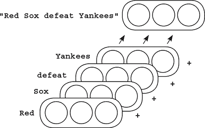
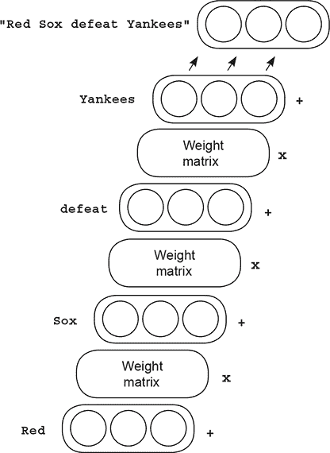

## 第十四章。学习像莎士比亚一样写作：长短期记忆

**本章**

+   字符语言模型

+   截断反向传播

+   梯度消失和梯度爆炸

+   RNN 反向传播的一个玩具示例

+   长短期记忆（LSTM）单元

> “主啊，这些凡人多么愚蠢！”
> 
> *莎士比亚 *仲夏夜之梦**

### 字符语言模型

#### 让我们用 RNN 解决一个更具挑战性的任务

在第十二章和第十三章的结尾，你训练了简单的循环神经网络（RNN），这些网络学习了一个简单的序列预测问题。但你是在一个玩具数据集上训练的，这个数据集是通过规则合成的短语。

在本章中，你将尝试在一个更具挑战性的数据集上进行语言建模：莎士比亚的作品。而且，与上一章中学习根据前面的单词预测下一个单词不同，该模型将训练在字符上。它需要学习根据观察到的先前字符预测下一个字符。这就是我的意思：

```
import sys,random,math
from collections import Counter
import numpy as np
import sys

np.random.seed(0)

f = open('shakespear.txt','r')
raw = f.read()                  *1*
f.close()

vocab = list(set(raw))
word2index = {}
for i,word in enumerate(vocab):
    word2index[word]=i
indices = np.array(list(map(lambda x:word2index[x], raw)))
```

+   ***1* 来自 [`karpathy.github.io/2015/05/21/rnn-effectiveness/`](http://karpathy.github.io/2015/05/21/rnn-effectiveness/)**

与第十二章和第十三章的词汇表由数据集中的单词组成不同，现在词汇表由数据集中的字符组成。因此，数据集也被转换为一个索引列表，这些索引对应于字符而不是单词。之上是`indices` NumPy 数组：

```
embed = Embedding(vocab_size=len(vocab),dim=512)
model = RNNCell(n_inputs=512, n_hidden=512, n_output=len(vocab))

criterion = CrossEntropyLoss()
optim = SGD(parameters=model.get_parameters() + embed.get_parameters(),
            alpha=0.05)
```

这段代码看起来都很熟悉。它初始化嵌入维度为 8，RNN 隐藏状态的大小为 512。输出权重初始化为 0（这不是规则，但我觉得这样效果更好）。最后，你初始化交叉熵损失和随机梯度下降优化器。

### 截断反向传播的需要

#### 通过 100,000 个字符进行反向传播是不可行的

阅读 RNN 代码的更具挑战性的方面之一是为输入数据而进行的批处理逻辑。之前的（更简单的）神经网络有一个这样的内部`for`循环（粗体部分）：

```
for iter in range(1000):
    batch_size = 100
    total_loss = 0

    hidden = model.init_hidden(batch_size=batch_size)

    for t in range(5):
        input = Tensor(data[0:batch_size,t], autograd=True)
        rnn_input = embed.forward(input=input)
        output, hidden = model.forward(input=rnn_input, hidden=hidden)

    target = Tensor(data[0:batch_size,t+1], autograd=True)
    loss = criterion.forward(output, target)
    loss.backward()
    optim.step()
    total_loss += loss.data
    if(iter % 200 == 0):
        p_correct = (target.data == np.argmax(output.data,axis=1)).mean()
        print_loss = total_loss / (len(data)/batch_size)
        print("Loss:",print_loss,"% Correct:",p_correct)
```

你可能会问，“为什么迭代到 5？”实际上，之前的语料库没有超过六个单词的例子。它读取了五个单词，然后尝试预测第六个。

更重要的是反向传播步骤。考虑当你对一个简单的前馈网络进行 MNIST 数字分类时：梯度总是反向传播到整个网络，对吧？它们一直反向传播，直到达到输入数据。这允许网络调整每个权重，试图学习如何根据整个输入示例正确预测。

这里的循环例子也没有不同。你通过五个输入示例进行前向传播，然后，当你稍后调用`loss.backward()`时，它将梯度反向传播回网络到输入数据点。你可以这样做，因为你一次没有输入那么多数据点。但是莎士比亚数据集有 10 万个字符！这对于每个预测进行反向传播来说太多了。你怎么办？

你不需要！你向后传播一个固定数量的步骤到过去，然后停止。这被称为*截断反向传播*，并且是行业标准。你向后传播的长度成为另一个可调参数（就像批量大小或 alpha）。

### 截断反向传播

#### 从技术上讲，它削弱了神经网络的最高理论极限

使用截断反向传播的缺点是它缩短了神经网络可以学习记住事物的距离。基本上，在比如说五个时间步长之后切断梯度，意味着神经网络无法学习记住过去超过五个时间步长的事件。

严格来说，情况比这更复杂。在 RNN 的隐藏层中，从过去超过五个时间步长可能会意外地保留一些残留信息，但神经网络不能使用梯度来特别请求模型从六个时间步长之前保留信息以帮助当前预测。因此，在实践中，神经网络不会学习基于过去超过五个时间步长的输入信号进行预测（如果截断设置为五个时间步长）。在实践中，对于语言建模，截断变量被称为`bptt`，它通常设置在 16 到 64 之间：

```
batch_size = 32
bptt = 16
n_batches = int((indices.shape[0] / (batch_size)))
```

截断反向传播的另一个缺点是它使得小批量逻辑变得稍微复杂一些。要使用截断反向传播，你假装你有一个大数据集，而不是大小为`bptt`的一堆小数据集。你需要相应地分组数据集：

```
trimmed_indices = indices[:n_batches*batch_size]
batched_indices = trimmed_indices.reshape(batch_size, n_batches)
batched_indices = batched_indices.transpose()

input_batched_indices = batched_indices[0:-1]
target_batched_indices = batched_indices[1:]

n_bptt = int(((n_batches-1) / bptt))
input_batches = input_batched_indices[:n_bptt*bptt]
input_batches = input_batches.reshape(n_bptt,bptt,batch_size)
target_batches = target_batched_indices[:n_bptt*bptt]
target_batches = target_batches.reshape(n_bptt, bptt, batch_size)
```

这里有很多事情在进行中。最上面一行使得数据集成为`batch_size`和`n_batches`之间的一个偶数倍。这样做是为了当你将其分组为张量时，它是平方的（或者你也可以用 0 填充数据集以使其成为平方）。第二行和第三行重新塑形数据集，使得每一列是初始`indices`数组的一个部分。我将展示这部分，就像`batch_size`被设置为 8（为了可读性）：

|

```
print(raw[0:5])
print(indices[0:5])
```

|

|

```
'That,'
array([ 9, 14, 2, 10, 57])
```

|

这些是莎士比亚数据集中的前五个字符。它们拼写出字符串“That，”。接下来是`batched_indices`中变换后的前五行的输出：

|

```
print(batched_indices[0:5])
```

|

|

```
array([[ 9, 43, 21, 10, 10, 23, 57, 46],
       [14, 44, 39, 21, 43, 14, 1, 10],
       [ 2, 41, 39, 54, 37, 21, 26, 57],
       [10, 39, 57, 48, 21, 54, 38, 43],
       [57, 39, 43, 1, 10, 21, 21, 33]])
```

|

我已经用粗体突出显示了第一列。看看短语“That，”的索引是否在左边的第一列？这是一个标准构造。有八个列的原因是`batch_size`是 8。这个张量随后被用来构建一个更小的数据集列表，每个数据集的长度为`bptt`。

你可以在这里看到输入和目标是如何构建的。注意，目标索引是输入索引偏移一行（因此网络预测下一个字符）。再次注意，在这个打印输出中`batch_size`设置为 8，这使得阅读更容易，但实际上你将其设置为 32。

```
print(input_batches[0][0:5])

print(target_batches[0][0:5])

array([[ 9, 43, 21, 10, 10, 23, 57, 46],
       [14, 44, 39, 21, 43, 14, 1, 10],
       [ 2, 41, 39, 54, 37, 21, 26, 57],
       [10, 39, 57, 48, 21, 54, 38, 43],
       [57, 39, 43, 1, 10, 21, 21, 33]])

array([[14, 44, 39, 21, 43, 14, 1, 10],
       [ 2, 41, 39, 54, 37, 21, 26, 57],
       [10, 39, 57, 48, 21, 54, 38, 43],
       [57, 39, 43, 1, 10, 21, 21, 33],
       [43, 43, 41, 60, 52, 12, 54, 1]])
```

如果这对你来说现在还不明白，也不要担心。这和深度学习理论关系不大；这只是设置 RNN 时一个特别复杂的部分，你有时会遇到。我想花几页纸来解释它。

#### 让我们看看如何使用截断反向传播进行迭代

以下代码展示了截断反向传播的实际应用。注意，它看起来与第十三章中的迭代逻辑非常相似。唯一的真正区别是，你会在每个步骤生成一个`batch_loss`；并且每进行一次`bptt`步骤后，你都会进行反向传播并更新权重。然后你继续像什么都没发生一样读取数据集（甚至使用之前的相同隐藏状态，它仅在每轮中重置）：

```
def train(iterations=100):
    for iter in range(iterations):
        total_loss = 0
        n_loss = 0

        hidden = model.init_hidden(batch_size=batch_size)
        for batch_i in range(len(input_batches)):

            hidden = Tensor(hidden.data, autograd=True)
            loss = None
            losses = list()
            for t in range(bptt):
                input = Tensor(input_batches[batch_i][t], autograd=True)
                rnn_input = embed.forward(input=input)
                output, hidden = model.forward(input=rnn_input,
                                               hidden=hidden)
               target = Tensor(target_batches[batch_i][t], autograd=True)
                batch_loss = criterion.forward(output, target)
                losses.append(batch_loss)
                if(t == 0):
                    loss = batch_loss
                else:
                    loss = loss + batch_loss
            for loss in losses:
                ""
            loss.backward()
            optim.step()
            total_loss += loss.data
            log = "\r Iter:" + str(iter)
            log += " - Batch "+str(batch_i+1)+"/"+str(len(input_batches))
            log += " - Loss:" + str(np.exp(total_loss / (batch_i+1)))
            if(batch_i == 0):
                log += " - " + generate_sample(70,'\n').replace("\n"," ")
            if(batch_i % 10 == 0 or batch_i-1 == len(input_batches)):
                sys.stdout.write(log)
        optim.alpha *= 0.99
        print()
train()

 Iter:0 - Batch 191/195 - Loss:148.00388828554404
 Iter:1 - Batch 191/195 - Loss:20.588816924127116 mhnethet tttttt t t t
                                     ....
 Iter:99 - Batch 61/195 - Loss:1.0533843281265225 I af the mands your
```

### 输出样本的一个示例

#### 通过从模型的预测中采样，你可以写出莎士比亚的作品！

以下代码使用训练逻辑的子集来使用模型进行预测。你将预测存储在一个字符串中，并将字符串版本作为输出返回给函数。生成的样本看起来非常像莎士比亚的作品，甚至包括对话角色：

```
def generate_sample(n=30, init_char=' '):
    s = ""
    hidden = model.init_hidden(batch_size=1)
    input = Tensor(np.array([word2index[init_char]]))
    for i in range(n):
        rnn_input = embed.forward(input)
        output, hidden = model.forward(input=rnn_input, hidden=hidden)
        output.data *= 10                                              *1*
        temp_dist = output.softmax()
        temp_dist /= temp_dist.sum()

        m = (temp_dist > np.random.rand()).argmax()                    *2*
        c = vocab[m]
        input = Tensor(np.array([m]))
        s += c
    return s
print(generate_sample(n=2000, init_char='\n'))
```

+   ***1* 样本采样的温度；越高 = 越贪婪**

+   ***2* 预测样本**

```
I war ded abdons would.

CHENRO:
Why, speed no virth to her,
Plirt, goth Plish love,
Befion
 hath if be fe woulds is feally your hir, the confectife to the nightion
As rent Ron my hath iom
the worse, my goth Plish love,
Befion
Ass untrucerty of my fernight this we namn?

ANG, makes:
That's bond confect fe comes not commonour would be forch the conflill
As poing from your jus eep of m look o perves, the worse, my goth
Thould be good lorges ever word

DESS:
Where exbinder: if not conflill, the confectife to the nightion
As co move, sir, this we namn?

ANG VINE PAET:
There was courter hower how, my goth Plish lo res
Toures
ever wo formall, have abon, with a good lorges ever word.
```

### 消失和爆炸梯度

#### 简单的 RNN 会受到消失和爆炸梯度的影响

你可能还记得当你第一次组合 RNN 时的这个图像。想法是能够以某种方式组合单词嵌入，使得顺序很重要。你是通过学习一个矩阵来做到这一点的，该矩阵将每个嵌入转换到下一个时间步。然后，前向传播变成了两步过程：从第一个单词嵌入（以下示例中的“Red”嵌入）开始，乘以权重矩阵，并加上下一个嵌入（“Sox”）。然后你将得到的向量乘以相同的权重矩阵，并加入下一个单词，重复这个过程，直到读取整个单词序列。



但正如你所知，隐藏状态生成过程中添加了一个额外的非线性项。因此，前向传播变成了一个三步过程：将前一个隐藏状态通过权重矩阵进行矩阵乘法，加入下一个单词的嵌入，并应用非线性函数。

注意，这种非线性在网络稳定性中起着重要作用。无论单词序列有多长，隐藏状态（理论上可能随时间增长而增长）都被迫保持在非线性函数的值之间（在 sigmoid 的情况下是 0 到 1）。但是，反向传播发生的方式与正向传播略有不同，不具有这种良好的性质。反向传播往往会引起极端大或极端小的值。大值可能导致发散（许多非数字 [NaN]），而极端小的值则使网络无法学习。让我们更仔细地看看 RNN 反向传播。



### RNN 反向传播的玩具示例

#### 为了亲身体验梯度消失/爆炸，让我们合成一个示例

以下代码展示了 `sigmoid` 和 `relu` 激活的反向传播循环。注意，对于 `sigmoid`/`relu`，梯度分别变得非常小/大。在反向传播过程中，由于矩阵乘法的结果，它们变得很大，而由于 `sigmoid` 激活在尾部具有非常平坦的导数（许多非线性函数的常见情况），它们又变得很小。

```
(sigmoid,relu)=(lambda x:1/(1+np.exp(-x)), lambda x:(x>0).astype(float)*x)
weights = np.array([[1,4],[4,1]])
activation = sigmoid(np.array([1,0.01]))

print("Sigmoid Activations")
activations = list()
for iter in range(10):
    activation = sigmoid(activation.dot(weights))
    activations.append(activation)
    print(activation)

print("\nSigmoid Gradients")
gradient = np.ones_like(activation)
for activation in reversed(activations):                     *1*
    gradient = (activation * (1 - activation) * gradient)
    gradient = gradient.dot(weights.transpose())
    print(gradient)

print("Activations")
activations = list()
for iter in range(10):
    activation = relu(activation.dot(weights))               *2*
    activations.append(activation)
    print(activation)
print("\nGradients")
gradient = np.ones_like(activation)
for activation in reversed(activations):
    gradient = ((activation > 0) * gradient).dot(weights.transpose())
    print(gradient)
```

+   ***1* sigmoid 的导数在激活值非常接近 0 或 1（尾部）时会导致非常小的梯度。**

+   ***2* 矩阵乘法会导致梯度爆炸，而非线性函数（如 sigmoid）无法将其压缩。**

```
Sigmoid Activations                  Relu Activations
[0.93940638 0.96852968]              [23.71814585 23.98025559]
[0.9919462 0.99121735]               [119.63916823 118.852839 ]
[0.99301385 0.99302901]              [595.05052421 597.40951192]
        ...                                     ...
[0.99307291 0.99307291]              [46583049.71437107 46577890.60826711]

Sigmoid Gradients                    Relu Gradients
[0.03439552 0.03439552]              [5\. 5.]
[0.00118305 0.00118305]              [25\. 25.]
[4.06916726e-05 4.06916726e-05]      [125\. 125.]
             ...                                ...
[1.45938177e-14 2.16938983e-14]      [9765625\. 9765625.]
```

### 长短期记忆（LSTM）单元

#### LSTM 是对抗梯度消失/爆炸的行业标准模型

前一节解释了梯度消失/爆炸是如何由 RNN 中隐藏状态的更新方式引起的。问题是矩阵乘法和非线性函数的组合用于形成下一个隐藏状态。LSTM 提供的解决方案出人意料地简单。

| |
| --- |

**门控复制技巧**

LSTM 通过复制前一个隐藏状态并在必要时添加或删除信息来创建下一个隐藏状态。LSTM 用于添加和删除信息的机制被称为 *门*。

| |
| --- |

```
def forward(self, input, hidden):
    from_prev_hidden = self.w_hh.forward(hidden)
    combined = self.w_ih.forward(input) + from_prev_hidden
    new_hidden = self.activation.forward(combined)
    output = self.w_ho.forward(new_hidden)
    return output, new_hidden
```

之前的代码是 RNN 单元的正向传播逻辑。以下是 LSTM 单元的新正向传播逻辑。LSTM 有两个隐藏状态向量：`h`（隐藏）和 `cell`。

你需要关注的是 `cell`。注意它是如何更新的。每个新的单元是前一个单元加上 `u`，通过 `i` 和 `f` 加权。`f` 是“忘记”门。如果它取值为 0，则新单元将擦除之前看到的内容。如果 `i` 为 1，它将完全添加 `u` 的值以创建新单元。`o` 是一个输出门，它控制输出预测可以查看多少单元状态。例如，如果 `o` 全为零，则 `self.w_ho.forward(h)` 行将忽略单元状态进行预测。

```
def forward(self, input, hidden):

    prev_hidden, prev_cell = (hidden[0], hidden[1])

    f = (self.xf.forward(input) + self.hf.forward(prev_hidden)).sigmoid()
    i = (self.xi.forward(input) + self.hi.forward(prev_hidden)).sigmoid()
    o = (self.xo.forward(input) + self.ho.forward(prev_hidden)).sigmoid()
    u = (self.xc.forward(input) + self.hc.forward(prev_hidden)).tanh()
    cell = (f * prev_cell) + (i * u)
    h = o * cell.tanh()
    output = self.w_ho.forward(h)
    return output, (h, cell)
```

### 关于 LSTM 门的直觉

#### LSTM 门与从内存中读取/写入的语义相似

所以，这就是全部了！有三个门控器——`f`、`i`、`o`——和一个细胞更新向量`u`；分别想象这些是忘记、输入、输出和更新。它们共同工作以确保要存储或操作在`c`中的任何信息都可以这样做，而无需要求每次更新`c`时都应用任何矩阵乘法或非线性。换句话说，您正在避免永远调用`nonlinearity(c)`或`c.dot(weights)`。

这使得 LSTM 能够在时间序列中存储信息而不用担心梯度消失或梯度爆炸。每一步都是一个复制（假设`f`不为零）加上一个更新（假设`i`不为零）。隐藏值`h`随后是用于预测的细胞的一个掩码版本。

注意，三个门控器都是用相同的方式形成的。它们有自己的权重矩阵，但每个门控器都基于输入和前一个隐藏状态，通过一个`sigmoid`函数进行条件化。正是这个`sigmoid`非线性使得它们作为门控器非常有用，因为它在 0 和 1 之间饱和：

```
f = (self.xf.forward(input) + self.hf.forward(prev_hidden)).sigmoid()
i = (self.xi.forward(input) + self.hi.forward(prev_hidden)).sigmoid()
o = (self.xo.forward(input) + self.ho.forward(prev_hidden)).sigmoid()
```

最后一个可能的批评是关于`h`的。显然，它仍然容易受到梯度消失和梯度爆炸的影响，因为它基本上被用来和原始 RNN 一样。首先，因为`h`向量总是使用一个组合的向量创建，这些向量被`tanh`和`sigmoid`压缩，所以梯度爆炸实际上并不是一个问题——只有梯度消失。但最终这没问题，因为`h`依赖于`c`，它可以携带长距离信息：梯度消失无法学习携带的那种信息。因此，所有长距离信息都是通过`c`传输的，而`h`只是`c`的一个局部解释，对于在下一个时间步进行输出预测和构建门控激活很有用。简而言之，`c`可以学习在长距离上传输信息，所以即使`h`不能，这也没有关系。

### 长短期记忆层

#### 您可以使用自动微分系统来实现一个 LSTM

```
class LSTMCell(Layer):

    def __init__(self, n_inputs, n_hidden, n_output):
        super().__init__()

        self.n_inputs = n_inputs
        self.n_hidden = n_hidden
        self.n_output = n_output
        self.xf = Linear(n_inputs, n_hidden)
        self.xi = Linear(n_inputs, n_hidden)
        self.xo = Linear(n_inputs, n_hidden)
        self.xc = Linear(n_inputs, n_hidden)
        self.hf = Linear(n_hidden, n_hidden, bias=False)
        self.hi = Linear(n_hidden, n_hidden, bias=False)
        self.ho = Linear(n_hidden, n_hidden, bias=False)
        self.hc = Linear(n_hidden, n_hidden, bias=False)

        self.w_ho = Linear(n_hidden, n_output, bias=False)

        self.parameters += self.xf.get_parameters()
        self.parameters += self.xi.get_parameters()
        self.parameters += self.xo.get_parameters()
        self.parameters += self.xc.get_parameters()
        self.parameters += self.hf.get_parameters()
        self.parameters += self.hi.get_parameters()
        self.parameters += self.ho.get_parameters()
        self.parameters += self.hc.get_parameters()

        self.parameters += self.w_ho.get_parameters()

    def forward(self, input, hidden):

        prev_hidden = hidden[0]
        prev_cell = hidden[1]

        f=(self.xf.forward(input)+self.hf.forward(prev_hidden)).sigmoid()
        i=(self.xi.forward(input)+self.hi.forward(prev_hidden)).sigmoid()
        o=(self.xo.forward(input)+self.ho.forward(prev_hidden)).sigmoid()
        g = (self.xc.forward(input) +self.hc.forward(prev_hidden)).tanh()
        c = (f * prev_cell) + (i * g)
        h = o * c.tanh()

        output = self.w_ho.forward(h)
        return output, (h, c)

    def init_hidden(self, batch_size=1):
        h = Tensor(np.zeros((batch_size, self.n_hidden)), autograd=True)
        c = Tensor(np.zeros((batch_size, self.n_hidden)), autograd=True)
        h.data[:,0] += 1
        c.data[:,0] += 1
   return (h, c)
```

### 升级字符语言模型

#### 让我们用新的 LSTM 单元替换原始 RNN

在本章的早期，您训练了一个字符语言模型来预测莎士比亚。现在让我们训练一个基于 LSTM 的模型来做同样的事情。幸运的是，上一章的框架使得这变得很容易实现（书中的完整代码可在[www.manning.com/books/grokking-deep-learning](http://www.manning.com/books/grokking-deep-learning)；或在 GitHub 上[`github.com/iamtrask/grokking-deep-learning`](https://github.com/iamtrask/grokking-deep-learning)找到）。以下是新的设置代码。所有从原始 RNN 代码的编辑都在粗体中。注意，您设置神经网络的方式几乎没有变化：

```
import sys,random,math
from collections import Counter
import numpy as np
import sys

np.random.seed(0)

f = open('shakespear.txt','r')
raw = f.read()
f.close()

vocab = list(set(raw))
word2index = {}
for i,word in enumerate(vocab):
    word2index[word]=i
indices = np.array(list(map(lambda x:word2index[x], raw)))

embed = Embedding(vocab_size=len(vocab),dim=512)
model = LSTMCell(n_inputs=512, n_hidden=512, n_output=len(vocab))
model.w_ho.weight.data *= 0                                         *1*

criterion = CrossEntropyLoss()
optim = SGD(parameters=model.get_parameters() + embed.get_parameters(),
            alpha=0.05)

batch_size = 16
bptt = 25
n_batches = int((indices.shape[0] / (batch_size)))

trimmed_indices = indices[:n_batches*batch_size]
batched_indices = trimmed_indices.reshape(batch_size, n_batches)
batched_indices = batched_indices.transpose()

input_batched_indices = batched_indices[0:-1]
target_batched_indices = batched_indices[1:]

n_bptt = int(((n_batches-1) / bptt))
input_batches = input_batched_indices[:n_bptt*bptt]
input_batches = input_batches.reshape(n_bptt,bptt,batch_size)
target_batches = target_batched_indices[:n_bptt*bptt]
target_batches = target_batches.reshape(n_bptt, bptt, batch_size)
min_loss = 1000
```

+   ***1* 这似乎有助于训练。**

### 训练 LSTM 字符语言模型

#### 训练逻辑也没有发生太多变化

从标准的 RNN 逻辑中，你唯一需要做的真正改变是截断反向传播逻辑，因为每个时间步长有两个隐藏向量而不是一个。但这只是一个相对较小的修复（粗体）。我还增加了一些使训练更简单的功能（`alpha` 随时间缓慢减少，并且有更多的日志记录）：

```
for iter in range(iterations):
    total_loss, n_loss = (0, 0)
     hidden = model.init_hidden(batch_size=batch_size)
     batches_to_train = len(input_batches)

     for batch_i in range(batches_to_train):

         hidden = (Tensor(hidden[0].data, autograd=True),
                   Tensor(hidden[1].data, autograd=True))
          losses = list()

          for t in range(bptt):
              input = Tensor(input_batches[batch_i][t], autograd=True)
              rnn_input = embed.forward(input=input)
             output, hidden = model.forward(input=rnn_input, hidden=hidden)

              target = Tensor(target_batches[batch_i][t], autograd=True)
              batch_loss = criterion.forward(output, target)

              if(t == 0):
                  losses.append(batch_loss)
              else:
                  losses.append(batch_loss + losses[-1])
          loss = losses[-1]

          loss.backward()
          optim.step()

         total_loss += loss.data / bptt
         epoch_loss = np.exp(total_loss / (batch_i+1))
         if(epoch_loss < min_loss):
             min_loss = epoch_loss
             print()
         log = "\r Iter:" + str(iter)
         log += " - Alpha:" + str(optim.alpha)[0:5]
         log += " - Batch "+str(batch_i+1)+"/"+str(len(input_batches))
         log += " - Min Loss:" + str(min_loss)[0:5]
         log += " - Loss:" + str(epoch_loss)
         if(batch_i == 0):
             s = generate_sample(n=70, init_char='T').replace("\n"," ")
             log += " - " + s
         sys.stdout.write(log)
     optim.alpha *= 0.99
```

### 调整 LSTM 字符语言模型

#### 我花费了大约两天的时间调整这个模型，并且它是在夜间训练完成的

这里是此模型的某些训练输出。请注意，训练这个模型花费了非常长的时间（有很多参数）。我还不得不多次训练它，以找到这个任务的良好调整（学习率、批量大小等），并且最终的模型是在夜间（8 小时）训练完成的。一般来说，你训练的时间越长，你的结果就会越好。

```
I:0 - Alpha:0.05 - Batch 1/249 - Min Loss:62.00 - Loss:62.00 - eeeeeeeeee
                                   ...
I:7 - Alpha:0.04 - Batch 140/249 - Min Loss:10.5 - Loss:10.7 - heres, and
                                   ...
I:91 - Alpha:0.016 - Batch 176/249 - Min Loss:9.900 - Loss:11.9757225699
```

```
def generate_sample(n=30, init_char=' '):
    s = ""
    hidden = model.init_hidden(batch_size=1)
    input = Tensor(np.array([word2index[init_char]]))
    for i in range(n):
        rnn_input = embed.forward(input)
        output, hidden = model.forward(input=rnn_input, hidden=hidden)
        output.data *= 15
        temp_dist = output.softmax()
        temp_dist /= temp_dist.sum()

        m = output.data.argmax()           *1*
        c = vocab[m]
        input = Tensor(np.array([m]))
        s += c
    return s
print(generate_sample(n=500, init_char='\n'))
```

+   ***1* 取最大预测**

```
Intestay thee.

SIR:
It thou my thar the sentastar the see the see:
Imentary take the subloud I
Stall my thentaring fook the senternight pead me, the gakentlenternot
they day them.

KENNOR:
I stay the see talk :
Non the seady!

Sustar thou shour in the suble the see the senternow the antently the see
the seaventlace peake,
I sentlentony my thent:
I the sentastar thamy this not thame.
```

### 摘要

#### LSTM 是极其强大的模型

LSTM 学习生成莎士比亚语言的分布不容小觑。语言是一个极其复杂的统计分布，学习起来非常困难，而 LSTM 能够做得如此出色（在撰写本文时，它们是广泛领先的最佳方法）仍然让我（以及其他一些人）感到困惑。这个模型的小型变体要么是，要么最近一直是各种任务中的最佳状态，并且与词嵌入和卷积层一起，无疑将是我们长期以来的首选工具。
