# 1 深度强化学习简介

在本章中

+   你将学习深度强化学习是什么，以及它与其他机器学习方法有何不同。

+   你将了解深度强化学习的最新进展以及它能为各种问题带来什么。

+   你将了解这本书的内容以及如何从中获得最大收益。

我想象着一个时代，我们将对机器人产生如同狗对人类那样的影响，我为机器人的进步感到自豪。

——克劳德·香农 信息时代之父，人工智能领域的贡献者

人类天生追求幸福感。从挑选我们的食物到提升我们的职业生涯，我们选择的每一个行动都源于我们体验生活中有益时刻的驱动力。这些时刻是自私的愉悦还是更慷慨的目标，它们是否带给我们即时的满足或长期的成功，它们仍然是我们对它们重要性和价值的感知。在某种程度上，这些时刻是我们存在的理由。

我们实现这些珍贵时刻的能力似乎与智力相关；“智力”被定义为获取和应用知识和技能的能力。社会认为智力高的人能够为了长期目标而放弃即时满足，为了可能更好但不确定的未来而放弃一个确定但可能更好的未来。那些需要较长时间才能实现且具有未知长期价值的目标通常是最难实现的，而那些能够承受沿途挑战的人是例外，是领导者，是社会中的知识分子。

在这本书中，你将了解一种被称为深度强化学习的方法，它涉及创建能够实现需要智能的目标的计算机程序。在本章中，我介绍了深度强化学习，并给出了一些建议，帮助你从这本书中获得最大收益。

## 什么是深度强化学习？

深度强化学习（DRL）是一种机器学习方法，涉及创建能够解决需要智能问题的计算机程序。DRL 程序的独特属性是通过利用强大的非线性函数逼近，从同时具有序列性、评估性和样本性的反馈中通过试错进行学习。

我将逐步为你解释这个定义。但是，不要过于纠结于细节，因为这需要我整本书的时间来帮助你理解深度强化学习。以下是对你在本书中将要学习内容的**介绍**。因此，它将在接下来的章节中重复并详细解释。

如果我实现了这本书的目标，在你完成阅读后，你应该能够精确地理解这个定义。你应该能够解释我为什么使用这些词，以及为什么没有使用更多或更少的词。但是，对于这一章，只需放松并深入阅读即可。

### 深度强化学习是一种人工智能的机器学习方法

*人工智能*（AI）是计算机科学的一个分支，涉及创建能够展示智能的计算机程序。传统上，任何显示认知能力（如感知、搜索、规划和学习）的软件都被认为是 AI 的一部分。由 AI 软件产生的功能示例包括

+   搜索引擎返回的页面

+   GPS 应用生成的路线

+   智能助手软件的语音识别和合成语音

+   电子商务网站推荐的产品

+   无人机中的跟随功能

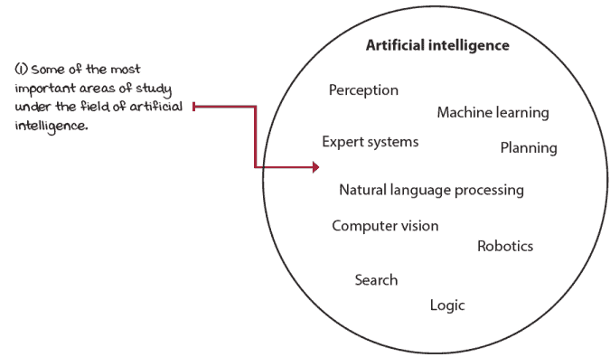

人工智能的子领域

所有显示智能的计算机程序都被认为是 AI，但并非所有 AI 的例子都能学习。*机器学习*（ML）是 AI 的一个领域，涉及创建能够通过学习数据来解决需要智能的问题的计算机程序。ML 有三个主要分支：监督学习、无监督学习和强化学习。

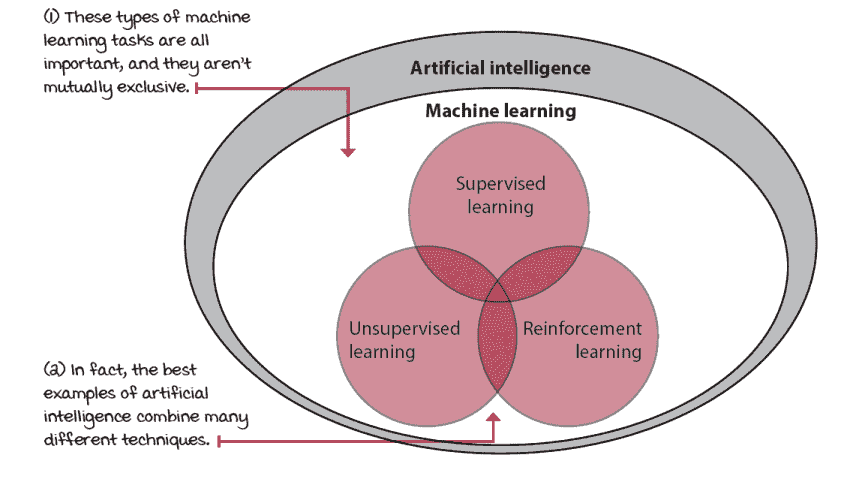

机器学习的主要分支

*监督学习*（SL）是从标记数据中学习的任务。在 SL 中，人类决定收集哪些数据以及如何标记它们。SL 的目标是泛化。SL 的一个经典例子是手写数字识别应用：人类收集带有手写数字的图像，标记这些图像，并训练一个模型来正确识别和分类图像中的数字。期望训练好的模型能够泛化并在新的图像中正确分类手写数字。

*无监督学习*（UL）是从未标记数据中学习的任务。尽管数据不再需要标记，但计算机用于收集数据的方法仍然需要由人类设计。UL 的目标是压缩。UL 的一个经典例子是客户细分应用；人类收集客户数据并训练一个模型将客户分组到聚类中。这些聚类压缩了信息，揭示了客户之间的潜在关系。

*强化学习*（RL）是通过试错来学习的任务。在这种类型的任务中，没有人类标记数据，也没有人类收集或明确设计数据集。RL 的目标是行动。RL 的一个经典例子是玩 Pong 的代理；代理反复与 Pong 模拟器交互，通过采取行动并观察其效果来学习。期望训练好的代理能够以成功玩 Pong 的方式行动。

一种强大的近期 ML 方法，称为*深度学习*（DL），涉及使用多层非线性函数逼近，通常是神经网络。DL 不是一个独立的 ML 分支，因此它不同于之前描述的任务。DL 是一系列技术和方法，用于使用神经网络来解决 ML 任务，无论是 SL、UL 还是 RL。DRL 仅仅是使用 DL 来解决 RL 任务。

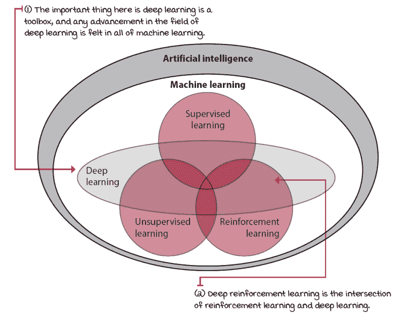

深度学习是一个强大的工具箱

重要的是，强化学习（RL）是一种解决问题的方法。人工智能领域定义了这个问题：创造智能机器。解决这个问题的方法之一是强化学习（RL）。在整个书中，你会找到 RL 与其他机器学习（ML）方法的比较，但只有在这一章中，你会找到人工智能的一般定义和历史概述。需要注意的是，强化学习（RL）领域包括深度强化学习（DRL）领域，所以尽管我在必要时会做出区分，但当我提到 RL 时，请记住 DRL 也包括在内。

### 深度强化学习关注的是创建计算机程序

深度强化学习（DRL）的核心是关于在不确定性下的复杂序列决策问题。但是，这是一个在许多领域都感兴趣的话题；例如，*控制理论*（CT）研究控制复杂已知动态系统的方法。在 CT 中，我们试图控制的系统的动力学通常事先是已知的。*运筹学*（OR）是另一个例子，它也研究不确定性下的决策，但这个领域的问题通常比 DRL 中常见的动作空间要大得多。*心理学*研究人类行为，这在某种程度上与“不确定性下的复杂序列决策”问题相同。

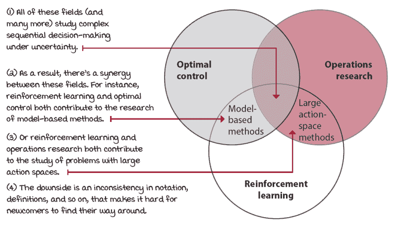

相似领域之间的协同作用

重要的是，你已经进入了一个受到许多其他领域影响的领域。尽管这是好事，但也带来了术语、符号等方面的不一致。我的观点是计算机科学方法来解决这个问题，因此这本书是关于构建解决不确定性下复杂决策问题的计算机程序，因此你可以在整本书中找到代码示例。

在 DRL 中，这些计算机程序被称为*代理*。代理只是一个决策者，没有其他角色。这意味着如果你在训练一个机器人来捡起物体，机器人手臂不是代理的一部分。只有做出决策的代码才被称为代理。

### 深度强化学习代理可以解决需要智能的问题

在代理的另一边是**环境**。环境是代理之外的一切；代理无法完全控制的一切。再次想象你正在训练一个机器人来捡起物体。要捡起的物体、放置物体的托盘、风以及决策者之外的一切都是环境的一部分。这意味着机器人手臂也是环境的一部分，因为它不是代理的一部分。即使代理可以决定移动手臂，实际的手臂运动是嘈杂的，因此手臂也是环境的一部分。

这种代理和环境之间的严格界限一开始可能感觉不太直观，但决策者，即代理，只能有一个单一的角色：*做出决策*。决策之后的所有事物都被打包进环境中。

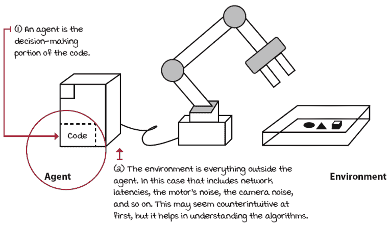

代理和环境之间的界限

第二章深入探讨了 DRL 的所有组成部分。以下是对第二章内容的预览。

环境由与问题相关的一系列变量表示。例如，在机器人臂的例子中，手臂的位置和速度将是构成环境的变量的一部分。这些变量及其所有可能的值被称为*状态空间*。状态是状态空间的一个实例化，是一组变量所取的值。

有趣的是，通常情况下，智能体无法访问环境的实际完整状态。智能体可以观察到的状态部分被称为*观察*。观察依赖于状态，但却是智能体所能看到的。例如，在机器人臂的例子中，智能体可能只能访问摄像头图像。虽然每个物体的确切位置都存在，但智能体无法访问这个特定的状态。相反，智能体感知到的观察是从状态中派生出来的。你经常会在文献中看到*状态*被交替使用，包括在这本书中。我提前为这些不一致之处道歉。只需了解这些差异，并注意术语；这才是最重要的。

状态与观察

在每个状态下，环境会提供一组智能体可以选择的动作。智能体通过这些动作影响环境。环境可能会根据智能体的动作改变状态。负责这种映射的函数称为转换函数。环境还可能提供奖励信号作为响应。负责这种映射的函数称为*奖励函数*。转换和奖励函数的集合被称为环境的*模型*。

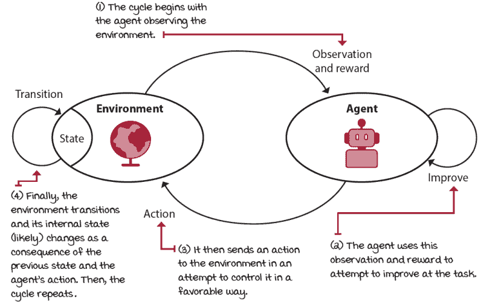

强化学习周期

环境通常有一个定义良好的任务。这个任务的目标是通过奖励函数来定义的。奖励函数的信号可以是同时序列的、评估的和采样的。为了实现目标，智能体需要表现出智能，或者至少是与智能相关联的认知能力，如长期思考、信息收集和泛化。

智能体有三个步骤的过程：智能体与环境交互，智能体评估其行为，智能体改进其响应。智能体可以被设计成学习从观察到的动作映射，称为策略。智能体可以被设计成学习环境的模型映射，称为模型。智能体可以被设计成学习估计奖励到映射，称为价值函数。

### 深度强化学习智能体通过试错学习改进其行为

代理与环境之间的交互会持续几个周期。每个周期被称为一个*时间步长*。在每个时间步长，代理观察环境，采取行动，并接收新的观察和奖励。状态、行动、奖励和新的状态集被称为一个*经验*。每个经验都有学习和改进性能的机会。

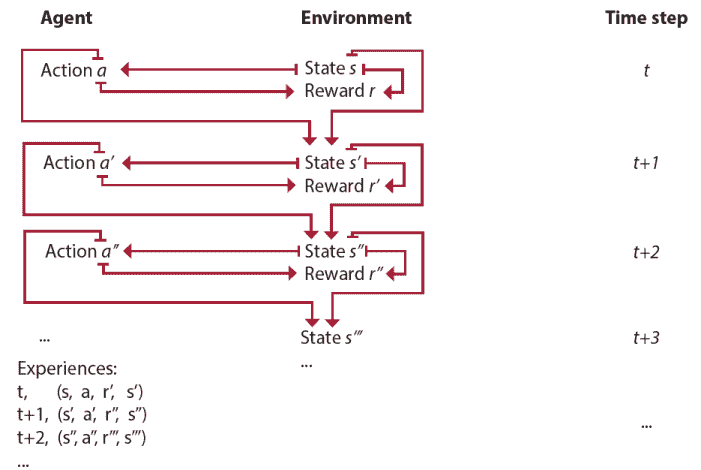

经验元组

代理试图解决的问题可能有一个自然的结束，也可能没有。有自然结束的任务，如游戏，被称为*事件任务*。相反，没有自然结束的任务，如学习前进运动，被称为*持续任务*。从事件任务开始到结束的时间步序列被称为一个*事件*。代理可能需要几个时间步和事件来学习解决一个任务。代理通过试错来学习：他们尝试一些东西，观察，学习，再尝试其他东西，如此循环。

你将在第四章中开始学习更多关于这个循环的内容，该章包含一个每个事件只有一个步骤的环境。从第五章开始，你将学习如何处理每个事件需要多个交互周期才能完成的环境。

### 深度强化学习代理从序列反馈中学习

代理采取的行动可能具有延迟后果。奖励可能稀疏，并且只在几个时间步之后才显现。因此，代理必须能够从序列反馈中学习。序列反馈引发了被称为*时间信用分配问题*的问题。时间信用分配问题是指确定哪个状态和/或行动对奖励负责的挑战。当问题有时间成分，并且行动有延迟后果时，为奖励分配信用是一个挑战。

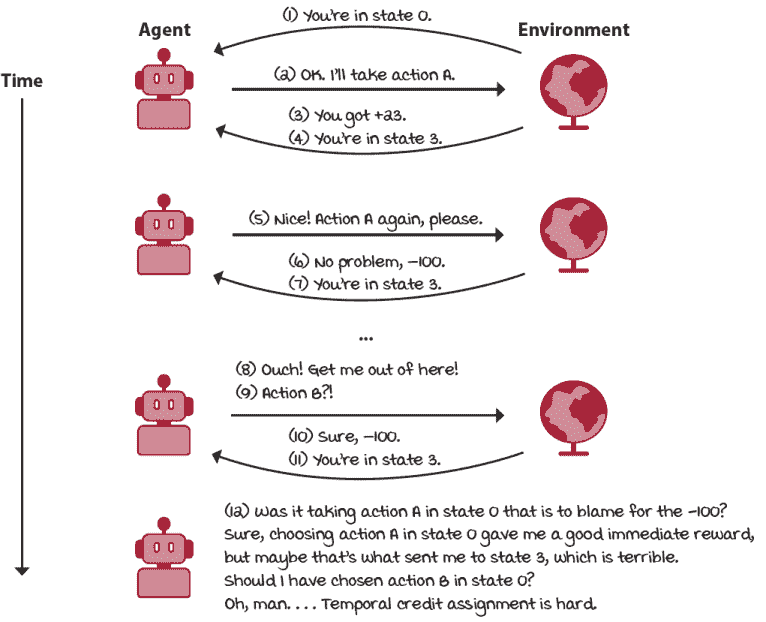

时间信用分配问题的难度

在第三章中，我们将研究孤立情况下序列反馈的来龙去脉。也就是说，你的程序会从同时序列的、监督的（与评估的相对）、以及穷尽的（与抽样的相对）反馈中学习。

### 深度强化学习代理从评估反馈中学习

代理收到的奖励可能较弱，从某种意义上说，它可能不提供监督。奖励可能表明良好，但不正确，这意味着它可能不包含关于其他潜在奖励的信息。因此，代理必须能够从*评估反馈*中学习。评估反馈引发了探索的需求。代理必须能够在收集信息和利用当前信息之间取得平衡。这也被称为*探索与利用的权衡*。

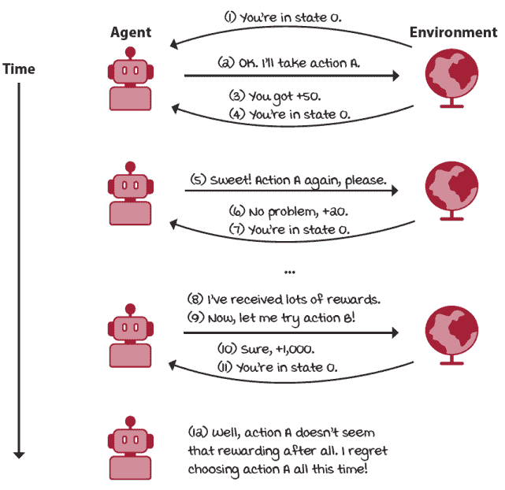

探索与利用权衡的难度

在第四章中，我们将单独研究评估反馈的细节。也就是说，你的程序将从同时具有一次性（与序列性相对）、评估性和详尽性（与样本性相对）的反馈中学习。

### 深度强化学习代理从样本反馈中学习

代理收到的奖励只是一个样本，代理无法访问奖励函数。此外，状态和动作空间通常很大，甚至是无限的，因此从稀疏和微弱的反馈中学习变得更具挑战性。因此，代理必须能够从样本反馈中学习，并且必须能够泛化。

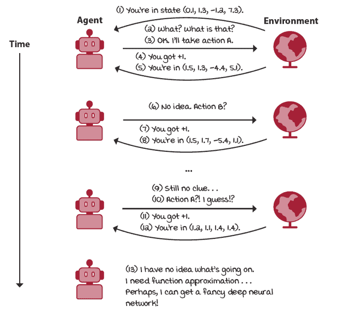

从样本反馈中学习的难度

被设计用来近似策略的代理被称为**基于策略**的；被设计用来近似价值函数的代理被称为**基于价值**的；被设计用来近似模型的代理被称为**基于模型**的；而那些被设计用来近似策略和价值函数的代理被称为**演员-评论家**。代理可以被设计来近似一个或多个这些组件。

### 深度强化学习代理使用强大的非线性函数近似

代理可以使用各种机器学习方法和技巧来近似函数，从决策树到支持向量机再到神经网络。然而，在这本书中，我们只使用神经网络；这也就是 DRL 中“深度”部分的含义。神经网络并不一定是每个问题的最佳解决方案；神经网络需要大量数据且难以解释，你必须牢记这些事实。然而，神经网络是可用的最强大的函数近似之一，它们的性能通常也是最好的。

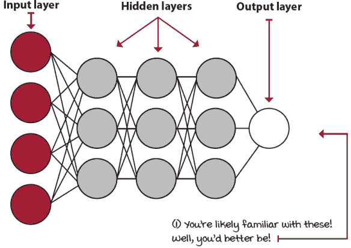

一个简单的前馈神经网络

**人工神经网络**（ANN）是多层的非线性函数近似器，其灵感来源于动物大脑中的生物神经网络。ANN 不是一个算法，而是一个由多个数学变换层组成的结构，这些变换应用于输入值。

从第三章到第七章，我们只处理代理从详尽（与样本相对）反馈中学习的问题。从第八章开始，我们研究完整的 DRL 问题；也就是说，使用深度神经网络，使代理能够从样本反馈中学习。记住，DRL 代理从同时具有序列性、评估性和样本性的反馈中学习。

## 深度强化学习的过去、现在和未来

历史并非获得技能的必要条件，但它可以帮助你理解一个主题的背景，这反过来又可以帮助你获得动力，从而获得技能。AI 和 DRL 的历史应该帮助你设定对这项强大技术未来的期望。有时，我感觉围绕 AI 的炒作实际上是有益的；人们对此感兴趣。但是，当需要付出努力的时候，炒作就不再有帮助，这成为一个问题。虽然我很想对 AI 感到兴奋，但我也需要设定现实的期望。

### 人工智能和深度强化学习的近期历史

深度强化学习的开端可以追溯到很多年前，因为自古以来，人类就对除了我们自己之外的智能生物的可能性感到着迷。但一个良好的开端可以追溯到 20 世纪 30 年代、40 年代和 50 年代，当时艾伦·图灵的工作为现代计算机科学和 AI 的发展奠定了关键的理论基础，这些基础后来被科学家们利用。

其中最著名的是图灵测试，它提出了一种衡量机器智能的标准：如果一名人类审问者在聊天问答环节中无法区分一台机器和另一名人类，那么这台计算机就被认为是有智能的。尽管图灵测试非常基础，但它让几代人开始思考通过设定一个研究人员可以追求的目标来创造智能机器的可能性。

人工智能作为一门学术学科的正式开端可以归功于约翰·麦卡锡（John McCarthy），这位有影响力的 AI 研究人员对该领域做出了多项显著贡献。例如，麦卡锡在 1955 年提出了“人工智能”这一术语，1956 年领导了第一次 AI 会议，1958 年发明了 Lisp 编程语言，1959 年共同创立了麻省理工学院 AI 实验室，并在几十年的时间里为 AI 作为一门学科的发展做出了重要贡献。

### 人工智能寒冬

早期人工智能的所有工作和进步都引起了极大的兴奋，但也伴随着重大的挫折。杰出的 AI 研究人员曾建议我们将在几年内创造出类似人类的机器智能，但这一目标从未实现。当一位知名研究者 James Lighthill 编制了一份批评 AI 学术研究现状的报告时，情况变得更糟。所有这些发展共同导致了长达一段时间的资金减少和对 AI 研究的兴趣降低，这一时期被称为第一次*人工智能寒冬*。

该领域在多年间持续这种模式：研究人员取得进展，人们过度乐观，然后高估——导致政府和行业合作伙伴减少资金投入。

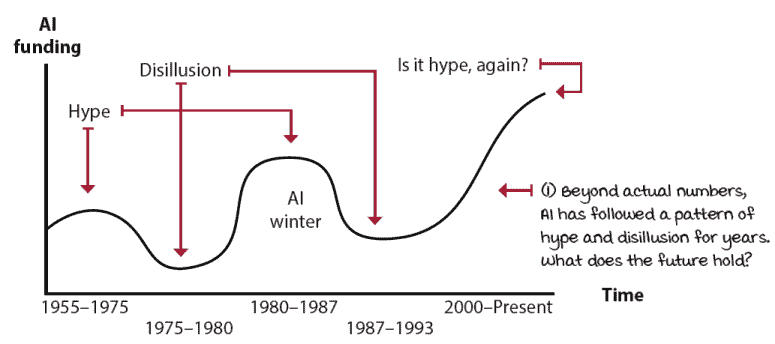

年度 AI 资金模式

### 人工智能的当前状态

我们可能正处于人工智能历史中的另一个高度乐观的时期，因此我们必须谨慎。从业者明白人工智能是一个强大的工具，但有些人将人工智能视为一个神奇的黑色盒子，它可以接受任何问题并给出最佳解决方案。这离事实相去甚远。其他人甚至担心人工智能会获得意识，好像这很重要，正如著名计算机科学家埃德加·W·迪杰斯特拉所说：“计算机能否思考的问题并不比潜水艇能否游泳的问题更有趣。”

然而，如果我们抛开好莱坞植入的人工智能愿景，我们可以让自己对这一领域的近期进展感到兴奋。如今，世界上最有影响力的公司对人工智能研究投入了最多的资金。像谷歌、Facebook、微软、亚马逊和苹果这样的公司投资于人工智能研究，并因人工智能系统而变得高度盈利。他们的重大和持续投资为当前的人工智能研究速度创造了完美的环境。当代研究人员拥有最好的计算能力和大量数据用于他们的研究，顶尖的研究团队在同一地点、同一时间共同研究相同的问题。当前的 AI 研究变得更加稳定和高效。我们已经见证了一个接一个的 AI 成功，而且似乎不会很快停止。

### 深度强化学习的进展

人工神经网络在强化学习问题上的应用始于 20 世纪 90 年代。其中之一是 Gerald Tesauro 等人创建的经典的国际象棋程序*TD*-Gammon。*TD*-Gammon 通过学习通过强化学习评估棋盘位置来学习玩国际象棋。尽管实施的技术并不精确地被认为是深度强化学习，但*TD*-Gammon 是第一个广泛报道的，使用人工神经网络解决复杂强化学习问题的成功案例。

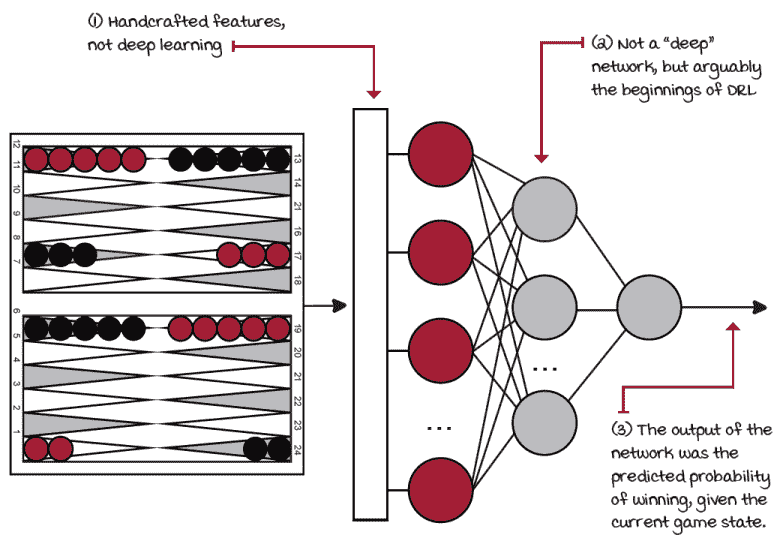

TD-Gammon 架构

在 2004 年，Andrew Ng 等人开发了一架能够通过观察数小时人类专家飞行的飞行特技的自主直升机。他们使用了一种称为*逆强化学习*的技术，其中智能体从专家演示中学习。同年，Nate Kohl 和 Peter Stone 使用一类称为*策略梯度方法*的深度强化学习方法开发了一个用于 RoboCup 锦标赛的足球机器人。他们使用强化学习来教智能体前进运动。经过仅三小时的训练，该机器人达到了任何具有相同硬件的机器人中最快的向前移动速度。

在 2000 年代还有其他一些成功，但强化学习领域真正开始增长是在大约 2010 年深度学习领域起飞之后。2013 年和 2015 年，Mnih 等人发表了几篇论文，介绍了 DQN 算法。DQN 通过原始像素学会了玩 Atari 游戏。使用卷积神经网络（CNN）和一组超参数，DQN 在 49 场比赛中有 22 场的表现优于专业人类玩家。

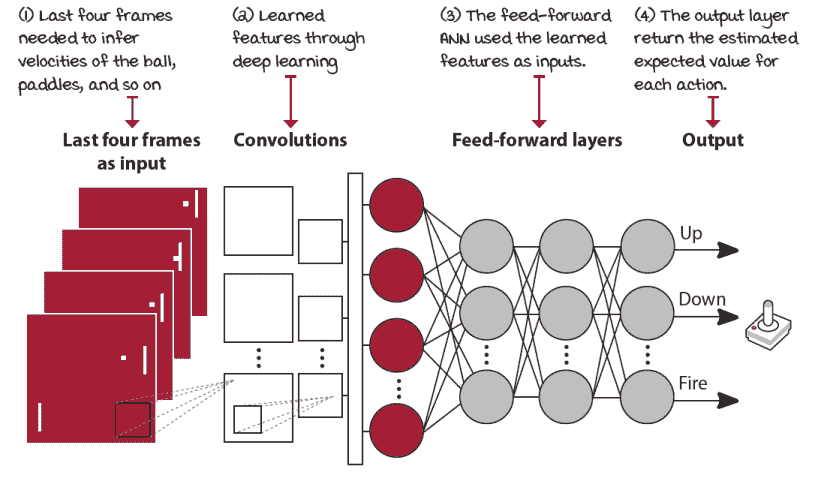

Atari DQN 网络架构

这一成就引发了强化学习社区的革命：2014 年，Silver 等人发布了确定性策略梯度（DPG）算法，一年后 Lillicrap 等人通过深度确定性策略梯度（DDPG）对其进行了改进。2016 年，Schulman 等人发布了信任域策略优化（TRPO）和广义优势估计（GAE）方法，Sergey Levine 等人发表了引导策略搜索（GPS），Silver 等人展示了 AlphaGo。次年，Silver 等人展示了 AlphaZero。在那几年里，还发布了许多其他算法：双深度 Q 网络（DDQN）、优先经验回放（PER）、近端策略优化（PPO）、带经验回放的演员-评论家（ACER）、异步优势演员-评论家（A3C）、优势演员-评论家（A2C）、使用克罗内克分解信任域的演员-评论家（ACKTR）、Rainbow、Unicorn（顺便说一句，这些都是真实名称），等等。2019 年，Oriol Vinyals 等人展示了 AlphaStar 智能体在星际争霸 II 游戏中击败了职业玩家。几个月后，Jakub Pachocki 等人看到他们的 Dota-2 玩机器人团队，名为 Five，成为第一个在电子竞技游戏中击败世界冠军的 AI。

多亏了强化学习的进步，我们在二十年的时间里从解决具有 10²⁰完美信息状态的宾果游戏，到解决具有 10¹⁷⁰完美信息状态的围棋游戏，或者更好的是，解决具有 10²⁷⁰不完美信息状态的星际争霸 II 游戏。这是一个难以想象的更好的进入该领域的时间。你能想象下一个二十年会给我们带来什么吗？你将成为其中的一员吗？强化学习是一个蓬勃发展的领域，我预计其进步速度将继续。

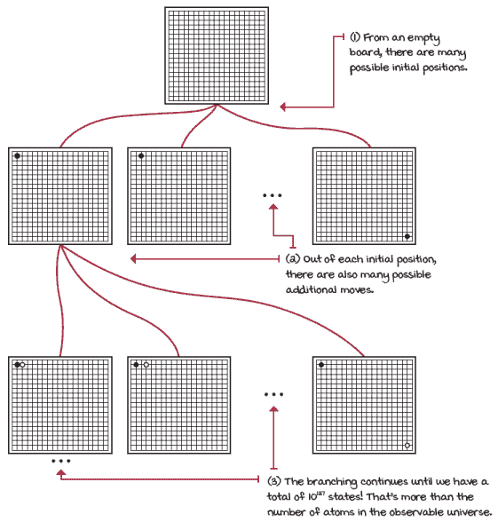

围棋游戏：巨大的分支因子

### 前方的机遇

我相信，无论恐惧主义者说什么，AI 都是一个具有无限积极变革潜力的领域。回到 1750 年代，由于工业革命的开始，出现了混乱。强大的机器正在取代重复性的体力劳动，无情地取代人类。每个人都担心：这些机器能比人类工作更快、更有效、更便宜？这些机器将夺走我们所有的饭碗！我们以后靠什么生活？但事实是，许多这些工作不仅不令人满意，而且危险。

工业革命一百年后，这些变化的长期影响开始造福社区。那些通常只拥有几件衬衫和一条裤子的普通人，只需花费一小部分成本就能获得更多。的确，变革是困难的，但长期效果惠及了整个世界。

数字革命始于 20 世纪 70 年代，随着个人电脑的引入。随后，互联网改变了我们的做事方式。由于互联网，我们得到了大数据和云计算。机器学习利用这片肥沃的土壤茁壮成长，成为今天的模样。在接下来的几十年里，AI 对社会的影响和变化可能一开始难以接受，但长期效果将远远优于途中的任何挫折。我预计在几十年后，人类甚至不需要为食物、衣物或住所而工作，因为这些都是由 AI 自动生产的。我们将因富足而繁荣。

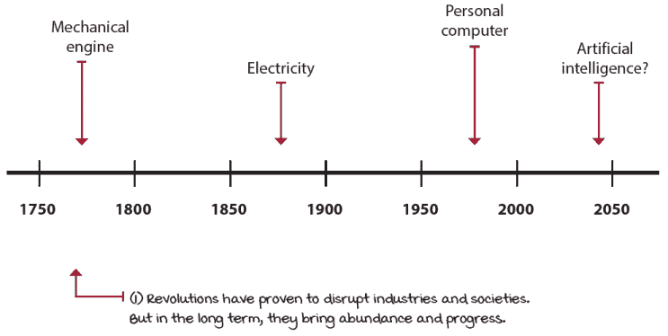

劳动力革命

随着我们继续提升机器的智能水平，某些 AI 研究人员认为我们可能会发现一个比我们自身更聪明的 AI。在这个时候，我们将解锁一个被称为*奇点*的现象；一个比人类更聪明的 AI 能够以更快的速度提升 AI，因为自我改进的循环不再有瓶颈，即人类。但我们必须谨慎，因为这更多的是一个理想而非实际需要担忧的方面。

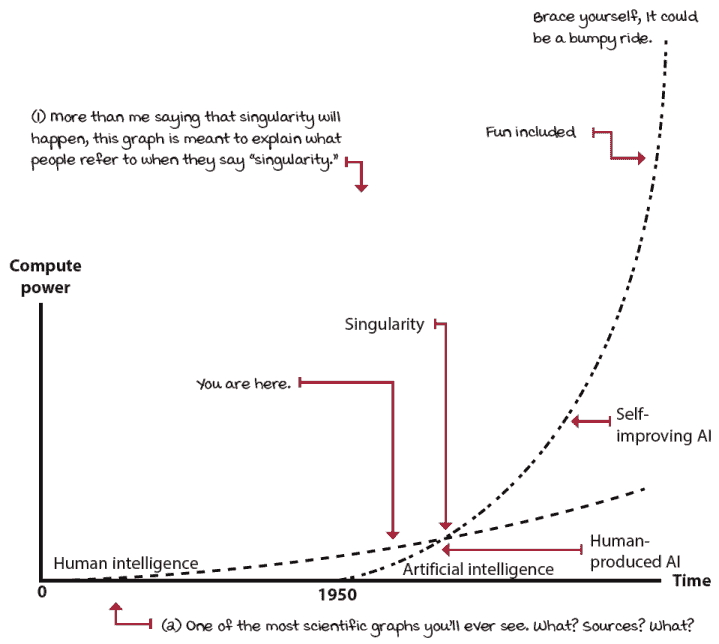

奇点可能就在几十年之后

虽然我们必须始终意识到 AI 的影响并努力追求 AI 安全，但奇点目前并不是一个问题。另一方面，正如你在本书中将会看到的，当前深度强化学习存在许多问题。这些问题使我们能够更好地利用时间。

## 深度强化学习的适用性

你可以将任何机器学习问题表述为一个深度强化学习问题，但这并不总是一个好的主意，有多个原因。你应该了解使用深度强化学习的一般优缺点，并且能够识别哪些问题和设置适合深度强化学习，哪些则不太适合。

### 有哪些优缺点？

除去技术比较之外，我希望你能思考一下使用深度强化学习（DRL）在你下一个项目中的固有优势和劣势。你会发现，每个被强调的点都可能是一个优点或缺点，这取决于你试图解决的问题类型。例如，这个领域是关于让机器接管控制。这是好是坏？你能否接受让计算机为你做决策？选择游戏作为 DRL 研究环境的原因之一是：让代理在现实世界中直接训练可能会代价高昂且危险。你能想象一个自动驾驶汽车代理通过碰撞来学习不发生碰撞吗？在 DRL 中，代理将不得不犯错误。你能承担这种代价吗？你愿意承担对人类造成实际伤害的负面后果的风险吗？在你开始下一个 DRL 项目之前，考虑这些问题。

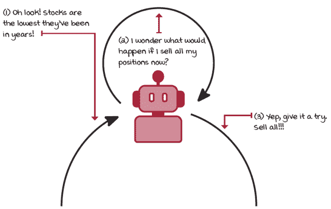

深度强化学习代理将会探索！你能承担错误吗？

你还需要考虑你的代理将如何探索其环境。例如，大多数基于价值的方 法通过随机选择动作来探索。但其他方法可以拥有更具有战略性的探索策略。现在，每种方法都有其优缺点，这是你必须熟悉的权衡。

最后，每次从头开始训练可能会令人畏惧、耗时且资源密集。然而，有几个领域研究如何利用先前获得的知识。首先，有**迁移学习**，这是关于将任务中获得的知 识转移到新的任务上。例如，如果你想教机器人使用锤子和螺丝刀，你可以重用“拿起锤子”任务中学习到的低级动作，并将这些知识应用到开始学习“拿起螺丝刀”的任务中。这对你来说应该是有直觉意义的，因为人类在学习新任务时不必每次都重新学习低级动作。人类似乎在学习过程中形成了动作的层次结构。*分层强化学习*领域试图在 DRL 代理中复制这一点。

### 深度强化学习的优势

DRL 是关于掌握特定任务。与旨在实现泛化的 SL 不同，RL 擅长具体、明确指定的任务。例如，每个 Atari 游戏都有一个特定的任务。DRL 代理不擅长在不同任务之间泛化行为；并不是因为训练了一个代理来玩 Pong，这个代理也能玩 Breakout。如果你天真地试图同时教你的代理 Pong 和 Breakout，你很可能会得到一个在两者上都不擅长的代理。另一方面，SL 在同时分类多个对象方面相当出色。重点是 DRL 的优势在于定义明确的单一任务。

在 DRL 中，我们使用泛化技术直接从原始感官输入中学习简单技能。泛化技术的性能、新的技巧和技巧、以及训练更深网络等，是我们近年来看到的一些主要改进。幸运的是，大多数 DL 的进步直接为 DRL 开辟了新的研究途径。

### 深度强化学习的弱点

当然，DRL 并不完美。你将发现的最显著问题是，在大多数问题中，代理需要数百万个样本才能学习到良好的策略。另一方面，人类可以从几次交互中学习。样本效率可能是 DRL 需要改进的顶级领域之一。我们将在几个章节中涉及这个话题，因为它是一个关键问题。

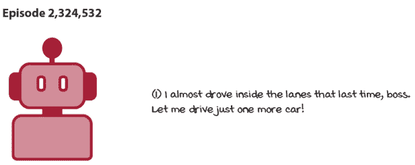

深度强化学习代理需要大量的交互样本！

DRL 的另一个问题是奖励函数和了解奖励的意义。如果人类专家将为代理定义其试图最大化的奖励，这意味着我们某种程度上“监督”了这个代理吗？这是好事吗？奖励应该尽可能密集，使学习更快，还是尽可能稀疏，使解决方案更令人兴奋和独特？

我们人类似乎并没有明确地定义奖励。通常，同一个人可以通过改变他们的观点，将一个事件视为积极或消极。此外，为像走路这样的任务设计奖励函数并不简单。我们应该针对的是前进的运动，还是不是跌倒？什么是人类行走的“完美”奖励函数？！

关于奖励信号的研究正在进行中，其中一项我特别感兴趣的是称为*内在动机*。内在动机允许代理仅仅出于好奇探索新的动作。使用内在动机的代理在稀疏奖励的环境中表现出改进的学习性能，这意味着我们可以保持令人兴奋和独特的解决方案。关键是如果你试图解决一个尚未建模或没有明确奖励函数的任务，你会面临挑战。

## 明确的双向期望

让我们接下来谈谈另一个重要的观点。接下来可以期待什么？坦白说，对我来说，这非常重要。首先，我想让你知道你可以从这本书中期待什么，这样就不会有后续的惊喜。我不想让人们认为，通过这本书，他们能够想出一个能让他们致富的交易代理。抱歉，如果这很简单，我就不会写这本书。我也期待那些想要学习的人投入必要的工作。事实上，学习将来自于我努力使概念易于理解，以及你努力去理解它们。我确实付出了努力。但是，如果你决定跳过一个你认为不必要的框，我们都会失去。

### 从这本书中可以期待什么？

我写这本书的目标是带你，一个机器学习爱好者，从没有任何深度强化学习经验到能够开发最先进的深度强化学习算法。为此，本书分为大约两部分。在第三章到第七章，你将学习能够从顺序和评估反馈中学习的代理，首先在孤立状态下，然后在相互作用中。在第八章到第十二章，你将深入研究核心的深度强化学习算法、方法和技巧。第一章和第二章是适用于深度强化学习的一般概念介绍，第十三章有总结性评论。

我对第一部分（第三章到第七章）的目标是让你理解“表格”强化学习。也就是说，可以彻底抽样的强化学习问题，其中不需要神经网络或任何类型的函数逼近。第三章是关于强化学习的顺序方面和时间信用分配问题。然后，我们将在第四章中单独研究从评估反馈中学习以及探索与利用之间的权衡。最后，你将学习可以同时处理这两个挑战的方法。在第五章，你研究学习估计固定行为结果的代理。第六章处理学习改进行为，第七章展示了使强化学习更有效率和高效的技巧。

我对第二部分（第八章到第十二章）的目标是让你掌握核心深度强化学习算法的细节。我们将深入探讨细节；你可以确信这一点。你将了解许多不同类型的代理，从基于价值和策略的到演员-评论家方法。在第八章到第十章，我们将深入研究基于价值的深度强化学习。在第十一章，你将学习基于策略的深度强化学习和演员-评论家，第十二章是关于确定性策略梯度（DPG）方法、软演员-评论家（SAC）和近端策略优化（PPO）方法。

这些章节中的示例在相同类型的代理之间重复出现，以便更方便地比较和对比代理。你仍然探索根本不同类型的问题，从小型连续到基于图像的状态空间，以及从离散到连续的动作空间。但，本书的重点不是关于建模问题，这是它自己的技能；相反，重点是解决已经建模的环境。

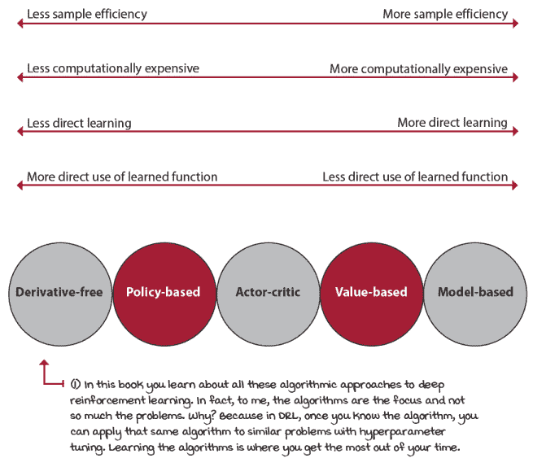

深度强化学习中不同算法方法的比较

### 如何充分利用这本书

为了深入理解强化学习，你需要带来一些东西。你需要具备一些机器学习和深度学习的基本知识。你需要熟悉 Python 代码和简单的数学。最重要的是，你必须愿意投入努力。

我假设读者对机器学习（ML）有扎实的理论基础。你应该知道机器学习是什么，而不仅仅是本章所涵盖的内容；你应该知道如何训练简单的监督学习（SL）模型，比如 Iris 或 Titanic 数据集；你应该熟悉深度学习（DL）的概念，如张量和矩阵；你应该至少训练过一个深度学习模型，比如在 MNIST 数据集上训练一个卷积神经网络（CNN）。

本书专注于强化学习（DRL）主题，其中并没有孤立的学习深度学习（DL）。外面有许多有用的资源你可以利用。但再次强调，你需要有基本的理解；如果你之前训练过卷积神经网络（CNN），那么你没问题。否则，我强烈建议你在开始阅读本书的第二部分之前，先跟随几个深度学习（DL）教程。

我还假设读者对 Python 代码比较熟悉。Python 是一种相对清晰的编程语言，易于理解，不熟悉它的人往往只需阅读就能有所收获。现在，我的观点是，你应该感到*舒适*，愿意并期待阅读代码。如果你不阅读代码，你将错过很多东西。

同样，这本书中有很多数学公式，这也是一件好事。数学是完美的语言，没有任何东西可以取代它。然而，我要求人们能够适应数学，愿意阅读，仅此而已。我展示的公式都有大量的注释，以便那些“不热衷于数学”的人也能利用这些资源。

最后，我假设你愿意付出努力。我的意思是，你真的想学习深度强化学习（DRL）。如果你决定跳过数学框、Python 代码片段、某个部分、一页、一章，或者任何其他内容，你将错过很多相关信息。为了最大限度地利用这本书，我建议你从头到尾阅读整本书。由于格式不同，图表和侧边栏是本书主要叙述的一部分。

此外，请确保运行本书的源代码（下一节将提供更多关于如何操作的细节），并尝试扩展你发现最有趣的代码。

### 深度强化学习开发环境

除了这本书，你还提供了一个完全测试的环境和代码来重现我的结果。我创建了一个 Docker 镜像和几个 Jupyter 笔记本，这样你就不必费心安装包和配置软件，或者复制粘贴代码。唯一的前提是 Docker。请按照[`github.com/mimoralea/gdrl`](https://github.com/mimoralea/gdrl)上的说明运行代码。这相当直接。

代码是用 Python 编写的，我大量使用了 NumPy 和 PyTorch。我选择 PyTorch 而不是 Keras 或 TensorFlow，因为我发现 PyTorch 是一个“Pythonic”库。如果你使用过 NumPy，使用 PyTorch 会感觉自然，而像 TensorFlow 这样的库则感觉像是一个全新的编程范式。现在，我的意图并不是开始一场“PyTorch 与 TensorFlow”的辩论。但根据我使用这两个库的经验，PyTorch 是一个更适合研究和教学的库。

深度强化学习（DRL）涉及算法、方法、技术、技巧等等，因此我们重写 NumPy 或 PyTorch 库是没有意义的。但在这本书中，我们从头开始编写 DRL 算法；我不是教你如何使用深度强化学习库，如 Keras-RL、Baselines 或 RLlib。我想让你学习深度强化学习，因此我们编写了 DRL 代码。在我教授强化学习的这些年里，我发现编写强化学习代码的人更有可能理解强化学习。现在，这本书也不是关于 PyTorch 的；没有单独的 PyTorch 回顾或类似的内容，只是随着我们的进展，我会解释我使用的 PyTorch 代码。如果你对深度学习概念有些熟悉，你将能够跟随这本书中使用的 PyTorch 代码。不用担心，在你到达这本书之前，你不需要单独的 PyTorch 资源。随着我们的进展，我会详细解释一切。

至于我们用于训练代理的环境，我们使用流行的 OpenAI Gym 软件包以及我为这本书开发的一些其他库。但我们也不会深入探讨 Gym 的细节。只需知道 Gym 是一个提供强化学习代理训练环境的库。除此之外，记住我们的重点是强化学习算法，解决方案，而不是环境或建模问题，这些不用说也是至关重要的。

由于你应该熟悉深度学习（DL），我假设你知道什么是图形处理单元（GPU）。深度强化学习（DRL）架构不需要像深度学习模型那样常见的计算水平。因此，虽然使用 GPU 是个好主意，但并非必需。相反，与深度学习模型不同，一些深度强化学习代理（agent）大量使用中央处理单元（CPU）和线程数。如果你打算投资购买机器，确保考虑到 CPU 的功率（好吧，技术上讲，是核心数，而不是速度）。正如你稍后将会看到的，某些算法会大规模并行化处理，在这种情况下，成为瓶颈的是 CPU，而不是 GPU。然而，代码在容器中运行良好，无论你的 CPU 或 GPU 如何。但是，如果你的硬件非常有限，我建议检查一下云平台。我见过一些服务，例如 Google Colab，提供免费的深度学习硬件。

## 摘要

深度强化学习具有挑战性，因为智能体必须从同时具有顺序性、评价性和样本性的反馈中学习。从顺序性反馈中学习迫使智能体学习如何平衡短期和长期目标。从评价性反馈中学习使智能体学会平衡信息的收集和利用。从样本性反馈中学习迫使智能体从旧经验推广到新经验。

人工智能，强化学习所属的计算机科学主要领域，是一门致力于创建显示类似人类智能的计算机程序的学科。这个目标与其他许多学科，如控制理论和运筹学，是共享的。机器学习是人工智能中最受欢迎和最成功的方法之一。强化学习是机器学习的三个分支之一，与监督学习和无监督学习并列。深度学习作为一种机器学习方法，与任何特定分支无关，但其力量有助于推动整个机器学习社区的发展。

深度强化学习是使用多层强大的函数逼近器，即神经网络（深度学习），在不确定性下解决复杂顺序决策问题的方法。深度强化学习在许多控制问题中表现良好，但无论如何，我们必须牢记，对于关键决策，释放人类控制不应被轻视。深度强化学习的核心需求包括具有更好样本复杂度的算法、性能更好的探索策略和安全的算法。

尽管如此，深度强化学习的未来光明，随着技术的成熟，也许会面临一些危险，但更重要的是，这个领域具有潜力，你应该感到兴奋并感到有必要发挥你的最佳水平，踏上这段旅程。成为这样一场巨大变革的一部分的机会，每隔几代人才能出现一次。你应该为生活在这样的时代而感到高兴。现在，让我们成为其中的一员。

到现在为止，你已经

+   理解了深度强化学习是什么以及它与其他机器学习方法相比如何

+   意识到深度强化学习领域的最新进展，并直观地理解它具有应用于广泛问题的潜力

+   对这本书的内容有所了解，并知道如何从中获得最大收益

|  | 在自己的工作上努力并分享你的发现 |
| --- | --- |

|  | 每章结束时，我会提供几个想法，告诉你如何将所学内容提升到下一个层次。如果你愿意，可以将你的结果与世界分享，并确保查看其他人所做的事情。这是一个双赢的局面，希望你能充分利用它。

+   **#gdrl_ch01_tf01:** 监督学习、无监督学习和强化学习是机器学习的三大重要分支。虽然了解它们之间的区别至关重要，但同样重要的是了解它们之间的相似之处。写一篇分析这些不同方法如何比较以及如何将它们结合起来解决人工智能问题的文章。所有分支都追求同一个目标：创造通用人工智能，对我们所有人来说，更好地理解如何使用可用的工具至关重要。

+   **#gdrl_ch01_tf02:** 如果你没有机器学习或计算机科学背景，但对这本书提供的内容感兴趣，这并不会让我感到惊讶。一个重要的贡献是发布来自研究决策的其他领域的资源。你有运筹学背景吗？心理学、哲学或神经科学背景？控制理论？经济学？你为什么不创建一个资源列表、博客文章、YouTube 视频书籍或其他任何形式的列表，并与我们这些也在研究决策的人分享呢？

+   **#gdrl_ch01_tf03:** 本章的部分文本通过图形、表格和其他形式可以更好地解释。例如，我谈到了不同类型的强化学习代理（基于价值的、基于策略的、演员-评论家、基于模型的、无梯度）。你为什么不抓取密集的文本，提炼知识，并将你的总结与世界分享呢？

+   **#gdrl_ch01_tf04:** 在每一章中，我都在使用最后一个标签作为通用的标签。请随意使用这个标签来讨论与本章相关的任何其他内容。没有比为自己创造作业更令人兴奋的了。确保分享你打算调查的内容和你的结果。

用你的发现写一条推文，@mimoralea（我会转发），并使用此列表中的特定标签来帮助感兴趣的人找到你的结果。没有正确或错误的结果；你分享你的发现并检查他人的发现。利用这个机会社交、贡献并让自己脱颖而出！我们正在等待你！以下是一条推文示例：“嘿，@mimoralea。我创建了一篇博客文章，列出了学习深度强化学习的资源。查看链接：<link> #gdrl_ch01_tf01”。我会确保转发并帮助他人找到你的作品。|
