# 2 强化学习的数学基础

在本章中

+   你将了解强化学习的核心组件。

+   你将学会使用称为马尔可夫决策过程的数学框架，将顺序决策问题表示为强化学习环境。

+   你将从头开始构建环境，强化学习代理将在后续章节中学习解决这些环境。

人类的历史一直是在与恶劣环境的斗争中。我们最终达到了一个可以开始主宰我们环境的阶段。 ... 一旦我们理解了这个事实，我们的数学兴趣必然会在许多领域从描述性分析转向控制理论。

— 理查德·贝尔曼 美国应用数学家，IEEE 荣誉奖章获得者

你拿起这本书，尽管时间有限，还是决定再读一章。教练在今晚的比赛中将最佳球员放在板凳上，无视媒体的批评。一位家长投入大量时间和耐心，教孩子良好的行为举止。这些都是不确定情况下复杂顺序决策的例子。

我想提醒大家这个短语中的一些关键词：不确定情况下的复杂顺序决策。第一个词，*复杂*，指的是代理可能在具有广阔*动作空间*的环境中学习。在教练的例子中，即使你发现你的最佳球员需要时不时地休息，也许在与特定对手的比赛中休息他们比与其他对手更好。由于我们是从样本反馈中学习的，因此学会准确泛化是具有挑战性的。

我使用的第二个词是 *顺序*，这个词指的是在许多问题中，存在延迟的后果。在教练的例子中，再次，假设教练在赛季中途的一场比赛中让最佳球员休息，看似无关紧要。但是，如果休息球员的行动降低了他们的士气和表现，这种影响仅在决赛中显现出来？换句话说，如果实际后果是延迟的？事实上，由于我们是从顺序反馈中学习的，因此为过去的决策分配信用是具有挑战性的。

最后，词 *不确定性* 指的是我们不知道世界的实际运作方式，以了解我们的行动如何影响它；一切都被留给了我们的解释。假设教练确实让最佳球员休息，但他们下一场比赛受伤了。是休息的决定导致球员受伤，因为球员变得不健康吗？如果伤病在整个赛季中成为团队的动力，并且球队最终赢得了决赛？再次，休息是正确的决定吗？这种不确定性引发了探索的需求。在探索和利用之间找到适当的平衡是具有挑战性的，因为我们是从评估反馈中学习的。

在本章中，你将学习如何使用一种称为马尔可夫决策过程（MDPs）的数学框架来表示这类问题。MDPs 的一般框架使我们能够以 RL 代理可以与之交互并仅通过经验学习解决的方式，在不确定性下对几乎任何复杂的顺序决策问题进行建模。

在第三章中，我们将深入探讨从顺序反馈中学习的挑战，然后在第四章中探讨从评估反馈中学习的挑战，接着在第五章到第七章中探讨同时从顺序和评估反馈中学习的挑战，最后在第八章到第十二章中，我们将把复杂性加入其中。

## 强化学习组件

强化学习中的两个核心组件是*代理*和*环境*。代理是决策者，是问题的解决方案。环境是问题的表示。强化学习与其他机器学习方法的根本区别之一是代理和环境之间的交互；代理试图通过行动影响环境，而环境则对代理的行动做出反应。

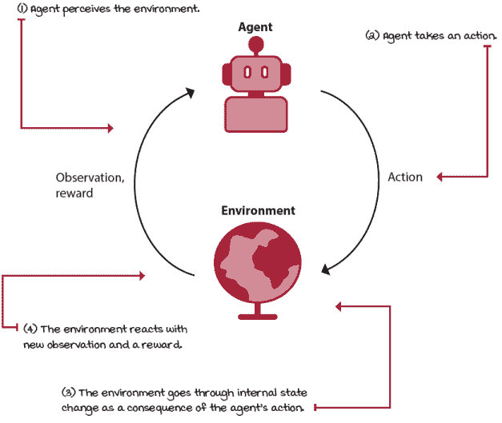

强化学习-交互循环

|  | 米格尔的类比故事：中国农民的寓言 |
| --- | --- |
|  | 有一个很好的寓言，说明了同时具有顺序性、评价性和样本性的反馈是多么难以解读。这个寓言是这样的：一位中国农民得到了一匹马，不久后马跑了。邻居说：“哎呀，真伤心。这是个坏消息。”农民回答说：“好消息，坏消息，谁能说呢？”马又回来了，还带来了一匹马。邻居说：“真幸运。这是个好消息。”农民回答说：“好消息，坏消息，谁能说呢？”农民把第二匹马给了他的儿子，儿子骑马，然后摔了下来，严重摔断了腿。邻居说：“为你的儿子感到抱歉。这绝对是坏消息。”农民回答说：“好消息，坏消息，谁能说呢？”大约一周后，皇帝的人来了，把所有健康的年轻人带走参加战争。农民的儿子被免除了。所以，是好消息还是坏消息？谁能说呢？有趣的故事，对吧？在生活中，确定事件和我们的行为的长期后果是具有挑战性的。我们常常发现不幸导致了我们后来的好运，或者好运导致了我们后来的不幸。尽管这个故事可以解释为“美在心中”，但在强化学习中，我们假设我们采取的行动和世界发生的事情之间存在相关性。只是这些关系如此复杂，以至于人类很难确定地连接这些点。但也许这正是计算机可以帮助我们弄清楚的事情。兴奋，对吧？记住，当反馈同时具有评价性、顺序性和样本性时，学习是一个难题。而深度强化学习是解决这类问题的计算方法。欢迎来到深度强化学习的世界！ |

### 问题、代理和环境的示例

以下是对 RL 问题、代理、环境、可能动作和观察的简略示例：

+   **问题**：你正在训练你的狗坐下。代理：做出决策的大脑部分。**环境**：你的狗、奖励、狗的爪子、吵闹的邻居等等。**动作**：和你的狗说话。等待狗的反应。移动你的手。展示奖励。给予奖励。抚摸。**观察**：你的狗正在注意你。你的狗感到疲倦。你的狗正在离开。你的狗按照命令坐下。

+   **问题**：你的狗想要你手中的奖励。**代理**：做出决策的狗脑部分。**环境**：你、奖励、狗的爪子、吵闹的邻居等等。**动作**：盯着主人看。吠叫。跳向主人。试图偷奖励。跑。坐下。**观察**：主人一直在大声对狗说话。主人正在展示奖励。主人正在隐藏奖励。主人给了狗奖励。

+   **问题**：一个投资股市的交易代理。**代理**：内存和 CPU 中执行的 DRL 代码。**环境**：你的互联网连接，代码运行的机器，股价，地缘政治不确定性，其他投资者，日交易者等等。**动作**：卖出*y*公司的*n*股。买入*y*公司的*n*股。持有。**观察**：市场正在上涨。市场正在下跌。两个强国之间存在经济紧张。大陆有战争的危险。全球大流行正在整个世界造成破坏。

+   **问题** 你正在开车。**代理**：你大脑中做出决策的部分。**环境**：你的汽车的品牌和型号，其他汽车，其他司机，天气，道路，轮胎等等。**动作**：通过*x*转向，通过*y*加速。通过*z*刹车。打开前灯。除雾窗户。播放音乐。**观察**：你正在接近目的地。Main Street 上交通堵塞。旁边的车正在鲁莽驾驶。开始下雨了。前面有警察在开车。

正如你所见，问题可以采取多种形式：从需要长期思考和广泛一般知识的高级决策问题，例如投资股市，到低级控制问题，其中地缘政治紧张似乎没有直接作用，例如开车。

此外，你也可以从多个代理的角度来表示一个问题。在狗训练的例子中，实际上有两个代理，每个代理都感兴趣于不同的目标，并试图解决不同的问题。

让我们独立地深入探讨每个组件。

### 代理：决策者

正如我在第一章中提到的，这本书的整个内容都是关于代理的，除了这一章是关于环境的。从第三章开始，你将深入挖掘代理的内部运作、它们的组件、过程以及创建有效且高效的代理的技术。

目前，你需要了解关于代理的唯一重要的事情是，他们是强化学习大图景中的决策者。他们有自己内部的组件和过程，这就是使每个代理都独特并且擅长解决特定问题的原因。

如果我们放大来看，我们会发现大多数代理都有一个三步过程：所有代理都有一个交互组件，用于收集学习数据；所有代理都会评估他们的当前行为；所有代理都会在他们的内部组件中改进某些东西，这使他们能够改进（或者至少尝试改进）他们的整体表现。

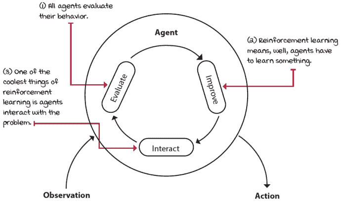

每个强化学习代理都会经历的三步内部过程

我们将在下一章继续讨论代理的内部运作。现在，让我们讨论一种表示环境的方法，它们看起来如何，以及我们应该如何建模它们，这是本章的目标。

### 环境：其他所有事物

大多数现实世界的决策问题都可以表达为强化学习环境。在强化学习中表示决策过程的一种常见方式是使用一种称为马尔可夫决策过程（MDPs）的数学框架来建模问题。在强化学习中，我们假设所有环境都在底层运行着 MDP。无论是 Atari 游戏、股市、自动驾驶汽车、你的另一半，还是其他任何问题，每个问题都在底层运行着 MDP（至少在强化学习世界中是这样，无论是对是错）。

环境由与问题相关的变量集表示。这个变量集可以取的所有可能值的组合被称为*状态空间*。状态是在任何给定时间变量所取的特定值集。

代理可能无法访问实际环境的真实状态；然而，无论如何，代理都可以从环境中观察到某些东西。代理在任何给定时间感知到的变量集被称为*观测*。

这些变量可以取的所有可能值的组合是*观测空间*。要知道在强化学习社区中，状态和观测是可互换使用的术语。这是因为通常代理被允许看到环境的内部状态，但这并不总是如此。在这本书中，我也将状态和观测互换使用。但你需要知道，尽管强化学习社区经常互换使用这些术语，状态和观测之间可能存在差异。

在每个状态，环境都会提供一组代理可以选择的动作。通常，动作集与*动作空间*相同。

代理试图通过这些动作影响环境。环境可能会根据代理的动作改变状态。负责这种转换的函数被称为*转换函数*。

在转换之后，环境会发出一个新的观测。环境还可能提供一个奖励信号作为响应。负责这种映射的函数被称为*奖励函数*。转换和奖励函数的集合被称为环境的*模型*。

|  | 具体示例：老虎机漫步环境 |
| --- | --- |
|  | 让我们通过第一个强化学习环境来具体化这些概念。我为这本书创建了一个非常简单的环境；我称之为“老虎机漫步”（BW）。BW 是一个简单的**网格世界**（GW）环境。GWs 是研究强化学习算法的常见环境类型，它们是任何大小的网格。GWs 可以有任何你想象得到的模型（转换和奖励函数），并且可以提供任何类型的动作。但是，它们通常都为智能体提供移动动作：左、下、右、上（或西、南、东、北，这更精确，因为智能体没有方向，通常也没有对整个网格的可见性，但基本方向也可能更令人困惑）。当然，每个动作都对应其逻辑转换：左移动到左边，右移动到右边。此外，它们通常都有一个完全可观察的离散状态和观察空间（即状态等于观察），用整数表示智能体的单元格 ID 位置。一个“漫步”是网格世界环境的一个特殊情况，只有一个行。实际上，我所说的“漫步”更常见地被称为“走廊”。但在本书中，我使用“漫步”一词来指代所有只有一个行的网格世界环境。“老虎机漫步”（BW）是一个有三个状态的环境，但只有一个非终止状态。只有一个非终止状态的环境被称为“老虎机”环境。“老虎机”在这里是类比于老虎机，也称为“单臂老虎机”；它们有一个臂，如果你喜欢赌博，可以让你口袋空空，就像一个**强盗**一样。BW 环境只有两个动作可用：一个**右**。奖励信号是在落在最右侧单元格时为+1，否则为 0。智能体从中间单元格开始。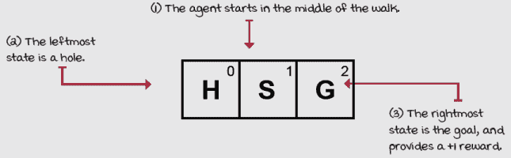 |

BW 环境的图形表示如下。

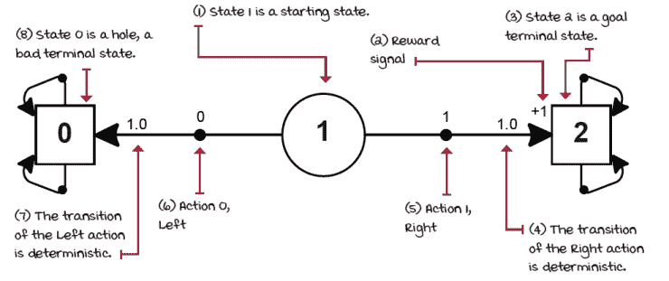

老虎机漫步图

我希望这能引发一些问题，但你会发现答案贯穿整章。例如，为什么终止状态有转换到自身的动作：这似乎是浪费的，不是吗？还有其他问题吗？比如，如果环境是随机的呢？一个“随机”的环境究竟是什么？！继续阅读。

我们也可以用表格形式表示这个环境。

| 状态 | 动作 | 下一个状态 | 转换概率 | 奖励信号 |
| --- | --- | --- | --- | --- |
| 0 (洞) | 0 (左) | 0 (洞) | 1.0 | 0 |
| 0 (洞) | 1 (右) | 0 (洞) | 1.0 | 0 |
| 1 (开始) | 0 (左) | 0 (洞) | 1.0 | 0 |
| 1 (开始) | 1 (右) | 2 (目标) | 1.0 | +1 |
| 2 (目标) | 0 (左) | 2 (目标) | 1.0 | 0 |
| 2 (目标) | 1 (右) | 2 (目标) | 1.0 | 0 |

有趣，对吧？让我们看看另一个简单的例子。

|  | 一个具体的例子老虎机滑动漫步环境 |
| --- | --- |
|  | 好的，那么我们如何使这个环境变得随机呢？假设步行的表面是滑的，每个动作有 20%的概率将代理送回。我把这个环境称为老虎机滑动步走（BSW）。BSW 仍然是一个单行网格世界，一条步行道，只有左和右的动作可用。再次强调，三个状态和两个动作。奖励与之前相同，*（来自自身），否则为零。然而，转移函数不同：80%的时间代理移动到目标单元格，20%的时间移动到相反方向。这个环境的描述如下。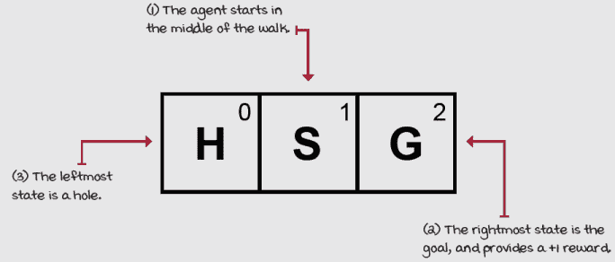老虎机滑动步走（BSW）环境与 BW 环境相同！有趣的是……我们如何知道动作效果是随机的？我们如何表示这个问题的“滑”的部分？表格表示可以帮助我们做到这一点。 |

bSW 环境的图形表示如下。

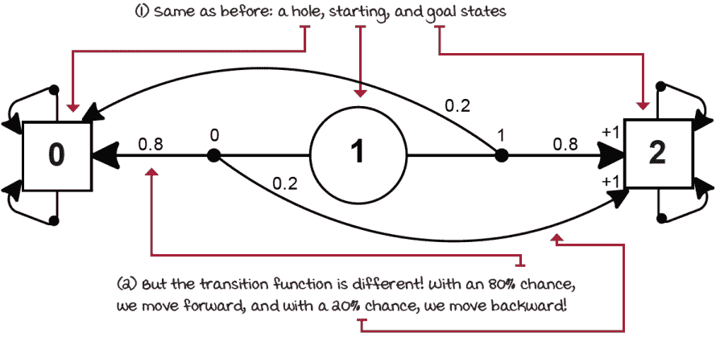

老虎机滑动步走图

看看现在的转移函数有何不同？BSW 环境有一个随机的转移函数。现在让我们也以表格形式表示这个环境。

| 状态 | 动作 | 下一个状态 | 转移概率 | 奖励信号 |
| --- | --- | --- | --- | --- |
| 0 (洞) | 0 (左) | 0 (洞) | 1.0 | 0 |
| 0 (洞) | 1 (右) | 0 (洞) | 1.0 | 0 |
| 1 (开始) | 0 (左) | 0 (洞) | 0.8 | 0 |
| 1 (开始) | 0 (左) | 2 (目标) | 0.2 | +1 |
| 1 (开始) | 1 (右) | 2 (目标) | 0.8 | +1 |
| 1 (开始) | 1 (右) | 0 (洞) | 0.2 | 0 |
| 2 (目标) | 0 (左) | 2 (目标) | 1.0 | 0 |
| 2 (目标) | 1 (右) | 2 (目标) | 1.0 | 0 |

此外，我们不必局限于思考具有离散状态和动作空间的环境，甚至包括走廊（我们将在下一章深入讨论）或老虎机（BSW 环境），或者网格世界。将环境表示为马尔可夫决策过程（MDP）是一种出人意料强大且直接的方法，用于在不确定性下建模复杂的顺序决策问题。

这里有一些由底层 MDP 驱动的环境的更多示例。

| 描述 | 观察空间 | 样本观察 | 动作空间 | 样本动作 | 奖励函数 |
| --- | --- | --- | --- | --- | --- |
| **更热，更冷**：使用提示猜测随机选择的数字。 | 整数范围 0–3.0 表示尚未提交猜测，1 表示猜测低于目标，2 表示猜测等于目标，3 表示猜测高于目标。 | 2 | 浮点数从–2000.0–2000.0。代理猜测的浮点数。 | –909.37 | 奖励是代理猜测距离目标的平方百分比。 |
| **倒立摆**：在车上保持杆的平衡。 | 一个包含四个元素的向量，范围从 [–4.8, –Inf, –4.2, –Inf] 到 [4.8, Inf, 4.2, Inf]。第一个元素是车的位置，第二个是车的速度，第三个是杆的弧度角，第四个是杆尖的速度。 | [–0.16, –1.61, 0.17, 2.44] | 整数范围 0–1.0 表示向左推车，1 表示向右推车。 | 0 | 每走一步（包括终止步）的奖励是 1。 |
| **月球着陆器**：将着陆器导航到着陆平台。 | 一个包含八个元素的向量，范围从 [–Inf, –Inf, –Inf, –Inf, –Inf, –Inf, 0, 0] 到 [Inf, Inf, Inf, Inf, Inf, Inf, 1, 1]。第一个元素是 x 位置，第二个是 y 位置，第三个是 x 速度，第四个是 y 速度，第五个是车辆的角度，第六个是角速度，最后两个值是布尔值，表示腿与地面的接触。 | [0.36 , 0.23, –0.63, –0.10, –0.97, –1.73, 1.0, 0.0] | 整数范围 0–3。No-op（什么都不做），点火左引擎，点火主引擎，点火右引擎。 | 2 | 着陆的奖励是 200。从顶部移动到着陆平台、碰撞或静止、每个腿接触地面以及点火引擎都会有奖励。 |
| **Pong**：将球击过对手，并避免让球通过你。 | 一个形状为 210, 160, 3 的张量。值从 0–255。表示游戏屏幕图像。 | [[[246, 217, 64], [ 55, 184, 230], [ 46, 231, 179], ..., [ 28, 104, 249], [ 25, 5, 22], [173, 186, 1]], ...]] | 整数范围 0–5。动作 0 是 No-op，1 是开火，2 是向上，3 是向右，4 是向左，5 是向下。注意有些动作根本不影响游戏。实际上，桨只能上下移动，或者不移动。 | 3 | 当球越过对手时，奖励是 1，当你的代理的桨错过球时，奖励是 –1。 |
| **人形机器人**：让机器人尽可能快地跑，并且不摔倒。 | 一个包含 44 个元素（或更多，取决于实现）的向量。值从 –Inf 到 Inf。表示机器人关节的位置和速度。 | [0.6, 0.08, 0.9, 0\. 0, 0.0, 0.0, 0.0, 0.0, 0.045, 0.0, 0.47, ... , 0.32, 0.0, –0.22, ... , 0.] | 一个包含 17 个元素的向量。值从 –Inf 到 Inf。表示施加到机器人关节的力。 | [–0.9, –0.06, 0.6, 0.6, 0.6, –0.06, –0.4, –0.9, 0.5, –0.2, 0.7, –0.9, 0.4, –0.8, –0.1, 0.8, –0.03] | 奖励基于前进运动，并带有轻微的惩罚以鼓励自然步态。 |

注意我没有将转换函数添加到这个表中。这是因为，虽然你可以查看实现某些环境动态的代码，但其他实现并不容易访问。例如，倒立摆环境的转换函数是一个小的 Python 文件，定义了车的质量和杆，并实现了基本的物理方程，而像 Pong 这样的 Atari 游戏的动态则隐藏在一个 Atari 模拟器和相应的游戏特定 ROM 文件中。

注意，我们在这里试图表示的是环境以某种方式“反应”智能体的行动，甚至可能忽略智能体的行动。但最终，有一个内部过程是不确定的（除了本章和下一章）。为了在马尔可夫决策过程（MDP）中表示与环境交互的能力，我们需要状态、观察、行动、转移和奖励函数。

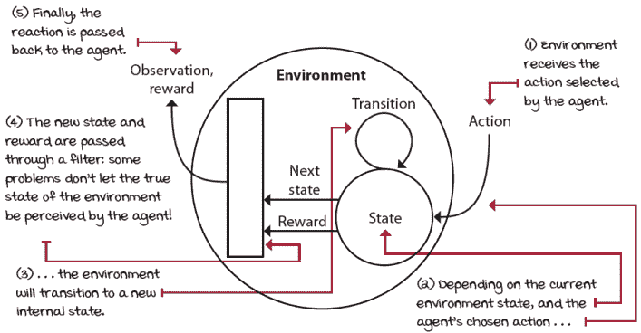

环境处理过程是智能体行动的结果

### 智能体-环境交互周期

环境通常有一个定义良好的任务。这个任务的目标是通过奖励信号来定义的。奖励信号可以是密集的、稀疏的或介于两者之间。当你设计环境时，奖励信号是训练你的智能体的方式。越密集，智能体将获得更多的监督，学习速度越快，但你会向智能体注入更多的偏差，智能体出现意外行为的可能性就越小。越稀疏，监督越少，因此，出现新的、新兴行为的机会就越高，但智能体学习的时间就会更长。

智能体与环境之间的交互会持续几个周期。每个周期被称为*时间步*。时间步是时间的单位，可以是毫秒、秒、1.2563 秒、分钟、一天或任何其他时间段。

在每个时间步，智能体观察环境，采取行动，并接收新的观察和奖励。请注意，尽管奖励可以是负值，但在强化学习领域，它们仍然被称为奖励。观察（或状态）、行动、奖励和新的观察（或新状态）的集合被称为*经验元组*。

智能体试图解决的问题可能有或没有自然的结束。有自然结束的任务，如游戏，被称为*周期性任务*。没有自然结束的任务，如学习前进运动，被称为*持续任务*。从周期性任务的开始到结束的时间步序列称为*周期*。智能体可能需要几个时间步和周期来学习解决任务。单个周期中收集到的奖励总和称为*回报*。智能体通常被设计成最大化回报。在持续任务中经常添加时间步限制，使它们成为周期性任务，智能体可以最大化回报。

每个经验元组都有学习和改进性能的机会。智能体可能有一到多个组件来辅助学习。智能体可能被设计成学习从观察到行动的映射，称为策略。智能体可能被设计成学习从观察到新的观察和/或奖励的映射，称为模型。智能体可能被设计成学习从观察（和可能的行动）到奖励到估计（回报的一部分）的映射，称为价值函数。

在本章的剩余部分，我们将暂时放下智能体和交互，深入探讨环境和内部 MDP。在第三章中，我们将重新引入智能体，但会有*用于学习的神经网络*。

## MDPs：环境的引擎

让我们在了解构成它们的组件时，为几个环境构建马尔可夫决策过程（MDPs）。我们将创建代表 MDPs 的 Python 字典，这些字典来自对问题的描述。在下一章中，我们将研究在 MDPs 上规划算法。这些方法可以设计出 MDPs 的解决方案，并使我们能够找到本章中所有问题的最优解。

能够自己构建环境是一项重要的技能。然而，你经常会发现别人已经为某些环境创建了 MDP。此外，环境的动态通常隐藏在模拟引擎背后，过于复杂，无法详细检查；某些动态甚至无法访问，隐藏在现实世界背后。实际上，强化学习智能体不需要知道问题的精确 MDP 来学习鲁棒的行为，但了解*你*，因为智能体通常设计时假设即使无法访问，MDP 也在幕后运行。

|  | 一个具体示例：冰冻湖环境 |
| --- | --- |
|  | 这是另一个更具挑战性的问题，我们将在本章中为它构建一个 MDP。这个环境被称为冰冻湖（FL）。FL 是一个简单的*离散状态和动作空间*。然而，这次有四种动作可供选择：向左移动、向下移动、向右移动或向上移动。在 FL 环境中的任务与 BW 和 BWS 环境中的任务相似：从起始位置移动到目标位置，同时避免掉入坑中。挑战与*bSW*相似，因为 FL 环境的表面很滑，毕竟它是一个冰冻湖。但环境本身更大。让我们看看 FL 的描述图。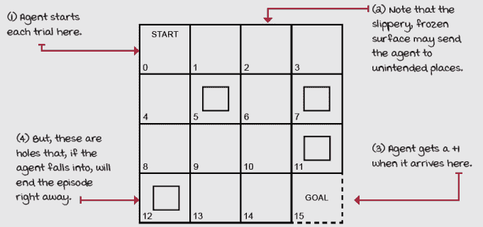冰冻湖（FL）环境 FL 是一个 4×4 的网格（它有 16 个单元格，id 为 0-15）。每个新剧集开始时，智能体都会出现在起始单元格中。到达目标单元格会得到+1 的奖励；其他任何情况都是 0。由于表面很滑，智能体的移动只有三分之一的预期效果。其他三分之二均匀地分布在正交方向上。例如，如果智能体选择向下移动，有 33.3%的概率它会向下移动，33.3%的概率它会向左移动，33.3%的概率它会向右移动。湖周围有一道栅栏，所以如果智能体试图离开网格世界，它会弹回到它试图移动的单元格。湖中有四个洞。如果智能体掉入其中一个洞，游戏就结束了。你准备好开始构建这些动态的表示了吗？我们需要一个 Python 字典来表示这里描述的 MDP。让我们开始构建 MDP。 |

### 状态：环境的特定配置

*状态*是问题的唯一且自包含的配置。所有可能状态的集合，即*状态空间*，定义为集合*s*。状态空间可以是有限的或无限的。但请注意，状态空间与组成单个状态的一组变量不同。这个其他集合必须始终是有限的，并且从状态到状态大小恒定。最终，状态空间是一组集合。内部集合必须大小相等且有限，因为它包含表示状态的变量的数量，但外部集合可以根据内部集合的元素类型是无限的。

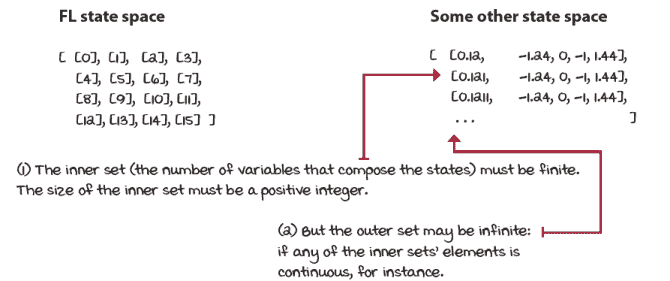

状态空间：一组集合

对于 BW、BSW 和 FL 环境，状态由一个包含代理在任意给定时间所在细胞 ID 的单个变量组成。代理的位置细胞 ID 是一个离散变量。但状态变量可以是任何类型，变量集可以大于一个。我们可以有一个欧几里得距离，这将是一个连续变量，并且状态空间是无限的；例如，2.124、2.12456、5.1、5.1239458 等等。我们也可以有多个变量定义状态，例如，x 轴和 y 轴上离目标多少个细胞。这将代表单个状态的两个变量。这两个变量都是离散的，因此状态空间是有限的。然而，我们也可以有混合类型的变量；例如，一个可以是离散的，另一个可以是连续的，另一个可以是布尔值。

对于 BW、BSW 和 FL 环境的状态表示，状态空间的大小分别为 3、3 和 16。给定我们有 3、3 或 16 个细胞，代理在任意给定时间可以处于任何状态，因此状态空间中有 3、3 和 16 种可能的状态。我们可以从零开始设置每个细胞的 ID，从左到右，从上到下。

在 FL 中，我们从零到 15 设置 ID，从左到右，从上到下。你可以以任何其他方式设置 ID：随机顺序，按邻近性分组细胞，或者任何其他方式。这取决于你；只要你在整个训练过程中保持一致，它就会工作。然而，这种表示是足够的，并且效果很好，所以我们将使用它。

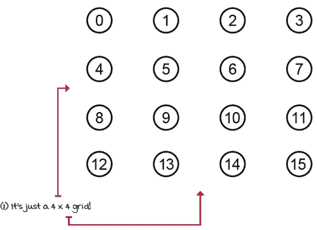

在 FL 中，状态包含一个变量，表示在任意给定时间步中代理所在的细胞 ID。

在 MDPs 的情况下，状态是完全可观察的：我们可以在每个时间步看到环境的内部状态，也就是说，观察和状态是相同的。*部分可观察马尔可夫决策过程*（POMDPs）是一个更通用的框架，用于建模环境，其中观察结果，仍然依赖于环境的内部状态，是代理唯一能看到的东西，而不是状态。请注意，对于 BW、BSW 和 FL 环境，我们正在创建一个 MDP，因此代理将能够观察到环境的内部状态。

状态必须包含所有必要的变量，使它们独立于所有其他状态。在 FL 环境中，你只需要知道智能体的当前状态，就可以告诉它的下一个可能状态。也就是说，你不需要智能体访问过的状态历史。你知道从状态 2，智能体只能转移到状态 1、3、6 或 2，而且这无论智能体的先前状态是 1、3、6 还是 2 都是正确的。

给定当前状态和动作，下一个状态的概率与交互历史无关。MDP 的这种无记忆特性被称为**马尔可夫性质**：在两次不同场合，给定相同的动作*a*，从状态*s*转移到另一个状态*s*的概率是相同的，无论之前遇到的所有状态或动作。

|  | 显示数学马尔可夫性质 |
| --- | --- |
|  | 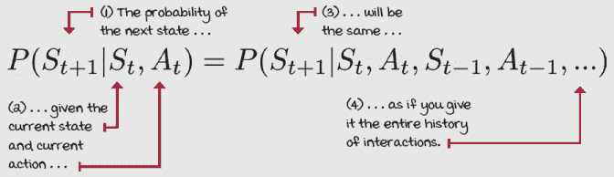 |

但你为什么关心这个？嗯，在我们已经探索的环境中，这并不明显，也不那么重要。但是，因为大多数 RL（和 DRL）智能体都是设计来利用马尔可夫假设的，你必须确保你向智能体提供必要的变量，使其尽可能紧密地保持（完全保持马尔可夫假设是不切实际的，也许是不可能的）。

例如，如果你正在设计一个学习如何着陆宇宙飞船的智能体，智能体必须接收所有表示速度的变量以及其位置。仅位置信息不足以安全着陆宇宙飞船，而且因为你必须假设智能体是无记忆的，所以你需要向智能体提供比仅其远离着陆点的 x、y、z 坐标更多的信息。

但是，你可能知道加速度是速度相对于位置导数的关系：导数。你可能也知道你可以继续对加速度求导。为了使 MDP 完全马尔可夫化，你需要求多深？这更多的是一种艺术而不是科学：你添加的变量越多，训练智能体所需的时间就越长，但变量越少，提供给智能体的信息不足的可能性就越高，学习任何有用的东西就越困难。对于宇宙飞船的例子，通常位置和速度是足够的，而对于网格世界环境，智能体的状态 id 位置就足够了。

MDP 中所有状态的集合用*si*表示，来自一个概率分布。这个分布可以是任何东西，但必须在整个训练过程中保持固定：也就是说，概率必须从训练的第一集到最后一集，以及对于智能体评估都是相同的。

有一个独特的状态称为*吸收状态*或*终端状态*，所有非终端状态的集合用*s*表示。现在，虽然通常的做法是创建一个单一的终端状态（一个汇状态），所有终端转换都指向它，但这并不总是这样实现的。你更常看到的是多个终端状态，这是可以的。在底层，如果你让所有终端状态都按预期行为，这实际上并不重要。

如预期的那样？是的。终端状态是一种特殊状态：它必须具有所有可用的动作，以概率 1 转换到自身，并且这些转换必须不提供任何奖励。请注意，我指的是从终端状态到终端状态的转换，而不是终端状态本身。

通常情况下，一个局部的结束会提供非零的奖励。例如，在一场棋局中，你可能赢、输或平局。一个逻辑上的奖励信号可以是+1、-1 和 0，分别对应赢、输和平局。但是，这是一个兼容性约定，允许所有算法收敛到相同的解决方案，使得所有动作在终端状态转换到自身时，概率为 1 且奖励为 0。否则，你可能会遇到无限和的问题，以及可能完全无法工作的算法。还记得 BW 和 BSW 环境中的这些终端状态吗？

例如，在 FL 环境中，只有一个起始状态（即状态 0）和五个终端状态（或者五个转换到单个终端状态的状态，根据你的喜好）。为了清晰起见，我在插图和代码中使用多个终端状态（5、7、11、12 和 15）的约定；再次强调，每个终端状态都是一个单独的终端状态。

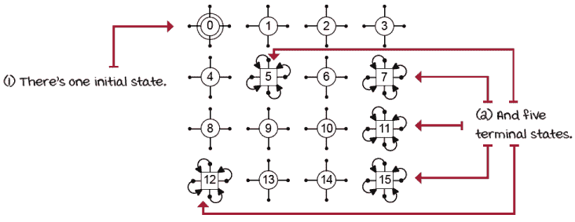

冰冻湖环境中的状态

### 动作：影响环境的一种机制

MDPs 提供了一组依赖于状态的行动 A。也就是说，可能存在在某个状态下不允许的动作——实际上，A 是一个以状态为参数的函数；即，A(s)。这个函数返回状态 s 的可用动作集合。如果需要，你可以定义这个集合在状态空间中是常数；即，在每一个状态下都有所有动作可用。你也可以将状态-动作对的所有转换设置为 0，如果你想在一个给定的状态下拒绝一个动作。你也可以将状态 s 和动作 a 的所有转换设置为相同的 s，以表示动作 a 是一个不干预或无操作动作。

就像状态一样，动作空间可能是有限的或无限的，单个动作的变量集合可能包含多个元素，并且必须是有限的。然而，与状态变量的数量不同，组成动作的变量数量可能不是恒定的。一个状态中可用的动作可能根据该状态而变化。为了简单起见，大多数环境都是设计为所有状态下动作数量相同。

环境提前知道所有可用的动作集合。智能体可以选择确定性或随机地选择动作。这与说环境对智能体的动作做出确定性或随机反应是不同的。这两个陈述都是真实的，但我在这里指的是智能体可以从查找表或每个状态的概率分布中选择动作。

在 BW、BSW 和 FL 环境中，动作是单例，表示智能体将尝试移动的方向。在 FL 中，所有状态下都有四个可用的动作：上、下、右或左。每个动作有一个变量，动作空间的大小是 4。

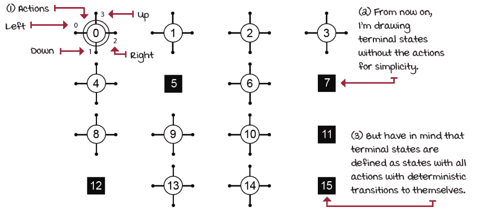

冰冻湖环境有四种简单的移动动作

### 转移函数：智能体动作的后果

环境对动作的反应方式被称为 *状态转移概率*，或者更简单地说，*转移函数*，用 *t(s, a, s')* 表示。转移函数 *t* 将一个转移元组 *s*，*a*，*s'* 映射到一个概率；也就是说，你传递一个状态 *s*，一个动作 *a* 和一个下一个状态 *s'*，它将返回采取动作 *a* 时从状态 *s* 转移到状态 *s'* 的对应概率。你也可以将其表示为 *t(s, a)*，并返回一个字典，其中键是下一个状态，值是概率。

注意，*t* 也描述了一个概率分布 *p( · | s, a)*，它决定了系统在交互周期中从状态 *s* 选择动作 *a* 后将如何演变。当对下一个状态 *s'* 进行积分时，作为任何概率分布，这些概率的总和必须等于 1。

|  | 展示数学公式 | 转移函数 |
| --- | --- | --- |
| 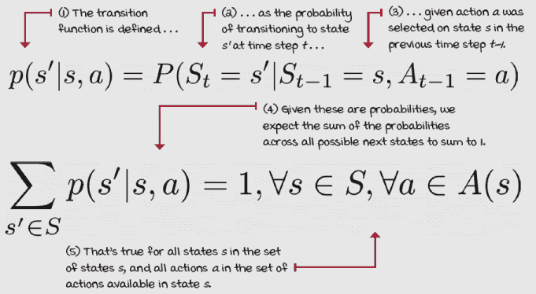 |

BW 环境是确定性的；也就是说，给定当前状态 *s* 和动作 *a*，下一个状态 *s'* 的概率总是 1。总是只有一个可能的后继状态 *s'*. BSW 和 FL 环境是随机的；也就是说，给定当前状态 *s* 和动作 *a*，下一个状态 *s'* 的概率小于 1。存在多个可能的后继状态 *s'*。

许多强化学习（RL）和深度强化学习（DRL）算法的一个关键假设是，这个分布是平稳的。也就是说，虽然可能会有高度随机的转换，但在训练或评估过程中概率分布可能不会改变。正如马尔可夫假设一样，平稳性假设通常会被放宽到一定程度。然而，对于大多数智能体来说，与环境互动的环境至少看起来是平稳的是很重要的。

在 FL 环境中，我们知道有 33.3%的几率我们会转换到目标单元格（状态），有 66.6%的几率我们会转换到正交方向。还有可能反弹回我们来的状态，如果它靠近墙壁的话。

为了简单和清晰，我在以下图像中只添加了 FL 环境中状态 0、2、5、7、11、12、13 和 15 的所有动作的转移函数。这个状态子集允许展示所有可能的转移，而不会过于杂乱。

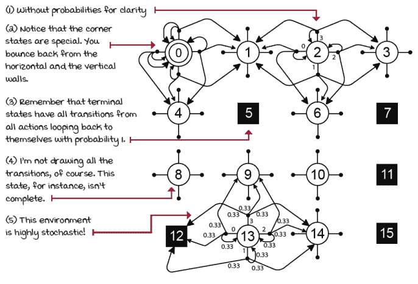

冻结湖环境的转移函数

可能仍然有些困惑，但这样看：为了保持一致性，非终端状态中的每个动作都有三个独立的转移（角落状态中的某些动作可能只需要两个，但再次强调，让我保持一致性）：一个转移到目标单元格，两个转移到正交方向的单元格。

### 奖励信号：胡萝卜和大棒

奖励函数 *r* 将一个状态转移元组 *s, a, s'* 映射到一个标量。奖励函数为状态转移提供了一种关于好坏的数值信号。当信号为正时，我们可以将奖励视为收入或奖励。大多数问题至少有一个正信号——比如赢得棋局或达到期望的目的地。但是，奖励也可以是负的，我们可以将其视为成本、惩罚或处罚。在机器人领域，添加时间步长成本是一种常见的做法，因为我们通常希望在有限的时间步内达到目标。有一点需要明确的是，无论是正还是负，奖励函数输出的标量始终被称为 *奖励*。强化学习的人们都是快乐的人。

还需要强调的是，虽然奖励函数可以表示为 *r(s,a,s')*，这是明确的，我们也可以使用 *r(s,a)*，甚至 *r(s)*，这取决于我们的需求。有时根据状态奖励智能体是我们需要的；有时使用动作和状态更有意义。然而，表示奖励函数最明确的方式是使用状态、动作和下一个状态的三元组。有了这个，我们可以在 *r(s,a,s')* 中对下一个状态进行边缘化，以获得 *r(s,a)*，并在 *r(s,a)* 中对动作进行边缘化以获得 *r(s)*。但是，一旦我们处于 *r(s)*，我们就无法恢复 *r(s,a)* 或 *r(s,a,s')*，一旦我们处于 *r(s,a)*，我们就无法恢复 *r(s,a,s')*。

|  | 展示数学公式奖励函数 |
| --- | --- |
|  | 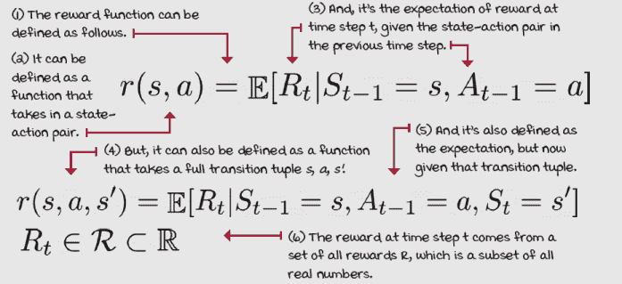奖励函数 |

在 FL 环境中，当落在状态 15 时，奖励函数为+1，否则为 0。同样，为了使以下图像更清晰，我只添加了给予非零奖励的转移信号，即落在最终状态（状态 15）。

只有三种方式可以落在 15 上。（1）从状态 14 选择 *向下* 动作，会无意中将智能体转移到那里，每个动作的概率为 33.3%。你注意到动作和转移之间的区别了吗？看到随机性如何使事情复杂化，很有趣，对吧？

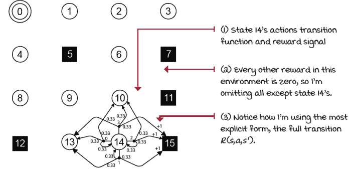

具有非零奖励转移状态的重奖信号

将转移和奖励函数扩展到表格形式也是有用的。以下是我推荐的大多数问题的格式。请注意，我只为表格添加了一部分转移（行）来展示练习。另外请注意，我在这里很明确，这些转移中的几个可以分组和重构（例如，角落单元格）。

| 状态 | 动作 | 下一个状态 | 转移概率 | 奖励信号 |
| --- | --- | --- | --- | --- |
| 0 | 左 | 0 | 0.33 | 0 |
| 0 | 左 | 0 | 0.33 | 0 |
| 0 | 左 | 4 | 0.33 | 0 |
| 0 | 下 | 0 | 0.33 | 0 |
| 0 | 下 | 4 | 0.33 | 0 |
| 0 | 下 | 1 | 0.33 | 0 |
| 0 | 右 | 4 | 0.33 | 0 |
| 0 | 右 | 1 | 0.33 | 0 |
| 0 | 右 | 0 | 0.33 | 0 |
| 0 | 上 | 1 | 0.33 | 0 |
| 0 | 上 | 0 | 0.33 | 0 |
| 0 | 上 | 0 | 0.33 | 0 |
| 1 | 左 | 1 | 0.33 | 0 |
| 1 | 左 | 0 | 0.33 | 0 |
| 1 | 左 | 5 | 0.33 | 0 |
| 1 | 下 | 0 | 0.33 | 0 |
| 1 | 下 | 5 | 0.33 | 0 |
| 1 | 下 | 2 | 0.33 | 0 |
| 1 | 右 | 5 | 0.33 | 0 |
| 1 | 右 | 2 | 0.33 | 0 |
| 1 | 右 | 1 | 0.33 | 0 |
| 2 | 左 | 1 | 0.33 | 0 |
| 2 | 左 | 2 | 0.33 | 0 |
| 2 | 左 | 6 | 0.33 | 0 |
| 2 | 下 | 1 | 0.33 | 0 |
| ... | ... | ... | ... | ... |
| 14 | 下 | 14 | 0.33 | 0 |
| 14 | 下 | 15 | 0.33 | 1 |
| 14 | 右 | 14 | 0.33 | 0 |
| 14 | 右 | 15 | 0.33 | 1 |
| 14 | 右 | 10 | 0.33 | 0 |
| 14 | 上 | 15 | 0.33 | 1 |
| 14 | 上 | 10 | 0.33 | 0 |
| ... | ... | ... | ... | ... |
| 15 | 左 | 15 | 1.0 | 0 |
| 15 | 下 | 15 | 1.0 | 0 |
| 15 | 右 | 15 | 1.0 | 0 |
| 15 | 上 | 15 | 1.0 | 0 |

### 地平线：时间改变最优解

我们也可以在马尔可夫决策过程（MDP）中表示时间。一个**时间步**，也称为纪元、周期、迭代或甚至交互，是一个全局时钟，同步所有各方并离散化时间。拥有一个时钟会产生几种可能的任务类型。一个**周期性**任务是一个时间步数有限的任务，要么因为时钟停止，要么因为智能体达到终端状态。还有持续任务，这些任务会一直进行下去；没有终端状态，因此有无限多个时间步。在这种任务中，智能体必须手动停止。

周期性和持续任务也可以从智能体的角度定义。我们称之为**规划地平线**。一方面，**有限地平线**是一个智能体知道任务将在有限个时间步内终止的规划地平线：例如，如果我们强迫智能体在 15 步内完成冻结的湖环境。这种规划地平线的一个特殊情况称为**贪婪地平线**，其规划地平线为 1。BW 和 BSW 都有一个贪婪的规划地平线：一个交互后立即结束纪元。实际上，所有赌博机环境都有贪婪地平线。

另一方面，**无限视野**是指智能体没有预定的时间步限制，因此智能体计划无限多个时间步。这样的任务可能仍然是周期性的，因此可以终止，但从智能体的角度来看，其规划视野是无限的。我们将这种类型的无限规划视野任务称为**不确定视野**任务。智能体计划无限，但环境可以随时停止交互。

对于智能体有很高的可能性陷入循环而无法终止的任务，通常的做法是添加基于时间步的人工终止状态：使用转换函数的硬时间步限制。这些情况需要对时间步限制终止状态进行特殊处理。第 8、9、10 章的环境，即小车和杆环境，就有这种人工终止步，你将在那些章节中学习如何处理这些特殊情况。

BW、BSW 和 FL 环境是**不确定规划视野**；智能体计划无限多个步骤，但交互可以随时由环境停止。我们不会在 FL 环境中添加时间步限制，因为智能体自然终止的可能性很高；环境高度随机。这种任务在强化学习（RL）中最为常见。

我们将一个周期性任务从开始到结束的连续时间步序列称为**周期**、**试验**、**阶段**或**阶段**。在不确定规划视野中，一个周期是一个包含从初始状态到终止状态之间所有交互的集合。

### 折现：未来是不确定的，因此价值较低

由于无限视野任务中可能存在无限的时间步序列，我们需要一种方法来随时间折现奖励的价值；也就是说，我们需要一种方法告诉智能体，尽早获得+1 比晚些时候获得更好。我们通常使用一个小于 1 的正实数来指数折现未来奖励的价值。我们接收奖励的时间越远，它在当前的价值就越低。

这个数字被称为**折现因子**，或**伽玛**。折现因子调整随时间变化的奖励的重要性。我们接收奖励的时间越晚，它们对当前计算就越没有吸引力。折现因子通常被广泛使用的一个重要原因是减少回报估计的方差。鉴于未来是不确定的，而且我们看得越远，积累的随机性就越多，我们的价值估计的方差就越大，折现因子有助于减少未来奖励对我们价值函数估计的影响，这对于大多数智能体的学习是稳定的。

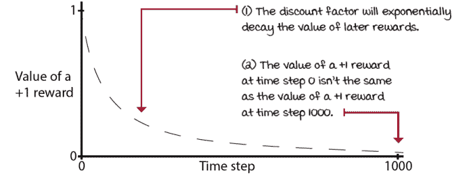

折现因子和时间对奖励价值的影响

有趣的是，伽马是 MDP 定义的一部分：问题，而不是智能体。然而，你通常找不到关于给定环境伽马适当值的指导。再次强调，这是因为伽马也被用作减少方差的超参数，因此留给智能体调整。

你也可以使用伽马（gamma）作为给智能体（agent）传达“紧迫感”的一种方式。为了更好地理解这一点，想象一下我告诉你，一旦你读完这本书，我会给你 1000 美元，但我每天会按 0.5 的比例（伽马）减少这个奖励。这意味着我每天都会将我支付的价值减半。你可能会在今天读完这本书。如果我说伽马是 1，那么你何时完成它都无关紧要，你仍然会得到全额。

对于 BW 和 BSW 环境，伽马值为 1 是合适的；然而，对于 FL 环境，我们将使用 0.99 的伽马值，这是一个常用的值。

|  | 展示数学 | 折现因子（伽马） |
| --- | --- | --- |
|  | 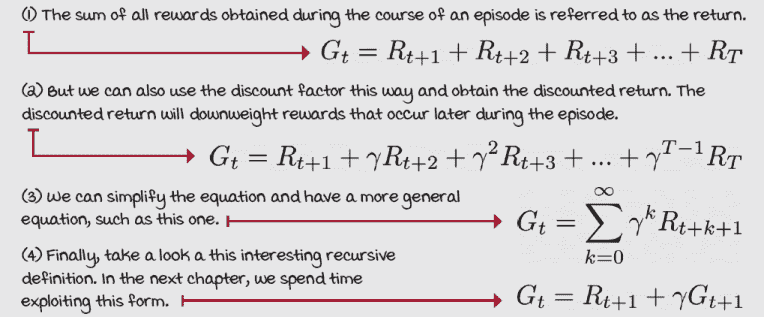 |

### MDP 的扩展

如我们之前讨论的，MDP 框架有许多扩展。它们允许我们针对不同类型的强化学习（RL）问题。以下列表并不全面，但它应该能给你一个关于该领域规模的概念。要知道，MDPs 的缩写通常用来指代所有类型的 MDP。我们目前只看到了冰山一角：

+   )：当智能体无法完全观察环境状态时

+   因子马尔可夫决策过程（FMDP）：允许更紧凑地表示转移和奖励函数，以便我们可以表示大型 MDP

+   连续 [时间|动作|状态] 马尔可夫决策过程：当时间、动作、状态或它们的任何组合是连续的

+   关联马尔可夫决策过程（RMDP）：允许结合概率和关系知识

+   半马尔可夫决策过程（SMDP）：允许包含需要多个时间步才能完成的抽象动作

+   多智能体马尔可夫决策过程（MMDP）：允许在相同环境中包含多个智能体

+   )：允许多个智能体协作并最大化共同奖励

|  | 我会说 Python 智能体 | 走廊智能体（BW）马尔可夫决策过程（MDP） |
| --- | --- | --- |
|  |

```
P = {
     0: { ①
         0: [(1.0, 0, 0.0, True)], ②
         1: [(1.0, 0, 0.0, True)] ③
     },
     1: {
         0: [(1.0, 0, 0.0, True)],
         1: [(1.0, 2, 1.0, True)]
     },
     2: {
         0: [(1.0, 2, 0.0, True)], ④
         1: [(1.0, 2, 0.0, True)] ④
     }
}
# import gym, gym_walk ⑤
# P = gym.make('BanditWalk-v0').env.P
```

① 外部字典的键是状态。② 内部字典的键是动作。③ 内部字典的值是一个列表，包含该状态-动作对的所有可能转移。④ 转移元组有四个值：该转移的概率、下一个状态、奖励以及一个标志，表示下一个状态是否是终端状态。⑤ 你也可以用这种方式加载 MDP。 |

|  | 我会说 Python 智能体 | 走廊滑行智能体（BSW）马尔可夫决策过程（MDP） |
| --- | --- | --- |
|  |

```
P = {
     0: { ①
         0: [(1.0, 0, 0.0, True)],
         1: [(1.0, 0, 0.0, True)]
     },
     1: {
         0: [(0.8, 0, 0.0, True), (0.2, 2, 1.0, True)], ②
         1: [(0.8, 2, 1.0, True), (0.2, 0, 0.0, True)] ③
     },
     2: {
         0: [(1.0, 2, 0.0, True)],
         1: [(1.0, 2, 0.0, True)]
     }
}
# import gym, gym_walk
# P = gym.make('BanditSlipperyWalk-v0').env.P ④
```

①看看终止状态。状态 0 和 2 是终止状态。②这是构建随机转换的方法。这是状态 1，动作 0。③这是在状态 1 采取动作 1 后的转换。④这是如何在笔记本中加载 Bandit Slippery Walk 的方法；确保查看它们！ |

|  | 我会说 Python 冻结湖（FL）MDP |
| --- | --- |
|  |

```
P = {
    0: {
        0: [(0.6666666666666666, 0, 0.0, False), ①
            (0.3333333333333333, 4, 0.0, False) ②
        ], ③
        <...>
        3: [(0.3333333333333333, 1, 0.0, False),
            (0.3333333333333333, 0, 0.0, False), ④
            (0.3333333333333333, 0, 0.0, False) ④
        ]
    },
    <...> ⑤
    14: {
        <...> ⑥
        1: [(0.3333333333333333, 13, 0.0, False),
            (0.3333333333333333, 14, 0.0, False),
            (0.3333333333333333, 15, 1.0, True) ⑦
        ],
        2: [(0.3333333333333333, 14, 0.0, False),
            (0.3333333333333333, 15, 1.0, True), ⑦
            (0.3333333333333333, 10, 0.0, False)
        ],
        3: [(0.3333333333333333, 15, 1.0, True), ⑦
            (0.3333333333333333, 10, 0.0, False),
            (0.3333333333333333, 13, 0.0, False)
        ]
    },
    15: { ⑧
        0: [(1.0, 15, 0, True)],
        1: [(1.0, 15, 0, True)],
        2: [(1.0, 15, 0, True)],
        3: [(1.0, 15, 0, True)]
    }
}
# import gym ⑨
# P = gym.make('FrozenLake-v0').env.P
```

①在状态 0 选择动作 0 时落在状态 0 的概率②在状态 0 选择动作 0 时落在状态 4 的概率③你可以将概率分组，例如在这一行中。④或者明确表示，例如在这两行中。两种方式都可以。⑤为了清晰起见，从这个例子中去掉了许多内容。⑥前往笔记本查看完整的 FL MDP。⑧状态 14 是唯一提供非零奖励的状态。四个动作中有三个只有一个转换会导致状态 15。落在状态 15 提供+1 奖励。⑨状态 15 是一个终止状态。⑩同样，你可以这样加载 MDP。 |

### 整合一切

不幸的是，当你进入现实世界时，你会发现有许多不同的方式来定义 MDPs。此外，某些来源描述 POMDPs 并将它们称为 MDPs，但没有完全披露。所有这些都给新来者带来了困惑，因此我有一些要点要为你澄清。首先，你之前看到的 Python 代码不是一个完整的 MDP，而只是转换函数和奖励信号。从这些中，我们可以轻松推断状态和动作空间。这些代码片段来自几个包含我为这本书开发的几个环境的包，FL 环境是第一章节中提到的 OpenAI Gym 包的一部分。MDP 中缺失的许多额外组件，如来自初始状态集合 *sH* 的初始状态分布 *s*θ，在上面的字典中没有显示，并且 OpenAI Gym 框架不提供这些。就像我之前说的那样，折现因子通常被认为是超参数，不管好坏。而且，通常假设视野是无限的。

但不用担心这个问题。首先，为了计算本章中提出的 MDPs 的最优策略（我们将在下一章中这样做），我们只需要之前显示的包含转换函数和奖励信号的字典；从这些中，我们可以推断状态和动作空间，我会提供给你折现因子。我们将假设视野是无限的，不需要初始状态分布。此外，本章最重要的部分是让你了解 MDPs 和 POMDPs 的组件。记住，你不需要比本章中做的更多 MDP 构建。尽管如此，让我定义 MDPs 和 POMDPs，以便我们保持一致。

|  | 展示数学 MDPs 与 POMDPs 的比较 |
| --- | --- |
|  | 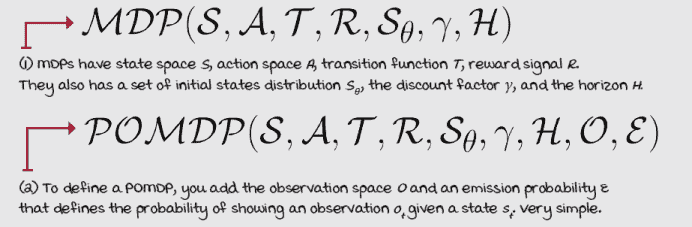 |

## 摘要

好的。我知道这一章有很多新术语，但这正是其目的。这一章的最佳总结在前一页，更具体地说，是关于马尔可夫决策过程（MDP）的定义。再次看看最后两个方程式，并尝试记住每个字母的含义。一旦你做到了这一点，你就可以确信你已经从这一章中获得了继续前进所需的内容。

在最高层次上，强化学习问题涉及智能体与其存在的环境之间的交互。在这个设置下可以模拟各种问题。马尔可夫决策过程是表示不确定条件下复杂决策问题的数学框架。

马尔可夫决策过程（MDPs）由一组系统状态、每个状态的一组*初始状态分布*组成。状态描述了环境的配置。动作允许智能体与环境交互。转移函数说明了环境如何演变以及如何对智能体的动作做出反应。奖励信号编码了智能体要实现的目标。视野和折现因子为交互添加了时间概念。

状态空间，所有可能状态的集合，可以是无限的或有限的。然而，组成单个状态的变量数量必须是有限的。状态可以是完全可观察的，但在更一般的马尔可夫决策过程（MDP）的更一般情况下，即部分可观察马尔可夫决策过程（POMDP），状态是部分可观察的。这意味着智能体不能观察到系统的完整状态，而只能观察到一种噪声状态，称为观察。

动作空间是一组可以随状态变化的动作。然而，惯例是使用相同的集合来表示所有状态。动作可以与多个变量组合，就像状态一样。动作变量可以是离散的或连续的。

转移函数将一个状态（下一个状态）与一个状态-动作对联系起来，并定义了在给定状态-动作对的情况下达到该未来状态的概率。奖励信号在其更一般的形式下，将一个转移元组 *s*, *a*, *s'* 映射到标量，并指示转移的好坏。转移函数和奖励信号定义了环境模型，并且假设是平稳的，这意味着概率在整个过程中保持不变。

到现在为止，

+   理解强化学习问题的组成部分以及它们如何相互作用

+   认识到马尔可夫决策过程，并了解它们由什么组成以及它们是如何工作的

+   可以将顺序决策问题表示为马尔可夫决策过程（MDPs）

|  | 可分享的亮点：自己动手并分享你的发现 |
| --- | --- |

|  | 这里有一些如何将你所学的内容提升到下一个层次的想法。如果你愿意，与世界分享你的结果，并确保查看其他人所做的事情。这是一个双赢的局面，希望你能充分利用它。

+   **#gdrl_ch02_tf01:** 创建环境是一项至关重要的技能，值得有一本书来专门介绍。你为什么不自己创建一个网格世界环境呢？在这里，看看本章中步行环境的代码([`github.com/mimoralea/gym-walk`](https://github.com/mimoralea/gym-walk))以及一些其他的网格世界环境([`github.com/mimoralea/gym-aima`](https://github.com/mimoralea/gym-aima), [`github.com/mimoralea/gym-bandits`](https://github.com/mimoralea/gym-bandits), [`github.com/openai/gym/tree/master/gym/envs/toy_text`](https://github.com/openai/gym/tree/master/gym/envs/toy_text))。现在，创建一个包含新网格世界环境的 Python 包！不要限制自己只做简单的移动动作；你可以创建一个‘传送’动作，或者任何其他动作。也许还可以在环境中添加除了你的智能体之外的其他生物。也许可以添加一些小怪物，你的智能体需要避开。在这里发挥创意。你可以做很多事情。

+   **#gdrl_ch02_tf02:** 另一个尝试的事情是为你选择的仿真引擎创建一个所谓的“Gym 环境”。首先，调查一下“Gym 环境”究竟是什么。接下来，探索以下 Python 包([`github.com/openai/mujoco-py`](https://github.com/openai/mujoco-py), [`github.com/openai/atari-py`](https://github.com/openai/atari-py), [`github.com/google-research/football`](https://github.com/google-research/football), 以及[`github.com/openai/gym/blob/master/docs/environments.md`](https://github.com/openai/gym/blob/master/docs/environments.md)中的许多包)。然后，尝试理解其他人如何将仿真引擎暴露为 Gym 环境。最后，为你选择的仿真引擎创建一个 Gym 环境。这是一个具有挑战性的任务！

+   **#gdrl_ch02_tf03:** 在每一章中，我都在使用最后的标签作为通用的标签。请随意使用这个标签来讨论与本章相关的任何其他你工作过的事情。没有什么比为自己创造作业更令人兴奋的了。确保分享你设定去调查的内容以及你的结果。

用你的发现写一条推文，@mimoralea（我会转发），并使用这个列表中的特定标签来帮助感兴趣的人找到你的结果。没有正确或错误的结果；你分享你的发现并检查他人的发现。利用这个机会社交，做出贡献，让自己脱颖而出！我们正在等待你！以下是一条推文示例：“嘿，@mimoralea。我创建了一个包含资源列表的博客文章，用于研究深度强化学习。查看它在这里<链接>。#gdrl_ch01_tf01”我会确保转发并帮助他人找到你的工作。|
