# 3 平衡短期和长期目标

在本章

+   你将了解从序列性反馈中学习的挑战以及如何正确平衡短期和长期目标。

+   你将开发出能够找到用 MDP 建模的序列决策问题中最佳行为策略的算法。

+   你将找到你在上一章中为构建的 MDP 的所有环境的最佳策略。

在准备战斗时，我总是发现计划是没有用的，但规划是必不可少的。

—— 德怀特·D·艾森豪威尔，美国陆军五星上将和第 34 任美国总统

在上一章中，你为 BW、BSW 和 FL 环境构建了 MDP。MDP 是推动强化学习环境的引擎。它们定义了问题：它们描述了智能体如何通过状态和动作空间与环境交互，智能体的目标通过奖励函数，环境如何通过转移函数对智能体的动作做出反应，以及时间如何通过折现因子影响行为。

在本章中，你将学习解决马尔可夫决策过程（MDP）的算法。我们首先讨论智能体的目标以及为什么简单的计划不足以解决 MDP 问题。然后，我们讨论在称为**动态策略迭代**（PI）的技术下解决 MDP 的两个基本算法。

你很快就会注意到，这些方法在某种程度上“作弊”：它们需要完全访问 MDP，并且依赖于了解环境的动态，而这并不是我们总能获得的。然而，你将学习的这些基础知识对于了解更高级的算法仍然是有用的。最终，价值迭代（VI）和策略迭代（PI）是几乎所有其他强化学习（和深度强化学习）算法的基础。

你还会注意到，当一个智能体完全访问 MDP 时，没有不确定性，因为你可以查看动态和奖励并直接计算期望。直接计算期望意味着不需要探索；也就是说，不需要平衡探索和利用。不需要交互，因此不需要试错学习。所有这一切都是因为我们在本章用于学习的反馈不是评估性的，而是监督性的。

记住，在深度强化学习（DRL）中，智能体从同时具有序列性（与一次性相反）、评估性（与监督性相反）和采样性（与穷举性相反）的反馈中学习。在本章中，我所做的是消除从评估性和采样性反馈中带来的复杂性，并单独研究序列性反馈。在本章中，我们从序列性、监督性和穷举性的反馈中学习。

## 决策智能体的目标

起初，似乎智能体的目标是找到一系列动作，以最大化回报：在一段时间或智能体的整个生命周期内，根据任务的不同，是奖励的总和（折现或未折现，取决于伽马值）。

让我介绍一个新的环境来更具体地解释这些概念。

|  | 一个具体的例子：滑稽的走步五（SWF）环境 |
| --- | --- |
|  | 滑稽的走步五（SWF）是一个单行网格世界环境（一次走步），它是随机的，类似于冰冻湖，并且它只有五个非终止状态（如果计算两个终止状态，总共是七个）。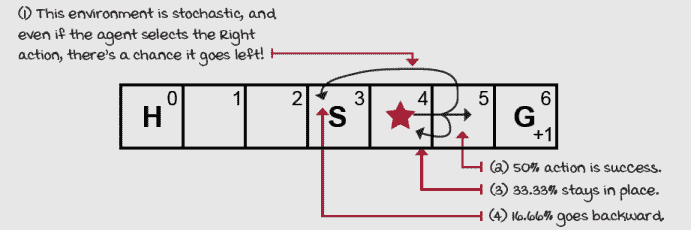滑稽的走步五环境智能体从*s, H*开始，*H*是洞，*g*是目标，提供+1 奖励。 |
|  | 展示数学：回报 *G* |
|  | 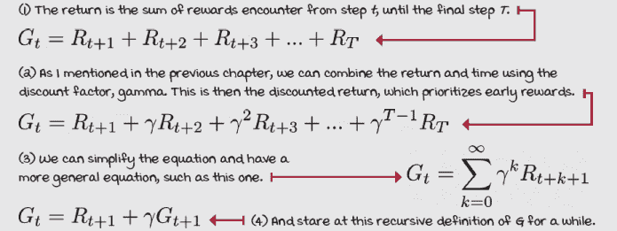 |

你可以将回报视为向后看——“从过去的时间步中得到了多少”；但另一种看待它的方式是“未来的奖励”——基本上是向前看。例如，想象在 SWF 环境中有一个这样的场景：*3/0, 4/0, 5/0, 4/0, 5/0, 6/1*。这个轨迹/场景的回报是多少？

好吧，如果我们使用折现，数学将这样计算。

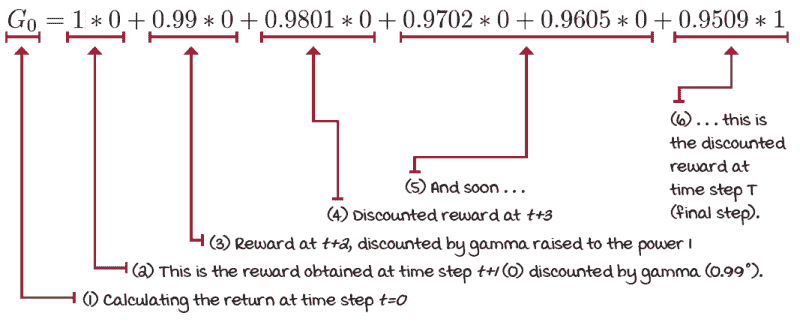

滑稽的走步五环境中的折现回报

如果我们不使用折现，那么，对于这个轨迹以及所有以最右侧单元格、状态 6 结束的轨迹，回报将是 1，而对于所有以最左侧单元格、状态 0 结束的轨迹，回报将是 0。

在 SWF 环境中，很明显向右走是最好的选择。因此，似乎所有智能体必须找到的只是一些被称为*计划*的东西——即从*目标*状态开始的一系列动作。但这并不总是有效。

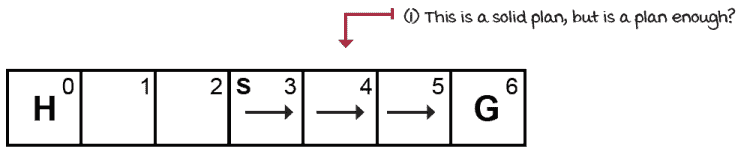

SWF 环境中的稳固计划

在 FL 环境中，计划看起来如下。

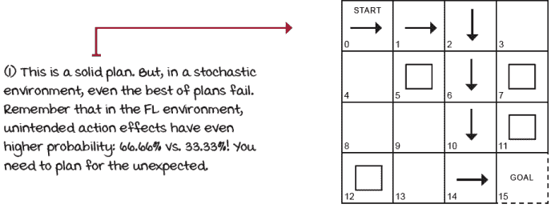

FL 环境中的稳固计划

但这还不够！计划的问题在于它们没有考虑到环境中的随机性，而 SWF 和 FL 都是随机的*；*采取的动作不一定总是按照我们的意图行事。如果由于环境的随机性，我们的智能体落在我们的计划未覆盖的单元格上，会发生什么？

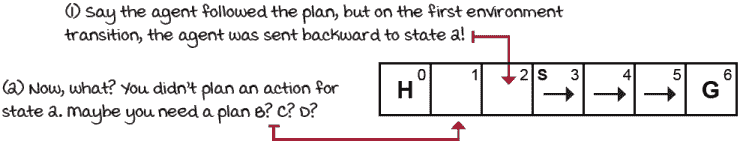

我们计划中可能存在的漏洞

在 FL 环境中也发生同样的事情。

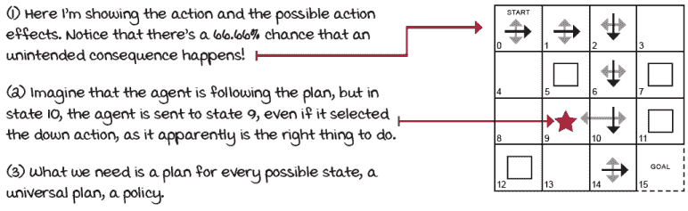

在随机环境中，计划是不够的

智能体需要提出的是所谓的*策略*。策略是通用的计划；策略覆盖所有可能的状态。我们需要为每个可能的状态进行规划。策略可以是*随机*的或确定的：策略可以为给定状态（或观察）返回动作概率分布或单个动作。目前，我们正在使用确定性的策略，这是一个将动作映射到状态的查找表。

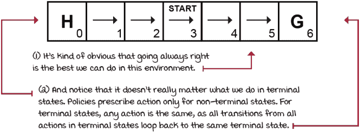

SWF 环境中的最优策略

在 SWF 环境中，最优策略总是向右走，对于每个状态。很好，但仍然有许多未解决的问题。例如，我应该从这个策略中期望多少奖励？因为，尽管我们知道如何采取最优行动，但环境可能会将我们的智能体送回洞中，即使我们总是选择朝向目标前进。这就是为什么回报还不够。智能体真正寻求的是最大化期望回报；这意味着考虑环境随机性的回报。

此外，我们需要一种方法来自动找到最优策略，因为在 FL 示例中，例如，最优策略看起来并不明显！

在智能体内部保留了一些组件，可以帮助它找到最优行为：有策略，对于给定的环境可能有多个策略，实际上，在特定环境中，可能有多个最优策略。此外，还有价值函数帮助我们跟踪回报估计。对于给定的 MDP，有一个单一的最优价值函数，但通常可能有多个价值函数。

让我们看看强化学习智能体内部的所有组件，这些组件允许它们学习和找到最优策略，并用示例使所有这些更加具体。

### 策略：每个状态的动作规定

考虑到 Frozen Lake 环境中的随机性（以及大多数强化学习问题），智能体需要找到一个策略，记为π。策略是为给定非终端状态规定采取行动的函数。（记住，策略可以是随机的：直接针对一个动作或动作的概率分布。我们将在后面的章节中扩展随机策略。）

这里是一个示例策略。

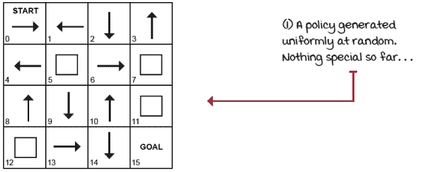

一个随机生成的策略

当查看一个策略时，一个立即出现的问题是这样的：这个策略有多好？如果我们找到一种方法给策略赋予数字，我们也可以问，这个策略比另一个策略好多少？

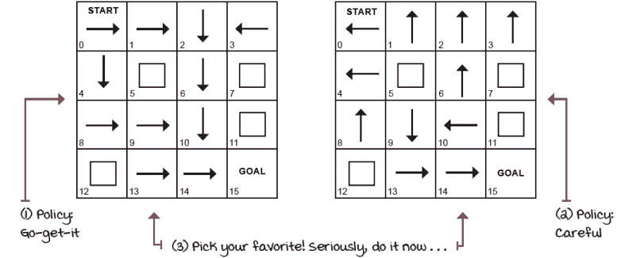

我们如何比较策略？

### 状态价值函数：从这里可以期待什么？

要帮助我们比较策略，我们可以为给定策略中的状态赋予数字。也就是说，如果我们给定一个策略和 MDP，我们应该能够从每个单一状态开始计算期望回报（我们主要关心起始状态）。我们如何计算处于某个状态的价值？例如，如果我们的智能体处于状态 14（目标左侧），这比处于状态 13（14 左侧）好多少？以及它究竟好多少？更重要的是，在哪种策略下我们会得到更好的结果，是“积极进取”策略还是“谨慎”策略？

让我们用“积极进取”策略快速尝试一下。在“积极进取”策略下，处于状态 14 的价值是多少？

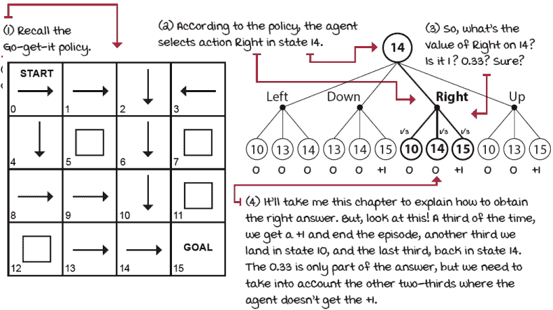

在运行“积极进取”策略时，处于状态 14 的价值是多少？

好吧，按照“立即行动”策略计算状态 14 的值并不那么简单，因为依赖于其他状态（在这个例子中是状态 10 和 14）的值，而这些值我们也没有。这就像“先有鸡还是先有蛋”的问题。让我们继续前进。

我们定义了π。记住，我们处于随机环境中，因此我们必须考虑环境对我们策略的所有可能反应！这正是期望值给我们的。

我们现在定义在遵循策略π时状态 s 的值：状态 s 在策略π下的值是如果智能体从状态 s 开始遵循策略π，则回报的期望值。为每个状态计算这个值，你得到状态值函数，或 V 函数或值函数。它表示遵循策略π从状态 s 开始时的期望回报。

|  | 展示数学公式 |
| --- | --- |
|  | 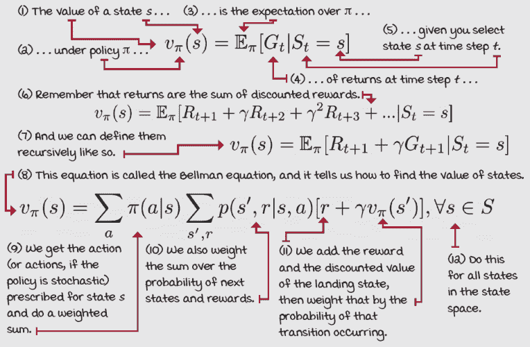 |

这些方程非常迷人。由于递归依赖关系，有点混乱，但仍然很有趣。注意状态的价值如何递归地依赖于可能许多其他状态的值，而这些值也可能依赖于其他状态，包括原始状态！

状态和后续状态之间的递归关系将在下一节中再次出现，当我们查看可以迭代求解这些方程并获取 FL 环境（或任何其他环境）中任何策略的状态值函数的算法时。

现在，让我们继续探索 RL 智能体中常见的其他组件。我们将在本章后面学习如何计算这些值。请注意，状态值函数通常被称为值函数，甚至称为 V 函数，或者更简单地说，*v**π(s)*。这可能有点令人困惑，但你会习惯的。

### 动作值函数：如果我这样做，我应该期望从这里得到什么？

另一个我们经常需要问的至关重要的问题不仅仅是关于状态的值，而是在状态 s 中采取动作 a 的值。区分这类问题的答案将帮助我们决定采取哪种动作。

例如，注意“立即行动”策略在状态 14 时是向右走的，但“谨慎”策略是向下走的。但哪个动作更好？更具体地说，在每种策略下哪个动作更好？也就是说，向下走而不是向右走的值是多少，以及向右走而不是向下走的值是多少，然后遵循“立即行动”策略？

通过比较同一策略下的不同动作，我们可以选择更好的动作，从而改进我们的策略。动作值函数，也称为 Q 函数或 Q^π**(s,a)*，精确地捕捉了这一点：智能体在状态 s 中采取动作 a 后遵循策略π的期望回报。

事实上，当我们关心改进策略时，这通常被称为控制问题，我们需要动作值函数。想想看：如果你没有 MDP，你怎么能仅仅通过知道所有状态的价值来决定采取什么动作？V 函数没有捕捉到环境的动态。另一方面，Q 函数在一定程度上捕捉了环境的动态，并允许你在不需要 MDP 的情况下改进策略。我们将在后面的章节中进一步阐述这一事实。

|  显示数学公式动作值函数*Q* |
| --- |
|  |  |

### 动作优势函数：如果我这么做会好多少？

另一种价值函数是从前两种函数推导出来的。这种*动作优势函数*，也称为*优势函数*、*a 函数*或*a^π**(s, a)*，是动作*a*在状态*s*的动作值函数与在策略*π*下状态*s*的状态值函数之间的差值。

|  显示数学公式动作优势函数*A* |
| --- |
|  | 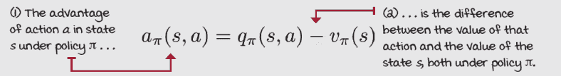 |

优势函数描述了采取动作*a*而不是遵循策略*π*的好处：选择动作*a*相对于默认动作的优势。

看看 SWF 环境中（愚蠢的）策略的不同价值函数。记住，这些值取决于策略。换句话说，*Q*π*(s, a)*假设你会遵循策略*π*（在以下示例中始终向左）并在状态*s*采取动作*a*之后。

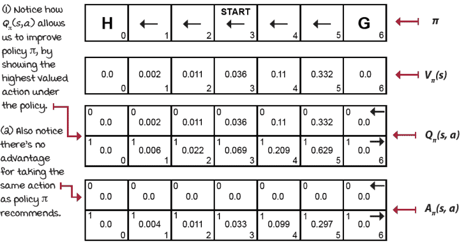

状态值函数、动作值函数和动作优势函数

### 最优性

策略、状态值函数、动作值函数和动作优势函数是我们用来描述、评估和改进行为的组件。当这些组件处于最佳状态时，我们称之为*最优性*。

*最优策略*是一种策略，对于每个状态，它可以获得大于或等于任何其他策略的预期回报。最优状态值函数是所有策略对所有状态的最大值的状态值函数。同样，最优动作值函数是所有策略对所有状态-动作对的最大值的动作值函数。最优动作优势函数遵循类似的模式，但请注意，最优优势函数对于所有状态-动作对都等于或小于零，因为没有任何动作可以从最优状态值函数中获得任何优势。

此外，请注意，尽管对于给定的 MDP 可能有多个最优策略，但只有一个最优状态值函数、最优动作值函数和最优动作优势函数。

你可能也注意到，如果你有了最优的 V 函数，你可以使用 MDP 进行一步搜索以找到最优的 Q 函数，然后使用这个函数构建最优策略。另一方面，如果你有了最优的 Q 函数，你根本不需要 MDP。你可以通过仅对动作取最大值来使用最优 Q 函数找到最优的 V 函数。你也可以通过对动作取 argmax 来使用最优 Q 函数获得最优策略。

|  | 展示数学 The Bellman 最优方程 |
| --- | --- |
|  | 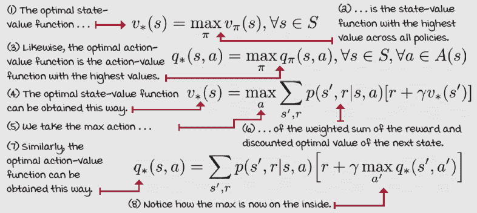 |

## 规划最优动作序列

我们有状态值函数来跟踪状态的价值，动作值函数来跟踪状态-动作对的价值，动作优势函数来显示采取特定动作的“优势”。我们有所有这些方程来评估当前策略，即从策略到值函数，并计算和找到最优值函数，因此找到最优策略。

现在我们已经讨论了强化学习问题的公式化，并且我们已经定义了我们追求的目标，我们可以开始探索寻找这个目标的方法。迭代计算前一小节中提出的方程是解决强化学习问题并获得已知环境动态、MDPs 时的最优策略的最常见方法之一。让我们看看这些方法。

### 策略评估：评估策略

我们在上一节中讨论了比较策略。我们确定，如果对于所有状态，策略π的期望回报优于或等于策略πq'*，则策略π*优于或等于策略πq*'*。然而，在我们能够使用这个定义之前，我们必须设计一个评估任意策略的算法。这种算法被称为*迭代策略评估*或简称为*策略评估*。

策略评估算法包括通过遍历状态空间并迭代改进估计来计算给定策略的 V 函数。我们将接受策略并输出值函数的算法称为解决**预测问题**的算法，即计算预定策略的价值。

|  | 展示数学 The policy-evaluation equation |
| --- | --- |
|  | 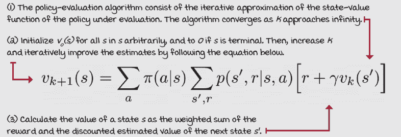 |

使用这个方程，我们可以迭代地近似任意策略的真实 V 函数。迭代策略评估算法在给定足够迭代次数的情况下，保证收敛到策略的价值函数，更具体地说，当我们接近无穷大时。然而，在实践中，我们使用一个小的阈值来检查我们近似的价值函数的变化。一旦价值函数的变化小于这个阈值，我们就停止。

让我们看看这个算法在 SWF 环境中，对于始终向左的策略是如何工作的。

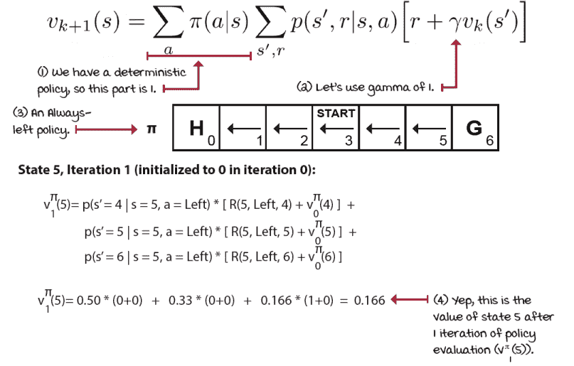

政策评估的初始计算

然后，你计算所有状态 0-6 的值，完成后，进入下一个迭代。请注意，为了计算*v*[2]*π(s)*，你必须使用前一个迭代中获得的估计值，*v*[1]*π(s)*。这种从估计值计算估计值的技术被称为*bootstrapping*，并且在强化学习（包括深度强化学习）中得到了广泛的应用。

此外，重要的是要注意，这里的*K*是估计之间的迭代，但它们并不是与环境交互。这些不是智能体在外部选择动作并观察环境的回合。这些也不是时间步。相反，这些是迭代策略评估算法的迭代。进行更多的这些估计。下表显示了您应该得到的结果。

| k | V^π(0) | V^π(1) | V^π(2) | V^π(3) | V^π(4) | V^π(5) | V^π(6) |
| --- | --- | --- | --- | --- | --- | --- | --- |
| 0 | 0 | 0 | 0 | 0 | 0 | 0 | 0 |
| 1 | 0 | 0 | 0 | 0 | 0 | 0.1667 | 0 |
| 2 | 0 | 0 | 0 | 0 | 0.0278 | 0.2222 | 0 |
| 3 | 0 | 0 | 0 | 0.0046 | 0.0463 | 0.2546 | 0 |
| 4 | 0 | 0 | 0.0008 | 0.0093 | 0.0602 | 0.2747 | 0 |
| 5 | 0 | 0.0001 | 0.0018 | 0.0135 | 0.0705 | 0.2883 | 0 |
| 6 | 0 | 0.0003 | 0.0029 | 0.0171 | 0.0783 | 0.2980 | 0 |
| 7 | 0 | 0.0006 | 0.0040 | 0.0202 | 0.0843 | 0.3052 | 0 |
| 8 | 0 | 0.0009 | 0.0050 | 0.0228 | 0.0891 | 0.3106 | 0 |
| 9 | 0 | 0.0011 | 0.0059 | 0.0249 | 0.0929 | 0.3147 | 0 |
| 10 | 0 | 0.0014 | 0.0067 | 0.0267 | 0.0959 | 0.318 | 0 |
| ... | ... | ... | ... | ... | ... | ... | ... |
| 104 | 0 | 0.0027 | 0.011 | 0.0357 | 0.1099 | 0.3324 | 0 |

那么，结果的状态值函数告诉我们哪些事情？

首先，我们可以说，在这个环境中开始一个回合并遵循始终向左的策略时，我们期望获得 0.0357 的回报。相当低。

我们还可以说，即使我们发现自己处于状态 1（最左边的非终端状态），我们仍然有不到 1%的机会最终进入目标单元格（状态 6）。更准确地说，当我们处于状态 1 时，我们有 0.27%的机会进入目标状态。而且我们一直选择向左！非常有趣。

有趣的是，由于这个环境的随机性，我们有 3.57%的机会到达目标单元格（记住这个环境有 50%的动作成功率，33.33%无效果，16.66%反向）。再次强调，这是在始终向左的策略下。尽管如此，左边的动作可能会让我们向右移动，然后再次向右，或者向左，然后向右，向右，向右，等等。

考虑轨迹概率的组合方式。同时，注意迭代过程以及值是如何从奖励（从状态 5 到状态 6 的转换）一步一步向后传播的。这种值的反向传播是强化学习算法的常见特征，并且在多个地方再次出现。

|  | 我会说 Python 政策评估算法 |
| --- | --- |
|  |

```
def policy_evaluation(pi, P, gamma=1.0, theta=1e-10): ①
    prev_V = np.zeros(len(P)) ②
    while True: ③
        V = np.zeros(len(P)) ④
        for s in range(len(P)): ⑤
            for prob, next_state, reward, done in P[s][pi(s)]: ⑥⑦
                V[s] += prob * (reward + gamma * \            ⑧
                              prev_V[next_state] * (not done)) ⑨
        if np.max(np.abs(prev_V - V)) < theta:
            break ⑩
        prev_V = V.copy() ⑪
    return V
```

① 这是对策略评估算法的完整实现。我们需要的只是我们想要评估的策略以及策略运行的 MDP。折现因子 gamma 默认为 1，theta 是一个小数，我们用它来检查收敛性。② 在这里，我们将状态值函数的第一迭代估计初始化为零。③ 我们首先通过“永远”循环……④ 我们也将当前迭代的估计初始化为零。⑤ 然后遍历所有状态来估计状态值函数。⑥ 看这里我们如何使用策略π来获取可能的转换。⑦ 每个转换元组都有一个概率、下一个状态、奖励和一个表示“下一个状态”是否为终端状态的 done 标志。⑧ 我们通过计算该转换的加权值来计算该状态的价值。⑨ 注意我们如何使用‘done’标志来确保当落在终端状态时下一个状态的价值为零。我们不希望有无限的和。⑩ 在每次迭代（状态扫描）结束时，我们确保状态值函数正在变化；否则，我们称之为收敛。⑪ 最后，“复制”以准备下一次迭代或返回最新的状态值函数。

现在我们将在之前为 FL 环境生成的随机策略中运行策略评估。

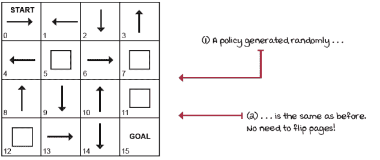

回忆一下随机生成的策略

以下显示了策略评估在仅经过八次迭代后对随机生成策略的状态值函数的准确估计所取得的进展。

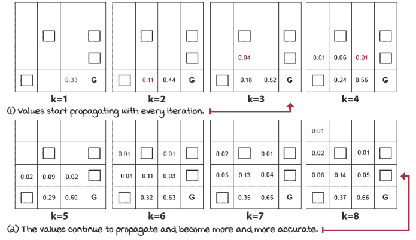

FL 环境随机生成策略的策略评估

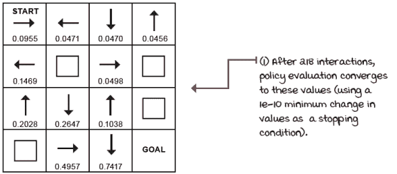

随机生成策略的状态值函数

这个最终的状态值函数是此策略的状态值函数。请注意，尽管这仍然是一个估计值，因为我们处于离散的状态和动作空间，我们可以假设当使用 gamma 为 0.99 时，这实际上是实际的价值函数。

如果你想知道之前展示的两个策略的状态值函数，这里有一些结果。

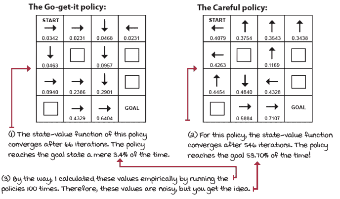

策略演化的结果

在 FL 环境中，似乎成为一个“积极进取”的策略并不划算！有趣的结果，对吧？但是，一个问题出现了：这个环境中有没有更好的策略？

### 政策改进：利用评级获得更好的结果

现在动机很明确了。你有一种评估任何策略的方法。这已经给了你一些自由：你可以评估许多策略，并按起始状态的状态值函数对它们进行排名。毕竟，这个数字告诉你，如果你运行许多剧集，所讨论的策略将获得的预期累积奖励。酷，对吧？

不！毫无意义。你为什么会随机生成一堆策略并评估它们？首先，这完全是浪费计算资源，更重要的是，这并不能保证你找到更好的策略。必须有一种更好的方法。

解决这个问题的关键是动作值函数，即 Q 函数。使用 V 函数和 MDP，你可以得到 Q 函数的估计。Q 函数将为你展示所有状态下所有动作的值，而这些值反过来又可能暗示如何改进策略。看看 Careful 策略的 Q 函数以及我们可以如何改进这个策略：

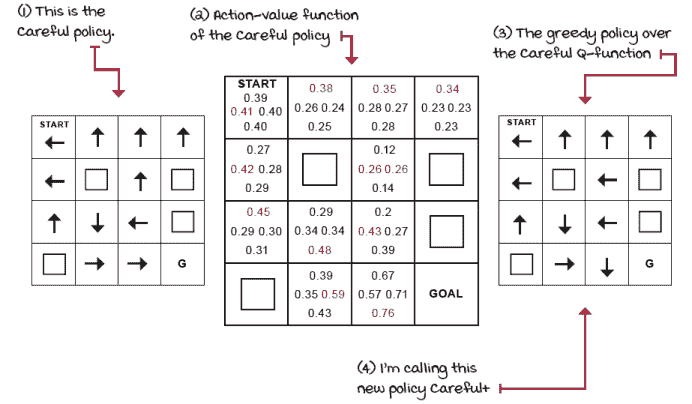

Q 函数如何帮助我们改进策略？

注意，如果我们对策略的 Q 函数采取贪婪行动，我们就会得到一个新的策略：Careful+。这个策略是否更好？嗯，策略评估可以告诉我们！让我们来看看！

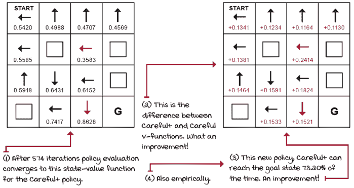

Careful 策略的状态值函数

新策略比原始策略更好。这太棒了！我们使用了原始策略的状态值函数和 MDP 来计算其动作值函数。然后，根据动作值函数采取贪婪行动给了我们一个改进的策略。这就是*策略改进*算法所做的事情：它使用状态值函数和 MDP 计算动作值函数，并返回一个关于原始策略动作值函数的*贪婪*策略。让它沉淀下来，这很重要。

|  | 展示数学公式策略改进方程 |
| --- | --- |
|  | 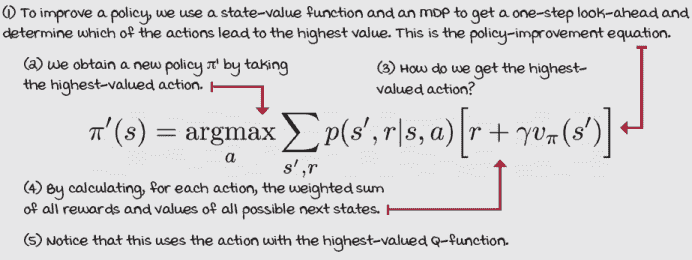 |

这就是策略改进算法在 Python 中的样子。

|  | 我会说 Python 策略改进算法 |
| --- | --- |
|  |

```
def policy_improvement(V, P, gamma=1.0): ①
    Q = np.zeros((len(P), len(P[0])), dtype=np.float64) ②
    for s in range(len(P)): ③
        for a in range(len(P[s])):
            for prob, next_state, reward, done in P[s][a]: ④
                Q[s][a] += prob * (reward + gamma * \         ⑤
                                 V[next_state] * (not done))
    new_pi = lambda s: {s:a for s, a in enumerate( ⑥
                                     np.argmax(Q, axis=1))}[s]
    return new_pi                                             ⑥
```

① 非常简单的算法。它需要你想要改进的策略的状态值函数 V，MDP，P（以及可选的 gamma）。② 然后，将 Q 函数初始化为零（技术上，你可以随机初始化这些值，但让我们保持简单）。③ 然后，遍历状态、动作和转换。④ 标记表示下一个状态是否为终端状态。⑤ 我们使用这些值来计算 Q 函数。⑥ 最后，通过取原始策略 Q 函数的最大值，我们获得一个新的贪婪策略。这样，你就可能得到了一个改进的策略。|

自然接下来要问的问题是这些：有没有比这个更好的策略？我们能做得比*再次*更好吗？也许可以！但，只有一种方法可以找到答案。让我们试试看！

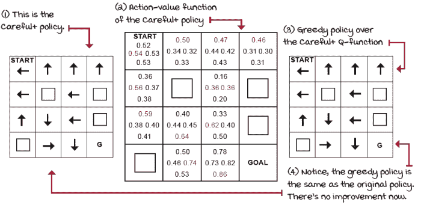

我们能否改进 Careful+策略？

我对 Careful+策略进行了策略评估，然后进行了策略改进。Careful 和 Careful+的 Q 函数不同，但基于 Q 函数的贪婪策略是相同的。换句话说，这次没有改进。

没有任何改进发生，因为 Careful+策略是 FL 环境（gamma 为 0.99）的一个最优策略。我们只需要对 Careful 策略进行一次改进，因为该策略一开始就很好。

现在，即使我们从一个旨在表现不佳的对抗性策略开始，交替进行策略评估和改进，最终也会得到一个最优策略。需要证明吗？让我们试试！让我们为 FL 环境想出一个对抗性策略，看看会发生什么。

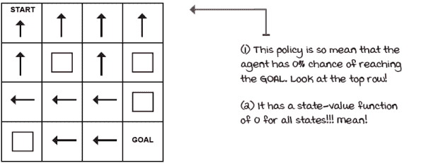

FL 环境的对抗性策略

### 政策迭代：改进改进行为

使用这个对抗性策略的计划是在策略评估和策略改进之间交替，直到策略改进阶段输出的策略不再产生不同的策略。事实上，如果我们不是从一个对抗性策略开始，而是从一个随机生成的策略开始，这就是一个称为*策略迭代*的算法所做的事情。

|  | 我会说 Python 政策迭代算法 |
| --- | --- |
|  |

```
def policy_iteration(P, gamma=1.0, theta=1e-10): ①
    random_actions = np.random.choice(
                                  tuple(P[0].keys()), len(P))
    pi = lambda s: {s:a for s, a in enumerate( ②
                                  random_actions)}[s] ②
    while True:
        old_pi = {s:pi(s) for s in range(len(P))} ③
        V = policy_evaluation(pi, P, gamma, theta) ④
        pi = policy_improvement(V, P, gamma) ⑤
        if old_pi == {s:pi(s) for s in range(len(P))}: ⑥
            break ⑦
    return V, pi                                              ⑧
```

① 策略迭代很简单，只需要 MDP（包括 gamma）。② 第一步是创建一个随机生成的策略。这里任何东西都可以。我创建了一个随机动作列表，并将其映射到状态。③ 在我们修改策略之前，我保留了一个策略的副本。④ 获取策略的状态值函数。⑤ 获取一个改进的策略。⑥ 然后，检查新策略是否有所不同。⑦ 如果它不同，我们再次做所有这些。⑧ 如果它没有变化，我们就跳出循环，返回一个最优策略和最优状态值函数。 |

太好了！但是，让我们先尝试从对抗性策略开始，看看会发生什么。

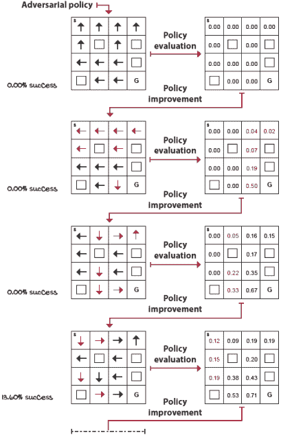

改进对抗性策略 1/2

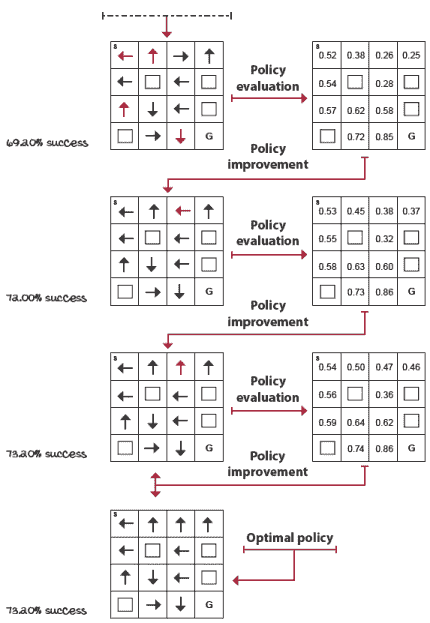

改进对抗性策略 2/2

如前所述，交替进行策略评估和策略改进，无论你从什么策略开始，都会得到一个最优策略和状态值函数。现在，我想就这句话提出几点。

注意我如何使用“*一个*最优策略”，同时也使用“*一个*最优状态值函数”。这不是巧合或用词不当；事实上，这是我想要再次强调的一个属性。一个 MDP 可以有多于一个的最优策略，但它只能有一个最优状态值函数。这并不难理解。

状态值函数是一组数字。数字可以有无限小的精度，因为它们是数字。将只有一个最优状态值函数（所有状态中数值最高的集合）。然而，状态值函数可能包含对于给定状态具有同等价值的动作；这包括最优状态值函数。在这种情况下，可能会有多个最优策略，每个最优策略选择不同的、但具有同等价值的动作。看看：FL 环境是这种情况的一个很好的例子。

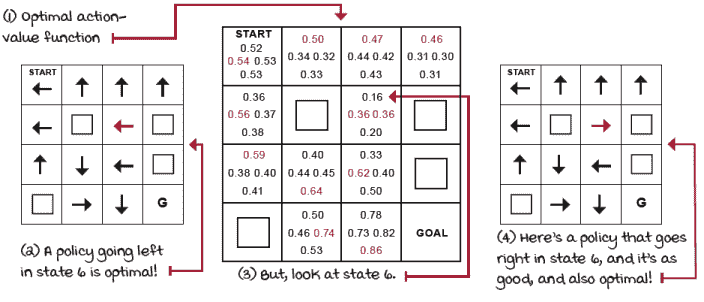

FL 环境具有多个最优策略

顺便说一下，这里没有显示，但终端状态中的所有动作都具有相同的值，即零，因此这与我在状态 6 中强调的问题类似。

作为最后的注意事项，我想强调政策迭代保证收敛到精确的最优策略：数学证明显示它不会陷入局部最优。然而，作为一个实际考虑，有一件事需要注意。如果动作值函数存在平局（例如，状态 6 中的右/左），我们必须确保不要随机打破平局。否则，策略改进可能会不断返回不同的策略，即使没有任何真正的改进。解决了这个问题之后，让我们来看看另一个寻找最优状态值函数和最优策略的基本算法。

### 值迭代：早期改进行为

你可能已经注意到了策略评估的工作方式：值在每个迭代中一致地传播，但速度很慢。看看。

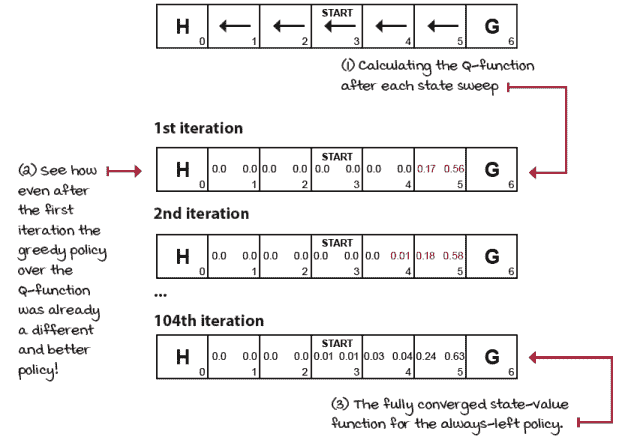

SWF 环境中的始终左策略的政策评估

图像显示了政策评估的单次状态空间扫描，随后是对 Q 函数的估计。我们通过在每个迭代中使用 V 函数和 MDP 的截断估计来完成这项工作。通过这样做，我们可以更容易地看到，即使在第一次迭代之后，对早期 Q 函数估计的贪婪策略也是一种改进。看看第一次迭代中状态 5 的 Q 值；将动作改为指向 GOAL 状态显然已经更好。

换句话说，即使我们进行*值迭代*（VI）。

VI 可以被看作是“贪婪地贪婪化策略”，因为我们尽可能贪婪地计算贪婪策略。VI 不会等到我们有策略的准确估计后再进行改进，而是 VI 在单次状态扫描后截断策略评估阶段。看看我所说的“贪婪地贪婪化策略”是什么意思。

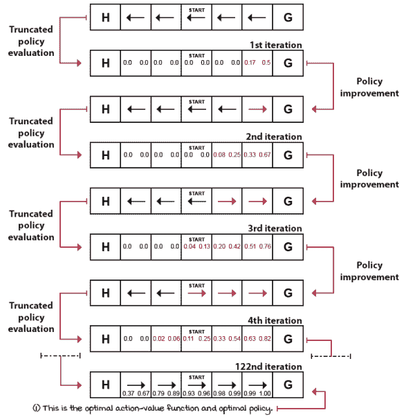

贪婪地改进 SFW 环境的始终左策略

如果我们从一个随机生成的策略开始，而不是 SWF 环境中的这个对抗性的始终左策略，VI 仍然会收敛到最优状态值函数。VI 是一个简单的算法，可以用一个方程表示。

|  | 显示数学公式值迭代方程 |
| --- | --- |
| 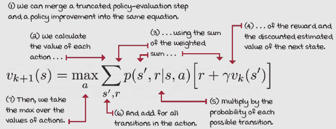 |

注意，在实践中，在 VI 中，我们根本不需要处理策略。VI 没有单独的评价阶段，该阶段运行到收敛。虽然 VI 的目标与 PI 的目标相同——为给定的 MDP 找到最优策略——VI 恰好通过值函数来完成这项工作；因此得名值迭代。

再次强调，我们只需要跟踪一个 V 函数和一个 Q 函数（具体取决于实现方式）。记住，为了在 Q 函数上获得贪婪策略，我们取该 Q 函数动作的最大值（argmax）。而不是通过取 argmax 来改善策略以获得更好的策略，然后评估这个改进的策略以再次获得价值函数，我们直接计算用于下一次状态遍历的动作的最大（max，而不是 argmax）值。

只有在 VI 算法的末尾，当 Q 函数收敛到最优值后，我们才通过在 Q 函数的动作上取 argmax 来提取最优策略，就像之前一样。你将在下一页的代码片段中更清楚地看到这一点。

需要强调的一个重要事项是，虽然 VI 和 PI 是两种不同的算法，但从更广泛的角度来看，它们是*广义策略迭代*（GPI）的两个实例。GPI 是强化学习中的一个通用概念，其中策略通过其价值函数估计来改进，而价值函数估计则朝着当前策略的实际价值函数改进。你是否等待完美的估计只是一个细节。

|  | 我会说 Python 价值迭代算法 |
| --- | --- |
|  |

```
def value_iteration(P, gamma=1.0, theta=1e-10): ①
    V = np.zeros(len(P), dtype=np.float64) ②
    while True: ③
        Q = np.zeros((len(P), len(P[0])), dtype=np.float64) ④
        for s in range(len(P)):
            for a in range(len(P[s])):
                for prob, next_state, reward, done in P[s][a]: ⑤
                    Q[s][a] += prob * (reward + gamma * \     ⑥
                                    V[next_state] * (not done)) ⑦
        if np.max(np.abs(V - np.max(Q, axis=1))) < theta: ⑧
            break
        V = np.max(Q, axis=1) ⑨
    pi = lambda s: {s:a for s, a in enumerate(
                                      np.argmax(Q, axis=1))}[s]
    return V, pi                                              ⑩
```

① 与策略迭代一样，价值迭代是获得最优策略的方法。为此，我们需要一个 MDP（包括 gamma）。Theta 是收敛标准。1e-10 足够准确。② 首先是要初始化一个状态价值函数。要知道，带有随机数的 V 函数应该可以正常工作。③ 我们进入这个循环，并将 Q 函数初始化为零。④ 注意这里必须为零。否则，估计将是不正确的。⑤ 然后，对于每个状态中每个动作的每个转换，我们 ...⑥ ... 计算动作价值函数 ...⑦ ... 注意，使用 V，这是旧的“截断”估计。⑧ 在每次遍历状态空间后，我们确保状态价值函数持续变化。否则，我们找到了最优的 V 函数，应该跳出循环。⑨ 多亏了这一行，我们不需要单独的策略改进阶段。它不是直接替换，而是一种改进和评估的组合。⑩ 只有在最后，我们提取最优策略并将其与最优状态价值函数一起返回。 |

## 摘要

强化学习代理的目标是最大化期望回报，即多个回合的总奖励。为此，代理必须使用策略，这可以被视为通用计划。策略为状态指定动作。它们可以是确定性的，意味着它们返回单个动作，或者随机性的，意味着它们返回概率分布。为了获得策略，代理通常跟踪几个汇总值。主要的是状态价值、动作价值和动作优势函数。

状态价值函数总结了从状态中期望获得的回报。它们表明代理从状态到一期的结束预期将获得多少奖励。动作价值函数总结了从状态-动作对的期望回报。这种类型的价值函数告诉代理在给定状态下选择特定动作后预期的后续奖励。动作价值函数允许代理比较不同的动作，从而解决控制问题。动作优势函数显示了代理如果选择特定的状态-动作对，可以比默认情况做得更好。所有这些价值函数都映射到特定的策略，可能是最优策略。它们取决于遵循策略直到一期的结束。

策略评估是从策略和 MDP 中估计价值函数的方法。策略改进是从价值函数和 MDP 中提取贪婪策略的方法。策略迭代包括在策略评估和策略改进之间交替，以从 MDP 中获得最优策略。策略评估阶段可能需要运行多次迭代，才能准确估计给定策略的价值函数。在策略迭代中，我们等待策略评估找到这个准确的估计。另一种称为价值迭代的方法，截断策略评估阶段并提前退出，进入策略改进阶段。

这些方法的更一般观点是广义策略迭代，它描述了两个过程之间的相互作用以优化策略：一个过程将价值函数估计值逐渐接近当前策略的真实价值函数，另一个过程使用其价值函数估计值来改进当前策略，随着这个循环的持续，策略会逐渐变得越来越好。

到现在为止，

+   了解强化学习代理的目标以及它在任何给定时间可能持有的不同统计数据

+   理解从策略中估计价值函数的方法，以及从价值函数中改进策略的方法

+   你可以在由 MDP 建模的顺序决策问题中找到最优策略

|  | 在自己的工作中努力并分享你的发现 |
| --- | --- |

|  | 在每一章的结尾，我会给出几个想法，告诉你如何将所学内容提升到下一个层次。如果你愿意，可以与全世界分享你的成果，并确保查看其他人所做的事情。这是一个双赢的局面，希望你能充分利用它。

+   **#gdrl_ch01_tf01:** 监督学习、无监督学习和强化学习是机器学习的三个基本分支。虽然了解它们之间的区别至关重要，但同样重要的是了解它们之间的相似之处。写一篇帖子分析这些不同的方法如何比较，以及它们如何可以一起用来解决人工智能问题。所有分支都追求同一个目标：创造通用人工智能，对我们所有人来说，更好地理解如何使用可用的工具是至关重要的。

+   **#gdrl_ch01_tf02:** 如果你没有机器学习或计算机科学背景，但对这本书提供的内容感兴趣，这并不会让我感到惊讶。一个重要的贡献是发布来自其他研究决策领域的资源。你有没有运筹学背景？心理学、哲学或神经科学背景？控制理论？经济学？你为什么不创建一个资源列表、博客文章、YouTube 视频书籍或其他任何形式的列表，并与我们这些也在研究决策的其他人分享呢？

+   **#gdrl_ch01_tf03:** 本章的部分文本包含一些信息，这些信息通过图形、表格和其他形式可能解释得更好。例如，我谈到了不同类型的强化学习代理（基于价值的、基于策略的、演员-评论家、基于模型的、无梯度）。你为什么不抓取那些密集的文字，提炼知识，并将你的总结与世界分享呢？

+   **#gdrl_ch01_tf04:** 在每一章中，我都在使用最后一个标签作为通用的标签。请随意使用这个标签来讨论与本章相关的任何其他你工作过的事情。没有什么比为自己创造作业更令人兴奋的了。确保分享你设定去调查的内容以及你的结果。

用你的发现写一条推文，@mimoralea（我会转发），并使用这个列表中的特定标签来帮助感兴趣的人找到你的结果。没有正确或错误的结果；你分享你的发现并检查他人的发现。利用这个机会社交，做出贡献，让自己脱颖而出！我们正在等待你！以下是一条推文示例：“嘿，@mimoralea。我创建了一篇博客文章，列出了学习深度强化学习的资源。查看它在这里<链接>。#gdrl_ch01_tf01”我会确保转发并帮助他人找到你的工作。|
