# 4 平衡信息的收集和使用

在本章中

+   你将了解从评估反馈中学习的挑战以及如何正确平衡信息的收集和利用。

+   你将开发探索策略，在具有未知转移函数和奖励信号的问题中积累低水平的遗憾。

+   你将使用试错学习代理编写代码，这些代理通过在多选项、单选择环境（称为多臂老虎机）中的自身经验来学习优化其行为。

不确定性和期望是生活的乐趣。安全感是一种乏味的东西。

—— 威廉·康格里夫，英国复辟时期的剧作家、诗人，以及英国辉格党政治人物

无论一个决策看起来多么小或不重要，你做出的每一个决策都是在信息收集和信息利用之间的权衡。例如，当你去你最喜欢的餐厅时，你应该再次点你最喜欢的菜，还是应该要求尝试你一直想尝试的菜？如果一个硅谷初创公司给你提供一份工作，你应该做出职业变动，还是应该留在你当前的角色中？

这些问题说明了探索-利用困境，并且是强化学习问题的核心。这归结为决定何时获取知识以及何时利用已学到的知识。知道我们已有的好处是否足够好是一个挑战。我们何时满足？何时追求更多？你的想法是什么：手头的一只鸟是否比树上的两只鸟更有价值？

主要问题是生活中的奖励时刻是相对的；你必须比较事件才能清楚地了解它们的价值。例如，我敢打赌，当你被提供第一份工作时，你可能会感到惊讶。你甚至可能认为那是你一生中最美好的事情。但是，然后生活继续，你经历的事情看起来甚至更有回报——也许，当你得到晋升、加薪或结婚时，谁知道呢！

核心问题是：即使你根据“多么令人惊叹”的感觉对迄今为止经历的时刻进行排名，你也不知道你一生中可能经历的最令人惊叹的时刻是什么——生活是不确定的；你没有生活的转移函数和奖励信号，所以你必须继续探索。在本章中，你将了解你的代理在与不确定环境互动时探索的重要性，这些问题中 MDP 不可用于规划。

在上一章中，你学习了从顺序反馈中学习的挑战以及如何正确平衡短期和长期目标。在本章中，我们检查从评估反馈中学习的挑战，我们这样做是在非顺序环境中，而是单次环境：*多臂老虎机（MABs）*）。

MABs 隔离并暴露了从评估性反馈中学习的挑战。我们将深入研究在特定类型环境中平衡探索和利用的许多不同技术：具有多个选项的单状态环境，但只有一个选择。智能体将在不确定性下操作，也就是说，它们将无法访问 MDP。然而，它们将与没有序列组件的一次性环境进行交互。

记住，在深度强化学习（DRL）中，智能体从同时是*评估性*反馈的反馈中学习。让我们开始吧。

## 解释评估性反馈的挑战

在上一章中，当我们解决了 FL 环境时，我们事先就知道环境会对我们的任何行动如何反应。知道环境的精确转移函数和奖励信号使我们能够使用规划算法（如 PI 和 VI）来计算最优策略，而无需与环境进行任何交互。

但是，事先知道一个马尔可夫决策过程（MDP）可能会过分简化问题，可能是不切实际的。我们并不能总是精确地知道环境会对我们的行动如何反应——世界并不是这样运作的。我们可以选择学习这些事情，正如你将在后面的章节中学到的，但关键是我们需要让我们的智能体自己通过与环境的交互和体验来学习，这样它们才能仅从自己的经验中学习到最优的行为。这就是所谓的试错学习。

在强化学习（RL）中，当智能体通过与环境交互来学习行为时，环境会不断地问智能体同样的问题：你现在想做什么？这个问题对一个决策智能体提出了一个基本挑战。它现在应该采取什么行动？智能体应该利用其当前的知识并选择当前估计最高的行动？还是应该探索它还没有尝试足够的行动？但是，还有许多其他问题：你什么时候知道你的估计足够好了？你怎么知道你已经尝试了一个明显不好的行动足够多了？等等。

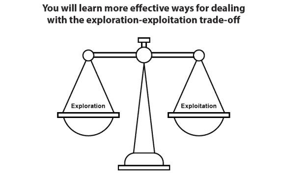

你将学习到处理探索-利用权衡的更有效的方法

这是关键直觉：探索构建了允许有效利用的知识，而最大化的利用是任何决策者的最终目标。

### 老虎机：单状态决策问题

*多臂老虎机*（MAB）是强化学习问题的一个特殊情况，其中状态空间的大小和时间步长等于一。MAB 有多个动作，一个状态和一个贪婪的时间步长；你也可以将其视为一个“多选项，单选择”的环境。这个名字来源于可以选择多个臂（老虎机）的投币机（更现实的是，可以选择多个投币机）。 

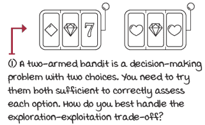

多臂老虎机问题

MAB 研究得出的方法在商业应用中有很多。广告公司需要找到一种正确的方式，在预测你可能点击的广告和展示有潜力成为更适合你的新广告之间取得平衡。为慈善机构或政治运动筹集资金的网站需要在展示导致最多贡献的布局和尚未充分利用但仍有更好结果潜力的新设计之间取得平衡。同样，电子商务网站需要在推荐畅销产品以及推荐有潜力的新产品之间取得平衡。在临床试验中，需要尽快了解药物对患者的效果。许多其他问题都受益于探索-利用权衡的研究：石油钻探、游戏和搜索引擎，仅举几例。我们研究 MAB 的原因并不是将其直接应用于现实世界，而是如何将一种适合平衡探索和利用的方法集成到 RL 代理中。

|  | 展示数学多臂老虎机 |
| --- | --- |
|  | 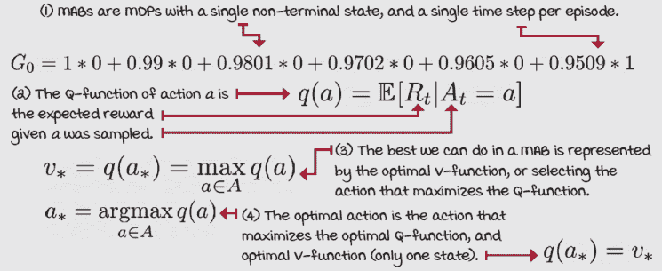 |

### 悔过：探索的成本

MAB 的目标与 RL 的目标非常相似。在 RL 中，代理需要最大化期望的累积折现奖励（最大化期望回报）。这意味着在环境具有多个状态且代理在每个集中与它进行多次交互的情况下，尽快（如果折现——后期奖励折现更多）通过整个集获得尽可能多的奖励（最大化）。这在环境具有多个状态且代理在每个集中与它进行多次交互的情况下是有意义的。但在 MAB 中，尽管有多个集，我们每个集只有一个选择动作的机会。

因此，我们可以从 RL 目标中排除不适用于 MAB 案例的词语：我们移除了“累积”，因为在每个集中只有一个时间步，以及“折现”，因为没有下一个状态需要考虑。这意味着，在 MAB 中，目标是让代理最大化期望奖励。请注意，“期望”这个词仍然存在，因为环境中存在随机性。实际上，这正是 MAB 代理需要学习的东西：奖励信号的潜在概率分布。

然而，如果我们把目标定为“最大化期望奖励”，那么比较代理就不再简单。例如，假设一个代理通过在除了最后一集之外的所有集中选择随机动作来学习最大化期望奖励，而一个样本效率更高的代理则使用一种巧妙策略快速确定最佳动作。如果我们只比较这些代理在最后一集的表现，这在强化学习中并不少见，这两个代理将会有同样好的表现，这显然不是我们想要的。

捕获更完整目标的一个稳健方法是，让智能体在最大化每集期望奖励的同时，仍然最小化所有集奖励的总期望损失。为了计算这个值，称为*总遗憾*，我们将每集真实期望奖励与所选动作的真实期望奖励之间的差异相加。显然，总遗憾越低，越好。注意我在这里使用“真实”这个词；为了计算遗憾，你必须能够访问 MDP。这并不意味着你的智能体需要 MDP，只是你需要它来比较智能体的探索策略效率。

|  | 展示数学公式总遗憾方程 |
| --- | --- |
|  |  |

### 解决 MAB 环境的策略

解决多臂老虎机（MAB）问题主要有三种方法。最流行且最直接的方法是在我们的动作选择过程中注入随机性来进行探索；也就是说，我们的智能体大部分时间会利用，有时会使用随机性进行探索。这一系列方法被称为*随机探索策略*。这个家族的一个基本例子是，大部分时间选择贪婪动作的策略，并且有一个 epsilon 阈值，随机均匀选择。现在，从这个策略中产生了多个问题；例如，我们应该在整个集数中保持这个 epsilon 值不变吗？我们应该在早期最大化探索吗？我们应该定期增加 epsilon 值以确保智能体始终进行探索？

另一种处理探索-利用困境的方法是保持乐观。是的，你妈妈是对的。*乐观探索策略*这一系列策略是一种更系统的方法，它量化决策问题中的不确定性，并增加对具有最高不确定性的状态的偏好。底线是，保持乐观会自然地将你引向不确定状态，因为你将假设你尚未经历的状态是最好的。这个假设将帮助你进行探索，随着你探索并直面现实，你的估计将随着它们接近真实值而越来越低。

处理探索-利用困境的第三种方法是*信息状态空间探索策略*这一系列策略。这些策略将智能体的信息状态建模为环境的一部分。将不确定性作为状态空间的一部分意味着，当未探索或已探索时，环境状态将被以不同的方式看待。将不确定性作为环境的一部分是一种合理的方法，但也会显著增加状态空间的大小及其复杂性。

在这一章中，我们将探讨前两种方法的一些实例。我们将在具有不同属性、优点和缺点的一小批不同的 MAB 环境中这样做，这将使我们能够深入比较策略。

重要的是要注意，在多臂老虎机（MAB）环境中对 Q 函数的估计相当直接，并且所有策略都会具有共同点。因为 MAB 是单步环境，为了估计 Q 函数，我们需要计算每个动作的平均奖励。换句话说，动作*a*的估计等于选择动作*a*时获得的总奖励除以动作*a*被选择的次数。

必须强调的是，我们在这个章节中评估的策略在估计 Q 函数方面没有差异；唯一的区别在于每个策略如何使用 Q 函数估计来选择动作。

|  | 一个具体例子滑动老虎机步（SBW）环境又回来了！ |
| --- | --- |
|  | 我们将要考虑的第一个 MAB 环境是我们之前玩过的：老虎机滑动步（BSW）。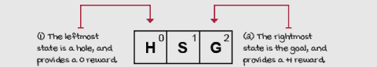老虎机滑动步环境记住，BSW 是一个单行的网格世界，因此是一个步。但这个步的特殊之处在于，智能体从中间开始，任何动作都会立即将智能体送入终端状态。因为它是一次性步，所以它是一个老虎机环境。BSW 是一个双臂老虎机，它对智能体来说可能看起来像是一个双臂伯努利老虎机。伯努利老虎机以概率*p*支付+1 的奖励，以概率*q = 1 – p*支付 0 的奖励。换句话说，奖励信号是一个伯努利分布。在 BSW 中，两个终端状态支付 0 或+1。如果你做数学计算，你会注意到选择动作 0 时获得+1 奖励的概率是 0.2，选择动作 1 时是 0.8。但你的智能体不知道这一点，我们也不会分享这个信息。我们试图问的问题是：你的智能体需要多快才能找出最佳动作？在学会最大化期望奖励的过程中，智能体会积累多少总遗憾？让我们来看看！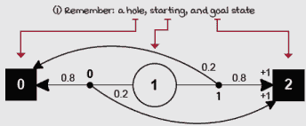老虎机滑动步图 |

### 贪婪：总是利用

我想要你考虑的第一个策略实际上不是一个策略，而是一个基线。我已经提到我们需要在我们的算法中有些探索；否则，我们可能会收敛到一个次优动作。但是，为了比较，让我们考虑一个完全没有探索的算法。

这个基线被称为*贪婪策略*，或*纯利用策略*。贪婪的动作选择方法包括始终选择具有最高估计值的动作。虽然我们选择的第一动作可能是最佳整体动作，但随着可用的动作数量增加，这种幸运巧合的可能性会降低。

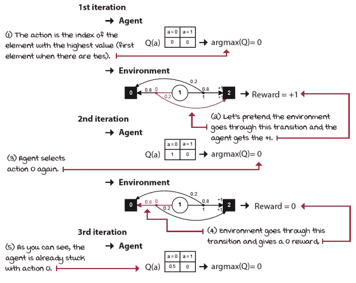

BSW 中的纯利用

如你所料，贪婪策略会立即陷入第一个动作。如果 Q 表初始化为零，并且环境中没有负面奖励，贪婪策略将始终陷入第一个动作。

|  | 我会说 Python 纯利用策略 |
| --- | --- |
|  |

```
def pure_exploitation(env, n_episodes=5000):
    Q = np.zeros((env.action_space.n)) ①
    N = np.zeros((env.action_space.n)) ②
    Qe = np.empty((n_episodes, env.action_space.n))
    returns = np.empty(n_episodes) ③
    actions = np.empty(n_episodes, dtype=np.int)
    name = 'Pure exploitation'
    for e in tqdm(range(n_episodes),                          ④
                  desc='Episodes for: ' + name, leave=False):
        action = np.argmax(Q) ⑤
        _, reward, _, _ = env.step(action) ⑥
        N[action] += 1 ⑦
        Q[action] = Q[action] + (reward - Q[action])/N[action]
        Qe[e] = Q
        returns[e] = reward                                   ⑧
        actions[e] = action
    return name, returns, Qe, actions
```

① 几乎所有策略都有相同的记账代码来估计 Q 值。② 我们将 Q 函数和计数数组初始化为零。③ 这些其他变量用于计算统计数据，不是必要的。④ 我们进入主循环并与环境交互。⑤ 足够简单，我们选择最大化我们估计的 Q 值的动作。⑥ 然后，将其传递给环境并接收新的奖励。⑦ 最后，我们更新计数和 Q 表。⑧ 然后，我们更新统计数据并开始新的回合。|

我想让你注意到贪婪策略和时间之间的关系。如果你的代理只剩下一回合，最好的做法是贪婪行动。如果你知道自己只剩一天可活，你会做你最享受的事情。在某种程度上，这就是贪婪策略所做的：它尽其所能，假设剩下的时间有限。

当你剩下的时间有限时，这样做是合理的；然而，如果你不这样做，那么你看起来是短视的，因为你不能为了获得信息而牺牲即时的满足感或奖励，这些信息将允许你获得更好的长期结果。

### 随机：始终探索

让我们也考虑光谱的另一端：一种具有探索但没有利用的策略。这是另一个基本的基线，我们可以称之为*随机策略*或*纯探索策略*。这仅仅是一种没有任何利用的行动选择方法。代理的唯一目标是获取信息。

你认识那些在开始一个新项目时，花很多时间“研究”而不跳入水中的吗？我也是！他们可以花几周时间阅读论文。记住，虽然探索是必要的，但它必须很好地平衡，以获得最大收益。

随机策略显然也不是一个好的策略，也会给你带来次优的结果。与一直利用类似，你也不想一直探索。我们需要能够同时进行探索和利用的算法：获取并使用信息。

我在代码片段中留下了一条注释，并想重新阐述并扩展它。我提出的纯探索策略是探索的一种方式，即随机探索。但你可以考虑许多其他方式。也许基于计数，即你尝试一个动作与尝试其他动作的次数相比，或者也许基于获得的奖励的方差。

让我们稍微思考一下：虽然只有一种利用的方法，但有多种探索的方法。利用只是做你认为最好的事情；这很简单。你认为 A 是最好的，你就做 A。另一方面，探索要复杂得多。显然，你需要收集信息，但如何收集信息是另一个问题。你可以尝试收集信息来支持你的当前信念。你可以收集信息来试图证明自己是错的。你可以基于自信或基于不确定性进行探索。这个列表可以继续下去。

核心是直观的：利用是你的目标，探索为你提供实现目标的信息。你必须收集信息以达到你的目标，这是显而易见的。但是，除了这一点之外，还有几种收集信息的方法，这就是挑战所在。

### epsilon-greedy：几乎总是贪婪，有时是随机的

现在让我们结合两种基线策略，即纯利用和纯探索，这样智能体就可以利用，同时也能收集信息以做出明智的决策。混合策略包括大多数时候贪婪行动，偶尔随机探索。

这种策略，被称为 *epsilon-greedy 策略*，效果出奇地好。如果您几乎每次都选择您认为最好的动作，您将获得稳定的结果，因为您仍在选择被认为最好的动作，但同时也选择了您尚未充分尝试的动作。这样，您的动作值函数就有机会收敛到其真实值；这反过来又可以帮助您在长期内获得更多奖励。

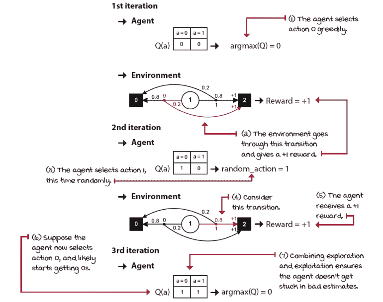

BSW 中的 epsilon-greedy

|  | 我会说 PythonEpsilon-greedy 策略 |
| --- | --- |
|  |

```
def epsilon_greedy(env, epsilon=0.01, n_episodes=5000):
 <...> ①
    name = 'E-greedy {}'.format(epsilon)
    for e in tqdm(range(n_episodes),
                  desc='Episodes for: ' + name,
                  leave=False):
        if np.random.random() > epsilon: ②③
            action = np.argmax(Q) ③
        else:
            action = np.random.randint(len(Q)) ④⑤
        <...> ⑥
    return name, returns, Qe, actions
```

① 与之前相同：删除了样板文本② epsilon-greedy 策略因其简单性而令人惊讶地有效。它包括偶尔随机选择一个动作。首先，需要抽取一个随机数并与超参数“epsilon”进行比较。③ 如果抽取的数字大于 epsilon，我们选择贪婪动作，即具有最高估计值的动作。④ 否则，我们通过随机选择一个动作来进行探索。⑤ 请注意，这可能会非常有效地产生贪婪动作，因为我们是从所有可用的动作中随机选择动作，包括贪婪动作。您并不是真的以 epsilon 概率进行探索，但这个概率略低于动作的数量。⑥ 删除了估计和统计代码 |

epsilon-greedy 策略是一种随机探索策略，因为我们使用随机性来选择动作。首先，我们使用随机性来决定是利用还是探索，但我们还使用随机性来选择一个探索性动作。还有其他随机探索策略，例如 softmax（将在本章后面讨论），它们没有那个第一个随机决策点。

我想让您注意，如果ε值为 0.5，并且您有两个动作，您不能说您的智能体将会有 50%的时间进行探索，如果“探索”意味着选择非贪婪动作。请注意，ε-greedy 中的“探索步骤”包括贪婪动作。实际上，您的智能体将探索的次数略少于ε值，这取决于动作的数量。

### 衰减ε-greedy：首先最大化探索，然后最大化利用

直观上，当智能体对环境的体验还不足时，我们希望它进行最多的探索；而后期，当它获得更好的价值函数估计时，我们希望智能体进行更多的利用。机制很简单：从大于或等于 1 的高ε值开始，并在每一步衰减其值。这种策略被称为*衰减ε-greedy 策略*，其形式取决于您如何改变ε的值。这里我向您展示了两种方法。

|  | 我会说 Python 线性衰减的ε-greedy 策略 |
| --- | --- |
|  |

```
def lin_dec_epsilon_greedy(env,
                           init_epsilon=1.0,
                           min_epsilon=0.01,
                         decay_ratio=0.05,
                         n_episodes=5000):
 <...> ①
    name = 'Lin e-greedy {} {} {}'.format(
                init_epsilon, min_epsilon, decay_ratio)
    for e in tqdm(range(n_episodes), 
                  desc='Episodes for: ' + name, 
                  leave=False):
        decay_episodes = n_episodes * decay_ratio           ②
        epsilon = 1 - e / decay_episodes
        epsilon *=  init_epsilon - min_epsilon               ③
        epsilon += min_epsilon
        epsilon = np.clip(epsilon, min_epsilon, init_epsilon)
        if np.random.random() > epsilon:
            action = np.argmax(Q) ④
        else:
            action = np.random.randint(len(Q))
        <...> ⑤
    return name, returns, Qe, actions
```

① 再次，样板代码已删除！② 线性衰减的ε-greedy 策略是通过使ε值随着步数的增加而线性衰减。我们首先计算我们希望将ε衰减到最小值的回合数。③ 然后，计算当前回合的ε值。④ 之后，一切与ε-greedy 策略相同。⑤ 这里也移除了统计数据。|

|  | 我会说 Python 指数衰减的ε-greedy 策略 |
| --- | --- |
|  |

```
def exp_dec_epsilon_greedy(env,
                         init_epsilon=1.0,
                           min_epsilon=0.01,
                           decay_ratio=0.1,
                           n_episodes=5000):
    <...> ①
    decay_episodes = int(n_episodes * decay_ratio)
    rem_episodes = n_episodes - decay_episodes
    epsilons = 0.01
    epsilons /= np.logspace(-2, 0, decay_episodes) ②
    epsilons *= init_epsilon - min_epsilon
    epsilons += min_epsilon
    epsilons = np.pad(epsilons, (0, rem_episodes), 'edge')
    name = 'Exp e-greedy {} {} {}'.format( init_epsilon, min_epsilon, decay_ratio)
    for e in tqdm(range(n_episodes), 
                  desc='Episodes for: ' + name, 
                  leave=False):
        if np.random.random() > epsilons[e]: ③
            action = np.argmax(Q)
        else:
            action = np.random.randint(len(Q))
        <...> ④
    return name, returns, Qe, actions
```

① 供您参考，代码不完整② 在这里，我们计算指数衰减的ε值。现在，请注意，你可以一次性计算出所有这些值，然后在循环过程中只查询预计算的值数组。③ 其他一切与之前相同。④ 当然，统计数据也被移除了。|

您可以处理ε衰减的许多其他方法：从简单的 1/回合到阻尼正弦波。甚至有相同线性技术和指数技术的不同实现。底线是，智能体应该早期以更高的概率进行探索，并在后期以更高的概率进行利用。早期，价值估计出错的可能性很高。然而，随着时间的推移和知识的积累，您的价值估计接近实际值的可能性增加，这时您应该减少探索的频率，以便利用获得的知识。

### 乐观初始化：一开始就相信这是一个美好的世界

另一种处理探索-利用困境的有趣方法是，将您尚未充分探索的动作视为最佳可能动作——就像您真的在天堂一样。这类策略被称为*面对不确定性的乐观主义*。乐观初始化策略是这个类别的一个实例。

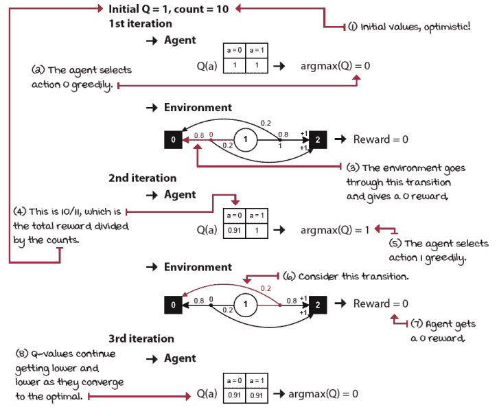

BSW 中的乐观初始化

乐观初始化策略的机制很简单：我们将 Q 函数初始化为高值，并使用这些估计贪婪地行动。需要澄清两点：首先，“高值”在强化学习（RL）中是我们无法获取的，我们将在本章后面解决这个问题；但就目前而言，假设我们提前知道了这个数字。其次，除了 Q 值之外，我们还需要将*计数*初始化为一个大于一的值。如果我们不这样做，Q 函数会变化得太快，策略的效果将会减弱。

|  | 我会说 Python 乐观初始化策略 |
| --- | --- |
|  |

```
def optimistic_initialization(env,  
                              optimistic_estimate=1.0,
                              initial_count=100,
                              n_episodes=5000):
    Q = np.full((env.action_space.n),
                 optimistic_estimate, ①
                 dtype=np.float64)
    N = np.full((env.action_space.n),
                 initial_count, ②
                 dtype=np.float64)
    <...> ③
    name = 'Optimistic {} {}'.format(optimistic_estimate, 
                                     initial_count)
    for e in tqdm(range(n_episodes),  
                  desc='Episodes for: ' + name, 
                  leave=False):
        action = np.argmax(Q)                               ④
        <...>                                               ⑤
    return name, returns, Qe, actions
```

① 在这个策略中，我们首先将 Q 值初始化为一个乐观的值。② 我们还初始化了将作为不确定性度量：数值越高，越确定。③ 这里移除了一些代码④ 之后，我们总是选择估计值最高的动作，类似于“纯利用”策略。⑤ 移除了更多代码 |

很有趣，对吧？妈妈是对的！因为智能体最初期望获得的奖励比实际能获得的更多，它会四处探索，直到找到奖励来源。随着它获得经验，“天真”的智能体逐渐消失，也就是说，Q 值会越来越低，直到收敛到它们的实际值。

再次强调，通过将 Q 函数初始化为高值，我们鼓励探索未探索的动作。随着智能体与环境的交互，我们的估计值将开始收敛到更低的、但更准确的估计值，使智能体能够找到并收敛到实际最高收益的动作。

重要的是，如果你打算贪婪地行动，至少要保持乐观。

|  | 一个具体例子两臂伯努利老虎机环境 |
| --- | --- |
|  | 让我们比较我们在一系列双臂伯努利赌博机环境中提出的策略的具体实例。双臂伯努利赌博机环境有一个非终止状态和两个动作。动作 0 有α的概率支付+1 奖励，而 1-α的概率将支付 0 奖励。动作 1 有β的概率支付+1 奖励，而 1-β的概率将支付 0 奖励。这在一定程度上类似于 BSW。BSW 有互补的概率：动作 0 以α的概率支付+1，动作 1 以 1-α的概率支付+1。在这种赌博机环境中，这些概率是独立的；它们甚至可以相等。看看我对双臂伯努利赌博机 MDP 的描述！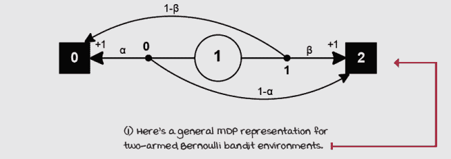双臂伯努利赌博机环境重要的是要注意，有几种不同的方式来表示这个环境。实际上，这并不是我在代码中这样写的，因为这里有很多冗余和不必要的信息。例如，考虑两个终止状态。两个动作可以转换到同一个终止状态。但是，你知道，画出来会让图变得太复杂了。这里的重要教训是你可以自由地以自己的方式构建和表示环境；没有唯一的正确答案。当然有多个错误的方式，但也有多个正确的方式。确保要*探索*！是的，我提到了那里。 |
|  | 计分板简单探索策略在双臂伯努利赌博机环境中 |
|  | 我运行了所有至今为止提出的策略的两个超参数实例：ε-贪婪、两种衰减和乐观方法，以及纯利用和探索基线，在五个带有概率α和β的双臂伯努利赌博机环境中，这些概率随机初始化，以及五个种子。结果是在 25 次运行中的平均值！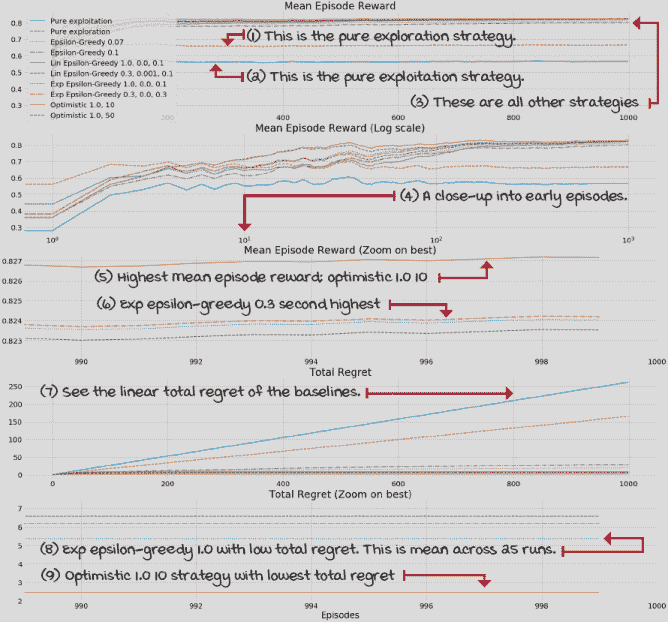在这个实验中表现最好的策略是具有 1.0 初始 Q 值和 10 个初始计数的乐观方法。所有策略都表现得很不错，这些策略并没有经过高度调整，所以这只是为了乐趣，没有其他原因。前往第四章的笔记本，玩一玩，享受乐趣。 |
|  | 细节简单策略在双臂伯努利赌博机环境中 |

|  | 让我们讨论这个实验中的几个细节。首先，我运行了五个不同的种子（12、34、56、78、90）来生成五个不同的双臂伯努利赌博机环境。记住，所有伯努利赌博机以一定的概率为每个臂支付+1 奖励。结果环境和它们的支付概率如下：带有种子 12 的双臂赌博机：

+   奖励概率：[0.41630234, 0.5545003 ]

带有种子 34 的双臂赌博机：

+   奖励概率：[0.88039337, 0.56881791]

带有种子 56 的双臂赌博机：

+   奖励概率：[0.44859284, 0.9499771 ]

带有种子 78 的双臂赌博机：

+   奖励概率：[0.53235706, 0.84511988]

带有种子 90 的双臂投币机：

+   奖励概率：[0.56461729, 0.91744039]

所有种子下的平均最优值是 0.83。所有策略都在上述每个环境中针对五个不同的种子（12, 34, 56, 78, 90）运行，以平滑和消除结果中的随机性。例如，我首先使用种子 12 创建了一个伯努利投币机，然后使用种子 12、34 等，以获取在种子 12 创建的环境中每个策略的性能。然后，我使用种子 34 创建另一个伯努利投币机，并使用 12、34 等来评估在种子 34 创建的环境中每个策略的性能。我为所有策略在所有五个环境中都这样做。总体而言，结果是五个环境和五个种子上的平均值，因此每个策略有 25 次运行。我独立地调整了每个策略，但也进行了手动调整。我使用了大约 10 种超参数组合，并从那些组合中选择了前两个。|

## 战略性探索

好的，想象一下你被分配了一个任务，那就是编写一个强化学习代理来学习驾驶汽车。你决定实现一个ε-贪婪探索策略。你将你的代理闪入汽车的电脑中，启动汽车，按下那个漂亮的明绿色按钮，然后你的汽车开始探索。它将掷硬币并决定随机采取一个动作，比如开到马路对面。你喜欢吗？对，我也不喜欢。我希望这个例子能帮助说明不同探索策略的必要性。

让我明确一点，这个例子当然是夸张的。你不会直接将未经训练的代理放入现实世界去学习。在现实中，如果你试图在真正的汽车、无人机或一般现实世界中使用 RL，你首先会在模拟中预训练你的代理，或者使用更高效的采样方法。

但是，我的观点仍然成立。如果你这么想，虽然人类在探索，但我们并不是随机探索。也许婴儿是这样的。但不是成年人。也许不精确是我们随机性的来源，但我们不会仅仅因为（除非你去拉斯维加斯）就随机嫁给某人。相反，我认为成年人有更战略性的探索方式。我们知道我们在牺牲短期满足以换取长期满足。我们知道我们想要获取信息。我们通过尝试那些我们没有充分尝试但有可能改善我们生活的事情来探索。也许，我们的探索策略是估计及其不确定性的组合。例如，我们可能更喜欢那些我们可能喜欢但尚未尝试的菜肴，而不是那些我们每周都喜欢的菜肴。也许我们根据我们的“好奇心”或预测误差来探索。例如，我们可能更倾向于尝试在一家我们认为味道可能不错的餐厅的新菜肴，但结果却是你吃过的最好的食物。那种“预测误差”和那种“惊喜”有时可能成为我们探索的指标。

在本章的剩余部分，我们将探讨一些稍微更高级的探索策略。其中一些仍然是随机探索策略，但它们将这种随机性应用于动作的当前估计值。其他探索策略则考虑了估计的置信度和不确定性水平。

话虽如此，我想重申，epsilon-greedy 策略（及其衰减版本）仍然是今天使用最广泛的探索策略，这可能是因为它表现良好，也可能是因为它的简单性。也许是因为大多数今天的强化学习环境都生活在计算机中，虚拟世界中的安全问题很少。认真思考这个问题很重要。平衡探索与利用之间的权衡，收集和利用信息是人类智能、人工智能和强化学习的核心。我确信这一领域的进步将对人工智能、强化学习以及所有对这一基本权衡感兴趣的领域产生重大影响。

### Softmax：按估计值成比例随机选择动作

如果随机探索策略考虑了 Q 值估计，那么它们更有意义。通过这样做，如果有一个动作的估计值非常低，我们尝试它的可能性就会降低。有一种称为*softmax 策略*的策略就是这样做的：它从动作值函数的概率分布中抽取动作，使得选择动作的概率与其当前的动作值估计成正比。这种策略也是随机探索策略家族的一部分，因为它在探索阶段注入了随机性。epsilon-greedy 策略从给定状态可用的完整动作集中均匀随机抽取，而 softmax 策略则基于高值动作的偏好进行抽取。

通过使用 softmax 策略，我们实际上是将动作值估计作为偏好的指标。值的高低并不重要；如果你给所有值加上一个常数，概率分布将保持不变。你将偏好放在 Q 函数上，并从这个偏好中根据概率分布抽取一个动作。Q 值估计之间的差异将产生一种倾向，即更频繁地选择估计值最高的动作，而较少选择估计值最低的动作。

我们还可以添加一个超参数来控制算法对 Q 值估计差异的敏感性。这个超参数被称为温度（参考统计力学），其工作方式是这样的：当它接近无穷大时，对 Q 值的偏好是相等的。基本上，我们均匀地采样一个动作。但是，当温度值接近零时，具有最高估计值的动作将以 100%的概率被采样。此外，我们可以以线性、指数或其他方式衰减这个超参数。但在实践中，出于数值稳定性的原因，我们不能使用无穷大或零作为温度；相反，我们使用一个非常高或非常低的正实数，并归一化这些值。

|  | Show Me The MathSoftmax 探索策略 |
| --- | --- |
|  | 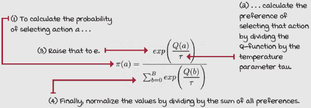 |
|  | 我会说 PythonSoftmax 策略 |
|  |

```
def softmax(env,
          init_temp=1000.0,
          min_temp=0.01,
            decay_ratio=0.04,
            n_episodes=5000):
 <...> ①
    name = 'SoftMax {} {} {}'.format(init_temp, 
 min_temp, 
                                     decay_ratio)
    for e in tqdm(range(n_episodes), 
 desc='Episodes for: ' + name, 
 leave=False):
        decay_episodes = n_episodes * decay_ratio
        temp = 1 - e / decay_episodes
        temp *= init_temp - min_temp                       ②
        temp += min_temp
        temp = np.clip(temp, min_temp, init_temp) ③
        scaled_Q = Q / temp
        norm_Q = scaled_Q - np.max(scaled_Q) ④⑤
        exp_Q = np.exp(norm_Q)
        probs = exp_Q / np.sum(exp_Q)
        assert np.isclose(probs.sum(), 1.0)
        action = np.random.choice(np.arange(len(probs)), ⑥
                                  size=1, 
                                  p=probs)[0]
        _, reward, _, _ = env.step(action)
        <...>                                              ⑦
    return name, returns, Qe, actions
```

① 为了简化，这里删除了代码。② 首先，我们以与线性衰减 epsilon 相同的方式计算线性衰减的温度。③ 我确保 min_temp 不是 0，以避免除以零。详细信息请查看笔记本。④ 接下来，我们通过将 softmax 函数应用于 Q 值来计算概率。⑤ 归一化以保持数值稳定性。⑥ 最后，我们确保得到了良好的概率，并根据这些概率选择动作。⑦ 同样，这里也删除了代码。 |

### UCB：这不仅仅是乐观，而是现实的乐观

在上一节中，我介绍了乐观初始化策略。这是一种巧妙（也许可以说是哲学性的）处理探索与利用权衡的方法，并且是面对不确定性时乐观策略家族中最简单的方法。但是，我们之前考虑的特定算法有两个显著的不便之处。首先，我们并不总是知道智能体可以从环境中获得的最大奖励。如果你将乐观策略的初始 Q 值估计设置得远高于其实际最大值，不幸的是，算法将表现不佳，因为智能体需要很多个回合（取决于“计数”超参数）才能将估计值接近实际值。但更糟糕的是，如果你将初始 Q 值设置得低于环境的最大值，算法将不再乐观，并且将不再起作用。

这种策略的第二个问题是我们所提出的，即“counts”变量是一个超参数，需要调整，但在现实中，我们试图用这个变量表示的是估计的不确定性，这不应该是一个超参数。一个更好的策略，而不是一开始就相信一切都会顺利，随意设置确定性度量值，遵循乐观初始化的相同原则，同时使用统计技术来计算值估计的不确定性，并将其作为探索的额外奖励。这正是*上置信界*（UCB）策略所做的事情。

在 UCB 中，我们仍然保持乐观，但这是一种更现实的乐观；而不是盲目地希望最好的结果，我们关注价值估计的不确定性。Q 值估计的不确定性越大，探索它的必要性就越大。请注意，这不再是相信值将是“最大可能的”，尽管它可能是！我们在这里关心的新指标是不确定性；我们希望给不确定性带来好处。

|  | 展示我数学上置信界（UCB）方程 |
| --- | --- |
|  |  |

要实现这种策略，我们选择具有最高 Q 值估计和动作不确定性奖励 U 的动作。也就是说，我们将添加一个奖励，即上置信界*uU*奖励值，因为我们对 Q 值估计更有信心；它们不是那么需要探索。

|  | 我会说 Python 上置信界（UCB）策略 |
| --- | --- |
|  |

```
def upper_confidence_bound(env,
                        c=2,
                        n_episodes=5000):
 <...> ①
    name = 'UCB {}'.format(c)
    for e in tqdm(range(n_episodes),
                desc='Episodes for: ' + name,
                leave=False):
        if e < len(Q): ②
            action = e
        else:
            U = np.sqrt(c * np.log(e)/N) ③
            action = np.argmax(Q + U) ④
        <...>                                      ⑤
    return name, returns, Qe, actions
```

① 为了简洁起见，删除了代码。② 我们首先选择所有动作一次，以避免除以零。③ 然后，继续计算置信界限。④ 最后，我们选择具有最高价值并带有不确定性奖励的动作：动作的价值越不确定，奖励就越高。⑤ 为了简洁起见，删除了统计代码。

在实际层面上，如果你将*u*作为剧集和计数的函数绘制出来，你会注意到它与指数衰减函数非常相似，但有几点不同。与显示平滑衰减的指数函数不同，它一开始有急剧的衰减和长长的尾巴。这使得在剧集数量低的时候，动作之间的较小差异会有更高的奖励，但随着剧集的增加和计数的增加，不确定性奖励的差异会变得较小。换句话说，在 100 次尝试与 200 次尝试中，0 次尝试应该比 100 次尝试得到更高的奖励。最后，*c*超参数控制奖励的规模：*c*值越高，奖励越高，*c*值越低，奖励越低。

### 汤普森抽样：平衡奖励和风险

UCB 算法是一种频率派处理探索与利用权衡的方法，因为它对 Q 函数背后的分布做出了最小的假设。但其他技术，如贝叶斯策略，可以使用先验来做出合理的假设并利用这些知识。*汤普森采样*策略是一种基于样本的概率匹配策略，它允许我们使用贝叶斯技术来平衡探索与利用的权衡。

实现这种策略的一种简单方法是跟踪每个 Q 值作为高斯分布（即正态分布）。实际上，你可以使用任何其他类型的概率分布作为先验；例如，beta 分布是一个常见的选择。在我们的情况下，高斯均值是 Q 值估计，高斯标准差衡量估计的不确定性，这些都会在每个剧集中进行更新。

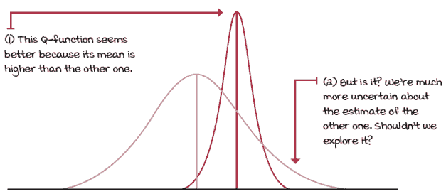

比较表示为高斯分布的两个动作值函数

如其名称所示，在汤普森采样中，我们从这些正态分布中进行采样，并选择返回最高样本值的动作。然后，为了更新高斯分布的标准差，我们使用一个类似于 UCB 策略的公式，在早期，当不确定性较高时，标准差更为重要；因此，高斯分布较宽。但随着剧集的进行，均值逐渐向更好的估计值移动，标准差降低，高斯分布缩小，因此其样本更有可能接近估计的均值。

|  | 我会说 Python 汤普森采样策略 |
| --- | --- |
| |

```
def thompson_sampling(env,
                    alpha=1,
                      beta=0,
                      n_episodes=5000):
 <...> ①
    name = 'Thompson Sampling {} {}'.format(alpha, beta)
    for e in tqdm(range(n_episodes),
                  desc='Episodes for: ' + name,
                  leave=False):
        samples = np.random.normal(
            loc=Q, scale=alpha/(np.sqrt(N) + beta)) ②
        action = np.argmax(samples) ③
        <...>                                               ④
    return name, returns, Qe, actions
```

① 初始化代码已移除② 在我们的实现中，我们将从高斯分布中采样数字。注意‘scale’（即高斯宽度，标准差）随着我们尝试每个动作的次数而缩小。同时，注意‘alpha’控制高斯初始宽度，而‘beta’控制它们缩小的速率。③ 然后，我们选择样本值最高的动作。④ 统计代码已移除 |

在这个特定的实现中，我使用了两个超参数：alpha，用于控制高斯的比例，即初始标准差的大小，以及 beta，用于调整衰减速率，使得标准差缩小得更慢。在实践中，这些超参数对于本章的示例需要很少的调整，因为，正如你可能已经知道的，标准差仅为五，例如，几乎是一个看起来平坦的高斯分布，代表着超过十单位的范围。鉴于我们的问题具有介于 0 和 1 之间的奖励（和 Q 值），以及大约介于-3 和 3 之间（下一个示例），我们不需要标准差太大的高斯分布。

最后，我想再次强调，使用高斯分布可能是 Thompson 抽样的最不常见的方法。Beta 分布似乎是这里的首选。我之所以喜欢这些问题的 Beta 分布，是因为它们围绕均值的对称性，以及它们的简单性使它们适合教学目的。然而，我鼓励你更深入地研究这个主题，并分享你发现的内容。

|  | 总结高级探索策略在双臂伯努利伯努利环境中的表现 |
| --- | --- |
|  | 我对每种新策略进行了两次超参数实例化：softmax、UCB 和 Thompson 方法，以及纯利用和探索基线，以及之前在相同五个双臂伯努利伯努利环境中的表现最好的简单策略。这又是五个环境中五个种子下的总共 10 个代理。每个策略总共运行 25 次。这些结果是这些运行的平均值！[](../Images/04_09_Sidebar18.png)除了乐观策略使用了我们不能假设拥有的领域知识之外，结果还表明更先进的方法表现更好。 |
|  | 具体示例 10 臂高斯伯努利环境 |
|  | 10 臂高斯伯努利环境仍然只有一个非终止状态；它们是伯努利环境。正如你可能已经猜到的，它们有十个臂或动作，而不是像它们的伯努利对应物那样有两个。但是，概率分布和奖励信号与伯努利伯努利不同。首先，伯努利伯努利有一个收益概率 p，而 1-p，臂不会支付任何东西。另一方面，高斯伯努利总是支付一些东西（除非它们采样一个 0——关于这一点稍后讨论）。其次，伯努利伯努利有一个二进制奖励信号：你要么得到+1，要么得到 0。相反，高斯伯努利每次都会支付，通过从高斯分布中采样奖励！[](../Images/04_09_Sidebar19a.png)10 臂高斯伯努利伯努利为了创建一个 10 臂高斯伯努利环境，你首先从标准正态分布（均值为 0，方差为 1）中采样 10 次，以获得最佳动作值函数**（a）**，方差为 1。 |
|  | 展示数学公式 10 臂高斯伯努利奖励函数 |
|  | 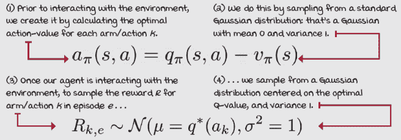 |
|  | 总结高级探索策略在 10 臂高斯伯努利环境中的表现 |
|  | 我运行了之前介绍过的简单策略的超参数实例化，现在是在五个 10 臂高斯赌博机环境中。这显然是一个“不公平”的实验，因为这些技术如果调整得当，在这个环境中可以表现得很好，但我的目标是展示，尽管环境发生了变化，最先进策略仍然可以用旧的超参数做得很好。你将在下一个例子中看到这一点！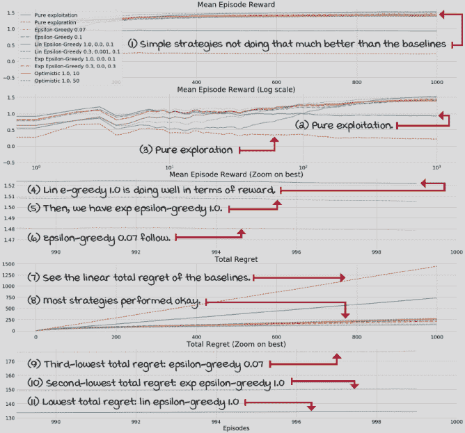看吧，几个最直接策略在五个不同场景中具有最低的总遗憾值和最高的预期奖励。想想看！ |
|  | 总结：10 臂高斯赌博机环境中的高级探索策略 |
|  | 我随后使用了与之前相同的超参数运行了高级策略。我还添加了两个基线以及 10 臂高斯赌博机中表现最好的两个简单策略。与其他所有实验一样，这总共是 25 次运行！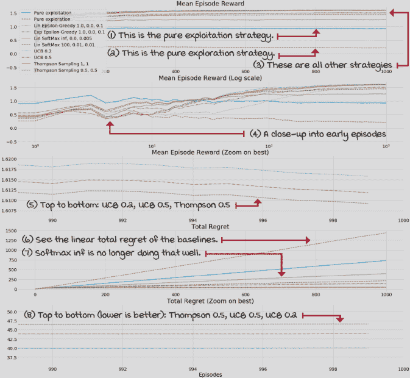这次只有高级策略取得了领先，总体遗憾值相当不错。现在你应该去笔记本上享受乐趣！请记住，如果你运行了额外的实验，也请与社区分享你的结果。我迫不及待地想看看你如何扩展这些实验。享受吧！ |

## 摘要

从评估反馈中学习是一个基本挑战，这使得强化学习与众不同。当从评估反馈中学习时，即+1、+1.345、+1.5、-100、-4，你的智能体不知道底层的 MDP，因此无法确定它能获得的最大奖励是多少。你的智能体“想”： “好吧，我得到了+1，但我不确定，也许这块石头下面有一个+100？”这种环境中的不确定性迫使你设计出探索的智能体。

但正如你所学的，你不能轻视探索。从根本上讲，探索浪费了本可以用来最大化奖励的周期，用于利用，然而，你的智能体在收集信息之前无法最大化奖励，或者至少假装它能，这就是探索的作用。突然之间，你的智能体必须学会平衡探索和利用；它必须学会妥协，在两个至关重要的但相互竞争的方面之间找到平衡。我们都在生活中面临过这种基本的权衡，所以这些问题应该对你来说很直观：“手中有鸟胜于林中两鸟”，然而“人的抱负应超越其能力”。选择你的毒药，享受这个过程，只是不要陷入其中任何一个。平衡它们！ |

了解这个基本权衡后，我们介绍了几种不同的技术来创建智能体或策略，以平衡探索和利用。epsilon-greedy 策略通过大部分时间利用和一小部分时间探索来实现。这一探索步骤是通过随机采样一个动作来完成的。衰减 epsilon-greedy 策略捕捉到智能体最初需要更多探索的事实，因为它们需要收集信息以开始做出正确的决策，但它们应该迅速开始利用，以确保它们不会积累遗憾，遗憾是衡量我们行动距离最优程度的一个指标。衰减 epsilon-greedy 策略随着剧集的增加而衰减 epsilon，希望随着我们的智能体收集信息而增加。

但然后我们学习了其他策略，这些策略试图确保“希望”更有可能实现。这些策略考虑了估计及其不确定性、潜力和可能性，并据此进行选择：乐观初始化、UCB、Thompson 抽样，尽管 softmax 实际上并不使用不确定性度量，但它通过在估计比例中随机选择来探索。

到现在为止，

+   理解从评估反馈中学习的挑战在于智能体无法看到控制其环境的底层 MDP

+   学到探索与利用之间的权衡源于这个问题

+   了解许多常用的策略来处理这个问题

|  | 在自己的工作中努力并分享你的发现 |
| --- | --- |

|  | 这里有一些想法，可以帮助你将所学知识提升到新的水平。如果你愿意，可以将你的结果分享给全世界，并确保查看其他人所做的事情。这是一个双赢的局面，希望你能充分利用它。

+   **#gdrl_ch04_tf01:** 解决多臂老虎机环境的技巧还有很多。尝试探索其他资源，并告诉我们哪些技巧是重要的。研究基于贝叶斯的方法进行动作选择，以及基于信息增益的动作选择策略。什么是信息增益？为什么在强化学习（RL）的背景下这很重要？你能开发出其他有趣的动作选择策略，包括使用信息衰减探索率的衰减策略吗？例如，想象一个根据状态访问次数衰减 epsilon 的智能体——也许基于另一个指标。

+   **#gdrl_ch04_tf02:** 你能想到一些其他有趣的带臂老虎机环境来研究吗？克隆我的带臂老虎机仓库([`github.com/mimoralea/gym-bandits`](https://github.com/mimoralea/gym-bandits) -它也被分叉了，)并向其中添加一些其他带臂老虎机环境。

+   **#gdrl_ch04_tf03:** 在 Bandit 环境之后，但在强化学习算法之前，还有一种被称为上下文 Bandit 问题的环境。这些是什么类型的问题？你能帮助我们理解这些是什么吗？但是，不要只是写一篇关于它们的博客文章。还要创建一个带有上下文 Bandit 的 Gym 环境。这是否可能？将这些环境创建在一个 Python 包中，并创建另一个 Python 包，其中包含可以解决上下文 Bandit 环境的算法。

+   **#gdrl_ch04_tf04:** 在每一章中，我都在使用最后的标签作为一个总标签。自由使用这个标签来讨论任何与你在这章中工作的相关内容。没有比你自己创建的作业更有趣的了。确保分享你设定要调查的内容和你的结果。

用你的发现写一条推文，@提及我 @mimoralea（我会转发），并使用这个列表中的特定标签来帮助感兴趣的人找到你的结果。没有对错之分；你分享你的发现，并检查他人的发现。利用这个机会社交，做出贡献，让自己更受关注！我们正在等待你的加入！以下是一条推文示例：“嘿，@mimoralea。我创建了一篇博客文章，列出了学习深度强化学习的资源列表。查看它在这里<链接>。#gdrl_ch01_tf01”我会确保转发并帮助他人找到你的作品。|
