# 5 评估智能体的行为

在本章中

+   你将学习在从同时具有顺序性和评价性的反馈中学习时如何估计策略。

+   当状态转移和奖励函数未知时，你将开发算法来评估强化学习环境中的策略。

+   你将为在显示完整强化学习问题的环境中估计策略的价值编写代码。

我认为人类大部分的痛苦都是由于他们对事物价值的错误估计而带来的。

—— 本杰明·富兰克林 美国开国元勋，作家，政治家，发明家和公民活动家

你知道平衡短期和长期目标是多么具有挑战性。你可能每天都会多次体验到这一点：今晚你应该看电影还是继续阅读这本书？一部电影能给你带来即时的满足感；你看完电影，就从贫穷到富有，从孤独到爱情，从超重到健康，等等，大约两个小时，而且还能吃爆米花。另一方面，阅读这本书今晚可能不会给你带来太多，但也许，只是也许，会在长期提供更高的满足感。

这正是我们之前讨论的另一个问题的完美过渡。在长期中，你将获得多少额外的满足感，确切地说，你可能会问。我们能知道吗？有没有一种方法可以找出答案？嗯，这就是生活的美妙之处：我不知道，你也不知道，除非我们尝试，除非我们**利用**。

然而，在前一章中，我们独立于强化学习的顺序方面研究了这一挑战。基本上，你假设你的行为没有长期影响，你唯一关心的是找到当前情况下最佳的选择。例如，你的关注点可能是选择一部好电影，或者一本好书，但不会考虑电影或书籍将如何影响你余下的生活。在这里，你的行为没有“累积效应。”

现在，在本章中，我们来看看那些从同时具有顺序性和评价性的反馈中学习的智能体；智能体需要同时平衡**继续阅读**？提示！

你很聪明... . 在本章中，我们将研究能够学习到强化学习**同等重要**方面的智能体。在机器学习中，有句俗语说，“模型的好坏取决于数据。”在强化学习中，我说，“策略的好坏取决于估计的准确性，”或者更详细地说，“策略的改进程度取决于其估计的准确性和精确度。”

再次强调，在深度强化学习（DRL）中，智能体从同时具有顺序性（与一次性相反）、评价性（与监督学习相反）和抽样（与穷举相反）的反馈中学习。在本章中，我们关注的是那些从同时具有顺序性和评价性的反馈中学习的智能体。我们暂时将“抽样”部分放在一边，但在第八章中，我们将打开这些大门，那里将充满乐趣。我保证。

## 学习估计策略的价值

如我之前所述，本章是关于学习估计现有策略的价值。当我最初接触到这个预测问题时，我没有理解其动机。对我来说，如果你想估计策略的价值，最直接的方法是重复运行策略并平均你所得到的结果。

而且，这确实是一个有效的途径，也许是最自然的。然而，我当时并没有意识到，还有许多其他方法可以用来估计值函数。这些方法各有优缺点。许多方法可以被视为完全相反的替代方案，但同时也存在一个中间地带，它创造了一个完整的算法谱系。

在本章中，我们将探讨这些方法的多样性，深入分析它们的优缺点，并展示它们是如何相互关联的。

| ŘŁ | 带有强化学习口音的奖励、回报与值函数 |
| --- | --- |
|  | **奖励**：指的是智能体获得的一步奖励信号：智能体观察到一个状态，选择一个动作，并接收到奖励信号。奖励信号是强化学习的核心，但并非智能体试图最大化的目标！再次强调，智能体并不是试图最大化奖励！意识到，虽然你的智能体在最大化一步奖励，但从长远来看，它获得的奖励可能少于它本可以获得的。**回报**：指的是总折扣奖励。回报是从任何状态计算得出的，通常持续到剧集结束。也就是说，当达到终端状态时，计算停止。回报通常被称为总奖励、累积奖励、奖励总和，并且通常是折扣的：总折扣奖励、累积折扣奖励、折扣奖励总和。但基本上是相同的：回报告诉你智能体在一个剧集中所获得的奖励有多少。正如你所看到的，回报是更好的性能指标，因为它们包含一个长期序列，一个单剧集的奖励历史。但回报也不是智能体试图最大化的目标！试图获得最高回报的智能体可能会找到一条噪声路径；有时，这条路径会提供高回报，但也许大多数时候回报较低。**值函数**：指的是回报的期望。当然，我们希望获得高回报，但高期望（平均）。如果智能体处于噪声环境中，或者如果智能体使用随机策略，那都是可以的。毕竟，智能体试图最大化的是期望的总折扣奖励：值函数。 |
|  | 米格尔的类比奖励、回报、值函数与生活 |
|  | 你如何面对生活？你是选择对自己最有利的行动，还是你是那些优先考虑他人而先考虑自己的人？两种方式都没有什么可耻的！对我来说，自私是一种极好的奖励信号。它带你走向成功。它推动你前进。在生活的早期，追求即时奖励可以是一个相当稳固的策略。许多人因为别人“太自私”而评判他们，但对我来说，这是开始行动的方式。去做你想做的事，去追求你的梦想，去做让你满足的事，去追求奖励！你看起来自私且贪婪。但你不应该在意。随着你继续前进，你会意识到追求奖励并不是最好的策略，即使是对你自己的好处。你开始看到更大的图景。如果你吃太多糖果，你的肚子会疼；如果你把所有的钱都花在网购上，你可能会破产。最终，你开始关注回报。你开始理解你的自私和贪婪动机背后还有更多。你放弃了贪婪的一面，因为它会从长远上伤害你，现在你意识到了这一点。但你还保持着自私，你仍然只从奖励的角度思考，但现在是从“总”奖励，即回报的角度。对此也不必感到羞耻！在某个时刻，你会意识到世界在没有你的情况下运转，世界比你最初想象的要复杂得多，世界有难以理解的潜在动态。你现在知道，“善有善报，恶有恶报”，不管以何种方式，不管何时，它都会发生。你再次退后一步；现在，你不再追求奖励或回报，而是追求价值函数。你变得聪明了！你意识到，你帮助他人学习得越多，你学到的就越多。不知道为什么，但这是真的。你越爱你的人生伴侣，他们就越爱你，不可思议！你越不花钱（储蓄），你就能花得越多。多么奇怪！注意，你仍然自私！但你现在意识到了世界的复杂潜在动态，并理解到，对自己最好的方式是帮助他人——这是一个完美的双赢局面。我希望奖励、回报和价值函数之间的区别能深深地印在你的心中，所以希望这能让你思考一会儿。跟随奖励！然后，是回报！然后，是价值函数。 |
|  | 一个具体的例子随机游走环境 |
|  | 在本章中，我们将主要使用一个称为随机游走（RW）的环境。这是一个单行网格世界环境，具有五个非终端状态。但它很特别，所以我想要从两个角度来解释它。一方面，你可以将 RW 视为一个环境，其中无论采取什么行动，向右走的概率都是 50%。毕竟，它是一个随机游走，疯狂！！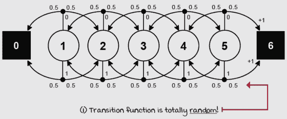随机游走环境 MDP 但对我来说，这并不是对 RW 令人满意的解释，也许是因为我喜欢代理控制某物的想法。在没有任何可能控制的环境中进行 RL（一个用于学习最优控制的框架）研究有什么意义呢！因此，你可以将 RW 视为一个具有确定性转移函数的环境（意味着如果代理选择左转，代理就会左转，如果选择右转，就会右转——正如预期的那样）。但假设代理想要评估一个随机策略，该策略以均匀随机的方式选择动作。一半的时间选择左转，另一半时间选择右转。无论如何，概念是相同的：我们有一个五个非终端状态的游走，其中代理以均匀随机的方式左右移动。目标是估计在这些情况下代理可以获得的总折现奖励的期望值。 |

### 首次访问蒙特卡洛：每轮后改进估计

好吧！目标是估计策略的价值，即学习从策略中期望获得多少总奖励。更确切地说，目标是估计策略π的状态值函数 vπ(s)。最直接的方法就是我之前提到的方法：就是运行几个带有此策略的回合，收集数百个轨迹，然后计算每个状态的平均值，就像我们在老虎机环境中做的那样。这种估计值函数的方法称为*蒙特卡洛预测*（MC）。

MC 易于实现。代理将首先使用策略π与环境交互，直到代理达到终端状态 s[T]。状态 s[t]，动作 A[t]，奖励 r[t+1]和下一个状态 s[t+1]的集合称为一个*经验元组*。一系列经验称为一个*轨迹*。你需要做的第一件事是让你的代理生成一个轨迹。

一旦你有了轨迹，你将为遇到的每个状态 *s*[t] 计算回报 *g*[t:T]。例如，对于状态 *s*[*t*]，你从时间步 *t* 开始向前，累加并折现沿途收到的奖励：*r*[*t*+1]*, R*[t+2]*, R*[t+3]*, ... , R*[*T*]，直到轨迹在时间步 *t* 结束。然后，你重复这个过程为状态 *s*[*t*+1]，累加从时间步 *t+1* 到达 *t* 的折现奖励；然后为 *s*[t+2] 以及所有其他状态，除了 *s*[*T*]，根据定义其值为 0。*g*[t:T] 将最终使用时间步 *t+1* 到轨迹结束的奖励，使用指数衰减折现因子：*γ*⁰*, *γ*¹*, *γ*²*, ... , *γ*^(T-1)。这意味着将相应的折现因子 *γ* 乘以奖励 *r*，然后累加沿途的乘积。

在生成轨迹并计算所有状态 *s*[t] 的回报后，你只需通过平均从每个状态 *s* 获得的回报，就可以在每次剧集 *e* 和最终时间步 *t* 结束时估计状态值函数 *v*π*(s)*。换句话说，我们正在用平均值估计一个期望值。就这么简单。

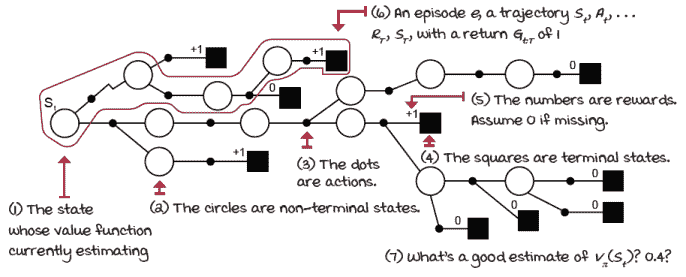

蒙特卡洛预测

|  | 展示数学：蒙特卡洛学习 |
| --- | --- |
|  | 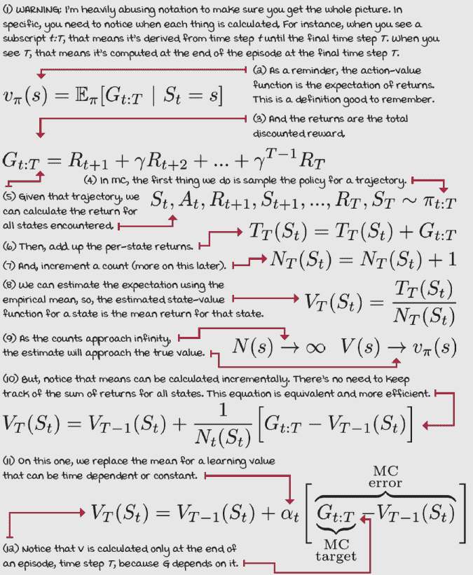 |

### 每次访问蒙特卡洛：处理状态访问的不同方式

你可能注意到在实践中，实现平均回报算法有两种不同的方式。这是因为单个轨迹可能包含对同一状态的多次访问。在这种情况下，我们应该独立计算每次访问的回报，然后将所有这些目标包括在平均值中，还是我们只使用每个状态的首次访问？

这两种方法都是有效的，并且它们具有相似的理论特性。更“标准”的版本是首次访问蒙特卡洛（FVMC），其收敛特性很容易证明，因为每个轨迹都是 *v*π*(s)* 的独立同分布（IID）样本，因此当我们收集无限样本时，估计将收敛到它们的真实值。每次访问蒙特卡洛（EVMC）略有不同，因为当状态在相同轨迹中被多次访问时，回报不再是独立同分布的。但幸运的是，EVMC 也已被证明在无限样本的情况下会收敛。

|  | 简化：首次访问与每次访问蒙特卡洛 |
| --- | --- |
|  | MC 预测估计 *v**π* 为 π 的回报的平均值。FVMC 每个状态在每个剧集只使用一个回报：首次访问后的回报。EVMC 平均所有访问到状态的回报，即使在同一剧集内也是如此。 |
| 0001 | 一点历史：首次访问蒙特卡洛预测 |
|  | 你可能之前听说过“蒙特卡洛模拟”或“运行”这个术语。一般来说，蒙特卡洛方法自 20 世纪 40 年代以来一直存在，是一类广泛使用的算法，它使用随机抽样进行估计。它们历史悠久且应用广泛。然而，直到 1996 年，Satinder Singh 和 Richard Sutton 在论文“具有替换资格痕迹的强化学习”中首次确定了首次和每次访问的 MC 方法。Satinder Singh 和 Richard Sutton 都从马萨诸塞大学阿默斯特分校获得了计算机科学博士学位，由 Andy Barto 教授指导，由于他们的许多基础性贡献，成为了强化学习领域的杰出人物，现在他们是 Google DeepMind 的杰出研究科学家。Rich 在 1984 年获得了博士学位，是阿尔伯塔大学的教授，而 Satinder 在 1994 年获得了博士学位，是密歇根大学的教授。 |
|  | 我会说 Python 指数衰减计划 |
|  |

```
def decay_schedule(init_value, min_value, ①
                   decay_ratio, max_steps,
                 log_start=-2, log_base=10):
    decay_steps = int(max_steps * decay_ratio) ②
    rem_steps = max_steps - decay_steps
    values = np.logspace(log_start, 0, decay_steps, 
                         base=log_base, endpoint=True)[::-1]
    values = (values - values.min()) / \                      ③
                                (values.max() - values.min())
    values = (init_value - min_value) * values + min_value
    values = np.pad(values, (0, rem_steps), 'edge')
    return values
```

① 此函数允许您计算整个训练过程中 alpha 的所有值。② 首先，使用 decay_ratio 变量计算衰减值的步数。③ 然后，将实际值计算为倒数对数曲线。注意我们随后将其归一化到 0 和 1 之间，最后将点转换到 init_value 和 min_value 之间。 |

|  | 我会说 Python 生成完整轨迹 |
| --- | --- |
|  |

```
def generate_trajectory(pi, env, max_steps=20):
    done, trajectory = False, []
    while not done: ①
        state = env.reset()
        for t in count():
            action = pi(state)
          next_state, reward, done, _ = env.step(action)
            experience = (state, action, reward,
                        next_state, done)
            trajectory.append(experience)
            if done: break
            if t >= max_steps - 1: ②
                trajectory = [] break
            state = next_state
    return np.array(trajectory, np.object)
```

① 这是一个简单的函数。它正在运行策略并提取用于离线处理的经验元组（轨迹）。② 这允许你传递最大步数，以便你可以根据需要截断长轨迹。 |

|  | 我会说 Python 蒙特卡洛预测 1/2 |
| --- | --- |
|  |

```
def mc_prediction(pi,                                         ①
                  env,
                gamma=1.0,
                  init_alpha=0.5,
                  min_alpha=0.01,
                  alpha_decay_ratio=0.3, ②
                  n_episodes=500,
                max_steps=100,
                  first_visit=True):
    nS = env.observation_space.n
    discounts = np.logspace( ③
          0, max_steps, num=max_steps,
          base=gamma, endpoint=False)
    alphas = decay_schedule( ④
          init_alpha, min_alpha,
        alpha_decay_ratio, n_episodes)
    V = np.zeros(nS) ⑤
    V_track = np.zeros((n_episodes, nS))
    for e in tqdm(range(n_episodes), leave=False): ⑥
        trajectory = generate_trajectory( ⑦
                pi, env, max_steps)
        visited = np.zeros(nS, dtype=np.bool) ⑧
        for t, (state, _, reward, _, _) in enumerate( ⑨
                                                   trajectory):
```

① mc_prediction 函数适用于首次访问和每次访问的 MC。您在这里看到的超参数是标准的。记住，折现因子 gamma 取决于环境。② 对于学习率 alpha，我使用从 init_alpha 的 0.5 衰减到 min_alpha 的 0.01 的衰减值，在前 500 个总最大剧集的 30%内衰减（alpha_decay_ratio 为 0.3）。我们已经在之前的功能中讨论了 max_steps，所以我正在传递这个参数。并且 first_visit 在 FVMC 和 EVMC 之间切换。③ 这很酷。我一次计算所有可能折扣。这个 logspace 函数对于 gamma 为 0.99 和最大步数为 100 返回一个 100 个数字的向量：[1, 0.99, 0.9801, ..., 0.3697]。④ 这里我计算所有的 alpha！⑤ 这里我们初始化在主循环内部使用的变量：当前状态价值函数的估计 V，以及每个剧集的 V 副本，用于离线分析。⑥ 我们为每个剧集循环。注意，我们在这里使用‘tqdm’。这个包会打印进度条，对我来说很有用。你可能不需要它（除非你也像我一样不耐烦）。⑦ 生成完整轨迹。⑧ 初始化访问检查布尔向量。⑨ 这最后一行在下一页重复出现是为了方便您阅读。 |

|  | 我会说 Python 蒙特卡洛预测 2/2 |
| --- | --- |
|  |

```
        for t, (state, _, reward, _, _) in enumerate( ⑩⑪
                                                   trajectory):
            if visited[state] and first_visit: ⑫
                continue ⑬
            visited[state] = True
            n_steps = len(trajectory[t:])                     ⑭⑮
            G = np.sum(discounts[:n_steps] * trajectory[t:, 2])  ⑯
            V[state] = V[state] + alphas[e] * (G - V[state]) ⑰
        V_track[e] = V                                          ⑱
    return V.copy(), V_track                                    ⑲
```

⑩ 这第一行在上一页重复出现是为了方便您阅读。⑪ 我们现在遍历轨迹中的所有经验。⑫ 检查状态是否已经在该轨迹上访问过，并执行 FVMC。⑬ 如果是，我们处理下一个状态。⑭ 如果这是第一次访问或者我们在执行 EVMC，我们处理当前状态。⑮ 首先，计算从 *t* 到 *T* 的步数。⑯ 然后，计算回报。⑰ 最后，估计价值函数。⑱ 跟踪这一幕的 V。⑲ 完成后返回 V 和跟踪信息。 |

| ŘŁ | 带有强化学习口音的增量与顺序与试错 |
| --- | --- |
|  | **增量方法**：指的是估计的迭代改进。动态规划是一种增量方法：这些算法迭代地计算答案。它们不与环境“交互”，而是通过连续迭代、增量地达到答案。多臂老虎机也是增量方法：它们通过连续的剧集或试验达到良好的近似。强化学习也是增量方法。根据具体算法，估计是在每个剧集或每个时间步的基础上增量改进的。**顺序方法**：指的是在具有多个非终止（且可到达）状态的环境中学习。动态规划是一种顺序方法。多臂老虎机不是顺序方法，它们是一状态一步马尔可夫决策过程。代理的行为没有长期后果。强化学习肯定是顺序的。**试错方法**：指的是通过与环境的交互进行学习。动态规划不是试错学习。多臂老虎机是试错学习。强化学习也是试错学习。 |

### 时间差分学习：每一步改进估计

蒙特卡洛方法的一个主要缺点是代理必须等待到剧集结束时才能获得实际回报 *g*[*t:T*]，然后才能更新状态值函数估计 *v**T*。一方面，蒙特卡洛方法具有相当稳健的收敛性质，因为它将值函数估计 *v**T* 更新到实际回报 *g*[*t*]:[*T*]，这是一个对真实状态值函数 *v**π* 的无偏估计。

然而，尽管实际回报的估计相当准确，但它们也不是非常精确。实际回报也是对真实状态值函数 *v**π* 的高方差估计。这很容易理解：实际回报在相同的轨迹中累积了许多随机事件；所有动作、所有下一个状态、所有奖励都是随机事件。实际回报 *G*[*t:T*] 收集并复合了所有这些随机性，跨越多个时间步，从 *t* 到 *T*。再次强调，实际回报 *G*[*t:T*] 是无偏的，但方差很高。

此外，由于实际回报 *g*[*t*]:[*T*] 的高方差，蒙特卡洛方法可能样本效率低下。所有这些随机性都变成了噪声，只能通过数据、大量数据、大量轨迹和实际回报的估计来缓解，即使只是部分估计？想想看！

是的！你可以使用单步奖励*r*[*t*+1]，一旦你观察到下一个状态*s*[*t*+1]，你可以使用状态值函数估计*v(S*[*t*+1])作为下一个步骤*g*[t+1:][*T*]的回报估计。这是*时序差分*(TD)方法所利用的关系。这些方法与 MC 不同，可以通过使用单步实际回报（即立即奖励*r*[*t*+1]），然后从下一个状态开始估计回报，即下一个状态的状态值函数估计*v(S*[*t*+1])：即*r*[*t*+1] *+* *γ**v(S*[*t*+1])，这被称为**TD 目标**。 |

|  | 简化时序差分学习和自举 |
| --- | --- |
|  | TD 方法使用对*v**π*的估计来估计*v**π*。它通过从猜测中猜测来自举；它使用估计的回报而不是实际回报。更具体地说，它使用*r*[*t*+1] + γ*v**t*来计算和估计*v**t*+1。因为它也使用了一步的实际回报*r*[*t*+1]，所以一切正常。这个奖励信号*r*[*t*+1]逐渐将“现实”注入到估计中。 |
|  | 展示数学时序差分学习方程 |
|  |  |
|  | 我会说 Python 时序差分学习算法 |
|  |

```
def td(pi,                                                    ①
       env,
     gamma=1.0,
       init_alpha=0.5, ②
       min_alpha=0.01, ③
       alpha_decay_ratio=0.3,
       n_episodes=500):
    nS = env.observation_space.n
    V = np.zeros(nS) ④
    V_track = np.zeros((n_episodes, nS))
    alphas = decay_schedule( ⑤
          init_alpha, min_alpha,
          alpha_decay_ratio, n_episodes)
    for e in tqdm(range(n_episodes), leave=False): ⑥
        state, done = env.reset(), False
        while not done: ⑦
            action = pi(state) ⑧
            next_state, reward, done, _ = env.step(action) ⑨
            td_target = reward + gamma * V[next_state] * \ ⑩
                                                     (not done)
            td_error = td_target - V[state] ⑪
            V[state] = V[state] + alphas[e] * td_error        ⑫
            state = next_state                                ⑬
        V_track[e] = V
    return V, V_track                                         ⑭
```

① td 是一种预测方法。它接受一个策略 pi，一个与环境交互的环境 env，以及折扣因子 gamma。②学习方法有一个可配置的超参数 alpha，它是学习率。③处理学习率的一种方法是对其进行指数衰减。初始值是 init_alpha，min_alpha，最小值，alpha_decay_ratio 是 alpha 从 init_alpha 衰减到 min_alpha 所需剧集的分数。④我们初始化所需的变量。⑤然后我们计算所有剧集的学习率计划...⑥...然后循环 n_episodes。⑦我们获取初始状态然后进入交互循环。⑧首先是要采样策略 pi 以在状态中采取行动。⑨然后我们使用行动与环境交互...我们执行策略的一步。⑩我们可以立即计算一个目标来更新状态值函数的估计...⑪...然后，有了目标，一个误差。⑫最后更新*V*(*s*)⑬不要忘记更新下一次迭代的变量。这种错误可能很难找到！⑭然后返回 V 函数和跟踪变量。 |

| ŘŁ | 带有强化学习口音的真实与实际与估计 |
| --- | --- |
|  | **真实值函数**：指的是精确且完美准确的价值函数，就像由先知给出的一样。真实值函数是代理通过样本估计的价值函数。如果我们有真实值函数，我们就可以很容易地估计回报。**实际回报**：指的是经验回报，与估计回报相对。代理只能体验实际回报，但它们可以使用估计的价值函数来估计回报。实际回报指的是完整的经验回报。**估计价值函数或估计回报**：指的是对真实值函数或实际回报的粗略计算。“估计”意味着一个近似值，一个猜测。真实值函数让你估计回报，而估计价值函数会给这些估计增加偏差。 |

现在，为了清楚起见，*TD* 目标是对真实状态值函数 *v*π*(s)* 的有偏估计，因为我们使用状态值函数的估计来计算状态值函数的估计。是的，我知道这听起来很奇怪。这种用估计来更新估计的方法被称为自助法，这与我们在第三章中学习的动态规划方法非常相似。但是，DP 方法是在一步期望上自助，而*TD*方法是在一步期望的样本上自助。这个词“样本”有很大的区别。

在好的方面，新的估计回报，即*TD*目标，是我们用于蒙特卡洛更新的*t:T*。这是因为*TD*目标只依赖于单个动作、单个转换和单个奖励，因此积累的随机性要少得多。因此，*TD*方法通常比 MC 方法学习得更快。

| 0001 | 一点历史时序差分学习 |
| --- | --- |
|  | 在 1988 年，理查德·萨顿发表了一篇题为“通过时序差分方法学习预测”的论文，其中他介绍了*TD*学习方法。我们在这章中使用的 RW 环境也首次在这篇论文中提出。这篇论文的关键贡献是意识到，虽然 MC 方法使用预测和实际回报之间的差异来计算误差，但*TD*能够使用时序连续预测之间的差异，因此得名时序差分学习。TD 学习是 SARSA、Q 学习、双 Q 学习、深度 Q 网络（DQN）、双深度 Q 网络（DDQN）等方法的前身。我们将在本书中学习这些方法。 |

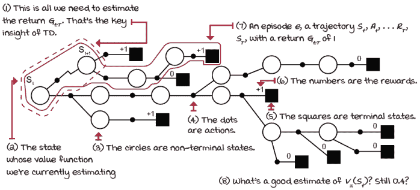

TD 预测

|  | 它在于细节 FVMC, EVMC, 和 *TD* 在 RW 环境中 |
| --- | --- |
|  | 我在这三个策略评估算法上运行了 RW 环境。所有方法都评估了全左策略。现在，请记住，环境的动态使得任何动作，无论是左还是右，都有相同的过渡概率（50% 左和 50% 右）。在这种情况下，被评估的策略是不相关的。我在所有算法中使用了相同的学习率 alpha 的调度：alpha 从 0.5 开始，在 500 个总回合中的 250 个回合内指数衰减到 0.01。这是总回合数的 50%。这个超参数至关重要。通常，alpha 是一个小于 1 的正常数。在非平稳环境中，保持 alpha 的常数有助于学习。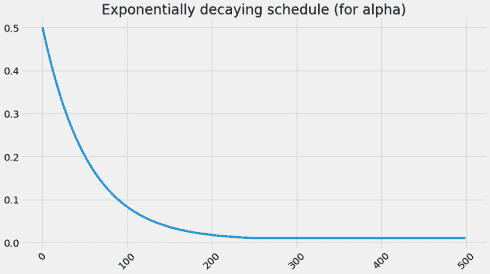然而，我选择衰减 alpha 以展示收敛。我衰减 alpha 的方式有助于算法接近收敛，但由于我没有将 alpha 减少到零，它们并没有完全收敛。除此之外，这些结果应该能帮助你了解这些方法之间的差异。 |
|  | Tally it UpMC 和 *TD* 都几乎收敛到真实的状态值函数 |
|  | 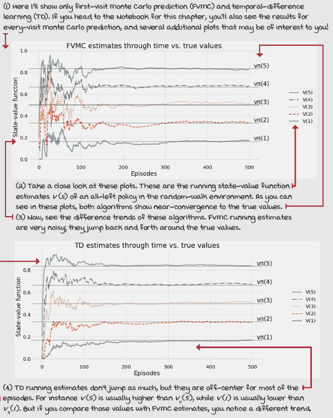 |
|  | Tally it UpMC 的估计值有噪声；*TD* 的估计值偏离目标 |
|  | 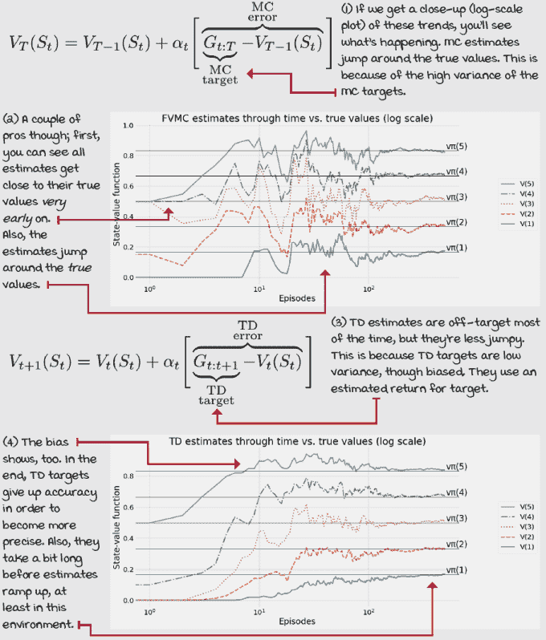 |
|  | Tally it UpMC 旨在解决高方差问题；*TD* 旨在解决偏差问题 |
|  | 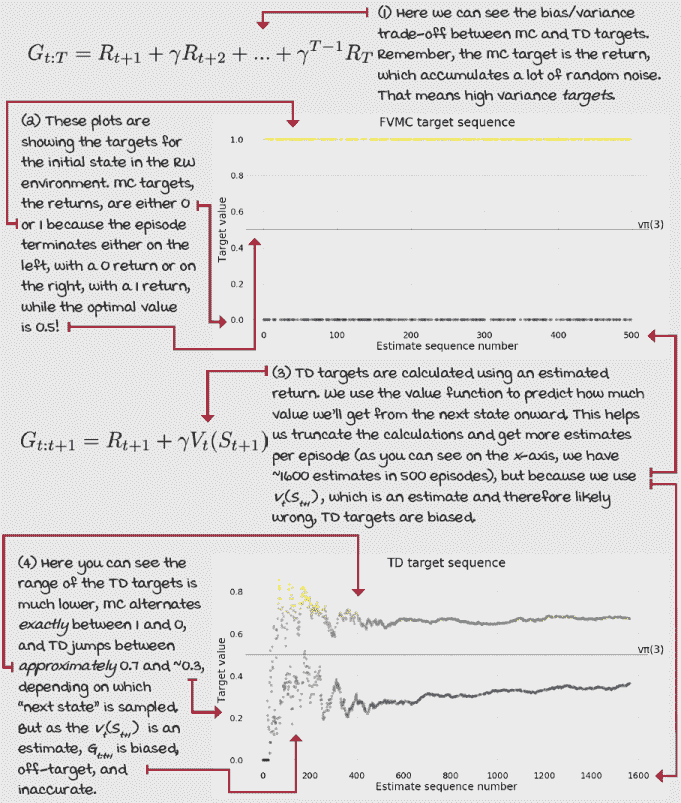 |

## 从多步学习估计

在本章中，我们探讨了通过交互估计给定策略的价值函数的两个核心算法。在 MC 方法中，我们在估计值函数之前，对环境进行采样直到回合结束。这些方法将实际回报，即折现的总奖励，分配到所有状态上。例如，如果折现因子小于 1，并且回报只有 0 或 1，就像 RW 环境中那样，MC 目标将始终为每个单个状态是 0 或 1。相同的信号被推回到轨迹的起点。这显然不适用于具有不同折现因子或奖励函数的环境。

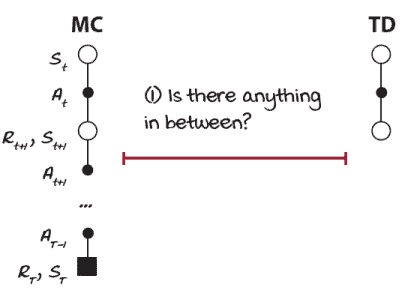

中间是什么？

另一方面，在 *TD* 学习中，智能体与环境只交互一次，然后估计到达目标状态的预期回报，然后估计目标，然后是值函数。*TD* 方法是自举的：它们从一个猜测形成另一个猜测。这意味着，与 MC 方法等待直到一个回合的结束以获取实际回报不同，*TD* 方法使用单步奖励，然后估计预期的回报到目标，即下一个状态的价值函数。

但是，中间有什么东西吗？我的意思是，*TD* 在一步之后进行自举是不错的，但是两步之后呢？三步？四步？我们应该等待多少步之后才去估计期望回报并基于值函数进行自举？

实际上，在蒙特卡洛（MC）和 *TD* 之间存在着一系列算法。在本节中，我们将探讨中间部分。你会发现我们可以调整我们的目标依赖于多少自举，从而平衡偏差和方差。

|  | 米格尔的类比：MC 和 TD 具有不同的个性 |
| --- | --- |
|  | 我喜欢将蒙特卡洛风格的算法视为 A 型人格的代理人，而 *TD* 风格的算法视为 B 型人格的代理人。如果你查阅一下，你就会明白我的意思。A 型人格的人是结果驱动的，时间观念强，做事有条理，而 B 型人格的人则随和、深思熟虑，有点嬉皮士的风格。MC 使用实际回报，而 *TD* 使用预测回报，这应该让你怀疑每种目标类型都有其个性。思考一下；我相信你一定能注意到几个有趣的模式来帮助你记忆。 |

### N 步 *TD* 学习：在几步之后改进估计

动机应该是清晰的；我们有两种极端，蒙特卡洛方法和时间差分方法。根据具体情况，一种方法可能比另一种方法表现更好。MC 是一个无限步方法，因为它一直进行到情节的结束。

我知道，“无限”可能听起来有些令人困惑，但回想一下第二章，我们定义一个终端状态为一个所有动作和所有从这些动作产生的转换都回到该状态的循环状态，没有奖励。这样，你可以想象一个代理人在这个循环中永远“卡住”，因此进行无限多的步骤，而没有积累奖励或更新状态值函数。

另一方面，*TD* 是一个单步方法，因为它在与环境交互一步之后进行自举和更新状态值函数。你可以将这些两种方法推广为一个 *n* 步方法。与其像 *TD* 一样只进行一步，或者像 MC 一样进行整个情节，为什么不使用 *n* 步来计算值函数并抽象出 *n* 呢？这种方法被称为 *n* 步 *TD*，它进行 *n* 步的自举。有趣的是，中间的 *n* 值通常比两种极端都表现更好。你看，你不应该成为一个极端主义者！

|  | 展示数学：N 步时间差分方程 |
| --- | --- |
|  | 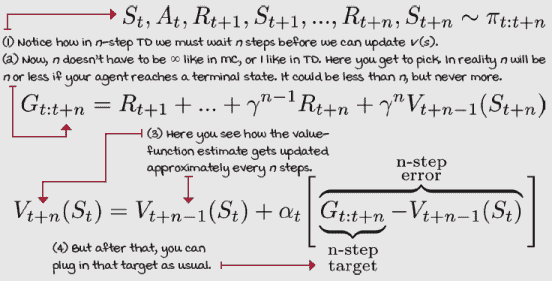 |
|  | 我会说 Python：N 步 *TD* |
|  |

```
def ntd(pi,                                                     ①
        env,
      gamma=1.0,
        init_alpha=0.5, ②
        min_alpha=0.01,
        alpha_decay_ratio=0.5,
        n_step=3,
        n_episodes=500):
    nS = env.observation_space.n                                ③
    V = np.zeros(nS)
    V_track = np.zeros((n_episodes, nS))
    alphas = decay_schedule( ④
          init_alpha, min_alpha,
        alpha_decay_ratio, n_episodes)
    discounts = np.logspace( ⑤
         0, n_step+1, num=n_step+1, base=gamma, endpoint=False)
    for e in tqdm(range(n_episodes), leave=False): ⑥
        state, done, path = env.reset(), False, [] ⑦
        while not done or path is not None: ⑧
            path = path[1:] ⑨
            while not done and len(path) < n_step: ⑩
            while not done and len(path) < n_step: ⑪
                action = pi(state)
                next_state, reward, done, _ = env.step(action)  ⑫
                experience = (state, reward, next_state, done)
                path.append(experience)
                state = next_state
                if done:
                    break
            n = len(path) ⑬
            est_state = path[0][0] ⑭
            rewards = np.array(path)[:,1] ⑮
            partial_return = discounts[:n] * rewards            ⑯
            bs_val = discounts[-1] * V[next_state] * (not done) ⑰
            ntd_target = np.sum(np.append(partial_return,       ⑱
                                          bs_val))
            ntd_error = ntd_target - V[est_state] ⑲
            V[est_state] = V[est_state] + alphas[e] * ntd_error ⑳
            if len(path) == 1 and path[0][3]: ㉑
                path = None
        V_track[e] = V
    return V, V_track                                           ㉒
```

① 这里是我的 *n*-步 *TD* 算法的实现。你可以用很多种方式来实现它；这是其中一种供你参考。② 我们在这里使用与之前相同的超参数。注意 n_step 的默认值是 3。这意味着三步然后进行自举，或者如果遇到终端状态，则更少，在这种情况下我们不会再次进行自举（再次强调，终端状态的价值定义为零。）③ 这里是我们通常会遇到的情况。④ 提前计算所有 alpha 值。⑤ 现在，这里是一个 MC 和 *TD* 的混合体。注意我们计算了折现因子，但与我的 MC 实现不同，我们不是走到 max_steps，而是走到 n_step + 1，包括 *n* 步和自举估计。⑥ 我们进入情节循环。⑦ 这个路径变量将保存最近的 n_step 经验。这是一个部分轨迹。⑧ 我们会继续进行，直到完成并设置路径为 none。你很快就会看到。⑨ 这里，我们在“弹出”路径的第一个元素。⑩ 这一行会在下一页重复。⑪ 同样。只是为了让你跟随缩进。⑫ 这是交互块。我们基本上是在收集经验，直到完成或路径长度等于 n_step。⑬ *n* 这里可以是 ‘n_step’，但如果路径中有一个终端状态，它也可以是一个更小的数字。⑭ 这里我们正在提取我们正在估计的状态，这并不是状态。⑮ rewards 是从 est_state 到 *n* 遇到的所有奖励的向量。⑯ partial_return 是从 est_state 到 *n* 的 *折现* 奖励的向量。⑰ bs_val 是自举值。注意在这种情况下，下一个状态是正确的。⑱ ntd_target 是部分回报和自举值的总和。⑲ 这是错误，就像我们一直在计算的那样。⑳ 这是状态值函数的更新。㉑ 这里我们设置路径为 None 以跳出情节循环，如果路径只有一个经验且该经验的完成标志为 True（路径中只有一个终端状态。）㉒ 我们像往常一样返回 V 和 V_track。| 

### 前瞻性 *TD*(*λ*)：改进所有访问状态的估计

但是，一个问题出现了：那么一个好的 *n* 值是什么？你什么时候应该使用一步、两步、三步，或者任何其他步骤？我已经给出了实际的建议，即通常高于一的所有 *n* 值都更好，但我们也不应该走到实际回报。自举有帮助，但其偏差是一个挑战。

使用所有 *n*-步目标的加权组合作为一个单一目标如何？我的意思是，我们的智能体可以出去计算与一、二、三、……无限步目标相对应的 *n*-步目标，然后使用指数衰减因子将这些目标混合在一起。这绝对有必要！

这就是一种称为**向前视角 TD(λ**)的方法。向前视角的**TD(λ**)是一种将多个**n**步合并为单个更新的预测方法。在这个特定版本中，智能体必须等待一个场景的结束，才能更新状态值函数的估计。然而，另一种称为**向后视角 TD(λ**)的方法，可以将相应的更新拆分为部分更新，并将这些部分更新应用于每个步骤的状态值函数估计，就像沿着轨迹留下**TD**更新的痕迹。很酷，对吧？让我们更深入地了解一下。

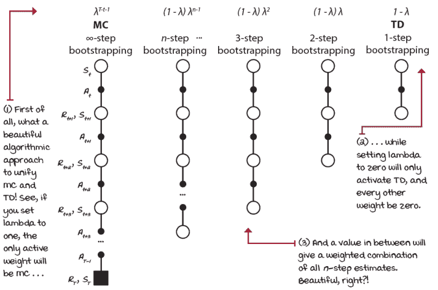

泛化回溯

|  | 显示数学公式：向前视角的**TD(λ**) |
| --- | --- |
| 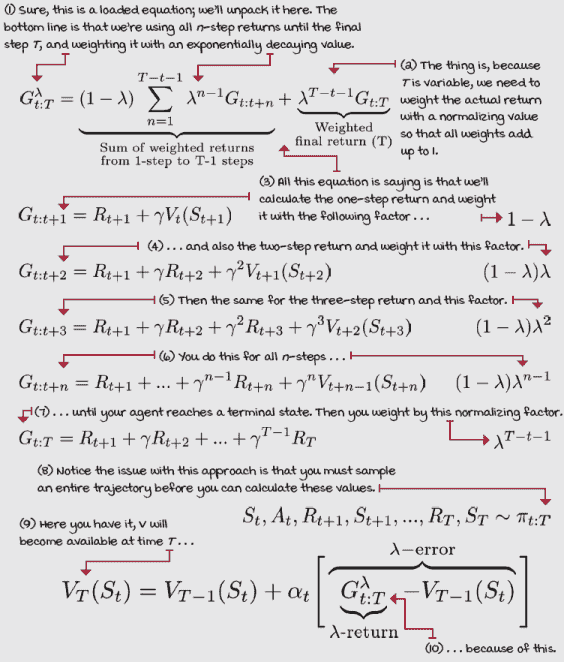 |

### **TD(λ**)：在每个步骤后改进所有访问状态估计

蒙特卡洛（MC）方法受到“时间步诅咒”的影响，因为它们只能在达到终端状态后才能对状态值函数估计应用更新。使用**n**步回溯，你仍然受到“时间步诅咒”的影响，因为你仍然必须等待与环境的**n**次交互过去后，才能对状态值函数估计进行更新。你基本上是在一个**n**步延迟中追赶。例如，在五步回溯方法中，你必须等待看到五个（或当达到终端状态时更少）状态和五个奖励，然后才能进行任何计算，有点像蒙特卡洛方法。

在向前视角的**TD(λ**)中，我们回到了蒙特卡洛的时间步；向前视角的**TD(λ**)也必须等待一个场景的结束，才能将相应的更新应用于状态值函数估计。但至少我们得到了一些东西：如果我们愿意接受偏差，我们可以得到更低方差的目标。

除了泛化和统一蒙特卡洛（MC）和**TD**方法外，向后视角的**TD(λ**)，或简称为**TD(λ**)，还可以调整偏差/方差权衡，除了在每个时间步应用更新的能力外，就像**TD**一样。

提供这种优势的机制被称为**资格跟踪**。资格跟踪是一个记忆向量，它跟踪最近访问过的状态。基本思想是跟踪每个步骤上可以更新的状态。我们不仅跟踪状态是否有资格更新，而且还跟踪其程度，以确保相应的更新正确应用于有资格的状态。

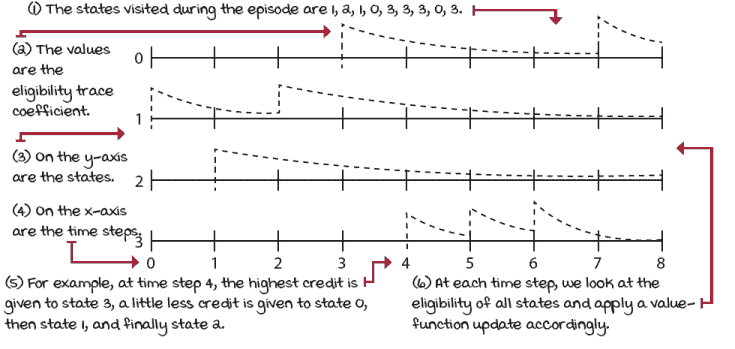

在八步场景中，四个状态环境的资格跟踪

例如，所有资格迹都初始化为零，当你遇到一个状态时，你将其迹增加一个一。每次时间步，你计算所有状态的值函数的更新，并将其乘以资格迹向量。这样，只有合格的状态会得到更新。更新后，资格迹向量通过*λ*（权重混合因子）和*γ*（折扣因子）衰减，这样未来的强化事件对早期状态的影响就小了。通过这样做，最近的状态在最近转换中遇到的奖励比在剧集早期访问的状态获得更多的信用，前提是*λ*没有设置为 1；否则，这类似于 MC 更新，它给剧集期间访问的所有状态分配相同的信用（假设没有折扣）。 |

|  | 展示数学 Backward-view *TD*(*λ*) — 带资格迹的*TD*(*λ*)，即“the” *TD*(*λ*) |
| --- | --- |
|  | 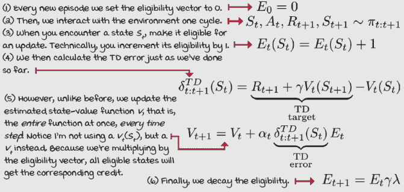 |

最后我想重申的是，当*λ*=0 时，*TD*(*λ*)与我们之前学过的*TD*方法等效。因此，*TD*通常被称为**TD(0)**；另一方面，当*λ*=1 时，*TD*(*λ*)相当于 MC，某种程度上。实际上，它等于 MC 假设离线更新，假设更新在剧集结束时累积并应用。对于在线更新，估计的状态值函数可能每步都改变，因此自举估计会变化，进而改变估计的进展。尽管如此，**TD(1)**通常假设等于 MC。此外，一种最近的方法，称为*true online* *TD***(***λ***)**，是*TD*(*λ*)的不同实现，它实现了*TD*(0)与*TD*和*TD*(1)与 MC 的完美等价。 |

|  | 我会说 Python *TD*(*λ*)算法，也称为向后视角*TD*(*λ*)算法 |
| --- | --- |
|  |

```
def td_lambda(pi,                                             ①
              env,
            gamma=1.0,
              init_alpha=0.5,
              min_alpha=0.01,
              alpha_decay_ratio=0.3,
              lambda_=0.3,
              n_episodes=500):
    nS = env.observation_space.n
    V = np.zeros(nS) ②
    V_track = np.zeros((n_episodes, nS))
    E = np.zeros(nS) ③
    alphas = decay_schedule( ④
        init_alpha, min_alpha,
      alpha_decay_ratio, n_episodes)
    for e in tqdm(range(n_episodes), leave=False): ⑤
        E.fill(0) ⑥
        state, done = env.reset(), False ⑦
        while not done: ⑧
            action = pi(state)
            next_state, reward, done, _ = env.step(action) ⑨
            td_target = reward + gamma * V[next_state] * \
                                                     (not done)
            td_error = td_target - V[state] ⑩
            E[state] = E[state] + 1 ⑪
            V = V + alphas[e] * td_error * E                  ⑫
            E = gamma * lambda_ * E                           ⑬
            state = next_state
        V_track[e] = V                                        ⑭
    return V, V_track
```

① td_lambda 方法具有与其他所有方法非常相似的签名。唯一的新的超参数是 lambda_（下划线是因为 lambda 在 Python 中是一个受限的关键字）。② 设置常规的嫌疑对象。③ 添加一个新家伙：资格迹向量。④ 计算所有剧集的 alpha。⑤ 这里我们进入剧集循环。⑥ 每个新剧集将 E 设置为零。⑦ 设置初始变量。⑧ 进入时间步循环。⑨ 我们首先与环境交互一步并获取经验元组。⑩ 然后，我们使用该经验来计算通常的*TD*误差。⑪ 我们将状态资格增加 1。⑫ 并将错误更新应用于 E 指示的所有合格状态。⑬ 我们衰减 E...⑭ ...然后继续我们的生活，就像平常一样。 |

|  | 累计起来运行估计*n*-步*TD*和*TD*(*λ*)在 RW 环境中的产生 |
| --- | --- |
|  | 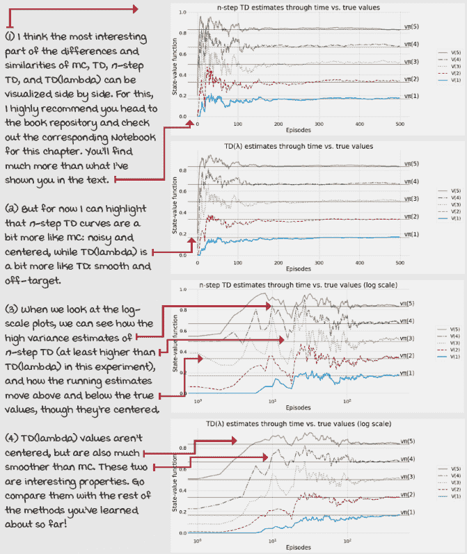 |
|  | 一个具体的例子评估 Russell 和 Norvig 的网格世界环境的最佳策略 |
|  | 让我们在一个略微不同的环境中运行所有算法。这个环境你可能过去多次遇到过。它来自拉塞尔和诺维格的《人工智能》一书！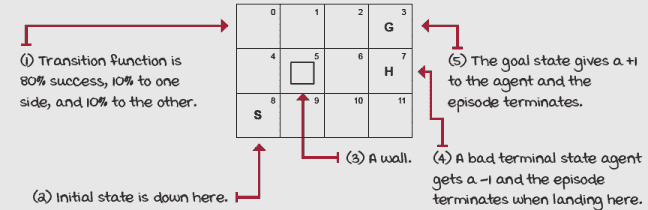拉塞尔和诺维格的 Gridworld 这个环境，我将称之为拉塞尔和诺维格的网格世界（RNG），是一个 3 x 4 的网格世界，其中智能体从左下角开始，必须到达右上角。目标南方有一个洞，类似于冰冻湖环境，起点附近有一堵墙。转移函数有 20%的噪声；也就是说，80%的动作成功，20%的动作以随机均匀的方式在正交方向上失败。奖励函数是一个-0.04 的生存惩罚，在目标上获得+1 分，在洞上获得-1 分。现在，我们正在评估一个策略。我恰好将最优策略包含在第三章的笔记本中：在那个章节我没有空间来讨论它。实际上，确保你检查了书中提供的所有笔记本！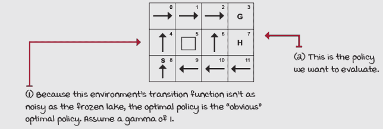 |
|  | 总结 FVMC，*TD*，*n*-步 *TD* 和 *TD*(*λ*)在 RNG 环境中的表现 |
|  | 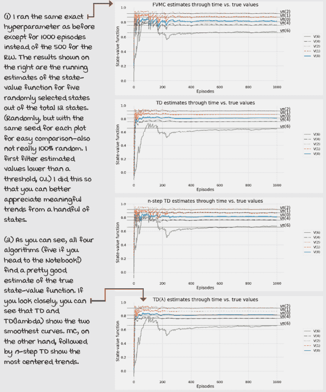 |
|  | 总结 RNG 展示了偏差和方差效应在估计上的影响 |
|  | 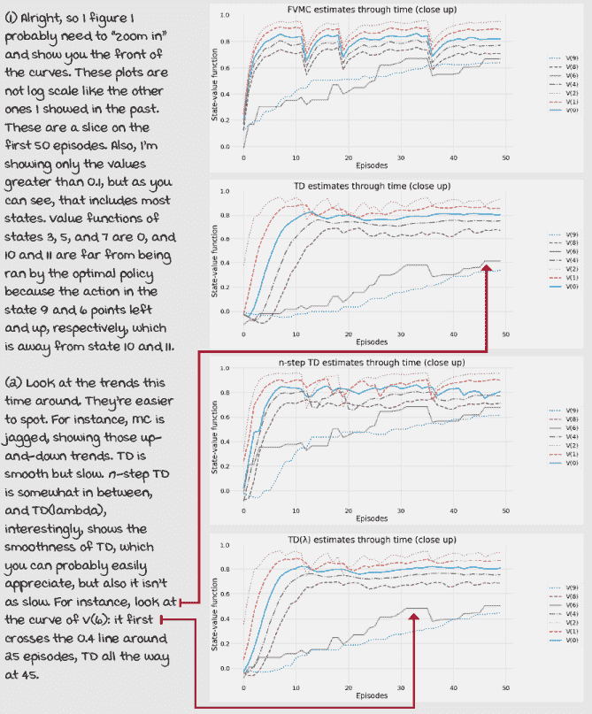 |
|  | 总结 RNG 的初始状态下的 FVMC 和*TD*目标 |
|  | 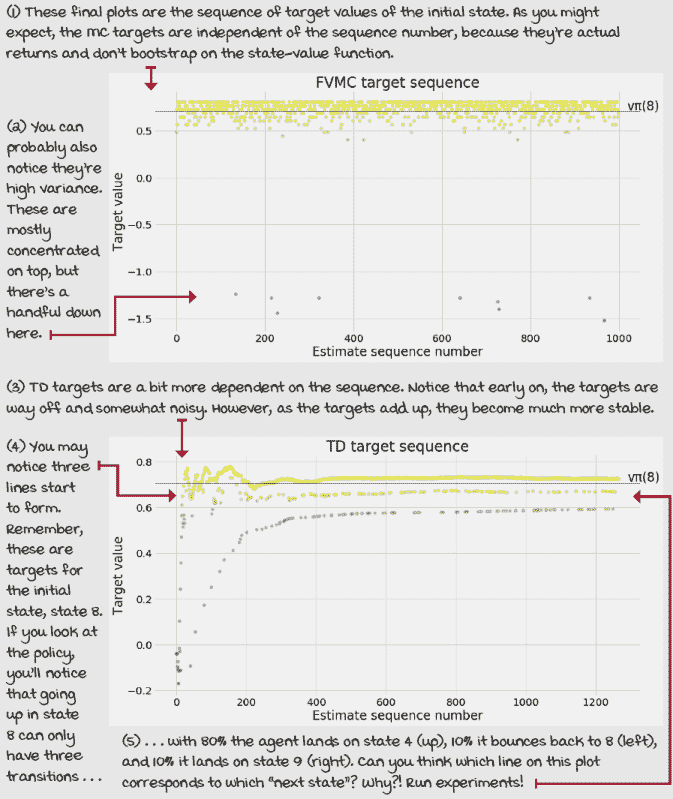 |

## 摘要

从顺序反馈中学习是具有挑战性的；你在第三章学到了很多关于它的知识。你创建了平衡即时和长期目标的智能体。价值迭代（VI）和政策迭代（PI）等方法是 RL 的核心。从评估反馈中学习也非常困难。第四章全部关于一种特定的环境，其中智能体必须学会平衡信息的收集和利用。epsilon-greedy，softmax，乐观初始化等策略也是 RL 的核心。

我希望你再停下来思考一下这两个权衡问题，作为独立的问题。我见过有 500 页甚至更长的教科书专门讨论这些权衡。虽然我们应该为每个权衡只用了 30 页而感到高兴，但你也应该有所疑问。如果你想开发新的 DRL 算法，推动技术前沿，我建议你独立研究这两个权衡。寻找关于“规划算法”和“赌博机算法”的书籍，并投入时间和精力去理解这些领域。当你回到 RL 并看到所有联系时，你会感到有很大的进步。现在，如果你的目标仅仅是理解 DRL，实现一些方法，在自己的项目中使用它们，这里的内容就足够了。

在本章中，你学习了能够处理同时具有顺序性和评估性的反馈的智能体。正如之前提到的，这可不是一件小事！同时平衡短期和长期目标以及收集和利用信息，即使是大多数人类都有困难！当然，在本章中，我们限制了自己只关注预测问题，即估计智能体行为的值。为此，我们介绍了蒙特卡洛预测和时序差分学习等方法。这两种方法是光谱两端的极端，可以用 *n*-步 *TD* 智能体进行泛化。只需改变步长，你就可以得到介于两者之间的任何智能体。然后我们学习了 *TD*(*λ*)以及单个智能体如何以非常创新的方式结合这两个极端以及两者之间的所有内容。

下一章，我们将探讨控制问题，这实际上就是改善智能体的行为。就像我们将策略迭代算法分为策略评估和策略改进一样，将强化学习问题分为预测问题和控制问题，使我们能够深入了解细节并获得更好的方法。

到现在为止，

+   不断变化的环境

+   学到了如何将这两个挑战结合起来，并产生强化学习领域。

+   了解了许多计算目标值以估计状态值函数的方法。

|  | 可分享的成就：独自工作并分享你的发现 |
| --- | --- |

|  | 这里有一些想法，如何将你所学的内容提升到下一个层次。如果你愿意，与世界分享你的结果，并确保查看其他人所做的事情。这是一个双赢的局面，希望你能充分利用它。

+   **#gdrl_ch05_tf01**：本章中没有任何一种方法处理围绕许多 Gym 环境的时间步限制。不明白我在说什么？不用担心，我在第八章中会详细解释。然而，目前你可以查看这个文件：[`github.com/openai/gym/blob/master/gym/envs/__init__.py`](https://github.com/openai/gym/blob/master/gym/envs/__init__.py)。看看有多少环境，包括冻结湖，都有一个可变的最大回合步数。这是对环境施加的时间步限制。思考一下：这个时间步限制如何影响本章中提出的算法？去书中的笔记本，修改算法以正确处理时间步限制，并使值函数估计更加准确。值函数会改变吗？为什么，为什么不呢？请注意，如果你不明白我在说什么，你应该继续前进，并在你理解之后再回来。

+   **#gdrl_ch05_tf02:** 比较和绘制蒙特卡洛和时差目标是有用的。帮助你理解差异的一件事是对这两种类型的目标进行更全面的分析，并包括 n 步和 TD-lambda 目标。首先，收集不同时间步长值的 n 步目标，并对 TD-lambda 目标中的不同 lambda 值做同样的事情。这些与 MC 和 TD 相比如何？此外，找到其他比较这些预测方法的方法。但是，用图表和视觉来进行比较！

+   **#gdrl_ch05_tf03:** 在每一章中，我都在使用最后的标签作为通用的标签。请随意使用这个标签来讨论与本章相关的工作。没有什么比为自己创造作业更令人兴奋的了。确保分享你打算调查的内容以及你的结果。

用你的发现写一条推文，@我 @mimoralea（我会转发），并使用这个列表中的特定标签来帮助感兴趣的人找到你的结果。没有正确或错误的结果；你分享你的发现并检查他人的发现。利用这个机会社交，做出贡献，让自己脱颖而出！我们正在等待你！以下是一条推文示例：“嘿，@mimoralea。我创建了一个博客文章，列出了学习深度强化学习的资源列表。查看它在这里<链接>。#gdrl_ch01_tf01”我会确保转发并帮助他人找到你的工作。|
