# 6 改善智能体的行为

在本章

+   你将了解在同时从顺序和评估反馈中学习时如何改进策略。

+   当状态转移和奖励函数未知时，你将开发在强化学习环境中寻找最优策略的算法。

+   你将编写代码，为那些仅通过经验和决策就能从随机行为转变为最优行为的智能体，并在各种环境中训练这些智能体。

当显然无法达到目标时，不要调整目标，调整行动步骤。

—— 孔子 中国春秋时期的教育家、编辑、政治家、哲学家

在本章之前，你已独立地学习了来自三种不同类型反馈的强化学习智能体的学习：顺序的、评估的和样本的。在第二章，你学习了如何使用被称为马尔可夫决策过程（Markov decision processes）的数学框架来表示顺序决策问题。在第三章，你学习了如何使用从 MDP 中提取策略的算法来解决这些问题。在第四章，你学习了在 MDP 表示不可用的情况下解决简单控制问题，这些问题是多选项、单选决策问题，称为多臂老虎机。最后，在第五章，我们将这两种类型的控制问题结合起来，即我们处理了顺序且不确定的控制问题，但我们只学会了估计价值函数。我们解决了所谓的预测问题，即学习评估策略，学习预测回报。

在本章中，我们将介绍解决控制问题的智能体，我们通过简单地改变两个东西来实现这一点。首先，我们不是估计状态价值函数 V(s)，而是估计动作价值函数 Q(s, a)。这样做的主要原因是因为 Q 函数，与 V 函数不同，它允许我们在不使用 MDP 的情况下看到动作的价值。其次，在我们获得这些 Q 值估计之后，我们使用它们来改进策略。这与我们在策略迭代算法中所做的是类似的：我们评估，我们改进，然后评估改进后的策略，然后在这个改进的策略上进一步改进，依此类推。正如我在第三章中提到的，这种模式被称为*广义策略迭代（GPI）*，它可以帮助我们创建一个架构，几乎任何强化学习算法都可以适应，包括最先进的深度强化学习智能体。

本章的概述如下：首先，我将扩展广义策略迭代架构，然后您将了解许多不同类型的代理，它们解决了控制问题。您将了解蒙特卡洛预测和时序差分学习代理的控制版本。您还将了解稍微不同类型的代理，它们将学习与行为解耦。在实践意义上，这意味着在本章中，您将开发通过试错学习来解决问题的代理。这些代理通过与环境交互来学习最优策略。

## 强化学习代理的解剖结构

在本节中，我想向您提供一个心理模型，大多数，如果不是所有，强化学习代理都符合这个模型。首先，每个强化学习代理都会收集经验样本，无论是通过与环境的交互还是查询环境的学习模型。然而，数据是在代理学习的过程中产生的。其次，每个强化学习代理都会学习估计某些东西，可能是一个环境模型，或者可能是一个策略、一个价值函数，或者仅仅是回报。第三，每个强化学习代理都会尝试改进一个策略；毕竟，这就是强化学习（RL）的全部意义。

|  | 奖励、回报和价值函数 |
| --- | --- |
|  | 现在是刷新记忆的好时机。你需要记住奖励、回报和价值函数之间的区别，这样你才能理解本章内容，并开发出通过试错学习来学习最优策略的代理。让我再重复一遍。*奖励*是一个表示状态转换好坏的数值信号。你的代理观察到状态 *S*[*t*]，采取行动 *A*[*t*]；然后环境发生变化，给出奖励 *R*[*t*+1]，并发出新的状态 *S*[*t*+1]。奖励是表示在每个时间步长发生的转换好坏的单个数值信号！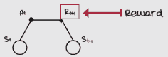 *回报*是整个过程中收到的所有奖励的总和。你的代理收到奖励 *R*[*t*+1]，然后 *R*[*t*+2]，等等，直到它获得在终端状态 *S*[*T*] 之前最后的奖励 RT。回报是整个过程中所有奖励的总和。回报通常定义为折扣总和，而不是简单的总和。折扣总和优先考虑在过程中早期找到的奖励（当然，这取决于折扣因子。）从技术上讲，折扣总和是对回报的更一般定义，因为折扣因子为 1 时，它就是一个简单的总和！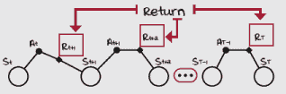 *价值函数*是期望回报。期望是通过将所有可能值相加并乘以其发生的概率来计算的。将期望视为无限多个样本的平均值；回报的期望就像是从无限多个回报中进行采样并取平均值。当你从选择行动之后开始计算回报时，期望是该状态-行动对的行动价值函数，*Q*(*s, a*)。如果你忽略采取的行动并从状态 s 开始计数，那么它就变成了状态价值函数 *V*(*s*)。 |

### 大多数代理收集经验样本

强化学习（RL）的一个独特特征是代理通过试错来学习。代理与环境交互，在这个过程中收集数据。这里不寻常的方面是，收集数据与从数据中学习是两个不同的挑战。正如你很快就会看到的，从数据中学习也与从数据中改进不同。在 RL 中，有收集、学习和改进。例如，一个在收集数据方面相当出色的代理可能并不擅长从数据中学习；或者相反，一个不擅长收集数据的代理可能在从数据中学习方面很出色，等等。我们都有那种在学校笔记记不好的朋友，但他们考试却做得很好，而其他人把所有东西都记下来，但成绩却不那么好。

在第三章中，当我们学习动态规划方法时，我提到价值迭代和政策迭代不应该被称为强化学习，而应该称为规划方法，原因在于它们与环境的*交互*，因为环境模型，即马尔可夫决策过程（MDP），是事先提供的。

| ŘŁ | 规划问题与学习问题 |
| --- | --- |
|  | **规划问题**：指的是有环境模型可用的问题，因此不需要学习。这类问题可以使用价值迭代和政策迭代等规划方法来解决。这类问题的目标是找到最优策略，而不是学习。假设我给你一张地图，让你从点 A 找到到点 B 的最佳路线；这里不需要学习，只需要规划。**学习问题**：指的是需要从样本中进行学习的问题，通常是因为没有环境模型可用，或者可能是因为无法创建一个模型。学习问题的主要挑战是我们使用样本进行估计，而样本可能具有高方差，这意味着它们的质量较差，难以从中学习。样本也可能存在偏差，要么是因为来自与估计不同的分布，要么是因为使用估计来估计，这可能导致我们的估计完全错误。假设这次我没有给你该地区的地图。你将如何找到“最佳路线”？很可能是通过试错学习。 |

要被视为标准的强化学习方法，算法与环境的交互，即我们试图解决的问题的方面，应该是存在的。大多数强化学习代理通过自己收集经验样本，与例如被给予数据集的监督学习方法不同，强化学习代理有选择其数据集的额外挑战。大多数强化学习代理收集经验样本，因为强化学习通常涉及解决交互式学习问题。

| ŘŁ | 带有强化学习口音的非交互式与交互式学习问题 |
| --- | --- |
|  | **非交互式学习问题**：指的是一种学习问题，其中不需要或不可能与环境交互。在这些类型的问题中，学习过程中没有与环境的交互，但可以从之前生成的数据中进行学习。目标是根据样本找到某些东西，通常是策略，但不一定是。例如，在逆强化学习中，目标是根据专家行为样本恢复奖励函数。在学徒学习中，目标是根据恢复的奖励函数到策略。在行为克隆中，这是一种模仿学习的形式，目标是直接使用监督学习从专家行为样本到策略。**交互式学习问题**：指的是一种学习问题，其中学习和交互是交织在一起的。这些问题的有趣之处在于，学习者也控制着数据收集过程。从样本中进行最优学习是一个挑战，找到用于最优学习的样本是另一个挑战。 |

### 大多数智能体都会估计某些东西

在收集数据之后，智能体可以使用这些数据做很多事情。例如，某些智能体学会预测预期的回报或价值函数。在上一章中，你学习了多种实现这一目标的方法，从使用蒙特卡洛到*TD*目标，从每次访问到首次访问 MC 目标，从*n*-步到*λ*-回报目标。有许多不同的方法可以用来计算目标，这些方法可以用于估计价值函数。

但价值函数并不是智能体可以用经验样本学习的唯一东西。智能体也可能被设计成学习环境模型。正如你将在下一章中看到的，基于模型的强化学习智能体使用收集的数据来学习状态转移和奖励函数。通过学习环境模型，智能体可以预测下一个状态和奖励。进一步来说，有了这些，智能体可以像 DP 方法一样规划一系列动作，或者使用与这些学习模型交互生成的合成数据来学习其他东西。关键是智能体可能被设计成学习环境模型。

此外，智能体可以被设计成直接使用估计的回报来改进策略。在后面的章节中，我们将看到策略梯度方法包括近似函数，这些函数接受状态作为输入并输出动作的概率分布。为了改进这些策略函数，我们可以使用实际回报，在最简单的情况下，也可以使用估计的价值函数。最后，智能体可以被设计成同时估计多个东西，这是典型的情况。重要的是大多数智能体都会估计某些东西。

|  | 蒙特卡洛与时间差分目标 |
| --- | --- |
|  | 值得重复的其他重要概念是价值函数的不同估计方法。一般来说，所有学习价值函数的方法都是逐步将误差的一部分移动到目标。大多数学习方法遵循的一般方程是 *估计 = 估计 + 步长 * 误差*。误差简单地是采样目标与当前估计之间的差异：（*目标 – 估计*）。计算这些目标的主要且相反的方法是蒙特卡洛和时序差分学习！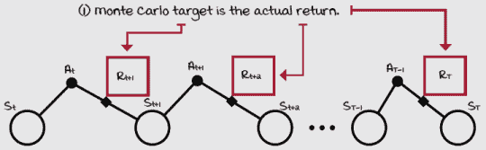蒙特卡洛目标由实际回报组成：实际上，没有其他东西。蒙特卡洛估计包括使用经验（观察）平均回报代替期望（如果你能平均无限样本）回报来调整价值函数的估计！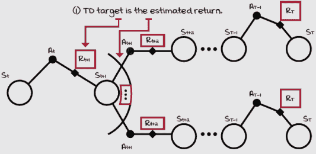时序差分目标由一个估计回报组成。还记得“自举”吗？它基本上意味着使用后续状态的估计期望回报来估计当前状态的期望回报。TD 就是这样做的：从一个猜测中学习一个猜测。TD 目标是通过使用单个奖励和下一个状态的估计期望回报（使用运行价值函数估计）来形成的。 |

### 大多数代理改进策略

最后，大多数代理改进策略。这一最终步骤高度依赖于正在训练的代理的类型以及代理估计的内容。例如，如果代理正在估计价值函数，一个常见的事情是改进隐式编码在价值函数中的目标策略，即正在学习的策略。改进目标策略的好处是，行为策略（即数据生成策略）将相应地改进，从而提高代理随后收集的数据质量。如果目标和行为策略相同，那么底层价值函数的改进将明确提高随后生成数据的质量。

现在，如果策略是通过价值函数而不是显式表示，例如在策略梯度法和演员-评论家方法中，代理可以使用实际回报来改进这些策略。代理还可以使用价值函数来估计回报以改进策略。最后，在基于模型强化学习中，有多种改进策略的选项。可以使用学习到的环境模型来规划一系列动作。在这种情况下，在规划阶段隐式地改进了策略。可以使用模型来学习价值函数，这隐式地编码了一个策略。也可以使用模型直接改进策略。底线是，所有代理都试图改进策略。

| ŘŁ | 带有强化学习口音的贪婪策略 vs. epsilon-贪婪策略 vs. 最优策略 |
| --- | --- |
|  | **贪婪策略**：指的是一种策略，它总是选择每个状态下被认为能带来最高期望回报的动作。重要的是要知道，“贪婪策略”在价值函数上是贪婪的。“被认为”的部分来自价值函数。这里的洞察是，当有人说“贪婪策略”时，你必须问，相对于什么贪婪？相对于随机价值函数的贪婪策略是一个相当糟糕的策略。**ε-贪婪策略**：指的是一种策略，它通常选择被认为能从每个状态下带来最高期望回报的动作。与之前相同；ε-贪婪策略在特定价值函数上是ε-贪婪的。始终确保你理解正在引用哪个价值函数。**最优策略**：指的是一种策略，它总是选择从每个状态下实际上能带来最高期望回报的动作。虽然贪婪策略可能或可能不是最优策略，但最优策略无疑必须是一种贪婪策略。你问，“相对于什么贪婪？”做得好！最优策略是相对于唯一价值函数的贪婪策略，即最优价值函数。 |

### 广义策略迭代

另一个更常用来理解强化学习算法架构的简单模式被称为**广义策略迭代**（GPI）。GPI 是一个基本理念，即策略评估和策略改进的持续交互推动策略向最优性发展。

如你很可能记得，在策略迭代算法中，我们有两个过程：策略评估和策略改进。策略评估阶段接受任何策略，并对其进行评估；它估计策略的价值函数。在策略改进中，这些估计，即价值函数，被用来获得更好的策略。一旦策略评估和改进稳定下来，也就是说，一旦它们的交互不再产生任何变化，那么策略和价值函数就是最优的。

现在，如果你还记得，在学习策略迭代之后，我们学习了另一种算法，称为值迭代。这个算法与策略迭代类似；它包含策略评估和策略改进两个阶段。然而，主要区别在于策略评估阶段只包含一个迭代。换句话说，策略评估并没有产生实际的价值函数。在值迭代的策略评估阶段，价值函数的估计值会逐渐接近实际价值函数，但并不完全到达那里。尽管如此，即使有这个策略评估阶段，值迭代的广义策略迭代模式仍然会产生最优价值函数和策略。

这里的关键洞察是，策略评估通常包括收集和估计价值函数，类似于你在上一章中学到的算法。正如你所知，评估策略有多种方式，估计策略价值函数的方法众多，有各种选择方法来满足广义策略迭代模式中的策略评估要求。

此外，策略改进包括将策略改变为使其对价值函数更贪婪。在策略迭代算法的策略改进方法中，我们将策略完全变为对评估策略的价值函数贪婪。但是，我们之所以能够完全贪婪化策略，仅仅是因为我们有了环境的 MDP。然而，我们在上一章中学到的策略评估方法不需要环境的 MDP，这付出了一定的代价。我们不能再完全贪婪化策略；我们需要让我们的智能体进行探索。从现在开始，我们不再完全贪婪化策略，而是使策略更贪婪，留出探索的空间。这种部分策略改进在第四章中使用不同的探索策略时被采用。

这就是全部内容。大多数强化学习算法遵循这种 GPI 模式：它们有独特的策略评估和改进阶段，我们只需挑选和选择方法即可。

|  | Miguel 的类比：广义策略迭代以及为什么你应该听取批评 |
| --- | --- |
|  | 广义策略迭代（GPI）类似于批评家和表演者永恒的舞蹈。策略评估提供了政策改进所需的重要反馈，以使政策变得更好。同样，批评家提供了表演者可以用来做得更好的必要反馈。正如本杰明·富兰克林所说，*“批评家是我们的朋友，他们指出我们的错误。”* 他是个聪明人；他允许 GPI 帮助他改进。你让批评家告诉你他们的想法，你利用这些反馈来变得更好。很简单！一些最好的公司也遵循这个流程。你认为*“数据驱动决策”*这句话是什么意思？它意味着他们确保使用一个出色的策略评估过程，以便他们的政策改进过程产生可靠的结果；这与 GPI 的模式相同！诺曼·文森特·皮尔说，*“我们大多数人的麻烦是，我们宁愿被赞誉所毁，也不愿被批评所救。”* 去吧，让批评家帮助你。但要注意！他们确实可以帮助你，并不意味着批评家总是正确的，或者你应该盲目地接受他们的建议，尤其是如果你第一次听到这样的反馈。批评家通常是有偏见的，策略评估也是如此！作为一位伟大的表演者，你的任务是仔细倾听这些反馈，聪明地收集尽可能好的反馈，并在确定的情况下采取行动。但最终，世界属于那些做工作的人。西奥多·罗斯福说得最好：*“重要的不是批评家；不是指出强者跌倒或做事者本可以做得更好的那个人；荣誉属于真正进入竞技场的人，他的脸被尘土、汗水和鲜血弄脏；他英勇奋斗；他犯错误，一次又一次地失败，因为不努力就没有错误和不足；但他确实努力去做事；他了解巨大的热情、伟大的奉献；他为了一个崇高的目标而倾其所有；他最好地知道，最终，他要么取得了高成就的胜利，要么在最坏的情况下，如果他失败了，至少是勇敢地失败了，这样他的位置永远不会与那些既不知道胜利也不知道失败冷漠而胆怯的灵魂为伍。”*在后面的章节中，我们将研究演员-批评家方法，你会看到这个类比如何扩展，信不信由你！演员和批评家互相帮助。敬请期待更多内容。令人敬畏的是，最优决策模式在各个领域都是有效的。你在学习深度强化学习（DRL）中学到的知识可以帮助你成为一个更好的决策者，而你从自己的生活中学到的知识可以帮助你创造更好的智能体。酷，不是吗？ |

## 学习改进行为策略

在上一章中，你学习了如何解决预测问题：如何让智能体最准确地估计给定策略的价值函数。然而，虽然这对我们的智能体来说是一个有用的能力，但它并不能直接使它们在任何任务上表现得更好。在本节中，你将学习如何解决控制问题：如何让智能体优化策略。这种新的能力使智能体能够通过试错学习来学习最佳行为，从任意策略开始，最终达到最佳策略。在本章之后，你可以开发出能够解决任何由 MDP 表示的任务的智能体。任务必须是离散状态和动作空间的 MDP，除此之外，它就是即插即用的。

为了展示几个智能体，我们将利用你所学到的 GPI 模式。也就是说，我们将从你在上一章中学到的算法中选择策略评估阶段的算法，以及从你在前一章中学到的算法中选择策略改进阶段的策略。希望这能激发你的想象力。只需挑选策略评估和改进的算法，一切就会顺利，这是因为这两个过程的相互作用。

| ŘŁ | 带有强化学习口音的预测问题、控制问题、策略评估与改进问题 |
| --- | --- |
|  | **预测问题**：指的是评估策略的问题，即在给定策略的情况下估计价值函数的问题。估计价值函数实际上就是学习预测回报。状态价值函数估计从状态中期望的回报，动作价值函数估计从状态-动作对中期望的回报。**控制问题**：指的是寻找最优策略的问题。控制问题通常通过遵循广义策略迭代（GPI）的模式来解决，其中策略评估和策略改进的竞争过程逐渐将策略推向最优。强化学习方法通常将动作价值预测方法与策略改进和动作选择策略配对。**策略评估**：指的是解决预测问题的算法。请注意，有一个名为策略评估的动态规划方法，但这个术语也用来指代所有解决预测问题的算法。**策略改进**：指的是通过使新策略相对于原始策略的价值函数更贪婪来改进原始策略的算法。请注意，策略改进本身并不能解决控制问题。通常必须将策略评估与策略改进配对来解决控制问题。策略改进仅指根据评估结果改进策略的计算。 |
|  | 一个具体的例子：滑稽的走步七环境 |
|  | 对于本章，我们使用一个名为 *slippery walk seven* (SWS) 的环境。这个环境是一个行走环境，一个单行网格世界环境，有七个非终止状态。这个环境的特别之处在于它是一个滑溜的行走环境；动作效果是随机的。如果智能体选择向左走，它有可能这么做，但也有可能向右走，或者保持在原地。让我给你展示这个环境的 MDP。记住，对于智能体来说，这些是未知的。我之所以提供这些信息，只是为了教学目的。此外，请记住，对于智能体来说，在事先没有任何状态之间的关系。智能体不知道状态 3 位于整个行走路径的中间，或者它位于状态 2 和 4 之间；它甚至不知道什么是“行走”！智能体不知道动作 0 表示向左走，或者动作 1 表示向右走。老实说，我鼓励你亲自去笔记本中玩这个环境，以获得更深入的理解。事实上，智能体只能看到状态 ID，比如 0，1，2 等等，并选择动作 0 或 1。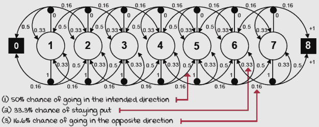滑溜行走七环境 MDPSWS 环境与我们之前章节中学到的随机行走（RW）环境类似，但具有控制能力。记住，随机行走是一个环境，在执行左行动作时向左走的概率等于向右走的概率。而在执行右行动作时向右走的概率等于向左走的概率，因此没有控制。这个环境是有噪声的，但智能体选择的动作会影响其性能。此外，这个环境有七个非终止状态，而 RW 环境有五个。 |

### 蒙特卡洛控制：在每个回合后改进策略

让我们尝试创建一个控制方法，使用蒙特卡洛预测来满足我们的策略评估需求。让我们最初假设我们使用的是与策略迭代算法相同的策略改进步骤。也就是说，策略改进步骤获取与策略评估的价值函数相关的贪婪策略。这会形成一个帮助我们仅通过交互找到最优策略的算法吗？实际上，不会。在我们使这种方法生效之前，我们需要做出两个改变。

首先，我们需要确保我们的智能体估计的是动作值函数 *Q*(*s, a*)，而不是我们在上一章中估计的 *V(s, a)*。V 函数的问题在于，没有 MDP，我们无法知道从某个状态采取的最佳动作是什么。换句话说，策略改进步骤将不会起作用。

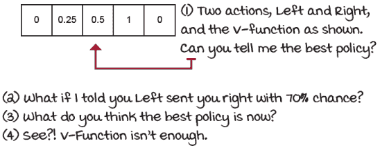

我们需要估计动作值函数

第二，我们需要确保我们的智能体进行探索。问题是，我们不再使用 MDP 来满足我们的策略评估需求。当我们从样本中进行估计时，我们得到了我们访问的所有状态-动作对的值，但如果我们没有访问到最佳状态的一部分怎么办？

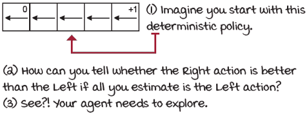

我们需要探索

因此，让我们在策略评估阶段使用首次访问蒙特卡洛预测，并在策略改进阶段使用衰减 epsilon-greedy 动作选择策略。就这样——你有一个完整的、无模型的 RL 算法，其中我们使用蒙特卡洛预测评估策略，并使用衰减 epsilon-greedy 动作选择策略来改进它们。

与价值迭代一样，它有一个截断的政策评估步骤，我们可以截断蒙特卡洛预测方法。与我们在上一章中用蒙特卡洛预测估计单个策略的价值函数相比，我们截断预测步骤，在单个完整回合和轨迹样本估计之后，立即改进策略。我们交替进行单个 MC 预测步骤和单个衰减 epsilon-greedy 动作选择改进步骤。

让我们看看我们的第一个 RL 方法 MC 控制。你会看到三个函数：

+   decay_schedule：根据函数参数计算衰减值。

+   generate_trajectory：在环境中执行策略的全局回合。

+   mc_control：MC 控制方法的完整实现。

|  | 我说 Python 指数衰减计划 |
| --- | --- |
|  |

```
def decay_schedule( ①
        init_value, min_value,
      decay_ratio, max_steps,                                 ②
        log_start=-2, log_base=10):
    decay_steps = int(max_steps * decay_ratio) ③
    rem_steps = max_steps - decay_steps                       ④
    values = np.logspace( ⑤
                  log_start, 0, decay_steps,
                base=log_base, endpoint=True)[::-1] ⑤
    values = (values - values.min()) / \                      ⑥
                                  (values.max() - values.min())
    values = (init_value - min_value) * values + min_value    ⑦
    values = np.pad(values, (0, rem_steps), 'edge') ⑧
    return values
```

① 我们将用于 alpha 和 epsilon 的衰减计划与上一章中用于 alpha 的相同。这次让我们更详细地探讨一下。② 我个人喜欢这个函数的地方在于，你可以给它一个初始值、一个最小值，以及从初始值衰减到最小值的 max_steps 百分比。③ 这个 decay_steps 是值衰减终止的索引，min_value 继续直到 max_steps。④ 因此，rem_steps 是这个差值。⑤ 我正在使用以 log_start 为起始点，默认设置为-2，并以 0 为结束点的 logspace 来计算值。我请求的这个空间中的值的数量是 decay_steps，基数是 log_base，默认设置为 10。注意，我反转了这些值！⑥ 因为值可能不会正好结束在 0，考虑到它是对数，我将它们改为介于 0 和 1 之间，以便曲线看起来平滑且美观。⑦ 然后，我们可以进行线性变换，得到 init_value 和 min_value 之间的点。⑧ 这个 pad 函数只是重复最右侧的值 rem_step 次数。|

|  | 我说 Python 生成探索性策略轨迹 |
| --- | --- |
|  |

```
def generate_trajectory( ①
           select_action, Q, epsilon,
         env, max_steps=200):
    done, trajectory = False, [] ②
    while not done: ③
        state = env.reset() ④
        for t in count(): ⑤
            action = select_action(state, Q, epsilon) ⑥
            next_state, reward, done, _ = env.step(action) ⑦
            experience = (state,
                        action,
                        reward,
                        next_state,
                        done)
            trajectory.append(experience) ⑧
            if done: ⑨
                break
            if t >= max_steps - 1: ⑩
                trajectory = []
                break
            state = next_state                                ⑪
    return np.array(trajectory, np.object) ⑫
```

① 生成轨迹函数的这个版本略有不同。我们现在需要接受一个动作选择策略，而不是贪婪策略。② 我们首先初始化 done 标志和一个名为 trajectory 的经验列表。③ 然后开始循环，直到 done 标志设置为 true。④ 将环境重置以进行新循环的交互。⑤ 然后开始计数步骤 t。⑥ 然后，使用传递的 ‘select_action’ 函数选择一个动作。⑦ 使用该动作步进环境，并获得完整经验元组。⑧ 将经验追加到轨迹列表中。⑨ 如果我们达到终端状态并且 ‘done’ 标志被提升，则中断并返回。⑩ 如果当前轨迹中的步骤数 ‘t’ 达到最大允许值，则清除轨迹，中断，并尝试获取另一个轨迹。⑪ 记得更新状态。⑫ 最后，我们返回轨迹的 NumPy 版本，以便于数据操作。|

|  | 我会说 PythonMonte Carlo 控制 1/2 |
| --- | --- |
| |

```
def mc_control(env, ①
               gamma=1.0,
               init_alpha=0.5,
               min_alpha=0.01,
               alpha_decay_ratio=0.5,
               init_epsilon=1.0, ②
               min_epsilon=0.1,
               epsilon_decay_ratio=0.9,
               n_episodes=3000,
               max_steps=200,
               first_visit=True):
    nS, nA = env.observation_space.n, env.action_space.n
    discounts = np.logspace( ③
        0, max_steps,
      num=max_steps, base=gamma,
        endpoint=False)
    alphas = decay_schedule( ④
        init_alpha, min_alpha,
      alpha_decay_ratio,
      n_episodes)
    epsilons = decay_schedule( ⑤
        init_epsilon, min_epsilon,
      epsilon_decay_ratio,
      n_episodes)
    pi_track = [] ⑥
    Q = np.zeros((nS, nA), dtype=np.float64) ⑥
    Q_track = np.zeros((n_episodes, nS, nA), dtype=np.float64)
    select_action = lambda state, Q, epsilon: \               ⑦
        np.argmax(Q[state]) \
        if np.random.random() > epsilon \
        else np.random.randint(len(Q[state]))
    for e in tqdm(range(n_episodes), leave=False): ⑧
```

① mc_control 与 mc_prediction 类似。两个主要区别是，我们现在现在估计动作值函数 Q，并且我们需要进行探索。② 注意在函数定义中，我们使用 epsilon 的值来配置随机探索的衰减计划。③ 我们提前计算折扣因子的值。注意我们使用 max_steps，因为那是轨迹的最大长度。④ 我们还提前使用传递的值计算 alphas。⑤ 最后，我们重复 epsilon，并获得一个将在整个训练会话中工作的数组。⑥ 这里我们只是在设置变量，包括 Q 函数。⑦ 这是一个 epsilon-贪婪策略，尽管我们在每个循环而不是每一步衰减 epsilon。⑧ 继续…… |

|  | 我会说 PythonMonte Carlo 控制 2/2 |
| --- | --- |
| |

```
    for e in tqdm(range(n_episodes), leave=False): ⑨⑩
        trajectory = generate_trajectory(select_action, ⑪
                                         Q,
                                         epsilons[e],
                                         env,
                                       max_steps) ⑪
        visited = np.zeros((nS, nA), dtype=np.bool) ⑫
        for t, (state, action, reward, _, _) in enumerate(\     ⑬
                                                  trajectory):
            if visited[state][action] and first_visit:
                continue ⑭
            visited[state][action] = True
            n_steps = len(trajectory[t:])
            G = np.sum(discounts[:n_steps] * trajectory[t:, 2]) ⑮
            Q[state][action] = Q[state][action] + \
                             alphas[e] * (G - Q[state][action]) ⑯
        Q_track[e] = Q
        pi_track.append(np.argmax(Q, axis=1)) ⑰
    V = np.max(Q, axis=1) 
    pi = lambda s: {s:a for s, a in enumerate(\                 ⑱
                                      np.argmax(Q, axis=1))}[s]
    return Q, V, pi, Q_track, pi_track
```

⑨ 重复上一行以便保持缩进⑩ 这里我们进入循环播放。我们将运行 n_episodes。记住，tqdm 会显示一个漂亮的进度条，没有什么超乎寻常的。⑪ 每生成一个新的循环‘e’，我们都会使用由 select_action 函数定义的探索策略生成一个新的轨迹。我们限制轨迹长度为 max_steps。⑫ 我们现在跟踪状态-动作对的访问次数；这是与 mc_prediction 方法相比的另一个重要变化。⑬ 注意这里我们是在离线处理轨迹，即在与环境的交互停止后。⑭ 这里我们检查状态-动作对访问，并相应地采取行动。⑮ 我们以与预测方法相同的方式计算回报，只是这次我们使用了一个 Q 函数。⑯ 注意我们如何使用 alphas。⑰ 之后，就是保存值以供后续分析的问题了。⑱ 最后，我们提取状态值函数和贪婪策略。|

### SARSA：在每一步后改进策略

如我们在上一章所讨论的，蒙特卡洛方法的一个缺点是它们在场景到场景的层面上是离线方法。这意味着我们必须等待达到终端状态，才能对我们的价值函数估计进行任何改进。然而，对于策略评估阶段，使用时间差分预测代替蒙特卡洛预测是直接的。通过用*TD*预测替换 MC，我们现在有一个不同的算法，那就是众所周知的 SARSA 智能体。

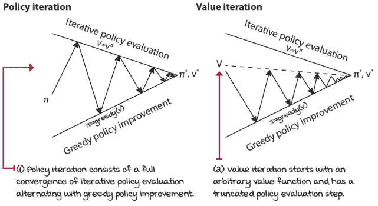

计划与控制方法比较

|  | 我会说 PythonSARSA 智能体 1/2 |
| --- | --- |
|  |

```
def sarsa(env, ①
          gamma=1.0,
          init_alpha=0.5,
          min_alpha=0.01,
          alpha_decay_ratio=0.5,
          init_epsilon=1.0,
          min_epsilon=0.1, ②
          epsilon_decay_ratio=0.9,
          n_episodes=3000):
    nS, nA = env.observation_space.n, env.action_space.n       ③
    pi_track = [] ③
    Q = np.zeros((nS, nA), dtype=np.float64) ④
    Q_track = np.zeros((n_episodes, nS, nA), dtype=np.float64)  ④⑤
    select_action = lambda state, Q, epsilon: \                ⑥
        np.argmax(Q[state]) \
        if np.random.random() > epsilon \
        else np.random.randint(len(Q[state])) ⑦
    alphas = decay_schedule( ⑧
        init_alpha, min_alpha,
      alpha_decay_ratio,
      n_episodes)
    epsilons = decay_schedule( ⑨
        init_epsilon, min_epsilon,
      epsilon_decay_ratio,
      n_episodes)
    for e in tqdm(range(n_episodes), leave=False): ⑩
```

① SARSA 智能体是控制问题的*TD*的直接转换。也就是说，在其核心，SARSA 是*TD*，但有两个主要变化。首先，它评估动作值函数 Q。其次，它使用一个探索性的策略改进步骤。② 我们在这里使用 epsilon 与 mc_control 做同样的事情。③ 首先，创建几个有用的变量。记住，pi_track 将保存每个场景的贪婪策略。④ 然后，我们创建 Q 函数。我使用‘np.float64’精度...可能有点过度。⑤ ‘Q_track’将保存每个场景的估计 Q 函数。⑥ select_action 函数与之前相同：一个 epsilon 贪婪策略。⑦ 在 SARSA 中，我们不需要预先计算所有折扣因子，因为我们不会使用完整回报。相反，我们使用估计回报，因此我们可以在线计算折扣。⑧ 注意，我们确实预先计算了所有 alpha。这个函数调用返回一个包含相应 alpha 的向量以供使用。⑨ select_action 函数本身不是一个衰减策略。我们预先计算衰减的 epsilon，因此我们的智能体将使用衰减的 epsilon 贪婪策略。⑩ 让我们继续到下一页。|

|  | 我会说 PythonSARSA 智能体 2/2 |
| --- | --- |
|  |

```
    for e in tqdm(range(n_episodes), leave=False): ⑪⑫
        state, done = env.reset(), False ⑬
        action = select_action(state, Q, epsilons[e]) ⑭
        while not done: ⑮
            next_state, reward, done, _ = env.step(action) ⑯
            next_action = select_action(next_state,           ⑰
                                        Q,
                                      epsilons[e])
            td_target = reward + gamma * \                    ⑱
                        Q[next_state][next_action] * (not done)
            td_error = td_target - Q[state][action] ⑲
            Q[state][action] = Q[state][action] + \           ⑳
                                           alphas[e] * td_error
            state, action = next_state, next_action           ㉑
        Q_track[e] = Q
        pi_track.append(np.argmax(Q, axis=1)) ㉒
    V = np.max(Q, axis=1)
    pi = lambda s: {s:a for s, a in enumerate(\               ㉓
                                      np.argmax(Q, axis=1))}[s]
    return Q, V, pi, Q_track, pi_track                        ㉓
```

⑪ 同一行。你知道该怎么做。⑫ 我们现在处于场景循环中。⑬ 我们通过重置环境和 done 标志来开始每个场景。⑭ 我们为初始状态选择动作（可能是探索性的）。⑮ 我们重复操作，直到达到终端状态。⑯ 首先，执行环境步骤并获取经验。⑰ 注意，在我们进行任何计算之前，我们需要获取下一步的动作。⑱ 我们使用那个下一个状态-动作对来计算 td_target。并且我们对终端状态进行一个小技巧，即乘以表达式（not done），这将零化终端的未来。⑲ 然后计算 td_error 作为目标和当前估计之间的差异。⑳ 最后，通过将估计稍微移动到误差方向来更新 Q 函数。㉑ 我们更新下一个步骤的状态和动作。㉒ 保存 Q 函数和贪婪策略以供分析。㉓ 最后，计算估计的最优 V 函数及其贪婪策略，并返回所有这些。

| ŘŁ | 带有强化学习口音的批量、离线、在线学习问题和方法 |
| --- | --- |
|  | **批量学习问题和方法**：当你听到“批量学习”这个术语时，人们通常指的是以下两种情况之一：他们指的是一种学习问题，其中经验样本是固定的，并且提前给出，或者他们指的是一种学习方法，该方法针对从一批经验中同步学习进行优化，也称为拟合方法。批量学习方法通常与非交互式学习问题一起研究，更具体地说，是与批量学习问题。但是，批量学习方法也可以应用于交互式学习问题。例如，增长批量方法是同时收集数据的批量学习方法：它们“增长”批量。此外，批量学习问题不必用批量学习方法来解决，就像批量学习方法并不是专门设计来仅解决批量学习问题一样。**离线学习问题和方法**：当你听到“离线学习”这个术语时，人们通常指的是以下两种情况之一：他们可能正在讨论一个可以用于收集数据的模拟环境（与真实世界的在线环境相对），或者他们可能正在讨论离线学习的方法，这意味着在剧集之间学习，例如。请注意，在离线学习方法中，学习和交互仍然可以交织在一起，但性能仅在收集样本之后才会得到优化，类似于之前描述的增长批量，但不同之处在于，与增长批量方法不同，离线方法通常丢弃旧样本；它们不会增长批量。例如，MC 方法通常被认为是离线的，因为学习和交互是在剧集之间交织的。有两个不同的阶段，交互和学习；MC 是交互式的，但也是一个离线学习方法。**在线学习问题和方法**：当你听到“在线学习”这个术语时，人们通常指的是以下两种情况之一：要么是在与实时系统（如机器人）交互时学习，要么是在收集经验后立即从经验中学习的方法，在每个时间步长上。请注意，离线和在线学习通常在不同的上下文中使用。我见过离线与在线被用来表示非交互式与交互式，但我也见过它们，正如我提到的，用来区分从模拟器学习与从实时系统学习。我这里的定义与许多强化学习研究者的常用定义一致：理查德·萨顿（2018 年书籍）、大卫·西尔弗（2015 年讲座）、哈德·范·哈塞尔特（2018 年讲座）、迈克尔·利特曼（2015 年论文）和卡萨·塞佩什瓦里（2009 年书籍）。但是要注意术语，那才是重要的。 |

## 将行为与学习解耦

我希望你花点时间思考一下状态值函数的**TD**更新方程；记住，它使用*r*[*t*+1] *+* *γ**v(S*[*t*+1])作为**TD**目标。然而，如果你盯着动作值函数的**TD**更新方程看，它是*r*[*t*+1] *+* *γ**Q(S*[*t*+1]*, A*[*t*+1])，你可能注意到这里有几个更多的可能性。看看所使用的动作及其含义。想想你还能放进去什么。强化学习中最关键的进步之一是**Q-learning**算法的发展，这是一种无模型、离策略的自举方法，它直接近似最优策略，尽管策略生成经验。是的，这意味着代理，从理论上讲，可以随机行动，仍然可以找到最优值函数和政策。这是怎么可能的？

### Q-learning：即使我们选择不这样做，也要学会最优行动

SARSA 算法是一种“在工作中学习”的方法。代理学习的是它用于生成经验的政策。这种学习被称为在策略学习。在策略学习非常出色——我们从自己的错误中学习。但是，让我明确一点，在在策略学习中，我们只从自己的当前错误中学习。如果我们想从自己的过去错误中学习呢？如果我们想从别人的错误中学习呢？在在策略学习中，你做不到。另一方面，离策略学习是一种“从别人那里学习”的方法。代理学习的是与生成经验的政策不同的政策。在离策略学习中，有两种策略：一种行为策略，用于生成经验，与环境交互，另一种是目标策略，这是我们正在学习的策略。SARSA 是一种在策略方法；Q-learning 是一种离策略方法。

|  | 给我看看数学 SARSA 与 Q-learning 更新方程 |
| --- | --- |
|  | 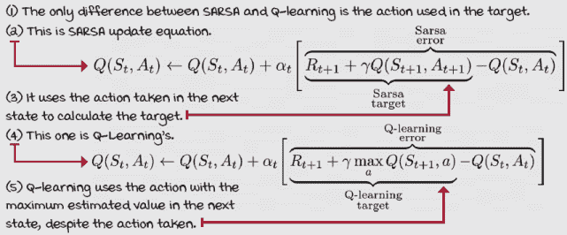 |
|  | 我会说 PythonQ-learning 代理 1/2 |
|  |

```
def q_learning(env,                                           ①
               gamma=1.0,
               init_alpha=0.5,
               min_alpha=0.01,
               alpha_decay_ratio=0.5, ②
               init_epsilon=1.0,
               min_epsilon=0.1,
               epsilon_decay_ratio=0.9,
               n_episodes=3000):
    nS, nA = env.observation_space.n, env.action_space.n      ③
    pi_track = [] 
    Q = np.zeros((nS, nA), dtype=np.float64) ④
    Q_track = np.zeros((n_episodes, nS, nA), dtype=np.float64) 
    select_action = lambda state, Q, epsilon: \               ⑤
        np.argmax(Q[state]) \
        if np.random.random() > epsilon \
        else np.random.randint(len(Q[state]))
    alphas = decay_schedule( ⑥
        init_alpha, min_alpha,
      alpha_decay_ratio,
      n_episodes)
    epsilons = decay_schedule( ⑦
        init_epsilon, min_epsilon,
      epsilon_decay_ratio,
      n_episodes)
    for e in tqdm(range(n_episodes), leave=False): ⑧
```

① 注意到 Q-learning 代理的开始与 SARSA 代理的开始是相同的。② 事实上，我甚至为这两个算法使用了完全相同的超参数。③ 这里有几个实用的变量。④ Q 函数和离线分析的跟踪变量⑤ 同样的 epsilon-greedy 动作选择策略⑥ 学习期间要使用的所有 alpha 的向量⑦ 要按需衰减的所有 epsilon 的向量⑧ 让我们继续到下一页。

|  | 我会说 PythonQ-learning 代理 2/2 |
| --- | --- |
|  |

```
    for e in tqdm(range(n_episodes), leave=False): ⑨⑩
        state, done = env.reset(), False ⑪
        while not done: ⑫⑬
            action = select_action(state, Q, epsilons[e]) ⑭
            next_state, reward, done, _ = env.step(action) ⑮
            td_target = reward + gamma * \                      ⑯
                               Q[next_state].max() * (not done)  ⑰
            td_error = td_target - Q[state][action] ⑱
            Q[state][action] = Q[state][action] + \             ⑲
                                           alphas[e] * td_error
            state = next_state                                  ⑳
        Q_track[e] = Q                                          ㉑
        pi_track.append(np.argmax(Q, axis=1))
    V = np.max(Q, axis=1) ㉒
    pi = lambda s: {s:a for s, a in enumerate(\
                                      np.argmax(Q, axis=1))}[s]
    return Q, V, pi, Q_track, pi_track
```

⑨ 与之前同一行⑩ 我们正在迭代经过的情节。⑪ 我们重置环境并获取初始状态，将完成标志设置为 false。⑫ 现在进入在线学习的交互循环（步骤）。⑬ 我们重复循环，直到达到终端状态并提升完成标志。⑭ 我们首先为当前状态选择一个动作。注意 epsilon 的使用。⑮ 我们对环境进行一步操作，并获取一个完整的经验元组（*s*, *a*, *s’*, *r*, *d*）。⑯ 接下来，我们计算*TD*目标。Q-learning 是一个特殊的算法，因为它试图学习最优动作值函数 q*，即使它使用的是探索性策略，例如我们正在运行的衰减 epsilon-greedy。这被称为离策略学习。⑰ 再次，"未完成"确保在终端状态下下一个状态的最大值设置为零。确保代理在死亡后不会期望任何奖励非常重要！！！⑱ 接下来，我们计算*TD*误差，即估计值与目标之间的差异。⑲ 然后将状态动作对的 Q 函数移动到更接近误差的位置。⑳ 接下来，我们更新状态。㉑ 保存 Q 函数和政策。㉒ 并在退出时获得 V 函数和最终政策。|

|  | 米格尔的类比人类也进行策略学习和离策略学习 |
| --- | --- |
|  | 在策略学习中，是关于正在使用的策略进行决策的学习；你可以将其视为“在工作中学习”。离策略学习是关于与用于决策的策略不同的策略的学习。你可以将其视为“从他人的经验中学习”，或者“学习如何做得更好，而不试图做得更好”。这两种都是重要的学习方法，也许对于成为一个优秀的决策者至关重要。有趣的是，你可以很快地看出一个人更喜欢在策略学习还是离策略学习中。例如，我的儿子倾向于偏好在策略学习中。有时我看到他在玩玩具时遇到困难，所以我走过去试图教他如何使用它，但他直到我离开才会抱怨。他一直尝试，最终学会了，但他更喜欢自己的经验而不是别人的。在策略学习是一种直接且稳定的学习方式。另一方面，我的女儿似乎对离策略学习没有问题。她在尝试任务之前就可以从我的演示中学习。我教她如何画房子，然后她尝试。现在，**请注意**；这是一个牵强的类比。*不同*，那么你可以将其称为离策略学习。此外，在得出关于哪一种“最好”的结论之前，要知道在强化学习中，两者都有优点和缺点。一方面，在策略学习直观且稳定。如果你想擅长弹钢琴，为什么不练习钢琴呢？另一方面，似乎从除了自己的实际经验之外的其他来源学习是有用的；毕竟，一天中只有那么多时间。也许冥想可以教你一些关于弹钢琴的知识，并帮助你提高弹钢琴的技巧。但是，虽然离策略学习可以帮助你从多个来源（和/或多个技能）中学习，但使用离策略学习的方法通常具有更高的方差，因此收敛速度较慢。此外，要知道离策略学习是导致发散的元素之一：离策略学习、自助学习和函数逼近。这些并不总是相处得很好。你已经了解了前两个，第三个很快就会到来。 |
| ŘŁ | 带有强化学习口音的贪婪策略在无限探索和随机逼近理论中 |

|  | 贪婪策略在无限探索（GLIE）是一组要求，这些要求是策略强化学习算法（如蒙特卡洛控制和 SARSA）必须满足的，以确保收敛到最优策略。这些要求如下：

+   所有状态-动作对都必须无限次地被探索。

+   策略必须收敛到贪婪策略。

实际上这意味着，例如，ε-贪婪探索策略必须缓慢地将ε衰减到零。如果它下降得太快，第一个条件可能无法满足；如果衰减得太慢，那么，收敛需要更长的时间。注意，对于离策略强化学习算法，如 Q 学习，这两个条件中只有第一个是成立的。第二个条件不再是一个要求，因为在离策略学习中，所学习到的策略与我们采样动作的策略不同。例如，Q 学习只需要所有状态-动作对都得到充分更新，而这在本节的第一条条件中已经涵盖。现在，你是否可以确信地使用简单的探索策略，如ε-贪婪，来满足那个要求，这是另一个问题。在简单的网格世界和离散的动作和状态空间中，ε-贪婪很可能是有效的。但是，很容易想象出需要比随机行为更复杂的复杂环境。基于随机逼近理论，对于所有这些方法，还有另一套基于一般收敛的要求。因为我们是从样本中学习的，样本存在一些变异性，除非我们也推动学习率α向零，否则估计不会收敛：

+   学习率的总和必须是无限的。

+   学习率平方的总和必须是有限的。

这意味着你必须选择一个衰减但永远不会达到零的学习率。例如，如果你使用 1/*t* 或 1/*e*，学习率最初足够大，以确保算法不会过于紧密地跟随单个样本，但最终变得足够小，以确保它能找到噪声背后的信号。此外，尽管这些收敛性质对于开发强化学习算法的理论是有用的，但在实践中，学习率通常根据问题设置为足够小的常数。另外，要知道对于非平稳环境，小常数更好，这在现实世界中很常见。|

| ŘŁ | 带有强化学习口音的在线策略与离线策略学习 |
| --- | --- |
|  | **在线策略学习**：指的是尝试评估或改进用于决策的策略的方法。这是直截了当的；想想一个单一的政策。这个政策产生行为。你的智能体评估这种行为，并根据这些估计选择改进的区域。你的智能体学习评估和改进它用于生成数据的同一策略。**离线策略学习**：指的是尝试评估或改进与用于生成数据的策略不同的策略的方法。这更复杂。想想两个策略。一个产生数据，经验，行为；但你的智能体使用这些数据来评估、改进，并总体上学习关于不同的策略，不同的行为。你的智能体学习评估和改进一个不同于用于生成数据的策略。 |

### 双 Q 学习：对最大估计值的估计的最大值

Q 学习经常高估价值函数。想想看。在每一步，我们都在下一个状态的动作值函数估计中取最大值。但我们需要的是下一个状态的最大动作值函数的实际值。换句话说，我们正在使用仅仅估计的最大值作为最大值的估计。

这样做不仅是一种不准确估计最大值的方法，而且是一个更严重的问题，因为这些用于形成*TD*目标的自我引导估计往往是有偏差的。将最大偏差估计用作最大值估计的问题被称为*最大化偏差*。

这很简单。想象一个动作值函数，其实际值都是零，但估计有偏差：有的正，有的负：例如，*总是*取最大值，我们总是倾向于取高值，即使它们有最大的偏差，最大的错误。这样做一次又一次地以负面方式累积错误。

我们都知道有些人性格积极，但在生活中却让事情出了差错：有些人被那些并不那么闪亮的东西所迷惑。对我来说，这就是许多人反对过分吹捧人工智能的原因之一；因为高估往往是你的敌人，而且确实需要采取措施来减轻，以改善性能。

|  | 我会说 Python 双 Q 学习代理 1/3 |
| --- | --- |
| |

```
def double_q_learning(env, ①
                      gamma=1.0,
                      init_alpha=0.5,
                      min_alpha=0.01,
                      alpha_decay_ratio=0.5,
                      init_epsilon=1.0,
                      min_epsilon=0.1,
                      epsilon_decay_ratio=0.9,
                      n_episodes=3000):
    nS, nA = env.observation_space.n, env.action_space.n      ②
    pi_track = []
    Q1 = np.zeros((nS, nA), dtype=np.float64) ③
    Q2 = np.zeros((nS, nA), dtype=np.float64)
    Q_track1 = np.zeros((n_episodes, nS, nA), dtype=np.float64)
    Q_track2 = np.zeros((n_episodes, nS, nA), dtype=np.float64)
    select_action = lambda state, Q, epsilon: \
        np.argmax(Q[state]) \                                 ④
        if np.random.random() > epsilon \
        else np.random.randint(len(Q[state]))
    alphas = decay_schedule(init_alpha, 
                           min_alpha,
                         alpha_decay_ratio,
                         n_episodes)
    epsilons = decay_schedule(init_epsilon, 
                              min_epsilon,
                            epsilon_decay_ratio,
                            n_episodes)
    for e in tqdm(range(n_episodes), leave=False): ⑤
```

① 如你所料，双 Q 学习与 Q 学习具有相同的精确论点。② 我们从相同的旧变量开始。③ 但你应该立即看到这里有一个很大的不同。我们正在使用两个状态值函数 Q1 和 Q2。你可以将其视为交叉验证：一个 Q 函数的估计将帮助我们验证另一个 Q 函数的估计。然而，问题现在是我们正在将经验分割成两个不同的函数。这多少会减慢训练速度。④ 本页的其余部分相当直接，你应该已经知道发生了什么。select_action、alphas 和 epsilons 的计算方式与之前相同。⑤ 继续阅读... |

|  | 我会说 Python 双 Q 学习代理 2/3 |
| --- | --- |
| |

```
    for e in tqdm(range(n_episodes), leave=False):              ⑥⑦
        state, done = env.reset(), False                        ⑧
        while not done:                                         ⑨
            action = select_action(state,                       ⑩
                                   (Q1 + Q2)/2.,                ⑪
                                   epsilons[e])
            next_state, reward, done, _ = env.step(action) ⑫
            if np.random.randint(2):                            ⑬
                argmax_Q1 = np.argmax(Q1[next_state]) ⑭
                td_target = reward + gamma * \
                        Q2[next_state][argmax_Q1] * (not done) ⑮⑯
                td_error = td_target - Q1[state][action]        ⑰
                Q1[state][action] = Q1[state][action] + \       ⑱
                                           alphas[e] * td_error ⑲
```

⑥ 从上一页⑦ 我们回到了剧集循环中。⑧ 对于每个新的剧集，我们首先重置环境并获取一个初始状态。⑨ 然后我们重复，直到我们达到终端状态（并且 done 标志被设置为 True）。⑩ 对于每一步，我们使用 select_action 函数选择一个动作。⑪ 但请注意一个有趣的事情：我们正在使用两个 Q 函数的均值！！我们也可以在这里使用 Q 函数的总和。它们会给出相似的结果。⑫ 然后我们将动作发送到环境中并获取经验元组。⑬ 现在事情开始发生变化。注意我们抛硬币来决定更新 Q1 或 Q2。⑭ 我们使用 Q1 认为最好的动作 ...⑮ ... 但使用 Q2 的值来计算 *TD* 目标。⑯ 注意在这里，我们使用 Q2 的值并由 Q1 指定。⑰ 然后计算 Q1 估计的 *TD* 错误。⑱ 最后，通过使用错误将我们的估计值移动到目标附近。⑲ 这一行将在下一页重复 ... |

|  | 我会说 Python 双 Q-learning 代理 3/3 |
| --- | --- |
|  |

```
                Q1[state][action] = Q1[state][action] + \     ⑳
                                           alphas[e] * td_error
            else: ㉑
                argmax_Q2 = np.argmax(Q2[next_state]) ㉒
                td_target = reward + gamma * \
                     Q1[next_state][argmax_Q2] * (not done) ㉓㉔
                td_error = td_target - Q2[state][action] ㉕
                Q2[state][action] = Q2[state][action] + \     ㉖
                                         alphas[e] * td_error ㉗
            state = next_state                                ㉘
        Q_track1[e] = Q1                                      ㉙
        Q_track2[e] = Q2
        pi_track.append(np.argmax((Q1 + Q2)/2., axis=1)) ㉚
    Q = (Q1 + Q2)/2\. ㉛
    V = np.max(Q, axis=1) ㉜
    pi = lambda s: {s:a for s, a in enumerate( \              ㉝
                                      np.argmax(Q, axis=1))}[s]
    return Q, V, pi, (Q_track1 + Q_track2)/2., pi_track       ㉞
```

⑳ 好的。从上一页，我们正在计算 Q1。㉑ 如果随机整数是 0（50% 的时间），我们更新另一个 Q 函数，Q2。㉒ 但是，这基本上是另一个更新的镜像。我们得到 Q2 的 argmax。㉓ 然后使用那个动作，但使用另一个 Q 函数 Q1 的估计值。㉔ 再次注意 Q1 和 Q2 在这里的角色是相反的。㉕ 这次我们计算 Q2 的 *TD* 错误。㉖ 并用它来更新状态-动作对的 Q2 估计值。㉗ 注意我们如何使用‘alphas’向量。㉘ 我们改变状态变量的值并继续循环，直到我们到达一个终端状态并且‘done’变量被设置为 True。㉙ 在这里我们存储 Q1 和 Q2 以供离线分析。㉚ 注意策略是 Q1 和 Q2 均值的 argmax。㉛ 最终的 Q 是均值。㉜ 最终的 V 是 Q 的最大值。㉝ 最终的策略是 Qs 均值的 argmax。㉞ 我们最终返回所有这些。|

处理最大化偏差的一种方法是在两个 Q 函数中跟踪估计值。在每一步，我们选择其中一个来确定动作，以确定根据该 Q 函数哪个估计值是最高的。但是，然后我们使用另一个 Q 函数来获取该动作的估计值。通过这样做，有更低的概率总是有一个正偏差误差。然后，为了选择与环境交互的动作，我们使用该状态的两个 Q 函数的平均值或总和。也就是说，例如，*Q*1+Q*[2]*(S*[*t+1*]) 的最大值。使用这两个 Q 函数的技术称为 *双学习*，实现此技术的算法称为 *双 Q-learning*。在接下来的几章中，你将了解一种名为 *双深度 Q 网络*（DDQN）的深度强化学习算法，它使用这种双学习技术的变体。

|  | 这就是细节 FVMC、SARSA、Q-learning 和双 Q-learning 在 SWS 环境上的应用 |
| --- | --- |
|  | 让我们把这些都放在一起，并在滑溜的七环境（Slippery Walk Seven）中测试我们刚刚学习到的所有算法。所以，你要知道，我在所有算法中使用了相同的超参数，相同的伽马（gamma）、alpha、epsilon 以及相应的衰减计划。记住，如果你不将 alpha 衰减到 0，算法就不会完全收敛。我将它衰减到 0.01，这对于这个简单环境来说已经足够好了。epsilon 也应该衰减到零以实现完全收敛，但在实践中这很少发生。事实上，最先进的实现通常甚至不会衰减 epsilon，而是使用一个常数值。在这里，我们将其衰减到 0.1。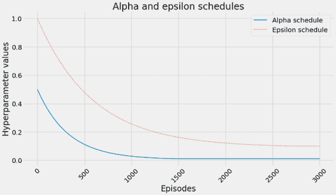另一件事：请注意，在这些运行中，我为所有算法设置了相同数量的剧集；它们都在 SWS 环境中运行了 3,000 个剧集。你会发现一些算法在这么多步骤中不会收敛，但这并不意味着它们根本不会收敛。此外，本章笔记本中的其他一些环境，如冰湖（Frozen Lake），在达到一定数量的步骤后终止，也就是说，你的智能体有 100 步来完成每个剧集，否则它会被赋予完成标志。这是一个我们将在后续章节中解决的问题。但请，去笔记本里玩玩！我想你会喜欢在那里玩来玩去。 |
|  | 计算自举和在线策略方法之间的相似趋势 |
|  | 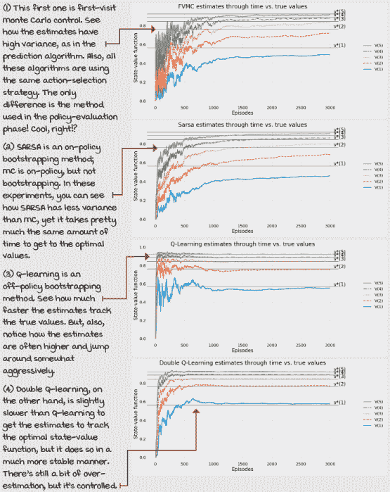 |
|  | 计算在 SWS 环境中学习到的策略 |
|  | 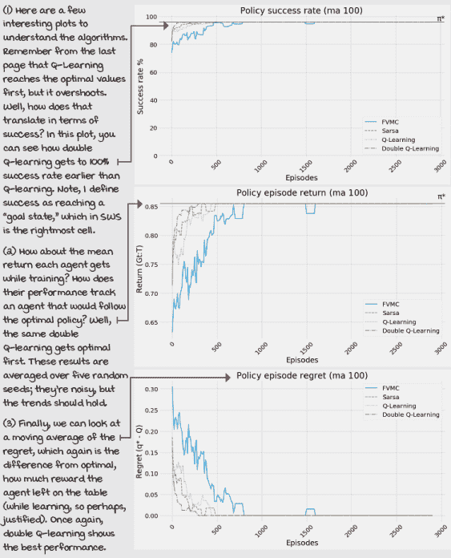 |
|  | 计算在 SWS 环境中学习到的值函数 |
|  | 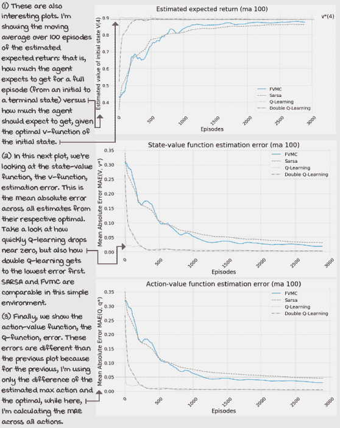 |

## 摘要

在本章中，你将迄今为止所学的一切付诸实践。我们学习了通过试错学习优化策略的算法。这些算法从同时具有顺序性和评估性的反馈中学习；也就是说，这些智能体学习同时平衡短期和长期目标以及信息的收集和利用。但与上一章不同，在上一章中，我们将智能体限制在解决预测问题，而在本章中，我们的智能体学会了解决控制问题。

本章中你学习了许多重要的概念。你了解到预测问题由评估策略组成，而控制问题由优化策略组成。你了解到预测问题的解决方案在策略评估方法中，例如前一章中提到的那些。但出乎意料的是，控制问题并不是仅通过你过去学过的策略改进方法来解决的。相反，为了解决控制问题，我们需要使用策略评估方法来学习仅从样本中估计动作价值函数，以及考虑探索需求的策略改进方法。

本章的关键要点是广义策略迭代模式（GPI），它由策略评估和策略改进方法之间的交互组成。虽然策略评估使价值函数与评估的策略一致，但策略改进则反转这种一致性，但产生更好的策略。GPI 告诉我们，通过这两个过程的交互，我们可以迭代地产生更好和更好的策略，直到收敛到最优策略和价值函数。强化学习理论支持这种模式，并告诉我们，确实，我们可以在离散的状态和动作空间中找到最优策略和价值函数，只需满足几个要求。你了解到 GLIE 和随机逼近理论在不同层面上应用于 RL 算法。

你了解了许多其他事物，从在线策略到离线策略，以及更多。双 Q 学习和双学习通常是我们后来构建的关键技术。在下一章中，我们将探讨解决控制问题的先进方法。随着环境变得具有挑战性，我们使用其他技术来学习最优策略。接下来，我们将查看更有效地解决环境的更有效的方法。也就是说，它们解决了这些环境，并且使用比本章中我们学习的方法更少的经验样本。

到现在为止，

+   了解大多数 RL 代理遵循一种称为广义策略迭代的模式

+   了解 GPI 通过策略评估和改进来解决控制问题

+   了解了几种遵循 GPI 模式来解决控制问题的代理

|  | 推文功能：独自工作并分享你的发现 |
| --- | --- |

|  | 这里有一些想法，如何将你所学的知识提升到更高层次。如果你愿意，可以与全世界分享你的成果，并确保查看其他人所做的工作。这是一个双赢的局面，希望你能充分利用它。

+   **#gdrl_ch06_tf01:** 本章中提出的所有算法都使用两个关键变量：学习率，alpha，和折扣因子，gamma。我希望你对这两个变量进行分析。例如，这些变量是如何相互作用的？它们如何影响智能体获得的总奖励和策略成功率？

+   **#gdrl_ch06_tf02:** 在本章之后，还有一件事需要考虑的是，我们为所有方法使用了相同的探索策略：这是一个指数衰减的ε-greedy 策略。但是，这是否是最好的策略？你将如何使用第四章中的其他策略？自己创建一个探索策略并测试它如何？改变与探索策略相关的超参数，看看结果如何变化？尝试这些应该不会太难。前往本书的 Notebooks，首先改变几个超参数：然后完全改变探索策略，告诉我们你发现了什么。

+   **#gdrl_ch06_tf03:** 你可能已经猜到了。本章中的算法也没有正确使用时间步限制。确保调查我所暗示的内容，一旦你发现了，就将算法更正为正确使用。结果是否有所改变？智能体现在是否比以前做得更好？它们在估计最优值函数、最优策略或两者方面是否更好？好多少？确保进行调查，或者在第八章之后回来。分享你的发现。

+   **#gdrl_ch06_tf04:** 在每一章中，我都使用最后的标签作为通用的标签。请随意使用这个标签来讨论与本章相关的任何其他工作。没有什么比你自己创造的任务更令人兴奋的了。确保分享你设定要调查的内容和你的结果。

用你的发现写一条推文，@mimoralea（我会转发），并使用列表中的特定标签来帮助感兴趣的人找到你的结果。没有正确或错误的结果；你分享你的发现并检查他人的发现。利用这个机会社交，做出贡献，让自己脱颖而出！我们正在等待你！以下是一条推文示例：“嘿，@mimoralea。我创建了一个包含学习深度强化学习资源的博客文章列表。查看它吧：<link> #gdrl_ch01_tf01”我会确保转发并帮助他人找到你的工作。|
