# 7 更有效地实现目标

在本章中

+   你将学习如何使强化学习代理在与具有挑战性的环境交互时更有效地达到最佳性能。

+   你将学习如何通过充分利用经验来使强化学习代理更有效地实现目标。

+   你将改进上一章中展示的代理，使它们能够充分利用收集到的数据，从而更快地优化其性能。

效率是正确地做事；有效性是做正确的事。

— 彼得·德鲁克 现代管理之父和自由勋章获得者

在本章中，我们改进了上一章中介绍过的代理。更具体地说，我们采取了两个独立的改进方向。首先，我们使用第五章中学习的*λ*-回报来满足广义策略迭代模式中的策略评估需求。我们探讨了使用*λ*-回报来进行在线和离线方法。使用带有资格痕迹的*λ*-回报比标准方法更快地将信用传播到正确的状态-动作对，从而使价值函数估计更快地接近实际值。

其次，我们探索使用经验样本来学习环境模型，即马尔可夫决策过程（MDP）的算法。通过这样做，这些方法能够从收集的数据中提取出最大价值，并且通常比那些不使用模型的方法更快地达到最优解。试图学习环境模型的算法组被称为**基于模型的强化学习**。

重要的是要注意，尽管我们分别探索了这些改进方向，但没有任何东西阻止你尝试将它们结合起来，也许在完成本章后你应该这样做。让我们立即深入了解细节。

| ŘŁ | 基于规划的强化学习 vs. 无模型强化学习 vs. 基于模型的强化学习 |
| --- | --- |
|  | **规划：**指的是需要环境模型来生成策略的算法。规划方法可以是状态空间规划类型，这意味着它们使用状态空间来找到策略，或者它们可以是计划空间规划类型，这意味着它们在所有可能计划的空间中搜索（想想遗传算法）。本书中我们学习过的规划算法示例包括价值迭代和政策迭代。**无模型强化学习：**指的是不使用环境模型但仍然能够生成策略的算法。这里的独特特性是这些方法在没有地图、模型或 MDP 的情况下获得策略。相反，它们使用试错学习来获得策略。本书中我们探索过的无模型强化学习算法的几个例子是 MC、SARSA 和 Q-learning。**基于模型的强化学习：**指的是可以学习但不需要环境模型来生成策略的算法。区别在于它们不需要预先模型，但当然可以很好地利用它们，更重要的是，它们试图通过与环境的交互来学习模型。本章我们学习的基于模型的强化学习算法的几个例子是 Dyna-Q 和轨迹采样。 |

## 使用鲁棒目标改进策略的学习

本章我们讨论的第一个改进方案是在我们的策略评估方法中使用更鲁棒的目标。回想一下，在第五章中，我们探讨了使用不同类型的目标来估计价值函数的策略评估方法。你学习了蒙特卡洛和*TD*方法，还了解了一种称为*λ*-回报的目标，它使用所有访问过的状态获得的目标的加权组合。

*TD*(*λ*)是我们用于策略评估需要的预测方法。然而，正如你从上一章所记得的，在处理控制问题时，我们需要使用策略评估方法来估计动作值函数，以及允许探索的策略改进方法。在本节中，我们讨论类似于 SARSA 和 Q 学习的控制方法，但使用的是*λ*-回报。

|  | 滑坡行走环境 |
| --- | --- |
|  | 为了介绍本章中的算法，我们使用与上一章相同的同一个环境，称为滑行七（SWS）。然而，在本章结束时，我们在更具挑战性的环境中测试了这些方法。回想一下，SWS 是一种行走，一个单行网格世界环境，有七个非终止状态。记住，这个环境是一个“滑行”的行走，这意味着它是嘈杂的，动作效果是随机的。如果代理选择向左走，它可能会这样做，但也有可能向右走，或者保持在原地。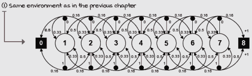滑行七环境 MDP 作为一个复习，上面是此环境的 MDP。但请记住，并且始终牢记，代理无法访问过渡概率。这个环境的动态对代理来说是未知的。此外，对代理来说，预先没有状态之间的关系。 |

### SARSA(λ)：根据多步估计在每一步改进策略

*sARSA***(***λ***)**是对原始 SARSA 代理的一个简单改进。SARSA 和 SARSA(*λ*)之间的主要区别在于，在 SARSA(*λ*)中，我们使用*λ*-回报，而不是像在 SARSA 中那样使用一步引导目标——*TD*目标。就是这样；你就有 SARSA(*λ*)了。真的！你看到学习基础知识是如何让更复杂的概念变得容易了吗？

现在，我想深入探讨一下你最初在第五章中读到的资格迹的概念。我在第五章中介绍的资格迹类型被称为*累积迹*。然而，在现实中，有多种方式来追踪导致奖励的状态或状态-动作对。

在本节中，我们深入挖掘累积迹，并将其应用于解决控制问题，同时我们还探索了一种不同类型的迹，称为*替换迹*，并在 SARSA(*λ*)代理中使用这两种迹。

| 0001 | 历史简介：SARSA 和 SARSA(*λ*)代理介绍 |
| --- | --- |
|  | 1994 年，Gavin Rummery 和 Mahesan Niranjan 发表了一篇题为“使用连接主义系统进行在线 Q 学习”的论文，在论文中，他们介绍了一种当时他们称之为“修改后的连接主义 Q 学习”的算法。1996 年，Singh 和 Sutton 将此算法命名为 SARSA，因为该算法使用了五个事件：(*S*[*t*], *A*[*t*], *R*[*t*+1], *S*[*t*+1], *A*[*t*+1])。人们常常想知道这些名称的由来，正如你很快就会看到的，强化学习研究人员在这些名称上可以非常富有创意。有趣的是，在这项算法的公开和“未经授权”的更名之前，1995 年，在题为“使用强化学习进行问题解决”的博士论文中，Gavin 向 Sutton 道歉，因为他继续使用“修改后的 Q 学习”这一名称，尽管 Sutton 更喜欢“SARSA”。Sutton 也继续使用 SARSA，这最终成为了强化学习社区中该算法的名称。顺便说一下，Gavin 的论文还介绍了 SARSA(λ)智能体。在 1995 年获得博士学位后，Gavin 成为了一名程序员，后来成为负责《古墓丽影》系列游戏的公司的首席程序员。Gavin 作为一名游戏开发者取得了成功。Mahesan 在 Gavin 原来的导师意外去世后成为他的博士导师，自 1990 年毕业以来，他一直从事更传统的学术生涯，担任讲师和教授等职务。 |

为了将累积跟踪应用于解决控制问题，唯一必要的改变是我们现在必须跟踪访问过的状态-动作对，而不是访问过的状态。我们不再使用资格向量来跟踪访问过的状态，而是使用资格矩阵来跟踪访问过的状态-动作对。

替换跟踪机制也很简单。它包括将资格跟踪剪裁到最大值为一；也就是说，我们不再无限制地累积资格，而是允许跟踪仅增长到一。这种策略的优势在于，如果您的智能体陷入循环，跟踪仍然不会不成比例地增长。总之，在替换跟踪策略中，当访问状态-动作对时，跟踪被设置为 一，并根据 *λ* 值衰减，就像在累积跟踪策略中一样。

| 0001 | 历史简介：资格跟踪机制的介绍 |
| --- | --- |
|  | 可塑性痕迹机制的一般思想可能归功于 A. Harry Klopf，他在 1972 年一篇题为“大脑功能和自适应系统——一种异质理论”的论文中，描述了在强化事件之后，突触将如何成为“可塑性”的。他假设：“当一个神经元放电时，所有在导致响应的电位总和期间活跃的兴奋性和抑制性突触都有资格在它们的传递性上发生变化。”然而，在强化学习的背景下，Richard Sutton 的博士论文（1984 年）引入了可塑性痕迹机制。更具体地说，他引入了你在本书中学到的累积痕迹，也称为传统累积痕迹。另一方面，替换痕迹是由 Satinder Singh 和 Richard Sutton 在 1996 年一篇题为《使用替换可塑性痕迹的强化学习》的论文中引入的，我们将在本章中讨论。他们发现了一些有趣的事实。首先，他们发现替换痕迹机制比累积痕迹机制导致的学习更快、更可靠。他们也发现累积痕迹机制是有偏的，而替换痕迹机制是无偏的。但更有趣的是，他们发现了 TD(1)、MC 和可塑性痕迹之间的关系。更具体地说，他们发现带有替换痕迹的 TD(1)与首次访问 MC 相关，而带有累积痕迹的 TD(1)与每次访问 MC 相关。此外，他们发现离线版本的替换痕迹 TD(1)与首次访问 MC 相同。这是一个小世界！ |

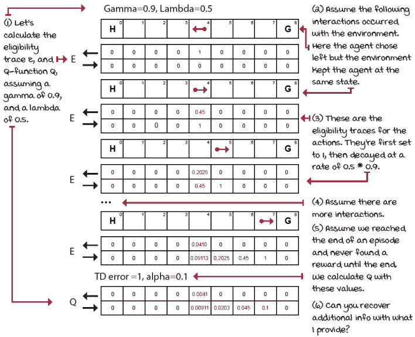

SWS 环境中的累积痕迹

|  | 简化频率和近期启发式在累积痕迹机制中的应用 |
| --- | --- |
|  | 累积痕迹结合了频率和近期启发式。当你的智能体尝试一个状态-动作对时，这个对对的痕迹会增加一。现在，想象一下环境中有一个循环，智能体多次尝试相同的状态-动作对。我们应该使这个状态-动作对“更”多地负责未来获得的奖励，还是让它只负责？累积痕迹允许痕迹值高于一，而替换痕迹则不允许。痕迹有一种方法，在痕迹机制中隐式地编码了频率（你尝试状态-动作对的频率）和近期（你尝试状态-动作对的时间）启发式。 |


SWS 环境中的替换痕迹

|  | 我会说 PythonSARSA(λ)智能体 |
| --- | --- |
|  |

```
def sarsa_lambda(env, ①
                 gamma=1.0,
                 init_alpha=0.5,
                 min_alpha=0.01,
                 alpha_decay_ratio=0.5,
                 init_epsilon=1.0,
                 min_epsilon=0.1,
                 epsilon_decay_ratio=0.9,
                 lambda_=0.5, ②
                 replacing_traces=True, ③
                 n_episodes=3000):
    nS, nA = env.observation_space.n, env.action_space.n      ④
    pi_track = []
    Q = np.zeros((nS, nA), dtype=np.float64) ⑤
    Q_track = np.zeros((n_episodes, nS, nA),
                     dtype=np.float64)
    E = np.zeros((nS, nA), dtype=np.float64) ⑥
    select_action = lambda state, Q, epsilon: \               ⑦
        np.argmax(Q[state]) \
        if np.random.random() > epsilon \
        else np.random.randint(len(Q[state]))
    alphas = decay_schedule(
        init_alpha, min_alpha,
      alpha_decay_ratio, n_episodes)
    epsilons = decay_schedule(
        init_epsilon, min_epsilon,
      epsilon_decay_ratio, n_episodes)
    for e in tqdm(range(n_episodes), leave=False):
        E.fill(0) ⑧
        state, done = env.reset(), False ⑨
        action = select_action(state, Q, epsilons[e]) ⑩
        while not done: ⑪
            next_state, reward, done, _ = env.step(action) ⑫
            next_action = select_action(next_state,           ⑬
                                        Q,
                                      epsilons[e]) ⑬
            td_target = reward + gamma * \ 
                        Q[next_state][next_action] * (not done) ⑭
            td_error = td_target - Q[state][action]
            E[state][action] = E[state][action] + 1 ⑮
            if replacing_traces: E.clip(0, 1, out=E) ⑮
            Q = Q + alphas[e] * td_error * E                  ⑯
            E = gamma * lambda_ * E                           ⑰
            state, action = next_state, next_action           ⑱
        Q_track[e] = Q                                        ⑲
        pi_track.append(np.argmax(Q, axis=1))
    V = np.max(Q, axis=1) ⑳
    pi = lambda s: {s:a for s, a in enumerate(\
                                      np.argmax(Q, axis=1))}[s]
    return Q, V, pi, Q_track, pi_track
```

① SARSA lambda 代理是 SARSA 和 *TD* lambda 方法的混合体。② 这里是 lambda_ 超参数（以 _ 结尾，因为 lambda 这个词在 Python 中是保留的）。③ replacing_traces 变量设置算法使用替换或积累痕迹。④ 我们使用之前常用的变量...⑤ ...包括 Q 函数和跟踪矩阵。⑥ 这些是允许我们跟踪可更新状态的资格痕迹。⑦ 其余部分与之前相同，包括 select_action 函数以及 alphas 和 epsilons 向量。⑧ 每个新剧集开始时，我们将每个状态的可选性设置为零。⑨ 然后我们像往常一样重置环境和 done 标志。⑩ 我们选择初始状态的动作。⑪ 我们进入交互循环。⑫ 我们将动作发送到环境中，并接收经验元组。⑬ 我们使用 Q 表和对应剧集的 epsilon 选择下一个状态的动作。⑭ 我们像原始 SARSA 一样计算 *TD* 目标和 *TD* 错误。⑮ 然后，我们增加状态-动作对的痕迹，并在是替换痕迹的情况下将其剪辑到 1。⑯ 注意这一点！我们一次将 *TD* 错误应用于所有合格的州-动作对。尽管我们使用整个 Q 表，但 E 将大部分为 0，对于合格的配对大于零。⑰ 我们衰减可选性。⑱ 更新变量。⑲ 保存 Q 和 pi。⑳ 训练结束时提取 V、pi 并返回。 |

|  | 积累和替换痕迹，以及无麸质和无香蕉饮食 |
| --- | --- |
|  | 几个月前，我的女儿晚上睡觉有困难。每天晚上，她都会多次醒来，大声哭泣，但不幸的是，她并没有告诉我们问题是什么。经过几晚之后，我和妻子决定采取一些措施，试图“追溯”问题，以便我们能更有效地“归因”导致失眠的原因。我们戴上了侦探帽（如果你是父母，你就知道这是什么感觉）并尝试了许多方法来诊断问题。大约一周后，我们将问题缩小到食物上；我们知道她吃某些食物的晚上会不好，但我们无法确定具体是哪些食物要承担责任。我注意到，在整个白天，她会吃很多含有麸质的碳水化合物，比如谷物、面条、饼干和面包。而且，接近睡觉时间，她会吃一些水果。我大脑中的“累积痕迹”指向了碳水化合物。“当然！”我想，“麸质是邪恶的；我们都知道这一点。而且，她整天都在吃那么多麸质。”如果我们追溯并累积她吃麸质的次数，麸质显然是合格的，显然是罪魁祸首，所以我们确实移除了麸质。但是，出乎我们的意料，问题只是有所缓解，并没有完全消失，正如我们希望的那样。几天后，我的妻子回想起她小时候晚上吃香蕉会有困难。我简直不敢相信，我的意思是，香蕉是水果，水果都是有益的，对吧？但有趣的是，最后，移除香蕉消除了那些糟糕的夜晚。难以置信！但是，也许如果我使用的是“替代痕迹”而不是“累积痕迹”，她一天中多次吃的所有碳水化合物都会得到更保守的责备。相反，因为我使用的是累积痕迹，在我看来，她多次吃麸质是罪魁祸首。就是这样。我无法清楚地看到香蕉的近期性发挥了作用。总的来说，累积痕迹在面对频率时可能会“夸大”，而替代痕迹则会减轻频繁事件所分配的责备。这种减轻可以帮助近期但罕见的事件浮出水面，并得到考虑。不要急于下结论。就像生活中的每一件事，在现实生活中的每一件事一样，了解工具并不仅仅是一眼就否定事物是至关重要的。我只是向你展示了可用的选项，但使用正确的工具来实现你的目标取决于你。 |

### Watkins 的 *Q*(*λ*)：再次将行为与学习分离

当然，还有*λ*算法的离策略控制版本。*Q*(*λ*)是 Q 学习的扩展，它使用*λ*-回报来满足广义策略迭代模式的策略评估需求。记住，我们在这里做的唯一改变是将离策略控制的*TD*目标（使用下一个状态中动作的最大值）替换为*λ*-回报。将 Q 学习扩展到资格迹有两种不同的方法，但我只介绍原始版本，通常被称为*Watkins 的 Q(**λ**)。

| 0001 | 历史简介：Q 学习与*Q*(*λ*)代理介绍 |
| --- | --- |
|  | 1989 年，Chris Watkins 在他的博士论文《从延迟奖励中学习》中介绍了 Q 学习与*Q*(*λ*)方法，这篇论文是当前强化学习理论的基石。Q 学习仍然是最受欢迎的强化学习算法之一，可能是因为它简单且效果良好。*Q*(*λ*)现在被称为 Watkins 的*Q*(*λ*)，因为有一个稍微不同的*Q*(*λ*)版本——由 Jing Peng 和 Ronald Williams 在 1993 年至 1996 年之间工作（这个版本被称为 Peng 的*Q*(*λ*)。）1992 年，Chris 与 Peter Dayan 一起发表了一篇题为“技术笔记 Q 学习”的论文，其中他们证明了 Q 学习的收敛定理。他们证明了在所有状态-动作对反复采样并离散表示的假设下，Q 学习以概率 1 收敛到最优动作值函数。不幸的是，Chris 在那之后几乎停止了 RL 研究。他继续在伦敦的避险基金工作，然后访问研究实验室，包括由 Yann LeCun 领导的一个小组，一直从事与 AI 相关的问题，但不是那么多的 RL。在过去的 22+年里，Chris 一直是伦敦大学的人工智能讲师。在完成他的 1991 年博士论文《强化连接主义：以统计方式学习》后（是的，那时候他们把神经网络称为连接主义——“深度强化学习”吗？是的！）Peter 继续进行了一两个博士后研究，包括在多伦多大学的 Geoff Hinton 那里。Peter 是 DeepMind 的共同创始人 Demis Hassabis 的博士后导师。Peter 在研究实验室担任了许多董事职位，最新的职位是马克斯·普朗克研究所。自 2018 年以来，他一直是英国皇家学会的院士，这是在英国授予的最高奖项之一。 |
|  | 我会说 Python：Watkins 的*Q*(*λ*)代理 1/3 |
|  |

```
def q_lambda(env, ①
             gamma=1.0,
             init_alpha=0.5,
             min_alpha=0.01,
             alpha_decay_ratio=0.5,
             init_epsilon=1.0,
             min_epsilon=0.1,
             epsilon_decay_ratio=0.9,
             lambda_=0.5, ②
             replacing_traces=True, ②
             n_episodes=3000):
    nS, nA = env.observation_space.n, env.action_space.n      ③
    pi_track = []
    Q = np.zeros((nS, nA), dtype=np.float64) ④
    Q_track = np.zeros((n_episodes, nS, nA), dtype=np.float64)
    E = np.zeros((nS, nA), dtype=np.float64) ⑤
    select_action = lambda state, Q, epsilon: \               ⑥
        np.argmax(Q[state]) \
        if np.random.random() > epsilon \
        else np.random.randint(len(Q[state]))
    alphas = decay_schedule(
        init_alpha, min_alpha,
      alpha_decay_ratio, n_episodes)
    epsilons = decay_schedule(
        init_epsilon, min_epsilon,
      epsilon_decay_ratio, n_episodes)
    for e in tqdm(range(n_episodes), leave=False): ⑦
```

① Q lambda 代理是 Q 学习和*TD* lambda 方法的混合体。② 这里是 lambda_ 和 replacing_traces 超参数。③ 有用的变量④ Q 表⑤ 所有状态-动作对的资格迹矩阵⑥ 常见的问题⑦ 待续... |

|  | 我会说 Python：Watkins 的*Q*(*λ*)代理 2/3 |
| --- | --- |
|  |

```
    for e in tqdm(range(n_episodes), leave=False): ⑧
        E.fill(0) ⑨
        state, done = env.reset(), False ⑩
        action = select_action(state,                         ⑪
                               Q,
                             epsilons[e])
        while not done: ⑫
            next_state, reward, done, _ = env.step(action) ⑬
            next_action = select_action(next_state,           ⑭
                                        Q,
                                      epsilons[e])
            next_action_is_greedy = \                         ⑮
              Q[next_state][next_action] == Q[next_state].max()
            td_target = reward + gamma * \
                               Q[next_state].max() * (not done) ⑯
            td_error = td_target - Q[state][action]           ⑰⑱
```

⑧ 在场景循环中继续⑨ 好的。因为 Q lambda 是一种离策略方法，我们必须谨慎地使用 E。我们正在学习贪婪策略，但遵循探索性策略。首先，我们像之前一样用零填充 E。⑩ 重置环境并完成。⑪ 但是，注意我们是如何像 SARSA 那样预先选择动作的，但在 Q-learning 中我们没有这样做。这是因为我们需要检查我们的下一个动作是否是贪婪的！⑫ 进入交互循环。⑬ 步进环境并获得经验。⑭ 我们以 SARSA 风格选择下一个动作！⑮ 并用它来验证在下一步中采取的动作仍然来自贪婪策略。⑯ 在这一步，我们仍然像常规 Q-learning 那样计算*TD*目标，使用最大值。⑰ 并使用*TD*目标来计算*TD*误差。⑱ 我们从下一页的这条线继续。 |

|  | 我会说 PythonWatkins 的*Q*(*λ*)智能体 3/3 |
| --- | --- |
|  |

```
            td_error = td_target - Q[state][action] ⑲
           if replacing_traces: E[state].fill(0) ⑳
            E[state][action] = E[state][action] + 1 ㉑
            Q = Q + alphas[e] * td_error * E            ㉒
            if next_action_is_greedy:
                E = gamma * lambda_ * E                 ㉓
            else:
                E.fill(0)
            state, action = next_state, next_action     ㉔
        Q_track[e] = Q
        pi_track.append(np.argmax(Q, axis=1)) ㉕
    V = np.max(Q, axis=1) ㉖
    pi = lambda s: {s:a for s, a in enumerate(\
                                      np.argmax(Q, axis=1))}[s]
    return Q, V, pi, Q_track, pi_track                  ㉗
```

⑲ 再次，使用目标和当前状态-动作对的当前估计来计算*TD*误差。注意，这不是下一个状态，这是状态！！！⑳ 替换迹控制方法的另一种方法是清除当前状态的所有动作值，然后增加当前动作。㉑ 我们将当前状态-动作对的资格增量增加 1。㉒ 并且像之前一样，我们将整个资格迹矩阵乘以错误和对应于该段落的错误率，然后将整个 Q 移动到那个错误。通过这样做，我们实际上是将信号降低到所有访问状态的各种程度。㉓ 注意这一点。如果我们将在下一个状态采取的动作（我们已选择）是贪婪动作，那么我们像往常一样衰减资格矩阵，否则，我们必须将资格矩阵重置为零，因为我们不再学习关于贪婪策略。㉔ 步骤结束时，我们更新状态和动作，使它们成为下一个状态和动作。㉕ 我们保存 Q 和 pi。㉖ 并且在训练结束时，我们也保存 V 和最终的 pi。㉗ 最后，我们返回所有这些。 |

## 交互、学习和规划智能体

在第三章中，我们讨论了如值迭代（VI）和政策迭代（PI）之类的规划算法。这些是规划算法，因为它们需要一个环境模型，一个 MDP。规划方法在离线计算最优策略。另一方面，在上一章中，我介绍了无模型的强化学习方法，也许甚至暗示它们是规划方法的改进。但它们是吗？

无模型 RL 相对于规划方法的优点是，前者不需要 MDP。通常，MDP 在事先很难获得；有时 MDP 甚至无法创建。想象一下用*10*¹⁷⁰可能的状态来表示围棋或用*10*¹⁶⁸⁵状态来表示星际争霸 II。这些是很大的数字，而且这还不包括动作空间或转换函数，想象一下！事先不需要 MDP 是一个实际的好处。

但是，让我们稍微思考一下：如果我们事先不需要 MDP，而是在与环境交互的过程中学习一个 MDP 会怎样呢？想想看：当你在一个新区域散步时，你开始在脑海中构建地图。你走了会儿，找到了一家咖啡馆，喝了咖啡，然后你知道怎么回去。学习地图的技能对你来说应该是直观的。强化学习代理能否做类似的事情？

在本节中，我们探索与环境交互的代理，如无模型方法，但它们也通过这些交互学习环境的模型，MDP。通过学习地图，代理通常需要更少的经验样本来学习最优策略。这些方法被称为*基于模型的强化学习*。请注意，在文献中，你经常看到 VI 和 PI 被引用为规划方法，但你也可能看到它们被引用为基于模型的方法。我更喜欢划清界限，将它们称为规划方法，因为它们需要 MDP 才能做任何有用的事情。SARSA 和 Q-learning 算法是无模型的，因为它们不需要也不学习 MDP。在本节中你将学习的方法是基于模型的，因为它们不需要，但学习并使用 MDP（或者至少是 MDP 的近似）。|

| ŘŁ | 带有 RL 口音的采样模型与分布模型 |
| --- | --- |
|  | **采样模型**：指的是环境模型，它根据某些概率产生环境如何转移的单个样本；你从模型中采样一个转移。**分布模型**：指的是环境模型，它产生转移和奖励函数的概率分布。 |

### Dyna-Q：学习样本模型

将规划和无模型方法统一的最著名的架构之一被称为*dyna-Q*。Dyna-Q 由交替使用无模型 RL 方法，如 Q-learning，和类似于价值迭代的规划方法组成，使用从环境中采样的经验和从学习模型中采样的经验来改进动作值函数。

在 Dyna-Q 中，我们跟踪状态、动作和下一个状态的三维张量，作为转移和奖励函数。转移张量记录了看到三元组*(s, a, s')*的次数，表示在执行动作*a*时从状态*s*到达状态*s'*的次数。奖励张量持有我们在三元组*(s, a, s')*上获得的平均奖励，表示当我们选择动作*a*在状态*s*并转移到状态*s'*时的预期奖励。

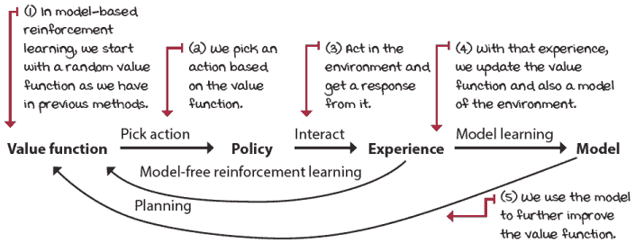

基于模型的强化学习架构

| 0001 | 一点历史介绍 Dyna-Q 代理 |
| --- | --- |
|  | 与基于模型的强化学习方法相关的想法可以追溯到很多年，归功于几位研究人员，但有三篇主要论文为 Dyna 架构奠定了基础。第一篇是 1981 年由理查德·萨顿和安德鲁·巴特罗撰写的论文“An Adaptive Network that Constructs and Uses an Internal Model of Its World”，然后是 1990 年由理查德·萨顿撰写的论文“Integrated Architectures for Learning, Planning, and Reacting Based on Approximating Dynamic Programming”，最后是 1991 年由理查德·萨顿撰写的论文“Dyna, an Integrated Architecture for Learning, Planning, and Reacting”，其中介绍了导致特定 Dyna-Q 代理的通用架构。 |
|  | 我会说 PythonDyna-Q 代理 1/3 |
|  |

```
def dyna_q(env, ①
           gamma=1.0,
           init_alpha=0.5,
           min_alpha=0.01,
           alpha_decay_ratio=0.5,
           init_epsilon=1.0,
           min_epsilon=0.1,
           epsilon_decay_ratio=0.9,
           n_planning=3, ②
           n_episodes=3000):
    nS, nA = env.observation_space.n, env.action_space.n      ③
    pi_track = []
    Q = np.zeros((nS, nA), dtype=np.float64) ④
    Q_track = np.zeros((n_episodes, nS, nA), dtype=np.float64)
    T_count = np.zeros((nS, nA, nS), dtype=np.int) ⑤
    R_model = np.zeros((nS, nA, nS), dtype=np.float64) ⑥
    select_action = lambda state, Q, epsilon: \
        np.argmax(Q[state]) \                                 ⑦
        if np.random.random() > epsilon \
        else np.random.randint(len(Q[state]))
    alphas = decay_schedule(
        init_alpha, min_alpha,
      alpha_decay_ratio, n_episodes)
    epsilons = decay_schedule(
        init_epsilon, min_epsilon,
      epsilon_decay_ratio, n_episodes)
    for e in tqdm(range(n_episodes), leave=False): ⑧
```

① Dyna-Q 与 Q-learning 代理类似，但它还学习环境模型，并使用该模型来改进估计。② 这个 n_planning 超参数是运行从学习模型中得到的估计更新的次数。③ 算法的前大部分是相同的。④ 我们将 Q 函数初始化为零，等等。⑤ 但然后，我们创建一个函数来跟踪转移函数。⑥ 另一个来跟踪奖励信号。⑦ 然后初始化探索策略 select_action，以及 alpha 和 epsilon 向量，就像往常一样。⑧ 待续 ... |

|  | 我会说 PythonDyna-Q 代理 2/3 |
| --- | --- |
|  |

```
    for e in tqdm(range(n_episodes), leave=False): ⑨
        state, done = env.reset(), False ⑩
        while not done:
            action = select_action(state, Q, epsilons[e]) ⑪
            next_state, reward, done, _ = env.step(action) ⑫
            T_count[state][action][next_state] += 1 ⑬
            r_diff = reward - \                               ⑭
                             R_model[state][action][next_state]
            R_model[state][action][next_state] += \           ⑮
                  (r_diff / T_count[state][action][next_state])
            td_target = reward + gamma * \                    ⑯
                               Q[next_state].max() * (not done)
            td_error = td_target - Q[state][action] ⑰
            Q[state][action] = Q[state][action] + \           ⑱
                                           alphas[e] * td_error
            backup_next_state = next_state                    ⑲
            for _ in range(n_planning): ⑳
```

⑨ 在情节循环中继续⑩ 对于每个新的情节，我们首先重置环境并获得初始状态。我们还将“完成”标志设置为 False 并进入步骤交互循环。⑪ 我们选择动作，就像原始 Q-learning（只在循环内）一样。⑫ 我们对环境进行步骤操作并获得经验元组。⑬ 然后，开始学习模型！我们增加状态-动作-下一个状态三元组的转移计数，表示完整的转移再次发生。⑭ 我们还尝试计算奖励信号的增量平均值。获取差异。⑮ 然后使用该差异和转移计数来学习奖励信号。⑯ 我们像通常的 Q-learning 风格一样计算*TD*目标（离线策略，使用最大值）...⑰ ... 以及*TD*误差，也使用*TD*目标和当前估计。⑱ 最后，更新 Q 函数。⑲ 在我们进入规划步骤之前，我们备份下一个状态变量。⑳ 待续 ... |

|  | 我会说 PythonDyna-Q 代理 3/3 |
| --- | --- |
|  |

```
            for _ in range(n_planning): ㉑
                if Q.sum() == 0: break ㉒
                visited_states = np.where( \                  ㉓
                           np.sum(T_count, axis=(1, 2)) > 0)[0]
                state = np.random.choice(visited_states) ㉓
                actions_taken = np.where( \                   ㉔
                         np.sum(T_count[state], axis=1) > 0)[0]
                action = np.random.choice(actions_taken) ㉔
                probs = T_count[state][action] / \
                                 T_count[state][action].sum() ㉕
                next_state = np.random.choice( \
                             np.arange(nS), size=1, p=probs)[0]
                reward = R_model[state][action][next_state] ㉖
                td_target = reward + gamma * \
                                            Q[next_state].max()
                td_error = td_target - Q[state][action]
                Q[state][action] = Q[state][action] + \       ㉗
                                           alphas[e] * td_error
            state = backup_next_state                         ㉘
        Q_track[e] = Q                                        ㉙
        pi_track.append(np.argmax(Q, axis=1))
    V = np.max(Q, axis=1)
    pi = lambda s: {s:a for s, a in enumerate( \
                                      np.argmax(Q, axis=1))}[s]
    return Q, V, pi, Q_track, pi_track
```

㉑ 我们从规划循环继续。㉒ 首先，我们想要确保 Q 函数之前已经进行了更新，否则，就没有太多可以规划的。㉓ 然后我们从智能体在经验中已经访问过的状态列表中选择一个状态。㉔ 我们然后选择在该状态下已经采取的动作。㉕ 我们使用计数矩阵来计算下一个状态的概率，然后是下一个状态。㉖ 使用奖励模型作为奖励。㉗ 然后使用那个模拟经验来更新 Q 函数！㉘ 在规划步骤结束时，我们将状态设置为下一个状态。㉙ 其余的都是一样的。 |

|  | 总结结果模型方法学习转移和奖励函数（转移见下文） |
| --- | --- |
|  | 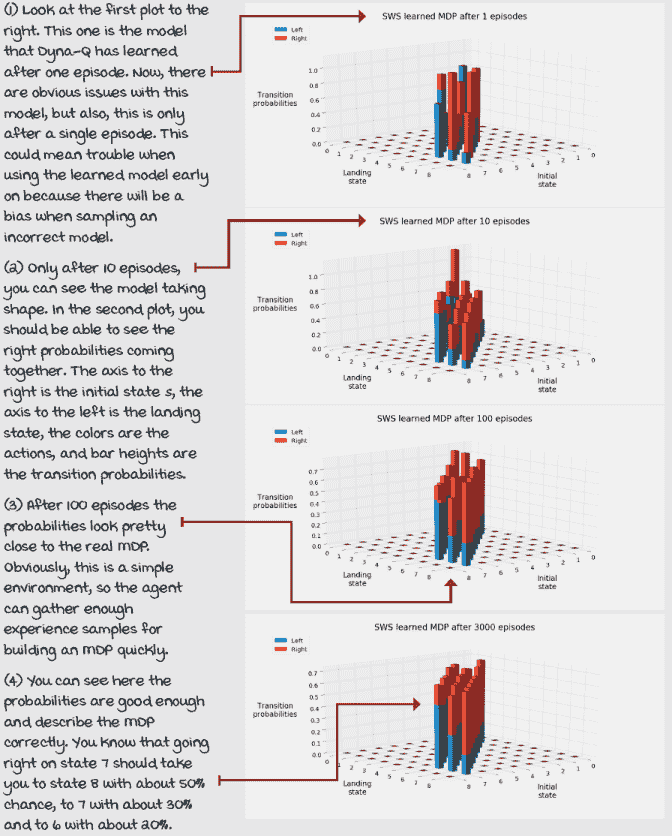 |

### 轨迹采样：为立即未来制定计划

在 Dyna-Q 中，我们学习模型的方式如前所述，调整动作值函数的方式与 vanilla Q-learning 相同，然后在算法的末尾运行几个规划迭代。请注意，如果我们从代码中移除模型学习和规划行，我们将剩下与上一章相同的 Q-learning 算法。

在规划阶段，我们只从已经访问过的状态-动作对中进行采样，这样智能体就不会在模型没有信息的状态-动作对上浪费资源。从那些访问过的状态-动作对中，我们随机均匀地采样一个状态，然后从之前选定的动作中随机采样动作。最后，我们从给定状态-动作对的转移概率中采样下一个状态和奖励。但这看起来似乎直观上是不正确的？我们是通过使用随机选择的状态来规划！

如果我们使用在当前场景中预期会遇到的状态，这种技术是否会更有效？思考一下。你更愿意优先规划你的日子、周、月和年，还是更愿意规划一个“可能”发生在你生活中的随机事件？比如说你是一名软件工程师：你更愿意规划阅读编程书籍，并着手那个副项目，还是规划一个可能的未来职业转变到医学？为立即未来制定计划是一种更明智的方法。*轨迹采样*是一种基于模型的强化学习方法，正是如此。

|  | 简化问题轨迹采样 |
| --- | --- |
|  | 当 Dyna-Q 随机均匀地采样学习到的 MDP 时，轨迹采样收集轨迹，即未来可能遇到的转换和奖励。你正在规划你的周计划，而不是你生活中的某个随机时间。这样做更有意义。传统的轨迹采样方法是从初始状态开始，使用在线策略轨迹采样直到达到终端状态，换句话说，在给定的时间步中从相同的行为策略中采样动作。然而，你不应该局限于这种方法；你应该尝试。例如，我的实现是从当前状态开始采样，而不是从初始状态开始，到预设步数内的终端状态，采样一个相对于当前估计的贪婪策略。但你可以尝试其他方法。只要你在采样轨迹，你就可以称之为轨迹采样。 |
|  | 我会说 Python 轨迹采样代理 1/3 |
|  |

```
def trajectory_sampling(env, ①
                        gamma=1.0,
                        init_alpha=0.5,
                        min_alpha=0.01,
                        alpha_decay_ratio=0.5,
                        init_epsilon=1.0,
                        min_epsilon=0.1,
                        epsilon_decay_ratio=0.9,
                        max_trajectory_depth=100, ②
                        n_episodes=3000):
    nS, nA = env.observation_space.n, env.action_space.n      ③
    pi_track = []
    Q = np.zeros((nS, nA), dtype=np.float64) ④
    Q_track = np.zeros((n_episodes, nS, nA), dtype=np.float64)
    T_count = np.zeros((nS, nA, nS), dtype=np.int) ⑤
    R_model = np.zeros((nS, nA, nS), dtype=np.float64) ⑥
    select_action = lambda state, Q, epsilon: \               ⑦
        np.argmax(Q[state]) \
        if np.random.random() > epsilon \
        else np.random.randint(len(Q[state]))
    alphas = decay_schedule(
        init_alpha, min_alpha,
      alpha_decay_ratio, n_episodes)
    epsilons = decay_schedule(
        init_epsilon, min_epsilon,
      epsilon_decay_ratio, n_episodes)
    for e in tqdm(range(n_episodes), leave=False): ⑧
```

① 轨迹采样在大多数情况下与 Dyna-Q 相同，但有几点例外。② 我们使用 max_trajectory_depth 来限制轨迹长度，而不是 n_planning。③ 算法的大部分与 Dyna-Q 相同。④ Q 函数，等等⑤ 我们创建相同的变量来模拟转换函数...⑥ ...以及另一个用于奖励信号。⑦ select_action 函数、alphas 向量和 epsilons 向量都是相同的。⑧ 待续... |

|  | 我会说 Python 轨迹采样代理 2/3 |
| --- | --- |
|  |

```
    for e in tqdm(range(n_episodes), leave=False): ⑨
        state, done = env.reset(), False ⑩
        while not done:
            action = select_action(state, Q, epsilons[e]) ⑪
            next_state, reward, done, _ = env.step(action) ⑫
            T_count[state][action][next_state] += 1 ⑬
            r_diff = reward - \                               ⑭
                             R_model[state][action][next_state]
            R_model[state][action][next_state] += \           ⑮
                  (r_diff / T_count[state][action][next_state])
            td_target = reward + gamma * \                    ⑯
                               Q[next_state].max() * (not done)
            td_error = td_target - Q[state][action] ⑰
            Q[state][action] = Q[state][action] + \           ⑱
                                           alphas[e] * td_error
            backup_next_state = next_state                    ⑲
            for _ in range(max_trajectory_depth): ⑳
```

⑨ 继续在剧集循环中⑩ 再次，每个新的剧集，我们首先重置环境并获得初始状态。我们还将 done 标志设置为 False 并进入步骤交互循环。⑪ 我们选择动作。⑫ 我们对环境进行步骤操作并获得经验元组。⑬ 我们像在 Dyna-Q 中一样学习模型：增加状态-动作-下一个状态三元组的转换计数，表示完整转换发生。⑭ 然后，再次计算奖励信号的增量平均值；首先，获取差异。⑮ 然后，使用该差异和转换计数来学习奖励信号。⑯ 我们像往常一样计算*TD*目标。⑰ 使用*TD*目标和当前估计的*TD*误差⑱ 然后，更新 Q 函数。⑲ 在我们进入规划步骤之前，我们备份下一个状态变量。⑳ 待续... |

|  | 我会说 Python 轨迹采样代理 3/3 |
| --- | --- |
|  |

```
            for _ in range(max_trajectory_depth): ㉑
                if Q.sum() == 0: break ㉒
                # action = select_action(state, Q, epsilons[e])
                action = Q[state].argmax() ㉓
                if not T_count[state][action].sum(): break ㉔
                probs = T_count[state][action] / \
                                 T_count[state][action].sum() ㉕
                next_state = np.random.choice( \ 
                             np.arange(nS), size=1, p=probs)[0]
                reward = R_model[state][action][next_state] ㉖
                td_target = reward + gamma * \                ㉗
                                            Q[next_state].max()
                td_error = td_target - Q[state][action]
                Q[state][action] = Q[state][action] + \ 
                                           alphas[e] * td_error
                state = next_state                            ㉘
            state = backup_next_state                         ㉙
        Q_track[e] = Q                                        ㉚
        pi_track.append(np.argmax(Q, axis=1))
    V = np.max(Q, axis=1)
    pi = lambda s: {s:a for s, a in enumerate( \
                                      np.argmax(Q, axis=1))}[s]
    return Q, V, pi, Q_track, pi_track
```

㉑ 注意我们现在正在使用 max_trajectory_depth 变量，但我们仍在规划。㉒ 我们仍然检查 Q 函数是否有任何差异，所以它值得我们的计算。㉓ 选择动作要么在策略内，要么在策略外（使用贪婪策略）。㉔ 如果我们没有经历过转换，规划将会一团糟，所以退出。㉕ 否则，我们得到 next_state 的概率并相应地采样模型。㉖ 然后，根据奖励信号模型获得奖励。㉗ 并且继续像真实经验一样更新 Q 函数。㉘ 注意在这里我们在循环之前更新状态变量，并继续策略内规划步骤。㉙ 在规划循环之外，我们恢复状态，并继续真实的交互步骤。㉚ 其他一切照旧 |

|  | 计数器增加 Dyna-Q 和轨迹采样以不同的方式采样学习模型 |
| --- | --- |
|  | 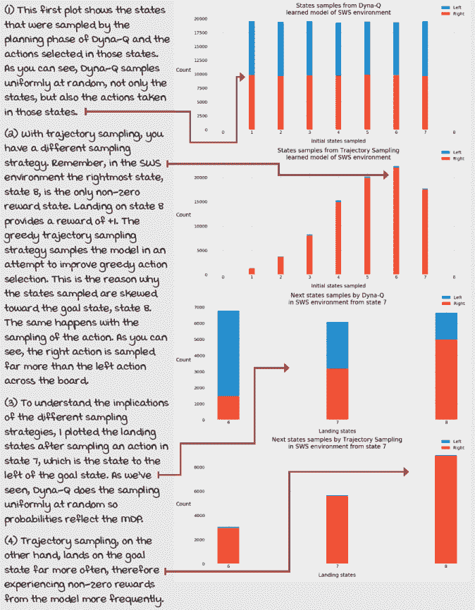 |
|  | 具体示例冻结湖环境 |
|  | 在第二章中，我们为称为冻结湖（FL）的环境开发了 MDP。正如你所记得的，FL 是一个简单的网格世界（GW）环境。它具有离散的状态和动作空间，有 16 个状态和四个动作。代理的目标是从起始位置移动到目标位置，同时避免掉入坑中。在这个特定的冻结湖环境实例中，目标是从状态 0 移动到状态 15。挑战在于湖面被冰封，因此非常滑。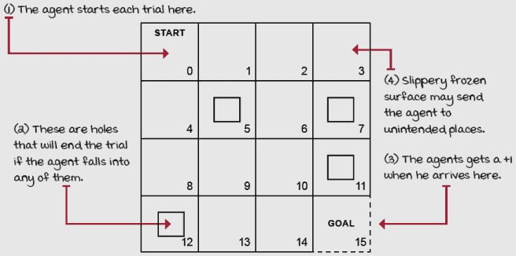冻结湖环境 FL 环境是一个 4×4 的网格，有 16 个单元格，状态 0-15，从左上角到底部右侧。状态 0 是初始状态分布中的唯一状态，这意味着在每次新的一集中，代理都会出现在那个起始状态。状态 5、7、11、12 和 15 是终端状态：一旦代理落在这些状态中的任何一个，集会就结束了。状态 5、7、11 和 12 是坑，状态 15 是“目标”。使“坑”和“目标”不同的因素是奖励函数。所有落在目标状态，即状态 15 的转换都提供+1 的奖励，而整个网格世界中其他所有的转换都提供 0 奖励，没有奖励。代理自然会尝试到达那个+1 的转换，这涉及到避开坑。环境的挑战在于动作具有随机效果，因此代理只有三分之一的动作是按照预期移动的。其他三分之二均匀地分布在正交方向上。如果代理试图离开网格世界，它将弹回到它试图移动的单元格。 |
|  | 细节之处 Hyperparameter values for the frozen lake environment |
|  | 冰湖（FL）环境比例如滑行七（SWS）环境更具挑战性。因此，我们需要做出的最重要的改变之一是增加智能体与环境交互的回合数。在 SWS 环境中，我们允许智能体仅交互 3,000 回合；在 FL 环境中，我们让智能体积累 10,000 回合的经验。这个简单的改变也自动调整了 alpha 和 epsilon 的衰减计划。将 n_episodes 参数的值从 3,000 改为 10,000 会自动改变智能体的探索和学习量。Alpha 现在在总回合数的 50%后（即 5,000 回合）从初始值 0.5 衰减到最小值 0.01，而 epsilon 在总回合数的 90%后（即 9,000 回合）从初始值 1.0 衰减到最小值 0.1。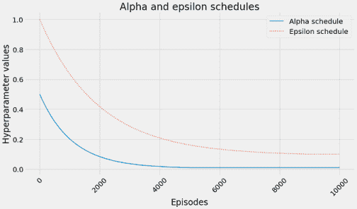最后，重要的是要提到，我使用的是 gamma 值为 0.99，并且当使用 OpenAI Gym 时，冰湖环境会自动用时间限制 Gym Wrapper 包装。这个“时间包装器”实例确保智能体在不超过 100 步的情况下结束回合。从技术上来说，这两个决定（gamma 和时间包装器）改变了智能体学习的最优策略和值函数，不应轻视。我建议在第七章的笔记本中尝试 FL 环境，并将 gamma 值改为不同的值（1，0.5，0），并且通过获取环境实例属性“unwrapped”，例如，“env = env.unwrapped”，来移除时间包装器。尝试理解这两者如何影响找到的策略和值函数。 |
|  | 总结一下：基于模型的 RL 方法在更少的回合中获得更接近实际的估计 |
|  | 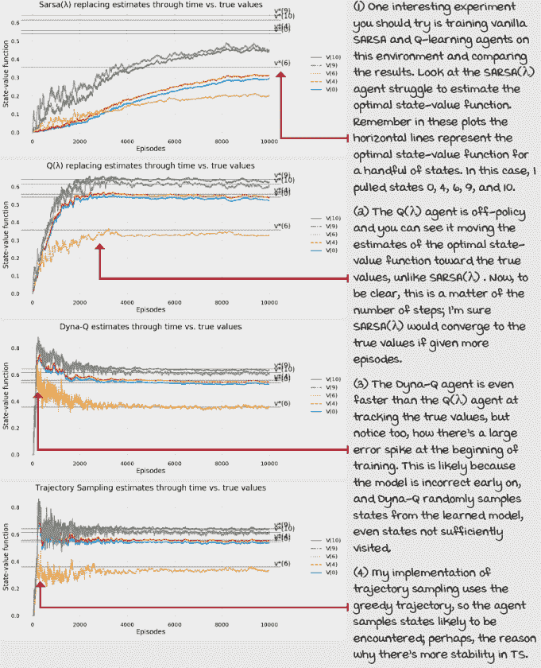 |
|  | 总结一下：轨迹和基于模型的方法都有效地处理经验 |
|  | 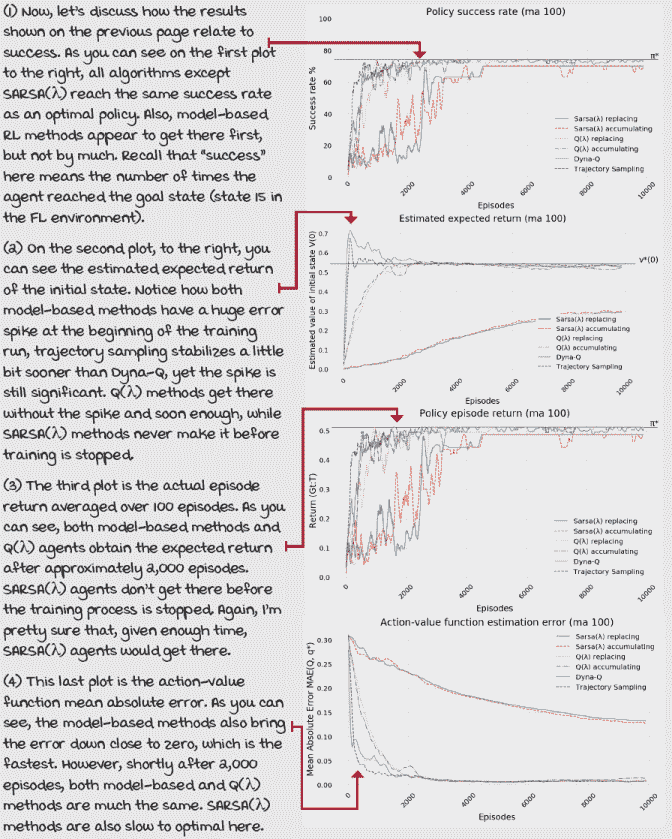 |
|  | 一个具体的例子：8 x 8 的冰湖环境 |
|  | 我们要不要提高难度，尝试在这些具有挑战性的环境中应用这些算法呢？这个环境被称为 8×8 冰湖（FL8×8）。正如你所预期的那样，这是一个 8×8 的网格世界，其属性与 FL 相似。初始状态是状态 0，位于左上角；终止和目标状态是状态 63，位于右下角。动作效果的不确定性是相同的：代理以仅仅 33.33%的概率移动到目标单元格，其余的以均匀的方式分布在正交方向上。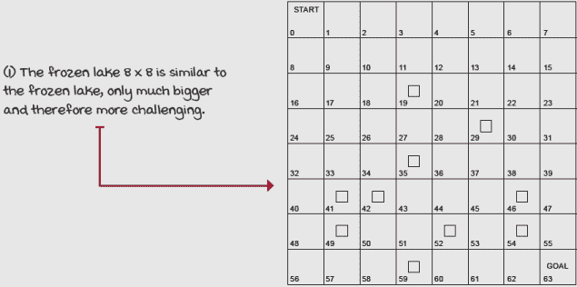正如你所见，这个环境的主要区别在于有很多更多的洞，而且显然它们位于不同的位置。状态 19、29、35、41、42、46、49、52、54 和 59 是洞；总共有 10 个洞！与原始 FL 环境相似，在 FL8×8 中，正确的策略允许代理在 100%的回合中达到终止状态。然而，在 OpenAI Gym 的实现中，学习到最优策略的代理并没有找到这些特定的策略，这是由于我们讨论过的 gamma 和时间包装器。想想看：考虑到这些环境的不确定性，一个安全的策略可能会因为时间包装器而在这个回合中获得零奖励。此外，给定一个小于一的 gamma 值，代理采取的步骤越多，奖励对回报的影响就越低。因此，安全的策略不一定是最优策略；因此，代理没有学习到它们。记住，目标不仅仅是找到一个 100%达到目标的策略，而是在 FL 中在 100 步内，在 FL8×8 中在 200 步内达到目标。代理可能需要冒险才能实现这个目标。 |
|  | 它在于细节冰湖 8×8 环境的超参数值 |
|  | 冰冻湖 8×8（FL8×8）环境是我们在这本书中讨论的最具挑战性的离散状态空间和动作空间环境。这个环境之所以具有挑战性，有以下几个原因：首先，64 个状态是我们处理过的状态数量最多的情况，但更重要的是，只有一个非零奖励使得这个环境特别具有挑战性。这实际上意味着智能体只有在第一次达到终端状态时才会知道他们已经做对了。记住，这是随机的！在他们找到非零奖励的转换之后，像 SARSA 和 Q-learning（不是 lambda 版本，而是原始版本）这样的智能体只会更新智能体转换到目标状态的那些状态的价值。这比奖励退回了一步。然后，为了使那个价值函数再退回一步，猜猜看，智能体需要随机地击中那个倒数第二个状态。但是，这是对于非 lambda 版本的情况。对于 SARSA(λ)和 Q(λ)，价值的传播取决于 lambda 的值。在本章的所有实验中，我使用了一个 lambda 值为 0.5，这大致告诉智能体传播价值占轨迹的一半（也取决于所使用的痕迹类型，但作为一个大致估计）。令人惊讶的是，我们对这些智能体所做的唯一改变是允许它们与环境交互的次数。在 SWS 环境中，我们只允许智能体进行 3,000 次交互，在 FL 环境中，我们让智能体积累 10,000 次经验；在 FL8×8 中，我们让这些智能体积累 30,000 次经验。这意味着 alpha 现在从初始值 0.5 衰减到最小值 0.01，这是总交互次数的 50%，现在是 15,000 次，而 epsilon 在总交互次数的 90%后衰减到最小值 0.1，现在是 27,000 次。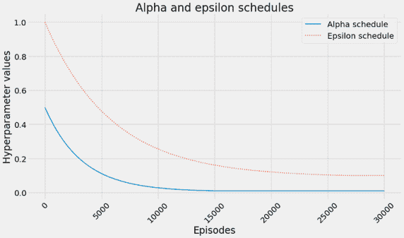 |
|  | 总结一下，基于策略的方法不再跟上，基于痕迹的离策略和基于模型的方法可以 |
|  | 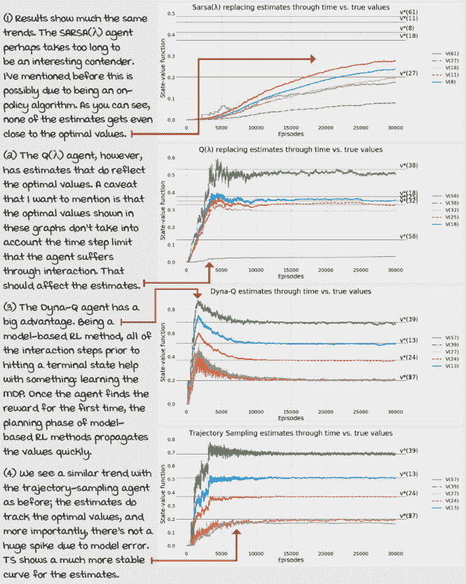 |
|  | 总结一下，一些基于模型的方法会显示出大的误差峰值以引起注意 |
|  | 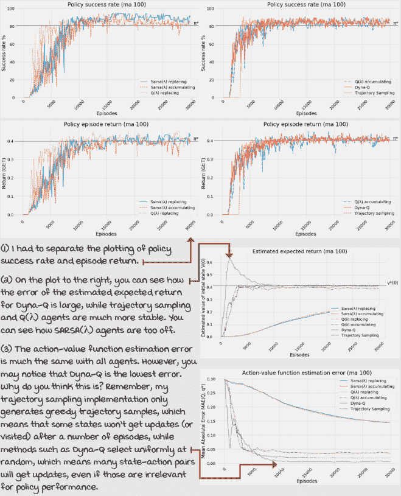 |

## 摘要

在本章中，你学习了如何使强化学习（RL）更加有效和高效。这里的“有效”指的是本章中提到的智能体能够在有限的交互次数内解决环境问题。其他智能体，如原始的 SARSA、Q-learning，甚至是蒙特卡洛控制，在有限的步骤内解决这些挑战会有困难；至少，对于 FL8x8 环境来说，它们在只有 30,000 次交互的情况下会遇到困难。这就是本章中“有效”的含义；智能体能够成功产生预期的结果。

我们还探讨了更高效的算法。在这里，我指的是数据效率；我的意思是，我们在这章中引入的代理可以用相同的数据做更多的事情，比其他代理。例如，SARSA(λ)和 Q(λ)可以比它们的原始版本 SARSA 和 Q-learning 更快地将奖励传播到价值函数估计中。通过调整λ超参数，你甚至可以将信用分配给一个场景中访问过的所有状态。λ的值为 1 并不总是最好的，但至少在使用 SARSA(λ)和 Q(λ)时你有这个选项。

你还学习了基于模型的方法，例如 Dyna-Q 和轨迹采样。这些方法以不同的方式提高样本效率。它们使用样本来学习环境模型；如果你的代理在状态`s`中采取行动`a`时，将 100%的 100 万个样本落在状态`s'`上，为什么不利用这些信息来改进价值函数和政策呢？高级基于模型的深度强化学习方法通常用于收集经验样本成本高昂的环境：例如机器人领域，或者没有高速模拟的问题，或者硬件需要大量资金资源。

在本书的剩余部分，我们将讨论在使用非线性函数近似时出现的微妙之处。你之前学到的所有内容仍然适用。唯一的区别是，我们现在从监督学习和函数近似的世界开始，而不是使用向量和矩阵来存储价值函数和政策。记住，在 DRL 中，代理从同时具有顺序性（与一次性相反）、评价性（与监督相反）和样本性（与穷举相反）的反馈中学习。我们还没有触及“样本性”的部分；代理总是能够访问所有状态或状态-动作对，但从下一章开始，我们将专注于无法穷举样本的问题。

到现在为止，你已经

+   知道如何开发更有效的 RL 代理以实现其目标

+   知道如何创建更高效的样本 RL 代理

+   知道如何处理同时具有顺序性和评价性的反馈

|  | 在自己的工作上努力，并分享你的发现 |
| --- | --- |

|  | 这里有一些想法，如何将你所学的知识提升到下一个层次。如果你愿意，可以与世界分享你的成果，并确保查看其他人所做的事情。这是一个双赢的局面，希望你能充分利用它。

+   **#gdrl_ch07_tf01:** 我只测试了本章中提出的算法在冻结的 8 × 8 湖环境中的效果，但你好奇上一章的算法如何吗？好吧，那就这么做！去书中的 Notebooks，将上一章的算法复制到这一章的 Notebook 中，然后运行并收集信息来比较所有算法。

+   **#gdrl_ch07_tf02:** 表格情况下的高级算法还有很多。整理一份有趣的算法列表，并与世界分享。

+   **#gdrl_ch07_tf03:** 现在，从你的列表中实现一个算法，并从别人的列表中实现另一个算法。如果你是第一个使用这个标签的人，那么就实现你列表中的两个算法。

+   **#gdrl_ch07_tf04:** 有一个基本的算法叫做优先遍历。你能调查这个算法，并告诉我们更多关于它的信息吗？确保你分享你的实现，将其添加到本章的笔记本中，并与本章的其他算法进行比较。

+   **#gdrl_ch07_tf05:** 创建一个类似于 8×8 的 Frozen Lake 环境，但更复杂，比如 16×16 的 Frozen Lake？现在测试所有算法，看看它们的性能如何。有没有哪个算法在本章中明显优于其他算法？

+   **#gdrl_ch07_tf06:** 在每一章中，我都使用最后一个标签作为通用的标签。请随意使用这个标签来讨论与本章相关的任何其他工作。没有比你自己创造的任务更令人兴奋的作业了。确保分享你设定要调查的内容和你的结果。

用你的发现写一条推文，@mimoralea（我会转发），并使用列表中的特定标签来帮助感兴趣的人找到你的结果。没有正确或错误的结果；你分享你的发现并检查别人的发现。利用这个机会社交，做出贡献，让自己脱颖而出！我们正在等待你！以下是一条推文示例：“嘿，@mimoralea。我创建了一个包含资源列表的博客文章，用于研究深度强化学习。查看它在这里<链接>。#gdrl_ch01_tf01”我会确保转发并帮助其他人找到你的作品。|
