# 8 基于价值的深度强化学习简介

本章内容

+   你将理解使用非线性函数逼近器训练强化学习代理的内在挑战。

+   你将创建一个深度强化学习代理，当从头开始训练并最小调整超参数时，它可以解决不同类型的问题。

+   你将识别在使用基于价值的方法解决强化学习问题时，其优缺点。

人类行为源于三个主要来源：欲望、情感和知识。

— 柏拉图，古希腊哲学家，雅典学院创始人

我们已经取得了很大的进步，你现在准备好真正深入理解深度强化学习了。在第二章，你学习了如何用马尔可夫决策过程（MDP）的方式表示问题，以便强化学习代理能够解决。在第三章，你开发了解决这些 MDP 的算法：也就是说，找到序列决策问题中最佳行为的代理。在第四章，你学习了关于解决一步 MDP 的算法，而这些算法没有访问这些 MDP。这些问题是不确定的，因为代理没有访问 MDP。代理通过试错学习来学习找到最佳行为。在第五章，我们将这两种类型的问题——序列和不确定——混合在一起，因此我们探索了学习评估策略的代理。代理没有找到最佳策略，但能够准确评估策略和估计价值函数。在第六章，我们研究了在不确定性下，找到序列决策问题中最佳策略的代理。这些代理通过与环境的互动和故意收集经验来学习，从随机到最佳。在第七章，我们学习了通过充分利用经验来找到最佳策略的代理。

第二章是本书所有章节的基础。第三章是关于处理序列反馈的规划算法。第四章是关于处理评估反馈的赌博机算法。第 5、6、7 章是关于强化学习算法，这些算法处理同时具有序列和评估性的反馈。这类问题就是人们所说的*表格强化学习*。从本章开始，我们深入探讨深度强化学习的细节。

更具体地说，在本章中，我们开始探讨使用深度神经网络解决强化学习问题。在深度强化学习中，有不同方式利用高度非线性的函数逼近器（如深度神经网络）的力量。它们是价值基础、策略基础、演员-评论家、基于模型和无梯度方法。本章深入探讨了基于价值的深度强化学习方法。

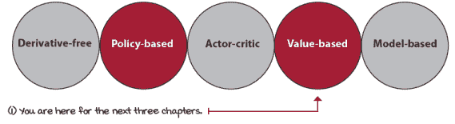

本书介绍的各种算法方法

## 深度强化学习代理使用的反馈类型

在深度强化学习中，我们构建能够从同时具有评估性、顺序性和样本性的反馈中学习的代理。我在整本书中都强调了这一点，因为你需要理解这意味着什么。

在第一章中，我提到深度强化学习是在不确定性下的复杂顺序决策问题。你可能想，“这么多词。”但正如我承诺的，所有这些词都有意义。“顺序决策问题”是你在第三章中学到的。“不确定性下的问题”是你在第四章中学到的。在第五章、第六章和第七章中，你学习了“不确定性下的顺序决策问题”。在这一章中，我们将“复杂”这个词重新加回到整个句子中。让我们利用这个介绍部分再次回顾一下深度强化学习代理使用的三种类型的学习反馈。

|  | 深度强化学习中反馈的类型 |
| --- | --- |
|  | **顺序的**（与一次性相对） | **评估的**（与监督学习相对） | **样本的**（与穷举相对） |
| **监督学习** | × | × | ✓ |
| **规划**（第三章） | ✓ | × | × |
| **多臂老虎机**（第四章） | × | ✓ | × |
| **表格式强化学习**（第五章、第六章、第七章） | ✓ | ✓ | × |
| **深度强化学习**（第八章、第九章、第十章、第十一章、第十二章） | ✓ | ✓ | ✓ |

### 深度强化学习代理处理顺序反馈

深度强化学习代理必须处理顺序反馈。顺序反馈的一个主要挑战是代理可以接收延迟信息。

你可以想象一场棋局，你一开始走了几步错棋，但这些错棋的后果只有在游戏结束时才会显现，如果你真的输掉了比赛。

延迟反馈使得难以解释反馈的来源。顺序反馈引发了时间信用分配问题，这是确定哪个状态、动作或状态-动作对负责奖励的挑战。当问题有时间成分且动作有延迟后果时，为奖励分配信用变得具有挑战性。

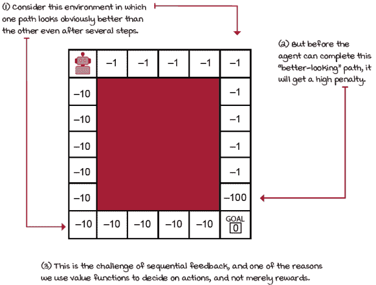

顺序反馈

### 但是，如果不是顺序的，那会是什么呢？

延迟反馈的反面是即时反馈。换句话说，顺序反馈的反面是一次性反馈。在处理一次性反馈的问题中，如监督学习或多臂老虎机，决策没有长期后果。例如，在分类问题中，无论正确与否对图像进行分类，都不会影响未来的性能；例如，在下一个模型中展示的图像与模型是否正确分类前一个批次无关。在深度强化学习中，这种顺序依赖性存在。

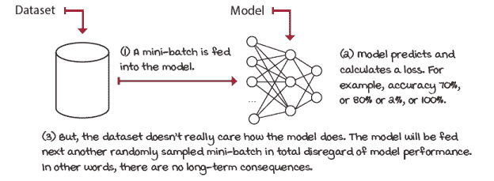

分类问题

此外，在多臂老虎机问题中，也没有长期后果，尽管这可能有点难以看到原因。老虎机是一状态一步马尔可夫决策过程（MDP），其中在单次动作选择后立即结束。因此，在该次期间，动作没有长期后果。

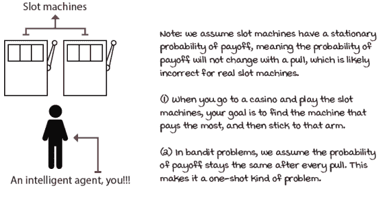

双臂老虎机

### 深度强化学习代理处理评估反馈

我们学到的第二个特性是评估反馈。深度强化学习、表格强化学习和老虎机都处理评估反馈。评估反馈的核心是反馈的好坏只是相对的，因为环境是不确定的。我们不知道环境的实际动态；我们没有访问到转换函数和奖励信号。

因此，我们必须探索我们周围的环境，以了解那里有什么。问题是，通过探索，我们错过了利用我们当前的知识，因此很可能会积累遗憾。从所有这些中，探索-利用权衡产生了。它是不确定性的一个持续副产品。在没有访问到环境模型的情况下，我们必须探索以收集新信息或改进当前信息。

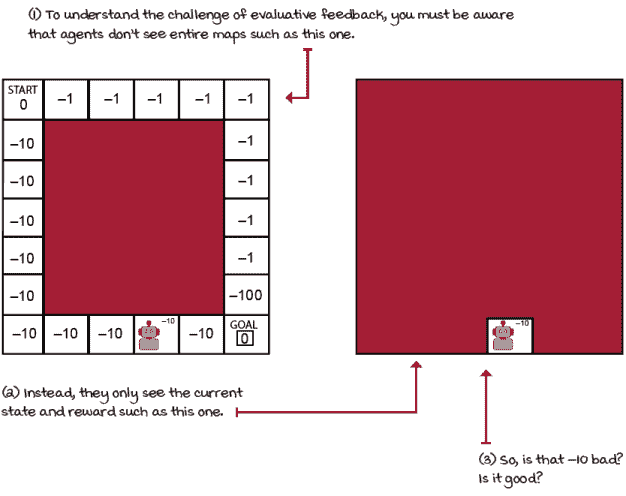

评估反馈

### 但是，如果不是评估性的，那它是什么呢？

评估反馈的对立面是监督反馈。在分类问题中，你的模型接收监督；也就是说，在学习过程中，你的模型会为提供的每个样本提供正确的标签。没有猜测的空间。如果你的模型犯了错误，正确的答案会立即提供。多么美好的生活啊！

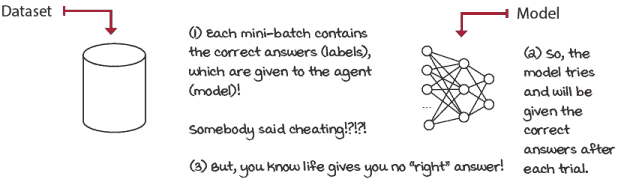

分类是“监督的”

将正确答案提供给学习算法的事实使得监督反馈比评估反馈更容易处理。这是监督学习问题与评估反馈问题（如多臂老虎机、表格强化学习和深度强化学习）之间的一个明显区别。

多臂老虎机问题可能不需要处理顺序反馈，但它们确实从评估反馈中学习。这是多臂老虎机问题要解决的问题的核心。在评估反馈下，代理必须平衡探索和利用的需求。如果反馈既是评估性的又是顺序的，那么挑战就更大了。算法必须同时平衡短期和长期目标以及信息的收集和利用。表格强化学习和深度强化学习代理都从同时是顺序性和评估性的反馈中学习。

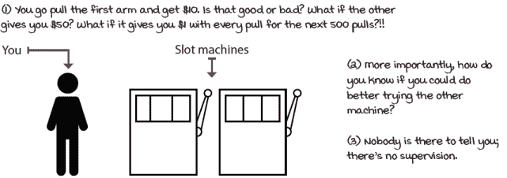

老虎机处理评估反馈

### 深度强化学习代理处理采样反馈

深度强化学习与表格强化学习区别在于问题的复杂性。在深度强化学习中，智能体不太可能全面地采样所有可能的反馈。智能体需要使用收集到的反馈进行推广，并基于这种推广做出明智的决策。

想想看。你不能期望从生活中得到全面反馈。你不能同时成为一名医生、律师和工程师，至少如果你想在任何一个领域都做得很好，你不能。你必须利用你早期积累的经验来为你的未来做出更明智的决策。这是基本的。你在高中数学好吗？很好，那么，就追求一个与数学相关的学位。你在艺术方面更擅长？那么，就选择那条道路。推广可以帮助你通过帮助你找到模式、做出假设和连接帮助你达到最佳自我的点来缩小你前进的道路。

顺便说一下，监督学习处理的是样本反馈。确实，监督学习的核心挑战是从样本反馈中学习：能够推广到新的样本，这是多臂老虎机和表格强化学习问题都无法做到的。

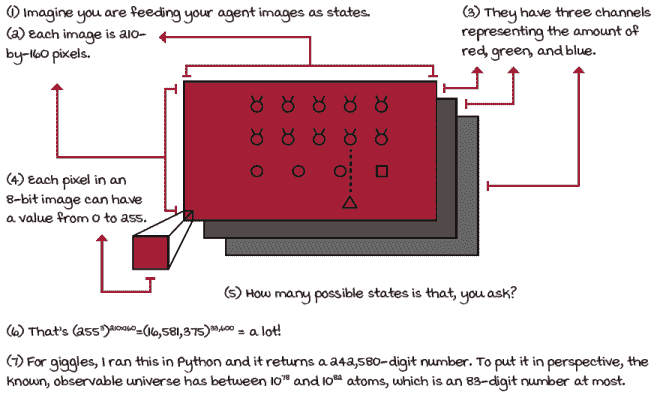

样本反馈

### 但是，如果不是样本化的，那会是什么呢？

样本反馈的对立面是全面反馈。要全面地采样环境意味着智能体可以访问所有可能的样本。例如，表格强化学习和老虎机智能体只需要采样足够长的时间来收集所有必要的信息以实现最佳性能。收集全面反馈也是表格强化学习中存在最优收敛保证的原因。在有限的状态和动作空间的小网格世界中，常见的假设，如“无限数据”或“无限频繁地采样每个状态-动作对”，是合理的假设。

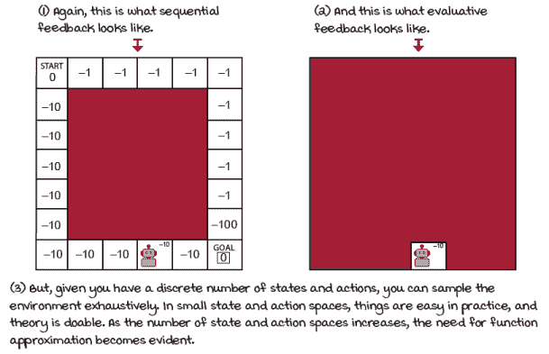

顺序性、评估性和全面反馈

我们之前还没有处理过这个维度。到目前为止，在这本书中，我们调查了表格强化学习问题。表格强化学习从评估性、顺序性和全面反馈中学习。但是，当我们遇到我们无法假设智能体将全面采样环境的更复杂问题时会发生什么？如果状态空间是高维的，比如有 10¹⁷⁰个状态的围棋棋盘呢？关于以 60 Hz 运行(255³)²¹⁰ × ¹⁶⁰的 Atari 游戏呢？如果环境状态空间有连续变量，比如表示关节角度的机械臂呢？关于具有高维和连续状态或甚至高维和连续动作的问题呢？这些复杂问题是深度强化学习领域存在的原因。

## 强化学习函数逼近简介

理解为什么我们首先使用函数逼近来解决强化学习问题至关重要。人们常常因为词汇而迷失方向，并因为炒作而选择解决方案。你知道，如果你听到“深度学习”，你会比听到“非线性函数逼近”更兴奋，尽管它们是相同的。这是人的本性。这发生在我身上，我相信它发生在许多人身上。但我们的目标是去除冗余，简化我们的思考。

在本节中，我提供了使用函数逼近来解决强化学习问题的一般动机。也许比 RL 整体更具体一些，但基本的动机适用于所有形式的 DRL。

### 强化学习问题可以具有高维的状态空间和动作空间

表格式强化学习的主要缺点是，在复杂问题中使用表格来表示价值函数已不再实用。环境可以具有高维的状态空间，这意味着构成单个状态变量的数量非常庞大。例如，上面提到的 Atari 游戏是高维的，因为它们有 210×160 像素和三个颜色通道。无论我们谈论维度时这些像素可以取什么值，我们指的是构成单个状态变量的数量。

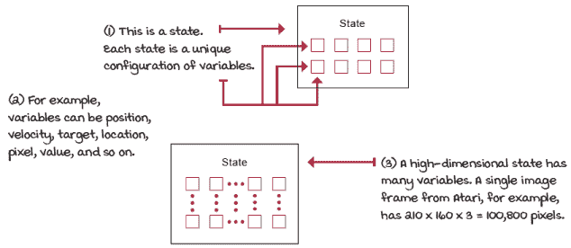

高维状态空间

### 强化学习问题可以具有连续的状态空间和动作空间

环境还可以有连续变量，这意味着一个变量可以取无限多个值。为了澄清，状态空间和动作空间可以是高维的，包含离散变量，也可以是低维的，包含连续变量，等等。

即使变量不是连续的，因此不是无限大的，它们仍然可以取大量的值，使得没有函数逼近就无法学习。例如，Atari 的情况就是这样，每个图像像素可以取 256 个值（0-255 的整数值。）那里有一个有限的状态空间，但足够大，以至于需要函数逼近才能进行任何学习。

但是，有时，即使是低维状态空间也可以是无限大的状态空间。例如，想象一个只有机器人的 x、y、z 坐标组成状态空间的问题。当然，三个变量的状态空间是一个相当低维的状态空间环境，但如果任何一个变量以连续形式提供，也就是说，该变量可以是无限小的精度呢？比如说，它可以是 1.56，或者 1.5683，或者 1.5683256，等等。那么，你如何制作一个考虑所有这些值的表格呢？是的，你可以对状态空间进行离散化，但让我节省你的时间，直接说：你需要函数逼近。

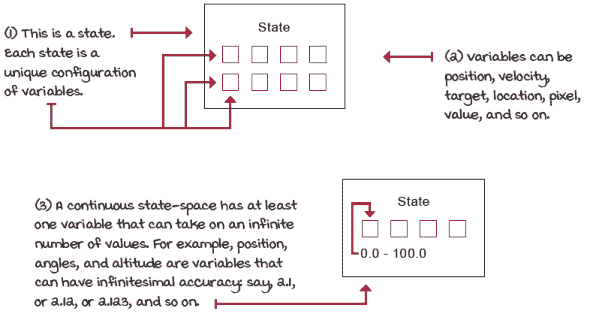

连续状态空间

|  | 一个具体例子小车-杆环境 |
| --- | --- |

|  | 小车-杆环境是强化学习中的一个经典案例。状态空间低维但连续，使其成为开发算法的绝佳环境；训练速度快，但仍有一定挑战性，函数逼近可以帮助！[](../Images/08_11_Sidebar02.png)这是小车-杆环境其状态空间由四个变量组成：

+   小车在轨道上的位置（x 轴）范围从 -2.4 到 2.4

+   小车沿轨道（x 轴）的速度范围从 -inf 到 inf

+   杆的角度范围大约在 ~-40 度到 ~40 度之间

+   杆尖的速度范围从 -inf 到 inf

在每个状态下都有两个可用的动作：

+   Action 0 对小车施加 -1 的力（向左推）

+   Action 1 对小车施加 +1 的力（向右推）

如果你达到终端状态

+   杆的角度与垂直位置超过 12 度

+   小车中心距离轨道中心超过 2.4 个单位

+   播放次数达到 500 个时间步（关于这一点稍后讨论）

奖励函数是

+   每个时间步 +1

|

### 使用函数逼近有优势

我相信你明白了，在高维或连续状态空间的环境中，没有实际的理由不使用函数逼近。在早期章节中，我们讨论了规划和强化学习算法。所有这些方法都使用表格来表示值函数。

|  | 刷新我的记忆值迭代和 Q-learning 等算法使用表格来表示值函数 |
| --- | --- |
|  | 值迭代是一种方法，它接受一个马尔可夫决策过程（MDP），并通过计算最优状态值函数 *v* 来推导出此类 MDP 的最优策略。为此，值迭代在多次迭代中跟踪状态值函数 *v* 的变化。在值迭代中，状态值函数的估计表示为按状态索引的值向量。这个向量存储在查找表中，用于查询和更新估计值！[](../Images/08_11_Sidebar03a.png)状态值函数 Q-learning 算法不需要 MDP，也不使用状态值函数。相反，在 Q-learning 中，我们估计最优动作值函数的值，***。动作值函数不是向量，而是由矩阵表示。这些矩阵是按状态和动作索引的二维表。！[](../Images/08_11_Sidebar03b.png)动作值函数 |
|  | 简化内容函数逼近可以使我们的算法更高效 |
|  | 在小车-杆环境中，我们希望使用泛化，因为这是更有效利用经验的方法。通过函数逼近，代理可以用更少的数据（也许更快）学习和利用模式！[](../Images/08_11_Sidebar04.png)带有和没有函数逼近的状态值函数 |

虽然价值迭代和 Q 学习在具有采样反馈的问题上无法解决问题，这使得它们不实用，但缺乏泛化使得它们效率低下。我的意思是，我们可以找到在具有连续变量状态的环境中使用表格的方法，但我们会为此付出代价。离散化值确实可以使表格成为可能，例如。但是，即使我们能够设计出一种使用表格并存储价值函数的方法，通过这样做，我们会失去泛化的优势。

例如，在购物车-杆环境中，函数逼近可以帮助我们的智能体学习 x 距离中的关系。智能体可能会发现，距离中心 2.35 个单位比距离中心 2.2 个单位更危险。我们知道 2.4 是 x 边界。这个使用泛化的额外理由不容忽视。价值函数通常具有智能体可以学习和利用的潜在关系。函数逼近器，如神经网络，可以发现这些潜在关系。

|  | 简化原因：使用函数逼近的理由 |
| --- | --- |
|  | 我们使用函数逼近的动机不仅是为了解决其他方法无法解决的问题，而且是为了更有效地解决问题。 |

## NFQ：基于价值的深度强化学习的第一次尝试

以下算法被称为 *神经拟合 Q* (NFQ) *迭代*，它可能是第一个成功使用神经网络作为函数逼近来解决强化学习问题的算法之一。

在本章的剩余部分，我将讨论大多数基于价值的深度强化学习算法都具有的几个组件。我希望你能将其视为一个机会，决定我们可以使用的不同部分。例如，当我介绍使用 NFQ 的损失函数时，我会讨论一些替代方案。我的选择并不一定是算法最初引入时所做的选择。同样，当我选择优化方法，无论是均方根传播 (RMSprop) 还是自适应矩估计 (Adam) 时，我会给出我使用的原因，但更重要的是，我会给你提供背景信息，以便你可以根据自己的需要选择和决定。

我希望你能注意到，我的目标不仅仅是教你这个特定的算法，更重要的是，向你展示你可以尝试不同事物的不同地方。许多 RL 算法都有这种“即插即用”的感觉，所以请注意。

### 第一个决策点：选择一个要逼近的价值函数

使用神经网络逼近价值函数可以以许多不同的方式完成。首先，我们可以逼近许多不同的价值函数。

|  | 刷新我的记忆：价值函数 |
| --- | --- |

|  | 你已经学习了以下价值函数：

+   状态价值函数 *v*(*s*)

+   动作价值函数 *q*(*s,a*)

+   动作优势函数 *a*(*s,a*)

你可能还记得，状态值函数 *v(s*)，虽然对许多目的来说很有用，但仅凭它本身并不能解决控制问题。找到 *v(s*) 帮助你知道从状态 s 出发并使用策略 *π* 后可以获得多少期望的总折现奖励。但是，为了确定使用 V 函数采取哪个动作，你还需要环境的 MDP，这样你就可以进行一步前瞻，并在选择每个动作后考虑所有可能的后继状态。你可能也记得，动作值函数 (*s,a*) 允许我们解决控制问题，所以它更像是我们需要解决小车-杆环境的问题：在小车-杆环境中，我们希望通过控制小车来学习所有状态的动作值，以平衡杆。如果我们有了状态-动作对的值，我们就可以区分那些会导致我们获得信息（在探索性动作的情况下）或最大化期望回报（在贪婪动作的情况下）的动作。我还想让你注意到，我们想要估计的是最优动作值函数，而不仅仅是动作值函数。然而，正如我们在广义策略迭代模式中学到的，我们可以使用 ε-贪婪策略进行在线学习并直接估计其值，或者我们可以进行离线学习，并始终估计相对于当前估计的贪婪策略，这随后成为最优策略。最后，我们还学习了动作优势函数 *a(s,a)*，它可以帮助我们区分不同动作的值，并让我们很容易地看到动作的平均优势。|

我们将在接下来的几章中研究如何使用 *v(s)* 和 *a(s)* 函数。现在，让我们确定估计动作值函数 (*s,a*)，就像在 Q-learning 中一样。我们将近似动作值函数的估计称为 *Q*(*s,a;* *θ*)，这意味着 Q 估计由 *θ* 参数化，即神经网络的权重，状态 *s* 和动作 *a*。

### 第二个决策点：选择神经网络架构

我们决定学习近似动作值函数 *Q(s,a;* *θ*）。尽管我建议该函数应该由 *θ*、s 和 *a* 参数化，但这并不一定非得如此。接下来我们要讨论的是神经网络架构。

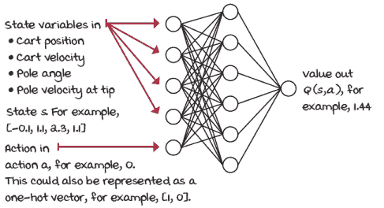

状态-动作-值-输出架构

当我们实现 Q-learning 代理时，你注意到了包含动作值函数的矩阵是如何由状态和动作对索引的。一个直接的神经网络架构是输入状态（小车-杆环境中的四个状态变量），以及要评估的动作。输出将是代表该状态-动作对的 Q 值的一个节点。

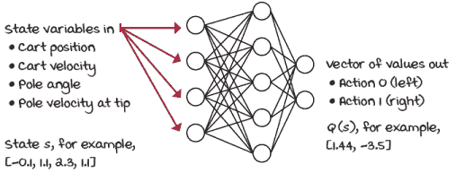

状态-值-输出架构

这个架构对于小车-杆环境来说效果很好。但是，一个更高效的架构只将状态（对于小车-杆环境是四个）输入到神经网络，并输出该状态下所有动作的 Q 值（对于小车-杆环境是两个）。当使用 epsilon-greedy 或 softmax 等探索策略时，这显然是有优势的，因为只需要进行一次前向传递就能得到任何给定状态下所有动作的值，这在动作数量众多的环境中尤其如此。

对于我们的 NFQ 实现，我们使用的是 *状态-值-输出架构*：也就是说，对于小车-杆环境，有四个输入节点和两个输出节点。

|  | 我会说 Python 全连接 Q 函数（状态-值-输出） |
| --- | --- |
|  |

```
class FCQ(nn.Module):
    def __init__(self,
               input_dim,
               output_dim,
               hidden_dims=(32,32),
               activation_fc=F.relu):
        super(FCQ, self).__init__()
        self.activation_fc = activation_fc
        self.input_layer = nn.Linear(input_dim,
                                   hidden_dims[0]) ①
        self.hidden_layers = nn.ModuleList()
        for i in range(len(hidden_dims)-1): ②
            hidden_layer = nn.Linear(
                hidden_dims[i], hidden_dims[i+1])
            self.hidden_layers.append(hidden_layer)
        self.output_layer = nn.Linear( ③
            hidden_dims[-1], output_dim)
    def forward(self, state):
        x = state
        if not isinstance(x, torch.Tensor): ④
            x = torch.tensor(x,
                           device=self.device,
                           dtype=torch.float32)
            x = x.unsqueeze(0)
        x = self.activation_fc(self.input_layer(x)) ⑤
        for hidden_layer in self.hidden_layers: ⑥
            x = self.activation_fc(hidden_layer(x))
        x = self.output_layer(x) ⑦
        return x
```

① 这里你只是在定义输入层。看看我们如何接收 input_dim 并输出 hidden_dims 向量的第一个元素。② 我们接着创建隐藏层。注意这个类是多么灵活，它允许你改变层数和每层的单元数。将不同的元组（例如（64，32，16））传递给 hidden_dims 变量，它将创建一个具有三个隐藏层（64、32 和 16 个单元）的网络。③ 然后我们将最后一个隐藏层连接到输出层。④ 在前向函数中，我们首先接收原始状态并将其转换为张量。⑤ 我们将其通过输入层，然后通过激活函数。⑥ 然后对所有的隐藏层做同样的处理。⑦ 最后，对于输出层，注意我们没有对输出应用激活函数，而是直接返回它。|

### 第三决策点：选择要优化的内容

让我们假设一下，小车-杆环境是一个监督学习问题。假设你有一个包含状态作为输入和值函数作为标签的数据集。你希望标签中包含哪个值函数？

|  | 显示我数学理想目标 |
| --- | --- |
|  | 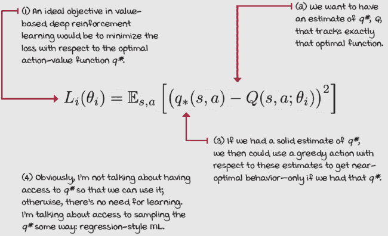 |

当然，学习最优动作值函数的理想标签是对应的状态-动作输入对的优化 Q 值（注意，小写 q 指的是真实值；大写通常用来表示估计）。这正是您所知道的最优动作值函数 *q**(*s,a*) 所表示的内容。

如果我们能访问最优动作值函数，我们会使用它，但如果我们能采样最优动作值函数，我们就可以最小化近似动作值函数和最优动作值函数之间的损失，这样就可以了。

我们追求的是最优动作值函数。

|  | 刷新我的记忆最优动作值函数 |
| --- | --- |
|  | 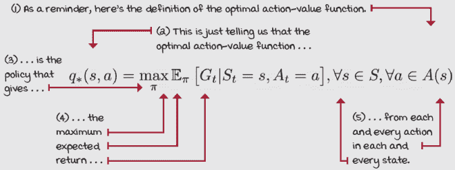 |

但为什么这是一个不可能的梦想呢？好吧，明显的是我们没有最优的动作值函数 *(s,a)*，但更糟糕的是，我们甚至无法采样这些最优 Q 值，因为我们也没有最优策略。

幸运的是，我们可以使用在广义策略迭代中学习到的相同原则，在这些原则中我们交替进行策略评估和策略改进过程以找到好的策略。但要知道，因为我们使用的是非线性函数逼近，所以不再存在收敛保证。这是“深度”世界的狂野西部。

对于我们的 NFQ 实现，我们正是这样做的。我们从随机初始化的动作值函数（和隐含策略）开始。然后，我们通过从策略中采样动作来评估策略，就像我们在第五章中学到的那样。然后，我们使用 epsilon-greedy 等探索策略来改进它，就像我们在第四章中学到的那样。最后，继续迭代直到达到期望的性能，就像我们在第六章和第七章中学到的那样。

|  | 简化它我们无法使用理想的目标 |
| --- | --- |
|  | 我们无法使用理想的目标，因为我们无法访问最优的动作值函数，我们甚至没有最优策略可以从中采样。相反，我们必须在评估策略（通过从中采样动作）和改进策略（使用探索策略，如 epsilon-greedy）之间交替。就像你在第六章中学到的，在广义策略迭代模式中。 |

### 第四个决策点：选择政策评估的目标

我们有多种方法可以评估一个策略。更具体地说，我们可以使用不同的 *目标* 来估计策略π的动作值函数。你学到的核心目标是蒙特卡洛（MC）目标、时序差分（TD）目标、*n*-步目标和 lambda 目标。

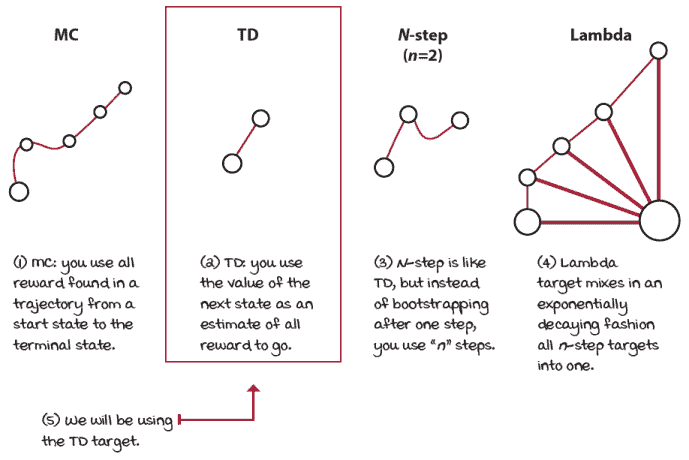

MC、TD、*n*-步和 lambda 目标

我们可以使用这些目标中的任何一个并得到可靠的结果，但这次在我们的 NFQ 实现中，我们保持简单，使用*TD*目标进行实验。

你记得 TD 目标可以是策略内或策略外，这取决于你如何自举目标。自举 TD 目标的主要两种方式是使用代理在最终状态采取的动作的动作值函数，或者，使用下一个状态估计值最高的动作的价值。

在文献中，这个目标的策略内版本通常被称为 SARSA 目标，而策略外版本被称为 Q-learning 目标。

|  | 展示数学方法在策略和离策略 TD 目标 |
| --- | --- |
|  |  |

在我们的 NFQ 实现中，我们使用与 Q 学习算法中相同的离策略 TD 目标。在这个阶段，为了得到一个目标函数，我们需要将作为理想目标方程的**最优动作值函数**(s,a)替换为 Q 学习目标。

|  | 展示数学 Q 学习目标，一个离策略 TD 目标 |
| --- | --- |
| 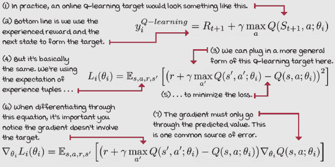 |
|  | 我会说 PythonQ 学习目标 |
|  |

```
q_sp = self.online_model(next_states).detach()      ①②
max_a_q_sp = q_sp.max(1)[0].unsqueeze(1) ③④
max_a_q_sp =* (1 - is_terminals)                    ⑤⑥
target_q_s = rewards + self.gamma * max_a_q_sp        ⑦
q_sa = self.online_model(states).gather(1, actions) ⑧
```

① 首先，我们获取在 s'（下一个状态）处的 Q 函数的值。next_states 中的 s 表示这是一个 next_state 的批次。②这里的'detach'很重要。我们不应该通过这个值进行传播。我们只是在计算目标。③然后，我们获取下一个状态的最大值 max_a。④unsqueeze 向向量添加一个维度，这样后续的操作才能在正确的元素上工作。⑤一个重要但常被忽视的步骤是确保终端状态被归零。⑥注意 is_terminals 是 is_terminal 标志的批次，这些标志仅指示下一个状态是否是终端状态。⑦我们现在计算目标。⑧最后，我们获取当前对 Q(s,a)的估计。在这个时候，我们准备好创建我们的损失函数。|

我想提醒你两个问题，不幸的是，我在使用 TD 目标的 DRL 算法实现中经常看到。|

首先，你需要确保你只反向传播通过预测值。让我解释一下。你知道在监督学习中，你有来自学习模型的预测值和通常提前提供的常量真实值。在强化学习中，通常“真实值”依赖于预测值本身：它们来自模型。

例如，当你形成一个 TD 目标时，你使用一个奖励，这是一个常量，以及下一个状态的折扣值，这个值来自模型。请注意，这个值也不是一个真实值，这将会在下一章中解决各种问题。但我也想让你现在注意到的是，预测值来自神经网络。你必须将这个预测值变成一个常量。在 PyTorch 中，你只能通过调用*detach*方法来做这件事。请查看前两个框并理解这些要点。它们对于 DRL 算法的可靠实现至关重要。

在我们继续之前，我想提出两个问题，不幸的是，我在使用 TD 目标算法的 DRL 实现中经常看到。这两个问题是关于终端状态的处理方式，当使用 OpenAI Gym 环境时。OpenAI Gym 步骤，用于与环境交互，在每一步后返回一个方便的标志，指示代理是否刚刚到达终端状态。这个标志帮助代理将终端状态的价值强制设为零，正如你从第二章中记得的，这是保持价值函数不发散的要求。你知道死后生命的价值为零。

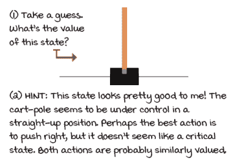

这个状态的价值是多少？

难题在于，一些 OpenAI Gym 环境，例如 cart-pole，有一个包装代码，在经过一定的时间步数后会人为地终止一个回合。在 CartPole-v0 中，时间步数限制是 200，而在 CartPole-v1 中是 500。这个包装代码有助于防止智能体花费太长时间完成一个回合，这可能是有用的，但它也可能给你带来麻烦。想想看：你认为在时间步数 500 时，让杆子竖直起来的价值是多少？我的意思是，如果杆子竖直，并且每一步都得到 +1，那么竖直的价值就是无限的。然而，由于在时间步数 500 时你的智能体超时，并且传递给智能体的终端标志，如果你不小心，你将基于零进行引导。这是不好的。我无法强调这一点。你可以用几种方法来处理这个问题，这里有两种常见的方法。与其基于零进行引导，不如基于网络预测的下一个状态值进行引导，如果你（1）达到了环境的最大时间步数限制，或者（2）在信息字典中找到了“TimeLimit.truncated”这个关键字。让我给你展示第二种方法。

|  | 我说 PythonProperly handling terminal states |
| --- | --- |
|  |

```
new_state, reward, is_terminal, info = env.step(action) ①
is_truncated = 'TimeLimit.truncated'  in info and \                 ②
                                    info['TimeLimit.truncated']
is_failure = is_terminal and not is_truncated                      ③
experience = (state, action, reward, new_state, float(is_failure)) ④
```

① 我们像往常一样收集一个经验元组。② 然后检查信息字典中的“TimeLimit.truncated”关键字。③ 失败的定义如下。④ 最后，如果回合以失败结束，我们添加终端标志。如果不是失败，我们希望基于新状态的价值进行引导。|

### 第五个决策点：选择探索策略

我们还需要决定为我们的广义策略迭代需要使用哪种策略改进步骤。你知道这一点来自第六章和第七章，其中我们交替使用策略评估方法，如 MC 或 *TD*，以及考虑探索的策略改进方法，如衰减的 epsilon-greedy。

在第四章中，我们调查了许多不同的方法来平衡探索-利用权衡，几乎所有这些技术都可以很好地工作。但是，为了保持简单，我们将在我们的 NFQ 实现中使用 epsilon-greedy 策略。

但是，我想强调的是，我们在这里训练的是一个离线策略学习算法的事实所具有的含义。这意味着有两个策略：一个生成行为的策略，在这个案例中是一个 epsilon-greedy 策略，以及我们正在学习的策略，即贪婪策略（最终是最佳策略）。

你在第六章中学习的离线学习算法的一个有趣的事实是，生成行为的策略可以是任何东西。也就是说，只要它有广泛的支持，这意味着它必须确保对所有状态-动作对的足够探索。在我们的 NFQ 实现中，我在训练期间使用了一个 epsilon-greedy 策略，该策略在 50% 的时间内随机选择动作。然而，在评估智能体时，我使用的是与学习到的动作值函数相关的贪婪动作。

|  | 我会说 PythonEpsilon-greedy 探索策略 |
| --- | --- |
|  |

```
class EGreedyStrategy():
    <...>
    def select_action(self, model, state):
        with torch.no_grad():
            q_values = model(state).cpu().detach() ①
            q_values = q_values.data.numpy().squeeze() ②
        if np.random.rand() > self.epsilon: ③
            action = np.argmax(q_values)
        else:
    action = np.random.randint(len(q_values)) ④
        <...>                                            ⑤
        return action
```

① epsilon-greedy 策略的 select_action 函数首先提取状态 *s* 的 Q 值。② 我将这些值调整为“NumPy 友好”并移除一个额外的维度。③ 然后，获取一个随机数，如果大于 epsilon，则贪婪地行动。④ 否则，在动作数量中随机行动。⑤ 注意：我总是查询模型来计算统计数据。但，如果你的目标是性能，那么你不应该这样做！

### 第六个决策点：选择损失函数

损失函数是我们神经网络预测好坏的度量。在监督学习中，解释损失函数更为直接：给定一批预测值及其对应的真实值，损失函数计算一个距离分数，表示网络在这批数据上的表现如何。

有许多不同的方法来计算这个距离分数，但我在这章中继续保持简单，并使用最常见的一种：MSE（均方误差，或 L2 损失）。不过，让我重申一下，与监督学习相比，强化学习中的一个挑战是，我们的“真实值”使用了来自网络的预测。

均方误差（MSE）或 L2 损失定义为预测值和真实值之间平均平方差的度量；在我们的情况下，预测值是直接来自神经网络的动作值函数的预测值：一切正常。但真实值是，是的，*TD*目标，这取决于来自网络的下一个状态的价值。

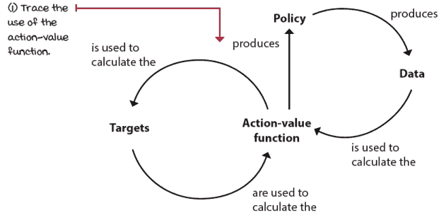

动作值函数的循环依赖性

正如你可能所想的，这种循环依赖性是坏的。它表现不佳，因为它不尊重监督学习问题中做出的几个假设。我们将在本章后面讨论这些假设，以及我们在下一章违反这些假设时出现的问题。

### 第七个决策点：选择优化方法

在给定一些假设的情况下，梯度下降是一种稳定的优化方法：数据必须是独立同分布的（IID），目标必须是平稳的。然而，在强化学习中，我们无法确保这些假设中的任何一个成立，因此选择一个鲁棒的优化方法来最小化损失函数，通常可以在收敛和发散之间产生差异。

如果你将损失函数想象成一个有山谷、山峰和平地的景观，那么优化方法就是寻找感兴趣区域的徒步策略，通常是在这个景观中的最低点或最高点。

监督学习中的一个经典优化方法被称为*批量梯度下降*。批量梯度下降算法一次性取整个数据集，计算给定数据集的梯度，并逐步朝这个梯度移动。然后，它重复这个循环直到收敛。在景观类比中，这个梯度代表一个信号，告诉我们需要移动的方向。批量梯度下降不是研究人员的首选，因为它不实用，无法一次性处理大量数据集。当你有一个包含数百万样本的大量数据集时，批量梯度下降太慢，不实用。此外，在强化学习中，我们甚至事先没有数据集，所以批量梯度下降也不是我们目的的实用方法。

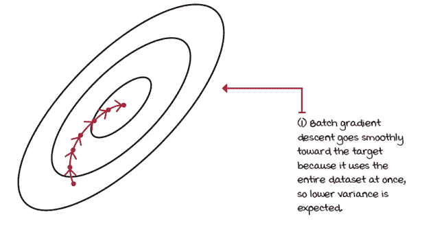

批量梯度下降

一种能够处理较小数据批次的优化方法称为小批量梯度下降。在小批量梯度下降中，我们一次只使用数据的一部分。我们处理一个小批量的样本以找到其损失，然后反向传播来计算这个损失的梯度，然后调整网络的权重，使网络更好地预测这个小批量的值。使用小批量梯度下降，你可以控制小批量的大小，这允许处理大型数据集。

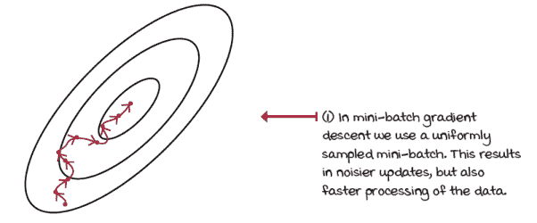

小批量梯度下降

在一个极端情况下，你可以将你的小批量大小设置为数据集的大小，这样你又会回到批量梯度下降。在另一个极端情况下，你可以将小批量大小设置为每步一个样本。在这种情况下，你正在使用一种称为*随机梯度下降*的算法。

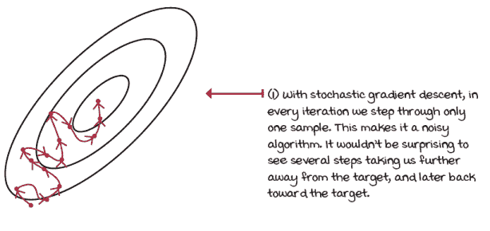

随机梯度下降

批次越大，优化方法的步骤方差就越低。但是，如果使用过大的批次，学习速度会显著减慢。在实践中，这两种极端情况都太慢了。因此，常见的小批量大小范围在 32 到 1024 之间。

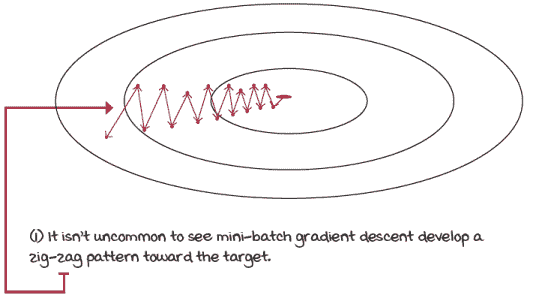

小批量梯度下降的 Z 字形模式

一种改进的梯度下降算法被称为*带有动量的梯度下降*，或简称*动量*。这种方法是一种小批量梯度下降算法，它更新网络权重的方式是朝着梯度的移动平均值的方向，而不是梯度本身。

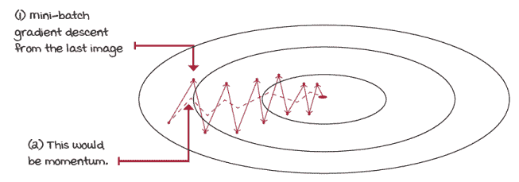

小批量梯度下降与动量

使用动量的替代方法是称为*均方根传播*（RMSprop）。RMSprop 和动量都做同样的事情，即减少振荡并更直接地向目标移动，但它们以不同的方式做到这一点。

当动量沿着梯度移动平均的方向迈步时，RMSprop 则采取更安全的做法，按比例缩放梯度，比例是梯度幅度的移动平均。它通过按比例缩放梯度来减少振荡，比例是梯度平方的移动平均的平方根，或者更简单地说，是最近梯度幅度的平均值。

|  | 基于价值型深度强化学习的优化方法 |
| --- | --- |
|  | 为了可视化 RMSprop，想象一下你的损失函数表面的陡峭度变化。如果梯度很高，例如在下坡时，表面变为一个平坦的谷地，其中梯度很小，那么梯度移动平均的幅度将高于最近的梯度；因此，步长的大小会减小，从而防止振荡或超调。如果梯度很小，例如在接近平坦的表面上，并且它们变为一个显著的梯度，就像在下坡时，那么梯度平均的幅度将很小，而新的梯度很大，因此增加步长并加快学习速度。 |

我想介绍的最后一种优化方法称为 *自适应动量估计*（Adam）。Adam 是 RMSprop 和动量的结合。Adam 方法沿着梯度速度的方向迈步，就像动量一样。但是，它按比例缩放更新，比例是梯度幅度的移动平均，就像 RMSprop 一样。这些特性使得 Adam 作为优化方法比 RMSprop 更具侵略性，但不如动量那么具侵略性。

在实践中，Adam 和 RMSprop 都是价值型深度强化学习方法的合理选择。我在接下来的章节中广泛使用了这两种方法。然而，我更倾向于使用 RMSprop 作为价值型方法，这一点你很快就会注意到。RMSprop 稳定且对超参数的敏感性较低，这在价值型深度强化学习中尤为重要。

| 0001 | 一点历史介绍 NFQ 算法 |
| --- | --- |
|  | NFQ 由 Martin Riedmiller 在 2005 年发表的一篇名为“Neural Fitted Q Iteration − First Experiences with a Data Efficient Neural Reinforcement Learning Method”的论文中提出。在担任欧洲多所大学教授 13 年后，Martin 在 Google DeepMind 找到了一份研究科学家的职位。 |
|  | 详细介绍完整的神经拟合 Q 迭代（NFQ）算法 |

|  | 目前，我们已经做出了以下选择：

+   近似动作值函数 *Q*(*s,a; θ*)。

+   使用状态-值输出架构（节点：4, 512, 128, 2）。

+   优化动作值函数以近似最优动作值函数 *q**(*s,a*)。

+   使用离策略 *TD* 目标（*r + γ*max_a’Q*(*s’，a’; θ*）来评估策略。

+   使用 ε-贪婪策略（ε 设置为 0.5）来改进策略。

+   使用均方误差（MSE）作为我们的损失函数。

+   使用 RMSprop 作为我们的优化器，学习率为 0.0005。

NFQ 有三个主要步骤：

1.  收集 E 个经验：(*s, a, r, s’，d*) 元组。我们使用 1024 个样本。

1.  计算离策略 *TD* 目标：*r + γ*max_a’Q*(*s’，a’; θ*)。

1.  使用 MSE 和 RMSprop 来拟合动作值函数 *Q*(*s,a; θ*)。

此算法在返回到步骤 1 之前重复步骤 2 和 3 *K* 次数。这就是它被拟合的原因：嵌套循环。我们将使用 40 次拟合步骤 *K*。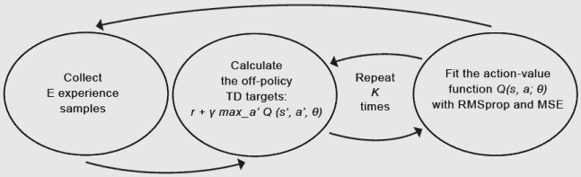NFQ |

|  | 计数器：NFQ 通过了小车-杆环境 |
| --- | --- |
|  | 虽然 NFQ 远非最先进的基于价值的深度强化学习方法，但在一个相对简单的环境中，如小车-杆，NFQ 表现出相当不错的性能。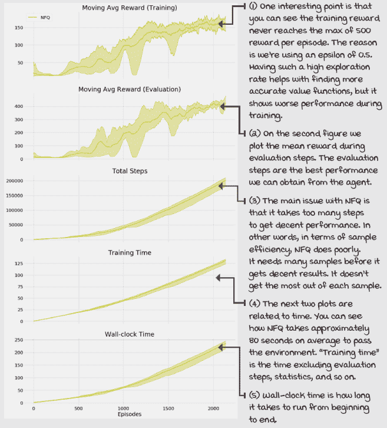 |

### 可能（确实）出错的事情

我们算法有两个问题。首先，因为我们使用了一个强大的函数逼近器，我们可以泛化到状态-动作对，这是非常好的，但也意味着神经网络会一次性调整所有相似状态的价值。

现在，考虑一下这个问题：我们的目标值取决于下一个状态的价值，我们可以安全地假设这些状态与我们最初调整价值的状态相似。换句话说，我们正在为我们的学习更新创建一个非平稳的目标。当我们更新近似 Q 函数的权重时，目标也会移动，并使我们的最新更新过时。因此，训练很快变得不稳定。

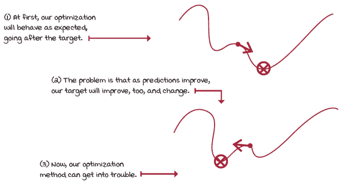

非平稳目标

其次，在 NFQ 中，我们批量处理了在线收集的 1024 个经验样本，并从该小批量更新网络。正如你可以想象的那样，这些样本是相关的，因为大多数这些样本来自相同的轨迹和政策。这意味着网络从相似样本的小批量中学习，后来使用的是也内部相关的不同小批量，但可能与先前的小批量不同，主要是在收集样本的政策不同或较旧时。

所有这些都意味着我们没有保持 IID 假设，这是一个问题，因为优化方法假设他们用于训练的数据样本是独立且同分布的。但我们在几乎完全相反的情况下进行训练：我们的分布上的样本不是独立的，因为新状态 *s* 的结果取决于我们的当前状态 *s*。

此外，我们的样本并非同分布，因为生成数据的底层过程，即我们的策略，是随时间变化的。这意味着我们没有固定的数据分布。相反，负责生成数据的策略在定期变化，并有望得到改进。每次我们的策略发生变化时，我们都会获得新的、可能不同的经验。优化方法允许我们在一定程度上放宽独立同分布的假设，但强化学习问题一直存在，因此我们也需要对此采取一些措施。

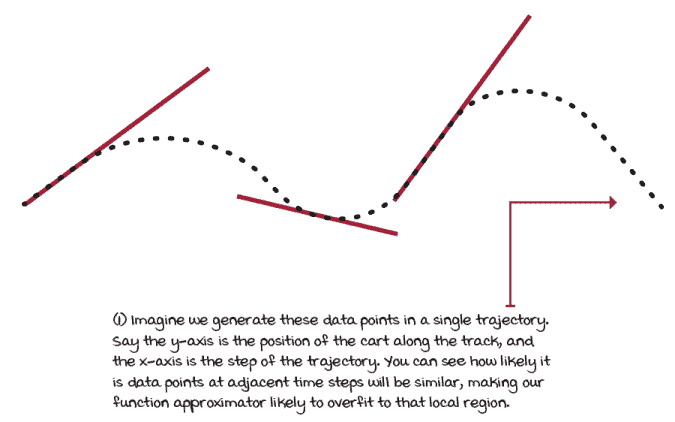

与时间相关的数据

在下一章中，我们将探讨缓解这两个问题的方法。我们首先通过改进 NFQ 算法，即有争议地开启了深度强化学习革命的 DQN 算法，来提升 NFQ。随后，我们将探讨多年来对原始 DQN 算法提出的许多改进。在下一章中，我们还将探讨双 DQN，然后在第十章中，我们将探讨对抗 DQN 和 PER。

## 摘要

在本章中，我们概述了采样反馈如何与顺序反馈和评估反馈相互作用。我们在介绍一个简单的深度强化学习代理时这样做，该代理近似 Q 函数，在之前的章节中，我们会用表格形式或查找表来表示。本章是关于基于价值的深度强化学习方法的介绍。

你了解到高维和连续状态空间和动作空间之间的区别。前者表示组成单个状态的大量值；后者暗示至少有一个变量可以取无限多个值。你了解到决策问题可以是高维和连续变量，这使得使用非线性函数近似变得有趣。

你了解到函数近似不仅对估计只有少量样本的值的期望值有益，而且对学习状态和动作维度中的潜在关系也有益。通过拥有一个好的模型，我们可以估计我们从未收到样本的值，并利用所有经验。

你对构建深度强化学习代理时常用的不同组件有了深入的了解。你了解到你可以近似不同类型的值函数，从状态值函数 *v(s)* 到动作值 *q(s, a)*。而且，你可以使用不同的神经网络架构来近似这些值函数；我们探讨了状态-动作对输入，值输出，到更有效的状态输入，值输出。你了解到我们可以使用与 Q 学习相同的目标，使用 *TD* 目标进行离策略控制。而且，你知道有许许多多的目标可以用来训练你的网络。你调查了探索策略、损失函数和优化方法。你了解到深度强化学习代理容易受到我们选择的损失和优化方法的影响。你了解到 RMSprop 和 Adam 是优化方法的稳定选项。

你学会了将这些组件组合成一个名为神经拟合 Q 迭代的算法。你了解了基于值的方法在深度强化学习中常见的问题。你学习了独立同分布假设和目标状态的稳定性。你了解到如果不注意这两个问题，可能会陷入麻烦。

到现在为止，

+   理解从序列性、评估性和抽样反馈中学习是什么

+   可以解决具有连续状态空间的强化学习问题

+   了解基于值的 DRL 方法中的组件和问题

|  | 可分享的工作：自己动手并分享你的发现 |
| --- | --- |

|  | 这里有一些想法，如何将你学到的知识提升到下一个层次。如果你愿意，与世界分享你的结果，并确保查看其他人做了什么。这是一个双赢的局面，希望你能充分利用它。

+   **#gdrl_ch08_tf01:** 在表格式强化学习之后，在深度强化学习之前，有一些事情需要探索。使用这个标签，探索并分享关于状态离散化和瓦片编码技术的结果。这些是什么？还有其他我们应该了解的技术吗？

+   **#gdrl_ch08_tf02:** 我还希望你探索的是使用线性函数逼近，而不是深度神经网络。你能告诉我们其他函数逼近技术如何比较吗？哪些技术显示出有希望的结果？

+   **#gdrl_ch08_tf03:** 在本章中，我介绍了梯度下降作为我们在本书剩余部分使用的优化方法。然而，梯度下降并不是优化神经网络的唯一方法；你知道吗？无论如何，你应该去探索其他优化神经网络的方法，从黑盒优化方法，如遗传算法，到不那么流行的其他方法。分享你的发现，创建一个包含示例的笔记本，并分享你的结果。

+   **#gdrl_ch08_tf04:** 我以一个更好的方法开始了这一章，用于使用函数逼近进行 Q 学习。同样重要的是要知道一个更好的方法，还要有一个实现最简单方法但没有成功的实现。对 Q 学习进行最小修改，使其与神经网络一起工作：即，像在第六章中学到的，使用在线经验进行 Q 学习。测试并分享你的结果。

+   **#gdrl_ch08_tf05:** 在每一章中，我都使用最后的标签作为一个总标签。你可以自由使用这个标签来讨论与本章相关的任何其他工作。没有比你自己创造的任务更令人兴奋的作业了。确保分享你设定要调查的内容和你的结果。

用你的发现写一条推文，@提及我 @mimoralea（我会转发），并使用列表中的特定标签来帮助感兴趣的人找到你的结果。没有对错之分；你分享你的发现并检查他人的发现。利用这个机会社交，做出贡献，让自己更受关注！我们正在等待你的加入！以下是一条推文示例：“嘿，@mimoralea。我创建了一篇博客文章，列出了学习深度强化学习的资源列表。查看它在这里<链接>。#gdrl_ch01_tf01”我会确保转发并帮助他人找到你的作品。|
