# 9 更稳定的基于价值的方法

在本章中

+   你将通过使它们更稳定来改进你在上一章中学到的方法，从而减少它们发散的可能性。

+   你将探索高级基于价值的深度强化学习方法，以及使基于价值的方法变得更好的许多组成部分。

+   你将以更少的样本数量解决 cart-pole 环境，并得到更可靠和一致的结果。

让你的步伐缓慢而稳健，以免跌倒。

——德川家康 日本德川幕府的创始人、第一任将军，也是日本三位统一者之一

在上一章中，你学习了基于价值的深度强化学习。NFQ，我们开发的算法，是解决基于价值的方法面临的最常见问题的简单解决方案：首先，RL 中的数据不是独立同分布的问题。这可能是完全相反的。经验依赖于生成它们的策略。而且，由于策略在整个训练过程中发生变化，它们不是同分布的。其次，我们使用的目标也不是平稳的。优化方法需要固定的目标才能有稳健的性能。在监督学习中，这一点很容易看出。我们有一个带有预制标签的常量数据集，我们的优化方法使用这些固定目标来随机近似潜在的数据生成函数。另一方面，在 RL 中，目标如*TD*目标使用奖励和从着陆状态的折现预测回报作为目标。但是，这个预测回报来自我们正在优化的网络，每次执行优化步骤时都会发生变化。这个问题创建了一个移动的目标，在训练过程中产生了不稳定性。

NFQ 解决这些问题的方法是通过批处理。通过增长一个批次，我们有同时优化多个样本的机会。批次越大，收集到的经验样本集的多样性就越多。这在一定程度上解决了独立同分布的假设问题。NFQ 通过在多个连续优化步骤中使用相同的迷你批次来解决目标要求的平稳性。记住，在 NFQ 中，每个 E 个片段，我们“拟合”神经网络到相同的迷你批次*K*次。这个*K*允许优化方法更稳定地向目标移动。收集一个批次并对模型进行多次迭代拟合，类似于我们训练监督学习方法的步骤，其中我们收集数据集并进行多次 epoch 的训练。

NFQ 做得还不错，但我们能做得更好。既然我们知道问题所在，我们就可以使用更好的技术来解决它们。在本章中，我们探讨了不仅解决这些问题，还解决其他问题的算法，这些问题是你在学习如何使基于价值的方法更稳定时遇到的。

## DQN：使强化学习更像监督学习

本章讨论的第一个算法被称为**深度 Q 网络**（DQN）。DQN 是最受欢迎的 DRL 算法之一，因为它开启了一系列研究创新，标志着强化学习的历史。DQN 首次在 Atari 基准测试中实现了超人类水平的表现，其中智能体从仅图像的原始像素数据中学习。

几年来，针对 DQN 提出了许多改进。尽管如今原始形式的 DQN 不再是首选算法，但随着这些改进（其中许多你将在本书中学到），该算法仍然在表现最佳的 DRL 智能体中占有一席之地。

### 基于价值的深度强化学习中的常见问题

我们必须明确并理解在基于价值的深度强化学习中持续出现的前两个最常见问题：违反独立同分布假设和目标的不变性。

在监督学习中，我们事先获得完整的数据集。我们对其进行预处理，打乱顺序，然后将其分成训练集。这个过程中的一个关键步骤是数据集的打乱。通过这样做，我们允许我们的优化方法避免发展过度拟合偏差；减少训练过程的方差；加快收敛速度；并且总体上学习一个更通用的底层数据生成过程的表示。不幸的是，在强化学习中，数据通常是在线收集的；因此，在时间步 *t+1* 生成的经验样本与在时间步 *t* 生成的经验样本相关联。此外，由于策略是为了改进，它也会改变底层的数据生成过程，这意味着新数据是局部相关的，并且分布不均匀。

|  | 简化数据不是独立同分布（IID）的 |
| --- | --- |
|  | 数据的假设。优化方法是在假设我们训练数据集中的样本是独立同分布的情况下开发的。然而，我们知道我们的样本并不是独立的，而是来自一个序列，一个时间序列，一个轨迹。时间步 *t*+1 的样本依赖于时间步 *t* 的样本。样本是相关的，我们无法阻止这种情况发生；这是在线学习的自然后果。但样本也不是同分布的，因为它们依赖于生成动作的策略。我们知道策略是随时间变化的，对我们来说这是好事。我们希望策略得到改进。但这也意味着随着我们不断改进，样本的分布（访问过的状态-动作对）也会发生变化。 |

此外，在监督学习中，用于训练的目标是在你的数据集上的固定值；在整个训练过程中都是固定的。在强化学习一般情况中，尤其是在在线学习的极端情况下，目标随着网络的每次训练步骤而移动。在每次训练更新步骤中，我们优化近似值函数，因此改变函数的形状，可能是整个值函数的形状。改变值函数意味着目标值也会改变，这反过来又意味着所使用的目标不再有效。因为目标来自网络，甚至在我们在使用它们之前，我们可以假设目标至少是无效或有偏的。

|  | 简化目标非平稳性 |
| --- | --- |
|  | 目标非平稳性问题描述。这些是我们用来训练网络的目标，但这些目标是使用网络本身计算得出的。因此，函数随着每次更新而改变，进而改变目标。 |

在 NFQ 中，我们通过使用批量处理并将网络拟合到一个小型固定数据集进行多次迭代来减轻这个问题。在 NFQ 中，我们收集一个小数据集，计算目标，并在收集更多样本之前优化网络几次。通过在大量样本上这样做，神经网络更新的变化由函数的许多点组成，从而使得变化更加稳定。

DQN 是一个解决如何使强化学习看起来更像监督学习问题的算法？考虑这个问题，并思考你会对数据进行哪些调整以使其看起来是独立同分布的，并且目标值是固定的。

### 使用目标网络

使目标值更加平稳的一个简单方法是有一个新的网络，我们可以固定它多次，并保留它来计算更平稳的目标。在 DQN 中，具有这种目的的网络被称为**目标网络**。

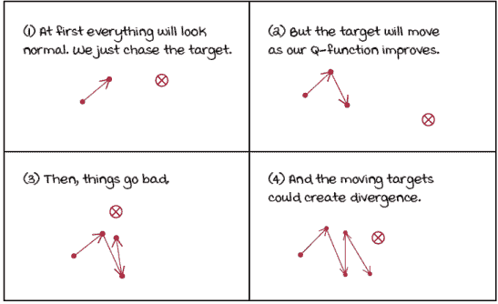

无目标网络 Q 函数优化

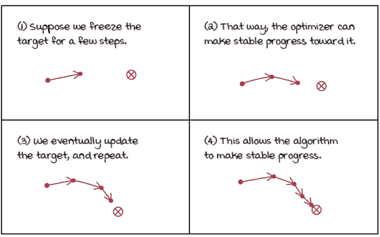

使用目标网络的 Q 函数逼近

通过使用目标网络来固定目标，我们通过人为地创建几个依次呈现给代理的小型监督学习问题来缓解“追逐自己的尾巴”的问题。我们的目标固定与我们的目标网络固定的时间一样长。这提高了我们收敛的机会，但不是到最优值，因为非线性函数逼近中不存在这样的东西，但通常收敛。但更重要的是，它大大减少了发散的机会，这在基于价值的深度强化学习方法中并不罕见。

|  | 展示数学目标网络梯度更新 |
| --- | --- |
|  | 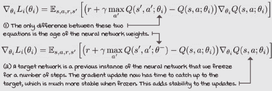 |

重要的是要注意，在实践中，我们并没有两个“网络”，而是有两个神经网络的权重实例。我们使用相同的模型架构，并频繁更新目标网络的权重以匹配在线网络的权重，这是我们在每一步上优化的网络。“频繁”在这里的含义取决于问题，不幸的是。通常，我们会冻结这些目标网络权重 10 到 10,000 步，这再次取决于问题。（那是时间步，不是回合。请小心。）如果你使用卷积神经网络，例如用于学习 Atari 游戏的网络，那么 10,000 步的频率是正常的。但对于更直接的问题，如小车-杆环境，10-20 步更为合适。

通过使用目标网络，我们防止训练过程陷入螺旋，因为我们正在固定多个时间步的目标，从而允许在线网络权重在更新改变优化问题之前，一致地向目标移动，然后设置一个新的目标。通过使用目标网络，我们稳定了训练，但同时也减慢了学习速度，因为你不再基于最新的值进行训练；目标网络的冻结权重可能一次滞后多达 10,000 步。平衡稳定性和速度并调整这个超参数是至关重要的。

|  | 我会说 Python 使用目标网络和在线网络在 DQN 中的应用 |
| --- | --- |
|  |

```
    def optimize_model(self, experiences):
        states, actions, rewards, \
            next_states, is_terminals = experiences
        batch_size = len(is_terminals)
        q_sp = self.target_model(next_states).detach() ①
        max_a_q_sp = q_sp.max(1)[0].unsqueeze(1) ②
        max_a_q_sp *= (1 - is_terminals)
        target_q_sa = rewards + self.gamma * max_a_q_sp       ③
        q_sa = self.online_model(states).gather(1, actions) ④
        td_error = q_sa - target_q_sa                         ⑤
        value_loss = td_error.pow(2).mul(0.5).mean()
        self.value_optimizer.zero_grad()
        value_loss.backward() ⑥
        self.value_optimizer.step()
    def interaction_step(self, state, env):
        action = self.training_strategy.select_action(
                                  self.online_model, state) ⑦
        new_state, reward, is_terminal, _ = env.step(action)
        <...>
        return new_state, is_terminal

    def update_network(self): ⑧
        for target, online in zip(
                          self.target_model.parameters(),
                        self.online_model.parameters()):
            target.data.copy_(online.data)
```

① 注意我们现在是如何查询目标网络来获取下一个状态的估计。② 我们获取这些值的最大值，并确保适当地处理终端状态。③ 最后，我们创建*TD*目标。④ 查询当前的“在线”估计。⑤ 使用这些值来创建误差。⑥ 计算损失，并优化在线网络。⑦ 注意我们是如何使用在线模型来选择动作的。⑧ 这就是目标网络（滞后网络）如何通过在线网络（最新网络）进行更新的。 |

### 使用更大的网络

另一种在一定程度上减轻非平稳性问题的方法，是使用更大的网络。具有更强大网络的微妙状态差异更有可能被检测到。更大的网络减少了状态-动作对的混叠；网络越强大，混叠越低；混叠越低，连续样本之间的相关性就越不明显。所有这些都可以使目标值和当前估计看起来更独立于彼此。

在这里，“别名”一词指的是两个状态可能看起来对神经网络来说是相同的（或者相当相似），但仍然可能需要不同的动作。当网络缺乏表示能力时，可能会发生状态别名。毕竟，神经网络试图找到相似之处以进行泛化；它们的任务是找到这些相似之处。但是，网络太小可能会导致泛化出错。网络可能会对简单、容易找到的模式产生固定。

使用目标网络的一个动机是它们允许你更容易地区分相关状态。使用一个更强大的网络也有助于你的网络学习细微的差异。

然而，一个更强大的神经网络需要更长的时间来训练。它不仅需要更多的数据（交互时间），还需要更多的计算（处理时间）。使用目标网络是减轻非平稳问题的更稳健的方法，但我希望你知道所有的技巧。了解你的代理（网络的规模、使用目标网络以及更新频率）的这两个属性如何相互作用并影响最终性能是很有利的。

|  | 简化目标 Ways to mitigate the fact that targets in reinforcement learning are non-stationary |
| --- | --- |

|  | 允许我重申，为了减轻非平稳性问题，我们可以

1.  创建一个目标网络，为我们提供一个暂时平稳的目标值。

1.  创建足够大的网络，以便它们可以“看到”相似状态之间的微小差异（如那些时间上相关联的）。

目标网络效果很好，并且已经被证明多次有效。技术“更大的网络”更像是一种模糊的解决方案，而不是每次都经过科学验证的解决方案。请随意实验本章的笔记本。你会发现改变值和测试假设很容易。 |

### 使用经验回放

在我们的 NFQ 实验中，我们使用一个包含 1,024 个样本的小批量，并以此进行 40 次迭代训练，交替进行计算新目标和优化网络。这 1,024 个样本在时间上是相关的，因为它们大多数属于同一条轨迹，而购物车-杆子实验中的最大步数是 500 步。改进这一点的办法之一是使用一种称为*经验回放*的技术。经验回放包括一种数据结构，通常被称为回放缓冲区或回放内存，它可以存储多个步骤的经验样本（远多于 1,024 步），从而允许从广泛的过去经验中采样小批量。拥有回放缓冲区让智能体获得两个关键的好处。首先，训练过程可以使用更多样化的小批量进行更新。其次，智能体不再需要在多次迭代中使模型适应相同的小批量。适当地采样足够大的回放缓冲区会产生一个缓慢移动的目标，因此智能体现在可以以较低的风险在每个时间步进行采样和训练。

| 0001 | 一点历史介绍经验回放 |
| --- | --- |
|  | 经验回放是由 Long-Ji Lin 在一份题为“基于强化学习、规划和教学的自我改进反应性智能体，”的论文中引入的，无论你信不信，这篇论文发表于*1992 年*！没错，1992 年！再次强调，那正是神经网络被称为“连接主义”的时候...悲伤的时代！在从 CMU 获得博士学位后，林博士在多家公司担任了多个技术角色。目前，他是 Signifyd 的首席科学家，领导着一个致力于预测和防止在线欺诈的系统团队。 |

使用经验回放有多个好处。通过随机采样，我们增加了我们的神经网络更新具有低方差的概率。当我们使用 NFQ 中的批量时，该批量中的大多数样本都是相关的和相似的。使用相似样本进行更新会将变化集中在函数的有限区域内，这可能会过度强调更新的幅度。另一方面，如果我们从大量的缓冲区中均匀随机采样，那么我们的网络更新更有可能分布得更均匀，因此更能代表真实的价值函数。

使用回放缓冲区也给人一种我们的数据是独立同分布的印象，这样优化方法就稳定了。由于从多个轨迹甚至策略中同时采样，样本看起来是独立且同分布的。

通过存储经验和稍后均匀采样，我们使进入优化方法的数据看起来是独立且同分布的。在实践中，回放缓冲区需要相当大的容量才能发挥最佳效果，从 10,000 到 1,000,000 个经验样本，具体取决于问题。一旦达到最大容量，在插入新经验之前，你需要移除最老的经验。

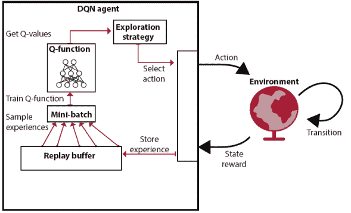

带有重放缓冲区的 DQN

不幸的是，当与高维观察结果一起工作时，实现变得有点具有挑战性，因为实现不佳的重放缓冲区在高维环境中很快就会达到硬件内存限制。例如，在基于图像的环境中，例如，每个状态表示是四个最新图像帧的堆栈，这在 Atari 游戏中很常见，你可能在个人电脑上没有足够的内存来天真地存储 1,000,000 个经验样本。对于小车-杆环境，这并不是一个大问题。首先，我们不需要 1,000,000 个样本，我们使用一个大小为 50,000 的缓冲区。但更重要的是，状态由四个元素的向量表示，因此并没有太多的实现性能挑战。

|  | 展示数学重放缓冲区梯度更新 |
| --- | --- |
|  | 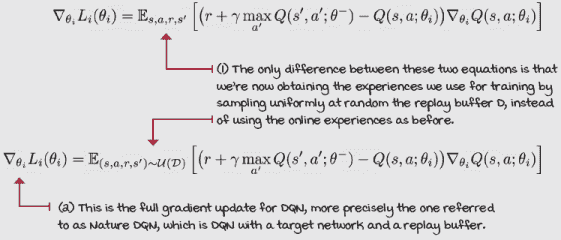 |

尽管如此，通过使用重放缓冲区，你的数据看起来比现实中更符合独立同分布（IID），而目标更稳定。通过从均匀采样的迷你批次中进行训练，你使得在线收集的强化学习经验看起来更像是一个具有独立同分布数据和固定目标的传统监督学习数据集。当然，随着你添加新的样本和丢弃旧的样本，数据仍在变化，但这些变化发生得较慢，因此神经网络和优化器几乎注意不到。

|  | 简化经验重放使数据看起来符合独立同分布，目标相对稳定 |
| --- | --- |
|  | 解决数据不是独立同分布问题的最佳方案被称为*经验重放*。这项技术很简单，并且已经存在了几十年：当你的智能体在线收集经验元组 *e*[t]*=(S*[*t*]*,A*[*t*]*,R*[*t*+1]*,S*[*t*+1]) 时，我们将它们插入到一个数据结构中，通常称为*重放缓冲区* *d*，使得 *d={e*[1]*, e*[2] *, ... , e*[*M*]*}*. *m*，重放缓冲区的大小，通常在 10,000 到 1,000,000 之间，这取决于问题。然后我们通过从缓冲区中采样的迷你批次来训练智能体，通常随机均匀地采样，使得每个样本被选中的概率相等。尽管如此，正如你将在下一章中学到的，你可能会以另一种分布进行采样。但请注意，这并不那么简单。我们将在下一章中讨论细节。 |
|  | 我会说 Python 一个简单的重放缓冲区 |
|  |

```
class ReplayBuffer():
    def __init__(self,
               m_size=50000,                                  ①
                 batch_size=64):
       self.ss_mem = np.empty(shape=(m_size), dtype=np.ndarray)
       self.as_mem = np.empty(shape=(m_size), dtype=np.ndarray) 
        <...>                                                 ②
        self.m_size, self.batch_size = m_size, batch_size     ③
        self._idx, self.size = 0, 0

    def store(self, sample):
        s, a, r, p, d = sample                                ④
        self.ss_mem[self._idx] = s
        self.as_mem[self._idx] = a
        <...> ⑤
        self._idx += 1 ⑥
        self._idx = self._idx % self.m_size
        self.size += 1 ⑦
        self.size = min(self.size, self.m_size)
    def sample(self, batch_size=None):
        if batch_size == None: ⑧
            batch_size = self.batch_size
        idxs = np.random.choice(
            self.size, batch_size, replace=False) ⑨
        experiences = np.vstack(self.ss_mem[idxs]), \         ⑩
                      np.vstack(self.as_mem[idxs]), \
                      np.vstack(self.rs_mem[idxs]), \
                      np.vstack(self.ps_mem[idxs]), \
                      np.vstack(self.ds_mem[idxs])
        return experiences                                    ⑪
    def __len__(self): ⑫
        return self.size
```

① 这是一个简单的重放缓冲区，默认最大大小为 50,000，默认批处理大小为 64 个样本。② 我们初始化五个数组来存储状态、动作、奖励、下一个状态和完成标志。为了简洁起见，省略了部分内容。③ 我们初始化几个变量来进行存储和采样。④ 当我们存储一个新的样本时，我们首先展开样本变量，然后设置每个数组的元素为其相应的值。⑤ 再次省略了部分内容⑥ _idx 指向下一个要修改的索引，因此我们增加它，并确保在达到最大大小时（缓冲区的末尾）循环回 0。⑦ 每存储一个新的样本，大小也会增加，但不会循环回 0；它停止增长。⑧ 在 sample 函数中，我们首先确定批处理大小。如果没有传递其他内容，我们使用默认的 64。⑨ 从 0 到大小中采样 batch_size 个 id。⑩ 然后，使用采样 id 从缓冲区中提取经验。⑪ 并返回这些经验。⑫ 这是一个方便的函数，当调用 len(buffer)时，返回缓冲区的正确大小。 |

### 使用其他探索策略

探索是强化学习的一个关键组成部分。在 NFQ 算法中，我们使用 epsilon-greedy 探索策略，该策略包括以 epsilon 概率随机行动。我们从(0, 1)的均匀分布中抽取一个数字。如果这个数字小于超参数常量，称为 epsilon，你的智能体将以均匀随机的方式选择一个动作（包括贪婪动作）；否则，它将贪婪地行动。

对于 DQN 实验，我在第九章的笔记本中添加了一些在第四章中介绍的其他探索策略。我将它们调整为与神经网络一起使用，并在下面重新介绍。请确保查看所有笔记本并进行实验。

|  | 我会说 Python 线性衰减的 epsilon-greedy 探索策略 |
| --- | --- |
|  |

```
class EGreedyLinearStrategy(): ①
    <...>
   def _epsilon_update(self):
      self.epsilon = 1 - self.t / self.max_steps
      self.epsilon = (self.init_epsilon - self.min_epsilon) * \
                                self.epsilon + self.min_epsilon
        self.epsilon = np.clip(self.epsilon,                  ②
                               self.min_epsilon,
                             self.init_epsilon)
        self.t += 1 ③
        return self.epsilon
    def select_action(self, model, state): ④
        self.exploratory_action = False
        with torch.no_grad():
            q_values = model(state).cpu().detach() ⑤
            q_values = q_values.data.numpy().squeeze()
        if np.random.rand() > self.epsilon: ⑥
            action = np.argmax(q_values)
        else:                                                 ⑦
            action = np.random.randint(len(q_values))
        self._epsilon_update()
        self.exploratory_action = action != np.argmax(q_values)
        return action                                         ⑧
```

① 在线性衰减的 epsilon-greedy 策略中，我们从一个较高的 epsilon 值开始，并以线性方式衰减其值。② 我们将 epsilon 裁剪到初始值和最小值之间。③ 这是一个变量，用于存储 epsilon 更新的次数。④ 在 select_action 方法中，我们使用一个模型和一个状态。⑤ 为了记录日志，我总是提取 q_values。⑥ 我们从均匀分布中抽取一个随机数，并将其与 epsilon 进行比较。⑦ 如果更高，我们使用 q_values 的 argmax；否则，执行随机动作。⑧ 最后，我们更新 epsilon，设置一个用于记录的变量，并返回所选动作。 |

|  | 我会说 Python 指数衰减的 epsilon-greedy 探索策略 |
| --- | --- |
|  |

```
class EGreedyExpStrategy():
    <...>
    def _epsilon_update(self):
        self.epsilon = max(self.min_epsilon,                  ①
                           self.decay_rate * self.epsilon)
        return self.epsilon
    # def _epsilon_update(self): ②
    #     self.decay_rate = 0.0001
    #     epsilon = self.init_epsilon * np.exp( \
    #                                -self.decay_rate * self.t)
    #     epsilon = max(epsilon, self.min_epsilon)
    #     self.t += 1
    #     return epsilon
    def select_action(self, model, state): ③
        self.exploratory_action = False
        with torch.no_grad():
            q_values = model(state).cpu().detach()
            q_values = q_values.data.numpy().squeeze()
        if np.random.rand() > self.epsilon:
            action = np.argmax(q_values)
        else:
            action = np.random.randint(len(q_values))
        self._epsilon_update()
        self.exploratory_action = action != np.argmax(q_values)
        return action                                         ④
```

① 在指数衰减策略中，唯一的不同是现在 ε 正在以指数曲线衰减。② 这又是另一种指数衰减 ε 的方法，这种方法使用指数函数。ε 值将非常相似，但衰减率将需要不同的尺度。③ 这个 select_action 函数与之前的策略完全相同。我想强调的是，我之所以每次都查询 q_values，只是因为我正在收集信息向您展示。但如果你关心性能，这并不是一个好主意。一个更快的实现只会在网络确定需要贪婪动作时才查询网络。④ exploratory_action 是一个变量，用于计算每集探索动作的百分比。仅用于记录信息。 |

|  | 我会说 PythonSoftmax 探索策略 |
| --- | --- |
|  |

```
class SoftMaxStrategy():
    <...>
    def _update_temp(self):
      temp = 1 - self.t / (self.max_steps * self.explore_ratio) ①
      temp = (self.init_temp - self.min_temp) * \
                                           temp + self.min_temp
        temp = np.clip(temp, self.min_temp, self.init_temp) ②
        self.t += 1
        return temp
    def select_action(self, model, state):
        self.exploratory_action = False
        temp = self._update_temp()
        with torch.no_grad():
            q_values = model(state).cpu().detach() ③
            q_values = q_values.data.numpy().squeeze()
            scaled_qs = q_values/temp                           ④
            norm_qs = scaled_qs - scaled_qs.max()               ⑤
            e = np.exp(norm_qs) ⑥
            probs = e / np.sum(e) ⑦
            assert np.isclose(probs.sum(), 1.0)
        action = np.random.choice(np.arange(len(probs)),        ⑧
                                  size=1, p=probs)[0]
        self.exploratory_action = action != np.argmax(q_values) ⑨
        return action
```

① 在 softmax 策略中，我们使用一个温度参数，越接近 0，值的差异将越明显，从而使动作选择更加贪婪。温度线性衰减。② 在这里，在温度线性衰减后，我们将其值剪辑到可接受的范围内。③ 注意，在 softmax 策略中，我们实际上没有避免从模型中提取 q_values 的机会。毕竟，动作直接取决于值。④ 提取值后，我们希望强调它们的差异（除非 temp 等于 1）。⑤ 我们将它们归一化以避免 exp 操作溢出。⑥ 计算指数。⑦ 转换为概率。⑧ 最后，我们使用概率来选择动作。注意我们如何将 probs 变量传递给 p 函数参数。⑨ 如前所述：动作是贪婪的还是探索性的？ |

|  | 它在于细节探索策略对性能有显著影响 |
| --- | --- |
|  | 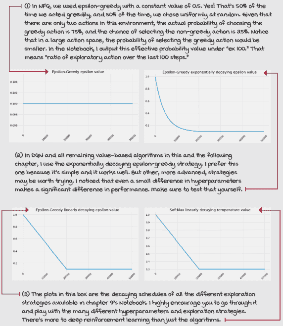 |
|  | 它在于细节完整的深度 Q 网络（DQN）算法 |

|  | 我们的 DQN 实现具有与我们的 NFQ 相似的功能和设置：

+   近似动作值函数 *Q*(*s,a; θ*)。

+   使用状态-值输出架构（节点：4, 512, 128, 2）。

+   优化动作值函数以逼近最优动作值函数 ***(*s,a*)。

+   使用离策略 *TD* 目标 (*r + gamma*max_a’Q*(*s’，a’; θ*)) 来评估策略。

+   使用均方误差（MSE）作为我们的损失函数。

+   使用学习率为 0.0005 的 RMSprop 作为我们的优化器。

一些不同之处在于，在 DQN 实现中我们现在

+   使用指数衰减的 ε-greedy 策略来改进策略，大约在 20,000 步内从 1.0 衰减到 0.3。

+   使用具有 320 个最小样本、50,000 个最大样本和 64 个小批次的回放缓冲区。

+   使用每 15 步更新一次的目标网络。

DQN 有三个主要步骤：

1.  收集经验：(*S*[t] *, A*[t] *, R*[*t*+1]*, S*[*t*+1]*, D*[*t*+1]), 并将其插入回放缓冲区。

1.  从缓冲区中随机抽取一个迷你批次，并计算整个批次的离线 TD 目标：*r + gamma*max_a’Q*(*s’，a’; θ*)。

1.  使用均方误差（MSE）和 RMSprop 对动作值函数 *Q*(*s,a; θ*) 进行拟合。

|

| 0001 | 一点历史介绍 DQN 算法 |
| --- | --- |
|  | DQN 是由 Volodymyr “Vlad” Mnih 在 2013 年发表的一篇名为“Playing Atari with Deep Reinforcement Learning.”的论文中引入的。这篇论文介绍了带有经验回放的 DQN。2015 年，又有一篇论文发表，名为“Human-level control through deep reinforcement learning.”这篇第二篇论文介绍了带有目标网络的 DQN；这就是您刚刚学到的完整 DQN 版本。Vlad 在 Geoffrey Hinton（深度学习之父之一）的指导下获得了博士学位，并在 Google DeepMind 担任研究科学家。他因 DQN 的贡献而受到认可，并被列入 2017 年麻省理工学院技术评论 35 岁以下 35 位创新者名单。 |
|  | 总结 DQN 通过了小车-杆环境 |
|  | 结果中最引人注目的是，NFQ 需要比 DQN 更多的样本来解决环境；DQN 更有效率。然而，它们花费的时间大约相同，包括训练（计算）和实际时间！[](../Images/09_03_Sidebar16.png) |

## 双重 DQN：缓解动作值函数的过度估计

在本节中，我们介绍 DQN 在多年间提出的主要改进之一，称为**双深度 Q 网络**（double DQN，或 DDQN）。这种改进包括向我们的 DQN 代理添加双重学习。它易于实现，并且产生的代理性能比 DQN 更稳定。所需的变化与用于开发双重 Q 学习的 Q 学习应用的变化类似；然而，有几个差异我们需要讨论。

### 过度估计的问题，有两个

如您可能从第六章中记得，Q 学习往往会高估动作值函数。我们的 DQN 代理也不例外；毕竟，我们使用的是相同的离线策略 TD 目标，带有那个最大操作符。问题的核心很简单：我们在估计值中取最大值。估计值通常偏离中心，有些高于真实值，有些低于真实值，但关键是它们是偏离的。问题是我们总是取这些值的最大值，所以我们偏好更高的值，即使它们并不正确。我们的算法显示出正偏差，性能受到影响。

|  | 米格尔的类比关于过度乐观的代理和人们的问题 |
| --- | --- |
|  | 我曾经喜欢超级积极的人，直到我了解到双 DQN。不，说真的，想象一下你遇到一个非常乐观的人；让我们称她为 DQN。DQN 非常乐观。她经历了生活中许多事情，从最艰难的失败到最高的成功。然而，DQN 的问题是她期望她所做的一切都能得到最甜美的结果，无论她实际上做了什么。这是问题吗？有一天，DQN 去了当地的一家赌场。这是第一次，但幸运的 DQN 在老虎机上赢得了大奖。尽管她如此乐观，DQN 立即调整了她的价值函数。她心想，“去赌场是非常有回报的（*Q*(*s, a*)的值应该很高），因为在赌场你可以去老虎机（下一个状态 *s’*），通过玩老虎机，你可以得到大奖 [*Q*(*s’， a’*)]”。但是，这种想法存在多个问题。首先，DQN 并不每次去赌场都玩老虎机。她也喜欢尝试新事物（她进行探索），有时她尝试轮盘赌、扑克或 21 点（尝试不同的行动）。有时老虎机区域正在维护，无法访问（环境将她转移到其他地方）。此外，大多数时候当 DQN 玩老虎机时，她并没有赢得大奖（环境是随机的）。毕竟，老虎机被称为强盗，不是那些强盗，而是其他——不必在意。 |

### 分离动作选择和动作评估

要更好地理解正偏差以及在使用函数近似时如何解决它，一种方法是在目标计算中展开 *max* 操作符。Q 函数的 *max* 与 *argmax* 行动的 Q 函数相同。

|  | 刷新我的记忆再次什么是 argmax？ |
| --- | --- |
|  | argmax 函数定义为最大值的参数。argmax 动作值函数，argmax Q 函数，*argmax*[*a*]*Q*(*s, a*)是在给定状态 s 下具有最大值的动作的索引。例如，如果你有一个*Q*(*s*)，对于动作 0*–*3，其值分别为[–1, 0, –4, –9]，则*max*[*a*]*Q*(*s, a*)是 1，这是最大值的索引。 |

让我们用 max 和 argmax 来解开前面的句子。注意，当我们从 Q 学习到双 Q 学习时，我们几乎做了同样的改变，但鉴于我们使用函数近似，我们需要谨慎。起初，这种展开可能看起来像是一个愚蠢的步骤，但它帮助我理解如何减轻这个问题。

|  | 展示数学公式展开 argmax |
| --- | --- |
|  | 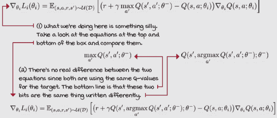 |
|  | 我会说 Python 在 DQN 中展开 max |
|  |

```
    q_sp = self.target_model(next_states).detach() ①②③
    max_a_q_sp = q_sp.max(1)[0].unsqueeze(1) ①③
    max_a_q_sp *= (1 - is_terminals) ①④
    target_q_sa = rewards + self.gamma * max_a_q_sp         ①④
    argmax_a_q_sp = self.target_model(next_states).max(1)[1]⑤⑥
    q_sp = self.target_model(next_states).detach() ⑤⑦
    max_a_q_sp = q_sp[np.arange(batch_size), argmax_a_q_sp] ⑤⑧
    max_a_q_sp = max_a_q_sp.unsqueeze(1) ⑤⑨
    max_a_q_sp *= (1 - is_terminals) ⑤⑨
    target_q_sa = rewards + self.gamma * max_a_q_sp         ⑤
```

① 这就是原始的 DQN 计算目标值的方法。② 重要的是我们要断开目标，这样我们就不通过它进行反向传播。③ 我们获取下一个状态的 Q 值并取其最大值。④ 将终端状态的值设为 0，并计算目标值。⑤ 这是一种等效的计算目标值的方法，“解开最大值。”⑥ 首先，获取下一个状态的 argmax 动作。⑦ 然后，像之前一样获取下一个状态的 Q 值。⑧ 现在，我们使用索引来获取下一个状态的最大值。⑨ 然后继续之前的步骤。 |

我们在这里所说的就是取 *max* 就像问网络，“在状态中价值最高的动作的值是多少？”

但，我们实际上用一个问题问了两个问题。首先，我们进行了一个 *argmax*，这相当于问，“在状态 *s* 中哪个动作是价值最高的动作？”

然后，我们使用该动作来获取其值，相当于问，“在状态 *s* 中这个动作（碰巧是价值最高的动作）的值是多少？”

问题是，我们向同一个 Q 函数问了两个问题，这导致两个答案都显示出相同方向的偏差。换句话说，函数近似器会回答，“我认为在状态 *s* 中这个动作是价值最高的，这是它的值。”

### 一个解决方案

减少正偏差的一种方法是在第六章中我们做的那样，有两个动作值函数的实例。

如果你还有其他来源的估计值，你可以向一个提问一个问题，向另一个提问另一个问题。这有点像投票，或者像“我切，你先选”的程序，或者像在健康问题上寻求第二位医生的意见。

在双重学习中，一个估计器选择它认为价值最高的动作的索引，而另一个估计器给出这个动作的值。

|  | 双重学习过程 |
| --- | --- |

|  | 我们在第六章中介绍了使用表格强化学习进行此过程，在双重 Q-learning 代理下进行。过程是这样的：

+   你创建两个动作值函数，*Q*[A] 和 *Q*[B]。

+   你掷硬币来决定更新哪个动作值函数。例如，正面更新 *Q*[A]，反面更新 *Q*[B]。

+   如果你掷出正面并因此更新 *Q*[A]：你从 *Q*[B] 中选择要评估的动作索引，并使用 *Q*[A] 预测的估计值来评估它。然后，你像往常一样更新 *Q*[A]，而 *Q*[B] 保持不变。

+   如果你掷出反面并因此更新 *Q*[B]，你反过来操作：从 *Q*[A] 获取索引，从 *Q*[B] 获取值估计。*Q*[B] 被更新，而 *Q*[A] 保持不变。

|

然而，当使用函数近似（对于 DQN）时，如果完全按照描述实现这种双重学习过程，将会产生不必要的开销。如果我们这样做，最终会有四个网络：两个用于训练的网络（*Q*[A]，*Q*[B]）和两个目标网络，每个在线网络一个。

此外，它还会减慢训练过程，因为我们一次只会训练这些网络中的一个。因此，每一步只会提高一个网络。这无疑是浪费。

尽管有额外的开销，但使用函数逼近器进行双重学习程序可能仍然比完全不进行更好。幸运的是，我们对原始的双重学习程序进行了简单的修改，使其适应 DQN，并在没有额外开销的情况下提供了实质性的改进。

### 一个更实际的解决方案

而不是增加这种损害训练速度的开销，我们可以使用我们已有的另一个网络进行双重学习，即目标网络。然而，我们不是同时训练在线和目标网络，而是继续只训练在线网络，但使用目标网络帮助我们，从某种意义上说，交叉验证估计。

我们需要谨慎选择用于动作选择和动作评估的网络。最初，我们添加目标网络以通过避免追逐移动目标来稳定训练。为了继续这一路径，我们想要确保我们使用正在训练的网络，即在线网络，来回答第一个问题。换句话说，我们使用在线网络来找到最佳动作的索引。然后，我们使用目标网络来回答第二个问题，即评估之前选定的动作。

这是在实践中效果最好的排序方式，它之所以有效是有道理的。通过使用目标网络进行价值估计，我们确保目标值在需要时被冻结以保证稳定性。如果我们反过来实施，值将来自在线网络，该网络在每一步都会更新，因此会持续变化。

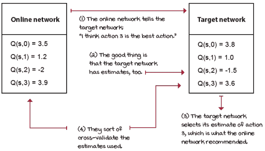

选择动作，评估动作

| 0001 | 一点历史介绍双重 DQN 算法 |
| --- | --- |
|  | 双重 DQN 是在 2015 年由 Hado van Hasselt 提出的，紧随 2015 版 DQN 的发布之后。（2015 版的 DQN 有时被称为 Nature DQN——因为它发表在 Nature 科学期刊上，有时也称为 Vanilla DQN——因为它是在多年来的许多改进中的第一个。）在 2010 年，Hado 还撰写了双重 Q 学习算法（表格情况下的双重学习），作为 Q 学习算法的改进。这是你在第六章中学到并实现的内容。双重 DQN，也称为 DDQN，是多年来为 DQN 提出的许多改进中的第一个。在 2015 年首次提出时，DDQN 在 Atari 领域获得了当时最先进的（最好的）结果。Hado 在荷兰乌得勒支大学获得了人工智能（强化学习）博士学位。在作为博士后研究员的几年后，他在谷歌 DeepMind 担任研究科学家。 |
|  | 给我看数学 DDQN 梯度更新 |
|  | 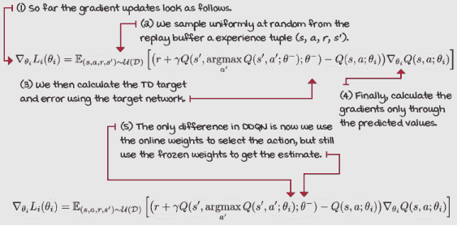 |
|  | 我会说 PythonDouble DQN |
|  |

```
  def optimize_model(self, experiences):
      states, actions, rewards, \
          next_states, is_terminals = experiences
      batch_size = len(is_terminals)
      #argmax_a_q_sp = self.target_model(next_states).max(1)[1]
      argmax_a_q_sp = self.online_model(next_states).max(1)[1] ①
      q_sp = self.target_model(next_states).detach() ②
      max_a_q_sp = q_sp[np.arange(batch_size), argmax_a_q_sp] ③
      max_a_q_sp = max_a_q_sp.unsqueeze(1)
      max_a_q_sp *= (1 - is_terminals)
      target_q_sa = rewards + (self.gamma * max_a_q_sp) ④
      q_sa = self.online_model(states).gather(1, actions) ⑤
      td_error = q_sa - target_q_sa
      value_loss = td_error.pow(2).mul(0.5).mean()
      self.value_optimizer.zero_grad() ⑥
      value_loss.backward()
      self.value_optimizer.step()
  def interaction_step(self, state, env):
      action = self.training_strategy.select_action(
                                self.online_model, state) ⑦
      new_state, reward, is_terminal, _ = env.step(action)
      return new_state, is_terminal
  def update_network(self): ⑧
      for target, online in zip(
                        self.target_model.parameters(),
                      self.online_model.parameters()):
          target.data.copy_(online.data)
```

① 在 Double DQN 中，我们使用在线网络获取下一个状态中最高价值动作的索引，即 argmax。注意我们并没有分离 argmax，因为它们不可微分。max(1)[1]返回了最大值的索引，这已经是“分离”的。② 然后，根据目标网络提取下一个状态的 Q 值。③ 我们然后使用在线网络提供的动作索引来索引目标网络提供的 Q 值。④ 然后像往常一样设置目标。⑤ 获取当前估计。注意这是梯度流动的地方。⑥ 计算损失，并更新优化器。⑦ 这里我们继续使用在线网络进行动作选择。⑧ 更新目标网络的方式仍然和以前一样。|

### 更宽容的损失函数

在上一章中，我们选择了 L2 损失，也称为*均方误差*（MSE），作为我们的损失函数，主要是因为其广泛的应用和简单性。实际上，在像购物车-杆环境这样的问题中，可能没有很好的理由再进一步探索。然而，因为我不仅教你“如何锤钉”，还教你算法的细节，所以我希望让你了解可用的不同旋钮，这样你就可以在解决更具挑战性的问题时进行尝试。

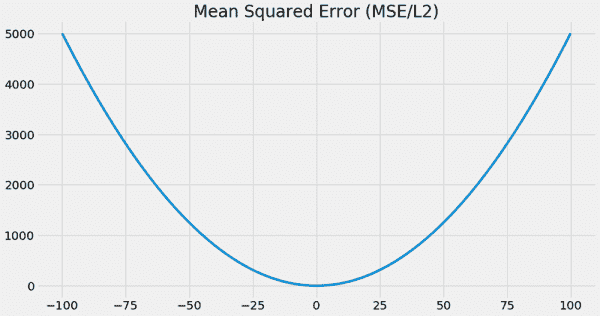

MSE 是一个无处不在的损失函数，因为它简单、合理且效果良好。但是，使用 MSE 进行强化学习的一个问题是，它对大错误的惩罚比对小错误的惩罚更重。在执行监督学习时这是有意义的，因为我们的目标是从一开始就是真实值，并且在整个训练过程中保持固定。这意味着我们确信，如果模型非常错误，那么它应该比只是错误时受到更重的惩罚。

但正如已经多次提到的，在强化学习中，我们没有这些真实值，我们用来训练网络的值依赖于智能体本身。这是一个思维转变。此外，目标不断变化；即使在使用目标网络时，它们也经常变化。在强化学习中，我们期望并欢迎犯错误。最终，如果你仔细想想，我们并不是“训练”智能体；我们的智能体是自行学习的。想想看。

一个不那么严厉的损失函数，并且对异常值更鲁棒的函数是**平均绝对误差**，也称为 MAE 或 L1 损失。MAE 被定义为预测值和真实值之间平均绝对差，即预测的动作值函数和**TD**目标。鉴于 MAE 是一个线性函数，而不是像 MSE 那样的二次函数，我们可以预期 MAE 在处理大误差和小误差方面会更为成功。这在我们的情况下很有用，因为我们预计动作值函数在训练过程中某些时刻会给出错误值，尤其是在开始时。对异常值有更强的抵抗力通常意味着误差对我们的网络变化的影响较小，与 MSE 相比，这意味着更稳定的学习。

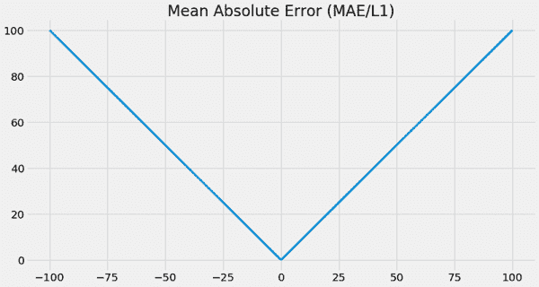

现在，从另一方面来看，MSE 的一个有助于 MAE 的特性是，随着损失趋近于零，其梯度会减小。这个特性对优化方法很有帮助，因为它使得达到最优值变得更容易：较小的梯度意味着网络的小幅变化。但幸运的是，有一个损失函数是 MSE 和 MAE 的某种混合体，称为 Huber 损失。

**Huber 损失**具有与 MSE 相同的有用特性，即对接近零的误差进行二次惩罚，但它并不是对所有巨大误差都进行二次惩罚。相反，Huber 损失在接近零的误差处是二次（曲线）的，而对于大于预设阈值的误差，它变为线性（直线）。两者兼而有之使得 Huber 损失对异常值具有鲁棒性，就像 MAE 一样，并且在 0 处可微分，就像 MSE 一样。

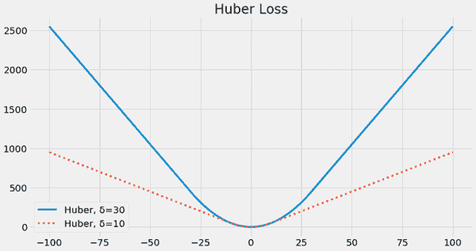

Huber 损失使用一个超参数**δ**来设置损失从二次变为线性的阈值，基本上是从 MSE 变为 MAE。如果**δ**为零，你将得到精确的 MAE，如果**δ**是无穷大，那么你将得到精确的 MSE。**δ**的一个典型值是 1，但请注意，你的损失函数、优化和学习率以复杂的方式相互作用。如果你改变其中一个，你可能需要调整其他几个。查看本章的笔记本，这样你可以进行一些实验。


有趣的是，至少有两种不同的实现 Huber 损失函数的方法。你可以按照定义计算 Huber 损失，或者计算 MSE 损失，然后将所有大于阈值的梯度设置为固定幅度值。你剪裁了梯度的幅度。前者取决于你使用的深度学习框架，但问题是某些框架不提供对**δ**超参数的访问，所以你只能将**δ**设置为 1，这并不总是有效，也不是总是最好的。后者通常被称为**损失剪裁**，或者更好的是**梯度剪裁**，它更灵活，因此我在笔记本中实现了这种方法。

|  | 我会说 Python 双 DQN 与 Huber 损失 |
| --- | --- |
| |

```
    def optimize_model(self, experiences):
        states, actions, rewards, \
            next_states, is_terminals = experiences
        batch_size = len(is_terminals)
        <...> ①
        td_error = q_sa - target_q_sa
        value_loss = td_error.pow(2).mul(0.5).mean() ②
        self.value_optimizer.zero_grad() ③
        value_loss.backward()
        torch.nn.utils.clip_grad_norm_(                ④
 self.online_model.parameters(), 
                         self.max_gradient_norm)
        self.value_optimizer.step() ⑤
```

① 首先，你计算目标值并像之前一样使用双重学习得到当前值。② 然后，像之前一样计算损失函数，即均方误差。③ 将优化器归零并在反向步骤中计算梯度。④ 现在，将梯度裁剪到 max_gradient_norm。这个值可以是任何值，但要知道这个值与其他超参数，如学习率相互作用。⑤ 最后，移动优化器。|

知道有一种叫做*奖励裁剪*的东西，这与*梯度裁剪*不同。这两者是非常不同的，所以要注意。一个作用于奖励，另一个作用于误差（损失）。现在，最重要的是不要将这两者与*Q 值裁剪*混淆，这无疑是一个错误。

记住，在我们的案例中，目标是防止梯度变得过大。为此，我们可以在给定的绝对*TD*误差阈值之外使损失线性化，或者使梯度在最大梯度幅度阈值之外保持恒定。

在笔记本中你找到的 cart-pole 环境实验中，我通过梯度裁剪技术实现了 Huber 损失函数。也就是说，我首先计算均方误差（MSE），然后裁剪梯度。然而，正如我之前提到的，我将最大梯度值的超参数设置为了无穷大。因此，实际上是在使用传统的 MSE。但是，请务必进行实验，玩耍，探索！我创建的笔记本应该能帮助你学到与书籍几乎一样多的知识。在那里，让自己自由发挥吧。

|  | 这就是细节全双深度 Q 网络（DDQN）算法 |
| --- | --- |

|  | DDQN 几乎与 DQN 相同，但仍有几个区别：

+   近似动作值函数 *Q*(*s, a; θ*)。

+   使用状态-值输出架构（节点：4, 512, 128, 2）。

+   优化动作值函数以近似最优动作值函数 *q**(*s,a*)。

+   使用离线 TD 目标（*r + gamma*max_a’Q*(*s’，a’; θ*)）来评估策略。

注意，我们现在

+   使用可调整的 Huber 损失，由于我们将 max_gradient_norm 变量设置为“float(‘inf’),”因此我们实际上在损失函数中使用的是均方误差（MSE）。

+   使用学习率为 0.0007 的 RMSprop 作为我们的优化器。请注意，在我们之前使用的是 0.0005，因为没有双重学习（vanilla DQN），如果使用学习率为 0.0007 进行训练，则几个种子会失败。也许是因为稳定性？另一方面，在 DDQN 中，使用更高的学习率效果最好。

在 DDQN 中我们仍然使用

+   一种指数衰减的 epsilon-greedy 策略（从 1.0 到 0.3 大约需要 20,000 步）来改进策略。

+   一个具有 320 个最小样本、50,000 个最大样本和 64 个批次的重放缓冲区。

+   目标网络冻结 15 步后完全更新。

DDQN 与 DQN 类似，具有相同的三个主要步骤：

1.  收集经验：(*S*[*t*]*, A*[*t*]*, R*[*t*+1]*, S*[*t*+1]*, D*[*t*+1])，并将其插入到重放缓冲区中。

1.  从缓冲区中随机抽取一个迷你批次，并计算整个批次的离策略*TD*目标：*r + gamma*max_a’Q*(*s’，a’; θ*)。

1.  使用均方误差（MSE）和 RMSprop 来拟合动作值函数*Q(s, a; θ)*。

底线是，DDQN 的实现和超参数与 DQN 相同，只是我们现在使用双重学习，因此以略高的学习率进行训练。添加 Huber 损失并没有改变什么，因为我们“剪辑”梯度到无限大的最大值，这相当于使用 MSE。然而，对于许多其他环境，你会发现它很有用，所以调整这个超参数。|

|  | 累计它 DDQN 比 NFQ 或 DQN 更稳定 |
| --- | --- |
|  | 在小车-杆环境中，DQN 和 DDQN 有相似的性能。然而，这是一个具有平滑奖励函数的简单环境。在现实中，DDQN 应该总是给出更好的性能！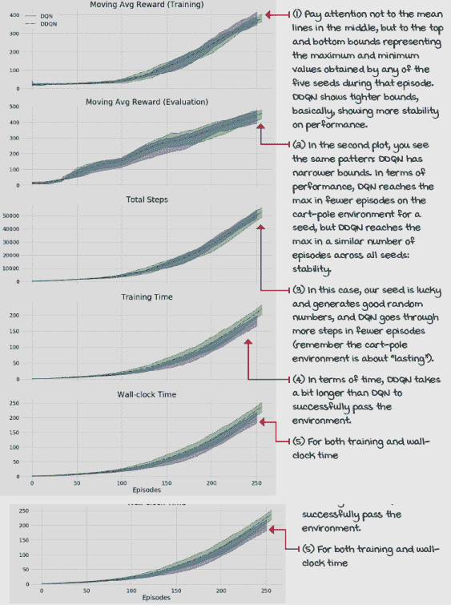 |

### 我们还可以改进的地方

当然，我们的当前基于价值的深度强化学习方法并不完美，但它相当稳固。DDQN 在许多 Atari 游戏中可以达到超人类的表现。为了复制这些结果，你必须将网络改为接受图像作为输入（四个图像的堆叠，以便能够从图像中推断出方向和速度等），当然，还需要调整超参数。

然而，我们还可以更进一步。至少还有其他几个易于实现且对性能有积极影响的改进可以考虑。

第一个改进要求我们重新考虑当前的神经网络架构。到目前为止，我们在神经网络架构中对 Q 函数有一个天真表示。

|  | 刷新我的记忆当前神经网络架构 |
| --- | --- |
|  | 我们实际上是在“让强化学习看起来像监督学习。”但，我们可以，也应该打破这种限制，跳出思维定式！值-状态输出架构有没有更好的方法来表示 Q 函数？当你看到下一页的图像时，请思考一下这个问题。 |

右边的图像是条形图，表示小车-杆环境中状态接近垂直时的估计动作值函数 Q、状态值函数 V 和动作优势函数 A。

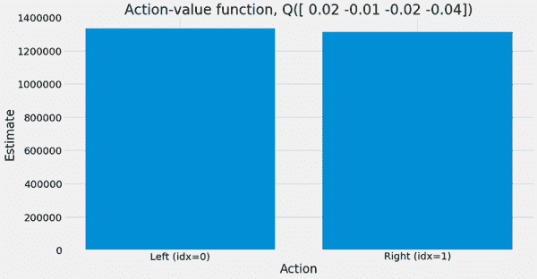

注意不同的函数和值，并开始思考如何更好地设计神经网络架构，以便更有效地使用数据。作为一个提示，让我提醒你，状态 Q 值通过 V 函数相关联。也就是说，动作值函数*Q*与状态值函数 V 有本质的联系，因为*Q*(*s*)中的动作都由相同的状态*s*索引（在右边的例子中*s*=[0.02, –0.01, –0.02, –0.04]）。

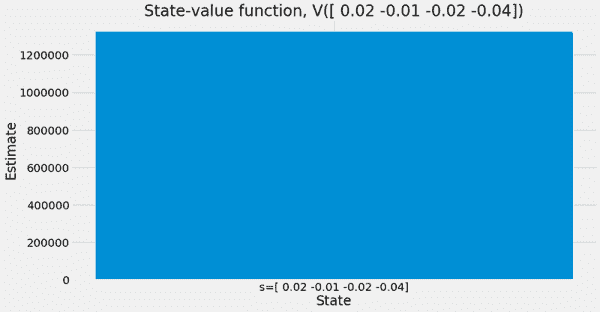

问题是，如果你使用的是 *Q*(*s*, 1) 样本，你能否了解关于 *Q*(*s*, 0) 的任何信息？看看展示动作-优势函数 *A*(*s*) 的图表，注意相对于使用动作值函数 *Q*(*s*) 的图表，你如何更容易地通过直观判断来选择贪婪动作。你能做些什么呢？在下一章中，我们将探讨一种名为 *dueling network* 的网络架构，它有助于我们利用这些关系。

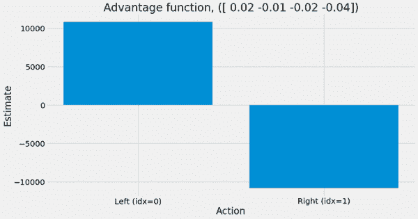

另一个需要考虑改进的是我们从重放缓冲区中采样经验的方式。到目前为止，我们是从缓冲区中随机均匀地抽取样本，我相信你的直觉会质疑这种方法，并建议我们可以做得更好，我们确实可以。

人类不会在世界各地随意记住随机的事情以随机的时间学习。智能代理“重放记忆”的方式更为系统。我相当确信我的狗在梦中追逐兔子。某些经历对我们实现目标来说比其他经历更重要。人类经常重放那些给他们带来意外喜悦或痛苦的经历。这是有道理的，你需要从这些经历中学习，以产生更多或更少的这些经历。在下一章中，我们将探讨优先采样经验的方法，以从每个样本中获得最大收益，当我们了解优先经验重放（PER）方法时。

## 摘要

在本章中，你了解了基于价值的深度强化学习方法中普遍存在的问题。在线数据非平稳性，以及它也不是大多数优化方法所期望的独立同分布，为基于价值的方法带来了大量问题。

你通过使用在多个基准测试中具有实证结果的多种技术来稳定基于价值的深度强化学习方法，并深入研究了使基于价值方法更稳定的这些组件。具体来说，你了解了在名为 DQN 的算法中使用目标网络和重放缓冲区的优势（自然 DQN 或纯 DQN）。你了解到，通过使用目标网络，我们使目标对优化器看起来是平稳的，这对稳定性有利，尽管这牺牲了收敛速度。你还了解到，通过使用重放缓冲区，在线数据看起来更像是独立同分布的，正如你所了解的，这是基于价值的自举方法中重大问题的来源。这两种技术的结合使算法足够稳定，能够在多个深度强化学习任务中表现良好。

然而，还有许多其他潜在的方法可以改进基于价值的方法。你实施了一个简单改变，这对性能产生了重大影响。你向基线 DQN 代理添加了双重学习策略，当使用函数逼近时，它被称为 DDQN 代理，这有助于缓解离策略基于价值方法中的高估问题。

除了这些新算法之外，你还学习了与基于价值的策略一起使用的不同探索策略。你学习了线性衰减和指数衰减的ε-greedy 以及 softmax 探索策略，这次是在函数逼近的背景下。你还学习了不同的损失函数，以及哪些损失函数对强化学习更有意义以及为什么。你了解到 Huber 损失函数允许你通过单个超参数在均方误差（MSE）和绝对误差（MAE）之间进行调整，并且它是基于价值的深度强化学习方法中首选的损失函数之一。

到现在为止，

+   理解为什么使用在线数据训练期望平稳和独立同分布数据的神经网络的优化器在基于价值的深度强化学习方法中是一个问题

+   可以使用更稳定且因此能给出更一致结果的算法来解决具有连续状态空间的强化学习问题

+   你已经理解了最先进的基于价值的深度强化学习方法，并能解决复杂问题

|  | 独立工作并分享你的发现 |
| --- | --- |

|  | 这里有一些想法，可以帮助你将所学知识提升到更高层次。如果你愿意，可以将你的成果分享给全世界，并确保查看其他人所做的工作。这是一个双赢的局面，希望你能充分利用它。

+   **#gdrl_ch09_tf01:** 在本章和下一章中，我们仅在购物车-杆环境中测试算法。找到其他几个环境并在其中测试智能体，例如，这里提供的月球着陆器环境：[`gym.openai.com/envs/#box2d`](https://gym.openai.com/envs/#box2d)，以及这里提供的山车环境：[`gym.openai.com/envs/#classic_control`](https://gym.openai.com/envs/#classic_control)。你除了超参数外，是否需要对智能体进行任何更改才能使其在这些环境中工作？确保找到一组可以解决所有环境的超参数。为了澄清，我的意思是使用一组超参数，并在每个环境中从头开始训练一个智能体，而不是一个在所有环境中都表现良好的训练好的智能体。

+   **#gdrl_ch09_tf02:** 在本章和下一章中，我们在连续但低维度的环境中测试算法。你知道什么是高维环境吗？Atari 环境。在这里查找它们（非“ram”）：[`gym.openai.com/envs/#atari`](https://gym.openai.com/envs/#atari)。现在，修改本章中的网络、重放缓冲区和智能体代码，以便智能体可以解决基于图像的环境。请注意，这不是一个简单任务，训练将需要一段时间，从数小时到数天不等。

+   **#gdrl_ch09_tf03:** 我提到基于价值的算法对超参数很敏感。实际上，存在一个被称为“致命三角”的东西，它基本上告诉我们使用具有引导和离线策略的神经网络是糟糕的。去调查一下吧！

+   **#gdrl_ch09_tf04:** 在每一章中，我都在使用最后的标签作为通用的标签。请随意使用这个标签来讨论与本章相关的任何其他你工作过的事情。没有什么比为自己创造作业更令人兴奋的了。确保分享你打算调查的内容以及你的结果。

用你的发现写一条推文，@mimoralea（我会转发），并使用列表中的特定标签来帮助感兴趣的人找到你的结果。没有正确或错误的结果；你分享你的发现并检查他人的发现。利用这个机会社交，做出贡献，让自己脱颖而出！我们正在等待着你！以下是一条推文示例：“嘿，@mimoralea。我创建了一个包含学习深度强化学习资源的博客文章。查看它吧，链接：<link> #gdrl_ch01_tf01”我会确保转发并帮助他人找到你的作品。 |
