# 10 种样本高效的基于价值的方法

在本章中

+   你将实现一个深度神经网络架构，该架构利用了基于价值的深度强化学习方法中存在的一些细微差别。

+   你将创建一个优先级回放缓冲区，根据经验的新颖性来优先处理。

+   你将构建一个代理，它将在比我们讨论的所有基于价值的深度强化学习代理更少的回合中训练到接近最优策略。

智力基于一个物种在完成生存所需的事情上的效率。

—— 查尔斯·达尔文 英国自然学家、地质学家和生物学家，以对进化科学的贡献而闻名

在上一章中，我们通过实现 DQN 和 DDQN 改进了 NFQ。在本章中，我们继续改进之前的算法，通过介绍两种额外的技术来提高基于价值的深度强化学习方法。然而，这次改进并不那么多的关于稳定性，尽管这很容易成为副产品。但更准确地说，本章中介绍的技术提高了 DQN 和其他基于价值的 DRL 方法的样本效率。

首先，我们介绍了一种功能神经网络架构，该架构将 Q 函数表示分为两个流。一个流近似 V 函数，另一个流近似 A 函数。V 函数是每个状态的价值，而 A 函数表示每个动作与它们的 V 函数的距离。

这是一个设计 RL 专用架构的实用事实，这种架构能够从给定状态的所有动作中提取信息，并将其压缩到该状态的 V 函数中。这意味着一个单一的经验元组可以帮助提高该状态下所有动作的价值估计。这提高了代理的样本效率。

本章中我们引入的第二项改进与回放缓冲区有关。正如你从上一章中记得的那样，DQN 中的标准回放缓冲区在随机均匀地采样经验。理解这一点至关重要，即随机均匀采样对于保持梯度与真实数据生成的基础分布成比例是好事，因此保持更新无偏。然而，问题在于，如果我们能够设计一种优先处理经验的方法，我们就可以使用最有希望用于学习的样本。因此，在本章中，我们介绍了一种不同的采样经验技术，使我们能够抽取那些似乎为代理提供最多信息的样本，以实际上进行改进。

## Dueling DDQN：一种强化学习感知的神经网络架构

现在我们来深入探讨这种称为 *对抗网络架构* 的专用神经网络架构的细节。对抗网络是一种仅适用于网络架构而不适用于算法的改进。也就是说，我们不会对算法进行任何修改，但所有的修改都集中在网络架构上。这一特性使得对抗网络可以与多年来对原始 DQN 算法提出的几乎所有改进相结合。例如，我们可以有一个对抗 DQN 代理，一个对抗双 DQN 代理（或者我所说的对抗 DDQN），等等。许多这些改进都是即插即用的，我们将在本章中利用这一点。现在让我们实现一个对抗架构，用于我们的实验，并在构建过程中了解它。

### 强化学习不是一个监督学习问题

在上一章中，我们集中精力使强化学习看起来更像一个监督学习问题。通过使用重放缓冲区，我们使在线数据，即代理按顺序体验和收集的数据，看起来更像一个独立同分布的数据集，这在监督学习中很常见。

我们还使目标看起来更静态，这也是监督学习问题的一个常见特征。这无疑有助于稳定训练，但忽视强化学习问题是其自身的问题这一事实，并不是解决这些问题的最佳方法。

基于价值的深度强化学习代理具有的一个微妙之处，并且我们将在本章中利用这一点，就是价值函数之间的关系。更具体地说，我们可以利用状态值函数 *V*(*s*) 和动作值函数 *Q*(*s, a*) 通过动作优势函数 *A*(*s, a*) 相互关联的事实。

| 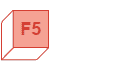 | 刷新我的记忆价值函数回顾 |
| --- | --- |
|  | 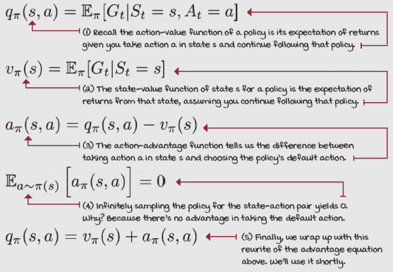 |

### 基于价值的深度强化学习方法的细微差别

动作值函数 *Q*(*s, a*) 可以定义为状态值函数 *V*(*s*) 和动作优势函数 *A*(*s, a*) 的和。这意味着我们可以将 Q 函数分解为两个部分：一个在所有动作中共享，另一个对每个动作都是独特的；或者说，一个依赖于动作，另一个不依赖于动作。

目前，我们正在分别学习每个动作的动作-值函数 *Q*(*s, a*)，但这效率不高。当然，由于网络内部是相互连接的，所以会有一些泛化发生。因此，网络节点之间会共享信息。但是，当我们学习 *Q*(*s, a*[1]) 时，我们忽略了这样一个事实：我们可以使用相同的信息来学习关于 *Q*(*s, a*[2])、*Q*(*s, a*[3]) 以及在状态 *s* 中可用的所有其他动作的信息。事实上，*V*(*s*) 对所有动作 *a*[1]、*a*[2]、*a*[3]，...、*a*[*N*] 都是通用的。

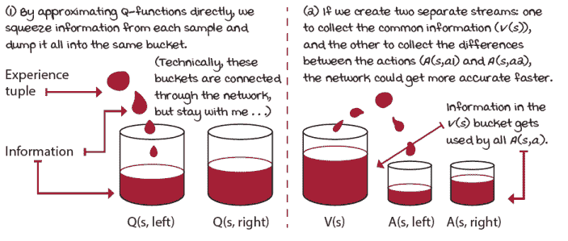

有效利用经验

|  | 简化它动作-值函数 *Q*(*s, a*) 依赖于状态-值函数 *V*(*s*) |
| --- | --- |
|  | 核心问题是动作的值取决于状态的值，我们希望利用这一事实。最终，在好状态下采取最差动作可能比在坏状态下采取最佳动作更好。你看到了“动作的值取决于状态的值”吗？对抗网络架构利用动作-值函数 *Q*(*s, a*) 对状态-值函数 *V*(*s*) 的这种依赖性，以便每次更新都改进状态-值函数 *V*(*s*) 的估计，这对于所有动作都是通用的。 |

### 使用优势的优势

现在，让我给你举一个例子。在购物车-杆环境中，当杆处于直立位置时，左右动作的值几乎相同。当杆精确直立时（为了论证，假设购物车精确位于轨道中间，并且所有速度都是 0），无论你做什么都无关紧要。在这种完美的状态下，向左或向右移动应该具有相同的值。

然而，当杆向右倾斜 10 度时，采取的动作确实很重要。在这种情况下，推动购物车向右以抵消倾斜是代理可以采取的最佳动作。相反，向左移动，并因此加剧倾斜，可能是一个糟糕的主意。

注意，这正是动作-优势函数 *A*(*s, a*) 所表示的：在当前状态 *s* 中采取特定动作 *a* 比平均水平好多少？

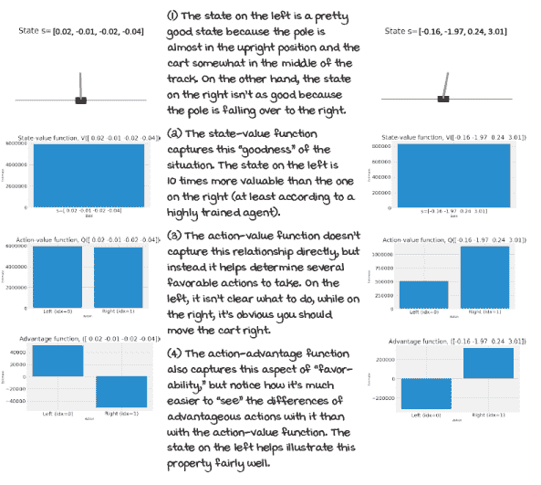

值函数之间的关系

### 强化学习感知架构

对抗网络架构包括创建两个独立的估计器，一个是状态-值函数 *V*(*s*)，另一个是动作-优势函数 *A*(*s, a*)。然而，在分割网络之前，你想要确保你的网络共享内部节点。例如，如果你使用图像作为输入，你想要共享卷积，以便特征提取层可以共享。在购物车-杆环境中，我们共享隐藏层。

在共享了大部分内部节点和层之后，输出层之前的层分为两个流：一个用于状态值函数*V*(*s*)的流，另一个用于动作优势函数*A*(*s, a*)的流。V 函数输出层总是以单个节点结束，因为状态的价值始终是一个单一的数字。然而，Q 函数的输出层输出一个与动作数量相同的向量。在 cart-pole 环境中，动作优势函数流的输出层有两个节点，一个用于左边的动作，另一个用于右边的动作。

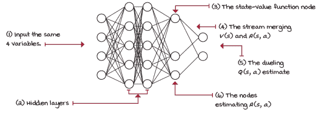

对弈网络架构

| 0001 | 一点历史介绍对弈网络架构 |
| --- | --- |
|  | 对弈神经网络架构是在 2015 年由 Ziyu Wang 在牛津大学攻读博士学位时，在名为“用于深度强化学习的对弈网络架构”的论文中提出的。这篇论文可以说是第一篇介绍专门为基于价值的深度强化学习方法设计的自定义深度神经网络架构的论文。Ziyu 现在是 Google DeepMind 的研究科学家，在那里他继续为深度强化学习领域做出贡献。 |

### 构建对弈网络

构建对弈网络很简单。我注意到你可以在输入层之后任何地方分割网络，它仍然可以正常工作。我可以想象你甚至可以有两个独立的网络，但我看不到这样做的好处。总的来说，我的建议是尽可能多地共享层，只在输出层之前的一个层中分割成两个头部。

|  | 我会说 Python 构建对弈网络 |
| --- | --- |
|  |

```
class FCDuelingQ(nn.Module): ①
    def __init__(self,                                      ①
                 input_dim,                                 ①
                 output_dim,                                ①
                 hidden_dims=(32,32),
               activation_fc=F.relu):
        super(FCDuelingQ, self).__init__()
        self.activation_fc = activation_fc
        self.input_layer = nn.Linear(input_dim,
                                   hidden_dims[0]) ②
        self.hidden_layers = nn.ModuleList()
        for i in range(len(hidden_dims)-1): ③
            hidden_layer = nn.Linear(
                hidden_dims[i], hidden_dims[i+1])
            self.hidden_layers.append(hidden_layer)
        self.value_output = nn.Linear(hidden_dims[-1], 1) ④
        self.advantage_output = nn.Linear(
            hidden_dims[-1], output_dim)
```

① 对弈网络与常规网络类似。我们需要为输入层和输出层的节点数量、隐藏层的形状以及激活函数设置变量，就像我们之前做的那样。② 接下来，我们创建输入层并将其“连接”到第一个隐藏层。在这里，input_dim 变量是输入节点的数量，而 hidden_dims[0]是第一个隐藏层的节点数量。nn.Linear 创建了一个具有输入和输出的层。③ 我们通过创建隐藏层来创建隐藏层，这些层由 hidden_dims 变量定义。例如，值为(64, 32, 16)将创建一个具有 64 个输入节点和 32 个输出节点的层，然后是一个具有 32 个输入节点和 16 个输出节点的层。④ 最后，我们构建两个输出层，它们都“连接”到最后的隐藏层。value_output 有一个节点输出，而 advantage_output 有 output_dim 个节点。在 cart-pole 环境中，这个数字是两个。|

### 重建动作值函数

首先，让我澄清一下，对抗架构的动机是创建一个新的网络，这个网络在改进先前网络的同时，无需改变底层控制方法。我们需要的是不破坏性的变化，并且与先前的方法兼容。我们希望替换神经网络，然后完成它。

为了实现这一点，我们需要找到一种方法来聚合网络输出的两个结果，并重建动作值函数 *Q*(*s, a*)，以便任何先前的方法都可以使用对抗网络模型。这样，当使用对抗架构与 DDQN 代理结合时，我们就创建了对抗 DDQN 代理。一个对抗网络和 DQN 代理将构成对抗 DQN 代理。

| 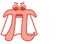 | 展示数学公式：对抗架构聚合方程 |
| --- | --- |
|  |  |

但是，我们如何将输出合并呢？有些人可能会想，把它们加起来，对吧？我的意思是，毕竟这是我提供的定义。尽管如此，你们中的一些人可能已经注意到，仅凭 *Q*(*s, a*) 无法唯一地恢复 *V*(*s*) 和 *A*(*s, a*)。想想看；如果你给 *V*(*s*) 加上+10，并从 *A*(*s, a*) 中减去它，你将得到相同的 *Q*(*s, a*)，但 *V*(*s*) 和 *A*(*s, a*) 的值却不同。

在对抗架构中，我们通过从聚合的动作值函数 *Q*(*s, a*) 估计中减去优势的平均值来解决这个问题的。这样做会将 *V*(*s*) 和 *A*(*s, a*) 偏移一个常数，但也会稳定优化过程。

当估计值有常数偏差时，它们不会改变 *A*(*s, a*) 的相对排名，因此 *Q*(*s, a*) 也具有适当的排名。所有这些，同时仍然使用相同的控制算法。这是一个大胜利。

|  | 我会说 Python：对抗网络的正向传播 |
| --- | --- |
|  |

```
class FCDuelingQ(nn.Module):
    <...>                                                  ①
    def forward(self, state):
        x = state
        if not isinstance(x, torch.Tensor):
            x = torch.tensor(x,                            ②
                             device=self.device,
                           dtype=torch.float32)
            x = x.unsqueeze(0)
        x = self.activation_fc(self.input_layer(x)) ③
        for hidden_layer in self.hidden_layers: ④
            x = self.activation_fc(hidden_layer(x))
        a = self.advantage_output(x) ⑤
        v = self.value_output(x)
        v = v.expand_as(a)
        q = v + a - a.mean(1, keepdim=True).expand_as(a) ⑥
        return q
```

① 注意，这与之前相同。为了简洁，我移除了构建网络的代码。② 在前向传递中，我们首先确保网络的输入，即‘状态’，是预期的类型和形状。我们这样做是因为有时我们输入的是状态批次（训练），有时是单个状态（交互）。有时这些是 NumPy 向量。③ 在这一点上，我们已经将输入变量*x*（再次是单个或状态批次）准备成网络所期望的。我们将变量*x*传递到输入层，记住，输入层接受 input_dim 变量并输出 hidden_dim[0]变量；这些将随后通过激活函数。④ 我们使用那个输出作为我们第一个隐藏层的输入。我们将变量*x*（你可以将其视为脉冲波从输入到网络输出的当前状态）依次传递到每个隐藏层和激活函数。⑤ *x*现在包含了来自最后一个隐藏层及其相应激活的值。我们使用这些值作为优势输出和价值输出层的输入。由于*v*是一个将添加到*a*的单个值，我们将其扩展。⑥ 最后，我们将*v*和*a*相加，并从其中减去*a*的均值。这就是我们的*Q*(*s*, .)估计，包含了所有状态下所有动作的估计。|

### 持续更新目标网络

目前，我们的代理正在使用一个目标网络，在它与在线网络同步时，可能需要经过几步更新才能获得较大的权重更新。在 CartPole 环境中，这仅仅是相隔~15 步，但在更复杂的环境中，这个数字可能会上升到数万。

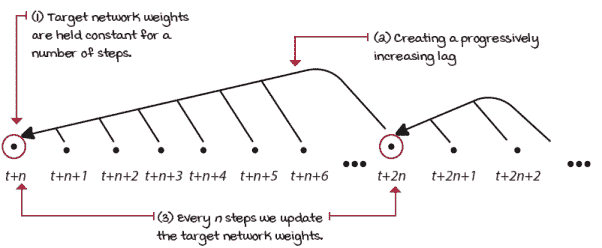

完整的目标网络更新

这种方法至少存在两个问题。一方面，我们在几步内冻结了权重，并使用逐渐增加的过时数据来计算估计值。当我们达到更新周期的末尾时，估计值对网络训练进展没有帮助的可能性更高。另一方面，网络每隔一段时间就会进行一次巨大的更新。进行一次大的更新可能会一次性改变损失函数的全局景观。这种更新风格似乎既过于保守又过于激进，如果可能的话。

我们遇到这个问题是因为我们希望我们的网络不要移动得太快，从而避免产生不稳定性，同时我们还想保留那些理想的特性。但是，你能想到其他我们可以以平滑方式实现类似目标的方法吗？比如，减缓目标网络的更新速度，而不是将其冻结？

我们可以做到。这种技术被称为 *Polyak 平均*，它包括在每一步将在线网络权重混合到目标网络中。另一种看待它的方法是，每一步，我们创建一个新的目标网络，该网络由大量目标网络权重和少量在线网络权重组成。我们每步向网络添加约 1%的新信息。因此，网络总是落后，但差距要小得多。此外，我们现在可以在每一步更新网络。

|  | 展示数学 Polyak 平均 |
| --- | --- |
|  | 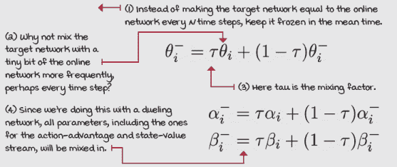 |
|  | 我会说 Python 混合目标和在线网络权重 |
|  |

```
class DuelingDDQN():
   <...>                                                     ①
    def update_network(self, tau=None):
        tau = self.tau if tau is None else tau
        for target, online in zip( ②③
               self.target_model.parameters(),
             self.online_model.parameters()):
            target_ratio = (1.0 - self.tau) * target.data
            online_ratio = self.tau * online.data            ④
            mixed_weights = target_ratio + online_ratio
            target.data.copy_(mixed_weights) ⑤
```

① 这与相同的对抗式 DDQN 类相同，但为了简洁起见，删除了大部分代码。② *tau* 是一个表示将混合到目标网络中的在线网络权重的比例的变量。值为 1 相当于完全更新。③ zip 接受可迭代对象并返回一个元组的迭代器。④ 现在，我们计算从目标和在线权重中取出的比率。⑤ 最后，我们混合权重并将新值复制到目标网络中。 |

### 对抗式网络带来了什么？

行动优势在您自己看到的情况下，当您有许多类似价值的行动时尤其有用。从技术上来说，对抗式架构提高了策略评估，尤其是在面对许多具有相似价值的行动时。使用对抗式网络，我们的智能体可以更快、更准确地比较具有相似价值的行动，这在小车-杆环境中是有用的。

函数逼近器，如神经网络，都有误差；这是预期的。在我们之前使用的架构的网络中，这些误差对于所有状态-动作对可能是不同的，因为它们都是分开的。但是，鉴于状态值函数是动作值函数中在状态中所有动作都共有的部分，通过使用对抗式架构，我们减少了函数误差和误差方差。这是因为现在具有最大显著程度的相似价值动作的组成部分（状态值函数 *V*(*s*)）对所有动作都是相同的。

如果对弈网络在我们的智能体中提高了策略评估，那么当左右动作几乎具有相同的价值时，一个完全训练好的对弈 DDQN 智能体应该比 DDQN 表现更好。我通过收集 DDQN 和对弈 DDQN 智能体的 100 个回合的状态来运行了一个实验。我的直觉告诉我，如果一个智能体在评估类似价值的动作方面比另一个智能体更好，那么更好的智能体在轨迹上的范围应该更小。这是因为更好的智能体应该学会在杆子完全直立时区分左右移动，警告！我没有做消融研究，但我的手波实验的结果表明，对弈 DDQN 智能体确实能够更好地评估这些状态。

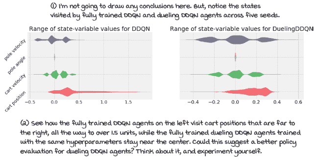

完全训练的 cart-pole 智能体访问的状态空间

|  | 在细节中 The dueling double deep Q-network (dueling DDQN)算法 |
| --- | --- |

|  | 对弈 DDQN 几乎与 DDQN 和 DQN 相同，只有一些小的调整。我的意图是在保持算法差异最小化的同时，仍然向您展示可以做出的许多不同改进。我确信，仅通过稍微调整几个超参数就可以对许多这些算法的性能产生重大影响；因此，我没有优化智能体。话虽如此，现在让我来谈谈仍然与之前相同的事情：

+   网络输出动作值函数 *Q*(*s, a; θ*）。

+   优化动作值函数以逼近最优动作值函数 *q**(*s, a*）。

+   使用离线 TD 目标（*r + gamma*max_a’Q*(*s’，a’; θ*）来评估策略。

+   使用可调整的 Huber 损失，但仍然将 max_gradient_norm 变量设置为 float（‘inf’）。因此，我们使用 MSE。

+   使用 RMSprop 作为我们的优化器，学习率为 0.0007。

+   一个指数衰减的 epsilon-greedy 策略（在约 20,000 步内从 1.0 衰减到 0.3）来改进策略。

+   用于评估步骤的贪婪动作选择策略。

+   一个具有最小样本数 320、最大样本数 50,000 和批次大小 64 的重放缓冲区。

我们替换了

+   神经网络架构。我们现在使用状态-值-输出对弈网络架构（节点：4, 512, 128, 1; 2, 2）。

+   之前用于冻结 15 步并完全更新的目标网络现在使用 Polyak 平均：每一步，我们将 0.1 的在线网络和 0.9 的目标网络混合形成新的目标网络权重。

对弈 DDQN 与 DDQN 完全相同的算法，但网络不同：

1.  收集经验：(*S*[*t*]*, A*[*t*]*, R*[*t+1*]*, S*[*t+1*]*, D*[*t+1*])，并将其插入重放缓冲区。

1.  从缓冲区中拉取一批并计算离线 TD 目标：*R + gamma*max_a’Q*(*s’，a’; θ*），使用双学习。

1.  使用 MSE 和 RMSprop 拟合动作值函数 *Q*(*s,a; θ*）。

一个值得注意的酷点是，所有这些改进都像是乐高™积木，供你发挥创意。也许你想尝试对抗式 DQN，但不使用双重学习；也许你想让 Huber 损失函数剪辑梯度；或者也许你喜欢 Polyak 平均化，每 5 个时间步混合 50:50。这取决于你！希望我组织代码的方式能给你尝试新事物的自由。 |

|  | 累计优势对抗式 DDQN 比所有先前方法都更有效率 |
| --- | --- |
|  | 对抗式 DDQN 和 DDQN 在 Cart-Pole 环境中表现相似。对抗式 DDQN 在数据效率上略高。DDQN 需要通过环境的样本数量高于对抗式 DDQN。然而，对抗式 DDQN 的运行时间略长于 DDQN。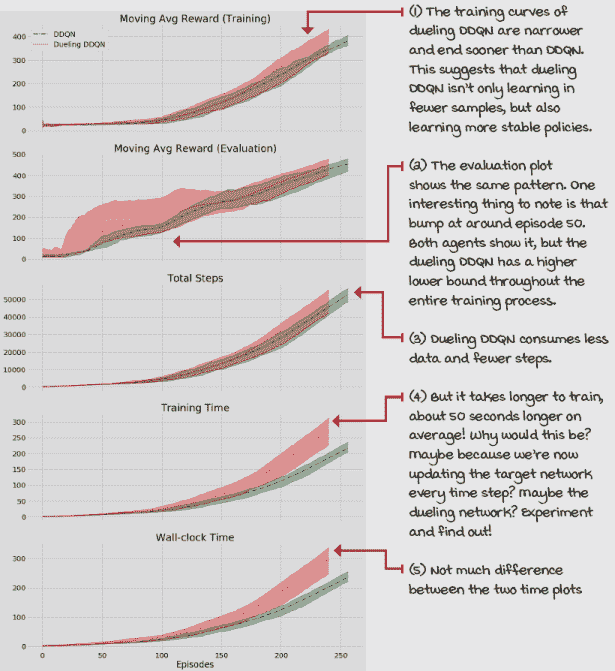 |

## PER：优先回放有意义经验

在本节中，我们介绍了一种更智能的经验回放技术。目标是分配资源给那些具有最大学习潜力的经验元组。*优先经验回放*（PER）是一个专门用于此的回放缓冲区。

### 更智能的回放经验方式

目前，我们的智能体从回放缓冲区中均匀随机地抽取经验元组。从数学上讲，这似乎是正确的，确实如此。但直观上，这似乎是一种回放经验的次优方式。均匀随机回放将资源分配给了不重要的经验。感觉上，我们的智能体花费时间和计算能力“学习”那些对当前智能体状态毫无帮助的事情是不合适的。

但，在这里我们要小心：虽然均匀随机并不足够好，但人类直觉在确定更好的学习信号时可能也不太有效。当我第一次实现优先回放缓冲区，在阅读 PER 论文之前，我的第一个想法是，“嗯，我想让智能体获得尽可能高的累积折现奖励；我应该只让它回放高奖励的经验。”是的，这没有奏效。然后我意识到智能体也需要负面经验，所以我想到，“啊！我应该让智能体回放奖励幅度最高的经验！此外，我喜欢使用那个‘abs’函数！”但这也没有奏效。你能想出为什么这些实验没有奏效吗？如果我想让智能体学会体验奖励状态，我应该让它回放最多的那些，这样它才能学会到达那里。对吧？

|  | 米格尔的类比人类直觉和对幸福的执着追求 |
| --- | --- |
|  | 我爱我女儿。我非常爱她。事实上，如此之爱，以至于我希望她只体验生活中美好的事物。不，说真的，如果你是父母，你就知道我的意思。我发现她非常喜欢巧克力，或者像她说的那样，“一大堆”，所以我开始时不时地给她一些糖果。然后，大多数时候都是这样。但是，然后当她觉得我不应该给她糖果时，她开始生我的气。太多的高奖励体验，你认为吗？没错！代理（甚至可能是人类）需要经常提醒他们好与坏的经验，但他们也需要低强度奖励的平凡经验。最终，这些经验都没有给你带来最多的学习，这正是我们追求的目标。这不是反直觉吗？ |

### 那么，“重要”经验的好度量是什么？

我们所寻找的是从意外价值、令人惊讶的经验、我们认为应该这样评价的经验中学习，结果却评价了那样。这更有意义；这些经验将现实带给我们。我们有一个对世界的看法，我们预测结果，当期望与现实之间的差异很大时，我们知道我们需要从中学到一些东西。

在强化学习中，这种惊喜的度量由 *TD* 错误给出！好吧，技术上讲，是 *绝对* *TD* 错误。*TD* 错误为我们提供了代理当前估计值和目标值之间的差异。当前的估计值表示代理认为它将以某种特定方式行动所能获得的价值。目标值建议对相同的状态-动作对的新估计，这可以看作是一种现实检查。这些值之间的绝对差异表明我们偏离了多少，这种体验有多么出乎意料，我们获得了多少新信息，这使得它成为学习机会的良好指标。

|  | 展示数学公式 The absolute TD error is the priority |
| --- | --- |
|  | 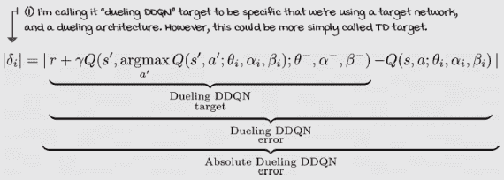 |

*TD* 错误并不是最高学习机会的完美指标，但可能是最好的合理代理。实际上，学习最多最好的标准在网络的内部，隐藏在参数更新之后。但是，每次时间步都计算回放缓冲区中所有经验的梯度似乎不太实际。*TD* 错误的好处是计算它的机制已经存在，当然，*TD* 错误仍然是优先回放经验的良好信号。

### 通过 *TD* 错误进行贪婪优先级排序

让我们假设我们使用 *TD* 错误来优先处理经验如下：

+   在状态 s 中采取行动 a，并接收一个新的状态 *s'*)，一个奖励 *r*，以及一个完成标志 *d*。

+   查询网络以获取当前状态 *Q*(*s, a; θ*) 的估计。

+   为该经验计算一个新的目标值，即 *target = r + gamma*max_a'Q* (*s',a'; θ*)。

+   计算绝对*TD*误差为*atd_err = abs*(*Q*(*s, a; θ*) – *target*）。

+   将经验作为一个元组（*s, a, r, s', d, atd_err*）插入到重放缓冲区中。

+   按照排序后的*atd_err*从缓冲区中提取最优先的经验。

+   使用这些经验进行训练，并重复。

这种方法存在多个问题，但让我们逐一解决。首先，我们正在计算*TD*误差两次：我们在将其插入缓冲区之前计算*TD*误差，但然后在用网络训练时再次计算。此外，我们忽略了*TD*误差会随着网络的变化而变化的事实，因为它们是使用网络计算的。但是，解决方案不能是每次时间步更新所有*TD*误差。这根本不划算。

解决这两个问题的方法是为用于更新网络（重放的经验）的经验更新*TD*误差，并在缓冲区中插入具有最大幅度*TD*误差的新经验，以确保它们至少被重放一次。

然而，从这个解决方案中，其他问题也随之产生。首先，第一次更新中的*TD*误差为零意味着经验很可能永远不会再次被重放。其次，当使用函数逼近器时，误差缩小得很慢，这意味着更新主要集中在重放缓冲区的小子集。最后，*TD*误差是嘈杂的。

由于这些原因，我们需要一个基于*TD*误差的采样策略，但必须是随机的，而不是贪婪的。如果我们随机采样优先经验，我们就可以同时确保所有经验都有机会被重放，并且采样经验的概率在绝对*TD*误差上是单调的。

|  | 简化 TD 误差、优先级和概率 |
| --- | --- |
|  | 本页最重要的启示是 TD 误差不足以解决问题；我们将使用 TD 误差来计算优先级，然后从优先级计算概率。 |

### 随机采样优先经验

让我深入探讨一下为什么我们需要随机优先级。在高度随机的环境中，基于*TD*误差贪婪采样的经验可能会导致我们走向噪声所引导的方向。

TD 误差取决于一步奖励和下一个状态的动作值函数，这两者都可以是非常随机的。高度随机的环境可以有更高的方差*TD*误差。在这样的环境中，如果我们让我们的智能体严格遵循*TD*误差，我们可能会陷入麻烦。我们不希望我们的智能体对意外情况产生固定观念；那不是我们的目标。*TD*误差中的另一个噪声来源是神经网络。使用高度非线性的函数逼近器也导致了*TD*误差中的噪声，尤其是在训练早期，错误最高的时候。如果我们仅仅基于*TD*误差贪婪地采样，大部分的训练时间将花费在那些可能具有不准确的大幅度*TD*误差的经验上。

|  | 简化优先经验随机采样 |
| --- | --- |
|  | TD 误差是有噪声且缓慢缩小的。我们不希望因为噪声而停止重放那些由于噪声而得到零 TD 误差值的经验。我们不希望陷入由于噪声而得到显著 TD 误差的噪声经验。而且，我们也不希望专注于初始 TD 误差高的经验。 |
| 0001 | 一点历史介绍优先经验重放缓冲区 |
|  | 2015 年，与对抗网络论文同时由谷歌 DeepMind 团队引入的“优先经验重放”论文。汤姆·沙乌尔（Tom Schaul），谷歌 DeepMind 的高级研究科学家，是 PER 论文的主要作者。汤姆于 2011 年从慕尼黑工业大学获得博士学位。在纽约大学担任博士后两年后，汤姆加入了 DeepMind Technologies，六个月后，该公司被谷歌收购，并发展成为今天的谷歌 DeepMind。汤姆是 PyBrain 框架的核心开发者，这是一个用于 Python 的模块化机器学习库。PyBrain 可能是最早实现机器学习、强化学习和黑盒优化算法的框架之一。他也是 PyVGDL 的核心开发者，这是一个基于 pygame 的高级视频游戏描述语言。 |

### 比例优先级

让我们根据*TD*误差计算缓冲区中每个样本的优先级。一个这样做的方法是按比例根据它们的绝对*TD*误差来采样经验。我们可以使用每个经验的绝对*TD*误差并添加一个小的常数 epsilon，以确保零*TD*误差样本仍有被重放的机会。

|  | 展示数学比例优先级 |
| --- | --- |
|  | 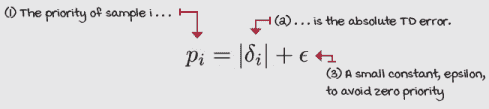 |

我们通过将优先级值指数化为 alpha（一个介于零和一之间的超参数）来缩放这个优先级值。这允许我们在均匀采样和优先级采样之间进行插值。它允许我们执行我们讨论过的随机优先级。

当 alpha 为零时，所有值都变为 1，因此，具有相等的优先级。当 alpha 为一时，所有值保持与绝对 *TD* 错误相同；因此，优先级与绝对 *TD* 错误成比例——介于两者之间的值混合了两种采样策略。

这些缩放后的优先级只有通过将它们的值除以值的总和才能转换为实际概率。然后，我们可以使用这些概率从重放缓冲区中抽取样本。

|  | 将优先级转换为概率 |
| --- | --- |
|  |  |

### 基于排名的优先级

比例优先级方法的一个问题是它对异常值敏感。这意味着具有比其他经验更高的 *TD* 错误（无论是事实还是噪声）的经验被采样的频率更高，这可能是不可期望的副作用。

在计算优先级时，一种略微不同的经验优先级方法是通过使用按绝对 *TD* 错误排序的样本的排名来采样。

这里的排名意味着按绝对 *TD* 错误降序排序的样本的位置——没有其他含义。例如，基于排名的优先级使得具有最高绝对 *TD* 错误的经验排名为 1，第二名为 2，依此类推。

|  | 展示数学计算 |
| --- | --- |
|  | 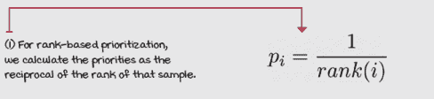 |

在我们按 *TD* 错误对它们进行排名后，我们计算它们的优先级为排名的倒数。同样，在计算优先级时，我们通过使用 alpha（与比例策略相同）对优先级进行缩放来继续进行。然后，我们像以前一样从这些优先级计算实际概率，也进行归一化，使得总和为 1。

|  | 简化优先级排序 |
| --- | --- |
|  | 虽然比例优先级使用绝对 TD 错误和一个小常数来包含零 TD 错误经验，但基于排名的优先级使用按绝对 TD 错误降序排序的样本的排名的倒数。两种优先级策略随后以相同的方式从优先级创建概率。 |

### 优先级偏差

使用一个分布来估计另一个分布会引入估计偏差。因为我们根据这些概率、优先级和 *TD* 错误进行采样，所以我们需要考虑这一点。

首先，让我更深入地解释一下这个问题。更新的分布必须与其期望值来自相同的分布。当我们更新状态 *s* 和动作 *a* 的动作值函数时，我们必须意识到我们总是使用目标值进行更新。

目标是期望值的样本。这意味着下一步的奖励和状态可能是随机的；在状态 *s* 中采取动作 *a* 时，可能会有许多可能的不同的奖励和状态。

如果我们忽略这个事实，并且比在期望中出现得更频繁地更新单个样本，我们就会对这个值产生偏差。这个问题在训练结束时尤其有影响，那时我们的方法接近收敛。

要减轻这种偏差，可以使用一种称为*加权重要性采样*的技术。它包括通过每个样本的概率来计算权重，然后对*TD*误差进行缩放。

加权重要性采样所做的就是改变更新的幅度，使得样本看起来来自均匀分布。

|  | 展示数学公式：加权重要性采样权重计算 |
| --- | --- |
|  | 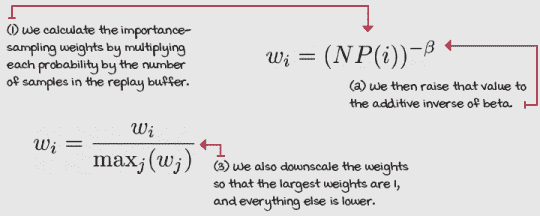 |

为了有效地使用优先回放缓冲区进行加权重要性采样，我们添加了一个方便的超参数，beta，它允许我们调整校正的程度。当 beta 为零时，没有校正；当 beta 为一时，进行完全的偏差校正。

此外，我们还想通过它们的最大值来归一化权重，使得最大权重变为 1，其他所有权重都按比例缩小*TD*误差。这样，我们就能防止*TD*误差增长过大，并保持训练的稳定性。

这些重要性采样权重用于损失函数中。在 PER 中，我们不是直接在梯度更新中使用*TD*误差，而是将它们乘以重要性采样权重，并将所有*TD*误差缩小以补偿分布的不匹配。

|  | 展示数学公式：对抗性 DDQN 与 PER 梯度更新 |
| --- | --- |
|  | 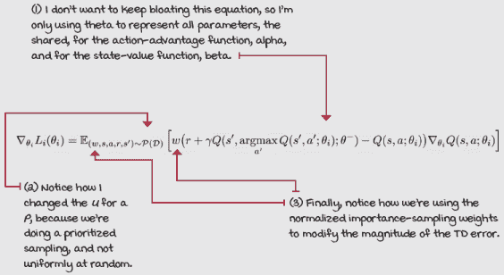 |
|  | 我会说 Python：优先回放缓冲区 1/2 |
|  |

```
class PrioritizedReplayBuffer():
    <...>
    def store(self, sample):
        priority = 1.0
        if self.n_entries > 0: ①
            priority = self.memory[
                :self.n_entries,
              self.td_error_index].max()
        self.memory[self.next_index,
                  self.td_error_index] = priority             ②
        self.memory[self.next_index,
                  self.sample_index] = np.array(sample)
        self.n_entries = min(self.n_entries + 1, ③
                                              self.max_samples)
        self.next_index += 1 ④
        self.next_index = self.next_index % self.max_samples
    def update(self, idxs, td_errors):
        self.memory[idxs, ⑤
                    self.td_error_index] = np.abs(td_errors)
        if self.rank_based:
            sorted_arg = self.memory[:self.n_entries,         ⑥
                    self.td_error_index].argsort()[::-1]
            self.memory[:self.n_entries] = self.memory[
                                                    sorted_arg]
```

① PrioritizedReplayBuffer 类的存储函数很简单。我们首先做的事情是计算样本的优先级。记住，我们将优先级设置为最大值。下面的代码显示了默认值为 1；然后它被覆盖为最大值。② 拥有优先级和样本（经验）后，我们将它插入到内存中。③ 我们增加表示缓冲区中经验数量变量的值，但我们需要确保缓冲区不会超过 max_samples。④ 下一个变量表示下一个经验将被插入的索引。这个变量从 max_samples 循环回 0，然后再次上升。⑤ 更新函数接受一个经验 ID 数组和新*TD*误差值。然后，我们将绝对*TD*误差插入到正确的位置。⑥ 如果我们进行基于排名的采样，我们还会对数组进行排序。请注意，数组在实现优先回放缓冲区时不是最优的，主要是因为这个依赖于样本数量的排序。这对性能不好。|

|  | 我会说 Python：优先回放缓冲区 2/2 |
| --- | --- |
|  |

```
class PrioritizedReplayBuffer():
    <...>
    def sample(self, batch_size=None):
        batch_size = self.batch_size if batch_size == None \
                                               else batch_size
        self._update_beta() ①
        entries = self.memory[:self.n_entries]
        if self.rank_based: ②
            priorities = 1/(np.arange(self.n_entries) + 1)
        else: # proportional
            priorities = entries[:, self.td_error_index] + EPS
        scaled_priorities = priorities**self.alpha
        pri_sum = np.sum(scaled_priorities) ③
        probs = np.array(scaled_priorities/pri_sum,
                                            dtype=np.float64)
        weights = (self.n_entries * probs)**-self.beta        ④
        normalized_weights = weights/weights.max() ⑤
        idxs = np.random.choice(self.n_entries,               ⑥
                            batch_size, replace=False, p=probs)
        samples = np.array([entries[idx] for idx in idxs]) ⑦
        samples_stacks = [np.vstack(batch_type) for \         ⑧
    batch_type in np.vstack(samples[:, self.sample_index]).T] ⑧
        idxs_stack = np.vstack(idxs) ⑧
        weights_stack = np.vstack(normalized_weights[idxs]) ⑧
        return idxs_stack, weights_stack, samples_stacks      ⑧
```

① 计算 batch_size、衰减‘beta’并从条目中删除零行。② 现在，我们计算优先级。如果是基于排名的优先级，则是排名的倒数（我们在更新函数中已对这些进行排序）。比例是绝对 TD 误差加上一个小的常数 epsilon，以避免优先级为零。③ 现在，我们将优先级转换为概率。首先，我们与均匀分布混合，然后是 probs。④ 然后，我们使用概率计算重要性采样权重。⑤ 归一化权重。最大权重将是 1。⑥ 我们使用概率从缓冲区中采样经验的索引。⑦ 从缓冲区中获取样本。⑧ 最后，通过 ids、权重和经验元组堆叠样本，并返回它们。|

|  | 我会说 Python 优先级重放缓冲区损失函数 1/2 |
| --- | --- |
|  |

```
class PER():
    <...>                                                       ①
    def optimize_model(self, experiences):
       idxs, weights, \                                         ②
       (states, actions, rewards,
                    next_states, is_terminals) = experiences
       <...>
       argmax_a_q_sp = self.online_model(next_states).max(1)[1]
       q_sp = self.target_model(next_states).detach()
       max_a_q_sp = q_sp[np.arange(batch_size), argmax_a_q_sp]
       max_a_q_sp = max_a_q_sp.unsqueeze(1)
       max_a_q_sp *= (1 - is_terminals)
       target_q_sa = rewards + (self.gamma * max_a_q_sp) ③
       q_sa = self.online_model(states).gather(1, actions) ④
       td_error = q_sa - target_q_sa                            ⑤
       value_loss = (weights * td_error).pow(2).mul(0.5).mean()  ⑥
       self.value_optimizer.zero_grad()
       value_loss.backward()
       torch.nn.utils.clip_grad_norm_( ⑦
                                self.online_model.parameters(),
                              self.max_gradient_norm)
       self.value_optimizer.step()
       priorities = np.abs(td_error.detach().cpu().numpy()) ⑧
       self.replay_buffer.update(idxs, priorities)
```

① 正如我在其他场合所指出的，这是代码的一部分。这些是我认为值得在这里展示的代码片段。② 注意现在我们有了与经验一起到来的 ids 和权重。③ 我们计算目标值，就像之前一样。④ 我们查询当前的估计：没有新内容。⑤ 我们以同样的方式计算 TD 误差。⑥ 但是，现在损失函数有通过权重缩放的 TD 误差。⑦ 我们继续之前的优化。⑧ 我们使用绝对 TD 误差更新重放批次的优先级。|

|  | 我会说 Python 优先级重放缓冲区损失函数 2/2 |
| --- | --- |
|  |

```
class PER():
    <...>
    def train(self, make_env_fn, make_env_kargs, seed, gamma,   ①
              max_minutes, max_episodes, goal_mean_100_reward):
        <...>
        for episode in range(1, max_episodes + 1): ②
            <...>
            for step in count(): ③
                state, is_terminal = \
                             self.interaction_step(state, env)
                <...>                                           ④
                if len(self.replay_buffer) > min_samples:
                    experiences = self.replay_buffer.sample() ⑤
                    idxs, weights, samples = experiences        ⑥
                    experiences = self.online_model.load( ⑥
                                                       samples)
                    experiences = (idxs, weights) + \           ⑦
                                                 (experiences,)
                    self.optimize_model(experiences) ⑧
                if np.sum(self.episode_timestep) % \            ⑨
                          self.update_target_every_steps == 0:  ⑨
                    self.update_network() ⑨
                if is_terminal:
                    break
```

① 这是相同的 PER 类，但现在我们处于训练函数中。② 在剧集循环内。③ 在时间步循环内。④ 在训练时间中的每个时间步。⑤ 看看我们是怎样从缓冲区中提取经验的。⑥ 从经验中，我们提取 idxs、权重和经验元组。注意我们是如何将样本变量加载到 GPU 中的。⑦ 然后，我们再次堆叠变量。请注意，我们这样做只是为了将样本加载到 GPU 中，并使其准备好训练。⑧ 然后，我们优化模型（这是上一页中的函数）。⑨ 然后，一切照常进行。|

|  | 这就是细节双 DQN 与优先级重放缓冲区算法 |
| --- | --- |

|  | 最后一次，我们改进了所有之前的价值型深度强化学习方法。这次，我们通过改进重放缓冲区来实现。正如你可以想象的那样，大多数超参数与之前的方法相同。让我们深入了解。这些是仍然与之前相同的事情：

+   网络输出动作值函数 *Q*(*s, a; θ*）。

+   我们使用状态-值输出对冲网络架构（节点：4, 512,128, 1; 2, 2）。

+   优化动作值函数以逼近最优动作值函数 *q**(*s, a*）。

+   使用离线策略 TD 目标（*r + gamma*max_a’Q*(*s’，a’; θ*）来评估策略。

+   使用可调整的 Huber 损失，将 max_gradient_norm 变量设置为 float(‘inf’)。因此，我们使用 MSE。

+   使用学习率为 0.0007 的 RMSprop 作为我们的优化器。

+   一种指数退化的ε-greedy 策略（从 1.0 到 0.3 大约需要 20,000 步）来改进策略。

+   用于评估步骤的贪婪动作选择策略。

+   一个目标网络，每次时间步更新时使用 Polyak 平均，τ（混合因子）为 0.1。

+   至少包含 320 个样本的回放缓冲区和 64 个批次的样本。

我们所做的改变：

+   使用加权重要性采样来调整 TD 误差（这会改变损失函数）。

+   使用具有比例优先级的优先回放缓冲区，最大样本数为 10,000，优先级（相对于均匀的优先级程度——1 是完全优先级）的α值为 0.6，β值（β的初始值，用于偏差校正——1 是完全校正）为 0.1，β退火率为 0.99992（在大约 30,000 个时间步长后完全退火）。

PER 与对抗 DDQN、DDQN 和 DQN 的基算法相同：

1.  收集经验：(*S*[*t*]*, A*[*t*]*, R*[*t+*][*1*]*, S*[*t+*][*1*]*, D*[*t+1*])，并将其插入回放缓冲区。

1.  从缓冲区中抽取一个批次，并使用双学习计算离策略 TD 目标：*r + gamma*max_a’Q(s’，a’; θ)。

1.  使用 MSE 和 RMSprop 拟合动作价值函数*Q*(*s,a; θ*)。

1.  调整回放缓冲区中的 TD 误差。

|

|  | 累计它 UPPER 进一步提高数据效率 |
| --- | --- |
|  | 优先回放缓冲区使用的样本比之前任何方法都少。正如你在下面的图表中可以看到的，它甚至使事物看起来更加稳定。也许？！[](../Images/10_05_Sidebar27.png) |

## 摘要

本章总结了基于价值的 DRL 方法的调查。在本章中，我们探讨了使基于价值的方法更数据高效的方法。你了解了对抗架构，以及它是如何通过将*Q*(*s, a*)分解为其两个组成部分：状态价值函数*V*(*s*)和动作优势函数*A*(*s, a*)来利用基于价值的 RL 的细微差别。这种分离使得每个用于更新网络的体验都能为状态价值函数*V*(*s*)的估计添加信息，这对于所有动作都是共同的。通过这样做，我们能够更快地得到正确的估计，从而降低样本复杂度。

你还研究了经验的优先级。你了解到 TD 误差是创建优先级的好标准，并且你可以从优先级中计算出概率。你了解到我们必须补偿我们估计的期望分布的变化。因此，我们使用重要性采样，这是一种纠正偏差的技术。

在过去的三章中，我们深入研究了基于价值的 DRL 领域。我们从简单的方法 NFQ 开始。然后，我们通过 DQN 和 DDQN 的改进使这项技术更加稳定。然后，我们通过对抗 DDQN 和 PER 使其更高效地采样。总的来说，我们有一个相当稳健的算法。但是，就像所有事情一样，基于价值的方法也有缺点。首先，它们对超参数敏感。这是众所周知的，但你应该亲自尝试；改变任何超参数。你可以找到更多不工作的值，而不是工作的值。其次，基于价值的方法假设它们与马尔可夫环境交互，即状态包含代理所需的所有信息。当我们远离自举和基于价值的方法时，这种假设就会消失。最后，自举、离线学习和函数逼近器的组合共同被称为“致命的三位一体”。虽然已知致命的三位一体会产生发散，但研究人员仍然不知道如何确切地防止它。

绝对不是在说基于价值的算法比我们在未来章节中探讨的方法差。那些方法也有它们自己的问题。基本的启示是，基于价值的深度强化学习方法众所周知会发散，这是它们的弱点。如何修复它仍然是一个研究问题，但合理的实用建议是使用目标网络、重放缓冲区、双重学习、足够小的学习率（但不是太小），也许还需要一点耐心。对此我感到抱歉；我并不是制定规则的人。

到目前为止，你

+   能够解决具有连续状态空间的强化学习问题

+   了解如何稳定基于价值的 DRL 代理

+   了解如何使基于价值的 DRL 代理更高效地采样

|  | 在自己的工作上努力并分享你的发现 |
| --- | --- |

|  | 这里有一些关于如何将你所学的内容提升到下一个层次的想法。如果你愿意，与世界分享你的结果，并确保查看其他人所做的事情。这是一个双赢的局面，希望你能利用它。

+   **#gdrl_ch10_tf01:** 本章和上一章中使用的重放缓冲区对于小车-杆环境和其他低维环境来说是足够的。然而，你可能已经注意到，优先级缓冲区成为任何更复杂环境的瓶颈。尝试自己重写所有重放缓冲区代码以加快速度。现在不要查找他人的代码；尝试使重放缓冲区更快。在优先级缓冲区中，你可以看到瓶颈是样本的排序。找到使这部分更快的方法。

+   **#gdrl_ch10_tf02:** 当尝试解决高维环境，例如 Atari 游戏时，本章和上一章中的重放缓冲区代码变得极其缓慢，完全不实用。现在怎么办？研究其他人如何解决这个问题，这是优先级缓冲区的一个阻碍性问题。分享你的发现，并自己实现这些数据结构。深入了解它们，并创建一篇博客文章，详细解释使用它们的优点。

+   **#gdrl_ch10_tf03:** 在上一两章中，你已经学习了可以解决具有高维和连续状态空间问题的方法，但动作空间呢？这些算法一次只能选择一个动作，而且这些动作具有离散值，这似乎很无趣。但是等等，像 DQN 这样的方法只能解决大小为 1 的离散动作空间的问题吗？调查并告诉我们！

+   **#gdrl_ch10_tf04:** 在每一章中，我都在使用最后一个标签作为通用的标签。请随意使用这个标签来讨论任何与本章相关的工作。没有比你自己创造的任务更令人兴奋的作业了。确保分享你打算调查的内容和你的结果。

用你的发现写一条推文，@我 @mimoralea（我会转发），并使用列表中的特定标签，以帮助感兴趣的人找到你的结果。没有对错之分；你分享你的发现，并检查他人的发现。利用这个机会社交，做出贡献，让自己脱颖而出！我们正在等待你！以下是一条推文示例：“嘿，@mimoralea。我创建了一篇博客文章，列出了学习深度强化学习的资源列表。查看它吧：<link> #gdrl_ch01_tf01”我会确保转发并帮助他人找到你的工作。|
