# 11 策略梯度与 actor-critic 方法

在本章

+   你将了解一类可以直接优化其性能的深度强化学习方法，而无需价值函数。

+   你将学习如何使用价值函数使这些算法变得更好。

+   你将实现使用多个进程同时进行以实现非常快速学习的深度强化学习算法。

没有什么比逆境更好。每一次失败、每一次心碎、每一次损失，都包含着自己的种子，自己的教训，告诉你如何在下一次做得更好。

—— 马尔科姆·X 美国穆斯林牧师和人权活动家

在本书中，我们探讨了在价值函数的帮助下可以找到最优和近似最优策略的方法。然而，所有这些算法在学习价值函数时，我们需要的却是策略。

在本章中，我们探索光谱的另一端以及中间部分的内容。我们开始探讨直接优化策略的方法。这些方法被称为*基于策略*或*策略梯度*方法，它们参数化一个策略并调整它以最大化预期回报。

在介绍了基础策略梯度方法之后，我们探索了一类结合的方法，这些方法同时学习策略和价值函数。这些方法被称为 actor-critic，因为选择动作的策略可以被视为 actor，而评估策略的价值函数可以被视为 critic。actor-critic 方法在许多深度强化学习基准测试中通常比单独的基于值或策略梯度方法表现更好。了解这些方法可以使你应对更具挑战性的问题。

这些方法结合了你在前三章中学到的关于学习价值函数的知识，以及在本章第一部分学到的关于学习策略的知识。actor-critic 方法在多样化的深度强化学习基准测试中通常能取得最先进的性能。

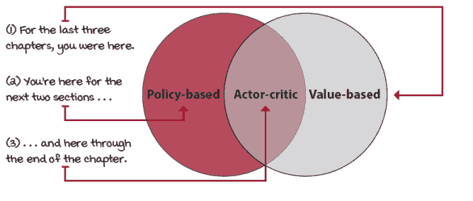

基于策略、基于值和 actor-critic 方法

## REINFORCE：基于结果的策略学习

在本节中，我们开始介绍基于策略的方法的使用动机，首先是一个介绍；然后我们讨论使用这类方法时可以期待的一些优点；最后，我们介绍了最简单的策略梯度算法，称为*rEINFORCE*。

### 策略梯度方法简介

我首先想强调的是，在策略梯度方法中，与基于值的方法不同，我们试图最大化性能目标。在基于值的方法中，主要关注的是学习评估策略。为此，目标是最小化预测值和目标值之间的损失。更具体地说，我们的目标是匹配给定策略的真实动作值函数，因此我们参数化了一个值函数，并最小化了预测值和目标值之间的均方误差。请注意，我们没有真正的目标值，而是使用蒙特卡洛方法中的实际回报或自举方法中的预测回报。

相反，在基于策略的方法中，目标是最大化参数化策略的性能，因此我们执行梯度上升（或对负性能执行常规梯度下降）。很明显，代理的性能是从初始状态期望的总折现奖励，这与从给定策略的所有初始状态的期望状态值函数是同一回事。

|  | 展示数学：基于值的方法与基于策略的方法的目标 |
| --- | --- |
|  | 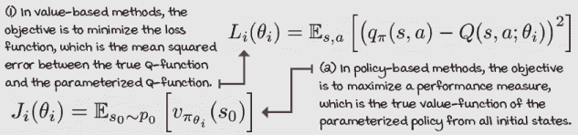 |
| ŘŁ | 带有强化学习口音的基于值的方法与基于策略的方法与策略梯度方法与演员-评论家方法 |
|  | **基于值的方法：**指的是学习值函数并仅学习值函数的算法。Q-learning、SARSA、DQN 等都是基于值的方法。**基于策略的方法：**指的是优化策略的广泛算法，包括如遗传算法这样的黑盒优化方法。**策略梯度方法：**指的是在参数化策略的性能梯度上解决优化问题的方法，你将在本章学习这些方法。**演员-评论家方法：**指的是学习策略和值函数的方法，主要是在值函数通过自举学习并用作随机策略梯度评分的情况下。你将在本章和下一章学习这些方法。 |

### 策略梯度方法的优势

学习参数化策略的主要优势是，策略现在可以是任何可学习的函数。在基于值的方法中，我们处理离散动作空间，主要是因为我们计算动作的最大值。在高维动作空间中，这个最大值可能过于昂贵。此外，在连续动作空间的情况下，基于值的方法受到严重限制。

另一方面，基于策略的方法可以更容易地学习随机策略，这反过来又具有多个额外的优点。首先，学习随机策略意味着在部分可观察环境中具有更好的性能。直觉是，因为我们可以学习任意动作的概率，所以智能体对马尔可夫假设的依赖性较低。例如，如果智能体无法区分几个状态及其发出的观察结果，最佳策略通常是按照特定概率随机行动。

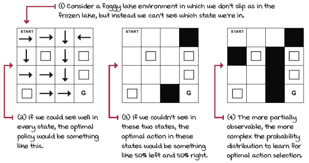

学习随机策略可能帮助我们摆脱困境

有趣的是，尽管我们在学习随机策略，但没有任何东西阻止学习算法接近确定性策略。这与基于价值的 方法不同，在训练过程中，我们必须通过某种概率强制进行探索以确保最优性。在具有随机策略的基于策略的方法中，探索被嵌入到学习函数中，并且在训练过程中对于给定状态收敛到确定性策略是可能的。

学习随机策略的另一个优点是，与表示价值函数相比，函数逼近表示策略可能更加直接。有时价值函数包含的信息过多，对于真正需要的信息来说是不必要的。可能计算状态或状态-动作对的精确价值是复杂或不必要的。

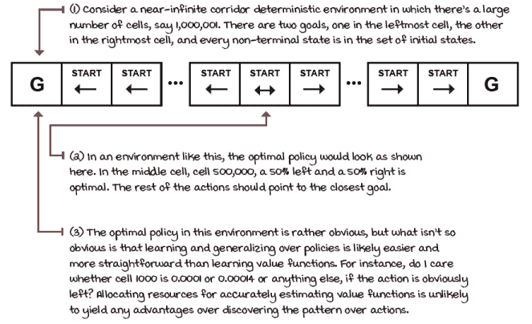

学习策略可能是一个更容易、更易于推广的问题来解决

最后要提到的一个优点是，由于策略是用连续值参数化的，动作概率会随着学习参数的变化而平滑地变化。因此，基于策略的方法通常具有更好的收敛特性。正如你从之前的章节中记得的那样，基于价值的方法容易产生振荡甚至发散。其中一个原因是价值函数空间中微小的变化可能意味着动作空间中显著的变化。动作的显著差异可以产生全新的轨迹，因此造成不稳定性。

在基于价值的方法中，我们使用激进的算子来改变价值函数；我们对 Q 值估计取最大值。在基于策略的方法中，我们相反地跟随随机策略相对于梯度，这只会逐渐和平滑地改变动作。如果你直接跟随策略的梯度，你将保证收敛到至少一个局部最优解。

|  | 我会说 Python 随机策略的离散动作空间 1/2 |
| --- | --- |
| |

```
class FCDAP(nn.Module): ①
    def __init__(self,
               input_dim,                                ②
                 output_dim,
                 hidden_dims=(32,32),
               init_std=1,
                 activation_fc=F.relu):
        super(FCDAP, self).__init__()
        self.activation_fc = activation_fc
        self.input_layer = nn.Linear( ③
            input_dim, hidden_dims[0])
        self.hidden_layers = nn.ModuleList() ④
        for i in range(len(hidden_dims)-1):
            hidden_layer = nn.Linear(
                hidden_dims[i], hidden_dims[i+1])
            self.hidden_layers.append(hidden_layer)
        self.output_layer = nn.Linear( ⑤
            hidden_dims[-1], output_dim)
    def forward(self, state): ⑥
        x = state
        if not isinstance(x, torch.Tensor): ⑦
            x = torch.tensor(x, dtype=torch.float32)
            x = x.unsqueeze(0)
        x = self.activation_fc(self.input_layer(x)) ⑧
        for hidden_layer in self.hidden_layers: ⑨
            x = self.activation_fc(hidden_layer(x))
        return self.output_layer(x) ⑩
```

① 这个类，FCDAP 代表全连接离散动作策略。② 参数允许你指定一个全连接架构、激活函数以及权重和偏差的最大幅度。③ `__init__` 函数在输入和第一个隐藏层之间创建线性连接。④ 然后，它创建所有隐藏层之间的连接。⑤ 最后，它将最终隐藏层连接到输出节点，创建输出层。⑥ 这里我们有处理正向功能的方法。⑦ 首先，我们确保状态是我们期望的类型和形状，然后我们才能将其通过网络。⑧ 接着，我们将格式正确的状态传递到输入层，然后通过激活函数。⑨ 然后，我们将第一个激活的输出传递到一系列隐藏层和相应的激活函数。⑩ 最后，我们获得输出，即 logits，对动作的偏好。 |

|  | 我会说 Python 离散动作空间的随机策略 1/2 |
| --- | --- |
|  |

```
       return self.output_layer(x) ⑪
    def full_pass(self, state): ⑫
        logits = self.forward(state) ⑬
        dist = torch.distributions.Categorical(logits=logits) ⑭
        action = dist.sample() ⑭
        logpa = dist.log_prob(action).unsqueeze(-1) ⑮
        entropy = dist.entropy().unsqueeze(-1) ⑯
        is_exploratory = action != np.argmax( \ ⑰
                                       logits.detach().numpy())
        return action.item(), is_exploratory.item(), \        ⑱
                                                 logpa, entropy
    def select_action(self, state): ⑲
        logits = self.forward(state)
        dist = torch.distributions.Categorical(logits=logits)
        action = dist.sample()
        return action.item()
    def select_greedy_action(self, state): ⑳
        logits = self.forward(state)
        return np.argmax(logits.detach().numpy())
```

⑪ 这一行重复了上一页的最后一行。⑫ 这里我们进行完整的正向传播。这是一个方便的函数，用于获取概率、动作以及训练所需的一切。⑬ 正向传播返回的是 logits，即对动作的偏好。⑭ 接下来，我们从概率分布中采样动作。⑮ 然后，计算该动作的对数概率并将其格式化为训练格式。⑯ 这里我们计算策略的熵。⑰ 在这里，为了统计，我们确定所选策略是探索性的还是不是。⑱ 最后，我们返回一个可以直接传递到环境中的动作，一个标志表示动作是否是探索性的，动作的对数概率以及策略的熵。⑲ 这是一个辅助函数，当我们只需要采样动作时使用。⑳ 这一个是为了根据策略选择贪婪动作。 |

### 直接学习策略

直接优化策略的主要优势是，嗯，这是正确的目标。我们学习一个直接优化价值函数的策略，而不学习价值函数，也不考虑环境的动态。这是如何可能的？让我来展示给你看。

|  | 展示数学推导策略梯度 |
| --- | --- |
|  | 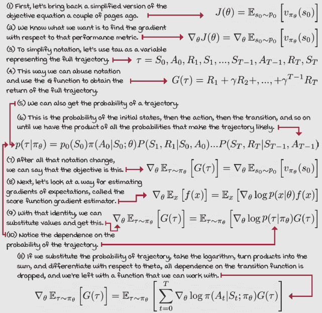 |

### 降低策略梯度的方差

有一种方法可以计算策略梯度，而无需了解任何关于环境转移函数的信息。这个算法增加了轨迹中所有动作的 log 概率，与完整回报的优良程度成正比。换句话说，我们首先收集一个完整的轨迹并计算完整的折现回报，然后使用这个分数来加权轨迹中每个动作的对数概率：*A*[*t*][*t*]，*A*[*t*+1]，...，*A*[T–1]。

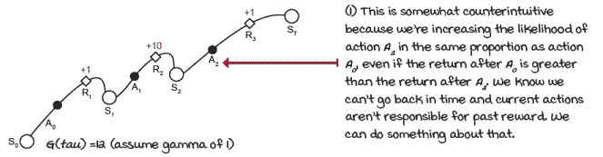

让我们只使用由动作产生的奖励

|  | 展示数学 Reducing the variance of the policy gradient |
| --- | --- |
|  | 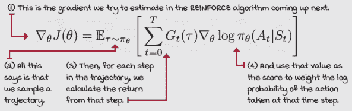 |
| 0001 | 一点历史介绍 REINFORCE 算法 |
|  | Ronald J. Williams 于 1992 年在一篇题为“Simple Statistical Gradient-Following Algorithms for Connectionist Reinforcement Learning”的论文中介绍了 REINFORCE 算法系列。1986 年，他与 Geoffrey Hinton 等人合著了一篇名为“Learning representations by back-propagating errors”的论文，这引发了当时人工神经网络（ANN）研究的发展。 |
|  | 我会说 PythonREINFORCE |
|  |

```
class REINFORCE(): ①
    <...>
    def optimize_model(self):
        T = len(self.rewards)
        discounts = np.logspace(0, T, num=T, base=self.gamma, ②
                                endpoint=False)
        returns = np.array( ③
                [np.sum(discounts[:T-t] * self.rewards[t:]) \ ④
                                            for t in range(T)])
        <...>
        policy_loss = -(discounts * returns * \             ⑤⑥
                                    self.logpas).mean()
        self.policy_optimizer.zero_grad()
        policy_loss.backward() ⑦
        self.policy_optimizer.step()
    def interaction_step(self, state, env): ⑧
        action, is_exploratory, logpa, _ = \
                             self.policy_model.full_pass(state)
        new_state, reward, is_terminal, _ = env.step(action)
        <...>
        return new_state, is_terminal
class REINFORCE():                                            ⑨
    <...>
    def train(self, make_env_fn, make_env_kargs, seed, gamma, ⑩
              max_minutes, max_episodes, goal_mean_100_reward):
        for episode in range(1, max_episodes + 1): ⑪
            state, is_terminal = env.reset(), False ⑫
            <...>                                             ⑫
            self.logpas, self.rewards = [], [] ⑫
            for step in count(): ⑬
                state, is_terminal = \
                             self.interaction_step(state, env)⑭
                if is_terminal:
                    break ⑭
            self.optimize_model() ⑮
    def evaluate(self, eval_policy_model,                     ⑯
                 eval_env, n_episodes=1,
               greedy=True):
        rs = []
        for _ in range(n_episodes):
            <...>
            for _ in count():
                if greedy:
                    a = eval_policy_model.\
                     select_greedy_action(s)
                else:
                  a = eval_policy_model.select_action(s)
                s, r, d, _ = eval_env.step(a)
                <...>
        return np.mean(rs), np.std(rs)
```

① 这就是 REINFORCE 算法。当你看到<...>时，这意味着为了简化，代码已被删除。请前往该章节的笔记本以获取完整的代码。② 首先，我们像所有蒙特卡洛方法一样计算折扣。具有这些参数的 logspace 函数返回每一步的伽玛序列；例如，[1, 0.99, 0.9801, ...]。③ 接下来，我们计算所有时间步的折扣回报总和。④ 为了强调，这是在每一时间步的回报，从时间步 0 的初始状态到终端 T-1 之前。⑤ 注意这里我们使用的是数学上正确的策略梯度更新，这并不是你通常能找到的。额外的折扣假设我们试图优化从初始状态期望的折扣回报，因此，在场景中较晚的回报会得到折扣。⑥ 这是策略损失；它是选择动作的对数概率，加权之后是选择该动作后获得的回报。注意，由于 PyTorch 默认使用梯度下降，并且我们希望最大化性能，所以我们使用性能的负平均值来翻转函数。把它看作是在性能上进行梯度上升。此外，我们考虑了折扣策略梯度，因此我们将回报乘以折扣。⑦ 在这三个步骤中，我们首先在优化器中将梯度置零，然后进行反向传播，然后沿着梯度的方向进行步进。⑧ 这个函数获取要传递给环境的动作以及所有训练所需的变量。⑨ 仍在探索 REINFORCE 类的功能⑩ 训练方法是训练代理的入口点。⑪ 我们首先通过循环遍历场景。⑫ 对于每个新的场景，我们初始化训练和统计所需的变量。⑬ 然后，对每个时间步执行以下操作。⑭ 首先，我们收集经验，直到达到终端状态。⑮ 然后，我们使用场景中所有时间步的批次运行一个优化步骤。⑯ 我还希望让你看到我在评估期间选择策略的方式。我并不是选择贪婪策略，而是从学习到的随机策略中进行采样。这里正确的做法取决于环境，但采样是安全的赌注。 |

## VPG：学习一个值函数

你在上一个部分学到的 REINFORCE 算法在简单问题中表现良好，并且有收敛保证。但由于我们使用完整的蒙特卡洛回报来计算梯度，其方差是一个问题。在本节中，我们将讨论几种处理这种方差的方法，这些方法被称为*纯策略梯度*或*带有基线的 REINFORCE*。

### 进一步减少策略梯度的方差

REINFORCE 是一个原则性的算法，但它具有很高的方差。你可能还记得第五章中关于蒙特卡洛目标的讨论，但让我们再重申一遍。沿着轨迹随机事件的累积，包括从初始状态分布中采样的初始状态——转换函数概率，但现在在本章中是具有随机策略的——是动作选择添加到混合中的随机性。所有这些随机性都累积在回报中，使其成为一个高方差信号，难以解释。

减少方差的一种方法是用部分回报而不是完整回报来改变动作的对数概率。我们已经实现了这一改进。但另一个问题是动作对数概率会随着回报的比例而变化。这意味着，如果我们收到一个显著的正面回报，导致该回报的动作概率会大幅增加。而如果回报是显著的负值，那么概率会大幅降低。

然而，想象一个像小车-杆这样的环境，其中所有奖励和回报都是正的。为了准确地区分可接受的动作和最佳动作，我们需要大量的数据。否则，方差很难被抑制。如果我们能够不用噪声回报，而用某种允许我们在相同状态下区分动作值的东西，那就方便多了。还记得吗？

|  | 刷新我的记忆使用策略梯度方法中的估计优势 |
| --- | --- |
|  | 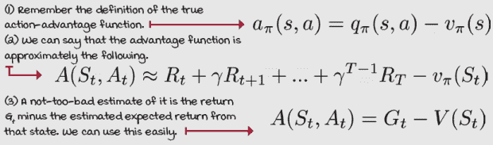 |

### 学习值函数

正如你在上一页看到的，我们可以通过使用动作优势函数的估计值来进一步减少策略梯度的方差，而不是实际回报。使用优势函数可以在一定程度上使分数围绕零中心；优于平均的动作有正分数，而低于平均的动作有负分数。前者会降低概率，而后者会增加概率。

我们将做的是确切如此。现在，让我们创建两个神经网络，一个用于学习策略，另一个用于学习状态值函数 V。然后，我们使用状态值函数和回报来计算优势函数的估计值，就像我们接下来看到的那样。

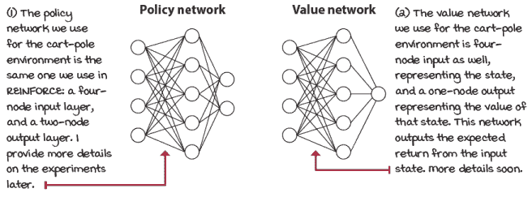

两个神经网络，一个用于策略，一个用于值函数

| ŘŁ | 带有强化学习口音的 REINFORCE、纯策略梯度、基线、演员-评论家 |
| --- | --- |
|  | 一些有先前 DRL 经验的人可能会想，这是所谓的“actor-critic”吗？它正在学习策略和值函数，所以看起来应该是这样的。不幸的是，这是那些“RL 口音”会混淆新手的那些概念之一。原因如下。首先，根据 RL 的一个创始人 Rich Sutton，策略梯度方法近似性能度量的梯度，无论它们是否学习近似值函数。然而，DRL 中最杰出的代表人物之一，Sutton 的前学生 David Silver，不同意这种说法。他说，基于策略的方法不会额外学习值函数，只有 actor-critic 方法才会。但是，Sutton 进一步解释说，只有使用自举学习值函数的方法才能被称为 actor-critic，因为自举会给值函数添加偏差，从而使其成为一个“critic”。我喜欢这种区分；因此，本书中介绍的 REINFORCE 和 VPG 不被视为 actor-critic 方法。但请注意术语，它并不一致。 |

### 鼓励探索

对策略梯度方法的一个基本改进是向损失函数中添加熵项。我们可以从许多不同的角度来解释熵，从从分布中采样可以获得的信息量到对集合进行排序的方式数。


我喜欢将熵想得很简单。均匀分布，即样本均匀分布，具有高熵，实际上是最高的。例如，如果你有两个样本，并且两者都有 50% 的概率被抽取，那么熵是两个样本集可能达到的最高值。如果你有四个样本，每个样本有 25% 的概率，熵是相同的，是四个样本集可能达到的最高值。相反，如果你有两个样本，一个有 100% 的概率，另一个有 0%，那么熵是最低的，总是零。在 PyTorch 中，使用自然对数来计算熵而不是二进制对数。这主要是因为自然对数使用欧拉数 e，使数学更“自然”。然而，从实际的角度来看，这并没有区别，效果是相同的。在有两个动作的 cart-pole 环境中，熵介于 0 和 0.6931 之间。

在策略梯度方法中使用熵的方法是将负加权熵添加到损失函数中，以鼓励动作分布均匀。这样，具有均匀分布动作的策略，即产生最高熵的策略，有助于最小化损失。另一方面，收敛到单个动作，即熵为零，不会减少损失。在这种情况下，智能体最好收敛到最优动作。

|  | 使用 VPG 的数学损失 |
| --- | --- |
|  | 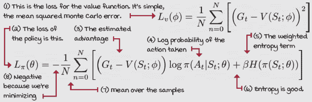 |
|  | 我会说 Python 状态值函数神经网络模型 |
|  |

```
class FCV(nn.Module): ①
    def __init__(self,
                 input_dim,
                 hidden_dims=(32,32), ②
                 activation_fc=F.relu):
        super(FCV, self).__init__()
        self.activation_fc = activation_fc
        self.input_layer = nn.Linear(input_dim,          ③
                                     hidden_dims[0])
        self.hidden_layers = nn.ModuleList()
        for i in range(len(hidden_dims)-1):
            hidden_layer = nn.Linear( ④
                hidden_dims[i], hidden_dims[i+1])
            self.hidden_layers.append(hidden_layer)
        self.output_layer = nn.Linear( ⑤
            hidden_dims[-1], 1) ⑤
    def forward(self, state): ⑥
        x = state
        if not isinstance(x, torch.Tensor):
            x = torch.tensor(x, dtype=torch.float32) ⑦
            x = x.unsqueeze(0)
        x = self.activation_fc(self.input_layer(x))
        for hidden_layer in self.hidden_layers: ⑧
            x = self.activation_fc(hidden_layer(x))
        return self.output_layer(x) ⑨
```

① 这是状态价值函数神经网络。它与过去我们使用的 Q 函数网络类似。② 注意我为你留下了方便的超参数，你可以随意调整。③ 在这里，我们在输入节点和第一个隐藏层之间创建线性连接。④ 在这里，我们在隐藏层之间创建连接。⑤ 在这里，我们将最后一个隐藏层连接到输出层，输出层只有一个节点，表示状态的价值。⑥ 这是前向传递函数。⑦ 这是按照我们期望的格式化输入。⑧ 进行完整的正向传递...⑨ ...并返回状态的价值。 |

|  | 我会说 PythonVanilla 策略梯度，即带有基线的 REINFORCE |
| --- | --- |
|  |

```
class VPG(): ①
    <...>                                                       ①
    def optimize_model(self):
        T = len(self.rewards)
        discounts = np.logspace(0, T, num=T, base=self.gamma,
                                endpoint=False)
        returns = np.array( ②
[np.sum(discounts[:T-t] * self.rewards[t:]) for t in range(T)])  ③
        value_error = returns - self.values
        policy_loss = -( ④
         discounts * value_error.detach() * self.logpas).mean()
        entropy_loss = -self.entropies.mean() ⑤
        loss = policy_loss + \
                        self.entropy_loss_weight * entropy_loss
        self.policy_optimizer.zero_grad()
        loss.backward() ⑥
        torch.nn.utils.clip_grad_norm_(
                               self.policy_model.parameters(),
                               self.policy_model_max_grad_norm)
        self.policy_optimizer.step() ⑦
        value_loss = value_error.pow(2).mul(0.5).mean()
        self.value_optimizer.zero_grad()
        value_loss.backward()
        torch.nn.utils.clip_grad_norm_( ⑧
                                self.value_model.parameters(),
                                self.value_model_max_grad_norm)
        self.value_optimizer.step()
```

① 这是 VPG 算法。我移除了很多代码，所以如果你想要完整的实现，请查看该章节的笔记本。② 这是一个计算从时间步 0 到 T 的折扣奖励总和的非常方便的方法。③ 我想强调的是，这个循环正在遍历所有步骤从 0，然后 1，2，3 一直到最后的状态*T*，并计算从该状态开始的回报，即从时间步 t 到最终状态*T*的折扣奖励总和。④ 首先，计算价值误差；然后使用它来评分动作的对数概率。然后，将这些概率折扣以与折扣策略梯度兼容。然后，使用负平均值。⑤ 计算熵，并将其添加到损失中。⑥ 现在，我们优化策略。将优化器置零，进行反向传播，然后（如果需要）裁剪梯度。⑦ 我们移动优化器。⑧ 最后，我们优化价值函数神经网络。 |

## A3C：并行策略更新

VPG 对于简单问题来说是一个相当稳健的方法；它大部分是无偏的，因为它使用无偏的目标来学习策略和价值函数。也就是说，它使用蒙特卡洛回报，这是在环境中直接体验到的完整实际回报，没有任何自举。整个算法中唯一的偏差是因为我们使用了函数逼近，这本身是有偏差的，但由于 ANN 只是用作基线以减少实际回报的方差，因此引入的偏差很小，如果有的话。

然而，避免有偏见的算法是必要的。通常，为了减少方差，我们会引入偏差。一种名为**异步优势演员-评论家**（A3C）的算法采取了一些措施来进一步减少方差。首先，它使用带有自举的*n*-步回报来学习策略和价值函数，其次，它使用并发演员并行生成一组广泛的经验样本。让我们深入了解细节。

### 使用演员工作者

在 DRL 算法中，方差的主要来源之一是在线样本的相关性和非平稳性。在基于价值的方法中，我们使用重放缓冲区来均匀地采样迷你批次的数据，这些数据大部分是独立且同分布的。不幸的是，使用这种经验重放方案来减少方差仅限于离策略方法，因为在线策略代理不能重用先前策略生成的数据。换句话说，每个优化步骤都需要一个新的在线经验批次。

与使用重放缓冲区不同，在策略方法中，例如我们在本章中学习的策略梯度算法，我们可以让多个工作员并行生成经验，并异步更新策略和价值函数。让多个工作员在环境的多个实例上并行生成经验，可以解耦用于训练的数据，并减少算法的方差。

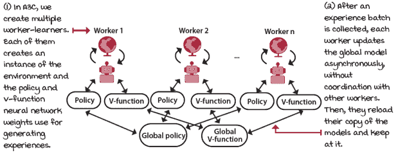

异步模型更新

|  | 我会说 PythonA3C 工作逻辑 1/2 |
| --- | --- |
|  |

```
class A3C(): ①
   <...>                                                      ②
    def work(self, rank): ③
        local_seed = self.seed + rank                         ④
        env = self.make_env_fn(
           **self.make_env_kargs, ⑤
           seed=local_seed)
        torch.manual_seed(local_seed)
        np.random.seed(local_seed) ⑥
        random.seed(local_seed)
        nS = env.observation_space.shape[0] ⑦
        nA = env.action_space.n
        local_policy_model = self.policy_model_fn(nS, nA)
        local_policy_model.load_state_dict( ⑧
                         self.shared_policy_model.state_dict())
        local_value_model = self.value_model_fn(nS)
        local_value_model.load_state_dict( ⑨
                          self.shared_value_model.state_dict())
        while not self.get_out_signal: ⑩
            state, is_terminal = env.reset(), False ⑪
            n_steps_start = 0 ⑫
            logpas, entropies, rewards, values = [], [], [], []
            for step in count(start=1): ⑬
```

① 这是 A3C 代理。② 如同往常，这些都是代码片段。您知道在哪里可以找到工作代码。③ 这是每个工作员循环的工作函数。rank 参数用作工作员的 ID。④ 看看我们如何为每个工作员创建一个唯一的种子。我们希望有各种各样的经验。⑤ 我们为每个工作员创建一个唯一种子的环境。⑥ 我们还使用这个唯一的种子为 PyTorch、NumPy 和 Python。⑦ 有用的变量⑧ 在这里，我们创建一个本地策略模型。看看我们如何用共享策略网络的权重初始化它的权重。这个网络允许我们定期同步代理。⑨ 我们对价值模型做同样的事情。注意我们不需要 nA 作为输出维度。⑩ 我们开始训练循环，直到工作员被信号通知退出。⑪ 首先，重置环境，并将完成或 is_terminal 标志设置为 false。⑫ 正如您接下来看到的，我们使用 *n*-步回报来训练策略和价值函数。⑬ 让我们在下一页继续。|

|  | 我会说 PythonA3C 工作逻辑 2/2 |
| --- | --- |
|  |

```
    for step in count(start=1):                                 ⑭ ⑮
        state, reward, is_terminal, is_truncated, \
           is_exploratory = self.interaction_step( ⑮
             state, env, local_policy_model,
             local_value_model, logpas,
             entropies, rewards, values)
        if is_terminal or step - n_steps_start == \             ⑯
                                              self.max_n_steps:
            is_failure = is_terminal and not is_truncated       ⑰
            next_value = 0 if is_failure else \                 ⑱
                       local_value_model(state).detach().item()
            rewards.append(next_value) ⑲
            self.optimize_model( ⑳
               logpas, entropies, rewards, values,
               local_policy_model, local_value_model)
            logpas, entropies, rewards, values = [], [], [], [] ㉑
            n_steps_start = step                                ㉑
        if is_terminal: ㉒
            break
<...>                                                           ㉓
```

⑭ 我从缩进中移除了八个空格，以便更容易阅读。⑮ 我们处于剧集循环中。首先，收集一步的经验。⑯ 我们收集 *n*-步的最大值。如果我们遇到终端状态，我们就停止。⑰ 我们检查是否触发了时间包装器或这是一个真正的终端状态。⑱ 如果是失败，则下一个状态的价值为 0；否则，我们进行引导。⑲ 看！我在这里偷偷地将下一个 _value 附加到奖励上。通过这样做，VPG 中的优化代码保持基本不变，您很快就会看到。确保您看到了。⑳ 接下来，我们优化模型。我们稍后会深入研究该函数。㉑ 优化步骤后，我们重置变量并继续。㉒ 当然，如果状态是终端状态，退出剧集循环。㉓ 有很多东西被移除了。|

### 使用 ***n***-步估计

在上一页，你注意到我将下一个状态（无论是否为终止状态）的值附加到奖励序列中。这意味着奖励变量包含了部分轨迹中所有奖励以及最后一个状态的状态值估计。我们也可以将其视为在相同位置具有部分回报和预测的剩余回报。部分回报是奖励的序列，预测的剩余回报是一个单一数值估计。唯一的原因是这并不是回报，因为它不是一个折现总和，但我们也可以处理这个问题。

你应该意识到这是一个 *n*-步回报，这是你在第五章中学到的。我们走出 *n*-步收集奖励，然后在第 *n* 个状态之后自举，或者如果我们落在终止状态，则在此之前，哪个先到就先做。

A3C 利用与蒙特卡洛回报相比的 *n*-步回报的较低方差。我们使用价值函数来预测用于更新策略的回报。你还记得自举可以减少方差，但会增加偏差。因此，我们在策略梯度算法中添加了一个评论家。欢迎来到演员-评论家方法的世界。

|  | 展示数学使用 *n*-步自举估计 |
| --- | --- |
|  | 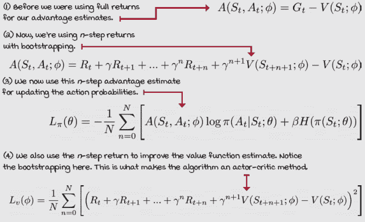 |
|  | 我会说 PythonA3C 优化步骤 1/2 |
|  |

```
class A3C(): ①
    <...>
    def optimize_model( ①
             self, logpas, entropies, rewards, values,
           local_policy_model, local_value_model):
        T = len(rewards) ②
        discounts = np.logspace(0, T, num=T, base=self.gamma, ③
                                endpoint=False)
        returns = np.array(
     [np.sum(discounts[:T-t] * rewards[t:]) for t in range(T)])  ④
        discounts = torch.FloatTensor(
                                 discounts[:-1]).unsqueeze(1) ⑤
        returns = torch.FloatTensor(returns[:-1]).unsqueeze(1)
        value_error = returns - values                          ⑥
        policy_loss = -(discounts * value_error.detach() * \
                                                 logpas).mean()
        entropy_loss = -entropies.mean() ⑦
        loss = policy_loss + self.entropy_loss_weight * \
                                                   entropy_loss
        self.shared_policy_optimizer.zero_grad()
        loss.backward() ⑧
        torch.nn.utils.clip_grad_norm_(
              local_policy_model.parameters(),                  ⑨
              self.policy_model_max_grad_norm)
        for param, shared_param in zip( ⑩
```

① A3C，优化函数② 首先获取奖励的长度。记住，奖励包括自举值。③ 接下来，我们计算到 *n*+1 的所有折扣。④ 现在就是 *n*-步预测回报。⑤ 为了继续，我们需要移除额外的元素，并按预期格式化变量。⑥ 现在，我们计算价值误差，即预测回报减去估计值。⑦ 我们像以前一样计算损失。⑧ 注意我们现在将共享策略优化器归零，然后计算损失。⑨ 然后，剪辑梯度幅度。⑩ 在下一页继续。 |

|  | 我会说 PythonA3C 优化步骤 2/2 |
| --- | --- |
|  |

```
        for param, shared_param in zip(                       ⑪
                      local_policy_model.parameters(),
                    self.shared_policy_model.parameters()): ⑪
            if shared_param.grad is None: ⑫
                shared_param._grad = param.grad
        self.shared_policy_optimizer.step() ⑬
        local_policy_model.load_state_dict( ⑭
                         self.shared_policy_model.state_dict())
        value_loss = value_error.pow(2).mul(0.5).mean() ⑮
        self.shared_value_optimizer.zero_grad() ⑯
        value_loss.backward() ⑰
        torch.nn.utils.clip_grad_norm_( ⑱
                                local_value_model.parameters(),
                                self.value_model_max_grad_norm)
        for param, shared_param in zip(
                         local_value_model.parameters(),
                       self.shared_value_model.parameters()):
            if shared_param.grad is None:
                shared_param._grad = param.grad               ⑲
        self.shared_value_optimizer.step() ⑳
        local_value_model.load_state_dict( ㉑
                          self.shared_value_model.state_dict())
```

⑪ 好的，那么看看这里。我们在这里做的是迭代所有局部和共享策略网络参数。⑫ 我们想要做的是将每个梯度从局部模型复制到共享模型。⑬ 一旦梯度被复制到共享优化器中，我们就运行一个优化步骤。⑭ 立即之后，我们将共享模型加载到局部模型中。⑮ 接下来，我们用状态值网络做同样的事情。计算损失。⑯ 将共享值优化器归零。⑰ 反向传播梯度。⑱ 然后，剪辑它们。⑲ 然后，将所有梯度从局部模型复制到共享模型。⑳ 步进优化器。㉑ 最后，将共享模型加载到局部变量中。 |

### 非阻塞模型更新

A3C 最关键的特点之一是其网络更新是异步和无锁的。拥有一个共享模型会使得有能力的软件工程师倾向于想要一个阻塞机制来防止工作者覆盖其他更新。有趣的是，A3C 使用了一种名为 Hogwild!的更新风格，它不仅实现了接近最优的收敛速率，而且比使用锁定的替代方案快一个数量级。

## GAE：鲁棒的优势估计

A3C 使用*n*-步回报来减少目标的方差。然而，正如你可能从第五章中记得的那样，还有一种更稳健的方法，它将多个*n*-步自举目标组合成一个单一的目标，从而创建比单个*n*-步更稳健的目标：*λ*-目标。广义优势估计（GAE）在 TD(*λ*)中的*λ*-目标类似，但用于优势。

### 广义优势估计

GAE 本身不是一个代理，而是一种估计优势函数目标的方法，大多数 actor-critic 方法都可以利用。更具体地说，GAE 使用*n*-步动作优势函数目标的指数加权组合，就像*λ*-目标是一组*n*-步状态值函数目标的指数加权组合一样。这种类型的目标，我们以与*λ*-目标相同的方式调整，可以显著减少策略梯度估计的方差，但会牺牲一些偏差。

|  | 展示数学可能的策略梯度估计器 |
| --- | --- |
|  | 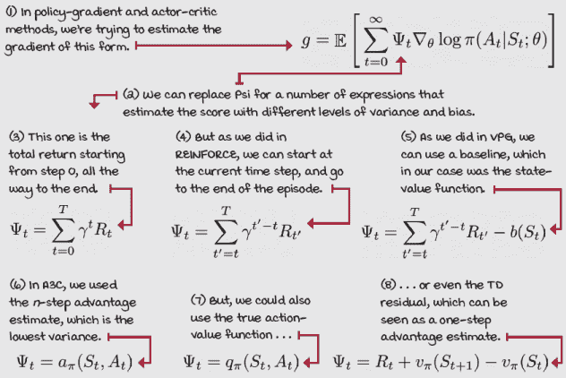 |
|  | 展示数学 GAE 是优势函数的鲁棒估计 |
|  | 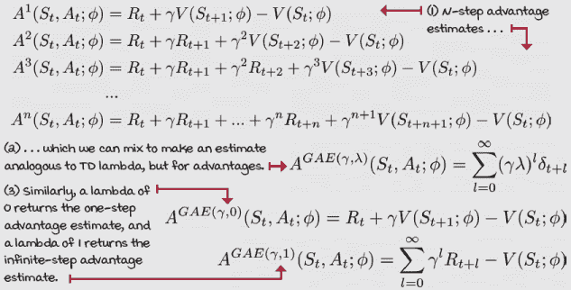 |
|  | 展示数学 GAE 的可能值目标 |
|  | 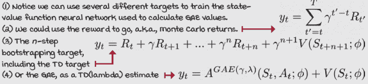 |
| 0001 | 一点历史介绍广义优势估计 |
|  | 约翰·舒尔曼（John Schulman）等人在 2015 年发表了一篇题为“使用广义优势估计进行高维连续控制”的论文，其中他介绍了 GAE。约翰是 OpenAI 的研究科学家，也是 GAE、TRPO 和 PPO 算法的主要发明者，这些算法你将在下一章中学习。2018 年，约翰因其创建这些算法而获得 35 岁以下创新者奖，这些算法至今仍然是业界最先进的。 |
|  | 我会说 PythonGAE 的策略优化步骤 |
|  |

```
class GAE():                                                  ①
    <...>
    def optimize_model(
            self, logpas, entropies, rewards, values,
            local_policy_model, local_value_model):
        T = len(rewards)
        discounts = np.logspace(0, T, num=T, base=self.gamma, ②
                                endpoint=False)
        returns = np.array(
     [np.sum(discounts[:T-t] * rewards[t:]) for t in range(T)])
        np_values = values.view(-1).data.numpy()
        tau_discounts = np.logspace(0, T-1, num=T-1, ③
                      base=self.gamma*self.tau, endpoint=False)
        advs = rewards[:-1] + self.gamma * \                  ④
                                 np_values[1:] - np_values[:-1]
        gaes = np.array( ⑤
[np.sum(tau_discounts[:T-1-t] * advs[t:]) for t in range(T-1)])
        <...>                                                 ⑥
        policy_loss = -(discounts * gaes.detach() * \
                                                 logpas).mean()
        entropy_loss = -entropies.mean()
        loss = policy_loss + self.entropy_loss_weight * \
                                                   entropy_loss
        value_error = returns - values                        ⑦
        value_loss = value_error.pow(2).mul(0.5).mean() ⑦
        <...>                                                 ⑦
```

① 这是 GAE 优化模型逻辑。② 首先，我们创建折扣回报，就像我们在 A3C 中所做的那样。③ 这两行首先创建一个包含所有状态值的 NumPy 数组，然后创建一个包含 *(gamma*lambd**a**)^t 的数组。注意，lambda 也常被称为 tau，我也在使用它。④ 这行创建一个 TD 误差数组：*R_t + gamma * value_t+1 - value_t，对于 t=0 到 T。*⑤ 这里我们通过乘以 tau 折扣和 TD 误差来创建 GAEs。⑥ 我们现在使用 gaes 来计算策略损失。⑦ 然后按常规进行。 |

## A2C: 同步策略更新

在 A3C 中，工作者异步更新神经网络。但，异步工作者可能并不是使 A3C 成为一个高性能算法的原因。优势演员-评论家（A2C）是 A3C 的同步版本，尽管编号较低，但它是 A3C 之后提出的，并且表现出与 A3C 相当的性能。在本节中，我们将探讨 A2C，以及我们可以应用于策略梯度方法的一些其他改动。

### 权重共享模型

对我们当前算法的一个改动是使用单个神经网络来处理策略和值函数。当从图像中学习时，共享模型可以特别有益，因为特征提取可能非常计算密集。然而，由于策略和值函数更新的可能不同规模，模型共享可能具有挑战性。

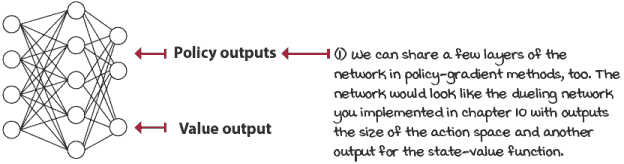

在策略和值输出之间共享权重

|  | 我会说 Python 共享权重演员-评论家神经网络模型 1/2 |
| --- | --- |
|  |

```
class FCAC(nn.Module): ①
    def __init__(
       self, input_dim, output_dim, 
       hidden_dims=(32,32), activation_fc=F.relu):
        super(FCAC, self).__init__()
        self.activation_fc = activation_fc
        self.input_layer = nn.Linear(input_dim, hidden_dims[0])
        self.hidden_layers = nn.ModuleList()
        for i in range(len(hidden_dims)-1): ②
            hidden_layer = nn.Linear(
                hidden_dims[i], hidden_dims[i+1])
            self.hidden_layers.append(hidden_layer)
        self.value_output_layer = nn.Linear( ③
```

① 这是一个全连接的演员-评论家模型。② 这是网络实例化过程。这与独立网络模型类似。③ 继续…… |

|  | 我会说 Python 共享权重演员-评论家神经网络模型 2/2 |
| --- | --- |
|  |

```
        self.value_output_layer = nn.Linear(
            hidden_dims[-1], 1)                               ④
        self.policy_output_layer = nn.Linear(
            hidden_dims[-1], output_dim)
    def forward(self, state):
        x = state                                             ⑤
        if not isinstance(x, torch.Tensor):
            x = torch.tensor(x, dtype=torch.float32)
            if len(x.size()) == 1:
                x = x.unsqueeze(0)
        x = self.activation_fc(self.input_layer(x))
        for hidden_layer in self.hidden_layers:
            x = self.activation_fc(hidden_layer(x))
        return self.policy_output_layer(x), \
               self.value_output_layer(x) ⑥
    def full_pass(self, state):
        logits, value = self.forward(state)
        dist = torch.distributions.Categorical(logits=logits)
        action = dist.sample()
        logpa = dist.log_prob(action).unsqueeze(-1)
        entropy = dist.entropy().unsqueeze(-1)
        action = action.item() if len(action) == 1 \
                                       else action.data.numpy()
        is_exploratory = action != np.argmax(
              logits.detach().numpy(), axis=int(len(state)!=1))
        return action, is_exploratory, logpa, entropy, value  ⑦
    def select_action(self, state):
        logits, _ = self.forward(state)
        dist = torch.distributions.Categorical(logits=logits)
        action = dist.sample()
        action = action.item() if len(action) == 1 \
                                       else action.data.numpy()
        return action                                         ⑧
```

④ 好的。这里就是构建的地方，值输出和政策输出都连接到隐藏层的最后一层。⑤ 前向传递首先通过重塑输入以匹配预期的变量类型和形状开始。⑥ 注意它从策略和值层输出。⑦ 这是一个方便的函数，可以一次性获取对数概率、熵和其他变量。⑧ 这选择给定状态或状态批次的动作或动作。 |

### 在策略更新中恢复秩序

以 Hogwild!风格更新神经网络可能会很混乱，但引入锁机制会显著降低 A3C 的性能。在 A2C 中，我们将工作者从代理移动到环境。我们不是有多个演员-学习者，而是有多个演员和一个学习者。结果证明，工作者推出经验是策略梯度方法中收益所在的地方。

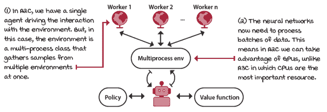

|  | 我会说 Python 多进程环境包装 1/2 |
| --- | --- |
|  |

```
class MultiprocessEnv(object):
    def __init__(self, make_env_fn,make_env_kargs,
                 seed, n_workers):
        self.make_env_fn = make_env_fn
        self.make_env_kargs = make_env_kargs
        self.seed = seed
        self.n_workers = n_workers
        self.pipes = [
                  mp.Pipe() for rank in range(self.n_workers)]①
        self.workers = [ ②
            mp.Process(target=self.work,
                     args=(rank, self.pipes[rank][1])) \
                             for rank in range(self.n_workers)]
        [w.start() for w in self.workers] ③
```

① 这是我们创建与工作者通信的管道并创建工作者的多进程环境类。② 这里我们创建工作者。③ 这里我们启动它们。|

|  | 我会说 Python 多进程环境包装器 2/2 |
| --- | --- |
|  |

```
        [w.start() for w in self.workers]                       ④
    def work(self, rank, worker_end):
        env = self.make_env_fn(
         **self.make_env_kargs, seed=self.seed + rank) ⑤
        while True: ⑥
            cmd, kwargs = worker_end.recv()
            if cmd == 'reset':
                worker_end.send(env.reset(**kwargs)) ⑦
            elif cmd == 'step':
                worker_end.send(env.step(**kwargs))
            elif cmd == '_past_limit':
                # Another way to check time limit truncation
                worker_end.send(\
                  env._elapsed_steps >= env._max_episode_steps)
            else:
                env.close(**kwargs) ⑦
                del env
                worker_end.close()
                break
    def step(self, actions): ⑧
        assert len(actions) == self.n_workers
        [self.send_msg(('step',{'action':actions[rank]}),rank)\ ⑨
                             for rank in range(self.n_workers)]
        results = []
        for rank in range(self.n_workers):                      ⑩
            parent_end, _ = self.pipes[rank]
            o, r, d, _ = parent_end.recv()
            if d:
                self.send_msg(('reset', {}), rank) ⑪
                o = parent_end.recv()
            results.append((o,                                  ⑫
                            np.array(r, dtype=np.float),
                          np.array(d, dtype=np.float), _))
        return \
            [np.vstack(block) for block in np.array(results).T]  ⑫
```

④ 续集⑤ 工作者首先创建环境。⑥ 进入这个循环监听命令。⑦ 每个命令调用相应的 env 函数并将响应发送回父进程。⑧ 这是主步骤函数，例如。⑨ 当被调用时，它向工作者广播命令和参数。⑩ 工作者完成他们的部分并发送数据，这些数据在这里收集。⑪ 我们在完成时自动重置。⑫ 最后，通过观察、奖励、完成和 infos 来附加和堆叠结果。|

|  | 我会说 PythonA2C 训练逻辑 |
| --- | --- |
|  |

```
class A2C():
    def train(self, make_envs_fn, make_env_fn, ①
              make_env_kargs, seed, gamma, max_minutes,
              max_episodes, goal_mean_100_reward):
        envs = self.make_envs_fn(make_env_fn, ②
                     make_env_kargs, self.seed,
                   self.n_workers)
        <...>
        self.ac_model = self.ac_model_fn(nS, nA) ③
        self.ac_optimizer = self.ac_optimizer_fn(
                           self.ac_model, self.ac_optimizer_lr)
        states = envs.reset() ④
        for step in count(start=1):
            states, is_terminals = \                            ⑤
                            self.interaction_step(states, envs)
            if is_terminals.sum() or \
                      step - n_steps_start == self.max_n_steps:
                past_limits_enforced = envs._past_limit()
                failure = np.logical_and(is_terminals,
                          np.logical_not(past_limits_enforced)) ⑤
                next_values = self.ac_model.evaluate_state( ⑤
                    states).detach().numpy() * (1 - failure)
                self.rewards.append(next_values)
                self.values.append(torch.Tensor(next_values))
                self.optimize_model()
                self.logpas, self.entropies = [], []
                self.rewards, self.values = [], []              ⑥
                n_steps_start = step
```

① 这是我们如何使用多处理器环境进行训练的方式。② 这里，看看如何创建，基本上，向量化的环境。③ 这里我们创建一个单一模型。这是一个具有策略和价值输出的演员-评论员模型。④ 看看，我们重置多处理器环境并获取一系列状态。⑤ 主要的是我们现在处理堆栈。⑥ 但，在其核心，一切都是相同的。|

|  | 我会说 PythonA2C 优化模型逻辑 |
| --- | --- |
|  |

```
class A2C(): ①
    def optimize_model(self):
        T = len(self.rewards)
        discounts = np.logspace(0, T, num=T, base=self.gamma,
                                endpoint=False)
        returns = np.array(
                     [[np.sum(discounts[:T-t] * rewards[t:, w])
                             for t in range(T)] \             ②
                             for w in range(self.n_workers)]) ②
        np_values = values.data.numpy()
        tau_discounts = np.logspace(0, T-1, num=T-1,
                    base=self.gamma*self.tau, endpoint=False)
        advs = rewards[:-1] + self.gamma * np_values[1:] \    ③
                                               - np_values[:-1]
        gaes = np.array(
            [[np.sum(tau_discounts[:T-1-t] * advs[t:, w]) \
                for t in range(T-1)]
     for w in range(self.n_workers)]) ④
        discounted_gaes = discounts[:-1] * gaes
        value_error = returns - values                        ⑤
        value_loss = value_error.pow(2).mul(0.5).mean()
        policy_loss = -(discounted_gaes.detach() * \
                                                 logpas).mean()
        entropy_loss = -entropies.mean()
        loss = self.policy_loss_weight * policy_loss + \      ⑤
                self.value_loss_weight * value_loss + \
                self.entropy_loss_weight * entropy_loss
        self.ac_optimizer.zero_grad()
        loss.backward() ⑥
        torch.nn.utils.clip_grad_norm_(
            self.ac_model.parameters(),
          self.ac_model_max_grad_norm)
        self.ac_optimizer.step()
```

① 这是我们如何在 A2C 中优化模型的方式。② 主要要注意的是，我们现在使用的是每个工作者的时间步向量矩阵。③ 一些操作以完全相同的方式进行，令人惊讶。④ 对于某些操作，我们只需要添加一个循环来包含所有工作者。⑤ 看看我们如何构建单个损失函数。⑥ 最后，我们优化单个神经网络。|

|  | 细节之处 Running all policy-gradient methods in the CartPole-v1 environment |
| --- | --- |

|  | 为了展示策略梯度算法，并使与之前章节中探索的基于价值的方法的比较更容易，我使用了与基于价值方法实验相同的配置进行了实验。以下是详细信息：REINFORCE：

+   运行具有 4-128-64-2 节点的策略网络，使用 Adam 优化器，学习率 lr 为 0.0007。

+   在每个回合结束时使用蒙特卡洛回报进行训练。没有基线。

VPG（使用蒙特卡洛基线的 REINFORCE）：

+   与 REINFORCE 相同的策略网络，但现在我们在损失函数中添加了一个熵项，权重为 0.001，并裁剪梯度范数为 1。

+   我们现在学习一个价值函数并将其用作基线，而不是作为评论员。这意味着 MC 回报在没有重新启动的情况下使用，价值函数仅减少回报的规模。价值函数使用 4-256-128-1 网络，RMSprop 优化器，学习率为 0.001。虽然没有梯度裁剪，但这是可能的。

A3C：

+   我们以完全相同的方式训练策略网络和价值网络。

+   我们现在每 50 步最多（或当达到终端状态时）重新启动回报。这是一个演员-评论员方法。

+   我们使用八个工人，每个工人都有网络的副本，并执行 Hogwild!更新。

GAE:

+   与其他算法相同的超参数。

+   主要区别在于 GAE 添加了一个 tau 超参数来折现优势。我们在这里使用 0.95 作为 tau。请注意，代理风格具有相同的*n*步自举逻辑，这可能不会使这是一个纯粹的 GAE 实现。通常，你会看到一次处理完整的批次。它仍然表现相当不错。

A2C:

+   A2C 确实改变了大多数超参数。首先，我们有一个单一的网络：4-256-128-3（2 和 1）。使用 Adam 进行训练，学习率为 0.002，梯度范数为 1。

+   策略权重为 1.0，价值函数为 0.6，熵为 0.001。

+   我们采用 10 步自举，八个工人，以及 0.95 的 tau。

这些算法并没有独立调优；我确信它们可以做得更好。|

|  | CartPole-v1 环境上的策略梯度法和演员-评论家方法汇总 |
| --- | --- |
|  | 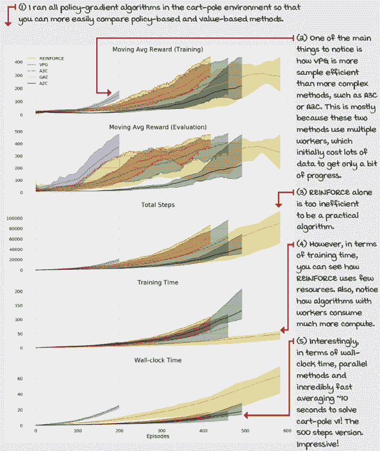 |

## 概述

在本章中，我们概述了策略梯度法和演员-评论家方法。首先，我们用几个理由来介绍考虑策略梯度法和演员-评论家方法。你了解到直接学习策略是强化学习方法的真正目标。你了解到通过学习策略，我们可以使用随机策略，这在部分可观察环境中可能比基于价值的方法表现更好。你了解到尽管我们通常学习随机策略，但没有任何东西阻止神经网络学习确定性策略。

你还学习了四种算法。首先，我们研究了 REINFORCE 及其如何是改进策略的直接方法。在 REINFORCE 中，我们可以使用完整的回报或奖励到去作为改进策略的分数。

然后，你学习了 vanilla 策略梯度，也称为带有基线的 REINFORCE。在这个算法中，我们使用蒙特卡洛回报作为目标来学习一个价值函数。然后，我们使用价值函数作为基线，而不是作为评论家。在 VPG 中我们不进行自举；相反，我们使用奖励到去，就像在 REINFORCE 中一样，并减去学习到的价值函数以减少梯度的方差。换句话说，我们使用优势函数作为策略分数。

我们还研究了 A3C 算法。在 A3C 中，我们自举价值函数，无论是为了学习价值函数还是为了评分策略。更具体地说，我们使用*n*步回报来改进模型。此外，我们使用多个演员-学习者，每个演员-学习者都执行策略，评估回报，并使用 Hogwild!方法更新策略和价值模型。换句话说，工人更新无锁模型。

我们接着学习了 GAE，以及这是如何估计类似于 *TD*(*λ*) 和 *λ*-回报的优势的方法。GAE 使用所有 *n*-步优势的指数加权混合，以创建一个更稳健的优势估计，可以轻松调整以使用更多的自举和因此偏差，或者实际的回报和因此方差。

最后，我们学习了 A2C 以及移除 A3C 的异步部分可以得到一个无需实现自定义优化器的相当算法。

到现在为止，

+   理解基于值、基于策略、策略梯度法和演员-评论家方法之间的主要区别

+   可以自己实现基本的策略梯度法和演员-评论家方法

+   可以调整策略梯度法和演员-评论家算法以通过各种环境

|  | 可分享的工作在自己的工作上努力，并分享你的发现 |
| --- | --- |

|  | 这里有一些关于如何将你所学的内容提升到下一个层次的想法。如果你愿意，与世界分享你的结果，并确保查看其他人做了什么。这是一个双赢的局面，希望你能充分利用它。

+   **#gdrl_ch11_tf01:** 在本章的早期，我提到了一个虚构的雾蒙蒙的湖环境，但嘿，它之所以是虚构的，是因为你还没有实现它，对吧？现在就去实现一个雾蒙蒙的湖环境，以及一个雾蒙蒙的冰冻湖环境。对于这个环境，确保传递给智能体的观察与环境的实际内部状态不同。例如，如果智能体位于单元格 3，内部状态是保密的，智能体只能观察到它位于一个雾蒙蒙的单元格中。在这种情况下，所有雾蒙蒙的单元格应该发出相同的观察，这样智能体就无法判断自己的位置。实现这个环境后，测试只能学习确定性策略的 DRL 智能体（如前几章所述），以及可以学习随机策略的智能体（如本章所述）。你将需要对观察进行 one-hot 编码，以便将其传递到神经网络中。创建一个包含环境的 Python 包，以及一个包含有趣的测试和结果的 Notebook。

+   **#gdrl_ch11_tf02:** 在本章中，我们仍然使用 CartPole-v1 环境作为测试平台，但你应该知道环境交换应该是简单的。首先，在类似的环境中测试相同的智能体，例如 LunarLander-v2 或 MountainCar-v0。注意使其相似的是观察是低维连续的，动作是低维离散的。其次，在不同的环境中测试它们，这些环境具有高维观察或动作。

+   **#gdrl_ch11_tf03:** 在每一章中，我都使用最后的标签作为通用的标签。请随意使用这个标签来讨论与本章相关的任何其他内容。没有比你自己创造的任务更令人兴奋的作业了。确保分享你为自己设定的研究内容和你的结果。

用你的发现写一条推文，@提及我 @mimoralea（我会转发），并使用列表中的特定标签来帮助感兴趣的人找到你的结果。没有对错之分；你分享你的发现并检查他人的发现。利用这个机会社交，做出贡献，让自己更受关注！我们正在等待你的到来！以下是一条推文示例：“嘿，@mimoralea。我创建了一篇博客文章，列出了学习深度强化学习的资源列表。查看它在这里 <link>。#gdrl_ch01_tf01”我会确保转发并帮助他人找到你的作品。 |
